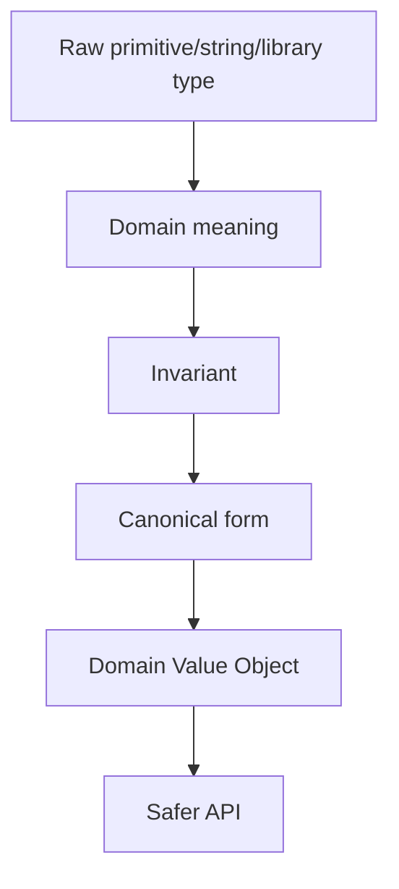
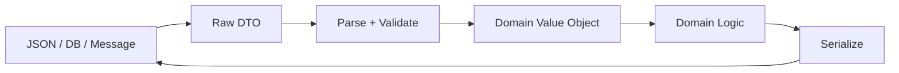

------
title: Learn Java Data Types, Type Semantics, Object Model & Data Representation - Part 028
description: Domain value objects and type-driven design in Java: semantic wrappers, invariants, records, immutability, validation placement, API boundaries, and production-grade modeling.
series: learn-java-data-types
seriesTitle: Learn Java Data Types, Type Semantics, Object Model & Data Representation
order: 28
partTitle: Domain Value Objects & Type-Driven Design
tags:
- java
- data-types
- value-objects
- domain-modeling
- type-driven-design
- records
- api-design
date: 2026-06-30
---

# Part 028 — Domain Value Objects & Type-Driven Design

> **Target:** setelah part ini, kamu mampu mendesain tipe domain kecil yang membuat sistem lebih benar: bukan hanya `String`, `long`, `BigDecimal`, atau `Instant`, tetapi `CaseNumber`, `Money`, `EffectivePeriod`, `ViolationCode`, `OfficerAssignment`, `RiskScore`, dan tipe domain lain yang membawa invariant.

Part sebelumnya membahas identifier. Part ini memperluas pola yang sama: **gunakan tipe untuk membawa makna, constraint, dan failure prevention**.

Ini bukan pembahasan DDD umum. Fokus kita adalah Java data type craftsmanship: bagaimana memilih `class`, `record`, `enum`, primitive, wrapper, collection, dan API boundary untuk membuat domain model yang sulit disalahgunakan.

Pendekatan Kaufman:

1. **Deconstruct the skill**: pisahkan value object design menjadi naming, invariant, construction, equality, immutability, normalization, boundary mapping, testing, dan evolution.
2. **Learn enough to self-correct**: gunakan failure-mode checklist.
3. **Remove barriers**: pakai template Java record/class yang reusable.
4. **Practice deliberately**: ubah primitive-heavy code menjadi semantic type model.

---

## 1. Core Mental Model

Value object adalah object yang identitasnya ditentukan oleh **nilai**, bukan object identity.

```java
record EmailAddress(String value) {}
```

Dua `EmailAddress` dengan value canonical yang sama dianggap sama:

```java
new EmailAddress("a@example.com").equals(new EmailAddress("a@example.com")); // true
```

Mental model:



A value object should answer:

- What does this value mean?
- What values are invalid?
- What normalization is allowed?
- How is equality defined?
- Is it immutable?
- How does it cross JSON/DB/message boundaries?

---

## 2. Primitive Obsession

Primitive obsession happens when the domain is represented mostly as primitives and generic library types.

Bad:

```java
record CaseRegistrationRequest(
    String tenantId,
    String caseNumber,
    String applicantEmail,
    String riskLevel,
    BigDecimal penaltyAmount,
    String currency,
    LocalDate effectiveFrom,
    LocalDate effectiveTo
) {}
```

This compiles even when values are semantically wrong:

- `tenantId` swapped with `caseNumber`
- invalid email
- risk level typo
- negative penalty amount
- currency mismatch
- invalid date range

Better:

```java
record CaseRegistrationRequest(
    TenantId tenantId,
    CaseNumber caseNumber,
    EmailAddress applicantEmail,
    RiskLevel riskLevel,
    Money penaltyAmount,
    EffectiveDateRange effectiveDateRange
) {}
```

Now the type system carries domain structure.

---

## 3. Type-Driven Design in Java

Java is not a dependent type language. It cannot express every invariant statically. But Java can still encode many important constraints using:

- `record` for immutable transparent data carriers
- `class` for behavior-rich value types or controlled construction
- `enum` for closed finite domains
- `sealed interface` for closed variant hierarchies
- private constructors + factories for parsing/validation
- package boundaries for construction control
- tests for invariants that the compiler cannot prove

Type-driven design means:

> Use the strongest practical type that matches the domain constraint without making the model unmaintainable.

---

## 4. Value Object vs Entity

| Aspect | Value Object | Entity |
|---|---|---|
| Equality | by value | by identity |
| Mutability | usually immutable | may change state over lifecycle |
| Lifecycle | no independent lifecycle | has lifecycle |
| Example | `Money`, `EmailAddress`, `DateRange` | `Customer`, `Case`, `Account` |
| Replacement | replace whole value | update entity state |

Example:

```java
record CaseId(UUID value) {}
record CaseNumber(String value) {}
record RiskScore(int value) {}
record Money(BigDecimal amount, Currency currency) {}
```

`CaseId` is a value object that identifies an entity. `Case` is the entity.

---

## 5. Why Records Are Useful for Value Objects

Records are concise, final, shallowly immutable, and have component-based `equals`, `hashCode`, and `toString`.

```java
record RiskScore(int value) {
    RiskScore {
        if (value < 0 || value > 100) {
            throw new IllegalArgumentException("risk score must be between 0 and 100");
        }
    }
}
```

This is a strong default for simple value objects.

But remember: record immutability is **shallow**.

Bad:

```java
record EvidenceBundle(List<String> fileNames) {}
```

If caller mutates the list, record value changes from outside.

Better:

```java
record EvidenceBundle(List<String> fileNames) {
    EvidenceBundle {
        fileNames = List.copyOf(fileNames);
    }
}
```

---

## 6. When to Use Class Instead of Record

Use class when you need:

- hidden representation
- multiple canonical forms
- cached derived values
- lazy computation
- stronger construction control
- non-component equality
- compatibility control
- complex invariants that should not expose raw fields

Example: phone number or normalized text may need hidden representation.

```java
public final class NormalizedName {
    private final String original;
    private final String normalized;

    private NormalizedName(String original, String normalized) {
        this.original = original;
        this.normalized = normalized;
    }

    public static NormalizedName of(String raw) {
        if (raw == null || raw.isBlank()) {
            throw new IllegalArgumentException("name is required");
        }
        String original = raw.trim();
        String normalized = original.toUpperCase(Locale.ROOT);
        return new NormalizedName(original, normalized);
    }

    public String original() {
        return original;
    }

    public String normalized() {
        return normalized;
    }

    @Override
    public boolean equals(Object o) {
        return o instanceof NormalizedName other
            && normalized.equals(other.normalized);
    }

    @Override
    public int hashCode() {
        return normalized.hashCode();
    }

    @Override
    public String toString() {
        return original;
    }
}
```

Record would expose both components as equality participants by default. Class gives more control.

---

## 7. The Value Object Design Template

Use this template before writing code.

```text
Type name:
Raw representation:
Domain meaning:
Valid range/shape:
Canonicalization:
Equality rule:
String representation:
Serialization form:
Persistence form:
Nullability:
Failure behavior:
Security/PII classification:
Evolution risk:
```

Example:

```text
Type name: CaseNumber
Raw representation: String
Domain meaning: human/legal case reference
Valid shape: CASE-yyyy-region-sequence
Canonicalization: trim + uppercase region
Equality: canonical string equality
String representation: canonical value
Serialization: scalar string
Persistence: varchar
Nullability: never null
Failure behavior: reject invalid format
Security: may reveal region/year/volume
Evolution: version format if rules change
```

---

## 8. Construction: Constructor vs Factory vs Parser

### 8.1 Constructor for Already-Typed Values

```java
record RiskScore(int value) {
    RiskScore {
        if (value < 0 || value > 100) {
            throw new IllegalArgumentException("risk score must be 0..100");
        }
    }
}
```

### 8.2 Factory for Semantic Creation

```java
record Percentage(BigDecimal value) {
    Percentage {
        if (value == null) throw new NullPointerException("value");
        if (value.compareTo(BigDecimal.ZERO) < 0 || value.compareTo(BigDecimal.valueOf(100)) > 0) {
            throw new IllegalArgumentException("percentage must be 0..100");
        }
    }

    static Percentage of(String raw) {
        return new Percentage(new BigDecimal(raw));
    }
}
```

### 8.3 Parser for External Text

```java
record CaseNumber(String value) {
    private static final Pattern PATTERN =
        Pattern.compile("CASE-[0-9]{4}-[A-Z]{3}-[0-9]{8}");

    CaseNumber {
        if (value == null) throw new NullPointerException("value");
        value = value.trim().toUpperCase(Locale.ROOT);
        if (!PATTERN.matcher(value).matches()) {
            throw new IllegalArgumentException("invalid case number");
        }
    }

    static CaseNumber parse(String raw) {
        return new CaseNumber(raw);
    }
}
```

Naming guideline:

| Method | Meaning |
|---|---|
| `of(...)` | create from trusted typed value |
| `parse(String)` | parse external string, may fail |
| `tryParse(String)` | return result/optional instead of throw |
| `unsafe(...)` | only for controlled internal reconstruction; use rarely |

---

## 9. Validation Placement

Validation belongs where the invariant is owned.

```java
record EffectiveDateRange(LocalDate from, LocalDate to) {
    EffectiveDateRange {
        if (from == null) throw new NullPointerException("from");
        if (to == null) throw new NullPointerException("to");
        if (to.isBefore(from)) {
            throw new IllegalArgumentException("to must not be before from");
        }
    }

    boolean contains(LocalDate date) {
        return !date.isBefore(from) && !date.isAfter(to);
    }
}
```

Do not scatter range validation everywhere:

```java
if (to.isBefore(from)) throw ... // repeated in many services
```

Centralize invariant in the type.

But avoid putting cross-aggregate/business workflow validation in small value objects.

Bad:

```java
record OfficerId(UUID value) {
    OfficerId {
        // Do not call database here to check officer is active.
    }
}
```

A value object should validate its own shape/invariant, not external state.

---

## 10. Canonicalization vs Validation

Validation rejects bad input. Canonicalization transforms equivalent input into one representation.

```java
record CountryCode(String value) {
    CountryCode {
        if (value == null) throw new NullPointerException("value");
        value = value.trim().toUpperCase(Locale.ROOT);
        if (!value.matches("[A-Z]{2}")) {
            throw new IllegalArgumentException("country code must be ISO-like alpha-2 shape");
        }
    }
}
```

Canonicalization must be intentional.

Danger:

```java
record UserName(String value) {
    UserName {
        value = value.toLowerCase(); // may be wrong if username is case-sensitive
    }
}
```

Checklist:

- Is input format case-sensitive?
- Are leading zeros meaningful?
- Is whitespace meaningful?
- Is Unicode normalization required?
- Does canonical form match DB unique index?
- Does canonicalization lose legally relevant original input?

Sometimes store both original and canonical.

---

## 11. Equality Design

For records, equality uses all components. That is usually correct for simple value objects.

```java
record Money(BigDecimal amount, Currency currency) {}
```

But `BigDecimal.equals` considers scale, so `1.0` and `1.00` are not equal. That may or may not be desired.

Safer canonicalization:

```java
record Money(BigDecimal amount, Currency currency) {
    Money {
        if (amount == null) throw new NullPointerException("amount");
        if (currency == null) throw new NullPointerException("currency");
        amount = amount.setScale(currency.getDefaultFractionDigits(), RoundingMode.UNNECESSARY);
    }
}
```

Now equality becomes predictable if all amounts use canonical scale.

If equality cannot be component-based, use class.

---

## 12. Value Object and `toString()`

`toString()` can be:

- canonical scalar representation
- diagnostic representation
- redacted representation

Do not mix them accidentally.

For harmless scalar value:

```java
record CaseId(UUID value) {
    @Override
    public String toString() {
        return value.toString();
    }
}
```

For sensitive value:

```java
record NationalId(String value) {
    @Override
    public String toString() {
        return "NationalId[****]";
    }
}
```

If you need canonical external representation, expose explicit method:

```java
String asExternalString() {
    return value;
}
```

This avoids accidentally logging PII through `toString()`.

---

## 13. Boundary Mapping

Domain type:

```java
record EmailAddress(String value) {}
```

API DTO:

```java
record ApplicantRequest(String email) {}
```

Mapping:

```java
EmailAddress email = EmailAddress.parse(request.email());
```

Do not let external DTOs become your domain model:

```java
record Applicant(String email) {} // weak domain
```

Boundary rule:

> Convert raw external data into domain value objects as early as possible, and convert domain value objects back to scalar DTOs as late as possible.



---

## 14. Error Strategy

Value object creation can fail.

Options:

### 14.1 Throw Exception

Good for programmer error or trusted boundaries.

```java
new RiskScore(150); // IllegalArgumentException
```

### 14.2 Return Result Type

Useful at API/user input boundary.

```java
sealed interface ParseResult<T> {
    record Valid<T>(T value) implements ParseResult<T> {}
    record Invalid<T>(String message) implements ParseResult<T> {}
}
```

```java
static ParseResult<CaseNumber> tryParse(String raw) {
    try {
        return new ParseResult.Valid<>(new CaseNumber(raw));
    } catch (IllegalArgumentException ex) {
        return new ParseResult.Invalid<>(ex.getMessage());
    }
}
```

### 14.3 Accumulate Multiple Errors

For form validation, you may need to return all errors. Do not force every value object to know the whole form. Compose validation at boundary.

---

## 15. Composition of Value Objects

Small value objects compose into richer value objects.

```java
record CurrencyCode(String value) {}
record Amount(BigDecimal value) {}

record Money(Amount amount, CurrencyCode currency) {}
```

But avoid too many layers when they add no invariant.

Bad abstraction:

```java
record StringValue(String value) {}
record TextValue(StringValue value) {}
record Name(TextValue value) {}
```

Each wrapper should add one of:

- semantic distinction
- validation
- canonicalization
- behavior
- boundary control
- stronger type safety

---

## 16. Closed Domain Types with Enum

Use enum for finite stable sets.

```java
enum RiskLevel {
    LOW,
    MEDIUM,
    HIGH,
    CRITICAL
}
```

If external code must be stable, add explicit code:

```java
enum RiskLevel {
    LOW("low"),
    MEDIUM("medium"),
    HIGH("high"),
    CRITICAL("critical");

    private final String code;

    RiskLevel(String code) {
        this.code = code;
    }

    String code() {
        return code;
    }
}
```

Do not persist `ordinal()`.

---

## 17. Open Domain Types with Value Object

If values can be added by configuration, regulation, or partner systems, enum may be too closed.

```java
record ViolationCode(String value) {
    ViolationCode {
        if (value == null || value.isBlank()) {
            throw new IllegalArgumentException("violation code is required");
        }
        value = value.trim().toUpperCase(Locale.ROOT);
    }
}
```

Then validate allowed values at a catalog/policy layer, not necessarily in the type constructor.

---

## 18. Sealed Types for Domain Variants

Use sealed interfaces when a value can have a closed set of shapes.

```java
sealed interface Penalty permits MonetaryPenalty, WarningPenalty, SuspensionPenalty {}

record MonetaryPenalty(Money amount) implements Penalty {}
record WarningPenalty(String reason) implements Penalty {}
record SuspensionPenalty(Period duration) implements Penalty {}
```

This is stronger than:

```java
record Penalty(String type, BigDecimal amount, String reason, Integer days) {}
```

The latter allows invalid combinations.

```mermaid
classDiagram
    class Penalty <<sealed interface>>
    Penalty <|-- MonetaryPenalty
    Penalty <|-- WarningPenalty
    Penalty <|-- SuspensionPenalty
```

---

## 19. Illegal States Unrepresentable

Bad model:

```java
record CaseDecision(
    boolean approved,
    String rejectionReason
) {}
```

Invalid states:

- `approved = true`, reason present
- `approved = false`, reason missing

Better:

```java
sealed interface CaseDecision permits Approved, Rejected {}

record Approved(OfficerId approvedBy, Instant approvedAt) implements CaseDecision {}
record Rejected(OfficerId rejectedBy, Instant rejectedAt, RejectionReason reason) implements CaseDecision {}
```

This moves correctness from runtime convention into type shape.

---

## 20. Time-Based Value Objects

From previous parts, time types have different semantics. Wrap them when domain meaning matters.

```java
record SubmissionDeadline(ZonedDateTime value) {
    SubmissionDeadline {
        if (value == null) throw new NullPointerException("value");
    }

    boolean isMissedAt(Instant now) {
        return now.isAfter(value.toInstant());
    }
}
```

Better for date range:

```java
record EffectivePeriod(LocalDate startInclusive, LocalDate endExclusive) {
    EffectivePeriod {
        if (startInclusive == null) throw new NullPointerException("startInclusive");
        if (endExclusive == null) throw new NullPointerException("endExclusive");
        if (!endExclusive.isAfter(startInclusive)) {
            throw new IllegalArgumentException("endExclusive must be after startInclusive");
        }
    }

    boolean contains(LocalDate date) {
        return !date.isBefore(startInclusive) && date.isBefore(endExclusive);
    }
}
```

Using exclusive end often simplifies interval composition.

---

## 21. Number-Based Value Objects

### 21.1 Risk Score

```java
record RiskScore(int value) implements Comparable<RiskScore> {
    RiskScore {
        if (value < 0 || value > 100) {
            throw new IllegalArgumentException("risk score must be between 0 and 100");
        }
    }

    boolean isHigh() {
        return value >= 70;
    }

    @Override
    public int compareTo(RiskScore other) {
        return Integer.compare(this.value, other.value);
    }
}
```

### 21.2 Percentage

```java
record Percentage(BigDecimal value) {
    Percentage {
        if (value == null) throw new NullPointerException("value");
        if (value.compareTo(BigDecimal.ZERO) < 0 || value.compareTo(BigDecimal.valueOf(100)) > 0) {
            throw new IllegalArgumentException("percentage must be between 0 and 100");
        }
        value = value.stripTrailingZeros();
    }
}
```

Be careful with `stripTrailingZeros()` if persistence or equality scale matters.

---

## 22. Collection-Based Value Objects

A collection value object should control mutability.

```java
record EvidenceFiles(List<EvidenceFileId> values) {
    EvidenceFiles {
        if (values == null) throw new NullPointerException("values");
        values = List.copyOf(values);
        if (values.isEmpty()) {
            throw new IllegalArgumentException("at least one evidence file is required");
        }
    }

    int count() {
        return values.size();
    }
}
```

Remember `List.copyOf` makes the list unmodifiable, not the elements deeply immutable. Element types must also be safe.

---

## 23. Value Object and Versioning

Value objects in APIs/events are long-lived contracts.

Bad event:

```java
record CaseOpenedEvent(String caseNumber) {}
```

If case number format changes, consumers may break.

Better:

```java
record CaseOpenedEvent(
    String caseId,
    String caseNumber,
    int schemaVersion
) {}
```

Inside domain:

```java
record CaseOpened(CaseId caseId, CaseNumber caseNumber) {}
```

Boundary DTO can version representation without weakening domain model.

---

## 24. Persistence and ORM Considerations

ORM frameworks often prefer simple types, no-arg constructors, mutable fields, or converters. Do not let that dictate your core domain model prematurely.

Possible mapping approach:

```java
record CaseId(UUID value) {}
```

Persistence entity:

```java
class CaseEntity {
    UUID caseId;
    String caseNumber;
}
```

Mapper:

```java
CaseId toDomainId(UUID value) {
    return new CaseId(value);
}

UUID toPersistence(CaseId id) {
    return id.value();
}
```

Another approach is attribute converters, but keep conversion explicit and tested.

---

## 25. API Design with Value Objects

Internal method:

```java
Case assignOfficer(CaseId caseId, OfficerId officerId, AssignmentReason reason)
```

External DTO:

```java
record AssignOfficerRequest(
    String officerId,
    String reason
) {}
```

Controller boundary:

```java
CaseId caseId = CaseId.parse(pathCaseId);
OfficerId officerId = OfficerId.parse(request.officerId());
AssignmentReason reason = new AssignmentReason(request.reason());
```

Do not expose domain records blindly if you need stable API control.

---

## 26. Naming Value Objects

Good names encode semantics:

| Weak | Strong |
|---|---|
| `String id` | `CaseId` |
| `String code` | `ViolationCode` |
| `BigDecimal amount` | `Money` or `PenaltyAmount` |
| `int days` | `ReviewWindowDays` |
| `LocalDate date` | `EffectiveDate` |
| `boolean active` | `CaseLifecycleStatus` |
| `String reason` | `RejectionReason` |

Avoid suffixing everything with `Value`. The domain concept should be the name.

---

## 27. Behavior Belongs Near the Value

A value object can have behavior.

```java
record BusinessDays(int value) {
    BusinessDays {
        if (value < 0) throw new IllegalArgumentException("business days must not be negative");
    }

    LocalDate after(LocalDate start, BusinessCalendar calendar) {
        return calendar.addBusinessDays(start, value);
    }
}
```

This is better than scattering arithmetic:

```java
LocalDate due = calendar.addBusinessDays(start, reviewWindowDays);
```

where `reviewWindowDays` is just an `int` with unclear semantics.

---

## 28. Avoid Anemic Wrappers Without Payoff

Not every primitive needs a wrapper.

A wrapper is justified when it provides at least one of:

- prevents parameter swap
- validates invalid values
- canonicalizes representation
- protects sensitive data
- provides domain behavior
- clarifies unit
- controls serialization
- improves equality correctness
- separates trust boundaries

Example weak wrapper:

```java
record Description(String value) {}
```

Maybe useful if it validates length/PII/HTML. Otherwise it may be noise.

Better:

```java
record EnforcementSummary(String value) {
    EnforcementSummary {
        if (value == null || value.isBlank()) {
            throw new IllegalArgumentException("summary is required");
        }
        if (value.length() > 2_000) {
            throw new IllegalArgumentException("summary too long");
        }
    }
}
```

---

## 29. Production Failure Catalog

| Failure | Primitive-heavy root cause | Type-driven fix |
|---|---|---|
| Officer ID passed as case ID | both were `String`/`UUID` | semantic wrappers |
| Negative penalty accepted | raw `BigDecimal` | `Money` / `PenaltyAmount` invariant |
| Rejection without reason | nullable string + boolean | sealed decision type |
| Effective date inverted | two loose `LocalDate`s | `EffectivePeriod` |
| Duplicate external code | normalization mismatch | canonical value object + DB constraint |
| PII leaked in logs | sensitive value `toString()` | redacted value object |
| Currency mismatch | amount and currency separated | `Money` type |
| Invalid enum from partner breaks consumer | closed enum at boundary | raw external code + mapping layer |
| Mutable list changed after construction | record with mutable component | defensive copy |
| Leading zeros lost | parsed ID as number | string value object |

---

## 30. Refactoring Workflow

When you see primitive-heavy code:

```java
void imposePenalty(String caseId, BigDecimal amount, String currency, String reason) {}
```

Refactor in steps:

### Step 1 — Identify semantic primitives

```text
caseId -> CaseId
amount + currency -> Money
reason -> PenaltyReason
```

### Step 2 — Create value objects

```java
record CaseId(UUID value) {}
record PenaltyReason(String value) {}
record Money(BigDecimal amount, Currency currency) {}
```

### Step 3 — Move invariant into type

```java
record PenaltyReason(String value) {
    PenaltyReason {
        if (value == null || value.isBlank()) {
            throw new IllegalArgumentException("penalty reason is required");
        }
    }
}
```

### Step 4 — Update method signature

```java
void imposePenalty(CaseId caseId, Money amount, PenaltyReason reason) {}
```

### Step 5 — Move parsing to boundary

```java
CaseId caseId = CaseId.parse(pathCaseId);
Money money = Money.of(request.amount(), request.currency());
PenaltyReason reason = new PenaltyReason(request.reason());
```

---

## 31. Testing Value Objects

Test categories:

1. valid construction
2. invalid construction
3. canonicalization
4. equality/hashCode
5. boundary parse/format
6. serialization mapping
7. edge values
8. immutability/defensive copy

Example:

```java
@Test
void rejectsInvalidRiskScore() {
    assertThrows(IllegalArgumentException.class, () -> new RiskScore(-1));
    assertThrows(IllegalArgumentException.class, () -> new RiskScore(101));
}

@Test
void canonicalizesCaseNumber() {
    assertEquals(
        new CaseNumber("CASE-2026-JKT-00000001"),
        new CaseNumber(" case-2026-jkt-00000001 ")
    );
}
```

For collection value object:

```java
@Test
void defensivelyCopiesInputList() {
    List<EvidenceFileId> source = new ArrayList<>();
    source.add(new EvidenceFileId(UUID.randomUUID()));

    EvidenceFiles files = new EvidenceFiles(source);
    source.add(new EvidenceFileId(UUID.randomUUID()));

    assertEquals(1, files.values().size());
}
```

---

## 32. Review Checklist

Before approving a domain value object:

- Does the name encode domain meaning?
- Is the raw representation hidden or intentionally exposed?
- Are null rules explicit?
- Are invalid values rejected?
- Is canonicalization safe and documented?
- Is equality correct?
- Is hashCode stable?
- Is the object immutable or defensively copied?
- Does `toString()` leak sensitive data?
- Is serialization form stable?
- Is persistence conversion explicit?
- Does it avoid external I/O in constructor?
- Does it avoid depending on mutable global state?
- Does it encode only local invariant, not workflow policy?
- Does it reduce real risk, or only add ceremony?

---

## 33. Deliberate Practice

### Exercise 1 — Refactor Primitive Request

Refactor:

```java
record CreatePenaltyRequest(
    String caseId,
    BigDecimal amount,
    String currency,
    String reason,
    LocalDate effectiveFrom,
    LocalDate effectiveTo
) {}
```

Create domain types for:

- `CaseId`
- `Money`
- `PenaltyReason`
- `EffectivePeriod`

### Exercise 2 — Model Decision Without Boolean Trap

Replace:

```java
record ReviewResult(boolean passed, String failureReason) {}
```

with a sealed model that cannot represent invalid combinations.

### Exercise 3 — Sensitive Value Object

Design `NationalIdentifier` such that:

- it validates non-blank input
- stores canonical value
- `toString()` redacts
- explicit `asPlainTextForAuthorizedUse()` exists

Explain where authorization should happen.

### Exercise 4 — Catalog Code

Model `ViolationCode` where the shape can be validated locally, but actual allowed codes come from a catalog service.

---

## 34. Part Summary

Value objects are one of the highest ROI techniques in Java domain modeling.

Key takeaways:

- Primitive obsession makes domain mistakes compile.
- Records are excellent default value object carriers, but immutability is shallow.
- Use class when representation/equality/construction must be controlled.
- Validate local invariants inside the type.
- Keep external state/workflow policy outside small value constructors.
- Canonicalization must be explicit and safe.
- Use enum for stable closed domains, value objects for open domains, sealed types for closed variants.
- Boundary DTOs should be raw; domain logic should use semantic types.
- Value objects should prevent real production failure modes, not merely add ceremony.

---

## References

- Java SE 25 API — `java.lang.Record`: https://docs.oracle.com/en/java/javase/25/docs/api/java.base/java/lang/Record.html
- Java SE 25 API — `java.lang.Class` record class metadata: https://docs.oracle.com/en/java/javase/25/docs/api/java.base/java/lang/Class.html
- Java Language Specification, Java SE 25: https://docs.oracle.com/javase/specs/jls/se25/html/index.html
- Java SE 25 API — `java.math.BigDecimal`: https://docs.oracle.com/en/java/javase/25/docs/api/java.base/java/math/BigDecimal.html
- Java SE 25 API — `java.util.List`: https://docs.oracle.com/en/java/javase/25/docs/api/java.base/java/util/List.html
