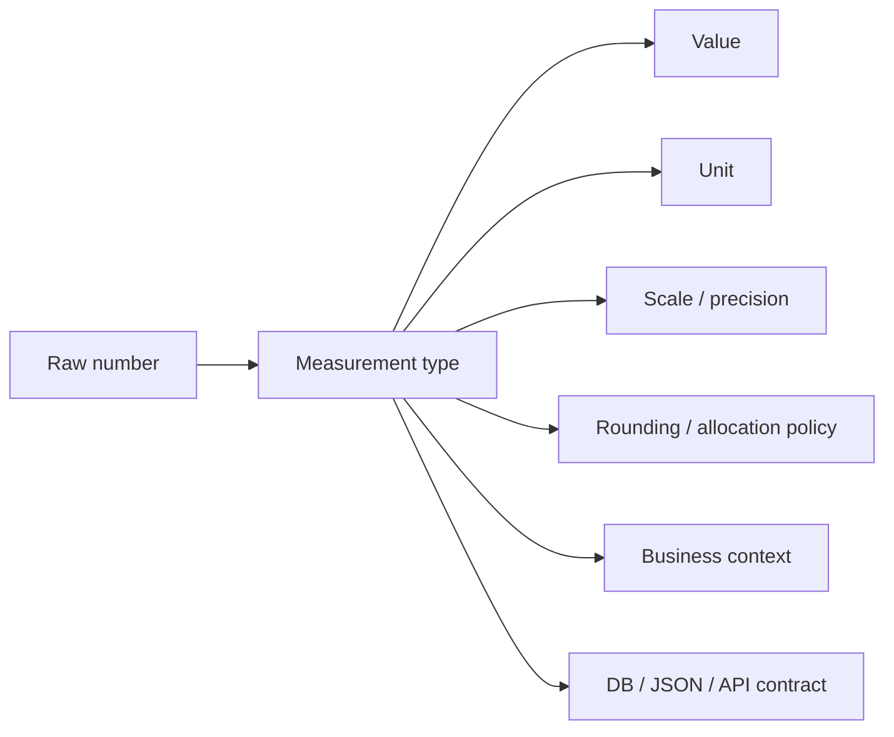
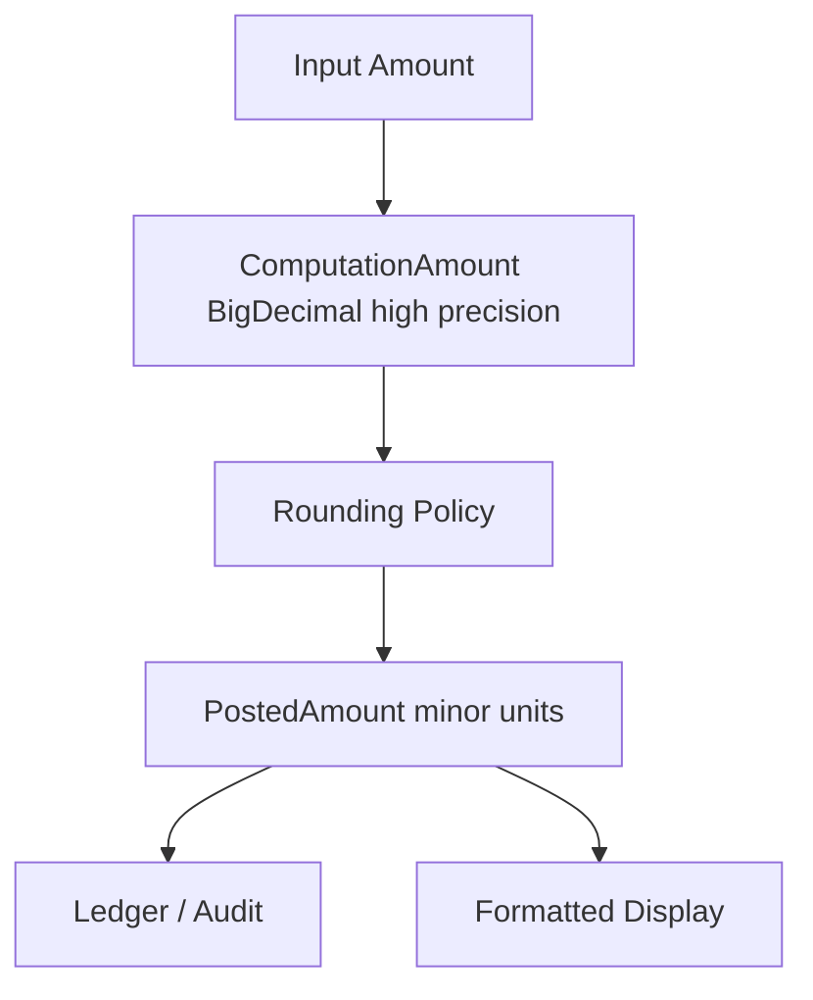

# Part 029 — Money, Quantity, Percentage, Rate & Measurement Types

> Target: setelah part ini, kita tidak lagi melihat angka domain sebagai `BigDecimal`, `long`, atau `double` mentah. Kita melihatnya sebagai **measurement type**: nilai + unit + konteks + policy + invariant.

Part sebelumnya sudah membahas `BigDecimal`, `BigInteger`, `java.time`, identifier, dan domain value object. Part ini menyatukan semuanya untuk satu kelas masalah enterprise yang paling sering menimbulkan bug mahal: **angka yang punya makna bisnis**.

Contoh angka yang tampak sederhana tetapi berbahaya:

```java
BigDecimal amount = new BigDecimal("100.00");
int percent = 15;
long quantity = 10;
double rate = 0.075;
```

Kode di atas belum menjawab:

- `amount` dalam currency apa?
- `100.00` itu nominal, net, gross, outstanding, available, reserved, atau disputed?
- `percent = 15` berarti 15%, 0.15, 15 basis points, atau multiplier 15x?
- `quantity = 10` satuannya apa? item, kg, byte, second, request, page, case, customer?
- `rate = 0.075` rate per apa? per year, per month, per day, per transaction, per call, per GB?
- rounding dilakukan kapan dan oleh policy siapa?
- angka ini boleh negatif atau tidak?
- angka ini exact, estimated, measured, averaged, prorated, atau capped?

Top 1% engineer tidak berhenti di “pakai `BigDecimal` untuk uang”. Mereka mendesain **sistem tipe domain** yang membuat bug angka menjadi sulit terjadi.

---

## 1. Kaufman Skill Map

Dalam framework Josh Kaufman, skill ini kita pecah menjadi subskill kecil yang bisa dilatih cepat.

| Subskill | Pertanyaan desain |
|---|---|
| Recognize measurement | Apakah angka ini punya unit, currency, scale, periode, atau policy? |
| Separate representation from meaning | Apakah `BigDecimal` hanya storage internal atau sudah menjadi domain type? |
| Model unit explicitly | Apakah unit ikut value object atau cuma tersirat di nama field? |
| Model rounding policy | Apakah rounding deterministic, documented, dan testable? |
| Model percentage/rate correctly | Apakah ratio, percentage display, basis point, dan multiplier dibedakan? |
| Model boundary contract | Apakah JSON/DB/API mempertahankan precision, unit, currency, dan semantic? |
| Prevent primitive obsession | Apakah parameter method bisa tertukar karena sama-sama `BigDecimal`/`long`? |
| Test edge cases | Apakah zero, negative, max, scale, currency mismatch, timezone/effective-date diuji? |

Skill performa yang kita incar:

> Diberi sebuah domain rule berbasis angka, kita mampu memilih tipe Java yang tepat, mendesain value object, menentukan invariant, memilih rounding strategy, mendefinisikan format persistence/API, dan menulis test yang menangkap bug numeric sebelum production.

---

## 2. Mental Model: Domain Number Is Not Just a Number

Angka matematika punya nilai. Angka domain punya **makna operasional**.



Contoh:

```java
record Money(BigDecimal amount, Currency currency) {}
record Percentage(BigDecimal ratio) {}
record Quantity(BigDecimal value, Unit unit) {}
record AnnualRate(BigDecimal ratio) {}
record StorageSize(long bytes) {}
record DurationLimit(Duration duration) {}
```

`BigDecimal` adalah representasi numerik. `Money`, `Percentage`, `Quantity`, dan `Rate` adalah **tipe domain**.

Perbedaan ini penting karena method berikut lemah:

```java
void applyDiscount(BigDecimal price, BigDecimal discount, BigDecimal taxRate) { }
```

Pemanggil bisa menukar urutan argumen tanpa compile error:

```java
applyDiscount(taxRate, discount, price); // compiles, semantically broken
```

Tipe domain mempersempit kemungkinan salah:

```java
void applyDiscount(Money price, Percentage discount, TaxRate taxRate) { }
```

---

## 3. Taxonomy: Jenis Angka Domain

Tidak semua angka domain sama.

| Jenis | Contoh | Representasi umum | Invariant utama |
|---|---|---|---|
| Money | invoice amount, fee, balance | `BigDecimal` + `Currency` | currency match, scale, rounding |
| Quantity | 10 kg, 3 item, 50 GB | decimal/integer + unit | unit compatible, non-negative |
| Count | number of cases, retry attempts | `int`/`long` | whole number, bounded |
| Percentage | 15% | ratio `0.15` or percent `15` | range, display semantics |
| Rate | 7.5% per year, 100 req/s | ratio + period/unit | denominator explicit |
| Ratio | approved/total | numerator + denominator | denominator non-zero |
| Score | risk score 0–100 | integer/decimal | scale/range documented |
| Threshold | max exposure, SLA limit | value + comparator semantics | inclusive/exclusive boundary |
| Measurement | length, weight, temperature | value + unit | conversion rules |
| Allocation | split amount among parties | money + policy | sum conservation |

Rule of thumb:

> Jika angka menjawab “berapa?”, tipe primitif mungkin cukup. Jika angka menjawab “berapa dari apa, dalam unit apa, berlaku kapan, dan dibulatkan bagaimana?”, buat value object.

---

## 4. Money: Not `BigDecimal`, But Amount + Currency + Policy

### 4.1 Minimal Money Type

```java
import java.math.BigDecimal;
import java.util.Currency;
import java.util.Objects;

public record Money(BigDecimal amount, Currency currency) {
    public Money {
        amount = Objects.requireNonNull(amount, "amount");
        currency = Objects.requireNonNull(currency, "currency");
        amount = amount.stripTrailingZeros();
    }

    public static Money of(String amount, String currencyCode) {
        return new Money(new BigDecimal(amount), Currency.getInstance(currencyCode));
    }

    public Money add(Money other) {
        requireSameCurrency(other);
        return new Money(amount.add(other.amount), currency);
    }

    public Money subtract(Money other) {
        requireSameCurrency(other);
        return new Money(amount.subtract(other.amount), currency);
    }

    public boolean isNegative() {
        return amount.signum() < 0;
    }

    private void requireSameCurrency(Money other) {
        Objects.requireNonNull(other, "other");
        if (!currency.equals(other.currency)) {
            throw new IllegalArgumentException(
                "Currency mismatch: " + currency + " vs " + other.currency
            );
        }
    }
}
```

Ini lebih baik daripada `BigDecimal`, tetapi belum cukup untuk domain finansial yang serius.

Masalah yang belum dijawab:

- scale canonical mengikuti minor unit currency atau business precision?
- rounding untuk multiplication/division diatur di mana?
- apakah amount boleh negatif?
- apakah `Money` dipakai untuk accounting amount, displayed amount, taxable amount, available balance, atau reserved balance?
- apakah operasi `multiply` membulatkan langsung atau menghasilkan intermediate exact value?
- bagaimana allocation supaya total tidak berubah?

### 4.2 Currency Is Not Just Text

Jangan simpan currency sebagai `String` mentah di domain core bila operasi bisnis bergantung padanya.

```java
record BadMoney(BigDecimal amount, String currency) {}
```

Masalah:

- typo: `"IDR"` vs `"IDR "`
- lower/upper case inconsistency
- unknown currency accepted too early
- currency-specific minor unit tidak tersedia
- equality tidak canonical jika input tidak dinormalisasi

Lebih baik:

```java
record Money(BigDecimal amount, Currency currency) {}
```

Tetapi `Currency` juga bukan silver bullet. Ia merepresentasikan ISO 4217 currency code, bukan seluruh monetary policy. Production system kadang membutuhkan:

- historical currency rule,
- crypto/token asset,
- internal loyalty point,
- virtual wallet unit,
- regulatory reporting currency,
- market-specific rounding rule,
- currency code yang sudah obsolete tetapi masih ada di legacy data.

Maka di sistem besar, `Currency` sering dibungkus:

```java
public record CurrencyCode(String value) {
    public CurrencyCode {
        if (value == null || !value.matches("[A-Z]{3}")) {
            throw new IllegalArgumentException("Invalid ISO-like currency code: " + value);
        }
    }

    public Currency toJavaCurrency() {
        return Currency.getInstance(value);
    }
}
```

### 4.3 Minor Unit Trap

Banyak engineer mengasumsikan semua currency punya 2 decimal places. Itu salah.

Contoh umum:

- IDR biasanya tidak memakai fractional minor unit dalam transaksi retail.
- JPY juga umum tanpa decimal minor unit.
- KWD memiliki 3 decimal places.
- Beberapa domain internal memakai precision lebih tinggi dari displayed currency.

`Currency.getDefaultFractionDigits()` membantu, tetapi jangan jadikan satu-satunya sumber policy enterprise.

```java
int minorUnit = Currency.getInstance("JPY").getDefaultFractionDigits();
```

Untuk core accounting, policy rounding biasanya harus eksplisit:

```java
public record MoneyPolicy(
    int scale,
    RoundingMode roundingMode
) {
    public MoneyPolicy {
        if (scale < 0) throw new IllegalArgumentException("scale must be non-negative");
        Objects.requireNonNull(roundingMode, "roundingMode");
    }
}
```

---

## 5. Rounding Policy Is Part of the Type System

Rounding bukan detail formatting. Rounding adalah keputusan bisnis.

```java
Money fee = amount.multiply(rate); // when rounded?
```

Pertanyaan penting:

- rounding dilakukan per line item atau setelah agregasi?
- menggunakan HALF_UP, HALF_EVEN, FLOOR, CEILING, atau policy lain?
- skala intermediate berapa?
- hasil akhir harus conserve total atau boleh ada residual?
- residual diberikan ke siapa?
- rounding untuk customer charge sama dengan ledger posting?

### 5.1 Explicit Rounding Policy

```java
import java.math.RoundingMode;

public enum MonetaryRoundingPolicy {
    CUSTOMER_CHARGE(2, RoundingMode.HALF_UP),
    LEDGER_POSTING(2, RoundingMode.HALF_EVEN),
    TAX_LINE_ITEM(2, RoundingMode.HALF_UP),
    INTERNAL_INTERMEDIATE(8, RoundingMode.HALF_EVEN);

    private final int scale;
    private final RoundingMode mode;

    MonetaryRoundingPolicy(int scale, RoundingMode mode) {
        this.scale = scale;
        this.mode = mode;
    }

    public BigDecimal apply(BigDecimal value) {
        return value.setScale(scale, mode);
    }
}
```

### 5.2 Money Operation With Policy

```java
public record Percentage(BigDecimal ratio) {
    public Percentage {
        Objects.requireNonNull(ratio, "ratio");
    }

    public static Percentage percent(String percent) {
        return new Percentage(new BigDecimal(percent).movePointLeft(2));
    }
}

public record Money(BigDecimal amount, Currency currency) {
    public Money multiply(Percentage percentage, MonetaryRoundingPolicy policy) {
        Objects.requireNonNull(percentage, "percentage");
        Objects.requireNonNull(policy, "policy");
        return new Money(policy.apply(amount.multiply(percentage.ratio())), currency);
    }
}
```

Compare dengan versi buruk:

```java
BigDecimal result = amount.multiply(percent).setScale(2); // ArithmeticException risk
```

atau:

```java
BigDecimal result = amount.multiply(percent).setScale(2, RoundingMode.HALF_UP);
// policy hidden, repeated everywhere, inconsistent over time
```

---

## 6. Money as Minor Units: `long` Cents?

Pendekatan lain adalah menyimpan money sebagai minor units:

```java
record MinorMoney(long minorUnits, Currency currency) {}
```

Keuntungan:

- exact integer arithmetic,
- compact storage,
- fast comparison,
- simple equality,
- cocok untuk ledger yang fixed scale.

Risiko:

- tidak semua currency punya 2 minor digits,
- fractional fee/rate intermediate butuh precision lebih tinggi,
- overflow untuk agregasi besar,
- conversion dari/to display harus konsisten,
- currency policy change sulit.

### 6.1 Kapan `long` Minor Units Cocok?

Cocok untuk:

- stored ledger entry dengan fixed scale,
- wallet balance per currency,
- systems yang hanya menerima smallest accountable unit,
- high-throughput balance calculation.

Kurang cocok untuk:

- tax computation intermediate,
- interest accrual,
- FX conversion,
- prorated subscription,
- percentage fee yang butuh fractional sub-cent.

### 6.2 Pattern: Separate Computation Money and Posted Money

```java
record ComputationAmount(BigDecimal amount, Currency currency) {}
record PostedAmount(long minorUnits, Currency currency) {}
```

Ini sering lebih defensible daripada satu `Money` universal.



Mental model:

> Computation amount boleh presisi tinggi. Posted amount harus final, rounded, auditable, dan tidak ambigu.

---

## 7. Allocation: The Conservation Problem

Membagi uang adalah operasi yang sering salah.

```java
Money total = Money.of("10.00", "USD");
// Split among 3 parties: 3.33 + 3.33 + 3.33 = 9.99
```

Jika total harus tetap 10.00, residual 0.01 harus dialokasikan menurut policy.

```java
public record AllocationPolicy(RoundingMode roundingMode) {
    public List<Money> splitEvenly(Money total, int parts) {
        if (parts <= 0) throw new IllegalArgumentException("parts must be positive");

        BigDecimal[] quotientAndRemainder = total.amount()
            .movePointRight(total.currency().getDefaultFractionDigits())
            .toBigIntegerExact()
            .divideAndRemainder(BigInteger.valueOf(parts));

        BigInteger base = quotientAndRemainder[0];
        BigInteger remainder = quotientAndRemainder[1];

        List<Money> result = new ArrayList<>();
        int scale = total.currency().getDefaultFractionDigits();

        for (int i = 0; i < parts; i++) {
            BigInteger units = base.add(i < remainder.intValueExact() ? BigInteger.ONE : BigInteger.ZERO);
            BigDecimal amount = new BigDecimal(units).movePointLeft(scale);
            result.add(new Money(amount, total.currency()));
        }
        return result;
    }
}
```

Production allocation needs more than code:

- deterministic ordering,
- auditable residual assignment,
- documented policy,
- stable behavior across retries,
- test for conservation.

Test invariant:

```java
Money sum = allocations.stream().reduce(Money.zero(currency), Money::add);
assertEquals(total, sum);
```

---

## 8. Quantity: Value + Unit + Dimension

Quantity is not count.

```java
long amount = 10; // 10 what?
```

Better:

```java
record Quantity(BigDecimal value, Unit unit) {}
```

But a good unit model must distinguish dimensions.

```java
enum Dimension {
    MASS,
    LENGTH,
    TIME,
    STORAGE,
    COUNT,
    MONEY,
    PERCENTAGE
}

record Unit(String code, Dimension dimension) {
    public Unit {
        if (code == null || code.isBlank()) throw new IllegalArgumentException("code is blank");
        Objects.requireNonNull(dimension, "dimension");
    }
}
```

Example:

```java
static final Unit KILOGRAM = new Unit("kg", Dimension.MASS);
static final Unit GRAM = new Unit("g", Dimension.MASS);
static final Unit SECOND = new Unit("s", Dimension.TIME);
static final Unit GIGABYTE = new Unit("GB", Dimension.STORAGE);
static final Unit ITEM = new Unit("item", Dimension.COUNT);
```

### 8.1 Unit Compatibility

```java
public record Quantity(BigDecimal value, Unit unit) {
    public Quantity add(Quantity other) {
        requireCompatible(other);
        if (!unit.equals(other.unit)) {
            throw new IllegalArgumentException("Conversion required: " + other.unit + " -> " + unit);
        }
        return new Quantity(value.add(other.value), unit);
    }

    private void requireCompatible(Quantity other) {
        if (unit.dimension() != other.unit().dimension()) {
            throw new IllegalArgumentException("Incompatible dimensions: " + unit + " vs " + other.unit);
        }
    }
}
```

Do not allow:

```java
Quantity.of("10", KILOGRAM).add(Quantity.of("2", SECOND));
```

A dimension check is a type-system-like guard at runtime.

### 8.2 Use Specialized Types for Critical Quantities

Generic `Quantity` is flexible but may be too weak for critical core APIs.

```java
record StorageBytes(long value) {
    public StorageBytes {
        if (value < 0) throw new IllegalArgumentException("bytes must be non-negative");
    }

    public static StorageBytes mebibytes(long mib) {
        return new StorageBytes(Math.multiplyExact(mib, 1024L * 1024L));
    }
}

record RetryCount(int value) {
    public RetryCount {
        if (value < 0 || value > 10) {
            throw new IllegalArgumentException("retry count out of policy range: " + value);
        }
    }
}
```

Domain-specific types communicate intent better than `Quantity` when the unit is fixed.

---

## 9. Count vs Quantity vs Measurement

A `count` is a whole-number cardinality. A `quantity` may be decimal. A `measurement` may include uncertainty or precision.

| Type | Example | Negative allowed? | Decimal allowed? | Unit? |
|---|---|---:|---:|---:|
| `CaseCount` | 12 cases | usually no | no | implicit count |
| `Quantity` | 12.5 kg | depends | yes | yes |
| `StorageBytes` | 1048576 bytes | no | no | fixed bytes |
| `Temperature` | -5 °C | yes | yes | yes |
| `RiskScore` | 78/100 | no | maybe | scale-bound |

Do not use one numeric type for all.

```java
void configure(int count, int size, int limit, int threshold) { }
```

Better:

```java
void configure(
    RetryCount retryCount,
    BatchSize batchSize,
    StorageBytes memoryLimit,
    RiskScore threshold
) { }
```

---

## 10. Percentage: Ratio, Display, or Points?

Percentage bugs happen because teams mix at least four concepts.

| Concept | Example | Internal representation |
|---|---|---|
| Ratio | `0.15` | `BigDecimal("0.15")` |
| Percent display | `15%` | derived from ratio |
| Percentage point | from 5% to 7% = +2 percentage points | difference of ratios |
| Basis point | 1 bp = 0.01 percentage point = 0.0001 ratio | integer or decimal bp |

### 10.1 Percentage Type

```java
public record Percentage(BigDecimal ratio) {
    public Percentage {
        ratio = Objects.requireNonNull(ratio, "ratio").stripTrailingZeros();
    }

    public static Percentage ratio(String ratio) {
        return new Percentage(new BigDecimal(ratio));
    }

    public static Percentage percent(String percent) {
        return new Percentage(new BigDecimal(percent).movePointLeft(2));
    }

    public BigDecimal asPercentValue() {
        return ratio.movePointRight(2);
    }
}
```

Usage:

```java
Percentage p1 = Percentage.percent("15"); // 15% = 0.15
Percentage p2 = Percentage.ratio("0.15"); // same semantic value
```

### 10.2 Bounded Percentage

Some percentages must be 0..100%. Others may exceed 100% or be negative.

```java
public record DiscountPercentage(BigDecimal ratio) {
    public DiscountPercentage {
        Objects.requireNonNull(ratio, "ratio");
        if (ratio.compareTo(BigDecimal.ZERO) < 0 || ratio.compareTo(BigDecimal.ONE) > 0) {
            throw new IllegalArgumentException("discount must be between 0% and 100%");
        }
    }
}
```

But revenue growth percentage may be negative or above 100%:

```java
record GrowthRate(BigDecimal ratio) {}
```

Do not reuse `DiscountPercentage` for `GrowthRate`.

### 10.3 Percentage Point Type

```java
record PercentagePoint(BigDecimal points) {
    public BigDecimal asRatioDelta() {
        return points.movePointLeft(2);
    }
}
```

Bug example:

- Rate moves from 5% to 7%.
- Absolute change = 2 percentage points.
- Relative change = 40%.

These are not interchangeable.

---

## 11. Rate: Ratio Over a Denominator

A rate is incomplete without denominator.

Bad:

```java
record Rate(BigDecimal value) {}
```

Better:

```java
record AnnualInterestRate(BigDecimal ratio) {}
record RequestsPerSecond(BigDecimal value) {}
record PricePerGigabyte(Money price) {}
record TaxRate(BigDecimal ratio) {}
```

### 11.1 Rate Must State Period or Unit

| Bad field | Better type |
|---|---|
| `BigDecimal interestRate` | `AnnualInterestRate` |
| `BigDecimal feeRate` | `FeeRatePerTransaction` or `FeeRateOfAmount` |
| `BigDecimal throughput` | `RequestsPerSecond` |
| `BigDecimal storageRate` | `PricePerGigabyteMonth` |
| `BigDecimal penaltyRate` | `DailyPenaltyRate` |

### 11.2 Applying an Annual Rate

```java
public record AnnualRate(BigDecimal ratio) {
    public AnnualRate {
        Objects.requireNonNull(ratio, "ratio");
    }

    public BigDecimal prorateByDays(long days, int dayCountBasis, MathContext mc) {
        if (days < 0) throw new IllegalArgumentException("days must be non-negative");
        if (dayCountBasis <= 0) throw new IllegalArgumentException("invalid day count basis");
        return ratio
            .multiply(BigDecimal.valueOf(days), mc)
            .divide(BigDecimal.valueOf(dayCountBasis), mc);
    }
}
```

Financial systems must define day-count basis:

- actual/365,
- actual/360,
- 30/360,
- business-day adjusted basis,
- contract-specific convention.

Never hide that inside a generic `BigDecimal rate`.

---

## 12. Units, Dimensions, and Conversion

Unit conversion is a source of silent defects.

```java
record Length(BigDecimal meters) {
    static Length kilometers(String km) {
        return new Length(new BigDecimal(km).multiply(new BigDecimal("1000")));
    }
}
```

This is acceptable for simple domains. For more complex systems, use a conversion registry.

```java
interface UnitConverter {
    Quantity convert(Quantity source, Unit target);
}
```

Rules:

- conversion must be dimension-compatible,
- conversion may require rounding policy,
- conversion should be deterministic,
- lossy conversion must be explicit,
- conversion factor must be versioned if business-critical.

### 12.1 Binary vs Decimal Storage Units

Storage sizes are classic examples:

- 1 KB may mean 1,000 bytes in product marketing.
- 1 KiB means 1,024 bytes.
- 1 MB may mean 1,000,000 bytes.
- 1 MiB means 1,048,576 bytes.

Make this explicit:

```java
public record StorageSize(long bytes) {
    public StorageSize {
        if (bytes < 0) throw new IllegalArgumentException("bytes must be non-negative");
    }

    public static StorageSize kilobytesDecimal(long kb) {
        return new StorageSize(Math.multiplyExact(kb, 1_000L));
    }

    public static StorageSize kibibytes(long kib) {
        return new StorageSize(Math.multiplyExact(kib, 1_024L));
    }
}
```

---

## 13. Temperature: Unit Conversion With Offset

Not all unit conversions are multiplicative.

Celsius/Fahrenheit/Kelvin involve offsets.

```java
public enum TemperatureUnit {
    CELSIUS,
    FAHRENHEIT,
    KELVIN
}

public record Temperature(BigDecimal value, TemperatureUnit unit) {
    public Temperature toCelsius(MathContext mc) {
        return switch (unit) {
            case CELSIUS -> this;
            case KELVIN -> new Temperature(value.subtract(new BigDecimal("273.15"), mc), TemperatureUnit.CELSIUS);
            case FAHRENHEIT -> new Temperature(
                value.subtract(new BigDecimal("32"), mc)
                     .multiply(new BigDecimal("5"), mc)
                     .divide(new BigDecimal("9"), mc),
                TemperatureUnit.CELSIUS
            );
        };
    }
}
```

Lesson:

> A unit is not always a label. Sometimes it changes arithmetic semantics.

---

## 14. Regulatory and Enterprise Examples

### 14.1 Enforcement Penalty

Bad:

```java
record Penalty(BigDecimal amount, BigDecimal rate, int daysLate) {}
```

Better:

```java
record PenaltyPrincipal(Money value) {}
record DailyPenaltyRate(BigDecimal ratio) {}
record LateDays(int value) {}
record AssessedPenalty(Money value) {}
```

Calculation service:

```java
AssessedPenalty assessPenalty(
    PenaltyPrincipal principal,
    DailyPenaltyRate rate,
    LateDays days,
    MonetaryRoundingPolicy roundingPolicy
) { ... }
```

This makes audit review easier. A regulator or architect can ask:

- rate per day or per annum?
- days calendar or business?
- rounding line-level or final?
- principal includes tax or not?
- penalty can exceed principal?

### 14.2 Telecom Billing

Relevant types:

```java
record DataUsage(StorageSize value) {}
record PricePerGigabyte(Money price) {}
record BillingCycle(YearMonth month) {}
record ProrationFactor(BigDecimal ratio) {}
record RatedCharge(Money amount) {}
```

Bug avoided:

- MB vs MiB confusion,
- rounding each session vs aggregate usage,
- proration by calendar days vs active days,
- currency mismatch,
- usage unit mismatch.

### 14.3 Case Management SLA

Relevant types:

```java
record SlaLimit(Duration duration) {}
record ElapsedBusinessTime(Duration duration) {}
record BreachPercentage(BigDecimal ratio) {}
record PenaltyCap(Money amount) {}
```

Do not represent SLA as `int hours` unless the domain truly only uses hours.

---

## 15. API Boundary Design

### 15.1 Money JSON Shape

Bad:

```json
{
  "amount": 100.00
}
```

Better:

```json
{
  "amount": "100.00",
  "currency": "USD"
}
```

Why string amount?

- avoids JSON parser precision loss in clients,
- preserves scale if important,
- documents decimal semantics,
- avoids binary floating-point conversion in JavaScript clients.

### 15.2 Quantity JSON Shape

```json
{
  "value": "10.5",
  "unit": "kg"
}
```

If unit is fixed by contract, document it explicitly:

```json
{
  "storageBytes": 1048576
}
```

Better than:

```json
{
  "storage": 1
}
```

### 15.3 Percentage JSON Shape

Choose one representation and name it honestly.

```json
{
  "discountRatio": "0.15"
}
```

or:

```json
{
  "discountPercent": "15.00"
}
```

Avoid:

```json
{
  "discount": 15
}
```

because it leaves ratio/percent ambiguous.

---

## 16. Database Boundary Design

### 16.1 Money Columns

Common relational design:

```sql
amount_decimal DECIMAL(19, 4) NOT NULL,
currency_code CHAR(3) NOT NULL
```

or minor units:

```sql
amount_minor BIGINT NOT NULL,
currency_code CHAR(3) NOT NULL
```

Choose based on invariant:

| Design | Best for | Risk |
|---|---|---|
| `DECIMAL(p,s)` | computation amount, flexible precision | scale drift if not governed |
| `BIGINT minor` | posted ledger amount | currency minor unit coupling |
| `DOUBLE` | approximate measurement | not suitable for money |
| string decimal | cross-system exact transport | validation required |

### 16.2 Store Policy Context

If rounding policy affects legal/audit outcome, store enough context to reproduce it.

```sql
amount_decimal DECIMAL(19, 4) NOT NULL,
currency_code CHAR(3) NOT NULL,
rounding_policy VARCHAR(50) NOT NULL,
calculation_version VARCHAR(50) NOT NULL
```

For regulatory systems, a number without policy may be non-reproducible.

---

## 17. Java API Design Rules

### Rule 1: Do Not Accept Raw Number When Domain Type Exists

Bad:

```java
void reserve(BigDecimal amount, String currency) {}
```

Better:

```java
void reserve(Money amount) {}
```

### Rule 2: Separate Creation From Operation

```java
Money parsed = MoneyParser.parse(input);
Money result = pricingPolicy.apply(parsed, customerSegment);
MoneyView view = moneyFormatter.format(result, locale);
```

Parsing, calculation, and formatting should not be one method.

### Rule 3: Prefer Named Types Over Parameter Names

Bad:

```java
Money calculate(BigDecimal amount, BigDecimal discount, BigDecimal tax, BigDecimal fee) {}
```

Better:

```java
Money calculate(
    BasePrice basePrice,
    DiscountPercentage discount,
    TaxRate taxRate,
    FeeRate feeRate
) {}
```

### Rule 4: Make Invalid Arithmetic Impossible

```java
public Money add(Money other) {
    requireSameCurrency(other);
    return new Money(amount.add(other.amount), currency);
}
```

Do not expose:

```java
public BigDecimal amount() { return amount; }
```

as an invitation for external arithmetic without policy. Records expose components by design, so for highly controlled domain money, a class may be better than a record.

---

## 18. Records vs Classes for Measurement Types

Records are good when:

- representation is part of public contract,
- components are immutable or defensively handled,
- arithmetic policy is simple,
- equality over components is desired.

Classes are better when:

- invariants are complex,
- representation must be hidden,
- arithmetic must be controlled,
- multiple canonical forms exist,
- you need stable API while changing internals.

Example:

```java
public final class Money {
    private final BigDecimal amount;
    private final Currency currency;

    private Money(BigDecimal amount, Currency currency) {
        this.amount = amount;
        this.currency = currency;
    }

    public static Money ofMajor(String amount, String currencyCode) { ... }
    public static Money ofMinor(long minorUnits, String currencyCode) { ... }

    public Money plus(Money other) { ... }
    public Money allocate(...) { ... }
}
```

This protects arithmetic better than a transparent record.

---

## 19. Failure Modes Catalog

### 19.1 Currency Mismatch

```java
new Money(new BigDecimal("100"), USD)
    .add(new Money(new BigDecimal("100"), EUR));
```

Symptom: impossible balance, wrong invoice, audit mismatch.

Prevention: `requireSameCurrency` in all same-money operations.

### 19.2 Rounding Drift

```java
lineItems.stream()
    .map(item -> item.price().multiply(taxRate).round(...))
    .reduce(Money::add);
```

Differs from rounding after aggregate.

Prevention: policy states line-level vs aggregate-level rounding.

### 19.3 Percentage Ambiguity

```java
applyDiscount(amount, new BigDecimal("15")); // 15 or 0.15?
```

Prevention: `Percentage.percent("15")` vs `Percentage.ratio("0.15")`.

### 19.4 Unit Mismatch

```java
charge(pricePerGb, usageInMb);
```

Prevention: typed units and explicit conversion.

### 19.5 Integer Overflow in Minor Units

```java
long total = priceMinor * quantity;
```

Prevention: `Math.multiplyExact`, bounds, `BigInteger` for large aggregation.

### 19.6 Scale-Based Equality Surprise

```java
new BigDecimal("1.0").equals(new BigDecimal("1.00")); // false
```

Prevention: canonicalize or use compare-based equality deliberately.

### 19.7 Double Used for Money

```java
double price = 0.1 + 0.2;
```

Prevention: use `BigDecimal` or integer minor units.

### 19.8 Formatting Used as Calculation

```java
String displayed = currencyFormat.format(amount);
BigDecimal parsed = new BigDecimal(displayed);
```

Prevention: formatting is presentation only.

---

## 20. Testing Strategy

### 20.1 Invariant Tests

```java
@Test
void moneyCannotAddDifferentCurrencies() {
    Money usd = Money.of("10.00", "USD");
    Money eur = Money.of("10.00", "EUR");

    assertThrows(IllegalArgumentException.class, () -> usd.add(eur));
}
```

### 20.2 Boundary Tests

Test:

- zero amount,
- negative amount,
- max amount,
- scale mismatch,
- currency mismatch,
- non-terminating division,
- allocation residual,
- JSON round-trip,
- DB round-trip,
- locale formatting.

### 20.3 Conservation Tests

For allocation:

```java
assertEquals(total, sum(split(total, n)));
```

For charge computation:

```java
assertEquals(invoiceTotal, subtotal.add(tax).add(fees).subtract(discounts));
```

### 20.4 Golden Master for Policy

Rounding and regulatory computation should have golden examples:

```text
principal=100.00 USD
rate=7.5% annual
period=30 days
basis=actual/365
rounding=HALF_UP scale=2
expected=0.62 USD
```

The goal is not just correctness today. It is detecting accidental policy change.

---

## 21. Review Checklist

Use this checklist during code review.

### Money

- [ ] Is currency explicit?
- [ ] Is rounding policy explicit?
- [ ] Is scale documented?
- [ ] Are same-currency operations enforced?
- [ ] Are negative amounts allowed intentionally?
- [ ] Is allocation conserving total?
- [ ] Is JSON amount encoded safely?
- [ ] Is DB precision/scale sufficient?
- [ ] Is formatting separated from calculation?

### Quantity

- [ ] Is unit explicit?
- [ ] Is dimension compatibility checked?
- [ ] Is conversion lossy or exact?
- [ ] Is binary vs decimal unit ambiguity avoided?
- [ ] Are negative values allowed intentionally?

### Percentage and Rate

- [ ] Is ratio vs percent display clear?
- [ ] Is bounded range correct for domain?
- [ ] Is denominator explicit for rate?
- [ ] Are basis points or percentage points modeled separately if needed?
- [ ] Is proration policy explicit?

### General Measurement

- [ ] Is primitive obsession avoided?
- [ ] Is equality semantics correct?
- [ ] Is external representation stable?
- [ ] Are conversion and rounding versioned where audit matters?
- [ ] Are edge cases tested?

---

## 22. Deliberate Practice

### Exercise 1: Refactor Primitive Money

Given:

```java
record InvoiceLine(String description, BigDecimal amount, String currency, BigDecimal taxRate) {}
```

Refactor into:

- `Money`,
- `TaxRate`,
- `LineDescription`,
- explicit rounding policy,
- test for currency mismatch and tax rounding.

### Exercise 2: Design Storage Billing Types

Model billing for:

- usage in bytes,
- price per GB-month,
- billing period,
- proration factor,
- final charge.

Avoid `double` and ambiguous `GB` names.

### Exercise 3: Percentage Bug Hunt

Find all methods in a codebase that accept `BigDecimal rate`, `BigDecimal percentage`, `double percent`, or `int discount`.

Classify each into:

- ratio,
- percent display,
- basis point,
- percentage point,
- multiplier,
- rate per period.

Then create types for the top 3 highest-risk usages.

### Exercise 4: Allocation Conservation

Implement split of `Money total` among weighted recipients.

Requirements:

- exact total conservation,
- deterministic residual allocation,
- currency preserved,
- no use of `double`,
- tests for 1, 2, 3, and 7 recipients.

---

## 23. Summary

The main idea:

> Domain numbers are not primitive values. They are contracts.

Use `BigDecimal`, `BigInteger`, `long`, `int`, and `double` only as internal representation choices. At the domain/API level, prefer types that encode meaning:

- `Money`,
- `CurrencyCode`,
- `TaxRate`,
- `DiscountPercentage`,
- `StorageBytes`,
- `Quantity`,
- `AnnualRate`,
- `PenaltyCap`,
- `RiskScore`,
- `AllocationPolicy`.

A strong measurement model prevents whole classes of bugs:

- currency mismatch,
- unit mismatch,
- rounding drift,
- precision loss,
- percentage ambiguity,
- rate denominator confusion,
- DB/API contract mismatch,
- audit non-reproducibility.

This is one of the clearest differences between ordinary Java code and enterprise-grade Java design.

