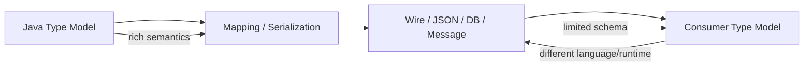
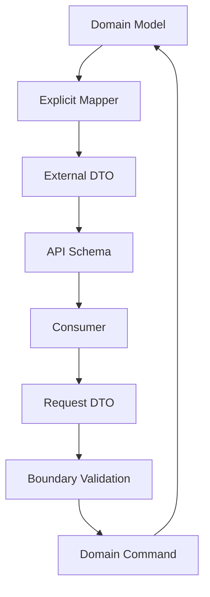
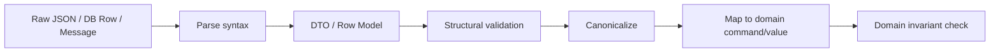

# Part 030 — Serialization, JSON, Database & API Type Boundaries

> Target: setelah part ini, kita mampu melihat boundary serialization, JSON, database, dan API bukan sebagai “mapping layer”, tetapi sebagai tempat di mana **semantik tipe Java bisa hilang, berubah, atau menjadi kontrak eksternal yang sulit diubah**.

Di dalam JVM, Java punya type system yang kaya:

- primitive vs reference type,
- `int` vs `long`,
- `float` vs `double`,
- `BigDecimal` scale,
- `Instant` vs `LocalDateTime`,
- enum identity,
- record components,
- object identity,
- `null`,
- array runtime type,
- generic compile-time type,
- sealed hierarchy,
- value object invariants.

Begitu data keluar melewati boundary, banyak informasi ini runtuh.

```java
record Payment(
    UUID id,
    Money amount,
    Instant paidAt,
    PaymentStatus status,
    Optional<String> note
) {}
```

Di JSON/database/API, bentuknya mungkin menjadi:

```json
{
  "id": "018f0c7e-3d3d-7a10-b12a-f8b1d6e4e000",
  "amount": 100,
  "currency": "USD",
  "paidAt": "2026-06-30T10:15:30Z",
  "status": "PAID",
  "note": null
}
```

Pertanyaan boundary:

- Apakah `amount` masih exact decimal atau sudah jadi floating number di client?
- Apakah scale `100.00` hilang menjadi `100`?
- Apakah `paidAt` timeline instant atau local date-time?
- Apakah `status` boleh menerima unknown future value?
- Apakah `note: null` sama dengan `note` absent?
- Apakah UUID dipakai sebagai identifier publik yang aman?
- Apakah backward/forward compatibility dijaga?

Part ini membangun mental model untuk menjawab itu secara sistematis.

---

## 1. Kaufman Skill Map

Subskill yang kita latih:

| Subskill | Pertanyaan desain |
|---|---|
| Identify semantic loss | Semantik tipe apa yang hilang saat keluar JVM? |
| Design external shape | Bentuk JSON/API/DB apa yang mempertahankan invariant penting? |
| Preserve numeric precision | Apakah angka exact tetap exact di semua consumer? |
| Preserve temporal semantics | Apakah instant/local/date/zone tidak tercampur? |
| Preserve enum compatibility | Apakah penambahan enum value tidak merusak client? |
| Model null/absence | Apakah absent, null, empty, default, dan unknown dibedakan? |
| Control serialization | Apakah default framework behavior aman untuk domain? |
| Govern schema evolution | Apakah contract bisa berubah tanpa data corruption? |

Skill performa:

> Diberi Java model dan kebutuhan integrasi, kita bisa mendesain bentuk JSON/database/API yang stabil, type-safe, evolvable, dan tidak merusak precision, temporal meaning, nullability, maupun domain invariants.

---

## 2. Boundary Mental Model

Boundary adalah tempat tiga model bertabrakan:



Java model:

- nominal type,
- constructor invariant,
- method behavior,
- object identity,
- runtime class,
- `BigDecimal` scale,
- `Instant` type,
- enum constants.

Wire model:

- object/map,
- string,
- number,
- boolean,
- array,
- null,
- bytes or text,
- schema annotations if available.

Consumer model:

- JavaScript number,
- Python int/float/decimal,
- Go int64/string/time,
- PostgreSQL numeric/timestamp/jsonb,
- mobile client model,
- data warehouse column.

Core rule:

> Do not assume Java type semantics survive boundary crossing unless the external contract explicitly carries them.

---

## 3. Type Semantics That Commonly Collapse

| Java concept | Common external collapse | Risk |
|---|---|---|
| `int` vs `long` | JSON number | overflow/precision loss in clients |
| `BigDecimal` | JSON number | scale and precision loss |
| `BigInteger` | JSON number | impossible exact representation in some clients |
| `Instant` | string timestamp | timezone/local confusion |
| `LocalDate` | string | parsed as datetime accidentally |
| `Enum` | string | unknown value breaks consumer |
| `UUID` | string | format validation missing |
| `byte[]` | base64 string | encoding ambiguity |
| `Optional<T>` | null/absent/value | three-state confusion |
| `record` | JSON object | constructor invariant bypass by mapper config |
| `sealed interface` | object without discriminator | subtype lost |
| `List<T>` | array | generic element type lost at runtime |
| `Map<K,V>` | object | non-string key impossible in JSON object |
| object identity | duplicated nested object | aliasing/reference semantics lost |

---

## 4. JSON Is Not Java

JSON has only a small set of value categories:

- object,
- array,
- number,
- string,
- boolean,
- null.

It does not have native:

- `int`,
- `long`,
- `BigDecimal`,
- `BigInteger`,
- `Instant`,
- `LocalDate`,
- enum,
- UUID,
- bytes,
- distinction between `Set` and `List`,
- sealed subtype,
- exact object identity.

Therefore JSON contract design must be explicit.

---

## 5. Numeric Boundary: Precision, Range, and Scale

### 5.1 The Dangerous JSON Number

Bad for public exact money:

```json
{
  "amount": 100.00
}
```

Problems:

- scale may be lost,
- JavaScript client may treat it as binary floating-point,
- large integers may lose precision,
- consumer may parse as `double`,
- downstream warehouse may infer wrong type.

Better for exact decimal:

```json
{
  "amount": "100.00",
  "currency": "USD"
}
```

For minor units:

```json
{
  "amountMinor": 10000,
  "currency": "USD",
  "scale": 2
}
```

But if JavaScript clients are involved and values may exceed safe integer range, encode as string:

```json
{
  "amountMinor": "9223372036854775807",
  "currency": "USD",
  "scale": 2
}
```

### 5.2 Recommended Numeric Shapes

| Java type | Public JSON recommendation | Notes |
|---|---|---|
| `int` small count | JSON number | document min/max |
| `long` ID | string | avoid JS precision loss |
| `long` small count | number if bounded safely | explicit max in schema |
| `BigDecimal` money | string decimal + currency | preserve exactness/scale |
| `BigInteger` | string | avoid range ambiguity |
| percentage ratio | string decimal | name as `discountRatio` |
| minor units | string or number + scale | choose based on range/client |

### 5.3 Schema Constraints Matter

A number field without constraints is weak.

Better schema-like contract:

```yaml
amount:
  type: string
  pattern: '^-?[0-9]+(\\.[0-9]{1,4})?$'
  description: Exact decimal amount. Not a binary floating-point value.
currency:
  type: string
  pattern: '^[A-Z]{3}$'
```

Do not rely on prose alone when machines consume the contract.

---

## 6. BigDecimal Boundary

`BigDecimal` has:

- unscaled value,
- scale,
- precision,
- exact decimal semantics,
- comparison complexity (`equals` vs `compareTo`).

JSON number does not preserve all of that reliably.

### 6.1 Preserve as String

```java
record MoneyDto(String amount, String currency) {
    Money toDomain() {
        return Money.of(amount, currency);
    }
}
```

This makes validation explicit:

```java
static BigDecimal parseExactDecimal(String text) {
    if (!text.matches("^-?[0-9]+(\\.[0-9]+)?$")) {
        throw new IllegalArgumentException("Invalid decimal: " + text);
    }
    return new BigDecimal(text);
}
```

### 6.2 Avoid `new BigDecimal(double)` at Boundaries

Bad:

```java
BigDecimal value = new BigDecimal(jsonDouble);
```

Better:

```java
BigDecimal value = new BigDecimal(jsonText);
```

or configure mapper to use exact decimal parsing when internal-only JSON permits numeric tokens.

---

## 7. Temporal Boundary

The worst temporal boundary bug is using a string without stating what time model it represents.

### 7.1 Choose the Right Temporal Type

| Domain meaning | Java type | JSON shape |
|---|---|---|
| timeline event occurred | `Instant` | ISO instant string with `Z`, e.g. `2026-06-30T10:15:30Z` |
| local calendar date | `LocalDate` | `YYYY-MM-DD` |
| wall-clock time | `LocalTime` | `HH:mm:ss` |
| local appointment without zone | `LocalDateTime` | string + explicit business zone context |
| user-facing scheduled instant with zone | `ZonedDateTime` | timestamp + zone ID if future schedule matters |
| duration | `Duration` | ISO-8601 duration or numeric seconds with unit name |
| period | `Period` | ISO-8601 period or `{years, months, days}` |

### 7.2 Instant vs LocalDateTime

Bad:

```json
{
  "submittedAt": "2026-06-30T10:15:30"
}
```

Ambiguous:

- UTC?
- Asia/Jakarta?
- server local time?
- user local time?
- stored timestamp without zone?

Better for event timestamp:

```json
{
  "submittedAt": "2026-06-30T03:15:30Z"
}
```

Better for business date:

```json
{
  "effectiveDate": "2026-07-01"
}
```

Better for future local schedule:

```json
{
  "scheduledLocalDateTime": "2026-07-01T09:00:00",
  "zoneId": "Asia/Jakarta"
}
```

### 7.3 DB Timestamp Trap

Database column names must reveal meaning.

Bad:

```sql
created_date TIMESTAMP
```

Better:

```sql
created_at_instant TIMESTAMP WITH TIME ZONE NOT NULL,
effective_date DATE NOT NULL,
scheduled_local_datetime TIMESTAMP WITHOUT TIME ZONE NOT NULL,
scheduled_zone_id VARCHAR(64) NOT NULL
```

Actual SQL type support differs per database, so the engineering rule is:

> Name and test the semantic, not just the SQL type.

---

## 8. Enum Boundary

Java enum is a closed set at compile time. External contracts live longer than deployed code.

Bad:

```json
{
  "status": 1
}
```

Using ordinal is brittle. Reordering enum constants changes meaning.

Better:

```json
{
  "status": "APPROVED"
}
```

But even string enum has evolution risk.

### 8.1 Stable External Code

```java
public enum CaseStatus {
    DRAFT("draft"),
    SUBMITTED("submitted"),
    UNDER_REVIEW("under_review"),
    APPROVED("approved"),
    REJECTED("rejected");

    private final String code;

    CaseStatus(String code) {
        this.code = code;
    }

    public String code() {
        return code;
    }

    public static CaseStatus fromCode(String code) {
        for (CaseStatus status : values()) {
            if (status.code.equals(code)) return status;
        }
        throw new IllegalArgumentException("Unknown case status: " + code);
    }
}
```

External contract:

```json
{
  "status": "under_review"
}
```

### 8.2 Unknown Enum Values

For inbound integration, decide what happens when a new value arrives.

Options:

| Strategy | Use when | Risk |
|---|---|---|
| Reject unknown | command/write API | forward compatibility limited |
| Map to `UNKNOWN` | read/display API | can hide important business change |
| Preserve raw code | integration hub | requires downstream handling |
| Versioned contract | critical workflow | higher governance cost |

A robust inbound model:

```java
public sealed interface ExternalStatus permits KnownStatus, UnknownStatus {}

public record KnownStatus(CaseStatus value) implements ExternalStatus {}
public record UnknownStatus(String rawCode) implements ExternalStatus {}
```

Use unknown-preserving model when data must not be lost.

---

## 9. Null, Absent, Empty, Default, Unknown

These five are different.

| External shape | Meaning candidate |
|---|---|
| field absent | not provided, leave unchanged, unknown, default |
| field present with `null` | explicitly cleared, unknown, no value |
| field present with empty string | provided but empty |
| field present with `[]` | known empty collection |
| field present with default value | actual value or implicit default? |

### 9.1 PATCH Example

```json
{
  "phoneNumber": null
}
```

Could mean:

- clear phone number,
- phone number unknown,
- invalid because null not allowed.

PATCH needs tri-state:

```java
sealed interface FieldPatch<T> {
    record Unset<T>() implements FieldPatch<T> {}
    record Clear<T>() implements FieldPatch<T> {}
    record Set<T>(T value) implements FieldPatch<T> {}
}
```

Domain command:

```java
record UpdateContactCommand(
    FieldPatch<PhoneNumber> phoneNumber,
    FieldPatch<EmailAddress> emailAddress
) {}
```

This is more explicit than `Optional<T>` for PATCH semantics.

### 9.2 Optional in DTOs

Avoid exposing `Optional` as a field type in DTOs unless your serialization framework and team conventions explicitly support it.

Prefer:

```java
record CustomerDto(String middleName) {}
```

with schema saying nullable or optional, then map to domain:

```java
Optional<MiddleName> middleName() { ... }
```

Remember: `Optional` is a Java API signal, not automatically a universal wire contract.

---

## 10. UUID and Identifier Boundary

Java `UUID` is clear inside JVM. Externally it is a string.

```json
{
  "caseId": "018f0c7e-3d3d-7a10-b12a-f8b1d6e4e000"
}
```

Boundary rules:

- validate format at edge,
- distinguish public ID from internal database ID,
- do not use raw `UUID` where domain type matters,
- do not expose sequential internal IDs if enumeration risk matters,
- keep idempotency key separate from entity ID.

```java
record CaseId(UUID value) {}
record PublicCaseReference(String value) {}
record IdempotencyKey(String value) {}
record CorrelationId(String value) {}
```

They may all serialize as string, but they are not interchangeable.

---

## 11. Bytes Boundary

Java has `byte[]`, `ByteBuffer`, `InputStream`, and file/resource abstractions. JSON does not have bytes.

Common JSON representation:

```json
{
  "contentBase64": "SGVsbG8="
}
```

Better contract:

```json
{
  "contentBase64": "SGVsbG8=",
  "contentType": "text/plain",
  "sha256": "...",
  "lengthBytes": 5
}
```

For large payloads, do not inline bytes in JSON. Use object storage/reference:

```json
{
  "documentId": "doc_123",
  "contentLocation": "s3://bucket/key",
  "contentType": "application/pdf",
  "lengthBytes": 1048576,
  "sha256": "..."
}
```

Boundary questions:

- Is the string base64 or text?
- What charset if text?
- Is content length checked?
- Is digest verified?
- Is content mutable after reference is issued?
- Who owns deletion/lifecycle?

---

## 12. Collection Boundary

Java distinguishes:

- `List`,
- `Set`,
- `Queue`,
- `Map`,
- immutable collections,
- sorted collections,
- concurrent collections,
- arrays.

JSON mostly has array and object.

### 12.1 Set Semantics

```java
Set<Role> roles;
```

JSON:

```json
{
  "roles": ["admin", "reviewer"]
}
```

But JSON array allows duplicates and order.

Schema/validation must decide:

- duplicates rejected?
- duplicates canonicalized?
- order meaningful?
- empty allowed?
- max size?

### 12.2 Map Key Semantics

JSON object keys are strings.

Java:

```java
Map<CaseId, Money> balances;
```

JSON object form:

```json
{
  "018f0c7e-3d3d-7a10-b12a-f8b1d6e4e000": {
    "amount": "100.00",
    "currency": "USD"
  }
}
```

Alternative array form:

```json
{
  "balances": [
    {
      "caseId": "018f0c7e-3d3d-7a10-b12a-f8b1d6e4e000",
      "amount": "100.00",
      "currency": "USD"
    }
  ]
}
```

Array form is often easier to validate, evolve, and annotate.

---

## 13. Record Boundary

Records are attractive DTOs:

```java
record CreateCaseRequest(String applicantName, String reason) {}
```

But record constructor invariants must be respected by serialization framework.

```java
record EmailAddress(String value) {
    EmailAddress {
        if (value == null || !value.contains("@")) {
            throw new IllegalArgumentException("invalid email");
        }
    }
}
```

Boundary risk:

- framework bypasses constructor via reflection/unsafe mechanisms,
- validation annotation runs later than desired,
- null values injected unexpectedly,
- default constructor required by framework not available,
- component names become public contract accidentally.

Rule:

> Use records for boundary DTOs when the external shape is intentionally the same as record components. Use domain records when constructor invariants are always enforced. Do not let mapper convenience define your domain model.

---

## 14. Sealed Hierarchy Boundary

Java sealed types model closed alternatives:

```java
sealed interface PaymentMethod permits CardPayment, BankTransfer, WalletPayment {}

record CardPayment(String token) implements PaymentMethod {}
record BankTransfer(String accountRef) implements PaymentMethod {}
record WalletPayment(String walletId) implements PaymentMethod {}
```

JSON needs a discriminator:

```json
{
  "type": "card",
  "token": "tok_123"
}
```

or:

```json
{
  "card": {
    "token": "tok_123"
  }
}
```

Discriminator rules:

- required,
- stable code,
- unknown handling defined,
- no ambiguous overlapping fields,
- subtype-specific validation,
- versioning story for new subtype.

---

## 15. Database Boundary

Relational databases have their own type systems. Mapping is not mechanical.

### 15.1 Common Java-to-DB Type Decisions

| Java semantic | Possible DB shape | Risk |
|---|---|---|
| `Money` | `DECIMAL(p,s)` + `currency_code` | scale drift, currency mismatch |
| `Instant` | timestamp with UTC convention | DB-specific behavior |
| `LocalDate` | `DATE` | timezone conversion should not apply |
| enum | code string column | unknown/deprecated codes |
| `UUID` | UUID type or char/varchar | portability vs validation |
| `byte[]` | blob | streaming/memory pressure |
| JSON object | JSON/JSONB/text | schema drift |
| collection | join table or JSON array | queryability vs integrity |
| value object | flattened columns | mapping complexity |

### 15.2 Column Naming Should Encode Semantics

Bad:

```sql
amount DECIMAL(19,2),
date TIMESTAMP,
status VARCHAR(20)
```

Better:

```sql
charge_amount DECIMAL(19,2) NOT NULL,
charge_currency_code CHAR(3) NOT NULL,
submitted_at_utc TIMESTAMP NOT NULL,
effective_local_date DATE NOT NULL,
case_status_code VARCHAR(40) NOT NULL
```

The database schema is part of the type system for persisted data.

### 15.3 DB Constraints Are Type Guards

```sql
ALTER TABLE invoice
ADD CONSTRAINT chk_amount_non_negative CHECK (charge_amount >= 0);

ALTER TABLE invoice
ADD CONSTRAINT chk_currency_code CHECK (charge_currency_code ~ '^[A-Z]{3}$');
```

Do not rely only on Java validation. Data can enter through migration scripts, ETL, admin tools, replay jobs, or direct SQL.

---

## 16. Serialization Framework Defaults Are Not Architecture

Jackson, Gson, JSON-B, Hibernate, JPA, JDBC mappers, Avro, Protobuf, and message brokers all have defaults.

Defaults optimize convenience, not necessarily semantic preservation.

Examples of dangerous defaults:

- serialize `BigDecimal` as JSON number without cross-client precision plan,
- serialize enum by name without external code policy,
- serialize date/time in framework default timezone,
- include null fields inconsistently,
- expose internal field names as public API,
- accept unknown properties silently in command APIs,
- reject unknown properties in read-model clients where forward compatibility matters,
- serialize polymorphic types without safe discriminator strategy.

Rule:

> Framework annotations should implement an explicit contract, not replace contract design.

---

## 17. Contract-First External Model

A stable external API model is not always identical to internal domain model.



### 17.1 Domain Model

```java
record Money(BigDecimal amount, Currency currency) {}
record TaxRate(BigDecimal ratio) {}
record Invoice(Money subtotal, TaxRate taxRate, Money total) {}
```

### 17.2 External DTO

```java
record MoneyJson(String amount, String currency) {}

record InvoiceResponseJson(
    MoneyJson subtotal,
    String taxRatio,
    MoneyJson total
) {}
```

Mapper:

```java
MoneyJson toJson(Money money) {
    return new MoneyJson(money.amount().toPlainString(), money.currency().getCurrencyCode());
}
```

This is boring code, but it protects contracts.

---

## 18. Boundary Validation Pipeline

Do not deserialize directly into domain aggregate and hope everything is okay.

Recommended pipeline:



Example:

```java
record CreatePaymentJson(
    String amount,
    String currency,
    String paidAt,
    String idempotencyKey
) {}
```

Mapping:

```java
CreatePaymentCommand toCommand(CreatePaymentJson json) {
    return new CreatePaymentCommand(
        Money.of(json.amount(), json.currency()),
        Instant.parse(json.paidAt()),
        new IdempotencyKey(json.idempotencyKey())
    );
}
```

Validation layers:

- JSON syntax valid,
- required fields present,
- string formats valid,
- amount exact decimal,
- currency recognized,
- timestamp parseable,
- idempotency key length/pattern valid,
- domain rules satisfied.

---

## 19. Schema Evolution

A boundary contract lives longer than one deployment.

### 19.1 Safe Additive Change

Adding optional response field is usually safe:

```json
{
  "caseId": "case_123",
  "status": "submitted",
  "submittedAt": "2026-06-30T03:15:30Z",
  "reviewDueAt": "2026-07-05T03:15:30Z"
}
```

But only if clients ignore unknown fields.

### 19.2 Dangerous Changes

Breaking examples:

- rename field,
- remove field,
- change numeric string to number,
- change timestamp semantics,
- change enum value spelling,
- reuse old enum code for new meaning,
- change default from absent to false,
- change scale from 2 to 4 without versioning,
- change ID format without contract update.

### 19.3 Versioning Choices

| Strategy | Best for | Trade-off |
|---|---|---|
| Additive evolution | internal APIs, tolerant clients | requires discipline |
| URI version | public REST APIs | coarse-grained |
| media type version | strong API governance | more ceremony |
| field-level version | long-lived events | complexity |
| event type version | message-driven systems | migration burden |
| schema registry | event/data platform | operational dependency |

---

## 20. Event and Message Boundary

Events are harder than request/response APIs because old events remain forever.

Bad event:

```json
{
  "status": "APPROVED",
  "amount": 100,
  "timestamp": "2026-06-30 10:15:30"
}
```

Better event:

```json
{
  "eventId": "evt_123",
  "eventType": "case.penalty.assessed.v1",
  "occurredAt": "2026-06-30T03:15:30Z",
  "caseId": "case_456",
  "assessedPenalty": {
    "amount": "100.00",
    "currency": "USD"
  },
  "calculationPolicyVersion": "penalty-v3",
  "schemaVersion": 1
}
```

Event design rules:

- include event ID,
- include occurred-at instant,
- include schema/event version,
- use stable semantic field names,
- include enough calculation context for audit,
- avoid derived fields unless documented,
- do not publish internal object graph accidentally,
- assume consumers will store and replay.

---

## 21. Java Native Serialization Warning

Java built-in object serialization (`Serializable`) preserves Java-ish object graphs, but it is rarely a good public or long-lived boundary format.

Risks:

- tight coupling to class names and serial form,
- security concerns around deserialization,
- difficult cross-language interoperability,
- poor schema evolution story compared with explicit contracts,
- accidental exposure of internal fields.

For enterprise boundaries, prefer explicit formats:

- JSON with schema and validation,
- Avro/Protobuf with schema governance,
- SQL schema with migrations,
- explicit DTOs,
- domain-event contracts.

Use native serialization only when you have a bounded, well-understood, internal reason.

---

## 22. Object Identity Does Not Cross JSON Boundary

Java object graph may share references:

```java
Address address = new Address("...");
Customer a = new Customer(address);
Customer b = new Customer(address);
```

JSON usually serializes values, not identity:

```json
{
  "a": { "address": { "line1": "..." } },
  "b": { "address": { "line1": "..." } }
}
```

After deserialization, `a.address()` and `b.address()` may be different objects.

If identity matters, externalize it:

```json
{
  "addresses": [
    { "addressId": "addr_1", "line1": "..." }
  ],
  "customers": [
    { "customerId": "cust_1", "addressId": "addr_1" },
    { "customerId": "cust_2", "addressId": "addr_1" }
  ]
}
```

---

## 23. Security and Integrity Boundary

Type boundary is also a security boundary.

Validation must handle:

- oversized strings,
- deeply nested JSON,
- huge arrays,
- huge numbers,
- invalid UTF-8,
- duplicate object keys,
- unknown fields,
- polymorphic type injection,
- path traversal in file names,
- unsafe deserialization,
- log injection,
- PII leakage in `toString`.

Example guardrails:

```java
record UploadMetadata(
    String fileName,
    String contentType,
    long lengthBytes,
    String sha256
) {
    UploadMetadata {
        if (fileName == null || fileName.isBlank()) throw new IllegalArgumentException("fileName required");
        if (fileName.contains("/") || fileName.contains("\\\\")) throw new IllegalArgumentException("path separators not allowed");
        if (lengthBytes < 0 || lengthBytes > 20_000_000L) throw new IllegalArgumentException("file too large");
    }
}
```

---

## 24. Anti-Patterns

### 24.1 Domain Model as API Model

```java
@RestController
class CaseController {
    @PostMapping("/cases")
    Case create(@RequestBody Case caseEntity) { ... }
}
```

Risks:

- exposes internal fields,
- binds API to persistence/domain shape,
- bypasses command validation,
- accidental mass assignment,
- hard to evolve.

Better:

```java
record CreateCaseRequest(String applicantName, String reason) {}
record CaseResponse(String caseId, String status, String submittedAt) {}
```

### 24.2 Raw Map Boundary

```java
Map<String, Object> payload
```

Sometimes necessary at integration edges, but dangerous as core model.

Risks:

- no compile-time field names,
- runtime casting errors,
- no schema discoverability,
- weak validation,
- hidden numeric type ambiguity.

Use raw maps only at very edge, then convert quickly.

### 24.3 Silent Coercion

Bad:

```java
boolean active = Boolean.parseBoolean(input);
```

`Boolean.parseBoolean("yes")` returns `false`, not an error.

For strict boundary:

```java
static boolean parseStrictBoolean(String input) {
    return switch (input) {
        case "true" -> true;
        case "false" -> false;
        default -> throw new IllegalArgumentException("Invalid boolean: " + input);
    };
}
```

### 24.4 Stringly-Typed Domain

```java
record CaseDto(String status, String amount, String date, String type) {}
```

Strings are fine as transport representation, but should not remain unparsed inside domain workflows.

---

## 25. Integration Testing for Type Boundaries

Boundary correctness requires round-trip tests.

### 25.1 JSON Round Trip

```java
@Test
void moneyPreservesScaleAndCurrencyAcrossJson() {
    String json = """
        {"amount":"100.00","currency":"USD"}
        """;

    MoneyJson dto = mapper.readValue(json, MoneyJson.class);
    Money money = dto.toDomain();
    MoneyJson serialized = toJson(money);

    assertEquals("100.00", serialized.amount());
    assertEquals("USD", serialized.currency());
}
```

### 25.2 DB Round Trip

Test that:

- `BigDecimal` scale is preserved or canonicalized intentionally,
- timestamp semantics survive read/write,
- enum code persists not ordinal,
- UUID format is stable,
- nullability constraints match domain,
- large values do not overflow.

### 25.3 Consumer Compatibility Tests

For public APIs and events:

- old consumer reads new response,
- new consumer reads old response,
- unknown enum value behavior,
- absent optional field behavior,
- large numeric values in JavaScript-like environment,
- timezone parsing behavior.

---

## 26. Production Failure Modes

### 26.1 Money Precision Loss

Cause: `BigDecimal` serialized as JSON number, consumed by JavaScript, sent back as approximate number.

Effect: reconciliation mismatch.

Prevention: decimal string contract and schema validation.

### 26.2 Timezone Shift

Cause: `LocalDateTime` persisted as server-local timestamp, later interpreted as UTC.

Effect: deadline calculated hours off, SLA breach false positive/negative.

Prevention: `Instant` for occurred-at, `LocalDate` for business date, zone ID for future schedules.

### 26.3 Enum Ordinal Corruption

Cause: enum persisted as ordinal, constants reordered.

Effect: old rows map to wrong status.

Prevention: stable string/code column.

### 26.4 Null vs Absent PATCH Bug

Cause: `null` treated same as absent.

Effect: user attempted to clear value but system ignored it, or absent field cleared unintentionally.

Prevention: tri-state patch model.

### 26.5 Large ID Precision Loss

Cause: `long` ID exposed as JSON number to JavaScript client.

Effect: wrong entity fetched/updated.

Prevention: expose large IDs as strings.

### 26.6 Polymorphic Type Loss

Cause: sealed subtype serialized without discriminator.

Effect: consumer cannot reconstruct variant; default branch misprocesses payment method.

Prevention: explicit stable discriminator.

---

## 27. Boundary Design Checklist

### Numeric

- [ ] Is exact decimal serialized as string or safely constrained number?
- [ ] Are `long` IDs safe for all clients?
- [ ] Is scale preserved or intentionally canonicalized?
- [ ] Is rounding policy explicit?
- [ ] Are min/max constraints documented and validated?

### Temporal

- [ ] Is `Instant` used for event occurrence?
- [ ] Is `LocalDate` used for business dates?
- [ ] Is zone ID included when future local schedule matters?
- [ ] Are DB timestamp semantics tested?
- [ ] Is clock/timezone not implicit?

### Enum

- [ ] Is enum persisted/serialized by stable code, not ordinal?
- [ ] Is unknown value strategy defined?
- [ ] Are deprecated values handled?
- [ ] Is external code decoupled from Java enum name if needed?

### Nullability

- [ ] Are absent/null/empty/default/unknown distinct where needed?
- [ ] Is PATCH tri-state modeled?
- [ ] Are nullable fields documented in schema?
- [ ] Are domain invariants not bypassed by mapper?

### Collections and Maps

- [ ] Are duplicates allowed?
- [ ] Is order meaningful?
- [ ] Are max sizes enforced?
- [ ] Are map keys representable and validated?

### Schema Evolution

- [ ] Are changes additive where possible?
- [ ] Are breaking changes versioned?
- [ ] Are old events/data still readable?
- [ ] Are contract tests present?
- [ ] Is migration/backfill plan defined?

---

## 28. Deliberate Practice

### Exercise 1: Money API Contract

Design JSON request/response for:

- `invoiceId`,
- subtotal,
- tax rate,
- tax amount,
- total,
- currency,
- calculatedAt,
- roundingPolicyVersion.

Requirements:

- no floating-point precision loss,
- clear ratio/percent semantics,
- stable timestamp semantics,
- backward-compatible future field addition.

### Exercise 2: PATCH Tri-State

Given:

```json
{
  "email": null,
  "phone": "08123456789"
}
```

Design Java DTO and domain command that distinguish:

- field absent,
- field explicitly cleared,
- field set to value.

### Exercise 3: Enum Evolution

You have:

```java
enum CaseStatus { DRAFT, SUBMITTED, APPROVED, REJECTED }
```

External API currently returns enum names.

Design migration to stable lowercase codes without breaking existing clients.

### Exercise 4: DB Round Trip Test

Create a test plan for persisting and loading:

- `Money("100.00", "USD")`,
- `Instant`,
- `LocalDate`,
- enum code,
- UUID,
- nullable optional note,
- large numeric ID.

State what each assertion protects.

---

## 29. Summary

The central lesson:

> Type safety does not end at Java compilation. It must be deliberately carried through JSON, database schemas, event contracts, and API versioning.

Boundary engineering is where many strong Java models become weak strings, ambiguous numbers, unstable timestamps, brittle enum codes, and nullable chaos.

A strong boundary design:

- preserves exact decimals,
- names temporal semantics explicitly,
- serializes enums with stable codes,
- validates identifiers,
- separates domain model from DTOs,
- distinguishes null/absent/empty/default/unknown,
- controls mapper defaults,
- tests round-trip behavior,
- governs schema evolution.

In ordinary systems, serialization is plumbing. In serious enterprise systems, serialization is part of the type system.

