# Part 031 — Performance, Memory Layout & Allocation Awareness

> Target part ini: kamu tidak harus menjadi JVM engineer, tetapi kamu harus bisa membaca shape data Java dan memprediksi konsekuensi performanya: alokasi, reference chasing, boxing, GC pressure, cache locality, object identity, dan boundary cost.

Di level junior, tipe dipahami sebagai “apa yang boleh dikompilasi”.

Di level senior, tipe dipahami sebagai **kontrak semantik**.

Di level top engineer, tipe juga dipahami sebagai **bentuk data di runtime**: berapa banyak object yang dibuat, bagaimana data diakses, apakah ada indirection, apakah ada identity yang sebenarnya tidak diperlukan, apakah alokasi dapat dieliminasi, dan apakah desain API memaksa caller membayar cost yang tidak terlihat.

Part ini bukan micro-optimization handbook. Ini adalah **memory-shape reasoning handbook**.

Kita akan memakai prinsip Kaufman:

1. **Deconstruct**: pecah performa tipe menjadi object, reference, primitive, wrapper, array, collection, allocation, escape, dan cache locality.
2. **Learn enough to self-correct**: kenali tanda desain data yang mahal sebelum profiling.
3. **Remove barriers**: gunakan mental model sederhana yang bisa dipakai saat code review.
4. **Deliberate practice**: latihan mengubah shape data tanpa mengubah domain semantics.

---

## 1. Skill yang Ingin Dibangun

Setelah part ini, kamu harus bisa:

- membedakan cost semantic type dan cost runtime shape;
- menjelaskan mengapa `List<Integer>` tidak setara dengan `int[]`;
- mengenali kapan wrapper, object graph, nested collection, dan string-heavy model menambah GC pressure;
- membaca model domain dari sisi alokasi: object count, reference count, mutable boundary, dan lifetime;
- memahami kapan escape analysis dapat membantu, dan kapan tidak;
- menghindari micro-optimization prematur sambil tetap mendesain data shape yang sehat;
- membuat review checklist untuk tipe data yang dipakai di hot path, batch processing, event ingestion, cache, dan reporting pipeline.

---

## 2. Mental Model: Java Object Bukan Hanya Field

Secara source code, class terlihat seperti ini:

```java
record Money(BigDecimal amount, Currency currency) {}
```

Secara semantik, `Money` adalah value object.

Secara runtime, shape-nya mungkin seperti ini:

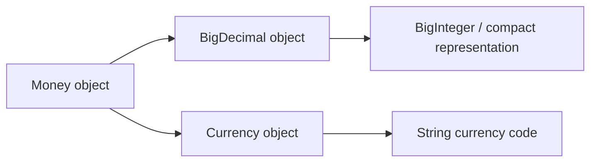

Yang penting:

- object punya identity, header, dan field;
- reference field menunjuk ke object lain;
- nested object memperbanyak indirection;
- setiap indirection bisa memengaruhi locality;
- banyak object kecil bisa meningkatkan pressure ke allocator dan GC;
- semantic elegance tidak selalu berarti runtime shape murah.

Ini bukan alasan untuk menghindari domain modeling. Ini alasan untuk **tahu di mana boundary performance berada**.

---

## 3. Primitive vs Reference: Perbedaan Cost Model

Primitive value seperti `int`, `long`, `double`, dan `boolean` menyimpan nilai langsung di variabel, field, atau array element.

Reference value menyimpan pointer-like reference ke object.

```java
int count = 42;
Integer boxed = 42;
```

Mental model:

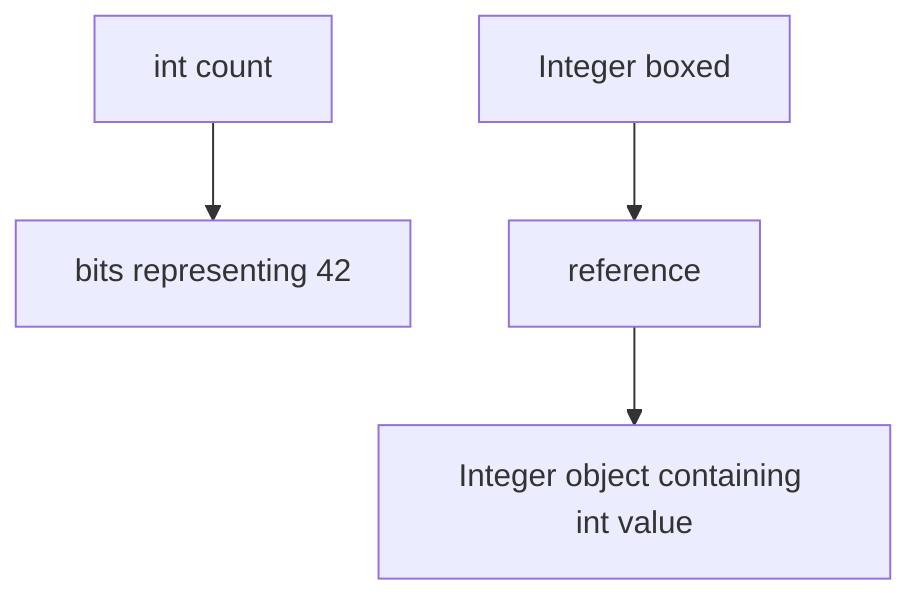

Konsekuensi:

| Bentuk | Runtime intuition |
|---|---|
| `int` | nilai langsung |
| `Integer` | reference ke object wrapper |
| `int[]` | array object berisi primitive values secara contiguous |
| `Integer[]` | array object berisi references ke wrapper objects |
| `List<Integer>` | list object + backing array references + wrapper objects |

Contoh:

```java
int[] a = {1, 2, 3};
Integer[] b = {1, 2, 3};
List<Integer> c = List.of(1, 2, 3);
```

Secara domain ketiganya mungkin “list angka”. Secara runtime shape berbeda jauh.

---

## 4. Array Primitive vs Array Reference

Primitive array:

```java
long[] timestamps = new long[1_000_000];
```

Shape:

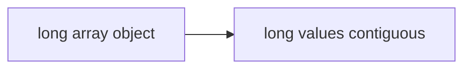

Reference array:

```java
Instant[] timestamps = new Instant[1_000_000];
```

Shape:

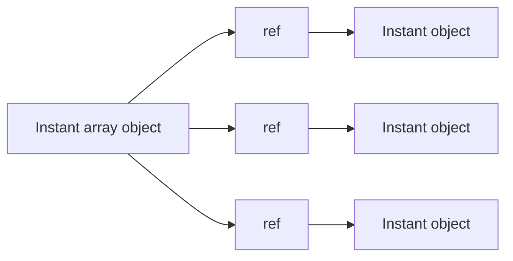

Perbedaan penting:

- `long[]` menyimpan nilai timestamp langsung;
- `Instant[]` menyimpan reference ke object `Instant`;
- `List<Instant>` menambah layer collection;
- `List<Long>` menambah wrapper object juga.

Untuk domain API, `Instant` lebih jelas daripada raw `long`.

Untuk hot path telemetry/batch, raw `long` epoch millis/nanos mungkin lebih cocok di internal representation, selama boundary-nya dikapsulasi.

Prinsipnya bukan “primitive selalu lebih baik”, tetapi:

> Gunakan tipe domain di boundary dan business logic; gunakan representation yang lebih compact di hot internal loop jika terbukti perlu dan tetap dibungkus invariant.

---

## 5. Object Identity adalah Cost dan Constraint

Object Java normal memiliki identity.

Identity berarti object bisa:

- dibandingkan dengan `==`;
- dikunci dengan `synchronized`;
- memiliki identity hash code;
- dibedakan dari object lain walaupun field sama;
- menjadi target aliasing.

Untuk banyak data domain, identity object tidak diperlukan.

Contoh:

```java
record Point(int x, int y) {}
```

Secara domain, dua `Point(1, 2)` biasanya sama.

Tetapi sebagai object normal, masing-masing instance tetap memiliki identity runtime.

```java
Point a = new Point(1, 2);
Point b = new Point(1, 2);

System.out.println(a.equals(b)); // true
System.out.println(a == b);      // false
```

`equals` bisa menyembunyikan identity dari domain logic, tetapi identity tetap ada di runtime.

Konsekuensi:

- object tetap dialokasikan kecuali JVM bisa mengeliminasi;
- reference tetap menunjuk ke object;
- object tetap punya header;
- object tetap bisa menjadi sumber aliasing kalau mutable;
- object tetap punya identity semantics di level VM.

Inilah salah satu motivasi Project Valhalla, yang akan dibahas di Part 032.

---

## 6. Object Graph: Sumber Cost yang Sering Tidak Terlihat

Object graph adalah jaringan object dan reference.

Contoh model:

```java
record CaseSummary(
    CaseId id,
    String title,
    PartyName respondent,
    Instant openedAt,
    Money penalty,
    List<ViolationCode> violations
) {}
```

Shape konseptual:

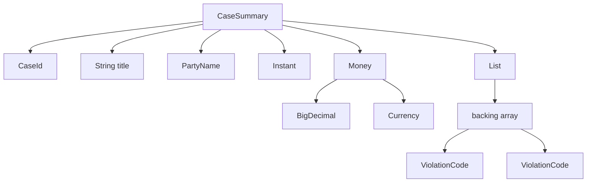

Desain ini mungkin benar untuk API boundary. Namun untuk membaca 10 juta row report, shape ini bisa mahal.

Pertanyaan review:

- Apakah semua field perlu menjadi object domain penuh di hot path?
- Apakah `Money` perlu dibuat untuk setiap row sementara hanya total amount yang dipakai?
- Apakah `String` code bisa diganti enum/code table internal?
- Apakah list kecil perlu object list per row?
- Apakah mapping ORM membuat object graph lebih besar dari kebutuhan query?

Top engineer tidak anti-object. Top engineer tahu **di mana object memberikan semantic leverage dan di mana object menjadi accidental cost**.

---

## 7. Allocation Awareness

Alokasi object di JVM modern cepat. Tapi “cepat” bukan berarti gratis.

Cost alokasi bisa muncul sebagai:

- increased allocation rate;
- GC pressure;
- cache miss;
- memory bandwidth;
- CPU time untuk initialization;
- object graph traversal;
- pressure di young generation;
- promotion ke old generation jika object hidup cukup lama;
- latency spikes pada workload tertentu.

Contoh anti-pattern:

```java
for (Transaction tx : transactions) {
    BigDecimal amount = new BigDecimal(tx.amountText());
    Money money = new Money(amount, tx.currency());
    result.add(money);
}
```

Masalah mungkin bukan `new` itu sendiri. Masalahnya:

- parsing text berulang;
- `BigDecimal` object banyak;
- `Money` object banyak;
- result list menahan semua object sampai akhir;
- GC tidak bisa membuang object lebih awal.

Alternatif tergantung kebutuhan:

```java
BigDecimal total = BigDecimal.ZERO;

for (Transaction tx : transactions) {
    total = total.add(parseAmount(tx.amountText()));
}
```

Atau untuk internal minor-unit representation:

```java
long totalMinorUnits = 0;

for (Transaction tx : transactions) {
    totalMinorUnits += parseMinorUnits(tx.amountText(), tx.currency());
}
```

Tetapi alternatif kedua harus dikunci dengan invariant currency, scale, dan overflow policy.

---

## 8. Allocation Rate Lebih Penting daripada Object Count Sesaat

Dalam service, yang sering membunuh performa bukan hanya “berapa banyak object hidup”, tetapi “berapa banyak object dibuat per detik”.

Contoh:

```java
String normalize(String input) {
    return input.trim().toLowerCase(Locale.ROOT).replace(" ", "-");
}
```

Untuk satu request, ini biasa saja.

Untuk 200 ribu record per detik, ini bisa menjadi allocation hotspot.

Pertanyaan:

- Apakah normalisasi dilakukan di boundary sekali atau berkali-kali?
- Apakah hasil bisa disimpan sebagai canonical field?
- Apakah operasi string ada di hot loop?
- Apakah intermediate object bisa dihindari tanpa membuat kode tidak terbaca?

Rule praktis:

> Optimalkan allocation rate ketika data shape berada di hot path, bukan ketika object hanya dibuat di administrative flow.

---

## 9. Escape Analysis: JVM Bisa Membantu, Tapi Jangan Bergantung Buta

JIT compiler dapat melakukan escape analysis untuk mengetahui apakah object hanya dipakai lokal dan tidak “escape” keluar method/thread.

Jika object tidak escape, JVM mungkin dapat:

- menghilangkan alokasi;
- melakukan scalar replacement;
- menghapus lock yang tidak perlu.

Contoh konseptual:

```java
record Pair(int left, int right) {}

int sum(int a, int b) {
    Pair p = new Pair(a, b);
    return p.left() + p.right();
}
```

`Pair` secara source code dialokasikan, tetapi JIT mungkin menghilangkan alokasi karena object tidak escape.

Namun object bisa escape jika:

```java
Pair create(int a, int b) {
    return new Pair(a, b);
}
```

Atau:

```java
void publish(Pair p) {
    queue.add(p);
}
```

Atau:

```java
Object asObject(int a, int b) {
    return new Pair(a, b);
}
```

Mental model:

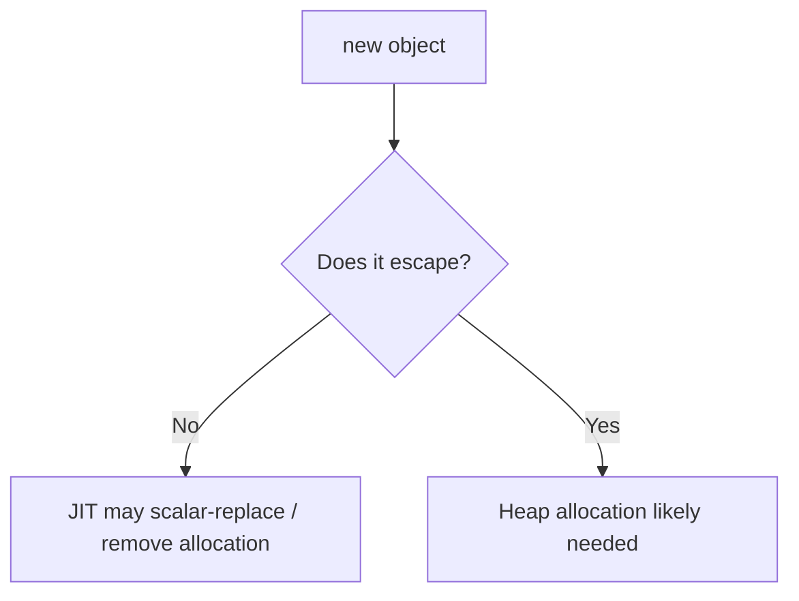

Important:

- escape analysis adalah optimization, bukan language guarantee;
- hasilnya bergantung JVM, flags, code shape, warmup, dan inlining;
- jangan menulis correctness yang bergantung pada optimisasi ini;
- gunakan profiling/JMH untuk klaim performa.

---

## 10. Scalar Replacement: Object Menjadi Field-Field

Scalar replacement berarti object kecil dapat dipecah menjadi scalar values.

Source:

```java
record Range(int start, int end) {
    int length() {
        return end - start;
    }
}

int lengthOf(int start, int end) {
    Range r = new Range(start, end);
    return r.length();
}
```

Possible compiled intuition:

```java
int lengthOf(int start, int end) {
    return end - start;
}
```

Implikasi desain:

- membuat small immutable value object tidak selalu mahal;
- gunakan value object untuk correctness terlebih dahulu;
- ukur ketika object dibuat di hot loop dan escape;
- hindari premature primitive obsession karena takut alokasi.

---

## 11. Boxing: Hidden Allocation dan Hidden Nullability

Autoboxing membuat code nyaman:

```java
List<Integer> scores = new ArrayList<>();
scores.add(42);
```

Tetapi secara konseptual:

```java
scores.add(Integer.valueOf(42));
```

Risiko:

- wrapper allocation atau cache lookup;
- `null` bisa masuk;
- unboxing bisa melempar `NullPointerException`;
- identity comparison salah;
- memory footprint lebih besar;
- data tidak contiguous seperti primitive array.

Contoh hot path buruk:

```java
long sum(List<Integer> values) {
    long total = 0;
    for (Integer value : values) {
        total += value;
    }
    return total;
}
```

Biaya:

- list holds references;
- each `Integer` may be object;
- unboxing per iteration;
- nullable element risk;
- poor locality.

Alternatif internal:

```java
long sum(int[] values) {
    long total = 0;
    for (int value : values) {
        total += value;
    }
    return total;
}
```

Jika butuh stream:

```java
int[] values = {1, 2, 3};
int total = Arrays.stream(values).sum();
```

Untuk API enterprise, mungkin tetap lebih ekspresif memakai `List<Score>`. Namun di storage/hot loop, kamu bisa memakai compact representation dengan boundary conversion yang jelas.

---

## 12. Cache Locality: Kenapa Shape Data Berpengaruh ke CPU

CPU modern cepat ketika data yang dibutuhkan berdekatan di memory.

`int[]` biasanya lebih cache-friendly daripada object graph `List<Integer>`.

Simplified intuition:

```mermaid
flowchart LR
    A[int[]] --> B[1 2 3 4 5 6 contiguous]
```

Versus:

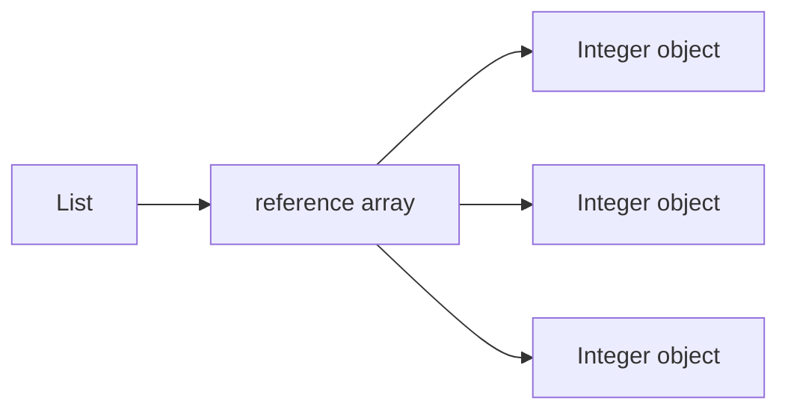

Dengan object graph, CPU sering harus follow pointer ke lokasi berbeda.

Ini disebut reference chasing.

Reference chasing bisa mahal untuk:

- large collection;
- batch computation;
- in-memory index;
- real-time scoring;
- event aggregation;
- matching engine;
- high-throughput validation;
- telemetry pipeline.

Tapi untuk workflow administratif yang didominasi database/network latency, locality mungkin bukan bottleneck.

Rule:

> Jangan menukar semantic clarity dengan cache locality kecuali data shape benar-benar berada di hot path.

---

## 13. Data-Oriented Thinking di Java

Object-oriented design bertanya:

> Object apa yang punya behavior ini?

Data-oriented design bertanya:

> Data apa yang diproses bersama, dalam volume berapa, dengan pola akses seperti apa?

Keduanya dibutuhkan.

Contoh case lifecycle system:

```java
record Case(
    CaseId id,
    CaseStatus status,
    Instant openedAt,
    Instant lastEscalatedAt,
    RiskScore riskScore
) {}
```

Bagus untuk domain transaction.

Tetapi untuk batch SLA scan terhadap 20 juta case:

```java
final class CaseSlaScanTable {
    private final long[] caseIds;
    private final byte[] statuses;
    private final long[] openedAtEpochMillis;
    private final long[] lastEscalatedAtEpochMillis;
    private final int[] riskScores;
}
```

Ini bukan API domain publik. Ini **internal projection** untuk pola akses spesifik.

Architecture pattern:

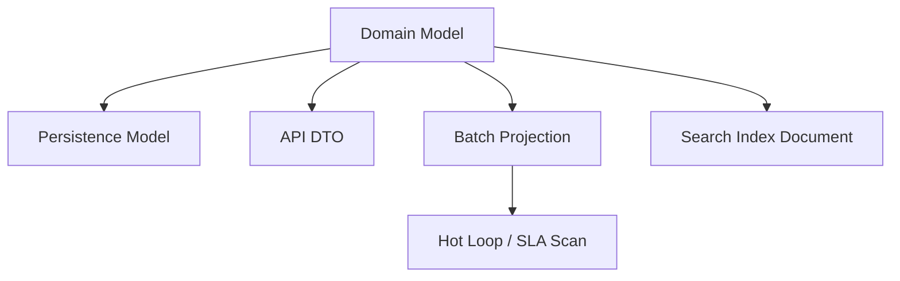

Kuncinya:

- domain model tetap jelas;
- projection punya ownership jelas;
- conversion punya test;
- invariant tidak hilang;
- performance representation tidak bocor ke seluruh codebase.

---

## 14. Structure of Arrays vs Array of Structures

Array of Structures:

```java
record Point(int x, int y) {}

Point[] points = new Point[1_000_000];
```

Structure of Arrays:

```java
final class Points {
    final int[] xs;
    final int[] ys;

    Points(int[] xs, int[] ys) {
        if (xs.length != ys.length) {
            throw new IllegalArgumentException("length mismatch");
        }
        this.xs = xs;
        this.ys = ys;
    }
}
```

Jika operasi sering membaca `x` dan `y` bersama, `Point[]` lebih natural.

Jika operasi sering membaca semua `x` saja atau semua `y` saja, structure of arrays bisa lebih cache-friendly.

Enterprise example:

- normal domain: `List<CaseSummary>`;
- analytical scan: separate arrays untuk status, deadline, priority, region.

Trade-off:

| Shape | Benefit | Cost |
|---|---|---|
| Array of structures | domain readability | object/reference overhead |
| Structure of arrays | locality, compactness | invariant lebih manual |
| Columnar projection | batch/analytics speed | mapping complexity |
| Domain object graph | semantic clarity | allocation/GC overhead |

---

## 15. String-Heavy Models

String adalah tipe yang sangat nyaman, tetapi string-heavy model mahal dan rawan semantic bug.

Contoh:

```java
record CaseRow(
    String caseId,
    String status,
    String openedAt,
    String amount,
    String currency
) {}
```

Masalah:

- parsing berulang;
- validation terlambat;
- memory footprint tinggi;
- equality/canonicalization ambiguity;
- typo tidak tertangkap compile-time;
- domain invariant tersebar.

Lebih baik di boundary:

```java
record CaseInput(
    String caseId,
    String status,
    String openedAt,
    String amount,
    String currency
) {}
```

Lalu parse ke domain:

```java
record CaseCommand(
    CaseId caseId,
    CaseStatus status,
    Instant openedAt,
    Money amount
) {}
```

Jika hot internal representation perlu compact:

```java
record CaseProjection(
    long caseIdNumeric,
    byte statusCode,
    long openedAtEpochMillis,
    long amountMinorUnits,
    short currencyCode
) {}
```

Tetapi jangan biarkan projection menggantikan domain language di seluruh sistem.

---

## 16. Enum, Byte Code, dan Compact Domain Representation

Enum bagus untuk domain closed set:

```java
enum CaseStatus {
    DRAFT,
    OPEN,
    UNDER_REVIEW,
    ESCALATED,
    CLOSED
}
```

Untuk storage internal sangat besar, kamu mungkin tergoda menyimpan `byte`:

```java
byte statusCode;
```

Ini boleh untuk projection, tetapi harus dibungkus:

```java
final class CaseStatusCodec {
    static byte encode(CaseStatus status) {
        return switch (status) {
            case DRAFT -> 1;
            case OPEN -> 2;
            case UNDER_REVIEW -> 3;
            case ESCALATED -> 4;
            case CLOSED -> 5;
        };
    }

    static CaseStatus decode(byte code) {
        return switch (code) {
            case 1 -> CaseStatus.DRAFT;
            case 2 -> CaseStatus.OPEN;
            case 3 -> CaseStatus.UNDER_REVIEW;
            case 4 -> CaseStatus.ESCALATED;
            case 5 -> CaseStatus.CLOSED;
            default -> throw new IllegalArgumentException("Unknown status code: " + code);
        };
    }
}
```

Jangan menggunakan `ordinal()` sebagai persistent representation.

Performance representation harus punya stable external code.

---

## 17. Object Headers dan Alignment: Jangan Mengarang Angka

Setiap object normal punya metadata runtime. Namun ukuran detail object header, compressed references, alignment, dan layout field adalah implementation-specific.

Jangan menulis dokumen desain dengan klaim angka pasti tanpa mengukur di target JVM.

Yang aman sebagai mental model:

- object punya overhead selain field;
- reference field menambah indirection;
- object alignment bisa menambah padding;
- field order/layout bisa diatur VM;
- compressed object pointers bisa mengubah ukuran reference;
- object header behavior bisa berubah antar JDK dan VM.

Jika butuh angka aktual, gunakan tool seperti JOL di environment yang sama dengan production-like JVM.

Tetapi untuk code review, cukup pahami arah:

```java
record Tiny(int value) {}
```

Banyak `Tiny` object akan lebih mahal daripada `int[]` jika disimpan dalam jumlah besar dan semuanya escape.

---

## 18. Field Layout dan Padding

Contoh:

```java
final class Example {
    boolean active;
    long timestamp;
    int count;
}
```

Secara source order, field terlihat seperti di atas. Tetapi VM dapat mengatur layout internal. Padding bisa muncul karena alignment.

Jangan membuat correctness bergantung pada field layout.

Optimisasi field layout manual jarang menjadi prioritas dalam aplikasi enterprise biasa. Lebih sering cost besar datang dari:

- terlalu banyak object;
- wrapper-heavy collection;
- string-heavy model;
- object graph yang tidak perlu;
- retaining reference terlalu lama;
- cache tanpa eviction;
- DTO besar yang disimpan di memory;
- logging object besar;
- accidental copies.

---

## 19. Retained Memory: Object Kecil Bisa Menahan Object Besar

Retained memory adalah memory yang tetap hidup karena masih reachable dari object tertentu.

Contoh:

```java
final class CaseContext {
    private final Case caseData;
    private final byte[] uploadedDocument;

    CaseContext(Case caseData, byte[] uploadedDocument) {
        this.caseData = caseData;
        this.uploadedDocument = uploadedDocument;
    }
}
```

Jika `CaseContext` disimpan di cache, `uploadedDocument` juga ikut hidup.

Masalah umum:

- menyimpan request object di async callback;
- menyimpan exception besar dengan stack/context;
- cache value berisi graph terlalu besar;
- lambda menangkap object besar;
- thread-local tidak dibersihkan;
- map key/value menyimpan reference yang tidak perlu;
- DTO response lengkap disimpan untuk audit padahal butuh subset.

Mental model:

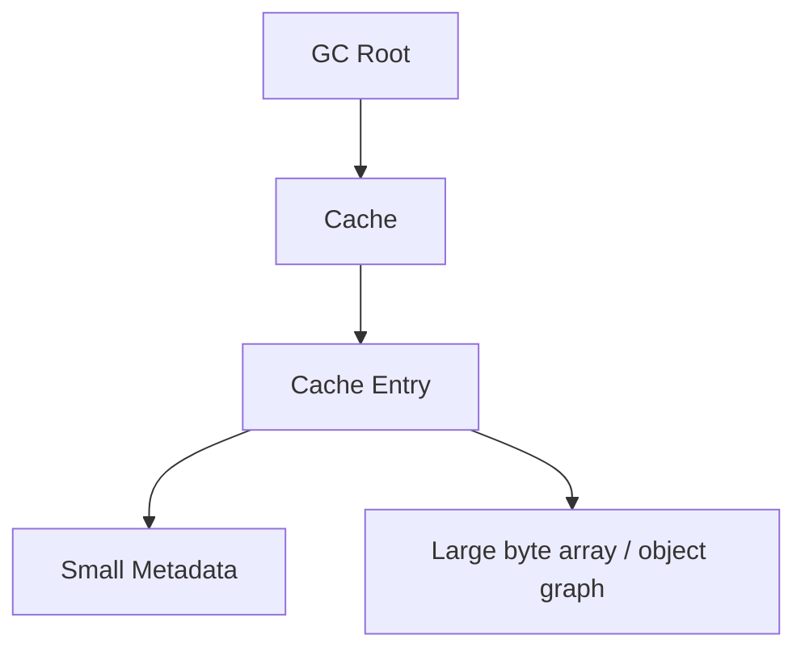

Object kecil bisa menjadi anchor untuk object besar.

---

## 20. Lifetime Design

Tipe tidak hanya punya shape. Tipe juga punya lifetime.

Pertanyaan desain:

- Apakah object hidup hanya dalam method?
- Apakah object hidup sepanjang request?
- Apakah object masuk queue?
- Apakah object masuk cache?
- Apakah object disimpan di session?
- Apakah object dipublish ke thread lain?
- Apakah object masuk event store?

Semakin panjang lifetime, semakin penting:

- immutability;
- compactness;
- explicit ownership;
- defensive copying;
- stable serialization;
- avoiding back-reference;
- avoiding accidental retention.

Contoh buruk:

```java
record AuditEvent(
    CaseId caseId,
    Case fullCaseSnapshot,
    UserSession session,
    HttpServletRequest request
) {}
```

Audit event seharusnya menyimpan fakta yang perlu diaudit, bukan object runtime besar.

Lebih baik:

```java
record AuditEvent(
    CaseId caseId,
    UserId actorId,
    Instant occurredAt,
    AuditAction action,
    Map<String, String> attributes
) {}
```

Tetap hati-hati dengan `Map<String, String>`: itu fleksibel, tetapi semantic contract lemah.

---

## 21. Avoid Accidental Copies

Defensive copy penting untuk correctness. Tapi copy besar di hot path bisa mahal.

Contoh:

```java
record Payload(byte[] bytes) {
    Payload {
        bytes = bytes.clone();
    }

    byte[] bytes() {
        return bytes.clone();
    }
}
```

Ini aman, tetapi setiap accessor menyalin array.

Jika payload besar dan sering dibaca, alternative design:

```java
final class Payload {
    private final ByteBuffer readOnlyBuffer;

    Payload(byte[] bytes) {
        this.readOnlyBuffer = ByteBuffer.wrap(bytes.clone()).asReadOnlyBuffer();
    }

    ByteBuffer asReadOnlyBuffer() {
        return readOnlyBuffer.asReadOnlyBuffer();
    }
}
```

Tetap ada trade-off:

- `ByteBuffer` punya state position/limit;
- duplicate read-only buffer membantu isolasi state;
- caller masih harus paham buffer semantics.

Rule:

> Defensive copy di boundary. Hindari copy berulang di inner loop. Pisahkan ownership API dari hot read API.

---

## 22. Collection Shape

`List<T>` bukan hanya “banyak T”.

Pertanyaan:

- Apakah list mutable?
- Apakah element mutable?
- Apakah list kecil atau besar?
- Apakah random access penting?
- Apakah insertion/removal sering?
- Apakah duplicates boleh?
- Apakah order penting?
- Apakah null boleh?
- Apakah lookup by key sering?

Contoh:

```java
List<ViolationCode> violations;
```

Mungkin ini harus menjadi:

```java
Set<ViolationCode> violations;
```

Atau:

```java
EnumSet<ViolationCode> violations;
```

Jika `ViolationCode` enum dan set tertutup, `EnumSet` sangat compact dan semantically tepat.

Untuk map enum:

```java
EnumMap<CaseStatus, Integer> counts = new EnumMap<>(CaseStatus.class);
```

Pilih collection berdasarkan semantics dulu, lalu performance.

---

## 23. Primitive Streams vs Boxed Streams

```java
List<Integer> values = List.of(1, 2, 3);
int sum = values.stream()
    .mapToInt(Integer::intValue)
    .sum();
```

Lebih baik jika data awal primitive:

```java
int[] values = {1, 2, 3};
int sum = IntStream.of(values).sum();
```

Boxed stream risk:

- wrapper object;
- unboxing;
- null risk;
- less specialized operations.

Primitive streams:

- `IntStream`;
- `LongStream`;
- `DoubleStream`.

Tetapi jangan memaksakan primitive stream untuk semua hal. Untuk domain object, readability bisa lebih penting.

---

## 24. JMH: Jangan Benchmark dengan `System.nanoTime` Sembarangan

Performance reasoning perlu mental model, tetapi keputusan optimisasi perlu pengukuran.

Microbenchmark Java sulit karena:

- JIT warmup;
- dead-code elimination;
- constant folding;
- inlining;
- escape analysis;
- GC noise;
- CPU frequency scaling;
- branch prediction;
- cache effects;
- unrealistic data.

Gunakan JMH untuk microbenchmark serius.

Contoh skeleton:

```java
@State(Scope.Thread)
public class SumBenchmark {
    private int[] primitiveValues;
    private List<Integer> boxedValues;

    @Setup
    public void setup() {
        primitiveValues = IntStream.range(0, 1_000).toArray();
        boxedValues = IntStream.range(0, 1_000).boxed().toList();
    }

    @Benchmark
    public long sumPrimitiveArray() {
        long total = 0;
        for (int value : primitiveValues) {
            total += value;
        }
        return total;
    }

    @Benchmark
    public long sumBoxedList() {
        long total = 0;
        for (Integer value : boxedValues) {
            total += value;
        }
        return total;
    }
}
```

JMH bukan pengganti profiling production. Tapi JMH membantu mengisolasi efek kecil.

---

## 25. Profiling: Alokasi, CPU, dan Retained Memory

Untuk aplikasi nyata, cek:

- allocation rate;
- top allocation sites;
- GC pauses;
- live set;
- retained heap;
- object count by class;
- CPU flame graph;
- lock contention;
- safepoint behavior;
- IO wait vs CPU time.

Tools yang umum:

- Java Flight Recorder;
- Java Mission Control;
- async-profiler;
- heap dump analyzer;
- JMH untuk microbenchmark;
- JOL untuk memory layout inspection.

Jangan menyimpulkan dari satu metric.

Contoh:

- CPU tinggi bisa karena parsing string, bukan allocation;
- GC tinggi bisa karena logging payload besar;
- latency tinggi bisa karena DB/network, bukan Java object shape;
- memory tinggi bisa karena cache retention, bukan object overhead per item.

---

## 26. API Design: Jangan Memaksa Caller Membayar Cost Tidak Perlu

Bad API:

```java
List<Integer> getAllRiskScores();
```

Masalah:

- memaksa materialisasi semua score;
- wrapper-heavy;
- caller mungkin hanya butuh sum/max;
- memory spike.

Better options:

```java
IntStream riskScores();
```

Atau:

```java
void forEachRiskScore(IntConsumer consumer);
```

Atau domain-specific:

```java
RiskScoreSummary summarizeRiskScores();
```

Untuk API publik, hati-hati expose stream jika resource lifecycle terkait DB cursor. Kadang callback atau pagination lebih aman.

Review API:

- Apakah return type memaksa allocation besar?
- Apakah type mengandung nullable wrapper yang tidak perlu?
- Apakah caller perlu semua data atau agregat?
- Apakah data harus disimpan atau hanya diproses?
- Apakah API mengekspose internal mutable collection?

---

## 27. Hot Path vs Cold Path

Tidak semua code perlu dioptimalkan sama.

Hot path:

- request routing setiap call;
- authorization check;
- serializer/deserializer;
- validation loop;
- event ingestion;
- batch scan;
- cache key computation;
- query mapping;
- logging formatter di throughput tinggi.

Cold path:

- admin configuration;
- migration script yang jarang;
- startup-only code;
- error handling rare path;
- manual back-office action;
- test fixture building.

Object-rich model di cold path biasanya oke.

Object-heavy model di hot path perlu dievaluasi.

---

## 28. Enterprise Example: SLA Scanner

Misalnya sistem enforcement perlu scan case yang melewati deadline.

Naive version:

```java
List<Case> cases = repository.findAllOpenCases();

for (Case c : cases) {
    if (c.deadline().isBefore(now) && c.status() == CaseStatus.OPEN) {
        escalationService.escalate(c.id());
    }
}
```

Masalah jika volume sangat besar:

- load semua case sebagai object graph;
- `Instant`, `CaseId`, `CaseStatus`, nested attributes;
- memory spike;
- GC pressure;
- DB transfer besar;
- mungkin butuh hanya id, status, deadline.

Projection version:

```java
record SlaCandidateRow(
    long caseId,
    byte statusCode,
    long deadlineEpochMillis
) {}
```

Atau streaming:

```java
repository.forEachOpenCaseDeadline(now, row -> {
    if (row.deadlineEpochMillis() < now.toEpochMilli()) {
        escalationService.escalate(CaseId.fromLong(row.caseId()));
    }
});
```

Better architecture:

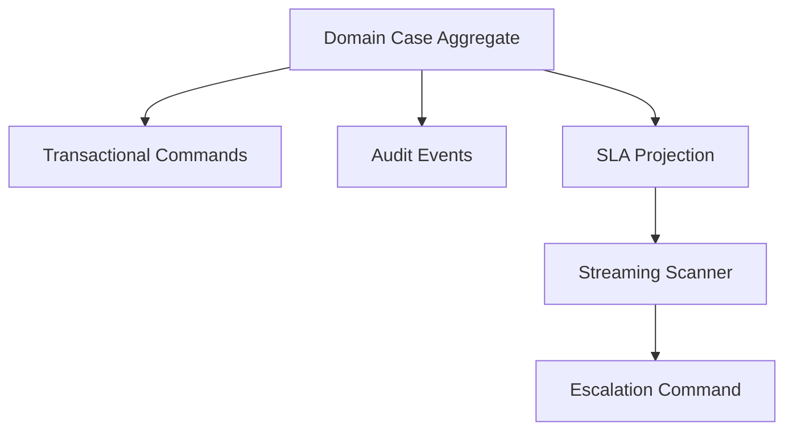

Domain correctness tetap di aggregate. Scan performance memakai projection.

---

## 29. Enterprise Example: Event Ingestion

Bad ingestion shape:

```java
record RawEvent(
    String id,
    String occurredAt,
    String payloadJson,
    Map<String, String> headers
) {}
```

Jika raw event diproses berkali-kali, parsing string berulang mahal.

Better staged shape:

```java
record ReceivedEvent(
    byte[] rawPayload,
    Map<String, String> headers,
    Instant receivedAt
) {}

record ParsedEvent(
    EventId id,
    EventType type,
    Instant occurredAt,
    JsonNode payload
) {}

record ValidatedCommand(
    CommandId commandId,
    CaseId caseId,
    EnforcementAction action,
    Instant occurredAt
) {}
```

Setiap stage punya cost dan invariant.

Pipeline thinking:

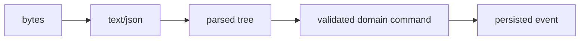

Jangan parse lebih awal dari kebutuhan. Jangan simpan raw lebih lama dari kebutuhan. Jangan hilangkan audit evidence yang wajib.

---

## 30. Records dan Performance

Record memberi concise nominal data carrier.

```java
record RiskScore(int value) {
    RiskScore {
        if (value < 0 || value > 100) {
            throw new IllegalArgumentException("Risk score must be 0..100");
        }
    }
}
```

Semantik bagus.

Runtime saat ini tetap object normal dengan identity.

Dalam banyak kasus ini tidak masalah:

- object tidak banyak;
- object tidak di hot path;
- JIT bisa mengeliminasi alokasi;
- clarity lebih penting.

Tetapi untuk array besar:

```java
RiskScore[] scores = new RiskScore[10_000_000];
```

Mungkin perlu compact representation:

```java
byte[] scores = new byte[10_000_000];
```

Tetapi bungkus akses:

```java
final class RiskScoreColumn {
    private final byte[] values;

    RiskScoreColumn(byte[] values) {
        this.values = values.clone();
    }

    RiskScore get(int index) {
        return new RiskScore(Byte.toUnsignedInt(values[index]));
    }
}
```

Boundary menyediakan domain type. Internal menyimpan compact representation.

---

## 31. Anti-Pattern: Performance by Leaking Primitives Everywhere

Buruk:

```java
void escalate(long caseId, byte status, long deadline, int riskScore) {
    // ...
}
```

Masalah:

- parameter swap risk;
- no domain semantics;
- validation tersebar;
- code sulit direview;
- API tidak defensible.

Lebih baik:

```java
void escalate(CaseId caseId, CaseStatus status, Deadline deadline, RiskScore riskScore) {
    // ...
}
```

Jika hot path perlu primitive, isolate:

```java
void escalateInternal(long caseId, byte statusCode, long deadlineEpochMillis, int riskScore) {
    // package-private, tested, not public domain API
}
```

Prinsip:

> Primitive representation boleh dipakai untuk storage/performance, tetapi domain boundary harus tetap semantic.

---

## 32. Anti-Pattern: Everything as Object Graph

Sebaliknya, terlalu object-heavy juga buruk.

```java
record RiskScore(
    ScoreValue value,
    RiskBand band,
    RiskPolicy policy,
    RiskExplanation explanation,
    List<RiskFactor> factors
) {}
```

Jika setiap request hanya butuh angka 0..100 untuk sorting, ini terlalu berat.

Pisahkan:

```java
record RiskScore(int value) {}
record RiskScoreDetails(RiskScore value, RiskExplanation explanation, List<RiskFactor> factors) {}
```

API bisa menyediakan detail hanya saat diperlukan.

---

## 33. Data Shape Review Checklist

Gunakan checklist ini saat review model data Java:

### Semantics

- Apakah tipe mewakili konsep domain yang benar?
- Apakah primitive obsession berbahaya?
- Apakah string dipakai sebagai substitute untuk type yang lebih kuat?
- Apakah nullability eksplisit?
- Apakah equality benar?

### Shape

- Berapa banyak object dibuat per entity?
- Apakah ada wrapper-heavy collection?
- Apakah array primitive cukup untuk projection internal?
- Apakah object graph terlalu dalam?
- Apakah field reference menunjuk object besar?

### Boundary

- Apakah object mutable bocor keluar?
- Apakah defensive copy perlu?
- Apakah copy terlalu sering?
- Apakah raw bytes/text diparse di boundary?
- Apakah ID/time/money dikonversi eksplisit?

### Lifetime

- Apakah object hidup sebentar atau lama?
- Apakah object masuk cache/queue/thread-local?
- Apakah object menahan reference besar?
- Apakah object aman dipublish lintas thread?

### Hot path

- Apakah code ini sering dieksekusi?
- Apakah data volume besar?
- Apakah allocation rate terukur tinggi?
- Apakah object shape menyebabkan GC pressure?
- Apakah ada profiling evidence?

---

## 34. Production Failure Modes

### Failure 1 — Wrapper-heavy aggregation

Symptom:

- GC tinggi;
- latency spike;
- CPU habis di allocation/GC.

Cause:

```java
List<Long> ids = fetchIds();
```

untuk jutaan ID.

Fix:

- streaming;
- primitive array;
- pagination;
- specialized data structure;
- avoid materialization.

### Failure 2 — Cache retains huge object graph

Symptom:

- memory leak terlihat sebagai cache growth;
- heap dump menunjukkan DTO besar hidup lama.

Cause:

- cache value menyimpan full aggregate;
- aggregate menyimpan document bytes;
- entry kecil menahan graph besar.

Fix:

- cache compact summary;
- separate payload store;
- explicit eviction;
- avoid back-reference.

### Failure 3 — String parsing in hot loop

Symptom:

- CPU tinggi;
- allocation rate tinggi;
- profiler menunjukkan `String`, `BigDecimal`, date parser.

Cause:

- timestamp/amount/status disimpan sebagai string terlalu lama.

Fix:

- parse once at boundary;
- canonical domain type;
- compact internal representation for scan.

### Failure 4 — Defensive copy storm

Symptom:

- memory bandwidth tinggi;
- large byte array copies;
- latency meningkat saat payload besar.

Cause:

- getter `byte[]` selalu clone di inner loop.

Fix:

- separate ownership copy and read-only access;
- streaming API;
- `ByteBuffer` view dengan hati-hati.

### Failure 5 — Object-rich report projection

Symptom:

- report batch OOM;
- DB query cepat, Java mapping lambat.

Cause:

- ORM hydrate full aggregate untuk report sederhana.

Fix:

- query projection;
- primitive/scalar DTO;
- streaming result;
- batch size control.

---

## 35. Decision Framework: Clarity First, Then Shape

Gunakan urutan keputusan ini:

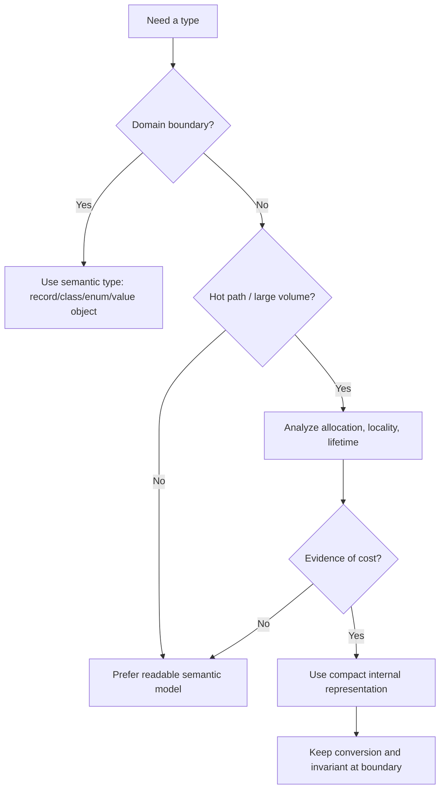

Default:

- domain clarity;
- immutability;
- explicit invariants;
- no premature primitive leakage.

Escalate to performance shape when:

- data volume besar;
- hot path jelas;
- allocation/GC/profiling evidence ada;
- representation bisa dikapsulasi;
- tests menjaga invariant.

---

## 36. Practice: Shape Audit

Ambil model berikut:

```java
record EnforcementCaseView(
    String caseId,
    String status,
    String openedAt,
    String deadlineAt,
    String penaltyAmount,
    String penaltyCurrency,
    List<String> violationCodes,
    Map<String, String> metadata
) {}
```

Tugas:

1. Buat versi boundary DTO.
2. Buat versi domain semantic model.
3. Buat versi projection untuk SLA scan.
4. Buat versi projection untuk reporting aggregate.
5. Jelaskan conversion antar-shape.
6. Identifikasi mana yang boleh mutable.
7. Identifikasi field yang bisa menyebabkan allocation hotspot.
8. Identifikasi field yang bisa menyebabkan semantic ambiguity.

Contoh arah jawaban:

```java
record EnforcementCaseInput(
    String caseId,
    String status,
    String openedAt,
    String deadlineAt,
    String penaltyAmount,
    String penaltyCurrency,
    List<String> violationCodes,
    Map<String, String> metadata
) {}

record EnforcementCase(
    CaseId caseId,
    CaseStatus status,
    Instant openedAt,
    Instant deadlineAt,
    Money penalty,
    Set<ViolationCode> violationCodes
) {}

record SlaScanRow(
    long caseId,
    byte statusCode,
    long deadlineEpochMillis
) {}

record PenaltyReportRow(
    short currencyCode,
    long amountMinorUnits,
    byte statusCode
) {}
```

---

## 37. Self-Correction Questions

Tanyakan ini setiap kali membuat type baru:

1. Apakah type ini memperjelas domain atau hanya membungkus tanpa invariant?
2. Apakah object ini akan dibuat dalam jumlah besar?
3. Apakah object ini akan hidup lama?
4. Apakah object ini masuk cache/queue/event/log?
5. Apakah field-nya mostly primitive atau reference?
6. Apakah ada nested collection?
7. Apakah ada wrapper di hot path?
8. Apakah string dipakai untuk angka/waktu/status?
9. Apakah conversion dilakukan sekali di boundary atau berulang?
10. Apakah profiling mendukung optimisasi yang direncanakan?

---

## 38. Key Takeaways

- Tipe Java punya semantic shape dan runtime shape.
- Primitive menyimpan value langsung; reference menunjuk object.
- Wrapper bukan primitive; wrapper adalah object dengan nullability dan identity trap.
- `int[]` sangat berbeda dari `List<Integer>`.
- Object graph dalam bisa mahal karena allocation, indirection, dan retained memory.
- Escape analysis dapat menghilangkan allocation tertentu, tetapi bukan kontrak bahasa.
- Domain model boleh object-rich; hot projection boleh compact.
- Jangan leak primitive representation ke seluruh domain API.
- Jangan hydrate full aggregate untuk use case yang butuh projection kecil.
- Ukur performa dengan profiler/JMH, bukan intuisi semata.
- Review tipe dari empat sudut: semantics, shape, boundary, lifetime.

---

## 39. Referensi Utama

- Java SE 25 API Documentation — `java.lang`, primitive wrappers, `Object`, `Class`.
- Java Language Specification Java SE 25 — Types, Values, Variables, Conversions, Expressions.
- OpenJDK HotSpot documentation and JDK tooling ecosystem.
- JMH — Java Microbenchmark Harness.
- Java Flight Recorder and Java Mission Control.
- JOL — Java Object Layout, untuk inspeksi layout pada JVM tertentu.

---

## 40. Bridge ke Part 032

Part ini menunjukkan bahwa object identity, wrapper, reference, dan object graph membawa cost runtime.

Part berikutnya membahas **Project Valhalla**: arah evolusi Java untuk mengurangi gap antara primitive efficiency dan object modeling, melalui value classes/value objects, enhanced primitive boxing, dan cara berpikir identity-free.
