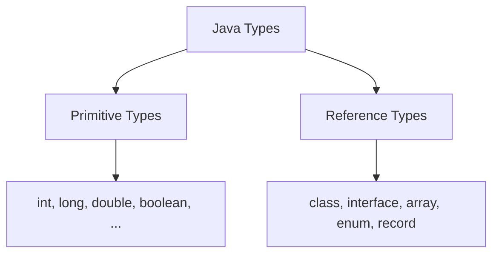
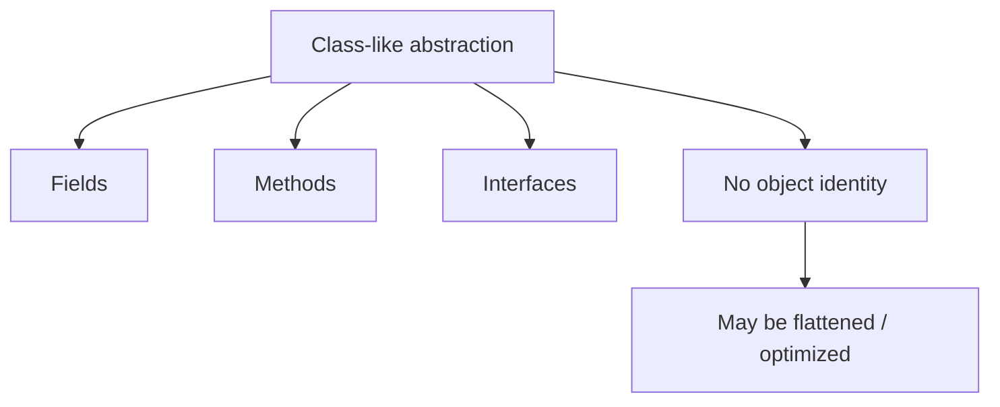
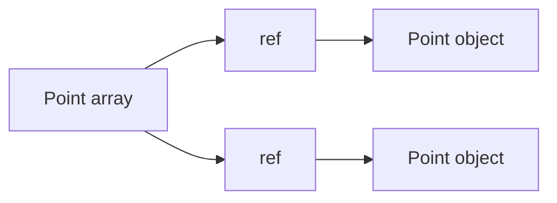

# Part 032 — Project Valhalla, Value Types & Java Type Future

> Target part ini: memahami arah evolusi Java type system tanpa hype. Kamu harus bisa membedakan fitur Java yang sudah stabil dari desain Valhalla yang masih bergerak, lalu mulai mendesain domain type hari ini agar lebih siap terhadap masa depan Java.

Project Valhalla adalah salah satu evolusi paling penting dalam sejarah Java type system. Motivasi besarnya sederhana:

> Java ingin mendekatkan expressiveness object-oriented dengan efficiency primitive-like representation.

Hari ini Java punya split besar:

- primitive types: cepat, compact, tidak punya identity, tidak nullable, tidak bisa dipakai langsung sebagai type argument generic;
- reference types: expressive, punya methods/interfaces/encapsulation, tetapi punya identity, nullable, allocation/reference overhead, dan wrapper cost.

Valhalla mencoba mengurangi gap itu.

Namun part ini harus dibaca dengan disiplin:

- jangan menganggap semua fitur Valhalla sudah tersedia di Java 25;
- jangan mengganti desain production berdasarkan syntax preview/early-access tanpa governance;
- jangan menyimpulkan detail final dari proposal yang masih berubah;
- pahami arah mental modelnya: **identity-free, value-centric, null-aware, flattening-friendly data modeling**.

---

## 1. Kenapa Valhalla Penting?

Masalah klasik Java:

```java
record Point(int x, int y) {}
```

Secara domain, `Point` adalah value.

Dua point dengan `x` dan `y` sama biasanya dianggap sama.

```java
Point a = new Point(1, 2);
Point b = new Point(1, 2);

System.out.println(a.equals(b)); // true
System.out.println(a == b);      // false
```

`record` memberi value-like API (`equals`, `hashCode`, `toString`) tetapi secara runtime tetap object biasa dengan identity.

Untuk banyak use case, ini tidak masalah.

Namun untuk jutaan `Point`, `Money`, `Range`, `RiskScore`, `LocalDate`, atau `Optional`, overhead identity/reference bisa mahal.

Valhalla bertanya:

> Bagaimana jika Java bisa punya user-defined data type yang tetap seperti class, tetapi dapat diperlakukan seperti value tanpa identity object normal?

---

## 2. Split Lama Java: Primitive vs Reference



Primitive:

- no identity;
- no `null`;
- compact;
- operations built-in;
- tidak bisa langsung menjadi `List<int>` dalam Java saat ini.

Reference:

- punya identity;
- nullable;
- bisa punya methods;
- bisa implement interfaces;
- bisa dipakai di generics;
- sering butuh heap allocation;
- menggunakan reference indirection.

Wrapper menjembatani primitive ke world of objects:

```java
int primitive = 42;
Integer boxed = primitive;
List<Integer> values = List.of(boxed);
```

Tetapi wrapper membawa masalah:

- boxing/unboxing;
- nullable object;
- identity trap;
- memory overhead;
- poor locality.

---

## 3. Value-Based Classes: Jembatan Konseptual Sebelum Valhalla

Java sudah lama punya konsep **value-based classes** di dokumentasi API.

Contoh umum:

- `Optional`;
- banyak tipe di `java.time`;
- wrapper tertentu secara konseptual value-like;
- immutable data carriers tertentu.

Value-based class biasanya punya ciri:

- instance yang equal harus diperlakukan interchangeable;
- caller tidak boleh bergantung pada identity;
- jangan synchronize pada instance;
- jangan mengandalkan identity hash code;
- jangan mengandalkan object identity untuk lifecycle.

Contoh:

```java
Optional<String> a = Optional.of("x");
Optional<String> b = Optional.of("x");

System.out.println(a.equals(b)); // true
System.out.println(a == b);      // do not rely on this
```

Value-based classes melatih developer untuk berpikir:

> Data ini punya nilai, bukan identity bisnis yang terpisah.

Valhalla membawa ide ini lebih jauh ke level language/VM.

---

## 4. Identity-Free Thinking

Object normal:

```java
final class MutableBox {
    int value;
}
```

Object ini punya identity dan mutable state.

Value-like object:

```java
record RiskScore(int value) {
    RiskScore {
        if (value < 0 || value > 100) {
            throw new IllegalArgumentException("0..100");
        }
    }
}
```

Domain rule:

- `RiskScore(80)` dan `RiskScore(80)` seharusnya interchangeable;
- tidak ada alasan bisnis membedakan dua instance dengan nilai sama;
- tidak perlu lock pada score;
- tidak perlu identity hash;
- tidak perlu object lifecycle terpisah.

Identity-free thinking bertanya:

1. Apakah dua instance dengan field sama harus dianggap sama?
2. Apakah instance ini punya lifecycle sendiri?
3. Apakah instance ini boleh dimutasi?
4. Apakah instance ini valid sebagai lock?
5. Apakah identity object dipakai untuk cache/session/tracking?
6. Apakah `==` punya makna bisnis?

Jika jawabannya “tidak” untuk identity/lifecycle/mutation, tipe itu kandidat value-like.

---

## 5. Value Object Bukan DDD Value Object Saja

Istilah “value object” bisa berarti beberapa hal:

| Istilah | Konteks | Makna |
|---|---|---|
| DDD value object | Domain modeling | Object ditentukan oleh nilai, immutable, tidak punya identity domain |
| Java value-based class | API convention | Jangan bergantung pada identity instance |
| Valhalla value object/class | Language/VM direction | Identity-free object dengan constraints dan kemungkinan layout lebih efisien |

Jangan mencampur secara ceroboh.

DDD value object hari ini bisa dibuat dengan `record` atau immutable class.

Valhalla value class adalah fitur bahasa/VM yang memberi semantik tambahan dan potensi optimization.

---

## 6. Apa yang Valhalla Ingin Selesaikan?

### Problem 1 — Wrapper overhead

```java
List<Integer> values = List.of(1, 2, 3);
```

Masalah:

- `Integer` wrapper;
- nullable;
- identity trap;
- object/reference overhead.

### Problem 2 — User-defined small values

```java
record Point(int x, int y) {}
Point[] points = new Point[1_000_000];
```

Masalah:

- array menyimpan references;
- each point likely separate object if escapes;
- locality poor;
- identity unnecessary.

### Problem 3 — Generics tidak menerima primitive directly

Saat ini:

```java
List<int> values; // not valid Java today
```

Harus pakai:

```java
List<Integer> values;
```

Valhalla punya arah untuk enhanced primitive boxing dan generics yang lebih baik agar primitive/value dapat bekerja lebih natural dengan generic APIs.

### Problem 4 — Nullability dan default value

Primitive tidak nullable. Reference nullable.

Value-like future perlu model lebih halus:

- apakah tipe boleh `null`?
- apakah ada default zero value?
- bagaimana array diinisialisasi?
- bagaimana field default bekerja?
- bagaimana migration dari existing reference type?

---

## 7. Current Stable Reality vs Future Direction

Untuk Java 25 production:

- class, record, enum, interface, primitive, wrapper tetap seperti yang kita bahas sebelumnya;
- `record` bukan Valhalla value class;
- `Integer` tetap wrapper reference type;
- `List<int>` belum menjadi Java production mainstream;
- object identity masih default untuk class/record;
- `Optional` tetap reference object;
- Valhalla masih perlu diperlakukan sebagai future/preview/early-access direction, bukan baseline production enterprise.

Jadi strategi hari ini:

> Tulis Java 25 production code dengan semantic clarity, immutability, records, enums, primitive-aware performance boundaries, dan hindari identity-dependence yang tidak perlu.

Itu membuat code lebih baik hari ini dan lebih siap untuk future Java.

---

## 8. JEP 401 Mental Model: Value Classes and Objects

JEP 401 memperkenalkan arah value classes/value objects sebagai class instances yang hanya punya final fields dan tidak punya object identity.

Tujuan konseptual:

- memungkinkan user-defined types tanpa identity;
- memberi VM peluang representasi lebih efisien;
- mempertahankan encapsulation dan methods;
- membuat value-like domain types lebih natural;
- mengurangi overhead object identity yang tidak perlu.

Simplified mental model:



Jangan menghafal syntax early-access sebagai final. Fokus pada konsep:

- no identity;
- immutable/final state;
- substitutability by value;
- better layout opportunity;
- restrictions around synchronization/identity operations.

---

## 9. What “No Identity” Changes

Object biasa:

```java
Object a = new Object();
Object b = new Object();
System.out.println(a == b); // false
```

Value-like semantics:

- tidak ada identity yang bisa dibedakan;
- equality by state menjadi natural;
- `synchronized(value)` tidak valid secara konseptual;
- identity hash code tidak meaningful;
- VM bebas merepresentasikan/menduplikasi/flatten value selama observable semantics tetap benar.

Analogi sederhana:

```java
int a = 10;
int b = 10;
```

Tidak ada pertanyaan “apakah ini int object yang sama?”. Yang penting adalah nilai.

Valhalla ingin user-defined type bisa mendekati model itu.

---

## 10. Flattening: Potensi Besar, Tapi Jangan Dianggap Selalu Terjadi

Flattening berarti value disimpan inline di container/field/array tanpa reference indirection seperti object normal.

Hari ini:

```java
Point[] points;
```

Bisa berarti:



Dengan value-friendly layout, future intuition:

```mermaid
flowchart LR
    A[Point array] --> P[inline Point values: x,y | x,y | x,y]
```

Benefit:

- fewer allocations;
- less GC pressure;
- better cache locality;
- less pointer chasing;
- more compact data.

Caveat:

- flattening adalah VM/layout opportunity, bukan selalu guarantee sederhana;
- nullability memengaruhi layout;
- interface upcast/generic use bisa memengaruhi representation;
- migration compatibility matters;
- jangan menulis correctness yang bergantung pada layout.

---

## 11. Nullability: Salah Satu Tantangan Paling Sulit

Primitive tidak nullable:

```java
int x = 0;
```

Reference nullable:

```java
String s = null;
```

Value-like type menimbulkan pertanyaan:

- apakah `Point` boleh `null`?
- jika field `Point p;` tidak diinisialisasi, default-nya apa?
- jika array `Point[]` dibuat, element default-nya apa?
- apakah null-restricted type syntax diperlukan?
- bagaimana migration API existing yang menerima null?

Ini sulit karena Java punya sejarah panjang null sebagai bagian dari reference type.

Future Java likely perlu membedakan lebih eksplisit antara nullable dan non-nullable/value-friendly forms.

Untuk desain hari ini:

- jangan gunakan `null` untuk domain absence yang penting;
- gunakan explicit optional/result/status;
- hindari API yang ambigu antara “not loaded”, “not applicable”, “unknown”, dan “empty”;
- dokumentasikan nullability;
- enforce with tests/static analysis where possible.

---

## 12. Enhanced Primitive Boxing: Mengurangi Gap Primitive-Generic

Problem hari ini:

```java
List<Integer> values = new ArrayList<>();
values.add(1);
```

Ini memakai wrapper.

Java tidak punya:

```java
List<int> values;
```

Enhanced primitive boxing mengarah pada dunia di mana primitive dan boxed/value forms lebih terpadu.

Target konseptual:

- generic APIs lebih ramah primitive;
- mengurangi kebutuhan wrapper allocation;
- mempertahankan compatibility existing code;
- menyatukan mental model primitive dan object lebih baik.

Namun untuk Java production saat ini:

- gunakan primitive arrays/streams untuk hot numeric path;
- gunakan wrapper collections ketika API generic membutuhkan;
- pahami boxing cost;
- jangan tunggu Valhalla untuk memperbaiki primitive obsession di domain model.

---

## 13. Universal Generics: Arah Besar, Bukan Shortcut Hari Ini

Generics Java hari ini bekerja dengan reference types dan type erasure.

Konsekuensi:

```java
List<Integer> list = new ArrayList<>();
```

Pada runtime, generic type information banyak yang erased. Element list adalah reference.

Arah Valhalla termasuk membuat generics lebih universal terhadap primitive/value types.

Mental model future:

```java
List<int>      // primitive-friendly generic container
List<Point>    // value-friendly container
```

Tetapi desain ini sulit karena:

- backward compatibility;
- erased generics ecosystem;
- reflection;
- arrays;
- method overloading;
- specialization explosion;
- binary compatibility;
- bridge methods;
- existing libraries.

Untuk engineer enterprise, takeaway-nya:

> Jangan desain API hari ini yang terlalu bergantung pada wrapper identity atau nullable generic elements jika sebenarnya data bersifat primitive/value.

---

## 14. Records vs Future Value Classes

Records hari ini:

```java
record Money(long minorUnits, String currencyCode) {}
```

Properties:

- concise syntax;
- final class;
- final fields;
- generated accessors;
- generated `equals`, `hashCode`, `toString`;
- shallow immutability;
- still ordinary reference object with identity.

Future value classes:

- likely identity-free;
- layout optimization opportunity;
- restrictions around identity operations;
- potentially better array/field representation.

Design guidance:

Use records today for small immutable data carriers with clear invariants.

```java
record RiskScore(int value) {
    RiskScore {
        if (value < 0 || value > 100) {
            throw new IllegalArgumentException("Risk score must be 0..100");
        }
    }
}
```

Avoid:

```java
if (score1 == score2) { ... } // meaningless for value-like domain
```

Prefer:

```java
if (score1.equals(score2)) { ... }
```

This habit makes code more future-friendly.

---

## 15. Mutability is the Enemy of Value Semantics

Mutable object cannot safely behave like value.

Bad candidate:

```java
final class MutableMoney {
    private BigDecimal amount;

    void add(BigDecimal delta) {
        amount = amount.add(delta);
    }
}
```

Why bad:

- value changes over time;
- equality can change;
- hash key breaks;
- thread-safety complicated;
- aliasing dangerous;
- cannot be freely copied/reordered/flattened without semantic risk.

Good candidate:

```java
record Money(long minorUnits, CurrencyCode currency) {
    Money add(Money other) {
        if (!currency.equals(other.currency)) {
            throw new IllegalArgumentException("currency mismatch");
        }
        return new Money(Math.addExact(minorUnits, other.minorUnits), currency);
    }
}
```

Value-like design returns new value instead of mutating existing one.

---

## 16. Identity-Dependent Anti-Patterns to Avoid Today

### Anti-pattern 1 — Synchronizing on value-like objects

```java
synchronized (amount) {
    // bad idea if amount is value-like
}
```

Use dedicated lock:

```java
private final Object lock = new Object();
```

### Anti-pattern 2 — Identity hash for domain value

```java
System.identityHashCode(caseId)
```

Wrong if `caseId` is value-like.

### Anti-pattern 3 — Using `==` on wrappers/value-like classes

```java
Integer a = 1000;
Integer b = 1000;
System.out.println(a == b); // do not do this
```

### Anti-pattern 4 — Caching by object identity

```java
IdentityHashMap<Money, TaxResult> cache;
```

If `Money` is value-like, use logical equality map.

### Anti-pattern 5 — Mutable hash keys

```java
Map<MutableKey, Value> map;
```

Mutable key breaks hash-based lookup.

---

## 17. Designing Valhalla-Friendly Domain Types Today

Checklist:

- make value-like types immutable;
- prefer records for transparent nominal carriers;
- validate in constructor/factory;
- avoid identity-sensitive operations;
- avoid synchronization on value-like instances;
- avoid `System.identityHashCode`;
- avoid exposing mutable components;
- avoid nullable fields when absence has domain meaning;
- use stable equality;
- keep representation compact where reasonable;
- separate domain type from persistence/API representation;
- avoid subclassing-based value semantics.

Example:

```java
record CaseId(String value) {
    CaseId {
        if (value == null || value.isBlank()) {
            throw new IllegalArgumentException("case id is required");
        }
        value = value.trim();
    }
}
```

Better if ID format is numeric internally:

```java
record CaseId(long value) {
    CaseId {
        if (value <= 0) {
            throw new IllegalArgumentException("case id must be positive");
        }
    }
}
```

The second is more compact and value-friendly.

But do not expose numeric ID if public API requires opaque ID semantics.

---

## 18. Value Type Candidates in Enterprise Systems

Good candidates:

- `CaseId`;
- `UserId`;
- `RiskScore`;
- `Percentage`;
- `MoneyAmount`;
- `CurrencyCode`;
- `CountryCode`;
- `Deadline`;
- `DateRange`;
- `GeoPoint`;
- `Quantity`;
- `Version`;
- `SequenceNumber`;
- `IdempotencyKey`;
- `CorrelationId`;
- `ViolationCode` if not enum.

Poor candidates:

- aggregate roots with lifecycle;
- entities with identity independent of field values;
- mutable session state;
- connection/resource handles;
- file/socket/transaction handles;
- locks;
- services;
- repositories;
- lazy-loaded proxies;
- objects relying on identity semantics.

Decision table:

| Type kind | Value-friendly? | Reason |
|---|---:|---|
| `RiskScore(0..100)` | Yes | immutable numeric domain |
| `Money(amount,currency)` | Yes | value equality by fields |
| `Case` aggregate | Usually no | lifecycle and identity |
| `UserSession` | No | temporal mutable session |
| `DbConnection` | No | resource identity |
| `PolicyVersion` | Yes | immutable identifier/version |
| `MutableBuffer` | No | mutable state and position |

---

## 19. Entity vs Value: Jangan Salah Migrasi

DDD entity:

```java
final class EnforcementCase {
    private final CaseId id;
    private CaseStatus status;
    private Instant updatedAt;
}
```

Dua `EnforcementCase` dengan ID sama mungkin merepresentasikan entity yang sama di waktu berbeda.

Equality entity biasanya rumit:

- by identity key?
- by full state?
- only after persistence?
- by business natural key?

Jangan jadikan aggregate root sebagai value-like type hanya demi performance.

Value object:

```java
record DateRange(LocalDate start, LocalDate end) {
    DateRange {
        if (end.isBefore(start)) {
            throw new IllegalArgumentException("end before start");
        }
    }
}
```

Dua `DateRange` dengan start/end sama memang interchangeable.

---

## 20. Arrays and Collections in a Valhalla World

Salah satu benefit yang diharapkan adalah array/container value bisa lebih compact.

Today:

```java
record Point(int x, int y) {}
Point[] points = new Point[1_000_000];
```

Future-friendly design:

- `Point` immutable;
- no identity dependency;
- no mutable component;
- no inheritance complexity;
- equality by value;
- compact fields.

Jika future VM bisa flatten, `Point[]` menjadi lebih attractive.

Namun hari ini, jika volume besar dan performance kritis, gunakan projection:

```java
final class PointColumns {
    private final int[] xs;
    private final int[] ys;
}
```

Jangan menunggu future JDK untuk workload production sekarang.

---

## 21. API Compatibility: Future Type Evolution Tidak Gratis

Mengubah public API dari class normal ke value class/value object future bisa berdampak pada:

- binary compatibility;
- source compatibility;
- reflection;
- serialization;
- frameworks;
- nullability;
- synchronization behavior;
- identity-sensitive code;
- ORM proxying;
- JSON binding;
- annotations;
- testing assumptions.

Jadi siapkan dari sekarang dengan convention:

- dokumentasikan type sebagai value-like;
- larang identity operations;
- buat constructor/factory jelas;
- jangan expose mutable internals;
- gunakan final class/record;
- gunakan equality by state;
- jangan jadikan value-like class sebagai lock;
- jangan bergantung pada subclassing.

---

## 22. Framework Boundary Risk

Enterprise Java banyak memakai framework:

- Jackson;
- Hibernate/JPA;
- Spring;
- Bean Validation;
- MapStruct;
- gRPC/protobuf;
- Kafka serializers;
- caches;
- object mappers;
- reflection-based libraries.

Future value classes mungkin punya interaction khusus dengan framework.

Risk:

- reflection assumptions;
- default constructor expectations;
- proxy subclassing;
- field access;
- null handling;
- serialization form;
- identity caching;
- bytecode enhancement.

Guideline hari ini:

- keep domain value objects simple;
- provide explicit factory/parser;
- keep persistence DTO separate when framework needs mutable/proxy form;
- test serialization contracts;
- do not expose framework artifacts as domain types.

---

## 23. Persistence Boundary

Value-like domain type:

```java
record Money(long minorUnits, CurrencyCode currency) {}
```

Database representation:

```sql
amount_minor_units BIGINT NOT NULL,
currency_code CHAR(3) NOT NULL
```

Good.

Avoid storing serialized Java object.

Design mapping explicitly:

```java
record MoneyColumns(long minorUnits, String currencyCode) {
    Money toDomain() {
        return new Money(minorUnits, new CurrencyCode(currencyCode));
    }

    static MoneyColumns fromDomain(Money money) {
        return new MoneyColumns(money.minorUnits(), money.currency().value());
    }
}
```

Future value type adoption should not break DB representation if boundary is explicit.

---

## 24. JSON/API Boundary

Value-like type should have stable external representation.

Bad:

```json
{
  "amount": {
    "minorUnits": 1000,
    "currency": {
      "value": "USD"
    }
  }
}
```

Maybe too Java-shape-driven.

Better API contract:

```json
{
  "amountMinorUnits": 1000,
  "currency": "USD"
}
```

Or:

```json
{
  "amount": "10.00",
  "currency": "USD"
}
```

Depends on contract.

Principle:

> API representation should be stable domain contract, not accidental Java object layout.

This matters even more if Java internal representation evolves.

---

## 25. Null-Restricted Thinking Today

Even before Java has full null-restricted type syntax in mainstream production, think this way:

```java
record EscalationCommand(
    CaseId caseId,
    EscalationReason reason,
    Instant requestedAt
) {}
```

None of these should be null.

Enforce:

```java
record EscalationCommand(
    CaseId caseId,
    EscalationReason reason,
    Instant requestedAt
) {
    EscalationCommand {
        Objects.requireNonNull(caseId, "caseId");
        Objects.requireNonNull(reason, "reason");
        Objects.requireNonNull(requestedAt, "requestedAt");
    }
}
```

For optional domain:

```java
record Assignment(
    CaseId caseId,
    Optional<UserId> assignedTo
) {}
```

But do not overuse `Optional` as field blindly. Sometimes a sealed domain state is clearer:

```java
sealed interface AssignmentStatus permits Unassigned, Assigned {}
record Unassigned() implements AssignmentStatus {}
record Assigned(UserId userId) implements AssignmentStatus {}
```

---

## 26. Migration Strategy for Existing Codebases

### Step 1 — Identify value-like types

Search for:

- immutable classes;
- records;
- classes with all final fields;
- `equals/hashCode` by state;
- domain wrappers around primitive/string;
- classes documented as value objects.

### Step 2 — Remove identity dependencies

Look for:

```java
==
System.identityHashCode(...)
synchronized(value)
IdentityHashMap
WeakHashMap assumptions
object pooling by identity
```

### Step 3 — Remove mutation

Refactor setters to constructor/factory/new instance operations.

### Step 4 — Clarify nullability

Add constructor validation and tests.

### Step 5 — Stabilize boundary representation

Do not expose Java object shape as API contract accidentally.

### Step 6 — Benchmark before changing representation

Use profiling/JMH before replacing domain objects with primitives.

---

## 27. Example: Refactoring a Primitive Wrapper Domain

Bad:

```java
void updateRisk(String caseId, Integer riskScore) {
    if (riskScore == null) {
        riskScore = 0;
    }
    // ...
}
```

Problems:

- `caseId` raw string;
- nullable score ambiguous;
- default 0 may be wrong;
- no range invariant;
- wrapper cost/identity trap.

Better:

```java
record CaseId(String value) {
    CaseId {
        if (value == null || value.isBlank()) {
            throw new IllegalArgumentException("caseId required");
        }
    }
}

record RiskScore(int value) {
    RiskScore {
        if (value < 0 || value > 100) {
            throw new IllegalArgumentException("riskScore must be 0..100");
        }
    }
}

void updateRisk(CaseId caseId, RiskScore riskScore) {
    Objects.requireNonNull(caseId);
    Objects.requireNonNull(riskScore);
    // ...
}
```

If absence is meaningful:

```java
sealed interface RiskScoreUpdate permits NoRiskScoreChange, SetRiskScore {}
record NoRiskScoreChange() implements RiskScoreUpdate {}
record SetRiskScore(RiskScore value) implements RiskScoreUpdate {}
```

This is more verbose, but more explicit and future-friendly.

---

## 28. Example: Value-Like Money

Current robust Java 25 design:

```java
record CurrencyCode(String value) {
    CurrencyCode {
        Objects.requireNonNull(value, "value");
        if (!value.matches("[A-Z]{3}")) {
            throw new IllegalArgumentException("currency must be ISO-like 3 uppercase letters");
        }
    }
}

record Money(long minorUnits, CurrencyCode currency) {
    Money {
        Objects.requireNonNull(currency, "currency");
    }

    Money add(Money other) {
        Objects.requireNonNull(other, "other");
        if (!currency.equals(other.currency)) {
            throw new IllegalArgumentException("currency mismatch");
        }
        return new Money(Math.addExact(minorUnits, other.minorUnits), currency);
    }
}
```

Properties:

- immutable;
- no identity dependency;
- compact amount representation;
- stable equality;
- explicit currency invariant;
- overflow safe;
- future value-friendly.

Avoid:

```java
class Money {
    BigDecimal amount;
    String currency;

    void setAmount(BigDecimal amount) { ... }
}
```

---

## 29. Example: DateRange as Value-Like Type

```java
record DateRange(LocalDate startInclusive, LocalDate endExclusive) {
    DateRange {
        Objects.requireNonNull(startInclusive, "startInclusive");
        Objects.requireNonNull(endExclusive, "endExclusive");
        if (endExclusive.isBefore(startInclusive)) {
            throw new IllegalArgumentException("end before start");
        }
    }

    boolean contains(LocalDate date) {
        Objects.requireNonNull(date, "date");
        return !date.isBefore(startInclusive) && date.isBefore(endExclusive);
    }
}
```

Good value-like candidate:

- immutable;
- state equality;
- no identity lifecycle;
- clear invariant;
- methods operate on value;
- no synchronization needed.

---

## 30. Example: Do Not Make Resource Handles Value-Like

Bad idea:

```java
record DbConnectionHandle(String id) {}
```

Even if it is a record, connection/resource identity matters:

- lifecycle open/closed;
- OS/network resource;
- transaction state;
- pooling;
- failure state;
- identity matters beyond fields.

Do not treat resource handles as simple values.

---

## 31. What Top Engineers Should Watch

Track these areas over future Java releases:

- value classes/value objects JEP status;
- null-restricted/nullability syntax;
- enhanced primitive boxing;
- universal/reified/specialized generics direction;
- JVM flattening behavior;
- framework support;
- serialization and reflection updates;
- migration tooling;
- JDK value-based class warnings;
- library ecosystem adaptation.

But do not block current architecture waiting for future features.

The best preparation is writing clear, immutable, value-like domain types now.

---

## 32. Design Review Checklist: Valhalla-Ready Type

A type is future-friendly if:

- it is immutable;
- all fields are final or effectively final;
- no setters;
- no identity-based logic;
- no synchronization on instances;
- no reliance on object address/identity hash;
- equality is by state;
- hash code uses immutable state;
- no mutable components are exposed;
- nullability is explicit;
- constructor enforces invariant;
- serialization/API representation is stable;
- persistence mapping is explicit;
- no framework proxy requirement;
- type is small and cohesive;
- type represents a value, not an entity/resource/service.

A type is not future-friendly if:

- mutable;
- identity-sensitive;
- subclass-heavy;
- lifecycle-managed;
- proxied by ORM;
- used as lock;
- stores external resource;
- exposes arrays/collections mutably;
- relies on `==`;
- accepts null casually.

---

## 33. Production Governance for Preview/Early-Access Features

If your organization experiments with Valhalla builds:

- isolate experiments outside production codebase;
- benchmark with realistic data;
- document JDK build version;
- avoid publishing libraries based on unstable syntax;
- verify framework compatibility;
- compare with Java 25 baseline;
- test serialization/reflection;
- measure allocation and GC, not just CPU;
- record migration risks;
- do not mix preview language assumptions into long-lived contracts.

Preview/early-access features are excellent for learning and design preparation. They are not automatically suitable for regulated production systems.

---

## 34. Failure Modes in Future-Type Thinking

### Failure 1 — Hype-driven rewrite

Symptom:

- team rewrites domain model chasing future performance;
- framework breaks;
- no measurable benefit.

Fix:

- profile first;
- isolate experiments;
- keep stable production model.

### Failure 2 — Confusing record with value class

Symptom:

- developer assumes records are allocation-free or identity-free.

Fix:

- remember records are normal reference objects today.

### Failure 3 — Identity reliance blocks future migration

Symptom:

- code uses `==`, `IdentityHashMap`, synchronization on value-like classes.

Fix:

- refactor identity assumptions out early.

### Failure 4 — Null ambiguity

Symptom:

- future non-null/value migration impossible because APIs use null casually.

Fix:

- introduce explicit absence modeling.

### Failure 5 — Framework coupling

Symptom:

- domain values cannot evolve because ORM/Jackson/proxy assumptions leak in.

Fix:

- separate domain model from persistence/API adapters.

---

## 35. Practice: Classify Types

Classify each type as value-friendly, entity, resource, service, or projection:

```java
record CaseId(String value) {}
record RiskScore(int value) {}
record Money(long minorUnits, String currency) {}
final class EnforcementCase { CaseId id; CaseStatus status; }
record DateRange(LocalDate start, LocalDate end) {}
final class PdfDocumentStream { InputStream input; }
record SlaScanRow(long caseId, byte statusCode, long deadlineEpochMillis) {}
final class EscalationService { ... }
```

Expected direction:

| Type | Classification | Note |
|---|---|---|
| `CaseId` | value-friendly | if immutable/validated |
| `RiskScore` | value-friendly | range invariant |
| `Money` | value-friendly | currency should be typed |
| `EnforcementCase` | entity/aggregate | lifecycle identity |
| `DateRange` | value-friendly | immutable interval |
| `PdfDocumentStream` | resource | lifecycle/resource identity |
| `SlaScanRow` | projection | compact internal representation |
| `EscalationService` | service | behavior, no value semantics |

---

## 36. Practice: Remove Identity Dependencies

Find problems:

```java
record CaseId(String value) {}

final class CaseLockRegistry {
    private final Map<CaseId, Object> locks = new IdentityHashMap<>();

    Object lockFor(CaseId caseId) {
        return locks.computeIfAbsent(caseId, ignored -> caseId);
    }
}
```

Problems:

- `IdentityHashMap` wrong for value-like `CaseId`;
- lock object is `caseId` itself;
- synchronization may depend on instance identity;
- equivalent `CaseId` values might produce different locks.

Better:

```java
final class CaseLockRegistry {
    private final ConcurrentMap<CaseId, Object> locks = new ConcurrentHashMap<>();

    Object lockFor(CaseId caseId) {
        return locks.computeIfAbsent(caseId, ignored -> new Object());
    }
}
```

Still consider cleanup/eviction.

---

## 37. Practice: Boundary-Stable Money

Given:

```java
record Money(BigDecimal amount, Currency currency) {}
```

Design:

1. internal compact representation;
2. JSON representation;
3. database representation;
4. equality semantics;
5. rounding policy;
6. migration path if future Java supports value classes.

One possible answer:

```java
record CurrencyCode(String value) {}
record Money(long minorUnits, CurrencyCode currency) {}
record MoneyJson(String amount, String currency) {}
record MoneyColumns(long amountMinorUnits, String currencyCode) {}
```

Policy:

- parse decimal at boundary;
- store minor units internally;
- enforce currency scale;
- never expose internal Java object layout as API contract;
- do not rely on object identity.

---

## 38. Key Takeaways

- Valhalla addresses the gap between primitive efficiency and object expressiveness.
- Records today are not identity-free value classes; they are normal reference objects with generated value-like methods.
- Value-like design today means immutability, state equality, no identity dependency, explicit nullability, and stable boundary representation.
- Avoid synchronizing on value-like objects.
- Avoid `==` and `IdentityHashMap` for value-like types.
- Do not convert entities/resources/services into values just for performance.
- Future Java may improve layout and generic support, but production design today must remain correct on stable Java.
- The best migration preparation is clean semantic modeling now.

---

## 39. Referensi Utama

- OpenJDK Project Valhalla.
- JEP 401 — Value Classes and Objects.
- JEP 402 — Enhanced Primitive Boxing.
- Java SE 25 API Documentation — `java.lang`, value-based classes, records, wrappers.
- Java Language Specification Java SE 25 — types, values, variables, classes, records, generics, conversions.
- Inside Java articles and Valhalla early-access builds for experimentation.

---

## 40. Bridge ke Part 033

Part ini memberi arah masa depan Java type system.

Part berikutnya akan kembali ke production reality: **type system failure modes and production postmortems**. Kita akan membedah overflow, rounding, timezone, null, equality, enum evolution, serialization mismatch, dan data corruption sebagai insiden desain tipe.
