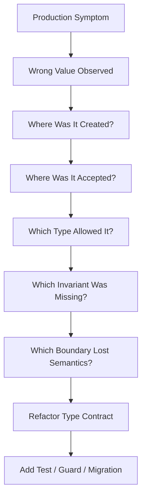

# Part 033 — Type System Failure Modes & Production Postmortems

> Target skill: mampu membaca incident production bukan hanya sebagai “bug implementasi”, tetapi sebagai kegagalan representasi data, invariant, boundary, dan type contract.

Part ini adalah bagian penutup sebelum capstone. Setelah kita membahas primitive, reference, class, interface, record, enum, array, boxing, conversion, `String`, Unicode, `BigDecimal`, time, byte, identifier, value object, serialization boundary, dan memory/performance, sekarang kita gunakan semuanya sebagai alat diagnosis.

Seorang engineer senior tidak hanya bertanya:

> “Baris kode mana yang salah?”

Tetapi:

> “Mengapa tipe yang kita pilih mengizinkan state salah itu masuk, menyebar, dan terlihat valid sampai production?”

Itulah inti part ini.

---

## 1. Kaufman Angle: Failure Mode as Feedback Loop

Dalam kerangka Josh Kaufman, skill mastery dipercepat ketika kita:

1. **Memecah skill** menjadi subskill kecil.
2. **Belajar cukup untuk bisa self-correct**.
3. **Menghapus hambatan praktik**.
4. **Melatih subskill paling bernilai secara sengaja**.

Untuk type mastery, feedback loop terbaik adalah postmortem.



Tujuan part ini bukan menghafal daftar bug. Tujuannya membangun refleks:

- ketika melihat bug angka, pikirkan **range, precision, scale, rounding, promotion, overflow**;
- ketika melihat bug tanggal, pikirkan **instant, local time, zone, business calendar, valid time, transaction time**;
- ketika melihat bug data API, pikirkan **type loss, null-vs-absent, enum evolution, JSON number precision**;
- ketika melihat bug collection/cache, pikirkan **equality, hashCode, mutability, identity**;
- ketika melihat bug authorization/case workflow, pikirkan **state model, closed domain, transition invariant**.

---

## 2. The Production Failure Taxonomy

Sebagian besar incident tipe jatuh ke salah satu kategori berikut.

| Category | Root Cause | Typical Symptom | Stronger Type Move |
|---|---|---|---|
| Numeric overflow | Range tidak divalidasi | total negatif, counter wrap | `Math.addExact`, range value object |
| Floating approximation | `double` dipakai untuk exact domain | invoice/money mismatch | `BigDecimal` + rounding policy |
| Decimal scale mismatch | `BigDecimal.equals`/scale salah | duplicate key, failed lookup | canonical scale wrapper |
| Null ambiguity | `null` berarti banyak hal | NPE, wrong authorization, missing data | explicit absence type/result |
| Equality/hash bug | mutable key atau equality salah | cache miss, duplicate set entry | immutable key, stable equality |
| Enum evolution | external value disamakan dengan enum `name`/`ordinal` | API break, DB corruption | stable code + unknown handling |
| Text encoding | bytes dianggap text tanpa charset | corrupt name/address/search | explicit charset boundary |
| Unicode normalization | text visual sama tapi binary beda | duplicate account, failed matching | normalization policy |
| Timezone/DST | local time dipakai sebagai instant | missed deadline, double execution | explicit temporal type |
| ID/key confusion | public/internal/natural key tercampur | data leak, wrong tenant access | typed IDs + scoped key |
| Boxing/unboxing | wrapper dianggap primitive | NPE, identity compare bug | primitive default or explicit optional |
| Array/buffer aliasing | mutable data keluar boundary | signature mismatch, audit drift | defensive copy/snapshot |
| Serialization loss | Java type semantics hilang di JSON/DB | precision loss, null issue, enum break | schema contract + adapters |
| Flag explosion | boolean flags menggantikan state | impossible combination | enum/state machine/sealed type |
| Mutable record component | record dianggap deep immutable | cache/audit value changes | copy in constructor/accessor |

Pola umumnya sama:


Bug paling mahal jarang terjadi saat data pertama kali salah. Biasanya bug menjadi mahal karena data salah **tetap terlihat type-correct**.

---

## 3. Postmortem Lens for Type-Related Incidents

Gunakan lensa berikut setiap kali incident berkaitan dengan data.

### 3.1 Symptom Layer

Tanyakan:

- Nilai apa yang salah?
- Di mana pertama kali nilai salah terlihat?
- Apakah salahnya range, precision, identity, absence, time, ordering, encoding, atau state?
- Apakah salahnya deterministic atau intermittent?

Contoh:

```text
Symptom:
A penalty deadline was computed one day late for cases in a specific timezone.

Wrong value:
2026-03-30T00:00 local was treated as if it were UTC.

Data category:
Temporal semantics: LocalDateTime used as Instant.
```

### 3.2 Invariant Layer

Tanyakan:

- Invariant apa yang seharusnya tidak pernah dilanggar?
- Apakah invariant itu ditulis di type constructor, service method, database constraint, test, atau hanya di komentar?
- Apakah semua entry point melewati invariant yang sama?

Contoh invariant:

```java
record PenaltyWindow(LocalDate startDate, LocalDate endDate) {
    PenaltyWindow {
        Objects.requireNonNull(startDate);
        Objects.requireNonNull(endDate);
        if (endDate.isBefore(startDate)) {
            throw new IllegalArgumentException("endDate must not be before startDate");
        }
    }
}
```

### 3.3 Boundary Layer

Tanyakan:

- Apakah semantics berubah saat melewati JSON, DB, queue, file, cache, log, atau UI?
- Apakah timezone, scale, currency, charset, enum code, tenant scope, atau unit hilang?
- Apakah downstream punya asumsi yang sama?

### 3.4 Recovery Layer

Tanyakan:

- Apakah data yang salah sudah persisted?
- Apakah perlu migration/backfill?
- Apakah event lama perlu replay?
- Apakah ada audit/legal impact?
- Apakah type fix backward-compatible?

---

## 4. Failure Mode 1 — Integral Overflow and Truncation

### Problem

Integral types di Java punya fixed range. `int` overflow tidak otomatis melempar exception.

```java
int max = Integer.MAX_VALUE;
int broken = max + 1; // wraps to Integer.MIN_VALUE
```

Bug ini sering muncul di:

- counter;
- pagination offset;
- duration dalam milliseconds;
- financial quantity minor unit;
- batch size multiplication;
- array/buffer length calculation;
- hash or scoring formula.

### Bad Production Shape

```java
int totalBytes = recordCount * averageRecordSize;
byte[] payload = new byte[totalBytes];
```

Jika multiplication overflow menjadi negatif atau terlalu kecil, hasilnya bisa:

- `NegativeArraySizeException`;
- allocation size salah;
- buffer under-allocation;
- truncated payload;
- security issue bila length validation salah.

### Stronger Fix

```java
record PayloadSize(int bytes) {
    private static final int MAX_PAYLOAD_BYTES = 10 * 1024 * 1024;

    PayloadSize {
        if (bytes < 0 || bytes > MAX_PAYLOAD_BYTES) {
            throw new IllegalArgumentException("payload size out of range: " + bytes);
        }
    }

    static PayloadSize fromRecordEstimate(int recordCount, int averageRecordSize) {
        int bytes = Math.multiplyExact(recordCount, averageRecordSize);
        return new PayloadSize(bytes);
    }
}
```

### Review Questions

- Apakah arithmetic bisa overflow sebelum di-cast ke `long`?
- Apakah multiplication terjadi pada `int` lalu baru assignment ke `long`?
- Apakah range domain lebih kecil dari range tipe Java?
- Apakah invalid value harus gagal cepat?

---

## 5. Failure Mode 2 — Floating-Point Used for Exact Domain

### Problem

`float` dan `double` cocok untuk approximate arithmetic, bukan exact business arithmetic.

```java
double a = 0.1;
double b = 0.2;
System.out.println(a + b); // not exactly 0.3
```

### Bad Production Shape

```java
record Fine(double amount) {}
```

Masalah:

- tidak ada currency;
- tidak ada scale;
- tidak ada rounding policy;
- equality unstable;
- serialization bisa memberi representasi mengejutkan;
- audit tidak defensible untuk uang.

### Stronger Fix

```java
record Money(BigDecimal amount, Currency currency) {
    Money {
        Objects.requireNonNull(amount);
        Objects.requireNonNull(currency);
        amount = amount.setScale(currency.getDefaultFractionDigits(), RoundingMode.HALF_UP);
        if (amount.signum() < 0) {
            throw new IllegalArgumentException("money must not be negative");
        }
    }

    Money plus(Money other) {
        requireSameCurrency(other);
        return new Money(amount.add(other.amount), currency);
    }

    private void requireSameCurrency(Money other) {
        if (!currency.equals(other.currency)) {
            throw new IllegalArgumentException("currency mismatch");
        }
    }
}
```

### Review Questions

- Apakah domain butuh exact arithmetic?
- Apakah ada currency/unit?
- Apakah rounding policy eksplisit?
- Apakah comparison memakai policy domain, bukan raw `equals` sembarangan?

---

## 6. Failure Mode 3 — BigDecimal Scale and Equality Trap

### Problem

`BigDecimal.compareTo` dan `BigDecimal.equals` punya semantics berbeda.

```java
new BigDecimal("1.0").compareTo(new BigDecimal("1.00")) == 0; // true
new BigDecimal("1.0").equals(new BigDecimal("1.00"));        // false
```

Jika `BigDecimal` dipakai sebagai key tanpa canonicalization, lookup bisa gagal.

### Bad Production Shape

```java
Map<BigDecimal, FeeRule> rulesByRate = new HashMap<>();
rulesByRate.put(new BigDecimal("0.10"), rule);

FeeRule found = rulesByRate.get(new BigDecimal("0.100")); // null
```

### Stronger Fix

```java
record Rate(BigDecimal value) {
    private static final int SCALE = 6;

    Rate {
        Objects.requireNonNull(value);
        value = value.setScale(SCALE, RoundingMode.UNNECESSARY);
        if (value.signum() < 0) {
            throw new IllegalArgumentException("rate must not be negative");
        }
    }
}
```

### Review Questions

- Apakah scale bagian dari identity domain?
- Apakah semua input dinormalisasi?
- Apakah map/set key memakai canonical representation?
- Apakah DB column scale cocok dengan Java scale?

---

## 7. Failure Mode 4 — Null Means Too Many Things

### Problem

`null` sering dipakai untuk banyak arti sekaligus:

- belum dimuat;
- tidak ditemukan;
- tidak berlaku;
- disembunyikan karena authorization;
- error saat mengambil data;
- field memang kosong;
- input tidak dikirim.

Ini berbahaya karena semua arti berbeda itu memakai value yang sama.

### Bad Production Shape

```java
String assignedOfficerId = caseRecord.assignedOfficerId();

if (assignedOfficerId == null) {
    autoAssign(caseRecord);
}
```

Apakah `null` berarti belum assigned? Atau user tidak berhak melihat officer? Atau migration lama belum mengisi? Atau data corrupt?

### Stronger Fix

```java
sealed interface AssignmentStatus permits Unassigned, Assigned, RestrictedAssignmentView {}

record Unassigned() implements AssignmentStatus {}
record Assigned(OfficerId officerId) implements AssignmentStatus {}
record RestrictedAssignmentView() implements AssignmentStatus {}
```

Sekarang state berbeda menjadi tipe berbeda.

### Review Questions

- Apakah `null` punya lebih dari satu arti?
- Apakah parameter nullable didokumentasikan dan diuji?
- Apakah `Optional` hanya dipakai pada boundary return, bukan field/domain state sembarangan?
- Apakah authorization tidak dicampur dengan absence?

---

## 8. Failure Mode 5 — Mutable Equality Key

### Problem

Hash-based collections mengandalkan hash code stabil selama object berada di collection.

### Bad Production Shape

```java
class CaseKey {
    private String tenantId;
    private String caseNumber;

    // equals/hashCode use tenantId and caseNumber

    void setCaseNumber(String caseNumber) {
        this.caseNumber = caseNumber;
    }
}
```

Jika `caseNumber` berubah setelah object masuk `HashMap`, entry bisa tidak ditemukan.

### Stronger Fix

```java
record CaseKey(TenantId tenantId, CaseNumber caseNumber) {
    CaseKey {
        Objects.requireNonNull(tenantId);
        Objects.requireNonNull(caseNumber);
    }
}
```

### Review Questions

- Apakah field yang dipakai equality immutable?
- Apakah object dipakai sebagai key di map/set/cache?
- Apakah equality berdasarkan identity, natural key, atau surrogate key?
- Apakah object entity berubah lifecycle-nya setelah persisted?

---

## 9. Failure Mode 6 — Enum Evolution Breaks External Contracts

### Problem

Enum bagus untuk closed domain. Tetapi enum buruk jika external contract memakai `ordinal()` atau `name()` tanpa strategi evolusi.

### Bad Production Shape

```java
// Stored in DB
status.ordinal();
```

Jika enum order berubah, data lama berubah arti.

### Better Shape

```java
enum CaseStatus {
    DRAFT("DRAFT"),
    SUBMITTED("SUBMITTED"),
    UNDER_REVIEW("UNDER_REVIEW"),
    CLOSED("CLOSED");

    private final String code;

    CaseStatus(String code) {
        this.code = code;
    }

    String code() {
        return code;
    }

    static Optional<CaseStatus> fromCode(String code) {
        return Arrays.stream(values())
            .filter(status -> status.code.equals(code))
            .findFirst();
    }
}
```

### Enterprise Concern

Jika sistem menerima enum value dari external system, pertimbangkan model:

```java
sealed interface ExternalCaseStatus permits KnownExternalCaseStatus, UnknownExternalCaseStatus {}
record KnownExternalCaseStatus(CaseStatus status) implements ExternalCaseStatus {}
record UnknownExternalCaseStatus(String rawCode) implements ExternalCaseStatus {}
```

Ini membuat integrasi lebih tahan terhadap enum value baru.

---

## 10. Failure Mode 7 — Text Encoding and Unicode Normalization

### Problem

Text bukan hanya `String`. Text punya:

- charset;
- encoding;
- normalization;
- locale;
- collation;
- case mapping;
- grapheme cluster;
- byte boundary.

### Bad Production Shape

```java
String body = new String(bytes); // platform default charset
```

Kode ini bergantung pada default charset runtime. Untuk boundary enterprise, ini terlalu implisit.

### Better Shape

```java
String body = new String(bytes, StandardCharsets.UTF_8);
byte[] bytes = body.getBytes(StandardCharsets.UTF_8);
```

### Normalization Example

Dua string bisa terlihat sama tetapi punya byte representation berbeda.

```java
String normalized = Normalizer.normalize(input, Normalizer.Form.NFC);
```

### Review Questions

- Apakah setiap byte-to-text conversion menyebut charset?
- Apakah user-facing identifier butuh normalization?
- Apakah comparison harus case-sensitive, locale-sensitive, atau binary exact?
- Apakah hashing/signature dilakukan sebelum atau sesudah normalization?

---

## 11. Failure Mode 8 — Temporal Ambiguity

### Problem

Tanggal/waktu production bug biasanya bukan karena Java API kurang. Biasanya karena model domain salah.

Contoh ambiguity:

```java
LocalDateTime deadline = LocalDateTime.parse("2026-03-29T02:30:00");
```

Apakah ini:

- local wall-clock time di zona tertentu?
- instant global?
- business deadline date?
- timestamp event diterima?
- valid-time domain?
- transaction-time record?

### Stronger Type Split

```java
record SubmittedAt(Instant value) {}
record EffectiveDate(LocalDate value) {}
record BusinessDeadline(ZonedDateTime value) {}
record RecordedAt(Instant value) {}
```

### Failure Modes

| Failure | Cause | Fix |
|---|---|---|
| Deadline missed | `LocalDateTime` tanpa zone | use `ZonedDateTime` or domain deadline type |
| Report shifted | DB timezone conversion | explicit storage contract |
| Duplicate job run | DST overlap | idempotent schedule key |
| Invalid local time | DST gap | resolve policy explicitly |
| Wrong audit ordering | local timestamp compared across zones | use `Instant` for timeline ordering |

### Review Questions

- Apakah waktu ini timeline atau calendar?
- Apakah timezone bagian dari data?
- Apakah business day sama dengan 24 hours?
- Apakah valid time dan transaction time terpisah?

---

## 12. Failure Mode 9 — ID and Key Confusion

### Problem

`String id` adalah smell jika domain punya banyak jenis ID.

```java
void assign(String caseId, String officerId, String tenantId) {}
```

Bug yang mungkin:

```java
assign(officerId, caseId, tenantId); // compiles
```

### Stronger Shape

```java
record TenantId(UUID value) {}
record CaseId(UUID value) {}
record OfficerId(UUID value) {}

void assign(CaseId caseId, OfficerId officerId, TenantId tenantId) {}
```

### Enterprise Failure Modes

- internal DB ID bocor ke public API;
- cross-tenant access karena key tidak scoped;
- idempotency key dipakai ulang di context salah;
- correlation ID disamakan dengan business ID;
- natural key berubah tetapi dipakai sebagai immutable reference;
- public ID predictable sehingga memudahkan enumeration attack.

### Review Questions

- Apakah ID punya scope tenant?
- Apakah ID public berbeda dari primary key internal?
- Apakah ID sortable, random, deterministic, atau semantic?
- Apakah idempotency key mengandung operation scope?

---

## 13. Failure Mode 10 — Byte Array and Buffer Aliasing

### Problem

`byte[]` mutable. Jika byte array keluar boundary tanpa copy, pemilik luar bisa mengubah data internal.

### Bad Shape

```java
record Signature(byte[] bytes) {}
```

Record ini terlihat immutable, tetapi tidak deep immutable.

```java
byte[] raw = loadSignature();
Signature signature = new Signature(raw);
raw[0] = 42; // signature berubah
```

### Better Shape

```java
record Signature(byte[] bytes) {
    Signature {
        bytes = bytes.clone();
    }

    @Override
    public byte[] bytes() {
        return bytes.clone();
    }
}
```

### Review Questions

- Apakah array/buffer keluar dari aggregate?
- Apakah object mengklaim immutable tetapi punya mutable component?
- Apakah hash/signature dihitung dari snapshot?
- Apakah `ByteBuffer.slice()`/`duplicate()` masih berbagi backing storage?

---

## 14. Failure Mode 11 — Boxing and Wrapper Identity

### Problem

Wrapper object bukan primitive.

```java
Integer a = 1000;
Integer b = 1000;
System.out.println(a == b); // false in common implementations
```

Lebih buruk lagi:

```java
Boolean enabled = null;
if (enabled) { // NullPointerException from unboxing
    run();
}
```

### Better Shape

```java
enum FeatureDecision {
    ENABLED,
    DISABLED,
    NOT_CONFIGURED
}
```

### Review Questions

- Apakah wrapper nullable dengan sengaja?
- Apakah `==` dipakai pada wrapper?
- Apakah collection memaksa boxing di hot path?
- Apakah overload method menerima primitive dan wrapper sekaligus?

---

## 15. Failure Mode 12 — Serialization Boundary Type Loss

### Problem

Saat Java object menjadi JSON, DB row, Kafka message, log, atau CSV, banyak semantics hilang.

Java side:

```java
record Payment(Money amount, Instant submittedAt, CaseStatus status) {}
```

JSON side:

```json
{
  "amount": "100.00",
  "currency": "IDR",
  "submittedAt": "2026-06-30T10:15:30Z",
  "status": "SUBMITTED"
}
```

Yang harus dijaga:

- amount numeric atau string?
- scale canonical?
- timezone format?
- enum unknown handling?
- null vs absent?
- backward compatibility?
- schema version?

### Boundary Contract Checklist

| Type | Boundary Risk | Contract Rule |
|---|---|---|
| `BigDecimal` | precision loss | encode as string or exact decimal policy |
| `Instant` | timezone lost | ISO-8601 UTC with `Z` or explicit zone contract |
| `LocalDate` | interpreted as instant | never attach timezone implicitly |
| enum | new value breaks consumer | stable code + unknown strategy |
| UUID | string format variance | canonical lowercase string |
| bytes | binary not JSON-safe | base64 with size limit |
| optional | null vs absent | define PATCH/create semantics |
| record | constructor invariants bypassed by framework | validate after deserialization |

---

## 16. Failure Mode 13 — Boolean Flag Explosion

### Problem

Boolean flags terlihat sederhana sampai kombinasi state menjadi tidak masuk akal.

```java
record CaseView(
    boolean submitted,
    boolean approved,
    boolean rejected,
    boolean closed,
    boolean reopened
) {}
```

Kombinasi invalid:

```text
approved=true, rejected=true
closed=false, reopened=true
submitted=false, approved=true
```

### Better Shape

```java
enum CaseLifecycleStatus {
    DRAFT,
    SUBMITTED,
    UNDER_REVIEW,
    APPROVED,
    REJECTED,
    CLOSED,
    REOPENED
}
```

Untuk transition rule:

```java
record CaseLifecycle(CaseLifecycleStatus status) {
    CaseLifecycle transitionTo(CaseLifecycleStatus next) {
        if (!allowed(status, next)) {
            throw new IllegalStateException("invalid transition: " + status + " -> " + next);
        }
        return new CaseLifecycle(next);
    }

    private static boolean allowed(CaseLifecycleStatus from, CaseLifecycleStatus to) {
        return switch (from) {
            case DRAFT -> to == CaseLifecycleStatus.SUBMITTED;
            case SUBMITTED -> to == CaseLifecycleStatus.UNDER_REVIEW;
            case UNDER_REVIEW -> to == CaseLifecycleStatus.APPROVED || to == CaseLifecycleStatus.REJECTED;
            case APPROVED, REJECTED -> to == CaseLifecycleStatus.CLOSED;
            case CLOSED -> to == CaseLifecycleStatus.REOPENED;
            case REOPENED -> to == CaseLifecycleStatus.UNDER_REVIEW;
        };
    }
}
```

### Review Questions

- Apakah lebih dari satu boolean menggambarkan satu state machine?
- Apakah ada impossible state?
- Apakah transition rule tersebar di UI/service/DB?
- Apakah audit mencatat transition, bukan hanya current flag?

---

## 17. Failure Mode 14 — Record Misused as Deeply Immutable Object

### Problem

Record memberi final fields dan generated equality, tetapi tidak otomatis membuat component object immutable.

### Bad Shape

```java
record CaseSnapshot(List<String> tags) {}
```

Jika list mutable disimpan langsung, snapshot bisa berubah.

### Better Shape

```java
record CaseSnapshot(List<String> tags) {
    CaseSnapshot {
        tags = List.copyOf(tags);
    }
}
```

### Review Questions

- Apakah record component mutable?
- Apakah constructor membuat snapshot?
- Apakah accessor membocorkan mutable internal state?
- Apakah equality aman terhadap mutation?

---

## 18. Incident Template: Type-Centric Postmortem

Gunakan template ini untuk incident yang berkaitan dengan data correctness.

```md
# Type-Centric Postmortem

## Incident Summary
- What happened?
- User/business impact?
- First detection time?
- Recovery time?

## Wrong Value
- What value was wrong?
- What was the expected value?
- What type represented it?
- Was the wrong value syntactically valid?

## Invariant Failure
- Which invariant was missing or unenforced?
- Where should the invariant live?
- Which entry point bypassed it?

## Boundary Failure
- Did the value cross JSON, DB, queue, cache, file, log, UI, or external API?
- What semantics were lost?
- Was conversion implicit?

## Propagation
- Which systems trusted the wrong value?
- Was the wrong value persisted?
- Were events emitted?
- Are reports/audits affected?

## Type Fix
- Stronger type introduced?
- Constructor/factory validation?
- Serialization adapter changed?
- Migration/backfill needed?

## Tests Added
- Unit tests?
- Property tests?
- Contract tests?
- Boundary tests?
- Regression data fixture?

## Compatibility
- API compatibility?
- DB migration?
- Event replay?
- Consumer impact?

## Prevention
- Static analysis rule?
- Code review checklist?
- Shared type library?
- Documentation update?
```

---

## 19. Type Failure Review Matrix

| Review Area | Green | Yellow | Red |
|---|---|---|---|
| Numeric | range and rounding explicit | primitive used with comments | silent overflow/rounding |
| Money | amount + currency + policy | `BigDecimal` only | `double` money |
| Nullability | explicit absence model | nullable documented | null means many things |
| Equality | immutable stable key | equality uses some mutable data | mutable hash key |
| Enum | stable code + unknown policy | `name()` externalized | `ordinal()` persisted |
| Text | charset explicit | charset implied in one boundary | platform default used |
| Time | semantic type explicit | `LocalDateTime` documented | local time used as instant |
| ID | typed scoped ID | raw `String` but named carefully | mixed ID parameters |
| Bytes | defensive copies | convention-based ownership | mutable array leaked |
| Serialization | contract tests | mapper config only | implicit framework defaults |
| State | state machine/enum | several flags with checks | impossible states possible |
| Performance | measured hot path | guessed cost | wrapper/object graph in hot loop without measurement |

---

## 20. Production Postmortem Mini-Cases

### Case A — Duplicate Penalty Because of DST Overlap

**Symptom:** scheduled penalty job runs twice for same local time.

**Wrong model:** `LocalDateTime` used as unique execution key.

```java
record JobRunKey(LocalDateTime scheduledAt) {}
```

**Failure:** during DST overlap, local time occurs twice.

**Fix:** use `Instant` plus business schedule identity.

```java
record JobRunKey(String scheduleName, Instant executionInstant) {}
```

Also add idempotency constraint in persistence.

---

### Case B — Cache Miss After Case Number Mutation

**Symptom:** case exists in cache but lookup returns null.

**Wrong model:** mutable class used as map key.

**Fix:** immutable `record CaseKey(TenantId tenantId, CaseNumber caseNumber)`.

Also make case number change create a new key mapping, not mutate existing key.

---

### Case C — External Status Breaks Consumer

**Symptom:** integration starts failing after upstream adds status `SUSPENDED`.

**Wrong model:** direct enum deserialization with no unknown handling.

**Fix:** parse into `KnownStatus` or `UnknownStatus(rawCode)` and route unknown values to quarantine/review.

---

### Case D — Fine Amount Off by One Cent

**Symptom:** total fine differs between invoice service and reporting service.

**Wrong model:** percentage calculation done with different rounding places.

**Fix:** centralize `Rate`, `Money`, `RoundingPolicy`, and allocation logic.

---

### Case E — Audit Evidence Hash Changes

**Symptom:** stored evidence digest no longer matches payload.

**Wrong model:** `byte[]` stored in record without copy; buffer later reused.

**Fix:** immutable `EvidenceBytes` with defensive copy and digest computed from snapshot.

---

## 21. Deliberate Practice

### Practice 1 — Classify the Failure

Given this code:

```java
record FineRule(double rate, String currency, String status) {}
```

Classify at least five failure modes.

Expected findings:

- `double` for exact rate;
- currency as raw string;
- status as raw string;
- no range validation;
- no rounding policy;
- no enum unknown strategy;
- no semantic type for rate;
- possible invalid currency code.

### Practice 2 — Refactor to Stronger Types

Refactor:

```java
void submit(String tenantId, String caseId, String officerId, String submittedAt) {}
```

Better:

```java
void submit(TenantId tenantId, CaseId caseId, OfficerId officerId, SubmittedAt submittedAt) {}
```

Then define each type with validation.

### Practice 3 — Boundary Contract Test

Write tests for JSON payload:

```json
{
  "amount": "100.00",
  "currency": "IDR",
  "submittedAt": "2026-06-30T10:15:30Z",
  "status": "SUBMITTED"
}
```

Test:

- amount scale;
- currency code;
- UTC instant;
- unknown enum behavior;
- null vs absent;
- extra field tolerance;
- invalid number rejection.

---

## 22. Engineering Handbook Checklist

Before merging a data model change, ask:

1. What invalid states does this type prevent?
2. What invalid states can still be represented?
3. Which fields participate in equality?
4. Are equality fields immutable?
5. Are any components mutable?
6. Are arrays/collections defensively copied?
7. Does this type cross JSON/DB/event/API boundaries?
8. Does serialization preserve semantics?
9. Are numeric range, scale, precision, unit, and rounding explicit?
10. Are temporal semantics explicit?
11. Is `null` used for exactly one meaning?
12. Are enum values externally stable?
13. Are ID scopes encoded?
14. Are text charset/normalization assumptions explicit?
15. Is there a regression test for the most likely production failure?

---

## 23. Summary

Type-related production bugs usually are not caused by Java “not being safe enough”. They are caused by weak modeling choices that allow invalid values to look valid.

The most important engineering shift is this:

> Do not use types only to satisfy the compiler. Use types to make illegal states difficult, suspicious states visible, and boundary conversions explicit.

In the next and final part, we will apply the entire series in a capstone: designing a type-safe enterprise data model for a regulatory case lifecycle system.

---

## References

- Java Language Specification, Java SE 25 — Chapter 4: Types, Values, and Variables: https://docs.oracle.com/javase/specs/jls/se25/html/jls-4.html
- Java Language Specification, Java SE 25 — Chapter 5: Conversions and Contexts: https://docs.oracle.com/javase/specs/jls/se25/html/jls-5.html
- Java SE 25 API — `java.time`: https://docs.oracle.com/en/java/javase/25/docs/api/java.base/java/time/package-summary.html
- Java SE 25 API — `BigDecimal`: https://docs.oracle.com/en/java/javase/25/docs/api/java.base/java/math/BigDecimal.html
- Java SE 25 API — `String`: https://docs.oracle.com/en/java/javase/25/docs/api/java.base/java/lang/String.html
- Java SE 25 API — `UUID`: https://docs.oracle.com/en/java/javase/25/docs/api/java.base/java/util/UUID.html
