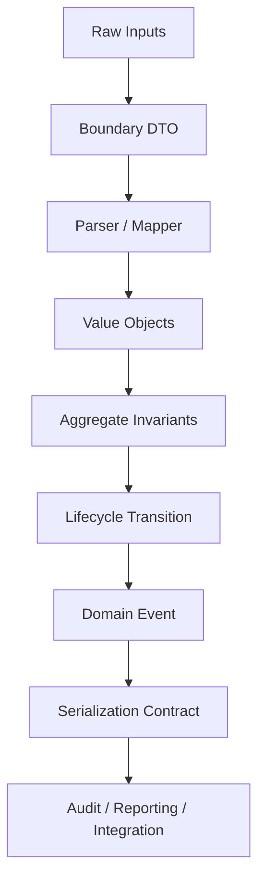
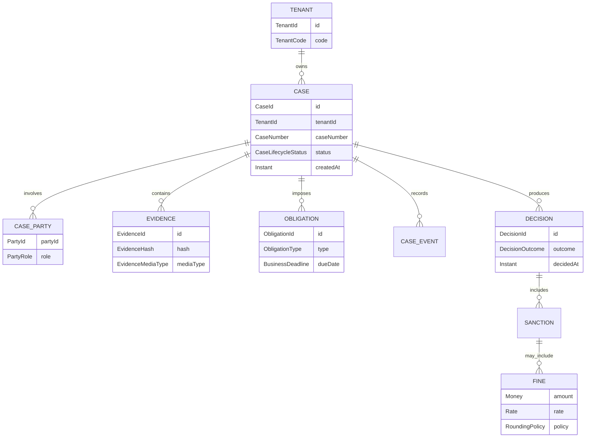
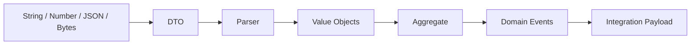
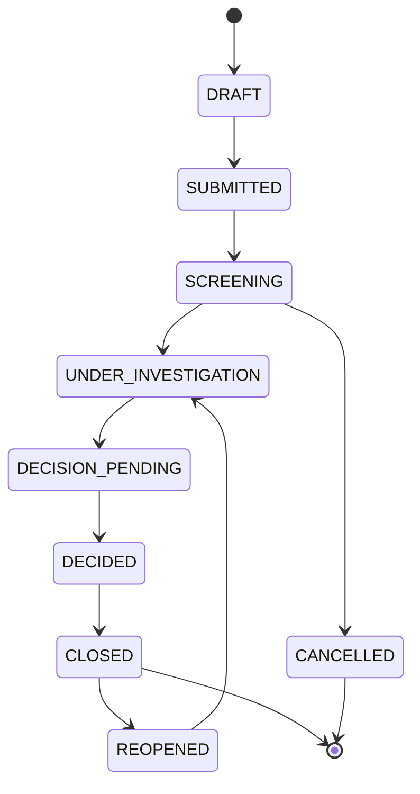
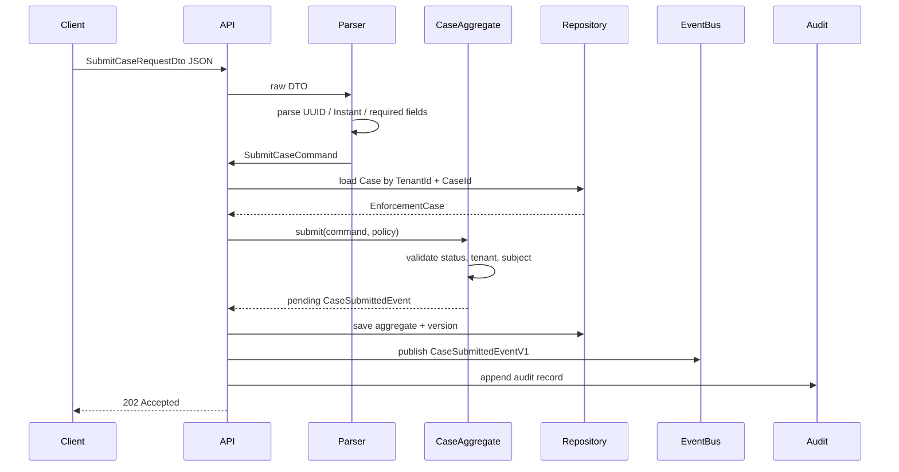

# Part 034 — Capstone: Type-Safe Enterprise Data Modeling

> Target skill: mampu mendesain model data Java yang type-safe, defensible, evolvable, dan production-ready untuk workflow enterprise yang kompleks.

Ini adalah part terakhir seri ini.

Kita akan menggabungkan seluruh materi menjadi satu capstone: **regulatory enforcement case lifecycle platform**. Domain ini sengaja dipilih karena kaya dengan tipe yang sering gagal di production:

- case identifiers;
- party identifiers;
- lifecycle state;
- temporal deadlines;
- evidence bytes;
- money/fines;
- quantity/rate;
- enum evolution;
- nullability/absence;
- authorization-sensitive views;
- audit timeline;
- JSON/database/event boundary;
- immutable snapshots;
- state transitions;
- bitemporal corrections.

Tujuan bukan membangun aplikasi penuh. Tujuannya membangun **data model dan type contract** yang cukup kuat untuk menjadi fondasi sistem enterprise.

---

## 1. Problem Statement

Kita ingin membangun modul enforcement lifecycle dengan kemampuan:

1. Menerima complaint atau referral.
2. Membuat case baru untuk tenant/regulator tertentu.
3. Menghubungkan parties, subjects, officers, evidence, dan obligations.
4. Mengelola lifecycle case dari draft sampai closure/reopen.
5. Menghitung deadline berdasarkan business calendar.
6. Mencatat decision, violation, fine, dan sanction.
7. Menghasilkan audit trail yang defensible.
8. Mengekspor event/API payload yang stabil.
9. Menjaga backward compatibility saat domain berkembang.
10. Mencegah illegal state semaksimal mungkin di level tipe.

Anti-goal:

- bukan membahas framework web;
- bukan membahas persistence ORM detail;
- bukan membahas design pattern umum;
- bukan membangun full DDD tutorial;
- bukan mengulang Java basics.

---

## 2. Kaufman Capstone Structure

Dalam kerangka Kaufman, capstone ini menjadi deliberate practice.

| Kaufman Step | Capstone Implementation |
|---|---|
| Deconstruct skill | Pisahkan ID, money, time, state, evidence, boundary, invariant |
| Learn enough to self-correct | Gunakan checklist failure modes Part 033 |
| Remove barriers | Pakai small composable value objects |
| Deliberate practice | Desain aggregate + event + API contract + tests |



Key idea:

> Boundary boleh menerima data lemah. Domain core tidak boleh menyimpan data lemah.

---

## 3. Domain Map



---

## 4. Type Design Layers

Kita bagi model menjadi 6 layer.

| Layer | Purpose | Example |
|---|---|---|
| Raw boundary DTO | menerima JSON/API | `SubmitCaseRequestDto` |
| Parser/mapper | validasi syntactic + semantic | `CaseCommandParser` |
| Primitive semantic wrappers | cegah primitive obsession | `CaseId`, `TenantId`, `CaseNumber` |
| Domain value objects | encode invariant kecil | `Money`, `BusinessDeadline`, `EvidenceHash` |
| Aggregate/model | encode lifecycle invariant | `EnforcementCase` |
| Event/API contract | stable external representation | `CaseSubmittedEventV1` |



---

## 5. Typed Identifiers

### 5.1 Never Start with Raw String IDs in Core Domain

Bad:

```java
void assign(String tenantId, String caseId, String officerId) {}
```

Better:

```java
void assign(TenantId tenantId, CaseId caseId, OfficerId officerId) {}
```

### 5.2 Identifier Types

```java
import java.util.Objects;
import java.util.UUID;

public record TenantId(UUID value) {
    public TenantId {
        Objects.requireNonNull(value, "tenant id must not be null");
    }
}

public record CaseId(UUID value) {
    public CaseId {
        Objects.requireNonNull(value, "case id must not be null");
    }
}

public record OfficerId(UUID value) {
    public OfficerId {
        Objects.requireNonNull(value, "officer id must not be null");
    }
}

public record PartyId(UUID value) {
    public PartyId {
        Objects.requireNonNull(value, "party id must not be null");
    }
}
```

These wrappers prevent parameter mix-up.

### 5.3 Scoped Case Key

Case number may only be unique within a tenant.

```java
public record CaseNumber(String value) {
    private static final Pattern PATTERN = Pattern.compile("CASE-[0-9]{4}-[0-9]{6}");

    public CaseNumber {
        Objects.requireNonNull(value, "case number must not be null");
        value = value.trim().toUpperCase(Locale.ROOT);
        if (!PATTERN.matcher(value).matches()) {
            throw new IllegalArgumentException("invalid case number: " + value);
        }
    }
}

public record CaseKey(TenantId tenantId, CaseNumber caseNumber) {
    public CaseKey {
        Objects.requireNonNull(tenantId);
        Objects.requireNonNull(caseNumber);
    }
}
```

Invariant:

> `CaseNumber` alone is not globally unique. `CaseKey` is the business lookup key.

---

## 6. Lifecycle State as Closed Domain

### 6.1 Lifecycle Enum

```java
public enum CaseLifecycleStatus {
    DRAFT("DRAFT"),
    SUBMITTED("SUBMITTED"),
    SCREENING("SCREENING"),
    UNDER_INVESTIGATION("UNDER_INVESTIGATION"),
    DECISION_PENDING("DECISION_PENDING"),
    DECIDED("DECIDED"),
    CLOSED("CLOSED"),
    REOPENED("REOPENED"),
    CANCELLED("CANCELLED");

    private final String code;

    CaseLifecycleStatus(String code) {
        this.code = code;
    }

    public String code() {
        return code;
    }

    public static Optional<CaseLifecycleStatus> fromCode(String code) {
        return Arrays.stream(values())
            .filter(status -> status.code.equals(code))
            .findFirst();
    }
}
```

Never persist `ordinal()`.

### 6.2 Transition Model



### 6.3 Transition Guard

```java
public final class CaseLifecyclePolicy {
    public boolean canTransition(CaseLifecycleStatus from, CaseLifecycleStatus to) {
        return switch (from) {
            case DRAFT -> to == CaseLifecycleStatus.SUBMITTED;
            case SUBMITTED -> to == CaseLifecycleStatus.SCREENING;
            case SCREENING -> to == CaseLifecycleStatus.UNDER_INVESTIGATION
                    || to == CaseLifecycleStatus.CANCELLED;
            case UNDER_INVESTIGATION -> to == CaseLifecycleStatus.DECISION_PENDING;
            case DECISION_PENDING -> to == CaseLifecycleStatus.DECIDED;
            case DECIDED -> to == CaseLifecycleStatus.CLOSED;
            case CLOSED -> to == CaseLifecycleStatus.REOPENED;
            case REOPENED -> to == CaseLifecycleStatus.UNDER_INVESTIGATION;
            case CANCELLED -> false;
        };
    }
}
```

This is intentionally explicit. For regulatory systems, invisible lifecycle rules are dangerous.

---

## 7. Time Modeling

### 7.1 Split Timeline and Business Time

```java
public record CreatedAt(Instant value) {
    public CreatedAt {
        Objects.requireNonNull(value);
    }
}

public record SubmittedAt(Instant value) {
    public SubmittedAt {
        Objects.requireNonNull(value);
    }
}

public record EffectiveDate(LocalDate value) {
    public EffectiveDate {
        Objects.requireNonNull(value);
    }
}

public record BusinessDeadline(ZonedDateTime value) {
    public BusinessDeadline {
        Objects.requireNonNull(value);
    }
}
```

Use:

- `Instant` for audit ordering and event timeline;
- `LocalDate` for calendar date without time;
- `ZonedDateTime` for user/business deadline where timezone matters;
- `Duration` for machine elapsed time;
- `Period` for calendar amount;
- `Clock` for testable current time.

### 7.2 Deadline Policy

```java
public interface BusinessCalendar {
    boolean isBusinessDay(LocalDate date);
    LocalDate nextBusinessDay(LocalDate date);
}

public final class DeadlinePolicy {
    private final BusinessCalendar calendar;
    private final ZoneId zoneId;

    public DeadlinePolicy(BusinessCalendar calendar, ZoneId zoneId) {
        this.calendar = Objects.requireNonNull(calendar);
        this.zoneId = Objects.requireNonNull(zoneId);
    }

    public BusinessDeadline afterBusinessDays(SubmittedAt submittedAt, int businessDays) {
        if (businessDays < 0) {
            throw new IllegalArgumentException("business days must not be negative");
        }

        LocalDate date = submittedAt.value().atZone(zoneId).toLocalDate();
        int remaining = businessDays;

        while (remaining > 0) {
            date = date.plusDays(1);
            if (calendar.isBusinessDay(date)) {
                remaining--;
            }
        }

        ZonedDateTime endOfDay = date.atTime(LocalTime.MAX).atZone(zoneId);
        return new BusinessDeadline(endOfDay);
    }
}
```

Invariant:

> A regulatory deadline is not “now plus N * 24 hours” unless the regulation explicitly says so.

---

## 8. Money, Rate, Quantity, and Rounding

### 8.1 Money

```java
public record Money(BigDecimal amount, Currency currency) {
    public Money {
        Objects.requireNonNull(amount);
        Objects.requireNonNull(currency);

        int fractionDigits = currency.getDefaultFractionDigits();
        if (fractionDigits >= 0) {
            amount = amount.setScale(fractionDigits, RoundingMode.UNNECESSARY);
        }
    }

    public Money plus(Money other) {
        requireSameCurrency(other);
        return new Money(amount.add(other.amount), currency);
    }

    public Money multiply(Rate rate, RoundingMode roundingMode) {
        BigDecimal result = amount.multiply(rate.value())
            .setScale(amount.scale(), roundingMode);
        return new Money(result, currency);
    }

    private void requireSameCurrency(Money other) {
        if (!currency.equals(other.currency)) {
            throw new IllegalArgumentException("currency mismatch");
        }
    }
}
```

### 8.2 Rate

```java
public record Rate(BigDecimal value) {
    private static final int SCALE = 8;

    public Rate {
        Objects.requireNonNull(value);
        value = value.setScale(SCALE, RoundingMode.UNNECESSARY);
        if (value.signum() < 0) {
            throw new IllegalArgumentException("rate must not be negative");
        }
    }
}
```

### 8.3 Fine Rule

```java
public record FineRule(
    ViolationType violationType,
    Money baseAmount,
    Rate multiplier,
    RoundingMode roundingMode
) {
    public FineRule {
        Objects.requireNonNull(violationType);
        Objects.requireNonNull(baseAmount);
        Objects.requireNonNull(multiplier);
        Objects.requireNonNull(roundingMode);
    }

    public Money calculateFine() {
        return baseAmount.multiply(multiplier, roundingMode);
    }
}
```

Design principle:

> Rounding is a policy, not a formatting detail.

---

## 9. Evidence Modeling

Evidence is high-risk because it crosses byte, file, hash, signature, audit, and legal boundaries.

### 9.1 Evidence Bytes

```java
public record EvidenceBytes(byte[] value) {
    private static final int MAX_BYTES = 50 * 1024 * 1024;

    public EvidenceBytes {
        Objects.requireNonNull(value);
        if (value.length == 0) {
            throw new IllegalArgumentException("evidence must not be empty");
        }
        if (value.length > MAX_BYTES) {
            throw new IllegalArgumentException("evidence too large");
        }
        value = value.clone();
    }

    @Override
    public byte[] value() {
        return value.clone();
    }
}
```

### 9.2 Evidence Hash

```java
public record EvidenceHash(String algorithm, byte[] digest) {
    public EvidenceHash {
        Objects.requireNonNull(algorithm);
        Objects.requireNonNull(digest);
        algorithm = algorithm.trim().toUpperCase(Locale.ROOT);
        digest = digest.clone();
    }

    @Override
    public byte[] digest() {
        return digest.clone();
    }

    public static EvidenceHash sha256(EvidenceBytes bytes) {
        try {
            MessageDigest md = MessageDigest.getInstance("SHA-256");
            return new EvidenceHash("SHA-256", md.digest(bytes.value()));
        } catch (NoSuchAlgorithmException e) {
            throw new IllegalStateException(e);
        }
    }
}
```

### 9.3 Evidence Metadata

```java
public enum EvidenceMediaType {
    PDF("application/pdf"),
    PNG("image/png"),
    JPEG("image/jpeg"),
    PLAIN_TEXT("text/plain"),
    OCTET_STREAM("application/octet-stream");

    private final String value;

    EvidenceMediaType(String value) {
        this.value = value;
    }

    public String value() {
        return value;
    }
}
```

Rule:

> Evidence identity should be based on stable metadata and digest, not mutable byte-array reference.

---

## 10. Parties and Roles

### 10.1 Party Role as Enum

```java
public enum PartyRole {
    SUBJECT,
    COMPLAINANT,
    WITNESS,
    REPRESENTATIVE,
    REGULATOR,
    OFFICER
}
```

### 10.2 Case Party

```java
public record CaseParty(
    PartyId partyId,
    PartyRole role,
    EffectiveDate effectiveDate
) {
    public CaseParty {
        Objects.requireNonNull(partyId);
        Objects.requireNonNull(role);
        Objects.requireNonNull(effectiveDate);
    }
}
```

Potential invariant:

- one case must have at least one `SUBJECT`;
- one party can have multiple roles only if regulation permits;
- role effective dates must not conflict.

Do not hide these rules in UI only.

---

## 11. Case Aggregate

### 11.1 Aggregate Skeleton

```java
public final class EnforcementCase {
    private final CaseId id;
    private final TenantId tenantId;
    private final CaseNumber caseNumber;
    private CaseLifecycleStatus status;
    private final CreatedAt createdAt;
    private final List<CaseParty> parties;
    private final List<EvidenceReference> evidence;
    private final List<CaseDomainEvent> pendingEvents;

    private EnforcementCase(
        CaseId id,
        TenantId tenantId,
        CaseNumber caseNumber,
        CaseLifecycleStatus status,
        CreatedAt createdAt,
        List<CaseParty> parties,
        List<EvidenceReference> evidence
    ) {
        this.id = Objects.requireNonNull(id);
        this.tenantId = Objects.requireNonNull(tenantId);
        this.caseNumber = Objects.requireNonNull(caseNumber);
        this.status = Objects.requireNonNull(status);
        this.createdAt = Objects.requireNonNull(createdAt);
        this.parties = new ArrayList<>(Objects.requireNonNull(parties));
        this.evidence = new ArrayList<>(Objects.requireNonNull(evidence));
        this.pendingEvents = new ArrayList<>();
    }

    public static EnforcementCase draft(
        CaseId id,
        TenantId tenantId,
        CaseNumber caseNumber,
        CreatedAt createdAt
    ) {
        return new EnforcementCase(
            id,
            tenantId,
            caseNumber,
            CaseLifecycleStatus.DRAFT,
            createdAt,
            List.of(),
            List.of()
        );
    }

    public CaseSnapshot snapshot() {
        return new CaseSnapshot(
            id,
            tenantId,
            caseNumber,
            status,
            createdAt,
            List.copyOf(parties),
            List.copyOf(evidence)
        );
    }
}
```

### 11.2 Snapshot Record

```java
public record CaseSnapshot(
    CaseId id,
    TenantId tenantId,
    CaseNumber caseNumber,
    CaseLifecycleStatus status,
    CreatedAt createdAt,
    List<CaseParty> parties,
    List<EvidenceReference> evidence
) {
    public CaseSnapshot {
        Objects.requireNonNull(id);
        Objects.requireNonNull(tenantId);
        Objects.requireNonNull(caseNumber);
        Objects.requireNonNull(status);
        Objects.requireNonNull(createdAt);
        parties = List.copyOf(parties);
        evidence = List.copyOf(evidence);
    }
}
```

Design decision:

- aggregate may be internally mutable for lifecycle operations;
- snapshots are immutable views for query/event/audit boundaries.

---

## 12. Submit Case Use Case

### 12.1 Command Type

```java
public record SubmitCaseCommand(
    TenantId tenantId,
    CaseId caseId,
    OfficerId submittedBy,
    SubmittedAt submittedAt
) {
    public SubmitCaseCommand {
        Objects.requireNonNull(tenantId);
        Objects.requireNonNull(caseId);
        Objects.requireNonNull(submittedBy);
        Objects.requireNonNull(submittedAt);
    }
}
```

### 12.2 Aggregate Method

```java
public void submit(SubmitCaseCommand command, CaseLifecyclePolicy policy) {
    Objects.requireNonNull(command);
    Objects.requireNonNull(policy);

    if (!id.equals(command.caseId())) {
        throw new IllegalArgumentException("command targets different case");
    }
    if (!tenantId.equals(command.tenantId())) {
        throw new IllegalArgumentException("tenant mismatch");
    }
    if (!policy.canTransition(status, CaseLifecycleStatus.SUBMITTED)) {
        throw new IllegalStateException("cannot submit from status " + status);
    }
    if (parties.stream().noneMatch(p -> p.role() == PartyRole.SUBJECT)) {
        throw new IllegalStateException("case must have subject before submission");
    }

    status = CaseLifecycleStatus.SUBMITTED;
    pendingEvents.add(new CaseSubmittedEvent(
        id,
        tenantId,
        command.submittedBy(),
        command.submittedAt()
    ));
}
```

Invariant examples:

- submitted case must have subject;
- tenant in command must match tenant in aggregate;
- lifecycle transition must be legal;
- submitted timestamp must come from clock/service boundary, not UI string directly.

---

## 13. Domain Events

### 13.1 Event Interface

```java
public sealed interface CaseDomainEvent permits CaseSubmittedEvent, CaseClosedEvent {
    CaseId caseId();
    TenantId tenantId();
    Instant occurredAt();
}
```

### 13.2 Case Submitted Event

```java
public record CaseSubmittedEvent(
    CaseId caseId,
    TenantId tenantId,
    OfficerId submittedBy,
    SubmittedAt submittedAt
) implements CaseDomainEvent {
    public CaseSubmittedEvent {
        Objects.requireNonNull(caseId);
        Objects.requireNonNull(tenantId);
        Objects.requireNonNull(submittedBy);
        Objects.requireNonNull(submittedAt);
    }

    @Override
    public Instant occurredAt() {
        return submittedAt.value();
    }
}
```

Events should be facts, not commands.

Bad event:

```java
record SubmitCaseEvent(...) {}
```

Better:

```java
record CaseSubmittedEvent(...) {}
```

---

## 14. API Boundary DTOs

### 14.1 Incoming DTO

Boundary DTOs may be weak because they represent raw input.

```java
public record SubmitCaseRequestDto(
    String tenantId,
    String caseId,
    String submittedBy,
    String submittedAt
) {}
```

### 14.2 Parser

```java
public final class SubmitCaseCommandParser {
    public SubmitCaseCommand parse(SubmitCaseRequestDto dto) {
        Objects.requireNonNull(dto);

        return new SubmitCaseCommand(
            new TenantId(UUID.fromString(require(dto.tenantId(), "tenantId"))),
            new CaseId(UUID.fromString(require(dto.caseId(), "caseId"))),
            new OfficerId(UUID.fromString(require(dto.submittedBy(), "submittedBy"))),
            new SubmittedAt(Instant.parse(require(dto.submittedAt(), "submittedAt")))
        );
    }

    private static String require(String value, String fieldName) {
        if (value == null || value.isBlank()) {
            throw new IllegalArgumentException(fieldName + " is required");
        }
        return value;
    }
}
```

Rules:

- DTO can be nullable/raw.
- Parser must be strict.
- Domain command must be strong.
- Aggregate must enforce business invariants.

---

## 15. JSON Contract

Example external event payload:

```json
{
  "schemaVersion": 1,
  "eventType": "CASE_SUBMITTED",
  "eventId": "e6e73e01-078c-4acb-a46b-a4ea11e9245b",
  "tenantId": "f3c4c83b-5f61-4e5f-9a08-30c30dd7741a",
  "caseId": "9e8f7b8c-6f3f-41e0-b8e0-5608cb7ad32d",
  "submittedBy": "c10a2169-e41b-4308-9c50-d9ca2fb9b0bd",
  "submittedAt": "2026-06-30T10:15:30Z"
}
```

Contract rules:

| Field | Java Type | JSON Type | Rule |
|---|---|---|---|
| `schemaVersion` | `int` | number | small integer, required |
| `eventType` | stable enum code | string | never ordinal |
| `eventId` | `UUID` wrapper | string | canonical UUID |
| `tenantId` | `TenantId` | string | required |
| `caseId` | `CaseId` | string | required |
| `submittedBy` | `OfficerId` | string | required |
| `submittedAt` | `Instant` | string | ISO-8601 UTC |

Do not expose internal object graph directly as JSON.

---

## 16. Database Boundary

Recommended principle:

> Database columns should preserve domain semantics, not merely store whatever Java can serialize.

Example table sketch:

```sql
create table enforcement_case (
    tenant_id uuid not null,
    case_id uuid not null,
    case_number varchar(32) not null,
    status_code varchar(64) not null,
    created_at timestamp with time zone not null,
    version bigint not null,
    primary key (tenant_id, case_id),
    unique (tenant_id, case_number)
);
```

Design notes:

- `tenant_id + case_id` prevents cross-tenant ambiguity;
- `case_number` unique only within tenant;
- status stored as code, not ordinal;
- timeline timestamp stored with explicit instant semantics;
- optimistic version is separate from domain version/event version.

Money column sketch:

```sql
create table fine (
    tenant_id uuid not null,
    case_id uuid not null,
    fine_id uuid not null,
    amount numeric(19, 2) not null,
    currency_code char(3) not null,
    rounding_policy varchar(32) not null,
    primary key (tenant_id, fine_id)
);
```

Risk:

- if Java scale is 2 but DB scale is 4, equality/reporting may diverge;
- if currency missing, amount is incomplete;
- if rounding policy missing, audit cannot explain calculation.

---

## 17. Event Evolution

### 17.1 Versioned Payloads

```java
public record CaseSubmittedEventV1(
    int schemaVersion,
    String eventType,
    String eventId,
    String tenantId,
    String caseId,
    String submittedBy,
    String submittedAt
) {}
```

Mapping from domain event:

```java
public final class CaseEventMapper {
    public CaseSubmittedEventV1 toV1(CaseSubmittedEvent event, UUID eventId) {
        return new CaseSubmittedEventV1(
            1,
            "CASE_SUBMITTED",
            eventId.toString(),
            event.tenantId().value().toString(),
            event.caseId().value().toString(),
            event.submittedBy().value().toString(),
            event.submittedAt().value().toString()
        );
    }
}
```

Why separate event payload from domain event?

- external compatibility;
- schema versioning;
- explicit formatting;
- no accidental exposure of internals;
- easier contract testing.

---

## 18. Unknown External Values

When consuming external API status, do not assume the external enum is closed for you.

```java
public sealed interface ExternalViolationCode permits KnownViolationCode, UnknownViolationCode {}

public record KnownViolationCode(ViolationType value) implements ExternalViolationCode {}

public record UnknownViolationCode(String rawValue) implements ExternalViolationCode {
    public UnknownViolationCode {
        Objects.requireNonNull(rawValue);
        rawValue = rawValue.trim();
        if (rawValue.isEmpty()) {
            throw new IllegalArgumentException("unknown violation code must not be blank");
        }
    }
}
```

This prevents integration breakage when upstream adds new codes.

---

## 19. Authorization-Sensitive Views

Do not use `null` to hide data because of authorization.

Bad:

```java
record CaseView(String assignedOfficerId) {}
```

If `assignedOfficerId == null`, is it unassigned or hidden?

Better:

```java
sealed interface OfficerAssignmentView permits VisibleOfficerAssignment, HiddenOfficerAssignment, UnassignedOfficer {}

record VisibleOfficerAssignment(OfficerId officerId) implements OfficerAssignmentView {}
record HiddenOfficerAssignment() implements OfficerAssignmentView {}
record UnassignedOfficer() implements OfficerAssignmentView {}
```

This distinction matters for audit, UI, and workflow decisions.

---

## 20. Validation Placement

Validation belongs at multiple layers, but each layer has a different job.

| Layer | Validation Type | Example |
|---|---|---|
| DTO | syntactic presence | field required |
| Parser | parseability | UUID, Instant, enum code |
| Value object | local invariant | amount non-negative |
| Aggregate | cross-field invariant | submitted case has subject |
| Repository | uniqueness/persistence | tenant + case number unique |
| API contract | compatibility | unknown enum strategy |

Do not put all validation in one giant service method.

---

## 21. Testing Strategy

### 21.1 Value Object Tests

Test invalid states cannot be constructed.

```java
@Test
void caseNumberRejectsInvalidFormat() {
    assertThrows(IllegalArgumentException.class, () -> new CaseNumber("abc"));
}
```

### 21.2 Boundary Tests

Test JSON format and parsing.

```java
@Test
void submittedAtMustBeInstant() {
    SubmitCaseRequestDto dto = new SubmitCaseRequestDto(
        tenantId,
        caseId,
        officerId,
        "2026-06-30T10:15:30Z"
    );

    SubmitCaseCommand command = parser.parse(dto);

    assertEquals(Instant.parse("2026-06-30T10:15:30Z"), command.submittedAt().value());
}
```

### 21.3 Transition Tests

```java
@ParameterizedTest
@CsvSource({
    "DRAFT,SUBMITTED,true",
    "DRAFT,CLOSED,false",
    "CLOSED,REOPENED,true",
    "CANCELLED,REOPENED,false"
})
void transitionPolicyIsExplicit(CaseLifecycleStatus from, CaseLifecycleStatus to, boolean expected) {
    assertEquals(expected, policy.canTransition(from, to));
}
```

### 21.4 Property-Like Tests

Useful properties:

- parsing then formatting ID should preserve canonical value;
- money addition should reject currency mismatch;
- evidence hash should not change when caller mutates original byte array;
- snapshot should not change after aggregate mutates;
- unknown external enum should not crash parser;
- deadline calculation should respect non-business days.

---

## 22. Review Checklist for the Capstone

### 22.1 Type Safety

- Are IDs strongly typed?
- Are domain strings wrapped?
- Are enum external codes stable?
- Are unknown external codes representable?
- Are raw primitives absent from domain core unless they truly are primitive concepts?

### 22.2 Numeric Correctness

- Is money represented with amount + currency?
- Is rounding policy explicit?
- Is `double` avoided for exact arithmetic?
- Is DB scale aligned with Java scale?
- Are rates/percentages/quantities separate types?

### 22.3 Temporal Correctness

- Is audit time modeled as `Instant`?
- Is business deadline timezone-aware?
- Is effective date separate from recorded timestamp?
- Is `Clock` injectable?
- Are DST and business calendar rules tested?

### 22.4 Mutability and Equality

- Are equality keys immutable?
- Are mutable arrays defensively copied?
- Are records with collections using `List.copyOf`?
- Are snapshots distinct from mutable aggregates?
- Are cache keys stable?

### 22.5 Boundary Correctness

- Is DTO separated from domain?
- Are JSON numbers safe for precision?
- Are timestamp formats explicit?
- Are enum values versioned/stable?
- Are null vs absent rules documented?
- Are contract tests present?

### 22.6 Regulatory Defensibility

- Can every decision be explained from stored facts?
- Are deadlines reproducible from policy/calendar/version?
- Are fine calculations reproducible from amount/rate/rounding policy?
- Are evidence hashes based on immutable snapshots?
- Are lifecycle transitions auditable?
- Are backdated corrections modeled explicitly?

---

## 23. Common Wrong Designs and Refactors

### 23.1 Primitive Obsession Command

Bad:

```java
record CreateFineRequest(String caseId, String amount, String currency, String rate) {}
```

Better:

```java
record CreateFineCommand(CaseId caseId, Money baseAmount, Rate rate, RoundingMode roundingMode) {}
```

### 23.2 Boolean State

Bad:

```java
record CaseDto(boolean submitted, boolean closed, boolean reopened) {}
```

Better:

```java
record CaseDto(String statusCode) {}
```

Then parse status code into domain enum with unknown strategy if external.

### 23.3 Nullable Authorization

Bad:

```java
record OfficerView(String officerId) {}
```

Better:

```java
record OfficerView(OfficerAssignmentView assignment) {}
```

### 23.4 Mutable Evidence

Bad:

```java
record UploadedEvidence(byte[] bytes) {}
```

Better:

```java
record UploadedEvidence(EvidenceBytes bytes, EvidenceHash hash, EvidenceMediaType mediaType) {}
```

---

## 24. End-to-End Flow



Important boundary decisions:

- API receives weak DTO.
- Parser produces strong command.
- Aggregate enforces invariant.
- Repository preserves type semantics.
- Event mapper produces stable external payload.
- Audit stores reproducible facts.

---

## 25. Final Capstone Exercise

Build a small package structure:

```text
com.example.enforcement
  domain
    id
      TenantId.java
      CaseId.java
      OfficerId.java
      PartyId.java
      CaseNumber.java
      CaseKey.java
    money
      Money.java
      Rate.java
      FineRule.java
    time
      CreatedAt.java
      SubmittedAt.java
      EffectiveDate.java
      BusinessDeadline.java
      DeadlinePolicy.java
      BusinessCalendar.java
    evidence
      EvidenceBytes.java
      EvidenceHash.java
      EvidenceMediaType.java
      EvidenceReference.java
    casefile
      CaseLifecycleStatus.java
      CaseLifecyclePolicy.java
      EnforcementCase.java
      CaseSnapshot.java
      CaseParty.java
    event
      CaseDomainEvent.java
      CaseSubmittedEvent.java
  api
    SubmitCaseRequestDto.java
    SubmitCaseCommandParser.java
    CaseSubmittedEventV1.java
    CaseEventMapper.java
  test
    ValueObjectTest.java
    LifecyclePolicyTest.java
    BoundaryContractTest.java
    EvidenceImmutabilityTest.java
```

Minimum tests:

1. Invalid IDs are rejected.
2. Case number is canonicalized.
3. Illegal lifecycle transition is rejected.
4. Submitted case requires subject.
5. Money rejects currency mismatch.
6. Rate rejects negative value.
7. Evidence bytes are defensively copied.
8. Snapshot does not change after aggregate mutation.
9. JSON event uses stable enum code.
10. Unknown external enum does not crash consumer.
11. Deadline policy respects business calendar.
12. `Clock` makes time tests deterministic.

---

## 26. What “Top 1%” Looks Like Here

A strong engineer can write Java types. A top-tier engineer can explain what each type prevents.

For every important type, you should be able to answer:

1. What invalid values can never be constructed?
2. What invalid values can still be represented?
3. What conversion boundaries exist?
4. What semantics are lost at JSON/DB/API boundaries?
5. What equality semantics are correct?
6. What lifecycle transitions are legal?
7. What time semantics are encoded?
8. What numeric precision/rounding rules exist?
9. What mutation/aliasing risks exist?
10. What future schema/domain evolution is expected?

If you cannot answer these, the model is not yet production-grade.

---

## 27. Series Completion Summary

This series covered:

1. Kaufman skill map for type mastery.
2. Java type system mental model.
3. Values, variables, identities, and lifetimes.
4. Primitive types.
5. Integral numbers.
6. Floating point.
7. Boolean modeling.
8. Literals and compile-time constants.
9. Reference types and object semantics.
10. `Object`, equality, hash code, string representation.
11. Class as invariant boundary.
12. Interface as capability contract.
13. Records.
14. Enums.
15. Arrays.
16. Boxing/unboxing.
17. Conversions and casts.
18. Numeric promotion and overload resolution.
19. Nullability and `Optional`.
20. Immutability and defensive copying.
21. `String` and builders.
22. Unicode and charset boundaries.
23. `BigDecimal` and exact arithmetic.
24. `java.time`.
25. Enterprise temporal modeling.
26. Bytes, buffers, and endianness.
27. Identifiers and keys.
28. Domain value objects.
29. Money, quantity, percentage, rate, measurement.
30. Serialization/API/database boundaries.
31. Performance and allocation awareness.
32. Project Valhalla and Java type future.
33. Production failure modes and postmortems.
34. Capstone enterprise data modeling.

This is the final part.

---

## 28. Suggested Next Series

Recommended continuation after this series:

1. **Java Domain Modeling for Enterprise Systems** — aggregates, invariants, policies, state machines, events.
2. **Java Regulatory Workflow & Case Management Architecture** — enforcement lifecycle, escalation, audit, decisioning, SLA, bitemporal workflows.
3. **Java Contract Testing & Schema Evolution** — JSON schema, OpenAPI, Avro/Protobuf, consumer-driven contracts, compatibility matrices.
4. **Java Concurrency Data Correctness** — safe publication, immutability, atomicity, happens-before, concurrent collections, event consistency.
5. **Java Performance Engineering for Data-Heavy Systems** — memory layout, allocation, profiling, JMH, GC-aware type design.

---

## 29. Final Review Checklist

Use this checklist on real PRs.

```text
[ ] Are all domain IDs strongly typed?
[ ] Are raw strings only used at boundaries?
[ ] Are numeric units explicit?
[ ] Is exact arithmetic handled with BigDecimal or integer minor units?
[ ] Is rounding policy explicit and testable?
[ ] Are time semantics explicit: Instant, LocalDate, ZonedDateTime, Duration, Period?
[ ] Is business calendar separated from machine duration?
[ ] Are enums persisted by stable code, not ordinal?
[ ] Can unknown external enum values be represented?
[ ] Is null used with one clear meaning only?
[ ] Are records with arrays/collections defensively copied?
[ ] Are equality/hashCode fields immutable?
[ ] Are DTOs separated from domain types?
[ ] Are serialization formats explicit?
[ ] Are DB column types aligned with Java semantics?
[ ] Are lifecycle transitions centralized and tested?
[ ] Are audit facts immutable and reproducible?
[ ] Are boundary contract tests present?
[ ] Is there a postmortem-ready explanation for every critical type?
```

---

## References

- Java Language Specification, Java SE 25 — Chapter 4: Types, Values, and Variables: https://docs.oracle.com/javase/specs/jls/se25/html/jls-4.html
- Java Language Specification, Java SE 25 — Chapter 5: Conversions and Contexts: https://docs.oracle.com/javase/specs/jls/se25/html/jls-5.html
- Java SE 25 API — `java.time`: https://docs.oracle.com/en/java/javase/25/docs/api/java.base/java/time/package-summary.html
- Java SE 25 API — `BigDecimal`: https://docs.oracle.com/en/java/javase/25/docs/api/java.base/java/math/BigDecimal.html
- Java SE 25 API — `Record`: https://docs.oracle.com/en/java/javase/25/docs/api/java.base/java/lang/Record.html
- Java SE 25 API — `Enum`: https://docs.oracle.com/en/java/javase/25/docs/api/java.base/java/lang/Enum.html
- Java SE 25 API — `UUID`: https://docs.oracle.com/en/java/javase/25/docs/api/java.base/java/util/UUID.html
