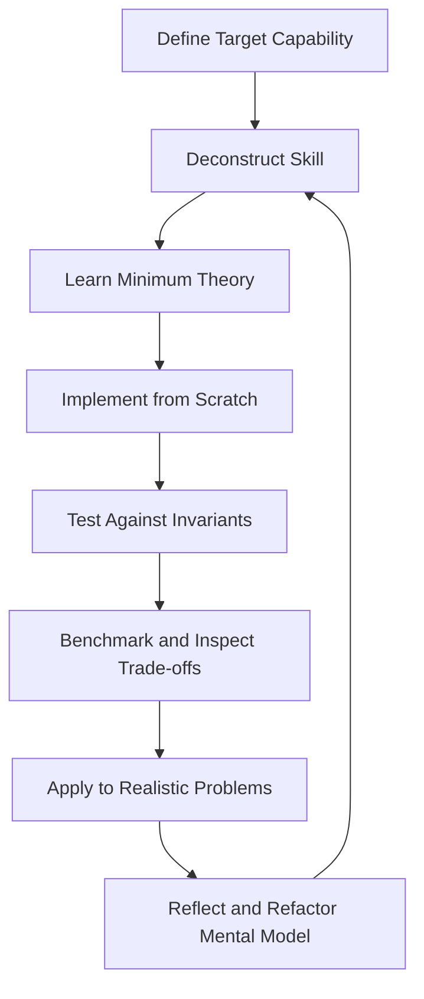
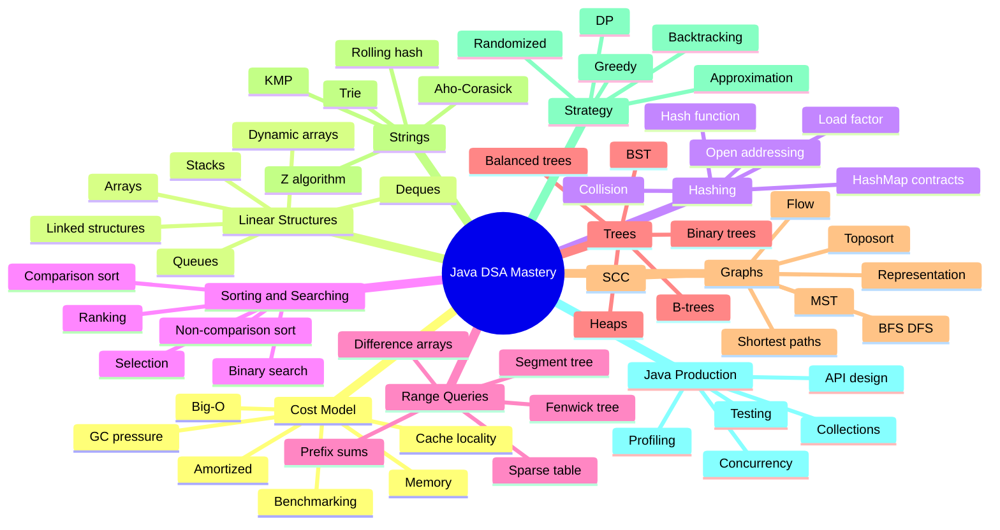
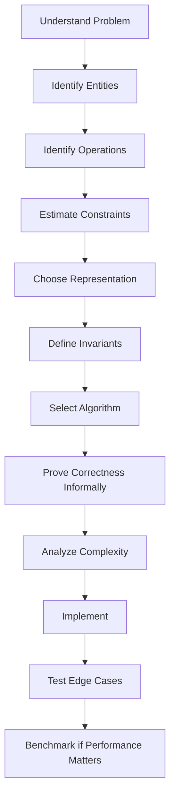
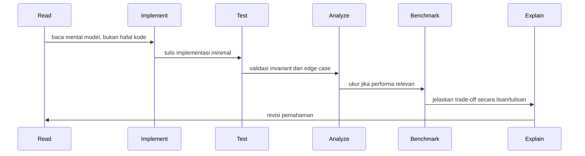

------
title: Learn Java Data Structures and Algorithms - Part 001
description: Kaufman-style skill map untuk mempelajari Java Data Structures and Algorithms secara efektif, deliberate, dan production-oriented tanpa terjebak template hafalan.
series: learn-java-dsa
seriesTitle: Learn Java Data Structures and Algorithms
order: 1
partTitle: Kaufman Skill Map
tags:
- java
- data-structures
- algorithms
- dsa
- kaufman
- series
date: 2026-06-27
---

# Part 001 — Kaufman Skill Map

Tujuan part pertama ini bukan mengulang definisi array, list, stack, queue, map, graph, atau dynamic programming. Kita sudah melewati Java dasar dan modern Java. Sekarang fokusnya adalah membangun **peta kemampuan** agar belajar Data Structures and Algorithms tidak berubah menjadi menghafal ratusan pola tanpa mental model.

Di level senior, DSA bukan hanya kemampuan menyelesaikan soal. DSA adalah kemampuan membuat keputusan teknis ketika sistem memiliki batasan: data membesar, latency harus stabil, memory terbatas, concurrency muncul, correctness harus bisa dijelaskan, dan perubahan requirement dapat merusak asumsi awal.

Part ini menjawab tiga pertanyaan:

1. Apa sebenarnya yang harus dikuasai agar DSA berguna untuk engineering nyata?
2. Bagaimana mempelajarinya dengan pendekatan *The First 20 Hours* dari Josh Kaufman?
3. Bagaimana mengubah setiap topik DSA menjadi latihan yang bisa diukur, dikoreksi, dan ditingkatkan?

---

## 1. Prinsip Utama Seri Ini

Seri ini memakai DSA sebagai **alat berpikir**, bukan katalog struktur data.

Kita akan selalu melihat setiap struktur data dan algoritma melalui lima lensa:

| Lensa | Pertanyaan Utama |
|---|---|
| Representation | Bagaimana data disimpan secara fisik/logis? |
| Invariant | Kondisi apa yang harus selalu benar? |
| Operation Contract | Operasi apa yang dijanjikan, dengan kompleksitas apa? |
| Failure Mode | Dalam kondisi apa struktur/algoritma ini rusak, lambat, boros, atau misleading? |
| Production Fit | Kapan ini tepat dipakai di sistem nyata? |

Contoh sederhana:

```java
Map<String, UserSession> sessions = new HashMap<>();
```

Pemula melihat ini sebagai “pakai map untuk lookup cepat”.

Engineer kuat akan bertanya:

- Apakah key immutable?
- Apakah `equals()` dan `hashCode()` benar?
- Apakah distribusi hash cukup baik?
- Berapa cardinality maksimum?
- Apakah perlu eviction?
- Apakah akses concurrent?
- Apakah lookup latency boleh sesekali spike ketika resize?
- Apakah memory overhead acceptable?
- Apakah iteration order penting?
- Apakah key bisa mengandung data sensitif?

Itulah bedanya DSA sebagai hafalan dan DSA sebagai engineering instrument.

---

## 2. Cara Kaufman Diterapkan ke Java DSA

Josh Kaufman mempopulerkan pendekatan belajar cepat dengan memecah skill menjadi subskill kecil, belajar cukup teori agar bisa praktik, menghilangkan hambatan, lalu berlatih terarah dalam blok waktu terbatas. Untuk seri ini, prinsip itu diterjemahkan menjadi workflow berikut.



Kaufman tidak berarti “cukup belajar 20 jam lalu selesai”. Untuk topik advance seperti DSA, 20 jam pertama adalah fase **activation**: membangun peta mental dan kemampuan praktik awal. Setelah itu kita masuk ke tahap **compounding practice**.

Dalam seri ini, setiap part akan memiliki:

- target kemampuan konkret;
- batasan topik agar tidak melebar;
- mental model;
- invariant;
- implementasi Java;
- test correctness;
- complexity reasoning;
- failure mode;
- latihan terarah.

---

## 3. Target Akhir Seri

Setelah menyelesaikan seri ini, targetnya bukan “hafal semua algoritma”. Targetnya adalah mampu melakukan hal berikut dengan tenang:

1. Memodelkan masalah menjadi struktur data yang tepat.
2. Menjelaskan invariant dari solusi.
3. Memilih algoritma berdasarkan constraint, bukan berdasarkan ingatan template.
4. Menganalisis time, space, amortized, dan worst-case behavior.
5. Mengimplementasikan solusi Java yang bersih, testable, dan tidak berantakan oleh edge case.
6. Mengenali ketika Java Collections cukup, ketika perlu custom structure, dan ketika harus mengubah model domain.
7. Membuat benchmark yang tidak menipu.
8. Menjelaskan trade-off ke engineer lain dalam design review.
9. Mengantisipasi failure mode: data skew, adversarial input, concurrency, memory pressure, cache miss, dan overflow.
10. Membangun solusi production-grade yang defensible.

---

## 4. DSA Skill Tree

Berikut peta besar skill yang akan kita pecah sepanjang seri.



Peta ini penting karena DSA sering diajarkan secara linear, padahal pemahamannya berbentuk graph. Misalnya:

- `PriorityQueue` dipakai dalam Dijkstra.
- DSU dipakai dalam Kruskal.
- BFS adalah queue + graph state.
- DP adalah DAG traversal dalam bentuk lain.
- Segment tree adalah tree + monoid + range invariant.
- HashMap correctness bergantung pada object equality contract.

Jadi, setiap part akan terus menghubungkan konsep baru ke konsep yang sudah dibangun.

---

## 5. What We Will Not Repeat

Karena seri sebelumnya sudah membahas Java modern, seri ini tidak akan mengulang:

- syntax dasar Java;
- class, interface, enum, record dasar;
- stream API sebagai topik umum;
- generics dasar;
- exception dasar;
- concurrency dasar;
- build tool dasar;
- unit testing dasar;
- clean code umum.

Namun, kita tetap akan memakai fitur Java bila relevan untuk DSA:

- `record` untuk immutable keys;
- `Comparator` untuk ordering;
- `ArrayDeque`, `HashMap`, `TreeMap`, `PriorityQueue`, `ConcurrentHashMap`;
- primitive arrays untuk performance-sensitive structure;
- JMH untuk benchmark;
- JUnit/property-style tests untuk invariant validation;
- `sealed interface` bila membantu modelling;
- virtual threads hanya jika relevan terhadap data structure usage, bukan sebagai topik utama.

---

## 6. Baseline: Apa Itu “Menguasai” Struktur Data?

Untuk setiap struktur data, jangan puas dengan definisi. Gunakan rubric berikut.

| Level | Kemampuan |
|---|---|
| Level 1 — API User | Tahu cara memakai dari Java Collections. |
| Level 2 — Complexity User | Tahu kompleksitas umum operasinya. |
| Level 3 — Invariant Builder | Bisa menjelaskan kondisi internal yang membuat operasi benar. |
| Level 4 — Implementer | Bisa mengimplementasikan versi minimal dari nol. |
| Level 5 — Diagnostician | Bisa menemukan bug, edge case, dan performance trap. |
| Level 6 — Designer | Bisa memilih/menyesuaikan struktur untuk domain nyata. |
| Level 7 — Reviewer | Bisa menilai desain orang lain dan menjelaskan trade-off. |

Seri ini menargetkan minimal Level 5 untuk semua topik utama, dan Level 6–7 untuk struktur yang sering muncul di production.

---

## 7. Core Mental Model

### 7.1 Data Structure = Representation + Invariants + Operation Contracts

Struktur data bukan “class dengan method”. Struktur data adalah keputusan tentang bagaimana data direpresentasikan agar operasi tertentu menjadi murah.

```text
Data Structure = representation + invariants + operations + cost model
```

Contoh dynamic array:

```text
representation:
  Object[] elements
  int size

invariants:
  0 <= size <= elements.length
  valid elements are in indices [0, size)
  unused capacity is in [size, elements.length)

operation contracts:
  get(i): O(1)
  addLast(x): amortized O(1)
  insert(i, x): O(n)
  remove(i): O(n)
```

Tanpa invariant, implementasi mudah terlihat benar tetapi rusak di edge case.

### 7.2 Algorithm = Controlled State Transition

Algoritma bukan kumpulan langkah mekanis. Algoritma adalah transformasi state yang menjaga invariant sampai tujuan tercapai.

```text
initial state -> repeated transitions preserving invariant -> terminal state
```

Contoh binary search:

```text
Invariant:
  answer is always inside [lo, hi]

Transition:
  shrink interval without discarding possible answer

Termination:
  interval has one candidate or becomes empty depending variant
```

Bila kita hafal template binary search tetapi tidak tahu invariant, bug boundary hampir pasti muncul.

### 7.3 Complexity = Budget, Not Decoration

Kompleksitas bukan tulisan di akhir solusi. Kompleksitas adalah budget desain.

Jika requirement mengatakan:

```text
N up to 10^6
latency target < 100 ms
memory budget < 256 MB
```

maka solusi `O(n^2)` tidak hanya “kurang optimal”. Ia tidak memenuhi kontrak.

---

## 8. DSA Dalam Konteks Java

Java memberi kita library kuat, tetapi juga membawa trade-off runtime:

- object allocation punya biaya;
- reference chasing dapat buruk untuk cache locality;
- autoboxing dapat membuat struktur data tampak sederhana tetapi mahal;
- `Integer[]` berbeda jauh dari `int[]`;
- `HashMap<Integer, Integer>` tidak sama dengan primitive int-to-int map;
- comparator dapat menjadi bottleneck sorting;
- GC dapat membuat tail latency memburuk;
- concurrency collection tidak otomatis membuat algoritma scalable.

Contoh sederhana:

```java
List<Integer> numbers = new ArrayList<>();
for (int i = 0; i < 1_000_000; i++) {
    numbers.add(i);
}
```

Kode ini terlihat wajar, tetapi setiap `int` harus menjadi `Integer`. Ada boxing, object/reference overhead, dan cache locality lebih buruk dibanding:

```java
int[] numbers = new int[1_000_000];
for (int i = 0; i < numbers.length; i++) {
    numbers[i] = i;
}
```

Karena itu, seri ini akan sering membedakan:

- **algorithmic complexity**: misalnya `O(n)`;
- **runtime cost**: allocation, branch, cache miss, virtual call;
- **engineering cost**: readability, maintainability, bug risk;
- **operational cost**: memory pressure, GC, observability, incident risk.

---

## 9. Framework Analisis Setiap Masalah

Gunakan checklist berikut sebelum menulis kode.



Pertanyaan praktisnya:

1. Apa input terbesar yang realistis?
2. Operasi apa yang paling sering?
3. Apakah data mostly-read atau write-heavy?
4. Apakah urutan penting?
5. Apakah duplikasi diperbolehkan?
6. Apakah lookup berdasarkan equality atau ordering?
7. Apakah perlu range query?
8. Apakah data berubah online atau bisa diproses offline?
9. Apakah ada constraint concurrency?
10. Apakah failure mode lebih mahal daripada performa rata-rata?

---

## 10. Contoh: Memilih Struktur Data dari Requirement

Requirement:

> Simpan event user per account. Kita perlu mengambil 100 event terbaru per account, menambahkan event baru, dan sesekali menghapus event lebih lama dari 30 hari.

Jawaban dangkal:

```java
Map<AccountId, List<Event>> eventsByAccount;
```

Jawaban yang lebih kuat:

- `Map` cocok untuk lookup per account.
- Value perlu mempertahankan order by time.
- Bila hanya append dan ambil latest, `ArrayDeque` atau ring buffer mungkin lebih baik dari `LinkedList`.
- Bila perlu delete by age, operasi cleanup harus jelas: lazy cleanup saat read, scheduled cleanup, atau bounded buffer.
- Bila account sangat banyak, memory overhead per account harus diperhatikan.
- Bila concurrent write/read, perlu partitioning atau concurrent structure.
- Bila query harus cross-account, model ini tidak cukup.

Kemungkinan desain:

```java
record AccountId(String value) {}
record Event(long timestampMillis, String type, String payload) {}

final class RecentEventsStore {
    private final int maxEventsPerAccount;
    private final Map<AccountId, ArrayDeque<Event>> byAccount = new HashMap<>();

    RecentEventsStore(int maxEventsPerAccount) {
        if (maxEventsPerAccount <= 0) {
            throw new IllegalArgumentException("maxEventsPerAccount must be positive");
        }
        this.maxEventsPerAccount = maxEventsPerAccount;
    }

    void append(AccountId accountId, Event event) {
        ArrayDeque<Event> events = byAccount.computeIfAbsent(accountId, ignored -> new ArrayDeque<>());
        events.addLast(event);
        while (events.size() > maxEventsPerAccount) {
            events.removeFirst();
        }
    }

    List<Event> latest(AccountId accountId, int limit) {
        ArrayDeque<Event> events = byAccount.get(accountId);
        if (events == null || limit <= 0) {
            return List.of();
        }

        ArrayList<Event> result = new ArrayList<>(Math.min(limit, events.size()));
        Iterator<Event> it = events.descendingIterator();
        while (it.hasNext() && result.size() < limit) {
            result.add(it.next());
        }
        return result;
    }
}
```

Invariant desain:

```text
For every account:
  0 <= events.size() <= maxEventsPerAccount
  events are stored from oldest to newest
  latest() returns newest first
```

Ini belum production-ready penuh, tetapi sudah menunjukkan cara berpikir:

- data representation mengikuti operasi dominan;
- invariant eksplisit;
- complexity jelas;
- memory dibatasi;
- semantic order tidak ambigu.

---

## 11. Practice Loop Seri Ini

Setiap part sebaiknya dipelajari dengan loop berikut.



Aturan praktik:

1. Jangan melihat solusi saat implementasi pertama.
2. Setelah gagal, tulis invariant yang dilanggar.
3. Ulang implementasi dari kosong minimal dua kali untuk struktur penting.
4. Setiap bug harus dikategorikan: boundary, invariant, representation, complexity, atau Java-specific.
5. Jangan hanya menyelesaikan soal; tulis alasan kenapa solusi benar.

---

## 12. Repository Structure yang Disarankan

Gunakan repo latihan agar progres bisa dilacak.

```text
java-dsa-lab/
  build.gradle.kts
  src/
    main/java/
      dsa/
        arrays/
        hashing/
        trees/
        graphs/
        dp/
        strings/
        concurrent/
    test/java/
      dsa/
        arrays/
        hashing/
        trees/
        graphs/
        dp/
        strings/
    jmh/java/
      dsa/benchmarks/
  notes/
    invariants/
    complexity/
    postmortems/
```

Minimal tiap topik punya:

- implementation class;
- unit tests;
- randomized tests bila memungkinkan;
- benchmark bila performa menjadi klaim utama;
- note singkat berisi invariant dan failure mode.

---

## 13. Coding Standard untuk Seri Ini

Agar fokus pada DSA, implementasi akan memakai gaya berikut.

### 13.1 Prefer Explicitness Over Cleverness

Kode DSA yang “pintar” tetapi sulit diverifikasi adalah liability.

Kurang baik:

```java
while (l < r) if (ok(m = l + r >>> 1)) r = m; else l = m + 1;
```

Lebih baik:

```java
while (lo < hi) {
    int mid = lo + (hi - lo) / 2;
    if (predicate.test(mid)) {
        hi = mid;
    } else {
        lo = mid + 1;
    }
}
```

### 13.2 Validate Public Boundary

Untuk API public/internal reusable, validasi input lebih baik daripada membiarkan corrupt state.

```java
private void checkIndex(int index) {
    if (index < 0 || index >= size) {
        throw new IndexOutOfBoundsException("index=" + index + ", size=" + size);
    }
}
```

### 13.3 Separate Algorithm from I/O

Algoritma harus mudah diuji.

Buruk:

```java
void solve() {
    Scanner scanner = new Scanner(System.in);
    int n = scanner.nextInt();
    // algorithm mixed with I/O
}
```

Lebih baik:

```java
int countComponents(int n, int[][] edges) {
    // pure-ish algorithmic logic
}
```

### 13.4 Use Primitive Arrays When They Matter

Untuk struktur data internal, `int[]`, `long[]`, dan `double[]` sering lebih tepat daripada `List<Integer>`.

```java
final class IntStack {
    private int[] elements = new int[16];
    private int size;

    void push(int value) {
        ensureCapacity(size + 1);
        elements[size++] = value;
    }

    int pop() {
        if (size == 0) {
            throw new NoSuchElementException("empty stack");
        }
        return elements[--size];
    }

    private void ensureCapacity(int minCapacity) {
        if (minCapacity <= elements.length) {
            return;
        }
        int newCapacity = Math.max(minCapacity, elements.length * 2);
        elements = Arrays.copyOf(elements, newCapacity);
    }
}
```

---

## 14. Testing Strategy: Invariants First

Unit test DSA tidak cukup hanya menguji contoh normal. Kita harus menguji invariant.

Contoh untuk stack:

```java
@Test
void popReturnsElementsInReversePushOrder() {
    IntStack stack = new IntStack();

    stack.push(10);
    stack.push(20);
    stack.push(30);

    assertEquals(30, stack.pop());
    assertEquals(20, stack.pop());
    assertEquals(10, stack.pop());
}
```

Test edge case:

```java
@Test
void popFromEmptyStackFails() {
    IntStack stack = new IntStack();

    assertThrows(NoSuchElementException.class, stack::pop);
}
```

Randomized differential test:

```java
@Test
void behavesLikeArrayDequeForRandomOperations() {
    IntStack custom = new IntStack();
    ArrayDeque<Integer> reference = new ArrayDeque<>();
    Random random = new Random(42);

    for (int step = 0; step < 10_000; step++) {
        boolean push = reference.isEmpty() || random.nextBoolean();
        if (push) {
            int value = random.nextInt();
            custom.push(value);
            reference.push(value);
        } else {
            assertEquals(reference.pop(), custom.pop());
        }
    }
}
```

Differential testing sangat efektif untuk struktur data karena kita membandingkan implementasi custom dengan implementation yang dipercaya.

---

## 15. Performance Claims Must Be Measured Carefully

Kita akan sering menyebut kompleksitas. Namun kompleksitas bukan pengganti measurement.

Contoh klaim yang berbahaya:

> ArrayList pasti lebih cepat daripada LinkedList.

Biasanya benar untuk banyak operasi traversal karena locality, tetapi klaim production harus lebih spesifik:

- operasi apa?
- ukuran data berapa?
- tipe elemen apa?
- workload read/write seperti apa?
- apakah ada random access?
- apakah GC terlihat?
- apakah benchmark warmup benar?

Untuk benchmark Java, gunakan JMH ketika membuat klaim micro-level. Jangan membuat kesimpulan serius dari `System.nanoTime()` loop yang mudah terkena warmup, dead-code elimination, dan optimisasi JIT.

Skeleton JMH:

```java
@State(Scope.Thread)
public class LookupBenchmark {
    private Map<Integer, Integer> map;

    @Setup
    public void setup() {
        map = new HashMap<>();
        for (int i = 0; i < 1_000_000; i++) {
            map.put(i, i);
        }
    }

    @Benchmark
    public int lookupExistingKey() {
        return map.get(500_000);
    }
}
```

Kita akan bahas benchmarking lebih dalam di part 004.

---

## 16. Failure Mode Taxonomy

Setiap kesalahan DSA biasanya masuk ke salah satu kategori berikut.

| Failure Mode | Contoh |
|---|---|
| Boundary Bug | off-by-one di binary search, empty array, single element |
| Invariant Violation | heap property rusak setelah delete |
| Representation Leak | internal array terekspos dan bisa dimutasi caller |
| Complexity Trap | nested loop tersembunyi di `contains` pada list |
| Java Contract Bug | mutable key di HashMap, comparator inconsistent with equals |
| Numeric Bug | integer overflow di `mid = (lo + hi) / 2` |
| Memory Blow-up | `List<Integer>` untuk puluhan juta angka |
| Adversarial Input | hash collision, sorted input untuk quicksort buruk |
| Concurrency Bug | unsafely shared mutable structure |
| Measurement Bug | benchmark dioptimisasi away oleh JIT |

Tujuan seri ini adalah membuat failure mode tersebut terlihat sebelum terjadi.

---

## 17. DSA Review Checklist

Gunakan checklist ini saat menilai solusi.

```text
Problem Understanding
[ ] Apakah input, output, dan constraints jelas?
[ ] Apakah operasi dominan sudah diketahui?
[ ] Apakah ada requirement ordering, uniqueness, range, atau concurrency?

Representation
[ ] Struktur data sesuai operasi dominan?
[ ] Apakah ada representation yang lebih sederhana?
[ ] Apakah memory overhead masuk akal?

Correctness
[ ] Apa invariant utama?
[ ] Apa base case?
[ ] Apa termination condition?
[ ] Apakah edge case kosong/satu/besar/duplikat sudah dipikirkan?

Complexity
[ ] Time complexity per operasi jelas?
[ ] Space complexity jelas?
[ ] Worst-case dan amortized-case tidak tertukar?
[ ] Constant factor relevan?

Java-specific
[ ] Ada boxing yang tidak perlu?
[ ] Ada overflow?
[ ] `equals/hashCode/Comparator` benar?
[ ] Collection yang dipakai sesuai semantics?

Production
[ ] Bagaimana failure mode saat data skew?
[ ] Bagaimana observability/debuggability?
[ ] Apakah lebih baik memakai library daripada custom?
```

---

## 18. The First 20 Hours Plan untuk Seri Ini

Walaupun seri ini jauh lebih panjang dari 20 jam, 20 jam pertama sangat penting untuk membentuk momentum.

### Hour 0–2: Setup and Baseline

- Siapkan repo latihan.
- Implement `IntStack`, `IntQueue`, dan dynamic array minimal.
- Tulis test invariant.
- Catat bug pertama.

### Hour 2–5: Complexity and Measurement

- Latih analisis loop, nested loop, recursion.
- Bandingkan `int[]`, `ArrayList<Integer>`, `LinkedList<Integer>` untuk workload kecil.
- Jangan fokus hasil angka; fokus memahami measurement risk.

### Hour 5–8: Hashing and Equality

- Implement hash table sederhana.
- Buat class key yang salah `hashCode()`.
- Amati behavior pada `HashMap`.
- Pelajari mutable key failure.

### Hour 8–12: Sorting, Searching, and Invariants

- Implement binary search variants.
- Implement mergesort atau quicksort.
- Tulis invariant tiap loop.
- Latih lower/upper bound.

### Hour 12–16: Trees and Priority Queues

- Implement binary heap.
- Gunakan `PriorityQueue` untuk top-k.
- Implement traversal tree iterative.
- Tulis failure mode comparator.

### Hour 16–20: Graph Foundations

- Represent graph dengan adjacency list.
- Implement BFS, DFS, connected components.
- Tulis path reconstruction.
- Buat problem kecil yang memodelkan dependency.

Setelah 20 jam, kamu belum “selesai”, tetapi sudah punya peta dan friction rendah untuk masuk ke part advanced.

---

## 19. Skill Drills yang Akan Dipakai Berulang

### 19.1 Implement From Scratch

Untuk struktur fundamental, implementasikan sendiri minimal satu kali. Tujuannya bukan menggantikan JDK, tetapi memahami invariant.

### 19.2 Explain Without Code

Setiap algoritma harus bisa dijelaskan tanpa kode:

```text
What state do we maintain?
What invariant does it preserve?
How does each step reduce the problem?
Why does it terminate?
Why is the result correct?
```

### 19.3 Break It Deliberately

Buat input yang merusak solusi:

- empty input;
- one element;
- all duplicate;
- sorted ascending;
- sorted descending;
- negative values;
- very large values;
- skewed graph;
- disconnected graph;
- cyclic dependency;
- hash collision;
- mutable key.

### 19.4 Compare Two Designs

Jangan hanya mencari satu solusi. Biasakan membandingkan:

```text
ArrayList vs LinkedList
HashMap vs TreeMap
PriorityQueue vs sorted list
DFS vs BFS
Dijkstra vs Bellman-Ford
Segment tree vs Fenwick tree
Memoization vs tabulation
Greedy vs DP
```

---

## 20. Example Learning Card

Gunakan format ringkas ini untuk setiap konsep.

```text
Concept: Binary Heap

Purpose:
  Maintain minimum or maximum element under repeated insert/delete.

Representation:
  Complete binary tree stored in array.

Invariant:
  Parent priority <= child priority for min-heap.

Core operations:
  offer: O(log n)
  poll: O(log n)
  peek: O(1)
  heapify: O(n)

Common failure modes:
  - comparator inconsistent
  - forgetting to sift down after poll
  - assuming arbitrary removal is cheap
  - mutating priority after insertion

Production notes:
  Java PriorityQueue has no efficient decrease-key.
```

Format ini akan membantu menghindari hafalan dangkal.

---

## 21. How to Read the Rest of This Series

Untuk setiap part:

1. Baca mental model terlebih dahulu.
2. Jangan langsung copy code.
3. Tulis ulang invariant dengan kata sendiri.
4. Implementasikan versi minimal.
5. Jalankan test.
6. Pecahkan edge case.
7. Baru bandingkan dengan implementasi di materi.
8. Catat satu “design lesson”.

Jika sebuah part terasa mudah, jangan dilewati begitu saja. Naikkan level latihan:

- ubah menjadi generic version;
- ubah menjadi primitive-specialized version;
- tambahkan randomized test;
- tambahkan benchmark;
- buat thread-safety analysis;
- tulis review terhadap solusi sendiri.

---

## 22. Mini Diagnostic: Cek Kesiapan

Sebelum lanjut ke part 002, coba jawab tanpa melihat referensi.

1. Mengapa `ArrayList.get(i)` `O(1)` tetapi `ArrayList.remove(0)` `O(n)`?
2. Mengapa `HashMap` average `O(1)` tidak berarti selalu `O(1)`?
3. Mengapa `LinkedList` sering kalah dari `ArrayList` walaupun insert/delete node tampaknya `O(1)`?
4. Mengapa `mid = (lo + hi) / 2` bisa salah?
5. Apa beda worst-case, average-case, dan amortized-case?
6. Mengapa mutable key berbahaya di `HashMap`?
7. Bagaimana cara membuktikan binary search tidak membuang jawaban?
8. Mengapa DP bisa dianggap traversal DAG?
9. Apa risiko benchmark sederhana dengan `System.nanoTime()`?
10. Apa invariant utama min-heap?

Jika bisa menjawab sebagian besar dengan jelas, part berikutnya akan jauh lebih mudah.

---

## 23. Summary

DSA di level advance bukan daftar template. Ia adalah disiplin untuk memilih representasi, menjaga invariant, memahami biaya, dan membangun solusi yang bisa dipertanggungjawabkan.

Kerangka utama seri ini:

```text
Problem -> Operations -> Representation -> Invariants -> Algorithm -> Complexity -> Tests -> Production Trade-off
```

Part berikutnya akan membahas fondasi yang akan muncul di semua topik: **complexity as an engineering contract**. Kita akan membongkar Big-O, amortized analysis, lower bound, constant factor, dan bagaimana menerjemahkan constraint menjadi keputusan desain.

---

## References

- Josh Kaufman, The First 20 Hours: How to Learn Anything ... Fast.
- Oracle Java Collections Framework Documentation.
- OpenJDK JDK 25 Project and Release Notes.
- OpenJDK Java Microbenchmark Harness, JMH.
- Joshua Bloch, Effective Java, especially object contracts and collection usage.
