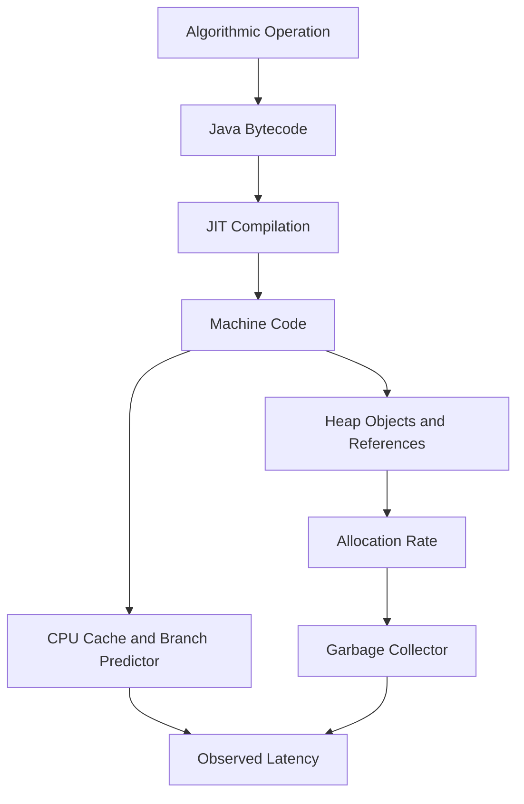
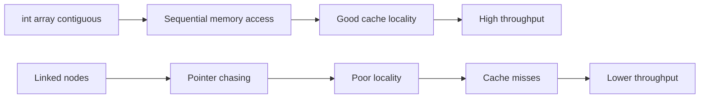
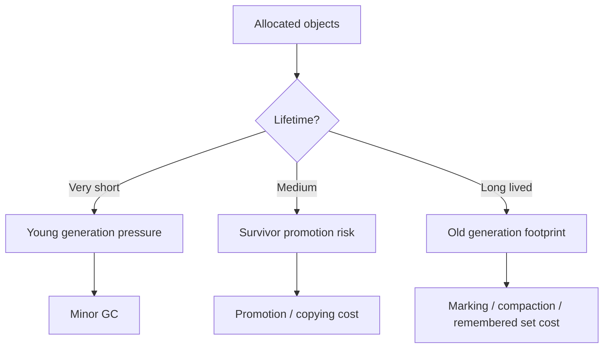
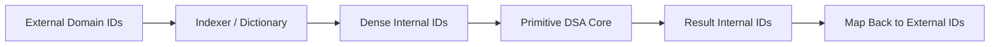

------
title: Learn Java Data Structures and Algorithms - Part 003
description: Build a practical Java memory cost model for data structures: object layout, references, locality, allocation pressure, GC impact, primitive arrays, boxed values, and representation trade-offs.
series: learn-java-dsa
seriesTitle: Learn Java Data Structures and Algorithms
order: 3
partTitle: Java Memory Model for Data Structures
tags:
- java
- data-structures
- algorithms
- memory
- performance
- series
date: 2026-06-27
---

# Part 003 — Java Memory Model for Data Structures

> **Core skill:** mampu memilih dan mendesain representasi data di Java dengan memahami biaya memori, pointer chasing, locality, allocation pressure, boxing, dan GC impact — bukan hanya berdasarkan Big-O.

Di part sebelumnya, kita memperlakukan complexity sebagai kontrak engineering. Namun Big-O hanya menjawab pertanyaan kasar: bagaimana cost bertumbuh saat input membesar. Untuk Java DSA tingkat lanjut, pertanyaan yang sering lebih menentukan adalah:

- apakah data tersusun kontigu atau tersebar di heap?
- berapa banyak object yang dialokasikan?
- apakah traversal menyebabkan banyak cache miss?
- apakah nilai primitive berubah menjadi object karena boxing?
- apakah struktur data memicu GC pressure?
- apakah representasi cocok dengan query/update pattern?

Dua algoritma bisa sama-sama `O(n)`, tetapi salah satunya bisa jauh lebih cepat karena membaca `int[]` secara linear, sementara yang lain melompat dari object ke object melalui reference.

Part ini membangun **runtime memory cost model** untuk Java data structures.

---

## 1. Klarifikasi Penting: “Memory Model” di Sini Bukan Hanya JMM Concurrency

Di Java, istilah **Java Memory Model** sering berarti model formal untuk visibility, happens-before, volatile, synchronization, dan concurrency correctness.

Dalam part ini, istilah **memory model for data structures** berarti **model biaya memori runtime**:

- layout object di heap,
- reference dan indirection,
- primitive vs boxed value,
- array locality,
- allocation dan GC,
- cache behavior,
- footprint collection,
- representasi data untuk workload tertentu.

Concurrency memory model akan dibahas secara khusus di part 034 tentang concurrent dan lock-free data structures.

---

## 2. Kaufman Lens: Subskill yang Harus Dikuasai

Josh Kaufman menekankan dekomposisi skill menjadi subskill kecil yang bisa dilatih. Untuk memory-aware DSA di Java, subskill-nya adalah:

| Subskill | Tujuan Praktis |
|---|---|
| Object cost estimation | Bisa memperkirakan footprint object, array, node, entry, dan wrapper. |
| Layout reasoning | Bisa menjelaskan kenapa `int[]` biasanya lebih murah daripada `List<Integer>`. |
| Locality reasoning | Bisa memprediksi traversal mana yang cache-friendly. |
| Allocation reasoning | Bisa melihat kapan algoritma membuat terlalu banyak temporary object. |
| GC impact reasoning | Bisa memahami kenapa alokasi kecil tapi masif bisa menjadi bottleneck. |
| Representation choice | Bisa memilih antara array, map, tree, bitset, adjacency list, matrix, dan custom primitive structure. |
| Measurement discipline | Bisa memvalidasi dugaan dengan JOL, JMH, JFR, profiler, atau heap dump. |

Target 20 jam latihan untuk topik ini bukan menghafal ukuran object. Targetnya adalah membentuk refleks engineering:

> “Sebelum memilih struktur data, saya tahu bentuk data di heap, pola aksesnya, dan efeknya terhadap CPU/GC.”

---

## 3. Mental Model Utama

### 3.1 Algorithmic Model vs Runtime Model

Model algoritmik menyederhanakan operasi menjadi unit cost:

```text
array[i]     => O(1)
map.get(k)   => O(1) average
list.add(x)  => O(1) amortized
sort(a)      => O(n log n)
```

Runtime Java tidak sesederhana itu. Operasi nyata dipengaruhi oleh:



Karena itu, `O(1)` bukan berarti “murah”. `HashMap.get()` average `O(1)`, tetapi bisa melibatkan:

1. hash computation,
2. table index calculation,
3. array access,
4. node reference dereference,
5. equality check,
6. possible tree bin traversal,
7. branch misprediction,
8. cache miss.

Sementara `int[] arr; arr[i]` biasanya lebih langsung:

1. bounds check,
2. base address + offset calculation,
3. memory load.

Keduanya bisa `O(1)`, tetapi cost constant-nya berbeda jauh.

---

## 4. Java Heap: Object, Reference, dan Array

### 4.1 Object Identity dan Header

Setiap object Java bukan hanya field. Object membawa metadata runtime seperti header, class metadata pointer, alignment, dan kadang state lock/hash.

Secara konseptual:

```text
Object in heap
+-----------------------+
| object header         |
| class / metadata ptr  |
| fields                |
| padding / alignment   |
+-----------------------+
```

Ukuran detailnya implementation-dependent. Jangan hardcode ukuran object sebagai hukum universal. Gunakan tool seperti JOL ketika ukuran aktual penting.

OpenJDK JOL sendiri menjelaskan dirinya sebagai toolbox untuk menganalisis layout object, footprint, dan references di JVM. Itu penting karena layout aktual bergantung pada JVM, flags, alignment, compressed references, dan platform.

### 4.2 Reference Bukan Object

Di Java, variable dengan tipe object menyimpan reference, bukan object inline.

```java
Node n = new Node(10);
```

Secara mental:

```text
stack/local variable n
+----------+
| ref ---- | -------------------+
+----------+                    |
                              heap
                              +-------------------+
                              | Node object        |
                              | int value          |
                              | Node next ref      |
                              +-------------------+
```

Konsekuensinya:

- `Node[]` adalah array reference, bukan array object inline.
- `List<Integer>` menyimpan reference ke `Integer`, bukan `int` inline.
- `Map<K,V>` menyimpan node/entry object yang berisi reference ke key dan value.

### 4.3 Array Primitive vs Array Reference

Bandingkan:

```java
int[] a = new int[1_000_000];
Integer[] b = new Integer[1_000_000];
```

`int[]` berisi 1 juta nilai `int` secara kontigu.

```text
int[]
+--------+--------+--------+--------+--------+
| int 0  | int 1  | int 2  | int 3  | ...    |
+--------+--------+--------+--------+--------+
```

`Integer[]` berisi 1 juta reference. Nilai `Integer`-nya berada di object terpisah, kecuali referensi reuse dari cache untuk nilai kecil.

```text
Integer[]
+-----+-----+-----+-----+
| ref | ref | ref | ref |
+--|--+--|--+--|--+--|--+
   |     |     |     |
   v     v     v     v
 Integer Integer Integer Integer
 object  object  object  object
```

Cost tambahan:

- header untuk tiap `Integer`,
- reference indirection,
- cache locality buruk,
- allocation pressure,
- GC work lebih besar.

Rule of thumb:

> Untuk data numerik besar, gunakan primitive array atau primitive-specialized structure. Jangan default ke `List<Integer>` hanya karena API-nya nyaman.

---

## 5. Cache Locality: Kenapa Kontigu Sering Menang

CPU membaca memori dalam cache line, bukan satu byte terisolasi. Jika data tersusun berdekatan, traversal linear bisa memanfaatkan prefetch dan cache locality.



### 5.1 Contiguous Traversal

```java
long sum(int[] values) {
    long total = 0;
    for (int value : values) {
        total += value;
    }
    return total;
}
```

Ciri-cirinya:

- akses linear,
- predictable branch,
- data compact,
- mudah dioptimalkan CPU/JIT.

### 5.2 Pointer Chasing

```java
long sum(Node head) {
    long total = 0;
    for (Node n = head; n != null; n = n.next) {
        total += n.value;
    }
    return total;
}
```

Ciri-cirinya:

- tiap node bisa berada di lokasi heap berbeda,
- traversal bergantung pada reference berikutnya,
- CPU sulit melakukan prefetch efektif,
- lebih banyak object untuk GC.

Ini alasan utama mengapa `LinkedList` sering kalah dari `ArrayList` untuk workload umum, meskipun insertion/removal teoritis di tengah linked list bisa `O(1)` jika node sudah diketahui.

Masalahnya: menemukan node tengah biasanya tetap `O(n)`, dan traversal `O(n)`-nya mahal.

---

## 6. Representation Is an Algorithmic Decision

Dalam DSA tingkat lanjut, struktur data bukan hanya “pilih class library”. Struktur data adalah representasi state.

Pertanyaan representasi:

1. Apakah domain key padat atau sparse?
2. Apakah nilai bisa direpresentasikan sebagai primitive?
3. Apakah traversal lebih dominan daripada random access?
4. Apakah update lebih dominan daripada query?
5. Apakah memory lebih penting daripada latency?
6. Apakah data immutable setelah build?
7. Apakah urutan penting?
8. Apakah concurrent access diperlukan?
9. Apakah cardinality diketahui sejak awal?
10. Apakah ada upper bound kecil yang bisa dimanfaatkan?

Contoh:

```java
// Dense id space: 0..n-1
int[] scoreByUserId = new int[n];

// Sparse id space
Map<Long, Integer> scoreByUserId = new HashMap<>();
```

Jika `userId` padat dan bounded, array jauh lebih compact dan cepat. Jika `userId` sparse dan besar, map lebih masuk akal.

---

## 7. Java Collections dari Sudut Pandang Memory Cost

### 7.1 ArrayList

`ArrayList<E>` secara konseptual menyimpan array internal `Object[]`.

```text
ArrayList object
+--------------------+
| Object[] elementData ref ----+
| int size           |         |
+--------------------+         |
                               v
                         Object[]
                         +-----+-----+-----+-----+
                         | ref | ref | ref | ... |
                         +-----+-----+-----+-----+
```

Kekuatan:

- compact untuk reference sequence,
- random access cepat,
- append amortized murah,
- traversal cache-friendly untuk array reference.

Kelemahan:

- element object tetap terpisah,
- insert/remove di tengah perlu shifting,
- boxing mahal untuk primitive,
- resizing dapat membuat allocation spike.

Gunakan ketika:

- urutan penting,
- random access penting,
- append dominan,
- data bisa disimpan sebagai object reference.

Hindari untuk:

- queue dengan banyak remove dari depan,
- primitive numeric data besar jika boxing tidak bisa diterima.

### 7.2 LinkedList

`LinkedList<E>` memakai node yang saling mereferensikan.

```text
LinkedList
+---------+      +------+      +------+      +------+
| first --|----> | Node | ---> | Node | ---> | Node |
| last  --|--+   +------+      +------+      +------+
+---------+  |      |             |             |
             |      v             v             v
             |    item          item          item
             +-------------------------------> last
```

Biaya:

- satu object node per element,
- reference `prev`, `next`, dan `item`,
- locality buruk,
- traversal mahal,
- GC overhead tinggi.

Gunakan hanya jika:

- perlu deque semantics dan `ArrayDeque` tidak cocok,
- perlu iterator-based insertion/removal dengan node position sudah diketahui,
- workload benar-benar menguntungkan linked representation.

Untuk stack/queue umum, `ArrayDeque` biasanya lebih tepat.

### 7.3 HashMap

`HashMap<K,V>` secara konseptual memiliki table array dan node/entry.

```text
HashMap
+------------------+
| Node<K,V>[] table ----+
| int size         |    |
| float loadFactor |    |
+------------------+    |
                        v
                table buckets
                +------+------+------+------+
                | null | ref  | null | ref  |
                +------+------+------+------+
                         |             |
                         v             v
                       Node          Node -> Node
```

Satu entry tidak hanya key-value pair. Entry biasanya membawa:

- hash,
- key reference,
- value reference,
- next reference,
- object header,
- alignment.

Konsekuensi:

- `HashMap<Integer, Integer>` untuk jutaan angka sangat mahal dibanding primitive arrays atau primitive maps.
- `HashMap` cepat secara average-case, tetapi footprint-nya besar.
- load factor mempengaruhi trade-off memory vs collision.
- key mutability bisa menghancurkan lookup correctness.

### 7.4 TreeMap

`TreeMap<K,V>` berbasis balanced tree. Tiap entry adalah node tree.

Biaya per entry biasanya lebih tinggi daripada HashMap karena node perlu menyimpan struktur tree:

- key,
- value,
- left,
- right,
- parent,
- color/balance metadata.

Keuntungan:

- ordered traversal,
- floor/ceiling,
- range query,
- predictable `O(log n)`.

Trade-off:

- pointer chasing lebih banyak,
- cache locality lebih buruk,
- comparator cost bisa signifikan.

### 7.5 PriorityQueue

`PriorityQueue<E>` memakai binary heap di atas array.

```text
heap array index relationship
parent(i) = (i - 1) / 2
left(i)   = 2 * i + 1
right(i)  = 2 * i + 2
```

Kekuatan:

- struktur heap compact,
- tidak butuh node object tambahan,
- insert/remove min `O(log n)`,
- peek `O(1)`.

Kelemahan:

- update priority tidak native,
- remove arbitrary object mahal,
- comparator cost bisa dominan,
- duplicate/lazy deletion perlu disiplin.

### 7.6 BitSet dan EnumSet

Jika domain boolean/presence padat, `BitSet` atau `EnumSet` bisa jauh lebih compact daripada `Set<Integer>` atau `Set<Enum>`.

```java
BitSet visited = new BitSet(n);
visited.set(nodeId);
boolean seen = visited.get(nodeId);
```

Untuk graph traversal dengan node id padat, `boolean[]` atau `BitSet` sering lebih baik daripada `HashSet<Integer>`.

---

## 8. Boxing: Salah Satu Silent Killer DSA Java

Boxing mengubah primitive menjadi object wrapper.

```java
List<Integer> values = new ArrayList<>();
values.add(42); // int -> Integer
```

Autoboxing membuat kode nyaman, tetapi biaya tersembunyi:

- allocation atau wrapper reuse tergantung nilai dan context,
- nullability masuk ke domain,
- equality bisa membingungkan jika memakai `==`,
- memory footprint membesar,
- GC pressure naik,
- CPU cache locality turun.

### 8.1 Contoh Buruk: Frequency Counting

```java
Map<Integer, Integer> freq = new HashMap<>();
for (int x : values) {
    freq.merge(x, 1, Integer::sum);
}
```

Kode ini ekspresif, tetapi untuk data besar, banyak biaya:

- `Integer` key boxing,
- `Integer` value boxing,
- `HashMap.Node` allocation,
- lambda/method reference overhead mungkin teroptimasi, mungkin tidak,
- repeated map lookup/update.

Jika domain kecil, representasi lebih baik:

```java
int[] freq = new int[maxValue + 1];
for (int x : values) {
    freq[x]++;
}
```

Ini bukan micro-optimization. Ini perubahan representasi dari sparse object graph ke dense primitive array.

---

## 9. Object Graph Shape Matters

Dua struktur dengan jumlah data sama bisa punya object graph sangat berbeda.

### 9.1 Flat Representation

```java
record EdgeArrays(int[] from, int[] to, int[] weight) {}
```

```text
EdgeArrays
+---------+---------+----------+
| from[]  | to[]    | weight[] |
+---------+---------+----------+
```

Keuntungan:

- compact,
- linear scan cepat,
- GC melihat sedikit object,
- cocok untuk batch processing.

Kelemahan:

- API kurang OO,
- update/insert bisa mahal,
- invariant antar-array harus dijaga.

### 9.2 Object-per-Edge Representation

```java
record Edge(int from, int to, int weight) {}
List<Edge> edges = new ArrayList<>();
```

```text
ArrayList -> Object[] -> Edge -> fields
                    \-> Edge -> fields
                    \-> Edge -> fields
```

Keuntungan:

- kode domain lebih readable,
- mudah dibawa sebagai value object,
- cocok untuk ukuran kecil/sedang.

Kelemahan:

- banyak object,
- reference chasing,
- allocation pressure,
- footprint lebih besar.

Top 1% engineer tidak fanatik pada salah satu. Ia memilih berdasarkan workload.

---

## 10. Graph Representation: Contoh Konkret

Graph adalah tempat memory model sangat terasa.

### 10.1 Object-Oriented Adjacency List

```java
final class Edge {
    final int to;
    final int weight;

    Edge(int to, int weight) {
        this.to = to;
        this.weight = weight;
    }
}

List<List<Edge>> graph = new ArrayList<>();
```

Kelebihan:

- mudah dibaca,
- flexible,
- cocok untuk pembelajaran dan domain modelling.

Kekurangan:

- banyak `ArrayList`,
- banyak `Edge`,
- nested references,
- locality buruk untuk graph besar.

### 10.2 Compressed Adjacency via Arrays

Untuk graph statis besar:

```java
final class IntGraph {
    final int n;
    final int[] head;
    final int[] to;
    final int[] weight;
    final int[] next;
    int edgeCount;

    IntGraph(int n, int maxEdges) {
        this.n = n;
        this.head = new int[n];
        this.to = new int[maxEdges];
        this.weight = new int[maxEdges];
        this.next = new int[maxEdges];
        Arrays.fill(head, -1);
    }

    void addEdge(int u, int v, int w) {
        to[edgeCount] = v;
        weight[edgeCount] = w;
        next[edgeCount] = head[u];
        head[u] = edgeCount++;
    }
}
```

Traversal:

```java
for (int e = graph.head[u]; e != -1; e = graph.next[e]) {
    int v = graph.to[e];
    int w = graph.weight[e];
    // process edge u -> v with weight w
}
```

Kelebihan:

- sedikit object,
- primitive arrays,
- compact,
- predictable memory,
- cocok untuk graph besar.

Kekurangan:

- API lebih rendah-level,
- deletion sulit,
- bug index lebih mungkin,
- invariant harus disiplin.

Invariant utama:

```text
0 <= edgeCount <= to.length
head[u] == -1 OR points to valid edge index
next[e] == -1 OR points to valid edge index
for every edge index e, to[e] is valid node id
```

---

## 11. Struct of Arrays vs Array of Structs

Java tradisional tidak punya value type inline object seperti C struct array. Karena itu, pilihan layout sering menjadi:

### 11.1 Array of Objects

```java
record Point(int x, int y) {}
Point[] points = new Point[n];
```

```text
Point[] refs -> Point objects
```

### 11.2 Struct of Arrays

```java
int[] xs = new int[n];
int[] ys = new int[n];
```

```text
xs: x0 x1 x2 x3 ...
ys: y0 y1 y2 y3 ...
```

Jika algoritma sering membaca semua `x` saja, SoA lebih cache-friendly. Jika selalu membaca `x` dan `y` bersama dan ukuran tidak besar, object representation mungkin cukup.

Rule:

> Pilih layout berdasarkan access pattern, bukan berdasarkan estetika class.

---

## 12. Allocation Pressure

Allocation di JVM modern sering sangat cepat, tetapi bukan berarti gratis.

Biaya allocation muncul dari:

- mengisi object header,
- zeroing memory,
- constructor work,
- write barrier,
- object lifetime tracking,
- GC scanning/copying/marking,
- cache pollution.

### 12.1 Temporary Object dalam Inner Loop

```java
for (int i = 0; i < n; i++) {
    Pair p = new Pair(a[i], b[i]);
    process(p);
}
```

Jika `Pair` tidak escape, JIT mungkin melakukan scalar replacement. Tetapi jangan desain algoritma besar dengan asumsi optimisasi itu pasti terjadi.

Versi explicit:

```java
for (int i = 0; i < n; i++) {
    process(a[i], b[i]);
}
```

Lebih sedikit object berarti lebih sedikit tekanan pada allocator dan GC.

### 12.2 Recursion dan Allocation

Recursive algorithm tidak selalu mengalokasikan object, tetapi bisa menciptakan stack pressure dan temporary collection jika tidak hati-hati.

Buruk:

```java
List<Integer> dfs(Node node) {
    List<Integer> result = new ArrayList<>();
    if (node == null) return result;
    result.addAll(dfs(node.left));
    result.add(node.value);
    result.addAll(dfs(node.right));
    return result;
}
```

Lebih baik:

```java
void dfs(Node node, List<Integer> out) {
    if (node == null) return;
    dfs(node.left, out);
    out.add(node.value);
    dfs(node.right, out);
}
```

Yang berubah bukan Big-O saja. Yang berubah adalah jumlah temporary list dan copying.

---

## 13. GC Pressure dan Data Structure Lifetime

GC impact sangat dipengaruhi oleh lifetime object.



### 13.1 Short-Lived Temporary Structures

Contoh:

```java
for (Request request : requests) {
    Map<String, Object> scratch = new HashMap<>();
    // use scratch briefly
}
```

Masalah:

- allocation rate tinggi,
- young GC sering,
- latency tail bisa memburuk.

Solusi bisa berupa:

- gunakan primitive/local variables,
- reuse buffer dengan hati-hati,
- pre-size collection,
- avoid map jika key set tetap,
- gunakan object pool hanya jika benar-benar terbukti perlu.

Object pool sering memperburuk desain jika dipakai tanpa measurement, karena bisa menahan object lebih lama dan membebani old generation.

### 13.2 Long-Lived Index Structures

Untuk long-lived maps/trees/cache:

- footprint per entry penting,
- key/value duplication penting,
- reference ke object besar bisa mencegah GC,
- weak/soft reference semantics harus dipahami,
- eviction policy harus jelas.

---

## 14. Pre-sizing dan Capacity Planning

Banyak collection Java memiliki capacity internal.

### 14.1 ArrayList

Jika jumlah elemen diketahui:

```java
List<Event> events = new ArrayList<>(expectedSize);
```

Manfaat:

- mengurangi resizing,
- mengurangi copying,
- mengurangi temporary array.

### 14.2 HashMap

Jika akan menyimpan `n` entry dan load factor default sekitar 0.75, capacity perlu lebih besar dari `n`.

```java
static int capacityFor(int expectedSize, float loadFactor) {
    return (int) Math.ceil(expectedSize / loadFactor);
}
```

Namun capacity HashMap dibulatkan ke power-of-two internal. Jangan overfit kecuali benar-benar penting.

Praktis:

```java
Map<String, Integer> counts = new HashMap<>(capacityFor(expectedKeys, 0.75f));
```

Trade-off:

- terlalu kecil: resize dan rehash,
- terlalu besar: wasted memory dan cache footprint lebih besar.

---

## 15. Memory Layout and Correctness Are Connected

Representasi compact sering menggeser risiko dari runtime ke invariant.

Contoh graph array:

```java
final int[] head;
final int[] to;
final int[] next;
```

Bug yang mungkin:

- lupa initialize `head` ke `-1`,
- edgeCount melewati capacity,
- `next[e]` salah menunjuk,
- node id out of range,
- directed/undirected edge count salah,
- array parallel tidak sinkron.

Maka setiap low-level representation butuh invariant checker.

```java
void checkInvariants() {
    if (head.length != n) {
        throw new IllegalStateException("head length mismatch");
    }
    if (to.length != next.length || to.length != weight.length) {
        throw new IllegalStateException("edge arrays length mismatch");
    }
    if (edgeCount < 0 || edgeCount > to.length) {
        throw new IllegalStateException("edgeCount out of range");
    }
    for (int u = 0; u < n; u++) {
        for (int e = head[u]; e != -1; e = next[e]) {
            if (e < 0 || e >= edgeCount) {
                throw new IllegalStateException("invalid edge index: " + e);
            }
            if (to[e] < 0 || to[e] >= n) {
                throw new IllegalStateException("invalid target node: " + to[e]);
            }
        }
    }
}
```

Top-level principle:

> Semakin rendah-level representasi data, semakin eksplisit invariant yang harus dijaga.

---

## 16. Case Study: Visited Set untuk BFS

Problem:

> Kita punya graph dengan node id `0..n-1`. Kita perlu BFS dan menandai node yang sudah dikunjungi.

### 16.1 Naive General Solution

```java
Set<Integer> visited = new HashSet<>();
Queue<Integer> queue = new ArrayDeque<>();
```

Kelebihan:

- mudah,
- fleksibel untuk sparse arbitrary id,
- readable.

Kekurangan:

- boxing `Integer`,
- HashSet node/table overhead,
- hash computation,
- indirection,
- memory tinggi.

### 16.2 Dense Id Solution

```java
boolean[] visited = new boolean[n];
int[] queue = new int[n];
int head = 0;
int tail = 0;

visited[start] = true;
queue[tail++] = start;

while (head < tail) {
    int u = queue[head++];
    for (int v : neighborsOf(u)) {
        if (!visited[v]) {
            visited[v] = true;
            queue[tail++] = v;
        }
    }
}
```

Kelebihan:

- no boxing,
- no per-node object allocation,
- memory predictable,
- fast.

Kekurangan:

- hanya cocok jika id padat,
- queue capacity harus cukup,
- API lebih manual.

### 16.3 BitSet Solution

```java
BitSet visited = new BitSet(n);
visited.set(start);

if (!visited.get(v)) {
    visited.set(v);
}
```

Kelebihan:

- lebih compact dari `boolean[]` untuk sangat banyak node,
- API masih cukup nyaman.

Kekurangan:

- bit operations punya overhead,
- tidak selalu lebih cepat dari `boolean[]`,
- perlu measurement.

Decision table:

| Node ID Shape | Recommended Visited Structure |
|---|---|
| Dense `0..n-1`, speed priority | `boolean[]` |
| Dense huge graph, memory priority | `BitSet` |
| Sparse arbitrary id | `HashSet<Id>` atau remap id ke dense index |
| Enum domain | `EnumSet` |
| Concurrent traversal | specialized concurrent state, not default `HashSet` |

---

## 17. Remapping Sparse IDs to Dense IDs

Sering kali data eksternal memakai ID besar/sparse:

```text
user ids: 100023, 991827312, 42, 7744210081
```

Tetapi algoritma graph lebih efisien jika node id padat:

```text
internal ids: 0, 1, 2, 3
```

Pattern:

```java
final class IdIndexer {
    private final Map<Long, Integer> toInternal = new HashMap<>();
    private final List<Long> toExternal = new ArrayList<>();

    int idOf(long externalId) {
        Integer existing = toInternal.get(externalId);
        if (existing != null) {
            return existing;
        }
        int id = toExternal.size();
        toInternal.put(externalId, id);
        toExternal.add(externalId);
        return id;
    }

    long externalIdOf(int internalId) {
        return toExternal.get(internalId);
    }

    int size() {
        return toExternal.size();
    }
}
```

Setelah remap, algoritma bisa memakai:

- `int[]`,
- `boolean[]`,
- `BitSet`,
- array-based graph,
- primitive priority queue jika perlu.

Ini pattern penting untuk sistem produksi: boundary menerima domain ID kaya, core algorithm memakai dense integer representation.



---

## 18. Mutability, Aliasing, dan Defensive Copy

Memory-aware design bukan berarti mengorbankan correctness.

### 18.1 Aliasing Hazard

```java
final class IntTable {
    private final int[] values;

    IntTable(int[] values) {
        this.values = values;
    }
}
```

Caller masih bisa mengubah array setelah object dibuat.

```java
int[] raw = {1, 2, 3};
IntTable table = new IntTable(raw);
raw[0] = 99;
```

Jika `IntTable` harus immutable, lakukan defensive copy:

```java
IntTable(int[] values) {
    this.values = Arrays.copyOf(values, values.length);
}
```

Trade-off:

- defensive copy meningkatkan allocation dan time,
- tanpa copy bisa merusak invariant.

Top 1% decision:

> Copy di boundary untuk menjaga ownership; hindari copy di inner loop jika ownership sudah jelas.

### 18.2 Ownership Contract

Untuk internal engineering handbook, tulis contract eksplisit:

```java
/**
 * Owns the provided arrays. The caller must not mutate them after construction.
 * This class does not defensively copy for performance reasons.
 */
final class PackedEdges {
    private final int[] from;
    private final int[] to;
    private final int[] weight;

    PackedEdges(int[] from, int[] to, int[] weight) {
        if (from.length != to.length || from.length != weight.length) {
            throw new IllegalArgumentException("edge arrays must have same length");
        }
        this.from = from;
        this.to = to;
        this.weight = weight;
    }
}
```

---

## 19. Recursion Stack as Memory

DSA sering memakai recursion: DFS, tree traversal, backtracking, divide and conquer.

Stack memory juga finite.

```java
void dfs(int u) {
    visited[u] = true;
    for (int v : graph[u]) {
        if (!visited[v]) dfs(v);
    }
}
```

Untuk graph dengan path sangat panjang, recursion bisa menyebabkan `StackOverflowError`.

Iterative version:

```java
void dfsIterative(int start, int[][] graph, boolean[] visited) {
    int[] stack = new int[graph.length];
    int top = 0;
    stack[top++] = start;

    while (top > 0) {
        int u = stack[--top];
        if (visited[u]) continue;
        visited[u] = true;

        for (int v : graph[u]) {
            if (!visited[v]) {
                stack[top++] = v;
            }
        }
    }
}
```

Trade-off:

- recursion lebih expressive,
- iterative lebih controllable,
- manual stack bisa preallocated,
- recursive call stack tidak mudah diinspect/resize per algorithm.

---

## 20. Memory-Aware API Design

### 20.1 Jangan Bocorkan Struktur Internal Sembarangan

Buruk:

```java
int[] distances() {
    return distances;
}
```

Lebih aman:

```java
int distanceTo(int node) {
    return distances[node];
}

int[] copyDistances() {
    return Arrays.copyOf(distances, distances.length);
}
```

Untuk performance-critical internal module, bisa ekspose view/array dengan ownership contract eksplisit.

### 20.2 Hindari Iterator Allocation di Hot Path Jika Terukur Bermasalah

Enhanced for nyaman:

```java
for (Edge e : edges) {
    process(e);
}
```

Untuk `ArrayList`, iterator object mungkin teroptimasi. Untuk custom structures, desain traversal bisa menyediakan primitive callback atau cursor.

```java
for (int e = head[u]; e != -1; e = next[e]) {
    process(to[e], weight[e]);
}
```

Tetap gunakan readability sebagai default. Turun ke low-level traversal hanya ketika data size dan measurement membenarkan.

---

## 21. Practical Heuristics

### 21.1 Pilih Primitive Array Jika

- domain index dense,
- data numerik besar,
- traversal linear dominan,
- latency/memory penting,
- null tidak dibutuhkan,
- ukuran bisa diketahui atau bounded.

### 21.2 Pilih Object Collection Jika

- ukuran kecil/sedang,
- domain modelling penting,
- readability lebih penting daripada footprint,
- workload tidak hot,
- fleksibilitas update penting.

### 21.3 Pilih HashMap Jika

- key sparse,
- lookup by key dominan,
- ordering tidak penting,
- memory overhead acceptable,
- key contract stabil.

### 21.4 Pilih TreeMap Jika

- perlu ordering,
- perlu range query,
- perlu floor/ceiling,
- predictable `O(log n)` lebih penting dari average `O(1)`.

### 21.5 Pilih BitSet Jika

- domain boolean padat,
- memory sangat penting,
- operasi set bit sesuai kebutuhan,
- index non-negative dan bounded.

---

## 22. Failure Modes yang Sering Terjadi

| Failure Mode | Gejala | Penyebab | Perbaikan |
|---|---|---|---|
| `List<Integer>` untuk jutaan nilai | Memory tinggi, GC sering | Boxing + object graph | `int[]`, primitive collection, remap id |
| `LinkedList` untuk traversal | Lambat meski `O(n)` | Pointer chasing | `ArrayList`, `ArrayDeque`, array |
| `HashMap` tanpa pre-size | Rehash spike | Capacity terlalu kecil | Estimate capacity |
| Mutable key di HashMap | Lookup gagal | `hashCode` berubah | Immutable key |
| Recursive DFS stack overflow | Crash pada path panjang | Call stack terlalu dalam | Iterative DFS |
| Banyak temporary object | GC pressure | Object dibuat di inner loop | Reuse carefully / primitive locals |
| Defensive copy berlebihan | Latency tinggi | Copy di hot path | Ownership contract |
| Compact arrays bug-prone | Index corruption | Invariant tidak dicek | Debug invariant checker |

---

## 23. Measurement Toolkit

Untuk memory-aware DSA, tool utama:

| Tool | Fungsi |
|---|---|
| JOL | Inspect object layout dan footprint. |
| JMH | Benchmark isolated operation dengan warmup/fork/blackhole. |
| JFR | Profiling allocation, CPU, locks, GC, latency events. |
| Heap dump | Lihat retained size dan object graph. |
| GC logs | Lihat allocation/collection behavior. |
| async-profiler/perf | CPU dan allocation flame graph, jika tersedia. |

Jangan gunakan `System.currentTimeMillis()` dalam loop sebagai bukti performa DSA. Part 004 akan membahas measurement discipline secara khusus.

---

## 24. Practice Loop

Latihan 1 — Estimate before measuring:

1. Buat `int[]` berisi 1 juta angka.
2. Buat `ArrayList<Integer>` berisi 1 juta angka.
3. Sebelum mengukur, tulis prediksi footprint relatif.
4. Verifikasi dengan profiler/JOL/heap observation.
5. Jelaskan selisihnya.

Latihan 2 — Replace representation:

1. Implement frequency count dengan `HashMap<Integer, Integer>`.
2. Implement dengan `int[]` untuk domain `0..1_000_000`.
3. Bandingkan memory dan speed.
4. Jelaskan kapan map tetap lebih benar.

Latihan 3 — Graph representation:

1. Implement graph dengan `List<List<Edge>>`.
2. Implement graph dengan parallel primitive arrays.
3. Jalankan BFS/Dijkstra sederhana.
4. Bandingkan readability, footprint, dan bug risk.

Latihan 4 — Ownership contract:

1. Buat class immutable yang menerima array.
2. Implement versi defensive copy.
3. Implement versi ownership transfer.
4. Tulis invariant dan dokumentasi contract.

---

## 25. Self-Correction Checklist

Sebelum memilih struktur data, tanyakan:

- Apakah domain key dense atau sparse?
- Apakah primitive cukup?
- Apakah boxing terjadi?
- Berapa banyak object per element?
- Apakah traversal linear atau pointer chasing?
- Apakah collection perlu pre-size?
- Apakah struktur data long-lived atau temporary?
- Apakah GC pressure akan muncul dari allocation rate?
- Apakah representation invariant eksplisit?
- Apakah correctness dikorbankan demi compactness?
- Apakah hasil sudah divalidasi dengan measurement?

---

## 26. Internal Engineering Rule

Gunakan rule ini sepanjang seri:

> Big-O menentukan kelas pertumbuhan. Memory layout menentukan apakah kelas itu bisa dijalankan dengan efisien di mesin nyata.

Untuk Java DSA advance, keputusan terbaik biasanya bukan “struktur data mana yang paling elegan”, melainkan:

> “Representasi mana yang menjaga invariant domain dengan footprint, locality, dan allocation behavior yang cocok untuk workload?”

---

## 27. Part Summary

Di part ini kita membangun memory cost model untuk Java data structures:

- object Java membawa metadata dan alignment;
- reference bukan object inline;
- primitive array biasanya jauh lebih compact daripada boxed collection;
- cache locality membuat traversal kontigu sangat kuat;
- pointer chasing membuat linked/tree/hash structures punya constant factor besar;
- allocation rate bisa menjadi bottleneck karena GC pressure;
- representation choice adalah keputusan algoritmik;
- compact low-level representation butuh invariant eksplisit;
- measurement wajib untuk memvalidasi dugaan.

Part berikutnya akan membahas **benchmarking, profiling, dan measurement** agar semua klaim performa bisa diuji secara benar.

---

## References

- OpenJDK Code Tools — Java Object Layout (JOL): https://openjdk.org/projects/code-tools/jol/
- OpenJDK JOL source repository: https://github.com/openjdk/jol
- Oracle Java Collections Framework guide: https://docs.oracle.com/en/java/javase/21/core/java-collections-framework.html
- Oracle JDK Flight Recorder documentation: https://docs.oracle.com/en/java/java-components/jdk-mission-control/8/user-guide/using-jdk-flight-recorder.html
