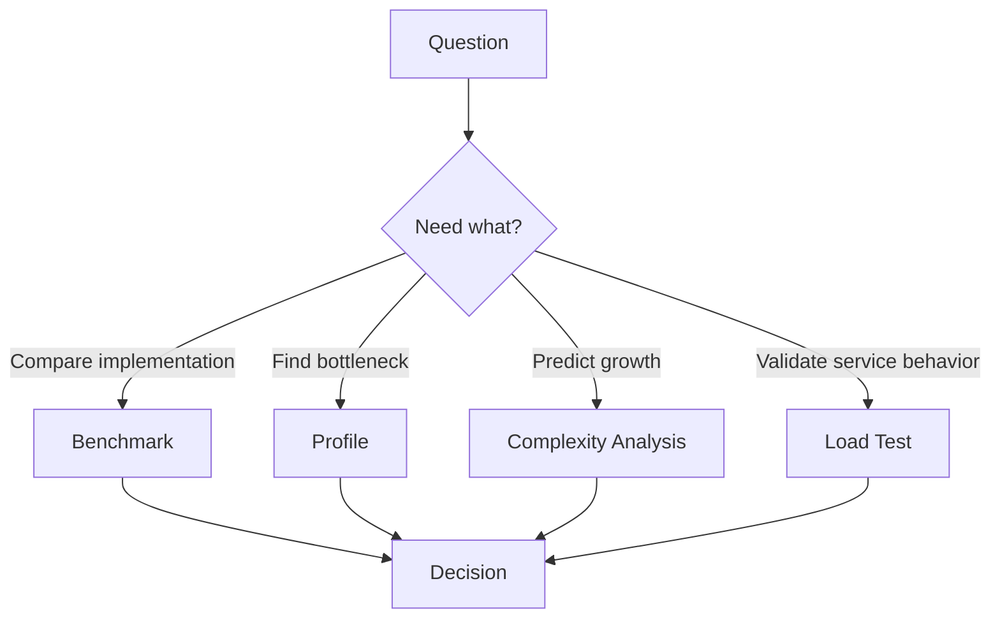
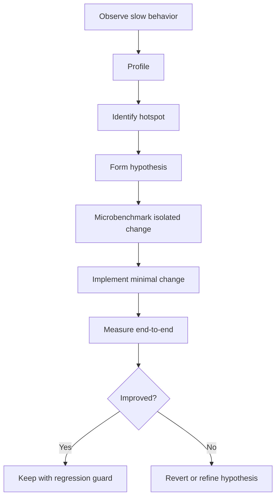
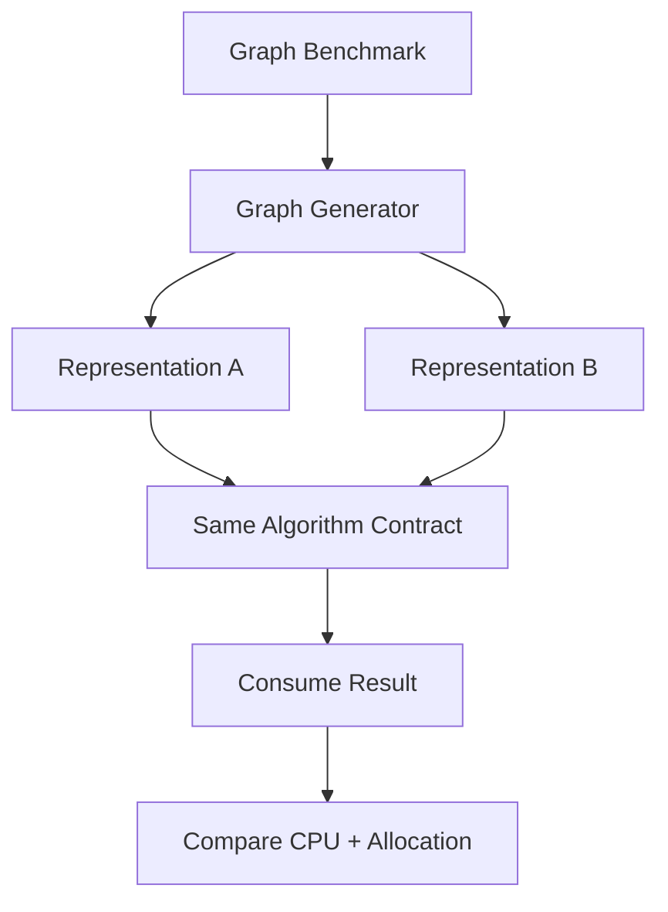

------
title: Learn Java Data Structures and Algorithms - Part 004
description: Learn how to measure Java data structure and algorithm performance correctly using JMH, profiling, JFR, GC observation, workload design, and engineering-grade experiment discipline.
series: learn-java-dsa
seriesTitle: Learn Java Data Structures and Algorithms
order: 4
partTitle: Benchmarking, Profiling, and Measurement
tags:
- java
- data-structures
- algorithms
- benchmarking
- profiling
- jmh
- jfr
- performance
- series
date: 2026-06-27
---

# Part 004 — Benchmarking, Profiling, and Measurement

> **Core skill:** mampu mengukur performa algoritma dan struktur data Java secara benar, membedakan benchmark dari profiling, menghindari microbenchmark traps, dan membuat keputusan engineering berdasarkan evidence.

Dalam DSA, banyak engineer berhenti di klaim:

```text
ArrayList get is O(1)
HashMap get is O(1)
TreeMap get is O(log n)
LinkedList insert is O(1)
```

Klaim ini benar sebagai model algoritmik, tetapi tidak cukup untuk keputusan sistem nyata. Kita perlu tahu:

- workload mana yang diukur,
- input size berapa,
- distribusi datanya seperti apa,
- apakah JVM sudah warm up,
- apakah JIT menghilangkan kode benchmark,
- apakah allocation masuk hitungan,
- apakah GC mengganggu measurement,
- apakah hasil stabil antar fork,
- apakah benchmark representatif terhadap produksi.

Part ini membangun disiplin pengukuran untuk seluruh seri.

---

## 1. Kaufman Lens: Belajar Measurement sebagai Skill Terpisah

Dalam kerangka Kaufman, measurement bukan aktivitas tambahan. Measurement adalah subskill yang membuat latihan menjadi self-correcting.

Tanpa measurement, kita hanya mengandalkan:

- intuisi,
- Big-O,
- blog post,
- pengalaman lama,
- benchmark orang lain,
- asumsi tentang JVM.

Dengan measurement yang benar, kita bisa menjawab:

- apakah representasi array memang lebih cepat untuk workload ini?
- apakah HashMap perlu pre-size?
- apakah comparator cost mendominasi sorting?
- apakah DP memoization mengalokasikan terlalu banyak object?
- apakah recursive DFS menyebabkan stack risk?
- apakah bottleneck ada di CPU, allocation, lock, atau cache?

Target skill-nya:

> “Saya bisa mendesain eksperimen kecil yang menjawab pertanyaan performa spesifik tanpa menipu diri sendiri.”

---

## 2. Benchmark vs Profiling

Benchmark dan profiling sering dicampur, padahal tugasnya berbeda.

| Aktivitas | Pertanyaan | Output |
|---|---|---|
| Benchmark | “Seberapa cepat pendekatan A dibanding B untuk workload terdefinisi?” | angka throughput/latency/allocation |
| Profiling | “Waktu/memori habis di mana?” | hotspot, flame graph, allocation site, lock, GC |
| Load test | “Bagaimana sistem end-to-end di bawah traffic?” | latency distribution, saturation, error rate |
| Complexity analysis | “Bagaimana cost tumbuh terhadap n?” | fungsi pertumbuhan dan bound |

Urutan praktis:



Contoh pertanyaan yang baik:

```text
For 1 million integer keys in range 0..10_000_000, is int[] frequency counting faster and smaller than HashMap<Integer, Integer>?
```

Contoh pertanyaan buruk:

```text
Which is faster, array or map?
```

Pertanyaan buruk tidak punya workload, input shape, atau operation mix.

---

## 3. Why Java Benchmarking Is Hard

Java berjalan di managed runtime dengan JIT, GC, class loading, tiered compilation, speculative optimization, dan runtime profiling.

Kode yang sama bisa punya performa berbeda karena:

- warmup belum selesai,
- method belum di-JIT compile,
- branch profile berbeda,
- allocation dieliminasi oleh escape analysis,
- loop dieliminasi karena result tidak dipakai,
- CPU frequency scaling,
- GC cycle terjadi di tengah run,
- OS scheduling noise,
- data terlalu kecil sehingga semua masuk cache,
- benchmark tidak menyerupai production call path.

### 3.1 Naive Benchmark yang Menipu

```java
long start = System.nanoTime();
for (int i = 0; i < 1_000_000; i++) {
    map.get(i);
}
long elapsed = System.nanoTime() - start;
System.out.println(elapsed);
```

Masalah:

- tidak ada warmup,
- result `get()` tidak dipakai,
- JVM bisa mengoptimasi berbeda,
- hanya satu run,
- tidak ada fork,
- tidak ada control input,
- tidak ada error bars,
- GC tidak diamati,
- benchmark setup bercampur dengan measurement jika tidak hati-hati.

---

## 4. JMH sebagai Default untuk Microbenchmark Java

JMH adalah harness dari OpenJDK untuk membangun, menjalankan, dan menganalisis benchmark Java/JVM pada skala nano, micro, milli, sampai macro.

Gunakan JMH ketika ingin mengukur operasi kecil seperti:

- `HashMap.get`,
- `ArrayList` traversal,
- sort comparator,
- binary search variant,
- priority queue operations,
- graph representation traversal,
- DP table filling strategy,
- parsing/tokenization inner loop.

Jangan menulis microbenchmark manual kecuali Anda sangat tahu jebakannya.

---

## 5. Minimal JMH Benchmark

Contoh Maven dependency biasanya mengikuti versi JMH yang sedang dipakai project. Konsepnya:

```xml
<dependency>
    <groupId>org.openjdk.jmh</groupId>
    <artifactId>jmh-core</artifactId>
    <version>${jmh.version}</version>
</dependency>
<dependency>
    <groupId>org.openjdk.jmh</groupId>
    <artifactId>jmh-generator-annprocess</artifactId>
    <version>${jmh.version}</version>
    <scope>provided</scope>
</dependency>
```

Benchmark:

```java
package dsa.bench;

import org.openjdk.jmh.annotations.Benchmark;
import org.openjdk.jmh.annotations.BenchmarkMode;
import org.openjdk.jmh.annotations.Fork;
import org.openjdk.jmh.annotations.Measurement;
import org.openjdk.jmh.annotations.Mode;
import org.openjdk.jmh.annotations.OutputTimeUnit;
import org.openjdk.jmh.annotations.Scope;
import org.openjdk.jmh.annotations.Setup;
import org.openjdk.jmh.annotations.State;
import org.openjdk.jmh.annotations.Warmup;
import org.openjdk.jmh.infra.Blackhole;

import java.util.HashMap;
import java.util.Map;
import java.util.concurrent.TimeUnit;

@BenchmarkMode(Mode.Throughput)
@OutputTimeUnit(TimeUnit.MILLISECONDS)
@Warmup(iterations = 5, time = 1)
@Measurement(iterations = 5, time = 1)
@Fork(3)
public class HashMapLookupBenchmark {

    @State(Scope.Thread)
    public static class BenchmarkState {
        Map<Integer, Integer> map;
        int[] keys;

        @Setup
        public void setup() {
            int n = 1_000_000;
            map = new HashMap<>(1_500_000);
            keys = new int[n];
            for (int i = 0; i < n; i++) {
                map.put(i, i);
                keys[i] = i;
            }
        }
    }

    @Benchmark
    public void lookup(BenchmarkState state, Blackhole blackhole) {
        for (int key : state.keys) {
            blackhole.consume(state.map.get(key));
        }
    }
}
```

Key points:

- `@Warmup` memberi waktu JVM mengoptimalkan kode.
- `@Measurement` memisahkan fase ukur.
- `@Fork` menjalankan JVM process terpisah untuk mengurangi bias state.
- `@State` menyimpan data benchmark.
- `Blackhole` mencegah dead-code elimination.

---

## 6. Benchmark Modes

JMH menyediakan beberapa mode. Untuk DSA, yang paling sering:

| Mode | Arti | Cocok Untuk |
|---|---|---|
| `Throughput` | operasi per unit waktu | banyak operasi kecil, lookup, insert, traversal |
| `AverageTime` | rata-rata waktu per operasi | latency operasi, sorting satu batch |
| `SampleTime` | distribusi sample waktu | operasi dengan variasi latency |
| `SingleShotTime` | waktu satu invocation | cold-ish operation, setup besar, batch job |
| `All` | semua mode | eksplorasi awal, biasanya terlalu bising |

Untuk algoritma batch seperti sorting array besar:

```java
@BenchmarkMode(Mode.AverageTime)
@OutputTimeUnit(TimeUnit.MILLISECONDS)
```

Untuk operation loop seperti map lookup:

```java
@BenchmarkMode(Mode.Throughput)
@OutputTimeUnit(TimeUnit.MILLISECONDS)
```

---

## 7. State Scope

JMH state scope menentukan sharing data antar thread benchmark.

| Scope | Meaning | Use Case |
|---|---|---|
| `Scope.Thread` | tiap worker thread punya state sendiri | default aman untuk single-thread DSA |
| `Scope.Benchmark` | semua worker berbagi state | concurrent structure / shared cache |
| `Scope.Group` | state per group thread | producer-consumer benchmark |

Untuk DSA single-thread, mulai dengan `Scope.Thread`.

```java
@State(Scope.Thread)
public static class StateData { }
```

Untuk benchmark `ConcurrentHashMap`, `BlockingQueue`, atau lock-free structure, gunakan state sharing yang merepresentasikan workload nyata.

---

## 8. Setup Level

JMH setup bisa berjalan pada level berbeda:

```java
@Setup
public void setup() { }
```

Level umum:

| Level | Kapan Jalan | Use Case |
|---|---|---|
| Trial | sekali per benchmark trial | build data besar yang immutable |
| Iteration | sebelum setiap measurement iteration | reset mutable structure |
| Invocation | sebelum setiap benchmark call | input harus fresh setiap invocation |

Contoh sorting wajib memakai input fresh, karena sorting mengubah array.

Buruk:

```java
@Benchmark
public void sortSameArray(StateData s) {
    Arrays.sort(s.values);
}
```

Setelah invocation pertama, array sudah sorted. Benchmark berikutnya mengukur sorting data sorted, bukan random.

Lebih baik:

```java
@Benchmark
public int[] sortCopy(StateData s) {
    int[] copy = Arrays.copyOf(s.values, s.values.length);
    Arrays.sort(copy);
    return copy;
}
```

Tetapi ini mengukur copy + sort. Jika ingin sort saja, setup invocation bisa dipakai, namun overhead setup harus dipahami.

```java
@State(Scope.Thread)
public static class SortState {
    int[] source;
    int[] work;

    @Setup
    public void setupTrial() {
        source = randomInts(1_000_000);
        work = new int[source.length];
    }

    @Setup(org.openjdk.jmh.annotations.Level.Invocation)
    public void setupInvocation() {
        System.arraycopy(source, 0, work, 0, source.length);
    }
}
```

Tetap ada copy cost sebelum invocation, tetapi tidak masuk measurement method body secara langsung. Interpretasi hasil harus hati-hati.

---

## 9. Dead-Code Elimination

JIT akan menghapus pekerjaan yang hasilnya tidak berdampak.

Buruk:

```java
@Benchmark
public void compute() {
    int x = 1 + 2;
}
```

JIT bisa menghapus semuanya.

Gunakan return value:

```java
@Benchmark
public int compute() {
    return 1 + 2;
}
```

Atau `Blackhole`:

```java
@Benchmark
public void compute(Blackhole bh) {
    bh.consume(1 + 2);
}
```

Untuk loop:

```java
@Benchmark
public long sum(IntArrayState state) {
    long total = 0;
    for (int x : state.values) {
        total += x;
    }
    return total;
}
```

Return aggregate agar loop tetap relevan.

---

## 10. Constant Folding dan Unrealistic Constants

Buruk:

```java
@Benchmark
public int constant() {
    return binarySearch(new int[]{1, 2, 3, 4, 5}, 4);
}
```

Input terlalu konstan. Compiler bisa mengoptimalkan dengan cara yang tidak terjadi di produksi.

Lebih baik:

```java
@State(Scope.Thread)
public static class SearchState {
    int[] values;
    int[] queries;
    int index;

    @Setup
    public void setup() {
        values = new int[1_000_000];
        for (int i = 0; i < values.length; i++) values[i] = i * 2;
        queries = randomQueries(100_000);
    }

    int nextQuery() {
        int q = queries[index++];
        if (index == queries.length) index = 0;
        return q;
    }
}

@Benchmark
public int search(SearchState s) {
    return Arrays.binarySearch(s.values, s.nextQuery());
}
```

Input harus cukup realistis agar branch profile dan cache behavior tidak palsu.

---

## 11. Benchmark Data Size: Jangan Hanya Satu `n`

DSA adalah tentang pertumbuhan. Benchmark satu ukuran input bisa menipu.

Gunakan parameter:

```java
@State(Scope.Thread)
public static class SizeState {
    @org.openjdk.jmh.annotations.Param({"100", "10000", "1000000"})
    int n;

    int[] values;

    @Setup
    public void setup() {
        values = new int[n];
        for (int i = 0; i < n; i++) values[i] = i;
    }
}
```

Tujuan:

- melihat threshold kecil/sedang/besar,
- menangkap cache effect,
- melihat complexity growth,
- menghindari keputusan berdasarkan ukuran input yang tidak representatif.

Contoh interpretasi:

| n | Array scan | HashSet lookup | Catatan |
|---:|---:|---:|---|
| 100 | similar | similar | overhead dominan |
| 10,000 | array wins | map acceptable | locality mulai terasa |
| 10,000,000 | array much better | memory/GC heavy | representation menentukan |

Angka aktual harus diukur. Tabel di atas hanya pola yang sering terjadi.

---

## 12. Operation Mix

Struktur data jarang dipakai untuk satu operasi saja.

Contoh map workload:

```text
90% get
5% put
5% remove
```

Berbeda dengan:

```text
40% get
40% put
20% remove
```

Benchmark harus mencerminkan operation mix.

```java
@Benchmark
public void mixedWorkload(MapState s, Blackhole bh) {
    int op = s.nextOperation();
    int key = s.nextKey();

    if (op < 90) {
        bh.consume(s.map.get(key));
    } else if (op < 95) {
        s.map.put(key, key);
    } else {
        s.map.remove(key);
    }
}
```

Namun hati-hati: mutable state berubah sepanjang benchmark. Jika map makin kosong/penuh, hasil tidak stabil. Anda perlu menjaga steady state.

---

## 13. Steady State untuk Mutable Structures

Benchmark mutable structure perlu menjaga kondisi setimbang.

Contoh queue:

Buruk:

```java
@Benchmark
public Integer pollUntilEmpty(QueueState s) {
    return s.queue.poll();
}
```

Setelah beberapa invocation, queue kosong.

Lebih baik:

```java
@Benchmark
public Integer offerThenPoll(QueueState s) {
    s.queue.offer(s.nextValue++);
    return s.queue.poll();
}
```

Untuk priority queue:

```java
@Benchmark
public int replaceMin(PqState s) {
    int min = s.pq.poll();
    s.pq.offer(s.nextValue());
    return min;
}
```

Steady state menjaga size relatif stabil.

---

## 14. Allocation Measurement

Kecepatan saja tidak cukup. Dua implementation bisa punya throughput sama, tetapi allocation berbeda jauh.

Dengan JMH, profiler GC bisa digunakan dari command line:

```bash
java -jar target/benchmarks.jar -prof gc
```

Yang ingin dilihat:

- bytes allocated per operation,
- allocation rate,
- GC count,
- GC time.

Contoh kasus:

```java
@Benchmark
public List<Integer> boxedList() {
    List<Integer> list = new ArrayList<>();
    for (int i = 0; i < 10_000; i++) {
        list.add(i);
    }
    return list;
}

@Benchmark
public int[] primitiveArray() {
    int[] values = new int[10_000];
    for (int i = 0; i < values.length; i++) {
        values[i] = i;
    }
    return values;
}
```

Pertanyaan bukan hanya “mana lebih cepat”, tetapi:

- berapa allocation per element?
- apakah wrapper muncul?
- apakah result escape?
- apakah benchmark mencerminkan produksi?

---

## 15. Profiling dengan JFR

JDK Flight Recorder adalah framework profiling dan event collection yang built into JDK. Untuk DSA/performance work, JFR berguna untuk melihat:

- CPU hotspot,
- allocation hotspot,
- GC events,
- lock contention,
- thread stalls,
- file/socket events jika workload sistemik,
- latency outlier.

Contoh menjalankan aplikasi dengan recording:

```bash
java \
  -XX:StartFlightRecording=filename=recording.jfr,duration=60s,settings=profile \
  -jar app.jar
```

Atau untuk process yang sedang jalan:

```bash
jcmd <pid> JFR.start name=dsa settings=profile filename=dsa.jfr duration=60s
```

Pertanyaan yang dijawab JFR:

```text
Why is this graph traversal slow in the real service?
```

Mungkin jawabannya:

- bukan BFS-nya,
- melainkan object allocation dari edge iterator,
- atau deserialization input,
- atau lock contention saat update shared map,
- atau GC pause akibat temporary collections.

---

## 16. Profiling Before Optimizing

Workflow sehat:



Anti-pattern:

```text
1. Assume HashMap is slow.
2. Replace everything with custom arrays.
3. Increase bug risk.
4. No production improvement.
```

Better:

```text
1. Profile allocation and CPU.
2. Find 40% time in boxing-heavy frequency map.
3. Benchmark primitive representation.
4. Replace only hot path.
5. Add invariant tests.
6. Validate production metric.
```

---

## 17. CPU Profiling vs Allocation Profiling

CPU profiling menjawab “waktu CPU habis di mana”. Allocation profiling menjawab “object dibuat di mana”.

Keduanya bisa berbeda.

Contoh:

```java
Map<Integer, List<Integer>> groups = new HashMap<>();
for (int x : values) {
    groups.computeIfAbsent(x % 100, ignored -> new ArrayList<>()).add(x);
}
```

CPU hotspot mungkin terlihat di `HashMap` atau lambda path. Allocation hotspot mungkin terlihat di:

- `Integer` boxing,
- `ArrayList` creation,
- resizing internal array,
- HashMap nodes.

Optimisasi yang tepat bergantung pada bottleneck:

| Bottleneck | Possible Fix |
|---|---|
| CPU hash/equality | better key, dense index, precomputed hash |
| Allocation | primitive arrays, pre-size, reuse buffers |
| GC pause | reduce allocation rate, reduce live set |
| Lock contention | sharding, lock-free, local aggregation |
| Branch misprediction | data layout, branchless-ish transform, sorted grouping |

---

## 18. Designing Fair Comparisons

Benchmark yang adil harus menjaga hal berikut:

### 18.1 Same Work

Jika membandingkan two-sum:

- kedua implementation harus mengembalikan hasil yang sama,
- duplicate handling sama,
- no-solution behavior sama,
- input distribution sama.

### 18.2 Same Input

Gunakan input yang sama untuk semua variant.

```java
@Benchmark
public int hashMapSolution(TwoSumState s) {
    return solveWithHashMap(s.values, s.target);
}

@Benchmark
public int sortTwoPointerSolution(TwoSumState s) {
    return solveWithSorting(s.values, s.target);
}
```

Jika sorting mengubah input, pakai copy atau fresh work array.

### 18.3 Same Correctness Contract

Jangan membandingkan:

- algorithm yang mengembalikan index original,
- dengan algorithm yang hanya menjawab true/false.

Itu bukan pekerjaan sama.

### 18.4 Same Error Handling

Jika satu version validate input dan satu lagi tidak, hasilnya bias.

---

## 19. Microbenchmark vs Production Reality

Microbenchmark berguna, tetapi tidak selalu memprediksi production behavior.

Alasan:

- production memiliki mixed workload,
- CPU cache dibagi dengan kode lain,
- branch profile berbeda,
- object lifetime berbeda,
- data distribution berbeda,
- thread scheduling berbeda,
- IO dan serialization ikut terlibat,
- JIT profile di production berbeda.

Maka gunakan hierarchy evidence:

```text
Complexity analysis
    -> microbenchmark
        -> component benchmark
            -> integration benchmark
                -> production telemetry
```

Microbenchmark menjawab pertanyaan sempit. Production telemetry memvalidasi dampak nyata.

---

## 20. Benchmark Result Interpretation

Jangan hanya melihat mean.

Perhatikan:

- variance,
- confidence interval/error,
- outlier,
- fork-to-fork stability,
- allocation per operation,
- GC events,
- CPU utilization,
- input size trend,
- regression threshold.

Contoh interpretasi:

```text
Variant A: 1200 ops/ms ± 40
Variant B: 1230 ops/ms ± 80
```

Tidak cukup kuat untuk klaim “B lebih cepat” jika noise overlap dan efeknya kecil.

Contoh lebih kuat:

```text
Variant A: 200 ops/ms ± 10, alloc 256 B/op
Variant B: 900 ops/ms ± 20, alloc 0 B/op
```

Ini menunjukkan difference besar dan allocation behavior berbeda.

---

## 21. Complexity Growth Experiment

Untuk memvalidasi complexity, ukur beberapa `n` dan lihat growth.

Contoh:

```java
@Param({"1000", "10000", "100000", "1000000"})
int n;
```

Lalu bandingkan ratio.

Jika algoritma `O(n)`:

```text
n naik 10x -> waktu kira-kira naik 10x
```

Jika `O(n log n)`:

```text
n naik 10x -> waktu naik sedikit lebih dari 10x
```

Jika `O(n^2)`:

```text
n naik 10x -> waktu kira-kira naik 100x
```

Namun cache dan constant factor bisa membuat ukuran kecil misleading.

Praktik:

- ukur small, medium, large,
- plot log-log jika perlu,
- cari threshold saat algorithm A mengalahkan B,
- jangan extrapolate terlalu jauh tanpa validasi.

---

## 22. Case Study: Contains Check

Problem:

> Kita perlu mengecek apakah value ada dalam collection.

Variant:

1. linear scan `int[]`,
2. `HashSet<Integer>`,
3. sorted `int[]` + binary search,
4. `BitSet` untuk dense domain.

### 22.1 Complexity

| Variant | Build | Query | Memory |
|---|---:|---:|---:|
| Linear `int[]` | `O(n)` load | `O(n)` | low |
| `HashSet<Integer>` | `O(n)` average | `O(1)` average | high |
| Sorted `int[]` | `O(n log n)` | `O(log n)` | low |
| `BitSet` | `O(n)` | `O(1)` | very low for dense boolean |

### 22.2 Benchmark Questions

Pertanyaan yang benar:

- Berapa banyak query per build?
- Apakah data berubah setelah build?
- Apakah domain value dense?
- Berapa hit rate?
- Apakah query random atau sequential?
- Apakah memory budget ketat?

Jika query hanya satu kali, linear scan bisa menang untuk `n` kecil/sedang karena tidak ada build overhead.

Jika query jutaan kali, HashSet/sorted array/BitSet bisa menang.

Jika domain dense, BitSet bisa sangat kuat.

### 22.3 Benchmark Matrix

| Dimension | Values |
|---|---|
| n | 100, 10_000, 1_000_000 |
| queries per build | 1, 100, 1_000_000 |
| hit rate | 0%, 50%, 100% |
| domain | dense, sparse |
| mutation | immutable, frequent update |

Benchmark yang hanya mengukur satu kombinasi tidak cukup untuk keputusan umum.

---

## 23. Benchmarking Sorting

Sorting benchmark punya jebakan khusus.

Input distribution sangat penting:

- random,
- already sorted,
- reverse sorted,
- nearly sorted,
- many duplicates,
- small array,
- large array,
- expensive comparator,
- primitive vs object.

Java sorting sendiri punya behavior berbeda untuk primitive array dan object array.

Benchmark skeleton:

```java
@State(Scope.Thread)
public static class SortInput {
    @Param({"1000", "100000", "1000000"})
    int n;

    @Param({"RANDOM", "SORTED", "REVERSED", "DUPLICATES"})
    String distribution;

    int[] source;

    @Setup
    public void setup() {
        source = generate(n, distribution);
    }
}

@Benchmark
public int[] sortIntArray(SortInput s) {
    int[] copy = Arrays.copyOf(s.source, s.source.length);
    Arrays.sort(copy);
    return copy;
}
```

Interpretasi harus menyebut bahwa hasil mencakup copy. Jika ingin mengukur sort mutating saja, desain setup invocation dengan hati-hati.

---

## 24. Benchmarking HashMap

HashMap benchmark harus mempertimbangkan:

- initial capacity,
- load factor,
- key distribution,
- hash quality,
- hit/miss ratio,
- key type,
- mutable vs immutable key,
- map size,
- update ratio,
- resize event.

Contoh hit/miss:

```java
@Param({"0", "50", "100"})
int hitRate;
```

Miss lookup bisa punya behavior berbeda dari hit lookup. Collision juga mengubah behavior.

Buruk:

```java
for (int i = 0; i < n; i++) {
    map.put(i, i);
}
```

Jika ingin mengukur collision resilience, key harus sengaja dibuat dengan hash buruk.

```java
final class BadHashKey {
    final int id;

    BadHashKey(int id) {
        this.id = id;
    }

    @Override
    public int hashCode() {
        return 1;
    }

    @Override
    public boolean equals(Object obj) {
        return obj instanceof BadHashKey other && other.id == id;
    }
}
```

Ini bukan production key yang baik, tetapi benchmark ini menjawab failure mode collision.

---

## 25. Benchmarking Graph Algorithms

Graph benchmark harus menentukan:

- node count,
- edge count,
- density,
- directed/undirected,
- weight distribution,
- connectedness,
- degree distribution,
- representation,
- source node distribution,
- result consumed atau tidak.

BFS pada grid graph berbeda dari BFS pada scale-free graph.



Hasil BFS harus dipakai:

```java
@Benchmark
public int bfs(GraphState s) {
    return bfsCountReachable(s.graph, s.start);
}
```

Jangan hanya menjalankan BFS tanpa mengembalikan count/distance checksum.

---

## 26. Measuring Correctness Alongside Performance

Benchmark cepat tapi salah tidak berguna.

Gunakan correctness guard di luar hot benchmark method:

```java
@Setup
public void setup() {
    // build input
    int expected = referenceImplementation(input);
    int actual = optimizedImplementation(input);
    if (expected != actual) {
        throw new IllegalStateException("wrong result");
    }
}
```

Untuk algoritma kompleks:

- property-based test,
- randomized differential test,
- invariant checker,
- edge case suite,
- benchmark only after correctness confidence.

Workflow:

```text
Correctness first, then performance.
```

---

## 27. Avoiding Benchmark-Driven Overengineering

Measurement bisa disalahgunakan.

Anti-pattern:

- mengganti code readable dengan custom low-level implementation karena benchmark synthetic menunjukkan +5%,
- mengabaikan error bars,
- mengoptimalkan path yang bukan bottleneck,
- mengunci desain pada detail JVM tertentu,
- menambah bug risk tanpa production impact.

Gunakan decision rule:

```text
Optimize only when:
1. hotspot terbukti,
2. improvement material,
3. correctness tetap kuat,
4. complexity tambahan bisa dirawat,
5. production metric membaik.
```

---

## 28. Experiment Template

Gunakan template ini sebelum benchmark:

```mdx
## Performance Experiment

### Question
What exact claim are we testing?

### Hypothesis
What do we expect and why?

### Workload
- Input size:
- Data distribution:
- Operation mix:
- Mutation pattern:
- Threading model:

### Variants
- Baseline:
- Candidate:

### Correctness Contract
What output/invariant must match?

### Metrics
- Throughput / latency:
- Allocation:
- GC:
- Error/variance:

### Risks
- Dead-code elimination:
- Warmup bias:
- Unrealistic data:
- Setup cost contamination:
- Production mismatch:

### Result
Measured numbers, not vibes.

### Decision
Keep, reject, or investigate further.
```

---

## 29. Minimal JMH Project Layout

Typical layout:

```text
project-root/
  pom.xml
  src/
    main/java/
      dsa/
        Graph.java
        IntGraph.java
    test/java/
      dsa/
        GraphTest.java
    jmh/java/
      dsa/bench/
        GraphTraversalBenchmark.java
```

Some projects keep benchmarks under `src/jmh/java` using plugin configuration. Others create a separate benchmark module.

Recommendation untuk engineering repo:

```text
modules/
  dsa-core/
  dsa-benchmarks/
```

Alasan:

- production dependencies tetap bersih,
- benchmark bisa punya dependency JMH/profiling,
- CI performance job bisa dipisah,
- benchmark data generator bisa lebih bebas.

---

## 30. CI Performance Guardrails

Performance regression test di CI harus hati-hati karena CI environment noisy.

Gunakan CI untuk:

- smoke benchmark,
- allocation regression besar,
- complexity sanity check,
- threshold kasar,
- historical trend.

Jangan gunakan CI shared runner untuk klaim microsecond presisi.

Better approach:

```text
Pull request:
  - run correctness tests
  - run small benchmark smoke if relevant
Nightly dedicated runner:
  - run benchmark suite
  - compare against baseline
  - alert on material regression
```

Regression threshold harus realistis:

```text
Alert if throughput drops > 15% across 3 consecutive nightly runs.
```

Bukan:

```text
Fail build if benchmark drops 1% once.
```

---

## 31. What to Put in Benchmark Reports

Report minimal:

- Java version,
- JVM vendor,
- JVM flags,
- OS/CPU,
- benchmark commit hash,
- JMH version,
- warmup/measurement/fork config,
- input size/distribution,
- benchmark mode,
- result with error,
- allocation metrics,
- conclusion.

Example:

```text
Benchmark: DenseVisitedBenchmark
Java: 25
Mode: Throughput
Warmup: 5 x 1s
Measurement: 5 x 1s
Forks: 3
n: 10_000_000
Workload: BFS-like sequential mark/get
Variants: boolean[], BitSet, HashSet<Integer>
Metrics: ops/ms, B/op
Decision: boolean[] retained for speed; BitSet acceptable under memory cap.
```

---

## 32. Common Measurement Failure Modes

| Failure Mode | Symptom | Fix |
|---|---|---|
| No warmup | first run slow/unstable | use JMH warmup |
| Dead-code elimination | impossible speed | return result / Blackhole |
| Constant folding | unrealistic speed | randomized/state input |
| Setup contamination | measuring data creation | separate setup from measured body |
| Mutable state drift | result changes over time | steady-state design |
| Single input size | wrong conclusion | use `@Param` sizes |
| Synthetic distribution | production mismatch | model actual data shape |
| No allocation metric | hidden GC cost | use allocation/JFR/GC profiler |
| Ignoring variance | false winner | compare error bars/forks |
| Benchmarking non-hot path | wasted optimization | profile first |

---

## 33. Practice Loop

Latihan 1 — Array vs List traversal:

1. Benchmark sum over `int[]`.
2. Benchmark sum over `ArrayList<Integer>`.
3. Gunakan `@Param` untuk `n = 100, 10_000, 1_000_000`.
4. Tambahkan `-prof gc`.
5. Jelaskan throughput dan allocation.

Latihan 2 — HashMap pre-sizing:

1. Insert 1 juta entry tanpa initial capacity.
2. Insert dengan estimated capacity.
3. Ukur throughput dan allocation/GC.
4. Jelaskan resize cost.

Latihan 3 — Sorting distribution:

1. Benchmark `Arrays.sort(int[])` untuk random, sorted, reversed, duplicates.
2. Pastikan input fresh.
3. Jelaskan kenapa distribusi data mempengaruhi hasil.

Latihan 4 — BFS representation:

1. Implement graph object adjacency.
2. Implement graph primitive arrays.
3. Benchmark BFS reachable count.
4. Profile allocation dengan JFR/JMH profiler.
5. Jelaskan readability vs performance trade-off.

Latihan 5 — Production correlation:

1. Ambil satu slow path nyata atau simulasi service.
2. Profile dengan JFR.
3. Buat microbenchmark untuk hotspot.
4. Optimalkan.
5. Validasi lagi di scenario end-to-end.

---

## 34. Self-Correction Checklist

Sebelum percaya hasil benchmark:

- Apakah pertanyaan benchmark spesifik?
- Apakah workload realistis?
- Apakah input distribution relevan?
- Apakah ada beberapa ukuran input?
- Apakah JVM warmup cukup?
- Apakah ada fork?
- Apakah result dikonsumsi?
- Apakah setup cost tidak mencemari measurement?
- Apakah mutable state steady?
- Apakah allocation diukur?
- Apakah variance masuk akal?
- Apakah correctness contract sama?
- Apakah hasil microbenchmark divalidasi terhadap production/component behavior?

---

## 35. Internal Engineering Rule

Gunakan rule ini sepanjang seri:

> Jangan mengoptimalkan berdasarkan reputasi struktur data. Optimalkan berdasarkan workload, invariant, measurement, dan production impact.

DSA engineer yang matang tidak berkata:

```text
HashMap is always faster.
```

Ia berkata:

```text
For this key distribution, size, hit rate, and memory budget, this representation gives the best measured trade-off while preserving correctness.
```

---

## 36. Part Summary

Di part ini kita membangun disiplin measurement:

- benchmark menjawab comparison, profiling menjawab hotspot;
- Java benchmarking sulit karena JIT, GC, warmup, dan runtime profiling;
- JMH adalah default harness untuk microbenchmark Java;
- result harus dikonsumsi agar tidak dieliminasi;
- input harus realistis dan bervariasi;
- mutable structures butuh steady-state benchmark;
- allocation sama pentingnya dengan throughput;
- JFR membantu melihat CPU, allocation, GC, lock, dan latency di runtime nyata;
- microbenchmark harus dikaitkan kembali ke production/component behavior;
- performance tanpa correctness tidak bernilai.

Part berikutnya akan mulai masuk ke struktur data fundamental pertama: **arrays, dynamic arrays, dan ring buffers**.

---

## References

- OpenJDK Code Tools — Java Microbenchmark Harness (JMH): https://openjdk.org/projects/code-tools/jmh/
- OpenJDK JMH source repository: https://github.com/openjdk/jmh
- Oracle JDK Flight Recorder documentation: https://docs.oracle.com/en/java/java-components/jdk-mission-control/8/user-guide/using-jdk-flight-recorder.html
- Inside Java — Programmer's Guide to JDK Flight Recorder: https://inside.java/2024/04/12/programmer-guide-to-jfr/
