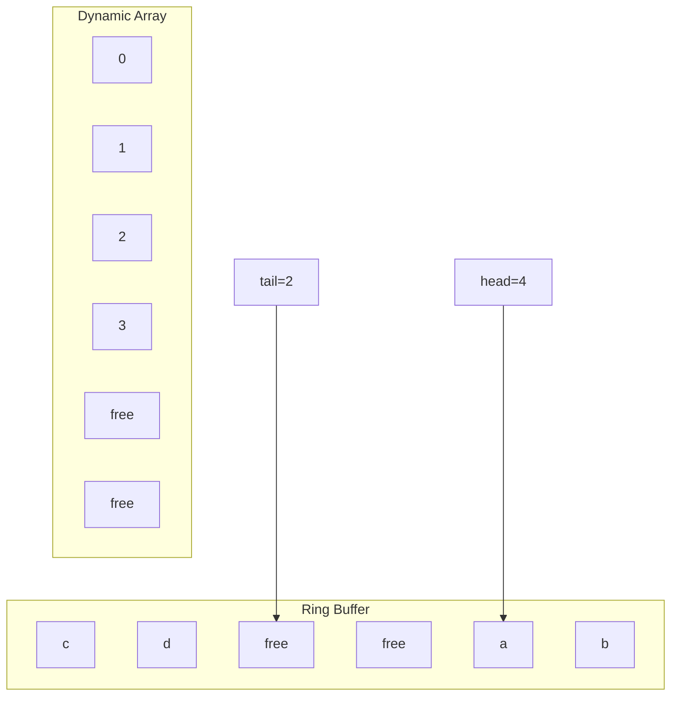
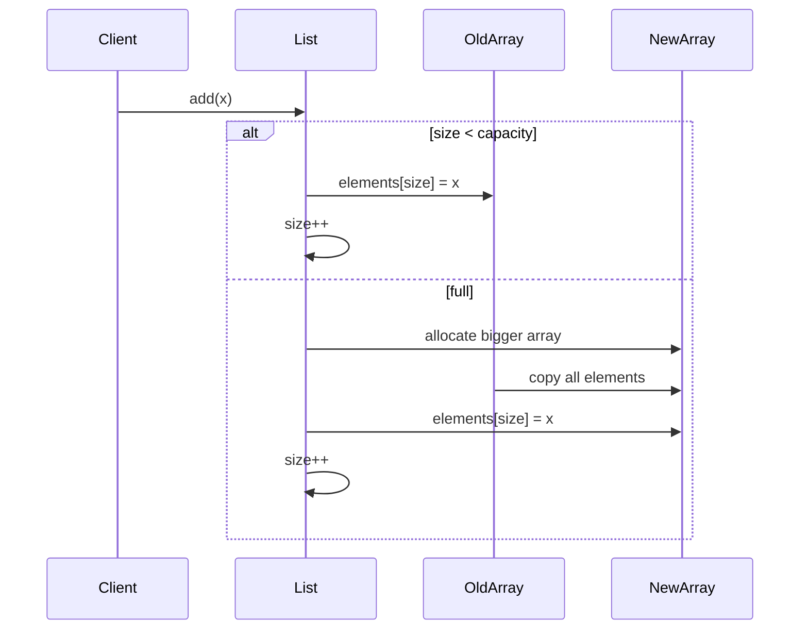

------
title: Learn Java Data Structures and Algorithms - Part 005
description: Arrays, dynamic arrays, and ring buffers as contiguous-storage primitives for building high-performance data structures in Java.
series: learn-java-dsa
seriesTitle: Learn Java Data Structures and Algorithms
order: 5
partTitle: Arrays, Dynamic Arrays, and Ring Buffers
tags:
- java
- data-structures
- algorithms
- arrays
- ring-buffer
- series
date: 2026-06-27
---

# Arrays, Dynamic Arrays, and Ring Buffers

Part ini membangun fondasi struktur data berbasis **contiguous storage**: array, dynamic array, dan ring buffer.

Kita tidak akan mengulang sintaks array Java. Fokus kita adalah engineering model:

- kapan array memberi performa terbaik,
- kenapa dynamic array bisa `O(1)` amortized untuk append,
- kenapa ring buffer penting untuk queue/deque/scheduler/log buffer,
- bagaimana menulis implementasi Java yang defensif terhadap boundary bug,
- bagaimana memilih struktur berbasis array dibanding linked structure.

Dalam DSA, array bukan hanya tipe data dasar. Array adalah **layout decision**. Banyak struktur data cepat sebenarnya hanya variasi dari satu ide: simpan elemen berdekatan, hitung indeks dengan murah, dan minimalkan pointer chasing.

---

## 1. Skill Target

Setelah menyelesaikan part ini, kita ingin mampu:

1. Menjelaskan invariant array, dynamic array, dan ring buffer tanpa menghafal template.
2. Mengimplementasikan `IntArrayList` sederhana berbasis primitive array.
3. Mendesain growth policy dan shrink policy yang masuk akal.
4. Menganalisis amortized cost append.
5. Mengimplementasikan bounded ring buffer tanpa off-by-one bug.
6. Memilih antara `ArrayList`, raw array, `ArrayDeque`, atau custom buffer berdasarkan workload.
7. Menjelaskan failure mode: resize storm, memory retention, boxing overhead, stale reference, false assumption tentang `O(1)`.

---

## 2. Kaufman Deconstruction

Mengikuti pendekatan Kaufman, skill besar “menguasai array-based structures” kita pecah menjadi subskill kecil yang bisa dilatih cepat.

| Subskill | Yang Dilatih | Output Praktis |
|---|---|---|
| Index arithmetic | Mengubah operasi menjadi perhitungan indeks | Implementasi `get`, `set`, `insert`, `delete` |
| Capacity management | Memisahkan `size` dan `capacity` | Dynamic array aman dari overflow/resizing buruk |
| Amortized reasoning | Melihat biaya total, bukan satu operasi saja | Analisis append `O(1)` amortized |
| Boundary invariant | Menjaga range valid | Tidak ada off-by-one pada shifting/ring wrap |
| Locality reasoning | Membaca konsekuensi memory layout | Memilih array vs linked structure |
| API discipline | Menulis kontrak method yang eksplisit | Struktur data kecil yang reusable |

Latihan paling efektif bukan membaca banyak variasi soal, tetapi mengimplementasikan struktur kecil, memecahkannya dengan test, lalu memperbaiki invariant-nya.

---

## 3. Mental Model: Array sebagai Address Function

Array adalah fungsi dari indeks ke lokasi memori logis.

Secara konseptual:

```text
address(a[i]) = base(a) + i * element_width
```

Untuk primitive array seperti `int[]`, elemen disimpan berurutan. Untuk object array seperti `String[]`, array menyimpan reference berurutan; object `String`-nya tetap berada di heap sebagai object terpisah.

```mermaid
flowchart LR
    subgraph PrimitiveArray[int[]]
        A0[10]
        A1[20]
        A2[30]
        A3[40]
    end

    subgraph ObjectArray[String[]]
        R0[ref]
        R1[ref]
        R2[ref]
    end

    R0 --> S0[String object]
    R1 --> S1[String object]
    R2 --> S2[String object]
```

Implikasi penting:

- `int[]` biasanya lebih cache-friendly daripada `Integer[]`.
- `ArrayList<Integer>` menyimpan reference ke `Integer`, bukan integer primitive inline.
- Operasi random access murah karena indeks langsung diterjemahkan ke offset.
- Operasi insert/delete di tengah mahal karena butuh shifting elemen.

Array adalah struktur data terbaik saat pola akses dominan adalah:

- random access by index,
- sequential scan,
- append-heavy,
- batch processing,
- data compact dan predictable.

Array buruk saat operasi dominan adalah:

- insert/delete sering di tengah tanpa toleransi shifting,
- ukuran sangat sering naik turun secara ekstrem,
- object besar banyak tetapi jarang diakses,
- sparse index space yang sangat besar.

---

## 4. Core Invariants

Untuk dynamic array, invariant minimum:

```text
0 <= size <= elements.length
valid indices: 0 <= index < size
unused slots: size <= index < elements.length
```

Untuk ring buffer:

```text
0 <= size <= capacity
head points to first logical element
tail points to next insertion position
logical index k maps to physical index (head + k) mod capacity
```

Satu perbedaan penting:

- dynamic array memakai layout linear: logical order sama dengan physical order.
- ring buffer memakai layout circular: logical order dapat terbelah di ujung array.



---

## 5. Java Built-ins: Apa yang Harus Kita Pahami

Di Java, pilihan umum:

| Struktur | Representasi | Use Case |
|---|---|---|
| `T[]` | Raw array object | Fixed-size, high-control, internal implementation |
| `int[]`, `long[]` | Primitive contiguous array | Numeric processing, performance-sensitive storage |
| `ArrayList<E>` | Dynamic object-reference array | General-purpose list, append/read-heavy |
| `ArrayDeque<E>` | Resizable circular array | Stack, queue, deque tanpa null element |
| `Arrays` | Utility methods for arrays | Sort, search, fill, copy |

`ArrayList` adalah dynamic array untuk `List`. Namun `ArrayList<Integer>` bukan `int[]`. Untuk DSA yang sensitif performa, boxing bisa menjadi biaya besar.

Contoh:

```java
List<Integer> xs = new ArrayList<>();
for (int i = 0; i < 1_000_000; i++) {
    xs.add(i); // boxing int -> Integer, kecuali beberapa value cache kecil
}
```

Untuk algoritma numeric, lebih baik mulai dari `int[]`, `long[]`, atau custom primitive collection.

---

## 6. Dynamic Array dari First Principles

Dynamic array memisahkan dua konsep:

- `size`: jumlah elemen valid.
- `capacity`: panjang array internal.

Append cepat selama `size < capacity`. Ketika penuh, kita alokasikan array baru yang lebih besar lalu copy elemen lama.



### 6.1 Minimal `IntArrayList`

Kita implementasi versi primitive agar tidak tercampur isu boxing.

```java
import java.util.Arrays;
import java.util.NoSuchElementException;

public final class IntArrayList {
    private static final int DEFAULT_CAPACITY = 10;

    private int[] elements;
    private int size;

    public IntArrayList() {
        this.elements = new int[DEFAULT_CAPACITY];
    }

    public IntArrayList(int initialCapacity) {
        if (initialCapacity < 0) {
            throw new IllegalArgumentException("initialCapacity must be non-negative");
        }
        this.elements = new int[initialCapacity];
    }

    public int size() {
        return size;
    }

    public boolean isEmpty() {
        return size == 0;
    }

    public int get(int index) {
        checkElementIndex(index);
        return elements[index];
    }

    public void set(int index, int value) {
        checkElementIndex(index);
        elements[index] = value;
    }

    public void add(int value) {
        ensureCapacity(size + 1);
        elements[size++] = value;
    }

    public void add(int index, int value) {
        checkPositionIndex(index);
        ensureCapacity(size + 1);
        int moved = size - index;
        if (moved > 0) {
            System.arraycopy(elements, index, elements, index + 1, moved);
        }
        elements[index] = value;
        size++;
    }

    public int removeAt(int index) {
        checkElementIndex(index);
        int old = elements[index];
        int moved = size - index - 1;
        if (moved > 0) {
            System.arraycopy(elements, index + 1, elements, index, moved);
        }
        size--;
        return old;
    }

    public int removeLast() {
        if (size == 0) {
            throw new NoSuchElementException();
        }
        return elements[--size];
    }

    public int[] toArray() {
        return Arrays.copyOf(elements, size);
    }

    private void ensureCapacity(int minCapacity) {
        if (minCapacity <= elements.length) {
            return;
        }

        int oldCapacity = elements.length;
        int newCapacity = oldCapacity + (oldCapacity >> 1) + 1; // ~1.5x, handles zero
        if (newCapacity < minCapacity) {
            newCapacity = minCapacity;
        }
        elements = Arrays.copyOf(elements, newCapacity);
    }

    private void checkElementIndex(int index) {
        if (index < 0 || index >= size) {
            throw new IndexOutOfBoundsException(
                "index=" + index + ", size=" + size
            );
        }
    }

    private void checkPositionIndex(int index) {
        if (index < 0 || index > size) {
            throw new IndexOutOfBoundsException(
                "index=" + index + ", size=" + size
            );
        }
    }
}
```

Perhatikan perbedaan dua validasi:

```text
Element index:  0 <= index < size   // untuk get/remove
Position index: 0 <= index <= size  // untuk insert/add at position
```

Banyak bug dynamic array berasal dari mencampur dua jenis indeks ini.

---

## 7. Growth Policy

Saat array penuh, kita tidak ingin menambah kapasitas hanya `+1`. Itu membuat append menjadi mahal karena setiap append memicu copy seluruh elemen.

Strategi umum:

| Growth | Contoh | Konsekuensi |
|---|---:|---|
| Linear | `capacity += 1` | Append total `O(n^2)` |
| Chunked | `capacity += 1024` | Baik untuk beberapa workload, tapi tetap buruk jika sangat besar |
| Multiplicative | `capacity *= 2` | Append amortized `O(1)`, memory slack lebih besar |
| 1.5x | `capacity += capacity/2` | Kompromi memory slack dan jumlah copy |

### 7.1 Amortized Analysis Append

Jika kapasitas selalu digandakan, elemen tidak dicopy pada setiap append. Copy terjadi pada ukuran:

```text
1, 2, 4, 8, 16, 32, ...
```

Total copy untuk `n` append kurang dari:

```text
1 + 2 + 4 + ... + n/2 < n
```

Total kerja:

```text
n append normal + < n copy = O(n)
```

Maka rata-rata per append:

```text
O(n) / n = O(1) amortized
```

Jangan menyebut append dynamic array selalu `O(1)` tanpa kata amortized. Satu operasi append bisa `O(n)` ketika resize terjadi.

---

## 8. Shrink Policy: Lebih Berbahaya dari Growth

Banyak implementasi custom tergoda untuk shrink segera setelah remove.

Contoh buruk:

```java
if (size < elements.length) {
    elements = Arrays.copyOf(elements, size);
}
```

Ini berbahaya karena workload berikut menjadi resize storm:

```text
add, remove, add, remove, add, remove
```

Jika setiap remove mengecilkan array, append berikutnya harus membesarkan lagi.

Shrink policy yang lebih sehat:

```text
if capacity is large AND size <= capacity / 4:
    shrink to capacity / 2
```

Tetapi dalam production system, shrink harus mempertimbangkan:

- apakah memory pressure benar-benar masalah,
- apakah buffer akan tumbuh lagi,
- apakah copy besar akan mengganggu latency,
- apakah struktur ini long-lived atau short-lived.

Kadang pilihan terbaik adalah tidak auto-shrink sama sekali, tetapi menyediakan method eksplisit seperti `trimToSize()`.

---

## 9. Deletion and Memory Retention

Untuk primitive array, remove cukup mengubah `size` atau shifting.

Untuk object array, kita wajib membersihkan slot tidak terpakai agar object lama bisa di-GC.

Contoh bug:

```java
public E removeLast() {
    if (size == 0) throw new NoSuchElementException();
    return elements[--size]; // BUG: reference lama masih tertahan
}
```

Versi benar:

```java
public E removeLast() {
    if (size == 0) throw new NoSuchElementException();
    E old = elements[--size];
    elements[size] = null; // release reference for GC
    return old;
}
```

Invariant object array:

```text
all slots >= size should not retain unnecessary references
```

Ini bukan micro-optimization. Untuk buffer besar yang long-lived, stale reference bisa membuat memory leak praktis.

---

## 10. Insert/Delete di Tengah: Shifting Cost

Dynamic array unggul untuk random access, tetapi insert/delete di tengah butuh shifting.

Insert at index:

```text
[a, b, c, d, _]
 insert X at index 1
[a, X, b, c, d]
```

Cost:

```text
moved = size - index
```

Remove at index:

```text
[a, b, c, d]
 remove index 1
[a, c, d, _]
```

Cost:

```text
moved = size - index - 1
```

Worst case `O(n)`, tetapi constant factor sering masih bagus karena `System.arraycopy` sangat dioptimalkan. Jangan otomatis memilih linked list hanya karena insert/delete teoritisnya `O(1)`. Pada linked list, menemukan posisi biasanya `O(n)`, dan tiap node membawa overhead object + pointer chasing.

---

## 11. Ring Buffer: Array yang Tidak Pernah Shift

Ring buffer menyelesaikan problem queue berbasis array: remove dari depan tidak perlu menggeser seluruh elemen.

Alih-alih shifting:

```text
removeFirst(): head++
addLast(x): elements[tail] = x; tail++
```

Ketika mencapai akhir array, indeks wrap ke awal.

```text
physicalIndex = (head + logicalIndex) mod capacity
```

### 11.1 Bounded Ring Buffer

Versi bounded lebih mudah untuk mempelajari invariant karena kapasitas tetap.

```java
import java.util.NoSuchElementException;

public final class IntRingBuffer {
    private final int[] elements;
    private int head;
    private int tail;
    private int size;

    public IntRingBuffer(int capacity) {
        if (capacity <= 0) {
            throw new IllegalArgumentException("capacity must be positive");
        }
        this.elements = new int[capacity];
    }

    public int capacity() {
        return elements.length;
    }

    public int size() {
        return size;
    }

    public boolean isEmpty() {
        return size == 0;
    }

    public boolean isFull() {
        return size == elements.length;
    }

    public void addLast(int value) {
        if (isFull()) {
            throw new IllegalStateException("buffer is full");
        }
        elements[tail] = value;
        tail = increment(tail);
        size++;
    }

    public int removeFirst() {
        if (isEmpty()) {
            throw new NoSuchElementException();
        }
        int value = elements[head];
        head = increment(head);
        size--;
        return value;
    }

    public int peekFirst() {
        if (isEmpty()) {
            throw new NoSuchElementException();
        }
        return elements[head];
    }

    public int get(int logicalIndex) {
        if (logicalIndex < 0 || logicalIndex >= size) {
            throw new IndexOutOfBoundsException(
                "index=" + logicalIndex + ", size=" + size
            );
        }
        return elements[physicalIndex(logicalIndex)];
    }

    private int physicalIndex(int logicalIndex) {
        return (head + logicalIndex) % elements.length;
    }

    private int increment(int index) {
        index++;
        return index == elements.length ? 0 : index;
    }
}
```

### 11.2 Kenapa Menyimpan `size`?

Ada dua desain ring buffer umum.

Desain A: menyimpan `size`.

```text
empty: size == 0
full:  size == capacity
```

Desain B: tidak menyimpan `size`, tetapi mengorbankan satu slot kosong.

```text
empty: head == tail
full:  increment(tail) == head
usable capacity = array.length - 1
```

Untuk implementasi pembelajaran dan kebanyakan business system, menyimpan `size` membuat invariant lebih eksplisit dan lebih mudah ditest. Untuk sistem sangat low-level, desain tanpa `size` kadang dipilih untuk alasan tertentu, tetapi kompleksitas mentalnya lebih tinggi.

---

## 12. Resizable Ring Buffer

`ArrayDeque` di Java adalah contoh struktur deque berbasis resizable array. Untuk memahami prinsipnya, kita bisa buat versi sederhana.

Saat buffer penuh, kita alokasikan array baru dan copy elemen dalam urutan logis mulai dari `head`.

```java
import java.util.Arrays;
import java.util.NoSuchElementException;

public final class ResizableIntDeque {
    private int[] elements;
    private int head;
    private int tail;
    private int size;

    public ResizableIntDeque() {
        this.elements = new int[16];
    }

    public int size() {
        return size;
    }

    public boolean isEmpty() {
        return size == 0;
    }

    public void addLast(int value) {
        ensureCapacity(size + 1);
        elements[tail] = value;
        tail = inc(tail, elements.length);
        size++;
    }

    public void addFirst(int value) {
        ensureCapacity(size + 1);
        head = dec(head, elements.length);
        elements[head] = value;
        size++;
    }

    public int removeFirst() {
        if (size == 0) throw new NoSuchElementException();
        int value = elements[head];
        head = inc(head, elements.length);
        size--;
        return value;
    }

    public int removeLast() {
        if (size == 0) throw new NoSuchElementException();
        tail = dec(tail, elements.length);
        int value = elements[tail];
        size--;
        return value;
    }

    public int get(int logicalIndex) {
        if (logicalIndex < 0 || logicalIndex >= size) {
            throw new IndexOutOfBoundsException();
        }
        return elements[(head + logicalIndex) % elements.length];
    }

    private void ensureCapacity(int minCapacity) {
        if (minCapacity <= elements.length) return;

        int newCapacity = elements.length << 1;
        if (newCapacity < minCapacity) {
            newCapacity = minCapacity;
        }

        int[] newElements = new int[newCapacity];
        for (int i = 0; i < size; i++) {
            newElements[i] = get(i);
        }

        elements = newElements;
        head = 0;
        tail = size;
    }

    private static int inc(int index, int length) {
        index++;
        return index == length ? 0 : index;
    }

    private static int dec(int index, int length) {
        return index == 0 ? length - 1 : index - 1;
    }
}
```

Setelah resize, kita normalize layout:

```text
head = 0
tail = size
logical order == physical order
```

Ini menyederhanakan reasoning. Resize memang mahal, tetapi jarang terjadi jika growth multiplicative.

---

## 13. Modulo vs Branch

Banyak ring buffer menggunakan:

```java
index = (index + 1) % capacity;
```

Ini benar, tetapi modulo bisa lebih mahal daripada branch sederhana:

```java
index++;
if (index == capacity) index = 0;
```

Untuk kebanyakan aplikasi business, perbedaannya tidak relevan. Untuk hot path yang sangat sering dipanggil, branch version layak dipertimbangkan dan diukur.

Jangan melakukan optimization ini berdasarkan dugaan. Gunakan benchmark yang benar.

---

## 14. Power-of-Two Capacity

Jika kapasitas selalu power of two, wrap bisa memakai bitmask:

```java
index = (index + 1) & (capacity - 1);
```

Syarat:

```text
capacity must be power of two
```

Contoh:

```java
private static int tableSizeFor(int requested) {
    if (requested <= 1) return 1;
    int n = requested - 1;
    n |= n >>> 1;
    n |= n >>> 2;
    n |= n >>> 4;
    n |= n >>> 8;
    n |= n >>> 16;
    return n + 1;
}
```

Gunakan teknik ini hanya jika invariant power-of-two jelas dan ditest. Kalau tidak, bug-nya halus.

---

## 15. Gap Buffer dan Piece Table: Catatan untuk Editor/Text Workload

Dynamic array biasa buruk untuk banyak insert di tengah. Namun ada variasi array-based structure yang cocok untuk editor teks.

### 15.1 Gap Buffer

Gap buffer menyimpan ruang kosong di sekitar cursor.

```text
Before insert:
[H, e, l, l, _, _, _, _, o]
             ^ gap

Insert 'X':
[H, e, l, l, X, _, _, _, o]
```

Insert di posisi cursor murah selama gap masih ada. Jika cursor pindah jauh, gap harus dipindahkan dengan copy.

### 15.2 Piece Table

Piece table menyimpan teks original dan append-only buffer untuk perubahan. Dokumen direpresentasikan sebagai list of pieces.

Ini penting bukan untuk dihafal, tetapi untuk pola pikir: kalau operasi dominan tidak cocok dengan array linear, kita bisa mengubah representasi agar operasi umum menjadi murah.

---

## 16. API Design: Raw Array vs Collection

Pilih raw array jika:

- ukuran tetap atau bisa dihitung di awal,
- data primitive,
- berada di hot path,
- ingin menghindari boxing,
- implementasi internal dan tidak perlu API kaya.

Pilih `ArrayList` jika:

- butuh list general-purpose,
- append/read dominan,
- object reference acceptable,
- API collection Java membantu maintainability.

Pilih `ArrayDeque` jika:

- butuh queue, stack, atau deque,
- operasi dominan di dua ujung,
- tidak perlu random access,
- tidak membutuhkan `null` element.

Pilih custom ring buffer jika:

- butuh bounded capacity,
- overflow policy spesifik,
- memory allocation harus predictable,
- ingin primitive storage,
- ingin semantics seperti drop-oldest/drop-newest/block/fail-fast.

---

## 17. Overflow Policy pada Buffer

Ring buffer production jarang hanya “throw jika penuh”. Kita harus memilih policy eksplisit.

| Policy | Behavior | Cocok Untuk |
|---|---|---|
| Fail-fast | Throw saat penuh | Bug detection, strict processing |
| Drop newest | Tolak event baru | Backpressure ringan |
| Drop oldest | Timpa data lama | Metrics, telemetry, rolling logs |
| Block | Tunggu slot kosong | Producer-consumer concurrency |
| Grow | Resize | General-purpose deque |

Contoh drop-oldest:

```java
public void addLastDroppingOldest(int value) {
    if (isFull()) {
        // Overwrite tail, then move both tail and head.
        elements[tail] = value;
        tail = increment(tail);
        head = increment(head);
        return;
    }

    elements[tail] = value;
    tail = increment(tail);
    size++;
}
```

Semantics-nya harus ditulis jelas. “Queue penuh” bukan detail teknis; itu keputusan sistem.

---

## 18. Failure Modes

### 18.1 Off-by-One pada Insert

Bug umum:

```java
System.arraycopy(elements, index, elements, index + 1, size - index - 1);
```

Untuk insert, jumlah elemen yang dipindahkan seharusnya:

```java
size - index
```

Karena elemen di `index` juga harus bergeser.

### 18.2 Lupa Bedakan `size` dan `capacity`

Bug umum:

```java
for (int i = 0; i < elements.length; i++) {
    process(elements[i]);
}
```

Untuk dynamic array, loop valid biasanya:

```java
for (int i = 0; i < size; i++) {
    process(elements[i]);
}
```

### 18.3 Memory Retention

Object array harus clear stale reference setelah remove.

### 18.4 Resize Storm

Shrink terlalu agresif dapat membuat sistem melakukan copy besar berulang.

### 18.5 Boxing Cost Tersembunyi

`ArrayList<Integer>` terlihat seperti dynamic int array, padahal berbeda secara memory dan allocation.

### 18.6 Concurrency Assumption

`ArrayList` dan custom dynamic array tidak thread-safe. Bahkan operasi `add` sederhana mengubah beberapa field:

```text
ensure capacity
write element
increment size
```

Tanpa synchronization, pembaca bisa melihat state setengah jalan.

---

## 19. Correctness Reasoning

Untuk dynamic array `add(value)`:

Precondition:

```text
0 <= size <= capacity
```

Operation:

```text
ensure capacity >= size + 1
write elements[size] = value
size = size + 1
```

Postcondition:

```text
old elements remain at same indices
new value exists at old size
new size = old size + 1
0 <= size <= capacity
```

Untuk ring buffer `removeFirst()`:

Precondition:

```text
size > 0
head points to first logical element
```

Operation:

```text
value = elements[head]
head = increment(head)
size = size - 1
```

Postcondition:

```text
returned value is old first element
new head points to old second logical element if any
size decreases by 1
0 <= size <= capacity
```

Cara paling aman menulis struktur data adalah menulis precondition dan postcondition sebelum kode.

---

## 20. Complexity Summary

| Operation | Raw Array | Dynamic Array | Ring Buffer |
|---|---:|---:|---:|
| Random access | `O(1)` | `O(1)` | `O(1)` by logical index, but not primary use |
| Append at end | N/A fixed | `O(1)` amortized | `O(1)` if not full |
| Insert at front | `O(n)` | `O(n)` | `O(1)` |
| Remove front | `O(n)` if shifting | `O(n)` if shifting | `O(1)` |
| Insert middle | `O(n)` | `O(n)` | `O(n)` or unsupported |
| Scan | `O(n)` | `O(n)` | `O(n)` |
| Resize | N/A | `O(n)` | `O(n)` if resizable |

---

## 21. Production Design Checklist

Sebelum memilih struktur berbasis array, jawab:

1. Apakah ukuran maksimum bisa diperkirakan?
2. Apakah data primitive atau object?
3. Apakah operasi dominan append, random access, scan, atau remove-front?
4. Apakah latency spike saat resize acceptable?
5. Apakah perlu bounded memory?
6. Apakah perlu thread-safety?
7. Apakah perlu preserve order?
8. Apakah stale reference bisa menahan object besar?
9. Apakah API harus expose internal array?
10. Apakah workload real sudah diukur?

---

## 22. Practice Loop

### Latihan 1: Implementasi Dynamic Array

Implementasikan:

```java
final class LongArrayList {
    void add(long value)
    void add(int index, long value)
    long get(int index)
    long removeAt(int index)
    long removeLast()
    int size()
    long[] toArray()
}
```

Checklist:

- test empty list,
- test insert awal/tengah/akhir,
- test remove awal/tengah/akhir,
- test resize dari capacity 0,
- test boundary exception.

### Latihan 2: Implementasi Ring Buffer

Implementasikan bounded `LongRingBuffer` dengan policy:

```java
boolean offerLast(long value) // false jika penuh
long removeFirst()
long peekFirst()
boolean isFull()
```

Tambahkan test wrap-around:

```text
capacity = 3
add 1,2,3
remove -> 1
add 4
expected logical order: 2,3,4
```

### Latihan 3: Benchmark Terarah

Bandingkan:

- `int[]` scan,
- `Integer[]` scan,
- `ArrayList<Integer>` scan.

Jangan langsung percaya hasil. Validasi:

- apakah benchmark warmup cukup,
- apakah result dipakai agar tidak dieliminasi,
- apakah allocation ikut terukur,
- apakah ukuran data melewati cache.

---

## 23. Self-Correction Questions

Gunakan pertanyaan ini untuk menguji pemahaman:

1. Kenapa append dynamic array `O(1)` amortized, bukan worst-case `O(1)`?
2. Apa bedanya `size` dan `capacity`?
3. Kenapa remove dari depan pada `ArrayList` mahal?
4. Kenapa ring buffer bisa remove dari depan `O(1)`?
5. Apa yang terjadi jika object array tidak menghapus stale reference?
6. Kenapa `ArrayList<Integer>` bukan pengganti sempurna untuk `int[]`?
7. Kapan shrink otomatis justru memperburuk performa?
8. Bagaimana cara membuktikan operasi ring buffer tidak merusak urutan logis?
9. Kenapa `System.arraycopy` sering lebih baik daripada loop Java manual?
10. Kapan custom array structure lebih buruk daripada memakai `ArrayList` biasa?

---

## 24. Key Takeaways

1. Array adalah struktur data berbasis address function; kekuatannya ada pada locality dan indeks langsung.
2. Dynamic array menukar occasional `O(n)` resize dengan append `O(1)` amortized.
3. Ring buffer menghindari shifting untuk queue/deque dengan memisahkan logical order dari physical layout.
4. Dalam Java, primitive array dan object array punya karakteristik memori yang berbeda.
5. Struktur berbasis array sangat kuat, tetapi resize, boxing, stale reference, dan concurrency assumption harus dikelola eksplisit.

---

## 25. Referensi Praktis

- Java SE 25 API: `ArrayList`
- Java SE 25 API: `ArrayDeque`
- Java SE 25 API: `List`
- OpenJDK JOL untuk memahami object layout
- JMH untuk mengukur pilihan implementasi secara benar
