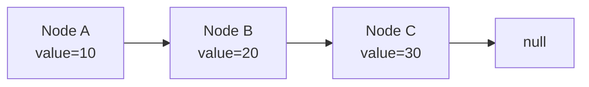
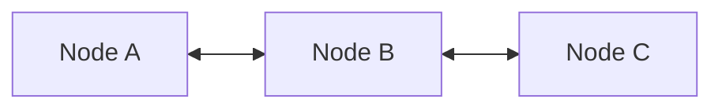
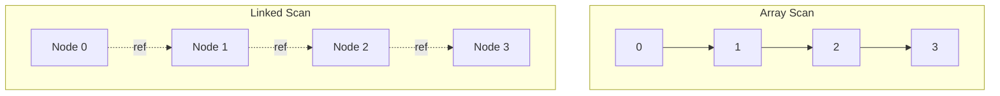
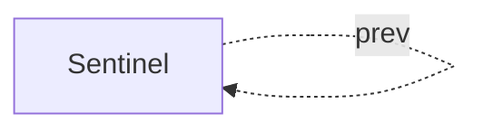
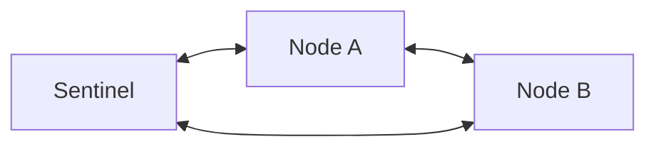
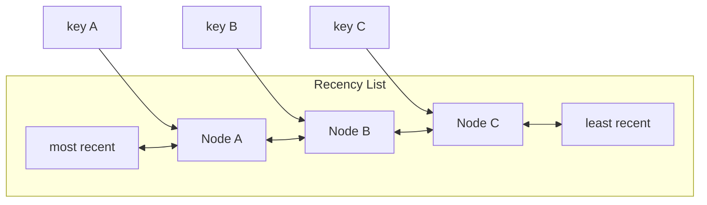

------
title: Learn Java Data Structures and Algorithms - Part 006
description: Linked structures, node-based representations, and allocation costs in Java, including when linked lists are useful and when they are misleading.
series: learn-java-dsa
seriesTitle: Learn Java Data Structures and Algorithms
order: 6
partTitle: Linked Structures and Allocation Costs
tags:
- java
- data-structures
- algorithms
- linked-list
- memory
- series
date: 2026-06-27
---

# Linked Structures and Allocation Costs

Part sebelumnya membahas struktur berbasis array: cepat karena contiguous storage, murah untuk random access, dan kuat untuk scan. Sekarang kita bahas lawannya: **linked structures**.

Linked structure menyimpan elemen dalam node-node terpisah yang saling menunjuk lewat reference.

Contoh paling umum:

- singly linked list,
- doubly linked list,
- circular linked list,
- intrusive list,
- free list,
- adjacency list berbasis node,
- linked hash structure,
- tree dan graph object model.

Tujuan part ini bukan membuat kita “suka” linked list. Justru sebaliknya: kita ingin memahami kenapa linked list sering terlihat menarik secara Big-O tetapi buruk secara performa nyata di JVM.

---

## 1. Skill Target

Setelah part ini, kita ingin mampu:

1. Menjelaskan invariant singly dan doubly linked list.
2. Mengimplementasikan linked list kecil dengan sentinel node.
3. Menganalisis biaya alokasi node, reference chasing, dan locality loss.
4. Menjelaskan kenapa insert/delete `O(1)` sering misleading.
5. Memilih antara `ArrayList`, `ArrayDeque`, `LinkedList`, atau custom node structure.
6. Mengenali use case linked structure yang benar: splicing, stable node identity, intrusive membership, LRU ordering, adjacency modelling tertentu.
7. Menghindari memory leak akibat node unlink yang tidak bersih.

---

## 2. Kaufman Deconstruction

Skill linked structure kita pecah menjadi subskill:

| Subskill | Yang Dipelajari | Output Praktis |
|---|---|---|
| Pointer/reference manipulation | Mengubah `next`/`prev` tanpa kehilangan node | Implementasi insert/remove aman |
| Boundary control | Empty, one-element, head/tail cases | Sentinel node dan invariant sederhana |
| Cost reasoning | Membedakan theoretical step vs real machine cost | Keputusan array vs linked berbasis workload |
| Ownership and unlinking | Membersihkan node dari list | Menghindari accidental retention |
| Node identity | Node sebagai handle stabil | LRU, scheduler queue, intrusive structures |
| API design | Expose node atau sembunyikan node | Struktur reusable dan aman |

Latihan utama: tulis operasi kecil, gambar node sebelum-sesudah, lalu validasi invariant setelah setiap mutasi.

---

## 3. Mental Model: Linked Structure adalah Object Graph

Array:

```text
index -> offset
```

Linked structure:

```text
current node -> reference -> next node -> reference -> next node
```



Untuk doubly linked list:



Kekuatan linked structure:

- insert/remove dekat node yang sudah diketahui bisa murah,
- tidak perlu shifting elemen besar,
- node dapat punya identity stabil,
- mudah memindahkan node antar posisi jika handle node tersedia.

Kelemahannya:

- random access buruk,
- scan buruk untuk cache locality,
- setiap elemen butuh object/node overhead,
- allocation dan GC pressure lebih tinggi,
- bug pointer lebih mudah terjadi,
- API sering misleading jika caller tidak punya direct node handle.

---

## 4. Kenapa Big-O Linked List Sering Menipu

Sering dikatakan:

```text
ArrayList insert middle: O(n)
LinkedList insert middle: O(1)
```

Kalimat ini tidak lengkap.

Untuk insert di tengah linked list, kita perlu sudah punya reference ke node lokasi insert. Jika hanya punya index, kita harus traverse dari head/tail:

```text
find node at index: O(n)
insert after node: O(1)
```

Total dari API `list.add(index, value)` tetap `O(n)`.

Bahkan jika sama-sama `O(n)`, linked list sering lebih lambat karena traversal melakukan pointer chasing antar object yang tersebar di heap.



Array scan mudah diprediksi. Linked scan bergantung pada lokasi object berikutnya.

---

## 5. Singly Linked List

Singly linked list menyimpan `next` saja.

```java
public final class SinglyLinkedIntList {
    private static final class Node {
        int value;
        Node next;

        Node(int value) {
            this.value = value;
        }
    }

    private Node head;
    private Node tail;
    private int size;

    public int size() {
        return size;
    }

    public boolean isEmpty() {
        return size == 0;
    }

    public void addFirst(int value) {
        Node node = new Node(value);
        node.next = head;
        head = node;
        if (tail == null) {
            tail = node;
        }
        size++;
    }

    public void addLast(int value) {
        Node node = new Node(value);
        if (tail == null) {
            head = node;
            tail = node;
        } else {
            tail.next = node;
            tail = node;
        }
        size++;
    }

    public int removeFirst() {
        if (head == null) {
            throw new java.util.NoSuchElementException();
        }
        int value = head.value;
        Node oldHead = head;
        head = head.next;
        oldHead.next = null; // help avoid accidental retention
        if (head == null) {
            tail = null;
        }
        size--;
        return value;
    }
}
```

Invariant:

```text
size == 0  => head == null && tail == null
size == 1  => head == tail && head.next == null
size > 1   => head != null && tail != null && tail.next == null
number of reachable nodes from head == size
```

Operasi sulit pada singly linked list adalah remove arbitrary node jika hanya punya node itu, karena kita butuh previous node.

---

## 6. Doubly Linked List

Doubly linked list menyimpan `prev` dan `next`.

Keuntungannya:

- remove node diketahui bisa `O(1)`,
- bisa traverse dua arah,
- cocok untuk deque dan LRU ordering.

Kerugiannya:

- memory per node lebih besar,
- update pointer lebih banyak,
- invariant lebih mudah rusak.

```java
public final class DoublyLinkedIntList {
    private static final class Node {
        int value;
        Node prev;
        Node next;

        Node(int value) {
            this.value = value;
        }
    }

    private Node head;
    private Node tail;
    private int size;

    public void addFirst(int value) {
        Node node = new Node(value);
        Node oldHead = head;
        node.next = oldHead;
        head = node;

        if (oldHead == null) {
            tail = node;
        } else {
            oldHead.prev = node;
        }
        size++;
    }

    public void addLast(int value) {
        Node node = new Node(value);
        Node oldTail = tail;
        node.prev = oldTail;
        tail = node;

        if (oldTail == null) {
            head = node;
        } else {
            oldTail.next = node;
        }
        size++;
    }

    public int removeFirst() {
        if (head == null) {
            throw new java.util.NoSuchElementException();
        }
        return unlink(head);
    }

    public int removeLast() {
        if (tail == null) {
            throw new java.util.NoSuchElementException();
        }
        return unlink(tail);
    }

    private int unlink(Node node) {
        Node prev = node.prev;
        Node next = node.next;

        if (prev == null) {
            head = next;
        } else {
            prev.next = next;
        }

        if (next == null) {
            tail = prev;
        } else {
            next.prev = prev;
        }

        int value = node.value;
        node.prev = null;
        node.next = null;
        size--;
        return value;
    }
}
```

---

## 7. Sentinel Node: Menghapus Special Case

Boundary bug linked list sering berasal dari kasus khusus:

- list kosong,
- insert di head,
- insert di tail,
- remove satu-satunya elemen.

Sentinel node mengurangi special case. Kita buat node dummy yang selalu ada.

Circular doubly linked list dengan sentinel:

```text
empty:
sentinel.next == sentinel
sentinel.prev == sentinel
```



Dengan elemen:



Implementasi:

```java
public final class SentinelIntList {
    private static final class Node {
        int value;
        Node prev;
        Node next;

        Node(int value) {
            this.value = value;
        }
    }

    private final Node sentinel = new Node(0);
    private int size;

    public SentinelIntList() {
        sentinel.next = sentinel;
        sentinel.prev = sentinel;
    }

    public int size() {
        return size;
    }

    public boolean isEmpty() {
        return size == 0;
    }

    public void addFirst(int value) {
        insertBetween(new Node(value), sentinel, sentinel.next);
    }

    public void addLast(int value) {
        insertBetween(new Node(value), sentinel.prev, sentinel);
    }

    public int removeFirst() {
        if (isEmpty()) {
            throw new java.util.NoSuchElementException();
        }
        return unlink(sentinel.next);
    }

    public int removeLast() {
        if (isEmpty()) {
            throw new java.util.NoSuchElementException();
        }
        return unlink(sentinel.prev);
    }

    private void insertBetween(Node node, Node prev, Node next) {
        node.prev = prev;
        node.next = next;
        prev.next = node;
        next.prev = node;
        size++;
    }

    private int unlink(Node node) {
        Node prev = node.prev;
        Node next = node.next;
        prev.next = next;
        next.prev = prev;

        int value = node.value;
        node.prev = null;
        node.next = null;
        size--;
        return value;
    }
}
```

Sentinel membuat insert/remove di kedua ujung selalu memakai operasi yang sama:

```text
insertBetween(node, prev, next)
unlink(node)
```

Ini pola penting untuk menulis struktur data node-based yang aman.

---

## 8. Allocation Cost di Java

Setiap node linked list biasanya adalah object terpisah.

Contoh node:

```java
static final class Node<E> {
    E item;
    Node<E> next;
    Node<E> prev;
}
```

Setiap node membawa:

- object header,
- reference ke value,
- reference `next`,
- mungkin reference `prev`,
- padding/alignment,
- alokasi object terpisah,
- kerja GC untuk melacak object tersebut.

Untuk `LinkedList<Integer>`, satu angka bisa melibatkan:

```text
LinkedList object
+ Node object per element
+ Integer object per element, kecuali cached boxing cases
+ references antar object
```

Bandingkan dengan `int[]`:

```text
one array object + contiguous primitive values
```

Itulah sebabnya linked list sering kalah drastis untuk data besar yang hanya discan.

---

## 9. Locality Cost: Reference Chasing

CPU modern sangat cepat jika data berikutnya dekat dan predictable. Array membantu prefetching. Linked list tidak.

Pseudo loop array:

```java
long sum = 0;
for (int i = 0; i < values.length; i++) {
    sum += values[i];
}
```

Pseudo loop linked:

```java
long sum = 0;
for (Node n = head; n != null; n = n.next) {
    sum += n.value;
}
```

Pada linked list, langkah berikut bergantung pada `n.next`. Kalau node tersebar di heap, traversal dapat memicu cache miss berulang.

Dalam engineering review, pertanyaan yang lebih baik dari “Big-O berapa?” adalah:

```text
Apakah operasi ini sequential over contiguous memory, atau pointer chasing antar object?
```

---

## 10. Java `LinkedList`: Kapan Dipakai?

`java.util.LinkedList` adalah doubly-linked list yang mengimplementasikan `List` dan `Deque`.

Namun dalam praktik modern, `LinkedList` jarang menjadi default terbaik.

Untuk queue/deque biasa, `ArrayDeque` sering lebih cocok:

- lebih compact,
- lebih cache-friendly,
- tidak membuat node object per element,
- operasi ujung tetap efisien.

`LinkedList` bisa masuk akal jika:

- sering memegang iterator/node position lalu insert/remove di posisi itu,
- list sangat sering splicing secara konseptual,
- ingin semantics `List` + `Deque`, meskipun ini jarang perlu,
- ukuran kecil sehingga performa tidak penting dan API convenience lebih penting.

Tetapi hati-hati: Java `LinkedList` tidak mengekspos node handle secara publik. Jadi banyak keuntungan teoritis node-based list tidak tersedia dari API umum.

---

## 11. Node Handle dan Stable Identity

Linked structure menjadi kuat ketika caller punya handle ke node.

Misalnya LRU cache:

- HashMap: key -> node
- Doubly linked list: urutan recentness

Saat key diakses:

```text
node = map.get(key)
unlink node from current position
insert node at head
```

Semua operasi bisa `O(1)` karena kita tidak mencari node lewat traversal.



Ini contoh legitimate linked structure: node identity dipakai sebagai index tambahan.

---

## 12. Intrusive Linked List

Dalam normal linked list, node membungkus value:

```text
Node -> value
```

Dalam intrusive list, object domain sendiri menyimpan pointer list:

```java
final class Task {
    final long id;
    Task prev;
    Task next;

    Task(long id) {
        this.id = id;
    }
}
```

Keuntungan:

- tidak butuh wrapper node tambahan,
- remove task diketahui bisa `O(1)`,
- cocok untuk scheduler, timer wheel, engine internal.

Kerugian:

- object terikat ke satu struktur list tertentu,
- tidak bisa berada di banyak list kecuali punya banyak field linkage,
- invariant list bocor ke domain object,
- lebih rawan bug ownership.

Intrusive structure cocok untuk sistem internal yang performance-critical, bukan untuk API domain biasa.

---

## 13. Free List dan Object Reuse

Free list menyimpan node yang sudah tidak dipakai agar bisa dipakai kembali tanpa alokasi baru.

```text
active list: nodes in use
free list: reusable nodes
```

Contoh sederhana:

```java
final class NodePool {
    private Node free;

    Node acquire(int value) {
        if (free == null) {
            return new Node(value);
        }
        Node node = free;
        free = free.next;
        node.value = value;
        node.next = null;
        node.prev = null;
        return node;
    }

    void release(Node node) {
        node.prev = null;
        node.next = free;
        free = node;
    }

    static final class Node {
        int value;
        Node prev;
        Node next;

        Node(int value) {
            this.value = value;
        }
    }
}
```

Namun free list di Java harus dipakai hati-hati:

- JVM allocator sudah sangat cepat untuk banyak kasus,
- object pooling bisa memperpanjang lifetime object,
- pooling bisa memperburuk GC generational behavior,
- stale state bug mudah muncul,
- concurrency membuat pool jauh lebih kompleks.

Rule praktis:

```text
Jangan pakai object pool sebelum profiling membuktikan allocation menjadi bottleneck.
```

---

## 14. Unlinking dan Memory Leak Praktis

Saat node dihapus, bersihkan link-nya.

Buruk:

```java
private void unlink(Node node) {
    node.prev.next = node.next;
    node.next.prev = node.prev;
    size--;
}
```

Lebih baik:

```java
private void unlink(Node node) {
    Node prev = node.prev;
    Node next = node.next;

    prev.next = next;
    next.prev = prev;

    node.prev = null;
    node.next = null;
    size--;
}
```

Jika `node` masih direferensikan dari luar, link lama bisa menahan seluruh rantai node lain. Ini tidak selalu memory leak formal, tetapi retention graph-nya bisa besar.

---

## 15. Iterator Safety dan Concurrent Modification

Jika struktur linked list diekspos lewat iterator, mutasi saat iterasi harus punya policy.

Pilihan:

1. Fail-fast: iterator mendeteksi modifikasi struktural.
2. Weakly consistent: iterator boleh melihat sebagian perubahan.
3. Snapshot: iterator melihat copy.
4. Undefined/internal only: tidak diekspos.

Untuk struktur data sederhana, fail-fast bisa memakai `modCount`.

```java
private int modCount;

public void addLast(int value) {
    // mutate links
    size++;
    modCount++;
}
```

Iterator menyimpan `expectedModCount`.

```java
if (expectedModCount != modCount) {
    throw new ConcurrentModificationException();
}
```

Jangan salah paham: fail-fast bukan thread-safety. Ini hanya bug detection best-effort untuk mutasi struktural saat iterasi.

---

## 16. Circular Lists

Circular linked list membuat tail menunjuk kembali ke head. Dengan sentinel, circular list menjadi lebih mudah.

Use case:

- round-robin scheduler,
- cyclic buffer berbasis node,
- game/entity loop,
- intrusive scheduling queue.

Invariant circular sentinel:

```text
sentinel.next.prev == sentinel
sentinel.prev.next == sentinel
following next repeatedly eventually returns to sentinel
following prev repeatedly eventually returns to sentinel
```

Failure mode paling bahaya: cycle tidak sengaja pada list yang diasumsikan null-terminated.

Untuk debug, batasi traversal:

```java
int seen = 0;
for (Node n = head; n != null; n = n.next) {
    if (++seen > size) {
        throw new IllegalStateException("cycle or corrupted size");
    }
}
```

---

## 17. Linked Structures dalam Graph dan Tree

Tidak semua linked structure adalah list. Tree dan graph object model juga node-based.

Tree node:

```java
final class TreeNode {
    int key;
    TreeNode left;
    TreeNode right;
}
```

Graph node:

```java
final class GraphNode {
    int id;
    List<GraphNode> neighbors;
}
```

Node-based representation natural untuk domain graph, tetapi tidak selalu optimal untuk algorithms.

Untuk DSA, kadang lebih baik:

```java
int[][] adjacency;
int[] head;
int[] to;
int[] next;
```

atau:

```java
List<int[]> edges;
```

Trade-off-nya:

- object graph mudah dimodelkan,
- array representation lebih compact dan sering lebih cepat,
- object graph lebih nyaman untuk domain logic,
- array representation lebih cocok untuk algorithm engine.

---

## 18. Linked List vs ArrayList vs ArrayDeque

| Workload | Pilihan Umum | Alasan |
|---|---|---|
| Random access by index | `ArrayList` / array | `O(1)`, locality bagus |
| Append banyak | `ArrayList` | `O(1)` amortized |
| Queue FIFO | `ArrayDeque` | `O(1)` ujung, compact |
| Stack | `ArrayDeque` | Lebih baik daripada legacy `Stack` |
| Remove node diketahui | Custom doubly linked node | `O(1)` jika punya handle |
| LRU cache | HashMap + doubly linked list | Lookup + reorder `O(1)` |
| Banyak insert by index | Biasanya bukan `LinkedList` | Find by index tetap `O(n)` |
| Numeric processing | primitive array | Hindari boxing dan node overhead |

---

## 19. Correctness Reasoning: `unlink(node)`

Untuk doubly linked list tanpa sentinel:

Precondition:

```text
node is currently in the list
if node.prev != null, node.prev.next == node
if node.next != null, node.next.prev == node
```

Operation:

```text
prev.next = next OR head = next
next.prev = prev OR tail = prev
clear node.prev and node.next
size--
```

Postcondition:

```text
node is no longer reachable from head
remaining nodes preserve order
head.prev is null if head exists
tail.next is null if tail exists
size decreased by 1
```

Dengan sentinel, precondition lebih sederhana:

```text
node != sentinel
node.prev.next == node
node.next.prev == node
```

Postcondition:

```text
node.prev and node.next cleared
node.prev.old.next points to node.next.old
node.next.old.prev points to node.prev.old
sentinel circular invariant preserved
```

---

## 20. Implementation Pattern: Move-to-Front

Banyak sistem butuh operasi “node yang baru dipakai pindahkan ke depan”.

Contoh LRU:

```java
final class LruList<K, V> {
    private final Node<K, V> sentinel = new Node<>(null, null);

    LruList() {
        sentinel.prev = sentinel;
        sentinel.next = sentinel;
    }

    void moveToFront(Node<K, V> node) {
        unlink(node);
        insertAfter(sentinel, node);
    }

    void addFront(Node<K, V> node) {
        insertAfter(sentinel, node);
    }

    Node<K, V> removeLast() {
        if (sentinel.prev == sentinel) {
            return null;
        }
        Node<K, V> lru = sentinel.prev;
        unlink(lru);
        return lru;
    }

    private void insertAfter(Node<K, V> left, Node<K, V> node) {
        Node<K, V> right = left.next;
        node.prev = left;
        node.next = right;
        left.next = node;
        right.prev = node;
    }

    private void unlink(Node<K, V> node) {
        node.prev.next = node.next;
        node.next.prev = node.prev;
        node.prev = null;
        node.next = null;
    }

    static final class Node<K, V> {
        final K key;
        V value;
        Node<K, V> prev;
        Node<K, V> next;

        Node(K key, V value) {
            this.key = key;
            this.value = value;
        }
    }
}
```

Core insight:

```text
Linked list bagus ketika operasi utama adalah relinking node yang sudah diketahui.
```

Bukan ketika operasi utama adalah mencari node berdasarkan index.

---

## 21. Testing Strategy

Linked structure butuh invariant test yang agresif.

Contoh helper:

```java
private void assertValid() {
    if (size == 0) {
        assert head == null;
        assert tail == null;
        return;
    }

    assert head != null;
    assert tail != null;
    assert head.prev == null;
    assert tail.next == null;

    int count = 0;
    Node prev = null;
    for (Node n = head; n != null; n = n.next) {
        assert n.prev == prev;
        prev = n;
        count++;
        if (count > size) {
            throw new AssertionError("cycle detected");
        }
    }
    assert count == size;
    assert prev == tail;
}
```

Untuk circular sentinel:

```java
private void assertValid() {
    int count = 0;
    Node prev = sentinel;
    for (Node n = sentinel.next; n != sentinel; n = n.next) {
        assert n.prev == prev;
        prev = n;
        count++;
        if (count > size) {
            throw new AssertionError("cycle or invalid size");
        }
    }
    assert prev == sentinel.prev;
    assert count == size;
}
```

Jalankan `assertValid()` setelah setiap operasi dalam test.

---

## 22. Failure Modes

### 22.1 Lost Node

Jika urutan assignment salah, node bisa tidak lagi reachable.

```java
node.next = current.next;
current.next = node;
// lupa set node.next.prev = node untuk doubly list
```

### 22.2 Broken Backlink

Forward traversal terlihat benar, tetapi backward traversal rusak.

### 22.3 Stale Link Retention

Node yang dihapus masih menunjuk ke list lama.

### 22.4 Size Drift

Pointer benar tetapi `size` lupa update. Ini membuat boundary logic rusak di operasi berikutnya.

### 22.5 Accidental Cycle

Singly list yang seharusnya berakhir null malah membentuk cycle.

### 22.6 External Node Misuse

Jika API mengekspos node handle, caller bisa memakai node dari list lain atau node yang sudah dihapus.

Solusi: ownership check.

```java
final class Node<E> {
    E value;
    Node<E> prev;
    Node<E> next;
    OwnerList<E> owner;
}
```

Tetapi ini menambah overhead dan kompleksitas.

---

## 23. Production Design Checklist

Sebelum memakai linked structure, jawab:

1. Apakah kita punya direct node handle saat insert/remove?
2. Apakah workload traversal dominan?
3. Apakah ukuran data besar sehingga locality penting?
4. Apakah node identity diperlukan?
5. Apakah object allocation bisa menjadi bottleneck?
6. Apakah API harus aman dari external node misuse?
7. Apakah struktur akan dipakai concurrent?
8. Apakah stale links bisa menahan object besar?
9. Apakah `ArrayDeque` sudah cukup?
10. Apakah benchmark membuktikan linked structure menang?

Jika jawaban untuk nomor 1 adalah “tidak”, linked list hampir selalu kehilangan alasan utamanya.

---

## 24. Complexity Summary

| Operation | Singly List | Doubly List | ArrayList | ArrayDeque |
|---|---:|---:|---:|---:|
| Add first | `O(1)` | `O(1)` | `O(n)` | `O(1)` amortized |
| Add last | `O(1)` with tail | `O(1)` | `O(1)` amortized | `O(1)` amortized |
| Remove first | `O(1)` | `O(1)` | `O(n)` | `O(1)` |
| Remove last | `O(n)` unless prev known | `O(1)` | `O(1)` | `O(1)` |
| Get by index | `O(n)` | `O(n)` | `O(1)` | not primary API |
| Insert after known node | `O(1)` | `O(1)` | N/A | N/A |
| Remove known node | needs previous or trick | `O(1)` | N/A | N/A |
| Scan all | `O(n)` but poor locality | `O(n)` but poor locality | `O(n)` good locality | `O(n)` good locality |

---

## 25. Practice Loop

### Latihan 1: Singly List dengan Tail

Implementasikan:

```java
final class LongSinglyList {
    void addFirst(long value)
    void addLast(long value)
    long removeFirst()
    int size()
    long[] toArray()
}
```

Test:

- empty remove,
- add/remove satu elemen,
- addFirst lalu addLast,
- remove sampai kosong,
- tail harus null setelah kosong.

### Latihan 2: Sentinel Doubly List

Implementasikan:

```java
final class LongLinkedDeque {
    void addFirst(long value)
    void addLast(long value)
    long removeFirst()
    long removeLast()
    int size()
}
```

Wajib memakai sentinel circular node.

### Latihan 3: LRU Skeleton

Implementasikan LRU kecil:

```java
final class LruCache<K, V> {
    V get(K key)
    void put(K key, V value)
}
```

Constraint:

- capacity fixed,
- `HashMap<K, Node<K,V>>`,
- doubly linked list untuk recentness,
- get memindahkan node ke front,
- put existing update + move front,
- put new saat penuh evict least recent.

### Latihan 4: Bandingkan Traversal

Bandingkan traversal:

- `int[]`,
- `ArrayList<Integer>`,
- custom linked list node integer.

Hipotesis sebelum benchmark:

```text
linked list kemungkinan kalah untuk scan besar karena node overhead dan locality buruk
```

Kemudian ukur.

---

## 26. Self-Correction Questions

1. Kenapa insert linked list di tengah tidak otomatis `O(1)` dari perspektif public API?
2. Apa syarat agar remove arbitrary node pada doubly linked list benar-benar `O(1)`?
3. Kenapa `LinkedList<Integer>` jauh lebih berat daripada `int[]`?
4. Apa manfaat sentinel node?
5. Apa invariant circular sentinel list saat kosong?
6. Kenapa `ArrayDeque` sering lebih baik daripada `LinkedList` untuk queue?
7. Kapan intrusive list masuk akal?
8. Apa risiko object pooling di Java?
9. Bagaimana stale link bisa menyebabkan memory retention?
10. Bagaimana cara mendeteksi accidental cycle dalam test?

---

## 27. Key Takeaways

1. Linked structure adalah object graph, bukan contiguous storage.
2. Keunggulan linked list hanya nyata jika kita sudah punya handle ke node yang relevan.
3. Untuk queue/deque umum, array-backed deque sering lebih baik daripada linked list.
4. Node allocation, pointer chasing, dan GC pressure adalah bagian dari cost model, bukan detail minor.
5. Sentinel node menyederhanakan boundary case dan membuat operasi relinking lebih aman.
6. Linked structure tetap penting untuk LRU, scheduler, intrusive structures, dan beberapa model graph/tree, tetapi bukan default list replacement.

---

## 28. Referensi Praktis

- Java SE 25 API: `LinkedList`
- Java SE 25 API: `ArrayDeque`
- Java SE 25 API: `List`
- OpenJDK JOL untuk analisis object layout
- JMH untuk membuktikan cost traversal, allocation, dan locality secara empiris
