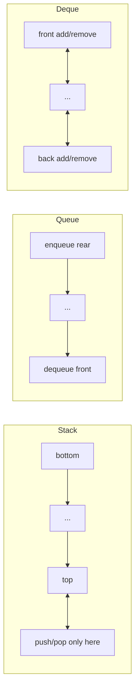
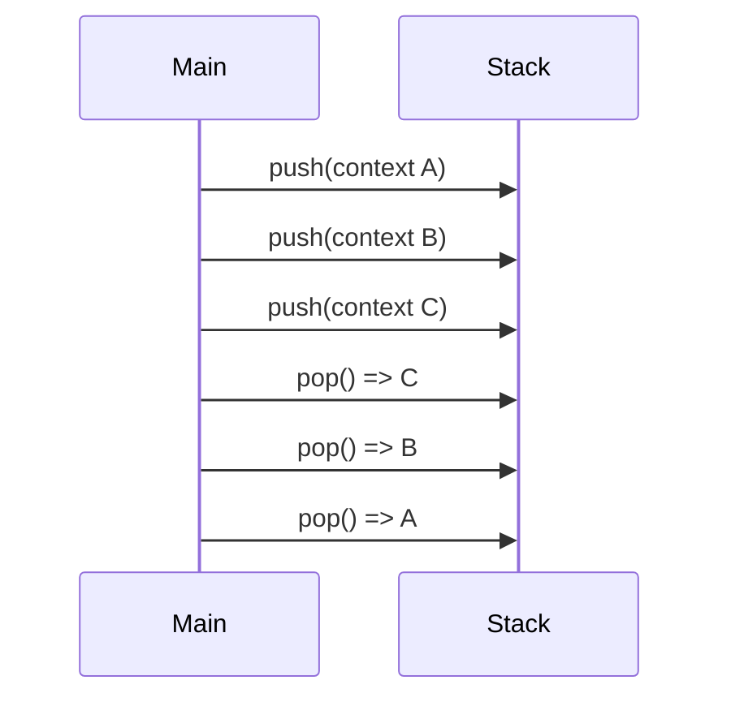
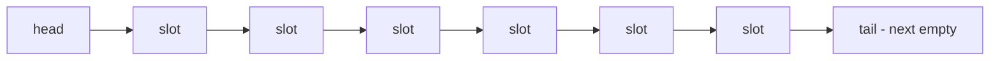

------
title: Learn Java Data Structures and Algorithms - Part 007
description: Stack, queue, dan deque sebagai disiplin akses state; invariants, Java API, ArrayDeque, monotonic stack/queue, BFS frontier, bounded queue, dan failure mode produksi.
series: learn-java-dsa
seriesTitle: Learn Java Data Structures and Algorithms
order: 7
partTitle: Stacks, Queues, and Deques
tags:
- java
- data-structures
- algorithms
- stack
- queue
- deque
- series
date: 2026-06-27
---

# Part 007 — Stacks, Queues, and Deques

Part ini membahas struktur data linear yang terlihat sederhana tetapi sangat sering menjadi fondasi sistem nyata: **stack**, **queue**, dan **deque**.

Di level dasar, kita mengenal:

- stack: last-in-first-out;
- queue: first-in-first-out;
- deque: insert/delete dari kedua ujung.

Di level engineering, definisi itu belum cukup. Yang penting adalah memahami bahwa stack, queue, dan deque adalah **discipline of state transition**. Mereka membatasi urutan masuk-keluar data. Pembatasan ini membuat reasoning menjadi lebih mudah, tetapi juga menentukan fairness, latency, memory growth, dan failure mode.

Contoh:

- DFS memakai stack discipline.
- BFS memakai queue discipline.
- sliding window maximum memakai monotonic deque.
- browser history memakai dua stack.
- job scheduler memakai queue, tetapi fairness-nya bergantung pada policy.
- retry buffer, event buffer, dan ingestion pipeline sering memakai bounded queue.

Part ini tidak akan berhenti pada `push`, `pop`, `offer`, dan `poll`. Kita akan membangun mental model, invariant, implementasi Java, dan pattern algoritmik yang sering muncul.

---

## 1. Skill Target

Setelah menyelesaikan part ini, kita harus mampu:

1. memilih stack, queue, atau deque berdasarkan invariant akses, bukan berdasarkan nama struktur data;
2. menjelaskan kenapa `ArrayDeque` biasanya lebih tepat daripada `Stack` atau `LinkedList` untuk kebutuhan stack/queue single-threaded;
3. membedakan API yang melempar exception dan API yang mengembalikan sentinel value;
4. mengimplementasikan ring-buffer deque sederhana dari awal;
5. menggunakan stack untuk modelling nested state, rollback, parsing, dan DFS;
6. menggunakan queue untuk modelling frontier, worklist, dan fairness;
7. menggunakan monotonic stack/queue untuk menghilangkan loop bersarang;
8. mendesain bounded queue dengan policy eksplisit: block, reject, drop-oldest, drop-newest, atau backpressure;
9. mendeteksi failure mode umum: null ambiguity, unbounded memory growth, wrong traversal order, dan concurrency hazard.

---

## 2. Mental Model: Access Discipline

Stack, queue, dan deque menyimpan elemen dalam sequence. Bedanya bukan pada “bentuk data”, melainkan pada **operasi apa yang diizinkan**.



Kita bisa melihatnya sebagai state machine:

| Struktur | Operation Discipline | Bias Reasoning |
|---|---|---|
| Stack | newest item keluar dulu | nested context, undo, recursion, backtracking |
| Queue | oldest item keluar dulu | fairness, level-order, worklist, buffering |
| Deque | kedua ujung bisa aktif | sliding window, bidirectional processing, hybrid stack/queue |

Kuncinya: **struktur data ini bukan tentang penyimpanan saja, tetapi tentang aturan transisi.**

---

## 3. Operation Contract

| Struktur | Insert | Remove | Inspect | Typical Complexity | Catatan |
|---|---:|---:|---:|---|---|
| Stack | `push` | `pop` | `peek` | O(1) amortized | usually implemented by dynamic array/deque |
| Queue | `offer` | `poll` | `peek` | O(1) amortized | FIFO discipline |
| Deque | `addFirst/addLast` | `pollFirst/pollLast` | `peekFirst/peekLast` | O(1) amortized | most flexible linear discipline |

Dalam Java modern, struktur default yang paling sering tepat untuk stack/queue/deque single-threaded adalah:

```java
Deque<Task> deque = new ArrayDeque<>();
```

Bukan:

```java
Stack<Task> stack = new Stack<>();      // legacy Vector-based class
Queue<Task> queue = new LinkedList<>(); // often worse locality, allocation-heavy
```

`ArrayDeque` adalah resizable-array implementation dari `Deque`, tidak punya fixed capacity restriction, melarang `null`, tidak thread-safe tanpa sinkronisasi eksternal, dan dokumentasinya menyatakan class ini likely faster daripada `Stack` sebagai stack serta `LinkedList` sebagai queue.

---

## 4. Java API: Jangan Salah Pilih Method

Java `Queue` dan `Deque` menyediakan dua keluarga method:

1. method yang gagal dengan exception;
2. method yang gagal dengan return value khusus.

### 4.1 Queue API

| Intent | Throws on Failure | Special Value |
|---|---|---|
| insert | `add(e)` | `offer(e)` |
| remove | `remove()` | `poll()` |
| inspect | `element()` | `peek()` |

Untuk kebanyakan algoritma dan sistem, gunakan:

```java
queue.offer(x);
T x = queue.poll();
T head = queue.peek();
```

Alasannya sederhana: empty queue sering kondisi normal, bukan exceptional condition.

### 4.2 Deque API

| Intent | Front | Back |
|---|---|---|
| insert | `addFirst(e)` / `offerFirst(e)` | `addLast(e)` / `offerLast(e)` |
| remove | `removeFirst()` / `pollFirst()` | `removeLast()` / `pollLast()` |
| inspect | `getFirst()` / `peekFirst()` | `getLast()` / `peekLast()` |

Untuk stack:

```java
Deque<Integer> stack = new ArrayDeque<>();
stack.push(10);          // equivalent to addFirst
int x = stack.pop();     // equivalent to removeFirst
int top = stack.peek();
```

Untuk queue:

```java
Queue<Integer> queue = new ArrayDeque<>();
queue.offer(10);         // add at tail
Integer x = queue.poll(); // remove from head
```

Untuk deque eksplisit:

```java
Deque<Integer> deque = new ArrayDeque<>();
deque.offerFirst(1);
deque.offerLast(2);
int a = deque.pollFirst();
int b = deque.pollLast();
```

### 4.3 Null Ambiguity

`poll()` mengembalikan `null` ketika kosong. Karena itu struktur queue yang mengizinkan `null` akan menciptakan ambiguity:

```java
String value = queue.poll();
if (value == null) {
    // Apakah queue kosong, atau value yang disimpan memang null?
}
```

`ArrayDeque` melarang `null`, sehingga `null` aman dipakai sebagai sentinel empty-result.

---

## 5. Stack: Modelling Nested State

Stack berguna ketika proses memiliki pola **masuk ke konteks baru, lalu kembali ke konteks sebelumnya**.



Contoh natural:

- call stack;
- parser untuk parentheses/brackets;
- undo/redo;
- DFS iterative;
- backtracking;
- transaction rollback;
- nested workflow state.

### 5.1 Stack Invariant

Untuk stack:

```text
pop() selalu mengembalikan elemen terakhir yang belum dipop sejak push terakhir.
```

Invariant ini lebih penting daripada implementasinya.

### 5.2 Valid Parentheses

```java
import java.util.ArrayDeque;
import java.util.Deque;

public final class BracketValidator {
    public static boolean isValid(String s) {
        Deque<Character> stack = new ArrayDeque<>();

        for (int i = 0; i < s.length(); i++) {
            char c = s.charAt(i);

            if (c == '(' || c == '[' || c == '{') {
                stack.push(c);
                continue;
            }

            if (c == ')' || c == ']' || c == '}') {
                if (stack.isEmpty()) {
                    return false;
                }

                char open = stack.pop();
                if (!matches(open, c)) {
                    return false;
                }
            }
        }

        return stack.isEmpty();
    }

    private static boolean matches(char open, char close) {
        return (open == '(' && close == ')')
            || (open == '[' && close == ']')
            || (open == '{' && close == '}');
    }
}
```

Reasoning-nya:

- setiap closing bracket harus menutup opening bracket paling dekat yang belum tertutup;
- “paling dekat yang belum tertutup” adalah LIFO;
- jika stack kosong saat closing muncul, ada closing tanpa opening;
- jika stack masih berisi setelah semua karakter dibaca, ada opening tanpa closing.

Complexity:

```text
Time:  O(n)
Space: O(depth)
```

`depth` adalah nesting maksimum, bukan selalu `n` dalam data nyata.

---

## 6. Queue: Modelling Frontier and Fairness

Queue berguna ketika kita ingin memproses item berdasarkan urutan kedatangan.

Queue sering muncul dalam:

- BFS;
- producer-consumer;
- event loop;
- retry pipeline;
- worklist algorithm;
- log ingestion;
- rate-limited dispatch;
- actor mailbox;
- request buffering.

### 6.1 Queue Invariant

```text
poll() selalu mengembalikan elemen tertua yang belum dipoll.
```

Ini memberikan fairness sederhana: item yang datang lebih dulu diproses lebih dulu.

Tapi fairness FIFO bukan berarti sistem selalu adil. Jika satu tenant memasukkan jutaan job, tenant lain bisa tetap menunggu lama. Untuk fairness multi-tenant, kita butuh policy lain seperti round-robin, weighted queue, atau priority scheduling.

### 6.2 BFS Frontier Pattern

BFS adalah contoh paling bersih dari queue discipline.

```java
import java.util.ArrayDeque;
import java.util.ArrayList;
import java.util.List;
import java.util.Queue;

public final class BfsTraversal {
    public static List<Integer> bfs(List<List<Integer>> graph, int start) {
        boolean[] visited = new boolean[graph.size()];
        Queue<Integer> queue = new ArrayDeque<>();
        List<Integer> order = new ArrayList<>();

        visited[start] = true;
        queue.offer(start);

        while (!queue.isEmpty()) {
            int node = queue.poll();
            order.add(node);

            for (int next : graph.get(node)) {
                if (!visited[next]) {
                    visited[next] = true;
                    queue.offer(next);
                }
            }
        }

        return order;
    }
}
```

Invariant:

```text
Queue berisi frontier: node yang sudah ditemukan tetapi belum diekspansi.
```

Kenapa `visited[next] = true` dilakukan saat enqueue, bukan saat dequeue?

Karena kita ingin mencegah node yang sama masuk queue berkali-kali melalui parent berbeda. Ini mengubah memory dan runtime dari potensial membengkak menjadi terkontrol.

---

## 7. Deque: Strict Enough, Flexible Enough

Deque adalah struktur yang lebih general daripada stack dan queue.

Kita bisa memakai deque sebagai:

- stack: pakai satu ujung;
- queue: offer belakang, poll depan;
- double-ended worklist;
- sliding window;
- monotonic queue;
- palindrome check;
- browser navigation;
- 0-1 BFS;
- undo/redo dengan dua stack atau deque.

Mental model:

```text
Deque memberi dua boundary aktif: front dan back.
```

Jika operasi membutuhkan melihat/membuang item dari kedua ujung, deque biasanya lebih tepat daripada list.

---

## 8. Implementasi Ring-Buffer Deque dari Awal

Untuk memahami `ArrayDeque`, kita akan membuat versi kecil untuk `int`.

Tujuan implementasi ini bukan mengganti `ArrayDeque`, tetapi membangun mental model:

- elemen disimpan di array;
- `head` menunjuk elemen pertama;
- `tail` menunjuk slot kosong setelah elemen terakhir;
- index membungkus dengan mask karena kapasitas power-of-two;
- ketika penuh, array diperbesar dan elemen dilinearize.



```java
import java.util.NoSuchElementException;

public final class IntArrayDeque {
    private int[] elements;
    private int head;
    private int tail;
    private int size;

    public IntArrayDeque() {
        this(16);
    }

    public IntArrayDeque(int initialCapacity) {
        int capacity = tableSizeFor(Math.max(2, initialCapacity));
        this.elements = new int[capacity];
    }

    public int size() {
        return size;
    }

    public boolean isEmpty() {
        return size == 0;
    }

    public void addFirst(int value) {
        ensureCapacity(size + 1);
        head = dec(head);
        elements[head] = value;
        size++;
    }

    public void addLast(int value) {
        ensureCapacity(size + 1);
        elements[tail] = value;
        tail = inc(tail);
        size++;
    }

    public int removeFirst() {
        if (isEmpty()) {
            throw new NoSuchElementException();
        }
        int value = elements[head];
        head = inc(head);
        size--;
        return value;
    }

    public int removeLast() {
        if (isEmpty()) {
            throw new NoSuchElementException();
        }
        tail = dec(tail);
        int value = elements[tail];
        size--;
        return value;
    }

    public int peekFirst() {
        if (isEmpty()) {
            throw new NoSuchElementException();
        }
        return elements[head];
    }

    public int peekLast() {
        if (isEmpty()) {
            throw new NoSuchElementException();
        }
        return elements[dec(tail)];
    }

    private void ensureCapacity(int required) {
        if (required <= elements.length) {
            return;
        }

        int[] old = elements;
        int[] next = new int[old.length << 1];

        for (int i = 0; i < size; i++) {
            next[i] = old[(head + i) & (old.length - 1)];
        }

        elements = next;
        head = 0;
        tail = size;
    }

    private int inc(int index) {
        return (index + 1) & (elements.length - 1);
    }

    private int dec(int index) {
        return (index - 1) & (elements.length - 1);
    }

    private static int tableSizeFor(int value) {
        int n = value - 1;
        n |= n >>> 1;
        n |= n >>> 2;
        n |= n >>> 4;
        n |= n >>> 8;
        n |= n >>> 16;
        return n < 2 ? 2 : n + 1;
    }
}
```

### 8.1 Invariants

```text
0 <= size <= elements.length
head dan tail selalu index valid
Jika size > 0, elements[head] adalah elemen pertama
Jika size > 0, elements[dec(tail)] adalah elemen terakhir
Urutan logis elemen ke-i adalah elements[(head + i) & (capacity - 1)]
```

### 8.2 Kenapa `tail` Slot Kosong Setelah Elemen Terakhir?

Karena ini membuat insert belakang murah:

```java
elements[tail] = value;
tail = inc(tail);
```

Dan remove belakang juga murah:

```java
tail = dec(tail);
return elements[tail];
```

### 8.3 Amortized Complexity

Sebagian besar operasi O(1). Resize sesekali O(n). Dengan strategi doubling, total biaya append/insert banyak operasi tetap O(1) amortized.

```text
m operasi insert => O(m) total copying amortized
per operation => O(1) amortized
```

### 8.4 Catatan untuk Object Reference

Jika implementasi menyimpan object reference, slot yang sudah dihapus harus di-null-kan agar object lama tidak tertahan oleh array internal:

```java
E value = elements[head];
elements[head] = null; // avoid memory retention
head = inc(head);
```

Pada `int`, ini tidak perlu karena primitive tidak memegang reference.

---

## 9. Monotonic Stack

Monotonic stack menyimpan elemen dalam urutan tertentu, biasanya increasing atau decreasing. Ia berguna untuk menghilangkan loop bersarang saat mencari nearest greater/smaller element.

Contoh problem:

```text
Diberikan array temperatur harian.
Untuk setiap hari, berapa hari harus menunggu sampai ada temperatur lebih tinggi?
```

Naive:

```text
Untuk setiap i, scan j > i sampai menemukan temperature[j] > temperature[i].
Time: O(n^2)
```

Monotonic stack:

```text
Simpan index hari yang belum menemukan hari lebih panas.
Ketika temperature hari ini lebih tinggi dari top stack,
hari ini adalah jawaban untuk top tersebut.
```

```java
import java.util.ArrayDeque;
import java.util.Deque;

public final class DailyTemperatures {
    public static int[] solve(int[] temperatures) {
        int n = temperatures.length;
        int[] answer = new int[n];
        Deque<Integer> stack = new ArrayDeque<>(); // indexes with unresolved warmer day

        for (int day = 0; day < n; day++) {
            while (!stack.isEmpty()
                    && temperatures[day] > temperatures[stack.peek()]) {
                int previous = stack.pop();
                answer[previous] = day - previous;
            }
            stack.push(day);
        }

        return answer;
    }
}
```

Invariant:

```text
Stack berisi index yang belum punya jawaban.
Temperature pada stack monoton menurun dari bottom ke top.
```

Kenapa O(n)?

Setiap index:

- dipush paling banyak sekali;
- dipop paling banyak sekali.

Total operasi stack O(n), meskipun ada `while` di dalam `for`.

---

## 10. Monotonic Queue

Monotonic queue biasanya dipakai untuk sliding window maximum/minimum.

Problem:

```text
Diberikan nums dan window size k.
Untuk setiap window, kembalikan nilai maksimum.
```

Naive:

```text
Untuk setiap window, scan k elemen.
Time: O(nk)
```

Monotonic deque:

```text
Deque menyimpan index kandidat maksimum.
Nilai dalam deque monoton menurun dari front ke back.
Front selalu kandidat maksimum window saat ini.
```

```java
import java.util.ArrayDeque;
import java.util.Deque;

public final class SlidingWindowMaximum {
    public static int[] maxSlidingWindow(int[] nums, int k) {
        if (k <= 0 || k > nums.length) {
            throw new IllegalArgumentException("invalid window size");
        }

        int[] result = new int[nums.length - k + 1];
        Deque<Integer> deque = new ArrayDeque<>(); // indexes

        for (int i = 0; i < nums.length; i++) {
            int windowStart = i - k + 1;

            while (!deque.isEmpty() && deque.peekFirst() < windowStart) {
                deque.pollFirst();
            }

            while (!deque.isEmpty()
                    && nums[deque.peekLast()] <= nums[i]) {
                deque.pollLast();
            }

            deque.offerLast(i);

            if (windowStart >= 0) {
                result[windowStart] = nums[deque.peekFirst()];
            }
        }

        return result;
    }
}
```

Invariant:

```text
Deque hanya berisi index dalam window aktif.
Nilai nums[index] menurun dari front ke back.
Front adalah index maksimum window.
```

Kenapa elemen lebih kecil di belakang boleh dibuang?

Jika `nums[i] >= nums[deque.peekLast()]`, maka index lama:

1. lebih kecil atau sama nilainya;
2. lebih tua;
3. akan keluar window lebih dulu.

Ia tidak mungkin menjadi maksimum pada window masa depan selama index baru masih ada.

---

## 11. Bounded Queue: Struktur Data Bertemu Policy

Queue unbounded terlihat nyaman, tetapi di sistem nyata bisa berbahaya.

```java
Queue<Event> queue = new ArrayDeque<>();
```

Jika producer lebih cepat daripada consumer, queue akan tumbuh terus sampai memory habis.

Sistem produksi butuh keputusan eksplisit:

| Policy | Arti | Cocok Untuk | Risiko |
|---|---|---|---|
| Block | producer menunggu saat penuh | worker pool, internal pipeline | deadlock jika salah desain |
| Reject | request ditolak saat penuh | API boundary, admission control | caller harus handle error |
| Drop newest | event baru dibuang | telemetry low-value | kehilangan data terbaru |
| Drop oldest | event lama dibuang | UI/event sampling | kehilangan history |
| Backpressure upstream | sinyal lambat dikirim ke sumber | streaming, reactive pipeline | kompleks antarservice |

### 11.1 Bounded Ring Queue Minimal

```java
import java.util.Optional;

public final class BoundedIntQueue {
    private final int[] elements;
    private int head;
    private int tail;
    private int size;

    public BoundedIntQueue(int capacity) {
        if (capacity <= 0) {
            throw new IllegalArgumentException("capacity must be positive");
        }
        this.elements = new int[capacity];
    }

    public boolean offer(int value) {
        if (size == elements.length) {
            return false;
        }
        elements[tail] = value;
        tail = (tail + 1) % elements.length;
        size++;
        return true;
    }

    public Optional<Integer> poll() {
        if (size == 0) {
            return Optional.empty();
        }
        int value = elements[head];
        head = (head + 1) % elements.length;
        size--;
        return Optional.of(value);
    }

    public int size() {
        return size;
    }

    public int capacity() {
        return elements.length;
    }
}
```

Untuk production Java, jangan buru-buru membuat sendiri. Gunakan struktur standard seperti `ArrayBlockingQueue`, `LinkedBlockingQueue`, `ConcurrentLinkedQueue`, atau library khusus ketika concurrency/performance menjadi kebutuhan. Kita akan bahas concurrent data structures di part 034.

---

## 12. Worklist Algorithms

Stack dan queue sering dipakai sebagai **worklist**: daftar pekerjaan yang belum diproses.

Perbedaannya:

| Worklist | Behavior |
|---|---|
| Stack | depth-first, cepat masuk jalur tertentu, memory bisa lebih kecil pada tree dalam |
| Queue | breadth-first, fairness lebih natural, memory bisa besar pada frontier lebar |
| Deque | bisa hybrid, misalnya local depth-first dan steal dari opposite end |

Worklist pattern:

```java
while (!worklist.isEmpty()) {
    Work work = worklist.poll();
    for (Work next : expand(work)) {
        if (shouldProcess(next)) {
            worklist.offer(next);
        }
    }
}
```

Yang harus diputuskan:

1. Apa definisi “sudah diproses”?
2. Apakah item bisa masuk worklist lebih dari sekali?
3. Apakah urutan pemrosesan mempengaruhi hasil atau hanya performa?
4. Apakah worklist bisa tumbuh tanpa batas?
5. Apa yang terjadi jika producer lebih cepat daripada consumer?

---

## 13. Failure Modes

### 13.1 Menggunakan `Stack`

`Stack` adalah class lama berbasis `Vector`. Ia membawa sinkronisasi dan API historis yang biasanya tidak dibutuhkan untuk algoritma single-threaded.

Gunakan:

```java
Deque<T> stack = new ArrayDeque<>();
```

### 13.2 Menggunakan `LinkedList` untuk Queue Default

`LinkedList` bisa dipakai sebagai queue, tetapi sering kalah dari `ArrayDeque` karena:

- setiap node adalah object terpisah;
- banyak allocation;
- buruk untuk cache locality;
- pointer chasing;
- memory overhead lebih tinggi.

Pakai `LinkedList` hanya jika ada alasan spesifik yang mengharuskan node-based structure.

### 13.3 Lupa Empty Case

```java
int x = stack.pop(); // throws jika kosong
```

Dalam algoritma, empty sering berarti state valid. Gunakan guard:

```java
if (!stack.isEmpty()) {
    int x = stack.pop();
}
```

Atau gunakan `poll` style method pada queue/deque.

### 13.4 Null sebagai Data

Jangan simpan `null` dalam queue untuk algoritma jika API menggunakan `null` sebagai empty signal. Pakai object sentinel eksplisit atau `Optional` di boundary yang tepat.

### 13.5 Unbounded Queue

Unbounded queue bisa menjadi memory leak berbentuk “fitur”. Selalu tanya:

```text
Apa upper bound jumlah item yang bisa menunggu?
Apa policy saat penuh?
```

### 13.6 Concurrency Hazard

`ArrayDeque` bukan thread-safe. Jika multi-threaded producer-consumer, gunakan struktur concurrent atau blocking yang tepat.

Salah:

```java
Deque<Job> queue = new ArrayDeque<>();
// accessed by many threads without synchronization
```

Benar secara arah:

```java
BlockingQueue<Job> queue = new ArrayBlockingQueue<>(10_000);
```

Detail concurrency akan dibahas di part 034.

---

## 14. Complexity Summary

| Operation | ArrayDeque | LinkedList | Notes |
|---|---:|---:|---|
| push/pop front | O(1) amortized | O(1) | ArrayDeque usually better locality |
| offer/poll queue | O(1) amortized | O(1) | LinkedList allocates node per element |
| random access | not supported | O(n) via list semantics | not the right structure |
| contains/remove arbitrary | O(n) | O(n) | linear scan |
| resize | occasional O(n) | not applicable | amortized into operations |

Important nuance:

```text
O(1) does not mean same constant factor.
```

`ArrayDeque` and `LinkedList` can both promise O(1) end operations, but their memory access pattern is very different.

---

## 15. Practice Loop

### Exercise 1 — Two-Stack Queue

Implement queue using two stacks.

Invariant:

```text
out stack berisi elemen siap dipoll.
in stack berisi elemen baru yang belum dibalik.
Jika out kosong, pindahkan semua in ke out.
```

Target:

```text
offer: O(1)
poll: O(1) amortized
```

### Exercise 2 — Min Stack

Implement stack dengan `getMin()` O(1).

Hint:

```text
Simpan stack tambahan berisi minimum historis.
```

### Exercise 3 — Sliding Window Maximum

Tulis ulang monotonic deque tanpa melihat kode.

Checklist:

- hapus index expired dari front;
- hapus kandidat lebih lemah dari back;
- push index sekarang;
- front adalah jawaban.

### Exercise 4 — Bounded Queue Policy

Design `BoundedQueue<T>` dengan policy:

```java
enum OverflowPolicy {
    REJECT,
    DROP_OLDEST,
    DROP_NEWEST
}
```

Tulis invariant untuk masing-masing policy.

---

## 16. Self-Correction Checklist

Gunakan checklist ini ketika memilih atau mengimplementasikan stack/queue/deque:

- Apakah urutan keluar item adalah bagian dari correctness?
- Apakah butuh LIFO, FIFO, atau dua ujung?
- Apakah empty state kondisi normal?
- Apakah null boleh muncul?
- Apakah queue bisa tumbuh tanpa batas?
- Apa policy saat penuh?
- Apakah struktur diakses multi-thread?
- Apakah operation O(1) hanya secara asimptotik atau juga cocok secara memory locality?
- Apakah item arbitrary removal sebenarnya dibutuhkan? Jika iya, deque mungkin bukan struktur yang tepat.
- Apakah invariant bisa diuji dengan property-based atau randomized test?

---

## 17. Production Heuristics

Gunakan ini sebagai default:

```java
Deque<T> stack = new ArrayDeque<>();
Queue<T> queue = new ArrayDeque<>();
Deque<T> deque = new ArrayDeque<>();
```

Ubah default hanya jika ada alasan jelas:

| Need | Candidate |
|---|---|
| bounded blocking producer-consumer | `ArrayBlockingQueue` |
| unbounded blocking queue | `LinkedBlockingQueue` with caution |
| non-blocking concurrent queue | `ConcurrentLinkedQueue` |
| priority ordering | `PriorityQueue` |
| delay-based scheduling | `DelayQueue` |
| stable insertion order map/set | `LinkedHashMap` / `LinkedHashSet` |

Catatan: `PriorityQueue` bukan FIFO queue; ia punya heap discipline. Kita bahas lebih dalam di part 018.

---

## 18. Key Takeaways

Stack, queue, dan deque terlihat kecil, tetapi mereka adalah primitive untuk modelling state transition.

Ringkasnya:

- stack cocok untuk nested context dan depth-first reasoning;
- queue cocok untuk frontier, fairness sederhana, dan worklist;
- deque cocok untuk dua boundary aktif dan sliding window;
- `ArrayDeque` adalah default kuat untuk single-threaded stack/queue/deque;
- monotonic stack/queue adalah teknik penting untuk mengubah O(n²) menjadi O(n);
- unbounded queue adalah risiko produksi jika tidak ada backpressure;
- correctness bergantung pada invariant akses, bukan hanya API method.

Di part berikutnya, kita masuk ke struktur yang lebih sulit: **hash table**. Jika stack/queue/deque mengatur urutan, hash table mengatur akses berdasarkan identitas key. Di sana, correctness tidak hanya bergantung pada struktur, tetapi juga pada kontrak `equals()` dan `hashCode()`.

---

## References

- Oracle Java SE 25 API — `ArrayDeque`
- Oracle Java SE 25 API — `Queue`
- Oracle Java SE 25 API — `Deque`
- Oracle Java SE 25 API — `BlockingQueue`
