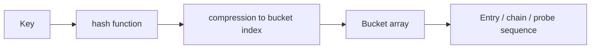
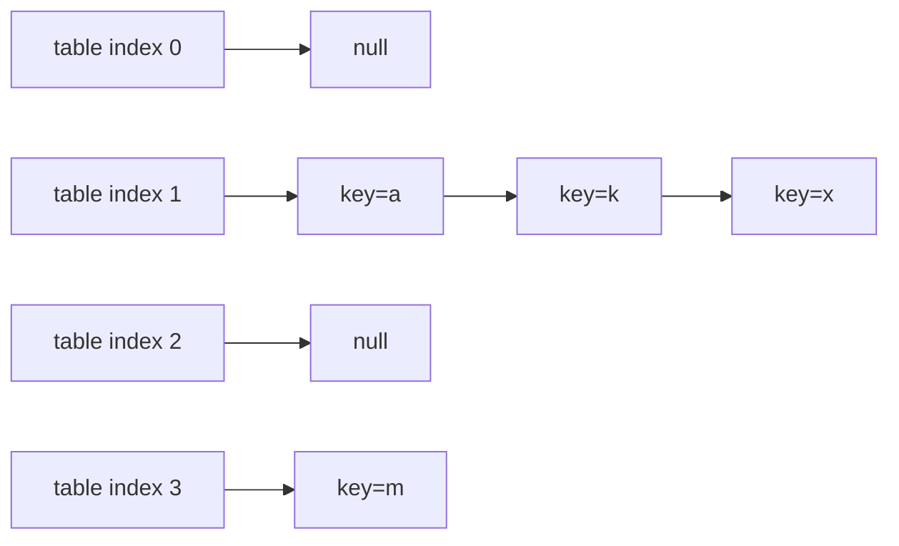
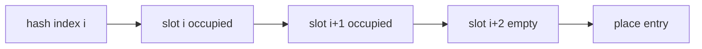
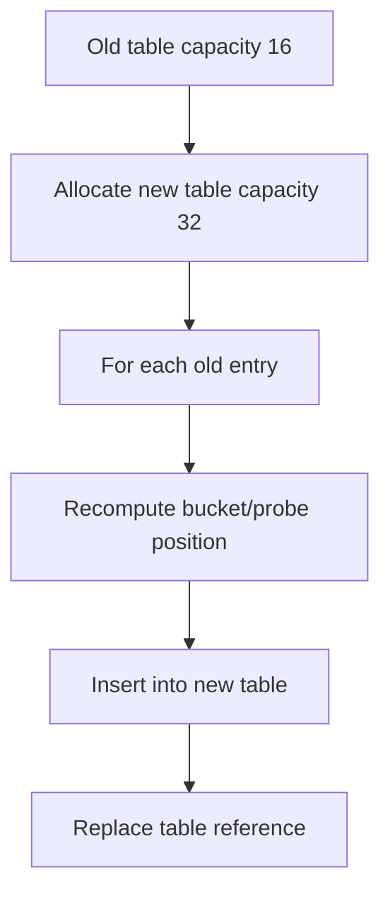

------
title: Learn Java Data Structures and Algorithms - Part 008
description: Hash table dari first principles: hashing, collision, chaining, open addressing, load factor, resizing, distribution, adversarial keys, dan cost model Java.
series: learn-java-dsa
seriesTitle: Learn Java Data Structures and Algorithms
order: 8
partTitle: Hash Tables from First Principles
tags:
- java
- data-structures
- algorithms
- hash-table
- hashmap
- series
date: 2026-06-27
---

# Part 008 — Hash Tables from First Principles

Hash table adalah salah satu struktur data paling penting dalam software engineering. Ia muncul sebagai:

- `HashMap`;
- `HashSet`;
- cache index;
- deduplication set;
- frequency counter;
- symbol table;
- join index;
- routing table;
- memoization store;
- entity lookup;
- visited set dalam graph traversal.

Di permukaan, hash table memberi operasi rata-rata O(1) untuk insert, lookup, dan delete. Tetapi kalimat “O(1)” sering membuat engineer under-estimate hal-hal yang justru paling penting:

- distribusi hash;
- collision handling;
- resizing spike;
- key mutability;
- equality contract;
- memory overhead;
- cache locality;
- adversarial input;
- iteration cost;
- concurrency behavior.

Part ini membangun hash table dari first principles. Detail Java `HashMap`, `HashSet`, dan key contract akan diperdalam di part 009. Di sini fokusnya adalah memahami mesin dasarnya.

---

## 1. Skill Target

Setelah menyelesaikan part ini, kita harus mampu:

1. menjelaskan hash table sebagai kombinasi array, hash function, compression, collision strategy, dan resizing policy;
2. membedakan hash code, hash value, bucket index, dan equality check;
3. menjelaskan kenapa collision pasti mungkin terjadi;
4. mengimplementasikan separate chaining map sederhana;
5. mengimplementasikan open addressing map sederhana untuk primitive key;
6. menghitung threshold berdasarkan capacity dan load factor;
7. menjelaskan trade-off load factor terhadap memory, collision, dan iteration cost;
8. mendeteksi failure mode: poor hash distribution, mutable key, resize spike, tombstone buildup, dan hash flooding;
9. memilih kapan memakai hash table, tree map, array index, bitmap, atau sorted structure.

---

## 2. Mental Model: Hash Table sebagai Indexed Buckets

Hash table mencoba mengubah key menjadi index array.



Secara konseptual:

```text
key -> hash -> bucketIndex -> candidate entries -> equality check -> value
```

Penting: hash table tidak membuktikan key sama hanya dari hash. Hash hanya mempersempit lokasi pencarian. Equality check tetap diperlukan.

---

## 3. Empat Istilah yang Sering Dicampur

| Istilah | Arti |
|---|---|
| Key | Object/domain value yang dipakai untuk lookup |
| Hash code | Integer yang dihasilkan dari key |
| Bucket index | Index array setelah hash dikompresi ke range capacity |
| Equality | Pemeriksaan apakah candidate entry benar-benar key yang sama |

Contoh:

```java
int hashCode = key.hashCode();
int index = spread(hashCode) & (capacity - 1);
```

Dua key berbeda bisa punya hash code sama. Dua hash code berbeda juga bisa masuk bucket sama karena bucket lebih sedikit daripada kemungkinan integer hash.

---

## 4. Kenapa Collision Pasti Mungkin

Jika jumlah kemungkinan key lebih besar daripada jumlah bucket, collision tidak bisa dihindari. Ini adalah konsekuensi pigeonhole principle.

```text
possible keys >> buckets
therefore some different keys must map to same bucket
```

Misal capacity = 16. Bucket index hanya 0..15. Tetapi key string yang mungkin sangat banyak. Collision pasti ada.

Karena collision tidak bisa dihilangkan, desain hash table bukan tentang “mencegah semua collision”, melainkan:

1. membuat collision jarang untuk data normal;
2. membuat collision murah saat terjadi;
3. membatasi kerusakan saat distribusi buruk;
4. tetap menjaga correctness melalui equality check.

---

## 5. Operation Contract

Hash table biasanya menjanjikan:

| Operation | Expected | Worst Case |
|---|---:|---:|
| get | O(1) | O(n) |
| put | O(1) amortized | O(n) |
| remove | O(1) expected | O(n) |
| resize | O(n) | O(n) |
| iteration | O(capacity + size) untuk beberapa desain | depends |

Kenapa `put` O(1) amortized?

Karena sebagian besar insert langsung masuk. Sesekali table resize dan semua entry dipindah. Biaya resize dibagi ke banyak insert sebelumnya.

---

## 6. Hash Function Requirements

Hash function yang baik untuk hash table harus:

1. deterministic: key sama menghasilkan hash sama selama berada di map;
2. consistent with equality: jika `a.equals(b)`, maka `a.hashCode() == b.hashCode()`;
3. reasonably distributed: key berbeda tersebar cukup merata;
4. cheap enough: biaya menghitung hash tidak mengalahkan manfaat O(1) lookup.

Untuk Java object, hash code berasal dari:

```java
int h = key.hashCode();
```

Hash table kemudian biasanya melakukan mixing/spreading agar bit yang buruk di hash code tidak langsung menciptakan bucket distribution buruk.

---

## 7. Compression: Dari Hash ke Bucket Index

Hash code adalah 32-bit signed integer. Bucket array mungkin hanya berukuran 16, 1024, atau 1 juta.

Kita butuh compression:

```java
int index = Math.floorMod(hash, capacity);
```

Atau jika capacity power-of-two:

```java
int index = hash & (capacity - 1);
```

Power-of-two membuat compression cepat, tetapi hanya aman jika bit bawah hash cukup baik atau hash sudah di-spread.

Contoh spreading sederhana:

```java
static int spread(int h) {
    return h ^ (h >>> 16);
}
```

Tujuannya mencampur high bits ke low bits agar operasi mask tidak hanya bergantung pada bit bawah.

---

## 8. Collision Strategy 1: Separate Chaining

Separate chaining menyimpan setiap bucket sebagai chain/list entry.



Lookup:

1. hitung bucket index;
2. scan chain di bucket itu;
3. bandingkan key dengan equality;
4. return value jika match.

### 8.1 Separate Chaining Map Minimal

Implementasi berikut sengaja sederhana. Ia tidak menangani semua detail production, tetapi cukup untuk memahami invariant.

```java
import java.util.Objects;

public final class SeparateChainingHashMap<K, V> {
    private static final int DEFAULT_CAPACITY = 16;
    private static final float DEFAULT_LOAD_FACTOR = 0.75f;

    private Node<K, V>[] table;
    private int size;
    private int threshold;
    private final float loadFactor;

    @SuppressWarnings("unchecked")
    public SeparateChainingHashMap() {
        this.loadFactor = DEFAULT_LOAD_FACTOR;
        this.table = (Node<K, V>[]) new Node[DEFAULT_CAPACITY];
        this.threshold = (int) (DEFAULT_CAPACITY * DEFAULT_LOAD_FACTOR);
    }

    public int size() {
        return size;
    }

    public boolean isEmpty() {
        return size == 0;
    }

    public V get(K key) {
        Node<K, V> node = findNode(key);
        return node == null ? null : node.value;
    }

    public boolean containsKey(K key) {
        return findNode(key) != null;
    }

    public V put(K key, V value) {
        if (size + 1 > threshold) {
            resize();
        }

        int index = indexFor(key, table.length);
        Node<K, V> current = table[index];

        for (Node<K, V> node = current; node != null; node = node.next) {
            if (Objects.equals(node.key, key)) {
                V old = node.value;
                node.value = value;
                return old;
            }
        }

        table[index] = new Node<>(key, value, current);
        size++;
        return null;
    }

    public V remove(K key) {
        int index = indexFor(key, table.length);
        Node<K, V> previous = null;
        Node<K, V> current = table[index];

        while (current != null) {
            if (Objects.equals(current.key, key)) {
                if (previous == null) {
                    table[index] = current.next;
                } else {
                    previous.next = current.next;
                }
                size--;
                return current.value;
            }
            previous = current;
            current = current.next;
        }

        return null;
    }

    private Node<K, V> findNode(K key) {
        int index = indexFor(key, table.length);
        for (Node<K, V> node = table[index]; node != null; node = node.next) {
            if (Objects.equals(node.key, key)) {
                return node;
            }
        }
        return null;
    }

    @SuppressWarnings("unchecked")
    private void resize() {
        Node<K, V>[] oldTable = table;
        Node<K, V>[] newTable = (Node<K, V>[]) new Node[oldTable.length << 1];

        for (Node<K, V> head : oldTable) {
            Node<K, V> node = head;
            while (node != null) {
                Node<K, V> next = node.next;
                int newIndex = indexFor(node.key, newTable.length);
                node.next = newTable[newIndex];
                newTable[newIndex] = node;
                node = next;
            }
        }

        table = newTable;
        threshold = (int) (newTable.length * loadFactor);
    }

    private int indexFor(K key, int capacity) {
        int h = key == null ? 0 : key.hashCode();
        h ^= (h >>> 16);
        return h & (capacity - 1);
    }

    private static final class Node<K, V> {
        final K key;
        V value;
        Node<K, V> next;

        Node(K key, V value, Node<K, V> next) {
            this.key = key;
            this.value = value;
            this.next = next;
        }
    }
}
```

### 8.2 Invariants

```text
table.length is power of two
0 <= size <= number of entries reachable from table buckets
threshold = capacity * loadFactor
Every entry is reachable from exactly one bucket chain
For every entry e, bucket index = indexFor(e.key, table.length)
Within a chain, no two entries have equal keys
```

### 8.3 Complexity

Jika hash tersebar baik:

```text
Average chain length ≈ size / capacity = load factor
```

Dengan load factor 0.75, rata-rata chain pendek.

Jika semua key masuk bucket sama:

```text
get/put/remove degrade to O(n)
```

---

## 9. Collision Strategy 2: Open Addressing

Open addressing tidak membuat node chain. Semua entry disimpan di array. Jika bucket target penuh, cari slot lain menurut probe sequence.



Common probe strategies:

| Strategy | Idea | Risk |
|---|---|---|
| Linear probing | cek i, i+1, i+2, ... | primary clustering |
| Quadratic probing | cek i+1², i+2², ... | coverage issues |
| Double hashing | step dari hash kedua | more complex |

Open addressing bisa lebih cache-friendly karena data berada di array, tetapi deletion lebih tricky karena kita tidak boleh memutus probe chain.

### 9.1 Tombstone Problem

Jika kita menghapus slot begitu saja, lookup bisa gagal terlalu cepat.

Misal:

```text
A hash ke 0, ditempatkan di 0
B hash ke 0, ditempatkan di 1 karena 0 penuh
hapus A di slot 0
lookup B mulai dari 0
jika slot 0 dianggap empty, lookup berhenti dan B tidak ditemukan
```

Solusinya: tombstone.

```text
EMPTY      = slot belum pernah dipakai
OCCUPIED   = slot aktif
DELETED    = slot pernah dipakai, sekarang kosong secara logis
```

### 9.2 Primitive Int-to-Int Open Addressing Map

Agar kode tidak terlalu rumit dengan generic dan null, kita buat versi `int -> int`.

```java
import java.util.OptionalInt;

public final class IntIntOpenAddressingMap {
    private static final byte EMPTY = 0;
    private static final byte OCCUPIED = 1;
    private static final byte DELETED = 2;

    private int[] keys;
    private int[] values;
    private byte[] states;
    private int size;
    private int used;
    private int threshold;

    public IntIntOpenAddressingMap() {
        this(16);
    }

    public IntIntOpenAddressingMap(int initialCapacity) {
        int capacity = tableSizeFor(Math.max(4, initialCapacity));
        keys = new int[capacity];
        values = new int[capacity];
        states = new byte[capacity];
        threshold = (int) (capacity * 0.6);
    }

    public int size() {
        return size;
    }

    public OptionalInt get(int key) {
        int index = findSlot(key);
        if (index >= 0 && states[index] == OCCUPIED) {
            return OptionalInt.of(values[index]);
        }
        return OptionalInt.empty();
    }

    public void put(int key, int value) {
        if (used + 1 > threshold) {
            resize();
        }

        int mask = keys.length - 1;
        int index = spread(key) & mask;
        int firstDeleted = -1;

        while (true) {
            byte state = states[index];

            if (state == EMPTY) {
                int target = firstDeleted >= 0 ? firstDeleted : index;
                keys[target] = key;
                values[target] = value;
                if (states[target] == EMPTY) {
                    used++;
                }
                states[target] = OCCUPIED;
                size++;
                return;
            }

            if (state == DELETED) {
                if (firstDeleted < 0) {
                    firstDeleted = index;
                }
            } else if (keys[index] == key) {
                values[index] = value;
                return;
            }

            index = (index + 1) & mask;
        }
    }

    public OptionalInt remove(int key) {
        int index = findSlot(key);
        if (index >= 0 && states[index] == OCCUPIED) {
            states[index] = DELETED;
            size--;
            return OptionalInt.of(values[index]);
        }
        return OptionalInt.empty();
    }

    private int findSlot(int key) {
        int mask = keys.length - 1;
        int index = spread(key) & mask;

        while (states[index] != EMPTY) {
            if (states[index] == OCCUPIED && keys[index] == key) {
                return index;
            }
            index = (index + 1) & mask;
        }

        return -1;
    }

    private void resize() {
        int[] oldKeys = keys;
        int[] oldValues = values;
        byte[] oldStates = states;

        keys = new int[oldKeys.length << 1];
        values = new int[oldValues.length << 1];
        states = new byte[oldStates.length << 1];
        size = 0;
        used = 0;
        threshold = (int) (keys.length * 0.6);

        for (int i = 0; i < oldKeys.length; i++) {
            if (oldStates[i] == OCCUPIED) {
                put(oldKeys[i], oldValues[i]);
            }
        }
    }

    private static int spread(int x) {
        x ^= (x >>> 16);
        x *= 0x7feb352d;
        x ^= (x >>> 15);
        x *= 0x846ca68b;
        x ^= (x >>> 16);
        return x;
    }

    private static int tableSizeFor(int value) {
        int n = value - 1;
        n |= n >>> 1;
        n |= n >>> 2;
        n |= n >>> 4;
        n |= n >>> 8;
        n |= n >>> 16;
        return n < 4 ? 4 : n + 1;
    }
}
```

### 9.3 Open Addressing Invariants

```text
EMPTY terminates unsuccessful lookup
DELETED does not terminate lookup
OCCUPIED slot stores active key-value pair
size counts OCCUPIED slots
used counts OCCUPIED + DELETED slots
used must stay below threshold to avoid probe explosion
```

### 9.4 Why `used`, Not Just `size`?

Tombstones make probe sequences longer. If many deletes happen, `size` can be small but table can still be full of deleted markers.

That means:

```text
size low, performance bad
```

Therefore resize/rehash should consider `used`, not only active size.

---

## 10. Load Factor

Load factor:

```text
alpha = size / capacity
```

It controls when resize happens.

Example:

```text
capacity = 16
loadFactor = 0.75
threshold = 12
resize when size > 12
```

Trade-off:

| Lower Load Factor | Higher Load Factor |
|---|---|
| more memory | less memory |
| fewer collisions | more collisions |
| faster lookup expected | slower lookup expected |
| larger capacity iteration cost | smaller array footprint |

For separate chaining, load factor can often be higher than open addressing because collision chain remains explicit. For open addressing, high load factor can cause probe length to explode.

---

## 11. Resizing

Resizing is not merely growing the array. Entries must be moved because bucket index depends on capacity.



Cost:

```text
resize time: O(n)
resize allocation: O(newCapacity)
latency: can spike on the put that triggers resize
```

In an API request path, a resize spike can matter. If expected cardinality is known, initialize capacity deliberately.

---

## 12. Hash Table vs Alternatives

Hash table is not always the right answer.

| Need | Better Candidate |
|---|---|
| integer key range small and dense | array direct indexing |
| membership for dense non-negative integers | bitset/boolean array |
| ordered iteration/range query | balanced tree / sorted array |
| prefix lookup | trie |
| top-k by priority | heap |
| approximate membership | Bloom filter |
| concurrent access | concurrent map or sharded design |
| stable insertion order | linked hash table |

Example: if user IDs are dense from `0` to `999_999`, this:

```java
User[] usersById = new User[1_000_000];
```

can be faster and smaller than:

```java
Map<Integer, User> usersById = new HashMap<>();
```

because it avoids boxing, node overhead, hashing, and equality checks.

---

## 13. Distribution Matters More Than Average Claims

A hash table with good distribution behaves like O(1). A hash table with bad distribution can become a linked list or long probe sequence.

Bad key example:

```java
final class BadKey {
    private final int id;

    BadKey(int id) {
        this.id = id;
    }

    @Override
    public int hashCode() {
        return 1;
    }

    @Override
    public boolean equals(Object obj) {
        return obj instanceof BadKey other && this.id == other.id;
    }
}
```

Every key maps to same initial bucket.

This is correct but slow.

Important distinction:

```text
Correct hash contract does not guarantee good distribution.
```

---

## 14. Mutable Key Failure

Mutable key is one of the most damaging hash table bugs.

```java
import java.util.HashMap;
import java.util.Map;
import java.util.Objects;

final class UserKey {
    String email;

    UserKey(String email) {
        this.email = email;
    }

    @Override
    public boolean equals(Object obj) {
        return obj instanceof UserKey other
            && Objects.equals(this.email, other.email);
    }

    @Override
    public int hashCode() {
        return Objects.hash(email);
    }
}

public final class MutableKeyBug {
    public static void main(String[] args) {
        Map<UserKey, String> map = new HashMap<>();
        UserKey key = new UserKey("a@example.com");

        map.put(key, "Alice");
        key.email = "b@example.com";

        System.out.println(map.get(key)); // usually null
    }
}
```

Kenapa gagal?

```text
Entry disimpan berdasarkan hash lama.
Lookup memakai hash baru.
Lookup mencari di bucket yang berbeda.
```

Part 009 akan membahas key contract lebih detail.

---

## 15. Memory Cost Model

Hash table sering cepat tetapi tidak selalu hemat memory.

Separate chaining generic map biasanya punya:

- bucket array;
- node object per entry;
- key reference;
- value reference;
- next reference;
- object header;
- padding/alignment;
- possible boxing untuk primitive key/value.

Open addressing bisa lebih compact karena menyimpan key/value dalam array, tetapi:

- butuh sentinel state;
- deletion tricky;
- high load factor buruk;
- generic object support lebih kompleks;
- resize tetap mahal.

Untuk data besar, primitive collections dari library khusus bisa jauh lebih efisien daripada `HashMap<Integer, Integer>` karena menghindari boxing dan node overhead.

---

## 16. Hash Flooding and Adversarial Input

Jika input bisa dikontrol attacker, hash table bisa menjadi target denial-of-service. Attacker mencari banyak key yang collision sehingga operation degrade.

Mitigasi umum:

- gunakan hash function lebih kuat untuk input eksternal tertentu;
- batasi ukuran request/map;
- gunakan struktur yang membatasi worst-case seperti tree bin atau balanced tree;
- gunakan timeout/admission control;
- jangan menerima unbounded arbitrary keys tanpa quota.

Dalam sistem regulasi, enforcement, audit, atau case management, ini relevan ketika external party dapat mengirim identifier, payload field, atau query parameter yang masuk ke map internal.

---

## 17. Correctness Reasoning

Hash table correctness bergantung pada dua lapis:

### 17.1 Placement Correctness

Setiap entry harus berada di lokasi yang bisa ditemukan kembali oleh lookup.

Untuk chaining:

```text
entry e berada di table[indexFor(e.key, capacity)]
```

Untuk open addressing:

```text
entry e berada pada salah satu slot dalam probe sequence dari indexFor(e.key, capacity)
```

### 17.2 Identity Correctness

Lookup harus mengembalikan value hanya untuk key yang equal.

```text
hash match is not enough
equality check is mandatory
```

Pseudo logic:

```java
if (candidate.hash == hash && Objects.equals(candidate.key, key)) {
    return candidate.value;
}
```

Hash narrows the search. Equality proves the match.

---

## 18. Complexity Under Different Data Conditions

| Condition | Chaining | Open Addressing |
|---|---|---|
| good distribution, low load | O(1) expected | O(1) expected |
| high load | chain grows | probe grows sharply |
| many deletes | fine if nodes removed | tombstone buildup |
| poor hash | long chains | long clusters/probes |
| memory locality | worse | often better |
| generic object keys | natural | more complicated |
| primitive key/value | possible but node-heavy | strong fit |

---

## 19. Testing a Hash Table

A hash table implementation should be tested beyond happy path.

### 19.1 Collision Test

```java
final class CollisionKey {
    final int id;

    CollisionKey(int id) {
        this.id = id;
    }

    @Override
    public int hashCode() {
        return 42;
    }

    @Override
    public boolean equals(Object obj) {
        return obj instanceof CollisionKey other && this.id == other.id;
    }
}
```

Test:

```text
insert many CollisionKey
retrieve all values
remove middle entries
retrieve remaining values
```

### 19.2 Resize Test

```text
insert threshold + 1 entries
assert all entries still retrievable
assert size correct
```

### 19.3 Update Existing Key

```text
put(k, v1)
put(k, v2)
assert size unchanged
assert get(k) == v2
```

### 19.4 Delete and Reinsert

Important for open addressing:

```text
put colliding keys
remove one key in middle of probe sequence
assert later keys still retrievable
insert new key and reuse tombstone if possible
```

---

## 20. Practice Loop

### Exercise 1 — Implement Frequency Counter

Given array of strings, count occurrences.

First use `HashMap<String, Integer>`.

Then implement using your `SeparateChainingHashMap<String, Integer>`.

Questions:

- what happens if all strings collide?
- how often resize occurs?
- how much boxing occurs for integer counts?

### Exercise 2 — Deduplication with Stable Order

Deduplicate a list while preserving insertion order.

Compare:

```java
new HashSet<>()
new LinkedHashSet<>()
```

Explain why plain hash set does not promise insertion order.

### Exercise 3 — Direct Address Table

Given event type IDs in range 0..127, implement counts using:

```java
int[] counts = new int[128];
```

Compare with `HashMap<Integer, Integer>`.

The point is not that arrays are always better. The point is recognizing when hash table is unnecessary.

### Exercise 4 — Open Addressing Tombstone Test

Construct keys that collide under your hash function. Insert, delete, and lookup. Verify that tombstones do not break lookup.

---

## 21. Self-Correction Checklist

When using or implementing hash table, ask:

- Is the key immutable while inside the map?
- Are equality and hash code consistent?
- Is distribution good enough for real key patterns?
- Is expected cardinality known?
- Should initial capacity be set?
- Is iteration order relevant?
- Are primitive keys being boxed heavily?
- Is the map accessed concurrently?
- Can external input create adversarial collision?
- Is worst-case acceptable or only average-case acceptable?
- Is a hash table necessary, or would array/tree/trie/bitset be better?

---

## 22. Key Takeaways

Hash table is not magic O(1). It is an engineered compromise:

```text
array + hash function + compression + collision strategy + resize policy + equality contract
```

Remember:

- collision is inevitable;
- equality check is mandatory;
- load factor controls memory/performance trade-off;
- resize creates O(n) latency spikes;
- poor hash distribution destroys expected O(1);
- mutable keys break lookup correctness;
- open addressing improves locality but complicates deletion;
- chaining is conceptually simple but allocation-heavy;
- Java `HashMap` adds additional production-oriented behavior that we will inspect next.

Part 009 will focus specifically on Java `HashMap`, `HashSet`, key contracts, `equals()`, `hashCode()`, tree bins, `LinkedHashMap`, `EnumMap`, `IdentityHashMap`, `WeakHashMap`, and cache design pitfalls.

---

## References

- Oracle Java SE 25 API — `HashMap`
- Oracle Java SE 25 API — `Map`
- OpenJDK source — `java.util.HashMap`
- Java Object contract — `equals` and `hashCode`
