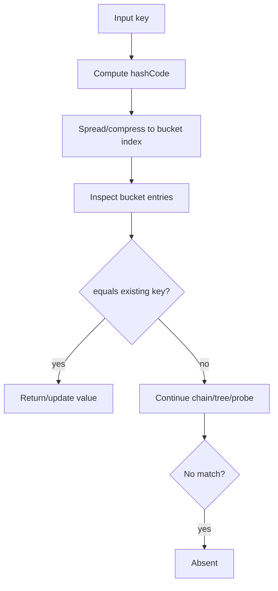

------
title: Learn Java Data Structures and Algorithms - Part 009
description: Kontrak kunci Java untuk struktur hash: equals, hashCode, mutability, HashMap, HashSet, LinkedHashMap, EnumMap, WeakHashMap, dan failure mode produksi.
series: learn-java-dsa
seriesTitle: Learn Java Data Structures and Algorithms
order: 9
partTitle: HashMap, HashSet, and Key Contracts
tags:
- java
- data-structures
- algorithms
- hashmap
- hashset
- equality
- series
date: 2026-06-27
---

# Part 009 — HashMap, HashSet, and Key Contracts

Part 008 membangun hash table dari first principles. Part ini membawa mesin itu ke Java production code.

Di Java, hash table bukan hanya soal bucket dan hash function. Ia bergantung pada kontrak semantik object:

- apa arti dua object dianggap sama;
- apakah hash code stabil selama object berada di map/set;
- apakah ordering konsisten dengan equality;
- apakah key bisa berubah setelah dimasukkan;
- apakah iteration order memang dijamin atau cuma kebetulan;
- apakah map aman dipakai pada concurrency;
- apakah memory lifecycle key sesuai dengan lifecycle data.

Banyak bug `HashMap` bukan bug algoritma. Bug-nya ada di kontrak model domain.

Contoh buruk:

```java
Map<OrderKey, OrderState> states = new HashMap<>();
OrderKey key = new OrderKey("ORD-10", "DRAFT");
states.put(key, new OrderState());

key.status = "SUBMITTED";

states.get(key); // bisa null, walaupun object yang sama pernah dimasukkan
```

Engineer yang hanya tahu “HashMap O(1)” akan bingung. Engineer yang memahami kontrak key akan langsung tahu: hash table kehilangan lokasi logis dari key karena hash/equality berubah.

---

## 1. Skill Target

Setelah part ini, kita harus mampu:

1. menjelaskan hubungan `equals`, `hashCode`, bucket lookup, dan key identity;
2. mendesain key object yang aman untuk `HashMap` dan `HashSet`;
3. mendeteksi mutable key hazard sebelum masuk production;
4. memilih `HashMap`, `HashSet`, `LinkedHashMap`, `EnumMap`, `IdentityHashMap`, `WeakHashMap`, atau `ConcurrentHashMap` berdasarkan invariant;
5. menjelaskan kenapa iteration order `HashMap` tidak boleh dijadikan kontrak;
6. membuat frequency counter, grouping index, deduplication set, LRU-ish structure, dan memoization cache dengan benar;
7. menulis test untuk equality contract dan map behavior;
8. menghindari bug `compareTo`/`Comparator` yang merusak `TreeMap`/`TreeSet` dan interop dengan hash-based collection.

---

## 2. Mental Model: HashMap adalah Index, Bukan Storage Biasa

`HashMap<K,V>` adalah index dari key ke value.

Index punya dua tahap lookup:

1. **navigasi kasar**: `hashCode()` menentukan bucket kandidat;
2. **verifikasi semantik**: `equals()` menentukan apakah key kandidat benar-benar sama.



Implikasinya:

- `hashCode` yang sama tidak berarti object sama;
- `equals` yang true wajib punya hash code yang sama;
- lookup tidak cukup dengan hash saja;
- key harus stabil selama berada di map;
- map tidak menyimpan “maksud bisnis”, hanya mengikuti kontrak method.

`HashMap` tidak tahu bahwa `orderId` adalah identitas. Ia hanya tahu hasil `hashCode` dan `equals`.

---

## 3. Kontrak `equals` dan `hashCode`

### 3.1 Kontrak `equals`

`equals` harus menjadi equivalence relation:

| Sifat | Makna |
|---|---|
| Reflexive | `x.equals(x)` harus true. |
| Symmetric | Jika `x.equals(y)`, maka `y.equals(x)`. |
| Transitive | Jika `x.equals(y)` dan `y.equals(z)`, maka `x.equals(z)`. |
| Consistent | Hasil tidak berubah selama state pembanding tidak berubah. |
| Null-safe | `x.equals(null)` harus false. |

Kesalahan paling berbahaya biasanya symmetry dan transitivity, terutama saat inheritance dipakai dalam value object.

Contoh rawan:

```java
class Money {
    final String currency;
    final long cents;

    Money(String currency, long cents) {
        this.currency = currency;
        this.cents = cents;
    }

    @Override
    public boolean equals(Object obj) {
        if (!(obj instanceof Money other)) return false;
        return cents == other.cents && currency.equals(other.currency);
    }
}

class DiscountedMoney extends Money {
    final int discountCode;

    DiscountedMoney(String currency, long cents, int discountCode) {
        super(currency, cents);
        this.discountCode = discountCode;
    }
}
```

`instanceof` kadang benar, kadang tidak. Untuk domain value object yang tidak ingin subtype dianggap sama, gunakan `getClass()` atau jadikan class `final`/record.

### 3.2 Kontrak `hashCode`

Aturan minimum:

1. Selama object tidak berubah pada field yang dipakai equality, `hashCode()` harus konsisten.
2. Jika `a.equals(b) == true`, maka `a.hashCode() == b.hashCode()`.
3. Jika `a.hashCode() == b.hashCode()`, `a.equals(b)` tidak wajib true.

```java
record CustomerKey(String tenantId, String customerId) {}
```

`record` cocok untuk key karena:

- field final;
- `equals` dan `hashCode` dibuat berdasarkan komponen record;
- representasi identity eksplisit;
- lebih sulit accidentally mutable.

Tetapi record bukan jaminan mutability total jika komponennya mutable:

```java
record BadKey(List<String> parts) {}

var parts = new ArrayList<>(List.of("A", "B"));
var key = new BadKey(parts);
var map = new HashMap<BadKey, String>();
map.put(key, "value");

parts.add("C");

System.out.println(map.get(key)); // bisa null
```

Key aman bukan hanya object-nya immutable. Seluruh graph data yang dipakai equality/hash harus efektif immutable.

---

## 4. HashMap Lookup secara Konseptual

Secara konseptual, `get(key)` melakukan ini:

```java
V get(Object key) {
    int h = hash(key);
    int i = indexFor(h, table.length);

    for (Entry<K, V> e : table[i]) {
        if (e.hash == h && Objects.equals(e.key, key)) {
            return e.value;
        }
    }
    return null;
}
```

Detail implementasi JDK lebih kompleks, termasuk table allocation lazy, spread hash, resize, dan tree bin. Tetapi mental model di atas cukup untuk memahami kontrak.

### 4.1 Kenapa hash dibanding sebelum equals?

Karena `equals` bisa mahal:

- membandingkan string panjang;
- membandingkan list;
- membandingkan composite key;
- melakukan normalisasi;
- bahkan, pada code buruk, melakukan I/O atau lookup lain.

Hash check adalah filter murah sebelum equality check.

### 4.2 Kenapa `containsKey` beda dari `get != null`?

`HashMap` memperbolehkan value `null`.

```java
Map<String, Integer> map = new HashMap<>();
map.put("A", null);

map.get("A");          // null
map.get("missing");    // null
map.containsKey("A");  // true
```

Jangan pakai `get(key) == null` untuk membedakan absent jika value bisa null.

---

## 5. Failure Mode: Mutable Key

Mutable key adalah bug klasik.

```java
final class UserKey {
    String tenantId;
    String userId;

    UserKey(String tenantId, String userId) {
        this.tenantId = tenantId;
        this.userId = userId;
    }

    @Override
    public boolean equals(Object o) {
        if (!(o instanceof UserKey other)) return false;
        return Objects.equals(tenantId, other.tenantId)
            && Objects.equals(userId, other.userId);
    }

    @Override
    public int hashCode() {
        return Objects.hash(tenantId, userId);
    }
}
```

Bug:

```java
var key = new UserKey("t1", "u1");
var map = new HashMap<UserKey, String>();

map.put(key, "Alice");
key.userId = "u2";

System.out.println(map.containsKey(key)); // false, often
```

Entry masih ada di internal table, tetapi berada di bucket yang dipilih berdasarkan hash lama. Lookup memakai hash baru dan pergi ke bucket lain.

### 5.1 Aturan desain

Key untuk hash-based collection harus:

- immutable;
- equality field final;
- tidak berisi mutable collection kecuali defensively copied;
- tidak berbasis waktu;
- tidak berbasis random;
- tidak bergantung pada database state;
- tidak berubah karena lazy loading;
- tidak override `equals` tanpa `hashCode`.

Safe version:

```java
record UserKey(String tenantId, String userId) {
    UserKey {
        tenantId = Objects.requireNonNull(tenantId);
        userId = Objects.requireNonNull(userId);
    }
}
```

Jika komponen berupa collection:

```java
record PathKey(List<String> segments) {
    PathKey {
        segments = List.copyOf(segments);
    }
}
```

---

## 6. `HashSet` adalah `HashMap` Tanpa Value Bermakna

`HashSet<E>` secara mental adalah:

```java
class HashSetLike<E> {
    private static final Object PRESENT = new Object();
    private final HashMap<E, Object> map = new HashMap<>();

    boolean add(E e) {
        return map.put(e, PRESENT) == null;
    }

    boolean contains(E e) {
        return map.containsKey(e);
    }

    boolean remove(E e) {
        return map.remove(e) != null;
    }
}
```

Jadi semua aturan key `HashMap` berlaku untuk element `HashSet`.

Gunakan `HashSet` untuk:

- deduplication;
- visited set;
- membership test;
- uniqueness enforcement di memory;
- anti-join sederhana;
- cycle detection.

Jangan gunakan `HashSet` jika:

- butuh order stabil: gunakan `LinkedHashSet` atau `TreeSet`;
- element mutable di field equality;
- butuh count: gunakan `Map<T, Integer>`;
- butuh identity equality: gunakan identity-based structure;
- butuh concurrent mutation: pertimbangkan concurrent set.

---

## 7. `equals` vs Identity

Java punya dua konsep berbeda:

| Konsep | Operator/API | Makna |
|---|---|---|
| Reference identity | `==` | Dua reference menunjuk object yang sama. |
| Logical equality | `equals` | Dua object dianggap sama secara domain. |
| Identity hash | `System.identityHashCode` | Hash berbasis identity, bukan override `hashCode`. |

Contoh:

```java
String a = new String("x");
String b = new String("x");

System.out.println(a == b);      // false
System.out.println(a.equals(b)); // true
```

`HashMap` memakai logical equality. Jika butuh identity semantics, gunakan `IdentityHashMap`, tetapi jangan jadikan default.

Use case identity map:

- graph traversal berdasarkan object instance;
- cycle detection saat serialization;
- memoization di object graph mutable;
- proxy identity tracking;
- framework internals.

Bukan use case identity map:

- user ID;
- order ID;
- business key;
- value object;
- DTO deduplication.

---

## 8. Composite Key Design

Composite key sering muncul pada sistem multi-tenant:

```java
record AccountKey(String tenantId, String accountId) {}
```

Ini lebih aman daripada nested map jika operasi dominannya single lookup:

```java
Map<AccountKey, AccountState> byAccount = new HashMap<>();
```

Nested map:

```java
Map<String, Map<String, AccountState>> byTenantThenAccount = new HashMap<>();
```

Trade-off:

| Design | Kelebihan | Kekurangan |
|---|---|---|
| Composite key | Simple single lookup, mudah pass around, cocok untuk cache. | Perlu allocate key object, range scan per tenant lebih sulit. |
| Nested map | Natural untuk grouping/range per tenant. | Lebih banyak map object, lookup bertingkat, cleanup tenant harus hati-hati. |

Rule of thumb:

- gunakan composite key untuk point lookup;
- gunakan nested map jika operasi utama adalah per-group traversal;
- gunakan dedicated index abstraction jika kedua pola sama-sama penting.

---

## 9. Sizing HashMap dengan Benar

`HashMap` punya dua parameter utama:

- capacity: jumlah bucket;
- load factor: threshold kepadatan sebelum resize.

Threshold konseptual:

```text
threshold = capacity * loadFactor
```

Jika jumlah entry melewati threshold, map resize dan rehash.

### 9.1 Jangan over-size sembarangan

Over-sizing mengurangi resize tetapi memperburuk:

- memory footprint;
- cache behavior;
- iteration cost;
- cold-start allocation.

`HashMap` iteration cost bukan hanya `size`, tetapi juga capacity. Map dengan 100 entry dan capacity 1 juta bisa iterasi buruk.

### 9.2 Jangan under-size untuk bulk load

Under-sizing menyebabkan resize bertahap:

```java
var map = new HashMap<String, Event>(1_000_000); // bukan selalu tepat, tapi lebih baik dari default jika memang bulk load besar
```

Pada JDK modern tersedia factory sizing helper untuk expected mappings:

```java
HashMap<String, Event> map = HashMap.newHashMap(expectedMappings);
```

Gunakan helper semacam ini saat tersedia karena expected mappings bukan hal yang sama dengan internal bucket capacity.

### 9.3 Capacity bukan SLA latency

Sizing mengurangi resize spike, tetapi tidak menjamin latency jika:

- key hash buruk;
- key allocation tinggi;
- GC pressure tinggi;
- equality mahal;
- map terlalu besar untuk cache;
- ada concurrency contention;
- workload berubah dari point lookup menjadi full scan.

---

## 10. `computeIfAbsent`, `merge`, dan Atomicity Trap

### 10.1 Frequency counter

```java
Map<String, Integer> counts = new HashMap<>();

for (String word : words) {
    counts.merge(word, 1, Integer::sum);
}
```

Lebih jelas daripada:

```java
counts.put(word, counts.getOrDefault(word, 0) + 1);
```

### 10.2 Grouping index

```java
Map<String, List<Order>> byCustomer = new HashMap<>();

for (Order order : orders) {
    byCustomer.computeIfAbsent(order.customerId(), ignored -> new ArrayList<>())
              .add(order);
}
```

Hati-hati: value list tetap mutable. Kalau map diekspos keluar, bungkus/copy.

```java
Map<String, List<Order>> immutable = byCustomer.entrySet().stream()
    .collect(Collectors.toUnmodifiableMap(
        Map.Entry::getKey,
        e -> List.copyOf(e.getValue())
    ));
```

### 10.3 Recursive `computeIfAbsent` hazard

Jangan membuat mapping function melakukan mutasi berbahaya terhadap map yang sama.

Buruk:

```java
cache.computeIfAbsent(key, k -> {
    cache.put(otherKey, expensive(otherKey));
    return expensive(k);
});
```

Lebih aman: pisahkan computation dari mutation jika dependency rumit.

```java
Value value = expensive(key);
cache.putIfAbsent(key, value);
```

Untuk concurrent cache, gunakan primitive yang memang didesain untuk concurrency dan pahami kontrak atomicity-nya.

---

## 11. HashMap vs LinkedHashMap

`LinkedHashMap` mempertahankan encounter order dengan linked list antar entry.

Gunakan saat butuh:

- iteration berdasarkan insertion order;
- deterministic output;
- predictable JSON serialization order;
- simple LRU cache via access order;
- test snapshot yang stabil.

Contoh access-order LRU sederhana:

```java
final class LruCache<K, V> extends LinkedHashMap<K, V> {
    private final int maxEntries;

    LruCache(int maxEntries) {
        super(16, 0.75f, true); // access-order
        this.maxEntries = maxEntries;
    }

    @Override
    protected boolean removeEldestEntry(Map.Entry<K, V> eldest) {
        return size() > maxEntries;
    }
}
```

Caveat:

- bukan concurrent cache;
- eviction terjadi saat mutation;
- tidak punya TTL;
- tidak punya weight-based eviction;
- tidak punya observability bawaan;
- untuk production cache serius, gunakan library cache yang memang didesain untuk itu.

---

## 12. EnumMap dan EnumSet

Jika key adalah enum, default terbaik sering `EnumMap`.

```java
enum State { DRAFT, SUBMITTED, APPROVED, REJECTED }

Map<State, Integer> counts = new EnumMap<>(State.class);
counts.put(State.DRAFT, 10);
```

Kenapa kuat:

- key space finite;
- internal representation compact;
- lookup dapat dipetakan ke ordinal-like index;
- tidak perlu hash distribution seperti `HashMap` umum;
- semantic intent jelas.

Gunakan `EnumSet` untuk set enum:

```java
EnumSet<State> terminal = EnumSet.of(State.APPROVED, State.REJECTED);
```

Jangan menyimpan ordinal ke database sebagai kontrak jangka panjang tanpa strategi migrasi. Ordinal mudah rusak saat enum reorder.

---

## 13. WeakHashMap: Lifecycle Key Berbasis GC

`WeakHashMap` memakai weak key. Entry bisa hilang ketika key tidak lagi strongly reachable di luar map.

Use case:

- metadata tambahan untuk object eksternal;
- canonicalization tertentu;
- framework cache yang tidak boleh memperpanjang umur key.

Jangan gunakan `WeakHashMap` untuk cache bisnis biasa jika:

- data harus tetap ada sampai TTL;
- eviction harus predictable;
- hilangnya entry harus auditable;
- value mereferensikan key secara kuat sehingga mencegah cleanup;
- sistem butuh SLA hit-rate.

Contoh jebakan:

```java
Map<Key, Value> map = new WeakHashMap<>();

// Jika Value punya strong reference ke Key, key mungkin tetap reachable melalui value.
```

Weak map bukan pengganti cache policy. Ia adalah lifecycle coupling dengan garbage collector.

---

## 14. Ordering, Equality, dan Sorted Collections

Hash-based collections memakai `equals`/`hashCode`.

Sorted collections seperti `TreeMap`/`TreeSet` memakai `Comparator` atau `Comparable`.

Ini bisa menciptakan perilaku berbeda.

```java
record User(String id, String name) {}

Comparator<User> byNameOnly = Comparator.comparing(User::name);

Set<User> users = new TreeSet<>(byNameOnly);
users.add(new User("u1", "Alice"));
users.add(new User("u2", "Alice"));

System.out.println(users.size()); // 1, karena comparator menganggap sama
```

`TreeSet` bukan bertanya `equals`. Ia bertanya apakah `compare(a, b) == 0`.

### 14.1 Comparator harus total order

Comparator valid harus:

- anti-symmetric;
- transitive;
- consistent untuk input yang sama;
- menangani equality bucket dengan benar;
- tidak overflow;
- tidak bergantung pada mutable external state.

Buruk:

```java
Comparator<Order> byAmount = (a, b) -> (int) (a.amountCents() - b.amountCents());
```

Bisa overflow. Gunakan:

```java
Comparator<Order> byAmount = Comparator.comparingLong(Order::amountCents);
```

Jika field utama tidak unik, tambahkan tie-breaker:

```java
Comparator<User> byNameThenId = Comparator
    .comparing(User::name)
    .thenComparing(User::id);
```

---

## 15. Common Patterns

### 15.1 Deduplication preserving first occurrence

```java
static <T> List<T> distinctPreservingOrder(List<T> input) {
    Set<T> seen = new HashSet<>();
    List<T> out = new ArrayList<>();

    for (T item : input) {
        if (seen.add(item)) {
            out.add(item);
        }
    }
    return out;
}
```

Jika order hasil harus sama dengan encounter order, jangan iterate `HashSet`; simpan output list atau gunakan `LinkedHashSet`.

### 15.2 Two-sum index

```java
static int[] twoSum(int[] nums, int target) {
    Map<Integer, Integer> indexByValue = new HashMap<>();

    for (int i = 0; i < nums.length; i++) {
        int need = target - nums[i];
        Integer j = indexByValue.get(need);
        if (j != null) {
            return new int[] { j, i };
        }
        indexByValue.put(nums[i], i);
    }
    return new int[] { -1, -1 };
}
```

Note: ini gagal membedakan index 0 jika memakai sentinel `0`; gunakan `Integer` nullable atau `containsKey`.

### 15.3 Multi-map

Java standard library tidak punya `Multimap` khusus.

```java
Map<String, List<String>> rolesByUser = new HashMap<>();

rolesByUser.computeIfAbsent(userId, ignored -> new ArrayList<>())
           .add(role);
```

Jika remove sering dilakukan, `Set` mungkin lebih tepat:

```java
Map<String, Set<String>> rolesByUser = new HashMap<>();

rolesByUser.computeIfAbsent(userId, ignored -> new HashSet<>())
           .add(role);
```

### 15.4 Inverted index

```java
Map<String, Set<DocumentId>> docsByToken = new HashMap<>();

for (Document doc : docs) {
    for (String token : tokenize(doc.text())) {
        docsByToken.computeIfAbsent(token, ignored -> new HashSet<>())
                   .add(doc.id());
    }
}
```

Production concern:

- token normalization;
- memory footprint;
- set representation;
- stop words;
- document deletion;
- incremental update;
- concurrency;
- persistence.

---

## 16. Testing Equality Contract

Test equality bukan formalitas.

```java
@Test
void equalKeysHaveEqualHashCodes() {
    var a = new AccountKey("t1", "a1");
    var b = new AccountKey("t1", "a1");

    assertEquals(a, b);
    assertEquals(a.hashCode(), b.hashCode());
}

@Test
void differentKeysAreDistinctInHashSet() {
    var a = new AccountKey("t1", "a1");
    var b = new AccountKey("t1", "a2");

    var set = new HashSet<AccountKey>();
    set.add(a);
    set.add(b);

    assertEquals(2, set.size());
}
```

Test mutability:

```java
@Test
void keyShouldBeImmutable() {
    var keyClass = AccountKey.class;

    for (Field field : keyClass.getDeclaredFields()) {
        assertTrue(Modifier.isFinal(field.getModifiers()), field.getName());
    }
}
```

Reflection test bukan pengganti design review, tetapi bisa menangkap regresi.

---

## 17. Performance Trap yang Sering Terlihat

### 17.1 `Objects.hash` di hot path

```java
@Override
public int hashCode() {
    return Objects.hash(tenantId, accountId, region);
}
```

`Objects.hash` nyaman, tetapi memakai varargs sehingga dapat menambah allocation overhead. Untuk key di hot path, tulis manual atau gunakan record jika cukup.

```java
@Override
public int hashCode() {
    int result = tenantId.hashCode();
    result = 31 * result + accountId.hashCode();
    result = 31 * result + region.hashCode();
    return result;
}
```

Jangan premature optimize semua key. Ukur dulu jika key dipakai di hot path.

### 17.2 Hash code caching

Caching hash code berguna jika:

- key immutable;
- hash computation mahal;
- object dipakai berkali-kali;
- memory tambahan acceptable.

```java
final class LongPathKey {
    private final List<String> segments;
    private final int hash;

    LongPathKey(List<String> segments) {
        this.segments = List.copyOf(segments);
        this.hash = this.segments.hashCode();
    }

    @Override
    public int hashCode() {
        return hash;
    }

    @Override
    public boolean equals(Object obj) {
        if (!(obj instanceof LongPathKey other)) return false;
        return segments.equals(other.segments);
    }
}
```

### 17.3 Expensive equality

Jika `equals` membandingkan payload besar, pertimbangkan:

- stable ID sebagai key;
- content hash + equality fallback;
- canonicalization;
- interning;
- avoiding large object key.

---

## 18. Hash Collision dan Adversarial Input

Banyak key dengan hash sama akan memperburuk performa. JDK modern punya mitigasi untuk bucket tertentu, tetapi jangan menjadikan itu alasan mengabaikan key design.

Contoh key buruk:

```java
final class BadKey {
    final String id;

    BadKey(String id) {
        this.id = id;
    }

    @Override
    public int hashCode() {
        return 42;
    }

    @Override
    public boolean equals(Object obj) {
        return obj instanceof BadKey other && id.equals(other.id);
    }
}
```

Semua entry masuk bucket yang sama. Jika bucket menjadi chain panjang, cost mendekati linear. Jika treeified, cost membaik tetapi constant factor dan memory overhead tetap buruk.

### 18.1 Domain-specific collision

Collision tidak harus disengaja. Bisa terjadi karena hash hanya memakai prefix:

```java
@Override
public int hashCode() {
    return tenantId.hashCode(); // buruk jika satu tenant punya jutaan account
}
```

Lebih baik:

```java
@Override
public int hashCode() {
    int result = tenantId.hashCode();
    result = 31 * result + accountId.hashCode();
    return result;
}
```

---

## 19. Production Design Checklist

Sebelum memakai object sebagai key:

- [ ] Apakah identity field jelas?
- [ ] Apakah semua equality field immutable?
- [ ] Apakah nested object juga immutable atau defensively copied?
- [ ] Apakah `equals` dan `hashCode` konsisten?
- [ ] Apakah `hashCode` memakai semua field yang relevan?
- [ ] Apakah field yang dipakai hash punya distribusi cukup baik?
- [ ] Apakah value boleh null? Jika ya, lookup memakai `containsKey`?
- [ ] Apakah iteration order dibutuhkan? Jika ya, jangan bergantung pada `HashMap`.
- [ ] Apakah map dimutasi secara concurrent? Jika ya, jangan pakai `HashMap` tanpa guard.
- [ ] Apakah memory footprint acceptable?
- [ ] Apakah resize spike acceptable?
- [ ] Apakah key lifecycle harus weak/strong?
- [ ] Apakah test equality contract tersedia?

---

## 20. Mini Case Study: Enforcement Case Index

Misal sistem regulatory case management punya entity:

```java
record CaseId(String jurisdiction, String caseNumber) {}
record ActorId(String registry, String actorNumber) {}
record ViolationCode(String code) {}
```

Kita butuh beberapa index:

```java
Map<CaseId, CaseRecord> casesById = new HashMap<>();
Map<ActorId, Set<CaseId>> casesByActor = new HashMap<>();
Map<ViolationCode, Set<CaseId>> casesByViolation = new HashMap<>();
```

Invariant:

- `casesById` adalah source of truth in-memory;
- secondary index hanya menyimpan `CaseId`, bukan duplicate `CaseRecord`;
- update case harus memperbarui index lama dan baru;
- key object immutable;
- result order tidak dijamin kecuali memakai `LinkedHashSet` atau sorting eksplisit.

Update hazard:

```java
void updateViolations(CaseId id, Set<ViolationCode> newCodes) {
    CaseRecord old = casesById.get(id);
    if (old == null) throw new IllegalArgumentException("unknown case");

    for (ViolationCode oldCode : old.violations()) {
        Set<CaseId> ids = casesByViolation.get(oldCode);
        if (ids != null) {
            ids.remove(id);
            if (ids.isEmpty()) casesByViolation.remove(oldCode);
        }
    }

    CaseRecord updated = old.withViolations(Set.copyOf(newCodes));
    casesById.put(id, updated);

    for (ViolationCode newCode : newCodes) {
        casesByViolation.computeIfAbsent(newCode, ignored -> new HashSet<>())
                        .add(id);
    }
}
```

Mental model: setiap secondary index adalah derived state. Derived state harus punya update protocol.

---

## 21. Practice Loop

### Exercise 1 — Break a Key

Buat mutable key, masukkan ke `HashMap`, mutate field equality, lalu observasi:

- `get(key)`;
- `containsKey(key)`;
- iteration `entrySet()`;
- `remove(key)`.

Tujuan: merasakan bug “data ada tetapi tidak bisa ditemukan”.

### Exercise 2 — Build Composite Index

Buat model:

```java
record TenantId(String value) {}
record UserId(String value) {}
record UserKey(TenantId tenantId, UserId userId) {}
record User(UserKey key, String email, boolean active) {}
```

Bangun:

- `Map<UserKey, User>`;
- `Map<TenantId, Set<UserKey>>`;
- `Map<String, UserKey>` untuk email.

Implementasikan insert, deactivate, update email, delete.

### Exercise 3 — Comparator Consistency

Buat `TreeSet<User>` dengan comparator by email domain saja. Tambahkan dua user domain sama. Jelaskan kenapa size tidak sesuai ekspektasi.

### Exercise 4 — Hash Distribution Probe

Untuk 100 ribu generated keys, hitung distribusi bucket konseptual:

```java
int bucket = hash & (capacity - 1);
```

Laporkan:

- bucket kosong;
- max chain length;
- rata-rata chain length non-empty;
- p95 chain length.

---

## 22. Self-Correction Checklist

Kita benar-benar memahami part ini jika bisa menjawab:

1. Kenapa `equals` true wajib hash sama?
2. Kenapa hash sama tidak cukup untuk equality?
3. Kenapa key mutable bisa membuat map “kehilangan” entry?
4. Kenapa `HashSet` punya problem yang sama dengan `HashMap` key?
5. Kenapa `get(key) == null` tidak selalu berarti absent?
6. Kenapa `HashMap` iteration order tidak boleh jadi kontrak?
7. Kapan `LinkedHashMap` lebih tepat?
8. Kapan `EnumMap` lebih tepat?
9. Kapan `WeakHashMap` berbahaya?
10. Kenapa comparator by non-unique field bisa merusak `TreeSet`?

---

## 23. References

- Java SE 25 API — `Object.equals` and `Object.hashCode`
- Java SE 25 API — `HashMap`
- Java SE 25 API — `HashSet`
- Java SE 25 API — `LinkedHashMap`
- Java SE 25 API — `EnumMap`
- Java SE 25 API — `WeakHashMap`
- Java SE 25 API — `Comparator`
- Java SE 25 API — `Comparable`

---

## 24. What Comes Next

Part 010 akan membahas comparison sorting secara deep: lower bound, stability, comparator correctness, quicksort, mergesort, heapsort, TimSort, dan pilihan sorting production di Java.
