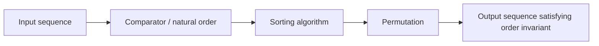
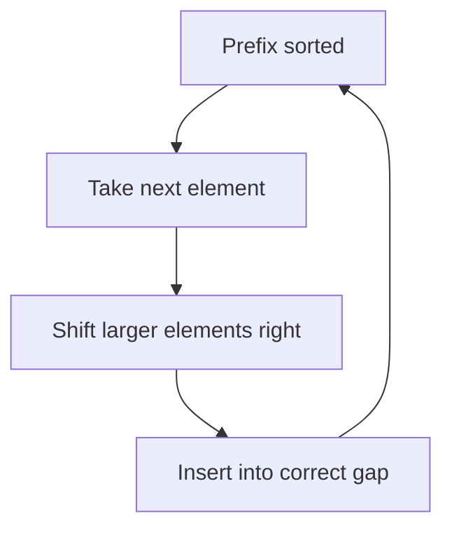
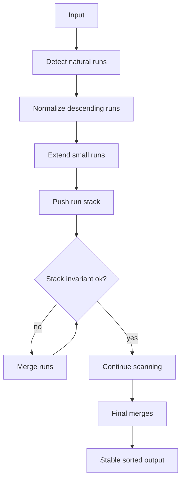
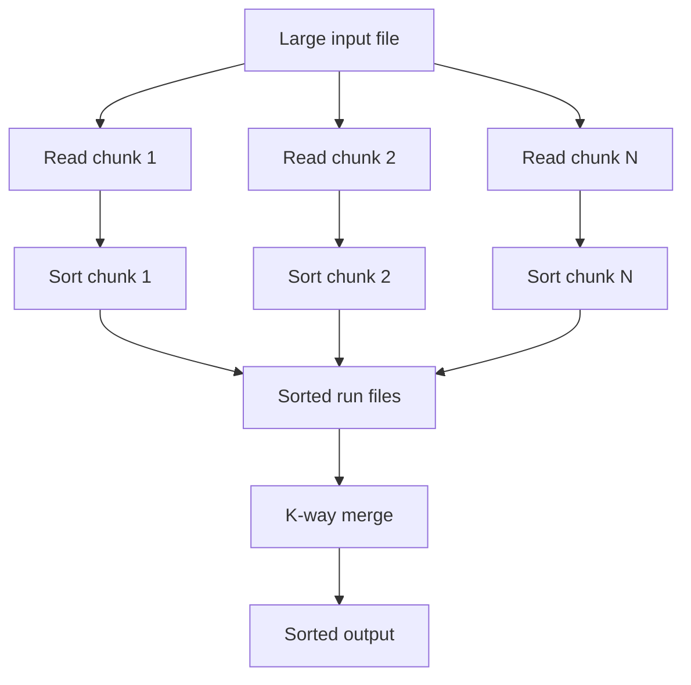

------
title: Learn Java Data Structures and Algorithms - Part 010
description: Sorting berbasis comparison secara mendalam: lower bound, stability, quicksort, mergesort, heapsort, TimSort, comparator correctness, dan pilihan sorting production di Java.
series: learn-java-dsa
seriesTitle: Learn Java Data Structures and Algorithms
order: 10
partTitle: Comparison Sorting Deep Dive
tags:
- java
- data-structures
- algorithms
- sorting
- comparator
- complexity
- series
date: 2026-06-27
---

# Part 010 — Comparison Sorting Deep Dive

Sorting sering diajarkan sebagai daftar algoritma: bubble sort, insertion sort, merge sort, quicksort, heapsort. Cara itu kurang berguna untuk engineer senior.

Dalam engineering, sorting adalah operasi transformasi data dengan kontrak:

- order apa yang diinginkan;
- apakah order total atau partial;
- apakah stability diperlukan;
- apakah comparator benar;
- apakah data primitive atau object;
- apakah data hampir sorted;
- apakah comparison mahal;
- apakah memory tambahan acceptable;
- apakah latency spike acceptable;
- apakah parallelism membantu atau merusak.

Part ini membahas sorting sebagai sistem pengambilan keputusan, bukan hafalan algoritma.

---

## 1. Skill Target

Setelah part ini, kita harus mampu:

1. menjelaskan lower bound O(n log n) untuk comparison sorting;
2. membedakan stable dan unstable sorting;
3. memilih quicksort, mergesort, heapsort, insertion sort, atau TimSort berdasarkan data shape;
4. menulis comparator Java yang benar, total, dan tidak overflow;
5. memahami perbedaan sorting primitive array, object array, list, dan stream;
6. menjelaskan kenapa sorting object sering didominasi biaya comparison;
7. mendesain multi-key ordering yang deterministic;
8. menghindari bug sorting karena comparator inconsistent;
9. membangun test untuk sorting correctness;
10. memutuskan kapan sorting harus diganti dengan heap, bucket, index, atau pre-sorted structure.

---

## 2. Mental Model: Sorting adalah Permutation dengan Invariant

Sorting tidak membuat data baru secara konseptual. Sorting memilih permutation dari elemen input sehingga invariant order terpenuhi.

Untuk array `a`, hasil sorted harus memenuhi:

```text
for every i < j: compare(a[i], a[j]) <= 0
```

Jika sorting stable, ada invariant tambahan:

```text
if two elements compare equal, their relative input order is preserved
```



Sorting salah biasanya bukan karena algoritma library salah. Biasanya karena:

- comparator salah;
- order yang dimaksud tidak total;
- null tidak ditangani;
- numeric subtraction overflow;
- stability diasumsikan padahal tidak dijamin;
- object mutable selama sorting;
- source list tidak modifiable;
- parallel sort dipakai tanpa memahami overhead.

---

## 3. Comparison Sorting Lower Bound

Comparison sorting hanya boleh memperoleh informasi dari operasi pembanding:

```java
compare(a, b)
```

Untuk `n` elemen berbeda, ada `n!` kemungkinan urutan input. Sorting harus membedakan semua kemungkinan itu.

Setiap comparison memberi paling banyak dua atau tiga cabang informasi. Decision tree sorting harus punya minimal `n!` daun.

Maka tinggi decision tree minimal:

```text
log2(n!) = Θ(n log n)
```

Artinya, algoritma comparison sort umum tidak bisa menjamin lebih baik dari O(n log n) pada semua input.

Ini bukan berarti sorting selalu O(n log n):

- input kecil bisa O(n²) tapi lebih cepat karena constant factor;
- input hampir sorted bisa dieksploitasi adaptive sort;
- non-comparison sort bisa O(n + k) jika domain key terbatas;
- partial sorting/top-k bisa O(n log k);
- data pre-indexed bisa query sorted tanpa sort ulang.

---

## 4. Stability

Sorting stable mempertahankan order relatif elemen yang compare equal.

Contoh:

```java
record Employee(String department, String name, int originalIndex) {}
```

Input:

```text
[HR/Ana#0, ENG/Budi#1, HR/Citra#2]
```

Sort by department stable:

```text
[ENG/Budi#1, HR/Ana#0, HR/Citra#2]
```

`Ana` tetap sebelum `Citra` karena keduanya sama-sama `HR` dan order input mereka begitu.

### 4.1 Kenapa stability penting?

Stability memungkinkan multi-pass sorting:

```java
employees.sort(Comparator.comparing(Employee::name));
employees.sort(Comparator.comparing(Employee::department));
```

Jika sort kedua stable, hasil akhir sorted by department, lalu name sebagai tie-breaker dari sort sebelumnya.

Namun di Java modern, lebih jelas memakai comparator chain:

```java
employees.sort(
    Comparator.comparing(Employee::department)
              .thenComparing(Employee::name)
);
```

### 4.2 Stability bukan uniqueness

Jika comparator mengembalikan 0, stable sort mempertahankan order relatif, bukan menganggap data duplicate.

Deduplication adalah operasi berbeda:

```java
List<User> sorted = users.stream()
    .sorted(Comparator.comparing(User::email))
    .toList();
```

Ini tidak menghapus email duplicate.

---

## 5. Comparator Correctness

Comparator adalah kontrak formal.

Untuk comparator `c`:

- jika `c.compare(a, b) < 0`, maka `a` sebelum `b`;
- jika `c.compare(a, b) > 0`, maka `a` setelah `b`;
- jika `c.compare(a, b) == 0`, maka keduanya equivalent menurut ordering itu.

Comparator harus transitive:

```text
if a < b and b < c, then a < c
```

Harus anti-symmetric:

```text
sign(compare(a, b)) == -sign(compare(b, a))
```

Harus consistent:

```text
compare(a, b) returns same result while compared state unchanged
```

### 5.1 Jangan gunakan subtraction comparator

Buruk:

```java
Comparator<Order> byAmount = (a, b) -> (int) (a.amountCents() - b.amountCents());
```

Problem:

- overflow;
- narrowing long ke int;
- hasil salah untuk nilai ekstrem.

Benar:

```java
Comparator<Order> byAmount = Comparator.comparingLong(Order::amountCents);
```

Untuk `int`:

```java
Comparator<User> byAge = Comparator.comparingInt(User::age);
```

### 5.2 Tie-breaker wajib untuk deterministic total order

Comparator by non-unique field menghasilkan equivalence class besar.

```java
Comparator<Event> byTimestamp = Comparator.comparing(Event::timestamp);
```

Jika banyak event punya timestamp sama, order internal mereka bergantung pada stability/input order. Untuk deterministic output lintas source, tambahkan tie-breaker:

```java
Comparator<Event> eventOrder = Comparator
    .comparing(Event::timestamp)
    .thenComparing(Event::sequence)
    .thenComparing(Event::id);
```

### 5.3 Null handling harus eksplisit

```java
Comparator<Customer> byLastLogin = Comparator.comparing(
    Customer::lastLogin,
    Comparator.nullsLast(Comparator.naturalOrder())
);
```

Jangan biarkan `NullPointerException` muncul secara kebetulan kecuali null memang invariant violation dan ingin fail fast.

---

## 6. Insertion Sort

Insertion sort sederhana:

```java
static void insertionSort(int[] a) {
    for (int i = 1; i < a.length; i++) {
        int x = a[i];
        int j = i - 1;

        while (j >= 0 && a[j] > x) {
            a[j + 1] = a[j];
            j--;
        }
        a[j + 1] = x;
    }
}
```

Complexity:

| Case | Time | Space |
|---|---:|---:|
| Already sorted | O(n) | O(1) |
| Random | O(n²) | O(1) |
| Reverse sorted | O(n²) | O(1) |

Kenapa masih penting?

- sangat cepat untuk array kecil;
- adaptive untuk data hampir sorted;
- dipakai sebagai base case dalam hybrid sort;
- stable jika implementasi shifting, bukan swapping agresif.

Mental model: insertion sort menjaga prefix `[0, i)` selalu sorted.



---

## 7. Merge Sort

Merge sort membagi array menjadi dua, sort masing-masing, lalu merge.

```java
static void mergeSort(int[] a) {
    int[] tmp = new int[a.length];
    mergeSort(a, tmp, 0, a.length);
}

static void mergeSort(int[] a, int[] tmp, int lo, int hi) {
    if (hi - lo <= 1) return;

    int mid = lo + (hi - lo) / 2;
    mergeSort(a, tmp, lo, mid);
    mergeSort(a, tmp, mid, hi);
    merge(a, tmp, lo, mid, hi);
}

static void merge(int[] a, int[] tmp, int lo, int mid, int hi) {
    int i = lo, j = mid, k = lo;

    while (i < mid && j < hi) {
        if (a[i] <= a[j]) tmp[k++] = a[i++]; // <= preserves stability
        else tmp[k++] = a[j++];
    }
    while (i < mid) tmp[k++] = a[i++];
    while (j < hi) tmp[k++] = a[j++];

    System.arraycopy(tmp, lo, a, lo, hi - lo);
}
```

Complexity:

| Case | Time | Space |
|---|---:|---:|
| Best | O(n log n) | O(n) |
| Average | O(n log n) | O(n) |
| Worst | O(n log n) | O(n) |

Strength:

- stable;
- predictable worst-case;
- good for linked/external sorting;
- easy to reason about.

Weakness:

- extra memory;
- copy cost;
- less cache-friendly than in-place algorithms in some contexts.

---

## 8. Quicksort

Quicksort memilih pivot, partition, lalu sort kiri dan kanan.

```java
static void quickSort(int[] a) {
    quickSort(a, 0, a.length - 1);
}

static void quickSort(int[] a, int lo, int hi) {
    if (lo >= hi) return;

    int p = partition(a, lo, hi);
    quickSort(a, lo, p - 1);
    quickSort(a, p + 1, hi);
}

static int partition(int[] a, int lo, int hi) {
    int pivot = a[hi];
    int i = lo;

    for (int j = lo; j < hi; j++) {
        if (a[j] <= pivot) {
            swap(a, i++, j);
        }
    }
    swap(a, i, hi);
    return i;
}

static void swap(int[] a, int i, int j) {
    int t = a[i];
    a[i] = a[j];
    a[j] = t;
}
```

Complexity:

| Case | Time | Space |
|---|---:|---:|
| Best | O(n log n) | O(log n) recursion |
| Average | O(n log n) | O(log n) recursion |
| Worst | O(n²) | O(n) recursion |

Strength:

- in-place;
- good cache locality;
- fast constants;
- excellent untuk primitive arrays dengan implementasi matang.

Weakness:

- unstable;
- pivot buruk bisa O(n²);
- duplicate-heavy data perlu 3-way partition;
- recursion depth harus dikontrol.

### 8.1 Three-way partition untuk duplicate-heavy data

```java
static void quickSort3Way(int[] a, int lo, int hi) {
    if (lo >= hi) return;

    int lt = lo, i = lo + 1, gt = hi;
    int pivot = a[lo];

    while (i <= gt) {
        if (a[i] < pivot) swap(a, lt++, i++);
        else if (a[i] > pivot) swap(a, i, gt--);
        else i++;
    }

    quickSort3Way(a, lo, lt - 1);
    quickSort3Way(a, gt + 1, hi);
}
```

Jika banyak duplicate, 3-way partition menghindari kerja berulang pada elemen yang sama dengan pivot.

---

## 9. Heapsort

Heapsort membangun max-heap, lalu berulang kali memindahkan max ke akhir array.

```java
static void heapSort(int[] a) {
    int n = a.length;

    for (int i = n / 2 - 1; i >= 0; i--) {
        siftDown(a, i, n);
    }

    for (int end = n - 1; end > 0; end--) {
        swap(a, 0, end);
        siftDown(a, 0, end);
    }
}

static void siftDown(int[] a, int i, int n) {
    while (true) {
        int left = 2 * i + 1;
        int right = left + 1;
        int largest = i;

        if (left < n && a[left] > a[largest]) largest = left;
        if (right < n && a[right] > a[largest]) largest = right;

        if (largest == i) return;
        swap(a, i, largest);
        i = largest;
    }
}
```

Complexity:

| Case | Time | Space |
|---|---:|---:|
| Best | O(n log n) | O(1) |
| Average | O(n log n) | O(1) |
| Worst | O(n log n) | O(1) |

Strength:

- in-place;
- worst-case O(n log n);
- tidak butuh random pivot.

Weakness:

- unstable;
- cache behavior sering kurang baik dibanding quicksort;
- constant factor bisa lebih tinggi;
- jarang menjadi pilihan default untuk full sort di Java application code.

---

## 10. TimSort Intuition

TimSort adalah hybrid stable sorting algorithm yang mengeksploitasi run alami dalam data.

Run adalah subsequence yang sudah naik atau turun.

Contoh:

```text
[1, 2, 5, 9] [8, 7, 6] [10, 11, 12]
```

TimSort:

1. mendeteksi run;
2. membalik descending run;
3. memperpanjang run kecil dengan insertion sort;
4. menaruh run di stack;
5. merge run berdasarkan invariant ukuran;
6. memakai galloping saat merge sangat bias.

Mental model:



Kenapa efektif untuk real-world data?

- banyak data sudah sebagian sorted;
- append-only logs sering hampir ordered;
- UI tables sering re-sorted by adjacent keys;
- business data sering grouped;
- stable sort mempertahankan existing order sebagai tie-breaker implisit.

---

## 11. Sorting di Java

### 11.1 Primitive arrays

```java
int[] a = {3, 1, 2};
Arrays.sort(a);
```

Primitive array sorting tidak punya stability concern karena primitive tidak punya identity object. Equal primitive values indistinguishable.

Untuk primitive arrays, JDK mendokumentasikan penggunaan Dual-Pivot Quicksort untuk beberapa overload primitive sort.

### 11.2 Object arrays

```java
Order[] orders = ...;
Arrays.sort(orders, Comparator.comparing(Order::createdAt));
```

Object sorting membutuhkan comparator/natural ordering dan stable sort dijamin untuk object sort overloads.

### 11.3 Lists

```java
List<Order> orders = new ArrayList<>();
orders.sort(Comparator.comparing(Order::createdAt));
```

`List.sort` lebih idiomatik daripada `Collections.sort` untuk Java modern.

```java
Collections.sort(orders, comparator); // masih valid
```

Syarat penting: list harus modifiable. List dari `List.of(...)` tidak bisa disort in-place.

```java
List<Integer> immutable = List.of(3, 1, 2);
immutable.sort(Integer::compareTo); // UnsupportedOperationException
```

Solusi:

```java
List<Integer> sorted = new ArrayList<>(immutable);
sorted.sort(Integer::compareTo);
```

### 11.4 Streams

```java
List<Order> sorted = orders.stream()
    .sorted(Comparator.comparing(Order::createdAt))
    .toList();
```

Stream `sorted` membuat pipeline, bukan in-place mutation source list.

Gunakan stream sort untuk transformation pipeline. Gunakan list sort untuk mutasi collection yang memang dimiliki.

---

## 12. Sorting Cost Model di Java

Sorting object sering cost-nya bukan swap, tetapi comparator.

Comparator bisa mahal karena:

- method dispatch;
- lambda indirection;
- boxing;
- string comparison;
- locale collation;
- parsing on the fly;
- null handling;
- chained keys;
- cache miss pada object graph.

Buruk:

```java
orders.sort(Comparator.comparing(o -> LocalDate.parse(o.dateText())));
```

Parsing dilakukan berkali-kali selama sorting.

Lebih baik decorate-sort-undecorate:

```java
record OrderWithDate(Order order, LocalDate date) {}

List<Order> sorted = orders.stream()
    .map(o -> new OrderWithDate(o, LocalDate.parse(o.dateText())))
    .sorted(Comparator.comparing(OrderWithDate::date))
    .map(OrderWithDate::order)
    .toList();
```

Jika memory sensitive, precompute field di domain object atau gunakan side cache dengan lifecycle jelas.

---

## 13. Multi-Key Sorting

Contoh business ordering:

1. priority descending;
2. SLA deadline ascending;
3. case severity descending;
4. case ID ascending sebagai deterministic tie-breaker.

```java
Comparator<CaseWorkItem> workOrder = Comparator
    .comparingInt(CaseWorkItem::priority).reversed()
    .thenComparing(CaseWorkItem::slaDeadline)
    .thenComparing(Comparator.comparingInt(CaseWorkItem::severity).reversed())
    .thenComparing(CaseWorkItem::caseId);
```

Hati-hati dengan `reversed()`.

Ini membalik seluruh comparator sebelumnya:

```java
Comparator<CaseWorkItem> wrong = Comparator
    .comparing(CaseWorkItem::slaDeadline)
    .thenComparing(CaseWorkItem::caseId)
    .reversed();
```

Jika hanya satu field yang descending, reverse field itu saja:

```java
Comparator<CaseWorkItem> right = Comparator
    .comparing(CaseWorkItem::slaDeadline)
    .thenComparing(CaseWorkItem::caseId, Comparator.reverseOrder());
```

Atau:

```java
Comparator<CaseWorkItem> right = Comparator
    .comparing(CaseWorkItem::slaDeadline)
    .thenComparing(Comparator.comparing(CaseWorkItem::caseId).reversed());
```

Pilih bentuk yang paling readable.

---

## 14. Partial Sorting dan Top-K

Jika hanya butuh top 10 dari 10 juta item, full sort O(n log n) sering wasteful.

Gunakan heap ukuran `k`:

```java
static List<Order> topKByAmount(List<Order> orders, int k) {
    PriorityQueue<Order> minHeap = new PriorityQueue<>(Comparator.comparingLong(Order::amountCents));

    for (Order order : orders) {
        if (minHeap.size() < k) {
            minHeap.offer(order);
        } else if (order.amountCents() > minHeap.peek().amountCents()) {
            minHeap.poll();
            minHeap.offer(order);
        }
    }

    ArrayList<Order> result = new ArrayList<>(minHeap);
    result.sort(Comparator.comparingLong(Order::amountCents).reversed());
    return result;
}
```

Complexity:

```text
O(n log k) + O(k log k)
```

Jangan full sort jika:

- hanya butuh top-k;
- hanya butuh median/percentile approximate;
- hanya butuh membership threshold;
- data bisa streaming;
- memory tidak cukup untuk semua data.

Part 011 akan membahas selection/top-k lebih dalam.

---

## 15. External Sorting

Jika data tidak muat memory:

1. baca chunk yang muat memory;
2. sort chunk;
3. tulis run sorted ke disk;
4. k-way merge semua run.



K-way merge memakai priority queue berdasarkan current head dari setiap run.

Cost model external sorting didominasi:

- sequential I/O;
- number of passes;
- serialization/deserialization;
- compression;
- buffer size;
- merge fan-in;
- disk/network throughput.

---

## 16. Sorting Mutable Objects

Jika object berubah selama sorting, comparator bisa menjadi inconsistent.

Contoh buruk:

```java
orders.sort((a, b) -> {
    a.refreshStatus(); // mutasi / I/O
    b.refreshStatus();
    return a.status().compareTo(b.status());
});
```

Comparator harus pure terhadap state yang dibandingkan selama sorting.

Safe strategy:

- snapshot field sebelum sort;
- sort immutable DTO;
- isolate side effect;
- jangan melakukan I/O dalam comparator;
- jangan menggunakan clock/random dalam comparator.

Buruk:

```java
Comparator<Task> randomOrder = (a, b) -> ThreadLocalRandom.current().nextInt(-1, 2);
```

Ini bukan comparator valid. Untuk shuffle, gunakan `Collections.shuffle`.

---

## 17. Locale, String, dan Collation

`String.compareTo` melakukan lexicographic Unicode code unit ordering, bukan human locale ordering.

Untuk user-facing names, gunakan `Collator` sesuai locale:

```java
Collator collator = Collator.getInstance(Locale.forLanguageTag("id-ID"));

users.sort(Comparator.comparing(User::displayName, collator));
```

Trade-off:

- collation lebih mahal;
- hasil bisa locale-dependent;
- version/platform behavior perlu diuji jika output menjadi kontrak;
- untuk database-backed sorting, sebaiknya konsisten dengan collation database.

---

## 18. Parallel Sorting

`Arrays.parallelSort` bisa membantu untuk array besar, terutama primitive/object arrays dengan workload cukup besar.

Namun parallelism bukan gratis:

- split/merge overhead;
- ForkJoinPool contention;
- memory bandwidth saturation;
- GC pressure;
- comparator cost;
- interference dengan request-serving threads.

Gunakan parallel sort jika:

- data besar;
- sorting batch/offline;
- comparator cukup mahal atau data primitive besar;
- environment punya CPU headroom;
- pengukuran menunjukkan benefit.

Jangan gunakan default pada hot request path tanpa benchmark.

---

## 19. Correctness Tests untuk Sorting

### 19.1 Order invariant

```java
static <T> void assertSorted(List<T> list, Comparator<? super T> c) {
    for (int i = 1; i < list.size(); i++) {
        if (c.compare(list.get(i - 1), list.get(i)) > 0) {
            throw new AssertionError("not sorted at index " + i);
        }
    }
}
```

### 19.2 Permutation invariant

Output harus punya elemen yang sama dengan input.

```java
static <T> Map<T, Integer> frequency(List<T> list) {
    Map<T, Integer> counts = new HashMap<>();
    for (T item : list) counts.merge(item, 1, Integer::sum);
    return counts;
}
```

Test:

```java
assertEquals(frequency(input), frequency(output));
```

### 19.3 Stability invariant

```java
record Item(String key, int originalIndex) {}

@Test
void stableSortPreservesEqualOrder() {
    List<Item> items = new ArrayList<>(List.of(
        new Item("A", 0),
        new Item("B", 1),
        new Item("A", 2)
    ));

    items.sort(Comparator.comparing(Item::key));

    List<Integer> aIndexes = items.stream()
        .filter(i -> i.key().equals("A"))
        .map(Item::originalIndex)
        .toList();

    assertEquals(List.of(0, 2), aIndexes);
}
```

### 19.4 Comparator property smoke test

```java
static <T> void assertComparatorSanity(List<T> values, Comparator<T> c) {
    for (T a : values) {
        if (c.compare(a, a) != 0) {
            throw new AssertionError("reflexive compare failed: " + a);
        }
        for (T b : values) {
            int ab = Integer.signum(c.compare(a, b));
            int ba = Integer.signum(c.compare(b, a));
            if (ab != -ba) {
                throw new AssertionError("anti-symmetry failed: " + a + ", " + b);
            }
            for (T d : values) {
                if (c.compare(a, b) <= 0 && c.compare(b, d) <= 0 && c.compare(a, d) > 0) {
                    throw new AssertionError("transitivity failed");
                }
            }
        }
    }
}
```

Ini O(n³), hanya untuk sample kecil/property test.

---

## 20. Algorithm Selection Matrix

| Requirement | Prefer | Avoid |
|---|---|---|
| Primitive full sort | `Arrays.sort(primitive[])` | Boxed stream sort tanpa alasan. |
| Object full sort stable | `List.sort`, `Arrays.sort(Object[])` | Custom quicksort unstable. |
| Top-k small k | Heap size k | Full sort. |
| Nearly sorted object data | Java object sort / TimSort behavior | Naive quicksort. |
| Hard memory cap | In-place algorithm, heap/top-k | Merge sort with huge buffer. |
| External data | External merge sort | Loading all data into memory. |
| User-facing text | Locale-aware comparator | Raw `String.compareTo` if locale matters. |
| Deterministic API output | Explicit comparator chain | Relying on map iteration order. |
| Expensive key extraction | Precompute/decorate | Parsing in comparator repeatedly. |
| Small n | Simple sort/library | Over-engineered parallel sort. |

---

## 21. Mini Case Study: Work Queue Ordering

Misal regulatory enforcement platform punya work item:

```java
record WorkItem(
    String caseId,
    int riskScore,
    Instant dueAt,
    boolean escalated,
    Instant createdAt
) {}
```

Business order:

1. escalated first;
2. highest risk first;
3. earliest due date first;
4. oldest created first;
5. caseId as deterministic tie-breaker.

Comparator:

```java
Comparator<WorkItem> workItemOrder = Comparator
    .comparing(WorkItem::escalated, Comparator.reverseOrder())
    .thenComparing(Comparator.comparingInt(WorkItem::riskScore).reversed())
    .thenComparing(WorkItem::dueAt)
    .thenComparing(WorkItem::createdAt)
    .thenComparing(WorkItem::caseId);
```

Potential issue:

- If `dueAt` can be null, comparator must define null semantics.
- If risk score is recalculated asynchronously while sorting, snapshot first.
- If only next item is needed repeatedly, `PriorityQueue` may be better than sorting every time.
- If items are updated frequently, heap update/removal complexity matters.
- If result is paginated from database, DB ordering and Java ordering must match exactly.

---

## 22. When Not to Sort

Sorting is often overused.

Do not sort if:

- a hash lookup answers the question;
- a heap can maintain top-k incrementally;
- a tree index can keep data ordered during insert;
- a database index should perform ordering;
- a bucket/counting approach fits bounded integer keys;
- the data is already produced in correct order;
- you only need min/max;
- you only need selection/median.

Examples:

```java
// Need min only
Order min = orders.stream()
    .min(Comparator.comparing(Order::createdAt))
    .orElseThrow();
```

Sorting all orders to take first is O(n log n). `min` is O(n).

---

## 23. Practice Loop

### Exercise 1 — Implement and Compare

Implement:

- insertion sort;
- merge sort;
- quicksort with randomized pivot;
- 3-way quicksort;
- heapsort.

Test with:

- sorted input;
- reverse input;
- random input;
- duplicate-heavy input;
- small arrays;
- large arrays.

Do not benchmark with naive `System.nanoTime` loop for final conclusion. Use proper benchmarking later.

### Exercise 2 — Comparator Failure

Buat comparator subtraction overflow dan cari counterexample.

```java
Comparator<Integer> bad = (a, b) -> a - b;
```

Coba:

```java
bad.compare(Integer.MAX_VALUE, -1)
```

Jelaskan hasilnya.

### Exercise 3 — Stable Sort

Buat list `(group, originalIndex)`, sort by group, lalu buktikan original order dalam group masih sama.

### Exercise 4 — Top-K vs Full Sort

Untuk 1 juta angka random, bandingkan:

- full sort lalu ambil 100 terbesar;
- heap size 100.

Ukur allocation dan latency dengan JMH/JFR jika memungkinkan.

### Exercise 5 — Decorate-Sort-Undecorate

Sort 100 ribu object berdasarkan tanggal string. Bandingkan:

- parse dalam comparator;
- precompute tanggal sebelum sort.

---

## 24. Self-Correction Checklist

Kita memahami comparison sorting jika bisa menjawab:

1. Kenapa comparison sort punya lower bound O(n log n)?
2. Apa bedanya stable sort dan deterministic sort?
3. Kenapa primitive sort tidak peduli stability?
4. Kenapa comparator subtraction bisa salah?
5. Kenapa comparator by non-unique field bisa tetap valid untuk sorting tetapi berbahaya untuk `TreeSet`?
6. Kapan top-k heap lebih baik daripada full sort?
7. Kenapa parsing dalam comparator adalah smell?
8. Apa trade-off mergesort vs quicksort vs heapsort?
9. Kenapa input hampir sorted bisa mengubah pilihan algoritma?
10. Kapan sorting seharusnya diserahkan ke database/index?

---

## 25. References

- Java SE 25 API — `Arrays.sort` and `Arrays.parallelSort`
- Java SE 25 API — `Collections.sort`
- Java SE 25 API — `List.sort`
- Java SE 25 API — `Comparator`
- Java SE 25 API — `Comparable`
- OpenJDK sorting implementation notes and Java API documentation

---

## 26. What Comes Next

Part 011 akan membahas non-comparison sorting, selection, ranking, top-k, counting/radix/bucket sort, quickselect, dan kapan sorting penuh adalah biaya yang tidak perlu.
