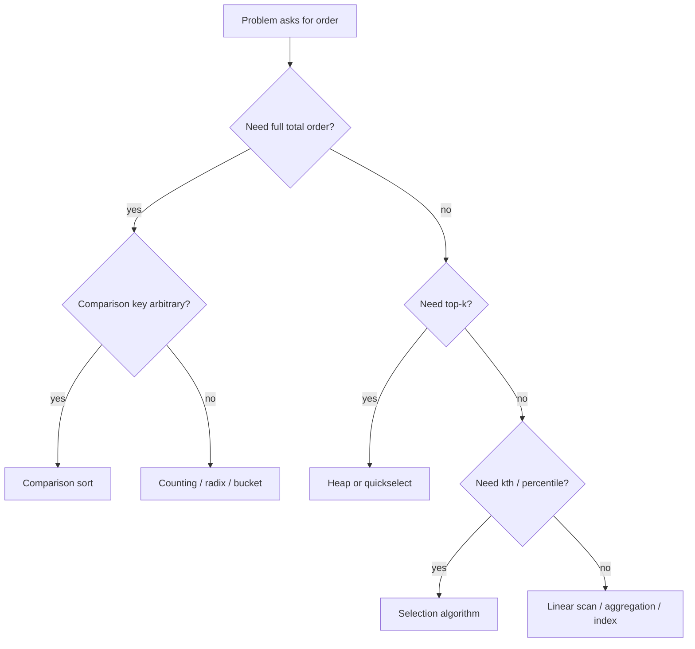
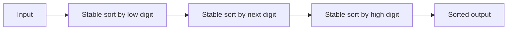
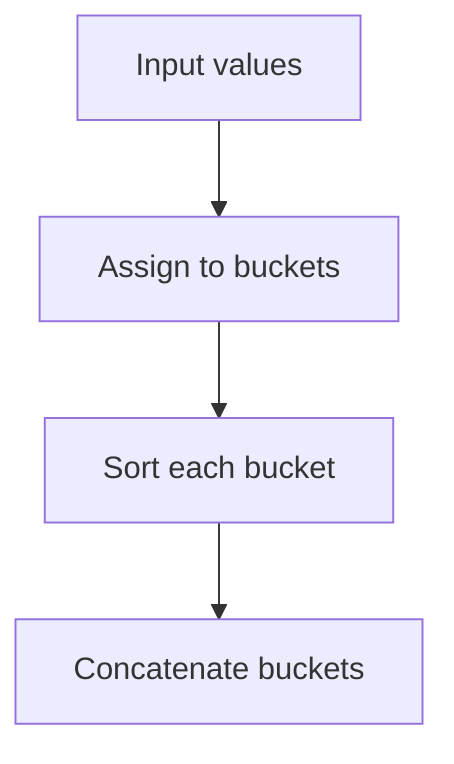
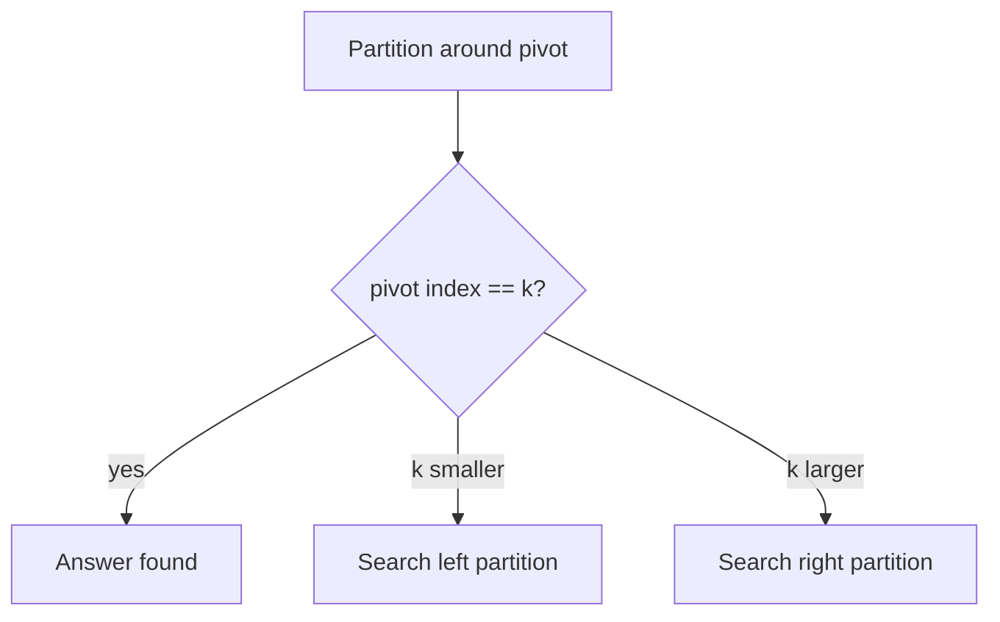
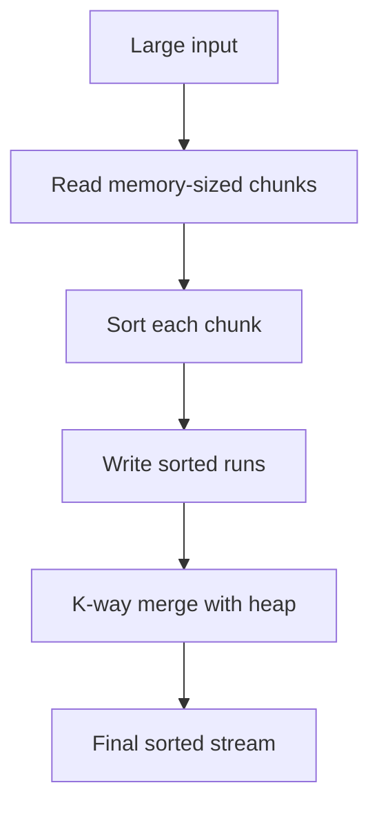

------
title: Learn Java Data Structures and Algorithms - Part 011
description: Sorting non-comparison, selection, ranking, top-k, order statistics, dan cara memilih algoritma saat full comparison sort terlalu mahal atau tidak perlu.
series: learn-java-dsa
seriesTitle: Learn Java Data Structures and Algorithms
order: 11
partTitle: Non-Comparison Sorting, Selection, and Ranking
tags:
- java
- data-structures
- algorithms
- sorting
- selection
- ranking
- top-k
- complexity
- series
date: 2026-06-27
---

# Part 011 — Non-Comparison Sorting, Selection, and Ranking

Pada part sebelumnya, kita melihat sorting berbasis comparison. Comparison sorting punya batas bawah teoretis `Ω(n log n)` untuk kasus umum karena algoritma hanya belajar informasi melalui pertanyaan seperti:

```text
apakah a lebih kecil dari b?
```

Tetapi tidak semua masalah ordering harus diselesaikan dengan comparison sort penuh.

Kadang kita punya informasi tambahan:

- key berupa integer kecil;
- key berada dalam rentang terbatas;
- key bisa dipecah menjadi digit/byte;
- data bisa dikelompokkan ke bucket;
- kita hanya butuh elemen ke-k, bukan seluruh urutan;
- kita hanya butuh top-k, bukan full sort;
- kita hanya butuh ranking relatif untuk query tertentu;
- data terlalu besar untuk memory dan harus diproses streaming atau external.

Part ini membahas teknik untuk keluar dari jebakan “sort dulu semuanya”.

Tujuannya bukan menghafal counting sort, radix sort, quickselect, atau heap top-k sebagai template. Tujuannya adalah melihat masalah sebagai kombinasi dari:

1. domain key;
2. jumlah data;
3. output yang benar-benar dibutuhkan;
4. batas memory;
5. stability requirement;
6. latency requirement;
7. update/query pattern.

---

## 1. Skill Target

Setelah part ini, kita harus mampu:

1. menjelaskan kenapa non-comparison sorting bisa melewati `O(n log n)`;
2. mengenali kapan key domain cukup terbatas untuk counting sort;
3. menulis counting sort yang stable dan aman terhadap range besar;
4. memahami radix sort sebagai repeated stable bucket pass;
5. membedakan bucket sort berbasis distribusi dari counting sort berbasis domain;
6. memilih antara full sort, heap top-k, quickselect, dan counting/radix;
7. menghitung complexity dengan memasukkan `k`, `range`, `digits`, dan memory tambahan;
8. membangun ranking/order-statistic tanpa mengurutkan semua data;
9. menghindari bug Java akibat boxing, overflow key range, dan memory explosion;
10. mendesain solusi production untuk leaderboard, percentile, top-N, dan batch ranking.

---

## 2. Mental Model: Jangan Sort Jika Output Tidak Membutuhkan Total Order

Sorting penuh menghasilkan total order semua elemen.

```text
input n elemen -> output n elemen dalam urutan lengkap
```

Banyak masalah tidak membutuhkan itu.

| Kebutuhan | Output Minimum | Algoritma yang Mungkin Lebih Baik |
|---|---:|---|
| Elemen minimum/maksimum | 1 elemen | Linear scan `O(n)` |
| Top-k kecil | k elemen | Heap size k `O(n log k)` |
| Elemen ke-k | 1 elemen | Quickselect average `O(n)` |
| Semua elemen dengan key kecil | n elemen | Counting sort `O(n + R)` |
| Integer fixed-width | n elemen | Radix sort `O(d(n + B))` |
| Distribusi kira-kira uniform | n elemen | Bucket sort average near linear |
| Query ranking berulang | rank/count | Fenwick/segment/index, nanti part range query |



Prinsip engineering-nya:

> Bayar hanya untuk informasi ordering yang dibutuhkan oleh output.

Jika output tidak membutuhkan urutan penuh, full sort sering overkill.

---

## 3. Batas Bawah Comparison Sort dan Cara Non-Comparison Menghindarinya

Comparison sort melihat input melalui comparison antar elemen. Ada `n!` kemungkinan permutation. Decision tree berbasis comparison harus membedakan permutation tersebut. Karena setiap comparison bercabang dua, tinggi decision tree minimal:

```text
log2(n!) = Ω(n log n)
```

Non-comparison sorting tidak melanggar batas ini. Ia keluar dari model tersebut.

Contoh counting sort tidak bertanya:

```text
a < b ?
```

Ia bertanya:

```text
key(a) == 17 ?
berapa banyak elemen dengan key 17?
```

Informasi key domain dipakai langsung sebagai alamat/count.

Itu berarti complexity berubah dari:

```text
O(n log n)
```

menjadi:

```text
O(n + range)
```

Tetapi ada harga:

- butuh key integer/diskret;
- butuh range yang masuk akal;
- butuh memory tambahan;
- key extractor harus jelas;
- stability butuh pass tambahan;
- tidak otomatis cocok untuk object arbitrary.

---

## 4. Counting Sort

Counting sort cocok ketika key berupa integer dalam range terbatas.

Misalnya skor ujian `0..100`, status priority `0..4`, umur `0..130`, byte value `0..255`, atau enum ordinal kecil.

### 4.1 Core Idea

Untuk setiap key, hitung jumlah elemen yang punya key itu.

```text
input:  [3, 1, 2, 3, 0]
count:  key 0 -> 1
        key 1 -> 1
        key 2 -> 1
        key 3 -> 2
output: [0, 1, 2, 3, 3]
```

Untuk primitive integer murni, output bisa dibangun dari count.

```java
static void countingSortInt(int[] a, int minKey, int maxKey) {
    if (a == null) {
        throw new IllegalArgumentException("array must not be null");
    }
    if (minKey > maxKey) {
        throw new IllegalArgumentException("minKey must be <= maxKey");
    }

    long rangeLong = (long) maxKey - minKey + 1L;
    if (rangeLong > Integer.MAX_VALUE) {
        throw new IllegalArgumentException("key range too large");
    }

    int[] count = new int[(int) rangeLong];

    for (int value : a) {
        if (value < minKey || value > maxKey) {
            throw new IllegalArgumentException("value outside declared range: " + value);
        }
        count[value - minKey]++;
    }

    int out = 0;
    for (int offset = 0; offset < count.length; offset++) {
        int value = offset + minKey;
        int frequency = count[offset];
        for (int i = 0; i < frequency; i++) {
            a[out++] = value;
        }
    }
}
```

### 4.2 Complexity

Jika:

```text
n = number of elements
R = maxKey - minKey + 1
```

maka:

```text
time  = O(n + R)
space = O(R)
```

Counting sort bagus saat `R` sebanding dengan `n` atau kecil secara absolut.

Buruk saat `R` besar walaupun `n` kecil.

Contoh buruk:

```text
n = 1000
keys distributed between 0 and 2_000_000_000
```

`O(n + R)` menjadi tidak masuk akal.

### 4.3 Stable Counting Sort untuk Object

Untuk object, kita sering butuh stability.

Misalnya kita punya event dengan `priority`, lalu ingin sort by priority tetapi mempertahankan arrival order antar event dengan priority sama.

```java
record Event(String id, int priority, long createdAtMillis) {}
```

Stable counting sort punya tiga tahap:

1. count frequency per key;
2. ubah count menjadi prefix position;
3. letakkan elemen dari kanan ke kiri.

```mermaid
flowchart TD
    A[Count frequency] --> B[Prefix sums]
    B --> C[Traverse input from right to left]
    C --> D[Place item at --position[key]]
    D --> E[Stable sorted output]
```

Implementasi generic:

```java
import java.util.function.ToIntFunction;

static <T> void stableCountingSort(
        T[] input,
        T[] output,
        int minKey,
        int maxKey,
        ToIntFunction<? super T> keyExtractor
) {
    if (input == null || output == null || keyExtractor == null) {
        throw new IllegalArgumentException("input, output, and keyExtractor must not be null");
    }
    if (input.length != output.length) {
        throw new IllegalArgumentException("input and output must have the same length");
    }
    if (minKey > maxKey) {
        throw new IllegalArgumentException("minKey must be <= maxKey");
    }

    long rangeLong = (long) maxKey - minKey + 1L;
    if (rangeLong > Integer.MAX_VALUE) {
        throw new IllegalArgumentException("key range too large");
    }

    int[] count = new int[(int) rangeLong];

    for (T item : input) {
        int key = keyExtractor.applyAsInt(item);
        if (key < minKey || key > maxKey) {
            throw new IllegalArgumentException("key outside declared range: " + key);
        }
        count[key - minKey]++;
    }

    // count[i] becomes the exclusive end position for key i.
    for (int i = 1; i < count.length; i++) {
        count[i] += count[i - 1];
    }

    // Right-to-left traversal preserves relative order for equal keys.
    for (int i = input.length - 1; i >= 0; i--) {
        T item = input[i];
        int key = keyExtractor.applyAsInt(item);
        int offset = key - minKey;
        int pos = --count[offset];
        output[pos] = item;
    }
}
```

### 4.4 Stability Invariant

Stable counting sort menaruh elemen equal-key dari kanan ke kiri ke slot terakhir yang tersedia.

Untuk dua elemen `x` dan `y`:

```text
x appears before y in input
key(x) == key(y)
```

Saat traversal dari kanan:

1. `y` diproses lebih dulu dan ditempatkan di posisi akhir untuk key itu;
2. `x` diproses setelahnya dan ditempatkan di posisi sebelumnya;
3. hasil tetap `x` sebelum `y`.

Inilah invariant stability-nya.

### 4.5 Counting Sort Decision Rule

Gunakan counting sort jika semua kondisi berikut masuk akal:

- key integer/diskret;
- range diketahui atau bisa dihitung murah;
- `R` tidak terlalu besar;
- memory `O(R)` acceptable;
- sorting by key cukup, bukan comparator arbitrary;
- stability requirement bisa dipenuhi jika perlu.

Jangan gunakan counting sort jika:

- key berupa string/object arbitrary;
- range sangat besar dan sparse;
- memory count array bisa meledak;
- key extractor mahal dan dipanggil berkali-kali tanpa caching;
- data streaming tak terbatas tanpa window.

---

## 5. Counting Sort sebagai Histogram + Prefix Sum

Cara paling baik memahami counting sort adalah:

```text
histogram -> prefix sum -> placement
```

Histogram menjawab:

```text
berapa banyak key <= k?
```

Prefix sum menjawab:

```text
di mana segment output untuk key k berakhir?
```

Contoh:

```text
input keys: [2, 0, 2, 1, 0]
count:      [2, 1, 2]
prefix:     [2, 3, 5]
```

Interpretasi prefix exclusive:

```text
key 0 occupies output indexes [0, 2)
key 1 occupies output indexes [2, 3)
key 2 occupies output indexes [3, 5)
```

Setiap placement mengurangi `prefix[key]`.

```text
pos = --prefix[key]
```

Ini pola yang akan muncul lagi di:

- radix sort;
- bucket boundary;
- rank compression;
- Fenwick tree;
- cumulative frequency tables;
- histogram-based query systems.

---

## 6. Radix Sort

Radix sort cocok saat key bisa dipecah menjadi digit fixed-width.

Contoh:

- byte dalam integer 32-bit;
- digit decimal;
- character dalam fixed-length string;
- tuple fields dengan domain terbatas.

Ada dua pendekatan utama:

| Pendekatan | Arah | Syarat Penting |
|---|---|---|
| LSD radix sort | Least significant digit ke most significant | Setiap pass harus stable |
| MSD radix sort | Most significant digit ke lower digit | Lebih mirip recursive bucket partition |

Untuk engineer Java, LSD radix sort untuk `int` non-negative adalah entry point paling jelas.

### 6.1 LSD Radix Sort Mental Model

Misalnya angka decimal:

```text
[329, 457, 657, 839, 436, 720, 355]
```

Pass 1 sort by ones digit.
Pass 2 sort by tens digit.
Pass 3 sort by hundreds digit.

Karena setiap pass stable, order digit rendah tetap tersimpan saat digit lebih tinggi diproses.



Invariant LSD:

> Setelah pass ke-i, array sudah sorted berdasarkan i digit paling rendah.

### 6.2 Radix Sort untuk Non-Negative int dengan Byte Pass

Untuk `int` non-negative, kita bisa memproses 4 byte, basis 256.

```java
static void radixSortNonNegativeInt(int[] a) {
    if (a == null) {
        throw new IllegalArgumentException("array must not be null");
    }

    int[] buffer = new int[a.length];
    final int radix = 256;
    final int mask = radix - 1;

    int[] from = a;
    int[] to = buffer;

    for (int shift = 0; shift < 32; shift += 8) {
        int[] count = new int[radix];

        for (int value : from) {
            if (value < 0) {
                throw new IllegalArgumentException("negative values are not supported by this variant");
            }
            count[(value >>> shift) & mask]++;
        }

        for (int i = 1; i < radix; i++) {
            count[i] += count[i - 1];
        }

        for (int i = from.length - 1; i >= 0; i--) {
            int value = from[i];
            int digit = (value >>> shift) & mask;
            to[--count[digit]] = value;
        }

        int[] tmp = from;
        from = to;
        to = tmp;
    }

    if (from != a) {
        System.arraycopy(from, 0, a, 0, a.length);
    }
}
```

Karena ada 4 pass tetap untuk 32-bit integer:

```text
time  = O(4(n + 256)) = O(n)
space = O(n + 256)
```

Secara asimptotik linear, tetapi constant factor, memory bandwidth, dan copy cost tetap penting.

### 6.3 Signed int Caveat

Signed integer punya urutan natural:

```text
Integer.MIN_VALUE ... -1, 0, 1 ... Integer.MAX_VALUE
```

Jika kita menafsirkan bit secara unsigned, negative value muncul setelah positive value. Salah satu teknik umum adalah flip sign bit saat mengambil key:

```java
static int sortableIntKey(int value) {
    return value ^ Integer.MIN_VALUE;
}
```

Ini memetakan signed order ke unsigned lexicographic bit order.

Namun implementasi radix signed harus konsisten di semua pass. Jangan mencampur value asli untuk sebagian pass dan transformed key untuk pass terakhir tanpa reasoning yang jelas.

### 6.4 Radix Sort untuk Object

Untuk object, radix sort biasanya butuh:

- extractor key fixed-width;
- buffer object array;
- stable counting pass per digit;
- perhatian pada reference movement;
- memory pressure `O(n)`.

Contoh ranking user by integer score:

```java
record Player(String id, int score) {}
```

Jika skor non-negative 32-bit dan data besar, kita bisa radix sort berdasarkan `score`. Tetapi untuk production Java, harus diuji terhadap `Arrays.sort` dengan comparator karena:

- comparator sort object array di JDK sangat optimized;
- radix object sort memindahkan references beberapa kali;
- cache behavior berbeda;
- key extractor bisa menjadi bottleneck;
- allocation buffer besar bisa menekan GC.

Jangan menganggap radix selalu lebih cepat hanya karena `O(n)`.

---

## 7. Bucket Sort

Bucket sort membagi data ke bucket berdasarkan range atau distribusi, lalu sort tiap bucket.

Contoh data floating point dalam `[0, 1)`:

```text
bucket index = floor(value * bucketCount)
```

Jika distribusi uniform dan bucket count proporsional dengan `n`, ukuran bucket rata-rata kecil.



### 7.1 Complexity

Worst-case bucket sort bisa buruk.

Jika semua elemen masuk satu bucket, lalu bucket disort dengan comparison sort:

```text
O(n log n)
```

Jika distribusi baik:

```text
O(n + b + sum sort(bucket_i))
```

Dengan bucket kecil, bisa mendekati linear.

### 7.2 Bucket Sort vs Counting Sort

| Aspek | Counting Sort | Bucket Sort |
|---|---|---|
| Domain | Integer/diskret | Range/distribution |
| Bucket meaning | Exact key | Interval/range |
| Output inside bucket | Identical key atau stable placement | Perlu sort lagi jika banyak value berbeda |
| Complexity driver | `R` | distribution quality |
| Failure mode | range huge | skewed distribution |

Counting sort adalah histogram exact.
Bucket sort adalah partition by approximate range.

### 7.3 Production Caveat

Bucket sort layak jika kita mengontrol distribusi atau punya statistik historis.

Contoh masuk akal:

- latency bucket untuk percentile dashboard;
- price range bucket;
- score bucket dengan bounded score;
- shard pre-partitioning;
- approximate ranking.

Contoh berisiko:

- user-generated arbitrary score;
- adversarial input;
- long-tail distribution;
- bucket count terlalu besar;
- per-bucket list allocation terlalu banyak.

---

## 8. Selection: Menemukan Elemen ke-k Tanpa Full Sort

Selection problem:

```text
find kth smallest element
```

Jika kita full sort:

```text
O(n log n)
```

Tetapi kth element bisa ditemukan average `O(n)` dengan quickselect.

### 8.1 Terminologi Rank

Gunakan definisi eksplisit:

```text
k as zero-based index in sorted order
```

Maka:

- `k = 0` berarti minimum;
- `k = n - 1` berarti maksimum;
- median untuk odd `n` adalah `k = n / 2`;
- lower median untuk even `n` bisa `k = (n - 1) / 2`;
- upper median untuk even `n` bisa `k = n / 2`.

Jangan menulis API `select(k)` tanpa menentukan apakah `k` zero-based atau one-based.

### 8.2 Quickselect Mental Model

Quicksort partition membagi array menjadi:

```text
less than pivot | pivot | greater than pivot
```

Quicksort recursive ke dua sisi.
Quickselect hanya recursive/iterative ke sisi yang mengandung rank `k`.



### 8.3 Lomuto Partition Quickselect

Lomuto mudah dipahami, walau bukan selalu paling cepat.

```java
import java.util.concurrent.ThreadLocalRandom;

static int quickselect(int[] a, int k) {
    if (a == null) {
        throw new IllegalArgumentException("array must not be null");
    }
    if (k < 0 || k >= a.length) {
        throw new IllegalArgumentException("k outside array bounds");
    }

    int left = 0;
    int right = a.length - 1;

    while (left <= right) {
        int pivotIndex = ThreadLocalRandom.current().nextInt(left, right + 1);
        pivotIndex = partition(a, left, right, pivotIndex);

        if (pivotIndex == k) {
            return a[pivotIndex];
        }
        if (k < pivotIndex) {
            right = pivotIndex - 1;
        } else {
            left = pivotIndex + 1;
        }
    }

    throw new IllegalStateException("unreachable if k is valid");
}

private static int partition(int[] a, int left, int right, int pivotIndex) {
    int pivotValue = a[pivotIndex];
    swap(a, pivotIndex, right);

    int store = left;
    for (int i = left; i < right; i++) {
        if (a[i] < pivotValue) {
            swap(a, store++, i);
        }
    }

    swap(a, store, right);
    return store;
}

private static void swap(int[] a, int i, int j) {
    if (i != j) {
        int tmp = a[i];
        a[i] = a[j];
        a[j] = tmp;
    }
}
```

### 8.4 Quickselect Complexity

Average:

```text
O(n)
```

Worst-case:

```text
O(n^2)
```

Random pivot mengurangi risiko input adversarial sederhana, tetapi tidak menghilangkan worst-case secara teoretis.

Untuk production latency yang harus deterministic, pertimbangkan:

- heap top-k `O(n log k)`;
- introselect-style fallback;
- deterministic median-of-medians secara konseptual `O(n)` worst-case tetapi constant factor besar;
- approximate quantile sketch untuk streaming, dibahas lagi di part probabilistic.

### 8.5 Partition Invariant

Setelah `partition(a, left, right, pivotIndex)` mengembalikan `p`:

```text
for every i in [left, p):  a[i] < pivot
for every i in (p, right]: a[i] >= pivot
```

Pivot berada di posisi final relatif terhadap ordering strict `<` yang dipakai partition.

Perhatikan duplicate value. Jika banyak elemen equal pivot, Lomuto two-way partition bisa tidak efisien. Untuk data dengan banyak duplicate, three-way partition lebih baik.

---

## 9. Three-Way Partition untuk Duplicate-Heavy Data

Three-way partition membagi array menjadi:

```text
< pivot | == pivot | > pivot
```

Ini sangat berguna jika banyak duplicate.

```java
static int selectWithThreeWayPartition(int[] a, int k) {
    if (a == null) {
        throw new IllegalArgumentException("array must not be null");
    }
    if (k < 0 || k >= a.length) {
        throw new IllegalArgumentException("k outside array bounds");
    }

    int left = 0;
    int right = a.length - 1;

    while (left <= right) {
        int pivot = a[ThreadLocalRandom.current().nextInt(left, right + 1)];

        int lt = left;
        int i = left;
        int gt = right;

        while (i <= gt) {
            if (a[i] < pivot) {
                swap(a, lt++, i++);
            } else if (a[i] > pivot) {
                swap(a, i, gt--);
            } else {
                i++;
            }
        }

        if (k < lt) {
            right = lt - 1;
        } else if (k > gt) {
            left = gt + 1;
        } else {
            return pivot;
        }
    }

    throw new IllegalStateException("unreachable if k is valid");
}
```

Invariant setelah partition:

```text
[left, lt)      < pivot
[lt, gt + 1)    == pivot
(gt, right]     > pivot
```

Jika `k` berada di zona equal, jawabannya langsung pivot.

---

## 10. Top-k: Heap vs Quickselect vs Full Sort

Masalah top-k:

```text
ambil k elemen terbesar atau terkecil
```

Ada beberapa strategi.

### 10.1 Full Sort

```text
sort all -> take k
```

Complexity:

```text
O(n log n)
```

Sederhana dan deterministic. Cocok jika:

- `n` kecil;
- hasil harus fully ordered;
- kode harus sangat sederhana;
- sort sudah dilakukan untuk kebutuhan lain.

### 10.2 Heap Size k

Untuk top-k terbesar, gunakan min-heap berukuran `k`.

```java
import java.util.PriorityQueue;

static int[] topKLargest(int[] values, int k) {
    if (values == null) {
        throw new IllegalArgumentException("values must not be null");
    }
    if (k < 0 || k > values.length) {
        throw new IllegalArgumentException("invalid k");
    }
    if (k == 0) {
        return new int[0];
    }

    PriorityQueue<Integer> heap = new PriorityQueue<>(k);

    for (int value : values) {
        if (heap.size() < k) {
            heap.offer(value);
        } else if (value > heap.peek()) {
            heap.poll();
            heap.offer(value);
        }
    }

    int[] result = new int[k];
    for (int i = 0; i < k; i++) {
        result[i] = heap.poll();
    }
    return result;
}
```

Complexity:

```text
time  = O(n log k)
space = O(k)
```

Cocok jika:

- `k << n`;
- input streaming;
- memory terbatas;
- hasil tidak harus langsung sorted descending;
- deterministic upper bound lebih penting daripada average linear quickselect.

Java caveat: `PriorityQueue<Integer>` boxing bisa mahal untuk data primitive besar. Untuk hot path, buat heap primitive `int[]` sendiri.

### 10.3 Quickselect + Partial Sort

Jika hasil top-k perlu ditemukan cepat:

1. pakai quickselect untuk menemukan threshold;
2. partition sehingga top-k berada di satu sisi;
3. sort hanya k elemen jika output harus ordered.

Complexity average:

```text
O(n + k log k)
```

Cocok jika:

- data batch ada di memory;
- `k` tidak sangat kecil;
- output harus top-k ordered;
- average latency acceptable.

### 10.4 Decision Matrix

| Situasi | Pilihan Default |
|---|---|
| `n` kecil | Full sort |
| `k` sangat kecil dan input besar | Heap size k |
| Batch in-memory, `k` medium/besar | Quickselect |
| Streaming infinite | Heap size k atau sketch |
| Butuh deterministic worst-case sederhana | Heap size k |
| Butuh hasil fully sorted semua elemen | Full sort |
| Key bounded kecil | Counting/radix/bucket sebelum top-k |

---

## 11. Ranking dan Order Statistics

Ranking menjawab:

```text
berapa banyak elemen yang lebih kecil / lebih besar dari x?
```

Order statistic menjawab:

```text
elemen apa yang berada pada rank k?
```

Sorting penuh adalah satu cara, tetapi bukan satu-satunya.

### 11.1 Rank dari Sorted Array

Jika data sudah sorted, rank bisa dihitung dengan binary search:

```text
rankLessThan(x) = lowerBound(x)
rankLessOrEqual(x) = upperBound(x)
```

Ini akan dibahas detail di part 012.

### 11.2 Rank dari Frequency Table

Jika key bounded, frequency table bisa memberi rank via prefix sum.

```java
final class IntFrequencyRanker {
    private final int minKey;
    private final int[] prefixExclusive;

    IntFrequencyRanker(int[] values, int minKey, int maxKey) {
        if (minKey > maxKey) {
            throw new IllegalArgumentException("minKey must be <= maxKey");
        }
        long rangeLong = (long) maxKey - minKey + 1L;
        if (rangeLong > Integer.MAX_VALUE) {
            throw new IllegalArgumentException("range too large");
        }

        this.minKey = minKey;
        int[] count = new int[(int) rangeLong];
        for (int value : values) {
            if (value < minKey || value > maxKey) {
                throw new IllegalArgumentException("value outside declared range");
            }
            count[value - minKey]++;
        }

        this.prefixExclusive = new int[count.length + 1];
        for (int i = 0; i < count.length; i++) {
            prefixExclusive[i + 1] = prefixExclusive[i] + count[i];
        }
    }

    int countLessThan(int key) {
        if (key <= minKey) {
            return 0;
        }
        int offset = Math.min(key - minKey, prefixExclusive.length - 1);
        return prefixExclusive[offset];
    }

    int countLessOrEqual(int key) {
        return countLessThan(key + 1);
    }
}
```

Ini bagus untuk static data bounded. Untuk dynamic update, nanti kita pakai Fenwick tree atau segment tree.

### 11.3 Coordinate Compression

Jika key besar tetapi jumlah unique key tidak terlalu banyak, kita bisa compress.

```text
original keys: [1000000000, -7, 42, 42]
sorted unique: [-7, 42, 1000000000]
compressed:    [2, 0, 1, 1]
```

Coordinate compression mengubah domain sparse menjadi dense `0..m-1`.

Ini sering menjadi bridge antara arbitrary integer key dan struktur seperti Fenwick tree.

---

## 12. External Sorting dan Memory-Bound Ranking

Jika data tidak muat memory, full in-memory sort tidak valid.

External merge sort pattern:

1. baca chunk yang muat memory;
2. sort chunk;
3. tulis run sorted ke disk;
4. k-way merge semua run.



Complexity tidak cukup ditulis `O(n log n)`. Untuk external sorting, biaya utama sering:

- sequential read/write;
- random I/O;
- number of passes;
- compression/decompression;
- serialization;
- heap size saat merge;
- network shuffle jika distributed.

Top-k external bisa jauh lebih murah:

- scan file sekali;
- maintain heap size k;
- output top-k.

Tidak perlu sort seluruh file.

---

## 13. Java Implementation Considerations

### 13.1 Primitive vs Boxed

`int[]` jauh berbeda dari `Integer[]` atau `List<Integer>`.

`int[]`:

- contiguous primitive values;
- no boxing;
- better locality;
- lower memory;
- easy for radix/counting.

`List<Integer>`:

- references to boxed objects;
- pointer chasing;
- allocation overhead;
- comparator/unboxing overhead;
- GC pressure.

Untuk algorithmic hot path, primitive arrays sering lebih tepat.

### 13.2 Key Extractor Cost

Untuk object sorting/ranking, key extraction bisa mahal.

Buruk:

```java
items.sort(Comparator.comparing(item -> expensiveNormalize(item.name())));
```

Comparator bisa dipanggil banyak kali. Jika key extraction mahal, decorate-sort-undecorate atau precompute key.

Untuk non-comparison sorting object, key extractor biasanya dipanggil `O(dn)` untuk radix atau `O(n)` untuk counting. Tetap ukur.

### 13.3 Memory Explosion Guard

Selalu validasi range sebelum membuat count array.

Buruk:

```java
int[] count = new int[max - min + 1];
```

Jika `max - min + 1` overflow, hasil bisa negatif atau kecil palsu.

Lebih aman:

```java
long range = (long) max - min + 1L;
if (range > Integer.MAX_VALUE) {
    throw new IllegalArgumentException("range too large");
}
```

### 13.4 Stable vs Unstable Output Contract

Jika output dipakai untuk UI, audit trail, pagination, atau deterministic replay, stability dan tie-breaker penting.

Non-deterministic equal-key order bisa menyebabkan:

- pagination duplicate/missing item;
- flaky test;
- audit diff noise;
- inconsistent cache key;
- user-visible item jumping.

Jika stability tidak dijamin oleh algoritma, tambahkan secondary key eksplisit.

---

## 14. Correctness Reasoning Patterns

### 14.1 Counting Sort Correctness

Counting sort benar jika:

1. setiap input key valid dalam `[minKey, maxKey]`;
2. `count[k]` menyimpan frekuensi key `k`;
3. prefix sum membentuk segment output yang tidak overlap;
4. setiap elemen ditempatkan tepat sekali;
5. stability dipertahankan dengan traversal kanan-ke-kiri.

### 14.2 Radix Sort Correctness

LSD radix sort benar jika:

1. setiap pass melakukan stable sort berdasarkan digit saat ini;
2. setelah pass `i`, array sorted berdasarkan `i` digit terendah;
3. pass berikutnya mempertahankan order digit rendah untuk equal digit lebih tinggi;
4. setelah semua digit diproses, seluruh key sorted.

### 14.3 Quickselect Correctness

Quickselect benar jika:

1. partition menaruh pivot di posisi final relatif terhadap subarray;
2. semua elemen kiri pivot lebih kecil;
3. semua elemen kanan pivot lebih besar atau sama;
4. jika `k == pivotIndex`, pivot adalah kth;
5. jika `k < pivotIndex`, kth pasti di kiri;
6. jika `k > pivotIndex`, kth pasti di kanan.

---

## 15. Production Design Examples

### 15.1 Leaderboard Top 100

Masalah:

```text
Dari 50 juta score, tampilkan top 100.
```

Pilihan buruk:

```text
sort 50 juta score penuh
```

Pilihan default:

```text
min-heap size 100
```

Complexity:

```text
O(n log 100)
```

Jika perlu deterministic order final, sort 100 elemen hasil heap.

### 15.2 Percentile Latency Dashboard

Masalah:

```text
Hitung p50, p95, p99 dari latency request.
```

Jika latency dibatasi dan bucketed, histogram lebih baik dari sort.

```text
latency bucket -> count -> cumulative count -> percentile bucket
```

Jika butuh exact percentile dari batch kecil, quickselect bisa cukup.

Jika streaming besar, gunakan sketch/histogram bounded.

### 15.3 Ranking Case Priority

Misalnya sistem regulatory case management punya case priority `0..5`.

Untuk menampilkan queue by priority dan preserve arrival order:

```text
stable counting sort by priority
```

Atau lebih production-oriented:

```text
6 queues, one per priority
```

Ini menghindari sorting berulang saat event masuk.

---

## 16. Common Failure Modes

### 16.1 Sorting Semua Padahal Butuh Top-k

Gejala:

```java
Arrays.sort(allScores);
return lastK(allScores, k);
```

Untuk `k << n`, ini membayar terlalu banyak.

### 16.2 Counting Sort untuk Sparse Huge Range

```text
values = [1, 2, 1_000_000_000]
```

Counting array ukuran satu miliar tidak masuk akal.

Gunakan comparison sort, coordinate compression, map frequency, atau heap/select tergantung kebutuhan.

### 16.3 Tidak Mendefinisikan Rank Duplicate

Pertanyaan ambigu:

```text
rank score 90 berapa?
```

Apakah rank berarti:

- competition rank;
- dense rank;
- count greater than;
- count greater or equal;
- first index;
- last index?

Definisikan sebelum implementasi.

### 16.4 Quickselect Merusak Input

Quickselect in-place mengubah array.

Jika input order harus dipertahankan, copy dulu:

```java
int[] copy = Arrays.copyOf(input, input.length);
int kth = quickselect(copy, k);
```

### 16.5 Heap Top-k dengan Comparator Salah

Untuk top-k terbesar, heap harus menyimpan elemen terkecil di root agar mudah dibuang.

Jika comparator dibalik tanpa sadar, hasil bisa top-k terkecil.

---

## 17. Testing Strategy

### 17.1 Counting Sort Tests

Test minimal:

- empty array;
- one element;
- all equal;
- already sorted;
- reverse sorted;
- min/max boundary;
- negative range;
- out-of-range input;
- stability with duplicate keys;
- huge invalid range guard.

### 17.2 Quickselect Tests

Bandingkan dengan sorted copy:

```java
static void assertQuickselectMatchesSort(int[] input) {
    int[] sorted = Arrays.copyOf(input, input.length);
    Arrays.sort(sorted);

    for (int k = 0; k < input.length; k++) {
        int[] copy = Arrays.copyOf(input, input.length);
        int actual = quickselect(copy, k);
        int expected = sorted[k];
        if (actual != expected) {
            throw new AssertionError("k=" + k + " expected=" + expected + " actual=" + actual);
        }
    }
}
```

Generate random tests dengan banyak duplicate, negative values, dan ukuran kecil. Ukuran kecil bagus karena bug boundary lebih mudah muncul.

### 17.3 Top-k Tests

Definisikan apakah output harus sorted.

Jika tidak harus sorted, bandingkan multiset.

Jika harus sorted, bandingkan exact array.

---

## 18. Practice Loop Menurut Kaufman

Tujuan part ini adalah membentuk automatic recognition:

```text
Apakah saya perlu full sort?
```

Latihan 20 jam tidak berarti membaca 20 jam. Latihan harus memaksa kita memilih algoritma dan membuktikan pilihan.

### 18.1 Drill 1 — Replace Full Sort

Ambil 10 problem yang biasanya diselesaikan dengan sort. Untuk tiap problem, jawab:

1. apakah output butuh full order?
2. apakah key bounded?
3. apakah top-k cukup?
4. apakah kth cukup?
5. apakah data streaming?
6. apakah stability dibutuhkan?

Tulis ulang solusi tanpa full sort jika memungkinkan.

### 18.2 Drill 2 — Implement and Compare

Implementasikan:

- counting sort primitive;
- stable counting sort object;
- radix sort int;
- quickselect;
- heap top-k primitive.

Bandingkan dengan:

- `Arrays.sort(int[])`;
- `Arrays.sort(T[], Comparator)`;
- `PriorityQueue<Integer>`.

Ukur dengan JMH jika serius. Jangan percaya microbenchmark manual.

### 18.3 Drill 3 — Failure Mode Notebook

Untuk setiap algoritma, buat 5 input yang sengaja merusak asumsi.

Contoh:

```text
counting sort: sparse huge range
quickselect: all equal
radix sort: negative signed int
heap top-k: k = 0
bucket sort: all values same bucket
```

Engineer senior tidak hanya tahu happy path. Ia tahu bagaimana solusi gagal.

---

## 19. Decision Checklist

Sebelum memilih sorting/selection/ranking algorithm, jawab:

1. Apakah output butuh semua elemen sorted?
2. Apakah hanya butuh min/max/top-k/kth?
3. Apakah key bounded, integer, atau fixed-width?
4. Apakah range kecil atau sparse huge?
5. Apakah duplicate banyak?
6. Apakah stability required?
7. Apakah input boleh dimutasi?
8. Apakah data streaming atau batch?
9. Apakah primitive atau object?
10. Apakah boxing acceptable?
11. Apakah memory tambahan `O(n)` acceptable?
12. Apakah worst-case latency harus deterministic?
13. Apakah hasil harus deterministic untuk audit/pagination?
14. Apakah key extraction mahal?
15. Apakah perlu benchmark karena constant factor dominan?

---

## 20. Summary

Non-comparison sorting dan selection mengajarkan satu prinsip penting:

> Jangan membayar `O(n log n)` jika masalah tidak membutuhkan full comparison-based total order.

Counting sort memanfaatkan bounded integer domain.
Radix sort memanfaatkan fixed-width digit representation.
Bucket sort memanfaatkan distribusi.
Quickselect memanfaatkan fakta bahwa kth element tidak membutuhkan sorting dua sisi.
Heap top-k memanfaatkan fakta bahwa kita hanya perlu mempertahankan kandidat terbaik sebanyak `k`.

Mental model yang harus dibawa ke part berikutnya:

```text
Ordering problem = required output information + key domain + update/query constraints + memory budget
```

Part berikutnya membahas binary search sebagai invariant machine. Ini penting karena ranking, lower bound, insertion point, answer-space optimization, dan banyak algoritma range/query bergantung pada binary search yang benar.
