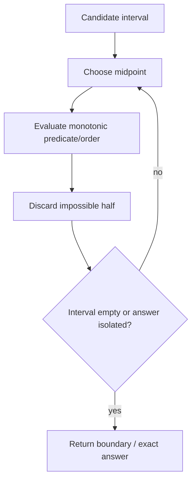
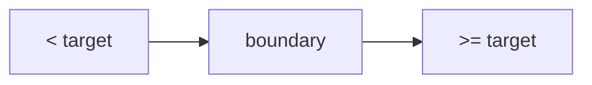

------
title: Learn Java Data Structures and Algorithms - Part 012
description: Binary search sebagai mesin invariant: lower bound, upper bound, predicate search, answer-space search, floating search, insertion point, dan bug boundary di Java.
series: learn-java-dsa
seriesTitle: Learn Java Data Structures and Algorithms
order: 12
partTitle: Binary Search as an Invariant Machine
tags:
- java
- data-structures
- algorithms
- binary-search
- invariants
- complexity
- series
date: 2026-06-27
---

# Part 012 — Binary Search as an Invariant Machine

Binary search sering terlihat mudah:

```java
while (lo <= hi) {
    int mid = (lo + hi) / 2;
    ...
}
```

Tetapi dalam praktik, binary search adalah salah satu sumber bug boundary paling produktif di DSA dan production code.

Penyebabnya bukan karena binary search sulit secara matematis. Penyebabnya adalah banyak engineer menghafal template tanpa mendefinisikan:

- interval tertutup atau half-open;
- invariant yang dipertahankan;
- arti jawaban saat elemen tidak ditemukan;
- apakah mencari exact match, lower bound, upper bound, atau first valid answer;
- apakah predicate monotonic;
- bagaimana menangani duplicate;
- bagaimana mencegah overflow midpoint;
- apakah struktur data mendukung random access murah.

Part ini membangun binary search sebagai mesin invariant.

---

## 1. Skill Target

Setelah part ini, kita harus mampu:

1. menjelaskan binary search sebagai refinement interval berdasarkan invariant;
2. membedakan exact search, lower bound, upper bound, first true, dan last false;
3. menulis binary search half-open yang bebas infinite loop;
4. memahami insertion point seperti API `Arrays.binarySearch`;
5. menangani duplicate secara eksplisit;
6. memakai binary search pada answer space, bukan hanya array;
7. mengenali monotonic predicate;
8. menghindari overflow midpoint;
9. menguji boundary secara sistematis;
10. memutuskan kapan `Collections.binarySearch` tidak cocok karena struktur list tidak random access.

---

## 2. Mental Model: Binary Search Menyempitkan Ketidaktahuan

Binary search bukan “membagi dua array”.

Binary search adalah proses menjaga ruang kandidat jawaban, lalu membuang setengah ruang yang mustahil berdasarkan predicate monotonic.



Syarat utama:

> Ada struktur monotonic yang membuat salah satu sisi bisa dibuang dengan aman.

Untuk sorted array:

```text
values before target are too small
values after target are too large
```

Untuk answer-space search:

```text
capacity too small -> infeasible
capacity large enough -> feasible
```

Untuk boolean predicate:

```text
false false false true true true
```

Binary search menemukan boundary antara dua region.

---

## 3. Jangan Mulai dari Template, Mulai dari Kontrak

Sebelum menulis loop, jawab:

1. Apa domain pencarian?
2. Apakah domain sorted atau predicate monotonic?
3. Apa yang dikembalikan jika exact match tidak ada?
4. Apakah duplicate mungkin?
5. Apakah mencari first, last, any, lower bound, atau upper bound?
6. Apakah interval inclusive atau exclusive?
7. Apakah jawaban selalu ada?
8. Apakah input boleh kosong?

Jika ini tidak jelas, kode binary search hampir pasti rapuh.

---

## 4. Exact Binary Search

Exact search mencari satu index dengan nilai sama dengan target.

Jika duplicate ada, exact search biasa boleh mengembalikan salah satu duplicate, bukan necessarily first/last.

### 4.1 Half-Open Exact Search

Gunakan interval `[lo, hi)`.

Invariant:

```text
target, jika ada, berada di [lo, hi)
```

```java
static int binarySearchExact(int[] a, int target) {
    if (a == null) {
        throw new IllegalArgumentException("array must not be null");
    }

    int lo = 0;
    int hi = a.length; // exclusive

    while (lo < hi) {
        int mid = lo + ((hi - lo) >>> 1);

        if (a[mid] < target) {
            lo = mid + 1;
        } else if (a[mid] > target) {
            hi = mid;
        } else {
            return mid;
        }
    }

    return -1;
}
```

Mengapa aman?

- Jika `a[mid] < target`, semua index `<= mid` terlalu kecil, maka `lo = mid + 1`.
- Jika `a[mid] > target`, semua index `>= mid` terlalu besar, maka `hi = mid`.
- Jika equal, selesai.
- Loop berhenti saat interval kosong.

### 4.2 Midpoint Overflow

Jangan menulis:

```java
int mid = (lo + hi) / 2;
```

Jika `lo + hi` overflow `int`, hasil bisa negatif.

Gunakan:

```java
int mid = lo + ((hi - lo) >>> 1);
```

Atau:

```java
int mid = lo + (hi - lo) / 2;
```

`>>> 1` aman jika `hi >= lo`. Untuk binary search normal, invariant ini harus selalu benar.

---

## 5. Lower Bound

Lower bound mencari index pertama `i` sehingga:

```text
a[i] >= target
```

Jika tidak ada, hasilnya `a.length`.

Ini juga disebut insertion point untuk menyisipkan target sebelum elemen yang lebih besar atau sama.

### 5.1 Lower Bound Code

```java
static int lowerBound(int[] a, int target) {
    if (a == null) {
        throw new IllegalArgumentException("array must not be null");
    }

    int lo = 0;
    int hi = a.length;

    while (lo < hi) {
        int mid = lo + ((hi - lo) >>> 1);

        if (a[mid] < target) {
            lo = mid + 1;
        } else {
            hi = mid;
        }
    }

    return lo;
}
```

### 5.2 Invariant Lower Bound

Kita mempertahankan:

```text
all indexes < lo have a[i] < target
all indexes >= hi have a[i] >= target
answer is in [lo, hi]
```

Saat loop selesai:

```text
lo == hi
```

Boundary ditemukan.



### 5.3 Duplicate Behavior

Untuk:

```text
a = [1, 2, 2, 2, 5]
target = 2
```

`lowerBound(a, 2)` mengembalikan `1`, yaitu duplicate pertama.

Untuk target tidak ada:

```text
a = [1, 2, 4, 8]
target = 5
```

`lowerBound(a, 5)` mengembalikan `3`, posisi sebelum `8`.

---

## 6. Upper Bound

Upper bound mencari index pertama `i` sehingga:

```text
a[i] > target
```

Jika tidak ada, hasilnya `a.length`.

### 6.1 Upper Bound Code

```java
static int upperBound(int[] a, int target) {
    if (a == null) {
        throw new IllegalArgumentException("array must not be null");
    }

    int lo = 0;
    int hi = a.length;

    while (lo < hi) {
        int mid = lo + ((hi - lo) >>> 1);

        if (a[mid] <= target) {
            lo = mid + 1;
        } else {
            hi = mid;
        }
    }

    return lo;
}
```

### 6.2 Counting Occurrences

Jika array sorted, jumlah kemunculan target:

```java
static int countOccurrences(int[] a, int target) {
    return upperBound(a, target) - lowerBound(a, target);
}
```

Untuk:

```text
[1, 2, 2, 2, 5]
```

```text
lowerBound(2) = 1
upperBound(2) = 4
count = 3
```

### 6.3 Range Query di Sorted Array

Jumlah elemen dalam `[leftValue, rightValue]`:

```java
static int countInClosedRange(int[] sorted, int leftValue, int rightValue) {
    if (leftValue > rightValue) {
        return 0;
    }
    return upperBound(sorted, rightValue) - lowerBound(sorted, leftValue);
}
```

Jumlah elemen dalam `[leftValue, rightValue)`:

```java
static int countInHalfOpenRange(int[] sorted, int leftValue, int rightValue) {
    if (leftValue >= rightValue) {
        return 0;
    }
    return lowerBound(sorted, rightValue) - lowerBound(sorted, leftValue);
}
```

Lower/upper bound adalah building block untuk banyak query ranking.

---

## 7. First True / Last False Predicate Search

Binary search paling umum sebenarnya bukan exact search. Bentuk paling reusable adalah boundary predicate:

```text
false false false true true true
```

Kita ingin index pertama yang `true`.

### 7.1 First True Template

Domain integer `[lo, hi)`.

Precondition:

```text
predicate is monotonic: once true, always true
```

```java
import java.util.function.IntPredicate;

static int firstTrue(int lo, int hi, IntPredicate predicate) {
    if (predicate == null) {
        throw new IllegalArgumentException("predicate must not be null");
    }
    if (lo > hi) {
        throw new IllegalArgumentException("lo must be <= hi");
    }

    while (lo < hi) {
        int mid = lo + ((hi - lo) >>> 1);
        if (predicate.test(mid)) {
            hi = mid;
        } else {
            lo = mid + 1;
        }
    }
    return lo;
}
```

Jika tidak ada `true`, hasilnya `hiOriginal`, yaitu sentinel one-past-end.

### 7.2 Last False

Jika kita punya first true, last false adalah:

```text
firstTrue - 1
```

Dengan catatan jika firstTrue mengembalikan domain start, maka tidak ada false.

### 7.3 Mapping Lower Bound ke First True

Lower bound adalah first true dengan predicate:

```text
a[i] >= target
```

```java
static int lowerBoundViaPredicate(int[] a, int target) {
    return firstTrue(0, a.length, i -> a[i] >= target);
}
```

Ini membantu mental model: binary search mencari boundary predicate monotonic.

---

## 8. Answer-Space Binary Search

Kadang kita tidak mencari index di array. Kita mencari nilai jawaban minimum/maksimum yang memenuhi constraint.

Pattern:

```text
find minimum x such that feasible(x) == true
```

Syarat:

```text
if feasible(x) is true, then feasible(x + 1), feasible(x + 2), ... also true
```

Contoh:

- minimum capacity untuk mengirim paket dalam D hari;
- minimum speed untuk selesai sebelum deadline;
- minimum maximum partition sum;
- minimum radius coverage;
- smallest threshold satisfying count condition.

### 8.1 Example: Minimum Capacity

Masalah:

```text
Diberikan weights dan jumlah hari D.
Cari kapasitas minimum kapal agar semua paket bisa dikirim berurutan dalam <= D hari.
```

Predicate:

```text
canShip(capacity)
```

Monotonic:

```text
Jika capacity C cukup, capacity lebih besar juga cukup.
```

Boundary:

```text
false false false true true true
```

Implementation:

```java
static int minShipCapacity(int[] weights, int days) {
    if (weights == null || weights.length == 0) {
        throw new IllegalArgumentException("weights must not be empty");
    }
    if (days <= 0) {
        throw new IllegalArgumentException("days must be positive");
    }

    int lo = 0;
    int hi = 0;
    for (int w : weights) {
        if (w < 0) {
            throw new IllegalArgumentException("weight must not be negative");
        }
        lo = Math.max(lo, w); // capacity cannot be below max item
        hi += w;             // one-day capacity upper bound
    }

    while (lo < hi) {
        int mid = lo + ((hi - lo) >>> 1);
        if (canShipWithinDays(weights, days, mid)) {
            hi = mid;
        } else {
            lo = mid + 1;
        }
    }

    return lo;
}

private static boolean canShipWithinDays(int[] weights, int days, int capacity) {
    int usedDays = 1;
    int current = 0;

    for (int w : weights) {
        if (current + w <= capacity) {
            current += w;
        } else {
            usedDays++;
            current = w;
            if (usedDays > days) {
                return false;
            }
        }
    }

    return true;
}
```

### 8.2 Answer-Space Complexity

Jika predicate cost `P` dan search range size `R`:

```text
time = O(P log R)
```

Untuk example shipping:

```text
P = O(n)
R = sum(weights) - max(weights) + 1
```

Maka:

```text
O(n log R)
```

Ini sering lebih baik dari brute force over all capacities.

---

## 9. Binary Search on Real Numbers

Untuk floating point, kita biasanya tidak mencari equality. Kita mencari approximation dalam epsilon atau fixed iterations.

Contoh square root:

```java
static double sqrtApprox(double x) {
    if (x < 0.0) {
        throw new IllegalArgumentException("x must be non-negative");
    }
    if (x == 0.0 || x == 1.0) {
        return x;
    }

    double lo = 0.0;
    double hi = Math.max(1.0, x);

    for (int iter = 0; iter < 100; iter++) {
        double mid = lo + (hi - lo) / 2.0;
        if (mid <= x / mid) { // avoids mid * mid overflow for huge x
            lo = mid;
        } else {
            hi = mid;
        }
    }

    return lo;
}
```

Untuk double, fixed iteration sering lebih predictable daripada `while (hi - lo > eps)` karena precision behavior bisa tricky pada nilai sangat besar/kecil.

---

## 10. Java Built-in Binary Search APIs

Java menyediakan binary search di `Arrays` dan `Collections`.

### 10.1 Arrays.binarySearch

Untuk array sorted, `Arrays.binarySearch` mengembalikan:

- index jika key ditemukan;
- `-(insertion point) - 1` jika tidak ditemukan.

Insertion point adalah posisi tempat key bisa dimasukkan agar array tetap sorted.

Decode pattern:

```java
static int insertionPointFromArraysBinarySearchResult(int result) {
    return result >= 0 ? result : -result - 1;
}
```

Contoh:

```text
a = [10, 20, 40]
search 30 -> result = -3
insertion point = 2
```

Karena:

```text
-result - 1 = -(-3) - 1 = 2
```

### 10.2 Duplicate Caveat

Built-in exact binary search tidak menjamin mengembalikan first duplicate. Jika butuh first/last occurrence, pakai lower/upper bound sendiri.

### 10.3 Collections.binarySearch

`Collections.binarySearch` bekerja pada `List`, tetapi binary search mengasumsikan akses tengah murah. Untuk `ArrayList`, random access murah. Untuk `LinkedList`, positional access mahal.

Secara engineering:

- gunakan `ArrayList` atau array untuk binary search hot path;
- hindari binary search pada linked list;
- jika data di linked structure, pertimbangkan convert ke array/list random access atau gunakan struktur lain.

---

## 11. Binary Search with Comparator and Objects

Untuk object sorted by comparator, lower bound perlu comparator yang sama dengan sorting.

```java
import java.util.Comparator;
import java.util.List;

static <T> int lowerBound(List<T> list, T target, Comparator<? super T> comparator) {
    if (list == null || comparator == null) {
        throw new IllegalArgumentException("list and comparator must not be null");
    }

    int lo = 0;
    int hi = list.size();

    while (lo < hi) {
        int mid = lo + ((hi - lo) >>> 1);
        if (comparator.compare(list.get(mid), target) < 0) {
            lo = mid + 1;
        } else {
            hi = mid;
        }
    }

    return lo;
}
```

Caveat:

- comparator harus konsisten dengan sort order list;
- list sebaiknya random access;
- comparator harus total/transitive;
- jangan search dengan comparator berbeda dari comparator yang dipakai sort.

Jika list sorted by `lastName`, jangan binary search by `id`.

---

## 12. Monotonic Predicate Design

Binary search answer-space gagal jika predicate tidak monotonic.

### 12.1 Monotonic Good

```text
capacity enough to ship in D days
```

Jika capacity cukup, capacity lebih besar juga cukup.

```text
false false false true true true
```

### 12.2 Non-Monotonic Bad

```text
isPrime(x)
```

Pattern:

```text
false true true false true false ...
```

Binary search tidak bisa membuang setengah domain secara aman.

### 12.3 Hidden Non-Monotonic Bugs

Predicate terlihat monotonic tetapi implementasinya tidak karena overflow.

Contoh buruk:

```java
return mid * mid >= x;
```

Jika `mid * mid` overflow, predicate bisa berubah tidak monotonic.

Gunakan division:

```java
return mid >= (x + mid - 1) / mid;
```

atau `long` jika cukup.

---

## 13. Closed Interval vs Half-Open Interval

Dua gaya umum:

### 13.1 Closed `[lo, hi]`

```java
while (lo <= hi) {
    int mid = lo + ((hi - lo) >>> 1);
    ...
}
```

Update biasanya:

```java
lo = mid + 1;
hi = mid - 1;
```

Cocok untuk exact search.

### 13.2 Half-Open `[lo, hi)`

```java
while (lo < hi) {
    int mid = lo + ((hi - lo) >>> 1);
    ...
}
```

Update biasanya:

```java
lo = mid + 1;
hi = mid;
```

Cocok untuk boundary search.

### 13.3 Recommendation

Untuk seri ini, default gunakan half-open untuk lower/upper/firstTrue karena:

- empty interval natural: `[x, x)`;
- return one-past-end natural;
- insertion point natural;
- update `hi = mid` tidak kehilangan kandidat;
- lebih konsisten dengan Java range `[fromIndex, toIndex)`.

---

## 14. Debugging Binary Search dengan Trace Invariant

Saat binary search salah, jangan hanya ganti `<=` menjadi `<` secara trial-and-error.

Tulis trace:

```text
lo, hi, mid, value/predicate, decision
```

Contoh lower bound:

```text
a = [1, 2, 2, 2, 5], target = 2
lo=0 hi=5 mid=2 a[mid]=2 -> hi=2
lo=0 hi=2 mid=1 a[mid]=2 -> hi=1
lo=0 hi=1 mid=0 a[mid]=1 -> lo=1
return 1
```

Invariant tetap benar:

```text
indexes < lo are < target
indexes >= hi are >= target
```

Jika trace melanggar invariant, update rule salah.

---

## 15. Boundary Test Matrix

Binary search harus diuji pada input kecil.

Untuk lower/upper bound:

| Array | Target | Expected Lower | Expected Upper |
|---|---:|---:|---:|
| `[]` | `5` | `0` | `0` |
| `[5]` | `5` | `0` | `1` |
| `[5]` | `4` | `0` | `0` |
| `[5]` | `6` | `1` | `1` |
| `[1,2,3]` | `0` | `0` | `0` |
| `[1,2,3]` | `4` | `3` | `3` |
| `[1,2,2,2,3]` | `2` | `1` | `4` |
| `[2,2,2]` | `2` | `0` | `3` |

Small cases catch most boundary bugs.

---

## 16. Common Failure Modes

### 16.1 Infinite Loop

Bias bug:

```java
while (lo < hi) {
    int mid = (lo + hi) / 2;
    if (predicate(mid)) {
        hi = mid;
    } else {
        lo = mid; // bug: no progress when mid == lo
    }
}
```

If keeping `mid` excluded from false side, use:

```java
lo = mid + 1;
```

### 16.2 Wrong Duplicate Semantics

Exact binary search returns arbitrary duplicate.

If requirement says first occurrence, use lower bound.
If requirement says last occurrence, use upper bound minus one.

```java
int last = upperBound(a, target) - 1;
if (last >= 0 && a[last] == target) {
    return last;
}
return -1;
```

### 16.3 Searching Unsorted Data

Binary search has no meaning on unsorted data unless predicate monotonic by some other structure.

Sorting once then binary-searching many times can be excellent.
Sorting for one query might be overkill.

### 16.4 Comparator Mismatch

```java
people.sort(Comparator.comparing(Person::lastName));
// Later:
binarySearchById(people, id); // invalid
```

The search order must match the sorted order.

### 16.5 Overflow in Answer Predicate

```java
if (mid * mid >= x) ...
```

For large `mid`, overflow breaks monotonicity.

### 16.6 Wrong Search Bounds

Answer-space search needs valid bounds.

For minimum ship capacity:

```text
lo = max(weights)
hi = sum(weights)
```

If `lo` too low, predicate may still work but wastes iterations.
If `hi` not guaranteed feasible, binary search may return invalid answer.

---

## 17. Binary Search and Ranking

Part 011 introduced ranking. Binary search provides exact rank query over sorted arrays.

Definitions:

```text
countLessThan(x)      = lowerBound(x)
countLessOrEqual(x)   = upperBound(x)
countGreaterThan(x)   = n - upperBound(x)
countGreaterOrEqual(x)= n - lowerBound(x)
```

Example:

```java
static int countGreaterThan(int[] sorted, int target) {
    return sorted.length - upperBound(sorted, target);
}

static int countGreaterOrEqual(int[] sorted, int target) {
    return sorted.length - lowerBound(sorted, target);
}
```

This is the bridge from sorting to range query systems.

---

## 18. Binary Search vs Hash Lookup vs Tree Lookup

Binary search is not always the best lookup.

| Structure | Lookup | Ordered query | Insert/update |
|---|---:|---:|---:|
| Sorted array | `O(log n)` | Good | `O(n)` insert |
| HashMap | Average `O(1)` | No order | Average `O(1)` |
| TreeMap | `O(log n)` | Good | `O(log n)` |
| ArrayList unsorted | `O(n)` | No | append cheap |

Use sorted array + binary search when:

- data mostly read-only;
- batch build acceptable;
- memory locality matters;
- range/rank queries matter;
- update frequency low.

Use `HashMap` when exact key lookup dominates and order is irrelevant.
Use `TreeMap` when dynamic ordered operations dominate.

---

## 19. Production Example: Feature Flag Rollout Buckets

Suppose users are assigned a hash bucket `0..9999`. A rollout threshold controls activation.

```text
enabled if bucket < threshold
```

If we need count users enabled for many thresholds and buckets sorted, lower/upper bound can answer counts quickly.

```java
static int countEnabledUsers(int[] sortedBuckets, int thresholdExclusive) {
    return lowerBound(sortedBuckets, thresholdExclusive);
}
```

Because count of bucket `< threshold` is lower bound of threshold.

### Why This Matters

Instead of scanning all users for each threshold query:

```text
O(nq)
```

Sort once:

```text
O(n log n)
```

Answer each query:

```text
O(log n)
```

Total:

```text
O(n log n + q log n)
```

Jika `q` besar, ini jauh lebih baik.

---

## 20. Production Example: Minimum Safe Rate

Misalnya kita butuh minimum processing rate agar backlog selesai sebelum deadline.

Predicate:

```text
canFinish(rate)
```

Jika rate cukup, rate lebih tinggi juga cukup.

```java
static long minProcessingRate(long[] jobs, long deadlineSeconds) {
    if (jobs == null || jobs.length == 0) {
        throw new IllegalArgumentException("jobs must not be empty");
    }
    if (deadlineSeconds <= 0) {
        throw new IllegalArgumentException("deadlineSeconds must be positive");
    }

    long lo = 1;
    long hi = 1;

    while (!canFinish(jobs, deadlineSeconds, hi)) {
        if (hi > Long.MAX_VALUE / 2) {
            throw new IllegalArgumentException("no feasible rate within long range");
        }
        hi *= 2;
    }

    while (lo < hi) {
        long mid = lo + ((hi - lo) >>> 1);
        if (canFinish(jobs, deadlineSeconds, mid)) {
            hi = mid;
        } else {
            lo = mid + 1;
        }
    }

    return lo;
}

private static boolean canFinish(long[] jobs, long deadlineSeconds, long rate) {
    long totalSeconds = 0;
    for (long job : jobs) {
        if (job < 0) {
            throw new IllegalArgumentException("job size must not be negative");
        }
        long seconds = (job + rate - 1) / rate; // ceil(job / rate)
        if (Long.MAX_VALUE - totalSeconds < seconds) {
            return false;
        }
        totalSeconds += seconds;
        if (totalSeconds > deadlineSeconds) {
            return false;
        }
    }
    return true;
}
```

This example shows a common pattern:

- find feasible upper bound by doubling;
- binary search between known impossible/possible boundary;
- guard arithmetic overflow;
- keep predicate monotonic.

---

## 21. Practice Loop Menurut Kaufman

Binary search mastery comes from boundary repetition, not reading.

### 21.1 Drill 1 — Write from Invariant

For each function, write invariant before code:

1. exact search;
2. lower bound;
3. upper bound;
4. first true;
5. last false;
6. count in range;
7. minimum feasible answer;
8. maximum feasible answer.

No template allowed until invariant is written.

### 21.2 Drill 2 — Boundary Table First

Before implementation, create expected output table for:

- empty input;
- one element;
- target below all;
- target above all;
- target at first;
- target at last;
- all duplicates;
- no duplicates;
- duplicate block in middle.

Then code.

### 21.3 Drill 3 — Convert Problems to Predicate

Take 10 problems and express as:

```text
find first x such that P(x) is true
```

If you cannot make `P` monotonic, binary search is probably not valid.

---

## 22. Self-Correction Checklist

Before accepting binary search code, verify:

1. Domain is sorted or predicate monotonic.
2. Interval convention is explicit.
3. Loop condition matches interval convention.
4. Midpoint cannot overflow.
5. Each branch makes progress.
6. No candidate answer is discarded incorrectly.
7. Empty input behavior is defined.
8. Duplicate behavior is defined.
9. Not-found behavior is defined.
10. Return value is insertion point/boundary/index as promised.
11. Built-in API return encoding is decoded correctly.
12. Comparator matches sorted order.
13. Predicate arithmetic cannot overflow.
14. Test includes boundary cases.
15. Complexity includes predicate cost.

---

## 23. Summary

Binary search is not a template. It is an invariant machine.

The core shape is:

```text
maintain candidate interval
choose midpoint
use monotonic information
remove impossible side
return boundary
```

Exact search is only one variant. Lower bound, upper bound, first true, last false, insertion point, ranking, and answer-space optimization are often more useful in real engineering.

The mental model to carry forward:

```text
Binary search finds a boundary between two monotonic regions.
```

Part berikutnya masuk ke prefix, difference array, dan Fenwick tree. Di sana, binary search dan cumulative count akan bertemu lagi dalam bentuk range query dan frequency-ranking systems.
