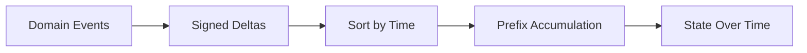
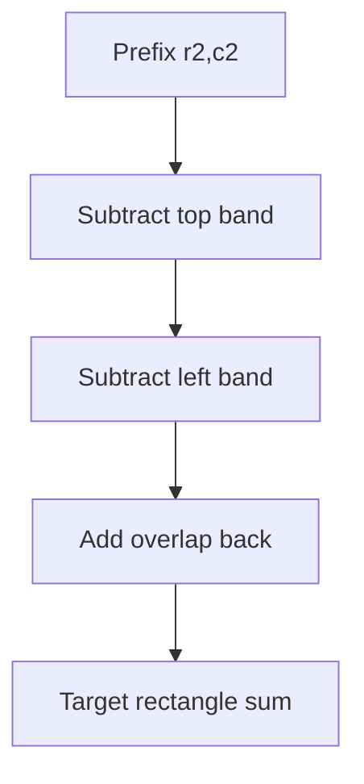
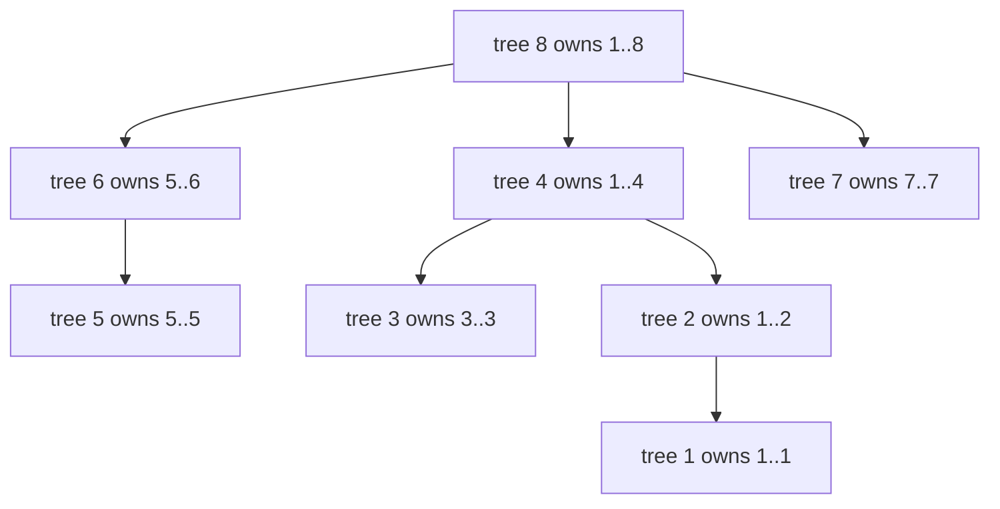
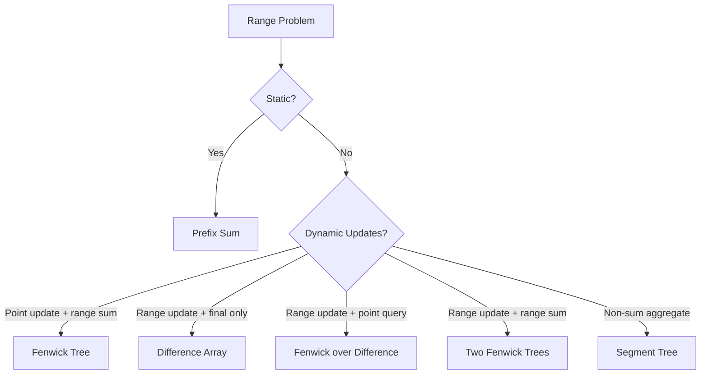

------
title: Learn Java Data Structures and Algorithms - Part 013
description: Prefix sums, difference arrays, 2D prefix, Fenwick trees, range update/query transformations, invariants, Java implementation, and production trade-offs.
series: learn-java-dsa
seriesTitle: Learn Java Data Structures and Algorithms
order: 13
partTitle: Prefix, Difference, and Fenwick Trees
tags:
- java
- data-structures
- algorithms
- dsa
- prefix-sum
- fenwick-tree
- binary-indexed-tree
- range-query
- series
date: 2026-06-27
---

# Part 013 — Prefix, Difference, and Fenwick Trees

This part builds the first serious range-query toolkit.

The goal is not to memorize three unrelated tricks:

- prefix sums,
- difference arrays,
- Fenwick trees.

The goal is to understand one recurring idea:

> Many expensive range operations become cheap when we store a transformed view of the data whose invariant matches the query pattern.

A senior engineer should be able to look at a workload like this:

```text
10 million events
500 thousand range updates
2 million range sum queries
memory budget: 256 MB
latency budget: p99 < 5 ms per request
```

and reason about the right structure before writing code.

This part gives that capability.

---

## 1. Kaufman Skill Target

Following the Kaufman learning loop, we deconstruct the skill into small operational abilities.

After this part, you should be able to:

1. Convert repeated range sum queries into `O(1)` queries using prefix sums.
2. Convert repeated range increment updates into `O(1)` updates using difference arrays.
3. Use 2D prefix sums for submatrix queries.
4. Use a Fenwick tree for dynamic prefix/range sums with `O(log n)` update and query.
5. Derive Fenwick tree ownership ranges from binary representation.
6. Implement point update + range query, range update + point query, and range update + range query.
7. Avoid off-by-one, overflow, invalid index, and mutable-state bugs in Java implementations.
8. Choose between prefix array, difference array, Fenwick tree, and segment tree based on workload shape.

The practice objective is simple:

> Given a range-query problem, classify it by update/query pattern and select the cheapest structure whose invariant supports that pattern.

---

## 2. The Core Range Problem

Assume an array:

```text
A = [a0, a1, a2, ..., a(n-1)]
```

Typical operations:

```text
pointSet(i, value)
pointAdd(i, delta)
rangeAdd(l, r, delta)
rangeSum(l, r)
rangeMin(l, r)
rangeMax(l, r)
rangeCount(l, r)
```

This part focuses mostly on sum-like operations.

Why sum first?

Because addition has useful algebraic properties:

| Property | Meaning | Why It Matters |
|---|---|---|
| Associative | `(a + b) + c = a + (b + c)` | We can group ranges. |
| Identity | `a + 0 = a` | Empty contribution is safe. |
| Inverse | `a - a = 0` | We can subtract prefixes. |
| Commutative | `a + b = b + a` | Order does not matter for aggregation. |

Prefix sums depend heavily on the inverse property.

For example:

```text
sum(l, r) = prefix(r) - prefix(l)
```

This works for addition because subtraction exists.

It does not work the same way for `min`:

```text
min(l, r) != prefixMin(r) - prefixMin(l)
```

That single fact explains why prefix sums solve range sum but not general range minimum queries.

---

## 3. Workload Classification

Before choosing a data structure, classify the workload.

| Workload | Good Structure | Update | Query | Notes |
|---|---:|---:|---:|---|
| Static array, many range sums | Prefix sum | none | `O(1)` | Best possible for immutable data. |
| Many range adds, final materialization only | Difference array | `O(1)` | final `O(n)` | Great for batch processing. |
| Point updates, range sums | Fenwick tree | `O(log n)` | `O(log n)` | Simple, compact, fast. |
| Range adds, point queries | Difference Fenwick | `O(log n)` | `O(log n)` | Dynamic version of diff array. |
| Range adds, range sums | Two Fenwick trees | `O(log n)` | `O(log n)` | Requires algebraic derivation. |
| Range min/max with updates | Segment tree | `O(log n)` | `O(log n)` | Covered in Part 014. |

The mistake to avoid:

> Do not reach for segment tree before checking if prefix/difference/Fenwick is enough.

Segment trees are more general, but they are also more code, more bug surface, and usually worse constant factors.

---

## 4. Prefix Sums

### 4.1 Mental Model

A prefix sum stores cumulative history.

For zero-based Java arrays, the cleanest convention is:

```text
prefix[0] = 0
prefix[i + 1] = A[0] + A[1] + ... + A[i]
```

So `prefix` has length `n + 1`.

Then half-open range sum is:

```text
sum(l, r) = A[l] + A[l+1] + ... + A[r-1]
          = prefix[r] - prefix[l]
```

Use half-open ranges `[l, r)` wherever possible.

They compose better:

```text
[0, 3) + [3, 7) = [0, 7)
length([l, r)) = r - l
empty range = [x, x)
```

### 4.2 Invariant

For every `i` in `[0, n]`:

```text
prefix[i] = sum of A[0..i)
```

This is the only invariant you need.

If that invariant holds, range query correctness follows immediately:

```text
prefix[r] = A[0] + ... + A[l-1] + A[l] + ... + A[r-1]
prefix[l] = A[0] + ... + A[l-1]

prefix[r] - prefix[l] = A[l] + ... + A[r-1]
```

### 4.3 Java Implementation

```java
import java.util.Objects;

public final class PrefixSums {
    private final long[] prefix;

    public PrefixSums(int[] values) {
        Objects.requireNonNull(values, "values");
        this.prefix = new long[values.length + 1];

        for (int i = 0; i < values.length; i++) {
            prefix[i + 1] = prefix[i] + values[i];
        }
    }

    public int size() {
        return prefix.length - 1;
    }

    public long rangeSum(int leftInclusive, int rightExclusive) {
        checkRange(leftInclusive, rightExclusive);
        return prefix[rightExclusive] - prefix[leftInclusive];
    }

    private void checkRange(int leftInclusive, int rightExclusive) {
        int n = size();
        if (leftInclusive < 0 || rightExclusive < leftInclusive || rightExclusive > n) {
            throw new IndexOutOfBoundsException(
                "Invalid range [" + leftInclusive + ", " + rightExclusive + ") for size " + n
            );
        }
    }
}
```

Why `long[]`, not `int[]`?

Because sums overflow easily.

Example:

```text
n = 1_000_000
A[i] = 10_000
sum = 10_000_000_000
```

That does not fit into `int`.

For production code, assume aggregation may exceed individual element type.

### 4.4 Complexity

| Operation | Complexity |
|---|---:|
| Build | `O(n)` |
| Range sum | `O(1)` |
| Space | `O(n)` |
| Point update on original array | `O(n)` to rebuild affected suffix |

Prefix sums are excellent when data is immutable or rebuilt in batches.

They are bad when arbitrary updates happen between queries.

---

## 5. Prefix Sums as Event Compression

Prefix sums are not only for arrays.

They are useful whenever ordered events accumulate.

Example: compute active case count per day.

Events:

```text
case opened at day 2
case opened at day 5
case closed at day 8
```

Convert to deltas:

```text
day 2: +1
day 5: +1
day 8: -1
```

Prefix over deltas gives active count.



This is the same idea as a finite-state audit projection:

> Store changes, then accumulate them into state.

---

## 6. Difference Arrays

### 6.1 Mental Model

A difference array stores changes between adjacent values.

Given:

```text
A = [5, 5, 5, 5, 5]
```

The difference array `D` can be defined as:

```text
D[0] = A[0]
D[i] = A[i] - A[i - 1]
```

So:

```text
D = [5, 0, 0, 0, 0]
```

If we add `+3` to range `[1, 4)`:

```text
A becomes [5, 8, 8, 8, 5]
```

Instead of changing three cells in `A`, change only two boundaries in `D`:

```text
D[1] += 3
D[4] -= 3
```

Now:

```text
D = [5, 3, 0, 0, -3]
```

Prefixing `D` reconstructs `A`:

```text
[5, 8, 8, 8, 5]
```

### 6.2 Invariant

For every `i`:

```text
A[i] = D[0] + D[1] + ... + D[i]
```

Or:

```text
A = prefix(D)
```

Range update `[l, r)` by `delta`:

```text
D[l] += delta
D[r] -= delta, if r < n
```

Why this works:

- At `l`, the prefix begins including `delta`.
- At `r`, the prefix stops including `delta`.

### 6.3 Java Implementation

```java
import java.util.Arrays;
import java.util.Objects;

public final class DifferenceArray {
    private final long[] diff;

    public DifferenceArray(int size) {
        if (size < 0) {
            throw new IllegalArgumentException("size must be non-negative");
        }
        this.diff = new long[size + 1]; // sentinel simplifies r == n
    }

    public DifferenceArray(int[] initial) {
        Objects.requireNonNull(initial, "initial");
        this.diff = new long[initial.length + 1];

        if (initial.length > 0) {
            diff[0] = initial[0];
            for (int i = 1; i < initial.length; i++) {
                diff[i] = (long) initial[i] - initial[i - 1];
            }
        }
    }

    public int size() {
        return diff.length - 1;
    }

    public void add(int leftInclusive, int rightExclusive, long delta) {
        checkRange(leftInclusive, rightExclusive);
        diff[leftInclusive] += delta;
        diff[rightExclusive] -= delta;
    }

    public long[] materialize() {
        long[] values = new long[size()];
        long running = 0;
        for (int i = 0; i < values.length; i++) {
            running += diff[i];
            values[i] = running;
        }
        return values;
    }

    private void checkRange(int leftInclusive, int rightExclusive) {
        int n = size();
        if (leftInclusive < 0 || rightExclusive < leftInclusive || rightExclusive > n) {
            throw new IndexOutOfBoundsException(
                "Invalid range [" + leftInclusive + ", " + rightExclusive + ") for size " + n
            );
        }
    }
}
```

The `n + 1` sentinel avoids a branch for `rightExclusive == n`.

Without sentinel:

```java
if (rightExclusive < n) {
    diff[rightExclusive] -= delta;
}
```

With sentinel, the stop marker always exists.

### 6.4 Complexity

| Operation | Complexity |
|---|---:|
| Range add | `O(1)` |
| Materialize final array | `O(n)` |
| Point query without materialization | `O(n)` unless prefix maintained |
| Range sum query | Not directly cheap |

Difference arrays are ideal for batch updates.

They are not enough when queries interleave with updates.

---

## 7. 2D Prefix Sums

### 7.1 Mental Model

For a matrix `A[rows][cols]`, define:

```text
prefix[r + 1][c + 1] = sum of rectangle A[0..r][0..c]
```

More precisely:

```text
prefix[i][j] = sum of A[0..i)[0..j)
```

Then rectangle sum `[r1, r2) x [c1, c2)` is:

```text
prefix[r2][c2]
- prefix[r1][c2]
- prefix[r2][c1]
+ prefix[r1][c1]
```

The last term is added back because it was subtracted twice.



### 7.2 Java Implementation

```java
import java.util.Objects;

public final class PrefixSums2D {
    private final long[][] prefix;
    private final int rows;
    private final int cols;

    public PrefixSums2D(int[][] matrix) {
        Objects.requireNonNull(matrix, "matrix");
        this.rows = matrix.length;
        this.cols = rows == 0 ? 0 : matrix[0].length;

        for (int r = 0; r < rows; r++) {
            if (matrix[r].length != cols) {
                throw new IllegalArgumentException("matrix must be rectangular");
            }
        }

        this.prefix = new long[rows + 1][cols + 1];

        for (int r = 0; r < rows; r++) {
            for (int c = 0; c < cols; c++) {
                prefix[r + 1][c + 1] = matrix[r][c]
                    + prefix[r][c + 1]
                    + prefix[r + 1][c]
                    - prefix[r][c];
            }
        }
    }

    public long rectangleSum(int r1, int c1, int r2, int c2) {
        checkRectangle(r1, c1, r2, c2);
        return prefix[r2][c2]
            - prefix[r1][c2]
            - prefix[r2][c1]
            + prefix[r1][c1];
    }

    private void checkRectangle(int r1, int c1, int r2, int c2) {
        if (r1 < 0 || c1 < 0 || r2 < r1 || c2 < c1 || r2 > rows || c2 > cols) {
            throw new IndexOutOfBoundsException(
                "Invalid rectangle [" + r1 + "," + r2 + ") x [" + c1 + "," + c2 + ")"
            );
        }
    }
}
```

### 7.3 Memory Warning

A `long[][]` in Java is an array of row references, not a flat 2D block.

For very large matrices, a flat array is usually better:

```java
long[] prefix = new long[(rows + 1) * (cols + 1)];

int idx(int r, int c) {
    return r * (cols + 1) + c;
}
```

Advantages:

- fewer objects,
- better locality,
- less GC metadata,
- faster sequential traversal.

Use `long[][]` for clarity and modest sizes.
Use flat arrays for performance-sensitive large matrices.

---

## 8. Fenwick Tree / Binary Indexed Tree

### 8.1 The Problem It Solves

Prefix sums are great for static arrays.

But suppose operations interleave:

```text
add index 5 by +7
query sum [2, 10)
add index 3 by -1
query sum [0, 6)
```

A normal prefix array breaks because one point update changes all later prefixes.

Fenwick tree solves this by storing selected partial prefixes.

It supports:

```text
point add:     O(log n)
prefix sum:    O(log n)
range sum:     O(log n)
space:         O(n)
```

The structure is compact and often faster than a segment tree for sum-like operations.

### 8.2 One-Based Indexing

Fenwick trees are easiest with one-based indices.

Let internal index `i` be in `[1, n]`.

The lowest set bit is:

```java
int lowbit = i & -i;
```

Examples:

| `i` | Binary | `i & -i` | Owned Length |
|---:|---:|---:|---:|
| 1 | `0001` | 1 | 1 |
| 2 | `0010` | 2 | 2 |
| 3 | `0011` | 1 | 1 |
| 4 | `0100` | 4 | 4 |
| 5 | `0101` | 1 | 1 |
| 6 | `0110` | 2 | 2 |
| 7 | `0111` | 1 | 1 |
| 8 | `1000` | 8 | 8 |

Fenwick node `tree[i]` owns this range:

```text
(i - lowbit(i), i]
```

Using one-based internal coordinates.

Example:

| `i` | Owns |
|---:|---|
| 1 | `(0, 1]` |
| 2 | `(0, 2]` |
| 3 | `(2, 3]` |
| 4 | `(0, 4]` |
| 5 | `(4, 5]` |
| 6 | `(4, 6]` |
| 7 | `(6, 7]` |
| 8 | `(0, 8]` |



This diagram is conceptual, not the actual pointer layout.
Fenwick tree is stored in one flat array.

### 8.3 Prefix Query

To compute prefix sum `[1, i]`, repeatedly remove the last owned block:

```text
sum += tree[i]
i -= lowbit(i)
```

Example for `i = 13`:

```text
13 = 1101b, lowbit 1 -> include tree[13], go to 12
12 = 1100b, lowbit 4 -> include tree[12], go to 8
 8 = 1000b, lowbit 8 -> include tree[8],  go to 0
```

The prefix is decomposed into disjoint ranges.

### 8.4 Point Add

To add `delta` at position `i`, update every Fenwick node whose owned range includes `i`:

```text
tree[i] += delta
i += lowbit(i)
```

This moves upward to larger ranges.

### 8.5 Java Implementation: Point Add + Range Sum

External API uses zero-based half-open ranges.
Internal Fenwick logic uses one-based indices.

```java
public final class FenwickTree {
    private final int size;
    private final long[] tree; // 1-based; tree[0] unused

    public FenwickTree(int size) {
        if (size < 0) {
            throw new IllegalArgumentException("size must be non-negative");
        }
        this.size = size;
        this.tree = new long[size + 1];
    }

    public FenwickTree(long[] values) {
        this(values.length);
        buildLinear(values);
    }

    public int size() {
        return size;
    }

    public void add(int index, long delta) {
        checkIndex(index);
        int i = index + 1;
        while (i <= size) {
            tree[i] += delta;
            i += lowbit(i);
        }
    }

    public long prefixSum(int rightExclusive) {
        if (rightExclusive < 0 || rightExclusive > size) {
            throw new IndexOutOfBoundsException("Invalid prefix length: " + rightExclusive);
        }

        long sum = 0;
        int i = rightExclusive;
        while (i > 0) {
            sum += tree[i];
            i -= lowbit(i);
        }
        return sum;
    }

    public long rangeSum(int leftInclusive, int rightExclusive) {
        checkRange(leftInclusive, rightExclusive);
        return prefixSum(rightExclusive) - prefixSum(leftInclusive);
    }

    private void buildLinear(long[] values) {
        for (int i = 1; i <= size; i++) {
            tree[i] += values[i - 1];
            int parent = i + lowbit(i);
            if (parent <= size) {
                tree[parent] += tree[i];
            }
        }
    }

    private static int lowbit(int x) {
        return x & -x;
    }

    private void checkIndex(int index) {
        if (index < 0 || index >= size) {
            throw new IndexOutOfBoundsException("Invalid index " + index + " for size " + size);
        }
    }

    private void checkRange(int leftInclusive, int rightExclusive) {
        if (leftInclusive < 0 || rightExclusive < leftInclusive || rightExclusive > size) {
            throw new IndexOutOfBoundsException(
                "Invalid range [" + leftInclusive + ", " + rightExclusive + ") for size " + size
            );
        }
    }
}
```

### 8.6 Why Linear Build Works

Naive build calls `add(i, values[i])` for each index.

Cost:

```text
O(n log n)
```

Linear build works because each `tree[i]` contributes to its immediate Fenwick parent:

```text
parent = i + lowbit(i)
```

After processing `i`, `tree[i]` already contains its owned range.
So pushing it once to the parent constructs larger owned ranges.

Cost:

```text
O(n)
```

Use linear build when initial values are known.

---

## 9. Fenwick Tree Correctness

### 9.1 Ownership Invariant

For each internal index `i`:

```text
tree[i] = sum of original values in (i - lowbit(i), i]
```

All operations preserve this invariant.

### 9.2 Query Correctness

`prefixSum(i)` decomposes `[1, i]` into disjoint Fenwick-owned ranges.

Each step:

```text
include (i - lowbit(i), i]
move to i - lowbit(i)
```

The ranges do not overlap.
They exactly cover `[1, original_i]`.

Therefore the sum is correct.

### 9.3 Update Correctness

When position `p` changes by `delta`, every `tree[i]` whose owned range contains `p` must increase by `delta`.

The loop:

```text
i = p
i += lowbit(i)
```

visits exactly those containing ranges along the Fenwick parent chain.

Therefore the ownership invariant remains true.

---

## 10. Range Update + Point Query

A difference array gives `O(1)` range update but only batch reconstruction.

A Fenwick tree can store the difference array dynamically.

Range add `[l, r)` by `delta`:

```text
D[l] += delta
D[r] -= delta
```

Point query `A[i]`:

```text
A[i] = prefixSum(D, i + 1)
```

Java wrapper:

```java
public final class RangeAddPointQuery {
    private final FenwickTree diff;

    public RangeAddPointQuery(int size) {
        this.diff = new FenwickTree(size + 1); // sentinel for r == n
    }

    public void add(int leftInclusive, int rightExclusive, long delta) {
        if (leftInclusive < 0 || rightExclusive < leftInclusive || rightExclusive >= diff.size()) {
            throw new IndexOutOfBoundsException("Invalid range");
        }
        diff.add(leftInclusive, delta);
        diff.add(rightExclusive, -delta);
    }

    public long get(int index) {
        if (index < 0 || index + 1 >= diff.size()) {
            throw new IndexOutOfBoundsException("Invalid index: " + index);
        }
        return diff.prefixSum(index + 1);
    }
}
```

Notice the sentinel again.

The logical data size is `size`, but the diff Fenwick has `size + 1` positions.

---

## 11. Range Update + Range Query with Two Fenwick Trees

This is the most important derivation in this part.

We want:

```text
rangeAdd(l, r, delta)
rangeSum(l, r)
```

Both in `O(log n)`.

Use half-open zero-based ranges.

Let `D` be the difference array.

Then:

```text
A[i] = D[0] + D[1] + ... + D[i]
```

Prefix sum of `A` up to but excluding `x`:

```text
sumA(x) = A[0] + A[1] + ... + A[x - 1]
```

Expand in terms of `D`:

```text
sumA(x) = D[0] * x
        + D[1] * (x - 1)
        + D[2] * (x - 2)
        + ...
        + D[x - 1] * 1
```

So:

```text
sumA(x) = x * sum(D[0..x)) - sum(i * D[i] for i in [0, x))
```

Maintain two Fenwick trees:

```text
B1 stores D[i]
B2 stores i * D[i]
```

Then:

```text
prefixSumA(x) = x * B1.prefixSum(x) - B2.prefixSum(x)
```

Range sum:

```text
sum(l, r) = prefixSumA(r) - prefixSumA(l)
```

Range add `[l, r)`:

```text
D[l] += delta
D[r] -= delta
```

So update:

```text
B1.add(l, delta)
B1.add(r, -delta)

B2.add(l, delta * l)
B2.add(r, -delta * r)
```

### Java Implementation

```java
public final class RangeAddRangeSum {
    private final int size;
    private final FenwickTree b1;
    private final FenwickTree b2;

    public RangeAddRangeSum(int size) {
        if (size < 0) {
            throw new IllegalArgumentException("size must be non-negative");
        }
        this.size = size;
        this.b1 = new FenwickTree(size + 1); // sentinel
        this.b2 = new FenwickTree(size + 1); // sentinel
    }

    public void add(int leftInclusive, int rightExclusive, long delta) {
        checkRange(leftInclusive, rightExclusive);

        internalAdd(leftInclusive, delta);
        internalAdd(rightExclusive, -delta);
    }

    public long rangeSum(int leftInclusive, int rightExclusive) {
        checkRange(leftInclusive, rightExclusive);
        return prefixSum(rightExclusive) - prefixSum(leftInclusive);
    }

    private void internalAdd(int index, long delta) {
        b1.add(index, delta);
        b2.add(index, delta * index);
    }

    private long prefixSum(int rightExclusive) {
        return rightExclusive * b1.prefixSum(rightExclusive) - b2.prefixSum(rightExclusive);
    }

    private void checkRange(int leftInclusive, int rightExclusive) {
        if (leftInclusive < 0 || rightExclusive < leftInclusive || rightExclusive > size) {
            throw new IndexOutOfBoundsException(
                "Invalid range [" + leftInclusive + ", " + rightExclusive + ") for size " + size
            );
        }
    }
}
```

This is compact, but the derivation matters.

Without understanding the derivation, this code becomes magic.
Magic code is hard to debug.

---

## 12. Fenwick Lower Bound by Prefix

Fenwick trees can also find the smallest index whose prefix sum reaches a target.

Use case:

- frequency table,
- weighted random sampling,
- order statistic over counts,
- find k-th active item.

Assume all frequencies are non-negative.

The method finds smallest `idx` such that:

```text
prefixSum(idx + 1) >= target
```

Implementation:

```java
public int lowerBoundByPrefix(long target) {
    if (target <= 0) {
        return 0;
    }

    int idx = 0;
    int bit = Integer.highestOneBit(size);

    while (bit != 0) {
        int next = idx + bit;
        if (next <= size && tree[next] < target) {
            idx = next;
            target -= tree[next];
        }
        bit >>= 1;
    }

    if (idx >= size) {
        return size; // not found; target greater than total sum
    }
    return idx; // zero-based index of first prefix reaching original target
}
```

This method must be placed inside `FenwickTree` because it needs direct access to `tree`.

Important condition:

> Prefix sums must be monotonic.

That normally means all values are non-negative.

If values can be negative, prefix sums can move down, and binary lifting over prefix sums is invalid.

---

## 13. 2D Fenwick Tree

A 2D Fenwick tree supports:

```text
point add:          O(log rows * log cols)
rectangle sum:      O(log rows * log cols)
space:              O(rows * cols)
```

Conceptually, each dimension uses the same lowbit logic.

```java
public final class FenwickTree2D {
    private final int rows;
    private final int cols;
    private final long[][] tree;

    public FenwickTree2D(int rows, int cols) {
        if (rows < 0 || cols < 0) {
            throw new IllegalArgumentException("dimensions must be non-negative");
        }
        this.rows = rows;
        this.cols = cols;
        this.tree = new long[rows + 1][cols + 1];
    }

    public void add(int row, int col, long delta) {
        checkPoint(row, col);
        for (int r = row + 1; r <= rows; r += lowbit(r)) {
            for (int c = col + 1; c <= cols; c += lowbit(c)) {
                tree[r][c] += delta;
            }
        }
    }

    public long rectangleSum(int r1, int c1, int r2, int c2) {
        checkRectangle(r1, c1, r2, c2);
        return prefixSum(r2, c2)
            - prefixSum(r1, c2)
            - prefixSum(r2, c1)
            + prefixSum(r1, c1);
    }

    private long prefixSum(int rowExclusive, int colExclusive) {
        long sum = 0;
        for (int r = rowExclusive; r > 0; r -= lowbit(r)) {
            for (int c = colExclusive; c > 0; c -= lowbit(c)) {
                sum += tree[r][c];
            }
        }
        return sum;
    }

    private static int lowbit(int x) {
        return x & -x;
    }

    private void checkPoint(int row, int col) {
        if (row < 0 || row >= rows || col < 0 || col >= cols) {
            throw new IndexOutOfBoundsException("Invalid point (" + row + ", " + col + ")");
        }
    }

    private void checkRectangle(int r1, int c1, int r2, int c2) {
        if (r1 < 0 || c1 < 0 || r2 < r1 || c2 < c1 || r2 > rows || c2 > cols) {
            throw new IndexOutOfBoundsException("Invalid rectangle");
        }
    }
}
```

For very large sparse coordinate spaces, do not allocate `rows * cols`.

Use coordinate compression or a map-backed structure.

---

## 14. Java-Specific Engineering Notes

### 14.1 Prefer Primitive Arrays

For numeric DSA, prefer:

```java
long[]
int[]
double[]
```

over:

```java
List<Long>
List<Integer>
```

Boxing adds:

- object allocation,
- pointer chasing,
- nullability hazards,
- worse locality,
- GC pressure.

Fenwick and prefix structures are array-native.
Keep them primitive unless the domain absolutely requires object values.

### 14.2 Avoid `int` for Aggregates

Use `int` for indices.
Use `long` for counts, sums, deltas, and products involving index times delta.

In two-BIT range update/range query:

```java
delta * index
```

can overflow `int` even if both values are individually valid.

Force `long` arithmetic:

```java
b2.add(index, delta * (long) index);
```

### 14.3 Guard Empty Structures

`size = 0` is a valid edge case for some APIs.

Decide explicitly:

- allow empty structures and reject all index access,
- or reject construction with size `0`.

For reusable library code, allowing empty structures is usually cleaner.

### 14.4 Do Not Expose Internal Arrays

This is wrong:

```java
public long[] raw() {
    return tree;
}
```

It destroys invariants.

If diagnostics are needed:

```java
public long[] snapshotInternalTreeForDebugging() {
    return tree.clone();
}
```

Even then, make it clear that internal Fenwick values are not the original array.

### 14.5 Coordinate Compression

Fenwick trees require dense integer indices.

If your domain keys are sparse:

```text
timestamps: 1710000000000, 1710000864000, ...
case IDs: 912384712, 912399991, ...
```

Compress them:

```java
long[] keys = uniqueSortedKeys(...);
int index = Arrays.binarySearch(keys, key);
```

Coordinate compression converts arbitrary ordered keys into `[0, m)`.

Be careful:

- compression only preserves order among known keys,
- inserting new keys later may require rebuilding,
- range boundaries need lower-bound/upper-bound search, not just exact search.

---

## 15. Choosing the Right Tool

Use this decision table.

| Need | Choose | Reason |
|---|---|---|
| Immutable array, many range sums | Prefix sum | Fastest query, simplest code. |
| Many range updates, final result only | Difference array | Constant-time updates, one final scan. |
| Dynamic point updates and range sums | Fenwick tree | Compact and fast. |
| Dynamic range updates and point queries | Fenwick over difference array | Dynamic difference array. |
| Dynamic range updates and range sums | Two Fenwick trees | Still compact; sum-specific. |
| Range min/max with updates | Segment tree | Prefix subtraction does not work. |
| Static range min/max | Sparse table | Covered next part. |
| Very large sparse coordinates | Compression or map-backed tree | Dense array impossible. |

Default recommendation:

1. Try prefix/difference if workload is static or batch.
2. Try Fenwick if operation is sum/count/frequency and dynamic.
3. Use segment tree if Fenwick cannot express the operation.

---

## 16. Failure Modes

### 16.1 Mixing Inclusive and Exclusive Ranges

Bug:

```java
add(l, r, delta); // developer thinks r is inclusive
```

But implementation treats `[l, r)`.

Prevention:

- method names: `rightExclusive`, not `r`,
- tests for single-element ranges,
- tests for last-element ranges,
- tests for empty ranges.

### 16.2 Using Index 0 Internally in Fenwick Loops

This loop never terminates if `i == 0`:

```java
while (i <= n) {
    tree[i] += delta;
    i += i & -i; // lowbit(0) == 0
}
```

Prevention:

- external zero-based API,
- convert once: `int i = index + 1`,
- never call internal update with `0`.

### 16.3 Forgetting the Sentinel

For range update `[l, n)`, difference logic needs a stop marker at `n`.

Without sentinel, you need a branch.

With sentinel, allocate `n + 1`.

### 16.4 Negative Frequencies in Prefix Lower Bound

Fenwick lower-bound-by-prefix assumes monotonic prefix sums.

Negative values violate monotonicity.

Prevention:

- document precondition,
- assert non-negative frequency updates if possible,
- use different structure if negative values are allowed.

### 16.5 Overflow in Weighted BIT

Two-BIT formula uses `delta * index`.

Use `long`.

If even `long` may overflow, you need:

- `BigInteger`,
- modular arithmetic,
- saturation,
- or domain-specific bounds.

Do not silently overflow in regulatory or financial systems.

---

## 17. Testing Strategy

### 17.1 Prefix Sum Tests

Test:

```text
empty array
single element
whole range
empty range [i, i)
negative values
large values requiring long
```

### 17.2 Difference Array Tests

Compare against naive array:

```java
for each random operation:
    diff.add(l, r, delta)
    for i in l..r-1: naive[i] += delta

assert Arrays.equals(diff.materialize(), naive)
```

### 17.3 Fenwick Property Test

For random operations:

```java
FenwickTree bit = new FenwickTree(n);
long[] naive = new long[n];

for (...) {
    if (random update) {
        int i = randomIndex();
        long delta = randomDelta();
        bit.add(i, delta);
        naive[i] += delta;
    } else {
        int l = randomLeft();
        int r = randomRight();
        assert bit.rangeSum(l, r) == naiveSum(naive, l, r);
    }
}
```

Property tests are extremely effective here because off-by-one bugs appear quickly.

---

## 18. Production Use Cases

### 18.1 Event Timeline Aggregation

Use difference arrays for batch timeline projection:

```text
case opened  -> +1 at openedDay
case closed  -> -1 at closedDay
```

Then prefix to compute active cases per day.

### 18.2 Rate-Limit Buckets

Use Fenwick tree if bucket values change and range totals are queried:

```text
how many requests from bucket 1000 to 1300?
```

### 18.3 Scheduling and Capacity

Difference array:

```text
reserve room capacity from 10:00 to 11:30
release at 11:30
```

Prefix reconstructs occupancy.

Fenwick tree works if bookings and queries interleave.

### 18.4 Ranking by Frequency

Fenwick lower-bound-by-prefix can find the k-th item in a dynamic frequency table.

Useful for:

- weighted sampling,
- leaderboard bucket search,
- inventory allocation,
- percentile-like lookup over discrete counts.

---

## 19. Mental Model Summary



The core transformations:

```text
Prefix sum:       store cumulative state to answer range query
Difference array: store boundary changes to apply range update
Fenwick tree:     store partial cumulative blocks to support dynamic prefix queries
```

---

## 20. Deliberate Practice

### Exercise 1 — Immutable Range Sum

Implement `PrefixSums` for `long[]` input.

Requirements:

- support `[l, r)` queries,
- reject invalid ranges,
- use `long`,
- test empty and single-element arrays.

### Exercise 2 — Batch Range Add

Given `n` and operations:

```text
add(l, r, delta)
```

return the final array.

Implement with difference array.

Then compare with naive `O(n * q)` implementation for random tests.

### Exercise 3 — Dynamic Range Sum

Implement `FenwickTree` with:

```java
add(index, delta)
prefixSum(rightExclusive)
rangeSum(leftInclusive, rightExclusive)
```

Write property tests against a naive `long[]`.

### Exercise 4 — Two BIT Range Update/Range Query

Implement `RangeAddRangeSum`.

Randomly compare against a naive array for:

```text
range add
range sum
```

### Exercise 5 — Coordinate Compression

Given timestamped events with arbitrary `long` timestamps:

```text
(timestamp, delta)
```

Support prefix count up to a timestamp.

Use:

- sorted unique timestamps,
- binary search,
- Fenwick tree.

---

## 21. Review Checklist

Before using prefix/difference/Fenwick in production, verify:

- [ ] Are ranges consistently half-open `[l, r)`?
- [ ] Are aggregates stored as `long`?
- [ ] Is update/query workload classified correctly?
- [ ] Is the structure static, batch, or dynamic?
- [ ] Does the operation have an inverse if using prefix subtraction?
- [ ] Are negative values allowed?
- [ ] Does prefix lower-bound require monotonicity?
- [ ] Are coordinate keys dense or compressed?
- [ ] Are edge cases tested: empty, single element, full range, last element?
- [ ] Is memory acceptable for `n` or `rows * cols`?

---

## 22. Key Takeaways

1. Prefix sums turn static range sums into `O(1)` queries.
2. Difference arrays turn batch range updates into `O(1)` updates.
3. Fenwick trees are dynamic prefix-sum engines.
4. Fenwick tree correctness comes from ownership ranges based on `lowbit`.
5. Range update/range query with two Fenwick trees is a derived formula, not a magic template.
6. Use primitive arrays and `long` aggregates in Java.
7. If the aggregate is not sum-like, prepare to use segment trees or sparse tables.

In the next part, we move from sum-specific structures to general range-query systems: segment trees, lazy propagation, sparse tables, and the algebra behind choosing them.
