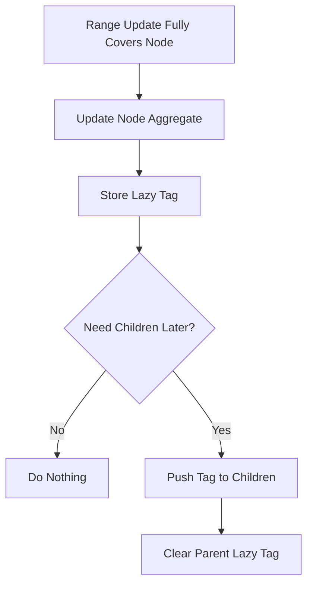
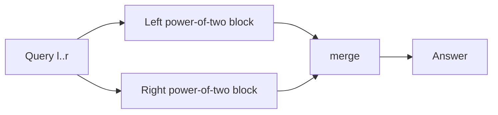
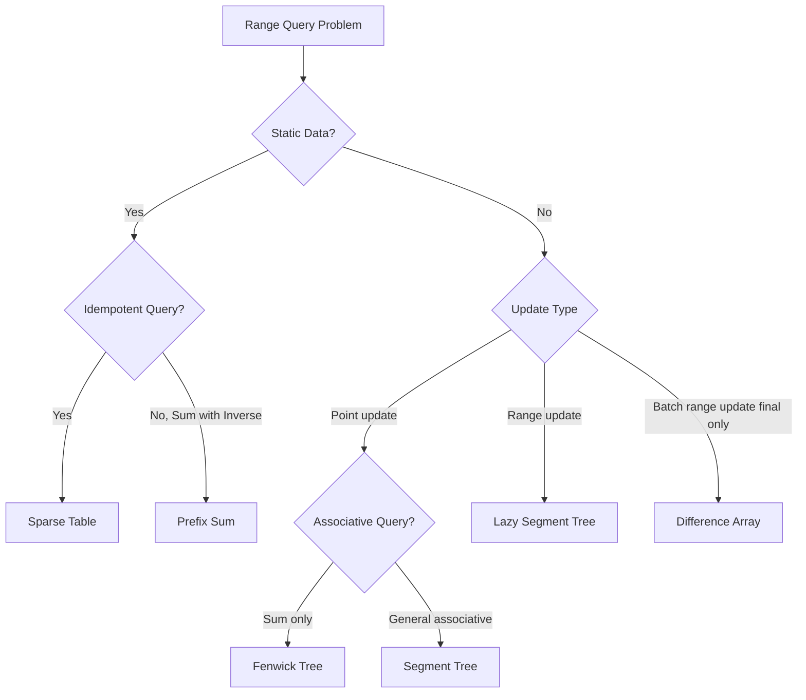

------
title: Learn Java Data Structures and Algorithms - Part 014
description: Segment trees, lazy propagation, sparse tables, range-query algebra, Java implementations, correctness invariants, and production decision rules.
series: learn-java-dsa
seriesTitle: Learn Java Data Structures and Algorithms
order: 14
partTitle: Segment Trees, Sparse Tables, and Range Query Systems
tags:
- java
- data-structures
- algorithms
- dsa
- segment-tree
- sparse-table
- range-query
- lazy-propagation
- series
date: 2026-06-27
---

# Part 014 — Segment Trees, Sparse Tables, and Range Query Systems

Part 013 covered prefix sums, difference arrays, and Fenwick trees.

Those structures are excellent when the operation is sum-like.

This part generalizes the problem.

We now want to support operations like:

```text
range sum
range min
range max
range gcd
range xor
range assignment
range add
range query after updates
```

The important shift is this:

> Range-query data structures are not just data structures. They are algebraic contracts between an operation, an update model, and an interval decomposition.

Segment trees and sparse tables look like implementation patterns, but their real power comes from the invariants they preserve.

---

## 1. Kaufman Skill Target

After this part, you should be able to:

1. Model range-query problems by operation, update type, and mutability.
2. Identify whether an operation is associative, idempotent, invertible, or composable.
3. Implement an iterative segment tree for point updates and range queries.
4. Implement a recursive lazy segment tree for range updates and range queries.
5. Implement a sparse table for static idempotent range queries.
6. Explain why sparse table gives `O(1)` RMQ but not general `O(1)` sum query using overlapping blocks.
7. Compose lazy tags safely for range add and range assignment.
8. Choose the simplest production-grade structure for a workload.

The practice objective:

> Given a range problem, derive the structure from the operation properties instead of copying a template.

---

## 2. Range Query Design Matrix

Before implementing anything, classify the problem.

| Array Mutability | Update Type | Query Type | Candidate |
|---|---|---|---|
| Static | none | sum | Prefix sum |
| Static | none | min/max/gcd | Sparse table |
| Dynamic | point update | sum/min/max/gcd | Segment tree or Fenwick if sum |
| Dynamic | range add | point query | Difference + Fenwick |
| Dynamic | range add | range sum/min/max | Lazy segment tree |
| Dynamic | range assign | range query | Lazy segment tree with assignment tags |
| Huge sparse coordinates | dynamic | range query | Dynamic segment tree / compression |

The decision starts with workload, not with favorite data structure.

---

## 3. Algebraic Foundations

### 3.1 Associativity

An operation `op` is associative if:

```text
op(op(a, b), c) = op(a, op(b, c))
```

Examples:

```text
sum, min, max, gcd, xor
```

Associativity is the minimum requirement for segment trees.

Why?

Because segment trees combine child intervals:

```text
value(parent) = merge(value(leftChild), value(rightChild))
```

If `merge` is not associative, decomposition shape changes the result.

### 3.2 Identity

An identity value `e` satisfies:

```text
op(e, x) = x
op(x, e) = x
```

Examples:

| Operation | Identity |
|---|---:|
| sum | `0` |
| min | `+infinity` |
| max | `-infinity` |
| gcd | `0` |
| xor | `0` |

Identity is needed for empty overlap queries.

### 3.3 Idempotence

An operation is idempotent if:

```text
op(x, x) = x
```

Examples:

```text
min, max, gcd
```

Non-examples:

```text
sum, product, xor
```

Idempotence is what allows sparse table queries to combine overlapping blocks.

For range minimum:

```text
min(overlap counted twice) = same result
```

For sum:

```text
sum(overlap counted twice) = wrong result
```

### 3.4 Invertibility

An operation has an inverse if we can undo contribution.

Sum has subtraction.
Xor is its own inverse.
Min does not have a general inverse.

This explains the earlier prefix-sum limitation.

---

## 4. Segment Tree Mental Model

A segment tree stores aggregate values for a hierarchy of intervals.

For array length `n`, the root owns:

```text
[0, n)
```

Each node splits its interval:

```text
[l, r)
mid = (l + r) >>> 1
left child  = [l, mid)
right child = [mid, r)
```

Node invariant:

```text
node.value = aggregate of A[l, r)
```

```mermaid
graph TD
    A[0,8) --> B[0,4)
    A --> C[4,8)
    B --> D[0,2)
    B --> E[2,4)
    C --> F[4,6)
    C --> G[6,8)
    D --> H[0,1)
    D --> I[1,2)
    E --> J[2,3)
    E --> K[3,4)
```

The tree is not about binary search.
It is about interval decomposition.

---

## 5. Iterative Segment Tree: Point Update + Range Query

The iterative array-backed segment tree is compact and fast.

Use it when:

```text
point update
range query
```

No lazy propagation needed.

### 5.1 Layout

Use an array `tree` of length `2 * n`.

```text
leaves: tree[n] ... tree[2n - 1]
parents: tree[1] ... tree[n - 1]
```

For zero-based input index `i`:

```text
leaf position = i + n
```

Parent:

```text
p >> 1
```

Children:

```text
p << 1
p << 1 | 1
```

### 5.2 Sum Segment Tree Implementation

```java
import java.util.Objects;

public final class LongSumSegmentTree {
    private final int size;
    private final long[] tree;

    public LongSumSegmentTree(long[] values) {
        Objects.requireNonNull(values, "values");
        this.size = values.length;
        this.tree = new long[Math.max(1, size * 2)];

        for (int i = 0; i < size; i++) {
            tree[size + i] = values[i];
        }

        for (int i = size - 1; i > 0; i--) {
            tree[i] = tree[i << 1] + tree[i << 1 | 1];
        }
    }

    public int size() {
        return size;
    }

    public void set(int index, long value) {
        checkIndex(index);

        int p = index + size;
        tree[p] = value;

        while ((p >>= 1) > 0) {
            tree[p] = tree[p << 1] + tree[p << 1 | 1];
        }
    }

    public void add(int index, long delta) {
        checkIndex(index);

        int p = index + size;
        tree[p] += delta;

        while ((p >>= 1) > 0) {
            tree[p] = tree[p << 1] + tree[p << 1 | 1];
        }
    }

    public long rangeSum(int leftInclusive, int rightExclusive) {
        checkRange(leftInclusive, rightExclusive);

        long result = 0;
        int left = leftInclusive + size;
        int right = rightExclusive + size;

        while (left < right) {
            if ((left & 1) == 1) {
                result += tree[left++];
            }
            if ((right & 1) == 1) {
                result += tree[--right];
            }
            left >>= 1;
            right >>= 1;
        }

        return result;
    }

    private void checkIndex(int index) {
        if (index < 0 || index >= size) {
            throw new IndexOutOfBoundsException("Invalid index " + index + " for size " + size);
        }
    }

    private void checkRange(int leftInclusive, int rightExclusive) {
        if (leftInclusive < 0 || rightExclusive < leftInclusive || rightExclusive > size) {
            throw new IndexOutOfBoundsException(
                "Invalid range [" + leftInclusive + ", " + rightExclusive + ") for size " + size
            );
        }
    }
}
```

### 5.3 Query Invariant

The iterative query maintains:

```text
result + aggregate(unprocessed intervals) = aggregate(original query range)
```

When `left` is a right child, it represents an interval fully inside the query and not covered by its parent.
So include it and move `left++`.

When `right` is a right boundary, `--right` represents the last included interval.
So include it.

Then both boundaries move to parents.

This decomposes `[l, r)` into `O(log n)` disjoint tree nodes.

### 5.4 Complexity

| Operation | Complexity |
|---|---:|
| Build | `O(n)` |
| Point update | `O(log n)` |
| Range query | `O(log n)` |
| Space | `O(n)` |

---

## 6. Generic Segment Tree vs Specialized Segment Tree

A generic segment tree might look elegant:

```java
public final class SegmentTree<T> {
    private final BinaryOperator<T> merge;
    private final T identity;
}
```

But for high-performance numeric DSA, this introduces:

- boxing,
- virtual/interface calls,
- allocation risks,
- less predictable JIT optimization,
- more complicated null handling.

For production performance-sensitive code, prefer specialized primitive implementations:

```text
LongSumSegmentTree
LongMinSegmentTree
IntMaxSegmentTree
```

For application-level business logic where performance is secondary, generic code can be acceptable.

The engineering decision is not aesthetic.
It is workload-dependent.

---

## 7. Segment Tree for Min/Max/GCD

Changing the operation changes only:

```text
merge
identity
leaf value
```

For minimum:

```java
private static final long INF = Long.MAX_VALUE;

private static long merge(long a, long b) {
    return Math.min(a, b);
}
```

Empty range identity is `INF`.

For maximum:

```java
private static final long NEG_INF = Long.MIN_VALUE;
```

For gcd:

```java
private static long gcd(long a, long b) {
    a = Math.abs(a);
    b = Math.abs(b);
    while (b != 0) {
        long t = a % b;
        a = b;
        b = t;
    }
    return a;
}
```

Identity for gcd is `0` because:

```text
gcd(0, x) = x
```

---

## 8. Lazy Propagation

### 8.1 The Problem

Suppose we need:

```text
rangeAdd(l, r, delta)
rangeSum(l, r)
```

Without lazy propagation, range update might touch every element in `[l, r)`.

Worst case:

```text
O(n)
```

Lazy propagation stores pending updates at internal nodes.

Instead of immediately pushing update to all descendants, we record:

```text
this entire interval has been increased by delta
```

and push only when a later operation needs child precision.

### 8.2 Lazy Node Invariants

For each node owning interval `[l, r)`:

```text
sum[node] = correct sum of A[l, r), including all updates applied to this node
lazy[node] = pending delta that still needs to be propagated to children
```

If `lazy[node] != 0`, children may be stale, but the node itself is correct.

That distinction is crucial.



### 8.3 Recursive Lazy Segment Tree: Range Add + Range Sum

```java
public final class LazyRangeAddSumSegmentTree {
    private final int size;
    private final long[] sum;
    private final long[] lazyAdd;

    public LazyRangeAddSumSegmentTree(long[] values) {
        this.size = values.length;
        int capacity = Math.max(1, size * 4);
        this.sum = new long[capacity];
        this.lazyAdd = new long[capacity];

        if (size > 0) {
            build(1, 0, size, values);
        }
    }

    public int size() {
        return size;
    }

    public void add(int leftInclusive, int rightExclusive, long delta) {
        checkRange(leftInclusive, rightExclusive);
        if (leftInclusive == rightExclusive) {
            return;
        }
        add(1, 0, size, leftInclusive, rightExclusive, delta);
    }

    public long rangeSum(int leftInclusive, int rightExclusive) {
        checkRange(leftInclusive, rightExclusive);
        if (leftInclusive == rightExclusive) {
            return 0;
        }
        return rangeSum(1, 0, size, leftInclusive, rightExclusive);
    }

    private void build(int node, int left, int right, long[] values) {
        if (right - left == 1) {
            sum[node] = values[left];
            return;
        }

        int mid = (left + right) >>> 1;
        build(node << 1, left, mid, values);
        build(node << 1 | 1, mid, right, values);
        pull(node);
    }

    private void add(int node, int left, int right, int queryLeft, int queryRight, long delta) {
        if (queryRight <= left || right <= queryLeft) {
            return;
        }

        if (queryLeft <= left && right <= queryRight) {
            apply(node, left, right, delta);
            return;
        }

        push(node, left, right);

        int mid = (left + right) >>> 1;
        add(node << 1, left, mid, queryLeft, queryRight, delta);
        add(node << 1 | 1, mid, right, queryLeft, queryRight, delta);
        pull(node);
    }

    private long rangeSum(int node, int left, int right, int queryLeft, int queryRight) {
        if (queryRight <= left || right <= queryLeft) {
            return 0;
        }

        if (queryLeft <= left && right <= queryRight) {
            return sum[node];
        }

        push(node, left, right);

        int mid = (left + right) >>> 1;
        return rangeSum(node << 1, left, mid, queryLeft, queryRight)
            + rangeSum(node << 1 | 1, mid, right, queryLeft, queryRight);
    }

    private void apply(int node, int left, int right, long delta) {
        sum[node] += delta * (right - left);
        lazyAdd[node] += delta;
    }

    private void push(int node, int left, int right) {
        long delta = lazyAdd[node];
        if (delta == 0 || right - left == 1) {
            return;
        }

        int mid = (left + right) >>> 1;
        apply(node << 1, left, mid, delta);
        apply(node << 1 | 1, mid, right, delta);
        lazyAdd[node] = 0;
    }

    private void pull(int node) {
        sum[node] = sum[node << 1] + sum[node << 1 | 1];
    }

    private void checkRange(int leftInclusive, int rightExclusive) {
        if (leftInclusive < 0 || rightExclusive < leftInclusive || rightExclusive > size) {
            throw new IndexOutOfBoundsException(
                "Invalid range [" + leftInclusive + ", " + rightExclusive + ") for size " + size
            );
        }
    }
}
```

### 8.4 Correctness Reasoning

For full cover update:

```text
node interval [l, r) entirely inside update range
```

We update:

```text
sum[node] += delta * (r - l)
lazyAdd[node] += delta
```

The node aggregate is immediately correct.
Children may not yet be updated.

Before descending into children, `push` transfers the pending delta.
After child updates, `pull` recomputes parent.

So the invariant holds after every operation.

---

## 9. Lazy Tag Composition

Lazy propagation is simple for range add because add tags compose by addition:

```text
add 5 then add 3 = add 8
```

Range assignment is harder.

Consider:

```text
assign 10
add 3
```

Result:

```text
assign 13
```

But:

```text
add 3
assign 10
```

Result:

```text
assign 10
```

Order matters.

A robust lazy tag for assignment + addition might store:

```java
boolean hasAssign;
long assignValue;
long addValue;
```

Composition rules:

```text
applyAssign(x):
    hasAssign = true
    assignValue = x
    addValue = 0

applyAdd(d):
    if hasAssign:
        assignValue += d
    else:
        addValue += d
```

Node aggregate for sum:

```text
assign x over len -> sum = x * len
add d over len    -> sum += d * len
```

This is where many lazy segment tree bugs happen.

The bug is rarely the recursion.
The bug is usually invalid tag composition.

---

## 10. Sparse Table

### 10.1 Problem It Solves

Sparse table is for static arrays.

It supports queries like:

```text
range minimum query
range maximum query
range gcd query
```

with:

```text
build: O(n log n)
query: O(1) for idempotent operations
updates: unsupported
```

### 10.2 Table Definition

Let:

```text
st[k][i] = aggregate of range [i, i + 2^k)
```

Base:

```text
st[0][i] = A[i]
```

Transition:

```text
st[k][i] = merge(st[k - 1][i], st[k - 1][i + 2^(k - 1)])
```

### 10.3 Range Minimum Query

For query `[l, r)`, let:

```text
len = r - l
k = floor(log2(len))
```

Use two blocks of length `2^k`:

```text
left block:  [l, l + 2^k)
right block: [r - 2^k, r)
```

They may overlap.

For min, overlap is safe:

```text
min(x, x) = x
```

So:

```text
answer = min(st[k][l], st[k][r - 2^k])
```



### 10.4 Java Implementation: Range Minimum Sparse Table

```java
import java.util.Objects;

public final class LongMinSparseTable {
    private final int size;
    private final int[] log2;
    private final long[][] table;

    public LongMinSparseTable(long[] values) {
        Objects.requireNonNull(values, "values");
        this.size = values.length;
        this.log2 = buildLogs(Math.max(1, size));

        int levels = size == 0 ? 1 : log2[size] + 1;
        this.table = new long[levels][Math.max(1, size)];

        if (size > 0) {
            System.arraycopy(values, 0, table[0], 0, size);
            build();
        }
    }

    public int size() {
        return size;
    }

    public long rangeMin(int leftInclusive, int rightExclusive) {
        checkNonEmptyRange(leftInclusive, rightExclusive);

        int len = rightExclusive - leftInclusive;
        int k = log2[len];
        int blockLength = 1 << k;

        return Math.min(
            table[k][leftInclusive],
            table[k][rightExclusive - blockLength]
        );
    }

    private void build() {
        for (int k = 1; k < table.length; k++) {
            int half = 1 << (k - 1);
            int length = 1 << k;
            for (int i = 0; i + length <= size; i++) {
                table[k][i] = Math.min(table[k - 1][i], table[k - 1][i + half]);
            }
        }
    }

    private static int[] buildLogs(int n) {
        int[] logs = new int[n + 1];
        for (int i = 2; i <= n; i++) {
            logs[i] = logs[i >> 1] + 1;
        }
        return logs;
    }

    private void checkNonEmptyRange(int leftInclusive, int rightExclusive) {
        if (leftInclusive < 0 || rightExclusive <= leftInclusive || rightExclusive > size) {
            throw new IndexOutOfBoundsException(
                "Invalid non-empty range [" + leftInclusive + ", " + rightExclusive + ") for size " + size
            );
        }
    }
}
```

### 10.5 Why Sparse Table Is Not General `O(1)` Sum

For sum, overlapping blocks double-count.

Example:

```text
A = [1, 2, 3, 4, 5]
query [0, 5)
```

Largest power of two length is `4`.

Blocks:

```text
[0, 4) = 1 + 2 + 3 + 4 = 10
[1, 5) = 2 + 3 + 4 + 5 = 14
```

Combined sum:

```text
24
```

Correct sum:

```text
15
```

Overlap `[1, 4)` was counted twice.

For idempotent operations, double-counting does not matter.
For sum, it does.

You can still answer static sum with a sparse-table-like disjoint decomposition in `O(log n)`, but prefix sum gives `O(1)` and is simpler.

---

## 11. Segment Tree vs Sparse Table

| Feature | Segment Tree | Sparse Table |
|---|---:|---:|
| Build | `O(n)` | `O(n log n)` |
| Query | `O(log n)` | `O(1)` for idempotent ops |
| Updates | Yes | No |
| Memory | `O(n)` | `O(n log n)` |
| Best for | Dynamic data | Static RMQ/GCD |
| Implementation risk | Medium/high with lazy | Low/medium |

Rule:

> If data is static and operation is idempotent, sparse table is often better. If updates exist, use segment tree.

---

## 12. Dynamic Segment Tree

A normal segment tree allocates for all indices.

For huge coordinate spaces:

```text
index range: [0, 10^18)
number of active points: 100,000
```

Dense arrays are impossible.

Use a dynamic segment tree that creates nodes only when needed.

Conceptual node:

```java
final class Node {
    Node left;
    Node right;
    long sum;
    long lazyAdd;
}
```

Use cases:

- sparse timelines,
- large ID spaces,
- dynamic intervals,
- coordinate ranges not known in advance.

Trade-offs:

- more allocation,
- worse locality,
- higher GC pressure,
- more pointer chasing,
- easier to support massive ranges.

Often coordinate compression is better if all keys are known upfront.

---

## 13. Coordinate Compression vs Dynamic Tree

Choose coordinate compression when:

- all relevant coordinates are known before processing,
- order matters but actual gaps do not,
- you can sort unique keys.

Choose dynamic segment tree when:

- coordinates arrive online,
- full domain is huge,
- rebuilding compression is too expensive,
- queries involve ranges over unknown future keys.

Caveat:

If intervals have length semantics, compression must preserve gaps.

Example:

```text
[10, 20) has length 10
[20, 1000) has length 980
```

Compressing to adjacent indices loses physical length unless you store segment widths.

This matters for range sums over continuous coordinates.

---

## 14. Production Engineering Notes

### 14.1 Avoid Recursion if Stack Depth Is Unclear

Recursive segment trees have depth `O(log n)`.

For normal array sizes, this is safe.

But recursive code can still be problematic when:

- tree is dynamic and unbalanced by bug,
- implementation accidentally recurses on same interval,
- JVM stack is constrained,
- code is used in latency-sensitive services where stack traces become noisy.

Iterative segment trees avoid recursion for point update/range query.

Lazy propagation is usually clearer recursively, but iterative lazy segment trees are possible.

### 14.2 `4 * n` Capacity

Recursive segment trees commonly allocate:

```java
long[] tree = new long[4 * n];
```

This is simple and safe for most `n`.

But watch overflow:

```java
4 * n
```

can overflow `int` for very large `n`.

Use:

```java
if (n > Integer.MAX_VALUE / 4) {
    throw new IllegalArgumentException("n too large");
}
```

or calculate with `long` before allocation.

### 14.3 Operation-Specific Implementations

A segment tree for sum and a segment tree for min have different update semantics.

Range add + range min works like:

```text
min[node] += delta
lazyAdd[node] += delta
```

Range add + range sum works like:

```text
sum[node] += delta * length
lazyAdd[node] += delta
```

Do not blindly reuse `apply` logic across operations.

### 14.4 Lazy Propagation and Observability

Internal arrays do not directly represent the original array when lazy tags exist.

This can confuse debugging.

Provide diagnostic methods carefully:

```java
public long get(int index) {
    return rangeSum(index, index + 1);
}
```

Do not expose `sum[]` and expect consumers to understand lazy state.

### 14.5 Thread Safety

Most custom DSA implementations are not thread-safe.

If used inside services:

- confine to one request/thread,
- use immutable snapshots,
- guard with locks,
- or build concurrent-specific structures.

Adding `synchronized` to every method may preserve correctness but destroy performance.

Understand access pattern first.

---

## 15. Testing Strategy

### 15.1 Naive Oracle

For segment trees, always test against a naive array.

Example for range add + range sum:

```java
long[] naive = new long[n];
LazyRangeAddSumSegmentTree tree = new LazyRangeAddSumSegmentTree(naive);

for (int step = 0; step < 100_000; step++) {
    if (random.nextBoolean()) {
        int l = random.nextInt(n + 1);
        int r = l + random.nextInt(n - l + 1);
        long delta = random.nextInt(2001) - 1000;

        tree.add(l, r, delta);
        for (int i = l; i < r; i++) {
            naive[i] += delta;
        }
    } else {
        int l = random.nextInt(n + 1);
        int r = l + random.nextInt(n - l + 1);

        long expected = 0;
        for (int i = l; i < r; i++) {
            expected += naive[i];
        }

        long actual = tree.rangeSum(l, r);
        if (expected != actual) {
            throw new AssertionError("expected " + expected + " but got " + actual);
        }
    }
}
```

Randomized property tests catch:

- off-by-one range errors,
- broken lazy push,
- incorrect tag composition,
- empty range bugs,
- overflow surprises in small domains.

### 15.2 Edge Cases

Test:

```text
n = 0
n = 1
empty query [i, i)
full query [0, n)
last element [n-1, n)
negative deltas
large deltas
repeated updates on same range
nested updates
queries before and after push
```

### 15.3 Differential Testing Across Structures

For range sum, compare:

- prefix sum for static case,
- Fenwick tree for point update case,
- segment tree for point update case.

This helps catch bugs in both implementations.

---

## 16. Common Failure Modes

### 16.1 Wrong Identity

For min query, returning `0` on no overlap is wrong if values are positive.

Example:

```text
min(5, 0) = 0
```

But `0` came from empty overlap, not data.

Use:

```java
Long.MAX_VALUE
```

for min identity.

### 16.2 Forgetting to Push Before Descending

Bug:

```java
// children stale, but code descends anyway
update(leftChild)
update(rightChild)
pull(parent)
```

If parent had pending lazy tag, children do not reflect it.

Always push before partial descent.

### 16.3 Incorrect Length in Apply

For sum:

```java
sum[node] += delta * (right - left);
```

Using `delta` alone is only correct for leaf nodes.

### 16.4 Assignment/Add Tag Order Bug

This is wrong:

```text
hasAssign = true
assignValue = x
addValue remains old
```

After assignment, old adds should usually be cleared or folded depending on composition.

### 16.5 Sparse Table Used with Updates

Sparse table is static.

One update can invalidate `O(n log n)` precomputed entries.

If updates exist, use segment tree.

### 16.6 Sparse Table Used with Non-Idempotent `O(1)` Query

Overlapping-block query is valid only for idempotent operations.

Min/max/gcd: yes.
Sum/product/xor: no.

---

## 17. Worked Decision Examples

### 17.1 Static Risk Scores, Query Minimum Over Time Window

Problem:

```text
risk score per day is immutable after nightly batch
query minimum risk score over date window
```

Choose:

```text
Sparse table
```

Reason:

- static data,
- min is idempotent,
- many queries,
- `O(1)` query valuable.

### 17.2 Real-Time Counter with Point Updates and Range Sum

Problem:

```text
update one bucket as events arrive
query total count across bucket range
```

Choose:

```text
Fenwick tree
```

Reason:

- sum-like,
- point update,
- compact,
- simpler than segment tree.

### 17.3 Capacity Calendar with Range Adds and Range Max

Problem:

```text
booking adds capacity usage across interval
query max usage over interval
```

Choose:

```text
Lazy segment tree with range add + range max
```

Reason:

- range update,
- max query,
- difference array only gives point values cheaply,
- Fenwick not enough for range max under range add.

### 17.4 Huge Sparse Timeline

Problem:

```text
time range is nanoseconds over years
only 100k intervals active
```

Choose:

```text
coordinate compression if intervals known upfront
otherwise dynamic segment tree
```

Reason:

- dense array impossible,
- need ordered range structure.

---

## 18. Complexity Summary

| Structure | Build | Update | Query | Space | Best Case |
|---|---:|---:|---:|---:|---|
| Prefix sum | `O(n)` | rebuild | `O(1)` | `O(n)` | Static sum |
| Fenwick tree | `O(n)` | `O(log n)` | `O(log n)` | `O(n)` | Dynamic sum/count |
| Iterative segment tree | `O(n)` | `O(log n)` point | `O(log n)` | `O(n)` | Dynamic associative query |
| Lazy segment tree | `O(n)` | `O(log n)` range | `O(log n)` | `O(n)` | Range update + range query |
| Sparse table | `O(n log n)` | unsupported | `O(1)` idempotent | `O(n log n)` | Static RMQ/GCD |
| Dynamic segment tree | lazy | `O(log U)` | `O(log U)` | active nodes | Huge sparse domain |

`U` is universe size, not number of active elements.

---

## 19. Mental Model Summary



Segment tree is the general-purpose workhorse.
Sparse table is the static-query specialist.
Fenwick tree is the compact sum/count specialist.
Prefix/difference arrays are the static/batch specialists.

Top engineers know not just how to implement all of them, but when not to use each one.

---

## 20. Deliberate Practice

### Exercise 1 — Iterative Segment Tree

Implement:

```java
set(index, value)
rangeSum(l, r)
```

Then extend to:

```java
rangeMin(l, r)
```

Use separate classes, not a generic abstraction at first.

### Exercise 2 — Lazy Range Add + Range Sum

Implement `LazyRangeAddSumSegmentTree` from scratch.

Do not copy the code.

Write down these methods first:

```text
apply
push
pull
update
query
```

Then implement.

### Exercise 3 — Lazy Range Add + Range Max

Modify the lazy tree to support:

```text
rangeAdd(l, r, delta)
rangeMax(l, r)
```

Think carefully about `apply`:

```text
max[node] += delta
```

not:

```text
max[node] += delta * length
```

### Exercise 4 — Sparse Table RMQ

Implement `LongMinSparseTable`.

Verify against a naive `O(n)` range minimum query.

Test random ranges.

### Exercise 5 — Decision Drill

For each workload, choose a structure and explain why:

1. Static array, range sum queries.
2. Static array, range minimum queries.
3. Point updates, range sum queries.
4. Range add updates, range max queries.
5. Online sparse timeline, range sum queries.
6. Batch range increments, final array only.

The goal is immediate classification.

---

## 21. Review Checklist

Before shipping range-query code:

- [ ] Is the operation associative?
- [ ] What is the identity value?
- [ ] Is the operation idempotent?
- [ ] Are updates point or range?
- [ ] Are updates assignment, addition, min-set, max-set, or something else?
- [ ] Does lazy tag composition preserve operation order?
- [ ] Are ranges consistently `[l, r)`?
- [ ] Are empty ranges defined?
- [ ] Are aggregates stored in a type large enough?
- [ ] Is recursion depth safe?
- [ ] Is coordinate space dense or sparse?
- [ ] Is the structure thread-confined or externally synchronized?
- [ ] Are property tests comparing against a naive oracle?

---

## 22. Key Takeaways

1. Segment trees require associative merge operations.
2. Identity values are not optional; wrong identity corrupts partial-overlap queries.
3. Lazy propagation keeps parent nodes correct while delaying child updates.
4. Lazy tag composition is the hardest part of advanced segment trees.
5. Sparse tables are excellent for static idempotent queries.
6. Sparse table `O(1)` overlapping-block query does not work for sum.
7. Fenwick trees should still be preferred for simple dynamic sums because they are smaller and simpler.
8. The best range-query design follows from workload and algebra, not memorized templates.

Next, we move into binary trees and traversal invariants, where recursion, iteration, state transitions, and structural correctness become the main mental model.
