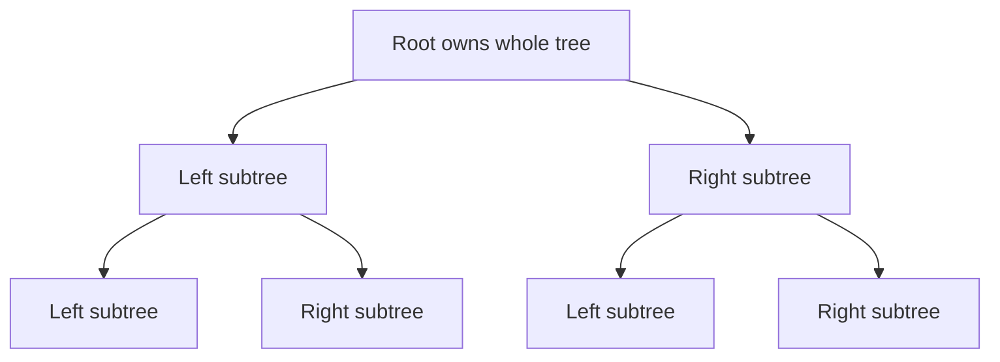
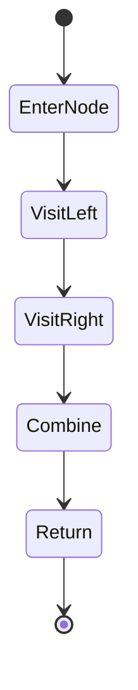

------
title: Learn Java Data Structures and Algorithms - Part 015
description: Binary tree representation, traversal state machines, DFS/BFS invariants, serialization, path algorithms, Java implementation choices, correctness reasoning, and production failure modes.
series: learn-java-dsa
seriesTitle: Learn Java Data Structures and Algorithms
order: 15
partTitle: Binary Trees and Traversal Invariants
tags:
- java
- data-structures
- algorithms
- dsa
- binary-tree
- traversal
- recursion
- dfs
- bfs
- series
date: 2026-06-27
---

# Part 015 — Binary Trees and Traversal Invariants

Part 014 covered range-query systems.

This part shifts from array-indexed structures to pointer-shaped structures.

A binary tree looks simple: each node has at most two children.

But most bugs in tree code do not come from forgetting what a tree is. They come from losing track of:

```text
which node owns which subtree
which traversal state has already been processed
which null boundary means empty structure
which invariant the result depends on
```

The goal of this part is not to memorize preorder, inorder, and postorder.

The goal is to treat tree algorithms as **state machines over recursive structure**.

---

## 1. Kaufman Skill Target

After this part, you should be able to:

1. Represent binary trees using reference nodes, array layouts, and parent-linked nodes.
2. State the structural invariants that make a graph a tree.
3. Choose preorder, inorder, postorder, level-order, or Euler-style traversal based on the information flow required by the algorithm.
4. Convert recursive DFS into iterative DFS without changing semantics.
5. Implement breadth-first traversal with correct level boundaries.
6. Serialize and deserialize trees safely.
7. Solve path, height, diameter, balance, and lowest-common-ancestor problems from invariants rather than templates.
8. Explain memory and allocation trade-offs of Java tree structures.
9. Design tests that expose traversal boundary bugs.

The practice objective:

> Given a tree problem, identify the data dependency direction first, then derive the traversal.

---

## 2. The Mental Model: Tree as Recursive Ownership

A binary tree is not merely a collection of nodes.

It is a recursive ownership structure:

```text
Tree = empty
     | Node(value, leftTree, rightTree)
```

A node owns two disjoint subtrees.

The root owns the entire tree.

A leaf owns two empty subtrees.



The critical property is not that nodes have pointers.

The critical property is that every non-root node has exactly one parent and there are no cycles.

---

## 3. Structural Invariants

A binary tree must satisfy these invariants:

| Invariant | Meaning | Common Violation |
|---|---|---|
| Single root | There is one entry point | Multiple disconnected components |
| Parent uniqueness | Every non-root node has exactly one parent | Shared child node from two parents |
| Acyclicity | Following child links never returns to an ancestor | Accidental cycle during mutation |
| Reachability | Every node belongs to the root's reachable set | Orphan nodes |
| Bounded branching | Each node has at most two child references | Wrong modelling for n-ary data |
| Subtree disjointness | Left and right subtrees do not share nodes | Aliasing bug |

A tree is therefore a restricted directed acyclic graph.

This matters because most DFS algorithms assume that visiting a node once through recursion cannot encounter the same node again through another branch.

If that assumption is false, tree code can loop forever, double-count, or corrupt results.

---

## 4. Java Representation Choices

### 4.1 Minimal Reference Node

The simplest representation is:

```java
public final class TreeNode<T> {
    public T value;
    public TreeNode<T> left;
    public TreeNode<T> right;

    public TreeNode(T value) {
        this.value = value;
    }
}
```

This is easy to teach but not always ideal for production.

Issues:

1. Fields are public and mutable.
2. `T` boxes primitives.
3. Every node is a separate heap object.
4. Reference chasing reduces locality.
5. It has no parent pointer.
6. It cannot enforce acyclicity.

A slightly safer version:

```java
public final class BinaryNode<T> {
    private final T value;
    private BinaryNode<T> left;
    private BinaryNode<T> right;

    public BinaryNode(T value) {
        this.value = java.util.Objects.requireNonNull(value);
    }

    public T value() {
        return value;
    }

    public BinaryNode<T> left() {
        return left;
    }

    public BinaryNode<T> right() {
        return right;
    }

    public void setLeft(BinaryNode<T> left) {
        if (left == this) {
            throw new IllegalArgumentException("node cannot be its own left child");
        }
        this.left = left;
    }

    public void setRight(BinaryNode<T> right) {
        if (right == this) {
            throw new IllegalArgumentException("node cannot be its own right child");
        }
        this.right = right;
    }
}
```

This still does not fully prevent cycles or shared children, but it makes the mutation boundary explicit.

### 4.2 Primitive Node Arrays

For high-volume algorithmic workloads, arrays often outperform object graphs:

```java
int[] value;
int[] left;
int[] right;
```

A missing child can be represented as `-1`.

```java
int root = 0;
int NIL = -1;
```

Advantages:

1. Better locality.
2. Lower allocation overhead.
3. Easier serialization.
4. No per-node object header.
5. Suitable for millions of nodes.

Trade-off:

1. Less idiomatic.
2. Harder to mutate safely.
3. Requires manual capacity management.
4. More error-prone index handling.

### 4.3 Heap-Style Array Layout

For complete or near-complete binary trees:

```text
left(i)  = 2 * i + 1
right(i) = 2 * i + 2
parent(i)= (i - 1) / 2
```

This is the basis of binary heaps.

It is a poor fit for sparse arbitrary trees because missing nodes create holes.

### 4.4 Parent-Linked Nodes

Some algorithms benefit from parent pointers:

```java
public final class ParentNode<T> {
    T value;
    ParentNode<T> left;
    ParentNode<T> right;
    ParentNode<T> parent;
}
```

Useful for:

1. Upward traversal.
2. Finding successor/predecessor in ordered trees.
3. Deletion algorithms.
4. LCA with parent pointers.

Danger:

Parent pointers create bidirectional links. Mutation must update both directions atomically at the abstraction level.

Broken parent links are a common source of subtle corruption.

---

## 5. Height, Depth, Level, and Size

Definitions vary across books and codebases.

Be explicit.

In this series:

| Term | Definition |
|---|---|
| Depth of node | Number of edges from root to node |
| Level of node | Depth + 1 if using one-based level |
| Height of empty tree | `-1` for edge-height convention, `0` for node-height convention |
| Height of leaf | `0` under edge-height, `1` under node-height |
| Size | Number of nodes |

For implementation simplicity, many Java methods use node-height:

```text
height(null) = 0
height(node) = 1 + max(height(left), height(right))
```

This makes leaf height `1`.

That is fine as long as the convention is documented.

---

## 6. Traversal Is About Information Flow

Tree traversal order is not cosmetic.

It encodes when a node is processed relative to its children.

| Traversal | Process Node | Use When |
|---|---|---|
| Preorder | Before children | Copy tree, serialize shape, prefix expressions |
| Inorder | Between left and right | Sorted output for BST, expression trees |
| Postorder | After children | Delete/free tree, compute height, aggregate children first |
| Level-order | By distance from root | Shortest unweighted depth, breadth views |
| Euler tour | At entry/exit/between | Range flattening, subtree intervals, LCA preprocessing |

The central question:

> Does the node's answer depend on children, parent context, or level boundary?

If answer depends on child results, use postorder.

If answer depends on parent context, use preorder.

If answer depends on distance from root, use BFS.

If answer depends on ordered relation in BST, use inorder.

---

## 7. Recursive DFS Templates with Explicit Semantics

### 7.1 Preorder

```java
public static <T> void preorder(TreeNode<T> node, java.util.List<T> out) {
    if (node == null) {
        return;
    }

    out.add(node.value);
    preorder(node.left, out);
    preorder(node.right, out);
}
```

Invariant:

```text
When preorder(node) returns, out has appended node's subtree in root-left-right order.
```

### 7.2 Inorder

```java
public static <T> void inorder(TreeNode<T> node, java.util.List<T> out) {
    if (node == null) {
        return;
    }

    inorder(node.left, out);
    out.add(node.value);
    inorder(node.right, out);
}
```

Invariant:

```text
When inorder(node) returns, out has appended left subtree, node, right subtree.
```

For ordinary binary trees, inorder is just an ordering.

For BSTs, inorder has semantic meaning: it returns sorted keys.

### 7.3 Postorder

```java
public static <T> void postorder(TreeNode<T> node, java.util.List<T> out) {
    if (node == null) {
        return;
    }

    postorder(node.left, out);
    postorder(node.right, out);
    out.add(node.value);
}
```

Invariant:

```text
When processing node, both child subtrees have already been fully processed.
```

This is why height and diameter are postorder problems.

---

## 8. Recursion as an Implicit Stack

A recursive DFS call frame contains:

```text
node reference
program counter: before-left, between-left-right, after-right
local variables
partial result
```

For example:

```java
height(node)
```

needs to remember `leftHeight` while computing `rightHeight`.



Recursive code is clean because the call stack stores this state.

Iterative code must store the same state explicitly.

---

## 9. Iterative DFS Without Guesswork

### 9.1 Iterative Preorder

Preorder is easy because the node is processed before children.

```java
public static <T> java.util.List<T> preorderIterative(TreeNode<T> root) {
    java.util.ArrayList<T> out = new java.util.ArrayList<>();
    if (root == null) {
        return out;
    }

    java.util.ArrayDeque<TreeNode<T>> stack = new java.util.ArrayDeque<>();
    stack.push(root);

    while (!stack.isEmpty()) {
        TreeNode<T> node = stack.pop();
        out.add(node.value);

        if (node.right != null) {
            stack.push(node.right);
        }
        if (node.left != null) {
            stack.push(node.left);
        }
    }

    return out;
}
```

Why push right before left?

Because stack is LIFO.

To process left first, push right first.

### 9.2 Iterative Inorder

Inorder needs a state: descend left until empty, then process, then go right.

```java
public static <T> java.util.List<T> inorderIterative(TreeNode<T> root) {
    java.util.ArrayList<T> out = new java.util.ArrayList<>();
    java.util.ArrayDeque<TreeNode<T>> stack = new java.util.ArrayDeque<>();

    TreeNode<T> current = root;

    while (current != null || !stack.isEmpty()) {
        while (current != null) {
            stack.push(current);
            current = current.left;
        }

        current = stack.pop();
        out.add(current.value);
        current = current.right;
    }

    return out;
}
```

Loop invariant:

```text
All nodes left of the stack path have already been processed.
The stack contains ancestors whose left side has been explored but whose node value has not yet been emitted.
current points to the next subtree that must be descended left.
```

### 9.3 Iterative Postorder with Expanded Flag

Postorder is where many templates become fragile.

The safest mental model is an explicit frame:

```java
record Frame<T>(TreeNode<T> node, boolean expanded) {}
```

Implementation:

```java
public static <T> java.util.List<T> postorderIterative(TreeNode<T> root) {
    java.util.ArrayList<T> out = new java.util.ArrayList<>();
    if (root == null) {
        return out;
    }

    java.util.ArrayDeque<Frame<T>> stack = new java.util.ArrayDeque<>();
    stack.push(new Frame<>(root, false));

    while (!stack.isEmpty()) {
        Frame<T> frame = stack.pop();
        TreeNode<T> node = frame.node();

        if (frame.expanded()) {
            out.add(node.value);
            continue;
        }

        stack.push(new Frame<>(node, true));
        if (node.right != null) {
            stack.push(new Frame<>(node.right, false));
        }
        if (node.left != null) {
            stack.push(new Frame<>(node.left, false));
        }
    }

    return out;
}
```

Invariant:

```text
An unexpanded frame means: children still need processing.
An expanded frame means: both children have already been scheduled before this frame returns to the top.
```

This pattern generalizes to many recursive algorithms.

---

## 10. Breadth-First Traversal and Level Boundaries

BFS uses a queue.

For binary trees, the queue contains the frontier of nodes whose children have not yet been explored.

```java
public static <T> java.util.List<java.util.List<T>> levelOrder(TreeNode<T> root) {
    java.util.ArrayList<java.util.List<T>> levels = new java.util.ArrayList<>();
    if (root == null) {
        return levels;
    }

    java.util.ArrayDeque<TreeNode<T>> queue = new java.util.ArrayDeque<>();
    queue.addLast(root);

    while (!queue.isEmpty()) {
        int levelSize = queue.size();
        java.util.ArrayList<T> level = new java.util.ArrayList<>(levelSize);

        for (int i = 0; i < levelSize; i++) {
            TreeNode<T> node = queue.removeFirst();
            level.add(node.value);

            if (node.left != null) {
                queue.addLast(node.left);
            }
            if (node.right != null) {
                queue.addLast(node.right);
            }
        }

        levels.add(level);
    }

    return levels;
}
```

Why use `levelSize`?

Because it creates a stable boundary between the current level and the next level.

Avoid using `null` sentinels in Java queues unless the queue implementation permits `null`. `ArrayDeque` does not permit null elements.

---

## 11. Euler Tour View

A DFS traversal can be viewed as entering and leaving intervals.

```text
enter node
enter left subtree
exit left subtree
between children
enter right subtree
exit right subtree
exit node
```

This is useful when flattening trees into arrays.

Example entry/exit timestamps:

```java
public final class EulerTour {
    private int time;
    private final java.util.IdentityHashMap<TreeNode<Integer>, Integer> tin = new java.util.IdentityHashMap<>();
    private final java.util.IdentityHashMap<TreeNode<Integer>, Integer> tout = new java.util.IdentityHashMap<>();

    public void run(TreeNode<Integer> root) {
        dfs(root);
    }

    private void dfs(TreeNode<Integer> node) {
        if (node == null) {
            return;
        }

        tin.put(node, time++);
        dfs(node.left);
        dfs(node.right);
        tout.put(node, time);
    }

    public boolean isAncestor(TreeNode<Integer> a, TreeNode<Integer> b) {
        return tin.get(a) <= tin.get(b) && tout.get(b) <= tout.get(a);
    }
}
```

Subtree interval invariant:

```text
All nodes in node's subtree receive entry times in [tin[node], tout[node]).
```

This invariant is a bridge from trees to range-query structures.

---

## 12. Height and Size Are Postorder Aggregates

### 12.1 Size

```java
public static <T> int size(TreeNode<T> node) {
    if (node == null) {
        return 0;
    }
    return 1 + size(node.left) + size(node.right);
}
```

Invariant:

```text
size(node) returns the number of reachable nodes in node's subtree.
```

### 12.2 Height

Using node-height convention:

```java
public static <T> int height(TreeNode<T> node) {
    if (node == null) {
        return 0;
    }
    return 1 + Math.max(height(node.left), height(node.right));
}
```

Invariant:

```text
height(node) returns the number of nodes on the longest downward path from node to a leaf.
```

### 12.3 Balanced Tree Check

A naive implementation recomputes height many times.

Bad:

```java
public static <T> boolean isBalancedSlow(TreeNode<T> node) {
    if (node == null) {
        return true;
    }

    int diff = Math.abs(height(node.left) - height(node.right));
    return diff <= 1 && isBalancedSlow(node.left) && isBalancedSlow(node.right);
}
```

Worst-case cost can become `O(n^2)`.

Better: combine height and balance in one postorder pass.

```java
public static <T> boolean isBalanced(TreeNode<T> root) {
    return checkedHeight(root) >= 0;
}

private static <T> int checkedHeight(TreeNode<T> node) {
    if (node == null) {
        return 0;
    }

    int left = checkedHeight(node.left);
    if (left < 0) {
        return -1;
    }

    int right = checkedHeight(node.right);
    if (right < 0) {
        return -1;
    }

    if (Math.abs(left - right) > 1) {
        return -1;
    }

    return 1 + Math.max(left, right);
}
```

Sentinel invariant:

```text
checkedHeight(node) >= 0 means subtree is balanced and the value is its height.
checkedHeight(node) == -1 means subtree is not balanced.
```

---

## 13. Diameter as a Postorder Design Pattern

The diameter of a binary tree is the length of the longest path between any two nodes.

The path may pass through the current node or may be entirely inside a child subtree.

At each node:

```text
best path through node = leftHeight + rightHeight
best path anywhere = max(leftBest, rightBest, throughNode)
```

Implementation using edge count:

```java
public static <T> int diameterEdges(TreeNode<T> root) {
    return diameter(root).bestDiameter;
}

private record DiameterInfo(int height, int bestDiameter) {}

private static <T> DiameterInfo diameter(TreeNode<T> node) {
    if (node == null) {
        return new DiameterInfo(0, 0);
    }

    DiameterInfo left = diameter(node.left);
    DiameterInfo right = diameter(node.right);

    int height = 1 + Math.max(left.height, right.height);
    int through = left.height + right.height;
    int best = Math.max(through, Math.max(left.bestDiameter, right.bestDiameter));

    return new DiameterInfo(height, best);
}
```

This is a reusable pattern:

```text
return enough information to parent
while also computing global best inside subtree
```

Avoid global mutable fields unless they simplify a throwaway coding exercise. In production, returning a record is easier to test.

---

## 14. Path Algorithms

### 14.1 Root-to-Leaf Paths

```java
public static <T> java.util.List<java.util.List<T>> rootToLeafPaths(TreeNode<T> root) {
    java.util.ArrayList<java.util.List<T>> result = new java.util.ArrayList<>();
    java.util.ArrayList<T> path = new java.util.ArrayList<>();
    collectPaths(root, path, result);
    return result;
}

private static <T> void collectPaths(
        TreeNode<T> node,
        java.util.ArrayList<T> path,
        java.util.List<java.util.List<T>> result) {

    if (node == null) {
        return;
    }

    path.add(node.value);

    if (node.left == null && node.right == null) {
        result.add(java.util.List.copyOf(path));
    } else {
        collectPaths(node.left, path, result);
        collectPaths(node.right, path, result);
    }

    path.remove(path.size() - 1);
}
```

Backtracking invariant:

```text
At function entry, path contains ancestors before node.
Before return, path is restored to exactly its entry state.
```

That last line is not cleanup decoration.

It is the invariant that prevents sibling paths from contaminating one another.

### 14.2 Path Sum

```java
public static boolean hasPathSum(TreeNode<Integer> node, int target) {
    if (node == null) {
        return false;
    }

    int remaining = target - node.value;

    if (node.left == null && node.right == null) {
        return remaining == 0;
    }

    return hasPathSum(node.left, remaining) || hasPathSum(node.right, remaining);
}
```

Preorder context invariant:

```text
remaining is the amount still needed from the current node down to a leaf.
```

---

## 15. Lowest Common Ancestor in a General Binary Tree

For a general binary tree without parent pointers, the LCA of `a` and `b` can be found by postorder.

```java
public static <T> TreeNode<T> lowestCommonAncestor(
        TreeNode<T> root,
        TreeNode<T> a,
        TreeNode<T> b) {

    if (root == null || root == a || root == b) {
        return root;
    }

    TreeNode<T> left = lowestCommonAncestor(root.left, a, b);
    TreeNode<T> right = lowestCommonAncestor(root.right, a, b);

    if (left != null && right != null) {
        return root;
    }

    return left != null ? left : right;
}
```

Invariant:

```text
lca(root, a, b) returns:
- null if neither target exists in root's subtree
- a or b if exactly one target has been found
- the lowest common ancestor if both targets have been found
```

Important caveat:

This implementation assumes both target nodes exist in the tree.

If existence is not guaranteed, return richer state.

```java
private record LcaInfo<T>(TreeNode<T> node, boolean foundA, boolean foundB) {}
```

Production-grade APIs should not silently return `a` when `b` was never present.

---

## 16. Serialization and Deserialization

Serialization must preserve shape, not only values.

For example, these two trees have the same preorder values but different shape:

```text
  1        1
 /          \
2            2
```

Preorder without null markers cannot distinguish them.

### 16.1 Preorder with Null Markers

```java
public static java.util.List<String> serialize(TreeNode<Integer> root) {
    java.util.ArrayList<String> out = new java.util.ArrayList<>();
    serializePreorder(root, out);
    return out;
}

private static void serializePreorder(TreeNode<Integer> node, java.util.List<String> out) {
    if (node == null) {
        out.add("#");
        return;
    }

    out.add(Integer.toString(node.value));
    serializePreorder(node.left, out);
    serializePreorder(node.right, out);
}
```

Deserialization:

```java
public static TreeNode<Integer> deserialize(java.util.List<String> tokens) {
    java.util.Iterator<String> iterator = tokens.iterator();
    TreeNode<Integer> root = deserializePreorder(iterator);

    if (iterator.hasNext()) {
        throw new IllegalArgumentException("extra tokens after valid tree");
    }

    return root;
}

private static TreeNode<Integer> deserializePreorder(java.util.Iterator<String> iterator) {
    if (!iterator.hasNext()) {
        throw new IllegalArgumentException("missing token");
    }

    String token = iterator.next();
    if (token.equals("#")) {
        return null;
    }

    TreeNode<Integer> node = new TreeNode<>(Integer.parseInt(token));
    node.left = deserializePreorder(iterator);
    node.right = deserializePreorder(iterator);
    return node;
}
```

Correctness invariant:

```text
Every non-null token consumes exactly two serialized subtrees.
Every null token consumes no children.
```

### 16.2 Level-Order Serialization

Level-order serialization is often easier for interoperability, but it needs careful trimming and null handling.

Because `ArrayDeque` does not permit `null`, use a queue that permits nulls or wrap children.

A safer approach is to avoid queueing null children indefinitely.

For production systems, prefer a documented wire format over ad hoc comma-separated strings.

---

## 17. Morris Traversal: O(1) Extra Space with Temporary Mutation

Morris inorder traversal uses threaded links to avoid stack space.

Mental model:

```text
For each node with a left subtree:
find the rightmost node in the left subtree
temporarily link it back to current
use that link to return after processing left subtree
restore the link
```

Implementation:

```java
public static <T> java.util.List<T> morrisInorder(TreeNode<T> root) {
    java.util.ArrayList<T> out = new java.util.ArrayList<>();
    TreeNode<T> current = root;

    while (current != null) {
        if (current.left == null) {
            out.add(current.value);
            current = current.right;
        } else {
            TreeNode<T> predecessor = current.left;
            while (predecessor.right != null && predecessor.right != current) {
                predecessor = predecessor.right;
            }

            if (predecessor.right == null) {
                predecessor.right = current;
                current = current.left;
            } else {
                predecessor.right = null;
                out.add(current.value);
                current = current.right;
            }
        }
    }

    return out;
}
```

Use this rarely in production.

It temporarily mutates the tree. If traversal aborts due to exception, timeout, or concurrent access, the structure can remain corrupted.

---

## 18. Correctness Reasoning Patterns

### 18.1 Structural Induction

Most tree algorithms are proven by structural induction.

Base case:

```text
The algorithm is correct for empty tree.
```

Inductive step:

```text
Assume algorithm is correct for left and right subtrees.
Show it is correct for node by combining child results.
```

This is why recursive code maps naturally to trees.

### 18.2 Return Contract

Before writing recursive code, state the function contract.

Bad:

```text
traverse tree and find answer
```

Good:

```text
height(node) returns the node-height of node's subtree.
```

Good:

```text
contains(node, target) returns true iff target appears in node's reachable subtree.
```

Good:

```text
diameter(node) returns both subtree height and best diameter inside subtree.
```

The more precise the return contract, the less you need templates.

---

## 19. Complexity Budget

Let:

```text
n = number of nodes
h = tree height
w = maximum width of any level
```

| Operation | Time | Extra Space | Notes |
|---|---:|---:|---|
| DFS recursive | `O(n)` | `O(h)` | Call stack |
| DFS iterative | `O(n)` | `O(h)` typical, `O(n)` worst | Explicit stack |
| BFS | `O(n)` | `O(w)` | Queue can hold wide level |
| Height | `O(n)` | `O(h)` | Postorder |
| Diameter | `O(n)` | `O(h)` | If height combined |
| Serialization | `O(n)` | `O(h)` recursion + output | Output size `O(n)` |
| Morris inorder | `O(n)` | `O(1)` | Temporarily mutates tree |

Important edge cases:

1. A skewed tree has `h = n`.
2. A complete tree has `h = O(log n)` and `w = O(n)`.
3. Recursive DFS can overflow the Java stack on deep skewed trees.
4. BFS can consume large memory on very wide trees.

---

## 20. Java Runtime and Production Concerns

### 20.1 Recursion Depth

Java does not optimize tail recursion into loops as a general language guarantee.

Deep recursive traversals can throw `StackOverflowError`.

For untrusted or user-generated tree depth, prefer iterative traversal or enforce depth limits.

### 20.2 Object Graph Locality

A reference-node tree has poor spatial locality compared to arrays.

Each node may be anywhere in heap memory.

This affects:

1. Cache misses.
2. GC scan cost.
3. Allocation pressure.
4. Serialization cost.

For small trees, readability usually wins.

For millions of nodes, layout matters.

### 20.3 Mutability Boundary

Tree mutation is dangerous because each pointer change can violate reachability, acyclicity, or parent uniqueness.

Prefer one of these patterns:

1. Immutable nodes for persistent read-mostly structures.
2. Builder phase followed by immutable publication.
3. Encapsulated mutation methods.
4. Validation hooks in debug/test environments.

### 20.4 Equality and Identity

Many tree algorithms target node identity, not node value equality.

LCA usually asks for two node references.

If values are not unique, value equality is ambiguous.

Use `IdentityHashMap` when metadata is keyed by node identity.

---

## 21. Common Failure Modes

| Failure Mode | Symptom | Root Cause |
|---|---|---|
| Missing null base case | `NullPointerException` | Empty subtree not modelled |
| Wrong traversal order | Incorrect aggregate | Data dependency misunderstood |
| Shared mutable path list | All paths become same or corrupted | Backtracking invariant broken |
| Recursive height inside balance check | `O(n^2)` behavior | Repeated subtree work |
| Stack overflow | Crash on skewed tree | Recursive DFS on deep input |
| Queue level bug | Mixed level output | No stable boundary |
| Serialization loses shape | Wrong reconstruction | No null markers |
| LCA returns partial target | False success | Missing existence validation |
| Morris traversal corruption | Tree contains cycle after failure | Temporary thread not restored |

---

## 22. Testing Strategy

Use shape-driven tests, not only value-driven tests.

### 22.1 Minimal Shapes

```text
empty
single node
root with left only
root with right only
perfect tree
complete but not perfect
left skew
right skew
zig-zag
```

### 22.2 Serialization Round Trip

Property:

```text
deserialize(serialize(tree)) has the same shape and values as tree
```

### 22.3 Traversal Cross-Checks

For a tree with unique labels:

```text
preorder length == size
inorder length == size
postorder length == size
level-order flattened length == size
all traversals contain the same node values
```

For BST-specific logic, use part 016 rules.

### 22.4 Deep Tree Stress

Build a tree with 100_000 nodes in a chain.

Expected:

1. Recursive DFS may fail with `StackOverflowError`.
2. Iterative DFS should succeed.

This test tells you whether the implementation is safe for unbalanced input.

---

## 23. Practice Loop

Follow this loop:

1. Draw the tree shape.
2. State the return contract.
3. Choose information direction: parent-to-child, child-to-parent, or level frontier.
4. Write the base case.
5. Write the combine step.
6. Test empty, one-node, skewed, and balanced shapes.
7. Convert recursive version to iterative only after the recursive state is clear.

Exercises:

1. Implement iterative postorder without using output reversal.
2. Implement `isSymmetric(root)` using recursive pair comparison and iterative queue comparison.
3. Implement `maxDepth`, `minDepth`, and explain why `minDepth` cannot blindly use `min(left, right)` when one child is null.
4. Implement tree serialization using preorder null markers.
5. Implement LCA that validates both target nodes exist.
6. Implement `verticalOrder(root)` using BFS and column indexes.
7. Implement a tree flattener that returns Euler entry and exit arrays.
8. Build a test generator for random small trees and compare recursive vs iterative traversals.

---

## 24. Self-Correction Checklist

Before considering a tree solution correct, ask:

1. What is the exact return contract of the recursive function?
2. What does `null` mean in this algorithm?
3. Does the node depend on child results or parent context?
4. Is the traversal order derived from that dependency?
5. What is the maximum recursion depth?
6. Can the input be skewed?
7. Does the algorithm assume unique values?
8. Does it compare node identity or value equality?
9. Does it preserve tree shape during mutation?
10. Does serialization include enough information to reconstruct shape?
11. Are level boundaries stable in BFS?
12. Are temporary structures restored after backtracking?

---

## 25. Summary

Binary tree algorithms become easier when you stop treating traversal as a list of templates.

The essential mental model is:

```text
A binary tree is recursive ownership.
A traversal is a state machine over that ownership.
An algorithm is correct when its return contract is preserved for empty tree, left subtree, right subtree, and current node.
```

Preorder carries context downward.

Postorder aggregates results upward.

Inorder only becomes semantically special when the tree has an ordering invariant.

BFS handles distance and level boundaries.

The next part adds that ordering invariant and turns binary trees into ordered indexes.
