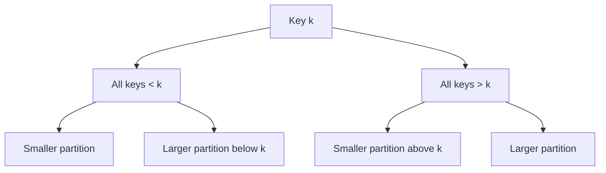
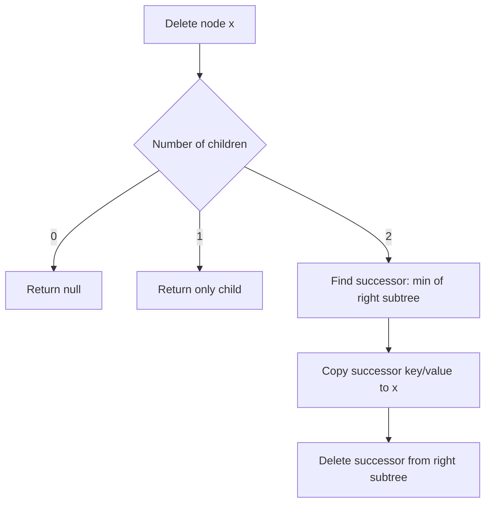

------
title: Learn Java Data Structures and Algorithms - Part 016
description: Binary search tree invariants, ordered index operations, deletion, floor and ceiling, range scans, comparator contracts, TreeMap and TreeSet usage, validation, and Java production design.
series: learn-java-dsa
seriesTitle: Learn Java Data Structures and Algorithms
order: 16
partTitle: Binary Search Trees and Ordered Indexes
tags:
- java
- data-structures
- algorithms
- dsa
- binary-search-tree
- bst
- treemap
- treeset
- ordered-index
- comparator
- series
date: 2026-06-27
---

# Part 016 — Binary Search Trees and Ordered Indexes

Part 015 covered binary tree traversal invariants.

Now we add one more invariant:

```text
keys in the left subtree are smaller
keys in the right subtree are larger
```

That single invariant turns a shape into an index.

A binary search tree is not primarily a tree trick.

It is an ordered dictionary whose cost depends on height.

---

## 1. Kaufman Skill Target

After this part, you should be able to:

1. State the BST invariant precisely using a comparator.
2. Implement search, insert, delete, minimum, maximum, predecessor, successor, floor, ceiling, and range scan.
3. Explain why operation cost is `O(h)` and why `h` can degrade to `n`.
4. Validate a BST using range constraints instead of local child checks.
5. Design duplicate-key policies explicitly.
6. Use Java `TreeMap`, `TreeSet`, `NavigableMap`, and `NavigableSet` as production ordered indexes.
7. Avoid comparator and mutable-key bugs.
8. Decide when a hash index, sorted array, heap, or ordered tree is the better choice.

The practice objective:

> Treat a BST as an ordered index with invariants, not as a recursive coding exercise.

---

## 2. The Mental Model: Ordered Partitioning

At every node, the key partitions the search space.

```text
left subtree  < node.key < right subtree
```



The invariant is global, not local.

It is not enough that:

```text
node.left.key < node.key
node.right.key > node.key
```

Every key in the entire left subtree must be smaller.

Every key in the entire right subtree must be larger.

---

## 3. BST Invariant with Comparator

For Java, ordering should be expressed with `Comparator<? super K>` or natural ordering.

Strict unique-key BST invariant:

```text
For every node x:
all keys in x.left  compare < x.key
all keys in x.right compare > x.key
```

With comparator `cmp`:

```java
cmp.compare(a, b) < 0
cmp.compare(a, b) == 0
cmp.compare(a, b) > 0
```

The tree's notion of key equality is usually:

```text
cmp.compare(a, b) == 0
```

Not necessarily:

```text
a.equals(b)
```

This distinction is critical for `TreeMap` and `TreeSet`.

---

## 4. Ordered Index Operations

An ordered index supports operations that a hash table does not naturally support:

| Operation | Meaning |
|---|---|
| `get(k)` | Find exact key |
| `put(k, v)` | Insert or replace by key order |
| `remove(k)` | Delete exact key |
| `min()` | Smallest key |
| `max()` | Largest key |
| `floor(k)` | Greatest key `<= k` |
| `ceiling(k)` | Smallest key `>= k` |
| `lower(k)` | Greatest key `< k` |
| `higher(k)` | Smallest key `> k` |
| `range(lo, hi)` | Iterate keys in sorted interval |
| `predecessor(k)` | Previous key in sorted order |
| `successor(k)` | Next key in sorted order |

If you need only exact lookup, a hash table is usually better.

If you need nearest-neighbor or sorted range queries, an ordered index becomes valuable.

---

## 5. Minimal BST Map Implementation

This implementation is intentionally unbalanced.

Part 017 covers balanced trees.

The purpose here is to understand the invariant and operations.

```java
import java.util.Comparator;
import java.util.Objects;
import java.util.Optional;

public final class SimpleBstMap<K, V> {
    private final Comparator<? super K> comparator;
    private Node<K, V> root;
    private int size;

    private static final class Node<K, V> {
        K key;
        V value;
        Node<K, V> left;
        Node<K, V> right;

        Node(K key, V value) {
            this.key = key;
            this.value = value;
        }
    }

    public SimpleBstMap(Comparator<? super K> comparator) {
        this.comparator = Objects.requireNonNull(comparator);
    }

    public int size() {
        return size;
    }

    private int compare(K a, K b) {
        return comparator.compare(a, b);
    }
}
```

Why not use `K extends Comparable<K>` only?

Because production indexes often need domain-specific ordering:

```text
sort by deadline, then priority, then id
sort by timestamp, then sequence
sort by status rank, then creation time
```

A comparator makes the ordering explicit.

---

## 6. Search

Search follows the partition decision at each node.

```java
public Optional<V> get(K key) {
    Objects.requireNonNull(key);

    Node<K, V> current = root;
    while (current != null) {
        int c = compare(key, current.key);
        if (c == 0) {
            return Optional.ofNullable(current.value);
        }
        current = c < 0 ? current.left : current.right;
    }

    return Optional.empty();
}
```

Loop invariant:

```text
If key exists, it is inside the subtree rooted at current.
```

Each comparison discards one side of the current node.

Cost:

```text
O(h)
```

where `h` is tree height.

---

## 7. Insertion

Insertion searches for the missing null slot where the key belongs.

If the key already exists under comparator equality, replace the value.

```java
public Optional<V> put(K key, V value) {
    Objects.requireNonNull(key);

    if (root == null) {
        root = new Node<>(key, value);
        size++;
        return Optional.empty();
    }

    Node<K, V> current = root;
    while (true) {
        int c = compare(key, current.key);

        if (c == 0) {
            V old = current.value;
            current.key = key;
            current.value = value;
            return Optional.ofNullable(old);
        }

        if (c < 0) {
            if (current.left == null) {
                current.left = new Node<>(key, value);
                size++;
                return Optional.empty();
            }
            current = current.left;
        } else {
            if (current.right == null) {
                current.right = new Node<>(key, value);
                size++;
                return Optional.empty();
            }
            current = current.right;
        }
    }
}
```

Important design choice:

```java
current.key = key;
```

When comparator equality says two keys are equal, replacing the stored key can be reasonable if the new key carries metadata not included in ordering.

But this can also surprise callers.

Production maps usually define clear semantics:

1. Comparator equality defines key identity.
2. Stored key may be the latest equal key or the first equal key depending on implementation.
3. Mutable key fields used by comparator are forbidden.

---

## 8. Minimum and Maximum

Minimum is found by walking left until null.

```java
public Optional<K> minKey() {
    Node<K, V> node = minNode(root);
    return node == null ? Optional.empty() : Optional.of(node.key);
}

private static <K, V> Node<K, V> minNode(Node<K, V> node) {
    if (node == null) {
        return null;
    }
    while (node.left != null) {
        node = node.left;
    }
    return node;
}
```

Maximum is symmetric:

```java
public Optional<K> maxKey() {
    Node<K, V> node = root;
    if (node == null) {
        return Optional.empty();
    }
    while (node.right != null) {
        node = node.right;
    }
    return Optional.of(node.key);
}
```

Invariant:

```text
At each left step, all keys to the right are larger, so minimum remains in the left subtree if it exists.
```

---

## 9. Floor and Ceiling

### 9.1 Floor

`floor(k)` is the greatest key `<= k`.

Search rule:

1. If current key is equal, current is the floor.
2. If current key is greater than target, floor must be in the left subtree.
3. If current key is less than target, current is a candidate; try to find a better one on the right.

```java
public Optional<K> floorKey(K key) {
    Objects.requireNonNull(key);

    Node<K, V> current = root;
    K candidate = null;

    while (current != null) {
        int c = compare(key, current.key);
        if (c == 0) {
            return Optional.of(current.key);
        }
        if (c < 0) {
            current = current.left;
        } else {
            candidate = current.key;
            current = current.right;
        }
    }

    return Optional.ofNullable(candidate);
}
```

Loop invariant:

```text
candidate is the greatest key seen so far that is <= target.
```

### 9.2 Ceiling

`ceiling(k)` is the smallest key `>= k`.

```java
public Optional<K> ceilingKey(K key) {
    Objects.requireNonNull(key);

    Node<K, V> current = root;
    K candidate = null;

    while (current != null) {
        int c = compare(key, current.key);
        if (c == 0) {
            return Optional.of(current.key);
        }
        if (c < 0) {
            candidate = current.key;
            current = current.left;
        } else {
            current = current.right;
        }
    }

    return Optional.ofNullable(candidate);
}
```

Loop invariant:

```text
candidate is the smallest key seen so far that is >= target.
```

---

## 10. Inorder Traversal Produces Sorted Keys

A BST adds semantic meaning to inorder traversal.

```java
public java.util.List<K> keysInOrder() {
    java.util.ArrayList<K> out = new java.util.ArrayList<>(size);
    inorder(root, out);
    return out;
}

private void inorder(Node<K, V> node, java.util.List<K> out) {
    if (node == null) {
        return;
    }
    inorder(node.left, out);
    out.add(node.key);
    inorder(node.right, out);
}
```

Correctness by induction:

1. Left subtree keys are sorted and all `< node.key`.
2. Right subtree keys are sorted and all `> node.key`.
3. Therefore `left + node + right` is sorted.

---

## 11. Range Scan

Range scan is the ordered-index operation that often justifies trees.

For half-open range `[lo, hi)`:

```java
public java.util.List<K> keysInRange(K loInclusive, K hiExclusive) {
    Objects.requireNonNull(loInclusive);
    Objects.requireNonNull(hiExclusive);

    java.util.ArrayList<K> out = new java.util.ArrayList<>();
    collectRange(root, loInclusive, hiExclusive, out);
    return out;
}

private void collectRange(Node<K, V> node, K lo, K hi, java.util.List<K> out) {
    if (node == null) {
        return;
    }

    int cmpLo = compare(node.key, lo);
    int cmpHi = compare(node.key, hi);

    if (cmpLo >= 0) {
        collectRange(node.left, lo, hi, out);
    }

    if (cmpLo >= 0 && cmpHi < 0) {
        out.add(node.key);
    }

    if (cmpHi < 0) {
        collectRange(node.right, lo, hi, out);
    }
}
```

Pruning invariants:

```text
If node.key < lo, the entire left subtree is also < lo and can be skipped.
If node.key >= hi, the entire right subtree is also >= hi and can be skipped.
```

Cost:

```text
O(h + m)
```

where `m` is the number of returned keys.

---

## 12. Deletion

Deletion is the most error-prone basic BST operation.

Cases:

1. Node has no children: remove it.
2. Node has one child: replace node with child.
3. Node has two children: replace node's key/value with successor, then delete successor.



Implementation:

```java
public Optional<V> remove(K key) {
    Objects.requireNonNull(key);
    Removal<K, V> removal = remove(root, key);
    root = removal.node;
    if (removal.removed) {
        size--;
    }
    return removal.oldValue;
}

private record Removal<K, V>(Node<K, V> node, boolean removed, Optional<V> oldValue) {}

private Removal<K, V> remove(Node<K, V> node, K key) {
    if (node == null) {
        return new Removal<>(null, false, Optional.empty());
    }

    int c = compare(key, node.key);

    if (c < 0) {
        Removal<K, V> r = remove(node.left, key);
        node.left = r.node;
        return new Removal<>(node, r.removed, r.oldValue);
    }

    if (c > 0) {
        Removal<K, V> r = remove(node.right, key);
        node.right = r.node;
        return new Removal<>(node, r.removed, r.oldValue);
    }

    Optional<V> oldValue = Optional.ofNullable(node.value);

    if (node.left == null) {
        return new Removal<>(node.right, true, oldValue);
    }

    if (node.right == null) {
        return new Removal<>(node.left, true, oldValue);
    }

    Node<K, V> successor = minNode(node.right);
    node.key = successor.key;
    node.value = successor.value;

    Removal<K, V> r = remove(node.right, successor.key);
    node.right = r.node;

    return new Removal<>(node, true, oldValue);
}
```

Invariant:

```text
remove(node, key) returns the new root of this subtree after deletion.
```

That return value is essential.

Without it, deleting the root of a subtree does not update the parent link correctly.

---

## 13. Validation: Do Not Only Check Children

Wrong validation:

```java
boolean wrong(Node<Integer, ?> node) {
    if (node == null) {
        return true;
    }
    if (node.left != null && node.left.key >= node.key) {
        return false;
    }
    if (node.right != null && node.right.key <= node.key) {
        return false;
    }
    return wrong(node.left) && wrong(node.right);
}
```

Counterexample:

```text
      10
     /  \
    5    15
        /  \
       6    20
```

Local checks pass at node `15` because `6 < 15`.

But `6` is in the right subtree of `10`, so it must be `> 10`.

Correct validation carries bounds:

```java
public boolean isValidBst() {
    return isValid(root, null, null);
}

private boolean isValid(Node<K, V> node, K lowerExclusive, K upperExclusive) {
    if (node == null) {
        return true;
    }

    if (lowerExclusive != null && compare(node.key, lowerExclusive) <= 0) {
        return false;
    }

    if (upperExclusive != null && compare(node.key, upperExclusive) >= 0) {
        return false;
    }

    return isValid(node.left, lowerExclusive, node.key)
        && isValid(node.right, node.key, upperExclusive);
}
```

Invariant:

```text
Every node in this recursive call must be within (lowerExclusive, upperExclusive).
```

---

## 14. Duplicate Key Policies

BSTs need a duplicate policy.

Common options:

| Policy | Rule | Use Case |
|---|---|---|
| Replace | `compare == 0` replaces value | Map semantics |
| Count | Store frequency at node | Multiset |
| Bucket | Store list of values at equal key | Secondary records |
| Tie-break | Include unique id in comparator | Stable total ordering |
| Side insertion | Equal keys always go left/right | Usually avoid |

Avoid side insertion as the default.

It makes search and deletion semantics ambiguous and can create long chains for equal keys.

For production ordered indexes, prefer a total ordering:

```java
Comparator<Event> byTimeThenId = Comparator
        .comparing(Event::time)
        .thenComparing(Event::id);
```

---

## 15. Comparator Contracts

A comparator used by an ordered structure must be stable and logically consistent.

Required properties:

| Property | Meaning |
|---|---|
| Antisymmetry | sign of `compare(a,b)` is opposite of `compare(b,a)` |
| Transitivity | if `a < b` and `b < c`, then `a < c` |
| Totality for inserted keys | any two inserted keys can be compared |
| Stability over time | comparison result does not change while key is in tree |

Bad comparator:

```java
Comparator<Integer> bad = (a, b) -> a - b;
```

Problem: integer overflow.

Use:

```java
Comparator<Integer> good = Integer::compare;
```

Bad mutable-key example:

```java
final class Task {
    String id;
    int priority;
}

Comparator<Task> byPriority = Comparator.comparingInt(t -> t.priority);
```

If a `Task` is inserted into a `TreeSet` and then `priority` changes, the tree is corrupted logically because the node remains in the old structural position.

The tree will not automatically re-index it.

---

## 16. Java `TreeMap`, `TreeSet`, and `NavigableMap`

For production Java, you rarely implement a raw BST.

Use library structures unless you need custom augmentation.

`TreeMap` is a `NavigableMap` implementation ordered by natural ordering or a comparator.

`TreeSet` is a `NavigableSet` implementation backed by a `TreeMap`.

Basic operations:

```java
java.util.NavigableMap<Long, String> byTimestamp = new java.util.TreeMap<>();

byTimestamp.put(1700000000000L, "created");
byTimestamp.put(1700000005000L, "assigned");
byTimestamp.put(1700000010000L, "escalated");

Long floor = byTimestamp.floorKey(1700000007000L);
Long ceiling = byTimestamp.ceilingKey(1700000007000L);

java.util.NavigableMap<Long, String> window =
        byTimestamp.subMap(1700000000000L, true, 1700000010000L, false);
```

`NavigableMap` provides:

```text
lowerEntry / lowerKey
floorEntry / floorKey
ceilingEntry / ceilingKey
higherEntry / higherKey
firstEntry / lastEntry
subMap / headMap / tailMap
descendingMap
```

These methods are exactly the ordered-index operations discussed above.

---

## 17. `TreeSet` Equality Trap

A `TreeSet` uses ordering to determine uniqueness.

If comparator says two elements compare as `0`, the set treats them as duplicates.

Example:

```java
record User(String id, String email) {}

Comparator<User> byEmailDomain = Comparator.comparing(
        user -> user.email().substring(user.email().indexOf('@') + 1)
);

java.util.Set<User> users = new java.util.TreeSet<>(byEmailDomain);
users.add(new User("u1", "a@example.com"));
users.add(new User("u2", "b@example.com"));

System.out.println(users.size()); // 1
```

Both users compare as equal because both have domain `example.com`.

This may be correct for a domain index.

It is wrong for a user set.

Fix with a tie-breaker:

```java
Comparator<User> byDomainThenId = Comparator
        .comparing((User user) -> user.email().substring(user.email().indexOf('@') + 1))
        .thenComparing(User::id);
```

Rule:

> If the structure represents unique entities, the comparator must include a unique identity tie-breaker or be consistent with entity equality.

---

## 18. Ordered Index Design Patterns

### 18.1 Time Window Index

```java
public final class TimeWindowIndex<V> {
    private final java.util.NavigableMap<Long, java.util.List<V>> byTime = new java.util.TreeMap<>();

    public void add(long timestampMillis, V value) {
        byTime.computeIfAbsent(timestampMillis, ignored -> new java.util.ArrayList<>()).add(value);
    }

    public java.util.List<V> between(long fromInclusive, long toExclusive) {
        java.util.ArrayList<V> result = new java.util.ArrayList<>();
        for (java.util.List<V> bucket : byTime.subMap(fromInclusive, true, toExclusive, false).values()) {
            result.addAll(bucket);
        }
        return result;
    }
}
```

This handles duplicate timestamps with buckets.

### 18.2 Composite Ordered Key

```java
record CaseOrderKey(int priorityRank, long dueAtMillis, String caseId)
        implements Comparable<CaseOrderKey> {

    @Override
    public int compareTo(CaseOrderKey other) {
        int c = Integer.compare(priorityRank, other.priorityRank);
        if (c != 0) return c;
        c = Long.compare(dueAtMillis, other.dueAtMillis);
        if (c != 0) return c;
        return caseId.compareTo(other.caseId);
    }
}
```

This produces a stable total order.

### 18.3 Secondary Index with Remove/Reinsert

If indexed fields change, remove then reinsert.

```java
public final class PriorityIndex<T> {
    private final java.util.TreeSet<T> index;

    public PriorityIndex(java.util.Comparator<? super T> comparator) {
        this.index = new java.util.TreeSet<>(comparator);
    }

    public void add(T item) {
        index.add(item);
    }

    public void updateIndexedFields(T oldSnapshot, T newSnapshot) {
        index.remove(oldSnapshot);
        index.add(newSnapshot);
    }
}
```

For mutable objects, a safer design stores immutable key snapshots in the index.

---

## 19. Choosing Between HashMap, TreeMap, Sorted Array, and Heap

| Need | Better Choice |
|---|---|
| Exact lookup only | `HashMap` |
| Exact membership only | `HashSet` |
| Sorted iteration | `TreeMap` / `TreeSet` |
| Floor/ceiling | `NavigableMap` / `NavigableSet` |
| Range scan | `NavigableMap.subMap` |
| Frequent min/max only | Heap / `PriorityQueue` |
| Static sorted data + binary search | Sorted array/list |
| Small data | Simpler structure usually wins |
| Mutable priority with arbitrary delete | Tree + identity map or custom heap handles |

A `PriorityQueue` gives quick min/max access but not efficient ordered range scan or arbitrary lookup.

A `HashMap` gives exact lookup but not sorted neighbors.

A sorted array gives excellent locality but expensive insertion.

A `TreeMap` gives dynamic ordered operations with predictable logarithmic behavior.

---

## 20. Complexity Budget

For an unbalanced BST:

| Operation | Time | Space |
|---|---:|---:|
| Search | `O(h)` | `O(1)` iterative |
| Insert | `O(h)` | `O(1)` iterative |
| Delete | `O(h)` | `O(h)` recursive or `O(1)` iterative with parent tracking |
| Min/max | `O(h)` | `O(1)` |
| Floor/ceiling | `O(h)` | `O(1)` |
| Inorder traversal | `O(n)` | `O(h)` |
| Range scan | `O(h + m)` | `O(h)` recursion or iterator state |
| Validation | `O(n)` | `O(h)` |

For balanced trees:

```text
h = O(log n)
```

For skewed trees:

```text
h = O(n)
```

That difference is why production ordered maps use balanced trees.

---

## 21. Failure Modes

| Failure Mode | Symptom | Root Cause |
|---|---|---|
| Local-only validation | Invalid tree accepted | Missing ancestor bounds |
| Mutable key | Lookup/remove fails after mutation | Ordering changed while node stayed in place |
| Comparator overflow | Wrong order for large ints | Using subtraction instead of compare method |
| Comparator not transitive | Sort/tree weirdness | Invalid ordering relation |
| Duplicate policy absent | Lost records or ambiguous search | `compare == 0` not defined semantically |
| Delete not returning subtree root | Parent still points to deleted node | Link update lost |
| Range scan visits all nodes | No pruning | Ignored ordered invariant |
| Using TreeSet as entity set with partial comparator | Missing elements | Comparator equality collapses distinct entities |
| Assuming `TreeMap` is thread-safe | Race/corruption/visibility bugs | External synchronization missing |

---

## 22. Production Review Checklist

Before using or implementing an ordered index, ask:

1. What is the exact key?
2. Is the ordering total for all inserted keys?
3. Is comparator equality the same as domain identity?
4. Are duplicates possible?
5. What is the duplicate policy?
6. Can indexed fields mutate?
7. If fields mutate, how is re-indexing enforced?
8. Are range boundaries inclusive or exclusive?
9. Is the workload exact lookup, nearest lookup, sorted scan, or min/max?
10. Is the expected data size large enough for constant factors to matter?
11. Is concurrency required?
12. Should a library structure be used instead of custom tree code?

---

## 23. Practice Loop

Exercises:

1. Implement `containsKey`, `put`, `remove`, `floorKey`, `ceilingKey`, and `keysInRange` for `SimpleBstMap`.
2. Write a validator using lower/upper bounds.
3. Generate all permutations of small key sets and verify inorder traversal is sorted after insertion.
4. Build a skewed BST by inserting sorted keys and measure height.
5. Build a balanced-ish BST by inserting median first recursively and compare height.
6. Implement a multiset BST that stores counts.
7. Implement a `TreeMap`-based time-window index.
8. Create a deliberately broken comparator and write a test showing unexpected `TreeSet` behavior.
9. Write a remove/reinsert workflow for mutable indexed fields.
10. Compare `HashMap`, `TreeMap`, sorted array, and heap for a workload with exact lookup, range query, and min extraction.

---

## 24. Self-Correction Checklist

A BST solution is probably wrong if:

1. It checks only immediate children during validation.
2. It never defines duplicate behavior.
3. It uses `a - b` in comparator logic.
4. It assumes `equals` controls `TreeSet` uniqueness.
5. It mutates indexed fields after insertion.
6. It uses a BST when the workload only needs exact lookup.
7. It uses a heap when the workload needs range scan.
8. It ignores skewed input.
9. It recursively processes deep untrusted input without considering stack depth.
10. It does not specify inclusive/exclusive range semantics.

---

## 25. Summary

A binary search tree is a binary tree plus a global ordering invariant.

That invariant enables search-space pruning:

```text
search      O(h)
insert      O(h)
delete      O(h)
floor       O(h)
ceiling     O(h)
range scan  O(h + m)
```

The height `h` is the cost driver.

Unbalanced trees teach the invariant.

Balanced trees make the invariant reliable under real workloads.

In production Java, `TreeMap`, `TreeSet`, `NavigableMap`, and `NavigableSet` are the default tools for dynamic ordered indexes.

Custom BSTs are justified when you need specialized augmentation, custom memory layout, or educational control.

The next part explains how balanced trees maintain height guarantees through rotations and structural invariants.
