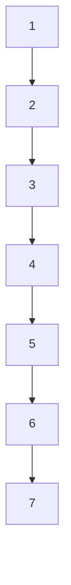
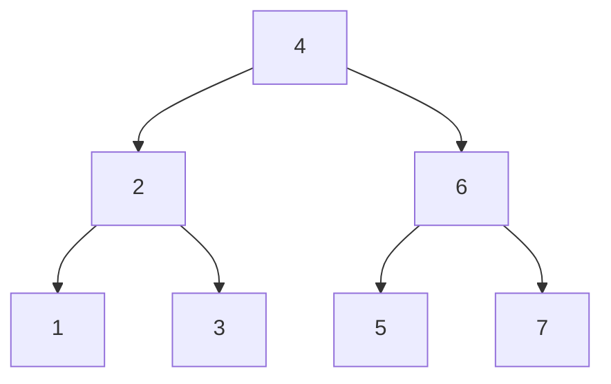
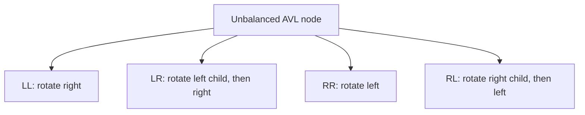
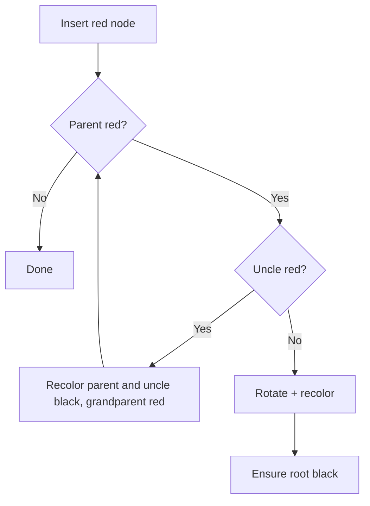

------
title: Learn Java Data Structures and Algorithms - Part 017
description: Balanced tree invariants, rotations, AVL trees, red-black trees, B-trees, B+ trees, TreeMap implications, and how ordered indexes stay logarithmic under real workloads.
series: learn-java-dsa
seriesTitle: Learn Java Data Structures and Algorithms
order: 17
partTitle: Balanced Trees: Red-Black, AVL, and B-Trees
tags:
- java
- data-structures
- algorithms
- dsa
- trees
- balanced-tree
- red-black-tree
- avl-tree
- b-tree
- treemap
- ordered-index
- series
date: 2026-06-27
---

# Part 017 — Balanced Trees: Red-Black, AVL, and B-Trees

Part 016 treated a binary search tree as an ordered index.

That model is correct, but incomplete.

A plain BST gives us ordered operations in `O(h)`, where `h` is tree height. If inserts arrive in sorted order, `h = n`, and the index collapses into a linked list.

Balanced trees solve exactly that failure mode.

They do not make ordering free. They make height a controlled resource.

---

## 1. Kaufman Skill Target

After this part, you should be able to:

1. Explain why plain BST performance depends on height, not directly on node count.
2. Use rotations as invariant-preserving transformations.
3. Describe AVL invariants and when AVL is attractive.
4. Describe red-black invariants and why `TreeMap` can guarantee logarithmic operations.
5. Explain B-tree and B+ tree design at the level needed to understand database and filesystem indexes.
6. Choose between hash table, sorted array, heap, balanced tree, and B-tree style index.
7. Identify production failure modes: comparator inconsistency, mutable keys, pathological allocation, recursion depth, and range-scan misuse.
8. Build tests that validate ordering and balance invariants, not just example outputs.

The practice objective:

> Stop thinking of balanced trees as memorized rotation cases. Treat them as indexed state machines with a small set of invariants that preserve logarithmic height.

---

## 2. Why Balance Exists

A BST operation follows one path from root to leaf.

```text
cost = number of decisions = path length = O(height)
```

For a perfectly balanced tree:

```text
height ≈ log2(n)
```

For a degenerate tree:

```text
height = n - 1
```

Example:

```text
Insert: 1, 2, 3, 4, 5, 6, 7
```

Plain BST:



Balanced shape:



The same keys. Different shape. Different operational contract.

A balanced tree adds metadata and repair logic so adversarial or unlucky insertion order does not determine index performance.

---

## 3. The Core Primitive: Rotation

A rotation changes local shape while preserving inorder ordering.

Right rotation:

```text
        y                 x
       / \               / \
      x   C     =>      A   y
     / \                   / \
    A   B                 B   C
```

Left rotation:

```text
      x                     y
     / \                   / \
    A   y       =>        x   C
       / \               / \
      B   C             A   B
```

The key observation:

```text
A < x < B < y < C
```

That relation is true before and after rotation.

So rotation preserves the BST invariant.

It only changes height distribution.

---

## 4. Java Rotation Skeleton

A rotation is easy to write and easy to corrupt. Parent pointers, root replacement, and child reassignment must be handled as one atomic structural operation.

```java
final class Rotations<K, V> {
    static final class Node<K, V> {
        K key;
        V value;
        Node<K, V> left;
        Node<K, V> right;
        Node<K, V> parent;

        Node(K key, V value, Node<K, V> parent) {
            this.key = key;
            this.value = value;
            this.parent = parent;
        }
    }

    private Node<K, V> root;

    private void replaceParentChild(Node<K, V> oldChild, Node<K, V> newChild) {
        Node<K, V> parent = oldChild.parent;

        if (parent == null) {
            root = newChild;
        } else if (parent.left == oldChild) {
            parent.left = newChild;
        } else if (parent.right == oldChild) {
            parent.right = newChild;
        } else {
            throw new IllegalStateException("broken parent pointer");
        }

        if (newChild != null) {
            newChild.parent = parent;
        }
    }

    private void rotateLeft(Node<K, V> x) {
        Node<K, V> y = x.right;
        if (y == null) {
            throw new IllegalArgumentException("cannot rotate left without right child");
        }

        x.right = y.left;
        if (y.left != null) {
            y.left.parent = x;
        }

        replaceParentChild(x, y);

        y.left = x;
        x.parent = y;
    }

    private void rotateRight(Node<K, V> y) {
        Node<K, V> x = y.left;
        if (x == null) {
            throw new IllegalArgumentException("cannot rotate right without left child");
        }

        y.left = x.right;
        if (x.right != null) {
            x.right.parent = y;
        }

        replaceParentChild(y, x);

        x.right = y;
        y.parent = x;
    }
}
```

The code is not yet AVL or red-black. It is the shared structural primitive.

If rotations are wrong, every balanced tree becomes untrustworthy.

---

## 5. Rotation Invariant Checklist

After any rotation:

1. Inorder traversal must be unchanged.
2. All parent pointers must be reciprocal.
3. The root pointer must be updated if rotation happens at the root.
4. No subtree may be lost.
5. Metadata must be recomputed in bottom-up order.
6. Comparator ordering must still hold.

A good test should assert these directly.

```java
static <K> void assertSorted(List<K> keys, Comparator<? super K> cmp) {
    for (int i = 1; i < keys.size(); i++) {
        if (cmp.compare(keys.get(i - 1), keys.get(i)) >= 0) {
            throw new AssertionError("not strictly sorted at index " + i);
        }
    }
}
```

---

## 6. AVL Trees: Balance by Height Difference

An AVL tree stores height metadata at every node.

Invariant:

```text
abs(height(left) - height(right)) <= 1
```

for every node.

This is a strong balance condition.

Result:

- lookup is very predictable,
- height is tightly controlled,
- insertion and deletion require rotations,
- each node needs height metadata,
- updates can perform more rebalancing than red-black trees.

AVL is attractive when reads dominate and you want tighter height than red-black trees.

---

## 7. AVL Balance Factor

```java
static int height(AvlNode<?, ?> node) {
    return node == null ? 0 : node.height;
}

static int balanceFactor(AvlNode<?, ?> node) {
    return height(node.left) - height(node.right);
}

static void updateHeight(AvlNode<?, ?> node) {
    node.height = 1 + Math.max(height(node.left), height(node.right));
}
```

Conventions vary.

This series uses:

```text
empty subtree height = 0
leaf height = 1
balance factor = leftHeight - rightHeight
```

Then:

```text
balance factor > 1   => left heavy
balance factor < -1  => right heavy
```

---

## 8. AVL Rotation Cases

Insertion can break balance at the first ancestor whose balance factor becomes `+2` or `-2`.

There are four cases.

```text
LL: left-left
LR: left-right
RR: right-right
RL: right-left
```



The names describe where the inserted key fell relative to the unbalanced node.

The repair is not magic. It is just local height redistribution while preserving inorder order.

---

## 9. Minimal AVL Insert Implementation

The following implementation is intentionally compact. It is enough to teach the invariant and to serve as a base for tests.

```java
import java.util.ArrayList;
import java.util.Comparator;
import java.util.List;
import java.util.Objects;

public final class AvlMap<K, V> {
    private static final class Node<K, V> {
        K key;
        V value;
        Node<K, V> left;
        Node<K, V> right;
        int height = 1;

        Node(K key, V value) {
            this.key = key;
            this.value = value;
        }
    }

    private final Comparator<? super K> comparator;
    private Node<K, V> root;
    private int size;

    public AvlMap(Comparator<? super K> comparator) {
        this.comparator = Objects.requireNonNull(comparator);
    }

    public int size() {
        return size;
    }

    public V get(K key) {
        Objects.requireNonNull(key);
        Node<K, V> cur = root;
        while (cur != null) {
            int c = comparator.compare(key, cur.key);
            if (c == 0) return cur.value;
            cur = c < 0 ? cur.left : cur.right;
        }
        return null;
    }

    public void put(K key, V value) {
        Objects.requireNonNull(key);
        root = put(root, key, value);
    }

    private Node<K, V> put(Node<K, V> node, K key, V value) {
        if (node == null) {
            size++;
            return new Node<>(key, value);
        }

        int c = comparator.compare(key, node.key);
        if (c < 0) {
            node.left = put(node.left, key, value);
        } else if (c > 0) {
            node.right = put(node.right, key, value);
        } else {
            node.value = value;
            return node;
        }

        updateHeight(node);
        return rebalance(node);
    }

    private Node<K, V> rebalance(Node<K, V> node) {
        int bf = balanceFactor(node);

        if (bf > 1) {
            if (balanceFactor(node.left) < 0) {
                node.left = rotateLeft(node.left);
            }
            return rotateRight(node);
        }

        if (bf < -1) {
            if (balanceFactor(node.right) > 0) {
                node.right = rotateRight(node.right);
            }
            return rotateLeft(node);
        }

        return node;
    }

    private Node<K, V> rotateLeft(Node<K, V> x) {
        Node<K, V> y = x.right;
        Node<K, V> b = y.left;

        y.left = x;
        x.right = b;

        updateHeight(x);
        updateHeight(y);

        return y;
    }

    private Node<K, V> rotateRight(Node<K, V> y) {
        Node<K, V> x = y.left;
        Node<K, V> b = x.right;

        x.right = y;
        y.left = b;

        updateHeight(y);
        updateHeight(x);

        return x;
    }

    private static int height(Node<?, ?> node) {
        return node == null ? 0 : node.height;
    }

    private static int balanceFactor(Node<?, ?> node) {
        return height(node.left) - height(node.right);
    }

    private static void updateHeight(Node<?, ?> node) {
        node.height = 1 + Math.max(height(node.left), height(node.right));
    }

    public List<K> keysInOrder() {
        ArrayList<K> out = new ArrayList<>();
        inOrder(root, out);
        return out;
    }

    private void inOrder(Node<K, V> node, List<K> out) {
        if (node == null) return;
        inOrder(node.left, out);
        out.add(node.key);
        inOrder(node.right, out);
    }

    public void assertInvariants() {
        assertInvariants(root, null, null);
    }

    private int assertInvariants(Node<K, V> node, K lowExclusive, K highExclusive) {
        if (node == null) return 0;

        if (lowExclusive != null && comparator.compare(node.key, lowExclusive) <= 0) {
            throw new AssertionError("key <= lower bound: " + node.key);
        }
        if (highExclusive != null && comparator.compare(node.key, highExclusive) >= 0) {
            throw new AssertionError("key >= upper bound: " + node.key);
        }

        int lh = assertInvariants(node.left, lowExclusive, node.key);
        int rh = assertInvariants(node.right, node.key, highExclusive);

        if (Math.abs(lh - rh) > 1) {
            throw new AssertionError("AVL balance broken at " + node.key);
        }

        int expectedHeight = 1 + Math.max(lh, rh);
        if (node.height != expectedHeight) {
            throw new AssertionError("wrong height at " + node.key);
        }

        return expectedHeight;
    }
}
```

Important design choices:

1. `put` returns the new subtree root.
2. Rotations return the new local root.
3. Height is updated bottom-up.
4. Duplicate keys replace values.
5. Validation checks both BST and AVL invariants.

---

## 10. AVL Deletion: Why It Feels Harder

Deletion has the same conceptual steps as plain BST deletion:

1. Find the node.
2. If it has two children, replace it with predecessor or successor.
3. Remove a node with at most one child.
4. Walk back upward and rebalance.

The harder part is not the deletion itself.

The harder part is that height can decrease, and multiple ancestors may become unbalanced.

Insertion usually stops after one local structural repair in AVL.

Deletion may require rebalancing all the way to the root.

For engineering, this means:

- write deletion after insertion is heavily tested,
- validate the full tree after randomized operations,
- compare behavior against `TreeMap` as an oracle,
- do not ship a custom AVL unless the requirement justifies it.

---

## 11. Red-Black Trees: Balance by Color Constraints

A red-black tree is a BST with color metadata.

Common invariants:

1. Every node is red or black.
2. Root is black.
3. Null leaves are considered black.
4. A red node cannot have a red child.
5. Every path from a node to descendant null leaves has the same number of black nodes.

The last quantity is called black height.

These rules do not force as tight a shape as AVL.

They force enough balance to keep height logarithmic.

---

## 12. Red-Black Intuition: Simulating 2-3-4 Trees

A useful mental model:

> Red nodes glue themselves to black parents to represent multi-key nodes.

A black node with red children can be interpreted as a 3-node or 4-node in a 2-3-4 tree.

```text
    B(20)
   /     \
 R(10)  R(30)
```

can be viewed as one multi-key node:

```text
[10 | 20 | 30]
```

This model explains why color flips and rotations appear during insertion.

The implementation is binary. The balance idea is multiway.

---

## 13. Red-Black Insertion Repair

Insertion starts as normal BST insertion.

New node is usually colored red.

Why red?

Because adding a red node does not increase black height.

Then repair red-red violations.

Typical cases:

1. Parent is black: done.
2. Parent is red and uncle is red: recolor parent and uncle black, grandparent red, continue upward.
3. Parent is red and uncle is black: rotate and recolor.



The algorithm is less strict than AVL. It often fixes balance with recoloring rather than rotations.

---

## 14. Red-Black vs AVL

| Dimension | AVL | Red-Black |
|---|---|---|
| Balance strictness | Stricter | Looser |
| Height | Usually smaller | Slightly taller possible |
| Lookup | Very predictable | Predictable enough |
| Insert/delete | Can rebalance more | Often fewer rotations |
| Metadata | Height or balance factor | Color bit |
| Common use | Read-heavy in-memory indexes | General-purpose ordered maps/sets |
| Java standard library | Not exposed as AVL | `TreeMap`/`TreeSet` use red-black tree |

Use the table carefully.

For most Java production code, the decision is rarely “should I implement AVL or red-black?”

It is usually:

> Should I use `TreeMap`, `TreeSet`, sorted array, `HashMap`, `PriorityQueue`, database index, or a specialized library?

---

## 15. Java TreeMap and TreeSet Implications

`TreeMap` is the standard ordered map in Java.

It matters because it gives you an ordered index with standard API support:

```java
import java.util.NavigableMap;
import java.util.TreeMap;

NavigableMap<Long, String> events = new TreeMap<>();

events.put(1000L, "created");
events.put(1500L, "validated");
events.put(2200L, "escalated");

Long next = events.ceilingKey(1200L);     // 1500
Long prev = events.floorKey(1200L);       // 1000

NavigableMap<Long, String> window = events.subMap(1000L, true, 2000L, false);
```

What `TreeMap` gives you:

1. Sorted keys.
2. Range views.
3. Floor, ceiling, lower, higher.
4. Predictable logarithmic base operations.
5. Comparator-defined ordering.

What it does not give you:

1. O(1) lookup like `HashMap` under ordinary assumptions.
2. Better locality than arrays.
3. Thread safety by default.
4. Correctness if comparator is inconsistent with equality.
5. Safety if keys mutate after insertion.

---

## 16. Comparator Consistency Is a Data Structure Invariant

For ordered maps and sets, equality is determined by comparator result `0`, not necessarily `equals`.

Dangerous example:

```java
import java.util.Comparator;
import java.util.TreeSet;

record User(long id, String email) {}

TreeSet<User> users = new TreeSet<>(Comparator.comparing(User::email));

users.add(new User(1, "a@example.com"));
users.add(new User(2, "a@example.com"));

System.out.println(users.size()); // 1
```

The set considers the second user duplicate because comparator says both have the same ordering key.

This can be correct if email is the identity.

It is a severe bug if `id` is the identity.

A comparator is not formatting logic. It defines the index identity.

---

## 17. Balanced Tree Cost Model

For `n` keys:

| Operation | Balanced BST | Plain degenerate BST | Sorted array | Hash table |
|---|---:|---:|---:|---:|
| Lookup exact key | `O(log n)` | `O(n)` | `O(log n)` | average `O(1)` |
| Insert | `O(log n)` | `O(n)` | `O(n)` shift | average `O(1)` |
| Delete | `O(log n)` | `O(n)` | `O(n)` shift | average `O(1)` |
| Ordered iteration | `O(n)` | `O(n)` | `O(n)` | not sorted |
| Range scan | `O(log n + k)` | `O(n)` | `O(log n + k)` | not natural |
| Floor/ceiling | `O(log n)` | `O(n)` | `O(log n)` | not natural |

Use balanced trees when dynamic ordered queries matter.

Use sorted arrays when writes are rare and compact memory matters.

Use hash tables when exact lookup dominates and ordering is irrelevant.

---

## 18. Sorted Array vs Balanced Tree

A sorted array can beat a balanced tree for read-heavy workloads.

Why?

1. Better locality.
2. Less allocation.
3. Lower per-entry overhead.
4. Binary search is branchy but cache-friendly compared to reference chasing.

But insertion is expensive because elements must shift.

This gives a clear design rule:

```text
if writes are rare and batchable:
    sorted array may be better
else if ordered queries and frequent updates matter:
    balanced tree is usually better
```

Example immutable index:

```java
import java.util.Arrays;

public final class ImmutableLongIndex {
    private final long[] keys;

    public ImmutableLongIndex(long[] keys) {
        this.keys = keys.clone();
        Arrays.sort(this.keys);
    }

    public boolean contains(long key) {
        return Arrays.binarySearch(keys, key) >= 0;
    }

    public int lowerBound(long key) {
        int lo = 0, hi = keys.length;
        while (lo < hi) {
            int mid = lo + ((hi - lo) >>> 1);
            if (keys[mid] < key) lo = mid + 1;
            else hi = mid;
        }
        return lo;
    }
}
```

This is not inferior. It is optimized for a different workload.

---

## 19. B-Trees: Balance for Blocks, Not Pointers

Binary trees optimize comparisons per decision.

B-trees optimize data movement across storage blocks and cache lines.

A B-tree node contains many keys and many children.

```text
[key0 | key1 | key2 | ... | keyM]
 child0 child1 child2 ... childM+1
```

Search inside a node chooses a child interval.

```mermaid
flowchart TD
    N[[10 | 20 | 30]]
    N --> C0[< 10]
    N --> C1[10..20]
    N --> C2[20..30]
    N --> C3[> 30]
```

The tree height becomes very small because branching factor is large.

If each node has hundreds of keys, millions of records may fit in a tree with only a few levels.

That is why database indexes are usually B-tree or B+ tree inspired, not binary search trees.

---

## 20. B-Tree Invariants

A B-tree of minimum degree `t` typically has these properties:

1. Every node contains at most `2t - 1` keys.
2. Every non-root node contains at least `t - 1` keys.
3. A node with `m` keys has `m + 1` children if it is internal.
4. Keys inside a node are sorted.
5. Child subtrees partition key ranges.
6. All leaves are at the same depth.

The last rule is the balance invariant.

Unlike AVL or red-black trees, balance is not maintained by binary rotations. It is maintained by split, merge, and redistribution.

---

## 21. B-Tree Search in Java

A simplified in-memory B-tree node search:

```java
import java.util.Arrays;

final class BTreeSearch {
    static final class Node {
        int keyCount;
        long[] keys;
        Node[] children;
        boolean leaf;

        Node(int capacity, boolean leaf) {
            this.keys = new long[capacity];
            this.children = new Node[capacity + 1];
            this.leaf = leaf;
        }
    }

    static boolean contains(Node node, long key) {
        while (node != null) {
            int i = lowerBound(node.keys, node.keyCount, key);

            if (i < node.keyCount && node.keys[i] == key) {
                return true;
            }

            if (node.leaf) {
                return false;
            }

            node = node.children[i];
        }
        return false;
    }

    static int lowerBound(long[] keys, int n, long key) {
        int lo = 0, hi = n;
        while (lo < hi) {
            int mid = lo + ((hi - lo) >>> 1);
            if (keys[mid] < key) lo = mid + 1;
            else hi = mid;
        }
        return lo;
    }

    static int lowerBoundUsingJdk(long[] keys, int n, long key) {
        int pos = Arrays.binarySearch(keys, 0, n, key);
        return pos >= 0 ? pos : -pos - 1;
    }
}
```

Real B-trees must handle:

1. Insert split.
2. Delete merge/borrow.
3. Page layout.
4. Write-ahead logging if durable.
5. Concurrency/latching.
6. Prefix compression.
7. Variable-length keys.
8. Range scans across leaves.

For this series, the important point is the mental model: B-trees are ordered indexes designed around block locality and high branching factor.

---

## 22. B+ Trees

A B+ tree stores actual records or record pointers primarily in leaves.

Internal nodes are routing indexes.

Leaves are commonly linked for range scans.

```mermaid
flowchart TD
    R[[30 | 60]]
    R --> A[[10 | 20]]
    R --> B[[30 | 40 | 50]]
    R --> C[[60 | 70 | 80]]
    A -. next .-> B
    B -. next .-> C
```

This is excellent for queries like:

```sql
WHERE created_at >= ? AND created_at < ?
ORDER BY created_at
```

The index can seek to the first leaf and then scan sequentially.

That is the same conceptual operation as `TreeMap.subMap(...).entrySet().iterator()`, but optimized for pages and storage engines.

---

## 23. Ordered Index Design Pattern

When modelling a production ordered index, define the operations first.

```java
import java.util.Iterator;
import java.util.Map;

public interface OrderedIndex<K, V> {
    V get(K key);
    V put(K key, V value);
    V remove(K key);

    Map.Entry<K, V> floor(K key);
    Map.Entry<K, V> ceiling(K key);

    Iterator<Map.Entry<K, V>> range(K fromInclusive, K toExclusive);

    int size();
}
```

Then select implementation:

| Requirement | Likely implementation |
|---|---|
| In-memory dynamic ordered map | `TreeMap` |
| In-memory read-mostly compact index | sorted arrays |
| Top/min/max only | heap / `PriorityQueue` |
| Exact lookup only | `HashMap` |
| Persistent large ordered data | database B-tree/B+ tree index |
| Concurrent sorted map | `ConcurrentSkipListMap` |

A balanced tree is one implementation of an ordered index, not the definition of the requirement.

---

## 24. Skip List Mention

Java also provides `ConcurrentSkipListMap` and `ConcurrentSkipListSet`.

A skip list is a probabilistic ordered structure.

It uses multiple linked levels to skip over ranges.

```text
level 3: 1 -------------------- 17
level 2: 1 -------- 9 --------- 17
level 1: 1 --- 5 --- 9 --- 13 -- 17
level 0: 1 2 3 4 5 6 7 8 9 ... 17
```

Why mention it here?

Because production Java ordered indexes are not limited to red-black trees.

For concurrent ordered maps, skip lists can be easier to make non-blocking or fine-grained concurrent than rotation-heavy trees.

We will revisit concurrency-specific trade-offs in Part 034.

---

## 25. Failure Mode: Mutable Keys

Any ordered index assumes key position remains valid.

This is broken if key fields mutate after insertion.

```java
import java.util.Comparator;
import java.util.TreeSet;

final class Task {
    long deadline;
    final String id;

    Task(String id, long deadline) {
        this.id = id;
        this.deadline = deadline;
    }
}

TreeSet<Task> tasks = new TreeSet<>(Comparator.comparingLong(t -> t.deadline));

Task t = new Task("A", 100);
tasks.add(t);

t.deadline = 10; // corrupts logical ordering
```

The tree does not know it needs to move `t`.

Correct approaches:

1. Use immutable keys.
2. Remove, mutate, reinsert.
3. Store IDs in index and keep mutable state elsewhere.
4. Use a priority queue with lazy invalidation if order changes often.

---

## 26. Failure Mode: Range Views Are Live

`TreeMap.subMap`, `headMap`, and `tailMap` return views, not detached snapshots.

This is powerful and dangerous.

```java
NavigableMap<Long, String> window = events.subMap(1000L, true, 2000L, false);

window.clear(); // removes entries from the original map too
```

This may be exactly what you want.

It may also be a production incident.

Treat range views as controlled mutating handles.

If you need a snapshot:

```java
NavigableMap<Long, String> snapshot = new TreeMap<>(window);
```

---

## 27. Failure Mode: Comparing by Subtraction

Never implement numeric comparator using subtraction.

```java
// Broken: overflow risk
Comparator<Integer> bad = (a, b) -> a - b;
```

Use:

```java
Comparator<Integer> good = Integer::compare;
```

For long:

```java
Comparator<Long> goodLong = Long::compare;
```

The comparator is part of the data structure's correctness proof.

Overflow can silently violate transitivity.

---

## 28. Testing Balanced Trees

Example randomized test against `TreeMap`:

```java
import java.util.Random;
import java.util.TreeMap;

static void randomizedAvlTest() {
    AvlMap<Integer, Integer> avl = new AvlMap<>(Integer::compare);
    TreeMap<Integer, Integer> oracle = new TreeMap<>();
    Random rnd = new Random(42);

    for (int step = 0; step < 100_000; step++) {
        int key = rnd.nextInt(10_000);
        int value = rnd.nextInt();

        avl.put(key, value);
        oracle.put(key, value);

        avl.assertInvariants();

        if (!avl.keysInOrder().equals(oracle.keySet().stream().toList())) {
            throw new AssertionError("key order mismatch at step " + step);
        }

        Integer probe = rnd.nextInt(10_000);
        if (!java.util.Objects.equals(avl.get(probe), oracle.get(probe))) {
            throw new AssertionError("get mismatch at step " + step);
        }
    }
}
```

The test does not prove correctness.

It catches many structural mistakes quickly.

For deletion, randomized testing is even more valuable.

---

## 29. Balance Invariant Validators

For AVL:

```text
for every node:
    height = 1 + max(height(left), height(right))
    abs(height(left) - height(right)) <= 1
```

For red-black:

```text
root is black
red node has black children
all root-to-null paths have same black height
BST ordering holds globally
```

For B-tree:

```text
keys inside node sorted
child ranges match separator keys
node occupancy within bounds
all leaves at same depth
```

Write validators before optimizing.

A balanced tree without invariant validators is a liability.

---

## 30. Complexity Is a Contract, Not a Vibe

A balanced tree promises logarithmic cost because the invariants bound height.

That means an implementation must preserve the invariants after every mutation.

```text
insert/delete correctness = semantic update + invariant restoration
```

If you only test lookup examples, you test semantic update.

You do not test restoration.

For production-grade DSA, restoration is where most subtle bugs live.

---

## 31. Production Decision Matrix

| Scenario | Recommended first choice | Reason |
|---|---|---|
| Need sorted map in normal Java app | `TreeMap` | Standard, tested, navigable API |
| Need sorted concurrent map | `ConcurrentSkipListMap` | Built for concurrent ordered access |
| Need exact lookup only | `HashMap` | Lower expected lookup cost |
| Need next deadline repeatedly | `PriorityQueue` | Heap solves repeated min extraction |
| Need frequent range scans over persisted data | database index | Storage engine already owns B-tree complexity |
| Need read-mostly ordered in-memory lookup | sorted array | Compact and cache-friendly |
| Need custom ranking statistic | augmented balanced tree | Store subtree sizes/aggregates |

Do not implement a balanced tree because it is intellectually satisfying.

Implement one when the required operation set is not covered by existing structures.

---

## 32. Augmented Balanced Trees

Balanced trees become very powerful when nodes store derived metadata.

Examples:

1. Subtree size for rank/select.
2. Subtree sum for prefix aggregate.
3. Max endpoint for interval overlap search.
4. Min deadline for scheduling windows.
5. Count of active entities for timeline queries.

The invariant becomes:

```text
node.metadata = combine(metadata(left), own value, metadata(right))
```

After every rotation, recompute metadata bottom-up.

```java
static final class AugNode {
    long key;
    long value;
    long subtreeSum;
    int subtreeSize;
    AugNode left;
    AugNode right;
}

static void recompute(AugNode n) {
    if (n == null) return;
    n.subtreeSize = 1 + size(n.left) + size(n.right);
    n.subtreeSum = n.value + sum(n.left) + sum(n.right);
}

static int size(AugNode n) {
    return n == null ? 0 : n.subtreeSize;
}

static long sum(AugNode n) {
    return n == null ? 0L : n.subtreeSum;
}
```

Rotation must update metadata in the right order:

```text
rotate left at x:
    x becomes child of y
    recompute(x)
    recompute(y)
```

This mirrors height recomputation in AVL.

---

## 33. Mental Model Summary

Balanced trees are about three ideas:

1. **Ordering invariant**: left keys before node, right keys after node.
2. **Balance invariant**: shape is constrained so height stays small.
3. **Repair operation**: mutation may break balance, so local transformations restore it.

AVL uses height difference.

Red-black uses color and black height.

B-trees use node occupancy and equal leaf depth.

All three exist because the same abstract requirement keeps appearing:

> Maintain a dynamic ordered index with predictable lookup, update, and range-query behavior.

---

## 34. Deliberate Practice Loop

Use this loop for this part:

1. Implement plain BST insert and inorder traversal.
2. Add rotation functions.
3. Write a test proving rotation preserves inorder sequence.
4. Add AVL height metadata.
5. Implement AVL insertion only.
6. Validate AVL invariants after every insert.
7. Generate sorted, reverse-sorted, random, and duplicate-heavy inputs.
8. Compare resulting height with plain BST height.
9. Use `TreeMap` to validate final key order and lookup behavior.
10. Explain why your implementation should not replace `TreeMap` in normal production code.

Timebox the custom implementation.

The goal is fluency with invariants, not building a better JDK.

---

## 35. Exercises

### Exercise 1: Rotation Preservation

Build a small tree with keys:

```text
10, 5, 15, 12, 20
```

Rotate left at `10`.

Assert that inorder traversal is unchanged.

### Exercise 2: Height Experiment

Insert `1..100_000` into:

1. Plain BST.
2. AVL tree.
3. `TreeMap`.

Track approximate height for the first two and operation time for all three.

Do not overinterpret raw timings without JMH, but observe the shape difference.

### Exercise 3: Comparator Bug

Create a `TreeSet<User>` where comparator compares only email.

Insert two users with different IDs and same email.

Explain whether the behavior is correct for your domain.

### Exercise 4: Range Index

Use `TreeMap<Long, List<Event>>` to model events by timestamp.

Implement:

```java
List<Event> eventsBetween(long fromInclusive, long toExclusive)
```

Decide whether duplicate timestamps are stored as lists, composite keys, or nested maps.

### Exercise 5: Augmented Tree Design

Design a node for an interval tree.

Each node stores:

```text
interval.start
interval.end
maxEndInSubtree
```

Write the recompute rule.

---

## 36. Self-Correction Checklist

Before moving on, you should be able to answer:

1. Why is plain BST `O(h)` rather than always `O(log n)`?
2. What does rotation preserve?
3. What metadata does AVL store?
4. What are the red-black invariants?
5. Why can a red-black tree be less strictly balanced but still logarithmic?
6. Why are B-trees more suitable for database indexes than binary trees?
7. Why can a sorted array beat a tree for read-heavy workloads?
8. Why is a comparator part of correctness, not just ordering preference?
9. What happens if a key mutates after insertion?
10. Why should range views be treated carefully?

---

## 37. Connection to the Next Part

Balanced trees answer ordered lookup and range-query problems.

They do not directly answer this problem:

> Repeatedly give me the smallest or highest-priority item, then remove it.

That is a priority queue problem.

Part 018 covers heaps, Java `PriorityQueue`, schedulers, top-k selection, and priority-update strategies.

---

## References

- Java SE 25 `TreeMap` API: Red-Black-tree-based `NavigableMap` and logarithmic base operations.
- Java SE 25 `TreeSet` API: sorted set backed by `TreeMap` semantics.
- Java SE 25 `Comparator` API: comparator contract and ordering semantics.
- Cormen, Leiserson, Rivest, and Stein, *Introduction to Algorithms*, balanced tree chapters.
