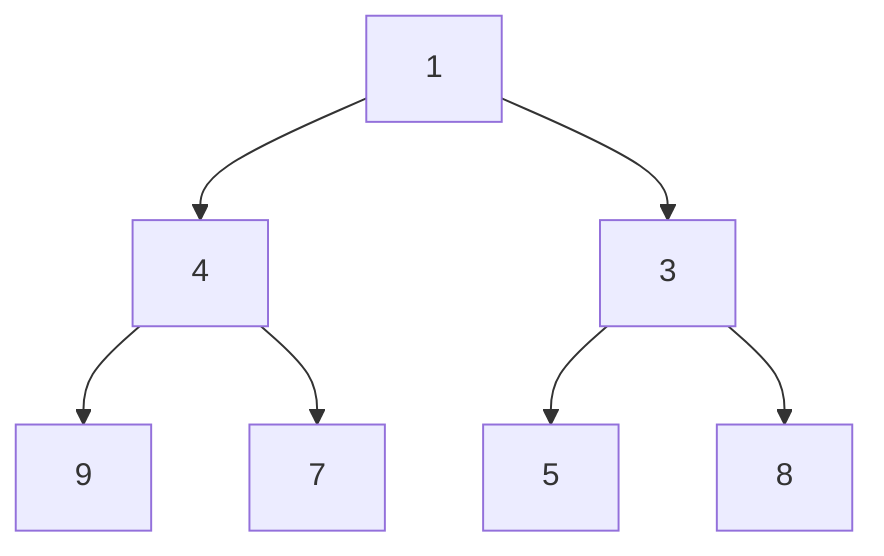

------
title: Learn Java Data Structures and Algorithms - Part 018
description: Heap invariants, binary heaps, d-ary heaps, Java PriorityQueue, priority updates, lazy deletion, schedulers, top-k, streaming median, and production failure modes.
series: learn-java-dsa
seriesTitle: Learn Java Data Structures and Algorithms
order: 18
partTitle: Heaps, Priority Queues, and Schedulers
tags:
- java
- data-structures
- algorithms
- dsa
- heap
- priority-queue
- scheduler
- top-k
- dijkstra
- series
date: 2026-06-27
---

# Part 018 — Heaps, Priority Queues, and Schedulers

Part 017 covered balanced trees: dynamic ordered indexes that support lookup, update, and range queries.

A priority queue solves a narrower problem:

> Repeatedly access and remove the best item according to priority.

It does not need to keep all elements globally sorted.

That narrower contract enables simpler and often faster operations.

---

## 1. Kaufman Skill Target

After this part, you should be able to:

1. State the heap invariant precisely.
2. Implement a binary min-heap with `offer`, `peek`, `poll`, and `heapify`.
3. Explain why heap operations are `O(log n)` while `peek` is `O(1)`.
4. Use Java `PriorityQueue` correctly and avoid iterator-order misunderstandings.
5. Choose between heap, balanced tree, sorted array, and hash table for priority workloads.
6. Model practical systems: schedulers, retry queues, timeout queues, top-k, k-way merge, Dijkstra frontier, and streaming median.
7. Handle priority changes using remove-and-reinsert, indexed heap, or lazy deletion.
8. Detect production failure modes around mutable priority, comparator overflow, tie-breaking, starvation, and concurrency.

The practice objective:

> Treat a priority queue as a partial-order data structure with a small API contract, not as a sorted list.

---

## 2. Priority Queue Contract

A min-priority queue supports:

```text
add item with priority
inspect minimum-priority item
remove minimum-priority item
```

It does not promise ordered iteration.

It promises only that the next removal returns the current minimum.

This distinction is crucial.

```text
PriorityQueue != sorted collection
PriorityQueue == repeated best-item extraction
```

---

## 3. Heap Mental Model

A binary heap combines two invariants:

### Shape invariant

The tree is complete.

Every level is full except possibly the last, and the last level is filled left to right.

### Order invariant

For a min-heap:

```text
parent.priority <= child.priority
```

This means the root is globally minimum.

It does not mean the left child is less than the right child.

It does not mean inorder traversal is sorted.



This heap is valid even though siblings are not sorted relative to each other.

---

## 4. Array Representation

Because the tree is complete, it can be stored compactly in an array.

For zero-based indexing:

```text
parent(i) = (i - 1) / 2
left(i)   = 2 * i + 1
right(i)  = 2 * i + 2
```

Example:

```text
index:  0  1  2  3  4  5  6
value: [1, 4, 3, 9, 7, 5, 8]
```

Tree:

```text
          1
       /     \
      4       3
    /  \     / \
   9    7   5   8
```

Array representation avoids per-node allocation and parent/child references.

This is one reason heaps are often memory-efficient compared to tree nodes.

---

## 5. `offer`: Bubble Up

To insert:

1. Append at the end to preserve complete shape.
2. Move upward while the new item has higher priority than its parent.

```text
append -> compare with parent -> swap -> repeat
```

Maximum swaps: heap height.

```text
height = floor(log2(n))
```

So insertion is `O(log n)`.

---

## 6. `poll`: Bubble Down

To remove min:

1. Save root.
2. Move last element to root.
3. Remove last slot.
4. Move root downward by swapping with the smaller child until heap invariant holds.

Maximum swaps: heap height.

So removal is `O(log n)`.

---

## 7. Complete Binary Min-Heap in Java

This implementation uses `Object[]` internally, similar to many generic container designs.

```java
import java.util.Arrays;
import java.util.Comparator;
import java.util.NoSuchElementException;
import java.util.Objects;

public final class BinaryMinHeap<E> {
    private static final int DEFAULT_CAPACITY = 16;

    private final Comparator<? super E> comparator;
    private Object[] elements;
    private int size;

    public BinaryMinHeap(Comparator<? super E> comparator) {
        this.comparator = Objects.requireNonNull(comparator);
        this.elements = new Object[DEFAULT_CAPACITY];
    }

    public int size() {
        return size;
    }

    public boolean isEmpty() {
        return size == 0;
    }

    public void offer(E item) {
        Objects.requireNonNull(item, "heap does not support null items");
        ensureCapacity(size + 1);
        elements[size] = item;
        siftUp(size);
        size++;
    }

    public E peek() {
        if (size == 0) return null;
        return elementAt(0);
    }

    public E poll() {
        if (size == 0) return null;

        E min = elementAt(0);
        int last = --size;
        E moved = elementAt(last);
        elements[last] = null;

        if (last > 0) {
            elements[0] = moved;
            siftDown(0);
        }

        return min;
    }

    public E removeMinOrThrow() {
        E value = poll();
        if (value == null) {
            throw new NoSuchElementException();
        }
        return value;
    }

    private void siftUp(int childIndex) {
        Object target = elements[childIndex];

        while (childIndex > 0) {
            int parentIndex = (childIndex - 1) >>> 1;
            Object parent = elements[parentIndex];

            if (compare(target, parent) >= 0) {
                break;
            }

            elements[childIndex] = parent;
            childIndex = parentIndex;
        }

        elements[childIndex] = target;
    }

    private void siftDown(int parentIndex) {
        Object target = elements[parentIndex];
        int half = size >>> 1; // nodes from half onward are leaves

        while (parentIndex < half) {
            int left = (parentIndex << 1) + 1;
            int right = left + 1;
            int bestChild = left;
            Object best = elements[left];

            if (right < size && compare(elements[right], best) < 0) {
                bestChild = right;
                best = elements[right];
            }

            if (compare(target, best) <= 0) {
                break;
            }

            elements[parentIndex] = best;
            parentIndex = bestChild;
        }

        elements[parentIndex] = target;
    }

    private void ensureCapacity(int wanted) {
        if (wanted <= elements.length) return;
        int next = elements.length + (elements.length >>> 1) + 1;
        if (next < wanted) next = wanted;
        elements = Arrays.copyOf(elements, next);
    }

    @SuppressWarnings("unchecked")
    private E elementAt(int index) {
        return (E) elements[index];
    }

    @SuppressWarnings("unchecked")
    private int compare(Object a, Object b) {
        return comparator.compare((E) a, (E) b);
    }

    public void assertHeapInvariant() {
        for (int i = 1; i < size; i++) {
            int parent = (i - 1) >>> 1;
            if (compare(elements[parent], elements[i]) > 0) {
                throw new AssertionError("heap invariant broken at index " + i);
            }
        }
    }
}
```

Implementation notes:

1. `siftUp` moves parent down until the right position is found. This avoids repeated swaps.
2. `siftDown` only iterates through non-leaf nodes.
3. Removed references are nulled to avoid memory retention.
4. `peek` and `poll` return `null` for empty heap, matching common queue style.
5. Null elements are rejected so `null` can signal absence.

---

## 8. Heapify: Build Heap in Linear Time

If you already have all elements, inserting one by one costs `O(n log n)`.

Heapify builds a heap in `O(n)`.

Algorithm:

```text
for each internal node from last parent down to root:
    siftDown(node)
```

Why `O(n)`?

Most nodes are near the leaves and can move only a short distance.

```java
public static <E> void heapify(E[] a, Comparator<? super E> cmp) {
    for (int i = (a.length >>> 1) - 1; i >= 0; i--) {
        siftDown(a, i, a.length, cmp);
    }
}

private static <E> void siftDown(E[] a, int i, int size, Comparator<? super E> cmp) {
    E target = a[i];
    int half = size >>> 1;

    while (i < half) {
        int left = (i << 1) + 1;
        int right = left + 1;
        int bestChild = left;
        E best = a[left];

        if (right < size && cmp.compare(a[right], best) < 0) {
            bestChild = right;
            best = a[right];
        }

        if (cmp.compare(target, best) <= 0) {
            break;
        }

        a[i] = best;
        i = bestChild;
    }

    a[i] = target;
}
```

Use heapify when input is batch-loaded.

Use repeated `offer` when input is online.

---

## 9. Heap Sort

Heap sort uses a heap to sort in-place.

For ascending sort with a max-heap:

1. Build max-heap.
2. Swap root with last element.
3. Shrink heap size.
4. Sift down root.
5. Repeat.

Properties:

| Property | Heap sort |
|---|---:|
| Worst-case time | `O(n log n)` |
| Extra memory | `O(1)` in-place variant |
| Stable | No |
| Cache locality | Better than pointer trees, often worse than tuned quicksort/Timsort |

In Java application code, you rarely implement heap sort manually because `Arrays.sort` and `Collections.sort` are heavily optimized and semantically clearer.

But heap sort matters conceptually because it shows how heap invariant supports repeated extraction.

---

## 10. Java `PriorityQueue`

Java provides `java.util.PriorityQueue`.

Typical usage:

```java
import java.util.Comparator;
import java.util.PriorityQueue;

record Job(String id, long deadlineMillis, int priority) {}

PriorityQueue<Job> queue = new PriorityQueue<>(
    Comparator.comparingLong(Job::deadlineMillis)
              .thenComparingInt(Job::priority)
              .thenComparing(Job::id)
);

queue.offer(new Job("A", 1000, 2));
queue.offer(new Job("B", 500, 1));
queue.offer(new Job("C", 500, 0));

while (!queue.isEmpty()) {
    Job next = queue.poll();
    process(next);
}
```

```java
static void process(Job job) {
    System.out.println(job);
}
```

Key semantics:

1. The head is the least element according to ordering.
2. `null` elements are not allowed.
3. It is unbounded in the logical sense, but grows its internal capacity.
4. It is not thread-safe.
5. Iteration order is not priority order.
6. Equal-priority tie behavior is not guaranteed unless your comparator breaks ties.

---

## 11. Iterator Order Trap

This is a common misunderstanding:

```java
PriorityQueue<Integer> pq = new PriorityQueue<>();
pq.add(5);
pq.add(1);
pq.add(3);
pq.add(2);

for (int x : pq) {
    System.out.println(x); // not guaranteed sorted
}
```

Correct way to drain in priority order:

```java
while (!pq.isEmpty()) {
    System.out.println(pq.poll());
}
```

But draining mutates the queue.

If you need a sorted snapshot:

```java
Object[] snapshot = pq.toArray();
Arrays.sort(snapshot);
```

For custom types, use the same comparator.

---

## 12. Comparator Tie-Breaking

A priority queue should usually have deterministic tie-breaking.

Bad:

```java
Comparator<Job> byDeadlineOnly = Comparator.comparingLong(Job::deadlineMillis);
```

Better:

```java
Comparator<Job> byDeadlineThenPriorityThenId =
    Comparator.comparingLong(Job::deadlineMillis)
              .thenComparingInt(Job::priority)
              .thenComparing(Job::id);
```

Why it matters:

1. Tests become deterministic.
2. Logs become easier to reason about.
3. Replays become more stable.
4. Starvation analysis is clearer.
5. Equal-priority behavior is explicit.

---

## 13. Priority Is an Immutable Index Key

Do not mutate fields used by the comparator after insertion.

```java
record MutableTask(String id) {
    static long deadline; // intentionally terrible example
}
```

More realistic:

```java
final class Task {
    final String id;
    long deadline;

    Task(String id, long deadline) {
        this.id = id;
        this.deadline = deadline;
    }
}

PriorityQueue<Task> pq = new PriorityQueue<>(Comparator.comparingLong(t -> t.deadline));
Task t = new Task("A", 1000);
pq.offer(t);

t.deadline = 1; // queue does not automatically reorder
```

The heap array is not notified.

Correct options:

1. Remove and reinsert the task.
2. Insert a new version and lazily ignore stale entries.
3. Use an indexed heap that supports priority update.
4. Use a `TreeMap` if you need efficient remove by key plus priority order.

---

## 14. Remove-and-Reinsert

For small queues or infrequent updates:

```java
pq.remove(task); // O(n), because arbitrary removal requires search
update(task);
pq.offer(task);  // O(log n)
```

The problem is `remove(Object)` is linear in a binary heap without an index.

This is acceptable when:

1. Queue is small.
2. Updates are rare.
3. Simplicity matters more than optimality.

It is not acceptable for high-volume Dijkstra-style workloads.

---

## 15. Lazy Deletion

Lazy deletion avoids arbitrary removal.

Instead of updating an existing heap entry, insert a new version.

When polling, discard stale entries.

```java
import java.util.HashMap;
import java.util.Map;
import java.util.PriorityQueue;

public final class DeadlineQueue {
    private record Entry(String id, long deadline, long version) {}

    private final PriorityQueue<Entry> pq = new PriorityQueue<>(
        Comparator.comparingLong(Entry::deadline)
                  .thenComparing(Entry::id)
                  .thenComparingLong(Entry::version)
    );

    private final Map<String, Long> currentVersion = new HashMap<>();

    public void schedule(String id, long deadline) {
        long version = currentVersion.merge(id, 1L, Long::sum);
        pq.offer(new Entry(id, deadline, version));
    }

    public String pollReady(long now) {
        while (!pq.isEmpty()) {
            Entry e = pq.peek();

            long current = currentVersion.getOrDefault(e.id(), -1L);
            if (e.version() != current) {
                pq.poll(); // stale
                continue;
            }

            if (e.deadline() > now) {
                return null;
            }

            pq.poll();
            currentVersion.remove(e.id());
            return e.id();
        }
        return null;
    }
}
```

Trade-offs:

| Dimension | Lazy deletion |
|---|---|
| Priority update | `O(log n)` insert new version |
| Poll | May discard stale entries |
| Memory | Can grow with stale entries |
| Simplicity | Usually good |
| Worst-case latency | Can spike if many stale entries accumulate |

Mitigation:

```text
if heap.size() > factor * activeItemCount:
    rebuild heap from active entries
```

---

## 16. Indexed Heap

An indexed heap stores a map from item ID to heap position.

This allows priority updates in `O(log n)`.

Additional invariant:

```text
positions[id] == current array index of id
```

Every swap must update the map.

```java
import java.util.ArrayList;
import java.util.HashMap;
import java.util.Map;
import java.util.NoSuchElementException;

public final class IndexedLongMinHeap {
    private static final class Node {
        final String id;
        long priority;

        Node(String id, long priority) {
            this.id = id;
            this.priority = priority;
        }
    }

    private final ArrayList<Node> heap = new ArrayList<>();
    private final Map<String, Integer> indexById = new HashMap<>();

    public boolean contains(String id) {
        return indexById.containsKey(id);
    }

    public void addOrUpdate(String id, long priority) {
        Integer index = indexById.get(id);
        if (index == null) {
            Node node = new Node(id, priority);
            heap.add(node);
            int i = heap.size() - 1;
            indexById.put(id, i);
            siftUp(i);
        } else {
            Node node = heap.get(index);
            long old = node.priority;
            node.priority = priority;
            if (priority < old) siftUp(index);
            else if (priority > old) siftDown(index);
        }
    }

    public String pollMin() {
        if (heap.isEmpty()) throw new NoSuchElementException();
        String id = heap.get(0).id;
        removeAt(0);
        return id;
    }

    public long priorityOf(String id) {
        Integer index = indexById.get(id);
        if (index == null) throw new NoSuchElementException(id);
        return heap.get(index).priority;
    }

    private void removeAt(int i) {
        int last = heap.size() - 1;
        swap(i, last);

        Node removed = heap.remove(last);
        indexById.remove(removed.id);

        if (i < heap.size()) {
            siftUp(i);
            siftDown(i);
        }
    }

    private void siftUp(int i) {
        while (i > 0) {
            int p = (i - 1) >>> 1;
            if (heap.get(p).priority <= heap.get(i).priority) break;
            swap(i, p);
            i = p;
        }
    }

    private void siftDown(int i) {
        int half = heap.size() >>> 1;
        while (i < half) {
            int left = (i << 1) + 1;
            int right = left + 1;
            int best = left;

            if (right < heap.size()
                    && heap.get(right).priority < heap.get(left).priority) {
                best = right;
            }

            if (heap.get(i).priority <= heap.get(best).priority) break;
            swap(i, best);
            i = best;
        }
    }

    private void swap(int i, int j) {
        if (i == j) return;

        Node a = heap.get(i);
        Node b = heap.get(j);
        heap.set(i, b);
        heap.set(j, a);
        indexById.put(a.id, j);
        indexById.put(b.id, i);
    }

    public void assertInvariants() {
        for (int i = 0; i < heap.size(); i++) {
            Node n = heap.get(i);
            Integer index = indexById.get(n.id);
            if (index == null || index != i) {
                throw new AssertionError("broken index map for " + n.id);
            }

            int left = (i << 1) + 1;
            int right = left + 1;
            if (left < heap.size() && heap.get(i).priority > heap.get(left).priority) {
                throw new AssertionError("heap invariant broken");
            }
            if (right < heap.size() && heap.get(i).priority > heap.get(right).priority) {
                throw new AssertionError("heap invariant broken");
            }
        }
    }
}
```

Indexed heaps are useful when:

1. You need efficient decrease-key or increase-key.
2. Item identity is stable.
3. You can afford the extra map.
4. Every swap reliably updates positions.

This extra invariant is also the source of bugs.

---

## 17. Dijkstra and Priority Updates

Shortest-path algorithms often need priority update.

Classic Dijkstra decreases the tentative distance of a vertex.

With Java `PriorityQueue`, a common approach is lazy insertion:

```java
record State(int vertex, long distance) {}

static long[] dijkstra(Graph g, int source) {
    long[] dist = new long[g.size()];
    Arrays.fill(dist, Long.MAX_VALUE);
    dist[source] = 0;

    PriorityQueue<State> pq = new PriorityQueue<>(
        Comparator.comparingLong(State::distance)
    );
    pq.offer(new State(source, 0));

    while (!pq.isEmpty()) {
        State cur = pq.poll();

        if (cur.distance() != dist[cur.vertex()]) {
            continue; // stale heap entry
        }

        for (Edge e : g.edgesFrom(cur.vertex())) {
            long next = cur.distance() + e.weight();
            if (next < dist[e.to()]) {
                dist[e.to()] = next;
                pq.offer(new State(e.to(), next));
            }
        }
    }

    return dist;
}
```

This avoids decrease-key.

But it may add multiple entries for the same vertex.

That is often acceptable and simpler in Java.

We will revisit shortest paths in Part 022.

---

## 18. D-Ary Heaps

A binary heap has 2 children per node.

A d-ary heap has `d` children.

For zero-based indexing:

```text
parent(i) = (i - 1) / d
child(i, k) = d * i + k + 1, where 0 <= k < d
```

Trade-off:

| Operation | Binary heap | D-ary heap |
|---|---:|---:|
| Height | `log2(n)` | `logd(n)` |
| Sift down comparison per level | up to 2 children | up to d children |
| Insert | fewer child comparisons | shorter path |
| Poll | more child scans per level | shorter path |

D-ary heaps can be useful when decrease-key/insert is frequent or when cache behavior favors wider nodes.

But Java's standard `PriorityQueue` is the default unless profiling proves otherwise.

---

## 19. Top-K with a Heap

Problem:

> Find the largest `k` values from a stream of `n` values.

Do not sort all `n` values if `k` is small.

Maintain a min-heap of size `k`.

```java
import java.util.ArrayList;
import java.util.Collections;
import java.util.List;
import java.util.PriorityQueue;

public static List<Integer> topK(List<Integer> input, int k) {
    if (k < 0) throw new IllegalArgumentException("k < 0");
    if (k == 0) return List.of();

    PriorityQueue<Integer> heap = new PriorityQueue<>();

    for (int x : input) {
        if (heap.size() < k) {
            heap.offer(x);
        } else if (x > heap.peek()) {
            heap.poll();
            heap.offer(x);
        }
    }

    ArrayList<Integer> result = new ArrayList<>(heap);
    result.sort(Collections.reverseOrder());
    return result;
}
```

Complexity:

```text
O(n log k) time
O(k) memory
```

This is a large improvement over `O(n log n)` when `k << n`.

---

## 20. Streaming Median with Two Heaps

Maintain two heaps:

1. Max-heap for lower half.
2. Min-heap for upper half.

Invariants:

```text
size difference <= 1
max(lower) <= min(upper)
```

```java
import java.util.Collections;
import java.util.PriorityQueue;

public final class StreamingMedian {
    private final PriorityQueue<Integer> lower =
        new PriorityQueue<>(Collections.reverseOrder()); // max-heap

    private final PriorityQueue<Integer> upper =
        new PriorityQueue<>(); // min-heap

    public void add(int x) {
        if (lower.isEmpty() || x <= lower.peek()) {
            lower.offer(x);
        } else {
            upper.offer(x);
        }
        rebalance();
    }

    public double median() {
        int total = lower.size() + upper.size();
        if (total == 0) throw new IllegalStateException("empty");

        if (lower.size() == upper.size()) {
            return ((long) lower.peek() + (long) upper.peek()) / 2.0;
        }
        return lower.size() > upper.size() ? lower.peek() : upper.peek();
    }

    private void rebalance() {
        if (lower.size() > upper.size() + 1) {
            upper.offer(lower.poll());
        } else if (upper.size() > lower.size() + 1) {
            lower.offer(upper.poll());
        }
    }

    public void assertInvariants() {
        if (Math.abs(lower.size() - upper.size()) > 1) {
            throw new AssertionError("size invariant broken");
        }
        if (!lower.isEmpty() && !upper.isEmpty() && lower.peek() > upper.peek()) {
            throw new AssertionError("ordering invariant broken");
        }
    }
}
```

This is not just a trick.

It is a partitioned order-statistics structure.

---

## 21. K-Way Merge

Problem:

> Merge `k` sorted streams.

Use a heap containing the current head of each stream.

```java
import java.util.ArrayList;
import java.util.Comparator;
import java.util.List;
import java.util.PriorityQueue;

public static List<Integer> mergeSortedLists(List<List<Integer>> lists) {
    record Cursor(int value, int listIndex, int elementIndex) {}

    PriorityQueue<Cursor> pq = new PriorityQueue<>(
        Comparator.comparingInt(Cursor::value)
                  .thenComparingInt(Cursor::listIndex)
                  .thenComparingInt(Cursor::elementIndex)
    );

    for (int i = 0; i < lists.size(); i++) {
        if (!lists.get(i).isEmpty()) {
            pq.offer(new Cursor(lists.get(i).get(0), i, 0));
        }
    }

    ArrayList<Integer> out = new ArrayList<>();

    while (!pq.isEmpty()) {
        Cursor c = pq.poll();
        out.add(c.value());

        int nextIndex = c.elementIndex() + 1;
        List<Integer> source = lists.get(c.listIndex());
        if (nextIndex < source.size()) {
            pq.offer(new Cursor(source.get(nextIndex), c.listIndex(), nextIndex));
        }
    }

    return out;
}
```

Complexity:

```text
N total elements
k lists
O(N log k) time
O(k) memory
```

This pattern appears in log merging, external sorting, search result merging, and stream processing.

---

## 22. Event Scheduler

A scheduler repeatedly runs the next due item.

Priority key:

```text
nextRunAt
```

Use a priority queue ordered by `nextRunAt`.

```java
import java.time.Clock;
import java.util.Comparator;
import java.util.PriorityQueue;

public final class SimpleScheduler {
    private record ScheduledTask(long runAtMillis, long seq, Runnable task) {}

    private final Clock clock;
    private final PriorityQueue<ScheduledTask> queue;
    private long sequence;

    public SimpleScheduler(Clock clock) {
        this.clock = clock;
        this.queue = new PriorityQueue<>(
            Comparator.comparingLong(ScheduledTask::runAtMillis)
                      .thenComparingLong(ScheduledTask::seq)
        );
    }

    public void schedule(long runAtMillis, Runnable task) {
        queue.offer(new ScheduledTask(runAtMillis, sequence++, task));
    }

    public int runDueTasks(int maxTasks) {
        int ran = 0;
        long now = clock.millis();

        while (ran < maxTasks && !queue.isEmpty()) {
            ScheduledTask next = queue.peek();
            if (next.runAtMillis() > now) break;

            queue.poll();
            next.task().run();
            ran++;
        }

        return ran;
    }
}
```

The sequence number gives FIFO behavior among equal deadlines.

Production schedulers also need:

1. Thread safety.
2. Wake-up mechanics.
3. Cancellation.
4. Retry/backoff.
5. Persistence or recovery.
6. Metrics and tracing.
7. Clock-skew handling.
8. Long-running task isolation.

The heap solves priority ordering, not the whole scheduler.

---

## 23. Timeout Queue

A timeout queue is a scheduler specialized for expiry.

Examples:

1. Request deadlines.
2. Cache entry expiration.
3. Session timeout.
4. Retry visibility timeout.
5. Lock lease expiration.

Heap approach:

```text
priority = expiresAt
poll while min.expiresAt <= now
```

Lazy cancellation is common:

```text
cancel(id): mark as cancelled
poll(): discard cancelled entries until head is active
```

This avoids `O(n)` removal from the heap.

But stale entries can accumulate, so rebuilding may be necessary.

---

## 24. Priority Queue vs TreeMap for Scheduling

Both can model deadlines.

| Requirement | `PriorityQueue` | `TreeMap` |
|---|---:|---:|
| Get next due item | Excellent | Good |
| Remove arbitrary task by ID | Poor unless indexed/lazy | Needs extra ID map; deadline bucket removal possible |
| Iterate all tasks in deadline order | Destructive unless copied | Natural |
| Range query due in window | Not natural | Natural with `subMap` |
| Duplicate deadlines | Natural with comparator tie-breaker | Use bucket/list/composite key |
| Memory locality | Good | Node-based |

If you only need next item: heap.

If you need range windows and ordered traversal: tree.

If you need cancellation by ID at high volume: consider indexed heap, TreeMap plus ID map, hashed timing wheel, or specialized scheduler.

---

## 25. Hashed Timing Wheel Mention

For very high-volume timers, heaps may not be the best structure.

A hashed timing wheel buckets timers by time slot.

It can make insertion/cancellation cheaper for approximate or tick-based timers.

Trade-offs:

1. Timer granularity.
2. Bucket scanning.
3. Handling long delays.
4. More complex time progression.
5. Different latency profile.

This is outside the core heap topic, but important in production systems.

Choosing a heap for every timer workload is a common overgeneralization.

---

## 26. Heap as Partial Order

A heap stores only enough order to find the root.

For min-heap:

```text
for every edge parent -> child:
    parent <= child
```

It does not require:

```text
left subtree <= right subtree
```

This is why insertion and deletion are cheap.

The structure avoids maintaining unnecessary order.

This principle generalizes:

> The best data structure maintains exactly the invariants required by the operations, and no more.

---

## 27. Common Mistake: Using a Heap for Contains

`PriorityQueue.contains(x)` is linear.

The heap is not indexed by identity or value.

If you need membership test:

```java
PriorityQueue<Job> pq = new PriorityQueue<>(comparator);
HashSet<String> activeIds = new HashSet<>();
```

Maintain a side index.

But side indexes add consistency requirements.

```text
offer: add to heap and active set
poll: remove from heap and active set
cancel: remove from active set; lazy-discard heap entry later
```

This is a common design in schedulers and graph algorithms.

---

## 28. Common Mistake: Overflow in Comparator

Bad:

```java
Comparator<Job> bad = (a, b) -> (int) (a.deadlineMillis() - b.deadlineMillis());
```

Good:

```java
Comparator<Job> good = Comparator.comparingLong(Job::deadlineMillis);
```

Overflow can violate comparator transitivity.

Once comparator transitivity is broken, the heap invariant loses meaning.

---

## 29. Common Mistake: Starvation

A priority queue can starve low-priority work.

If high-priority items keep arriving, low-priority items may never run.

Possible mitigations:

1. Aging: effective priority improves with wait time.
2. Separate queues per priority plus weighted scheduling.
3. Deadline-based scheduling.
4. Maximum consecutive high-priority executions.
5. Admission control.

A heap enforces priority order. It does not decide whether the priority policy is fair.

---

## 30. Common Mistake: Wall Clock as Absolute Truth

Schedulers often use time.

Be careful with wall-clock changes.

For elapsed-time scheduling inside one JVM process, prefer a monotonic time source such as `System.nanoTime()` for durations.

For externally meaningful deadlines, wall-clock timestamps may be required, but you must handle clock jumps.

Design distinction:

| Requirement | Time basis |
|---|---|
| Run after 500 ms | monotonic elapsed time |
| Run at 2026-06-27T10:00 local time | wall-clock/calendar time |
| Expire lease from distributed system | protocol-defined timestamp and skew tolerance |

The heap only compares numbers.

Your system must define what the numbers mean.

---

## 31. Concurrency Caveat

`PriorityQueue` is not thread-safe.

For concurrent blocking usage, Java provides `PriorityBlockingQueue`.

However, priority blocking queues have their own semantics:

1. They are unbounded in practical API behavior.
2. Equal-priority ordering still needs explicit tie-breakers.
3. Mutating priority after insertion remains unsafe.
4. Thread safety does not solve scheduling policy.
5. Consumers can still starve lower-priority items.

Concurrency data structures are covered in Part 034, but do not ignore this caveat in production.

---

## 32. Testing Heap Implementations

A heap test should verify the invariant after every operation.

```java
static void testHeapAgainstSortedModel() {
    BinaryMinHeap<Integer> heap = new BinaryMinHeap<>(Integer::compare);
    ArrayList<Integer> model = new ArrayList<>();
    Random rnd = new Random(42);

    for (int step = 0; step < 100_000; step++) {
        if (model.isEmpty() || rnd.nextBoolean()) {
            int x = rnd.nextInt(10_000);
            heap.offer(x);
            model.add(x);
        } else {
            int expected = model.stream().min(Integer::compareTo).orElseThrow();
            model.remove(Integer.valueOf(expected));
            int actual = heap.poll();
            if (actual != expected) {
                throw new AssertionError("expected " + expected + " got " + actual);
            }
        }

        heap.assertHeapInvariant();
    }
}
```

This is slow as a model, but useful for testing.

For larger tests, maintain a `TreeMap<Integer, Integer>` multiset oracle.

---

## 33. Multiset Oracle with TreeMap

```java
import java.util.NoSuchElementException;
import java.util.TreeMap;

public final class IntMultiset {
    private final TreeMap<Integer, Integer> counts = new TreeMap<>();
    private int size;

    public void add(int x) {
        counts.merge(x, 1, Integer::sum);
        size++;
    }

    public int removeMin() {
        if (size == 0) throw new NoSuchElementException();
        int x = counts.firstKey();
        int c = counts.get(x);
        if (c == 1) counts.remove(x);
        else counts.put(x, c - 1);
        size--;
        return x;
    }

    public int size() {
        return size;
    }
}
```

This lets you test duplicates correctly.

A plain `TreeSet` would lose duplicates.

---

## 34. Benchmarking Considerations

Do not benchmark a heap by printing results.

Do not benchmark one operation on a tiny queue and generalize.

Meaningful scenarios:

1. Batch heapify vs repeated offer.
2. Top-k for different `k/n` ratios.
3. Lazy deletion with different stale-entry ratios.
4. Indexed heap update frequency.
5. `PriorityQueue` vs `TreeMap` scheduler under cancellation load.
6. Comparator cost with complex keys.

Metrics:

1. Throughput.
2. p95/p99 latency for `poll`.
3. Allocation rate.
4. Retained stale entries.
5. GC behavior.
6. Queue size distribution.

Use JMH for microbenchmarks and JFR/profilers for application behavior.

---

## 35. Decision Matrix

| Problem | Preferred structure |
|---|---|
| Repeated min/max extraction | Heap / `PriorityQueue` |
| Need sorted iteration and range scan | `TreeMap` / balanced tree |
| Need exact lookup by key | `HashMap` |
| Need top-k from large stream | Fixed-size heap |
| Need median from stream | Two heaps |
| Need merge k sorted streams | Heap of cursors |
| Need efficient priority update | Indexed heap or lazy deletion |
| Need high-volume timers | Heap, timing wheel, or scheduler-specific structure |
| Need concurrent priority queue | `PriorityBlockingQueue` or specialized design |

---

## 36. Mental Model Summary

A heap is a compact partial-order structure.

It keeps the minimum at the root by enforcing parent-child order.

It does not sort all elements.

That is the whole point.

```text
Maintain less order -> cheaper updates
Maintain enough order -> answer next-priority query
```

This is the core engineering lesson.

Do not pay for order you do not need.

---

## 37. Deliberate Practice Loop

Use this practice loop:

1. Implement binary min-heap with primitive `int[]` first.
2. Add generic comparator-based version.
3. Add invariant checker.
4. Test against a sorted model or `TreeMap` multiset.
5. Implement heapify.
6. Compare heapify vs repeated insert for large arrays.
7. Implement top-k.
8. Implement streaming median.
9. Implement lazy-deletion scheduler.
10. Explain when you would replace heap with `TreeMap` or timing wheel.

The target is not memorization.

The target is to look at a workload and know exactly which invariant is worth maintaining.

---

## 38. Exercises

### Exercise 1: Heap Validity

For each array, decide if it is a valid min-heap:

```text
[1, 3, 2, 7, 8, 4]
[1, 2, 3, 4, 0, 5]
[5, 6, 7, 8, 9, 10]
```

Explain using parent-child checks, not visual intuition.

### Exercise 2: Heapify

Implement heapify for `int[]`.

Verify by repeatedly polling into a sorted output.

### Exercise 3: Stable Scheduling

Create a priority queue of jobs ordered by deadline.

Add a sequence number so equal-deadline jobs run FIFO.

### Exercise 4: Lazy Cancellation

Implement:

```java
schedule(id, deadline)
cancel(id)
pollDue(now)
```

Use lazy cancellation and track stale entry count.

### Exercise 5: Indexed Heap

Extend `IndexedLongMinHeap` with:

```java
remove(String id)
peekMinId()
peekMinPriority()
```

Write invariant tests after every random operation.

### Exercise 6: Top-K Trade-Off

Compare:

1. sort all then take k,
2. fixed-size heap,
3. quickselect then sort k results.

Reason about when each wins.

---

## 39. Self-Correction Checklist

Before moving on, you should be able to answer:

1. What two invariants define a binary heap?
2. Why is heap root globally minimum?
3. Why is iteration over a priority queue not sorted?
4. Why is `offer` `O(log n)`?
5. Why is heapify `O(n)` rather than `O(n log n)`?
6. Why is arbitrary removal from a binary heap usually `O(n)`?
7. How does lazy deletion work?
8. What extra invariant does an indexed heap maintain?
9. When is `TreeMap` a better scheduler structure than `PriorityQueue`?
10. Why can a priority policy cause starvation?

---

## 40. Connection to the Next Part

Heaps manage priority among independent items.

The next structure manages connectivity among sets:

> Are these two elements in the same component, and can we merge their components efficiently?

Part 019 covers Disjoint Set Union, path compression, union by rank/size, Kruskal's algorithm, and equivalence-class modelling.

---

## References

- Java SE 25 `PriorityQueue` API: priority queue semantics, comparator ordering, null restriction, and unordered iterator caveat.
- Java SE 25 `PriorityBlockingQueue` API: concurrent priority queue semantics.
- Java SE 25 `Comparator` API: comparator composition and ordering contract.
- Williams, J. W. J. “Algorithm 232: Heapsort.” Communications of the ACM, 1964.
- Cormen, Leiserson, Rivest, and Stein, *Introduction to Algorithms*, heap and priority queue chapters.
