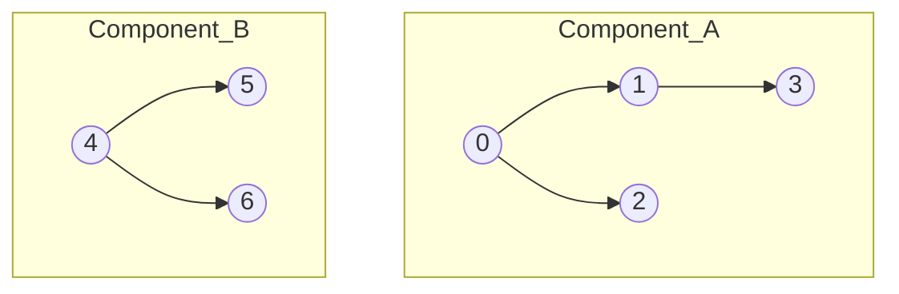
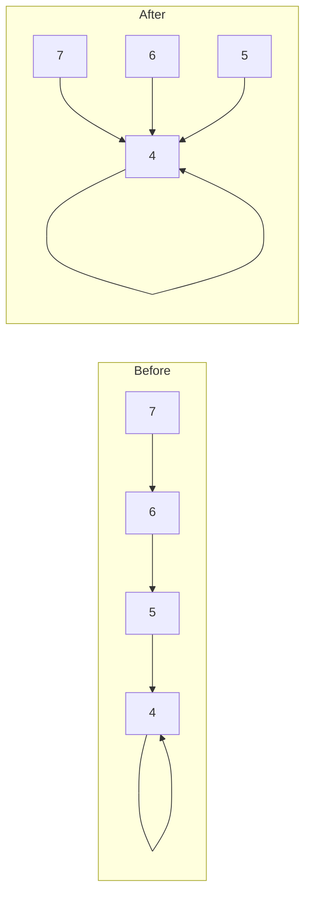
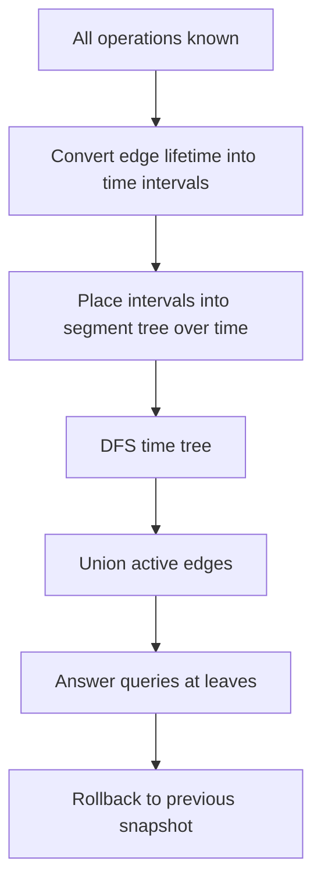
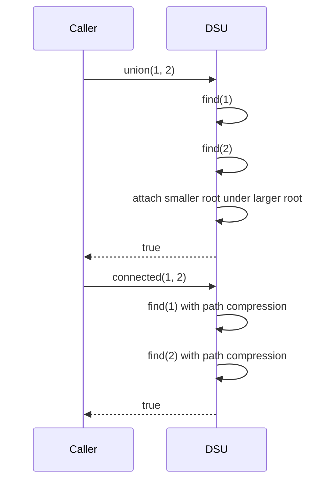

------
title: Learn Java Data Structures and Algorithms - Part 019
description: Disjoint Set Union sebagai struktur data untuk memodelkan konektivitas, equivalence class, union by size/rank, path compression, Kruskal, dan dynamic connectivity offline.
series: learn-java-dsa
seriesTitle: Learn Java Data Structures and Algorithms
order: 19
partTitle: Disjoint Set Union and Connectivity
tags:
- java
- data-structures
- algorithms
- dsa
- graph
- union-find
- series
date: 2026-06-27
---

# Part 019 — Disjoint Set Union and Connectivity

## 1. Skill Target

Setelah menyelesaikan part ini, kita ingin bisa:

1. Mengenali masalah yang sebenarnya adalah **equivalence class** atau **connectivity under merge**.
2. Mengimplementasikan Disjoint Set Union/Union-Find dengan Java secara benar, cepat, dan mudah diuji.
3. Menjelaskan invariant `parent`, `size`, `rank`, dan path compression tanpa menghafal template.
4. Menggunakan DSU untuk Kruskal, connected components, cycle detection, account merging, clustering, dan offline connectivity.
5. Menentukan kapan DSU **tidak cocok**, terutama saat butuh delete edge, split component, atau query path detail.
6. Mendesain API DSU yang aman untuk production: validasi indeks, observability, deterministic behavior, dan test coverage.

DSU adalah salah satu struktur data kecil yang efeknya besar. Ia tidak menyimpan graph secara lengkap. Ia menyimpan jawaban atas pertanyaan yang lebih sempit:

> Apakah dua elemen saat ini berada dalam grup yang sama, jika satu-satunya operasi mutasi adalah menggabungkan dua grup?

Itu batas kemampuan DSU. Justru karena batasnya sempit, implementasinya bisa sangat cepat.

---

## 2. Kaufman Framing: Deconstruct, Practice, Feedback

Dalam kerangka *The First 20 Hours*, DSU cocok dipelajari sebagai kemampuan kecil dengan feedback cepat.

### 2.1 Deconstruct the Skill

Subskill DSU:

- memodelkan domain sebagai integer id;
- memahami representative/root;
- menulis `find`;
- menulis `union`;
- menjaga `componentCount`;
- menjaga metadata per component;
- menguji invariant;
- memakai DSU di graph algorithm;
- mengenali non-use-case.

### 2.2 Learn Enough to Self-Correct

Minimal teori yang perlu:

- `find(x)` mengembalikan canonical representative component tempat `x` berada;
- `union(a, b)` menggabungkan component milik `a` dan `b`;
- path compression memperpendek parent chain saat `find`;
- union by size/rank mencegah tree tumbuh terlalu tinggi;
- operasi DSU dengan path compression + union by rank/size bersifat hampir konstan secara amortized.

Kita tidak perlu menghafal detail fungsi inverse Ackermann untuk memakai DSU dengan benar. Tetapi kita perlu tahu bahwa guarantee ini adalah **amortized**, bukan per-operasi absolut.

### 2.3 Remove Friction

Gunakan satu class kecil yang bisa ditempel ke latihan atau service kecil:

- indeks `0..n-1`;
- `int[] parent`;
- `int[] size`;
- `int components`;
- no boxing;
- no recursion.

### 2.4 Practice Loop

Urutan latihan efektif:

1. Implementasi DSU dasar.
2. Tambah metadata ukuran component.
3. Pakai untuk cycle detection undirected graph.
4. Pakai untuk Kruskal.
5. Pakai untuk account merge/string id mapping.
6. Pakai untuk offline query.
7. Tulis property tests kecil.

---

## 3. Mental Model: Component Forest

DSU menyimpan kumpulan tree. Setiap tree adalah satu component. Root tree adalah representative.



Namun arah panah implementasi sebenarnya biasanya dari child ke parent:

```text
parent[0] = 0
parent[1] = 0
parent[2] = 0
parent[3] = 1

parent[4] = 4
parent[5] = 4
parent[6] = 4
```

Root didefinisikan oleh:

```java
parent[root] == root
```

Pertanyaan `connected(3, 2)` berarti:

```text
find(3) == find(2)
```

---

## 4. Core Invariants

DSU yang benar menjaga invariant berikut.

### 4.1 Parent Invariant

Untuk setiap node `x`:

```text
0 <= parent[x] < n
```

Artinya parent selalu menunjuk id valid.

### 4.2 Root Invariant

Setiap component punya tepat satu root `r` yang memenuhi:

```text
parent[r] == r
```

### 4.3 Representative Invariant

Dua elemen satu component jika dan hanya jika root akhirnya sama:

```text
connected(a, b) == (find(a) == find(b))
```

### 4.4 Size Invariant

Jika kita memakai union by size, maka untuk root `r`:

```text
size[r] == jumlah elemen di component r
```

Untuk non-root, nilai `size[x]` boleh stale dan sebaiknya tidak dibaca oleh API public.

### 4.5 Component Count Invariant

`components` turun satu hanya ketika `union(a, b)` benar-benar menggabungkan dua root berbeda.

```text
components = jumlah root aktif
```

---

## 5. Minimal Production-Ready Java Implementation

Ini implementasi iterative, berbasis `int[]`, dengan path compression dan union by size.

```java
import java.util.Arrays;

public final class DisjointSetUnion {
    private final int[] parent;
    private final int[] size;
    private int components;

    public DisjointSetUnion(int n) {
        if (n < 0) {
            throw new IllegalArgumentException("n must be non-negative: " + n);
        }

        this.parent = new int[n];
        this.size = new int[n];
        this.components = n;

        for (int i = 0; i < n; i++) {
            parent[i] = i;
            size[i] = 1;
        }
    }

    public int size() {
        return parent.length;
    }

    public int components() {
        return components;
    }

    public int find(int x) {
        checkIndex(x);

        int root = x;
        while (root != parent[root]) {
            root = parent[root];
        }

        while (x != root) {
            int next = parent[x];
            parent[x] = root;
            x = next;
        }

        return root;
    }

    public boolean union(int a, int b) {
        int rootA = find(a);
        int rootB = find(b);

        if (rootA == rootB) {
            return false;
        }

        if (size[rootA] < size[rootB]) {
            int tmp = rootA;
            rootA = rootB;
            rootB = tmp;
        }

        parent[rootB] = rootA;
        size[rootA] += size[rootB];
        components--;
        return true;
    }

    public boolean connected(int a, int b) {
        return find(a) == find(b);
    }

    public int componentSize(int x) {
        return size[find(x)];
    }

    public int[] parentsSnapshot() {
        return Arrays.copyOf(parent, parent.length);
    }

    private void checkIndex(int x) {
        if (x < 0 || x >= parent.length) {
            throw new IndexOutOfBoundsException(
                "index " + x + " out of bounds for size " + parent.length
            );
        }
    }
}
```

### 5.1 Why Iterative `find`

Recursive `find` umum ditemukan:

```java
int find(int x) {
    if (parent[x] != x) {
        parent[x] = find(parent[x]);
    }
    return parent[x];
}
```

Itu singkat, tetapi iterative lebih aman untuk input adversarial atau bug internal yang membuat chain sangat panjang. Dalam Java, recursion depth tidak otomatis dioptimasi menjadi loop.

Untuk internal library atau sistem yang menerima input besar, prefer iterative.

---

## 6. Path Compression Step by Step

Misal:

```text
7 -> 6 -> 5 -> 4 -> 4
```

Sebelum `find(7)`:

```text
parent[7] = 6
parent[6] = 5
parent[5] = 4
parent[4] = 4
```

Setelah `find(7)` dengan compression:

```text
parent[7] = 4
parent[6] = 4
parent[5] = 4
parent[4] = 4
```

Diagram:



Path compression tidak mengubah component. Ia hanya mengubah bentuk internal tree.

---

## 7. Union by Size vs Union by Rank

### 7.1 Union by Size

`size[root]` menyimpan jumlah node di component root.

Saat merge:

```text
smaller root attached under larger root
```

Kelebihan:

- mudah dipahami;
- metadata ukuran langsung berguna untuk `componentSize`;
- bagus untuk problem component aggregation.

### 7.2 Union by Rank

`rank[root]` menyimpan estimasi tinggi tree. Rank bukan ukuran component.

Saat merge:

- root rank lebih kecil ditempel ke root rank lebih besar;
- jika rank sama, pilih salah satu sebagai root dan increment rank.

Kelebihan:

- teori klasik;
- sedikit lebih dekat ke analisis formal.

### 7.3 Recommendation

Untuk Java engineering practical use:

- gunakan **union by size** sebagai default;
- gunakan rank hanya jika problem/literatur meminta rank eksplisit;
- jangan update `size` pada non-root dan jangan expose `size[]` mentah.

---

## 8. Complexity

Dengan path compression dan union by size/rank:

| Operation | Complexity |
|---|---:|
| constructor | `O(n)` |
| `find` | amortized almost `O(1)` |
| `union` | amortized almost `O(1)` |
| `connected` | amortized almost `O(1)` |
| `componentSize` | amortized almost `O(1)` |
| memory | `O(n)` |

Secara formal, banyak referensi menyebut amortized `O(α(n))`, dengan `α` sebagai inverse Ackermann function. Dalam praktik engineering, untuk ukuran data realistis, nilainya sangat kecil.

Namun jangan salah kaprah:

- DSU bukan constant-time magic untuk semua graph problem.
- DSU tidak bisa menjawab shortest path.
- DSU tidak menyimpan edge.
- DSU tidak mendukung split/delete secara natural.
- DSU tidak memberi daftar anggota component kecuali kita simpan metadata tambahan.

---

## 9. API Design: What to Expose

API minimal:

```java
int find(int x);
boolean union(int a, int b);
boolean connected(int a, int b);
int componentSize(int x);
int components();
```

Hindari expose:

```java
int[] parent();
int[] size();
```

karena caller bisa merusak invariant.

Kalau butuh debugging, expose snapshot copy:

```java
public int[] parentsSnapshot()
```

atau method package-private untuk test.

---

## 10. Modelling: From Domain IDs to Dense Integers

DSU bekerja paling baik dengan dense integer ids `0..n-1`.

Namun data production sering berupa string, UUID, account id, user id, email, atau case id.

Gunakan mapping:

```java
import java.util.HashMap;
import java.util.Map;

public final class IdIndexer<T> {
    private final Map<T, Integer> ids = new HashMap<>();

    public int idOf(T value) {
        Integer existing = ids.get(value);
        if (existing != null) {
            return existing;
        }

        int id = ids.size();
        ids.put(value, id);
        return id;
    }

    public int size() {
        return ids.size();
    }
}
```

Tetapi ada masalah: DSU constructor perlu `n` di awal. Untuk stream dinamis, ada dua opsi:

1. scan data dulu untuk mengumpulkan semua id;
2. buat growable DSU.

---

## 11. Growable DSU

Untuk domain yang bertambah secara online, kita bisa memakai array yang tumbuh.

```java
import java.util.Arrays;

public final class GrowableDsu {
    private int[] parent;
    private int[] size;
    private int elements;
    private int components;

    public GrowableDsu() {
        this.parent = new int[16];
        this.size = new int[16];
    }

    public int add() {
        ensureCapacity(elements + 1);

        int id = elements++;
        parent[id] = id;
        size[id] = 1;
        components++;
        return id;
    }

    public int find(int x) {
        checkIndex(x);

        int root = x;
        while (root != parent[root]) {
            root = parent[root];
        }

        while (x != root) {
            int next = parent[x];
            parent[x] = root;
            x = next;
        }

        return root;
    }

    public boolean union(int a, int b) {
        int rootA = find(a);
        int rootB = find(b);

        if (rootA == rootB) {
            return false;
        }

        if (size[rootA] < size[rootB]) {
            int tmp = rootA;
            rootA = rootB;
            rootB = tmp;
        }

        parent[rootB] = rootA;
        size[rootA] += size[rootB];
        components--;
        return true;
    }

    public int elements() {
        return elements;
    }

    public int components() {
        return components;
    }

    private void ensureCapacity(int required) {
        if (required <= parent.length) {
            return;
        }

        int newCapacity = Math.max(required, parent.length * 2);
        parent = Arrays.copyOf(parent, newCapacity);
        size = Arrays.copyOf(size, newCapacity);
    }

    private void checkIndex(int x) {
        if (x < 0 || x >= elements) {
            throw new IndexOutOfBoundsException(
                "index " + x + " out of bounds for elements " + elements
            );
        }
    }
}
```

Ini berguna untuk account merging, event stream, atau graph yang id node-nya tidak diketahui di awal.

---

## 12. Use Case 1: Connected Components in an Undirected Graph

Problem:

> Diberikan `n` node dan list undirected edges. Hitung jumlah connected components.

```java
public static int countComponents(int n, int[][] edges) {
    DisjointSetUnion dsu = new DisjointSetUnion(n);

    for (int[] edge : edges) {
        int u = edge[0];
        int v = edge[1];
        dsu.union(u, v);
    }

    return dsu.components();
}
```

Mental model:

- awalnya setiap node adalah component sendiri;
- setiap edge menyatakan dua node harus berada di component yang sama;
- setelah semua edge diproses, component DSU sama dengan connected components graph.

### 12.1 Invariant

Setelah memproses prefix edges `edges[0..i]`, DSU merepresentasikan connectivity graph yang dibangun oleh edges tersebut.

---

## 13. Use Case 2: Cycle Detection in Undirected Graph

Problem:

> Diberikan undirected graph. Deteksi apakah ada cycle.

Untuk setiap edge `(u, v)`:

- jika `u` dan `v` sudah connected, edge ini menutup cycle;
- jika belum, union mereka.

```java
public static boolean hasCycleUndirected(int n, int[][] edges) {
    DisjointSetUnion dsu = new DisjointSetUnion(n);

    for (int[] edge : edges) {
        int u = edge[0];
        int v = edge[1];

        if (!dsu.union(u, v)) {
            return true;
        }
    }

    return false;
}
```

### 13.1 Caveat

Ini hanya untuk **undirected graph**.

Untuk directed graph, cycle detection memerlukan DFS state, topological sort, atau algoritma SCC. DSU tidak mempertahankan arah edge.

---

## 14. Use Case 3: Kruskal Minimum Spanning Tree

Kruskal:

1. sort edge berdasarkan weight ascending;
2. iterasi edge dari kecil ke besar;
3. ambil edge jika menghubungkan dua component berbeda;
4. skip edge jika membentuk cycle.

```java
import java.util.ArrayList;
import java.util.Comparator;
import java.util.List;

public final class KruskalMst {
    public record Edge(int u, int v, long weight) {}

    public static Result mst(int n, List<Edge> edges) {
        List<Edge> sorted = new ArrayList<>(edges);
        sorted.sort(Comparator.comparingLong(Edge::weight));

        DisjointSetUnion dsu = new DisjointSetUnion(n);
        List<Edge> chosen = new ArrayList<>();
        long totalWeight = 0;

        for (Edge edge : sorted) {
            if (dsu.union(edge.u(), edge.v())) {
                chosen.add(edge);
                totalWeight += edge.weight();

                if (chosen.size() == n - 1) {
                    break;
                }
            }
        }

        boolean connected = chosen.size() == Math.max(0, n - 1);
        return new Result(totalWeight, chosen, connected);
    }

    public record Result(long totalWeight, List<Edge> edges, boolean connected) {}
}
```

### 14.1 Why DSU Fits Kruskal

Kruskal hanya butuh tahu:

```text
apakah edge ini menghubungkan dua component berbeda?
```

Itu tepat operasi DSU.

DSU tidak perlu tahu path, degree, atau struktur graph penuh.

---

## 15. Use Case 4: Account Merge

Misal kita punya account:

```text
["John", "a@mail.com", "b@mail.com"]
["John", "b@mail.com", "c@mail.com"]
["Mary", "x@mail.com"]
```

Email yang overlap berarti account berada di component yang sama.

Strategi:

1. beri id untuk setiap account;
2. map email ke account pertama yang memakai email itu;
3. ketika email ditemukan lagi, union account sekarang dengan account lama;
4. group account berdasarkan root;
5. kumpulkan email per root.

```java
import java.util.*;

public final class AccountMerge {
    public static List<List<String>> merge(List<List<String>> accounts) {
        int n = accounts.size();
        DisjointSetUnion dsu = new DisjointSetUnion(n);
        Map<String, Integer> ownerByEmail = new HashMap<>();

        for (int accountId = 0; accountId < n; accountId++) {
            List<String> account = accounts.get(accountId);

            for (int i = 1; i < account.size(); i++) {
                String email = account.get(i);
                Integer previousOwner = ownerByEmail.putIfAbsent(email, accountId);

                if (previousOwner != null) {
                    dsu.union(accountId, previousOwner);
                }
            }
        }

        Map<Integer, TreeSet<String>> emailsByRoot = new HashMap<>();
        Map<Integer, String> nameByRoot = new HashMap<>();

        for (int accountId = 0; accountId < n; accountId++) {
            int root = dsu.find(accountId);
            nameByRoot.putIfAbsent(root, accounts.get(accountId).get(0));

            TreeSet<String> emails = emailsByRoot.computeIfAbsent(root, ignored -> new TreeSet<>());
            List<String> account = accounts.get(accountId);
            for (int i = 1; i < account.size(); i++) {
                emails.add(account.get(i));
            }
        }

        List<List<String>> result = new ArrayList<>();
        for (Map.Entry<Integer, TreeSet<String>> entry : emailsByRoot.entrySet()) {
            int root = entry.getKey();
            List<String> merged = new ArrayList<>();
            merged.add(nameByRoot.get(root));
            merged.addAll(entry.getValue());
            result.add(merged);
        }

        return result;
    }
}
```

### 15.1 Production Caveat

Real account merge jauh lebih kompleks:

- identity confidence;
- auditability;
- reversible merge;
- legal/regulatory impact;
- race conditions;
- partial merge;
- conflicting profile attributes.

DSU hanya memodelkan equivalence relation, bukan keputusan bisnis bahwa dua identity benar-benar sama.

---

## 16. Metadata per Component

Sering kali kita butuh aggregate component:

- size;
- min id;
- max id;
- sum weight;
- representative label;
- risk score;
- earliest timestamp.

Contoh: DSU dengan total weight component.

```java
public final class WeightedDsu {
    private final int[] parent;
    private final int[] size;
    private final long[] sum;

    public WeightedDsu(long[] weights) {
        int n = weights.length;
        parent = new int[n];
        size = new int[n];
        sum = new long[n];

        for (int i = 0; i < n; i++) {
            parent[i] = i;
            size[i] = 1;
            sum[i] = weights[i];
        }
    }

    public int find(int x) {
        int root = x;
        while (root != parent[root]) {
            root = parent[root];
        }

        while (x != root) {
            int next = parent[x];
            parent[x] = root;
            x = next;
        }

        return root;
    }

    public boolean union(int a, int b) {
        int rootA = find(a);
        int rootB = find(b);

        if (rootA == rootB) {
            return false;
        }

        if (size[rootA] < size[rootB]) {
            int tmp = rootA;
            rootA = rootB;
            rootB = tmp;
        }

        parent[rootB] = rootA;
        size[rootA] += size[rootB];
        sum[rootA] += sum[rootB];
        return true;
    }

    public long componentSum(int x) {
        return sum[find(x)];
    }
}
```

Invariant:

```text
sum[root] = total weight seluruh node di component root
```

Nilai `sum[nonRoot]` stale dan tidak boleh dibaca.

---

## 17. Rollback DSU

DSU standar sulit mendukung undo karena path compression menghancurkan history parent.

Untuk offline algorithms, kita bisa membuat rollback DSU:

- tanpa path compression;
- union by size;
- simpan perubahan ke stack;
- rollback ke snapshot.

```java
import java.util.ArrayDeque;
import java.util.Deque;

public final class RollbackDsu {
    private final int[] parent;
    private final int[] size;
    private int components;
    private final Deque<Change> history = new ArrayDeque<>();

    private record Change(int childRoot, int parentRoot, int previousParentSize) {}

    public RollbackDsu(int n) {
        parent = new int[n];
        size = new int[n];
        components = n;

        for (int i = 0; i < n; i++) {
            parent[i] = i;
            size[i] = 1;
        }
    }

    public int find(int x) {
        while (x != parent[x]) {
            x = parent[x];
        }
        return x;
    }

    public boolean union(int a, int b) {
        int rootA = find(a);
        int rootB = find(b);

        if (rootA == rootB) {
            history.push(new Change(-1, -1, -1));
            return false;
        }

        if (size[rootA] < size[rootB]) {
            int tmp = rootA;
            rootA = rootB;
            rootB = tmp;
        }

        history.push(new Change(rootB, rootA, size[rootA]));
        parent[rootB] = rootA;
        size[rootA] += size[rootB];
        components--;
        return true;
    }

    public int snapshot() {
        return history.size();
    }

    public void rollbackTo(int snapshot) {
        while (history.size() > snapshot) {
            Change change = history.pop();

            if (change.childRoot == -1) {
                continue;
            }

            parent[change.childRoot] = change.childRoot;
            size[change.parentRoot] = change.previousParentSize;
            components++;
        }
    }

    public int components() {
        return components;
    }
}
```

### 17.1 Why No Path Compression

Path compression mutates many parent pointers during `find`, which would require logging every changed pointer. Rollback DSU intentionally sacrifices compression so rollback remains simple.

Complexity becomes roughly `O(log n)` per operation with union by size, because tree height is bounded.

---

## 18. Offline Dynamic Connectivity Intuition

Problem:

> Ada operasi add edge, remove edge, dan query connectivity over time.

DSU standar tidak bisa delete edge. Tetapi offline, kita bisa:

1. baca semua operasi dulu;
2. tentukan interval waktu saat edge aktif;
3. letakkan interval ke segment tree over time;
4. DFS segment tree:
   - saat masuk node waktu, union edges aktif di interval itu;
   - jawab query di leaf;
   - rollback saat keluar node.



Ini contoh penting bahwa DSU bisa menjadi komponen dalam algoritma lebih besar, bukan solusi berdiri sendiri.

---

## 19. DSU vs Graph Traversal

| Need | Use DSU? | Better Tool |
|---|---:|---|
| Merge components only | yes | DSU |
| Query if two nodes connected after many edge additions | yes | DSU |
| Count components after static edge list | yes | DSU or DFS/BFS |
| Find actual path between nodes | no | BFS/DFS |
| Shortest path | no | BFS/Dijkstra |
| Directed cycle | no | DFS/toposort |
| Delete edge online | not standard | dynamic connectivity structures |
| Split component | no | graph-specific structure |
| Maintain component aggregate under merge | yes | DSU with metadata |

The key question:

> Is the graph changing only by adding equivalence constraints?

If yes, DSU is likely a strong candidate.

---

## 20. Common Bugs

### 20.1 Updating Size on Non-Root

Wrong:

```java
size[a] += size[b];
```

Correct:

```java
size[rootA] += size[rootB];
```

Only root has authoritative component metadata.

### 20.2 Returning Parent Instead of Root

Wrong:

```java
int find(int x) {
    return parent[x];
}
```

This fails when parent chain length > 1.

Correct:

```java
int find(int x) {
    while (x != parent[x]) {
        x = parent[x];
    }
    return x;
}
```

### 20.3 Forgetting to Decrement Component Count

Only decrement when roots differ.

```java
if (rootA != rootB) {
    components--;
}
```

### 20.4 Assuming DSU Works for Directed Connectivity

For directed graph, `union(u, v)` loses direction. It turns directed reachability into undirected equivalence, which is usually wrong.

### 20.5 Mutating Domain-to-ID Mapping Mid-Result

If external ids map to dense ids, keep the mapping stable for the lifetime of DSU. Reusing ids for different domain objects corrupts all answers.

---

## 21. Testing DSU

### 21.1 Deterministic Unit Tests

```java
import static org.junit.jupiter.api.Assertions.*;
import org.junit.jupiter.api.Test;

class DisjointSetUnionTest {
    @Test
    void startsWithEveryNodeInOwnComponent() {
        DisjointSetUnion dsu = new DisjointSetUnion(4);

        assertEquals(4, dsu.components());
        assertEquals(1, dsu.componentSize(0));
        assertFalse(dsu.connected(0, 1));
    }

    @Test
    void unionConnectsComponents() {
        DisjointSetUnion dsu = new DisjointSetUnion(4);

        assertTrue(dsu.union(0, 1));
        assertTrue(dsu.connected(0, 1));
        assertEquals(3, dsu.components());
        assertEquals(2, dsu.componentSize(0));
    }

    @Test
    void duplicateUnionDoesNotChangeComponents() {
        DisjointSetUnion dsu = new DisjointSetUnion(4);

        assertTrue(dsu.union(0, 1));
        assertFalse(dsu.union(1, 0));

        assertEquals(3, dsu.components());
    }
}
```

### 21.2 Cross-Check Against Naive Model

Untuk n kecil, bandingkan DSU dengan boolean reachability via BFS pada graph yang dibangun incremental.

```java
static boolean connectedNaive(int n, boolean[][] graph, int src, int dst) {
    boolean[] seen = new boolean[n];
    int[] queue = new int[n];
    int head = 0;
    int tail = 0;

    seen[src] = true;
    queue[tail++] = src;

    while (head < tail) {
        int u = queue[head++];

        if (u == dst) {
            return true;
        }

        for (int v = 0; v < n; v++) {
            if (graph[u][v] && !seen[v]) {
                seen[v] = true;
                queue[tail++] = v;
            }
        }
    }

    return false;
}
```

Property:

> Setelah setiap union edge, untuk semua pasangan `(a, b)`, `dsu.connected(a, b)` harus sama dengan naive BFS connectivity.

---

## 22. Performance Notes in Java

### 22.1 Prefer Primitive Arrays

Gunakan:

```java
int[] parent;
int[] size;
```

Bukan:

```java
Map<Integer, Integer> parent;
```

Jika id bisa dipetakan ke dense integers, primitive array jauh lebih murah:

- no boxing;
- contiguous memory;
- lower allocation;
- better locality;
- fewer hash lookups.

### 22.2 Avoid Per-Operation Object Allocation

`union` dan `find` sebaiknya tidak membuat object baru. DSU sering dipakai di loop besar, misalnya jutaan edge.

### 22.3 Validate at API Boundary

Untuk library internal, validasi indeks membantu debugging. Untuk hot loop ultra-sensitive, bisa pisahkan:

- public safe API dengan validation;
- package-private unsafe method untuk algorithm internal yang sudah memvalidasi input.

### 22.4 Beware of Concurrency

DSU di atas tidak thread-safe. Operasi `find` sendiri mutating karena path compression.

Jika beberapa thread memanggil `find`/`union` bersamaan, invariant bisa rusak tanpa sinkronisasi.

Untuk parallel connectivity, desainnya berbeda:

- batch union;
- partition graph;
- merge partial components;
- atau gunakan synchronization dengan trade-off throughput.

---

## 23. Mermaid: DSU Lifecycle



---

## 24. Design Checklist

Sebelum memakai DSU, jawab:

- Apakah relasi domain bersifat equivalence relation?
  - reflexive: `x` same as `x`;
  - symmetric: jika `a` same as `b`, maka `b` same as `a`;
  - transitive: jika `a` same as `b` dan `b` same as `c`, maka `a` same as `c`.
- Apakah operasi hanya merge, bukan split?
- Apakah query hanya connectivity/component aggregate, bukan path detail?
- Apakah id bisa dipetakan ke dense integer?
- Apakah component metadata hanya perlu digabung secara associative?
- Apakah concurrency bisa dihindari atau dikontrol?
- Apakah hasil merge perlu audit/reversal?

Jika banyak jawaban “tidak”, DSU mungkin bukan struktur yang tepat.

---

## 25. Practice Set

### Exercise 1 — Validate DSU Invariants

Implement method test-only:

```java
boolean isValidForest()
```

Cek:

- semua parent valid;
- setiap node akhirnya mencapai root;
- tidak ada cycle selain self-loop root;
- jumlah root sama dengan `components`.

### Exercise 2 — Largest Component Size

Diberikan `n` dan edges, return ukuran largest connected component.

Target:

```java
int largestComponent(int n, int[][] edges)
```

### Exercise 3 — Redundant Connection

Diberikan edge undirected yang membentuk tree plus satu extra edge. Return edge yang menyebabkan cycle.

### Exercise 4 — Number of Islands II

Grid awal kosong. Setiap operasi menambah land cell. Return jumlah island setelah tiap operasi.

Hint:

- map `(r, c)` ke `id = r * cols + c`;
- union dengan neighbor yang sudah land;
- careful dengan duplicate add.

### Exercise 5 — Account Merge

Implement versi yang preserve deterministic output:

- sort groups by name then first email;
- sort email inside each group;
- handle account dengan no email.

### Exercise 6 — Rollback DSU

Implement rollback DSU dan test snapshot behavior:

```java
int snap = dsu.snapshot();
dsu.union(1, 2);
dsu.rollbackTo(snap);
```

---

## 26. Self-Correction Checklist

Kita sudah paham DSU jika bisa menjawab tanpa melihat catatan:

1. Mengapa `find` harus mencari root, bukan parent langsung?
2. Mengapa `size` hanya valid di root?
3. Mengapa `union` return `false` saat root sama?
4. Mengapa DSU bisa deteksi cycle di undirected graph?
5. Mengapa DSU tidak cocok untuk directed cycle?
6. Mengapa path compression membuat rollback sulit?
7. Mengapa primitive array lebih baik daripada `Map<Integer, Integer>` untuk hot loop?
8. Bagaimana memodelkan string id menjadi integer id?
9. Kapan DSU perlu metadata tambahan?
10. Kapan DSU harus diganti BFS/DFS/shortest path algorithm?

---

## 27. Key Takeaways

- DSU adalah struktur untuk **merge-only equivalence classes**.
- Invariant utamanya sederhana: root mewakili component.
- `find` adalah canonicalization; `union` adalah merge.
- Path compression memperbaiki bentuk internal tree tanpa mengubah makna component.
- Union by size/rank mencegah tree buruk.
- DSU sangat cocok untuk connected components, Kruskal, account merge, dan offline connectivity.
- DSU tidak cocok untuk directed reachability, shortest path, deletion/split online, atau query path detail.
- Dalam Java, implementasi terbaik untuk hot path biasanya memakai primitive arrays, iterative `find`, dan no per-operation allocation.
