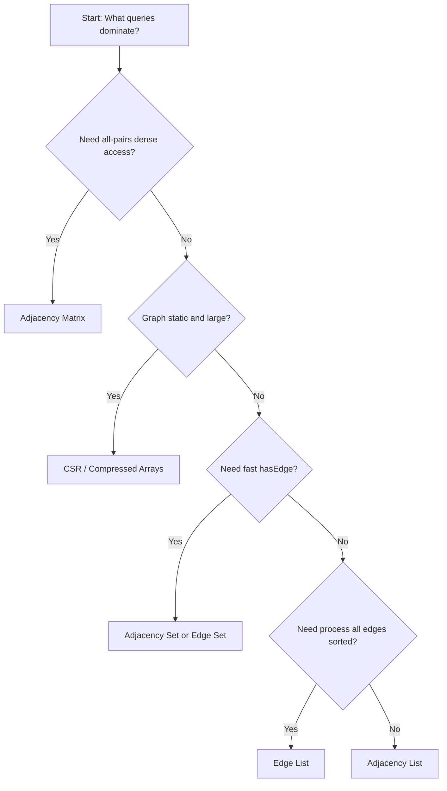

------
title: Learn Java Data Structures and Algorithms - Part 020
description: Graph modelling dan representasi graph di Java: taxonomy, adjacency list/matrix/set, edge object design, weighted graph, multigraph, memory layout, API modelling, dan domain graph pitfalls.
series: learn-java-dsa
seriesTitle: Learn Java Data Structures and Algorithms
order: 20
partTitle: Graph Modelling and Representation
tags:
- java
- data-structures
- algorithms
- dsa
- graph
- modelling
- series
date: 2026-06-27
---

# Part 020 — Graph Modelling and Representation

## 1. Skill Target

Setelah menyelesaikan part ini, kita ingin bisa:

1. Menerjemahkan masalah domain menjadi graph tanpa kehilangan makna.
2. Memilih representasi graph yang sesuai: adjacency list, adjacency matrix, edge list, adjacency set, compressed arrays, atau object graph.
3. Membedakan directed, undirected, weighted, unweighted, simple graph, multigraph, self-loop, DAG, bipartite, dan dynamic graph.
4. Mendesain API graph Java yang aman, efisien, dan jelas invariant-nya.
5. Menghindari kesalahan modelling seperti menganggap relasi directed sebagai undirected, menghilangkan duplicate edge, atau salah memaknai node identity.
6. Menentukan trade-off memory/performance untuk graph besar.

Part ini adalah fondasi untuk part berikutnya: BFS/DFS, shortest path, MST, topological sort, SCC, flow, dan matching.

Graph algorithm yang benar sering gagal bukan karena algoritmanya salah, tetapi karena **representasi graph-nya salah**.

---

## 2. Kaufman Framing: Practice the Representation First

Untuk belajar graph secara efektif, jangan mulai dari Dijkstra atau Tarjan. Mulai dari modelling.

Subskill graph:

- identifikasi vertex;
- identifikasi edge;
- tentukan arah edge;
- tentukan bobot/cost/capacity;
- tentukan apakah duplicate edge valid;
- pilih data structure;
- tulis traversal-safe API;
- validasi invariant;
- benchmark pada skala realistis.

Graph adalah cara menyatakan relasi. Algoritma hanya bekerja kalau relasi itu dimodelkan benar.

---

## 3. Mental Model: Graph Is Relationship State

Sebuah graph terdiri dari:

```text
G = (V, E)
```

- `V`: set vertex/node/entity/state.
- `E`: set edge/relationship/transition/constraint.

Contoh domain:

| Domain | Vertex | Edge |
|---|---|---|
| road network | intersection/city | road segment |
| dependency system | module/task | depends-on relation |
| social network | user | follows/friends relation |
| workflow | state | allowed transition |
| fraud/risk graph | account/device/email | observed link |
| compiler | basic block | control-flow edge |
| case management | case/entity/action | relation, escalation, assignment |

Kunci modelling:

> Node adalah benda yang punya identity. Edge adalah relasi yang punya semantics.

---

## 4. Graph Taxonomy

### 4.1 Directed vs Undirected

Directed edge:

```text
u -> v
```

Berarti relasi hanya dari `u` ke `v`.

Undirected edge:

```text
u -- v
```

Berarti relasi simetris.

Contoh:

- `user follows user`: directed;
- `friendship`: biasanya undirected, kecuali sistem menyimpan request/acceptance separately;
- `task A depends on task B`: directed;
- `road`: bisa undirected atau directed tergantung jalan satu arah.

Kesalahan umum:

> Mengubah directed edge menjadi undirected karena representasinya lebih mudah.

Ini bisa menghancurkan correctness.

### 4.2 Weighted vs Unweighted

Weighted edge punya cost:

```text
u --(weight=7)--> v
```

Weight bisa berarti:

- distance;
- latency;
- cost;
- risk;
- capacity;
- probability;
- duration;
- penalty.

Pastikan weight semantics cocok dengan algoritma.

Dijkstra, misalnya, membutuhkan non-negative edge weight. Jika cost bisa negatif, modelling harus berubah.

### 4.3 Simple Graph vs Multigraph

Simple graph:

- paling banyak satu edge antara `u` dan `v`;
- biasanya tidak ada self-loop.

Multigraph:

- boleh ada beberapa edge antara pair yang sama;
- edge punya identity sendiri.

Contoh multigraph:

```text
Jakarta -> Singapore flight SQ951
Jakarta -> Singapore flight GA822
Jakarta -> Singapore flight 3K204
```

Kalau duplicate edge dibuang, solusi bisa salah.

### 4.4 Self-Loop

Self-loop:

```text
u -> u
```

Maknanya tergantung domain:

- valid transition from state to itself;
- retry relation;
- reflexive rule;
- data anomaly;
- cycle of length 1.

Jangan otomatis hapus self-loop tanpa memahami domain.

### 4.5 Static vs Dynamic Graph

Static graph:

- edges/nodes diketahui di awal;
- query banyak;
- update jarang.

Dynamic graph:

- edge add/remove sering;
- node muncul/hilang;
- query dan update interleaved.

Static graph bisa dioptimalkan dengan compressed arrays. Dynamic graph sering butuh maps/sets atau incremental index.

---

## 5. Representation Decision Matrix

| Representation | Best For | Weakness |
|---|---|---|
| edge list | sorting edges, Kruskal, batch load | neighbor lookup lambat |
| adjacency list | traversal, sparse graph | edge existence check bisa lambat |
| adjacency set | fast existence check | overhead memory besar |
| adjacency matrix | dense graph, O(1) existence | `O(n^2)` memory |
| compressed sparse row | massive static graph | update mahal |
| object graph | rich domain behavior | memory/cache buruk |
| map-based graph | non-dense ids, dynamic graph | hashing/boxing overhead |

Tidak ada representasi universal. Pilihan representasi adalah bagian dari algoritma.

---

## 6. Edge List

Edge list adalah list semua edge.

```java
public record Edge(int from, int to) {}
```

Weighted:

```java
public record WeightedEdge(int from, int to, long weight) {}
```

Cocok untuk:

- Kruskal MST;
- batch processing;
- streaming edge;
- graph import/export;
- algorithms yang memproses semua edge berulang.

Tidak cocok untuk:

- BFS/DFS neighbor traversal;
- repeated adjacency query;
- frequent `hasEdge(u, v)`.

Contoh:

```java
import java.util.List;

public record EdgeListGraph(int vertices, List<WeightedEdge> edges) {
    public EdgeListGraph {
        if (vertices < 0) {
            throw new IllegalArgumentException("vertices must be non-negative");
        }

        for (WeightedEdge edge : edges) {
            checkVertex(vertices, edge.from());
            checkVertex(vertices, edge.to());
        }

        edges = List.copyOf(edges);
    }

    private static void checkVertex(int n, int v) {
        if (v < 0 || v >= n) {
            throw new IllegalArgumentException("invalid vertex: " + v);
        }
    }
}
```

Note: compact constructor record bisa melakukan validation dan defensive copy.

---

## 7. Adjacency List

Adjacency list menyimpan daftar neighbor untuk setiap vertex.

```text
0: [1, 3]
1: [2]
2: []
3: [2]
```

### 7.1 Unweighted Directed Graph

```java
import java.util.ArrayList;
import java.util.Collections;
import java.util.List;

public final class IntAdjacencyListGraph {
    private final List<Integer>[] adj;
    private final int edges;

    @SuppressWarnings("unchecked")
    public IntAdjacencyListGraph(int vertices, int[][] edges) {
        if (vertices < 0) {
            throw new IllegalArgumentException("vertices must be non-negative");
        }

        this.adj = (List<Integer>[]) new List<?>[vertices];

        for (int i = 0; i < vertices; i++) {
            adj[i] = new ArrayList<>();
        }

        int edgeCount = 0;
        for (int[] edge : edges) {
            if (edge.length != 2) {
                throw new IllegalArgumentException("edge must have length 2");
            }

            int from = edge[0];
            int to = edge[1];

            checkVertex(from);
            checkVertex(to);

            adj[from].add(to);
            edgeCount++;
        }

        for (int i = 0; i < vertices; i++) {
            adj[i] = Collections.unmodifiableList(adj[i]);
        }

        this.edges = edgeCount;
    }

    public int vertices() {
        return adj.length;
    }

    public int edges() {
        return edges;
    }

    public List<Integer> neighbors(int vertex) {
        checkVertex(vertex);
        return adj[vertex];
    }

    private void checkVertex(int vertex) {
        if (vertex < 0 || vertex >= adj.length) {
            throw new IndexOutOfBoundsException(
                "vertex " + vertex + " out of bounds for " + adj.length
            );
        }
    }
}
```

### 7.2 Caveat: Generic Array Creation

Java tidak memungkinkan generic array creation langsung seperti:

```java
new List<Integer>[n]
```

Karena type erasure. Workaround dengan suppressed unchecked cast umum dipakai untuk internal implementation. Alternatifnya pakai:

```java
List<List<Integer>> adj = new ArrayList<>();
```

Lebih clean, tetapi sedikit lebih banyak indirection.

---

## 8. Undirected Graph Representation

Untuk undirected edge `(u, v)`, adjacency list biasanya menyimpan dua arah:

```java
adj[u].add(v);
adj[v].add(u);
```

Contoh:

```java
public static List<Integer>[] buildUndirected(int vertices, int[][] edges) {
    @SuppressWarnings("unchecked")
    List<Integer>[] adj = (List<Integer>[]) new List<?>[vertices];

    for (int i = 0; i < vertices; i++) {
        adj[i] = new ArrayList<>();
    }

    for (int[] edge : edges) {
        int u = edge[0];
        int v = edge[1];

        adj[u].add(v);
        adj[v].add(u);
    }

    return adj;
}
```

### 8.1 Edge Count Semantics

Jika input punya `m` undirected edges, adjacency entries menjadi `2m`.

Jangan bingung antara:

```text
logical edge count = m
adjacency entry count = 2m
```

Self-loop `(u, u)` adalah special case. Apakah harus ditambahkan dua kali?

- Untuk degree convention graph theory, self-loop sering menambah degree 2.
- Untuk traversal, menambah dua kali biasanya tidak berguna.
- Untuk domain graph, semantics tergantung kebutuhan.

Tetapkan policy eksplisit.

---

## 9. Weighted Adjacency List

Gunakan edge object kecil:

```java
public record WeightedNeighbor(int to, long weight) {}
```

Graph:

```java
import java.util.ArrayList;
import java.util.Collections;
import java.util.List;

public final class WeightedGraph {
    private final List<WeightedNeighbor>[] adj;

    @SuppressWarnings("unchecked")
    public WeightedGraph(int vertices) {
        if (vertices < 0) {
            throw new IllegalArgumentException("vertices must be non-negative");
        }

        this.adj = (List<WeightedNeighbor>[]) new List<?>[vertices];
        for (int i = 0; i < vertices; i++) {
            adj[i] = new ArrayList<>();
        }
    }

    public void addDirectedEdge(int from, int to, long weight) {
        checkVertex(from);
        checkVertex(to);
        adj[from].add(new WeightedNeighbor(to, weight));
    }

    public void addUndirectedEdge(int u, int v, long weight) {
        addDirectedEdge(u, v, weight);
        if (u != v) {
            addDirectedEdge(v, u, weight);
        }
    }

    public List<WeightedNeighbor> neighbors(int vertex) {
        checkVertex(vertex);
        return Collections.unmodifiableList(adj[vertex]);
    }

    public int vertices() {
        return adj.length;
    }

    private void checkVertex(int vertex) {
        if (vertex < 0 || vertex >= adj.length) {
            throw new IndexOutOfBoundsException("invalid vertex: " + vertex);
        }
    }
}
```

### 9.1 Mutable vs Immutable Graph

Graph builder boleh mutable. Graph query object sebaiknya immutable.

Better pattern:

```text
GraphBuilder -> ImmutableGraph
```

agar algoritma tidak melihat graph berubah di tengah traversal.

---

## 10. Builder Pattern for Graphs

```java
import java.util.ArrayList;
import java.util.List;

public final class GraphBuilder {
    private final int vertices;
    private final boolean directed;
    private final List<WeightedEdge> edges = new ArrayList<>();

    public GraphBuilder(int vertices, boolean directed) {
        if (vertices < 0) {
            throw new IllegalArgumentException("vertices must be non-negative");
        }

        this.vertices = vertices;
        this.directed = directed;
    }

    public GraphBuilder addEdge(int from, int to, long weight) {
        checkVertex(from);
        checkVertex(to);

        edges.add(new WeightedEdge(from, to, weight));

        if (!directed && from != to) {
            edges.add(new WeightedEdge(to, from, weight));
        }

        return this;
    }

    public ImmutableWeightedGraph build() {
        return ImmutableWeightedGraph.fromEdges(vertices, edges);
    }

    private void checkVertex(int vertex) {
        if (vertex < 0 || vertex >= vertices) {
            throw new IndexOutOfBoundsException("invalid vertex: " + vertex);
        }
    }
}
```

Immutable graph:

```java
import java.util.ArrayList;
import java.util.List;

public final class ImmutableWeightedGraph {
    private final List<WeightedNeighbor>[] adj;

    @SuppressWarnings("unchecked")
    private ImmutableWeightedGraph(List<WeightedNeighbor>[] adj) {
        this.adj = adj;
    }

    public static ImmutableWeightedGraph fromEdges(int vertices, List<WeightedEdge> edges) {
        @SuppressWarnings("unchecked")
        List<WeightedNeighbor>[] temp = (List<WeightedNeighbor>[]) new List<?>[vertices];

        for (int i = 0; i < vertices; i++) {
            temp[i] = new ArrayList<>();
        }

        for (WeightedEdge edge : edges) {
            temp[edge.from()].add(new WeightedNeighbor(edge.to(), edge.weight()));
        }

        for (int i = 0; i < vertices; i++) {
            temp[i] = List.copyOf(temp[i]);
        }

        return new ImmutableWeightedGraph(temp);
    }

    public int vertices() {
        return adj.length;
    }

    public List<WeightedNeighbor> neighbors(int vertex) {
        return adj[vertex];
    }
}
```

This style makes traversal algorithms simpler:

```java
for (WeightedNeighbor edge : graph.neighbors(u)) {
    int v = edge.to();
    long w = edge.weight();
}
```

---

## 11. Adjacency Matrix

Adjacency matrix stores edge existence or weight in `n x n`.

Unweighted:

```java
boolean[][] hasEdge = new boolean[n][n];
```

Weighted:

```java
long[][] weight = new long[n][n];
```

Cocok untuk dense graph atau `hasEdge(u, v)` sangat sering.

### 11.1 Complexity

| Operation | Adjacency Matrix |
|---|---:|
| memory | `O(n^2)` |
| add edge | `O(1)` |
| remove edge | `O(1)` |
| has edge | `O(1)` |
| iterate neighbors | `O(n)` |

Jika graph sparse dengan `m << n^2`, adjacency matrix boros.

### 11.2 Weighted Matrix with INF

```java
import java.util.Arrays;

public final class WeightedMatrixGraph {
    private static final long INF = Long.MAX_VALUE / 4;

    private final long[][] dist;

    public WeightedMatrixGraph(int vertices) {
        dist = new long[vertices][vertices];

        for (int i = 0; i < vertices; i++) {
            Arrays.fill(dist[i], INF);
            dist[i][i] = 0;
        }
    }

    public void addDirectedEdge(int from, int to, long weight) {
        dist[from][to] = Math.min(dist[from][to], weight);
    }

    public boolean hasEdge(int from, int to) {
        return dist[from][to] < INF;
    }

    public long weight(int from, int to) {
        return dist[from][to];
    }
}
```

### 11.3 Overflow Caveat

Untuk shortest path:

```java
dist[i][k] + dist[k][j]
```

bisa overflow jika memakai `Long.MAX_VALUE`.

Karena itu gunakan `Long.MAX_VALUE / 4`, atau cek sebelum tambah.

---

## 12. Adjacency Set

Jika perlu fast edge existence pada sparse graph:

```java
List<Set<Integer>> adj;
```

Atau:

```java
Set<Long> edges;
```

dengan encoding pair:

```java
static long edgeKey(int u, int v) {
    return ((long) u << 32) ^ (v & 0xffffffffL);
}
```

### 12.1 Directed Edge Set

```java
import java.util.HashSet;
import java.util.Set;

public final class EdgeSet {
    private final Set<Long> edges = new HashSet<>();

    public boolean add(int from, int to) {
        return edges.add(key(from, to));
    }

    public boolean contains(int from, int to) {
        return edges.contains(key(from, to));
    }

    public boolean remove(int from, int to) {
        return edges.remove(key(from, to));
    }

    private static long key(int from, int to) {
        return ((long) from << 32) ^ (to & 0xffffffffL);
    }
}
```

### 12.2 Undirected Edge Key

Untuk undirected graph, canonicalize order:

```java
private static long undirectedKey(int a, int b) {
    int u = Math.min(a, b);
    int v = Math.max(a, b);
    return ((long) u << 32) ^ (v & 0xffffffffL);
}
```

Caveat:

- edge set loses duplicate edges;
- not enough for multigraph;
- no weight unless map to metadata;
- `HashSet<Long>` boxes `long` into `Long`, causing overhead.

For performance-critical primitive maps/sets, Java standard library does not provide primitive specialized collections. Many teams either implement custom arrays or use vetted third-party primitive collections, depending on policy.

---

## 13. Compressed Sparse Row

For massive static sparse graph, object-heavy adjacency list can be expensive.

Compressed Sparse Row style:

```text
offsets[u]..offsets[u+1]-1 gives neighbor indices
to[k] stores neighbor
weight[k] stores weight
```

Example:

```java
public final class CsrGraph {
    private final int vertices;
    private final int[] offsets;
    private final int[] to;
    private final long[] weight;

    public CsrGraph(int vertices, int[] offsets, int[] to, long[] weight) {
        this.vertices = vertices;
        this.offsets = offsets;
        this.to = to;
        this.weight = weight;
    }

    public int vertices() {
        return vertices;
    }

    public int edgeStart(int vertex) {
        return offsets[vertex];
    }

    public int edgeEnd(int vertex) {
        return offsets[vertex + 1];
    }

    public int to(int edgeIndex) {
        return to[edgeIndex];
    }

    public long weight(int edgeIndex) {
        return weight[edgeIndex];
    }
}
```

Traversal:

```java
for (int e = graph.edgeStart(u); e < graph.edgeEnd(u); e++) {
    int v = graph.to(e);
    long w = graph.weight(e);
}
```

### 13.1 Building CSR

```java
import java.util.List;

public final class CsrBuilder {
    public static CsrGraph fromDirectedEdges(int vertices, List<WeightedEdge> edges) {
        int[] degree = new int[vertices];

        for (WeightedEdge edge : edges) {
            degree[edge.from()]++;
        }

        int[] offsets = new int[vertices + 1];
        for (int i = 0; i < vertices; i++) {
            offsets[i + 1] = offsets[i] + degree[i];
        }

        int[] cursor = offsets.clone();
        int[] to = new int[edges.size()];
        long[] weight = new long[edges.size()];

        for (WeightedEdge edge : edges) {
            int pos = cursor[edge.from()]++;
            to[pos] = edge.to();
            weight[pos] = edge.weight();
        }

        return new CsrGraph(vertices, offsets, to, weight);
    }
}
```

### 13.2 CSR Trade-Off

Pros:

- compact;
- cache-friendly;
- no per-edge object;
- fast traversal.

Cons:

- immutable/static;
- edge insertion expensive;
- harder API;
- less convenient for domain metadata.

CSR cocok untuk graph algorithm engine, bukan untuk frequently mutated domain model.

---

## 14. Object Graph

Object graph:

```java
import java.util.ArrayList;
import java.util.List;

public final class Node {
    private final String id;
    private final List<Node> neighbors = new ArrayList<>();

    public Node(String id) {
        this.id = id;
    }

    public void connectTo(Node other) {
        neighbors.add(other);
    }

    public List<Node> neighbors() {
        return List.copyOf(neighbors);
    }

    public String id() {
        return id;
    }
}
```

Cocok untuk:

- rich domain model;
- small graph;
- rule engine;
- workflow designer;
- interactive UI graph.

Tidak cocok untuk:

- jutaan edge;
- hot traversal loop;
- memory-sensitive algorithms;
- deterministic serialization tanpa extra work.

Object graph punya banyak pointer chasing, allocation, dan identity pitfalls.

---

## 15. Domain ID Mapping

Untuk graph algorithms, dense integer ids sangat membantu.

```java
import java.util.*;

public final class GraphIndexer<T> {
    private final Map<T, Integer> idByValue = new HashMap<>();
    private final List<T> valueById = new ArrayList<>();

    public int idOf(T value) {
        Integer existing = idByValue.get(value);
        if (existing != null) {
            return existing;
        }

        int id = valueById.size();
        idByValue.put(value, id);
        valueById.add(value);
        return id;
    }

    public T valueOf(int id) {
        return valueById.get(id);
    }

    public int size() {
        return valueById.size();
    }
}
```

Use this when input is:

- string labels;
- UUID;
- database ids;
- composite keys;
- domain objects.

Caveat:

- define equality carefully;
- avoid mutable keys;
- preserve mapping for result reconstruction;
- decide what happens for unknown id in queries.

---

## 16. Graph Direction as Domain Semantics

Mis-modelling direction is one of the most expensive graph bugs.

### 16.1 Dependency Graph

If `A depends on B`, choose one convention:

```text
A -> B means A requires B
```

or:

```text
B -> A means B must happen before A
```

Both can be valid. But algorithm interpretation changes.

For topological sort, many implementations expect:

```text
u -> v means u must come before v
```

If domain says `A depends on B`, then topological edge often becomes:

```text
B -> A
```

because B must come before A.

Write this explicitly in the graph builder.

### 16.2 Workflow State Machine

State transition:

```text
SUBMITTED -> UNDER_REVIEW
UNDER_REVIEW -> APPROVED
UNDER_REVIEW -> REJECTED
```

This is directed. Making it undirected would allow illegal reverse transitions.

---

## 17. Multigraph Modelling

If edge identity matters, neighbor as `int to` is insufficient.

Use edge id:

```java
public record FlightEdge(
    int id,
    int from,
    int to,
    String carrier,
    long departureEpochMillis,
    long durationMillis
) {}
```

Adjacency list stores edge ids:

```java
List<Integer>[] outgoingEdgeIds;
List<FlightEdge> edges;
```

Traversal:

```java
for (int edgeId : outgoingEdgeIds[city]) {
    FlightEdge edge = edges.get(edgeId);
    int next = edge.to();
}
```

This is useful when:

- multiple edges share endpoints;
- edge has lifecycle;
- edge must be audited;
- edge can be enabled/disabled;
- algorithm output must return exact edge, not only vertex pair.

---

## 18. Graph with Heterogeneous Node Types

Domain graphs often contain different node types:

```text
Person -- owns --> Account
Account -- uses --> Device
Account -- linked_to --> Email
Case -- assigned_to --> Officer
```

Options:

### 18.1 Single Unified ID Space

```java
public sealed interface GraphNodeKey permits PersonKey, AccountKey, DeviceKey {}
public record PersonKey(String id) implements GraphNodeKey {}
public record AccountKey(String id) implements GraphNodeKey {}
public record DeviceKey(String id) implements GraphNodeKey {}
```

Map every key to integer id with `GraphIndexer<GraphNodeKey>`.

Pros:

- algorithms simple;
- one graph.

Cons:

- must preserve type information;
- risk of illegal edge types unless validated.

### 18.2 Separate Partitions

Keep separate id spaces per type and explicit edge tables.

Pros:

- stronger domain constraints;
- clearer schema.

Cons:

- algorithms more complex.

For high-integrity systems, prefer explicit relation schemas and generate algorithm graph views from them.

---

## 19. Invariants for Graph Representations

Every graph implementation should define:

### 19.1 Vertex Bounds

Every edge endpoint must satisfy:

```text
0 <= endpoint < vertices
```

### 19.2 Direction Policy

For directed graph:

```text
addEdge(u, v) stores only u -> v
```

For undirected graph:

```text
addEdge(u, v) stores u -> v and v -> u
```

unless self-loop policy says otherwise.

### 19.3 Duplicate Policy

One of:

- duplicates allowed;
- duplicates ignored;
- duplicates merged;
- duplicates rejected.

### 19.4 Weight Policy

Define:

- allowed range;
- whether negative weights allowed;
- overflow behavior;
- unit of measure;
- precision;
- whether multiple edges can have different weights.

### 19.5 Mutability Policy

One of:

- immutable after build;
- mutable but not thread-safe;
- mutable with synchronization;
- versioned/snapshot-based.

---

## 20. Graph API Design

A minimal unweighted graph interface:

```java
import java.util.List;

public interface IntGraph {
    int vertices();

    List<Integer> neighbors(int vertex);

    boolean directed();
}
```

Weighted:

```java
import java.util.List;

public interface IntWeightedGraph {
    int vertices();

    List<WeightedNeighbor> neighbors(int vertex);

    boolean directed();
}
```

CSR-style performance interface:

```java
public interface CsrWeightedGraphView {
    int vertices();

    int edgeStart(int vertex);

    int edgeEnd(int vertex);

    int edgeTo(int edgeIndex);

    long edgeWeight(int edgeIndex);
}
```

### 20.1 Interface vs Concrete Type

For learning and algorithm clarity, interface is fine.

For high-performance code, virtual calls in inner loops can matter. It may be better to depend on a concrete CSR type in hot algorithms.

---

## 21. Representation by Algorithm

| Algorithm | Preferred Representation |
|---|---|
| BFS/DFS sparse | adjacency list / CSR |
| BFS dense | matrix sometimes acceptable |
| Dijkstra sparse | weighted adjacency list / CSR |
| Bellman-Ford | edge list |
| Floyd-Warshall | matrix |
| Kruskal | edge list |
| Prim | adjacency list + priority queue |
| Toposort | adjacency list + indegree array |
| SCC | adjacency list and reverse graph |
| Max flow | residual adjacency list with edge ids |
| Bipartite matching | adjacency list partitioned by side |

Representation and algorithm are coupled. Choose both together.

---

## 22. Memory Cost Intuition

Assume `n` vertices and `m` directed edges.

### 22.1 Adjacency Matrix

```text
boolean[n][n]
```

Conceptually `O(n^2)`.

But Java `boolean[][]` is array-of-arrays, not flat matrix:

- one top-level array;
- `n` row arrays;
- headers per row;
- references to rows;
- possible non-contiguous rows.

For performance-sensitive dense matrix, flat array can be better:

```java
boolean[] matrix = new boolean[n * n];

boolean hasEdge(int u, int v) {
    return matrix[u * n + v];
}
```

Caveat: `n * n` can overflow int. Check with `Math.multiplyExact`.

### 22.2 Adjacency List with Objects

```java
List<WeightedNeighbor>[] adj
```

Costs include:

- array of list references;
- one list object per vertex;
- internal array per list;
- one edge object per edge if using record/object;
- boxing if `List<Integer>`.

### 22.3 CSR

CSR cost:

```text
offsets: int[n + 1]
to: int[m]
weight: long[m]
```

This is far more predictable.

---

## 23. Avoiding Boxing in Hot Graph Code

`List<Integer>` is convenient but boxes integers. For small graphs, fine. For large graphs, object overhead can dominate.

Custom int list:

```java
import java.util.Arrays;

public final class IntList {
    private int[] values = new int[8];
    private int size;

    public void add(int value) {
        if (size == values.length) {
            values = Arrays.copyOf(values, values.length * 2);
        }
        values[size++] = value;
    }

    public int get(int index) {
        if (index < 0 || index >= size) {
            throw new IndexOutOfBoundsException();
        }
        return values[index];
    }

    public int size() {
        return size;
    }

    public int[] toArray() {
        return Arrays.copyOf(values, size);
    }
}
```

Adjacency:

```java
IntList[] adj = new IntList[n];
```

This is useful when writing performance-oriented educational code without external dependencies.

---

## 24. Graph Input Validation

Never trust graph input blindly.

Validation examples:

- vertex count non-negative;
- edge length correct;
- endpoints within range;
- no forbidden self-loop;
- no duplicate edge if simple graph;
- weight not negative if algorithm requires non-negative;
- no overflow in matrix size;
- no missing node id after mapping.

Example:

```java
static void requireNonNegativeWeight(long weight) {
    if (weight < 0) {
        throw new IllegalArgumentException(
            "negative weight is not allowed for this graph: " + weight
        );
    }
}
```

This is especially important when the graph comes from database records, user input, message streams, or batch imports.

---

## 25. Deterministic Neighbor Order

Graph algorithms can produce different valid answers depending on neighbor order.

For deterministic tests and reproducible outputs, sort adjacency lists:

```java
for (List<Integer> neighbors : adj) {
    neighbors.sort(Integer::compareTo);
}
```

For weighted:

```java
neighbors.sort(
    Comparator
        .comparingInt(WeightedNeighbor::to)
        .thenComparingLong(WeightedNeighbor::weight)
);
```

Trade-off:

- sorting costs time during build;
- traversal result becomes stable;
- debugging becomes easier.

In production, deterministic behavior can be important for audit logs, snapshot diffs, and repeatable decision pipelines.

---

## 26. Mermaid: Representation Selection



---

## 27. Example: Regulatory Workflow as Graph

Suppose workflow states:

```text
DRAFT
SUBMITTED
UNDER_REVIEW
ESCALATED
APPROVED
REJECTED
CLOSED
```

Transitions:

```text
DRAFT -> SUBMITTED
SUBMITTED -> UNDER_REVIEW
UNDER_REVIEW -> ESCALATED
UNDER_REVIEW -> APPROVED
UNDER_REVIEW -> REJECTED
ESCALATED -> APPROVED
ESCALATED -> REJECTED
APPROVED -> CLOSED
REJECTED -> CLOSED
```

This graph is directed.

```java
enum CaseState {
    DRAFT,
    SUBMITTED,
    UNDER_REVIEW,
    ESCALATED,
    APPROVED,
    REJECTED,
    CLOSED
}
```

Build with enum ordinal:

```java
GraphBuilder builder = new GraphBuilder(CaseState.values().length, true);

builder
    .addEdge(CaseState.DRAFT.ordinal(), CaseState.SUBMITTED.ordinal(), 1)
    .addEdge(CaseState.SUBMITTED.ordinal(), CaseState.UNDER_REVIEW.ordinal(), 1)
    .addEdge(CaseState.UNDER_REVIEW.ordinal(), CaseState.ESCALATED.ordinal(), 1)
    .addEdge(CaseState.UNDER_REVIEW.ordinal(), CaseState.APPROVED.ordinal(), 1)
    .addEdge(CaseState.UNDER_REVIEW.ordinal(), CaseState.REJECTED.ordinal(), 1)
    .addEdge(CaseState.ESCALATED.ordinal(), CaseState.APPROVED.ordinal(), 1)
    .addEdge(CaseState.ESCALATED.ordinal(), CaseState.REJECTED.ordinal(), 1)
    .addEdge(CaseState.APPROVED.ordinal(), CaseState.CLOSED.ordinal(), 1)
    .addEdge(CaseState.REJECTED.ordinal(), CaseState.CLOSED.ordinal(), 1);

ImmutableWeightedGraph workflow = builder.build();
```

Invariants:

- no edge out of `CLOSED`;
- no direct `DRAFT -> APPROVED`;
- every terminal state can reach `CLOSED`;
- escalation is optional path, not required path.

This graph can later be checked with reachability, cycle detection, topological sort, or state-machine validation.

---

## 28. Example: Dependency Graph Direction

Given:

```text
PaymentService depends on AuthService
OrderService depends on PaymentService
```

If topological sort should output build/start order, edges should be:

```text
AuthService -> PaymentService
PaymentService -> OrderService
```

because dependency must come first.

Code:

```java
GraphIndexer<String> indexer = new GraphIndexer<>();

int auth = indexer.idOf("AuthService");
int payment = indexer.idOf("PaymentService");
int order = indexer.idOf("OrderService");

GraphBuilder builder = new GraphBuilder(indexer.size(), true);

// dependency first -> dependent
builder.addEdge(auth, payment, 1);
builder.addEdge(payment, order, 1);
```

Caveat: `indexer.size()` must be known after all ids are registered. For builder with unknown size, collect edges as domain pairs first, then build dense graph after mapping.

---

## 29. Two-Pass Build for Unknown Node Count

When ids are discovered from edges:

```java
import java.util.ArrayList;
import java.util.List;

public final class DomainGraphLoader {
    public record DomainEdge(String from, String to, long weight) {}

    public static ImmutableWeightedGraph loadDirected(List<DomainEdge> domainEdges) {
        GraphIndexer<String> indexer = new GraphIndexer<>();
        List<WeightedEdge> edges = new ArrayList<>();

        for (DomainEdge edge : domainEdges) {
            int from = indexer.idOf(edge.from());
            int to = indexer.idOf(edge.to());
            edges.add(new WeightedEdge(from, to, edge.weight()));
        }

        return ImmutableWeightedGraph.fromEdges(indexer.size(), edges);
    }
}
```

This is safer than trying to size arrays before mapping all ids.

---

## 30. Common Modelling Failures

### 30.1 Losing Direction

Symptom:

- reachability results too broad;
- workflow allows reverse transition;
- dependency order wrong.

Fix:

- define edge semantics in builder name:
  - `addDependencyPrerequisiteToDependent`;
  - `addTransitionFromTo`;
  - `addRoadSegment`.

### 30.2 Collapsing Duplicate Edges

Symptom:

- cheapest flight lost;
- capacity undercounted;
- audit trail incomplete.

Fix:

- use multigraph representation with edge ids.

### 30.3 Wrong Weight Semantics

Symptom:

- Dijkstra used with negative penalties;
- probability multiplied as if additive;
- capacity treated as distance.

Fix:

- define algebra of weight:
  - additive cost;
  - max/min bottleneck;
  - multiplicative probability;
  - lexicographic priority.

### 30.4 Mutable Domain Object as Key

Symptom:

- id mapping breaks;
- duplicate logical node;
- lookup fails after object mutation.

Fix:

- use immutable key records;
- map by stable string/UUID;
- avoid mutable fields in `equals`/`hashCode`.

### 30.5 Graph Changes During Traversal

Symptom:

- `ConcurrentModificationException`;
- missed neighbor;
- repeated neighbor;
- inconsistent result.

Fix:

- immutable snapshot;
- copy-on-write;
- versioned graph;
- explicit synchronization.

---

## 31. Testing Graph Representations

### 31.1 Constructor Validation Tests

```java
import static org.junit.jupiter.api.Assertions.*;
import org.junit.jupiter.api.Test;

class GraphValidationTest {
    @Test
    void rejectsInvalidVertex() {
        int[][] edges = {
            {0, 1},
            {1, 3}
        };

        assertThrows(
            IndexOutOfBoundsException.class,
            () -> new IntAdjacencyListGraph(3, edges)
        );
    }

    @Test
    void preservesDirectedEdge() {
        int[][] edges = {
            {0, 1}
        };

        IntAdjacencyListGraph graph = new IntAdjacencyListGraph(2, edges);

        assertEquals(List.of(1), graph.neighbors(0));
        assertEquals(List.of(), graph.neighbors(1));
    }
}
```

### 31.2 Representation Equivalence Tests

For small graph, build both adjacency list and matrix, then check:

```text
for all u,v:
matrix.hasEdge(u,v) == adjacencyListContains(u,v)
```

This catches build bugs.

### 31.3 Deterministic Snapshot Test

Ensure `neighbors(u)` returns stable order if the API promises stable order.

---

## 32. Production Design Checklist

Before implementing graph algorithm, write this down:

1. What is a vertex?
2. What is an edge?
3. Is the edge directed?
4. Is the graph weighted?
5. What does weight mean?
6. Are duplicate edges valid?
7. Are self-loops valid?
8. Is graph static or dynamic?
9. Are vertex ids dense integers or domain ids?
10. Is neighbor order meaningful?
11. Are mutations allowed during algorithm execution?
12. What is expected graph scale?
13. What queries dominate?
14. What memory budget applies?
15. What invariants must be validated at input boundary?

This list prevents many expensive graph bugs.

---

## 33. Practice Set

### Exercise 1 — Build Directed Graph

Implement `DirectedGraph` from `int[][] edges` with:

- validation;
- immutable neighbor lists;
- `vertices()`;
- `edges()`;
- `neighbors(int)`.

### Exercise 2 — Build Undirected Graph

Implement undirected graph builder and define policy for self-loop:

- add once;
- add twice;
- reject.

Document the policy.

### Exercise 3 — Edge Existence

Implement `hasEdge(u, v)` using:

1. adjacency list scan;
2. adjacency set;
3. matrix.

Compare complexity and memory.

### Exercise 4 — Weighted Graph Validation

Build weighted graph that rejects negative weight when configured for Dijkstra.

### Exercise 5 — Domain ID Mapping

Given edges as strings:

```text
A -> B
B -> C
A -> C
```

Map to dense ids, build graph, then reconstruct output node labels.

### Exercise 6 — CSR Builder

Implement CSR for directed graph and verify adjacency output matches adjacency list.

### Exercise 7 — Workflow Graph

Model a workflow with terminal states and write tests:

- terminal states have no outgoing edges;
- every non-terminal state can reach at least one terminal state;
- illegal transitions are absent.

---

## 34. Self-Correction Checklist

Kita sudah paham graph representation jika bisa menjawab:

1. Mengapa graph direction harus ditentukan dari domain semantics?
2. Kapan adjacency matrix lebih baik daripada adjacency list?
3. Mengapa edge list cocok untuk Kruskal tetapi buruk untuk BFS?
4. Apa beda logical edge count dan adjacency entry count pada undirected graph?
5. Kapan duplicate edge tidak boleh dihapus?
6. Mengapa `List<Integer>` bisa mahal untuk graph besar?
7. Apa keuntungan CSR?
8. Mengapa immutable graph membantu correctness?
9. Bagaimana memetakan UUID/string node ke integer id?
10. Apa risiko mutable object sebagai graph key?
11. Bagaimana memilih representasi untuk dynamic graph?
12. Apa yang harus diuji sebelum menjalankan algoritma graph?

---

## 35. Key Takeaways

- Graph modelling adalah bagian dari algorithm design.
- Vertex dan edge harus punya semantics eksplisit.
- Directed vs undirected bukan detail implementasi; itu makna domain.
- Weighted graph memerlukan definisi cost yang cocok dengan algoritma.
- Edge list, adjacency list, matrix, set, CSR, dan object graph punya trade-off berbeda.
- Untuk Java performance, perhatikan boxing, object allocation, locality, dan mutability.
- Graph besar sering membutuhkan primitive arrays atau CSR.
- Graph domain rich sering membutuhkan object model, tetapi algorithm view sebaiknya bisa dikonversi ke dense integer representation.
- Sebelum BFS/Dijkstra/Tarjan, pastikan graph yang dibangun memang graph yang dimaksud.
