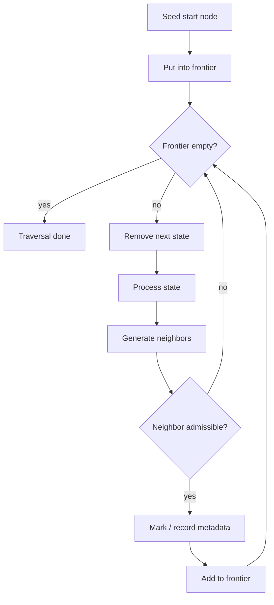
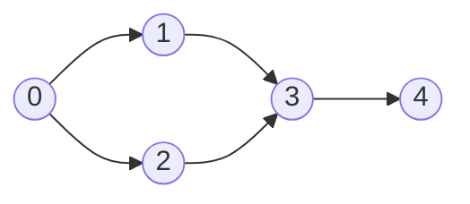
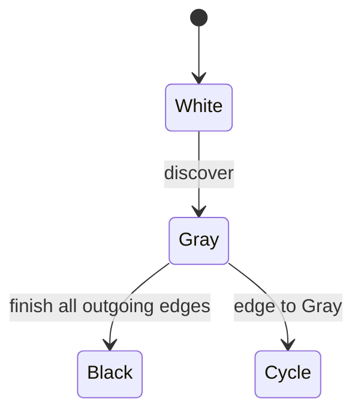
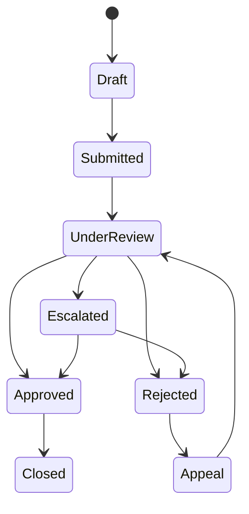
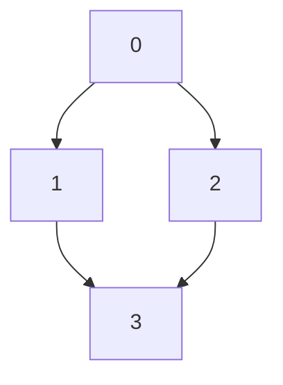

------
title: Learn Java Data Structures and Algorithms - Part 021
description: Graph traversal dengan BFS, DFS, dan state-space search di Java: invariants, visited state, parent tracking, connected components, cycle detection, flood fill, implicit graph, dan failure modes.
series: learn-java-dsa
seriesTitle: Learn Java Data Structures and Algorithms
order: 21
partTitle: Graph Traversal: BFS, DFS, and State-Space Search
tags:
- java
- data-structures
- algorithms
- dsa
- graph
- bfs
- dfs
- traversal
- series
date: 2026-06-27
---

# Part 021 — Graph Traversal: BFS, DFS, and State-Space Search

## 1. Skill Target

Setelah menyelesaikan part ini, kita ingin bisa:

1. Menulis BFS dan DFS yang benar untuk graph explicit dan implicit.
2. Menentukan arti `visited`: discovered, enqueued, processing, processed, atau permanently closed.
3. Melacak parent, depth, component id, discovery order, finish order, dan distance.
4. Menggunakan BFS untuk shortest path pada unweighted graph.
5. Menggunakan DFS untuk connected components, cycle detection, topological intuition, dan structural validation.
6. Memilih iterative traversal saat recursion depth berbahaya.
7. Menghindari bug produksi: duplicate enqueue, memory blow-up, infinite traversal, wrong directedness, dan mutable graph during traversal.

Traversal adalah primitive terbesar dalam graph algorithms. Dijkstra, Prim, topological sort, SCC, max-flow augmenting path, flood fill, parser graph walks, dan workflow reachability semuanya adalah variasi dari traversal dengan aturan state yang lebih spesifik.

---

## 2. Kaufman Framing: Jangan Menghafal BFS/DFS, Latih State Discipline

Dalam kerangka Josh Kaufman, kita tidak ingin menghabiskan waktu awal menghafal banyak variasi traversal. Kita ingin memecah skill menjadi subskill kecil yang memberi feedback cepat:

- mendefinisikan node identity;
- mendefinisikan frontier;
- mendefinisikan visited policy;
- mendefinisikan transition/neighbors;
- mendefinisikan metadata yang dikumpulkan;
- mendefinisikan stopping condition;
- membuktikan tidak ada node diproses tak terbatas;
- menguji traversal pada graph kecil yang bisa digambar manual.

Latihan utama part ini bukan “tulis BFS 20 kali”. Latihan utamanya adalah:

> Untuk setiap problem, nyatakan `state`, `frontier`, `visited invariant`, dan `transition rule` sebelum menulis kode.

Kalau empat hal itu jelas, kode traversal biasanya pendek.

---

## 3. Mental Model: Traversal Is Controlled Expansion

Traversal mengulang pola ini:

```text
start states -> frontier -> pop state -> inspect/process -> expand neighbors -> repeat
```

Perbedaan BFS dan DFS terletak pada disiplin frontier:

| Algorithm | Frontier | Efek |
|---|---|---|
| BFS | queue FIFO | proses berdasarkan jarak/layer |
| DFS recursive | call stack | masuk sedalam mungkin |
| DFS iterative | stack LIFO | masuk sedalam mungkin, eksplisit |
| Uniform-cost/Dijkstra | priority queue | proses berdasarkan cost minimum |
| A* | priority queue by cost + heuristic | proses berdasarkan estimasi tujuan |

BFS dan DFS bukan sekadar algoritma. Keduanya adalah **frontier discipline**.



---

## 4. Graph Representation Used in This Part

Kita pakai representation sederhana dari part 020:

```java
import java.util.*;

final class IntGraph {
    private final List<int[]> adj;
    private final boolean directed;

    IntGraph(int n, boolean directed) {
        if (n < 0) throw new IllegalArgumentException("n must be non-negative");
        this.directed = directed;
        this.adj = new ArrayList<>(n);
        for (int i = 0; i < n; i++) {
            adj.add(new int[0]);
        }
    }

    int size() {
        return adj.size();
    }

    int[] neighbors(int v) {
        checkVertex(v);
        return adj.get(v);
    }

    boolean isDirected() {
        return directed;
    }

    private void checkVertex(int v) {
        if (v < 0 || v >= adj.size()) {
            throw new IndexOutOfBoundsException("invalid vertex: " + v);
        }
    }

    static IntGraph fromEdges(int n, boolean directed, int[][] edges) {
        List<List<Integer>> temp = new ArrayList<>(n);
        for (int i = 0; i < n; i++) temp.add(new ArrayList<>());

        for (int[] e : edges) {
            if (e.length != 2) throw new IllegalArgumentException("edge must have 2 endpoints");
            int u = e[0], v = e[1];
            if (u < 0 || u >= n || v < 0 || v >= n) {
                throw new IllegalArgumentException("invalid edge: " + Arrays.toString(e));
            }
            temp.get(u).add(v);
            if (!directed) temp.get(v).add(u);
        }

        IntGraph g = new IntGraph(n, directed);
        for (int i = 0; i < n; i++) {
            int[] a = temp.get(i).stream().mapToInt(Integer::intValue).toArray();
            g.adj.set(i, a);
        }
        return g;
    }
}
```

Kenapa `int` vertex, bukan object node?

- traversal sering memory-bound;
- `boolean[]`, `int[]`, dan `ArrayDeque<Integer>` lebih sederhana untuk reasoning;
- domain ID bisa dimapping ke integer via `Map<DomainId, Integer>`;
- untuk graph besar, object graph menambah allocation dan reference chasing.

Production note: `ArrayDeque` adalah default baik untuk queue/stack single-threaded. Jangan pakai `Stack`; class itu legacy dan synchronized secara tidak perlu untuk kebanyakan traversal lokal.

---

## 5. BFS: Layer-by-Layer Expansion

BFS memproses graph berdasarkan jarak edge count dari start.

Invariant utama BFS pada unweighted graph:

> Ketika node `v` pertama kali ditemukan, `dist[v]` adalah jarak minimum dari start ke `v`.

Syarat invariant ini:

1. semua edge punya cost sama;
2. node ditandai visited saat **masuk queue**, bukan saat keluar queue;
3. queue FIFO menjaga layer ordering.



Jika start `0`, BFS menemukan layer:

```text
dist 0: 0
dist 1: 1, 2
dist 2: 3
dist 3: 4
```

---

## 6. BFS Implementation with Distance and Parent

```java
import java.util.*;

final class BfsResult {
    final int source;
    final int[] dist;
    final int[] parent;
    final int[] order;

    BfsResult(int source, int[] dist, int[] parent, int[] order) {
        this.source = source;
        this.dist = dist;
        this.parent = parent;
        this.order = order;
    }

    boolean reachable(int v) {
        return dist[v] >= 0;
    }

    List<Integer> pathTo(int target) {
        if (!reachable(target)) return List.of();
        ArrayList<Integer> path = new ArrayList<>();
        for (int cur = target; cur != -1; cur = parent[cur]) {
            path.add(cur);
        }
        Collections.reverse(path);
        return path;
    }
}

final class GraphTraversal {
    static BfsResult bfs(IntGraph g, int source) {
        int n = g.size();
        if (source < 0 || source >= n) {
            throw new IndexOutOfBoundsException("invalid source: " + source);
        }

        int[] dist = new int[n];
        int[] parent = new int[n];
        Arrays.fill(dist, -1);
        Arrays.fill(parent, -1);

        int[] order = new int[n];
        int orderSize = 0;

        ArrayDeque<Integer> q = new ArrayDeque<>();
        dist[source] = 0;
        q.addLast(source);

        while (!q.isEmpty()) {
            int u = q.removeFirst();
            order[orderSize++] = u;

            for (int v : g.neighbors(u)) {
                if (dist[v] != -1) continue;
                dist[v] = dist[u] + 1;
                parent[v] = u;
                q.addLast(v);
            }
        }

        return new BfsResult(source, dist, parent, Arrays.copyOf(order, orderSize));
    }
}
```

### Why Mark on Enqueue?

Bug umum:

```java
// Bad policy for normal BFS on graph with many converging edges.
int u = q.removeFirst();
if (visited[u]) continue;
visited[u] = true;
for (int v : neighbors(u)) q.addLast(v);
```

Ini bisa tetap benar untuk beberapa kasus, tetapi queue dapat membengkak karena node yang sama masuk frontier berkali-kali sebelum diproses.

Policy yang lebih stabil:

```java
if (!visited[v]) {
    visited[v] = true;
    q.addLast(v);
}
```

Atau gunakan `dist[v] == -1` sebagai visited marker.

Invariant:

> Setiap vertex masuk queue paling banyak satu kali.

Dari invariant ini, BFS menjadi `O(V + E)` untuk adjacency list.

---

## 7. BFS Early Exit

Jika hanya butuh path ke satu target, kita bisa berhenti saat target ditemukan atau saat target keluar queue.

```java
static List<Integer> shortestPathUnweighted(IntGraph g, int source, int target) {
    int n = g.size();
    int[] dist = new int[n];
    int[] parent = new int[n];
    Arrays.fill(dist, -1);
    Arrays.fill(parent, -1);

    ArrayDeque<Integer> q = new ArrayDeque<>();
    dist[source] = 0;
    q.addLast(source);

    while (!q.isEmpty()) {
        int u = q.removeFirst();
        if (u == target) break;

        for (int v : g.neighbors(u)) {
            if (dist[v] != -1) continue;
            dist[v] = dist[u] + 1;
            parent[v] = u;
            if (v == target) {
                return reconstructPath(parent, source, target);
            }
            q.addLast(v);
        }
    }

    if (dist[target] == -1) return List.of();
    return reconstructPath(parent, source, target);
}

private static List<Integer> reconstructPath(int[] parent, int source, int target) {
    ArrayList<Integer> path = new ArrayList<>();
    for (int cur = target; cur != -1; cur = parent[cur]) {
        path.add(cur);
        if (cur == source) break;
    }
    Collections.reverse(path);
    return path;
}
```

Early exit saat `v == target` ditemukan aman untuk unweighted BFS karena first discovery sudah jarak minimum. Namun untuk Dijkstra, early exit aman saat target **keluar dari priority queue sebagai settled node**, bukan saat pertama kali ditemukan.

---

## 8. Multi-Source BFS

Multi-source BFS dipakai untuk:

- nearest facility;
- distance from any infected cell;
- spreading process;
- fire escape;
- nearest zero/one cell;
- minimum distance to any terminal state.

Ide:

> Masukkan semua source ke queue dengan `dist = 0`.

```java
static int[] multiSourceBfs(IntGraph g, Collection<Integer> sources) {
    int n = g.size();
    int[] dist = new int[n];
    Arrays.fill(dist, -1);

    ArrayDeque<Integer> q = new ArrayDeque<>();
    for (int s : sources) {
        if (s < 0 || s >= n) throw new IndexOutOfBoundsException("invalid source: " + s);
        if (dist[s] == 0) continue; // duplicate source
        dist[s] = 0;
        q.addLast(s);
    }

    while (!q.isEmpty()) {
        int u = q.removeFirst();
        for (int v : g.neighbors(u)) {
            if (dist[v] != -1) continue;
            dist[v] = dist[u] + 1;
            q.addLast(v);
        }
    }
    return dist;
}
```

Mental model:

```text
BFS from many sources = BFS from synthetic super-source connected to each source by 0-cost edges.
```

Karena edge synthetic berbiaya 0, untuk unweighted implementation kita cukup seed semua source.

---

## 9. BFS on Grid: Flood Fill and State Coordinates

Grid adalah implicit graph. Vertex tidak disimpan sebagai adjacency list. Neighbor dihitung dari koordinat.

```java
static int shortestPathInGrid(char[][] grid, int sr, int sc, int tr, int tc) {
    int rows = grid.length;
    if (rows == 0) return -1;
    int cols = grid[0].length;

    int[][] dist = new int[rows][cols];
    for (int[] row : dist) Arrays.fill(row, -1);

    int[] dr = {-1, 1, 0, 0};
    int[] dc = {0, 0, -1, 1};

    ArrayDeque<int[]> q = new ArrayDeque<>();
    dist[sr][sc] = 0;
    q.addLast(new int[]{sr, sc});

    while (!q.isEmpty()) {
        int[] cur = q.removeFirst();
        int r = cur[0], c = cur[1];
        if (r == tr && c == tc) return dist[r][c];

        for (int k = 0; k < 4; k++) {
            int nr = r + dr[k], nc = c + dc[k];
            if (nr < 0 || nr >= rows || nc < 0 || nc >= cols) continue;
            if (grid[nr][nc] == '#') continue;
            if (dist[nr][nc] != -1) continue;
            dist[nr][nc] = dist[r][c] + 1;
            q.addLast(new int[]{nr, nc});
        }
    }

    return -1;
}
```

Untuk performance lebih baik, hindari `new int[]{...}` per cell pada grid besar. Encode koordinat ke satu `int`:

```java
static int id(int r, int c, int cols) {
    return r * cols + c;
}

static int row(int id, int cols) {
    return id / cols;
}

static int col(int id, int cols) {
    return id % cols;
}
```

Lalu queue menyimpan `Integer`. Untuk skala sangat besar, buat primitive int queue agar tidak boxing.

---

## 10. DFS: Depth-First Structural Exploration

DFS mengeksplor jalur sampai mentok sebelum backtrack.

BFS cocok untuk minimum edge count. DFS cocok untuk struktur:

- connected components;
- cycle detection;
- articulation/bridge foundation;
- topological ordering foundation;
- SCC foundation;
- tree DP;
- backtracking;
- reachability with path stack;
- validation of nested structures.

DFS recursive secara konseptual sederhana:

```java
static void dfsRecursive(IntGraph g, int u, boolean[] visited, List<Integer> order) {
    visited[u] = true;
    order.add(u);
    for (int v : g.neighbors(u)) {
        if (!visited[v]) dfsRecursive(g, v, visited, order);
    }
}
```

Tetapi recursion depth bisa menjadi masalah pada graph panjang. Di Java, stack thread tidak didesain untuk jutaan frame traversal. Untuk graph produksi atau input adversarial, iterative DFS lebih aman.

---

## 11. Iterative DFS: Simple Version

```java
static List<Integer> dfsIterativePreorder(IntGraph g, int source) {
    int n = g.size();
    boolean[] visited = new boolean[n];
    ArrayList<Integer> order = new ArrayList<>();
    ArrayDeque<Integer> stack = new ArrayDeque<>();

    visited[source] = true;
    stack.addLast(source);

    while (!stack.isEmpty()) {
        int u = stack.removeLast();
        order.add(u);

        int[] neighbors = g.neighbors(u);
        // Reverse push if we want order similar to recursive traversal.
        for (int i = neighbors.length - 1; i >= 0; i--) {
            int v = neighbors[i];
            if (visited[v]) continue;
            visited[v] = true;
            stack.addLast(v);
        }
    }

    return order;
}
```

Invariant:

> A vertex is marked before entering the stack, so it enters the stack at most once.

Ini mirip BFS, tetapi frontier LIFO.

Limitasi simple iterative DFS: sulit mendapatkan finish time/postorder karena kita tidak tahu kapan semua child selesai, kecuali menyimpan frame eksplisit.

---

## 12. Iterative DFS with Explicit Frames

Untuk meniru recursive DFS secara penuh, simpan frame:

```java
final class DfsFrame {
    final int vertex;
    int nextIndex;

    DfsFrame(int vertex) {
        this.vertex = vertex;
        this.nextIndex = 0;
    }
}

static final class DfsTimes {
    final int[] discover;
    final int[] finish;
    final int[] parent;
    final List<Integer> preorder;
    final List<Integer> postorder;

    DfsTimes(int[] discover, int[] finish, int[] parent,
             List<Integer> preorder, List<Integer> postorder) {
        this.discover = discover;
        this.finish = finish;
        this.parent = parent;
        this.preorder = preorder;
        this.postorder = postorder;
    }
}

static DfsTimes dfsWithTimes(IntGraph g) {
    int n = g.size();
    int[] discover = new int[n];
    int[] finish = new int[n];
    int[] parent = new int[n];
    Arrays.fill(discover, -1);
    Arrays.fill(finish, -1);
    Arrays.fill(parent, -1);

    ArrayList<Integer> preorder = new ArrayList<>();
    ArrayList<Integer> postorder = new ArrayList<>();
    int time = 0;

    for (int start = 0; start < n; start++) {
        if (discover[start] != -1) continue;

        ArrayDeque<DfsFrame> stack = new ArrayDeque<>();
        discover[start] = time++;
        preorder.add(start);
        stack.addLast(new DfsFrame(start));

        while (!stack.isEmpty()) {
            DfsFrame frame = stack.peekLast();
            int u = frame.vertex;
            int[] neighbors = g.neighbors(u);

            if (frame.nextIndex < neighbors.length) {
                int v = neighbors[frame.nextIndex++];
                if (discover[v] == -1) {
                    parent[v] = u;
                    discover[v] = time++;
                    preorder.add(v);
                    stack.addLast(new DfsFrame(v));
                }
            } else {
                stack.removeLast();
                finish[u] = time++;
                postorder.add(u);
            }
        }
    }

    return new DfsTimes(discover, finish, parent, preorder, postorder);
}
```

Ini lebih verbose, tetapi memberi kontrol penuh atas DFS state.

---

## 13. Connected Components in Undirected Graph

Connected components mempartisi vertex menjadi kelompok yang saling reachable.

```java
static int[] connectedComponents(IntGraph g) {
    if (g.isDirected()) {
        throw new IllegalArgumentException("connectedComponents expects an undirected graph");
    }

    int n = g.size();
    int[] comp = new int[n];
    Arrays.fill(comp, -1);
    int compId = 0;

    ArrayDeque<Integer> stack = new ArrayDeque<>();

    for (int s = 0; s < n; s++) {
        if (comp[s] != -1) continue;

        comp[s] = compId;
        stack.addLast(s);

        while (!stack.isEmpty()) {
            int u = stack.removeLast();
            for (int v : g.neighbors(u)) {
                if (comp[v] != -1) continue;
                comp[v] = compId;
                stack.addLast(v);
            }
        }

        compId++;
    }

    return comp;
}
```

Invariant:

- `comp[v] == -1`: unseen;
- `comp[v] == k`: vertex sudah ditemukan sebagai bagian component `k`;
- setiap edge undirected dari component `k` hanya mengarah ke vertex yang akhirnya juga `k`, kecuali vertex tersebut sudah berada di component lain, yang seharusnya mustahil jika graph modelling benar.

Untuk directed graph, istilah yang tepat bukan connected component biasa. Kita perlu weakly connected component atau strongly connected component. SCC akan dibahas pada part 025.

---

## 14. Cycle Detection in Undirected Graph

Pada undirected graph, saat DFS dari `u` ke `v`, edge balik ke parent tidak dianggap cycle. Edge ke visited node selain parent menandakan cycle.

```java
static boolean hasCycleUndirected(IntGraph g) {
    if (g.isDirected()) throw new IllegalArgumentException("expected undirected graph");

    int n = g.size();
    boolean[] visited = new boolean[n];

    for (int s = 0; s < n; s++) {
        if (visited[s]) continue;
        if (hasCycleUndirectedFrom(g, s, visited)) return true;
    }
    return false;
}

private static boolean hasCycleUndirectedFrom(IntGraph g, int start, boolean[] visited) {
    ArrayDeque<int[]> stack = new ArrayDeque<>(); // {u, parent}
    visited[start] = true;
    stack.addLast(new int[]{start, -1});

    while (!stack.isEmpty()) {
        int[] cur = stack.removeLast();
        int u = cur[0], parent = cur[1];

        for (int v : g.neighbors(u)) {
            if (v == parent) continue;
            if (visited[v]) return true;
            visited[v] = true;
            stack.addLast(new int[]{v, u});
        }
    }
    return false;
}
```

Caveat: pada multigraph, dua parallel edges antara `u` dan `parent` bisa membentuk cycle length 2 tergantung definisi problem. Implementasi di atas mengabaikan semua edge ke parent, sehingga tidak mendeteksi parallel-edge cycle. Ini contoh mengapa graph modelling penting.

---

## 15. Cycle Detection in Directed Graph

Directed cycle detection butuh warna/state:

| State | Meaning |
|---|---|
| 0 white | belum ditemukan |
| 1 gray | sedang berada di recursion/DFS stack |
| 2 black | selesai diproses |

Directed cycle ada jika kita menemukan edge ke gray node.

```java
static boolean hasCycleDirected(IntGraph g) {
    if (!g.isDirected()) throw new IllegalArgumentException("expected directed graph");

    int n = g.size();
    byte[] color = new byte[n];

    for (int s = 0; s < n; s++) {
        if (color[s] == 0 && hasCycleDirectedDfs(g, s, color)) {
            return true;
        }
    }
    return false;
}

private static boolean hasCycleDirectedDfs(IntGraph g, int u, byte[] color) {
    color[u] = 1; // gray
    for (int v : g.neighbors(u)) {
        if (color[v] == 1) return true;
        if (color[v] == 0 && hasCycleDirectedDfs(g, v, color)) return true;
    }
    color[u] = 2; // black
    return false;
}
```

Iterative version lebih aman untuk graph besar, tetapi recursive version memperjelas invariant.



---

## 16. Reachability in Workflow / State Machine Systems

Untuk software engineer yang bekerja dengan lifecycle, graph traversal sering muncul sebagai reachability analysis.

Contoh: case enforcement lifecycle.



Pertanyaan traversal:

- Apakah `Closed` reachable dari semua non-terminal state?
- Apakah ada cycle yang sengaja diizinkan?
- State mana yang tidak pernah reachable dari initial state?
- Transition mana yang dead?
- Apakah escalation bisa bypass review?
- Apakah ada path dari rejected ke approved?

Traversal bukan hanya DSA akademik. Ini tool untuk audit sistem.

```java
static Set<String> reachableStates(Map<String, List<String>> transitions, String start) {
    Set<String> visited = new LinkedHashSet<>();
    ArrayDeque<String> q = new ArrayDeque<>();

    visited.add(start);
    q.addLast(start);

    while (!q.isEmpty()) {
        String state = q.removeFirst();
        for (String next : transitions.getOrDefault(state, List.of())) {
            if (visited.add(next)) q.addLast(next);
        }
    }

    return visited;
}
```

Gunakan `LinkedHashSet` jika output order berguna untuk debugging.

---

## 17. Implicit State-Space Search

Tidak semua graph disimpan sebagai node/edge. Dalam puzzle, planner, routing kecil, scheduler, dan validation system, graph bisa implicit:

```text
state = current configuration
neighbor(state) = all valid next configurations
```

Contoh: minimum operations dari angka `start` ke `target` dengan operasi `+1`, `-1`, `*2`, batas `[0, limit]`.

```java
static int minOps(int start, int target, int limit) {
    if (start < 0 || start > limit || target < 0 || target > limit) return -1;

    int[] dist = new int[limit + 1];
    Arrays.fill(dist, -1);
    ArrayDeque<Integer> q = new ArrayDeque<>();

    dist[start] = 0;
    q.addLast(start);

    while (!q.isEmpty()) {
        int x = q.removeFirst();
        if (x == target) return dist[x];

        int[] nexts = {x - 1, x + 1, x * 2};
        for (int y : nexts) {
            if (y < 0 || y > limit) continue;
            if (dist[y] != -1) continue;
            dist[y] = dist[x] + 1;
            q.addLast(y);
        }
    }

    return -1;
}
```

State-space search checklist:

1. Apakah state representation canonical?
2. Apakah neighbor generation lengkap?
3. Apakah ada batas search?
4. Apakah visited memakai equality yang benar?
5. Apakah path reconstruction perlu?
6. Apakah BFS masih feasible secara memory?

---

## 18. Bidirectional BFS

Untuk shortest path unweighted antara `source` dan `target`, bidirectional BFS sering jauh lebih cepat jika branching factor besar.

Ide:

- BFS dari source;
- BFS dari target;
- berhenti ketika frontier bertemu.

Complexity intuition:

```text
Normal BFS:        O(b^d)
Bidirectional BFS: O(b^(d/2) + b^(d/2))
```

Dengan branching factor `b` dan distance `d`.

Skeleton:

```java
static int bidirectionalBfs(IntGraph g, int source, int target) {
    if (source == target) return 0;

    int n = g.size();
    int[] distA = new int[n];
    int[] distB = new int[n];
    Arrays.fill(distA, -1);
    Arrays.fill(distB, -1);

    ArrayDeque<Integer> qa = new ArrayDeque<>();
    ArrayDeque<Integer> qb = new ArrayDeque<>();

    distA[source] = 0;
    distB[target] = 0;
    qa.addLast(source);
    qb.addLast(target);

    while (!qa.isEmpty() && !qb.isEmpty()) {
        int ans;
        if (qa.size() <= qb.size()) {
            ans = expandOneLayer(g, qa, distA, distB);
        } else {
            ans = expandOneLayer(g, qb, distB, distA);
        }
        if (ans != -1) return ans;
    }

    return -1;
}

private static int expandOneLayer(IntGraph g, ArrayDeque<Integer> q,
                                  int[] ownDist, int[] otherDist) {
    int layerSize = q.size();
    while (layerSize-- > 0) {
        int u = q.removeFirst();
        for (int v : g.neighbors(u)) {
            if (ownDist[v] != -1) continue;
            ownDist[v] = ownDist[u] + 1;
            if (otherDist[v] != -1) {
                return ownDist[v] + otherDist[v];
            }
            q.addLast(v);
        }
    }
    return -1;
}
```

Caveat directed graph: backward search membutuhkan reverse adjacency. Jangan menggunakan outgoing edges target sebagai backward frontier kecuali graph undirected atau edge direction memang reversible.

---

## 19. Traversal Metadata Patterns

Traversal sering bukan hanya visiting. Kita mengumpulkan metadata.

| Metadata | BFS | DFS | Use Case |
|---|---:|---:|---|
| `visited` | yes | yes | avoid repetition/infinite loop |
| `dist` | yes | sometimes | shortest unweighted distance/layer |
| `parent` | yes | yes | path/tree reconstruction |
| `componentId` | yes | yes | grouping/connectivity |
| `discoverTime` | no | yes | edge classification/SCC foundation |
| `finishTime` | no | yes | topological/SCC foundation |
| `color` | sometimes | yes | directed cycle detection |
| `depth` | yes | yes | tree/level/path logic |

Design rule:

> Jangan kumpulkan metadata yang tidak dipakai, tetapi jangan menghilangkan metadata yang dibutuhkan untuk correctness.

Contoh: Untuk shortest path, `visited` saja tidak cukup kalau output harus path. Perlu `parent`.

---

## 20. Complexity Budget

Untuk graph explicit dengan adjacency list:

| Operation | Time | Space |
|---|---:|---:|
| BFS from one source | `O(V + E)` | `O(V)` |
| DFS full graph | `O(V + E)` | `O(V)` |
| connected components | `O(V + E)` | `O(V)` |
| cycle detection | `O(V + E)` | `O(V)` |
| grid BFS `R*C` | `O(R*C)` | `O(R*C)` |

Important nuance:

- `O(V + E)` mengasumsikan iterasi neighbor total proporsional edge count.
- Dengan adjacency matrix, traversal scanning neighbors bisa `O(V^2)`.
- Dengan `Map<Node, List<Node>>`, cost hashing/equality ikut masuk.
- Dengan object graph besar, locality bisa lebih menentukan daripada Big-O.

---

## 21. Java Implementation Choices

### Use `ArrayDeque` for Queue/Stack

```java
ArrayDeque<Integer> q = new ArrayDeque<>();
q.addLast(x);
int x = q.removeFirst();

ArrayDeque<Integer> stack = new ArrayDeque<>();
stack.addLast(x);
int x = stack.removeLast();
```

Avoid:

```java
LinkedList<Integer> q = new LinkedList<>(); // extra nodes, worse locality
Stack<Integer> stack = new Stack<>();       // legacy synchronized Vector subclass
```

### Prefer Arrays for Dense Integer IDs

```java
boolean[] visited = new boolean[n];
int[] dist = new int[n];
int[] parent = new int[n];
```

### Use Maps for Sparse / Domain Objects

```java
Map<String, Integer> dist = new HashMap<>();
Map<String, String> parent = new HashMap<>();
```

But define equality carefully. A mutable domain object used as a key can break traversal.

### Avoid Recursive DFS for Unknown Depth

Recursive DFS is readable, but iterative DFS should be default for untrusted graph depth.

---

## 22. Failure Modes and How to Detect Them

### Failure 1: Visited Too Late

Symptom:

- queue grows unexpectedly;
- duplicate processing;
- memory pressure;
- timeout on dense graph.

Fix:

- mark when enqueued/pushed unless algorithm specifically requires repeated relaxation.

### Failure 2: Wrong Directedness

Symptom:

- reachability says path exists when domain says impossible;
- dependency graph cycle detection wrong;
- reverse lookup missing.

Fix:

- state edge direction explicitly in type/API.

### Failure 3: Parent Tracking Overwritten

Symptom:

- reconstructed path not shortest;
- path contains loop;
- path starts from wrong source.

Fix:

- set parent only on first discovery for BFS.

### Failure 4: Recursion Stack Overflow

Symptom:

- works on small tests;
- fails on chain graph of size 100k+.

Fix:

- iterative DFS with explicit stack.

### Failure 5: Infinite Implicit State Search

Symptom:

- BFS never ends;
- state space expands without bound.

Fix:

- define admissible state bounds and canonicalization.

### Failure 6: Mutable Graph During Traversal

Symptom:

- inconsistent results;
- `ConcurrentModificationException`;
- missed or duplicated edges.

Fix:

- freeze graph snapshot;
- copy adjacency;
- use versioned graph;
- separate mutation phase from traversal phase.

---

## 23. Testing Strategy

### Minimal Test Graphs

Use graph cases that expose traversal bugs:

```text
1. Empty graph
2. Single vertex
3. One edge
4. Disconnected graph
5. Self-loop
6. Cycle
7. Diamond graph
8. Long chain
9. Dense graph
10. Directed graph with one-way edge
```

Diamond graph is especially good for duplicate enqueue bugs:



Expected BFS from `0`:

```text
dist[3] = 2
parent[3] is either 1 or 2 depending neighbor order
3 is enqueued once
```

### Property Checks

For BFS result:

```text
for every edge (u, v): dist[v] <= dist[u] + 1   // directed reachable side nuance
for every reachable v != source: parent[v] != -1
for every parent edge parent[v] -> v: dist[v] = dist[parent[v]] + 1
```

For undirected connected components:

```text
for every edge (u, v): comp[u] == comp[v]
```

For directed cycle detection:

- DAG must return false;
- graph with back edge must return true;
- self-loop must return true.

---

## 24. Deliberate Practice Loop

### Drill 1: Implement BFS Without Looking

Write BFS with:

- `dist`;
- `parent`;
- path reconstruction;
- early exit target.

Then test on disconnected and diamond graph.

### Drill 2: Implement DFS Three Ways

1. recursive preorder;
2. iterative stack preorder;
3. iterative frame with finish time.

Compare output order and metadata.

### Drill 3: Model a Workflow as a Directed Graph

Pick a lifecycle:

- ticket status;
- order fulfillment;
- regulatory case;
- deployment pipeline.

Answer:

- unreachable states;
- terminal states;
- states that can reach terminal;
- directed cycles;
- shortest transition path between two states.

### Drill 4: Convert a Grid to Implicit Graph

Implement:

- shortest path through walls;
- multi-source nearest exit;
- flood fill component count.

### Drill 5: Stress Test Traversal

Generate:

- chain of 1_000_000 nodes;
- star graph;
- dense-ish random graph;
- disconnected graph with many tiny components.

Measure memory, time, and failure behavior.

---

## 25. Engineering Checklist

Before writing traversal code, answer:

- What exactly is a vertex/state?
- What exactly is an edge/transition?
- Is graph directed?
- Is graph weighted?
- Can edge duplicates exist?
- Can self-loops exist?
- Is state space finite?
- What marks a state as visited?
- Should visited be set on enqueue, dequeue, discover, or finish?
- What metadata is required by output?
- Is recursion depth safe?
- Can graph mutate during traversal?
- Is traversal over object IDs, dense int IDs, or domain objects?
- What is the expected maximum `V` and `E`?

---

## 26. Summary

BFS and DFS are not templates. They are controlled expansion strategies.

Key mental models:

- BFS uses FIFO frontier and gives shortest edge-count distance in unweighted graphs.
- DFS uses LIFO/call-stack frontier and exposes structural properties.
- `visited` is not a boolean afterthought; it is the core invariant preventing repeated or infinite exploration.
- Parent/depth/time metadata must match the algorithm's semantics.
- Implicit graph search requires careful state canonicalization and bounds.
- Java implementation should default to `ArrayDeque`, primitive arrays, and iterative DFS for unknown depth.

Part berikutnya menggunakan frontier discipline yang lebih general: shortest path. BFS akan muncul sebagai special case dari cost-based traversal ketika semua edge memiliki cost yang sama.
