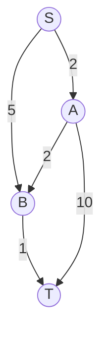
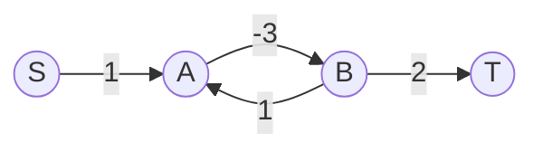
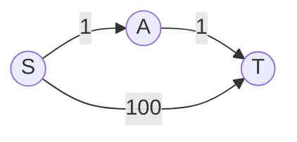

------
title: Learn Java Data Structures and Algorithms - Part 022
description: Shortest path dan route planning di Java: BFS sebagai unweighted shortest path, Dijkstra, Bellman-Ford, Floyd-Warshall, 0-1 BFS, multi-source shortest path, path reconstruction, dan modelling cost.
series: learn-java-dsa
seriesTitle: Learn Java Data Structures and Algorithms
order: 22
partTitle: Shortest Paths and Route Planning
tags:
- java
- data-structures
- algorithms
- dsa
- graph
- shortest-path
- dijkstra
- bellman-ford
- route-planning
- series
date: 2026-06-27
---

# Part 022 — Shortest Paths and Route Planning

## 1. Skill Target

Setelah menyelesaikan part ini, kita ingin bisa:

1. Memodelkan shortest path sebagai masalah cost accumulation, bukan sekadar “pakai Dijkstra”.
2. Memilih algoritma berdasarkan sifat edge: unweighted, non-negative weighted, negative edge, dense graph, all-pairs, atau 0/1 weights.
3. Mengimplementasikan Dijkstra di Java dengan `PriorityQueue` dan lazy deletion secara benar.
4. Mengimplementasikan Bellman-Ford untuk negative edge dan negative-cycle detection.
5. Mengimplementasikan Floyd-Warshall untuk all-pairs shortest paths pada graph kecil/dense.
6. Menggunakan 0-1 BFS untuk edge weight 0 atau 1.
7. Melakukan path reconstruction yang valid.
8. Menghindari overflow, comparator bug, stale priority queue entry, dan salah early exit.

Shortest path adalah traversal dengan prioritas. BFS adalah shortest path ketika semua edge cost sama. Dijkstra adalah shortest path ketika semua edge cost non-negative. Bellman-Ford adalah shortest path ketika edge negatif mungkin ada. Floyd-Warshall adalah all-pairs dynamic programming.

---

## 2. Kaufman Framing: Decompose by Edge Cost, Not by Algorithm Name

Subskill shortest path:

- definisikan state/node;
- definisikan edge/transition;
- definisikan cost;
- tentukan apakah cost bisa negatif;
- tentukan apakah semua cost sama;
- tentukan jumlah source/target;
- tentukan apakah butuh path atau hanya distance;
- tentukan apakah graph berubah;
- tentukan batas `V`, `E`, dan max cost;
- pilih algoritma paling sederhana yang memenuhi invariant.

Pertanyaan awal yang lebih baik daripada “pakai algoritma apa?”:

> Apa sifat cost dan apa guarantee correctness yang dibutuhkan?

---

## 3. Decision Matrix

| Problem Shape | Recommended Algorithm | Time | Notes |
|---|---|---:|---|
| Unweighted single-source | BFS | `O(V + E)` | edge count minimum |
| Weight 0/1 | 0-1 BFS | `O(V + E)` | deque-based |
| Non-negative weights | Dijkstra | `O((V + E) log V)` with heap | practical default |
| Negative edges, no negative cycle | Bellman-Ford | `O(VE)` | also detects negative cycles |
| All-pairs, small/dense graph | Floyd-Warshall | `O(V^3)` | simple DP matrix |
| DAG weighted shortest path | Topological relaxation | `O(V + E)` | part 024 builds topo foundation |
| Many queries, static road network | Preprocessing/indexing | varies | contraction hierarchies/A* variants outside this part |

Wrong algorithm example:

- Dijkstra with negative edge can return wrong answer.
- BFS with weighted edges optimizes number of hops, not total cost.
- Floyd-Warshall on `V = 100_000` is impossible.

---

## 4. Weighted Graph Representation

Use dense integer vertex IDs and immutable edge records.

```java
import java.util.*;

record Edge(int to, long weight) {
    Edge {
        if (to < 0) throw new IllegalArgumentException("negative vertex id");
    }
}

final class WeightedGraph {
    private final List<Edge[]> adj;
    private final boolean directed;

    WeightedGraph(int n, boolean directed) {
        if (n < 0) throw new IllegalArgumentException("n must be non-negative");
        this.directed = directed;
        this.adj = new ArrayList<>(n);
        for (int i = 0; i < n; i++) adj.add(new Edge[0]);
    }

    int size() {
        return adj.size();
    }

    boolean isDirected() {
        return directed;
    }

    Edge[] neighbors(int v) {
        checkVertex(v);
        return adj.get(v);
    }

    private void checkVertex(int v) {
        if (v < 0 || v >= adj.size()) {
            throw new IndexOutOfBoundsException("invalid vertex: " + v);
        }
    }

    static WeightedGraph fromEdges(int n, boolean directed, long[][] edges) {
        List<List<Edge>> temp = new ArrayList<>(n);
        for (int i = 0; i < n; i++) temp.add(new ArrayList<>());

        for (long[] e : edges) {
            if (e.length != 3) throw new IllegalArgumentException("edge must be {from,to,weight}");
            int from = Math.toIntExact(e[0]);
            int to = Math.toIntExact(e[1]);
            long w = e[2];
            if (from < 0 || from >= n || to < 0 || to >= n) {
                throw new IllegalArgumentException("invalid edge: " + Arrays.toString(e));
            }
            temp.get(from).add(new Edge(to, w));
            if (!directed) temp.get(to).add(new Edge(from, w));
        }

        WeightedGraph g = new WeightedGraph(n, directed);
        for (int i = 0; i < n; i++) {
            g.adj.set(i, temp.get(i).toArray(Edge[]::new));
        }
        return g;
    }
}
```

Use `long` for distance. `int` distance overflows quickly when path length and edge weight are large.

---

## 5. Shortest Path Invariant

Shortest path algorithms maintain some form of `dist[v]`:

```text
dist[v] = best known cost from source to v
```

But “best known” and “final” are not always the same.

| Algorithm | When is `dist[v]` final? |
|---|---|
| BFS | first discovery/enqueue |
| 0-1 BFS | when popped from deque with current distance discipline |
| Dijkstra | when popped as min non-stale entry from priority queue |
| Bellman-Ford | after enough relaxation passes, unless negative cycle exists |
| Floyd-Warshall | after considering intermediate vertices up to `k` |

This distinction controls early exit and correctness.

---

## 6. Relaxation: The Core Operation

All shortest path algorithms revolve around relaxation:

```text
if dist[u] + weight(u, v) < dist[v]:
    dist[v] = dist[u] + weight(u, v)
    parent[v] = u
```

In Java, guard overflow:

```java
static final long INF = Long.MAX_VALUE / 4;

static boolean canRelax(long distU, long weight, long distV) {
    return distU != INF && distU + weight < distV;
}
```

Why `Long.MAX_VALUE / 4`, not `Long.MAX_VALUE`?

Because `distU + weight` may overflow. A smaller sentinel leaves headroom. In stricter code, use checked addition or validate max cost.

---

## 7. Dijkstra: Non-Negative Weighted Shortest Path

Dijkstra invariant:

> When vertex `u` is extracted from the priority queue with the smallest non-stale distance, `dist[u]` is final, assuming all edge weights are non-negative.

Why non-negative matters:

- If a later path can reduce `u` through a negative edge, finalizing `u` early is invalid.



Dijkstra processes nearest frontier by accumulated cost, not by hop count.

---

## 8. Dijkstra Implementation with Lazy Deletion

Java `PriorityQueue` does not have decrease-key. Practical implementation inserts a new entry when distance improves and skips stale entries when popped.

```java
record State(int vertex, long dist) {}

final class ShortestPathResult {
    final int source;
    final long[] dist;
    final int[] parent;

    ShortestPathResult(int source, long[] dist, int[] parent) {
        this.source = source;
        this.dist = dist;
        this.parent = parent;
    }

    boolean reachable(int v) {
        return dist[v] < INF;
    }

    List<Integer> pathTo(int target) {
        if (!reachable(target)) return List.of();
        ArrayList<Integer> path = new ArrayList<>();
        for (int cur = target; cur != -1; cur = parent[cur]) {
            path.add(cur);
        }
        Collections.reverse(path);
        return path;
    }
}

static ShortestPathResult dijkstra(WeightedGraph g, int source) {
    int n = g.size();
    if (source < 0 || source >= n) throw new IndexOutOfBoundsException("invalid source");

    long[] dist = new long[n];
    int[] parent = new int[n];
    Arrays.fill(dist, INF);
    Arrays.fill(parent, -1);

    PriorityQueue<State> pq = new PriorityQueue<>(Comparator.comparingLong(State::dist));
    dist[source] = 0;
    pq.add(new State(source, 0));

    while (!pq.isEmpty()) {
        State cur = pq.poll();
        int u = cur.vertex();
        long d = cur.dist();

        if (d != dist[u]) continue; // stale entry

        for (Edge e : g.neighbors(u)) {
            if (e.weight() < 0) {
                throw new IllegalArgumentException("Dijkstra requires non-negative weights");
            }
            int v = e.to();
            long nd = d + e.weight();
            if (nd < dist[v]) {
                dist[v] = nd;
                parent[v] = u;
                pq.add(new State(v, nd));
            }
        }
    }

    return new ShortestPathResult(source, dist, parent);
}
```

### Why `d != dist[u]`?

Suppose `v` first gets distance 100, then later 20. Both entries exist in the priority queue:

```text
(v, 20)
(v, 100)
```

When `(v, 100)` eventually pops, it is stale. Processing it would be wasteful and can corrupt metrics if code counts finalization incorrectly.

---

## 9. Dijkstra Early Exit

For one target:

```java
static ShortestPathResult dijkstraToTarget(WeightedGraph g, int source, int target) {
    int n = g.size();
    long[] dist = new long[n];
    int[] parent = new int[n];
    Arrays.fill(dist, INF);
    Arrays.fill(parent, -1);

    PriorityQueue<State> pq = new PriorityQueue<>(Comparator.comparingLong(State::dist));
    dist[source] = 0;
    pq.add(new State(source, 0));

    while (!pq.isEmpty()) {
        State cur = pq.poll();
        int u = cur.vertex();
        long d = cur.dist();
        if (d != dist[u]) continue;

        if (u == target) break; // safe: target is finalized now

        for (Edge e : g.neighbors(u)) {
            if (e.weight() < 0) throw new IllegalArgumentException("negative edge");
            long nd = d + e.weight();
            if (nd < dist[e.to()]) {
                dist[e.to()] = nd;
                parent[e.to()] = u;
                pq.add(new State(e.to(), nd));
            }
        }
    }

    return new ShortestPathResult(source, dist, parent);
}
```

Early exit is safe when target is popped as non-stale min entry. It is not generally safe when target is first inserted.

---

## 10. Comparator Overflow Bug

Bad:

```java
(a, b) -> (int) (a.dist() - b.dist())
```

This can overflow and break priority ordering.

Good:

```java
Comparator.comparingLong(State::dist)
```

Comparator correctness is part of algorithm correctness. If priority queue order is wrong, Dijkstra invariant collapses.

---

## 11. Path Reconstruction

Parent tracking stores predecessor on best-known path.

```java
static List<Integer> reconstructPath(int[] parent, long[] dist, int source, int target) {
    if (dist[target] >= INF) return List.of();

    ArrayList<Integer> path = new ArrayList<>();
    for (int cur = target; cur != -1; cur = parent[cur]) {
        path.add(cur);
        if (cur == source) break;
    }
    Collections.reverse(path);

    if (path.isEmpty() || path.get(0) != source) {
        throw new IllegalStateException("parent chain does not reach source");
    }
    return path;
}
```

Testing path reconstruction:

```text
sum(weight(path edges)) == dist[target]
path[0] == source
path[last] == target
each consecutive pair is a valid edge
```

---

## 12. 0-1 BFS

If every edge has weight `0` or `1`, we can do better than heap Dijkstra using deque.

Rule:

- weight `0`: push front;
- weight `1`: push back.

```java
static ShortestPathResult zeroOneBfs(WeightedGraph g, int source) {
    int n = g.size();
    long[] dist = new long[n];
    int[] parent = new int[n];
    Arrays.fill(dist, INF);
    Arrays.fill(parent, -1);

    ArrayDeque<Integer> dq = new ArrayDeque<>();
    dist[source] = 0;
    dq.addFirst(source);

    while (!dq.isEmpty()) {
        int u = dq.removeFirst();

        for (Edge e : g.neighbors(u)) {
            long w = e.weight();
            if (w != 0 && w != 1) {
                throw new IllegalArgumentException("0-1 BFS requires weights 0 or 1");
            }

            int v = e.to();
            long nd = dist[u] + w;
            if (nd < dist[v]) {
                dist[v] = nd;
                parent[v] = u;
                if (w == 0) dq.addFirst(v);
                else dq.addLast(v);
            }
        }
    }

    return new ShortestPathResult(source, dist, parent);
}
```

Mental model:

> 0-1 BFS is Dijkstra where the priority queue has only two adjacent priority buckets.

Failure mode: adding a `visited` boolean too early can be wrong because a node may be improved before final processing discipline settles. Use `dist` relaxation.

---

## 13. Multi-Source Dijkstra

For nearest source under weighted non-negative costs, initialize all sources with `dist = 0`.

```java
static ShortestPathResult multiSourceDijkstra(WeightedGraph g, Collection<Integer> sources) {
    int n = g.size();
    long[] dist = new long[n];
    int[] parent = new int[n];
    Arrays.fill(dist, INF);
    Arrays.fill(parent, -1);

    PriorityQueue<State> pq = new PriorityQueue<>(Comparator.comparingLong(State::dist));

    for (int s : sources) {
        if (s < 0 || s >= n) throw new IndexOutOfBoundsException("invalid source: " + s);
        if (dist[s] == 0) continue;
        dist[s] = 0;
        pq.add(new State(s, 0));
    }

    while (!pq.isEmpty()) {
        State cur = pq.poll();
        int u = cur.vertex();
        long d = cur.dist();
        if (d != dist[u]) continue;

        for (Edge e : g.neighbors(u)) {
            if (e.weight() < 0) throw new IllegalArgumentException("negative edge");
            long nd = d + e.weight();
            if (nd < dist[e.to()]) {
                dist[e.to()] = nd;
                parent[e.to()] = u;
                pq.add(new State(e.to(), nd));
            }
        }
    }

    return new ShortestPathResult(-1, dist, parent);
}
```

For “which source is nearest?”, keep an `origin[v]` array.

---

## 14. Bellman-Ford: Negative Edges and Negative Cycles

Bellman-Ford relaxes every edge up to `V - 1` times.

Invariant:

> After `i` passes, `dist[v]` is shortest distance using at most `i` edges.

A shortest simple path has at most `V - 1` edges. If another relaxation is possible after `V - 1` passes, a negative cycle is reachable from source.

```java
record FullEdge(int from, int to, long weight) {}

static final class BellmanFordResult {
    final long[] dist;
    final int[] parent;
    final boolean hasReachableNegativeCycle;

    BellmanFordResult(long[] dist, int[] parent, boolean hasReachableNegativeCycle) {
        this.dist = dist;
        this.parent = parent;
        this.hasReachableNegativeCycle = hasReachableNegativeCycle;
    }
}

static BellmanFordResult bellmanFord(int n, List<FullEdge> edges, int source) {
    long[] dist = new long[n];
    int[] parent = new int[n];
    Arrays.fill(dist, INF);
    Arrays.fill(parent, -1);
    dist[source] = 0;

    for (int i = 0; i < n - 1; i++) {
        boolean changed = false;
        for (FullEdge e : edges) {
            if (dist[e.from()] == INF) continue;
            long nd = dist[e.from()] + e.weight();
            if (nd < dist[e.to()]) {
                dist[e.to()] = nd;
                parent[e.to()] = e.from();
                changed = true;
            }
        }
        if (!changed) break;
    }

    boolean negativeCycle = false;
    for (FullEdge e : edges) {
        if (dist[e.from()] == INF) continue;
        if (dist[e.from()] + e.weight() < dist[e.to()]) {
            negativeCycle = true;
            break;
        }
    }

    return new BellmanFordResult(dist, parent, negativeCycle);
}
```

Bellman-Ford is slower than Dijkstra, but it answers a different correctness question.

Use it when:

- discounts/credits can create negative edges;
- arbitrage detection;
- constraint systems;
- need negative-cycle detection;
- graph size is moderate.

---

## 15. Negative Cycle Interpretation

A negative cycle reachable from source means shortest path is undefined for affected vertices:

```text
cost can be reduced indefinitely by looping through the cycle
```

Example:



Cycle `A -> B -> A` has total `-2`. There is no finite shortest path to `T` if `T` is reachable from the cycle, because you can loop before going to `T`.

Production interpretation:

- pricing model has arbitrage;
- workflow cost model is inconsistent;
- scoring function can be gamed;
- constraint system is unsatisfiable or unstable.

---

## 16. Floyd-Warshall: All-Pairs Shortest Path

Floyd-Warshall computes shortest path between every pair.

DP invariant:

> After processing intermediate vertices `0..k`, `dist[i][j]` is the shortest distance from `i` to `j` using only those intermediate vertices.

```java
static long[][] floydWarshall(int n, List<FullEdge> edges) {
    long[][] dist = new long[n][n];
    for (int i = 0; i < n; i++) {
        Arrays.fill(dist[i], INF);
        dist[i][i] = 0;
    }

    for (FullEdge e : edges) {
        dist[e.from()][e.to()] = Math.min(dist[e.from()][e.to()], e.weight());
    }

    for (int k = 0; k < n; k++) {
        for (int i = 0; i < n; i++) {
            if (dist[i][k] == INF) continue;
            for (int j = 0; j < n; j++) {
                if (dist[k][j] == INF) continue;
                long nd = dist[i][k] + dist[k][j];
                if (nd < dist[i][j]) dist[i][j] = nd;
            }
        }
    }

    return dist;
}
```

Detect negative cycle:

```java
static boolean hasNegativeCycle(long[][] dist) {
    for (int i = 0; i < dist.length; i++) {
        if (dist[i][i] < 0) return true;
    }
    return false;
}
```

Use Floyd-Warshall when:

- `V` is small;
- graph is dense;
- many all-pairs queries;
- implementation simplicity matters more than asymptotic scalability.

Avoid it when `V` is large. `10_000^3` is not a runtime problem; it is a design mistake.

---

## 17. Shortest Path in DAG

A weighted DAG can be solved in `O(V + E)` by topological order:

```text
for u in topologicalOrder:
    relax all outgoing edges from u
```

Why it works:

- topological order ensures all predecessors of `u` are processed before `u`;
- no cycles means no repeated improvement loop.

We will implement topological sort in part 024. For now, remember:

> If graph is a DAG, shortest path can be simpler and faster than Dijkstra, even with negative edges, as long as there is no cycle.

---

## 18. Modelling Cost Correctly

Shortest path correctness depends more on cost modelling than algorithm choice.

Examples:

| Domain | Bad Cost | Better Cost |
|---|---|---|
| road routing | distance only | travel time, turn penalty, traffic window |
| workflow | number of transitions | SLA time, risk score, manual effort |
| dependency resolution | hop count | build time, compatibility penalty |
| fraud graph | any link = same | confidence-weighted edge |
| cloud routing | network hop | latency, bandwidth, failure domain |

Cost must satisfy algorithm assumptions.

Dijkstra requires:

```text
edge weight >= 0
```

If your domain has rewards/credits/discounts represented as negative cost, do not force Dijkstra. Reframe cost or use an algorithm that supports negative edges.

---

## 19. Route Planning Beyond Basic Dijkstra

Basic Dijkstra is often not enough for real route planning because road networks are huge and query latency matters.

Common enhancements:

- A* search with admissible heuristic;
- bidirectional Dijkstra;
- contraction hierarchies;
- landmark-based heuristics;
- multi-level graph partitioning;
- time-dependent routing.

This series stays focused on core DSA. But the engineering mental model is the same:

```text
correct graph model + admissible cost assumptions + efficient frontier discipline
```

A* can be viewed as Dijkstra with priority:

```text
priority(v) = distFromSource[v] + heuristicToTarget[v]
```

It is correct if the heuristic never overestimates the true remaining cost. Otherwise, it becomes a faster but potentially wrong search.

---

## 20. Complexity Budget

| Algorithm | Time | Space | Requirement |
|---|---:|---:|---|
| BFS | `O(V + E)` | `O(V)` | unweighted |
| 0-1 BFS | `O(V + E)` | `O(V)` | weights 0/1 |
| Dijkstra with binary heap | `O((V + E) log E)` practical lazy form | `O(V + E)` worst queue entries | non-negative weights |
| Bellman-Ford | `O(VE)` | `O(V)` | negative edge supported |
| Floyd-Warshall | `O(V^3)` | `O(V^2)` | all-pairs, small/dense |
| DAG shortest path | `O(V + E)` | `O(V)` | DAG |

Lazy Dijkstra queue can contain many stale entries. In practice, it is simple and robust, but memory should be budgeted for edge relaxations.

---

## 21. Java Failure Modes

### Failure 1: `int` Distance Overflow

Bad:

```java
int nd = dist[u] + w;
```

If `dist[u]` and `w` are large, overflow may become negative and look “better”. Use `long` and bounded `INF`.

### Failure 2: Comparator Overflow

Bad:

```java
(a, b) -> a.distance - b.distance
```

Use `Comparator.comparingLong`.

### Failure 3: Negative Edge in Dijkstra

Symptom:

- passes most tests;
- fails on cases with discount/reward edge;
- early finalized node later should be improved.

Fix:

- validate non-negative weights;
- use Bellman-Ford or DAG shortest path if applicable.

### Failure 4: Early Exit on First Discovery

In Dijkstra, first discovery of target is not enough.

```text
source -> target cost 100
source -> a cost 1
a -> target cost 1
```

Target discovered at 100 first, but shortest is 2.

### Failure 5: Missing Stale Entry Check

Without stale skip, Dijkstra can do excessive work. With incorrect visited marking, it can be wrong.

### Failure 6: Parent Chain Not Updated

If `dist[v]` improves, parent must update too.

---

## 22. Testing Strategy

### Core Test Cases

1. Single node.
2. Disconnected target.
3. Multiple equal shortest paths.
4. Weighted graph where BFS gives wrong answer.
5. Negative edge where Dijkstra must reject.
6. Bellman-Ford negative edge without negative cycle.
7. Bellman-Ford reachable negative cycle.
8. Floyd-Warshall all-pairs small graph.
9. 0-1 graph with zero-cost edges.
10. Large random non-negative graph for Dijkstra stress.

### Example: BFS Wrong for Weighted Graph



By hop count, `S -> T` is one edge. By cost, `S -> A -> T` costs 2. BFS optimizes the wrong objective.

### Property Checks

For every edge `(u, v, w)` after shortest path:

```text
if dist[u] reachable:
    dist[v] <= dist[u] + w
```

For every parent edge:

```text
dist[v] == dist[parent[v]] + weight(parent[v], v)
```

For Bellman-Ford with no negative cycle:

```text
no edge can still relax after V - 1 passes
```

---

## 23. Practice Loop

### Drill 1: Implement Dijkstra from Scratch

Requirements:

- `long[] dist`;
- `int[] parent`;
- `PriorityQueue<State>`;
- stale skip;
- path reconstruction;
- non-negative validation.

### Drill 2: Prove Early Exit

Explain why early exit is safe when target is popped, but not when first discovered.

### Drill 3: Convert Domain Cost

Take a domain:

- regulatory case routing;
- deployment pipeline;
- incident escalation;
- warehouse picking;
- API dependency chain.

Define:

- vertex;
- edge;
- cost;
- whether cost can be negative;
- whether multi-source is needed;
- target output.

### Drill 4: Implement Bellman-Ford

Include:

- early break when no changes;
- negative cycle detection;
- path reconstruction only if no relevant negative cycle.

### Drill 5: Choose Algorithm by Constraint

Given synthetic constraints, choose algorithm:

```text
V = 10^5, E = 3*10^5, non-negative weights -> Dijkstra
V = 500, dense graph, all-pairs queries -> Floyd-Warshall possible
V = 10^5, weights 0/1 -> 0-1 BFS
V = 10^4, E = 10^5, negative edges -> Bellman-Ford may be too slow; look for DAG/constraints/reformulation
```

---

## 24. Production Design Notes

### Snapshot the Graph

If shortest path is used in a system where graph changes while query runs, define snapshot semantics:

- immutable graph per version;
- read-write lock;
- copy-on-write adjacency;
- versioned edge store.

Without snapshot semantics, a path may not correspond to any real graph version.

### Explain the Cost Model

A route result should often include:

- total cost;
- path;
- cost breakdown;
- constraints used;
- graph version;
- whether result is exact or approximate.

This matters in regulated or operational systems.

### Validate Inputs at Boundaries

- no negative weights for Dijkstra;
- max cost bound to avoid overflow;
- valid vertex IDs;
- graph directedness;
- duplicate edge policy.

### Observability

For expensive route queries, capture:

- number of settled nodes;
- number of relaxations;
- priority queue peak size;
- path length;
- graph version;
- timeout/cutoff reason.

---

## 25. Summary

Shortest path is not one algorithm. It is a family of algorithms selected by edge-cost assumptions.

Key conclusions:

- BFS is shortest path for unweighted graphs.
- Dijkstra is default for non-negative weighted single-source shortest path.
- 0-1 BFS is better for weights limited to 0 and 1.
- Bellman-Ford supports negative edges and detects reachable negative cycles.
- Floyd-Warshall solves all-pairs shortest paths for small/dense graphs.
- Parent reconstruction is part of correctness, not UI sugar.
- Cost modelling determines whether the algorithm result means anything.
- Java implementations must guard against overflow, comparator errors, stale queue entries, and wrong early exit.

Part berikutnya akan move dari shortest paths ke minimum spanning trees: bukan mencari jalur termurah dari satu source ke target, tetapi memilih subset edge yang menghubungkan semua vertex dengan total cost minimum.
