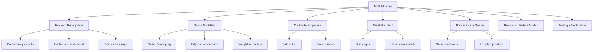
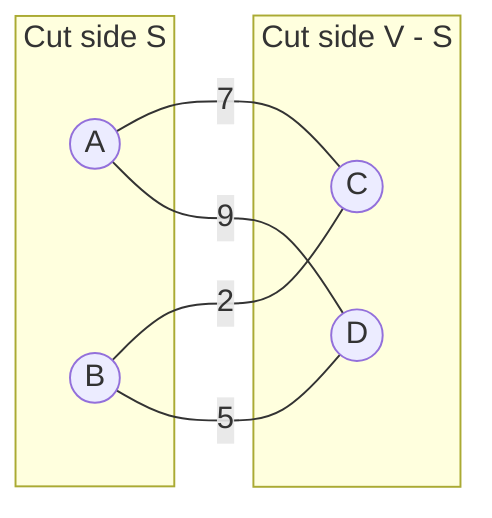
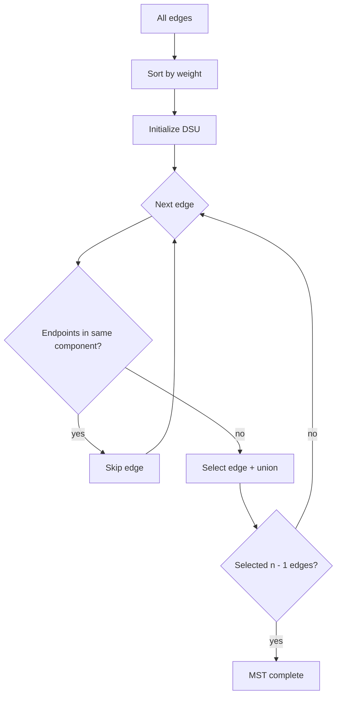
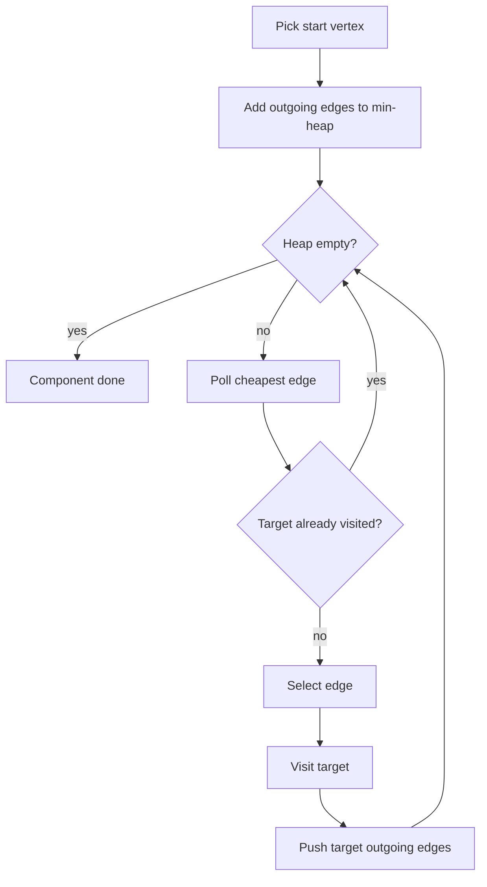
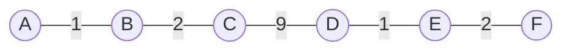

------
title: Learn Java Data Structures and Algorithms - Part 023
description: Minimum Spanning Trees, Kruskal, Prim, cut/cycle property, network design modelling, clustering interpretation, and DSU integration in Java.
series: learn-java-dsa
seriesTitle: Learn Java Data Structures and Algorithms
order: 23
partTitle: Minimum Spanning Trees and Network Design
tags:
- java
- data-structures
- algorithms
- graph
- mst
- kruskal
- prim
- dsu
- series
date: 2026-06-27
---

# Part 023 — Minimum Spanning Trees and Network Design

Minimum Spanning Tree atau **MST** adalah jawaban untuk pertanyaan:

> Dari banyak koneksi yang mungkin, koneksi mana yang cukup untuk menghubungkan semua node dengan total biaya minimum, tanpa membuat siklus yang tidak perlu?

Ini bukan shortest path. MST tidak menjawab "jalur termurah dari A ke B". MST menjawab "rangkaian koneksi minimum agar seluruh sistem tetap terhubung".

Dalam sistem nyata, MST muncul sebagai model untuk:

- network cabling dan topology design,
- clustering dengan hierarchical split,
- memilih link sinkronisasi antar data center,
- membangun backbone komunikasi minimum,
- connecting services/regions dengan cost berbeda,
- dedup/merge graph yang butuh konektivitas murah,
- rollout dependency ketika edge berarti biaya koordinasi.

Namun MST hanya valid kalau problem memang punya sifat **undirected connectivity**. Jika edge punya arah, urutan, capacity, dependency, atau policy constraint, MST sering menjadi model yang salah.

---

## 1. Kaufman Skill Target

Setelah part ini, target kemampuan bukan hanya bisa menulis Kruskal atau Prim, tetapi bisa:

1. mengenali kapan problem adalah MST, shortest path, flow, matching, atau dependency graph;
2. memodelkan graph undirected berbobot dengan benar;
3. menjelaskan MST melalui **cut property** dan **cycle property**;
4. memilih Kruskal, Prim, Boruvka-style reasoning, atau library approach berdasarkan bentuk data;
5. mengimplementasikan MST di Java dengan DSU dan `PriorityQueue` secara aman;
6. menangani disconnected graph sebagai minimum spanning forest;
7. membuat test yang mendeteksi bug modelling, overflow, duplicate edge, dan equal-weight nondeterminism;
8. memakai MST sebagai primitive untuk clustering dan network design.

Kaufman-style decomposition:



The point of this part is to build the mental model first, then use the algorithms as executable forms of that model.

---

## 2. Problem Definition

Given an undirected weighted graph:

```text
G = (V, E)
```

where:

- `V` is the set of vertices,
- `E` is the set of undirected weighted edges,
- each edge `e = (u, v, w)` connects two vertices with cost `w`.

A **spanning tree** is a subset of edges that:

1. connects all vertices,
2. has no cycle,
3. contains exactly `|V| - 1` edges when the graph is connected.

A **minimum spanning tree** is a spanning tree whose total edge weight is minimum among all spanning trees.

If the graph is disconnected, there is no single spanning tree. The correct output is usually a **minimum spanning forest**: one MST per connected component.

---

## 3. MST Is Not Shortest Path

This distinction is critical.

Suppose:

```text
A --1-- B --1-- C
 \             /
  -----3------
```

MST chooses edges:

```text
A-B, B-C    total = 2
```

Shortest path from `A` to `C` is also `A-B-C` with cost `2`, so here they match.

But in this graph:

```text
A --100-- B
|         |
1         1
|         |
C --1---- D
```

MST chooses:

```text
A-C, C-D, D-B    total = 3
```

The path from `A` to `B` inside the MST costs `3`, but the direct edge costs `100`. Still fine. MST optimizes global network cost, not pairwise route cost.

In another graph, the MST path between two nodes may be much worse than the shortest path in the original graph.

The invariant is:

> MST minimizes total infrastructure cost, not query/path latency.

Use shortest path when the business question is "how cheap is the route between two endpoints?" Use MST when the business question is "which links do we keep so everything remains connected cheaply?"

---

## 4. Core Invariants

An MST algorithm must preserve these invariants:

| Invariant | Meaning |
|---|---|
| Acyclic | Selected edges must not create a cycle. |
| Connectivity progress | Each selected edge should reduce component count or connect a new vertex. |
| Safe edge | A selected edge must be provably compatible with at least one MST. |
| Termination | Connected graph must end with `n - 1` selected edges. |
| Minimum total cost | No alternative spanning tree has lower total weight. |

MST algorithms differ in how they find safe edges.

- Kruskal finds the globally lightest edge that connects two different components.
- Prim grows one component by taking the cheapest edge crossing from selected to unselected vertices.

Both are greedy. The reason they work is not "because greedy often works". They work because of the cut property.

---

## 5. Cut Property

A **cut** partitions vertices into two groups:

```text
S and V - S
```

An edge crosses the cut if one endpoint is in `S` and the other endpoint is outside `S`.

**Cut property:**

> For any cut, the minimum-weight edge crossing that cut is safe to include in some MST.

If there are ties, any one of the minimum crossing edges is safe, though different choices may produce different valid MSTs.

Diagram:



The edge `B-C` with weight `2` is the lightest edge crossing the cut, so it is safe.

### Why the cut property is true

Take any MST `T`.

If `T` already contains the lightest crossing edge `e`, fine.

If not:

1. Add `e` to `T`.
2. A cycle appears.
3. That cycle must contain another edge `f` crossing the same cut.
4. Because `e` is the lightest crossing edge, `w(e) <= w(f)`.
5. Remove `f`.
6. The graph remains connected and acyclic.
7. Total weight does not increase.

So there exists an MST containing `e`.

This is the proof behind Kruskal and Prim.

---

## 6. Cycle Property

**Cycle property:**

> In any cycle, an edge with maximum weight can be excluded from some MST.

If an edge is strictly heavier than every other edge in the cycle, it cannot belong to any MST.

Why?

If a spanning tree contains the heaviest cycle edge, removing it splits the tree into two components. Another edge in the same cycle can reconnect those components with lower or equal cost.

This property gives the negative version of MST reasoning:

- cut property says which edge is safe to add;
- cycle property says which edge is safe to reject.

Kruskal implicitly applies the cycle property when it skips an edge whose endpoints are already connected.

---

## 7. Kruskal's Algorithm

Kruskal sorts all edges by weight and scans from cheapest to most expensive.

For each edge `(u, v, w)`:

- if `u` and `v` are already in the same component, skip it;
- otherwise, select it and union the two components.

The selected edges form an MST when the graph is connected.



### Kruskal Invariant

At every step:

> The selected edges form a forest that can be extended into an MST.

DSU makes the acyclic check efficient.

### Complexity

Let:

- `V = number of vertices`,
- `E = number of edges`.

Kruskal complexity:

```text
sort edges: O(E log E)
DSU operations: almost O(E)
total: O(E log E)
```

The DSU cost is effectively near-constant with path compression and union by size/rank.

Kruskal is strong when:

- the edge list is already available;
- the graph is sparse;
- you need a minimum spanning forest;
- you want simple correctness and deterministic processing;
- the graph is not naturally represented as adjacency lists.

---

## 8. Java Implementation: Kruskal

Use primitive IDs when possible. For domain objects, map them to dense integer IDs first.

```java
import java.util.*;

public final class KruskalMst {

    public record Edge(int u, int v, long weight) {
        public Edge {
            if (u < 0 || v < 0) {
                throw new IllegalArgumentException("vertex id must be non-negative");
            }
        }
    }

    public record Result(long totalWeight, List<Edge> edges, int components) {
        public boolean isConnected(int vertexCount) {
            return vertexCount == 0 || edges.size() == vertexCount - 1;
        }
    }

    public static Result minimumSpanningForest(int vertexCount, Collection<Edge> inputEdges) {
        if (vertexCount < 0) {
            throw new IllegalArgumentException("vertexCount must be non-negative");
        }

        List<Edge> edges = new ArrayList<>(inputEdges);
        edges.sort(Comparator
                .comparingLong(Edge::weight)
                .thenComparingInt(Edge::u)
                .thenComparingInt(Edge::v));

        Dsu dsu = new Dsu(vertexCount);
        List<Edge> selected = new ArrayList<>(Math.max(0, vertexCount - 1));
        long total = 0L;

        for (Edge edge : edges) {
            validateVertex(edge.u(), vertexCount);
            validateVertex(edge.v(), vertexCount);

            if (edge.u() == edge.v()) {
                continue; // self-loop cannot help a spanning tree
            }

            if (dsu.union(edge.u(), edge.v())) {
                selected.add(edge);
                total = Math.addExact(total, edge.weight());

                if (selected.size() == vertexCount - 1) {
                    break;
                }
            }
        }

        return new Result(total, List.copyOf(selected), dsu.components());
    }

    private static void validateVertex(int vertex, int vertexCount) {
        if (vertex < 0 || vertex >= vertexCount) {
            throw new IllegalArgumentException("vertex out of range: " + vertex);
        }
    }

    private static final class Dsu {
        private final int[] parent;
        private final int[] size;
        private int components;

        Dsu(int n) {
            this.parent = new int[n];
            this.size = new int[n];
            this.components = n;
            for (int i = 0; i < n; i++) {
                parent[i] = i;
                size[i] = 1;
            }
        }

        int find(int x) {
            int root = x;
            while (root != parent[root]) {
                root = parent[root];
            }
            while (x != root) {
                int next = parent[x];
                parent[x] = root;
                x = next;
            }
            return root;
        }

        boolean union(int a, int b) {
            int ra = find(a);
            int rb = find(b);
            if (ra == rb) {
                return false;
            }
            if (size[ra] < size[rb]) {
                int tmp = ra;
                ra = rb;
                rb = tmp;
            }
            parent[rb] = ra;
            size[ra] += size[rb];
            components--;
            return true;
        }

        int components() {
            return components;
        }
    }
}
```

### Why `Math.addExact`?

Because MST weights often represent money, distance, latency, or capacity cost. Silent overflow can turn a high-cost network into an apparently low-cost network.

If overflow is possible, you want an exception during testing rather than a wrong infrastructure plan in production.

### Why not `a.weight - b.weight`?

Never compare numeric weights like this:

```java
(a, b) -> (int) (a.weight() - b.weight())
```

It can overflow and break comparator ordering. Use:

```java
Comparator.comparingLong(Edge::weight)
```

---

## 9. Prim's Algorithm

Prim grows one connected component.

Starting from any vertex:

1. mark it as included;
2. add its outgoing edges to a priority queue;
3. repeatedly take the cheapest edge crossing from included to not-included;
4. include the new vertex;
5. add its outgoing edges.



Prim is strong when:

- the graph is naturally adjacency-list based;
- the graph is dense enough that sorting all edges is unattractive;
- you want to grow from a known region;
- you need online-ish expansion from a seed.

Classic Prim has several variants:

| Variant | Data Structure | Complexity |
|---|---|---|
| Dense graph Prim | adjacency matrix | `O(V^2)` |
| Heap Prim lazy | binary heap with duplicate entries | `O(E log E)` |
| Indexed heap Prim | decrease-key heap | `O(E log V)` |
| Fibonacci heap theory | advanced heap | `O(E + V log V)` |

In Java production code, the lazy binary heap version is often simpler and robust because `PriorityQueue` has no efficient decrease-key operation.

---

## 10. Java Implementation: Prim With Lazy PriorityQueue

```java
import java.util.*;

public final class PrimMst {

    public record Edge(int to, long weight) {}

    public record SelectedEdge(int from, int to, long weight) {}

    public record Result(long totalWeight, List<SelectedEdge> edges, int components) {}

    private record Candidate(int from, int to, long weight) {}

    public static Result minimumSpanningForest(List<List<Edge>> graph) {
        int n = graph.size();
        boolean[] visited = new boolean[n];
        List<SelectedEdge> selected = new ArrayList<>(Math.max(0, n - 1));
        long total = 0L;
        int components = 0;

        PriorityQueue<Candidate> pq = new PriorityQueue<>(Comparator
                .comparingLong(Candidate::weight)
                .thenComparingInt(Candidate::from)
                .thenComparingInt(Candidate::to));

        for (int start = 0; start < n; start++) {
            if (visited[start]) {
                continue;
            }

            components++;
            visited[start] = true;
            pushEdges(start, graph, visited, pq);

            while (!pq.isEmpty()) {
                Candidate candidate = pq.poll();
                if (visited[candidate.to()]) {
                    continue; // lazy stale entry
                }

                visited[candidate.to()] = true;
                selected.add(new SelectedEdge(candidate.from(), candidate.to(), candidate.weight()));
                total = Math.addExact(total, candidate.weight());

                pushEdges(candidate.to(), graph, visited, pq);
            }
        }

        return new Result(total, List.copyOf(selected), components);
    }

    private static void pushEdges(
            int from,
            List<List<Edge>> graph,
            boolean[] visited,
            PriorityQueue<Candidate> pq
    ) {
        for (Edge edge : graph.get(from)) {
            int to = edge.to();
            if (to < 0 || to >= graph.size()) {
                throw new IllegalArgumentException("vertex out of range: " + to);
            }
            if (to == from) {
                continue;
            }
            if (!visited[to]) {
                pq.add(new Candidate(from, to, edge.weight()));
            }
        }
    }
}
```

### Undirected adjacency list construction

For undirected MST, every edge must be added both ways:

```java
static List<List<PrimMst.Edge>> newGraph(int n) {
    List<List<PrimMst.Edge>> graph = new ArrayList<>(n);
    for (int i = 0; i < n; i++) {
        graph.add(new ArrayList<>());
    }
    return graph;
}

static void addUndirected(List<List<PrimMst.Edge>> graph, int u, int v, long w) {
    graph.get(u).add(new PrimMst.Edge(v, w));
    graph.get(v).add(new PrimMst.Edge(u, w));
}
```

A very common bug is to add only one direction and accidentally solve a different problem.

---

## 11. Kruskal vs Prim Decision Matrix

| Situation | Prefer |
|---|---|
| Edge list already available | Kruskal |
| Need minimum spanning forest naturally | Kruskal |
| Need simple implementation | Kruskal |
| Graph represented as adjacency list | Prim |
| Very dense graph with matrix | Dense Prim |
| Need to start from a seed region | Prim |
| Need deterministic edge ordering | Either, with tie-breakers |
| Need dynamic updates | Neither directly; use dynamic MST techniques or recompute |

Practical rule:

> If you already have edges as rows, use Kruskal. If you already have neighbors per node, use Prim.

---

## 12. Minimum Spanning Forest

When graph is disconnected, requiring an MST is invalid.

Example:

```text
Component 1: A --1-- B
Component 2: C --2-- D
```

There is no edge connecting `{A,B}` to `{C,D}`. A single spanning tree cannot exist.

A robust API should make this explicit:

```java
KruskalMst.Result result = KruskalMst.minimumSpanningForest(n, edges);

if (!result.isConnected(n)) {
    // either reject or accept forest depending on domain semantics
}
```

In production, this distinction matters:

- disconnected customer network may indicate missing data;
- disconnected service graph may be valid multi-region isolation;
- disconnected dependency graph may indicate incomplete ingestion;
- disconnected clustering graph may be expected.

Do not silently call a forest an MST.

---

## 13. Negative Weights

MST allows negative weights.

A negative edge is simply a connection with benefit instead of cost. Kruskal and Prim still work because the cut property does not require non-negative weights.

This differs from Dijkstra, which requires non-negative edge weights.

However, negative weights should trigger domain scrutiny:

- Does negative cost mean rebate?
- Is it a modelling artifact?
- Is it a score where higher should be better?
- Should the optimization maximize benefit instead of minimize cost?

If the domain uses similarity scores, you may need maximum spanning tree, not minimum spanning tree.

---

## 14. Maximum Spanning Tree

A **maximum spanning tree** maximizes total weight.

Useful for:

- clustering by strongest similarity links,
- keeping highest-confidence relationships,
- maximizing bandwidth backbone,
- selecting strongest correlation edges.

Kruskal adapts easily:

```java
edges.sort(Comparator
        .comparingLong(KruskalMst.Edge::weight)
        .reversed());
```

Be careful with tie-breakers after reversing. A clear version:

```java
edges.sort(Comparator
        .comparingLong(KruskalMst.Edge::weight).reversed()
        .thenComparingInt(KruskalMst.Edge::u)
        .thenComparingInt(KruskalMst.Edge::v));
```

---

## 15. Clustering Interpretation

MST can be used for clustering.

Process:

1. Build MST from complete or sparse similarity/distance graph.
2. Remove the `k - 1` most expensive edges.
3. The remaining components form `k` clusters.

This works when edge weight represents distance/cost.



If we remove the expensive edge `C-D` with weight `9`, we get two clusters:

```text
{A, B, C}
{D, E, F}
```

This is equivalent to single-linkage hierarchical clustering.

Failure mode:

> Single-linkage clustering can create chain-shaped clusters, where two dense groups are connected by a thin bridge.

So MST clustering is useful but not universally appropriate.

---

## 16. Domain Modelling Checklist

Before applying MST, answer these questions:

| Question | Why it matters |
|---|---|
| Are edges undirected? | MST is an undirected graph concept. |
| Is the goal global connectivity? | If the goal is route cost, use shortest path. |
| Is every vertex required? | If not, the problem may be Steiner tree or prize-collecting tree. |
| Is total edge cost the right objective? | Some systems optimize max latency, capacity, risk, or redundancy. |
| Are cycles forbidden? | Real networks often require redundancy; MST removes redundancy. |
| Are weights static? | Dynamic edge costs may require recomputation or dynamic MST. |
| Are equal weights acceptable? | Equal weights can produce multiple valid MSTs. |
| Is disconnected graph valid? | Decide MST vs forest semantics. |

The most dangerous MST bug is not implementation. It is using MST for the wrong business question.

---

## 17. Testing MST Correctness

### 17.1 Basic connected graph

```java
import org.junit.jupiter.api.Test;
import java.util.List;
import static org.junit.jupiter.api.Assertions.*;

class KruskalMstTest {

    @Test
    void computesMstForConnectedGraph() {
        List<KruskalMst.Edge> edges = List.of(
                new KruskalMst.Edge(0, 1, 10),
                new KruskalMst.Edge(0, 2, 6),
                new KruskalMst.Edge(0, 3, 5),
                new KruskalMst.Edge(1, 3, 15),
                new KruskalMst.Edge(2, 3, 4)
        );

        KruskalMst.Result result = KruskalMst.minimumSpanningForest(4, edges);

        assertEquals(19, result.totalWeight());
        assertEquals(3, result.edges().size());
        assertTrue(result.isConnected(4));
    }
}
```

Expected MST:

```text
2-3 weight 4
0-3 weight 5
0-1 weight 10
Total = 19
```

### 17.2 Disconnected graph

```java
@Test
void returnsForestForDisconnectedGraph() {
    List<KruskalMst.Edge> edges = List.of(
            new KruskalMst.Edge(0, 1, 1),
            new KruskalMst.Edge(2, 3, 2)
    );

    KruskalMst.Result result = KruskalMst.minimumSpanningForest(4, edges);

    assertEquals(3, result.totalWeight());
    assertEquals(2, result.edges().size());
    assertFalse(result.isConnected(4));
}
```

### 17.3 Self-loop ignored

```java
@Test
void ignoresSelfLoops() {
    List<KruskalMst.Edge> edges = List.of(
            new KruskalMst.Edge(0, 0, -100),
            new KruskalMst.Edge(0, 1, 5)
    );

    KruskalMst.Result result = KruskalMst.minimumSpanningForest(2, edges);

    assertEquals(5, result.totalWeight());
    assertEquals(1, result.edges().size());
}
```

The self-loop has a tempting negative cost but cannot connect new vertices.

### 17.4 Equal weights

```java
@Test
void equalWeightsMayHaveMultipleValidMsts() {
    List<KruskalMst.Edge> edges = List.of(
            new KruskalMst.Edge(0, 1, 1),
            new KruskalMst.Edge(1, 2, 1),
            new KruskalMst.Edge(0, 2, 1)
    );

    KruskalMst.Result result = KruskalMst.minimumSpanningForest(3, edges);

    assertEquals(2, result.totalWeight());
    assertEquals(2, result.edges().size());
}
```

Do not overfit tests to one exact edge set unless your algorithm defines deterministic tie-breaking.

---

## 18. Brute Force Verification for Small Graphs

For small graphs, you can verify MST implementation by enumerating all edge subsets of size `n - 1`.

This is exponential and only for tests.

```java
static long bruteForceMstWeight(int n, List<KruskalMst.Edge> edges) {
    int m = edges.size();
    long best = Long.MAX_VALUE;

    for (long mask = 0; mask < (1L << m); mask++) {
        if (Long.bitCount(mask) != n - 1) {
            continue;
        }

        TestDsu dsu = new TestDsu(n);
        long total = 0;
        int count = 0;
        boolean cycle = false;

        for (int i = 0; i < m; i++) {
            if (((mask >>> i) & 1L) == 0) {
                continue;
            }
            KruskalMst.Edge e = edges.get(i);
            if (!dsu.union(e.u(), e.v())) {
                cycle = true;
                break;
            }
            total += e.weight();
            count++;
        }

        if (!cycle && count == n - 1 && dsu.components() == 1) {
            best = Math.min(best, total);
        }
    }

    return best;
}
```

Use this for property-based testing:

1. generate random small graphs;
2. run Kruskal;
3. run brute force;
4. compare total weight.

This catches comparator bugs, DSU bugs, and self-loop bugs.

---

## 19. Production Failure Modes

### 19.1 Directed edge accidentally treated as undirected

MST is not for directed graphs. The directed equivalent is not simply "run MST anyway". For directed arborescence, you need a different problem formulation.

### 19.2 Missing vertices

If vertices are inferred only from edges, isolated vertices disappear.

Bad:

```java
Set<Integer> vertices = edges.stream()
        .flatMap(e -> Stream.of(e.u(), e.v()))
        .collect(Collectors.toSet());
```

This loses vertices with no edges.

In production, pass `vertexCount` or an explicit vertex set.

### 19.3 Duplicate undirected edges

Duplicate edges are usually safe but can affect determinism and memory.

Normalize if needed:

```text
(u, v) where u <= v
```

Then keep the minimum weight per pair if the domain says parallel edges are equivalent.

But do not normalize if parallel edges represent different providers, routes, contracts, or risk profiles.

### 19.4 Comparator overflow

Bad comparator can break sort and produce a non-MST.

Use `Comparator.comparingLong`.

### 19.5 Weight overflow

Use `long`, not `int`, for aggregate cost. Use `Math.addExact` if overflow is unacceptable.

### 19.6 Equal weight nondeterminism

Equal weights produce multiple MSTs. Add tie-breakers if output must be stable.

### 19.7 Too much object allocation

For huge graphs, `record Edge(...)` objects may create memory pressure. Consider struct-like arrays:

```java
int[] from;
int[] to;
long[] weight;
```

Sorting parallel arrays is more cumbersome in Java, but may be necessary for massive workloads.

### 19.8 Redundancy removed

MST intentionally removes cycles. Real infrastructure often wants redundancy. A minimum-cost connected network may be operationally fragile.

If redundancy matters, consider:

- k-edge-connected subgraph,
- minimum-cost flow,
- survivable network design,
- constrained optimization,
- adding backup edges after MST.

---

## 20. Engineering Use Case: Network Backbone Selection

Suppose every edge represents possible connection between services or regions:

```java
record Link(String left, String right, long monthlyCost) {}
```

You should not run MST directly on strings. Build a stable ID mapping.

```java
final class IdMap {
    private final Map<String, Integer> ids = new HashMap<>();

    int id(String key) {
        return ids.computeIfAbsent(key, ignored -> ids.size());
    }

    int size() {
        return ids.size();
    }
}
```

Convert domain links:

```java
static KruskalMst.Result designBackbone(List<Link> links) {
    IdMap idMap = new IdMap();
    List<KruskalMst.Edge> edges = new ArrayList<>();

    for (Link link : links) {
        int u = idMap.id(link.left());
        int v = idMap.id(link.right());
        edges.add(new KruskalMst.Edge(u, v, link.monthlyCost()));
    }

    return KruskalMst.minimumSpanningForest(idMap.size(), edges);
}
```

The deeper issue: if a region appears in inventory but has zero candidate links, it will not appear in `idMap`. For real network design, build IDs from explicit node inventory first, then add edges.

---

## 21. MST Review Checklist

Before approving an MST solution, check:

- [ ] Does the problem require global connectivity, not pairwise shortest path?
- [ ] Are edges truly undirected?
- [ ] Are all vertices known, including isolated ones?
- [ ] Does the API distinguish MST from forest?
- [ ] Are weights represented with `long`?
- [ ] Are comparators overflow-safe?
- [ ] Are self-loops ignored?
- [ ] Are duplicate/parallel edges handled according to domain semantics?
- [ ] Are equal-weight outputs deterministic if required?
- [ ] Is redundancy intentionally removed?
- [ ] Are tests checking disconnected graph, negative edge, self-loop, duplicate, and equal weights?

---

## 22. Practice Loop

### Drill 1 — Recognize MST vs non-MST

For each statement, classify the problem:

1. Connect all offices with minimum cable cost.
2. Find cheapest delivery route from warehouse to customer.
3. Choose dependencies that allow all services to deploy in valid order.
4. Connect all cities, but require two independent backup paths.
5. Group users by strongest similarity links.

Expected:

1. MST.
2. Shortest path.
3. Topological sort / dependency graph.
4. Survivable network design, not MST.
5. Maximum spanning tree or clustering, depending on objective.

### Drill 2 — Implement both algorithms

Implement:

- Kruskal using DSU;
- Prim using lazy `PriorityQueue`;
- compare output total weights on random connected graphs.

### Drill 3 — Write counterexample tests

Create graphs where:

- graph is disconnected;
- edge weights are negative;
- all edges have equal weight;
- self-loop has very low weight;
- duplicate edges have different weights;
- total weight overflows `int`.

### Drill 4 — Explain cut property out loud

Use this sentence structure:

> For this cut, the lightest crossing edge is safe because if an MST does not contain it, adding it creates a cycle, and removing another crossing edge from that cycle keeps connectivity without increasing total cost.

If you can explain that without reading, you understand MST beyond templates.

---

## 23. Summary

MST is a global connectivity optimization problem.

The core mental model:

> Keep adding safe cheap edges until every vertex is connected, while never paying for a cycle.

Kruskal and Prim are two ways to operationalize the same greedy correctness principle:

- Kruskal sorts edges and merges components with DSU.
- Prim grows a connected frontier with a priority queue.

For engineering usage, MST is powerful but narrow. It is correct when the domain objective is minimum-cost undirected connectivity. It is wrong when the domain requires routing optimality, directionality, redundancy, capacity, or dependency ordering.

In the next part, we move from undirected connectivity to directed dependency systems: DAGs, topological sort, cycle diagnosis, and workflow scheduling.
