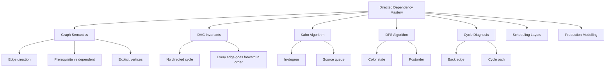
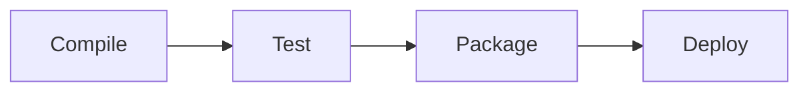
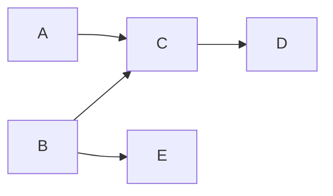
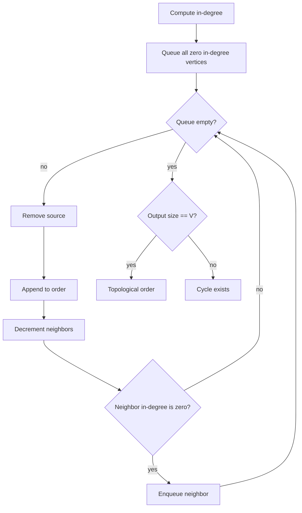
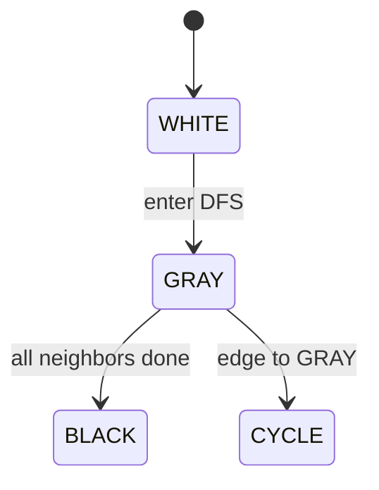
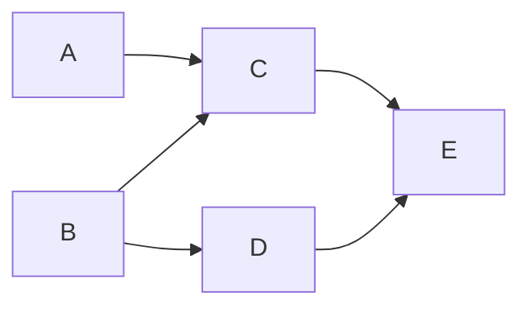
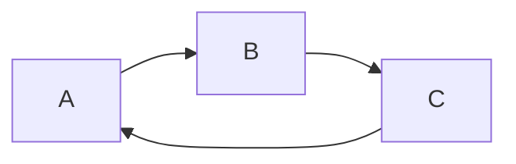
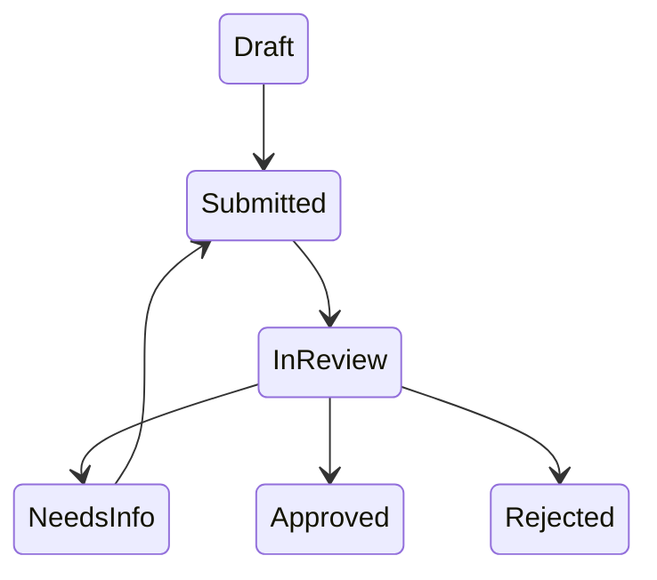
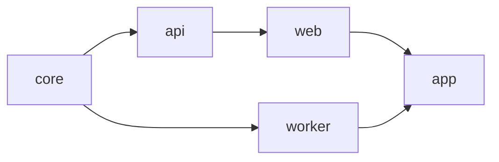
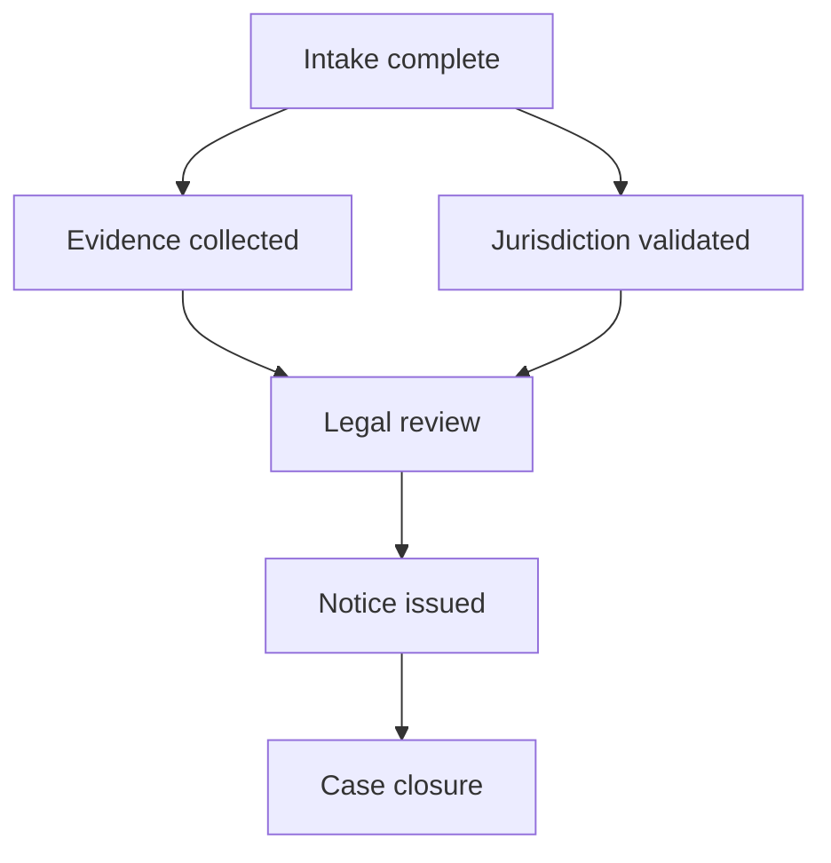

------
title: Learn Java Data Structures and Algorithms - Part 024
description: Directed graphs, DAGs, topological ordering, Kahn's algorithm, DFS order, dependency resolution, cycle diagnosis, workflow scheduling, and deadlock modelling in Java.
series: learn-java-dsa
seriesTitle: Learn Java Data Structures and Algorithms
order: 24
partTitle: Directed Graphs, Toposort, and Dependency Systems
tags:
- java
- data-structures
- algorithms
- graph
- directed-graph
- dag
- topological-sort
- dependency-system
- series
date: 2026-06-27
---

# Part 024 — Directed Graphs, Toposort, and Dependency Systems

Directed graph algorithms are the foundation for dependency systems.

If MST asks:

> Which undirected edges connect everything cheaply?

Topological sort asks:

> In what order can we process directed dependencies without violating prerequisites?

This part is about **DAG thinking**: modelling directed relationships, detecting invalid cycles, producing valid execution order, and explaining failures in terms users can act on.

Topological sort appears in:

- build systems,
- package managers,
- database migration ordering,
- workflow engines,
- case-management state transitions,
- enforcement lifecycle orchestration,
- task schedulers,
- compiler passes,
- spreadsheet recalculation,
- service startup sequencing,
- access-policy derivation,
- deadlock detection via wait-for graphs.

A topological ordering is not just an algorithmic trick. It is the execution plan of a dependency system.

---

## 1. Kaufman Skill Target

After this part, you should be able to:

1. distinguish directed graph modelling from undirected graph modelling;
2. define DAG, cycle, in-degree, out-degree, source, sink, and topological order;
3. decide edge direction consistently for dependency systems;
4. implement Kahn's algorithm in Java;
5. implement DFS-based topological sort and cycle detection;
6. return useful cycle diagnostics, not just `false`;
7. produce layers for parallel scheduling;
8. model build/workflow/deadlock systems as directed graphs;
9. reason about deterministic ordering, duplicate edges, and invalid self-dependencies;
10. design tests that catch dependency-direction bugs.

Kaufman decomposition:



---

## 2. Directed Graph Basics

A directed graph is:

```text
G = (V, E)
```

where each edge has direction:

```text
u -> v
```

This means `u` points to `v`. The meaning depends on the domain.

Common interpretations:

| Edge | Interpretation |
|---|---|
| `A -> B` | A must happen before B. |
| `A -> B` | A depends on B. |
| `A -> B` | A calls B. |
| `A -> B` | A waits for B. |
| `A -> B` | A transitions to B. |

These are not equivalent. The algorithm sees only direction; humans assign semantics.

The first modelling decision is therefore:

> What exactly does an edge mean?

---

## 3. Dependency Direction: The Most Common Bug

For topological sort, prefer this convention:

```text
prerequisite -> dependent
```

Meaning:

```text
A -> B
```

means:

> A must be completed before B can run.

Then a topological order naturally reads as execution order.

Example:



Valid order:

```text
Compile, Test, Package, Deploy
```

If your domain data says "Deploy depends on Package", convert it into:

```text
Package -> Deploy
```

Do not mix both conventions in the same graph.

---

## 4. DAG and Topological Order

A **DAG** is a Directed Acyclic Graph.

A **topological order** is an ordering of vertices such that for every directed edge:

```text
u -> v
```

`u` appears before `v`.

If a graph has a directed cycle, no topological order exists.

Example DAG:



Valid topological orders include:

```text
A, B, C, E, D
B, A, E, C, D
B, A, C, D, E
```

Topological order is usually **not unique**.

This matters in production. If output ordering must be stable, you need deterministic tie-breaking.

---

## 5. In-Degree and Source Vertices

For a vertex `v`:

- **in-degree** = number of incoming edges;
- **out-degree** = number of outgoing edges.

A vertex with in-degree `0` has no prerequisites under the convention:

```text
prerequisite -> dependent
```

So it can run immediately.

Kahn's algorithm repeatedly removes in-degree-zero vertices.

Core invariant:

> At any point, vertices with in-degree zero have no remaining unsatisfied prerequisites.

---

## 6. Kahn's Algorithm

Steps:

1. Compute in-degree for every vertex.
2. Add all vertices with in-degree `0` to a queue.
3. Repeatedly remove a source vertex.
4. Append it to output order.
5. For each outgoing neighbor, decrement in-degree.
6. If a neighbor's in-degree becomes `0`, add it to the queue.
7. If output size is less than vertex count, the graph has a cycle.



Complexity:

```text
O(V + E)
```

---

## 7. Java Implementation: Integer Vertex Kahn Toposort

This version assumes vertices are dense IDs: `0..n-1`.

```java
import java.util.*;

public final class TopologicalSort {

    public record Result(List<Integer> order, boolean hasCycle, List<Integer> remaining) {}

    public static Result kahn(int vertexCount, List<List<Integer>> graph) {
        if (vertexCount < 0) {
            throw new IllegalArgumentException("vertexCount must be non-negative");
        }
        if (graph.size() != vertexCount) {
            throw new IllegalArgumentException("graph size must equal vertexCount");
        }

        int[] indegree = new int[vertexCount];

        for (int u = 0; u < vertexCount; u++) {
            for (int v : graph.get(u)) {
                validateVertex(v, vertexCount);
                indegree[v] = Math.addExact(indegree[v], 1);
            }
        }

        ArrayDeque<Integer> ready = new ArrayDeque<>();
        for (int v = 0; v < vertexCount; v++) {
            if (indegree[v] == 0) {
                ready.addLast(v);
            }
        }

        List<Integer> order = new ArrayList<>(vertexCount);

        while (!ready.isEmpty()) {
            int u = ready.removeFirst();
            order.add(u);

            for (int v : graph.get(u)) {
                indegree[v]--;
                if (indegree[v] == 0) {
                    ready.addLast(v);
                }
            }
        }

        if (order.size() == vertexCount) {
            return new Result(List.copyOf(order), false, List.of());
        }

        List<Integer> remaining = new ArrayList<>();
        for (int v = 0; v < vertexCount; v++) {
            if (indegree[v] > 0) {
                remaining.add(v);
            }
        }

        return new Result(List.copyOf(order), true, List.copyOf(remaining));
    }

    private static void validateVertex(int v, int vertexCount) {
        if (v < 0 || v >= vertexCount) {
            throw new IllegalArgumentException("vertex out of range: " + v);
        }
    }
}
```

### Why `ArrayDeque`?

For queue semantics, `ArrayDeque` is a good default in single-threaded algorithmic code. It avoids the legacy semantics of `Stack` and the node allocation overhead of `LinkedList`.

### What does `remaining` mean?

If Kahn cannot process all vertices, the remaining vertices still have unresolved incoming edges. They are part of or downstream of cycles. This is enough to say the graph is cyclic, but not enough to produce a clean cycle path.

For actionable diagnostics, use DFS cycle extraction.

---

## 8. Deterministic Topological Sort

`ArrayDeque` preserves insertion order. If vertices are scanned from `0..n-1`, the output is deterministic for dense integer IDs.

For domain IDs like strings, `HashMap` iteration order should not be used as a stable contract.

Use:

- sorted IDs,
- `TreeMap`,
- `PriorityQueue`, or
- explicit insertion order with `LinkedHashMap`.

If you want lexicographically smallest topological order:

```java
PriorityQueue<Integer> ready = new PriorityQueue<>();
```

Then Kahn always picks the smallest currently available vertex.

Trade-off:

```text
ArrayDeque Kahn: O(V + E)
PriorityQueue Kahn: O((V + E) log V) in practice due to queue operations
```

---

## 9. Generic Dependency Resolver

Real systems rarely use dense integer IDs directly. They use names:

```text
"compile"
"test"
"package"
"deploy"
```

A production resolver should:

1. accept explicit nodes;
2. accept dependency edges;
3. normalize edge direction;
4. reject self-dependencies;
5. deduplicate duplicate edges;
6. produce stable output.

### API model

```java
public record Dependency<T>(T prerequisite, T dependent) {}
```

This uses the convention:

```text
prerequisite -> dependent
```

### Implementation

```java
import java.util.*;

public final class DependencyResolver<T> {

    public record Dependency<T>(T prerequisite, T dependent) {}

    public record Resolution<T>(
            List<T> order,
            boolean hasCycle,
            List<T> unresolved
    ) {}

    private final Comparator<? super T> comparator;

    public DependencyResolver(Comparator<? super T> comparator) {
        this.comparator = Objects.requireNonNull(comparator);
    }

    public Resolution<T> resolve(Collection<T> nodes, Collection<Dependency<T>> dependencies) {
        Objects.requireNonNull(nodes, "nodes");
        Objects.requireNonNull(dependencies, "dependencies");

        Map<T, Set<T>> graph = new TreeMap<>(comparator);
        Map<T, Integer> indegree = new TreeMap<>(comparator);

        for (T node : nodes) {
            requireNode(node);
            graph.putIfAbsent(node, new TreeSet<>(comparator));
            indegree.putIfAbsent(node, 0);
        }

        for (Dependency<T> dependency : dependencies) {
            T prerequisite = requireNode(dependency.prerequisite());
            T dependent = requireNode(dependency.dependent());

            if (comparator.compare(prerequisite, dependent) == 0) {
                throw new IllegalArgumentException("self dependency: " + prerequisite);
            }

            graph.putIfAbsent(prerequisite, new TreeSet<>(comparator));
            graph.putIfAbsent(dependent, new TreeSet<>(comparator));
            indegree.putIfAbsent(prerequisite, 0);
            indegree.putIfAbsent(dependent, 0);

            boolean added = graph.get(prerequisite).add(dependent);
            if (added) {
                indegree.compute(dependent, (ignored, value) -> Math.addExact(value, 1));
            }
        }

        PriorityQueue<T> ready = new PriorityQueue<>(comparator);
        for (Map.Entry<T, Integer> entry : indegree.entrySet()) {
            if (entry.getValue() == 0) {
                ready.add(entry.getKey());
            }
        }

        List<T> order = new ArrayList<>(indegree.size());

        while (!ready.isEmpty()) {
            T current = ready.remove();
            order.add(current);

            for (T next : graph.getOrDefault(current, Set.of())) {
                int updated = indegree.compute(next, (ignored, value) -> value - 1);
                if (updated == 0) {
                    ready.add(next);
                }
            }
        }

        if (order.size() == indegree.size()) {
            return new Resolution<>(List.copyOf(order), false, List.of());
        }

        List<T> unresolved = new ArrayList<>();
        for (Map.Entry<T, Integer> entry : indegree.entrySet()) {
            if (entry.getValue() > 0) {
                unresolved.add(entry.getKey());
            }
        }

        return new Resolution<>(List.copyOf(order), true, List.copyOf(unresolved));
    }

    private T requireNode(T node) {
        return Objects.requireNonNull(node, "node");
    }
}
```

Example:

```java
DependencyResolver<String> resolver = new DependencyResolver<>(Comparator.naturalOrder());

var result = resolver.resolve(
        List.of("compile", "test", "package", "deploy"),
        List.of(
                new DependencyResolver.Dependency<>("compile", "test"),
                new DependencyResolver.Dependency<>("test", "package"),
                new DependencyResolver.Dependency<>("package", "deploy")
        )
);

System.out.println(result.order());
```

Output:

```text
[compile, test, package, deploy]
```

---

## 10. DFS-Based Topological Sort

DFS topological sort uses postorder.

When visiting a node:

1. recursively visit all outgoing neighbors;
2. add the node to output after neighbors are done;
3. reverse the result.

This works only if the graph is acyclic.

DFS also gives clean cycle detection using colors:

| State | Meaning |
|---|---|
| WHITE | unvisited |
| GRAY | currently in recursion stack |
| BLACK | fully processed |

A back edge to a GRAY node means a cycle.



---

## 11. Java Implementation: DFS Cycle Extraction

Kahn tells you a cycle exists. DFS can return a concrete cycle path.

```java
import java.util.*;

public final class DirectedCycleFinder {

    private enum Color { WHITE, GRAY, BLACK }

    public static Optional<List<Integer>> findCycle(List<List<Integer>> graph) {
        int n = graph.size();
        Color[] color = new Color[n];
        Arrays.fill(color, Color.WHITE);

        int[] parent = new int[n];
        Arrays.fill(parent, -1);

        for (int start = 0; start < n; start++) {
            if (color[start] == Color.WHITE) {
                Optional<List<Integer>> cycle = dfs(start, graph, color, parent);
                if (cycle.isPresent()) {
                    return cycle;
                }
            }
        }

        return Optional.empty();
    }

    private static Optional<List<Integer>> dfs(
            int u,
            List<List<Integer>> graph,
            Color[] color,
            int[] parent
    ) {
        color[u] = Color.GRAY;

        for (int v : graph.get(u)) {
            validateVertex(v, graph.size());

            if (color[v] == Color.WHITE) {
                parent[v] = u;
                Optional<List<Integer>> cycle = dfs(v, graph, color, parent);
                if (cycle.isPresent()) {
                    return cycle;
                }
            } else if (color[v] == Color.GRAY) {
                return Optional.of(reconstructCycle(u, v, parent));
            }
        }

        color[u] = Color.BLACK;
        return Optional.empty();
    }

    private static List<Integer> reconstructCycle(int from, int to, int[] parent) {
        ArrayList<Integer> cycle = new ArrayList<>();
        cycle.add(to);

        int current = from;
        while (current != to && current != -1) {
            cycle.add(current);
            current = parent[current];
        }

        cycle.add(to);
        Collections.reverse(cycle);
        return List.copyOf(cycle);
    }

    private static void validateVertex(int v, int n) {
        if (v < 0 || v >= n) {
            throw new IllegalArgumentException("vertex out of range: " + v);
        }
    }
}
```

Example cycle:

```text
A -> B -> C -> A
```

A user-facing diagnostic should not say:

```text
Graph contains a cycle.
```

It should say:

```text
Cannot resolve dependencies because A requires B, B requires C, and C requires A.
```

The second form is actionable.

---

## 12. DFS Topological Order Implementation

```java
import java.util.*;

public final class DfsTopologicalSort {

    private enum Color { WHITE, GRAY, BLACK }

    public static List<Integer> sortOrThrow(List<List<Integer>> graph) {
        int n = graph.size();
        Color[] color = new Color[n];
        Arrays.fill(color, Color.WHITE);
        ArrayList<Integer> postorder = new ArrayList<>(n);

        for (int v = 0; v < n; v++) {
            if (color[v] == Color.WHITE) {
                dfs(v, graph, color, postorder);
            }
        }

        Collections.reverse(postorder);
        return List.copyOf(postorder);
    }

    private static void dfs(
            int u,
            List<List<Integer>> graph,
            Color[] color,
            ArrayList<Integer> postorder
    ) {
        color[u] = Color.GRAY;

        for (int v : graph.get(u)) {
            if (v < 0 || v >= graph.size()) {
                throw new IllegalArgumentException("vertex out of range: " + v);
            }
            if (color[v] == Color.GRAY) {
                throw new IllegalStateException("graph contains a cycle");
            }
            if (color[v] == Color.WHITE) {
                dfs(v, graph, color, postorder);
            }
        }

        color[u] = Color.BLACK;
        postorder.add(u);
    }
}
```

DFS version is compact, but recursive DFS can overflow the Java stack on very deep graphs.

For large production graphs, prefer iterative DFS or Kahn.

---

## 13. Kahn vs DFS Decision Matrix

| Need | Prefer |
|---|---|
| Execution order with ready queue | Kahn |
| Parallel scheduling layers | Kahn |
| Detect cycle exists | Either |
| Produce concrete cycle path | DFS color method |
| Avoid recursion depth risk | Kahn |
| Simpler postorder reasoning | DFS |
| Lexicographically smallest valid order | Kahn with `PriorityQueue` |
| Incremental "ready tasks" workflow | Kahn |

Practical rule:

> Use Kahn for schedulers and dependency execution. Use DFS cycle detection for diagnostics.

---

## 14. Parallel Scheduling Layers

A topological order is sequential. Many dependency systems can run independent tasks in parallel.

Kahn can produce layers:

- Layer 0: tasks with no prerequisites.
- Layer 1: tasks unlocked by layer 0.
- Layer 2: tasks unlocked by layer 1.

Example:



Layers:

```text
Layer 0: A, B
Layer 1: C, D
Layer 2: E
```

Implementation:

```java
public static List<List<Integer>> layers(int vertexCount, List<List<Integer>> graph) {
    int[] indegree = new int[vertexCount];
    for (int u = 0; u < vertexCount; u++) {
        for (int v : graph.get(u)) {
            indegree[v]++;
        }
    }

    ArrayDeque<Integer> ready = new ArrayDeque<>();
    for (int v = 0; v < vertexCount; v++) {
        if (indegree[v] == 0) {
            ready.addLast(v);
        }
    }

    List<List<Integer>> layers = new ArrayList<>();
    int processed = 0;

    while (!ready.isEmpty()) {
        int size = ready.size();
        List<Integer> layer = new ArrayList<>(size);

        for (int i = 0; i < size; i++) {
            int u = ready.removeFirst();
            layer.add(u);
            processed++;

            for (int v : graph.get(u)) {
                indegree[v]--;
                if (indegree[v] == 0) {
                    ready.addLast(v);
                }
            }
        }

        layers.add(List.copyOf(layer));
    }

    if (processed != vertexCount) {
        throw new IllegalStateException("graph contains a cycle");
    }

    return List.copyOf(layers);
}
```

Layering is useful for:

- parallel builds,
- workflow batches,
- migration waves,
- approval-stage unlocking,
- phased enforcement actions,
- distributed task dispatch.

Important caveat:

> Layering based only on dependency depth ignores task duration, resource contention, priority, and fairness.

For full scheduling, topological layers are only the precedence constraint. You still need a scheduler.

---

## 15. Critical Path in a DAG

If each task has duration, the critical path is the longest path in the DAG.

For each node:

```text
earliestFinish[v] = duration[v] + max(earliestFinish[p] for every prerequisite p)
```

Using topological order:

```java
static long[] earliestFinish(List<List<Integer>> graph, long[] duration) {
    int n = graph.size();
    TopologicalSort.Result result = TopologicalSort.kahn(n, graph);
    if (result.hasCycle()) {
        throw new IllegalStateException("graph contains a cycle");
    }

    long[] finish = new long[n];
    for (int u : result.order()) {
        finish[u] = Math.max(finish[u], duration[u]);
        for (int v : graph.get(u)) {
            finish[v] = Math.max(finish[v], Math.addExact(finish[u], duration[v]));
        }
    }
    return finish;
}
```

This extends topological sort from ordering into planning.

Use cases:

- minimum build completion time,
- workflow SLA estimation,
- release train planning,
- migration critical-path analysis.

---

## 16. Deadlock Modelling with Wait-For Graphs

A deadlock can be modelled as a directed cycle in a wait-for graph.

```text
Task A waits for lock held by Task B
Task B waits for lock held by Task C
Task C waits for lock held by Task A
```

Graph:



Cycle means deadlock risk or actual deadlock depending on timing.

The same DFS cycle finder can diagnose:

```text
A -> B -> C -> A
```

But be careful:

- wait-for graphs are dynamic;
- edges change as locks are acquired/released;
- stale edges can create false positives;
- missing edges can hide deadlocks;
- distributed systems require consistent snapshots or conservative detection.

The algorithm is simple. The observation model is hard.

---

## 17. Workflow State Machines vs DAGs

Not every directed graph should be a DAG.

A state machine often intentionally has cycles:



`NeedsInfo -> Submitted` forms a cycle with review states, but that is valid lifecycle behaviour.

Topological sort is wrong for cyclic state machines.

Use topological sort when edges mean:

```text
must happen before, exactly once, in dependency order
```

Do not use it when edges mean:

```text
may transition over time
```

For regulatory/enforcement workflows, the distinction is important:

- dependency graph: prerequisite tasks before case closure;
- state machine: allowed lifecycle transitions;
- escalation graph: conditional routes, may contain loops;
- audit graph: causal history, usually acyclic if append-only.

Model the right graph.

---

## 18. Duplicate Edges and In-Degree Bugs

Duplicate dependency edges can break Kahn if you deduplicate adjacency but not in-degree, or increment in-degree but only decrement once.

Bad situation:

```text
A -> B
A -> B
```

If adjacency has one edge but in-degree is `2`, B never becomes ready.

Choose one of these policies:

### Policy 1: Preserve duplicates

Then increment and decrement per occurrence.

### Policy 2: Deduplicate edges

Then only increment in-degree when a new edge is added.

Production dependency systems usually want Policy 2.

---

## 19. Self-Dependency

A self-edge is an immediate cycle:

```text
A -> A
```

Reject it early with a clear error:

```text
Task A cannot depend on itself.
```

Do not let it flow into a generic cycle message if the user can fix it directly.

---

## 20. Testing Topological Sort

### 20.1 Valid ordering property

Do not test only exact order unless order is deterministic by contract.

Test the property:

```java
static void assertTopologicalOrder(
        int n,
        List<List<Integer>> graph,
        List<Integer> order
) {
    assertEquals(n, order.size());

    int[] position = new int[n];
    Arrays.fill(position, -1);

    for (int i = 0; i < order.size(); i++) {
        int v = order.get(i);
        assertTrue(v >= 0 && v < n);
        assertEquals(-1, position[v], "duplicate vertex in order");
        position[v] = i;
    }

    for (int u = 0; u < n; u++) {
        for (int v : graph.get(u)) {
            assertTrue(position[u] < position[v], u + " must appear before " + v);
        }
    }
}
```

### 20.2 Simple DAG test

```java
@Test
void sortsDag() {
    List<List<Integer>> graph = List.of(
            List.of(2),    // 0 -> 2
            List.of(2),    // 1 -> 2
            List.of(3),    // 2 -> 3
            List.of()
    );

    TopologicalSort.Result result = TopologicalSort.kahn(4, graph);

    assertFalse(result.hasCycle());
    assertTopologicalOrder(4, graph, result.order());
}
```

### 20.3 Cycle test

```java
@Test
void detectsCycle() {
    List<List<Integer>> graph = List.of(
            List.of(1),
            List.of(2),
            List.of(0)
    );

    TopologicalSort.Result result = TopologicalSort.kahn(3, graph);

    assertTrue(result.hasCycle());
    assertFalse(result.remaining().isEmpty());
}
```

### 20.4 Isolated vertex test

```java
@Test
void includesIsolatedVertices() {
    List<List<Integer>> graph = List.of(
            List.of(1),
            List.of(),
            List.of()
    );

    TopologicalSort.Result result = TopologicalSort.kahn(3, graph);

    assertFalse(result.hasCycle());
    assertEquals(Set.of(0, 1, 2), new HashSet<>(result.order()));
}
```

If isolated vertices disappear, your graph construction is wrong.

### 20.5 Duplicate edge test

```java
@Test
void duplicateEdgesDoNotBreakResolverWhenDeduplicated() {
    DependencyResolver<String> resolver = new DependencyResolver<>(Comparator.naturalOrder());

    var result = resolver.resolve(
            List.of("A", "B"),
            List.of(
                    new DependencyResolver.Dependency<>("A", "B"),
                    new DependencyResolver.Dependency<>("A", "B")
            )
    );

    assertFalse(result.hasCycle());
    assertEquals(List.of("A", "B"), result.order());
}
```

---

## 21. Production Design: Build Graph Example

Suppose modules have dependencies:

```text
api depends on core
web depends on api
worker depends on core
app depends on web and worker
```

Convert dependency statements into prerequisite edges:

```text
core -> api
api -> web
core -> worker
web -> app
worker -> app
```

Graph:



Valid build order:

```text
core, api, worker, web, app
```

Another valid order:

```text
core, worker, api, web, app
```

If the build system requires stable output, define tie-breaking.

---

## 22. Production Design: Migration Ordering

Database migrations often have dependencies:

```text
create_table_users -> add_user_index
create_table_orders -> add_order_fk_to_users
create_table_users -> add_order_fk_to_users
```

Topological sort can produce a valid migration order.

But migration systems have additional constraints:

- transaction boundary;
- rollback safety;
- online vs offline migration;
- lock duration;
- tenant partition;
- feature flag coordination;
- data backfill dependency;
- idempotency.

Toposort handles prerequisite order only. It does not guarantee operational safety.

---

## 23. Production Design: Case Workflow Dependency Graph

In complex case management, some actions are lifecycle states, while others are prerequisite tasks.

Example prerequisite graph:



Topological sort is appropriate if the question is:

> What tasks must be completed before closure, and in what dependency-safe order?

It is not appropriate if the question is:

> What state transitions may happen over the lifetime of a case?

That second question is state-machine modelling, not DAG execution.

---

## 24. Algorithmic Failure Modes

### 24.1 Edge direction reversed

Symptom:

```text
deploy, package, test, compile
```

This usually means your graph uses `dependent -> prerequisite` while the algorithm expects `prerequisite -> dependent`.

### 24.2 Missing explicit nodes

If nodes are inferred only from edges, independent tasks disappear.

Always accept explicit nodes.

### 24.3 Duplicate edges corrupt in-degree

Deduplicate before incrementing in-degree or preserve duplicates consistently.

### 24.4 Unstable order

If you use `HashMap`, output order can vary. Use stable ordering where reproducibility matters.

### 24.5 Recursion overflow

Recursive DFS can fail on very deep graphs. Kahn avoids this.

### 24.6 Cycle message is not actionable

`hasCycle = true` is useful for code. Users need a cycle path.

### 24.7 Treating cyclic workflow as invalid

State machines can have valid cycles. DAG validation should apply only to dependency graphs.

---

## 25. Complexity Budget

For `V` vertices and `E` edges:

| Operation | Complexity |
|---|---|
| Build adjacency | `O(V + E)` |
| Compute in-degree | `O(V + E)` |
| Kahn with queue | `O(V + E)` |
| Kahn with priority queue | `O((V + E) log V)` practical upper bound |
| DFS sort | `O(V + E)` |
| DFS cycle detection | `O(V + E)` |
| Memory | `O(V + E)` |

Constant-factor notes in Java:

- `List<List<Integer>>` boxes ints if using `Integer`; for huge graphs, primitive adjacency arrays are more memory-efficient.
- `HashMap<T, Set<T>>` is ergonomic but allocation-heavy.
- `TreeMap`/`TreeSet` gives stable order but adds `log n` overhead.
- `PriorityQueue` gives deterministic smallest-ready selection if comparator is stable.
- `ArrayDeque` is efficient for normal ready-queue processing.

---

## 26. Review Checklist

Before approving a topological sort solution:

- [ ] Is edge direction explicitly documented?
- [ ] Are all nodes provided explicitly, including isolated nodes?
- [ ] Are duplicate edges handled consistently?
- [ ] Are self-dependencies rejected early?
- [ ] Does the algorithm detect cycles?
- [ ] Does user-facing code produce cycle diagnostics?
- [ ] Is output determinism required?
- [ ] If yes, is tie-breaking defined?
- [ ] Is recursion depth safe for expected graph size?
- [ ] Are dependency graph and state machine semantics separated?
- [ ] Are tests checking property validity, not only exact order?

---

## 27. Practice Loop

### Drill 1 — Direction conversion

Convert these statements into prerequisite edges:

1. `deploy depends on package`
2. `test depends on compile`
3. `report generation depends on evidence validation`
4. `case closure depends on notice issued`

Expected:

```text
package -> deploy
compile -> test
evidence validation -> report generation
notice issued -> case closure
```

### Drill 2 — Implement Kahn with deterministic order

Use `PriorityQueue<String>` and produce lexicographically smallest valid order.

Input:

```text
A -> C
B -> C
A -> D
B -> D
```

Expected first two nodes:

```text
A, B
```

### Drill 3 — Return a cycle path

Given:

```text
A -> B
B -> C
C -> A
C -> D
```

Return:

```text
A -> B -> C -> A
```

or any valid directed cycle.

### Drill 4 — Build layers

Given:

```text
A -> D
B -> D
C -> E
D -> F
E -> F
```

Expected layers:

```text
Layer 0: A, B, C
Layer 1: D, E
Layer 2: F
```

### Drill 5 — Model critique

For each scenario, decide whether topological sort is appropriate:

1. Build modules based on dependencies.
2. State transition from `InReview` back to `NeedsInfo`.
3. Detect deadlock in a wait-for graph.
4. Find cheapest route between two cities.
5. Determine migration order from prerequisites.

Expected:

1. yes;
2. no, this is state machine modelling;
3. cycle detection yes, topological order only if acyclic;
4. no, shortest path;
5. yes, plus operational constraints.

---

## 28. Summary

Topological sort is the execution-order algorithm for DAG dependency systems.

The core invariant:

> Every directed edge must point forward in the produced order.

Kahn's algorithm operationalizes this by repeatedly executing vertices whose prerequisites are satisfied. DFS operationalizes it through postorder and detects cycles through recursion-stack state.

For production systems, the hard parts are usually not the algorithm. They are:

- edge direction semantics;
- explicit node inventory;
- duplicate dependencies;
- stable output;
- actionable cycle diagnostics;
- separating dependency DAGs from cyclic lifecycle state machines.

In the next part, we continue with directed graphs by compressing cycles into units: strongly connected components and condensation graphs.
