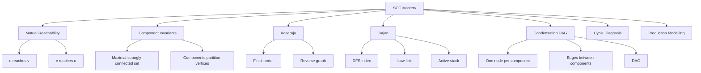
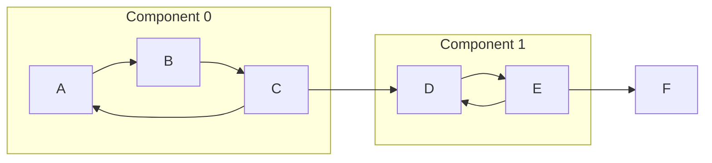
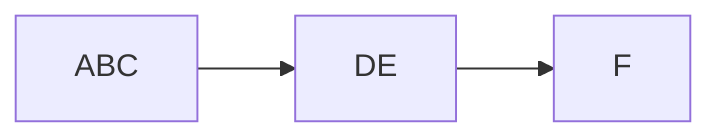
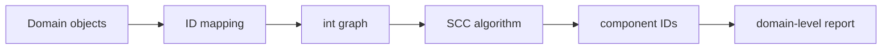
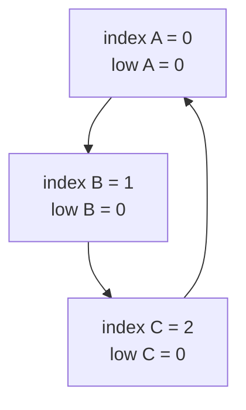
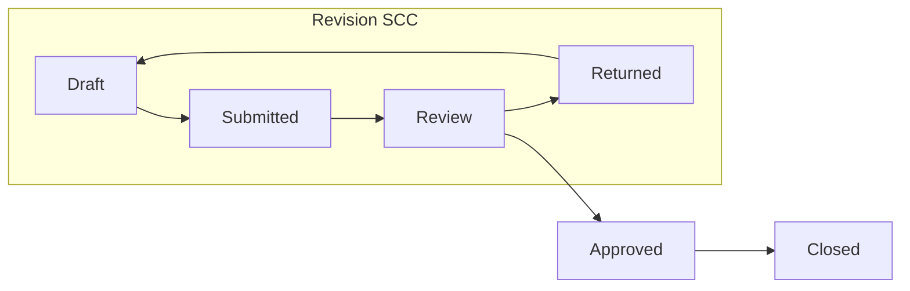
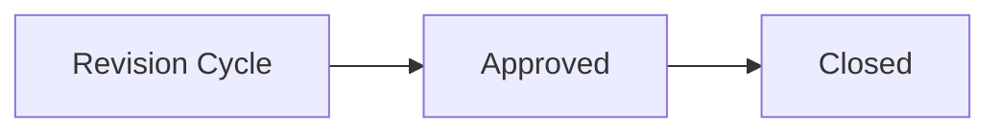

------
title: Learn Java Data Structures and Algorithms - Part 025
description: Strongly connected components, mutual reachability, Kosaraju, Tarjan low-link, condensation DAGs, cycle diagnosis, reachability compression, and dependency-system analysis in Java.
series: learn-java-dsa
seriesTitle: Learn Java Data Structures and Algorithms
order: 25
partTitle: Strongly Connected Components and Condensation Graphs
tags:
- java
- data-structures
- algorithms
- graph
- directed-graph
- scc
- tarjan
- kosaraju
- condensation-graph
- series
date: 2026-06-27
---

# Part 025 — Strongly Connected Components and Condensation Graphs

Topological sort from Part 024 works only when a directed graph is a DAG.

Real systems are rarely that clean.

Dependency graphs, workflow graphs, ownership graphs, package graphs, call graphs, policy graphs, and service graphs often contain cycles. A cycle is not always a bug. Sometimes it represents a legitimate strongly interdependent subsystem.

Strongly Connected Components, or SCCs, give us the next level of modelling:

> Collapse every mutually reachable region of a directed graph into a single component, then reason about the resulting DAG.

This part is about turning a messy directed graph into a smaller, explainable, dependency-ordered structure.

SCCs are used in:

- compiler optimization,
- package dependency analysis,
- build systems,
- deadlock and wait-for graph analysis,
- service dependency review,
- workflow lifecycle analysis,
- rule-engine dependency resolution,
- call graph compression,
- graph databases,
- social network analysis,
- reachability indexing,
- 2-SAT,
- incremental architecture governance.

A directed cycle tells us: "there is feedback."

An SCC tells us: "this is the whole feedback region."

---

## 1. Kaufman Skill Target

After this part, you should be able to:

1. define strong connectivity and SCCs precisely;
2. explain why SCCs form equivalence classes;
3. implement Kosaraju's algorithm in Java;
4. implement Tarjan's low-link algorithm in Java;
5. build a condensation graph from component IDs;
6. topologically sort components instead of raw vertices;
7. diagnose dependency cycles with useful component-level output;
8. distinguish local cycle detection from full SCC decomposition;
9. choose representation and recursion strategy safely in Java;
10. apply SCCs to package, service, workflow, and rule dependency graphs.

Kaufman decomposition:



---

## 2. The Core Problem

Given a directed graph:

```text
A -> B
B -> C
C -> A
C -> D
D -> E
E -> D
E -> F
```

There are two feedback regions:

```text
{A, B, C}
{D, E}
```

and one singleton region:

```text
{F}
```

The compressed graph is:

```text
[A,B,C] -> [D,E] -> [F]
```

That compressed graph is a DAG.

Diagram:



Condensation:



The important shift:

> We stop pretending the graph has no cycles. We summarize cycles as units, then reason about the DAG between those units.

---

## 3. Strong Connectivity

A vertex `u` is strongly connected to vertex `v` when:

```text
u can reach v
and
v can reach u
```

A Strongly Connected Component is a maximal set of vertices where every pair is mutually reachable.

Maximal matters.

If `{A, B, C}` are mutually reachable, `{A, B}` is strongly connected but not a component, because it can be expanded to include `C`.

### 3.1 Weak vs Strong Connectivity

For directed graphs:

| Concept | Meaning |
|---|---|
| Weakly connected | Connected if edge direction is ignored. |
| Strongly connected | Every vertex can reach every other vertex respecting direction. |

Example:

```text
A -> B -> C
```

This is weakly connected, but the SCCs are:

```text
{A}, {B}, {C}
```

because `C` cannot reach `B` or `A`.

---

## 4. Mental Model: SCC as Quotient Graph

SCC decomposition is a graph compression operation.

The relation:

```text
u ~ v iff u reaches v and v reaches u
```

is an equivalence relation:

| Property | Why |
|---|---|
| Reflexive | Every vertex reaches itself by a zero-length path. |
| Symmetric | The definition requires reachability both ways. |
| Transitive | If `u <-> v` and `v <-> w`, then paths compose so `u <-> w`. |

Equivalence relations partition a set.

So SCCs partition vertices into non-overlapping groups.

Then each group becomes one node.

That resulting graph is called the condensation graph.

Important invariant:

> The condensation graph of any directed graph is always a DAG.

Why?

If two components in the condensation graph were part of a directed cycle, then all vertices across those components would be mutually reachable. They should have been one SCC, not multiple SCCs.

---

## 5. SCC vs Cycle Detection

Cycle detection answers:

> Does at least one cycle exist?

SCC decomposition answers:

> Which vertices belong to each mutually dependent region?

These are different operational questions.

| Need | Use |
|---|---|
| Reject invalid dependency graph quickly | Cycle detection |
| Explain all dependency cycles | SCC decomposition |
| Compress graph into dependency layers | SCC + condensation DAG |
| Detect deadlock groups | SCC on wait-for graph |
| Analyze module coupling | SCC on package graph |
| Solve 2-SAT | SCC on implication graph |

For production systems, SCC output is often more useful than a boolean.

A user usually cannot fix:

```text
Graph contains a cycle.
```

They can fix:

```text
Components involved in cyclic dependency:
- billing-api
- payment-domain
- invoice-workflow
- risk-rules
```

---

## 6. Representation Strategy in Java

For algorithmic implementation, use integer vertex IDs.

```java
int n = ...;
List<Integer>[] graph = new List[n];
```

For production systems, keep a domain mapping layer:

```java
Map<String, Integer> idOf = new HashMap<>();
List<String> nameOf = new ArrayList<>();
```

Do not mix domain IDs and algorithmic IDs inside the core algorithm.

Recommended separation:



This keeps the algorithm:

- compact,
- testable,
- allocation-light,
- independent of domain object equality,
- resistant to mutable key mistakes.

---

## 7. Building a Directed Graph Helper

```java
import java.util.ArrayList;
import java.util.List;

final class IntDirectedGraph {
    private final List<Integer>[] adj;

    @SuppressWarnings("unchecked")
    IntDirectedGraph(int n) {
        this.adj = new List[n];
        for (int i = 0; i < n; i++) {
            adj[i] = new ArrayList<>();
        }
    }

    int size() {
        return adj.length;
    }

    void addEdge(int from, int to) {
        checkVertex(from);
        checkVertex(to);
        adj[from].add(to);
    }

    List<Integer> neighbors(int v) {
        checkVertex(v);
        return adj[v];
    }

    IntDirectedGraph reversed() {
        IntDirectedGraph r = new IntDirectedGraph(size());
        for (int u = 0; u < size(); u++) {
            for (int v : adj[u]) {
                r.addEdge(v, u);
            }
        }
        return r;
    }

    private void checkVertex(int v) {
        if (v < 0 || v >= adj.length) {
            throw new IndexOutOfBoundsException("vertex=" + v + ", n=" + adj.length);
        }
    }
}
```

For very large graphs, replace `List<Integer>[]` with primitive adjacency arrays or compressed sparse row representation. We stay with lists here because the algorithmic invariant is clearer.

---

## 8. Kosaraju's Algorithm

Kosaraju is conceptually simple.

It has two DFS passes:

1. DFS on original graph to compute vertices by decreasing finish time.
2. DFS on reversed graph in that order to collect SCCs.

Algorithm:

```text
order = []
visited = false[n]

for each vertex v:
    if not visited[v]:
        dfs1(v)

reverse graph
visited = false[n]
components = []

for v in reverse(order):
    if not visited[v]:
        component = []
        dfs2(v, component) on reversed graph
        components.add(component)
```

Important detail:

- `dfs1` appends vertex after exploring descendants.
- The second pass processes highest finish time first.

### 8.1 Why Finish Order Matters

If the graph has component edges:

```text
C1 -> C2 -> C3
```

The first DFS finish order tends to place source-side components late.

When processed in reverse finish order on the reversed graph, the DFS gets trapped inside exactly one SCC instead of leaking into dependent components.

Mental model:

> Finish order identifies component sources in the condensation DAG. Reversing the graph turns those sources into sinks, making each DFS collect one SCC.

### 8.2 Kosaraju Implementation

```java
import java.util.ArrayList;
import java.util.Collections;
import java.util.List;

final class KosarajuScc {
    static List<List<Integer>> compute(IntDirectedGraph g) {
        int n = g.size();
        boolean[] visited = new boolean[n];
        List<Integer> finishOrder = new ArrayList<>(n);

        for (int v = 0; v < n; v++) {
            if (!visited[v]) {
                dfsFinish(g, v, visited, finishOrder);
            }
        }

        IntDirectedGraph reversed = g.reversed();
        boolean[] assigned = new boolean[n];
        Collections.reverse(finishOrder);

        List<List<Integer>> components = new ArrayList<>();
        for (int v : finishOrder) {
            if (!assigned[v]) {
                List<Integer> component = new ArrayList<>();
                dfsCollect(reversed, v, assigned, component);
                components.add(component);
            }
        }

        return components;
    }

    private static void dfsFinish(
            IntDirectedGraph g,
            int u,
            boolean[] visited,
            List<Integer> finishOrder
    ) {
        visited[u] = true;
        for (int v : g.neighbors(u)) {
            if (!visited[v]) {
                dfsFinish(g, v, visited, finishOrder);
            }
        }
        finishOrder.add(u);
    }

    private static void dfsCollect(
            IntDirectedGraph g,
            int u,
            boolean[] assigned,
            List<Integer> component
    ) {
        assigned[u] = true;
        component.add(u);
        for (int v : g.neighbors(u)) {
            if (!assigned[v]) {
                dfsCollect(g, v, assigned, component);
            }
        }
    }
}
```

### 8.3 Kosaraju Complexity

| Operation | Cost |
|---|---:|
| First DFS | `O(V + E)` |
| Reverse graph | `O(V + E)` |
| Second DFS | `O(V + E)` |
| Total | `O(V + E)` |
| Extra space | `O(V + E)` if materializing reverse graph |

Kosaraju is easy to reason about, but it stores or builds the reversed graph.

---

## 9. Tarjan's Algorithm

Tarjan's algorithm computes SCCs in one DFS pass.

It does not require building the reversed graph.

It maintains:

| Field | Meaning |
|---|---|
| `index[u]` | DFS discovery order of `u`. |
| `low[u]` | Smallest discovery index reachable from `u` through DFS tree edges plus at most one back/cross edge to an active vertex. |
| stack | Vertices in the current unresolved DFS region. |
| `onStack[u]` | Whether `u` is still active and eligible to join current SCC. |

The key condition:

```text
low[u] == index[u]
```

means:

> `u` is the root of an SCC. Pop vertices from stack until `u`.

### 9.1 Low-Link Intuition

Suppose DFS enters:

```text
A -> B -> C -> A
```

Then:

```text
index[A] = 0
index[B] = 1
index[C] = 2
```

When `C` sees edge `C -> A`, and `A` is on the stack:

```text
low[C] = min(low[C], index[A]) = 0
```

Then low-link propagates upward:

```text
low[B] = 0
low[A] = 0
```

When DFS returns to `A`, `low[A] == index[A]`, so `A` is the SCC root. Pop `C`, `B`, `A`.

Diagram:



---

## 10. Tarjan Implementation in Java

```java
import java.util.ArrayDeque;
import java.util.ArrayList;
import java.util.Arrays;
import java.util.Deque;
import java.util.List;

final class TarjanScc {
    private final IntDirectedGraph graph;
    private final int n;
    private final int[] index;
    private final int[] low;
    private final boolean[] onStack;
    private final Deque<Integer> stack = new ArrayDeque<>();
    private final List<List<Integer>> components = new ArrayList<>();
    private int nextIndex = 0;

    private TarjanScc(IntDirectedGraph graph) {
        this.graph = graph;
        this.n = graph.size();
        this.index = new int[n];
        this.low = new int[n];
        this.onStack = new boolean[n];
        Arrays.fill(index, -1);
    }

    static List<List<Integer>> compute(IntDirectedGraph graph) {
        TarjanScc scc = new TarjanScc(graph);
        for (int v = 0; v < scc.n; v++) {
            if (scc.index[v] == -1) {
                scc.strongConnect(v);
            }
        }
        return scc.components;
    }

    private void strongConnect(int u) {
        index[u] = nextIndex;
        low[u] = nextIndex;
        nextIndex++;

        stack.push(u);
        onStack[u] = true;

        for (int v : graph.neighbors(u)) {
            if (index[v] == -1) {
                strongConnect(v);
                low[u] = Math.min(low[u], low[v]);
            } else if (onStack[v]) {
                low[u] = Math.min(low[u], index[v]);
            }
        }

        if (low[u] == index[u]) {
            List<Integer> component = new ArrayList<>();
            while (true) {
                int v = stack.pop();
                onStack[v] = false;
                component.add(v);
                if (v == u) {
                    break;
                }
            }
            components.add(component);
        }
    }
}
```

### 10.1 The Most Common Tarjan Bug

Do not update low-link like this for an already visited vertex:

```java
low[u] = Math.min(low[u], low[v]); // wrong in the onStack case
```

For an edge to an active vertex, use:

```java
low[u] = Math.min(low[u], index[v]);
```

Why?

Because an edge from `u` to active `v` proves `u` can reach `v`, not necessarily everything reachable from `v` through unresolved descendants in a way that should merge components incorrectly.

The standard safe invariant is:

- tree edge to unvisited `v`: after recursion, merge `low[v]`;
- edge to active `v`: merge `index[v]`;
- edge to already assigned inactive `v`: ignore.

---

## 11. Component IDs

Algorithm output as `List<List<Integer>>` is useful for teaching, but production code usually needs:

```text
componentOf[v] = component ID
```

Let's normalize output.

```java
import java.util.List;

record SccResult(int componentCount, int[] componentOf, List<List<Integer>> components) {
    boolean sameComponent(int a, int b) {
        return componentOf[a] == componentOf[b];
    }
}

final class SccIndex {
    static SccResult fromComponents(int n, List<List<Integer>> components) {
        int[] componentOf = new int[n];
        for (int cid = 0; cid < components.size(); cid++) {
            for (int v : components.get(cid)) {
                componentOf[v] = cid;
            }
        }
        return new SccResult(components.size(), componentOf, components);
    }
}
```

Usage:

```java
List<List<Integer>> components = TarjanScc.compute(graph);
SccResult result = SccIndex.fromComponents(graph.size(), components);

if (result.sameComponent(a, b)) {
    // a and b are mutually reachable
}
```

---

## 12. Building the Condensation Graph

The condensation graph has:

- one vertex per SCC;
- an edge `C(u) -> C(v)` if original graph has edge `u -> v` and `C(u) != C(v)`.

Implementation:

```java
import java.util.ArrayList;
import java.util.HashSet;
import java.util.List;
import java.util.Set;

final class CondensationGraph {
    static List<Set<Integer>> build(IntDirectedGraph graph, SccResult scc) {
        List<Set<Integer>> dag = new ArrayList<>();
        for (int i = 0; i < scc.componentCount(); i++) {
            dag.add(new HashSet<>());
        }

        int[] componentOf = scc.componentOf();
        for (int u = 0; u < graph.size(); u++) {
            int cu = componentOf[u];
            for (int v : graph.neighbors(u)) {
                int cv = componentOf[v];
                if (cu != cv) {
                    dag.get(cu).add(cv);
                }
            }
        }
        return dag;
    }
}
```

Why `Set<Integer>`?

Parallel edges between components are usually not useful for topological reasoning. Deduplication keeps the compressed graph clean.

For performance-sensitive cases, use primitive int collections or sort/unique arrays after edge collection.

---

## 13. Topological Sort of Components

Once we have a condensation DAG, we can topologically sort components.

```java
import java.util.ArrayDeque;
import java.util.ArrayList;
import java.util.Deque;
import java.util.List;
import java.util.Set;

final class ToposortComponents {
    static List<Integer> sort(List<Set<Integer>> dag) {
        int n = dag.size();
        int[] indegree = new int[n];

        for (int u = 0; u < n; u++) {
            for (int v : dag.get(u)) {
                indegree[v]++;
            }
        }

        Deque<Integer> queue = new ArrayDeque<>();
        for (int i = 0; i < n; i++) {
            if (indegree[i] == 0) {
                queue.addLast(i);
            }
        }

        List<Integer> order = new ArrayList<>(n);
        while (!queue.isEmpty()) {
            int u = queue.removeFirst();
            order.add(u);

            for (int v : dag.get(u)) {
                indegree[v]--;
                if (indegree[v] == 0) {
                    queue.addLast(v);
                }
            }
        }

        if (order.size() != n) {
            throw new IllegalStateException("condensation graph should be acyclic");
        }

        return order;
    }
}
```

If this throws, either:

- SCC computation is wrong;
- condensation construction is wrong;
- component IDs are corrupted.

The condensation graph should never contain a directed cycle.

---

## 14. End-to-End Example

```java
public final class SccDemo {
    public static void main(String[] args) {
        IntDirectedGraph g = new IntDirectedGraph(6);
        g.addEdge(0, 1); // A -> B
        g.addEdge(1, 2); // B -> C
        g.addEdge(2, 0); // C -> A
        g.addEdge(2, 3); // C -> D
        g.addEdge(3, 4); // D -> E
        g.addEdge(4, 3); // E -> D
        g.addEdge(4, 5); // E -> F

        List<List<Integer>> components = TarjanScc.compute(g);
        SccResult scc = SccIndex.fromComponents(g.size(), components);

        System.out.println("Components:");
        for (int i = 0; i < components.size(); i++) {
            System.out.println(i + " -> " + components.get(i));
        }

        List<Set<Integer>> dag = CondensationGraph.build(g, scc);
        System.out.println("Condensation DAG: " + dag);
        System.out.println("Component topo order: " + ToposortComponents.sort(dag));
    }
}
```

The numeric component IDs may differ depending on DFS order.

Do not rely on component ID order unless your algorithm explicitly normalizes it.

---

## 15. Reporting SCCs With Domain Names

Algorithm IDs are integers. Users need names.

```java
import java.util.ArrayList;
import java.util.HashMap;
import java.util.List;
import java.util.Map;

final class NamedGraphBuilder {
    private final Map<String, Integer> idOf = new HashMap<>();
    private final List<String> nameOf = new ArrayList<>();
    private final List<int[]> edges = new ArrayList<>();

    void addEdge(String from, String to) {
        int u = id(from);
        int v = id(to);
        edges.add(new int[] { u, v });
    }

    IntDirectedGraph toGraph() {
        IntDirectedGraph g = new IntDirectedGraph(nameOf.size());
        for (int[] e : edges) {
            g.addEdge(e[0], e[1]);
        }
        return g;
    }

    String name(int id) {
        return nameOf.get(id);
    }

    int size() {
        return nameOf.size();
    }

    private int id(String name) {
        return idOf.computeIfAbsent(name, k -> {
            int id = nameOf.size();
            nameOf.add(k);
            return id;
        });
    }
}
```

Cycle report:

```java
static List<List<String>> cyclicGroups(NamedGraphBuilder builder, SccResult scc) {
    List<List<String>> groups = new ArrayList<>();

    for (List<Integer> component : scc.components()) {
        if (component.size() <= 1) {
            continue;
        }
        List<String> names = new ArrayList<>();
        for (int v : component) {
            names.add(builder.name(v));
        }
        groups.add(names);
    }

    return groups;
}
```

This reports multi-node SCCs.

But a singleton SCC can still be cyclic if it has a self-loop.

Add self-loop detection when needed.

---

## 16. Self-Loops and Cyclic Components

A component is cyclic if:

1. it contains more than one vertex; or
2. it contains exactly one vertex `u` and edge `u -> u` exists.

```java
static boolean isCyclicComponent(IntDirectedGraph g, List<Integer> component) {
    if (component.size() > 1) {
        return true;
    }

    int u = component.get(0);
    for (int v : g.neighbors(u)) {
        if (v == u) {
            return true;
        }
    }
    return false;
}
```

This matters in dependency systems:

```text
A depends on A
```

is a valid SCC of size 1, but it is still an invalid self-dependency in many domains.

---

## 17. SCCs in Dependency Systems

Suppose module dependencies are:

```text
case-api -> case-domain
case-domain -> rules-engine
rules-engine -> case-domain
case-domain -> audit-domain
audit-domain -> persistence
```

SCCs:

```text
{case-domain, rules-engine}
{case-api}
{audit-domain}
{persistence}
```

Condensation:

```text
case-api -> {case-domain, rules-engine} -> audit-domain -> persistence
```

Engineering interpretation:

- `case-domain` and `rules-engine` are mutually coupled.
- They cannot be ordered independently.
- If independent deployability is required, the cycle must be broken.
- If mutual coupling is accepted, treat them as one architectural unit.

The SCC does not tell you whether the design is bad. It tells you where the feedback loops are.

---

## 18. SCCs in Workflow and Lifecycle Systems

A workflow graph may have legitimate cycles:

```text
Draft -> Submitted -> Review -> Returned -> Draft
Review -> Approved -> Closed
```

The SCC:

```text
{Draft, Submitted, Review, Returned}
```

is not necessarily an error. It represents a phase with revision loops.

The condensation DAG might be:

```text
RevisionCycle -> Approved -> Closed
```

This is valuable for enforcement lifecycle modelling:

- local loops are permitted;
- terminal states should not leak back into active states;
- escalation phases can be componentized;
- audit/reporting can analyze stage-level progress instead of raw state transitions.

Mermaid:



Condensation:



---

## 19. SCCs for 2-SAT

2-SAT can be solved by SCCs on an implication graph.

For each boolean variable `x`, create two nodes:

```text
x
not x
```

A clause:

```text
(a OR b)
```

is equivalent to:

```text
not a -> b
not b -> a
```

A formula is unsatisfiable if any variable and its negation are in the same SCC:

```text
componentOf[x] == componentOf[not x]
```

This is a good example of SCC as contradiction detection.

You do not need to memorize 2-SAT now. The important mental model is:

> Mutual implication between a proposition and its negation means contradiction.

---

## 20. Recursive DFS Risk in Java

Both Kosaraju and Tarjan above use recursive DFS.

For large graphs, this can overflow the Java stack.

Risk factors:

- millions of vertices;
- long chains;
- graph generated from user/domain data;
- server process where stack size is not tuned for deep recursion.

Mitigations:

| Option | Trade-off |
|---|---|
| Increase thread stack size | Operational setting, not algorithmic fix. |
| Use iterative DFS | More code, safer for large graphs. |
| Use graph partitioning | Useful when domain allows it. |
| Detect large input and fail fast | Better than crashing mid-request. |

For internal tools and bounded inputs, recursive implementations are often fine.

For production services processing arbitrary graphs, prefer iterative traversal or a worker with controlled stack settings.

---

## 21. Iterative DFS Finish Order Sketch

Kosaraju's first pass can be made iterative with explicit frame state.

```java
record Frame(int vertex, int nextIndex) {}
```

Sketch:

```java
static List<Integer> finishOrderIterative(IntDirectedGraph g) {
    int n = g.size();
    boolean[] visited = new boolean[n];
    List<Integer> order = new ArrayList<>(n);

    for (int start = 0; start < n; start++) {
        if (visited[start]) {
            continue;
        }

        Deque<Frame> stack = new ArrayDeque<>();
        visited[start] = true;
        stack.push(new Frame(start, 0));

        while (!stack.isEmpty()) {
            Frame top = stack.pop();
            int u = top.vertex();
            int i = top.nextIndex();

            if (i < g.neighbors(u).size()) {
                int v = g.neighbors(u).get(i);
                stack.push(new Frame(u, i + 1));
                if (!visited[v]) {
                    visited[v] = true;
                    stack.push(new Frame(v, 0));
                }
            } else {
                order.add(u);
            }
        }
    }

    return order;
}
```

This pattern is useful whenever recursive postorder must be simulated.

---

## 22. Correctness Reasoning: Condensation Is a DAG

Assume condensation graph has a cycle:

```text
C1 -> C2 -> ... -> Ck -> C1
```

Pick vertices:

```text
v1 in C1
v2 in C2
...
vk in Ck
```

Because there is a path from each component to the next, every component can reach every other component around the cycle.

Therefore any vertex in `C1` can reach vertices in `C2`, and those can eventually reach back to `C1`.

That means `C1` and `C2` are not actually separate SCCs.

Contradiction.

So condensation graph must be acyclic.

---

## 23. Correctness Reasoning: Tarjan Root Condition

Tarjan says `u` is an SCC root when:

```text
low[u] == index[u]
```

Interpretation:

- `index[u]` is the earliest discovery index of `u` itself;
- `low[u]` is the earliest active vertex reachable from `u`'s DFS subtree;
- if `low[u] == index[u]`, no descendant can reach an active ancestor before `u`;
- therefore the unresolved stack segment from top down to `u` forms one maximal SCC.

Why pop until `u`?

Because every vertex above `u` on the stack was discovered inside `u`'s DFS subtree and has a path back into the same low-link root.

---

## 24. Complexity Budget

| Algorithm | Time | Extra Space | Reverse Graph Needed | Notes |
|---|---:|---:|---|---|
| Kosaraju | `O(V + E)` | `O(V + E)` | Yes | Conceptually simple. |
| Tarjan | `O(V + E)` | `O(V)` plus graph | No | Single pass, more subtle. |
| Condensation build | `O(V + E)` expected with hash sets | `O(C + E')` | No | `C` = components, `E'` = component edges. |
| Toposort components | `O(C + E')` | `O(C)` | No | Condensation must be DAG. |

For Java performance:

- `List<Integer>[]` boxes integers;
- object-heavy graph representation can dominate runtime;
- recursion depth can dominate reliability;
- deduping component edges via `HashSet<Integer>` adds allocation;
- for massive graphs, prefer primitive arrays and sorted edge compaction.

---

## 25. Common Failure Modes

### 25.1 Treating Any SCC as a Bug

Not every SCC is bad.

In workflows, revision loops may be valid.

In architecture, some mutual dependencies may be intentionally packaged as one module.

The question is not:

```text
Are there SCCs?
```

Every vertex belongs to an SCC.

The question is:

```text
Which SCCs are cyclic, and are those cycles allowed by the domain?
```

### 25.2 Ignoring Singleton Self-Loops

A singleton component `{A}` can still be cyclic if `A -> A`.

### 25.3 Reporting Numeric IDs Only

Algorithmic output is useless to users unless mapped back to names.

### 25.4 Relying on Component ID Order

Tarjan and Kosaraju component IDs depend on traversal order.

Normalize if output order matters.

### 25.5 Recursive DFS on Unbounded Input

A graph shaped like a linked list can crash recursive DFS.

### 25.6 Confusing SCC DAG With Original Graph

The condensation graph loses internal structure.

It tells you component-level dependency order, not every internal edge.

---

## 26. Testing Strategy

Test with named shapes.

### 26.1 Empty Graph

```text
V = 0
E = 0
```

Expected:

```text
0 components
```

### 26.2 Isolated Vertices

```text
A B C
```

Expected:

```text
{A}, {B}, {C}
```

### 26.3 Single Chain

```text
A -> B -> C
```

Expected:

```text
{A}, {B}, {C}
```

No cyclic multi-node component.

### 26.4 One Cycle

```text
A -> B -> C -> A
```

Expected:

```text
{A, B, C}
```

### 26.5 Two Cycles With Bridge

```text
A -> B -> A
B -> C
C -> D -> C
```

Expected:

```text
{A, B} -> {C, D}
```

### 26.6 Self-Loop

```text
A -> A
```

Expected:

```text
{A}
cyclic = true
```

### 26.7 Duplicate Edges

```text
A -> B
A -> B
```

Expected:

```text
same SCC result
condensation edge deduped
```

---

## 27. Minimal Test Harness

```java
import java.util.List;

final class SccAssertions {
    static void assertSame(SccResult scc, int a, int b) {
        if (!scc.sameComponent(a, b)) {
            throw new AssertionError(a + " and " + b + " expected same component");
        }
    }

    static void assertDifferent(SccResult scc, int a, int b) {
        if (scc.sameComponent(a, b)) {
            throw new AssertionError(a + " and " + b + " expected different components");
        }
    }

    static SccResult tarjan(IntDirectedGraph g) {
        List<List<Integer>> components = TarjanScc.compute(g);
        return SccIndex.fromComponents(g.size(), components);
    }
}
```

Example:

```java
IntDirectedGraph g = new IntDirectedGraph(4);
g.addEdge(0, 1);
g.addEdge(1, 0);
g.addEdge(1, 2);
g.addEdge(2, 3);
g.addEdge(3, 2);

SccResult scc = SccAssertions.tarjan(g);
SccAssertions.assertSame(scc, 0, 1);
SccAssertions.assertSame(scc, 2, 3);
SccAssertions.assertDifferent(scc, 1, 2);
```

---

## 28. Practice Loop

### Exercise 1 — Implement Kosaraju

Implement Kosaraju from memory.

Constraints:

- integer vertices;
- support disconnected graph;
- include reverse graph builder;
- return `int[] componentOf`.

Self-check:

- Does every vertex get exactly one component?
- Does a chain produce singleton components?
- Does a cycle produce one component?

### Exercise 2 — Implement Tarjan

Implement Tarjan from memory.

Self-check:

- Do you use `index[v]` for active visited neighbor updates?
- Do you ignore inactive assigned vertices?
- Do you pop exactly until the root?

### Exercise 3 — Build Condensation Graph

Given `componentOf`, build a component DAG.

Self-check:

- No self-edge between same component.
- Duplicate component edges are deduped.
- Toposort of condensation includes every component.

### Exercise 4 — Package Cycle Report

Input:

```text
api -> domain
domain -> rules
rules -> domain
domain -> persistence
```

Output cyclic groups with names:

```text
[domain, rules]
```

### Exercise 5 — Workflow Phase Compression

Given a workflow transition graph, compress SCCs and report terminal components.

A terminal component is a component with no outgoing edge in the condensation graph.

---

## 29. Review Checklist

Before using SCCs in production, verify:

- [ ] Edge direction is domain-correct.
- [ ] All vertices are explicitly registered, including isolated vertices.
- [ ] Self-loops are handled according to domain rules.
- [ ] Component IDs are mapped back to domain names.
- [ ] Cyclic singleton components are not ignored.
- [ ] Recursive DFS is acceptable for max input size.
- [ ] Duplicate edges do not distort reporting.
- [ ] Condensation graph is validated as acyclic.
- [ ] Output ordering is deterministic if used in tests or reports.
- [ ] Component-level and vertex-level semantics are not confused.

---

## 30. Key Takeaways

SCCs are the right abstraction when a directed graph contains feedback.

Kosaraju is simpler to explain. Tarjan is more memory-efficient and single-pass, but easier to implement incorrectly.

The condensation graph is the crucial engineering artifact: it turns arbitrary directed graph structure into a DAG of mutually dependent regions.

For real systems, SCCs are not just graph theory. They are a way to explain coupling, cycles, deadlocks, revision loops, and architectural boundaries.

The top 1% move is not merely implementing Tarjan from memory. It is knowing when the raw graph is too detailed and when the component graph is the right level of reasoning.
