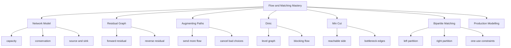
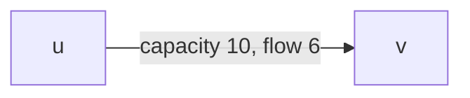
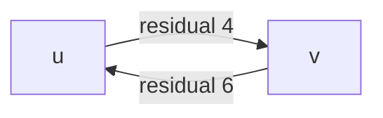
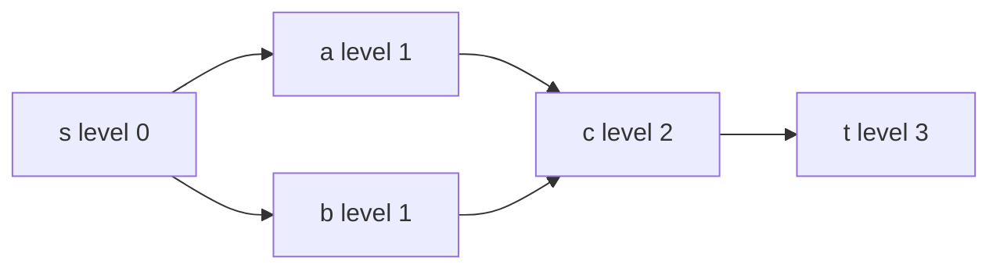
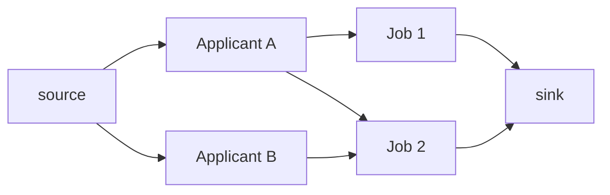
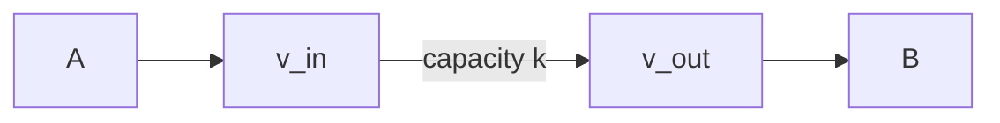

------
title: Learn Java Data Structures and Algorithms - Part 026
description: Flow networks, residual graphs, max flow, min cut, Dinic, bipartite matching, Hopcroft-Karp, assignment modelling, capacity constraints, and production-grade Java implementation patterns.
series: learn-java-dsa
seriesTitle: Learn Java Data Structures and Algorithms
order: 26
partTitle: Flow, Matching, and Cut Problems
tags:
- java
- data-structures
- algorithms
- graph
- max-flow
- min-cut
- matching
- dinic
- hopcroft-karp
- series
date: 2026-06-27
---

# Part 026 — Flow, Matching, and Cut Problems

Shortest path asks:

> What is the cheapest route for one unit of movement?

Flow asks:

> How much can move through a constrained network?

Matching asks:

> Which pairs can be selected without reusing limited resources?

Cut asks:

> What bottleneck separates source from target?

These problems appear in:

- assignment systems,
- resource allocation,
- routing and logistics,
- bandwidth planning,
- scheduling,
- approval capacity modelling,
- case distribution,
- fraud/risk rule allocation,
- bipartite recommendation constraints,
- dependency isolation,
- image segmentation,
- network reliability,
- access-control separation,
- evacuation and queueing simulations.

This part is not about memorizing one hard algorithm.

It is about recognizing a family of modelling patterns:

```text
entities + capacities + conservation + residual choices
```

---

## 1. Kaufman Skill Target

After this part, you should be able to:

1. model a capacity-constrained problem as a flow network;
2. explain flow conservation, capacity constraints, source, sink, and residual capacity;
3. implement Dinic's max-flow algorithm in Java;
4. extract a min cut after max flow;
5. model bipartite matching as max flow;
6. implement Hopcroft-Karp for bipartite matching;
7. distinguish max flow, min cut, matching, assignment, and shortest path;
8. reason about integer capacities and overflow;
9. debug reverse-edge and residual-graph bugs;
10. decide when flow modelling is overkill.

Kaufman decomposition:



---

## 2. Flow Network Basics

A flow network is a directed graph:

```text
G = (V, E)
```

with:

- source `s`,
- sink `t`,
- non-negative capacity `c(u, v)` on each edge,
- flow `f(u, v)` assigned to edges.

The flow must satisfy:

### 2.1 Capacity Constraint

```text
0 <= f(u, v) <= c(u, v)
```

You cannot send more flow than the edge capacity.

### 2.2 Flow Conservation

For every vertex except source and sink:

```text
inflow(v) == outflow(v)
```

Intermediate vertices do not create or consume flow.

They forward it.

### 2.3 Flow Value

The total value of a flow is:

```text
sum of flow leaving source
```

or equivalently:

```text
sum of flow entering sink
```

---

## 3. Mental Model: Water Is Useful but Incomplete

The classic intuition is water flowing through pipes.

That helps with capacity.

But it hides the most important algorithmic idea:

> The residual graph lets us undo previous choices.

If we send flow through edge `u -> v`, the residual graph creates reverse capacity `v -> u` representing the ability to cancel that flow later.

This is not physical water.

It is an optimization state machine.

---

## 4. Residual Graph

For each original edge:

```text
u -> v capacity c
```

if current flow is `f`, residual capacities are:

```text
u -> v has residual c - f
v -> u has residual f
```

The forward edge means:

> We can send more flow.

The reverse edge means:

> We can take back some previous flow and reroute it.

Diagram:



Residual:



Reverse edges are the difference between greedy routing and correct max flow.

---

## 5. Augmenting Path

An augmenting path is a path from `s` to `t` in the residual graph where every edge has positive residual capacity.

The amount you can push is the minimum residual capacity along the path.

```text
bottleneck = min(residual edge capacity on path)
```

Then update every edge on the path:

- decrease forward residual by bottleneck;
- increase reverse residual by bottleneck.

When no augmenting path remains, the flow is maximum.

This idea underlies Ford-Fulkerson, Edmonds-Karp, and Dinic.

---

## 6. Algorithm Choices

| Algorithm | Idea | Typical Use |
|---|---|---|
| Ford-Fulkerson | Any augmenting path | Simple concept, risky complexity with bad path choices. |
| Edmonds-Karp | BFS shortest augmenting path by edge count | Easier guarantee, slower on large graphs. |
| Dinic | BFS level graph + DFS blocking flow | Strong practical default for many contest/system modelling tasks. |
| Hopcroft-Karp | Layered augmenting paths for bipartite matching | Faster than generic flow for pure bipartite matching. |

In this series, Dinic is the main max-flow implementation because it has a good balance of:

- understandable invariants,
- broad applicability,
- strong performance,
- clean Java implementation.

---

## 7. Dinic's Algorithm

Dinic repeats phases:

1. BFS from source over residual edges to build level graph.
2. DFS sends blocking flow through edges that go from level `k` to level `k + 1`.
3. Repeat until sink is unreachable.

Level graph invariant:

```text
level[v] = shortest residual distance from source to v
```

DFS only follows admissible edges:

```text
capacity > 0
level[to] == level[from] + 1
```

Blocking flow means:

> After DFS phase, every source-to-sink path in the current level graph has at least one saturated edge.

Diagram:



---

## 8. Dinic Java Implementation

Use `long` capacities by default.

`int` overflows too easily in production modelling.

```java
import java.util.ArrayDeque;
import java.util.ArrayList;
import java.util.Arrays;
import java.util.Deque;
import java.util.List;

public final class DinicMaxFlow {
    private static final long INF = Long.MAX_VALUE / 4;

    private static final class Edge {
        final int to;
        final int rev;
        long cap;

        Edge(int to, int rev, long cap) {
            this.to = to;
            this.rev = rev;
            this.cap = cap;
        }
    }

    private final List<Edge>[] graph;
    private final int[] level;
    private final int[] next;

    @SuppressWarnings("unchecked")
    public DinicMaxFlow(int n) {
        this.graph = new List[n];
        for (int i = 0; i < n; i++) {
            graph[i] = new ArrayList<>();
        }
        this.level = new int[n];
        this.next = new int[n];
    }

    public void addEdge(int from, int to, long capacity) {
        checkVertex(from);
        checkVertex(to);
        if (capacity < 0) {
            throw new IllegalArgumentException("capacity must be non-negative");
        }

        Edge forward = new Edge(to, graph[to].size(), capacity);
        Edge reverse = new Edge(from, graph[from].size(), 0);
        graph[from].add(forward);
        graph[to].add(reverse);
    }

    public long maxFlow(int source, int sink) {
        checkVertex(source);
        checkVertex(sink);
        if (source == sink) {
            throw new IllegalArgumentException("source and sink must differ");
        }

        long flow = 0;
        while (buildLevels(source, sink)) {
            Arrays.fill(next, 0);
            while (true) {
                long pushed = send(source, sink, INF);
                if (pushed == 0) {
                    break;
                }
                flow = safeAdd(flow, pushed);
            }
        }
        return flow;
    }

    private boolean buildLevels(int source, int sink) {
        Arrays.fill(level, -1);
        Deque<Integer> queue = new ArrayDeque<>();
        level[source] = 0;
        queue.addLast(source);

        while (!queue.isEmpty()) {
            int u = queue.removeFirst();
            for (Edge e : graph[u]) {
                if (e.cap > 0 && level[e.to] < 0) {
                    level[e.to] = level[u] + 1;
                    queue.addLast(e.to);
                }
            }
        }

        return level[sink] >= 0;
    }

    private long send(int u, int sink, long pushed) {
        if (u == sink) {
            return pushed;
        }

        for (; next[u] < graph[u].size(); next[u]++) {
            Edge e = graph[u].get(next[u]);
            if (e.cap <= 0 || level[e.to] != level[u] + 1) {
                continue;
            }

            long amount = send(e.to, sink, Math.min(pushed, e.cap));
            if (amount == 0) {
                continue;
            }

            e.cap -= amount;
            graph[e.to].get(e.rev).cap += amount;
            return amount;
        }

        return 0;
    }

    public boolean[] reachableFromSourceInResidual(int source) {
        checkVertex(source);
        boolean[] seen = new boolean[graph.length];
        Deque<Integer> queue = new ArrayDeque<>();
        seen[source] = true;
        queue.addLast(source);

        while (!queue.isEmpty()) {
            int u = queue.removeFirst();
            for (Edge e : graph[u]) {
                if (e.cap > 0 && !seen[e.to]) {
                    seen[e.to] = true;
                    queue.addLast(e.to);
                }
            }
        }

        return seen;
    }

    private void checkVertex(int v) {
        if (v < 0 || v >= graph.length) {
            throw new IndexOutOfBoundsException("vertex=" + v + ", n=" + graph.length);
        }
    }

    private static long safeAdd(long a, long b) {
        if (Long.MAX_VALUE - a < b) {
            throw new ArithmeticException("flow overflow");
        }
        return a + b;
    }
}
```

This implementation mutates residual capacities.

If you need original capacities later, store them separately or expose edge handles with original metadata.

---

## 9. Reverse Edge Invariant

Every call to `addEdge(u, v, c)` creates two edge objects:

```text
forward: u -> v, cap = c, reverse index points to reverse edge
reverse: v -> u, cap = 0, reverse index points to forward edge
```

When sending `x` flow:

```java
e.cap -= x;
graph[e.to].get(e.rev).cap += x;
```

Invariant:

```text
forward residual + reverse residual = original capacity
```

for a simple original edge.

If this invariant breaks, max flow becomes meaningless.

Common causes:

- incorrect `rev` index;
- updating copied edge instead of stored edge;
- using immutable edge values;
- forgetting reverse capacity;
- adding reverse edges with wrong endpoint.

---

## 10. Example: Max Throughput

Network:

```text
s -> A capacity 10
s -> B capacity 5
A -> B capacity 15
A -> t capacity 10
B -> t capacity 10
```

```java
public final class FlowDemo {
    public static void main(String[] args) {
        int s = 0;
        int a = 1;
        int b = 2;
        int t = 3;

        DinicMaxFlow flow = new DinicMaxFlow(4);
        flow.addEdge(s, a, 10);
        flow.addEdge(s, b, 5);
        flow.addEdge(a, b, 15);
        flow.addEdge(a, t, 10);
        flow.addEdge(b, t, 10);

        System.out.println(flow.maxFlow(s, t)); // 15
    }
}
```

The max flow is limited by source outgoing capacity:

```text
10 + 5 = 15
```

and sink incoming capacity:

```text
10 + 10 = 20
```

The bottleneck is source side.

---

## 11. Min Cut

An `s-t` cut partitions vertices into two sets:

```text
S contains source
T contains sink
```

The cut capacity is the sum of capacities of edges from `S` to `T`.

The max-flow min-cut theorem says:

```text
maximum flow value = minimum cut capacity
```

Operational interpretation:

> After computing max flow, the vertices reachable from source in the residual graph form the source side of a minimum cut.

Using the method from the Dinic implementation:

```java
long value = flow.maxFlow(s, t);
boolean[] sourceSide = flow.reachableFromSourceInResidual(s);
```

If `sourceSide[u] == true` and `sourceSide[v] == false`, then original edge `u -> v` crossing the partition is part of the cut candidate set.

To report exact cut edges, keep original edge metadata.

---

## 12. Why Min Cut Matters

Max flow answers:

```text
How much can pass?
```

Min cut answers:

```text
What bottleneck prevents more from passing?
```

For engineering, min cut is often more valuable.

Examples:

| Domain | Flow Meaning | Min Cut Meaning |
|---|---|---|
| Network bandwidth | Packets per second | Links to upgrade |
| Case assignment | Cases processed | Team/skill bottleneck |
| Approval workflow | Requests completed | Stages limiting throughput |
| Supply chain | Goods delivered | Constrained route segment |
| Access control | Allowed separation | Minimal policy boundary |

Flow gives the number.

Cut gives the explanation.

---

## 13. Modelling Bipartite Matching as Flow

Bipartite matching has two partitions:

```text
Left: applicants
Right: jobs
```

Edges mean compatibility:

```text
applicant can do job
```

Each applicant can be matched once.
Each job can be matched once.

Flow model:

```text
source -> each left node capacity 1
each compatibility edge left -> right capacity 1
each right node -> sink capacity 1
```

Diagram:



Max flow equals maximum matching size.

---

## 14. Bipartite Matching via Dinic

```java
public final class BipartiteMatchingWithFlow {
    public static int maxMatching(int leftCount, int rightCount, int[][] edges) {
        int source = leftCount + rightCount;
        int sink = source + 1;
        DinicMaxFlow flow = new DinicMaxFlow(sink + 1);

        for (int l = 0; l < leftCount; l++) {
            flow.addEdge(source, l, 1);
        }

        for (int r = 0; r < rightCount; r++) {
            flow.addEdge(leftCount + r, sink, 1);
        }

        for (int[] edge : edges) {
            int l = edge[0];
            int r = edge[1];
            flow.addEdge(l, leftCount + r, 1);
        }

        return Math.toIntExact(flow.maxFlow(source, sink));
    }
}
```

This is simple and flexible.

But if the only problem is pure bipartite matching, Hopcroft-Karp is more direct.

---

## 15. Hopcroft-Karp

Hopcroft-Karp finds maximum cardinality matching in bipartite graphs.

It repeatedly:

1. BFS builds distance layers from all unmatched left vertices.
2. DFS finds a maximal set of shortest augmenting paths.
3. Augments all those paths in one phase.

The structure resembles Dinic:

| Dinic | Hopcroft-Karp |
|---|---|
| source-to-sink flow | unmatched-left to unmatched-right paths |
| level graph | BFS distance layers |
| blocking flow | many vertex-disjoint augmenting paths |
| residual capacity | alternating matched/unmatched edges |

---

## 16. Hopcroft-Karp Java Implementation

Left vertices are `0..leftCount-1`.
Right vertices are `0..rightCount-1`.

`adjLeft[l]` contains right vertices connected to `l`.

```java
import java.util.ArrayDeque;
import java.util.Arrays;
import java.util.List;
import java.util.Deque;

public final class HopcroftKarp {
    private final List<Integer>[] adjLeft;
    private final int leftCount;
    private final int rightCount;
    private final int[] pairLeft;
    private final int[] pairRight;
    private final int[] dist;

    public HopcroftKarp(List<Integer>[] adjLeft, int rightCount) {
        this.adjLeft = adjLeft;
        this.leftCount = adjLeft.length;
        this.rightCount = rightCount;
        this.pairLeft = new int[leftCount];
        this.pairRight = new int[rightCount];
        this.dist = new int[leftCount];
        Arrays.fill(pairLeft, -1);
        Arrays.fill(pairRight, -1);
    }

    public int maxMatching() {
        int matching = 0;
        while (bfs()) {
            for (int l = 0; l < leftCount; l++) {
                if (pairLeft[l] == -1 && dfs(l)) {
                    matching++;
                }
            }
        }
        return matching;
    }

    public int[] pairLeft() {
        return pairLeft.clone();
    }

    public int[] pairRight() {
        return pairRight.clone();
    }

    private boolean bfs() {
        Deque<Integer> queue = new ArrayDeque<>();
        Arrays.fill(dist, -1);

        for (int l = 0; l < leftCount; l++) {
            if (pairLeft[l] == -1) {
                dist[l] = 0;
                queue.addLast(l);
            }
        }

        boolean foundFreeRight = false;

        while (!queue.isEmpty()) {
            int l = queue.removeFirst();
            for (int r : adjLeft[l]) {
                int nextLeft = pairRight[r];
                if (nextLeft == -1) {
                    foundFreeRight = true;
                } else if (dist[nextLeft] == -1) {
                    dist[nextLeft] = dist[l] + 1;
                    queue.addLast(nextLeft);
                }
            }
        }

        return foundFreeRight;
    }

    private boolean dfs(int l) {
        for (int r : adjLeft[l]) {
            int nextLeft = pairRight[r];
            if (nextLeft == -1 || (dist[nextLeft] == dist[l] + 1 && dfs(nextLeft))) {
                pairLeft[l] = r;
                pairRight[r] = l;
                return true;
            }
        }

        dist[l] = -1; // prune failed left vertex for this phase
        return false;
    }
}
```

### 16.1 Matching Invariants

At all times:

```text
pairLeft[l] = r iff pairRight[r] = l
```

and:

```text
no left vertex matched to more than one right vertex
no right vertex matched to more than one left vertex
```

An augmenting path alternates:

```text
unmatched edge, matched edge, unmatched edge, matched edge, ...
```

from an unmatched left vertex to an unmatched right vertex.

Flipping along that path increases matching size by 1.

---

## 17. Matching Is Not Assignment Cost Optimization

Maximum bipartite matching maximizes count.

It does not minimize cost or maximize preference score.

Example:

```text
A can do Job1 score 100
A can do Job2 score 1
B can do Job1 score 99
```

Maximum cardinality matching may find size 2, but weighted assignment asks for best total score.

Weighted assignment is a different problem family, commonly solved by min-cost max-flow or Hungarian-style algorithms.

Do not use plain max matching when weights matter.

---

## 18. Common Flow Modelling Patterns

### 18.1 One-Use Resource

A resource can be used once:

```text
source -> resource capacity 1
```

### 18.2 Limited Capacity Resource

A team can handle `k` cases:

```text
team -> sink capacity k
```

### 18.3 Compatibility Constraint

A user can handle a case if skill matches:

```text
user -> case capacity 1
```

### 18.4 Vertex Capacity

A vertex can process at most `k` units.

Split vertex `v` into:

```text
v_in -> v_out capacity k
```

All incoming edges go to `v_in`.
All outgoing edges leave `v_out`.

Diagram:



### 18.5 Lower Bounds

Sometimes an edge must carry at least `l` and at most `u`.

That is a more advanced circulation-with-demands problem.

Do not fake it by setting capacity to `u - l` unless you also handle node balances.

---

## 19. Case Assignment Example

Suppose we assign enforcement cases to officers.

Constraints:

- each case needs exactly one officer;
- each officer can handle at most `capacity[officer]` cases;
- officer can only handle cases matching jurisdiction and skill.

Flow model:

```text
source -> case capacity 1
case -> officer capacity 1 if compatible
officer -> sink capacity officerCapacity
```

If max flow equals number of cases, all cases can be assigned.

If not, min cut can help explain bottlenecks.

Possible report:

```text
Only 82 of 100 cases can be assigned.
Bottleneck region:
- high-risk financial investigation cases
- officers with financial-investigation skill
- Jakarta jurisdiction team capacity
```

This is where flow becomes more than an algorithm. It becomes a diagnostic model.

---

## 20. Max Flow vs Shortest Path vs MST

| Problem | Question | Core Constraint |
|---|---|---|
| Shortest path | Cheapest path for one route | Path cost |
| MST | Cheapest way to connect all vertices | Undirected connectivity |
| Max flow | Maximum throughput from source to sink | Edge capacities + conservation |
| Matching | Maximum disjoint compatible pairs | One-use vertices/resources |
| Min cut | Minimum capacity boundary | Source/sink separation |

Wrong modelling creates correct code solving the wrong problem.

That is worse than a syntax bug.

---

## 21. Correctness Reasoning: Augmenting Paths

A flow is not maximum if there exists an augmenting path in the residual graph.

Why?

Because positive residual capacity along the whole path means we can increase source-to-sink flow by at least one positive amount.

If no augmenting path exists, source cannot reach sink in residual graph.

Let `S` be all vertices reachable from source in the residual graph.

Then sink is outside `S`.

Every original edge from `S` to outside `S` must be saturated; otherwise it would be residual-reachable.

Every edge from outside `S` back into `S` carries zero net contribution across the cut or is accounted in reverse.

Thus flow value equals cut capacity.

Since every flow is upper-bounded by every cut, this flow is maximum and the cut is minimum.

---

## 22. Correctness Reasoning: Matching Augmentation

A matching is maximum iff there is no augmenting path.

An augmenting path starts and ends at unmatched vertices and alternates unmatched/matched edges.

If you flip edge membership along the path:

- unmatched edges become matched;
- matched edges become unmatched.

The path has one more unmatched edge than matched edge.

So matching size increases by 1.

If no augmenting path exists, no local alternating improvement can increase cardinality.

---

## 23. Complexity Budget

### 23.1 Dinic

For general graphs, Dinic is commonly bounded by:

```text
O(V^2 E)
```

It is often much faster in practice and has better bounds for special cases such as unit networks.

Memory:

```text
O(V + E)
```

but remember each original edge creates a reverse edge.

So storage is roughly:

```text
2E edge objects
```

With Java object-heavy implementation, memory overhead can dominate.

For very large graphs, use struct-of-arrays style:

```text
to[]
next[]
capacity[]
head[]
```

### 23.2 Hopcroft-Karp

For bipartite graph:

```text
O(E sqrt(V))
```

Memory:

```text
O(V + E)
```

It is usually preferable to generic flow when the problem is pure maximum cardinality bipartite matching.

---

## 24. Production Failure Modes

### 24.1 Overflow

Capacities and flow sums can exceed `int`.

Use `long` unless domain limits are proven small.

Even `long` can overflow when capacities are generated or aggregated incorrectly. Add checks for critical systems.

### 24.2 Negative Capacity

Max-flow algorithms assume non-negative capacities.

Reject negative capacity at graph construction.

### 24.3 Source Equals Sink

This is usually a modelling error.

Reject it explicitly.

### 24.4 Missing Reverse Edge

Without reverse edges, algorithm cannot reroute bad earlier decisions.

### 24.5 Mutating Edge Copies

If an edge object is copied instead of referenced, residual updates may not persist.

### 24.6 Object Overhead

`List<Edge>[]` with many `Edge` objects is convenient but memory-heavy.

Use it for clarity, not blindly for huge graphs.

### 24.7 Recursion Depth in DFS

Dinic's `send` is recursive.

For extremely deep level graphs, recursion can overflow.

Mitigations:

- constrain graph depth;
- use iterative blocking-flow implementation;
- run with appropriate stack size in controlled batch jobs.

### 24.8 Incorrect Modelling of Optional vs Required Assignment

If every case must be assigned, verify:

```text
maxFlow == numberOfCases
```

If assignment is optional, max flow may simply choose easy matches.

### 24.9 Ignoring Fairness or Priority

Max flow optimizes throughput, not fairness.

Additional constraints may require min-cost flow, lexicographic optimization, or post-processing.

---

## 25. Testing Strategy

### 25.1 Zero Capacity

```text
s -> t capacity 0
```

Expected:

```text
maxFlow = 0
```

### 25.2 Single Edge

```text
s -> t capacity 7
```

Expected:

```text
maxFlow = 7
```

### 25.3 Parallel Paths

```text
s -> a -> t capacities 3, 3
s -> b -> t capacities 4, 4
```

Expected:

```text
maxFlow = 7
```

### 25.4 Bottleneck Middle Edge

```text
s -> a capacity 10
a -> t capacity 3
```

Expected:

```text
maxFlow = 3
```

### 25.5 Rerouting Required

Create a graph where the first path choice blocks a better total unless reverse edges work.

This catches broken residual logic.

### 25.6 Bipartite Full Matching

```text
L0 -> R0
L1 -> R1
```

Expected:

```text
matching = 2
```

### 25.7 Bipartite Partial Matching

```text
L0 -> R0
L1 -> R0
```

Expected:

```text
matching = 1
```

---

## 26. Property Checks

For matching output:

```java
static void assertValidMatching(int[] pairLeft, int rightCount) {
    boolean[] usedRight = new boolean[rightCount];

    for (int l = 0; l < pairLeft.length; l++) {
        int r = pairLeft[l];
        if (r == -1) {
            continue;
        }
        if (r < 0 || r >= rightCount) {
            throw new AssertionError("invalid right match: " + r);
        }
        if (usedRight[r]) {
            throw new AssertionError("right vertex reused: " + r);
        }
        usedRight[r] = true;
    }
}
```

For flow output, if you expose original edges and final flows, check:

- no edge exceeds capacity;
- no edge has negative flow;
- every non-source/non-sink vertex has inflow equal to outflow;
- total outflow from source equals total inflow into sink.

---

## 27. API Design Considerations

A reusable max-flow API needs to decide:

1. Are vertex IDs integers only?
2. Are capacities `int`, `long`, or arbitrary precision?
3. Can users inspect final edge flows?
4. Are parallel edges allowed?
5. Are zero-capacity edges stored or ignored?
6. Is the graph reusable after `maxFlow` mutates it?
7. Should original capacities be retained?
8. Are min-cut edges directly exposed?

For learning, mutation is fine.

For production, hidden mutation can surprise callers.

Options:

| Approach | Pros | Cons |
|---|---|---|
| Mutate residual graph directly | Fast, simple | Not reusable without rebuild. |
| Store original capacity and flow | Better reporting | More state and complexity. |
| Immutable input + solver copy | Safe API | More memory. |
| Edge handles | Useful inspection | More complex ownership model. |

---

## 28. Example: Reusable Edge Handle Design

Sketch:

```java
public record FlowEdgeView(int from, int to, long capacity, long flow) {}
```

Internally, each forward edge can store:

```java
long originalCapacity;
long residualCapacity;
```

Then:

```text
flow = originalCapacity - residualCapacity
```

But for reverse edges, this interpretation is different.

So mark whether an edge is original:

```java
boolean original;
```

Only expose original edges to callers.

This avoids leaking residual implementation details.

---

## 29. Practice Loop

### Exercise 1 — Implement Dinic From Memory

Requirements:

- `addEdge(from, to, capacity)`;
- `maxFlow(source, sink)`;
- `long` capacity;
- reverse edges;
- BFS levels;
- DFS current-edge optimization.

Self-check:

- Does reverse edge index point back correctly?
- Does zero capacity edge get ignored during BFS/DFS?
- Does `next[u]` prevent repeated scanning?

### Exercise 2 — Extract Min Cut

After max flow, find vertices reachable from source in residual graph.

Then report original edges crossing from reachable to unreachable.

### Exercise 3 — Model Case Assignment

Given:

```text
cases: C0, C1, C2
workers: W0 capacity 2, W1 capacity 1
compatibility:
C0 -> W0
C1 -> W0, W1
C2 -> W1
```

Build flow network and verify all cases can be assigned.

### Exercise 4 — Implement Hopcroft-Karp

Use adjacency from left to right.

Return:

```java
int maxMatching()
int[] pairLeft()
```

### Exercise 5 — Compare Models

Solve the same bipartite matching input using:

1. Dinic;
2. Hopcroft-Karp.

Compare:

- code complexity;
- memory use;
- output inspection;
- ease of adding capacities greater than 1.

---

## 30. Review Checklist

Before using flow or matching:

- [ ] Source and sink represent the actual supply/demand boundary.
- [ ] Capacities are non-negative.
- [ ] Capacity type cannot overflow under expected data.
- [ ] Intermediate vertices conserve flow.
- [ ] One-use constraints are modelled with capacity 1.
- [ ] Vertex capacity is modelled by node splitting.
- [ ] Reverse edges are implemented correctly.
- [ ] Max flow value is interpreted against required demand.
- [ ] Min cut is used for bottleneck explanation when needed.
- [ ] Matching is not used when weighted assignment is required.
- [ ] The solver mutation behavior is documented.
- [ ] Tests include rerouting cases that require reverse edges.

---

## 31. Key Takeaways

Flow is a modelling tool for capacity-constrained movement.

The residual graph is the central mental model because it lets the algorithm correct previous choices.

Max flow gives throughput. Min cut gives bottleneck explanation.

Bipartite matching is a special case of flow, but Hopcroft-Karp is usually the cleaner tool for pure cardinality matching.

For production Java, the hard parts are often not the formulas. They are:

- correct graph modelling;
- overflow safety;
- residual-edge invariants;
- memory overhead;
- explainable output;
- recognizing when a weighted/fairness problem is not plain max flow.

The top 1% skill is knowing when a business constraint is secretly a flow network, and when it is not.
