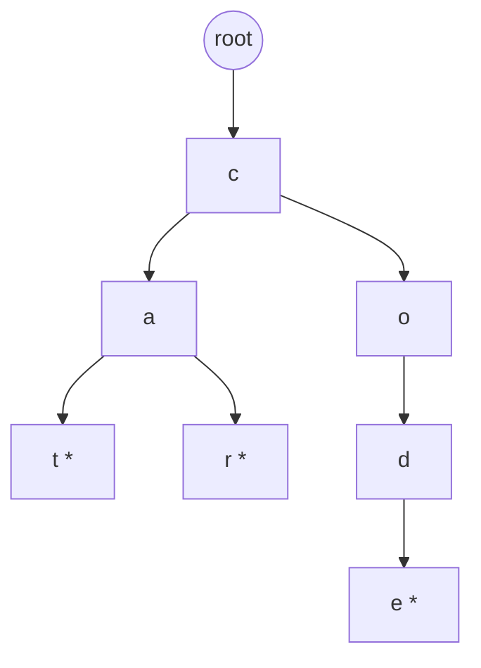
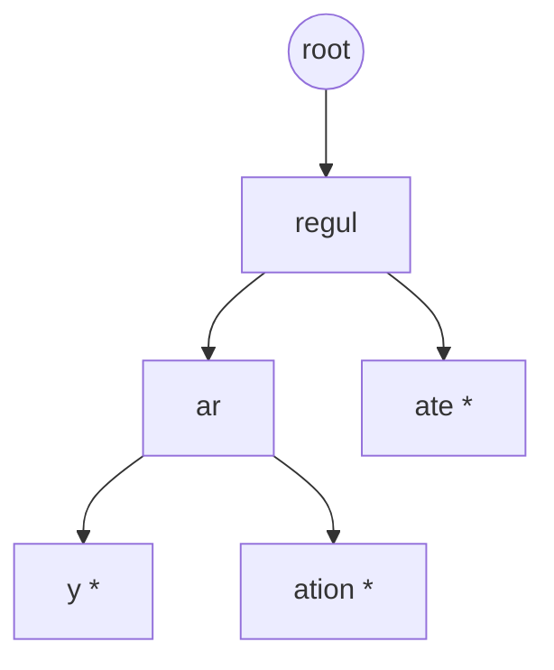
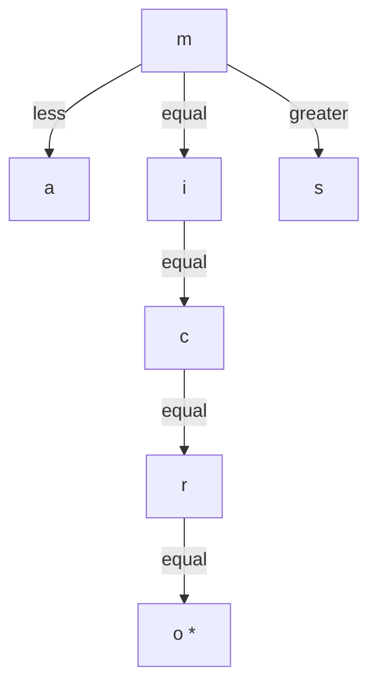
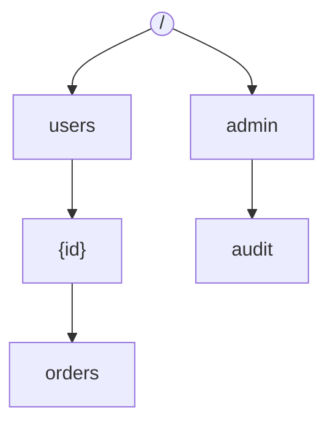
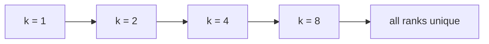

------
title: Learn Java Data Structures and Algorithms - Part 027
description: Tries, compressed tries, ternary search trees, suffix arrays, LCP arrays, autocomplete, prefix search, dictionary indexing, memory optimization, and Java string-indexing design trade-offs.
series: learn-java-dsa
seriesTitle: Learn Java Data Structures and Algorithms
order: 27
partTitle: Tries, Suffix Structures, and String Indexing
tags:
- java
- data-structures
- algorithms
- string
- trie
- suffix-array
- indexing
- autocomplete
- series
date: 2026-06-27
---

# Part 027 — Tries, Suffix Structures, and String Indexing

String problems are not just "loop over characters" problems.

At engineering scale, strings become indexes:

- prefix indexes for autocomplete;
- dictionary indexes for command routing;
- path indexes for files, URLs, and package names;
- rule indexes for policy engines;
- keyword indexes for scanning text;
- suffix indexes for substring search;
- lexicographic indexes for ranking and range queries;
- compressed indexes for memory-sensitive systems.

The core question is:

> What structure lets us avoid re-reading the same characters repeatedly?

A trie answers this for prefixes.

A suffix structure answers this for substrings.

This part focuses on indexing, not pattern matching. Pattern matching algorithms come in Part 028.

---

## 1. Kaufman Skill Target

After this part, you should be able to:

1. explain why a trie is a prefix-sharing tree;
2. implement an iterative trie in Java;
3. choose between array children, map children, compressed edges, and ternary search trees;
4. support insert, lookup, delete, prefix enumeration, and autocomplete;
5. reason about memory usage, locality, object count, and allocation pressure;
6. build a suffix array and LCP array for substring indexing;
7. distinguish trie, suffix trie, suffix tree, suffix array, suffix automaton, and inverted index;
8. handle Unicode, normalization, case folding, and tokenization caveats;
9. design a production-grade string-index API;
10. benchmark string-index choices against realistic workloads.

The deliberate-practice target is simple:

> Given a string workload, design the smallest index that preserves the needed query semantics.

---

## 2. Mental Model: Stop Thinking in Strings, Start Thinking in Paths

A string is a sequence.

A trie treats that sequence as a path.



Inserted words:

```text
cat
car
code
```

Shared prefixes are stored once:

```text
c
ca
co
cod
```

This is the whole benefit.

A hash table answers:

> Does this exact string exist?

A trie answers:

> Which strings share this prefix, and where does the prefix branch?

An ordered tree answers:

> Which strings are in sorted order?

A suffix array answers:

> Where do suffixes of this text appear lexicographically, so substring search can be binary-searched?

---

## 3. Java String Reality Check

Before building a string index, define what a "character" means.

In Java, `String` indexing APIs such as `length()` and `charAt()` operate on UTF-16 code units, not necessarily user-perceived characters.

That creates three different units:

| Unit | Java Representation | Example Concern |
|---|---|---|
| `char` / UTF-16 code unit | `charAt(i)` | supplementary characters use surrogate pairs |
| Unicode code point | `codePointAt(i)`, `codePoints()` | one logical Unicode scalar value |
| grapheme cluster | not directly modelled by `String` | what users may perceive as one character |

For DSA practice, examples often use lowercase ASCII.

For production, never silently assume that unless your domain explicitly guarantees it.

### Common String Normalization Decisions

Before indexing:

```text
raw input -> normalization -> case handling -> tokenization -> index key
```

Questions to decide:

1. Are keys case-sensitive?
2. Are accents significant?
3. Are full-width and half-width forms equivalent?
4. Are whitespace variants equivalent?
5. Are punctuation marks searchable?
6. Is the index byte-based, code-unit-based, code-point-based, or token-based?
7. Must sorting be locale-sensitive?

A production prefix index that ignores this stage will produce subtle bugs:

```text
"cafe" != "café"
"İ" lowercases differently depending on locale
"👍" may consume two UTF-16 code units
"a\u0301" may look like "á" but use different code points
```

For algorithm implementation, we will mostly use ASCII-oriented code for clarity.

For production APIs, normalize before indexing.

---

## 4. Trie Invariants

A trie node represents a prefix.

For every node:

1. The path from root to the node is the node's prefix.
2. Every descendant word starts with that prefix.
3. `terminal == true` means one inserted key ends exactly at this node.
4. The edge label from parent to child is one symbol.
5. No two outgoing edges from the same node have the same symbol.

For deletion with counts:

1. `passCount` is the number of inserted keys passing through the node.
2. `endCount` is the number of inserted keys ending at the node.
3. A node can be physically removed only when its `passCount == 0`.

---

## 5. Basic Array-Children Trie

For lowercase `a-z`, the fastest simple representation is often an array of 26 child references.

```java
import java.util.ArrayList;
import java.util.List;

public final class LowercaseTrie {
    private static final int ALPHABET = 26;

    private static final class Node {
        final Node[] next = new Node[ALPHABET];
        boolean terminal;
        int passCount;
        int endCount;
    }

    private final Node root = new Node();

    public void insert(String word) {
        requireLowercase(word);

        Node cur = root;
        cur.passCount++;

        for (int i = 0; i < word.length(); i++) {
            int idx = word.charAt(i) - 'a';
            if (cur.next[idx] == null) {
                cur.next[idx] = new Node();
            }
            cur = cur.next[idx];
            cur.passCount++;
        }

        cur.terminal = true;
        cur.endCount++;
    }

    public boolean contains(String word) {
        requireLowercase(word);

        Node node = findNode(word);
        return node != null && node.endCount > 0;
    }

    public boolean hasPrefix(String prefix) {
        requireLowercase(prefix);
        return findNode(prefix) != null;
    }

    public int countWithPrefix(String prefix) {
        requireLowercase(prefix);

        Node node = findNode(prefix);
        return node == null ? 0 : node.passCount;
    }

    public List<String> autocomplete(String prefix, int limit) {
        requireLowercase(prefix);
        if (limit < 0) {
            throw new IllegalArgumentException("limit must be non-negative");
        }

        Node node = findNode(prefix);
        List<String> result = new ArrayList<>();
        if (node == null || limit == 0) {
            return result;
        }

        StringBuilder path = new StringBuilder(prefix);
        collect(node, path, result, limit);
        return result;
    }

    public boolean deleteOne(String word) {
        requireLowercase(word);
        if (!contains(word)) {
            return false;
        }

        delete(root, word, 0);
        return true;
    }

    private boolean delete(Node node, String word, int depth) {
        node.passCount--;

        if (depth == word.length()) {
            node.endCount--;
            node.terminal = node.endCount > 0;
            return node.passCount == 0;
        }

        int idx = word.charAt(depth) - 'a';
        Node child = node.next[idx];
        boolean removeChild = delete(child, word, depth + 1);
        if (removeChild) {
            node.next[idx] = null;
        }

        return node.passCount == 0;
    }

    private Node findNode(String text) {
        Node cur = root;
        for (int i = 0; i < text.length(); i++) {
            int idx = text.charAt(i) - 'a';
            cur = cur.next[idx];
            if (cur == null) {
                return null;
            }
        }
        return cur;
    }

    private static void collect(Node node, StringBuilder path, List<String> out, int limit) {
        if (out.size() == limit) {
            return;
        }

        if (node.endCount > 0) {
            out.add(path.toString());
            if (out.size() == limit) {
                return;
            }
        }

        for (int i = 0; i < ALPHABET; i++) {
            Node child = node.next[i];
            if (child != null) {
                path.append((char) ('a' + i));
                collect(child, path, out, limit);
                path.setLength(path.length() - 1);

                if (out.size() == limit) {
                    return;
                }
            }
        }
    }

    private static void requireLowercase(String s) {
        if (s == null) {
            throw new NullPointerException("text");
        }
        for (int i = 0; i < s.length(); i++) {
            char c = s.charAt(i);
            if (c < 'a' || c > 'z') {
                throw new IllegalArgumentException("expected lowercase a-z only: " + s);
            }
        }
    }
}
```

### Complexity

Let `L` be key length and `K` be output size.

| Operation | Time | Space |
|---|---:|---:|
| insert | `O(L)` | up to `O(L)` new nodes |
| exact lookup | `O(L)` | `O(1)` |
| prefix lookup | `O(P)` | `O(1)` |
| count prefix | `O(P)` | `O(1)` |
| autocomplete | `O(P + visited nodes)` | output space |
| delete | `O(L)` | may reclaim nodes |

Important distinction:

```text
Autocomplete is not O(prefix length). It is O(prefix length + output traversal).
```

If a prefix matches one million keys, the index cannot magically return them for free.

---

## 6. Why Array Children Can Be Wasteful

Each node has `26` references.

If most nodes have only one or two children, this wastes memory.

Example:

```text
microservice
microservices
microservicing
```

Most nodes form a single chain.

An array child representation pays for all possible edges at every node.

### Child Representation Matrix

| Representation | Best For | Lookup | Memory | Notes |
|---|---|---:|---:|---|
| `Node[26]` | fixed small alphabet | `O(1)` per char | high | fastest simple ASCII trie |
| `HashMap<Character, Node>` | sparse large alphabet | expected `O(1)` | medium/high | many object allocations |
| sorted arrays of edges | static trie | `O(log d)` per char | low | good for compact immutable indexes |
| compressed trie | long common chains | edge length compare | low | good for dictionaries and paths |
| ternary search tree | sparse char set | `O(L log alphabet)` typical | medium | BST-like character branching |
| double-array trie | huge static dictionary | fast | low | complex implementation |

`d` is node degree.

---

## 7. Map-Children Trie for General Symbols

When the alphabet is not small, use a map.

For Unicode code points, avoid `Character` if you need supplementary characters; use `int` code points.

```java
import java.util.HashMap;
import java.util.Map;

public final class CodePointTrie {
    private static final class Node {
        final Map<Integer, Node> next = new HashMap<>();
        int endCount;
        int passCount;
    }

    private final Node root = new Node();

    public void insert(String text) {
        if (text == null) {
            throw new NullPointerException("text");
        }

        Node cur = root;
        cur.passCount++;

        for (int i = 0; i < text.length(); ) {
            int cp = text.codePointAt(i);
            cur = cur.next.computeIfAbsent(cp, ignored -> new Node());
            cur.passCount++;
            i += Character.charCount(cp);
        }

        cur.endCount++;
    }

    public boolean contains(String text) {
        Node node = find(text);
        return node != null && node.endCount > 0;
    }

    public int countWithPrefix(String prefix) {
        Node node = find(prefix);
        return node == null ? 0 : node.passCount;
    }

    private Node find(String text) {
        if (text == null) {
            throw new NullPointerException("text");
        }

        Node cur = root;
        for (int i = 0; i < text.length(); ) {
            int cp = text.codePointAt(i);
            cur = cur.next.get(cp);
            if (cur == null) {
                return null;
            }
            i += Character.charCount(cp);
        }
        return cur;
    }
}
```

### Trade-Off

This handles code points more correctly than `char`-based indexing.

But it is usually slower and more allocation-heavy:

- each node has a `HashMap` object;
- each edge may box an `Integer` unless optimized by escape analysis or caching;
- maps have internal tables;
- random memory access hurts locality.

For large indexes, consider specialized primitive maps or compact static structures.

---

## 8. Compressed Trie / Radix Tree

A compressed trie collapses single-child chains into edge labels.

Plain trie:

```text
r -> e -> g -> u -> l -> a -> t -> o -> r -> y
```

Compressed trie:

```text
"regulatory"
```

With branches:



Inserted words:

```text
regulatory
regulation
regulate
```

Compressed tries are common for:

- URL routing;
- filesystem paths;
- IP prefix tables;
- dictionary indexes;
- command dispatch;
- package/module name lookup.

### Core Invariant

For each node:

1. each outgoing edge has a non-empty label;
2. no two outgoing edge labels start with the same symbol;
3. a lookup compares chunks, not single characters;
4. insertion may split an edge when only a partial label matches.

### Edge Split Example

Insert `regulation`, then insert `regulatory`.

Existing edge:

```text
regulation
```

New word shares:

```text
regulat
```

Split into:

```text
regulat -> ion
        -> ory
```

### Minimal Radix Tree Insert Sketch

A full generic radix tree is longer than a learning example should be, but the insertion shape is important:

```java
private static int commonPrefixLength(String a, String b) {
    int n = Math.min(a.length(), b.length());
    int i = 0;
    while (i < n && a.charAt(i) == b.charAt(i)) {
        i++;
    }
    return i;
}
```

Insertion cases for edge label `edge` and remaining key `key`:

| Case | Meaning | Action |
|---|---|---|
| common length `0` | no edge match | try another edge |
| common length `edge.length()` and `< key.length()` | edge fully consumed | descend |
| common length `key.length()` and `< edge.length()` | key ends inside edge | split edge; mark middle terminal |
| common length `< both` | partial overlap | split edge into shared middle plus two children |
| common length equals both | exact edge | mark child terminal |

Compressed tries are harder to implement correctly but often much smaller.

---

## 9. Ternary Search Tree

A ternary search tree stores characters like a BST with three links:

```text
less, equal, greater
```

For each node character `c`:

- go left if query char `< c`;
- go middle if query char `== c`;
- go right if query char `> c`.



TSTs are useful when:

- alphabet is large;
- many trie nodes would be sparse;
- you still want prefix search;
- you want lexicographic traversal;
- memory matters more than pure lookup speed.

Basic lookup:

```java
public final class TernarySearchTree {
    private static final class Node {
        char ch;
        boolean terminal;
        Node left;
        Node mid;
        Node right;

        Node(char ch) {
            this.ch = ch;
        }
    }

    private Node root;

    public void insert(String key) {
        if (key == null || key.isEmpty()) {
            throw new IllegalArgumentException("key must be non-empty");
        }
        root = insert(root, key, 0);
    }

    public boolean contains(String key) {
        if (key == null || key.isEmpty()) {
            return false;
        }
        Node node = find(root, key, 0);
        return node != null && node.terminal;
    }

    private static Node insert(Node node, String key, int i) {
        char c = key.charAt(i);
        if (node == null) {
            node = new Node(c);
        }

        if (c < node.ch) {
            node.left = insert(node.left, key, i);
        } else if (c > node.ch) {
            node.right = insert(node.right, key, i);
        } else if (i + 1 < key.length()) {
            node.mid = insert(node.mid, key, i + 1);
        } else {
            node.terminal = true;
        }

        return node;
    }

    private static Node find(Node node, String key, int i) {
        if (node == null) {
            return null;
        }

        char c = key.charAt(i);
        if (c < node.ch) {
            return find(node.left, key, i);
        }
        if (c > node.ch) {
            return find(node.right, key, i);
        }
        if (i + 1 == key.length()) {
            return node;
        }
        return find(node.mid, key, i + 1);
    }
}
```

TST performance depends on balance of the left/right character BSTs. In production, input order can matter.

---

## 10. Autocomplete Is Ranking, Not Just Prefix Matching

A trie can find candidates.

Autocomplete needs ranking.

Common ranking signals:

- frequency;
- recency;
- personalization;
- access permissions;
- exact prefix vs fuzzy match;
- business priority;
- locale;
- deprecation/hiding rules.

Naive autocomplete:

```text
find prefix node -> DFS all descendants -> sort by score -> return top k
```

This is bad when a prefix is huge.

Better design:

```text
each node stores top K suggestions for its prefix
```

### Top-K Cache Per Trie Node

For each node, store the best `K` terminal keys under that prefix.

Insert cost becomes larger:

```text
O(L * updateTopK)
```

Query becomes cheap:

```text
O(P + K)
```

This is a common engineering trade-off:

> Move work from query time to write time.

### Cache Invariant

For every node `n`:

```text
n.topK == highest-ranked terminal keys in n's subtree, according to current ranking function
```

This invariant is easy if ranking is static.

It is harder if ranking changes dynamically.

If frequency changes on every query, you may need:

- periodic rebuilds;
- approximate counters;
- background compaction;
- external ranking service;
- top-K invalidation policy.

---

## 11. Path Routing as Trie Design

A route table is a trie over path segments, not characters.

Routes:

```text
/users/{id}
/users/{id}/orders
/admin/audit
```

Segment trie:



Here, symbols are path segments:

```text
"users", "{id}", "orders"
```

Not characters.

This avoids accidental prefix bugs:

```text
/users2 should not match /users
```

The correct abstraction is:

```text
Trie<TSymbol>
```

not always:

```text
Trie<char>
```

---

## 12. Suffix Structures: Prefix Indexing for Every Suffix

A substring of a text is a prefix of some suffix.

Text:

```text
banana
```

Suffixes:

```text
0 banana
1 anana
2 nana
3 ana
4 na
5 a
```

Substring `ana` exists because it is a prefix of suffixes starting at `1` and `3`.

This gives the key transformation:

```text
substring search -> prefix search over suffixes
```

A suffix trie inserts all suffixes into a trie.

For text length `n`, this can use `O(n^2)` space in the naive form.

A suffix tree compresses the suffix trie to `O(n)` space, but it is implementation-heavy.

A suffix array is usually a better engineering default:

```text
array of suffix start positions sorted lexicographically
```

---

## 13. Suffix Array

For `banana`, sorted suffixes are:

```text
5 a
3 ana
1 anana
0 banana
4 na
2 nana
```

Suffix array:

```text
[5, 3, 1, 0, 4, 2]
```

A substring query binary-searches suffixes.

### Suffix Array Complexity

| Construction | Time | Space | Engineering Notes |
|---|---:|---:|---|
| sort suffix strings naively | bad, often `O(n^2 log n)` or worse | high | creates many substrings/comparisons |
| comparator over indexes | `O(n^2 log n)` worst-ish | low | okay for small text |
| doubling algorithm | `O(n log n)` | `O(n)` | good learning/engineering balance |
| SA-IS/DC3 | `O(n)` | `O(n)` | advanced, harder to maintain |

### Doubling Algorithm Mental Model

Sort suffixes by first `1` char.

Then by first `2` chars.

Then by first `4` chars.

Then by first `8` chars.

At each step, a suffix rank is a pair:

```text
(rank[i], rank[i + k])
```

If two suffixes differ in the first `2k` chars, the pair reveals it.



### Java Implementation: Suffix Array Doubling

```java
import java.util.Arrays;

public final class SuffixArray {
    private final String text;
    private final int[] sa;
    private final int[] lcp;

    public SuffixArray(String text) {
        if (text == null) {
            throw new NullPointerException("text");
        }
        this.text = text;
        this.sa = buildSuffixArray(text);
        this.lcp = buildLcpArray(text, sa);
    }

    public int[] suffixArray() {
        return sa.clone();
    }

    public int[] lcpArray() {
        return lcp.clone();
    }

    public boolean contains(String pattern) {
        return firstOccurrence(pattern) >= 0;
    }

    public int firstOccurrence(String pattern) {
        if (pattern == null) {
            throw new NullPointerException("pattern");
        }

        int lo = 0;
        int hi = sa.length;

        while (lo < hi) {
            int mid = lo + ((hi - lo) >>> 1);
            int cmp = compareSuffixWithPattern(sa[mid], pattern);
            if (cmp < 0) {
                lo = mid + 1;
            } else {
                hi = mid;
            }
        }

        if (lo < sa.length && startsWith(sa[lo], pattern)) {
            return sa[lo];
        }
        return -1;
    }

    public int[] allOccurrences(String pattern) {
        if (pattern == null) {
            throw new NullPointerException("pattern");
        }

        int left = lowerBound(pattern);
        int right = upperBound(pattern);
        int[] result = new int[right - left];
        for (int i = left; i < right; i++) {
            result[i - left] = sa[i];
        }
        Arrays.sort(result);
        return result;
    }

    private int lowerBound(String pattern) {
        int lo = 0;
        int hi = sa.length;
        while (lo < hi) {
            int mid = lo + ((hi - lo) >>> 1);
            if (compareSuffixWithPattern(sa[mid], pattern) < 0) {
                lo = mid + 1;
            } else {
                hi = mid;
            }
        }
        return lo;
    }

    private int upperBound(String pattern) {
        int lo = 0;
        int hi = sa.length;
        while (lo < hi) {
            int mid = lo + ((hi - lo) >>> 1);
            if (startsWith(sa[mid], pattern) || compareSuffixWithPattern(sa[mid], pattern) <= 0) {
                lo = mid + 1;
            } else {
                hi = mid;
            }
        }
        return lo;
    }

    private boolean startsWith(int suffixStart, String pattern) {
        if (suffixStart + pattern.length() > text.length()) {
            return false;
        }
        for (int i = 0; i < pattern.length(); i++) {
            if (text.charAt(suffixStart + i) != pattern.charAt(i)) {
                return false;
            }
        }
        return true;
    }

    private int compareSuffixWithPattern(int suffixStart, String pattern) {
        int i = suffixStart;
        int j = 0;

        while (i < text.length() && j < pattern.length()) {
            char a = text.charAt(i);
            char b = pattern.charAt(j);
            if (a != b) {
                return Character.compare(a, b);
            }
            i++;
            j++;
        }

        if (j == pattern.length()) {
            return 0;
        }
        return -1;
    }

    private static int[] buildSuffixArray(String s) {
        int n = s.length();
        Integer[] order = new Integer[n];
        int[] rank = new int[n];
        int[] nextRank = new int[n];

        for (int i = 0; i < n; i++) {
            order[i] = i;
            rank[i] = s.charAt(i);
        }

        for (int k = 1; k < n; k <<= 1) {
            final int step = k;
            final int[] currentRank = rank;

            Arrays.sort(order, (a, b) -> {
                if (currentRank[a] != currentRank[b]) {
                    return Integer.compare(currentRank[a], currentRank[b]);
                }
                int ra = a + step < n ? currentRank[a + step] : -1;
                int rb = b + step < n ? currentRank[b + step] : -1;
                return Integer.compare(ra, rb);
            });

            nextRank[order[0]] = 0;
            for (int i = 1; i < n; i++) {
                int prev = order[i - 1];
                int cur = order[i];

                boolean different = rank[prev] != rank[cur];
                if (!different) {
                    int prevNext = prev + step < n ? rank[prev + step] : -1;
                    int curNext = cur + step < n ? rank[cur + step] : -1;
                    different = prevNext != curNext;
                }

                nextRank[cur] = nextRank[prev] + (different ? 1 : 0);
            }

            int[] tmp = rank;
            rank = nextRank;
            nextRank = tmp;

            if (rank[order[n - 1]] == n - 1) {
                break;
            }
        }

        int[] sa = new int[n];
        for (int i = 0; i < n; i++) {
            sa[i] = order[i];
        }
        return sa;
    }

    private static int[] buildLcpArray(String s, int[] sa) {
        int n = s.length();
        int[] rank = new int[n];
        int[] lcp = new int[Math.max(0, n - 1)];

        for (int i = 0; i < n; i++) {
            rank[sa[i]] = i;
        }

        int h = 0;
        for (int i = 0; i < n; i++) {
            int r = rank[i];
            if (r == n - 1) {
                h = 0;
                continue;
            }

            int j = sa[r + 1];
            while (i + h < n && j + h < n && s.charAt(i + h) == s.charAt(j + h)) {
                h++;
            }
            lcp[r] = h;
            if (h > 0) {
                h--;
            }
        }

        return lcp;
    }
}
```

### Important Java Note

This implementation uses `Integer[]` so it can sort with a comparator.

For very large texts, that creates boxing overhead.

A production-grade suffix array builder often uses primitive arrays and custom sorting.

For learning and moderate text sizes, this version is easier to inspect.

---

## 14. LCP Array

The LCP array stores the longest common prefix length between adjacent suffixes in suffix-array order.

For `banana`:

```text
SA:
5 a
3 ana
1 anana
0 banana
4 na
2 nana

LCP adjacent:
1 between a and ana
3 between ana and anana
0 between anana and banana
0 between banana and na
2 between na and nana
```

LCP is useful for:

- longest repeated substring;
- duplicate phrase detection;
- compression analysis;
- accelerating repeated substring queries;
- building suffix-tree-like information;
- finding common substrings between texts.

### Longest Repeated Substring

```java
public static String longestRepeatedSubstring(String s) {
    SuffixArray index = new SuffixArray(s);
    int[] sa = index.suffixArray();
    int[] lcp = index.lcpArray();

    int bestLength = 0;
    int bestStart = -1;

    for (int i = 0; i < lcp.length; i++) {
        if (lcp[i] > bestLength) {
            bestLength = lcp[i];
            bestStart = sa[i];
        }
    }

    return bestLength == 0 ? "" : s.substring(bestStart, bestStart + bestLength);
}
```

---

## 15. Suffix Array vs Inverted Index

Do not confuse substring indexing with token search.

A suffix array indexes every suffix of a single text.

An inverted index maps terms to documents.

| Query | Better Index |
|---|---|
| Does text contain substring `ana`? | suffix array / suffix automaton / KMP |
| Which documents contain term `compliance`? | inverted index |
| Autocomplete for command names | trie |
| Prefix search over user names | trie / ordered range scan |
| Find all URLs under `/admin` | segment trie |
| Search multiple patterns in a stream | Aho-Corasick |
| Fuzzy search | edit-distance automata / n-gram index / specialized engine |

For application search, suffix arrays are rarely the whole search system.

They are useful when the domain is one large text or a moderate set of known strings.

---

## 16. Suffix Automaton: Recognition Without Storing All Suffixes

A suffix automaton is a compact deterministic automaton representing all substrings of a string.

It can answer:

```text
Is pattern P a substring of text T?
```

in `O(|P|)` after `O(|T|)` construction.

It is powerful but subtle.

Core idea:

- states represent equivalence classes of substrings with the same set of ending positions;
- transitions extend substrings by one character;
- suffix links jump to the longest proper suffix state.

For this series, suffix automaton is an advanced option rather than default implementation.

Use it when:

- you need many substring membership queries;
- the text is fixed;
- memory must be near-linear;
- you can afford implementation complexity;
- substring counting or distinct substring queries matter.

Avoid it when a simple KMP/suffix array/inverted index is enough.

---

## 17. Production API Design

A string index API should expose semantics, not implementation detail.

Bad:

```java
Trie trie = new Trie();
trie.root.next[3].next[4]...
```

Better:

```java
public interface PrefixIndex<V> {
    void put(String key, V value);
    List<Entry<V>> findByPrefix(String prefix, int limit);
    boolean containsKey(String key);
    boolean remove(String key);
}
```

For suffix/substring:

```java
public interface SubstringIndex {
    boolean contains(String pattern);
    int firstOccurrence(String pattern);
    int[] allOccurrences(String pattern);
}
```

For routing:

```java
public interface RouteIndex<H> {
    void register(String routePattern, H handler);
    Match<H> match(String path);
}
```

### Engineering Constraints to Add

1. maximum key length;
2. maximum result limit;
3. normalization strategy;
4. duplicate key policy;
5. deletion semantics;
6. ranking semantics;
7. thread-safety contract;
8. snapshot/rebuild behaviour;
9. serialization format;
10. memory budget.

---

## 18. Concurrency and Mutability

Mutable trie updates are not automatically thread-safe.

Problems:

- readers may observe partially inserted paths;
- deletion may remove nodes while readers traverse them;
- top-K caches may become inconsistent;
- maps may resize under concurrent access;
- counters may be non-atomic.

Common designs:

| Design | Read Cost | Write Cost | Use Case |
|---|---:|---:|---|
| single lock | simple | blocking | low write/read volume |
| read-write lock | concurrent reads | blocked writes | moderate read-heavy workloads |
| immutable snapshot | lock-free reads | rebuild/swap | autocomplete dictionaries |
| copy-on-write path | good reads | expensive writes | small updates |
| actor/single writer | serialized writes | queue latency | stateful routing/rule indexes |
| external search engine | network call | external complexity | large-scale text search |

The most robust high-read design is often:

```text
build immutable index -> publish atomic reference -> readers use snapshot
```

```java
import java.util.concurrent.atomic.AtomicReference;

public final class PrefixIndexRegistry<V> {
    private final AtomicReference<PrefixIndex<V>> current;

    public PrefixIndexRegistry(PrefixIndex<V> initial) {
        this.current = new AtomicReference<>(initial);
    }

    public PrefixIndex<V> snapshot() {
        return current.get();
    }

    public void publish(PrefixIndex<V> next) {
        current.set(next);
    }
}
```

This avoids fine-grained locking at query time.

---

## 19. Memory Budgeting

Trie memory can explode.

For an array-children trie:

```text
nodes * childArraySize * referenceSize
```

Plus:

- node object headers;
- child array object headers;
- counters/flags;
- alignment padding;
- stored values;
- duplicated strings if values contain keys;
- maps and entry nodes if using map children.

A million short words can produce millions of nodes.

### Compression Techniques

1. path compression;
2. store terminal IDs instead of full values;
3. deduplicate input strings;
4. use integer symbol IDs;
5. use compact immutable arrays after build;
6. replace `HashMap` children with sorted arrays;
7. store top-K IDs not full suggestion objects;
8. shard by first symbol;
9. use off-heap or mmap structures for very large static dictionaries;
10. rebuild periodically instead of mutating in place.

---

## 20. Testing String Indexes

Tests must check more than happy-path lookup.

### Trie Test Cases

| Case | Expected Invariant |
|---|---|
| insert `car`, `cat` | shared prefix `ca` remains valid |
| delete `car` | `cat` remains present |
| insert duplicate | `endCount` increments or duplicate policy rejects |
| prefix equals full key | terminal and prefix semantics both work |
| empty string | explicit allowed/disallowed behaviour |
| non-ASCII input | normalization/validation behaviour explicit |
| prefix with many descendants | limit is respected |
| no prefix found | empty result, not exception |

### Suffix Array Test Cases

| Text | Query | Expected |
|---|---|---|
| `banana` | `ana` | positions `[1, 3]` |
| `banana` | `nana` | position `[2]` |
| `banana` | `apple` | none |
| `aaaaa` | `aa` | positions `[0,1,2,3]` |
| empty text | any non-empty pattern | none |
| text | empty pattern | define semantics explicitly |

---

## 21. Common Failure Modes

### 21.1 Treating `char` as User-Perceived Character

This breaks for supplementary characters and combining marks.

Fix:

- define domain constraints;
- normalize input;
- use code points when needed;
- document semantics.

### 21.2 Returning Too Many Autocomplete Results

A prefix index can still produce enormous result sets.

Fix:

- enforce `limit`;
- cache top-K;
- stream/paginate;
- rank early.

### 21.3 Recursive DFS Stack Overflow

A deep trie or path-like tree can exceed stack limits.

Fix:

- use iterative traversal for untrusted/deep data;
- compress paths;
- bound key length.

### 21.4 Deletion Removes Shared Prefix

Deleting `car` must not delete `cat`.

Fix:

- use `passCount`;
- remove only zero-pass nodes;
- test sibling preservation.

### 21.5 Suffix Array Comparator Too Slow

Naively comparing suffixes by scanning long common prefixes during sorting can be very slow.

Fix:

- use rank-doubling;
- use primitive sort for large data;
- measure with realistic repeated-prefix inputs.

### 21.6 Normalization Mismatch

Index stores normalized keys but query uses raw input, or vice versa.

Fix:

- centralize normalization;
- store strategy in the index object;
- test equivalent forms.

---

## 22. Practice Loop

### Exercise 1 — Lowercase Trie

Implement:

```java
insert(String word)
contains(String word)
hasPrefix(String prefix)
countWithPrefix(String prefix)
deleteOne(String word)
autocomplete(String prefix, int limit)
```

Validate with random tests against a `TreeMap<String, Integer>` baseline.

### Exercise 2 — Top-K Autocomplete

Extend trie nodes with cached top 5 suggestions.

Ranking:

```text
higher frequency first, then lexicographic order
```

Test that queries do not traverse the whole subtree.

### Exercise 3 — Segment Trie Router

Build a path router supporting:

```text
/users/{id}
/users/{id}/orders
/admin/audit
```

Rules:

1. exact segment beats parameter segment;
2. parameter captures value;
3. ambiguous routes are rejected at registration time.

### Exercise 4 — Suffix Array

Build suffix array and support:

```java
boolean contains(String pattern)
int[] allOccurrences(String pattern)
String longestRepeatedSubstring(String text)
```

Test on repeated-character strings like `aaaaaaaaaa`.

### Exercise 5 — Unicode Boundary

Build a small prefix index and decide:

- raw `char` indexing;
- code-point indexing;
- normalized lowercase indexing.

Document what queries should match.

---

## 23. Decision Checklist

Use this before choosing a string structure:

1. Is the query exact, prefix, substring, token, fuzzy, or regex-like?
2. Is the dataset static or mutable?
3. How many strings?
4. How long are strings?
5. What alphabet or symbol set?
6. Is Unicode correctness required?
7. Is ranking required?
8. Is deletion required?
9. Is memory the bottleneck?
10. Are queries latency-sensitive?
11. Is concurrency read-heavy or write-heavy?
12. Can the index be rebuilt offline?
13. Are results bounded?
14. Is lexicographic order required?
15. Can a standard search engine solve this better?

---

## 24. Summary

A trie is a prefix-sharing tree.

A compressed trie is a trie that avoids wasting nodes on single-child chains.

A ternary search tree trades direct child indexing for sparse alphabet support.

A suffix array turns substring search into binary search over sorted suffixes.

The deeper engineering lesson:

> String indexing is workload modelling.

Do not start with "which algorithm do I know?"

Start with:

```text
What exact query semantics do I need?
What unit is a symbol?
What is the update/query/memory budget?
What invariants must stay true under normalization, deletion, and concurrency?
```

Once those are clear, the data structure choice becomes much less mysterious.
