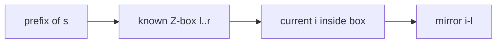
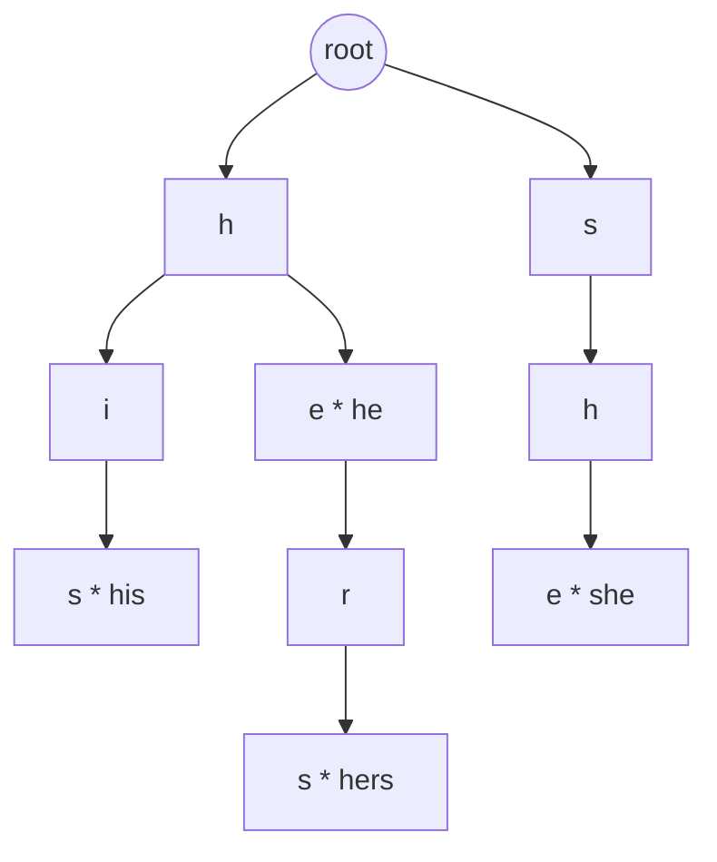
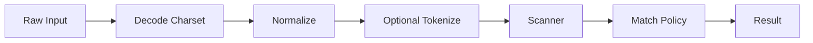

------
title: Learn Java Data Structures and Algorithms - Part 028
description: String matching algorithms including naive search, KMP, Z-algorithm, Rabin-Karp, rolling hash, Aho-Corasick, edit distance, Unicode caveats, and production-grade text scanning design in Java.
series: learn-java-dsa
seriesTitle: Learn Java Data Structures and Algorithms
order: 28
partTitle: String Matching and Text Algorithms
tags:
- java
- data-structures
- algorithms
- string
- kmp
- z-algorithm
- rabin-karp
- aho-corasick
- edit-distance
- regex
- series
date: 2026-06-27
---

# Part 028 — String Matching and Text Algorithms

Part 027 focused on string indexes.

This part focuses on scanning and matching.

The central question is:

> How do we find patterns in text without re-checking characters that we already know are redundant?

String matching appears in:

- search;
- log scanning;
- security rules;
- policy/risk keyword detection;
- command parsing;
- source-code analysis;
- autocomplete validation;
- text diffing;
- data quality checks;
- routing;
- token filtering;
- ETL validation;
- intrusion detection;
- compliance monitoring.

The beginner mistake is to memorize algorithm names.

The advanced skill is choosing the right matching model:

```text
single pattern?
many patterns?
exact or approximate?
static text or streaming text?
small or huge alphabet?
case-sensitive or normalized?
need positions or just existence?
```

---

## 1. Kaufman Skill Target

After this part, you should be able to:

1. derive why naive search can degrade to `O(nm)`;
2. implement KMP and explain the prefix-function invariant;
3. implement the Z-algorithm and use it for pattern matching;
4. implement Rabin-Karp with rolling hash and understand collision risk;
5. build Aho-Corasick for many-pattern matching;
6. implement edit distance with rolling rows;
7. explain Unicode/code-unit pitfalls in Java string matching;
8. decide when Java regex is appropriate and when it is dangerous;
9. design a text scanner with bounded memory and clear match semantics;
10. test string algorithms with adversarial inputs.

---

## 2. Matching Taxonomy

| Problem | Example | Good Tool |
|---|---|---|
| exact single pattern | find `needle` in `haystack` | KMP, Z, built-in `indexOf` |
| exact many patterns | detect any blocked keyword | Aho-Corasick |
| substring index over fixed text | many queries over one text | suffix array/automaton |
| approximate match | typo tolerance | edit distance, n-grams, BK-tree |
| token search | documents with word | inverted index |
| regular language | pattern syntax | regex/automaton |
| streaming scan | scan logs without storing all text | KMP/Aho state machine |

The most important distinction:

```text
preprocess pattern vs preprocess text vs preprocess dictionary
```

KMP preprocesses the pattern.

Suffix array preprocesses the text.

Aho-Corasick preprocesses the pattern set.

---

## 3. Java String Semantics Matter

Java `String` is immutable and represents text in UTF-16.

Indexing methods such as `charAt()` operate on UTF-16 code units. A supplementary Unicode character may occupy two `char` positions.

For algorithm learning, `charAt()` is acceptable if input is defined as ASCII or UTF-16 code-unit sequence.

For user-facing text, define semantics explicitly:

- match by code unit?
- match by code point?
- match after normalization?
- match case-insensitively?
- match by locale-sensitive comparison?
- match token-by-token?

Example hazard:

```text
"é" may be one code point or "e" + combining acute accent.
```

If the index stores one form and the query uses another, exact matching fails.

---

## 4. Naive Search

The simplest search checks every alignment.

```java
public static int naiveIndexOf(String text, String pattern) {
    if (text == null || pattern == null) {
        throw new NullPointerException();
    }
    if (pattern.isEmpty()) {
        return 0;
    }

    int n = text.length();
    int m = pattern.length();

    for (int start = 0; start <= n - m; start++) {
        int j = 0;
        while (j < m && text.charAt(start + j) == pattern.charAt(j)) {
            j++;
        }
        if (j == m) {
            return start;
        }
    }

    return -1;
}
```

Worst case:

```text
text    = aaaaaaaaaaaaaaaaaab
pattern = aaaaaab
```

Each alignment almost matches, then fails near the end.

Complexity:

```text
O(nm)
```

Naive search is still fine when:

- text is tiny;
- pattern is tiny;
- failure happens early;
- readability matters more than worst-case bound;
- the built-in method already uses optimized native/JDK internals.

But for algorithm design, naive search teaches the redundancy we need to remove.

---

## 5. KMP: Reusing Prefix Knowledge

KMP stands for Knuth-Morris-Pratt.

It avoids moving the text pointer backward.

When a mismatch occurs, KMP uses knowledge about the pattern itself:

> The longest prefix of the pattern that is also a suffix of what we just matched can remain matched.

### Example

Pattern:

```text
ababaca
```

If we matched:

```text
ababa
```

and then fail, we do not restart from scratch.

The suffix `aba` is also a prefix.

So we resume from pattern position `3`.

---

## 6. Prefix Function

For each position `i`, `pi[i]` is:

```text
length of the longest proper prefix of pattern[0..i]
that is also a suffix of pattern[0..i]
```

For:

```text
ababaca
```

Prefix function:

```text
index: 0 1 2 3 4 5 6
char:  a b a b a c a
pi:    0 0 1 2 3 0 1
```

### Prefix Function Invariant

While computing `pi[i]`, variable `j` means:

```text
pattern[0..j-1] == suffix of pattern[0..i-1]
```

If `pattern[i] == pattern[j]`, extend.

If not, shrink `j` to `pi[j - 1]`.

This is the same invariant as search-time fallback.

---

## 7. Java KMP Implementation

```java
import java.util.ArrayList;
import java.util.List;

public final class KmpMatcher {
    private final String pattern;
    private final int[] pi;

    public KmpMatcher(String pattern) {
        if (pattern == null) {
            throw new NullPointerException("pattern");
        }
        if (pattern.isEmpty()) {
            throw new IllegalArgumentException("empty pattern has ambiguous all-position semantics");
        }
        this.pattern = pattern;
        this.pi = prefixFunction(pattern);
    }

    public int firstIn(String text) {
        if (text == null) {
            throw new NullPointerException("text");
        }

        int j = 0;
        for (int i = 0; i < text.length(); i++) {
            while (j > 0 && text.charAt(i) != pattern.charAt(j)) {
                j = pi[j - 1];
            }

            if (text.charAt(i) == pattern.charAt(j)) {
                j++;
            }

            if (j == pattern.length()) {
                return i - pattern.length() + 1;
            }
        }

        return -1;
    }

    public List<Integer> allIn(String text) {
        if (text == null) {
            throw new NullPointerException("text");
        }

        List<Integer> matches = new ArrayList<>();
        int j = 0;

        for (int i = 0; i < text.length(); i++) {
            while (j > 0 && text.charAt(i) != pattern.charAt(j)) {
                j = pi[j - 1];
            }

            if (text.charAt(i) == pattern.charAt(j)) {
                j++;
            }

            if (j == pattern.length()) {
                matches.add(i - pattern.length() + 1);
                j = pi[j - 1]; // allow overlapping matches
            }
        }

        return matches;
    }

    public static int[] prefixFunction(String s) {
        int[] pi = new int[s.length()];

        for (int i = 1; i < s.length(); i++) {
            int j = pi[i - 1];

            while (j > 0 && s.charAt(i) != s.charAt(j)) {
                j = pi[j - 1];
            }

            if (s.charAt(i) == s.charAt(j)) {
                j++;
            }

            pi[i] = j;
        }

        return pi;
    }
}
```

### Complexity

| Step | Time | Space |
|---|---:|---:|
| build prefix function | `O(m)` | `O(m)` |
| search text | `O(n)` | `O(1)` extra |
| all matches | `O(n + matches)` | output |

The reason KMP is linear:

```text
text index only moves forward
pattern index falls back but total fallback work is bounded
```

---

## 8. KMP as Streaming State Machine

KMP does not require the whole text in memory.

You can keep only:

```text
pattern
prefix function
current matched length j
position counter
```

```java
public final class StreamingKmp {
    private final String pattern;
    private final int[] pi;
    private int matched;
    private long position = -1;

    public StreamingKmp(String pattern) {
        if (pattern == null || pattern.isEmpty()) {
            throw new IllegalArgumentException("pattern must be non-empty");
        }
        this.pattern = pattern;
        this.pi = KmpMatcher.prefixFunction(pattern);
    }

    public long accept(char c) {
        position++;

        while (matched > 0 && c != pattern.charAt(matched)) {
            matched = pi[matched - 1];
        }

        if (c == pattern.charAt(matched)) {
            matched++;
        }

        if (matched == pattern.length()) {
            long start = position - pattern.length() + 1;
            matched = pi[matched - 1];
            return start;
        }

        return -1;
    }
}
```

This is useful for:

- log streaming;
- network payload scanning;
- file scanning;
- line-by-line processing;
- bounded-memory pipelines.

---

## 9. Z-Algorithm

The Z-array of string `s` is:

```text
z[i] = length of longest substring starting at i that is also a prefix of s
```

For pattern matching, build:

```text
pattern + sentinel + text
```

Then positions where `z[i] == pattern.length()` are matches.

The sentinel must not appear in pattern or text.

### Z-Box Invariant

Maintain `[l, r]`, the rightmost segment known to match the prefix.

For each `i`:

- if `i > r`, match from scratch;
- if `i <= r`, reuse `z[i - l]` as much as possible;
- then extend if characters still match.



### Java Z Implementation

```java
import java.util.ArrayList;
import java.util.List;

public final class ZAlgorithm {
    public static int[] zValues(String s) {
        if (s == null) {
            throw new NullPointerException("s");
        }

        int n = s.length();
        int[] z = new int[n];
        int l = 0;
        int r = 0;

        for (int i = 1; i < n; i++) {
            if (i <= r) {
                z[i] = Math.min(r - i + 1, z[i - l]);
            }

            while (i + z[i] < n && s.charAt(z[i]) == s.charAt(i + z[i])) {
                z[i]++;
            }

            if (i + z[i] - 1 > r) {
                l = i;
                r = i + z[i] - 1;
            }
        }

        return z;
    }

    public static List<Integer> match(String text, String pattern) {
        if (text == null || pattern == null) {
            throw new NullPointerException();
        }
        if (pattern.isEmpty()) {
            throw new IllegalArgumentException("empty pattern semantics must be explicit");
        }

        char sentinel = chooseSentinel(text, pattern);
        String combined = pattern + sentinel + text;
        int[] z = zValues(combined);
        List<Integer> result = new ArrayList<>();

        int offset = pattern.length() + 1;
        for (int i = offset; i < combined.length(); i++) {
            if (z[i] >= pattern.length()) {
                result.add(i - offset);
            }
        }

        return result;
    }

    private static char chooseSentinel(String a, String b) {
        for (char c = 1; c < Character.MAX_VALUE; c++) {
            if (a.indexOf(c) < 0 && b.indexOf(c) < 0) {
                return c;
            }
        }
        throw new IllegalArgumentException("could not find sentinel character");
    }
}
```

### KMP vs Z

| Aspect | KMP | Z |
|---|---|---|
| Preprocess | pattern | combined string |
| Streaming | natural | not as natural |
| All matches | yes | yes |
| Conceptual basis | prefix-suffix fallback | prefix match from each position |
| Good for | pattern automaton | prefix analysis, borders, matching |

Both are linear.

---

## 10. Rabin-Karp and Rolling Hash

Rabin-Karp compares hashes of windows.

For pattern length `m`, compute:

```text
hash(text[i..i+m))
```

in `O(1)` per slide.

Then compare to pattern hash.

When hashes match, verify characters to avoid false positives.

### Rolling Hash Formula

For base `B` and modulus `M`:

```text
hash(s[0..m)) = s0*B^(m-1) + s1*B^(m-2) + ... + s[m-1]
```

Slide one position:

```text
remove old leading char
multiply by B
add new trailing char
```

### Java Implementation

```java
import java.util.ArrayList;
import java.util.List;

public final class RabinKarp {
    private static final long MOD = 1_000_000_007L;
    private static final long BASE = 911_382_323L;

    public static List<Integer> match(String text, String pattern) {
        if (text == null || pattern == null) {
            throw new NullPointerException();
        }
        if (pattern.isEmpty()) {
            throw new IllegalArgumentException("empty pattern semantics must be explicit");
        }

        int n = text.length();
        int m = pattern.length();
        List<Integer> result = new ArrayList<>();

        if (m > n) {
            return result;
        }

        long highPow = 1;
        for (int i = 1; i < m; i++) {
            highPow = (highPow * BASE) % MOD;
        }

        long patternHash = 0;
        long windowHash = 0;

        for (int i = 0; i < m; i++) {
            patternHash = append(patternHash, pattern.charAt(i));
            windowHash = append(windowHash, text.charAt(i));
        }

        for (int start = 0; start <= n - m; start++) {
            if (patternHash == windowHash && equalsAt(text, pattern, start)) {
                result.add(start);
            }

            if (start + m < n) {
                long leading = (text.charAt(start) * highPow) % MOD;
                windowHash = (windowHash - leading + MOD) % MOD;
                windowHash = append(windowHash, text.charAt(start + m));
            }
        }

        return result;
    }

    private static long append(long hash, char c) {
        return (hash * BASE + c) % MOD;
    }

    private static boolean equalsAt(String text, String pattern, int start) {
        for (int i = 0; i < pattern.length(); i++) {
            if (text.charAt(start + i) != pattern.charAt(i)) {
                return false;
            }
        }
        return true;
    }
}
```

### Collision Reality

A hash match does not prove string equality.

Always choose one:

1. verify characters on hash match;
2. use double hashing to reduce collision probability;
3. accept probabilistic semantics explicitly;
4. use a deterministic algorithm like KMP.

Never use naive rolling hash as a security boundary.

---

## 11. Aho-Corasick: Many Patterns at Once

Suppose you need to scan text for many patterns:

```text
he
she
his
hers
```

Running KMP once per pattern costs:

```text
O(numberOfPatterns * textLength)
```

Aho-Corasick builds a trie of patterns plus failure links.

Then scans text once.



Failure links answer:

> If the current trie path fails, what is the longest suffix of the current path that is also a trie prefix?

This is KMP generalized from one pattern to many patterns.

---

## 12. Aho-Corasick Implementation for Lowercase ASCII

```java
import java.util.ArrayDeque;
import java.util.ArrayList;
import java.util.Collections;
import java.util.List;

public final class AhoCorasick {
    private static final int ALPHABET = 26;

    private static final class Node {
        final int[] next = new int[ALPHABET];
        int fail;
        final List<Integer> output = new ArrayList<>();

        Node() {
            for (int i = 0; i < ALPHABET; i++) {
                next[i] = -1;
            }
        }
    }

    public record Match(int patternId, int start, int endExclusive) {}

    private final List<Node> nodes = new ArrayList<>();
    private final List<String> patterns = new ArrayList<>();
    private boolean built;

    public AhoCorasick() {
        nodes.add(new Node());
    }

    public int addPattern(String pattern) {
        requireLowercase(pattern);
        if (built) {
            throw new IllegalStateException("cannot add pattern after build");
        }
        if (pattern.isEmpty()) {
            throw new IllegalArgumentException("empty pattern not supported");
        }

        int id = patterns.size();
        patterns.add(pattern);

        int state = 0;
        for (int i = 0; i < pattern.length(); i++) {
            int c = pattern.charAt(i) - 'a';
            if (nodes.get(state).next[c] == -1) {
                nodes.get(state).next[c] = nodes.size();
                nodes.add(new Node());
            }
            state = nodes.get(state).next[c];
        }

        nodes.get(state).output.add(id);
        return id;
    }

    public void build() {
        ArrayDeque<Integer> queue = new ArrayDeque<>();
        Node root = nodes.get(0);

        for (int c = 0; c < ALPHABET; c++) {
            int child = root.next[c];
            if (child == -1) {
                root.next[c] = 0;
            } else {
                nodes.get(child).fail = 0;
                queue.add(child);
            }
        }

        while (!queue.isEmpty()) {
            int state = queue.removeFirst();
            Node node = nodes.get(state);

            for (int c = 0; c < ALPHABET; c++) {
                int child = node.next[c];
                if (child == -1) {
                    node.next[c] = nodes.get(node.fail).next[c];
                } else {
                    int failState = nodes.get(node.fail).next[c];
                    nodes.get(child).fail = failState;
                    nodes.get(child).output.addAll(nodes.get(failState).output);
                    queue.add(child);
                }
            }
        }

        built = true;
    }

    public List<Match> findAll(String text) {
        requireLowercase(text);
        if (!built) {
            build();
        }

        List<Match> matches = new ArrayList<>();
        int state = 0;

        for (int i = 0; i < text.length(); i++) {
            int c = text.charAt(i) - 'a';
            state = nodes.get(state).next[c];

            for (int patternId : nodes.get(state).output) {
                int len = patterns.get(patternId).length();
                matches.add(new Match(patternId, i - len + 1, i + 1));
            }
        }

        return matches;
    }

    public String pattern(int id) {
        return patterns.get(id);
    }

    public List<String> patterns() {
        return Collections.unmodifiableList(patterns);
    }

    private static void requireLowercase(String s) {
        if (s == null) {
            throw new NullPointerException("text");
        }
        for (int i = 0; i < s.length(); i++) {
            char c = s.charAt(i);
            if (c < 'a' || c > 'z') {
                throw new IllegalArgumentException("expected lowercase a-z only: " + s);
            }
        }
    }
}
```

### Complexity

Let:

- `T` = text length;
- `P` = total pattern length;
- `M` = number of matches;
- `Σ` = alphabet size.

With full transition table:

| Phase | Time | Space |
|---|---:|---:|
| build trie | `O(P)` | `O(P * Σ)` if dense transitions |
| build failure links | `O(P * Σ)` | included |
| scan | `O(T + M)` | output |

With sparse maps, build space can be closer to `O(P)`, but transitions are slower.

---

## 13. Aho-Corasick Output Policy

Real systems need explicit match policy.

Examples:

| Policy | Meaning |
|---|---|
| all matches | return every overlapping match |
| leftmost-first | first match by position |
| longest at position | choose longest pattern starting/ending here |
| non-overlapping | skip matches that overlap accepted match |
| priority-based | choose highest-priority pattern |
| category aggregation | return categories, not raw patterns |

Example:

```text
patterns: he, she, hers
text: shers
```

Possible matches:

```text
she at [0,3)
he at [1,3)
hers at [1,5)
```

Which one should a compliance scanner report?

That is a product/semantics decision, not an algorithm decision.

---

## 14. Edit Distance

Exact matching is not enough for typos.

Levenshtein distance allows:

- insertion;
- deletion;
- substitution.

`dp[i][j]` means:

```text
minimum edits to convert a[0..i) into b[0..j)
```

Transition:

```text
if a[i-1] == b[j-1]: dp[i][j] = dp[i-1][j-1]
else:
  dp[i][j] = 1 + min(
    dp[i-1][j],    // delete
    dp[i][j-1],    // insert
    dp[i-1][j-1]   // substitute
  )
```

### Rolling-Row Java Implementation

```java
public final class EditDistance {
    public static int levenshtein(String a, String b) {
        if (a == null || b == null) {
            throw new NullPointerException();
        }

        if (a.length() < b.length()) {
            return levenshtein(b, a);
        }

        int n = a.length();
        int m = b.length();
        int[] prev = new int[m + 1];
        int[] cur = new int[m + 1];

        for (int j = 0; j <= m; j++) {
            prev[j] = j;
        }

        for (int i = 1; i <= n; i++) {
            cur[0] = i;
            for (int j = 1; j <= m; j++) {
                int cost = a.charAt(i - 1) == b.charAt(j - 1) ? 0 : 1;
                cur[j] = Math.min(
                    Math.min(prev[j] + 1, cur[j - 1] + 1),
                    prev[j - 1] + cost
                );
            }

            int[] tmp = prev;
            prev = cur;
            cur = tmp;
        }

        return prev[m];
    }
}
```

Complexity:

```text
O(nm) time
O(min(n, m)) space
```

This is good for small strings.

It is not enough for searching typo-tolerant matches in millions of documents.

For that, you usually combine:

- n-gram index;
- candidate generation;
- edit-distance verification;
- threshold pruning;
- specialized search engine features.

---

## 15. Banded Edit Distance

If you only care whether distance `<= k`, you do not need the full matrix.

Only cells near the diagonal can be relevant.

```text
|i - j| <= k
```

This reduces work to roughly:

```text
O(k * min(n, m))
```

when `k` is small.

This is common in fuzzy matching:

```text
accept if edit distance <= 2
```

But it requires careful boundary handling.

---

## 16. Regex: Useful, But Not a Free Algorithm

Java regex is powerful.

It is excellent for:

- structured validation;
- token extraction;
- simple pattern syntax;
- replacement;
- small-to-moderate scanning;
- expressing regular languages compactly.

But regex can be dangerous when:

- patterns are user-supplied;
- catastrophic backtracking is possible;
- text is huge;
- latency must be tightly bounded;
- you need thousands of exact keywords;
- semantics require overlapping matches;
- you need streaming state across chunks.

Example dangerous shape:

```text
(a+)+b
```

on long input without `b`.

For many exact patterns, prefer Aho-Corasick.

For one exact pattern, prefer built-in search or KMP.

For complex token grammar, consider parser/lexer design.

---

## 17. Choosing the Right Algorithm

| Requirement | Recommended Starting Point |
|---|---|
| one exact pattern, one search | built-in `indexOf` or naive if tiny |
| one exact pattern, streaming | KMP |
| one exact pattern, need all overlaps | KMP or Z |
| many exact patterns | Aho-Corasick |
| many queries over one static text | suffix array/automaton |
| many documents, word search | inverted index |
| approximate small strings | edit distance |
| approximate large corpus | candidate index + edit distance verification |
| regular syntax | regex, with guardrails |
| security-sensitive matching | deterministic bounded algorithm |

---

## 18. Production Text Scanner Design

A production scanner needs more than an algorithm.

### Input Pipeline



### Scanner Contract

Define:

1. input encoding;
2. normalization;
3. case sensitivity;
4. punctuation handling;
5. match unit: code unit, code point, token, line;
6. overlapping match policy;
7. maximum input size;
8. maximum match count;
9. timeout/budget behaviour;
10. streaming chunk semantics;
11. error handling;
12. auditability of match reason.

Without this, two correct algorithms can produce different business outcomes.

---

## 19. Handling Chunks in Streaming Scans

Chunked input creates boundary issues.

Pattern:

```text
compliance
```

Chunks:

```text
com
pliance
```

A scanner that searches each chunk independently misses the match.

KMP and Aho-Corasick solve this by carrying automaton state across chunks.

Bad:

```java
for (String chunk : chunks) {
    if (chunk.contains(pattern)) {
        report();
    }
}
```

Better:

```java
StreamingKmp scanner = new StreamingKmp("compliance");
for (String chunk : chunks) {
    for (int i = 0; i < chunk.length(); i++) {
        long matchStart = scanner.accept(chunk.charAt(i));
        if (matchStart >= 0) {
            report(matchStart);
        }
    }
}
```

For many patterns, use streaming Aho-Corasick state.

---

## 20. Testing String Matching Algorithms

### KMP Tests

| Text | Pattern | Expected |
|---|---|---|
| `abcde` | `cd` | `[2]` |
| `aaaaa` | `aa` | `[0,1,2,3]` |
| `abababab` | `abab` | `[0,2,4]` |
| `abc` | `abcd` | `[]` |
| `abc` | `x` | `[]` |
| `mississippi` | `issi` | `[1,4]` |

### Z Tests

Validate `Z.match(text, pattern)` against KMP for random strings.

### Rabin-Karp Tests

1. verify normal matches;
2. verify overlapping matches;
3. force hash collision in a toy modulus and ensure character verification catches it;
4. test long repeated strings.

### Aho-Corasick Tests

Patterns:

```text
he, she, his, hers
```

Text:

```text
ushers
```

Expected matches:

```text
she
he
hers
```

Also test:

- duplicate pattern policy;
- prefix patterns: `a`, `ab`, `abc`;
- overlapping patterns;
- no matches;
- invalid characters;
- empty pattern rejection.

---

## 21. Adversarial Inputs

String algorithms must be tested against repeated prefixes.

Examples:

```text
text    = aaaaaaaaaaaaaaaaaaaaaaaaaaaaaab
pattern = aaaaaaaaaab
```

```text
patterns = a, aa, aaa, aaaa, aaaaa
text     = aaaaaaaaaaaaaaaaa
```

```text
regex = (a+)+b
text  = aaaaaaaaaaaaaaaaaaaaaaaaaaaaa
```

These expose:

- naive `O(nm)` behaviour;
- too many overlapping matches;
- output explosion;
- recursive backtracking problems;
- hash-collision behaviour;
- memory growth due to unbounded results.

---

## 22. Benchmarking Guidance

Do not benchmark only random strings.

Random text often makes naive algorithms look good because mismatches happen early.

Use datasets with:

1. random text;
2. repeated characters;
3. long shared prefixes;
4. no-match worst cases;
5. many small matches;
6. one huge input;
7. many chunks;
8. Unicode-heavy text if relevant;
9. realistic domain logs/documents;
10. malicious/user-supplied patterns if applicable.

Measure:

- throughput;
- allocation rate;
- p95/p99 latency;
- maximum output size;
- warmup sensitivity;
- GC pressure;
- construction time;
- memory footprint.

---

## 23. Correctness Reasoning Cheat Sheet

### KMP

Invariant:

```text
j is the length of the longest pattern prefix matching a suffix of text processed so far
```

Fallback preserves correctness because shorter candidate prefixes are exactly encoded by `pi`.

### Z

Invariant:

```text
[l, r] is the rightmost segment known to equal the prefix
```

Reusing `z[i-l]` is safe inside the box, but extension beyond `r` must compare explicitly.

### Rabin-Karp

Invariant:

```text
windowHash equals polynomial hash of current text window
```

Correctness of match result requires character verification or probabilistic acceptance.

### Aho-Corasick

Invariant:

```text
state is the longest trie prefix that is also a suffix of text processed so far
```

Failure links preserve all suffix candidates after mismatch.

### Edit Distance

Invariant:

```text
dp[i][j] is optimal edit cost for prefixes a[0..i), b[0..j)
```

The recurrence is complete because the last edit must be insert, delete, substitute, or no-op.

---

## 24. Common Failure Modes

### 24.1 Empty Pattern Ambiguity

An empty pattern can match every position.

For APIs, define it explicitly:

- reject;
- return `0` for first match;
- return all positions;
- treat as no-op.

### 24.2 Missing Overlapping Matches

After finding a KMP match, fallback must be:

```java
j = pi[j - 1];
```

not:

```java
j = 0;
```

unless overlapping matches are intentionally ignored.

### 24.3 Sentinel Collision in Z Matching

If sentinel appears in input, pattern/text boundary can be crossed incorrectly.

Fix:

- choose sentinel absent from both;
- use array with separator outside alphabet;
- avoid sentinel method and adapt algorithm.

### 24.4 Rabin-Karp Without Verification

Hash equality is not string equality.

Fix:

- verify characters;
- use deterministic matching if correctness must be absolute.

### 24.5 Regex Catastrophic Backtracking

A regex can be syntactically valid but operationally dangerous.

Fix:

- constrain allowed regex features;
- precompile patterns;
- use timeouts at execution boundary where possible;
- prefer deterministic scanners for exact keyword sets.

### 24.6 Unicode Normalization Bugs

The scanner may miss visually identical text.

Fix:

- normalize both patterns and text;
- document locale/case policy;
- preserve raw offsets separately if audit reporting requires original positions.

### 24.7 Output Explosion

Many exact patterns can match at the same position.

Fix:

- cap result count;
- aggregate categories;
- stop at first match if semantics allow;
- stream results to consumer;
- expose truncation flag.

---

## 25. Practice Loop

### Exercise 1 — KMP from Scratch

Implement:

```java
int[] prefixFunction(String pattern)
int firstMatch(String text, String pattern)
List<Integer> allMatches(String text, String pattern)
```

Then test against `String.indexOf` for first match and a naive implementation for all matches.

### Exercise 2 — Streaming KMP

Scan text split into random chunks.

Validate that results equal scanning the full string.

### Exercise 3 — Z-Algorithm

Implement `zValues` and use it for pattern matching.

Compare output with KMP on random test cases.

### Exercise 4 — Rabin-Karp Collision Safety

Use a tiny modulus like `101` in a test-only implementation.

Find inputs with hash collisions.

Ensure verification prevents false positives.

### Exercise 5 — Aho-Corasick Rule Scanner

Build a scanner for a list of blocked terms.

Add policies:

1. all matches;
2. longest match per start position;
3. first match only;
4. category aggregation.

### Exercise 6 — Edit Distance Filter

Given candidate names, return names within edit distance `<= 2` from a query.

Then add a length prefilter:

```text
abs(candidate.length - query.length) <= 2
```

Measure improvement.

---

## 26. Interview vs Production Framing

Interview framing:

```text
Implement KMP.
```

Production framing:

```text
We need to scan user-submitted reports for 20,000 regulated terms, case-insensitively, under 30 ms p95, preserving audit offsets and avoiding regex DoS.
```

The production answer is not simply "KMP".

It may require:

- normalization pipeline;
- Aho-Corasick dictionary;
- deterministic match policy;
- immutable scanner snapshots;
- result cap;
- audit mapping from normalized offsets to raw offsets;
- benchmark suite;
- safe update/rebuild path;
- observability.

This is the level of modelling expected from top engineers.

---

## 27. Summary

KMP is a single-pattern automaton built from prefix-suffix structure.

The Z-algorithm computes prefix matches from every position and can also solve exact matching.

Rabin-Karp uses rolling hashes; it is powerful but needs collision handling.

Aho-Corasick generalizes prefix fallback to many patterns.

Edit distance handles approximate matching but is expensive without candidate reduction.

Regex is useful, but not a substitute for algorithmic cost modelling.

The core engineering rule:

> Text matching is not only about finding characters. It is about defining match semantics, bounding worst-case work, and preserving correctness under real input.
