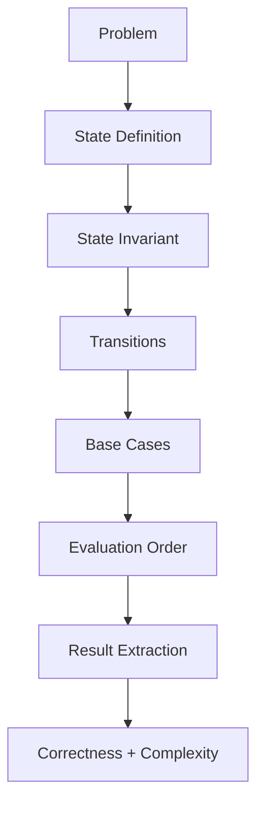
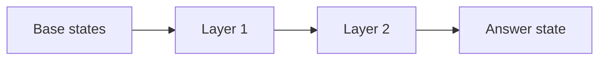
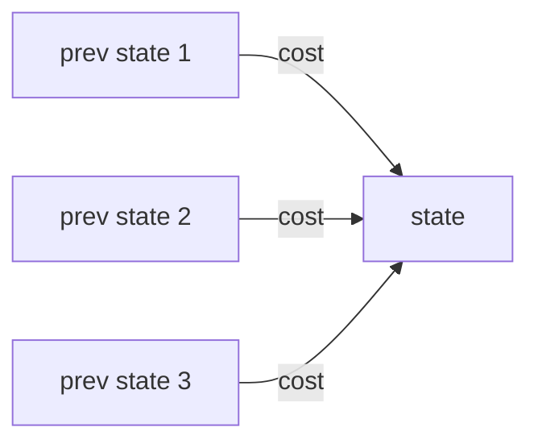
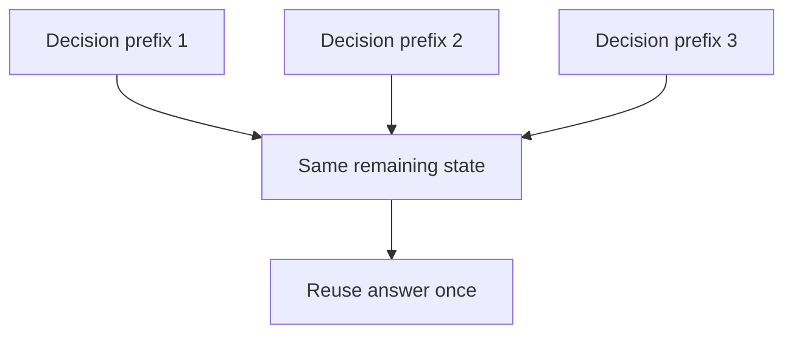

------
title: Learn Java Data Structures and Algorithms - Part 029
description: Dynamic programming as state-machine design in Java: states, transitions, base cases, memoization, tabulation, DAG interpretation, recurrence validation, reconstruction, and production-grade correctness checks.
series: learn-java-dsa
seriesTitle: Learn Java Data Structures and Algorithms
order: 29
partTitle: Dynamic Programming as State Machine Design
tags:
- java
- data-structures
- algorithms
- dynamic-programming
- state-machine
- memoization
- tabulation
- recurrence
- series
date: 2026-06-27
---

# Part 029 — Dynamic Programming as State Machine Design

Dynamic Programming is often taught as a catalogue of patterns:

- Fibonacci;
- knapsack;
- longest common subsequence;
- coin change;
- grid path;
- interval DP;
- tree DP;
- bitmask DP.

That is useful, but not enough.

For advanced engineering, DP should be understood as **state-machine design over an acyclic dependency graph**.

A DP solution is not a magic recurrence. It is a compact way to answer:

> What is the minimum sufficient state needed to make a locally correct transition, while avoiding recomputation?

This part builds the mental model used by every DP variant in Part 030.

---

## 1. Kaufman Skill Target

After this part, you should be able to:

1. identify whether a problem has overlapping subproblems and optimal substructure;
2. model DP as a state graph;
3. define state variables with minimal sufficient information;
4. write valid transitions from a state invariant;
5. choose memoization or tabulation deliberately;
6. reason about base cases without guessing;
7. reconstruct the chosen solution, not only the score;
8. reduce memory when dependencies are local;
9. detect invalid DP caused by missing state;
10. write Java implementations that avoid object explosion, stack overflow, and hidden quadratic memory.

---

## 2. DP Is Not “Recursion + Cache”

A recursive cache is only one implementation strategy.

The deeper model is this:



A DP state represents a **subproblem answer**.

A transition represents a **legal move** between subproblems.

The dependency relation must be acyclic, or at least reducible to a known fixed-point problem. Most classic DP is acyclic.

```mermaid
flowchart LR
    A[dp[0]] --> B[dp[1]]
    B --> C[dp[2]]
    C --> D[dp[3]]
    D --> E[dp[n]]
```

For multidimensional DP:

```mermaid
flowchart TD
    S00[dp[i-1][j-1]] --> S11[dp[i][j]]
    S10[dp[i-1][j]] --> S11
    S01[dp[i][j-1]] --> S11
```

The recurrence is just a compressed description of this graph.

---

## 3. When DP Applies

DP usually applies when two conditions hold.

### 3.1 Overlapping Subproblems

The same subproblem is reached through multiple paths.

Example: Fibonacci.

```text
fib(5)
├── fib(4)
│   ├── fib(3)
│   └── fib(2)
└── fib(3)
```

`fib(3)` appears repeatedly.

Caching saves work.

### 3.2 Optimal Substructure

The optimal answer for the whole problem can be composed from optimal answers of smaller subproblems.

Example: shortest path on a DAG.

If the shortest path to `v` goes through `u`, then the prefix path to `u` must also be shortest. Otherwise we could replace it and improve the result.

### 3.3 Hidden Third Condition: State Completeness

A common failure:

> The problem seems DP-compatible, but the chosen state forgets information needed for future decisions.

Example:

```text
Can we maximize profit by choosing jobs?
```

If jobs conflict by time, a state like `dp[k] = best profit after k jobs considered` may be insufficient unless jobs are sorted and the previous compatible job is encoded through binary search.

State completeness means:

> Given the state, future transitions do not need any information from the past except the value stored in that state.

This is the Markov property of DP.

---

## 4. The DP Design Loop

Use this loop before writing code.

```text
1. What decision is being made?
2. What information affects legal future decisions?
3. What is the smallest state that preserves that information?
4. What is the invariant of dp[state]?
5. From which smaller states can this state be computed?
6. What states have known answers without transition?
7. What evaluation order respects dependencies?
8. What answer do we extract?
9. Can memory be reduced?
10. How do we reconstruct the actual choices?
```

The invariant is the anchor.

Without a state invariant, the recurrence is guesswork.

---

## 5. Memoization vs Tabulation

Both compute the same state graph.

They differ in traversal.

### 5.1 Memoization

Memoization is top-down demand-driven traversal.

```mermaid
flowchart TD
    Query[Need answer dp[state]] --> Cache{Cached?}
    Cache -- yes --> Return[Return stored value]
    Cache -- no --> Compute[Compute dependencies]
    Compute --> Store[Store result]
    Store --> Return
```

Use memoization when:

- not all states are reachable;
- recursive formulation is clearer;
- the state space is sparse;
- transitions are irregular;
- you want to prototype quickly.

Risk:

- recursion depth;
- boxed keys and `HashMap` overhead;
- accidental exponential recursion if cache key is wrong;
- difficult iteration order for reconstruction.

### 5.2 Tabulation

Tabulation is bottom-up scheduled evaluation.



Use tabulation when:

- state space is dense;
- dependency order is obvious;
- primitive arrays fit;
- memory layout matters;
- you need predictable performance.

Risk:

- filling unreachable states;
- wrong loop order;
- off-by-one errors;
- harder initial formulation.

### 5.3 Engineering Rule

For production Java DSA:

```text
Start top-down to validate the state.
Move bottom-up when performance and memory layout matter.
```

---

## 6. Example 1 — Fibonacci as a Dependency Graph

Fibonacci is too simple to be useful algorithmically, but it reveals the mechanics.

State:

```text
dp[i] = i-th Fibonacci number
```

Invariant:

```text
dp[i] stores the exact Fibonacci value for index i.
```

Transition:

```text
dp[i] = dp[i - 1] + dp[i - 2]
```

Base:

```text
dp[0] = 0
dp[1] = 1
```

Java:

```java
public final class FibonacciDp {
    public static long fib(int n) {
        if (n < 0) {
            throw new IllegalArgumentException("n must be non-negative");
        }
        if (n <= 1) {
            return n;
        }

        long prev2 = 0;
        long prev1 = 1;

        for (int i = 2; i <= n; i++) {
            long cur = Math.addExact(prev1, prev2);
            prev2 = prev1;
            prev1 = cur;
        }

        return prev1;
    }
}
```

The important lesson is not Fibonacci.

The important lesson is that memory depends only on the last two states, so a full array is unnecessary unless we need reconstruction or all intermediate values.

---

## 7. Example 2 — Climbing Stairs as Counting Paths in a DAG

Problem:

```text
You can climb 1 or 2 steps at a time.
How many ways are there to reach step n?
```

State:

```text
dp[i] = number of ways to reach step i
```

Transition:

```text
dp[i] = dp[i - 1] + dp[i - 2]
```

Base:

```text
dp[0] = 1
```

Why `dp[0] = 1`?

Because there is one way to be at the starting position: take no steps.

This is a good example of base cases being semantic, not decorative.

```java
public static long countWays(int n) {
    if (n < 0) {
        return 0;
    }
    long[] dp = new long[n + 1];
    dp[0] = 1;

    for (int i = 1; i <= n; i++) {
        dp[i] += dp[i - 1];
        if (i >= 2) {
            dp[i] += dp[i - 2];
        }
    }

    return dp[n];
}
```

Alternative transition style:

```java
public static long countWaysForward(int n) {
    long[] dp = new long[n + 1];
    dp[0] = 1;

    for (int i = 0; i <= n; i++) {
        if (i + 1 <= n) dp[i + 1] += dp[i];
        if (i + 2 <= n) dp[i + 2] += dp[i];
    }

    return dp[n];
}
```

Backward transitions answer:

```text
What smaller states can compute me?
```

Forward transitions answer:

```text
Where can I go from here?
```

Both are valid if the invariant is preserved.

---

## 8. Example 3 — Minimum Cost Path in a Grid

Problem:

```text
Given a grid of non-negative costs.
Start at top-left.
Move only right or down.
Find the minimum cost to bottom-right.
```

State:

```text
dp[r][c] = minimum cost to reach cell (r, c)
```

Transition:

```text
dp[r][c] = cost[r][c] + min(dp[r - 1][c], dp[r][c - 1])
```

Base:

```text
dp[0][0] = cost[0][0]
```

Dependency graph:

```mermaid
flowchart TD
    A[dp[r-1][c]] --> X[dp[r][c]]
    B[dp[r][c-1]] --> X
```

Implementation:

```java
public final class MinCostGrid {
    private static final long INF = Long.MAX_VALUE / 4;

    public static long minCost(int[][] cost) {
        int rows = cost.length;
        if (rows == 0) return 0;
        int cols = cost[0].length;
        if (cols == 0) return 0;

        long[][] dp = new long[rows][cols];

        for (int r = 0; r < rows; r++) {
            for (int c = 0; c < cols; c++) {
                if (r == 0 && c == 0) {
                    dp[r][c] = cost[r][c];
                    continue;
                }

                long bestPrev = INF;
                if (r > 0) bestPrev = Math.min(bestPrev, dp[r - 1][c]);
                if (c > 0) bestPrev = Math.min(bestPrev, dp[r][c - 1]);

                dp[r][c] = bestPrev + cost[r][c];
            }
        }

        return dp[rows - 1][cols - 1];
    }
}
```

### Memory Compression

The current row depends only on:

- previous row same column;
- current row previous column.

So one array is enough.

```java
public static long minCostCompressed(int[][] cost) {
    int rows = cost.length;
    if (rows == 0) return 0;
    int cols = cost[0].length;
    if (cols == 0) return 0;

    long[] dp = new long[cols];

    for (int r = 0; r < rows; r++) {
        for (int c = 0; c < cols; c++) {
            if (r == 0 && c == 0) {
                dp[c] = cost[r][c];
            } else if (r == 0) {
                dp[c] = dp[c - 1] + cost[r][c];
            } else if (c == 0) {
                dp[c] = dp[c] + cost[r][c];
            } else {
                dp[c] = Math.min(dp[c], dp[c - 1]) + cost[r][c];
            }
        }
    }

    return dp[cols - 1];
}
```

Compression rule:

> A DP dimension can be compressed only if overwritten values are no longer needed by future transitions.

Loop order becomes part of correctness.

---

## 9. Example 4 — 0/1 Knapsack

Problem:

```text
Given items with weight and value.
Each item can be chosen at most once.
Maximize value with capacity W.
```

State:

```text
dp[i][w] = max value using first i items with capacity w
```

Transition:

```text
skip item i: dp[i - 1][w]
take item i: dp[i - 1][w - weight[i]] + value[i]
```

Invariant:

```text
dp[i][w] is the best value achievable using only items in range [0, i).
```

Implementation:

```java
public final class Knapsack01 {
    public static long maxValue(int[] weight, int[] value, int capacity) {
        if (weight.length != value.length) {
            throw new IllegalArgumentException("weight/value length mismatch");
        }
        int n = weight.length;
        long[][] dp = new long[n + 1][capacity + 1];

        for (int i = 1; i <= n; i++) {
            int wi = weight[i - 1];
            int vi = value[i - 1];

            for (int w = 0; w <= capacity; w++) {
                long best = dp[i - 1][w];
                if (w >= wi) {
                    best = Math.max(best, dp[i - 1][w - wi] + vi);
                }
                dp[i][w] = best;
            }
        }

        return dp[n][capacity];
    }
}
```

### Space Compression for 0/1 Knapsack

Because each item can be used once, capacity must iterate descending.

```java
public static long maxValueCompressed(int[] weight, int[] value, int capacity) {
    if (weight.length != value.length) {
        throw new IllegalArgumentException("weight/value length mismatch");
    }

    long[] dp = new long[capacity + 1];

    for (int i = 0; i < weight.length; i++) {
        int wi = weight[i];
        int vi = value[i];

        for (int w = capacity; w >= wi; w--) {
            dp[w] = Math.max(dp[w], dp[w - wi] + vi);
        }
    }

    return dp[capacity];
}
```

Why descending?

Because ascending would allow the same item to be reused in the same iteration.

```text
0/1 knapsack: descending capacity
unbounded knapsack: ascending capacity
```

This is not a template rule. It follows from the state invariant.

---

## 10. Example 5 — Coin Change

There are multiple coin-change problems.

Do not mix them.

### 10.1 Minimum Number of Coins

Problem:

```text
Given coin denominations.
Find the minimum number of coins needed to make amount A.
Coins can be reused.
```

State:

```text
dp[a] = minimum number of coins to make amount a
```

Transition:

```text
dp[a] = min(dp[a - coin] + 1)
```

Implementation:

```java
public static int minCoins(int[] coins, int amount) {
    final int INF = amount + 1;
    int[] dp = new int[amount + 1];
    java.util.Arrays.fill(dp, INF);
    dp[0] = 0;

    for (int a = 1; a <= amount; a++) {
        for (int coin : coins) {
            if (a >= coin && dp[a - coin] != INF) {
                dp[a] = Math.min(dp[a], dp[a - coin] + 1);
            }
        }
    }

    return dp[amount] == INF ? -1 : dp[amount];
}
```

### 10.2 Number of Combinations

Problem:

```text
How many combinations make amount A?
Order does not matter.
```

State:

```text
dp[a] = number of combinations to make amount a using processed coin types
```

Loop order matters:

```java
public static long countCombinations(int[] coins, int amount) {
    long[] dp = new long[amount + 1];
    dp[0] = 1;

    for (int coin : coins) {
        for (int a = coin; a <= amount; a++) {
            dp[a] += dp[a - coin];
        }
    }

    return dp[amount];
}
```

### 10.3 Number of Permutations

Problem:

```text
How many ordered sequences make amount A?
```

Loop order changes:

```java
public static long countPermutations(int[] coins, int amount) {
    long[] dp = new long[amount + 1];
    dp[0] = 1;

    for (int a = 1; a <= amount; a++) {
        for (int coin : coins) {
            if (a >= coin) {
                dp[a] += dp[a - coin];
            }
        }
    }

    return dp[amount];
}
```

Same coins. Same amount. Different problem semantics.

That is why DP is state design, not pattern matching.

---

## 11. Example 6 — Longest Common Subsequence

Problem:

```text
Given strings a and b.
Find the length of the longest sequence that appears in both, not necessarily contiguously.
```

State:

```text
dp[i][j] = LCS length between a[0, i) and b[0, j)
```

Transition:

```text
if a[i - 1] == b[j - 1]:
    dp[i][j] = dp[i - 1][j - 1] + 1
else:
    dp[i][j] = max(dp[i - 1][j], dp[i][j - 1])
```

Implementation:

```java
public final class Lcs {
    public static int length(String a, String b) {
        int n = a.length();
        int m = b.length();
        int[][] dp = new int[n + 1][m + 1];

        for (int i = 1; i <= n; i++) {
            char ca = a.charAt(i - 1);
            for (int j = 1; j <= m; j++) {
                char cb = b.charAt(j - 1);
                if (ca == cb) {
                    dp[i][j] = dp[i - 1][j - 1] + 1;
                } else {
                    dp[i][j] = Math.max(dp[i - 1][j], dp[i][j - 1]);
                }
            }
        }

        return dp[n][m];
    }
}
```

### Reconstructing the LCS

Length is not always enough.

Many production workflows need the actual chosen sequence, decision path, or explanation.

```java
public static String reconstruct(String a, String b) {
    int n = a.length();
    int m = b.length();
    int[][] dp = new int[n + 1][m + 1];

    for (int i = 1; i <= n; i++) {
        for (int j = 1; j <= m; j++) {
            if (a.charAt(i - 1) == b.charAt(j - 1)) {
                dp[i][j] = dp[i - 1][j - 1] + 1;
            } else {
                dp[i][j] = Math.max(dp[i - 1][j], dp[i][j - 1]);
            }
        }
    }

    StringBuilder rev = new StringBuilder();
    int i = n;
    int j = m;

    while (i > 0 && j > 0) {
        if (a.charAt(i - 1) == b.charAt(j - 1)) {
            rev.append(a.charAt(i - 1));
            i--;
            j--;
        } else if (dp[i - 1][j] >= dp[i][j - 1]) {
            i--;
        } else {
            j--;
        }
    }

    return rev.reverse().toString();
}
```

Tie-breaking matters.

If multiple optimal answers exist, your reconstruction policy should be deterministic.

---

## 12. DP as Shortest Path on a DAG

Many DP problems are shortest or longest path problems on an implicit DAG.

For a recurrence:

```text
dp[state] = min(dp[prev] + cost(prev -> state))
```

You can draw:



Then DP is just relaxing edges in topological order.

This mental model connects:

- grid DP;
- edit distance;
- segmentation;
- word break;
- interval scheduling;
- shortest path on DAG;
- parsing;
- sequence alignment.

When a problem feels confusing, ask:

```text
What are the nodes?
What are the edges?
What is the topological order?
What path property am I optimizing?
```

---

## 13. Example 7 — Word Break as Graph Reachability

Problem:

```text
Given string s and dictionary dict.
Can s be segmented into dictionary words?
```

Naive view:

```text
dp[i] = whether s[0, i) can be segmented
```

Transition:

```text
dp[i] = true if exists j < i such that dp[j] && s[j, i) in dict
```

Graph view:

```text
index j -> index i if s[j, i) is a word
```

Then word break is reachability from `0` to `n`.

Implementation:

```java
public static boolean wordBreak(String s, java.util.Set<String> dict) {
    int n = s.length();
    boolean[] dp = new boolean[n + 1];
    dp[0] = true;

    int maxLen = 0;
    for (String word : dict) {
        maxLen = Math.max(maxLen, word.length());
    }

    for (int i = 1; i <= n; i++) {
        int start = Math.max(0, i - maxLen);
        for (int j = start; j < i; j++) {
            if (dp[j] && dict.contains(s.substring(j, i))) {
                dp[i] = true;
                break;
            }
        }
    }

    return dp[n];
}
```

Engineering caveat:

`substring` creates new strings in modern Java. For large workloads, this can allocate heavily.

Options:

- use a trie;
- use rolling hash with collision handling;
- group dictionary words by length;
- scan from reachable positions instead of checking all endings.

---

## 14. Example 8 — Edit Distance

Problem:

```text
Given strings a and b.
Minimum edits to transform a into b.
Allowed operations: insert, delete, replace.
```

State:

```text
dp[i][j] = edit distance between a[0, i) and b[0, j)
```

Base:

```text
dp[i][0] = i
dp[0][j] = j
```

Transition:

```text
if a[i - 1] == b[j - 1]:
    dp[i][j] = dp[i - 1][j - 1]
else:
    dp[i][j] = 1 + min(
        dp[i - 1][j],     delete
        dp[i][j - 1],     insert
        dp[i - 1][j - 1]  replace
    )
```

Implementation with rolling rows:

```java
public static int editDistance(String a, String b) {
    int n = a.length();
    int m = b.length();

    int[] prev = new int[m + 1];
    int[] cur = new int[m + 1];

    for (int j = 0; j <= m; j++) {
        prev[j] = j;
    }

    for (int i = 1; i <= n; i++) {
        cur[0] = i;
        for (int j = 1; j <= m; j++) {
            if (a.charAt(i - 1) == b.charAt(j - 1)) {
                cur[j] = prev[j - 1];
            } else {
                cur[j] = 1 + Math.min(
                    Math.min(prev[j], cur[j - 1]),
                    prev[j - 1]
                );
            }
        }
        int[] tmp = prev;
        prev = cur;
        cur = tmp;
    }

    return prev[m];
}
```

This recurrence is a grid shortest-path problem.

```mermaid
flowchart TD
    D[delete: dp[i-1][j]] --> X[dp[i][j]]
    I[insert: dp[i][j-1]] --> X
    R[replace/match: dp[i-1][j-1]] --> X
```

---

## 15. DP Correctness Reasoning

A DP proof usually has three parts.

### 15.1 State Invariant

Example:

```text
dp[i][w] is the best value achievable using first i items and capacity w.
```

This must be precise.

Vague invariant:

```text
dp is the best answer so far.
```

That is not enough.

### 15.2 Transition Completeness

Show every valid optimal solution is considered.

For 0/1 knapsack:

Any optimal solution either:

- does not include item `i - 1`; or
- includes item `i - 1`.

No third case exists.

### 15.3 Transition Soundness

Show every candidate transition produces a legal solution.

For 0/1 knapsack:

If we take item `i - 1`, we only use `dp[i - 1][w - wi]`, so item `i - 1` is not reused.

This soundness would fail if we used the current row incorrectly.

---

## 16. Base Cases Are Boundary Contracts

Base cases should be derived from the state invariant.

Examples:

| Problem | State | Base |
|---|---|---|
| LCS | `dp[i][j]` for prefixes | `dp[0][j] = dp[i][0] = 0` |
| Edit distance | distance between prefixes | `dp[i][0] = i`, `dp[0][j] = j` |
| Coin combinations | ways to make amount | `dp[0] = 1` |
| Min path grid | min cost to reach cell | `dp[0][0] = cost[0][0]` |
| Reachability | whether state can be reached | start state is `true` |

Bad base cases often create answers that are off by one but pass many tests.

Test empty input deliberately.

---

## 17. Java Implementation Choices

### 17.1 Primitive Arrays First

Prefer:

```java
long[] dp;
int[][] table;
boolean[] reachable;
```

Avoid for dense DP:

```java
Map<State, Long> dp;
```

unless the state space is sparse.

Object-per-state DP can destroy performance due to:

- allocation;
- GC pressure;
- pointer chasing;
- hash overhead;
- poor locality.

### 17.2 Sparse State with Encoded Keys

For sparse memoization, encode state into primitive keys when possible.

```java
static long key(int i, int j) {
    return (((long) i) << 32) ^ (j & 0xffffffffL);
}
```

Then use:

```java
Map<Long, Integer> memo = new HashMap<>();
```

This still boxes `Long` and `Integer`, but it avoids custom object keys.

For high-performance cases, specialized primitive collections may be needed, but then you must account for library constraints and deployment policy.

### 17.3 Sentinel Values

For minimization:

```java
static final long INF = Long.MAX_VALUE / 4;
```

Avoid:

```java
Long.MAX_VALUE + cost
```

It overflows.

### 17.4 Overflow Policy

Counting DP often overflows `long`.

Define policy:

- exact with `BigInteger`;
- modulo arithmetic;
- saturating arithmetic;
- fail fast with `Math.addExact`;
- domain cap.

Do not silently overflow unless the problem explicitly says modulo arithmetic.

---

## 18. Reconstruction Patterns

DP often computes a score.

Systems often need an explanation.

### 18.1 Store Parent Pointer

```java
record Parent(int prevI, int prevJ, String action) {}
```

For dense tables, object parent pointers are expensive. Use compact arrays.

```java
byte[][] choice = new byte[n + 1][m + 1];
```

Where:

```text
0 = none
1 = diagonal
2 = up
3 = left
```

### 18.2 Recompute During Backtracking

If memory matters, store only DP values and infer choices while walking backward.

This works when transitions are deterministic from DP values.

### 18.3 Deterministic Tie-Breaking

When equal candidates exist, define order.

Example:

```text
prefer fewer items
then smaller lexicographic path
then earlier input order
```

Without tie-breaking, tests become flaky and explanations vary.

---

## 19. Common DP Failure Modes

### 19.1 Missing State

Symptom:

```text
The recurrence passes small cases but fails when future legality depends on forgotten history.
```

Fix:

Add the missing variable or reformulate the problem.

### 19.2 Wrong Loop Order

Common in compressed DP.

```java
// Wrong for 0/1 knapsack; reuses same item.
for (int w = wi; w <= capacity; w++) {
    dp[w] = Math.max(dp[w], dp[w - wi] + vi);
}
```

### 19.3 Boundary Drift

Using inclusive and exclusive ranges inconsistently.

Prefer prefix states:

```text
dp[i] means first i items, range [0, i)
```

This reduces off-by-one errors.

### 19.4 State Explosion

A state like:

```text
dp[index][remaining][usedMask][last][phase]
```

may be correct but too large.

State count is part of design.

### 19.5 Recursion Depth

Java does not optimize tail calls.

Deep top-down DP can cause `StackOverflowError`.

Use iterative evaluation for deep linear dependencies.

### 19.6 Accidental Object Explosion

This is common:

```java
record State(int i, int j, int k) {}
Map<State, Long> memo = new HashMap<>();
```

For millions of states, this becomes allocation-heavy.

Use arrays or encoded primitive keys when feasible.

---

## 20. DP Testing Strategy

### 20.1 Brute Force Oracle

For small `n`, write a brute-force solver.

Then compare random cases.

```java
static void randomizedCheck() {
    java.util.Random rnd = new java.util.Random(1);

    for (int t = 0; t < 10_000; t++) {
        int n = rnd.nextInt(10);
        int capacity = rnd.nextInt(20);
        int[] w = new int[n];
        int[] v = new int[n];

        for (int i = 0; i < n; i++) {
            w[i] = 1 + rnd.nextInt(8);
            v[i] = rnd.nextInt(30);
        }

        long expected = bruteForceKnapsack(w, v, capacity);
        long actual = Knapsack01.maxValueCompressed(w, v, capacity);

        if (expected != actual) {
            throw new AssertionError("expected " + expected + " got " + actual);
        }
    }
}
```

### 20.2 Boundary Tests

Always test:

- empty input;
- one item;
- zero capacity;
- all impossible;
- all equal values;
- duplicate elements;
- maximum size within memory;
- values near overflow.

### 20.3 Invariant Assertions

During development:

```java
assert dp[0] == 1;
assert amount >= 0;
```

Assertions are not a replacement for tests, but they catch design drift.

---

## 21. DP Decision Matrix

| Situation | Likely Technique |
|---|---|
| Dense prefix/subsequence problem | 1D/2D tabulation |
| Sparse state space | Memoization |
| Need actual chosen path | Parent pointer or backtracking |
| Only previous row needed | Rolling array |
| Legal future depends on last choice | Add `last` or state phase |
| Need optimize path in DAG | Topological DP |
| Unbounded repeated choice | Ascending capacity/order by amount |
| Each item at most once | Descending capacity or previous row |
| Counting many ways | Define combination vs permutation semantics |
| Huge count | Modulo, BigInteger, or saturation policy |

---

## 22. Mental Model: DP as Compression of Search

Backtracking explores the decision tree.

DP merges equivalent subtrees.



The hard part is defining equivalence.

Two partial solutions can share a DP state only if they have the same relevant future.

That is why state minimality and state completeness are in tension:

```text
Too little state -> incorrect.
Too much state -> too slow or too large.
```

Top-level skill:

> Find the smallest state that preserves every fact needed for future legality and objective value.

---

## 23. Production Perspective

DP appears in production more often than people think:

- pricing optimization;
- resource allocation;
- routing with constraints;
- diff and merge tools;
- text similarity;
- workflow scheduling;
- risk scoring over event sequences;
- policy eligibility rules;
- batching and packing;
- fraud rule explanation;
- deployment planning;
- capacity planning.

Production DP requirements differ from contest DP:

| Concern | Contest | Production |
|---|---|---|
| Correctness | accepted tests | explainable invariants and edge cases |
| Memory | within limit | predictable under real workloads |
| Overflow | often modulo specified | business-defined numeric policy |
| Reconstruction | sometimes optional | often required for audit/explanation |
| Inputs | clean | missing, duplicated, adversarial, huge |
| Testing | sample + hidden | oracle, property tests, regression corpus |
| Observability | none | state count, pruning count, latency, memory |

For regulatory or case-management systems, DP-like reasoning can also appear in lifecycle optimization:

```text
Given states, actions, constraints, deadlines, and penalties,
find the lowest-risk valid sequence of actions.
```

That is not always implemented as classic DP, but the same state-machine discipline applies.

---

## 24. Practice Loop

Use Kaufman's style: practice deliberately against small, inspectable targets.

### Drill 1 — State Invariant Writing

For each problem, write only the state invariant:

1. house robber;
2. LCS;
3. edit distance;
4. word break;
5. minimum jumps;
6. stock buy/sell with cooldown;
7. longest increasing subsequence;
8. weighted interval scheduling.

Do not code until the invariant is precise.

### Drill 2 — Memoization First

Implement top-down versions of:

- minimum path sum;
- coin change minimum coins;
- word break;
- edit distance.

Then convert each to tabulation.

### Drill 3 — Loop Order

Explain why each loop order is correct:

```java
for item:
    for capacity descending:
```

```java
for coin:
    for amount ascending:
```

```java
for amount:
    for coin:
```

### Drill 4 — Reconstruction

For LCS and knapsack, return:

- optimal value;
- chosen items/characters;
- deterministic tie-breaking rule.

### Drill 5 — Brute Force Oracle

For small inputs, compare DP to exhaustive search.

Do this until wrong recurrences become easy to detect.

---

## 25. Self-Correction Checklist

Before accepting a DP solution, answer:

1. What exactly does `dp[state]` mean?
2. Is the state sufficient for all future decisions?
3. Is the state minimal enough to fit memory/time?
4. Are all valid choices covered by the transition?
5. Are all transition candidates legal?
6. Are base cases derived from the invariant?
7. Does the loop order respect dependencies?
8. Does compression preserve values needed later?
9. Is overflow behavior explicit?
10. Can I reconstruct the solution if required?
11. Do tests include empty, impossible, duplicate, and max-size cases?
12. Can a brute-force oracle validate small random cases?

---

## 26. Key Takeaways

Dynamic Programming is not a bag of formulas.

It is an engineering method for compressing search by identifying equivalent future states.

The core sequence is:

```text
state -> invariant -> transition -> base -> order -> result -> reconstruction
```

The advanced skill is not memorizing recurrence templates.

The advanced skill is detecting the smallest complete state and proving that transitions are sound and complete.

In Part 030, we will extend this foundation to advanced DP families and optimization techniques: interval DP, tree DP, bitmask DP, digit DP, LIS optimization, divide-and-conquer DP intuition, monotonic optimization, and space/time reduction strategies.
