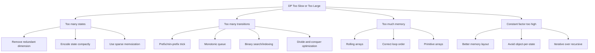
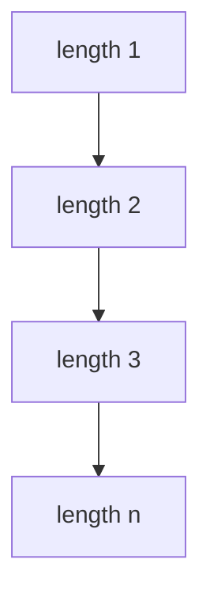
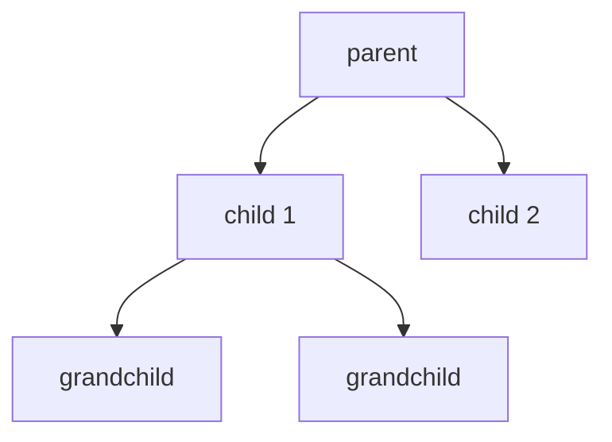

------
title: Learn Java Data Structures and Algorithms - Part 030
description: Advanced dynamic programming optimization in Java: knapsack variants, interval DP, tree DP, bitmask DP, digit DP, LIS optimization, space compression, monotonic structures, and complexity reduction strategies.
series: learn-java-dsa
seriesTitle: Learn Java Data Structures and Algorithms
order: 30
partTitle: Advanced Dynamic Programming Optimization
tags:
- java
- data-structures
- algorithms
- dynamic-programming
- optimization
- interval-dp
- tree-dp
- bitmask-dp
- digit-dp
- series
date: 2026-06-27
---

# Part 030 — Advanced Dynamic Programming Optimization

Part 029 built the foundation:

```text
state -> invariant -> transition -> base -> order -> result
```

This part focuses on advanced DP families and optimization.

The target is not to memorize every named technique. The target is to look at a DP and ask:

> Which dimension, transition, or dependency is making this expensive, and what property lets us remove or compress it?

DP optimization is usually one of these moves:

1. reduce state count;
2. reduce transition count;
3. compress memory;
4. exploit order/monotonicity;
5. exploit algebraic properties;
6. change the problem representation.

---

## 1. Kaufman Skill Target

After this part, you should be able to:

1. distinguish 0/1, unbounded, bounded, and multi-dimensional knapsack;
2. implement interval DP with correct length ordering;
3. implement tree DP with rerooting intuition;
4. implement bitmask DP for subset states;
5. implement digit DP with tight/started/state flags;
6. optimize LIS from `O(n^2)` to `O(n log n)`;
7. identify when rolling arrays are safe;
8. use monotonic queues to optimize transition windows;
9. reason about divide-and-conquer/Knuth optimization preconditions at a high level;
10. avoid Java memory blowups in high-dimensional DP.

---

## 2. DP Optimization Map



Optimization starts from diagnosis.

Do not optimize a DP until you can name the expensive component.

---

## 3. Knapsack Family

Knapsack is not one problem.

It is a family of state/transition constraints.

| Variant | Item Use | Typical Loop |
|---|---:|---|
| 0/1 knapsack | at most once | item outer, capacity descending |
| Unbounded knapsack | unlimited | item outer, capacity ascending |
| Bounded knapsack | limited count | binary splitting or monotonic queue |
| Multi-dimensional knapsack | multiple capacities | nested descending capacities |
| Exact fill | must use exact capacity | initialize impossible states as `-INF` |

---

## 4. 0/1 vs Unbounded Knapsack

### 4.1 0/1 Knapsack

```java
public static long knapsack01(int[] weight, int[] value, int capacity) {
    long[] dp = new long[capacity + 1];

    for (int i = 0; i < weight.length; i++) {
        int wi = weight[i];
        int vi = value[i];

        for (int w = capacity; w >= wi; w--) {
            dp[w] = Math.max(dp[w], dp[w - wi] + vi);
        }
    }

    return dp[capacity];
}
```

Descending capacity prevents using the same item multiple times.

### 4.2 Unbounded Knapsack

```java
public static long unboundedKnapsack(int[] weight, int[] value, int capacity) {
    long[] dp = new long[capacity + 1];

    for (int i = 0; i < weight.length; i++) {
        int wi = weight[i];
        int vi = value[i];

        for (int w = wi; w <= capacity; w++) {
            dp[w] = Math.max(dp[w], dp[w - wi] + vi);
        }
    }

    return dp[capacity];
}
```

Ascending capacity deliberately allows reuse.

The loop direction is not an implementation detail. It encodes item-use semantics.

---

## 5. Exact-Fill Knapsack

Some problems require exactly filling capacity.

Default `0` initialization is wrong because it treats impossible states as valid.

Use negative infinity.

```java
public static long exactFill01(int[] weight, int[] value, int capacity) {
    final long NEG_INF = Long.MIN_VALUE / 4;
    long[] dp = new long[capacity + 1];
    java.util.Arrays.fill(dp, NEG_INF);
    dp[0] = 0;

    for (int i = 0; i < weight.length; i++) {
        int wi = weight[i];
        int vi = value[i];

        for (int w = capacity; w >= wi; w--) {
            if (dp[w - wi] != NEG_INF) {
                dp[w] = Math.max(dp[w], dp[w - wi] + vi);
            }
        }
    }

    return dp[capacity];
}
```

State invariant:

```text
dp[w] = max value for exactly capacity w, or impossible.
```

This is different from:

```text
dp[w] = max value using at most capacity w.
```

---

## 6. Bounded Knapsack via Binary Splitting

Problem:

```text
Each item type i can be used at most count[i] times.
```

Naive transition loops over quantity and can be expensive.

Binary splitting converts bounded items into `O(log count)` 0/1 bundles.

Example:

```text
13 copies -> bundles of 1, 2, 4, 6
```

Implementation:

```java
record Bundle(int weight, int value) {}

public static long boundedKnapsack(int[] weight, int[] value, int[] count, int capacity) {
    java.util.List<Bundle> bundles = new java.util.ArrayList<>();

    for (int i = 0; i < weight.length; i++) {
        int remaining = count[i];
        int k = 1;
        while (remaining > 0) {
            int take = Math.min(k, remaining);
            bundles.add(new Bundle(weight[i] * take, value[i] * take));
            remaining -= take;
            k <<= 1;
        }
    }

    long[] dp = new long[capacity + 1];

    for (Bundle b : bundles) {
        for (int w = capacity; w >= b.weight(); w--) {
            dp[w] = Math.max(dp[w], dp[w - b.weight()] + b.value());
        }
    }

    return dp[capacity];
}
```

This is simple and often good enough.

For very large capacities and counts, monotonic queue optimization can be better, but binary splitting is easier to validate and maintain.

---

## 7. Multi-Dimensional Knapsack

Example:

```text
Capacity has weight and volume.
```

State:

```text
dp[w][v] = best value using processed items with weight <= w and volume <= v
```

0/1 transition requires both dimensions descending.

```java
public static long twoDimensional01(
    int[] weight,
    int[] volume,
    int[] value,
    int maxWeight,
    int maxVolume
) {
    long[][] dp = new long[maxWeight + 1][maxVolume + 1];

    for (int i = 0; i < weight.length; i++) {
        int wi = weight[i];
        int vi = volume[i];
        int val = value[i];

        for (int w = maxWeight; w >= wi; w--) {
            for (int v = maxVolume; v >= vi; v--) {
                dp[w][v] = Math.max(dp[w][v], dp[w - wi][v - vi] + val);
            }
        }
    }

    return dp[maxWeight][maxVolume];
}
```

State explosion is immediate:

```text
O(n * W * V)
```

In production, validate capacity sizes before allocation.

---

## 8. Longest Increasing Subsequence

### 8.1 O(n²) DP

State:

```text
dp[i] = length of LIS ending at i
```

Transition:

```text
dp[i] = 1 + max(dp[j]) for j < i and a[j] < a[i]
```

```java
public static int lisQuadratic(int[] a) {
    int n = a.length;
    if (n == 0) return 0;

    int[] dp = new int[n];
    java.util.Arrays.fill(dp, 1);

    int best = 1;
    for (int i = 0; i < n; i++) {
        for (int j = 0; j < i; j++) {
            if (a[j] < a[i]) {
                dp[i] = Math.max(dp[i], dp[j] + 1);
            }
        }
        best = Math.max(best, dp[i]);
    }

    return best;
}
```

### 8.2 O(n log n) Optimization

Maintain:

```text
tails[len] = minimum possible ending value of an increasing subsequence of length len + 1
```

This is not the actual subsequence. It is a compressed frontier.

```java
public static int lisLength(int[] a) {
    int[] tails = new int[a.length];
    int size = 0;

    for (int x : a) {
        int pos = lowerBound(tails, 0, size, x);
        tails[pos] = x;
        if (pos == size) {
            size++;
        }
    }

    return size;
}

private static int lowerBound(int[] a, int lo, int hi, int target) {
    while (lo < hi) {
        int mid = lo + ((hi - lo) >>> 1);
        if (a[mid] < target) {
            lo = mid + 1;
        } else {
            hi = mid;
        }
    }
    return lo;
}
```

For non-decreasing subsequence, use upper bound instead.

```text
strictly increasing -> lower_bound first >= x
non-decreasing     -> upper_bound first > x
```

### 8.3 Reconstructing LIS

```java
public static int[] reconstructLis(int[] a) {
    int n = a.length;
    int[] tailsIndex = new int[n];
    int[] prev = new int[n];
    java.util.Arrays.fill(prev, -1);

    int size = 0;

    for (int i = 0; i < n; i++) {
        int lo = 0, hi = size;
        while (lo < hi) {
            int mid = lo + ((hi - lo) >>> 1);
            if (a[tailsIndex[mid]] < a[i]) lo = mid + 1;
            else hi = mid;
        }

        int pos = lo;
        if (pos > 0) {
            prev[i] = tailsIndex[pos - 1];
        }
        tailsIndex[pos] = i;
        if (pos == size) size++;
    }

    int[] result = new int[size];
    int cur = tailsIndex[size - 1];
    for (int k = size - 1; k >= 0; k--) {
        result[k] = a[cur];
        cur = prev[cur];
    }
    return result;
}
```

Optimization lesson:

> Replace a transition over all previous candidates with an ordered frontier and binary search.

---

## 9. Interval DP

Interval DP handles problems where subproblems are contiguous ranges.

State:

```text
dp[l][r] = answer for interval [l, r]
```

or better in Java to reduce ambiguity:

```text
dp[l][r] = answer for half-open interval [l, r)
```

Common examples:

- matrix chain multiplication;
- optimal binary search tree;
- burst balloons;
- palindrome partitioning;
- merging stones/files;
- parsing;
- bracket matching.

### 9.1 Evaluation Order

Intervals depend on smaller intervals.

So iterate by length.



### 9.2 Matrix Chain Multiplication

Problem:

```text
Given matrices A0..A(n-1).
Matrix Ai has dimension dims[i] x dims[i+1].
Find minimum scalar multiplications.
```

State:

```text
dp[l][r] = min cost to multiply matrices [l, r)
```

Base:

```text
dp[l][l + 1] = 0
```

Transition:

```text
dp[l][r] = min over split k:
    dp[l][k] + dp[k][r] + dims[l] * dims[k] * dims[r]
```

Implementation:

```java
public static long matrixChainCost(int[] dims) {
    int n = dims.length - 1;
    long[][] dp = new long[n + 1][n + 1];

    for (int len = 2; len <= n; len++) {
        for (int l = 0; l + len <= n; l++) {
            int r = l + len;
            long best = Long.MAX_VALUE / 4;

            for (int k = l + 1; k < r; k++) {
                long cost = dp[l][k]
                    + dp[k][r]
                    + 1L * dims[l] * dims[k] * dims[r];
                best = Math.min(best, cost);
            }

            dp[l][r] = best;
        }
    }

    return dp[0][n];
}
```

Complexity:

```text
states: O(n^2)
transition per state: O(n)
time: O(n^3)
space: O(n^2)
```

Interval DP fails if you compute `l` and `r` in arbitrary order. Length ordering is the dependency schedule.

---

## 10. Palindrome Partitioning

Problem:

```text
Minimum cuts needed to partition a string into palindromic substrings.
```

This combines preprocessing and DP.

First compute palindrome table:

```text
pal[l][r] = whether s[l, r] inclusive is palindrome
```

Then:

```text
dp[i] = min cuts for prefix s[0, i)
```

Implementation:

```java
public static int minPalindromeCuts(String s) {
    int n = s.length();
    if (n == 0) return 0;

    boolean[][] pal = new boolean[n][n];

    for (int len = 1; len <= n; len++) {
        for (int l = 0; l + len <= n; l++) {
            int r = l + len - 1;
            if (s.charAt(l) == s.charAt(r)) {
                pal[l][r] = len <= 2 || pal[l + 1][r - 1];
            }
        }
    }

    int[] dp = new int[n + 1];
    java.util.Arrays.fill(dp, Integer.MAX_VALUE / 4);
    dp[0] = -1; // so a whole-palindrome prefix gets 0 cuts

    for (int i = 1; i <= n; i++) {
        for (int j = 0; j < i; j++) {
            if (pal[j][i - 1]) {
                dp[i] = Math.min(dp[i], dp[j] + 1);
            }
        }
    }

    return dp[n];
}
```

The `dp[0] = -1` base is intentional. It models cuts between parts.

---

## 11. Tree DP

Tree DP uses subtrees as dependency units.

The graph is acyclic when rooted.



For bottom-up tree DP:

```text
answer at node depends on answers from children
```

### 11.1 Maximum Independent Set on a Tree

Problem:

```text
Choose maximum-weight set of nodes such that no chosen nodes are adjacent.
```

State:

```text
dp0[u] = best value in subtree u if u is not selected
dp1[u] = best value in subtree u if u is selected
```

Transition:

```text
dp1[u] = weight[u] + sum(dp0[child])
dp0[u] = sum(max(dp0[child], dp1[child]))
```

Implementation:

```java
public final class TreeIndependentSet {
    private final java.util.List<Integer>[] graph;
    private final long[] weight;
    private final long[] dp0;
    private final long[] dp1;

    @SuppressWarnings("unchecked")
    public TreeIndependentSet(int n, long[] weight) {
        this.graph = new java.util.ArrayList[n];
        for (int i = 0; i < n; i++) graph[i] = new java.util.ArrayList<>();
        this.weight = weight;
        this.dp0 = new long[n];
        this.dp1 = new long[n];
    }

    public void addEdge(int a, int b) {
        graph[a].add(b);
        graph[b].add(a);
    }

    public long solve() {
        dfs(0, -1);
        return Math.max(dp0[0], dp1[0]);
    }

    private void dfs(int u, int parent) {
        dp1[u] = weight[u];
        dp0[u] = 0;

        for (int v : graph[u]) {
            if (v == parent) continue;
            dfs(v, u);
            dp1[u] += dp0[v];
            dp0[u] += Math.max(dp0[v], dp1[v]);
        }
    }
}
```

For deep trees, recursive DFS can overflow Java stack. Use iterative postorder if `n` can be large.

---

## 12. Rerooting DP

Some tree problems need an answer for every possible root.

Example:

```text
For every node u, compute sum of distances from u to all nodes.
```

First pass:

```text
subtreeSize[u]
down[u] = sum of distances from u to nodes in its subtree
```

Second pass reroots from parent to child.

Formula:

```text
ans[child] = ans[parent] - subtreeSize[child] + (n - subtreeSize[child])
```

Why?

When root moves from parent to child:

- nodes inside child's subtree become 1 closer;
- all other nodes become 1 farther.

```java
public final class SumDistancesTree {
    private final int n;
    private final java.util.List<Integer>[] g;
    private final int[] size;
    private final long[] ans;

    @SuppressWarnings("unchecked")
    public SumDistancesTree(int n) {
        this.n = n;
        this.g = new java.util.ArrayList[n];
        for (int i = 0; i < n; i++) g[i] = new java.util.ArrayList<>();
        this.size = new int[n];
        this.ans = new long[n];
    }

    public void addEdge(int a, int b) {
        g[a].add(b);
        g[b].add(a);
    }

    public long[] solve() {
        dfs1(0, -1, 0);
        dfs2(0, -1);
        return ans;
    }

    private void dfs1(int u, int p, int depth) {
        size[u] = 1;
        ans[0] += depth;
        for (int v : g[u]) {
            if (v == p) continue;
            dfs1(v, u, depth + 1);
            size[u] += size[v];
        }
    }

    private void dfs2(int u, int p) {
        for (int v : g[u]) {
            if (v == p) continue;
            ans[v] = ans[u] - size[v] + (n - size[v]);
            dfs2(v, u);
        }
    }
}
```

Rerooting mental model:

> Compute local subtree facts, then transfer the global answer across each edge with an O(1) delta.

---

## 13. Bitmask DP

Bitmask DP represents a subset using bits.

Typical state:

```text
dp[mask] = best answer for selected subset mask
```

or:

```text
dp[mask][last] = best path visiting mask and ending at last
```

State count:

```text
2^n
```

This is only feasible for small `n`, often `n <= 20` depending on transitions and memory.

### 13.1 Traveling Salesman DP

Problem:

```text
Given complete graph with n nodes.
Find minimum Hamiltonian path starting at 0 and visiting every node.
```

State:

```text
dp[mask][last] = min cost to start at 0, visit exactly mask, and end at last
```

Implementation:

```java
public static long tspPath(long[][] cost) {
    int n = cost.length;
    int total = 1 << n;
    final long INF = Long.MAX_VALUE / 4;

    long[][] dp = new long[total][n];
    for (long[] row : dp) {
        java.util.Arrays.fill(row, INF);
    }

    dp[1][0] = 0;

    for (int mask = 1; mask < total; mask++) {
        for (int last = 0; last < n; last++) {
            long cur = dp[mask][last];
            if (cur == INF) continue;

            for (int next = 0; next < n; next++) {
                if ((mask & (1 << next)) != 0) continue;
                int nextMask = mask | (1 << next);
                dp[nextMask][next] = Math.min(dp[nextMask][next], cur + cost[last][next]);
            }
        }
    }

    long best = INF;
    int full = total - 1;
    for (int last = 0; last < n; last++) {
        best = Math.min(best, dp[full][last]);
    }
    return best;
}
```

Caveat:

`1 << n` overflows for `n >= 31` and memory is impossible much earlier.

Validate `n`.

---

## 14. Submask Enumeration

A key bitmask trick:

```java
for (int sub = mask; sub > 0; sub = (sub - 1) & mask) {
    // sub is a non-empty submask of mask
}
```

This enumerates all submasks of `mask`.

Useful for:

- partition DP;
- subset convolution intuition;
- assignment grouping;
- minimum clique cover;
- batching decisions.

Example partition DP:

```text
dp[mask] = min cost to cover mask by valid groups
```

```java
for (int mask = 1; mask < total; mask++) {
    for (int sub = mask; sub > 0; sub = (sub - 1) & mask) {
        if (valid[sub]) {
            dp[mask] = Math.min(dp[mask], dp[mask ^ sub] + groupCost[sub]);
        }
    }
}
```

Complexity over all masks is `O(3^n)`, not `O(4^n)`, but still expensive.

---

## 15. Digit DP

Digit DP counts numbers satisfying constraints without iterating every number.

Typical question:

```text
How many integers x in [0, N] satisfy property P?
```

State often includes:

```text
position
tight flag
started flag
property state
```

Example:

```text
Count numbers <= N whose digit sum is divisible by mod.
```

State:

```text
dp[pos][sumMod][tight][started]
```

Top-down implementation:

```java
public final class DigitDpSumMod {
    private char[] digits;
    private int mod;
    private Long[][][][] memo;

    public long count(long n, int mod) {
        if (n < 0) return 0;
        this.digits = Long.toString(n).toCharArray();
        this.mod = mod;
        this.memo = new Long[digits.length + 1][mod][2][2];
        return dfs(0, 0, true, false);
    }

    private long dfs(int pos, int sumMod, boolean tight, boolean started) {
        if (pos == digits.length) {
            return started && sumMod == 0 ? 1 : 0;
        }

        int ti = tight ? 1 : 0;
        int si = started ? 1 : 0;

        if (!tight && memo[pos][sumMod][ti][si] != null) {
            return memo[pos][sumMod][ti][si];
        }

        int limit = tight ? digits[pos] - '0' : 9;
        long ans = 0;

        for (int d = 0; d <= limit; d++) {
            boolean nextStarted = started || d != 0;
            int nextSum = nextStarted ? (sumMod + d) % mod : 0;
            boolean nextTight = tight && d == limit;
            ans += dfs(pos + 1, nextSum, nextTight, nextStarted);
        }

        if (!tight) {
            memo[pos][sumMod][ti][si] = ans;
        }
        return ans;
    }
}
```

Note the memoization policy:

- tight states depend on the exact prefix bound;
- non-tight states can be reused generally.

This is why many digit DP implementations cache only when `tight == false`.

---

## 16. Monotonic Queue Optimization

Some DP transitions have a sliding-window max/min form.

Naive:

```text
dp[i] = value[i] + max(dp[j]) for j in [i - k, i - 1]
```

This is `O(nk)`.

A monotonic deque keeps candidate `dp[j]` values in decreasing order.

```java
public static long maxScoreWithWindow(long[] value, int k) {
    int n = value.length;
    long[] dp = new long[n];
    java.util.ArrayDeque<Integer> dq = new java.util.ArrayDeque<>();

    dp[0] = value[0];
    dq.addLast(0);

    for (int i = 1; i < n; i++) {
        while (!dq.isEmpty() && dq.peekFirst() < i - k) {
            dq.removeFirst();
        }

        dp[i] = value[i] + dp[dq.peekFirst()];

        while (!dq.isEmpty() && dp[dq.peekLast()] <= dp[i]) {
            dq.removeLast();
        }
        dq.addLast(i);
    }

    return dp[n - 1];
}
```

Invariant:

```text
Deque stores valid candidate indices.
Their dp values are monotonic decreasing.
Front is the best candidate.
```

Optimization lesson:

> If each state takes max/min over a moving window, use a monotonic deque to reduce transition cost.

---

## 17. Prefix Optimization

Some transitions are reducible with prefix sums or prefix extrema.

Naive:

```text
dp[i] = min over j < i: dp[j] + cost(j, i)
```

If cost can be decomposed:

```text
cost(j, i) = A[j] + B[i]
```

Then:

```text
dp[i] = B[i] + min over j < i: dp[j] + A[j]
```

Maintain running minimum.

Example:

```java
public static long minTransition(long[] a, long[] b) {
    int n = a.length;
    long[] dp = new long[n];

    long best = dp[0] + a[0];
    for (int i = 1; i < n; i++) {
        dp[i] = b[i] + best;
        best = Math.min(best, dp[i] + a[i]);
    }
    return dp[n - 1];
}
```

This converts `O(n²)` to `O(n)` when algebra allows it.

---

## 18. Divide-and-Conquer DP Optimization Intuition

Some DP has form:

```text
dp[g][i] = min over k < i: dp[g - 1][k] + cost(k, i)
```

Naive:

```text
O(groups * n^2)
```

If optimal split point is monotonic:

```text
opt[g][i] <= opt[g][i + 1]
```

then divide-and-conquer can compute each row faster.

High-level algorithm:

```text
compute row g for interval [l, r]
mid = (l + r) / 2
find best k for mid within candidate range [optL, optR]
recurse left with [optL, bestK]
recurse right with [bestK, optR]
```

Skeleton:

```java
static void computeRow(
    long[] prev,
    long[] cur,
    int l,
    int r,
    int optL,
    int optR
) {
    if (l > r) return;

    int mid = l + ((r - l) >>> 1);
    long bestVal = Long.MAX_VALUE / 4;
    int bestK = optL;

    int upper = Math.min(optR, mid - 1);
    for (int k = optL; k <= upper; k++) {
        long candidate = prev[k] + cost(k, mid);
        if (candidate < bestVal) {
            bestVal = candidate;
            bestK = k;
        }
    }

    cur[mid] = bestVal;

    computeRow(prev, cur, l, mid - 1, optL, bestK);
    computeRow(prev, cur, mid + 1, r, bestK, optR);
}

static long cost(int k, int i) {
    throw new UnsupportedOperationException("domain-specific cost");
}
```

This technique is powerful but dangerous.

Do not apply unless monotonicity is proven or guaranteed by known structure.

---

## 19. Knuth Optimization Intuition

Knuth optimization applies to certain interval DP forms:

```text
dp[l][r] = min over k in [l, r): dp[l][k] + dp[k][r] + cost[l][r]
```

It requires strong preconditions, often described through quadrangle inequality and monotonicity of optimal split points.

The payoff:

```text
O(n^3) -> O(n^2)
```

But the engineering warning is important:

> A wrong optimization can silently produce plausible but incorrect answers.

Use only when:

- the recurrence exactly matches the required form;
- the cost function has the required monotonic properties;
- tests compare against the `O(n^3)` DP for small random cases.

---

## 20. DP with Data Structures

Many advanced DP solutions combine DP with another data structure.

Examples:

| DP Need | Data Structure |
|---|---|
| range max/min transition | segment tree / Fenwick tree |
| ordered predecessor | TreeMap / binary search |
| sliding window optimum | monotonic deque |
| sparse reachable states | HashMap / HashSet |
| top-k states | heap |
| prefix aggregate | prefix array |
| online coordinate compression | TreeMap or sorted array |

Example: weighted interval scheduling.

Problem:

```text
Choose non-overlapping jobs with max profit.
```

Sort by end time.

State:

```text
dp[i] = best profit among first i jobs
```

Transition:

```text
dp[i] = max(dp[i - 1], profit[i - 1] + dp[p(i)])
```

where `p(i)` is the number of jobs ending before job `i - 1` starts.

```java
record Job(int start, int end, long profit) {}

public static long weightedInterval(Job[] jobs) {
    java.util.Arrays.sort(jobs, java.util.Comparator.comparingInt(Job::end));

    int n = jobs.length;
    int[] ends = new int[n];
    for (int i = 0; i < n; i++) ends[i] = jobs[i].end();

    long[] dp = new long[n + 1];

    for (int i = 1; i <= n; i++) {
        Job job = jobs[i - 1];
        int compatible = upperBound(ends, 0, i - 1, job.start());
        dp[i] = Math.max(dp[i - 1], dp[compatible] + job.profit());
    }

    return dp[n];
}

private static int upperBound(int[] a, int lo, int hi, int target) {
    while (lo < hi) {
        int mid = lo + ((hi - lo) >>> 1);
        if (a[mid] <= target) lo = mid + 1;
        else hi = mid;
    }
    return lo;
}
```

The data structure removes a transition scan.

---

## 21. Memory Layout for Advanced DP in Java

### 21.1 Avoid Large Jagged Object Graphs When Possible

Java `long[][]` is an array of arrays, not a contiguous 2D block.

For very large DP, flatten.

```java
final class LongMatrix {
    private final int rows;
    private final int cols;
    private final long[] data;

    LongMatrix(int rows, int cols) {
        this.rows = rows;
        this.cols = cols;
        this.data = new long[Math.multiplyExact(rows, cols)];
    }

    long get(int r, int c) {
        return data[r * cols + c];
    }

    void set(int r, int c, long value) {
        data[r * cols + c] = value;
    }
}
```

### 21.2 Validate Allocation Size

Before allocation:

```java
long cells = 1L * statesA * statesB * statesC;
if (cells > 200_000_000L) {
    throw new IllegalArgumentException("DP table too large: " + cells);
}
```

The threshold depends on runtime and memory budget.

### 21.3 Prefer Iterative for Large State Graphs

Recursive memoization is elegant, but advanced DP can create millions of states.

Use iterative order when:

- dependency order is known;
- recursion depth is high;
- profiling shows stack or call overhead;
- you need predictable memory.

---

## 22. Sparse DP

Dense arrays are fastest when most states are reachable.

Sparse maps are useful when most states are impossible.

Example:

```java
Map<Integer, Long> cur = new HashMap<>();
cur.put(0, 0L);

for (Item item : items) {
    Map<Integer, Long> next = new HashMap<>(cur);
    for (var e : cur.entrySet()) {
        int newState = transition(e.getKey(), item);
        long newValue = e.getValue() + item.value();
        next.merge(newState, newValue, Math::max);
    }
    cur = next;
}
```

Sparse DP trade-offs:

- less memory if few states;
- more overhead per state;
- less predictable iteration order;
- possible boxing cost;
- harder to benchmark accurately.

Use sparse DP when state count is genuinely sparse, not just because arrays look large.

---

## 23. Advanced DP Failure Modes

### 23.1 Optimizing Without Proving Preconditions

Using divide-and-conquer or Knuth optimization without monotonicity proof is dangerous.

It may pass samples and fail hidden edge cases.

### 23.2 Incorrect Compression

If `dp[i][j]` depends on both old and new row values, loop direction must preserve semantics.

Always write down:

```text
When this cell is overwritten, will any future transition still need the old value?
```

### 23.3 Overflow in Counts and Costs

Advanced DP often sums many values.

Use:

```java
Math.addExact(a, b)
```

when failure is preferred to silent corruption.

Use modulo only when mathematically intended.

### 23.4 Recursion on Deep Trees

Tree DP with `n = 200_000` can overflow Java stack.

Use iterative traversal.

### 23.5 Bitmask Shift Bugs

```java
1 << n
```

is invalid for large `n`.

For `long` masks:

```java
1L << n
```

But memory explodes far before 64 bits.

### 23.6 Unicode Mistakes in String DP

String DP over `char` works over UTF-16 code units, not Unicode grapheme clusters.

For user-visible text distance, code point or grapheme-aware processing may be needed.

---

## 24. Complexity Reduction Checklist

When DP is too expensive, ask:

1. Can the state be made smaller?
2. Is one dimension derivable from others?
3. Are all states reachable?
4. Can sparse memoization help?
5. Can previous rows be rolled?
6. Does loop direction preserve the old/new state distinction?
7. Is the transition a range min/max/sum?
8. Can prefix sums, Fenwick tree, segment tree, or monotonic deque reduce transition time?
9. Is there monotonicity in the optimal decision?
10. Can binary search replace scanning?
11. Can the problem be sorted to expose order?
12. Is reconstruction required?
13. Is the optimized solution validated against brute force or naive DP?

---

## 25. Practice Loop

### Drill 1 — Variant Classification

For each problem, classify the DP family:

1. coin change minimum coins;
2. coin change combinations;
3. stock buy/sell with cooldown;
4. matrix chain multiplication;
5. maximum independent set on tree;
6. TSP with small `n`;
7. count numbers <= N with digit property;
8. weighted interval scheduling.

### Drill 2 — Optimize a Known DP

Implement both versions:

- LIS `O(n²)` and `O(n log n)`;
- weighted interval scheduling `O(n²)` and `O(n log n)`;
- sliding-window DP naive and monotonic deque;
- edit distance full table and rolling rows.

Compare outputs against random tests.

### Drill 3 — Reconstruction

For these, return choices, not only score:

- LIS sequence;
- selected intervals;
- knapsack item IDs;
- matrix-chain parenthesization.

### Drill 4 — Memory Budget

For each DP, calculate cells before coding:

```text
states = dimension1 * dimension2 * ...
bytes = states * bytesPerCell
```

Then decide:

- dense array;
- rolling array;
- sparse map;
- impossible under constraints.

### Drill 5 — Proof Before Optimization

For any monotonic optimization, write:

```text
What property makes the optimal decision monotonic?
```

If you cannot answer, do not apply the optimization.

---

## 26. Self-Correction Checklist

Before accepting advanced DP:

1. Is the DP family correctly identified?
2. Does the state invariant distinguish exact vs at-most semantics?
3. Does loop direction encode correct item reuse semantics?
4. Are impossible states represented safely?
5. Are interval lengths evaluated in dependency order?
6. Are tree parent/child dependencies acyclic?
7. Is recursion depth safe in Java?
8. Is bitmask state count feasible?
9. Are digit DP `tight` and `started` flags correct?
10. Is memory compressed only when old values are no longer needed?
11. Are optimization preconditions proven?
12. Is optimized DP compared with naive DP on small random cases?
13. Is overflow policy explicit?
14. Is reconstruction deterministic if needed?

---

## 27. Key Takeaways

Advanced DP is mostly dependency engineering.

The process is:

```text
start with correct state
measure state count and transition count
identify the bottleneck
exploit structure to remove work
validate optimized result against a simple version
```

Useful optimizations are not magic tricks. They are consequences of structure:

- rolling arrays exploit local dependency;
- binary search exploits ordered frontiers;
- monotonic deque exploits sliding-window extrema;
- prefix optimization exploits algebraic decomposition;
- interval length ordering exploits range dependency;
- tree DP exploits rooted acyclic structure;
- bitmask DP exploits small subset universes;
- digit DP exploits prefix constraints and tightness.

In Part 031, we move to greedy algorithms and exchange arguments: the discipline for proving when local decisions are globally safe.
