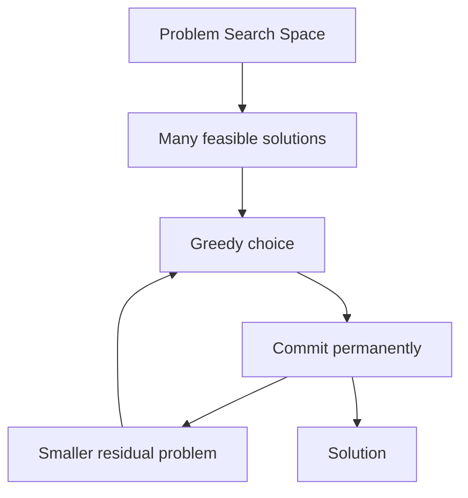
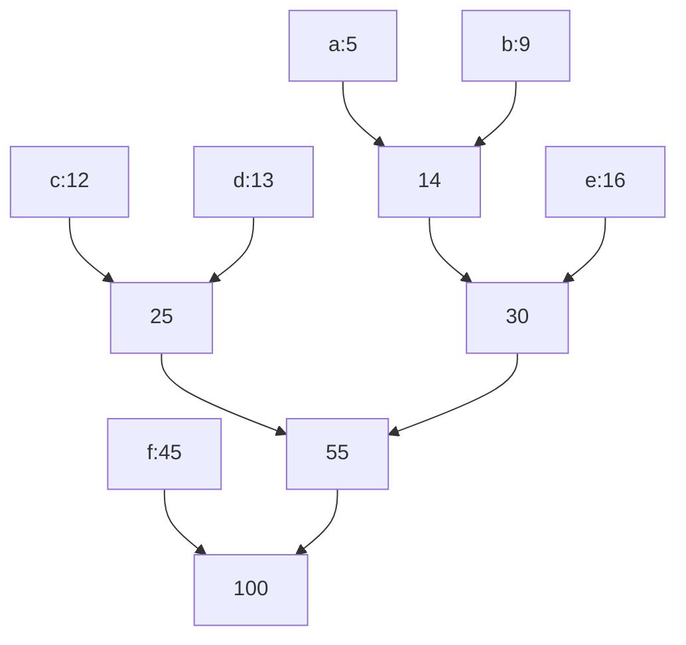

------
title: Learn Java Data Structures and Algorithms - Part 031
description: Greedy algorithms in Java through invariants, exchange arguments, local-choice proofs, interval scheduling, Huffman coding, deadline scheduling, comparator correctness, and failure analysis.
series: learn-java-dsa
seriesTitle: Learn Java Data Structures and Algorithms
order: 31
partTitle: Greedy Algorithms and Exchange Arguments
tags:
- java
- data-structures
- algorithms
- greedy
- exchange-argument
- scheduling
- huffman-coding
- matroid
- series
date: 2026-06-27
---

# Part 031 — Greedy Algorithms and Exchange Arguments

Dynamic programming keeps many possible futures alive.

Greedy algorithms deliberately throw most futures away.

That is powerful, dangerous, and often misunderstood.

A greedy algorithm makes a locally optimal choice and commits to it without backtracking. The core question is not:

> Which heuristic looks reasonable?

The core question is:

> Why is it safe to commit to this choice permanently?

This part focuses on that safety argument.

Greedy is not a template family. It is a correctness style.

---

## 1. Kaufman Skill Target

After this part, you should be able to:

1. identify whether a problem is likely greedy, DP, graph, or search;
2. state the greedy choice explicitly;
3. define the invariant preserved after every greedy step;
4. prove correctness using an exchange argument;
5. recognize when a locally optimal rule is only a heuristic;
6. implement interval scheduling, interval partitioning, deadline scheduling, and Huffman coding;
7. reason about comparator correctness in greedy algorithms;
8. distinguish optimal greedy algorithms from approximation heuristics;
9. detect counterexamples quickly;
10. choose Java data structures that match the greedy operation.

The practical outcome is not “I know greedy patterns.”

The practical outcome is:

> I can justify why this irreversible decision does not destroy global optimality.

---

## 2. Mental Model: Greedy as Irreversible Compression

A greedy algorithm compresses a large search space into one path.



The algorithm is only correct when every commit can be justified.

A greedy solution usually needs two properties:

| Property | Meaning |
|---|---|
| Greedy-choice property | There exists an optimal solution containing the greedy choice |
| Optimal substructure | After taking the greedy choice, the remaining problem is the same type of problem |

The first property is the hard one.

DP also relies on optimal substructure. Greedy additionally claims that one local choice is safe enough to avoid exploring alternatives.

---

## 3. Greedy Correctness Proof Patterns

There are several common proof patterns.

| Proof Style | Core Move | Typical Problems |
|---|---|---|
| Exchange argument | Transform an optimal solution to include the greedy choice | Interval scheduling, MST, scheduling |
| Stays-ahead argument | Show greedy is never worse after each step | Earliest-finish interval scheduling |
| Cut property | Show cheapest crossing edge is safe | MST |
| Prefix optimality | Show greedy prefix can be extended optimally | Huffman, lexicographic construction |
| Charging argument | Bound loss against optimum | Approximation algorithms |

This part emphasizes **exchange arguments**, because they are the most useful daily reasoning tool.

---

## 4. Exchange Argument Template

A reusable exchange proof looks like this:

```text
1. Let G be the first choice made by the greedy algorithm.
2. Let O be an optimal solution.
3. If O already contains G, continue.
4. Otherwise, replace some element X in O with G.
5. Prove the replacement is feasible.
6. Prove the replacement does not worsen the objective.
7. Therefore, there exists an optimal solution containing G.
8. Reduce to the remaining subproblem.
```

The key is not to compare greedy to every possible solution.

The key is to show:

> Any optimal solution can be reshaped to agree with greedy at the first point of disagreement.

Then induction handles the rest.

---

## 5. Recognizing Greedy Candidates

Greedy often appears when the problem has:

1. a sorted order that makes future constraints monotonic;
2. a resource that can be consumed in one direction;
3. a frontier where the best next item is safe;
4. an objective based on count, earliest completion, minimum cost, or maximum remaining slack;
5. a structure where exchange does not break feasibility.

Greedy is suspicious when:

1. early choices affect multiple future dimensions;
2. local gain may block large future gain;
3. constraints interact non-locally;
4. the problem asks for exact subset selection;
5. counterexamples are easy to construct.

A useful diagnostic:

```text
If I choose the locally best item now, what future option could it block?
```

If the blocked option can be exchanged back without loss, greedy may work.

If not, use DP or search.

---

## 6. Interval Scheduling: Max Number of Non-Overlapping Intervals

Given intervals, select the maximum number of mutually non-overlapping intervals.

The greedy rule is:

> Always pick the interval with the earliest finishing time among compatible intervals.

Not shortest duration.

Not earliest start.

Not smallest overlap count.

Earliest finish.

---

## 7. Interval Scheduling Invariant

Use half-open intervals `[start, end)` unless the domain explicitly requires closed intervals.

The invariant after selecting intervals is:

```text
lastEnd = end time of the last selected interval
All selected intervals are non-overlapping.
Among all schedules with the same number of selected intervals, greedy has the smallest possible lastEnd.
```

That last line is the stays-ahead property.

Greedy leaves at least as much room for the future as any alternative schedule of the same size.

---

## 8. Java Implementation: Interval Scheduling

```java
import java.util.*;

public final class IntervalScheduling {
    public record Interval(int start, int end) {
        public Interval {
            if (end < start) {
                throw new IllegalArgumentException("end must be >= start");
            }
        }
    }

    public static List<Interval> maximumNonOverlapping(List<Interval> intervals) {
        ArrayList<Interval> sorted = new ArrayList<>(intervals);
        sorted.sort(
            Comparator.comparingInt(Interval::end)
                      .thenComparingInt(Interval::start)
        );

        ArrayList<Interval> selected = new ArrayList<>();
        int lastEnd = Integer.MIN_VALUE;

        for (Interval interval : sorted) {
            if (interval.start() >= lastEnd) {
                selected.add(interval);
                lastEnd = interval.end();
            }
        }

        return selected;
    }
}
```

Tie-breaking by start is not required for optimal count, but it makes output deterministic.

Determinism matters in tests, audit logs, replay systems, and debugging.

---

## 9. Exchange Argument for Interval Scheduling

Let `g` be the interval with earliest finish time.

Let `O` be an optimal schedule.

If `O` already contains `g`, we are done.

Otherwise, let `o` be the first interval in `O`.

Because `g` has the earliest finish among all intervals:

```text
g.end <= o.end
```

Replace `o` with `g`.

The replacement remains feasible because `g` ends no later than `o`, so every interval that started after `o.end` also starts after `g.end`.

The number of intervals is unchanged.

Therefore, there exists an optimal schedule containing `g`.

Then solve the residual problem of intervals starting at or after `g.end`.

---

## 10. Why Other Greedy Rules Fail

### 10.1 Earliest Start Fails

```text
[1, 10), [2, 3), [3, 4), [4, 5)
```

Earliest start picks `[1, 10)` and returns 1 interval.

Optimal returns 3 intervals.

### 10.2 Shortest Duration Fails

```text
[1, 3), [3, 5), [2, 4)
```

Shortest duration may pick `[2, 4)` first and block two intervals.

Optimal is `[1, 3), [3, 5)`.

### 10.3 Fewest Conflicts Can Fail

Local conflict count ignores how an interval partitions the remaining timeline.

The right rule is the one supported by the exchange proof.

---

## 11. Interval Partitioning: Minimum Number of Rooms

Different problem:

> Given intervals, allocate them to the minimum number of rooms so overlapping intervals are in different rooms.

The greedy rule is:

1. sort by start time;
2. reuse the room whose current end time is earliest;
3. if no room is free, open a new room.

The invariant:

```text
The number of rooms used equals the maximum number of simultaneous active intervals seen so far.
```

That maximum overlap is a lower bound. Greedy achieves it.

---

## 12. Java Implementation: Interval Partitioning

```java
import java.util.*;

public final class IntervalPartitioning {
    public record Interval(int start, int end) {}

    private record Room(int id, int availableAt) {}

    public static Map<Integer, List<Interval>> assignRooms(List<Interval> intervals) {
        ArrayList<Interval> sorted = new ArrayList<>(intervals);
        sorted.sort(
            Comparator.comparingInt(Interval::start)
                      .thenComparingInt(Interval::end)
        );

        PriorityQueue<Room> roomsByAvailability = new PriorityQueue<>(
            Comparator.comparingInt(Room::availableAt)
                      .thenComparingInt(Room::id)
        );

        Map<Integer, List<Interval>> assignment = new LinkedHashMap<>();
        int nextRoomId = 0;

        for (Interval interval : sorted) {
            Room room;

            if (!roomsByAvailability.isEmpty()
                    && roomsByAvailability.peek().availableAt() <= interval.start()) {
                room = roomsByAvailability.poll();
            } else {
                room = new Room(nextRoomId++, Integer.MIN_VALUE);
                assignment.put(room.id(), new ArrayList<>());
            }

            assignment.get(room.id()).add(interval);
            roomsByAvailability.add(new Room(room.id(), interval.end()));
        }

        return assignment;
    }
}
```

Complexity:

```text
sort: O(n log n)
room operations: O(n log r), r = number of rooms
space: O(n + r)
```

The priority queue stores the earliest reusable room.

---

## 13. Sweep-Line Alternative for Minimum Rooms

If only the count is needed, not assignment:

```java
import java.util.*;

public static int minRooms(int[][] intervals) {
    int n = intervals.length;
    int[] starts = new int[n];
    int[] ends = new int[n];

    for (int i = 0; i < n; i++) {
        starts[i] = intervals[i][0];
        ends[i] = intervals[i][1];
    }

    Arrays.sort(starts);
    Arrays.sort(ends);

    int rooms = 0;
    int maxRooms = 0;
    int i = 0;
    int j = 0;

    while (i < n) {
        if (starts[i] < ends[j]) {
            rooms++;
            maxRooms = Math.max(maxRooms, rooms);
            i++;
        } else {
            rooms--;
            j++;
        }
    }

    return maxRooms;
}
```

This assumes half-open intervals.

If two intervals are `[1, 3)` and `[3, 5)`, they do not overlap.

For closed intervals `[1, 3]` and `[3, 5]`, the comparison changes.

Boundary semantics are part of the algorithm.

---

## 14. Fractional Knapsack vs 0/1 Knapsack

Fractional knapsack:

> Items can be split.

Greedy rule:

> Take items by descending value-per-weight ratio.

This is optimal because any solution using a lower-ratio fraction before a higher-ratio available fraction can be improved by exchanging weight.

0/1 knapsack:

> Items cannot be split.

The same greedy rule fails.

Counterexample:

```text
capacity = 50
items:
A: weight 10, value 60, ratio 6
B: weight 20, value 100, ratio 5
C: weight 30, value 120, ratio 4
```

Ratio greedy picks A + B = 160.

Optimal picks B + C = 220.

Same surface problem. Different constraint. Different algorithm family.

---

## 15. Java Implementation: Fractional Knapsack

```java
import java.util.*;

public final class FractionalKnapsack {
    public record Item(long weight, long value) {
        public Item {
            if (weight <= 0) {
                throw new IllegalArgumentException("weight must be positive");
            }
        }
    }

    public static double maxValue(List<Item> items, long capacity) {
        ArrayList<Item> sorted = new ArrayList<>(items);

        sorted.sort((a, b) -> Long.compare(
            b.value() * a.weight(),
            a.value() * b.weight()
        ));

        long remaining = capacity;
        double total = 0.0;

        for (Item item : sorted) {
            if (remaining == 0) {
                break;
            }

            long take = Math.min(remaining, item.weight());
            total += (double) item.value() * take / item.weight();
            remaining -= take;
        }

        return total;
    }
}
```

Avoid comparing floating ratios directly when possible.

This comparator compares:

```text
a.value / a.weight vs b.value / b.weight
```

by cross multiplication.

However, `b.value() * a.weight()` may overflow for very large values.

For production code, use one of these:

1. validate value ranges;
2. use `BigInteger` for comparison;
3. use `Double.compare` knowingly with precision trade-offs;
4. normalize values if domain bounds permit.

---

## 16. Huffman Coding

Huffman coding builds an optimal prefix code for symbols with known frequencies.

Greedy rule:

> Repeatedly merge the two lowest-frequency trees.

The operation creates a new tree whose frequency is the sum of both.



The invariant:

```text
The two least frequent symbols can be siblings at the maximum depth in some optimal prefix tree.
```

Once they are merged, the problem reduces to a smaller Huffman problem.

---

## 17. Java Implementation: Huffman Tree

```java
import java.util.*;

public final class HuffmanCoding {
    public sealed interface Node permits Leaf, Internal {
        long frequency();
    }

    public record Leaf(char symbol, long frequency) implements Node {}

    public record Internal(Node left, Node right, long frequency) implements Node {}

    public static Node build(Map<Character, Long> frequencies) {
        if (frequencies.isEmpty()) {
            throw new IllegalArgumentException("frequencies must not be empty");
        }

        PriorityQueue<Node> pq = new PriorityQueue<>(
            Comparator.comparingLong(Node::frequency)
                      .thenComparingInt(System::identityHashCode)
        );

        for (Map.Entry<Character, Long> entry : frequencies.entrySet()) {
            long f = entry.getValue();
            if (f <= 0) {
                throw new IllegalArgumentException("frequency must be positive");
            }
            pq.add(new Leaf(entry.getKey(), f));
        }

        if (pq.size() == 1) {
            return pq.poll();
        }

        while (pq.size() > 1) {
            Node a = pq.poll();
            Node b = pq.poll();
            pq.add(new Internal(a, b, a.frequency() + b.frequency()));
        }

        return pq.poll();
    }

    public static Map<Character, String> codes(Node root) {
        Map<Character, String> result = new LinkedHashMap<>();
        buildCodes(root, "", result);
        return result;
    }

    private static void buildCodes(Node node, String prefix, Map<Character, String> out) {
        if (node instanceof Leaf leaf) {
            out.put(leaf.symbol(), prefix.isEmpty() ? "0" : prefix);
            return;
        }

        Internal internal = (Internal) node;
        buildCodes(internal.left(), prefix + "0", out);
        buildCodes(internal.right(), prefix + "1", out);
    }
}
```

This is clear, but not allocation-minimal.

A production encoder may avoid recursive string concatenation by using a mutable `StringBuilder`, bit buffers, or canonical Huffman codes.

The DSA lesson is the greedy merge invariant, not the final compression-file format.

---

## 18. Deadline Scheduling: Max Profit with Deadlines

Problem:

> Each job takes one unit of time. Each job has a deadline and profit. Schedule at most one job per slot to maximize profit.

Greedy rule:

1. sort jobs by descending profit;
2. assign each job to the latest free slot before its deadline;
3. skip it if no slot is available.

Why latest free slot?

Because it preserves earlier slots for jobs with tighter deadlines.

---

## 19. Deadline Scheduling with DSU

A naive latest-free-slot search can be `O(nD)`.

Use DSU to find the latest available slot efficiently.

```java
import java.util.*;

public final class DeadlineScheduling {
    public record Job(String id, int deadline, long profit) {}

    private static final class Dsu {
        private final int[] parent;

        Dsu(int n) {
            parent = new int[n + 1];
            for (int i = 0; i <= n; i++) {
                parent[i] = i;
            }
        }

        int find(int x) {
            if (parent[x] != x) {
                parent[x] = find(parent[x]);
            }
            return parent[x];
        }

        void occupy(int slot) {
            parent[slot] = find(slot - 1);
        }
    }

    public static List<Job> schedule(List<Job> jobs) {
        int maxDeadline = 0;
        for (Job job : jobs) {
            maxDeadline = Math.max(maxDeadline, job.deadline());
        }

        ArrayList<Job> sorted = new ArrayList<>(jobs);
        sorted.sort(
            Comparator.comparingLong(Job::profit).reversed()
                      .thenComparingInt(Job::deadline)
                      .thenComparing(Job::id)
        );

        Dsu dsu = new Dsu(maxDeadline);
        ArrayList<Job> accepted = new ArrayList<>();

        for (Job job : sorted) {
            int deadline = Math.min(job.deadline(), maxDeadline);
            int slot = dsu.find(deadline);

            if (slot > 0) {
                accepted.add(job);
                dsu.occupy(slot);
            }
        }

        return accepted;
    }
}
```

The DSU parent of a slot points to the next candidate free slot on the left.

This is a strong example of combining greedy choice with a data structure from a previous part.

---

## 20. Greedy and Priority Queues

Many greedy algorithms are frontier algorithms.

A frontier algorithm repeatedly asks:

```text
Among currently available choices, which one has the best priority?
```

A `PriorityQueue` is usually the correct data structure when:

1. choices become available over time;
2. the best available choice changes after events;
3. insertion and extraction are interleaved;
4. full sorting upfront is impossible or wasteful.

Examples:

| Problem | Priority |
|---|---|
| Huffman coding | smallest frequency |
| Interval partitioning | earliest available room |
| Dijkstra | smallest tentative distance |
| Prim MST | cheapest crossing edge |
| Task scheduling | earliest deadline or highest priority |
| K-way merge | smallest current head |

Do not iterate a Java `PriorityQueue` expecting priority order.

Only repeated `poll()` gives priority order.

---

## 21. Comparator Correctness

Greedy algorithms frequently sort or use priority queues.

If the comparator is wrong, the proof no longer matches the program.

Bad comparator:

```java
(a, b) -> a.end - b.end
```

Problems:

1. integer overflow;
2. unclear tie-breaking;
3. can violate comparator contract if mixed with inconsistent logic.

Prefer:

```java
Comparator.comparingInt(Interval::end)
          .thenComparingInt(Interval::start)
```

For descending order:

```java
Comparator.comparingLong(Job::profit)
          .reversed()
          .thenComparingInt(Job::deadline)
```

The comparator is part of the algorithm's invariant.

Treat it as carefully as the recurrence in DP.

---

## 22. Greedy vs DP Decision Table

| Signal | Greedy Likely | DP Likely |
|---|---|---|
| Local choice can be exchanged into optimum | Yes | Not necessary |
| Need exact combination across capacity | Usually no | Yes |
| Taking an item changes only remaining boundary | Yes | Maybe |
| Taking an item changes multiple future dimensions | Suspicious | Yes |
| Objective is count with interval compatibility | Often | Sometimes |
| Objective is max value with indivisible items | Usually no | Yes |
| Need all possible states | No | Yes |
| Need proof of safe commitment | Essential | Less central |

When unsure, try to find a counterexample before writing code.

A five-minute counterexample search can save hours of implementing a wrong greedy heuristic.

---

## 23. Greedy Failure Case: Coin Change

For some coin systems, greedy works.

For others, it fails.

Example:

```text
coins = [1, 3, 4]
amount = 6
```

Greedy picks:

```text
4 + 1 + 1 = 3 coins
```

Optimal is:

```text
3 + 3 = 2 coins
```

The local largest coin does not have a safe exchange proof.

The correct general solution is DP.

Do not generalize from familiar currency systems.

---

## 24. Greedy Failure Case: Activity by Shortest Duration

Consider:

```text
A: [1, 4)
B: [4, 7)
C: [2, 5)
```

All have same duration except depending on construction, and a tempting local property can block a better chain.

Greedy must be attached to the correct invariant.

A rule is not valid just because it sounds efficient.

---

## 25. Matroid Intuition

Some greedy algorithms work because the feasible sets have a special exchange property.

A matroid, informally, is a system where:

1. subsets of feasible sets are feasible;
2. if one feasible set is larger than another, an element can be exchanged from the larger into the smaller while preserving feasibility.

You do not need full matroid theory for daily Java DSA.

But the intuition is useful:

> Greedy works when feasible partial solutions have a strong exchange structure.

Examples connected to this intuition:

1. choosing a maximum-weight independent set in certain independence systems;
2. MST under graphic matroid structure;
3. some scheduling and selection problems.

When exchange is weak or absent, greedy becomes heuristic.

---

## 26. Greedy as Approximation

Sometimes greedy is not exact but still useful.

Examples:

1. set cover greedy gives a known approximation behavior;
2. nearest-neighbor TSP is a heuristic, not an exact algorithm;
3. first-fit bin packing is practical but not always optimal;
4. local search can improve greedy initialization.

In production, heuristic greedy algorithms can be valuable if documented honestly:

```text
This algorithm does not guarantee optimality.
It optimizes for speed and deterministic behavior.
Quality is evaluated empirically against representative workloads.
```

Do not sell a heuristic as an exact algorithm.

That is a correctness bug.

---

## 27. Production Design Checklist

Before shipping a greedy algorithm, answer these:

1. What is the greedy choice?
2. What invariant does it preserve?
3. What is the exchange, stays-ahead, or cut argument?
4. Is the algorithm exact or heuristic?
5. What is the tie-breaking rule?
6. Is the comparator deterministic and overflow-safe?
7. Does the domain use half-open or closed intervals?
8. Are equal-priority items allowed?
9. Does mutable input corrupt ordering?
10. Does the algorithm need stable output for auditability?
11. What are the worst-case input distributions?
12. Which lower bound proves optimality?
13. What counterexamples were tested?
14. What metric validates heuristic quality if not exact?

---

## 28. Testing Greedy Algorithms

Greedy tests should include:

1. trivial cases;
2. empty input;
3. single element;
4. all compatible;
5. all conflicting;
6. equal starts;
7. equal ends;
8. duplicate intervals/jobs;
9. boundary-touching intervals;
10. known counterexamples for wrong rules;
11. randomized comparison against brute force for small `n`.

Brute force is especially useful for validating greedy algorithms.

For interval scheduling, brute force all subsets for `n <= 20` and compare maximum count.

---

## 29. Brute-Force Validator for Interval Scheduling

```java
import java.util.*;

public static int bruteForceMaxCount(List<IntervalScheduling.Interval> intervals) {
    int n = intervals.size();
    int best = 0;

    for (int mask = 0; mask < (1 << n); mask++) {
        ArrayList<IntervalScheduling.Interval> chosen = new ArrayList<>();
        for (int i = 0; i < n; i++) {
            if (((mask >>> i) & 1) == 1) {
                chosen.add(intervals.get(i));
            }
        }

        if (isCompatible(chosen)) {
            best = Math.max(best, chosen.size());
        }
    }

    return best;
}

private static boolean isCompatible(List<IntervalScheduling.Interval> intervals) {
    intervals.sort(Comparator.comparingInt(IntervalScheduling.Interval::start));

    for (int i = 1; i < intervals.size(); i++) {
        if (intervals.get(i).start() < intervals.get(i - 1).end()) {
            return false;
        }
    }

    return true;
}
```

Use brute force as a correctness oracle for small random inputs.

This is one of the fastest ways to catch invalid greedy rules.

---

## 30. Cost Model

| Algorithm | Time | Space | Main Data Structure |
|---|---:|---:|---|
| Interval scheduling | `O(n log n)` | `O(n)` | array sort |
| Interval partitioning | `O(n log n)` | `O(n)` | sort + priority queue |
| Fractional knapsack | `O(n log n)` | `O(n)` | sort |
| Huffman coding | `O(k log k)` | `O(k)` | priority queue |
| Deadline scheduling with DSU | `O(n log n + n α(D))` | `O(D)` | sort + DSU |

`k` is number of symbols.

`D` is maximum deadline.

`α` is inverse Ackermann from DSU.

---

## 31. Java-Specific Failure Modes

### 31.1 Mutating Objects After Sorting

If a sorted list contains mutable objects and their priority fields change, the sorted order becomes stale.

If a priority queue contains mutable objects and their priority fields change, the heap invariant becomes stale.

Remove and reinsert, or use immutable priority records.

### 31.2 Comparator Overflow

Avoid subtraction comparators.

Use `Integer.compare`, `Long.compare`, or comparator builders.

### 31.3 Non-Deterministic Ties

If equal priority items can be returned in any order, output may change across runs.

Use explicit tie-breakers when reproducibility matters.

### 31.4 PriorityQueue Is Not Sorted Iteration

`PriorityQueue` only guarantees priority at `peek()`/`poll()`.

Iteration order is not sorted.

### 31.5 Object Allocation in Hot Greedy Loops

Greedy algorithms often process many small items.

For large workloads, prefer:

1. primitive arrays;
2. packed records only outside hot loops;
3. index-based priority queues;
4. avoiding per-comparison allocation.

---

## 32. Practice Loop

### Drill 1 — Prove Before Coding

For each problem, write:

```text
Greedy choice:
Invariant:
Proof pattern:
Counterexample to wrong rule:
```

Problems:

1. interval scheduling;
2. interval partitioning;
3. fractional knapsack;
4. Huffman coding;
5. deadline scheduling;
6. meeting room allocation;
7. minimum arrows to burst balloons;
8. erase overlap intervals.

### Drill 2 — Counterexample Factory

For each wrong rule, create the smallest failing input:

1. earliest start for interval scheduling;
2. shortest duration for interval scheduling;
3. largest coin for arbitrary coin change;
4. highest profit for deadline scheduling without slot awareness;
5. nearest neighbor for TSP.

### Drill 3 — Brute Force Oracle

For small `n`, compare greedy output against brute force.

This builds instinct faster than reading many proofs passively.

### Drill 4 — Productionize

Take one greedy solution and add:

1. input validation;
2. deterministic tie-breaking;
3. immutable records;
4. brute-force randomized tests for small input;
5. benchmark for large input;
6. documentation of exact vs heuristic guarantee.

---

## 33. Self-Correction Checklist

You understand this part when you can answer:

1. What exactly is the local choice?
2. Why is the local choice safe?
3. What optimal solution transformation proves safety?
4. What lower bound does greedy meet?
5. What problem variant breaks the proof?
6. Which tie-breakers are semantically irrelevant but operationally useful?
7. Which data structure supports the greedy operation efficiently?
8. How would you generate counterexamples for wrong greedy rules?
9. Is the algorithm exact or a heuristic?
10. How would you validate it with a brute-force oracle?

---

## 34. Key Takeaways

Greedy is not about making a choice that feels best.

Greedy is about making a choice that can be proven safe.

The strongest mental model is:

```text
local choice + exchange proof + residual subproblem = greedy algorithm
```

When the exchange proof fails, do not force greedy.

Use DP, graph algorithms, or backtracking.

Part 032 continues exactly there: when irreversible commitment is not safe, we explore alternatives deliberately with backtracking, branch-and-bound, and pruning.
