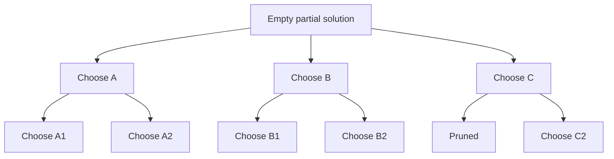
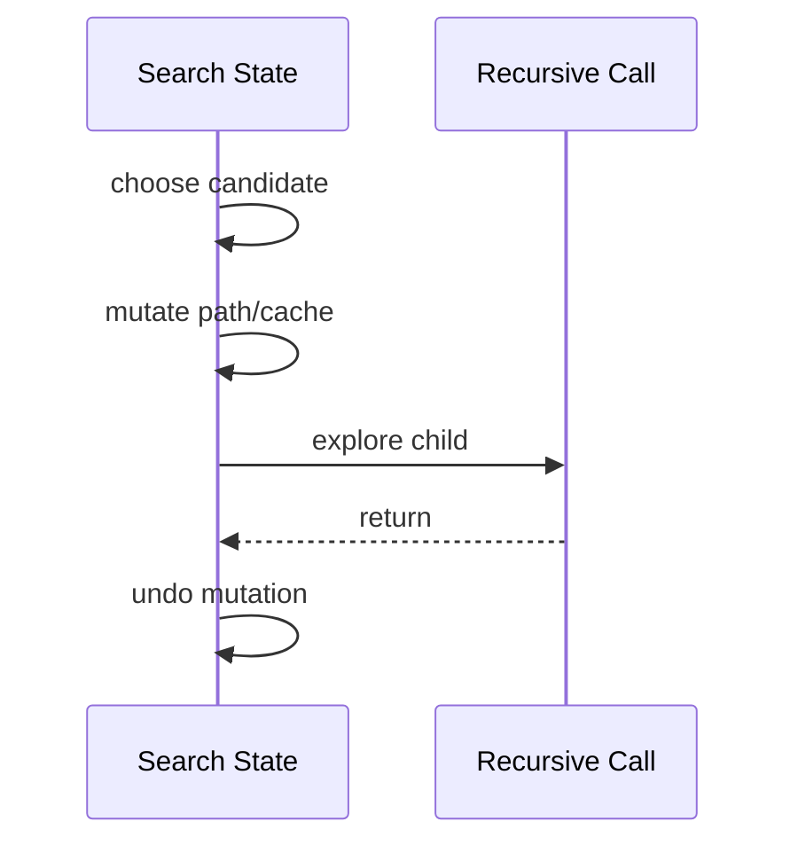
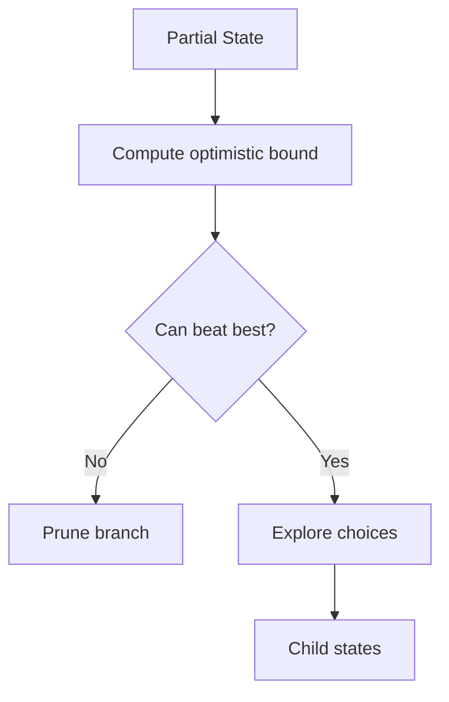

------
title: Learn Java Data Structures and Algorithms - Part 032
description: Backtracking, branch-and-bound, and search pruning in Java: state-space trees, constraints, recursion invariants, N-Queens, permutations, combinations, graph coloring, exact search, and production-grade pruning.
series: learn-java-dsa
seriesTitle: Learn Java Data Structures and Algorithms
order: 32
partTitle: Backtracking, Branch-and-Bound, and Search Pruning
tags:
- java
- data-structures
- algorithms
- backtracking
- branch-and-bound
- search
- pruning
- recursion
- series
date: 2026-06-27
---

# Part 032 — Backtracking, Branch-and-Bound, and Search Pruning

Part 031 covered greedy algorithms: commit when the choice is provably safe.

This part covers the opposite situation:

> We cannot safely commit to one local choice, so we explore alternatives systematically.

Backtracking is controlled exploration of a state-space tree.

Branch-and-bound adds a stronger rule:

> Stop exploring a branch when it cannot beat the best solution already found.

This is the core skill behind combinatorial search, constraint solving, puzzle solving, exhaustive validation, and exact optimization for small to medium problem sizes.

---

## 1. Kaufman Skill Target

After this part, you should be able to:

1. model a problem as a state-space tree;
2. define recursive invariants for partial solutions;
3. implement choose/explore/unchoose safely in Java;
4. avoid duplicate permutations and combinations;
5. apply constraint propagation and feasibility pruning;
6. implement N-Queens with both set-based and bitmask representations;
7. implement branch-and-bound for optimization problems;
8. distinguish exhaustive search, backtracking, DFS, and branch-and-bound;
9. estimate search explosion and pruning effectiveness;
10. make recursive search deterministic, testable, and interruptible.

The target is not to memorize puzzle templates.

The target is:

> Given a hard combinatorial problem, design the search space so invalid or hopeless branches die early.

---

## 2. Mental Model: Search Tree

Backtracking explores decisions.

Each level represents one decision position.

Each edge represents one candidate choice.



Backtracking is DFS over this tree with controlled mutation.

A branch can stop because:

1. it reaches a complete valid solution;
2. it violates a constraint;
3. it cannot improve the best known answer;
4. it exceeds resource limits;
5. it is equivalent to a branch already explored.

---

## 3. Core Backtracking Shape

The canonical structure:

```java
void search(State state) {
    if (isComplete(state)) {
        recordSolution(state);
        return;
    }

    for (Choice choice : choices(state)) {
        if (!isFeasible(state, choice)) {
            continue;
        }

        apply(state, choice);
        search(state);
        undo(state, choice);
    }
}
```

This template is simple.

The skill is in designing:

1. `State`;
2. `choices`;
3. `isFeasible`;
4. `apply`;
5. `undo`;
6. pruning bounds.

---

## 4. Recursive Invariant

Every backtracking function must have an invariant.

Example:

```text
At depth d:
- positions [0, d) have been assigned.
- positions [d, n) have not been assigned.
- used[x] is true iff x appears in positions [0, d).
- path contains exactly d choices.
- all constraints among assigned positions are satisfied.
```

If you cannot state this, your recursion is fragile.

Backtracking bugs usually come from invariant drift:

1. apply without undo;
2. undo in wrong order;
3. duplicate state mutation;
4. constraint cache not restored;
5. recording a mutable reference instead of a copy.

---

## 5. Choose / Explore / Unchoose



The undo step must reverse every mutation performed by choose.

If apply mutates three structures, undo must restore all three.

A good pattern is to keep apply and undo adjacent in code.

---

## 6. Copy State vs Mutate State

There are two main implementation styles.

| Style | Benefit | Cost | Use When |
|---|---|---|---|
| Copy state per call | simple, safer | high allocation | small search, clarity first |
| Mutate + undo | fast, memory efficient | bug-prone | large search, hot paths |

Most serious Java backtracking uses mutate + undo, but starts with copy-style tests.

A useful workflow:

1. implement a slow clear version;
2. test it thoroughly;
3. optimize state representation;
4. keep the slow version as oracle for small cases.

---

## 7. Subsets

Generate all subsets of an array.

Decision at each index:

```text
exclude item i
include item i
```

```java
import java.util.*;

public final class Subsets {
    public static <T> List<List<T>> allSubsets(List<T> input) {
        List<List<T>> result = new ArrayList<>();
        ArrayList<T> path = new ArrayList<>();
        dfs(input, 0, path, result);
        return result;
    }

    private static <T> void dfs(
            List<T> input,
            int index,
            ArrayList<T> path,
            List<List<T>> result) {

        if (index == input.size()) {
            result.add(new ArrayList<>(path));
            return;
        }

        dfs(input, index + 1, path, result);

        path.add(input.get(index));
        dfs(input, index + 1, path, result);
        path.remove(path.size() - 1);
    }
}
```

Invariant:

```text
At index i, path contains choices made for items [0, i).
```

Complexity:

```text
time: O(n * 2^n) if copying each subset
space: O(n) recursion path, plus output
```

The output itself is exponential.

Do not call an output-sensitive algorithm inefficient just because it returns many results.

---

## 8. Combinations

Generate all size-`k` combinations.

```java
import java.util.*;

public final class Combinations {
    public static List<List<Integer>> choose(int n, int k) {
        List<List<Integer>> result = new ArrayList<>();
        ArrayList<Integer> path = new ArrayList<>();
        dfs(1, n, k, path, result);
        return result;
    }

    private static void dfs(
            int start,
            int n,
            int k,
            ArrayList<Integer> path,
            List<List<Integer>> result) {

        if (path.size() == k) {
            result.add(new ArrayList<>(path));
            return;
        }

        int need = k - path.size();
        int maxStart = n - need + 1;

        for (int x = start; x <= maxStart; x++) {
            path.add(x);
            dfs(x + 1, n, k, path, result);
            path.remove(path.size() - 1);
        }
    }
}
```

The line:

```java
int maxStart = n - need + 1;
```

is pruning.

It avoids choices that cannot possibly fill the remaining slots.

This is not a micro-optimization. It removes impossible subtrees.

---

## 9. Permutations

Generate all permutations.

```java
import java.util.*;

public final class Permutations {
    public static <T> List<List<T>> permutations(List<T> input) {
        List<List<T>> result = new ArrayList<>();
        ArrayList<T> path = new ArrayList<>();
        boolean[] used = new boolean[input.size()];
        dfs(input, used, path, result);
        return result;
    }

    private static <T> void dfs(
            List<T> input,
            boolean[] used,
            ArrayList<T> path,
            List<List<T>> result) {

        if (path.size() == input.size()) {
            result.add(new ArrayList<>(path));
            return;
        }

        for (int i = 0; i < input.size(); i++) {
            if (used[i]) {
                continue;
            }

            used[i] = true;
            path.add(input.get(i));

            dfs(input, used, path, result);

            path.remove(path.size() - 1);
            used[i] = false;
        }
    }
}
```

Invariant:

```text
used[i] is true iff input[i] is already in path.
```

The undo order should mirror apply order.

---

## 10. Unique Permutations with Duplicates

If input contains duplicate values, naive permutation generation produces duplicate outputs.

Sort first, then skip duplicates at the same decision level.

```java
import java.util.*;

public final class UniquePermutations {
    public static List<List<Integer>> permuteUnique(int[] nums) {
        Arrays.sort(nums);
        List<List<Integer>> result = new ArrayList<>();
        ArrayList<Integer> path = new ArrayList<>();
        boolean[] used = new boolean[nums.length];
        dfs(nums, used, path, result);
        return result;
    }

    private static void dfs(
            int[] nums,
            boolean[] used,
            ArrayList<Integer> path,
            List<List<Integer>> result) {

        if (path.size() == nums.length) {
            result.add(new ArrayList<>(path));
            return;
        }

        for (int i = 0; i < nums.length; i++) {
            if (used[i]) {
                continue;
            }

            if (i > 0 && nums[i] == nums[i - 1] && !used[i - 1]) {
                continue;
            }

            used[i] = true;
            path.add(nums[i]);
            dfs(nums, used, path, result);
            path.remove(path.size() - 1);
            used[i] = false;
        }
    }
}
```

The duplicate-skip rule means:

```text
For equal values, only use the first unused representative at this decision level.
```

This preserves unique structural choices.

---

## 11. Combination Sum with Pruning

Problem:

> Given candidates and target, find combinations that sum to target. Each candidate may be used unlimited times.

```java
import java.util.*;

public final class CombinationSum {
    public static List<List<Integer>> combinationSum(int[] candidates, int target) {
        Arrays.sort(candidates);
        List<List<Integer>> result = new ArrayList<>();
        ArrayList<Integer> path = new ArrayList<>();
        dfs(candidates, target, 0, path, result);
        return result;
    }

    private static void dfs(
            int[] candidates,
            int remaining,
            int start,
            ArrayList<Integer> path,
            List<List<Integer>> result) {

        if (remaining == 0) {
            result.add(new ArrayList<>(path));
            return;
        }

        for (int i = start; i < candidates.length; i++) {
            int x = candidates[i];
            if (x > remaining) {
                break;
            }

            path.add(x);
            dfs(candidates, remaining - x, i, path, result);
            path.remove(path.size() - 1);
        }
    }
}
```

The sorted order enables:

```java
if (x > remaining) break;
```

That is a monotonic pruning rule.

If candidates are unsorted, the break is invalid.

---

## 12. Constraint Search

Many backtracking problems are constraint satisfaction problems.

A CSP has:

1. variables;
2. domains;
3. constraints;
4. assignments.

Examples:

| Problem | Variables | Domain | Constraints |
|---|---|---|---|
| N-Queens | row positions | columns | no shared column/diagonal |
| Sudoku | cells | digits 1..9 | row/col/box uniqueness |
| Graph coloring | vertices | colors | adjacent vertices differ |
| Scheduling | tasks | slots/resources | capacity/dependency |
| Exact cover | rows chosen | include/exclude | cover every column once |

Backtracking performance often depends more on variable ordering than raw implementation speed.

---

## 13. N-Queens: Set-Based Implementation

Place one queen per row.

At row `r`, choose column `c`.

Constraints:

```text
no previous queen uses column c
no previous queen uses diagonal r - c
no previous queen uses anti-diagonal r + c
```

```java
import java.util.*;

public final class NQueensSetBased {
    public static List<List<String>> solve(int n) {
        List<List<String>> result = new ArrayList<>();
        int[] colAtRow = new int[n];
        Arrays.fill(colAtRow, -1);

        Set<Integer> cols = new HashSet<>();
        Set<Integer> diag = new HashSet<>();
        Set<Integer> anti = new HashSet<>();

        dfs(0, n, colAtRow, cols, diag, anti, result);
        return result;
    }

    private static void dfs(
            int row,
            int n,
            int[] colAtRow,
            Set<Integer> cols,
            Set<Integer> diag,
            Set<Integer> anti,
            List<List<String>> result) {

        if (row == n) {
            result.add(render(colAtRow));
            return;
        }

        for (int col = 0; col < n; col++) {
            int d = row - col;
            int a = row + col;

            if (cols.contains(col) || diag.contains(d) || anti.contains(a)) {
                continue;
            }

            colAtRow[row] = col;
            cols.add(col);
            diag.add(d);
            anti.add(a);

            dfs(row + 1, n, colAtRow, cols, diag, anti, result);

            anti.remove(a);
            diag.remove(d);
            cols.remove(col);
            colAtRow[row] = -1;
        }
    }

    private static List<String> render(int[] colAtRow) {
        int n = colAtRow.length;
        List<String> board = new ArrayList<>(n);

        for (int r = 0; r < n; r++) {
            char[] row = new char[n];
            Arrays.fill(row, '.');
            row[colAtRow[r]] = 'Q';
            board.add(new String(row));
        }

        return board;
    }
}
```

This version is readable.

But `HashSet<Integer>` creates many boxed integers and hash lookups.

For serious performance, use bit masks.

---

## 14. N-Queens: Bitmask Implementation

For `n <= 32`, an `int` can represent occupied columns.

For `n <= 64`, use `long`.

```java
public final class NQueensBitmask {
    public static long countSolutions(int n) {
        if (n < 0 || n > 32) {
            throw new IllegalArgumentException("n must be between 0 and 32");
        }

        int all = n == 32 ? -1 : (1 << n) - 1;
        return dfs(n, 0, 0, 0, 0, all);
    }

    private static long dfs(int n, int row, int cols, int diag, int anti, int all) {
        if (row == n) {
            return 1;
        }

        int available = all & ~(cols | diag | anti);
        long count = 0;

        while (available != 0) {
            int bit = available & -available;
            available -= bit;

            count += dfs(
                n,
                row + 1,
                cols | bit,
                (diag | bit) << 1,
                (anti | bit) >>> 1,
                all
            );
        }

        return count;
    }
}
```

Mental model:

```text
cols: columns already occupied
(diag << 1): diagonal attacks shifted for next row
(anti >>> 1): anti-diagonal attacks shifted for next row
available: columns safe in current row
```

This version avoids mutation and undo by passing primitive bitmasks by value.

That is often faster and safer.

---

## 15. Branch-and-Bound

Backtracking answers:

> Which complete assignments are feasible?

Branch-and-bound answers:

> Which feasible assignment optimizes an objective?

It tracks the best known solution and computes a bound for each partial solution.

If a branch cannot beat the best known solution, prune it.



The bound must be optimistic.

For maximization:

```text
bound(state) >= best possible completion of state
```

If even the optimistic bound is not better than the current best, the branch is hopeless.

---

## 16. Branch-and-Bound for 0/1 Knapsack

This is not the best general knapsack algorithm for all constraints; DP from Parts 029–030 is often preferable when capacity is moderate.

Branch-and-bound is useful when:

1. capacity is huge;
2. item count is moderate;
3. values/weights make pruning effective;
4. you need exact search with early incumbent improvements.

Use fractional knapsack as an optimistic upper bound.

---

## 17. Java Implementation: Knapsack Branch-and-Bound

```java
import java.util.*;

public final class KnapsackBranchAndBound {
    public record Item(long weight, long value) {}

    private record SortedItem(long weight, long value) {}

    private static final class Search {
        final SortedItem[] items;
        final long capacity;
        long bestValue;

        Search(SortedItem[] items, long capacity) {
            this.items = items;
            this.capacity = capacity;
        }
    }

    public static long maxValue(List<Item> input, long capacity) {
        SortedItem[] items = input.stream()
            .map(i -> new SortedItem(i.weight(), i.value()))
            .sorted((a, b) -> Long.compare(
                b.value() * a.weight(),
                a.value() * b.weight()
            ))
            .toArray(SortedItem[]::new);

        Search search = new Search(items, capacity);
        dfs(search, 0, 0L, 0L);
        return search.bestValue;
    }

    private static void dfs(Search search, int index, long weight, long value) {
        if (weight > search.capacity) {
            return;
        }

        if (index == search.items.length) {
            search.bestValue = Math.max(search.bestValue, value);
            return;
        }

        double bound = fractionalUpperBound(search, index, weight, value);
        if (bound <= search.bestValue) {
            return;
        }

        SortedItem item = search.items[index];

        dfs(search, index + 1, weight + item.weight(), value + item.value());
        dfs(search, index + 1, weight, value);
    }

    private static double fractionalUpperBound(
            Search search,
            int index,
            long weight,
            long value) {

        long remaining = search.capacity - weight;
        double bound = value;

        for (int i = index; i < search.items.length && remaining > 0; i++) {
            SortedItem item = search.items[i];
            long take = Math.min(remaining, item.weight());
            bound += (double) item.value() * take / item.weight();
            remaining -= take;
        }

        return bound;
    }
}
```

Caveats:

1. cross multiplication can overflow;
2. double bound can introduce precision issues;
3. recursion depth is `O(n)`;
4. worst-case time is still exponential;
5. item order strongly affects pruning.

Branch-and-bound improves search. It does not magically remove NP-hardness.

---

## 18. Candidate Ordering

The order of choices can dominate performance.

Good ordering:

1. finds strong solutions early;
2. tightens `bestValue` early;
3. makes branch-and-bound prune more;
4. hits contradictions earlier.

Examples:

| Problem | Good Ordering |
|---|---|
| Knapsack | high value/weight first |
| Graph coloring | high-degree vertices first |
| Sudoku | cell with fewest candidates first |
| N-Queens | symmetric pruning, constrained columns first |
| Scheduling | tight deadlines first |

This is not always about asymptotic complexity.

It is often the difference between finishing and never finishing.

---

## 19. Graph Coloring

Problem:

> Assign a color to each vertex so adjacent vertices have different colors.

This is a classic constraint search.

```java
import java.util.*;

public final class GraphColoring {
    public static int[] color(int n, int[][] edges, int colorCount) {
        List<Integer>[] graph = buildGraph(n, edges);
        Integer[] order = vertexOrderByDegree(graph);
        int[] colors = new int[n];
        Arrays.fill(colors, -1);

        if (!dfs(0, order, graph, colors, colorCount)) {
            return null;
        }

        return colors;
    }

    private static boolean dfs(
            int pos,
            Integer[] order,
            List<Integer>[] graph,
            int[] colors,
            int colorCount) {

        if (pos == order.length) {
            return true;
        }

        int v = order[pos];

        for (int color = 0; color < colorCount; color++) {
            if (!canUse(v, color, graph, colors)) {
                continue;
            }

            colors[v] = color;
            if (dfs(pos + 1, order, graph, colors, colorCount)) {
                return true;
            }
            colors[v] = -1;
        }

        return false;
    }

    private static boolean canUse(
            int v,
            int color,
            List<Integer>[] graph,
            int[] colors) {

        for (int nei : graph[v]) {
            if (colors[nei] == color) {
                return false;
            }
        }
        return true;
    }

    @SuppressWarnings("unchecked")
    private static List<Integer>[] buildGraph(int n, int[][] edges) {
        List<Integer>[] graph = new List[n];
        for (int i = 0; i < n; i++) {
            graph[i] = new ArrayList<>();
        }
        for (int[] edge : edges) {
            int a = edge[0];
            int b = edge[1];
            graph[a].add(b);
            graph[b].add(a);
        }
        return graph;
    }

    private static Integer[] vertexOrderByDegree(List<Integer>[] graph) {
        Integer[] order = new Integer[graph.length];
        for (int i = 0; i < graph.length; i++) {
            order[i] = i;
        }
        Arrays.sort(order, (a, b) -> Integer.compare(graph[b].size(), graph[a].size()));
        return order;
    }
}
```

The high-degree-first ordering tends to fail earlier if coloring is impossible.

That is pruning by contradiction discovery.

---

## 20. Sudoku Search Model

Sudoku is not included for puzzle interest. It is a clean constraint-propagation example.

Variables:

```text
81 cells
```

Domain:

```text
digits 1..9
```

Constraints:

```text
row uniqueness
column uniqueness
box uniqueness
```

Good search does not pick the next empty cell blindly.

It picks the cell with minimum remaining values.

This is the MRV heuristic:

```text
choose the most constrained variable first
```

MRV often reduces the branching factor dramatically.

---

## 21. Exact Cover Intuition

Exact cover asks:

> Select rows from a binary matrix so every column is covered exactly once.

Many constraint problems can be encoded as exact cover.

Examples:

1. Sudoku;
2. polyomino tiling;
3. scheduling variants;
4. assignment constraints;
5. puzzle solvers.

Algorithm X with Dancing Links is a famous exact-cover search strategy.

The key idea:

1. choose the most constrained uncovered column;
2. try each row that covers it;
3. remove conflicting rows/columns;
4. undo efficiently.

You do not need to implement Dancing Links for most engineering tasks.

But the design principle is important:

> Pick the decision that minimizes branching and maximizes propagation.

---

## 22. Pruning Taxonomy

| Pruning Type | Meaning | Example |
|---|---|---|
| Feasibility pruning | branch already violates constraints | duplicate column in N-Queens |
| Bound pruning | branch cannot beat incumbent | knapsack upper bound |
| Dominance pruning | another state is at least as good | same resources, better value |
| Symmetry pruning | equivalent states skipped | mirror N-Queens solutions |
| Monotonic pruning | sorted order makes future choices impossible | `x > remaining` break |
| Memo pruning | state already solved | DFS with cache |
| Constraint propagation | choice reduces future domains | Sudoku candidate masks |

The best search algorithms combine several pruning types.

---

## 23. Symmetry Pruning

Symmetry causes duplicate exploration.

For N-Queens, mirrored boards are equivalent if you only need count up to symmetry.

For permutations with duplicates, equal values create symmetric branches.

For graph coloring, color labels are often symmetric:

```text
red/blue/green assignment can be equivalent to blue/red/green
```

A common graph-coloring symmetry break:

```text
force first vertex to use color 0
```

Be careful.

Symmetry pruning must not remove genuinely distinct solutions when the output requires all labeled variants.

---

## 24. Memoization in Search

Backtracking and DP overlap when the same state can be reached through multiple paths.

If the search state has overlapping subproblems, memoize.

Example state key:

```text
(index, remainingCapacity)
```

This turns knapsack search into DP.

But memoization only works if the key captures all relevant future information.

Bad key:

```text
remainingCapacity only
```

because available future items also matter.

Good key:

```text
(index, remainingCapacity)
```

State identity is an invariant.

---

## 25. Recursion Depth and Iterative Search

Java does not guarantee tail-call optimization.

Deep recursion can overflow the stack.

For search depth in the hundreds or thousands, consider:

1. iterative DFS with explicit stack;
2. increasing stack only as a controlled runtime setting;
3. splitting work into smaller tasks;
4. using BFS/IDS if appropriate;
5. using domain-specific iterative algorithms.

Recursive code is often clearer.

Production search needs a depth strategy.

---

## 26. Explicit Stack Skeleton

```java
import java.util.*;

public final class IterativeDfsSkeleton {
    private static final class Frame {
        int depth;
        int nextChoice;

        Frame(int depth) {
            this.depth = depth;
        }
    }

    public static void search(int n) {
        ArrayDeque<Frame> stack = new ArrayDeque<>();
        stack.push(new Frame(0));

        while (!stack.isEmpty()) {
            Frame frame = stack.peek();

            if (frame.depth == n) {
                // record solution represented by external mutable state
                stack.pop();
                // undo would happen here if needed
                continue;
            }

            if (frame.nextChoice == n) {
                stack.pop();
                // undo choice that led into this frame if needed
                continue;
            }

            int choice = frame.nextChoice++;
            // if feasible: apply choice, then push child
            stack.push(new Frame(frame.depth + 1));
        }
    }
}
```

Iterative backtracking is more complex because undo boundaries become explicit.

Use it when recursion depth or runtime control demands it.

---

## 27. Interruptibility and Resource Limits

Search can run for a long time.

Production search should support:

1. time limit;
2. node limit;
3. solution limit;
4. cancellation token;
5. deterministic seed/order;
6. progress metrics;
7. partial best result.

Example search budget:

```java
public final class SearchBudget {
    private final long deadlineNanos;
    private final long maxNodes;
    private long nodes;

    public SearchBudget(long timeoutMillis, long maxNodes) {
        this.deadlineNanos = System.nanoTime() + timeoutMillis * 1_000_000L;
        this.maxNodes = maxNodes;
    }

    public void visitNode() {
        nodes++;
        if (nodes > maxNodes || System.nanoTime() > deadlineNanos) {
            throw new SearchLimitExceeded(nodes);
        }
    }

    public long nodes() {
        return nodes;
    }
}

final class SearchLimitExceeded extends RuntimeException {
    SearchLimitExceeded(long nodes) {
        super("search limit exceeded after " + nodes + " nodes");
    }
}
```

For library code, prefer checked result objects over unchecked exceptions when cancellation is expected behavior.

---

## 28. Instrumentation

Backtracking without metrics is hard to reason about.

Track:

1. nodes visited;
2. branches pruned by reason;
3. maximum depth;
4. incumbent updates;
5. elapsed time;
6. branching factor by depth;
7. cache hit rate if memoized.

Example:

```java
public final class SearchStats {
    public long nodes;
    public long feasibilityPrunes;
    public long boundPrunes;
    public long solutions;
    public int maxDepth;

    public void visit(int depth) {
        nodes++;
        maxDepth = Math.max(maxDepth, depth);
    }
}
```

These numbers reveal whether your pruning works.

If nodes explode near the top of the tree, improve variable ordering.

If nodes explode near the bottom, improve bounds or feasibility pruning.

---

## 29. Output Strategy

Backtracking may produce many solutions.

Avoid storing all solutions unless required.

Alternative APIs:

### 29.1 Count Only

```java
long countSolutions(...)
```

### 29.2 First Solution

```java
Optional<Solution> findOne(...)
```

### 29.3 Callback Consumer

```java
void enumerate(Consumer<Solution> consumer)
```

### 29.4 Iterator / Stream-Like API

More complex, but useful for lazy consumption.

Be careful with Java streams for recursive backtracking; they can obscure resource control and stack behavior.

---

## 30. Mutable Solution Capture

Wrong:

```java
result.add(path);
```

This stores the mutable `path` object itself.

Later undo operations mutate the stored result.

Correct:

```java
result.add(new ArrayList<>(path));
```

For arrays:

```java
result.add(Arrays.copyOf(state, state.length));
```

Recording a solution must snapshot the current state.

---

## 31. Complexity Reasoning

Backtracking complexity is usually described by search tree size.

For permutations:

```text
n!
```

For subsets:

```text
2^n
```

For N-Queens naive upper bound:

```text
n^n
```

With one queen per row and unique columns:

```text
n!
```

With diagonal pruning:

```text
much smaller in practice, still exponential
```

Do not hide behind `O(2^n)` when the real branching factor changes by depth.

A better description:

```text
nodes = sum over depths of explored partial assignments
```

Then explain which pruning rules reduce that number.

---

## 32. Search Design Matrix

| Problem Shape | Technique |
|---|---|
| Need all subsets/combinations | simple backtracking |
| Need first feasible assignment | DFS with feasibility pruning |
| Need optimal assignment | branch-and-bound |
| Same state reachable many ways | memoized search / DP |
| Constraints reduce domains | constraint propagation |
| Many equivalent states | symmetry breaking |
| Need shortest decision sequence | BFS / IDDFS |
| Huge search with no exact need | heuristic / local search / approximation |

Backtracking is one point in a larger search-design space.

---

## 33. Common Failure Modes

### 33.1 Missing Undo

Symptom:

```text
later branches see choices from earlier branches
```

Fix:

```text
every mutation has a paired undo
```

### 33.2 Recording Mutable State

Symptom:

```text
all solutions become empty or identical
```

Fix:

```text
copy before storing
```

### 33.3 Wrong Duplicate Skip

Symptom:

```text
missing valid unique permutations or duplicate outputs
```

Fix:

```text
sort input and skip duplicates only at the same decision level
```

### 33.4 Invalid Bound

Symptom:

```text
optimal solution pruned away
```

Fix:

```text
for maximization, bound must be >= true best completion
for minimization, bound must be <= true best completion
```

### 33.5 Poor Candidate Ordering

Symptom:

```text
correct but too slow
```

Fix:

```text
choose constrained variables first; find strong incumbent early
```

### 33.6 Stack Overflow

Symptom:

```text
StackOverflowError on deep input
```

Fix:

```text
explicit stack or bounded recursion depth
```

---

## 34. Practice Loop

### Drill 1 — Write the Invariant

For each problem, write the recursive invariant before coding:

1. subsets;
2. combinations;
3. permutations;
4. unique permutations;
5. N-Queens;
6. graph coloring;
7. combination sum;
8. knapsack branch-and-bound.

### Drill 2 — Add Pruning Incrementally

Start with brute force.

Then add one pruning rule at a time.

Measure visited nodes after each rule.

Example table:

| Version | Nodes Visited | Runtime |
|---|---:|---:|
| naive | ... | ... |
| feasibility pruning | ... | ... |
| ordering heuristic | ... | ... |
| bound pruning | ... | ... |
| symmetry pruning | ... | ... |

This builds intuition about pruning impact.

### Drill 3 — Compare Against DP

Solve small knapsack using:

1. brute force;
2. branch-and-bound;
3. DP.

Compare:

1. correctness;
2. runtime;
3. memory;
4. sensitivity to capacity;
5. sensitivity to item count.

### Drill 4 — Productionize a Search

Take N-Queens or graph coloring and add:

1. deterministic ordering;
2. search budget;
3. stats;
4. count-only mode;
5. first-solution mode;
6. all-solutions mode;
7. randomized small tests.

---

## 35. Self-Correction Checklist

You understand this part when you can answer:

1. What is the state-space tree?
2. What does each recursion depth represent?
3. What is the invariant of partial state?
4. Which mutations happen in apply?
5. Which mutations happen in undo?
6. What makes a branch infeasible?
7. What bound proves a branch cannot improve the incumbent?
8. Is the bound optimistic in the correct direction?
9. Which candidate order reduces branching?
10. Are duplicate or symmetric states removed safely?
11. Does the algorithm need all solutions, one solution, count, or optimum?
12. What are the node counts with and without pruning?
13. Can recursion overflow the Java stack?
14. Are solution snapshots copied correctly?
15. Can the search be cancelled or bounded in production?

---

## 36. Key Takeaways

Backtracking is not random recursion.

It is disciplined search over a state-space tree.

The core mental model is:

```text
state invariant + candidate generation + pruning + undo correctness
```

Branch-and-bound adds:

```text
best incumbent + optimistic bound = safe pruning
```

Use greedy when commitment is provably safe.

Use DP when overlapping subproblems dominate.

Use backtracking when choices interact too strongly for greedy and the state space must be explored, but can be pruned.

Part 033 continues with randomized, probabilistic, and approximation algorithms: what to do when exact deterministic algorithms are too expensive, unnecessary, or impossible at production scale.
