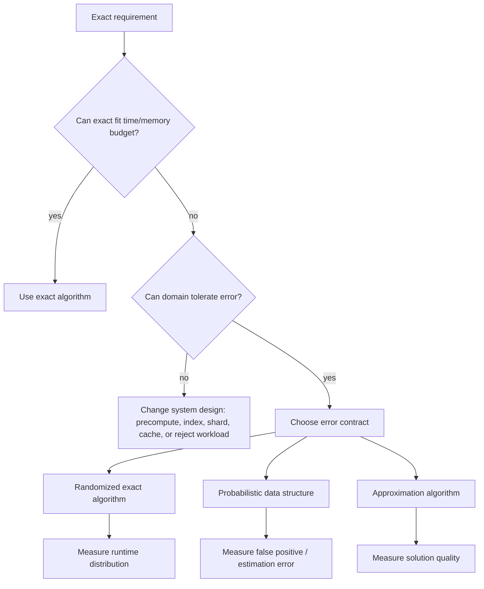
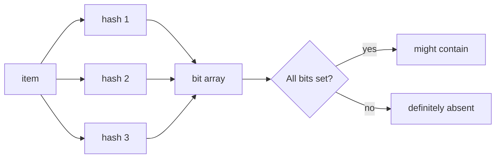
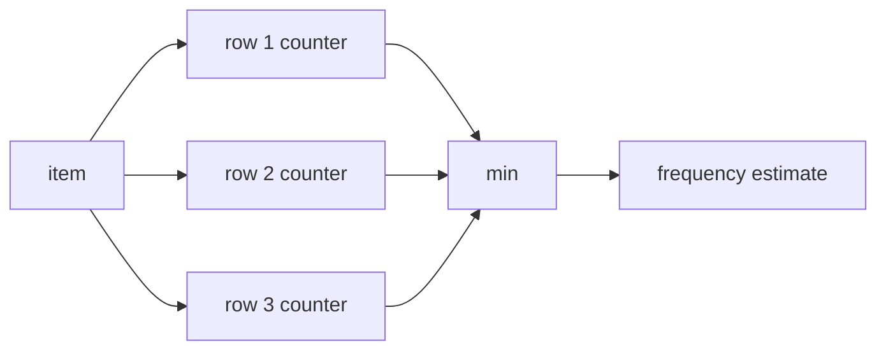
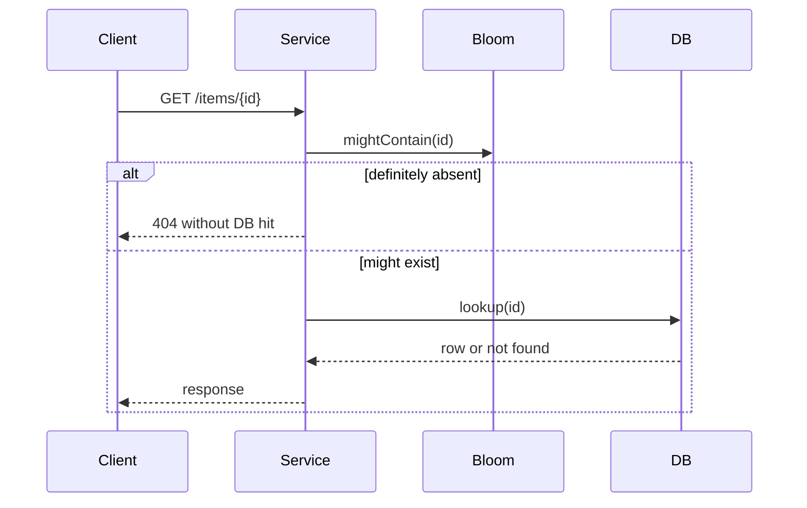

------
title: Learn Java Data Structures and Algorithms - Part 033
description: Randomized, probabilistic, and approximation algorithms in Java: randomized quicksort, reservoir sampling, Bloom filter, Count-Min Sketch, HyperLogLog intuition, MinHash, probabilistic guarantees, reproducible randomness, and approximation trade-offs.
series: learn-java-dsa
seriesTitle: Learn Java Data Structures and Algorithms
order: 33
partTitle: Randomized, Probabilistic, and Approximation Algorithms
tags:
- java
- data-structures
- algorithms
- randomized-algorithms
- probabilistic-data-structures
- approximation
- bloom-filter
- sketches
- sampling
- series
date: 2026-06-27
---

# Part 033 — Randomized, Probabilistic, and Approximation Algorithms

Part 032 covered backtracking: explore the exact search space, but prune aggressively.

This part covers a different engineering move:

> When exactness is too expensive, use randomness, probability, or approximation to buy speed, memory efficiency, or simplicity — while making the error model explicit.

Randomized and probabilistic algorithms are not "less rigorous" algorithms. They are algorithms whose contract includes probability.

A top-tier engineer does not simply say:

> "This is probably fine."

They say:

> "This structure has no false negatives, may have false positives, and the false-positive probability is approximately 1% under this capacity and hash assumption."

That difference matters.

---

## 1. Skill Target

After this part, you should be able to:

1. Distinguish **randomized algorithms**, **probabilistic data structures**, and **approximation algorithms**.
2. Use seeded randomness to make randomized algorithms reproducible.
3. Implement randomized quicksort, randomized selection, Fisher-Yates shuffle, and reservoir sampling in Java.
4. Implement a production-shaped Bloom filter with explicit capacity and false-positive reasoning.
5. Understand Count-Min Sketch, HyperLogLog-style cardinality estimation, MinHash, and locality-sensitive thinking.
6. Decide when approximation is an engineering win and when it is unacceptable.
7. Test probabilistic behavior without making tests flaky.
8. Communicate approximate guarantees precisely.

The goal is not to memorize every probabilistic structure. The goal is to build the mental model for trading exactness against resource cost.

---

## 2. Kaufman Framing

Kaufman's method tells us to deconstruct the skill and practice the parts that unlock useful performance fastest.

For this topic, the subskills are:

| Subskill | Why It Matters |
|---|---|
| Randomness as input | A randomized algorithm is deterministic given its random choices. |
| Error model | You must know whether errors are false positives, false negatives, bounded approximation, or probabilistic runtime. |
| Reproducibility | Debugging requires seeds and deterministic replay. |
| Hashing discipline | Most probabilistic structures depend on hash distribution. |
| Parameter selection | Capacity, error rate, sample size, sketch width/depth are part of the API contract. |
| Statistical testing | Unit tests need deterministic examples; probabilistic tests need tolerance. |
| Business semantics | Approximate fraud counts, approximate rate limits, and approximate financial decisions do not carry the same risk. |

The first 20 hours should not be spent reading every randomized algorithm ever invented. Spend them on:

1. randomized sorting/selection,
2. sampling,
3. Bloom filters,
4. sketches,
5. reproducible benchmarking,
6. choosing the right error contract.

---

## 3. Taxonomy

There are three families that are often mixed together.

### 3.1 Randomized Algorithms

A randomized algorithm uses random choices internally.

Examples:

- randomized quicksort,
- randomized quickselect,
- randomized hashing,
- random sampling,
- randomized load balancing.

The answer may still be exact.

Randomized quicksort returns a correctly sorted array. Randomness affects runtime distribution, not correctness.

### 3.2 Probabilistic Data Structures

A probabilistic data structure stores an approximate representation of data.

Examples:

- Bloom filter,
- Count-Min Sketch,
- HyperLogLog,
- Cuckoo filter,
- quotient filter,
- reservoir sample,
- MinHash signature.

The data structure's contract usually says something like:

- no false negatives, possible false positives,
- approximate count with bounded overestimation,
- approximate cardinality,
- approximate similarity.

### 3.3 Approximation Algorithms

An approximation algorithm returns a near-optimal solution for an optimization problem.

Examples:

- 2-approximation for vertex cover,
- greedy set cover approximation,
- approximation schemes for knapsack,
- metric TSP approximation,
- online caching heuristics.

The output is usually not exact, but its quality may be bounded.

---

## 4. Core Mental Model

Randomization and approximation are resource trade-offs.



The decision is not:

> exact versus approximate.

The decision is:

> Which correctness contract is acceptable under our resource budget?

---

## 5. Error Contracts

Every probabilistic or approximate solution needs an explicit error contract.

| Structure / Algorithm | Output Type | Error Pattern |
|---|---|---|
| Randomized quicksort | exact sorted array | runtime probabilistic |
| Randomized quickselect | exact selected element | runtime probabilistic |
| Bloom filter | membership maybe | no false negatives, possible false positives |
| Count-Min Sketch | approximate frequency | never underestimates with non-negative updates; may overestimate |
| HyperLogLog | cardinality estimate | relative estimation error |
| Reservoir sample | sample | random sample; sample variance |
| MinHash | similarity estimate | estimation error decreases with signature size |
| Greedy set cover | approximate cover | solution size within approximation bound under assumptions |

Do not deploy a probabilistic structure until you can complete this sentence:

> This algorithm may be wrong only in the following direction: ____.

Examples:

- Bloom filter: "may say present when absent, but should not say absent when present."
- Count-Min Sketch: "may overestimate frequency, but not underestimate under insert-only counting."
- Reservoir sample: "may not contain a particular element, but each item has equal inclusion probability under the stream model."

---

## 6. Randomness in Java

Modern Java exposes random generators through the `java.util.random.RandomGenerator` family and several concrete generators such as `SplittableRandom`, `Random`, and `ThreadLocalRandom`.

For DSA practice, prefer making randomness injectable.

Bad:

```java
int pivot = left + new Random().nextInt(right - left + 1);
```

Better:

```java
int pivot = left + rng.nextInt(right - left + 1);
```

Where `rng` is passed into the algorithm or stored in the object.

### 6.1 Randomness Choice

| Generator | Good For | Be Careful With |
|---|---|---|
| `Random` | simple reproducible demos | shared contention and older API shape |
| `SplittableRandom` | deterministic simulations, forkable streams | not for cryptographic use |
| `ThreadLocalRandom` | concurrent non-crypto random values | less convenient for deterministic replay |
| `SecureRandom` | security-sensitive randomness | slower; not needed for normal DSA |

For algorithmic experiments:

```java
SplittableRandom rng = new SplittableRandom(42L);
```

For production systems, store and log the seed when reproducibility matters.

---

## 7. Fisher-Yates Shuffle

A shuffle is easy to get subtly wrong.

The correct Fisher-Yates invariant:

> After processing index `i`, positions `[i, n)` contain a uniformly random subset of the original elements, fixed in final position.

Implementation:

```java
import java.util.SplittableRandom;

public final class Shuffles {
    private Shuffles() {}

    public static void shuffle(int[] a, SplittableRandom rng) {
        for (int i = a.length - 1; i > 0; i--) {
            int j = rng.nextInt(i + 1); // 0 <= j <= i
            swap(a, i, j);
        }
    }

    private static void swap(int[] a, int i, int j) {
        int t = a[i];
        a[i] = a[j];
        a[j] = t;
    }
}
```

Common bug:

```java
int j = rng.nextInt(a.length);
```

This picks from the whole array every time. It does not implement Fisher-Yates and produces biased permutations.

### 7.1 Uniformity Reasoning

At step `i`, exactly one item is chosen uniformly among `i + 1` candidates to occupy position `i`.

Then the algorithm never touches position `i` again.

Therefore each position receives one of the remaining items uniformly.

---

## 8. Randomized Quicksort

Quicksort has poor worst-case behavior if pivot selection is consistently bad.

Random pivoting makes adversarial input less able to force worst-case behavior unless the adversary controls the random choices.

```java
import java.util.SplittableRandom;

public final class RandomizedQuickSort {
    private static final int INSERTION_SORT_THRESHOLD = 24;

    private final SplittableRandom rng;

    public RandomizedQuickSort(long seed) {
        this.rng = new SplittableRandom(seed);
    }

    public void sort(int[] a) {
        quicksort(a, 0, a.length);
    }

    private void quicksort(int[] a, int lo, int hi) { // [lo, hi)
        while (hi - lo > INSERTION_SORT_THRESHOLD) {
            int pivotIndex = lo + rng.nextInt(hi - lo);
            int pivot = a[pivotIndex];

            int[] bounds = partition3(a, lo, hi, pivot);
            int lt = bounds[0];
            int gt = bounds[1];

            // Recurse on smaller side first to bound stack depth.
            if (lt - lo < hi - gt) {
                quicksort(a, lo, lt);
                lo = gt;
            } else {
                quicksort(a, gt, hi);
                hi = lt;
            }
        }

        insertionSort(a, lo, hi);
    }

    // Returns [lt, gt), the equal-to-pivot band.
    private static int[] partition3(int[] a, int lo, int hi, int pivot) {
        int lt = lo;
        int i = lo;
        int gt = hi;

        while (i < gt) {
            if (a[i] < pivot) {
                swap(a, lt++, i++);
            } else if (a[i] > pivot) {
                swap(a, i, --gt);
            } else {
                i++;
            }
        }

        return new int[] { lt, gt };
    }

    private static void insertionSort(int[] a, int lo, int hi) {
        for (int i = lo + 1; i < hi; i++) {
            int x = a[i];
            int j = i - 1;
            while (j >= lo && a[j] > x) {
                a[j + 1] = a[j];
                j--;
            }
            a[j + 1] = x;
        }
    }

    private static void swap(int[] a, int i, int j) {
        int t = a[i];
        a[i] = a[j];
        a[j] = t;
    }
}
```

### 8.1 Why 3-Way Partitioning Matters

Without 3-way partitioning, arrays with many duplicates can degrade badly.

Invariant for `partition3`:

```text
[lo, lt)  < pivot
[lt, i)   == pivot
[i, gt)   unknown
[gt, hi)  > pivot
```

This is the same invariant style we used throughout the series.

### 8.2 Practical Note

Do not replace Java's built-in sort in ordinary production code without measuring. This implementation is for learning and specialized control.

Built-in sorting benefits from years of tuning, edge-case handling, and JVM/runtime integration.

---

## 9. Randomized Quickselect

Quickselect finds the element that would appear at index `k` in sorted order.

It is useful for:

- median,
- percentile,
- top-k threshold,
- order statistics,
- approximate cutoffs before full ranking.

```java
import java.util.SplittableRandom;

public final class QuickSelect {
    private final SplittableRandom rng;

    public QuickSelect(long seed) {
        this.rng = new SplittableRandom(seed);
    }

    public int select(int[] a, int k) {
        if (k < 0 || k >= a.length) {
            throw new IllegalArgumentException("k out of range: " + k);
        }

        int lo = 0;
        int hi = a.length;

        while (true) {
            if (hi - lo == 1) {
                return a[lo];
            }

            int pivot = a[lo + rng.nextInt(hi - lo)];
            int[] bounds = partition3(a, lo, hi, pivot);
            int lt = bounds[0];
            int gt = bounds[1];

            if (k < lt) {
                hi = lt;
            } else if (k >= gt) {
                lo = gt;
            } else {
                return pivot;
            }
        }
    }

    private static int[] partition3(int[] a, int lo, int hi, int pivot) {
        int lt = lo;
        int i = lo;
        int gt = hi;

        while (i < gt) {
            if (a[i] < pivot) swap(a, lt++, i++);
            else if (a[i] > pivot) swap(a, i, --gt);
            else i++;
        }

        return new int[] { lt, gt };
    }

    private static void swap(int[] a, int i, int j) {
        int t = a[i];
        a[i] = a[j];
        a[j] = t;
    }
}
```

### 9.1 Contract

Quickselect mutates the array.

That must be part of the API contract.

If mutation is unacceptable, copy first:

```java
int[] copy = input.clone();
int median = new QuickSelect(42).select(copy, copy.length / 2);
```

Do not hide a full copy inside a utility method unless the method name or documentation makes the memory cost clear.

---

## 10. Reservoir Sampling

Reservoir sampling selects a uniform sample of size `k` from a stream of unknown length.

Use cases:

- sample request traces,
- sample events for debugging,
- keep representative examples from a massive stream,
- estimate distribution manually.

For `k = 1`, the algorithm is:

> Replace the current sample with the `i`-th item with probability `1 / i`.

For general `k`:

```java
import java.util.ArrayList;
import java.util.List;
import java.util.SplittableRandom;

public final class ReservoirSampler<T> {
    private final int capacity;
    private final SplittableRandom rng;
    private final ArrayList<T> sample;
    private long seen;

    public ReservoirSampler(int capacity, long seed) {
        if (capacity < 0) {
            throw new IllegalArgumentException("capacity must be non-negative");
        }
        this.capacity = capacity;
        this.rng = new SplittableRandom(seed);
        this.sample = new ArrayList<>(capacity);
    }

    public void add(T item) {
        seen++;

        if (sample.size() < capacity) {
            sample.add(item);
            return;
        }

        if (capacity == 0) {
            return;
        }

        long j = nextLong(rng, seen); // 0 <= j < seen
        if (j < capacity) {
            sample.set((int) j, item);
        }
    }

    public List<T> snapshot() {
        return List.copyOf(sample);
    }

    public long seen() {
        return seen;
    }

    // SplittableRandom has bounded long methods in modern Java, but this helper
    // keeps the algorithm explicit for learning.
    private static long nextLong(SplittableRandom rng, long bound) {
        if (bound <= 0) {
            throw new IllegalArgumentException("bound must be positive");
        }
        long r = rng.nextLong() >>> 1;
        return r % bound;
    }
}
```

### 10.1 Bias Warning

The helper above uses modulo reduction for simplicity. For rigorous uniformity with arbitrary large bounds, prefer the standard library's bounded method when available.

The mental model matters more than this helper:

- first `k` items fill the reservoir,
- item `i` has probability `k / i` of being admitted,
- if admitted, it replaces a uniformly chosen existing sample.

### 10.2 Inclusion Probability

At the end, each item has probability `k / n` of being in the reservoir.

That is the contract.

It does not mean the sample perfectly represents every subgroup. Small samples can miss rare categories.

---

## 11. Bloom Filter

A Bloom filter is a compact approximate membership structure.

It supports:

- `add(x)`,
- `mightContain(x)`.

It does not support exact deletion in the basic form.

Contract:

- If `mightContain(x)` is `false`, `x` was definitely not added.
- If `mightContain(x)` is `true`, `x` may have been added.

False negatives should not happen if the implementation is correct and the filter is not corrupted.

False positives are expected.



### 11.1 Parameter Model

Let:

- `n` = expected insertions,
- `p` = desired false-positive probability,
- `m` = number of bits,
- `k` = number of hash functions.

Common formulas:

```text
m = -n * ln(p) / (ln(2)^2)
k = (m / n) * ln(2)
```

These formulas assume good hash distribution and approximately independent hash functions.

### 11.2 Java Implementation

This implementation uses double hashing to derive `k` indices from two 64-bit hash values.

```java
import java.nio.charset.StandardCharsets;
import java.util.BitSet;
import java.util.Objects;

public final class BloomFilter {
    private final BitSet bits;
    private final int bitSize;
    private final int hashCount;
    private long inserted;

    public BloomFilter(long expectedInsertions, double falsePositiveRate) {
        if (expectedInsertions <= 0) {
            throw new IllegalArgumentException("expectedInsertions must be positive");
        }
        if (!(falsePositiveRate > 0.0 && falsePositiveRate < 1.0)) {
            throw new IllegalArgumentException("falsePositiveRate must be in (0, 1)");
        }

        long m = optimalBitSize(expectedInsertions, falsePositiveRate);
        if (m > Integer.MAX_VALUE) {
            throw new IllegalArgumentException("bit array too large for this implementation: " + m);
        }

        this.bitSize = (int) m;
        this.hashCount = optimalHashCount(expectedInsertions, bitSize);
        this.bits = new BitSet(bitSize);
    }

    public void add(String value) {
        Objects.requireNonNull(value, "value");
        Hash128 h = hash128(value);

        for (int i = 0; i < hashCount; i++) {
            int index = index(h.h1(), h.h2(), i, bitSize);
            bits.set(index);
        }

        inserted++;
    }

    public boolean mightContain(String value) {
        Objects.requireNonNull(value, "value");
        Hash128 h = hash128(value);

        for (int i = 0; i < hashCount; i++) {
            int index = index(h.h1(), h.h2(), i, bitSize);
            if (!bits.get(index)) {
                return false;
            }
        }

        return true;
    }

    public long inserted() {
        return inserted;
    }

    public int bitSize() {
        return bitSize;
    }

    public int hashCount() {
        return hashCount;
    }

    public double estimatedFalsePositiveRate() {
        return Math.pow(1.0 - Math.exp(-1.0 * hashCount * inserted / bitSize), hashCount);
    }

    private static long optimalBitSize(long n, double p) {
        return (long) Math.ceil(-n * Math.log(p) / (Math.log(2) * Math.log(2)));
    }

    private static int optimalHashCount(long n, long m) {
        return Math.max(1, (int) Math.round((double) m / n * Math.log(2)));
    }

    private static int index(long h1, long h2, int i, int mod) {
        long combined = h1 + i * h2;
        combined ^= (combined >>> 33);
        return Math.floorMod(combined, mod);
    }

    // Educational non-cryptographic 128-bit-ish hashing from two mixed streams.
    // In production, use a vetted hash such as Murmur3, XXH3, or a library already standard in your stack.
    private static Hash128 hash128(String value) {
        byte[] bytes = value.getBytes(StandardCharsets.UTF_8);
        long h1 = 0x9E3779B97F4A7C15L;
        long h2 = 0xC2B2AE3D27D4EB4FL;

        for (byte b : bytes) {
            h1 ^= (b & 0xff);
            h1 *= 0x100000001B3L;
            h1 = Long.rotateLeft(h1, 27);

            h2 += (b & 0xff) * 0x9E3779B97F4A7C15L;
            h2 ^= (h2 >>> 29);
            h2 *= 0xBF58476D1CE4E5B9L;
        }

        h1 = mix64(h1);
        h2 = mix64(h2);
        if (h2 == 0) {
            h2 = 0x9E3779B97F4A7C15L;
        }
        return new Hash128(h1, h2);
    }

    private static long mix64(long z) {
        z = (z ^ (z >>> 30)) * 0xBF58476D1CE4E5B9L;
        z = (z ^ (z >>> 27)) * 0x94D049BB133111EBL;
        return z ^ (z >>> 31);
    }

    private record Hash128(long h1, long h2) {}
}
```

### 11.3 Bloom Filter Use Cases

Good fits:

- pre-check before expensive storage lookup,
- duplicate suppression where occasional false positives are acceptable,
- cache penetration defense,
- web crawler URL seen-check,
- blocklist prefilter where final exact check still exists.

Bad fits:

- financial entitlement checks,
- legal/regulatory eligibility decisions,
- authentication/authorization final decision,
- any domain where false positive means a user loses a right or resource,
- small datasets where exact `HashSet` is simpler and cheap.

### 11.4 Saturation

A Bloom filter has a capacity assumption.

If you insert far more than expected, more bits become set and the false-positive rate rises.

Expose this metric:

```java
public double fillRatio() {
    return (double) bits.cardinality() / bitSize;
}
```

If the fill ratio approaches 1, the filter becomes useless.

---

## 12. Counting Bloom Filter

A standard Bloom filter cannot delete safely.

A counting Bloom filter replaces bits with counters.

```text
add(x): increment k counters
remove(x): decrement k counters
query(x): all k counters > 0
```

Trade-offs:

- more memory,
- counter overflow risk,
- deletion can create false negatives if removing items not present,
- concurrent updates are harder.

A counting Bloom filter is not just a Bloom filter with delete. It has a stronger operational requirement:

> Removal must be applied only for items previously added and not already removed.

Without that, counters lie.

---

## 13. Count-Min Sketch

A Count-Min Sketch approximates frequencies.

It uses `d` hash functions and `d` rows of counters.

For an item:

- increment one counter per row,
- estimate frequency as the minimum counter across rows.



Why minimum?

Each row may collide with other items and overcount. Taking the minimum chooses the least contaminated estimate.

### 13.1 Insert-Only Contract

For non-negative increments:

```text
trueCount(x) <= estimate(x)
```

The sketch may overestimate but should not underestimate.

### 13.2 Java Implementation

```java
import java.nio.charset.StandardCharsets;
import java.util.Objects;

public final class CountMinSketch {
    private final long[][] table;
    private final int depth;
    private final int width;
    private long total;

    public CountMinSketch(int depth, int width) {
        if (depth <= 0 || width <= 0) {
            throw new IllegalArgumentException("depth and width must be positive");
        }
        this.depth = depth;
        this.width = width;
        this.table = new long[depth][width];
    }

    public void add(String item, long count) {
        Objects.requireNonNull(item, "item");
        if (count < 0) {
            throw new IllegalArgumentException("count must be non-negative");
        }

        long h1 = hash64(item, 0x9E3779B97F4A7C15L);
        long h2 = hash64(item, 0xC2B2AE3D27D4EB4FL);

        for (int row = 0; row < depth; row++) {
            int col = Math.floorMod(h1 + row * h2, width);
            table[row][col] += count;
        }

        total += count;
    }

    public long estimate(String item) {
        Objects.requireNonNull(item, "item");
        long h1 = hash64(item, 0x9E3779B97F4A7C15L);
        long h2 = hash64(item, 0xC2B2AE3D27D4EB4FL);

        long best = Long.MAX_VALUE;
        for (int row = 0; row < depth; row++) {
            int col = Math.floorMod(h1 + row * h2, width);
            best = Math.min(best, table[row][col]);
        }
        return best;
    }

    public long total() {
        return total;
    }

    private static long hash64(String s, long seed) {
        long h = seed;
        byte[] bytes = s.getBytes(StandardCharsets.UTF_8);
        for (byte b : bytes) {
            h ^= (b & 0xff);
            h *= 0x100000001B3L;
            h = Long.rotateLeft(h, 31);
        }
        return mix64(h);
    }

    private static long mix64(long z) {
        z = (z ^ (z >>> 30)) * 0xBF58476D1CE4E5B9L;
        z = (z ^ (z >>> 27)) * 0x94D049BB133111EBL;
        return z ^ (z >>> 31);
    }
}
```

### 13.3 Use Cases

Good fits:

- heavy hitter detection,
- approximate API usage counters,
- telemetry aggregation,
- per-key rate-limit hints before exact enforcement,
- stream analytics.

Bad fits:

- exact billing,
- exact quota enforcement without a fallback,
- auditing where each count must reconcile exactly.

### 13.4 Conservative Update

A common improvement is conservative update:

1. estimate current count,
2. increment only counters equal to the current minimum.

This reduces overestimation in many workloads.

But it complicates reasoning and concurrency.

---

## 14. HyperLogLog Intuition

HyperLogLog estimates the number of distinct elements.

The core idea:

> Hash each item. The maximum number of leading zero bits observed tells us something about cardinality.

Why?

A hash with `r` leading zeroes occurs with probability about `1 / 2^r`.

Seeing a very rare pattern suggests many items were sampled.

HyperLogLog improves this by using many registers and combining estimates statistically.

### 14.1 Contract

HyperLogLog does not tell you exactly which items were seen.

It estimates cardinality:

```text
approximately distinctCount(stream)
```

Good fits:

- daily active users estimate,
- approximate unique IPs,
- distinct search queries,
- cardinality dashboard.

Bad fits:

- legal count of affected users,
- exact billing,
- deduplication decisions.

### 14.2 Mergeability

A major advantage: sketches can be merged.

If two services maintain HLL sketches for two shards, a global estimate can be formed by taking register-wise maxima.

This is why sketches are powerful in distributed systems.

---

## 15. MinHash Intuition

MinHash estimates Jaccard similarity between sets.

Jaccard similarity:

```text
J(A, B) = |A ∩ B| / |A ∪ B|
```

MinHash idea:

> Under a random permutation, the probability that two sets have the same minimum element equals their Jaccard similarity.

In practice, we simulate many permutations using hash functions.

Use cases:

- near-duplicate document detection,
- similar URL detection,
- plagiarism-ish similarity prefilter,
- clustering large sets cheaply.

The result is a similarity estimate, not proof of equality.

---

## 16. Approximation Algorithms

Approximation algorithms are different from probabilistic data structures.

They usually solve hard optimization problems approximately.

### 16.1 Vertex Cover 2-Approximation

Problem:

> Choose the smallest set of vertices such that every edge touches at least one chosen vertex.

Greedy 2-approximation:

1. Pick any uncovered edge `(u, v)`.
2. Add both `u` and `v` to the cover.
3. Remove all edges incident to `u` or `v`.
4. Repeat.

Why 2-approx?

Every chosen edge is disjoint from previously chosen edges. Any valid vertex cover must include at least one endpoint from each chosen edge. We include two endpoints per chosen edge.

Therefore:

```text
ourSolution <= 2 * optimalSolution
```

### 16.2 Greedy Set Cover

Problem:

> Choose the fewest sets whose union covers all required elements.

Greedy heuristic:

- repeatedly choose the set covering the largest number of uncovered elements.

It has an approximation guarantee related to the harmonic number under the classic set-cover formulation.

But in production, the more important lesson is:

> Greedy is defensible only when you can state why it is safe or how far it may be from optimal.

---

## 17. Approximate Versus Heuristic

These words are often used casually, but they should be separated.

| Term | Meaning |
|---|---|
| Exact algorithm | Returns exact answer. |
| Randomized exact algorithm | Returns exact answer; runtime/path depends on randomness. |
| Monte Carlo algorithm | Runtime bounded; answer may be wrong with bounded probability. |
| Las Vegas algorithm | Answer always correct; runtime random. |
| Approximation algorithm | Returns near-optimal answer with quality guarantee. |
| Heuristic | Often works, but no formal guarantee. |

A heuristic can still be valuable. But do not sell a heuristic as an approximation algorithm unless you have a bound.

---

## 18. Production Decision Matrix

| Requirement | Prefer |
|---|---|
| Need exact membership | `HashSet`, database index, exact cache |
| Need cheap prefilter | Bloom filter |
| Need approximate frequency | Count-Min Sketch |
| Need approximate unique count | HyperLogLog |
| Need stream sample | Reservoir sampling |
| Need exact top-k on bounded data | Heap / quickselect |
| Need approximate heavy hitters | Sketch + exact validation for candidates |
| Need final authorization decision | Exact structure only |
| Need dashboard trend | Sketch may be acceptable |
| Need audit evidence | Exact source of truth |

---

## 19. Testing Probabilistic Code

Do not write flaky tests like:

```java
assertTrue(sample.contains("important"));
```

A random sample may legitimately omit an item.

### 19.1 Deterministic Unit Tests

Use fixed seeds and small inputs.

```java
@Test
void seededShuffleIsReproducible() {
    int[] a = {1, 2, 3, 4, 5};
    int[] b = {1, 2, 3, 4, 5};

    Shuffles.shuffle(a, new SplittableRandom(123));
    Shuffles.shuffle(b, new SplittableRandom(123));

    assertArrayEquals(a, b);
}
```

### 19.2 Contract Tests

For Bloom filter:

```java
@Test
void bloomFilterHasNoFalseNegativesForInsertedItems() {
    BloomFilter f = new BloomFilter(1_000, 0.01);

    for (int i = 0; i < 1_000; i++) {
        f.add("item-" + i);
    }

    for (int i = 0; i < 1_000; i++) {
        assertTrue(f.mightContain("item-" + i));
    }
}
```

### 19.3 Statistical Smoke Tests

Use broad tolerances.

```java
@Test
void reservoirRoughlySamplesAcrossEntireStream() {
    int n = 10_000;
    int k = 100;
    ReservoirSampler<Integer> sampler = new ReservoirSampler<>(k, 42);

    for (int i = 0; i < n; i++) {
        sampler.add(i);
    }

    List<Integer> sample = sampler.snapshot();
    assertEquals(k, sample.size());

    double avg = sample.stream().mapToInt(Integer::intValue).average().orElseThrow();

    // Expected mean of 0..9999 is about 4999.5.
    // This tolerance is intentionally loose; this is not a proof test.
    assertTrue(avg > 3_500 && avg < 6_500);
}
```

Statistical tests are useful for catching obvious bugs, not for proving distribution correctness.

---

## 20. Benchmarking Probabilistic Structures

Measure:

1. insertion throughput,
2. query throughput,
3. memory usage,
4. false-positive rate,
5. error under realistic distribution,
6. merge cost,
7. serialization cost,
8. cold-start behavior.

For skewed workloads, test at least:

- uniform keys,
- Zipf-like hot keys,
- sequential keys,
- adversarially similar strings,
- high-cardinality keys,
- repeated duplicate-heavy streams.

Do not benchmark only random UUIDs unless production keys look like random UUIDs.

---

## 21. Observability

Probabilistic components need explicit metrics.

For Bloom filter:

- expected insertions,
- actual insertions,
- bit size,
- hash count,
- fill ratio,
- estimated false-positive rate,
- rebuild count.

For Count-Min Sketch:

- width,
- depth,
- total increments,
- top candidates,
- max counter saturation,
- estimate versus exact sample audit.

For reservoir sampling:

- stream size seen,
- reservoir size,
- seed or seed derivation,
- sampling policy version.

---

## 22. Serialization and Versioning

Probabilistic structures are often persisted or shipped across services.

Version the following:

- hash function,
- seed,
- bit size / width / depth,
- number of hash functions,
- encoding format,
- endianness if binary,
- algorithm version,
- expected capacity and error target.

A Bloom filter built with one hash function cannot safely be queried with another.

---

## 23. Security Caveat

Most DSA randomness is not security randomness.

Do not use `SplittableRandom`, `Random`, or non-cryptographic hashes for:

- token generation,
- password reset links,
- session identifiers,
- cryptographic salts where a security API is required,
- adversarial proof-of-work/security checks.

Use security-specific APIs and security review for those domains.

---

## 24. Failure Modes

| Failure | Cause | Mitigation |
|---|---|---|
| Flaky tests | Testing random outcomes as deterministic | Use seeded tests and statistical tolerance |
| Bloom filter too many false positives | Capacity exceeded | Track fill ratio and rebuild |
| Hidden false negatives | Bad deletion/corruption/hash mismatch | Version structures and validate inserts |
| Sketch overestimates too much | Width too small or skew high | Increase width, conservative update, exact validation |
| Approximation misused for final decision | Domain mismatch | Keep exact source of truth |
| Non-reproducible incident | Seed not logged | Inject and log seed/policy version |
| Hash attack | Adversarial keys exploit hash weakness | Use stronger hashing or exact fallback |
| Misleading dashboard | Error bars hidden | Expose estimate bounds and sampling policy |

---

## 25. Java API Design Principles

A probabilistic Java API should expose its contract.

Bad:

```java
boolean contains(String key);
```

Better:

```java
boolean mightContain(String key);
```

Bad:

```java
long count(String key);
```

Better:

```java
long estimateCount(String key);
```

Good names prevent misuse.

Also expose parameter metadata:

```java
public record BloomFilterStats(
    long expectedInsertions,
    long actualInsertions,
    int bitSize,
    int hashCount,
    double fillRatio,
    double estimatedFalsePositiveRate
) {}
```

The API should make it difficult to mistake approximate output for exact output.

---

## 26. Mini Design Exercise: Cache Penetration Guard

Problem:

A service receives many lookups for IDs that do not exist. Each miss hits the database.

Candidate solution:

- Build a Bloom filter of existing IDs.
- On request:
  - if Bloom says definitely absent, skip DB,
  - if Bloom says might exist, query cache/DB as usual.

Correctness:

- false positive causes extra DB lookup, acceptable,
- false negative would incorrectly hide existing ID, unacceptable.

Therefore:

- no deletion unless counting filter is correct,
- rebuild filter from source of truth periodically,
- version filter with source snapshot time,
- do not use filter as source of truth.



---

## 27. Practice Loop

### Drill 1 — Reproducible Randomness

Implement randomized quickselect with injectable `SplittableRandom`.

Verify:

- same seed gives same mutation path,
- different seed still returns same selected value,
- sorted result check validates selection.

### Drill 2 — Bloom Filter Parameter Sweep

Build Bloom filters with target rates:

- 10%,
- 1%,
- 0.1%.

Insert 100,000 keys.

Query 100,000 non-inserted keys.

Measure actual false-positive rate.

### Drill 3 — Count-Min Sketch Under Skew

Generate a stream:

- 10 hot keys,
- 10,000 cold keys.

Compare exact `HashMap<String, Long>` counts with sketch estimates.

Observe which keys are overestimated.

### Drill 4 — Approximation Boundary

For a domain you know, classify decisions:

| Decision | Can be approximate? | Why? |
|---|---:|---|
| Dashboard metric | yes/no | |
| User-facing eligibility | yes/no | |
| Rate-limit prefilter | yes/no | |
| Billing count | yes/no | |
| Alert threshold | yes/no | |

The point is to connect algorithmic approximation to product and regulatory semantics.

---

## 28. Self-Correction Checklist

Before deploying a randomized/probabilistic/approximate algorithm, answer:

- What is exact and what is approximate?
- Can the algorithm return false positives?
- Can it return false negatives?
- Is the error bounded?
- Is the runtime probabilistic or the answer probabilistic?
- What seed is used?
- Can incidents be replayed?
- What happens when capacity assumptions are exceeded?
- Is the hash function versioned?
- Does the API name reveal approximation?
- Are metrics exposed?
- Is there an exact fallback for high-stakes decisions?
- Are tests deterministic where they need to be?
- Are statistical tests broad enough not to be flaky?

---

## 29. Part Summary

Randomized and probabilistic algorithms are engineering tools for explicit trade-offs.

The hierarchy is:

```text
Exact when affordable.
Randomized exact when it improves expected behavior.
Probabilistic when one-sided error is acceptable.
Approximate when near-optimal is enough.
Heuristic only when lack of guarantee is acknowledged.
```

The most dangerous failure is not approximation itself.

The dangerous failure is hidden approximation.

A top 1% engineer makes the contract visible: in method names, metrics, documentation, tests, and system design.

---

## 30. References for Further Study

- Java `java.util.random` package and `SplittableRandom`
- Java `BitSet`
- Bloom, Burton H. "Space/time trade-offs in hash coding with allowable errors"
- Cormode and Muthukrishnan, "An Improved Data Stream Summary: The Count-Min Sketch and its Applications"
- Flajolet et al., HyperLogLog literature
- Motwani and Raghavan, *Randomized Algorithms*
- Vazirani, *Approximation Algorithms*
