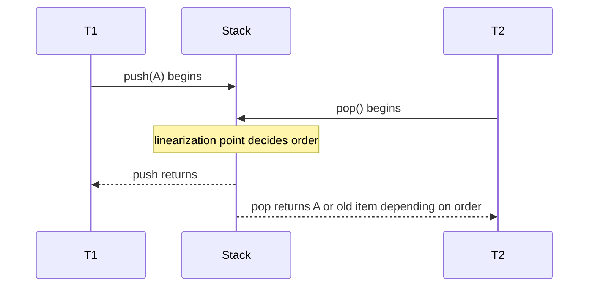
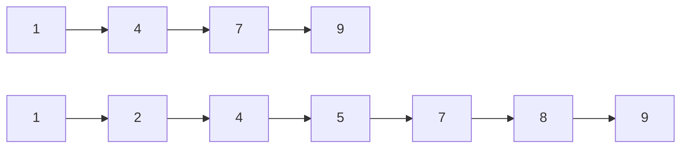

------
title: Learn Java Data Structures and Algorithms - Part 034
description: Concurrent and lock-free data structures in Java: correctness contracts, happens-before intuition, ConcurrentHashMap, concurrent queues, blocking queues, CAS, Treiber stack, ABA, linearizability, contention, and production testing.
series: learn-java-dsa
seriesTitle: Learn Java Data Structures and Algorithms
order: 34
partTitle: Concurrent and Lock-Free Data Structures in Java
tags:
- java
- data-structures
- algorithms
- concurrency
- lock-free
- concurrenthashmap
- blockingqueue
- atomic
- linearizability
- series
date: 2026-06-27
---

# Part 034 — Concurrent and Lock-Free Data Structures in Java

Part 033 covered algorithms where uncertainty is part of the contract.

This part covers another kind of uncertainty:

> multiple threads interleaving operations on the same data structure.

Concurrent data structures are not just faster versions of normal data structures.

They have a different correctness model.

For a single-threaded stack, correctness means:

```text
push(x); pop() == x
```

For a concurrent stack, correctness asks:

> Is there a legal sequential order that explains the observed concurrent result?

That question leads to **linearizability**, **happens-before**, **visibility**, **atomicity**, and **progress guarantees**.

---

## 1. Skill Target

After this part, you should be able to:

1. Choose between synchronized wrappers, concurrent collections, blocking queues, and lock-free structures.
2. Explain linearizability, thread-safety, visibility, contention, and progress guarantees.
3. Use `ConcurrentHashMap`, `LongAdder`, `ConcurrentLinkedQueue`, and `BlockingQueue` correctly.
4. Understand why `volatile` is not a substitute for compound atomicity.
5. Implement a simple lock-free stack with `AtomicReference`.
6. Recognize ABA, safe publication, iterator consistency, and size/count pitfalls.
7. Benchmark concurrent structures without drawing false conclusions.
8. Test concurrent behavior with stress thinking instead of ordinary unit-test confidence.

This is not a full Java concurrency course. It is the DSA layer: how data structure invariants survive interleaving.

---

## 2. Kaufman Framing

Concurrency is too large to learn by reading everything.

For DSA, decompose it into the smallest useful skill set:

| Subskill | Why It Matters |
|---|---|
| Shared mutable state | Every concurrent data structure protects or avoids this. |
| Atomic operation | Some state transitions must happen indivisibly. |
| Visibility | A write by one thread must become observable to another. |
| Linearization point | The instant an operation logically takes effect. |
| Progress guarantee | Blocking, lock-free, wait-free, obstruction-free mean different things. |
| Contention model | Performance collapses when many threads fight over the same memory. |
| Library selection | Java already provides many tuned structures; custom lock-free code is rare. |
| Testing discipline | Normal unit tests almost never explore enough interleavings. |

The first 20 hours should focus on using Java's built-in concurrent structures well and reading lock-free algorithms, not writing heroic custom code.

---

## 3. The Core Problem: Interleaving

Consider this non-thread-safe stack:

```java
public final class UnsafeStack<T> {
    private Node<T> head;

    public void push(T value) {
        head = new Node<>(value, head);
    }

    public T pop() {
        if (head == null) return null;
        T value = head.value;
        head = head.next;
        return value;
    }

    private record Node<T>(T value, Node<T> next) {}
}
```

Two threads can both read the same `head`, both compute a new state, and one update can overwrite the other.

The invariant:

```text
head points to the top node of a valid chain
```

is not enough.

We also need:

```text
each update from old head to new head is atomic with respect to other updates
```

---

## 4. Correctness Vocabulary

### 4.1 Thread-Safe

A class is thread-safe when it behaves correctly when accessed by multiple threads according to its documented contract.

This is not a performance claim.

A fully synchronized class can be thread-safe and slow.

### 4.2 Atomicity

An operation is atomic if no other thread observes it half-completed.

Example:

```java
count++;
```

is not atomic. It is read, add, write.

### 4.3 Visibility

A write by one thread is not automatically visible to another at the time you expect unless there is a proper happens-before relationship.

Concurrent collections and atomic classes provide specific memory effects. Ordinary unsynchronized field access does not provide enough coordination for shared mutation.

### 4.4 Linearizability

A concurrent object is linearizable if each operation appears to take effect at a single instant between its invocation and response.



Linearizability lets clients reason as if operations happened sequentially, even though they overlapped.

### 4.5 Progress Guarantees

| Guarantee | Meaning |
|---|---|
| Blocking | A delayed thread can prevent others from progressing. |
| Deadlock-free | Some thread eventually progresses, assuming scheduling. |
| Lock-free | System as a whole makes progress; individual threads may starve. |
| Wait-free | Every thread completes in bounded steps. |
| Obstruction-free | A thread progresses if it eventually runs alone. |

Many practical Java concurrent structures are not wait-free. That is fine. Know the contract.

---

## 5. Selection Matrix

| Need | Prefer |
|---|---|
| Simple synchronized access to small map | `Collections.synchronizedMap` or explicit lock |
| High-concurrency key-value access | `ConcurrentHashMap` |
| Concurrent sorted map | `ConcurrentSkipListMap` |
| Producer-consumer handoff | `BlockingQueue` |
| Non-blocking FIFO queue | `ConcurrentLinkedQueue` |
| Many reads, rare writes list | `CopyOnWriteArrayList` |
| Scalable counters | `LongAdder` / `LongAccumulator` |
| Single atomic reference update | `AtomicReference` or `VarHandle` |
| Custom lock-free data structure | Only with strong reason and stress testing |

Default principle:

> Prefer library concurrent data structures. Build custom lock-free structures only when you can prove the library cannot meet the invariant or performance requirement.

---

## 6. `Collections.synchronizedX` Is Not Magic

Java has synchronized wrappers such as:

```java
Map<K, V> map = Collections.synchronizedMap(new HashMap<>());
```

This synchronizes individual method calls.

But compound actions still need external synchronization.

Wrong:

```java
if (!map.containsKey(key)) {
    map.put(key, computeValue(key));
}
```

Two threads can both pass the check and compute.

Better:

```java
synchronized (map) {
    if (!map.containsKey(key)) {
        map.put(key, computeValue(key));
    }
}
```

But this serializes the map.

For high-concurrency maps, prefer `ConcurrentHashMap` and atomic methods.

---

## 7. `ConcurrentHashMap`

`ConcurrentHashMap` is the default high-concurrency hash map in Java.

It supports concurrent reads and updates without locking the whole map for ordinary operations.

### 7.1 Use Atomic Map Methods

Bad:

```java
if (!map.containsKey(key)) {
    map.put(key, value);
}
```

Better:

```java
map.putIfAbsent(key, value);
```

Better for computed values:

```java
Value v = map.computeIfAbsent(key, this::loadValue);
```

### 7.2 Frequency Map with `LongAdder`

High-contention counters are a classic problem.

```java
import java.util.concurrent.ConcurrentHashMap;
import java.util.concurrent.atomic.LongAdder;

public final class FrequencyMap<K> {
    private final ConcurrentHashMap<K, LongAdder> counts = new ConcurrentHashMap<>();

    public void increment(K key) {
        counts.computeIfAbsent(key, ignored -> new LongAdder()).increment();
    }

    public long estimate(K key) {
        LongAdder adder = counts.get(key);
        return adder == null ? 0L : adder.sum();
    }
}
```

Why not `AtomicLong` for everything?

`AtomicLong` is a single hot memory location under contention. `LongAdder` spreads contention internally and sums cells when needed.

Trade-off:

- better throughput under high contention,
- `sum()` is not necessarily a perfectly atomic snapshot relative to concurrent updates.

For metrics, `LongAdder` is usually excellent. For exact transactional state, be careful.

### 7.3 `computeIfAbsent` Caveat

The mapping function should be:

- short,
- side-effect-light,
- non-blocking if possible,
- not recursively modifying the same map in surprising ways.

Do not put slow remote calls inside `computeIfAbsent` casually.

A better pattern for expensive loads may use futures or an explicit loading cache design.

---

## 8. Concurrent Iterators and `size()`

Concurrent collections often provide weakly consistent iterators.

That means an iterator may reflect some, all, or none of concurrent modifications, depending on timing, but it should not throw `ConcurrentModificationException` merely because the structure changed concurrently.

Do not use iteration over a concurrent map as if it were a transactional snapshot unless the documentation says so or you create a snapshot yourself.

Also be careful with `size()` under concurrency.

A size method may be expensive, approximate, or stale relative to concurrent operations.

Use explicit counters when size is part of the business invariant.

---

## 9. Concurrent Queues

### 9.1 `ConcurrentLinkedQueue`

A non-blocking FIFO queue.

Good for:

- many producers and consumers,
- task handoff without blocking semantics,
- event buffering when consumers poll.

Bad for:

- backpressure by itself,
- bounded memory,
- blocking until item is available.

If producers can outpace consumers indefinitely, an unbounded queue can become a memory leak.

### 9.2 `BlockingQueue`

`BlockingQueue` gives producer-consumer semantics.

Common operations:

| Operation | Behavior |
|---|---|
| `put` | waits for capacity if full |
| `take` | waits for item if empty |
| `offer` | inserts if possible, otherwise returns false |
| `poll` | retrieves if possible, otherwise returns null |
| timed `offer/poll` | waits up to timeout |

Common implementations:

| Queue | Use Case |
|---|---|
| `ArrayBlockingQueue` | bounded fixed-capacity FIFO, good for backpressure |
| `LinkedBlockingQueue` | optionally bounded FIFO, can be large if unbounded |
| `PriorityBlockingQueue` | priority order, unbounded, no FIFO fairness for equal priority unless modeled |
| `DelayQueue` | items become available after delay |
| `SynchronousQueue` | direct handoff, no internal capacity |
| `LinkedTransferQueue` | high-throughput transfer patterns |

### 9.3 Producer-Consumer Example

```java
import java.util.concurrent.ArrayBlockingQueue;
import java.util.concurrent.BlockingQueue;

public final class WorkerPipeline<T> {
    private final BlockingQueue<T> queue;

    public WorkerPipeline(int capacity) {
        this.queue = new ArrayBlockingQueue<>(capacity);
    }

    public void submit(T item) throws InterruptedException {
        queue.put(item); // backpressure
    }

    public T take() throws InterruptedException {
        return queue.take();
    }
}
```

The queue is not merely a data structure. It is a backpressure policy.

---

## 10. Poison Pills and Shutdown

A blocking queue consumer needs a shutdown protocol.

One common pattern is a poison pill.

```java
public sealed interface Work permits Task, Stop {}
public record Task(String payload) implements Work {}
public enum Stop implements Work { INSTANCE }
```

Consumer:

```java
while (true) {
    Work work = queue.take();
    if (work == Stop.INSTANCE) {
        break;
    }
    process((Task) work);
}
```

For `N` consumers, you usually need `N` poison pills or another coordinated shutdown mechanism.

Failure mode:

- one poison pill with many consumers stops only one consumer,
- poison pill inserted before pending work can terminate too early if ordering is wrong,
- priority queues can reorder poison pills unless priority is modeled.

---

## 11. Copy-On-Write Structures

`CopyOnWriteArrayList` copies the backing array on mutation.

Good for:

- many readers,
- few writes,
- listener lists,
- configuration snapshots.

Bad for:

- frequent writes,
- large lists with frequent mutation,
- low-latency write paths.

Mental model:

```text
read: cheap stable snapshot
write: allocate and copy entire array
```

This is a data-structure trade-off, not a generic concurrency solution.

---

## 12. Skip Lists

`ConcurrentSkipListMap` gives concurrent sorted-map behavior.

A skip list uses multiple probabilistic levels to approximate balanced-tree search behavior.



Good for:

- concurrent ordered index,
- range queries,
- floor/ceiling in concurrent context,
- sorted scheduling.

Trade-off:

- more pointer-heavy than array structures,
- memory overhead,
- different performance profile from `TreeMap`.

---

## 13. Atomic Classes and CAS

`AtomicReference<T>` supports compare-and-set style updates.

CAS idea:

```text
if current == expected:
    current = newValue
    success
else:
    fail
```

CAS is optimistic.

It assumes conflicts are not constant. If conflict happens, retry.

### 13.1 CAS Loop Pattern

```java
while (true) {
    State oldState = ref.get();
    State newState = transition(oldState);
    if (ref.compareAndSet(oldState, newState)) {
        return;
    }
}
```

The transition must be pure or retry-safe.

Bad transition:

```java
State newState = transitionAndSendEmail(oldState);
```

If CAS fails and retries, the email may be sent multiple times.

CAS loops must not contain non-idempotent side effects before success.

---

## 14. Lock-Free Treiber Stack

A classic lock-free stack uses an atomic head pointer.

```java
import java.util.concurrent.atomic.AtomicReference;

public final class LockFreeStack<T> {
    private final AtomicReference<Node<T>> head = new AtomicReference<>();

    public void push(T value) {
        Node<T> newHead;
        Node<T> oldHead;
        do {
            oldHead = head.get();
            newHead = new Node<>(value, oldHead);
        } while (!head.compareAndSet(oldHead, newHead));
    }

    public T pop() {
        Node<T> oldHead;
        Node<T> newHead;
        do {
            oldHead = head.get();
            if (oldHead == null) {
                return null;
            }
            newHead = oldHead.next;
        } while (!head.compareAndSet(oldHead, newHead));

        return oldHead.value;
    }

    private static final class Node<T> {
        final T value;
        final Node<T> next;

        Node(T value, Node<T> next) {
            this.value = value;
            this.next = next;
        }
    }
}
```

### 14.1 Invariant

```text
head always points to the current top node or null
node.next chains to the previous stack state
push linearizes at successful CAS from old head to new node
pop linearizes at successful CAS from old head to oldHead.next
```

### 14.2 Why It Is Lock-Free

If one thread's CAS fails, it means another thread changed `head` successfully.

So system-wide progress occurred.

A particular thread may starve under extreme contention, but the structure as a whole progresses.

---

## 15. ABA Problem

CAS checks whether the current reference equals the expected reference.

Problem:

1. Thread T1 reads head = A.
2. T2 pops A.
3. T2 pops B.
4. T2 pushes A again.
5. T1 sees head is still A and CAS succeeds.

The head reference went A → B → A.

CAS sees A and thinks nothing changed.

This is ABA.

### 15.1 In Managed Java

Java's garbage collector reduces some memory-reclamation hazards seen in manual memory languages, because nodes are not normally freed and reused at the same memory address while still reachable.

But ABA can still matter when:

- nodes are reused from pools,
- state cycles between equal references,
- version-sensitive transitions are required,
- off-heap/native memory is involved,
- object identity is reused deliberately.

Mitigations:

- avoid node reuse,
- use stamped references,
- use versioned state objects,
- design idempotent transitions,
- use proven library structures.

Java provides `AtomicStampedReference` for reference + stamp patterns.

---

## 16. Immutability Helps CAS

CAS works best with immutable state snapshots.

Example:

```java
record RoutingTable(Map<String, String> routes, long version) {}
```

Update:

```java
while (true) {
    RoutingTable old = ref.get();
    Map<String, String> copy = new HashMap<>(old.routes());
    copy.put(path, target);
    RoutingTable next = new RoutingTable(Map.copyOf(copy), old.version() + 1);

    if (ref.compareAndSet(old, next)) {
        return next.version();
    }
}
```

This is not always cheap, but it makes correctness simpler.

Persistent/immutable structures are often easier to publish safely.

---

## 17. `volatile` Is Not Enough for Compound Actions

`volatile` gives visibility and ordering properties for reads/writes of the variable.

It does not make compound actions atomic.

Wrong:

```java
private volatile int count;

public void increment() {
    count++;
}
```

`count++` still performs read-modify-write.

Use:

```java
private final AtomicInteger count = new AtomicInteger();

public void increment() {
    count.incrementAndGet();
}
```

or `LongAdder` for high-throughput metrics.

---

## 18. Contention and False Sharing

Concurrency performance is often dominated by contention.

Contention means multiple threads repeatedly modify the same memory location or lock.

Symptoms:

- throughput stops scaling,
- CPU usage high but progress low,
- latency spikes,
- CAS failure rate high,
- lock wait time high.

False sharing happens when independent variables share the same cache line and different cores invalidate each other's cache line even though logically separate variables are used.

You do not need to optimize for false sharing early, but you should recognize it in high-throughput counters and ring buffers.

---

## 19. Bounded Queues as System Control

A bounded queue protects memory.

Unbounded queue:

```text
producer faster than consumer -> queue grows -> memory pressure -> GC pressure -> latency spike -> outage
```

Bounded queue:

```text
producer faster than consumer -> submit blocks/fails/times out -> backpressure visible
```

Design choice:

| Policy | Meaning |
|---|---|
| block | slow producer down |
| fail fast | reject work |
| timeout | wait briefly then reject |
| drop oldest | preserve newest events |
| drop newest | preserve backlog order |
| coalesce | merge redundant events |

The data structure encodes the reliability policy.

---

## 20. Designing a Concurrent Rate Counter

Suppose we need per-key request counts for metrics.

Use `ConcurrentHashMap<K, LongAdder>`.

```java
public final class RequestMetrics {
    private final ConcurrentHashMap<String, LongAdder> byEndpoint = new ConcurrentHashMap<>();

    public void record(String endpoint) {
        byEndpoint.computeIfAbsent(endpoint, ignored -> new LongAdder()).increment();
    }

    public Map<String, Long> snapshot() {
        Map<String, Long> result = new HashMap<>();
        byEndpoint.forEach((k, v) -> result.put(k, v.sum()));
        return Map.copyOf(result);
    }
}
```

This is good for metrics.

It may not be good for exact quotas because `snapshot()` is not a transactional boundary across all keys.

For exact quota, use stronger coordination or a purpose-built rate limiter.

---

## 21. Designing a Concurrent Work Queue

Question:

> Should we use `ConcurrentLinkedQueue` or `BlockingQueue`?

Ask:

1. Should consumers wait when empty?
2. Should producers be slowed when full?
3. Is there a capacity bound?
4. Is ordering strict FIFO?
5. Is priority needed?
6. How does shutdown work?
7. What happens under overload?

If backpressure matters, a bounded `BlockingQueue` is usually a better primitive than an unbounded non-blocking queue.

---

## 22. Linearization Points in Common Structures

| Operation | Likely Linearization Concept |
|---|---|
| `ConcurrentHashMap.putIfAbsent` | successful insertion/update in map internals |
| `AtomicReference.compareAndSet` | successful CAS |
| lock-free stack `push` | successful CAS of head |
| lock-free stack `pop` | successful CAS of head |
| `BlockingQueue.put` | insertion into queue after capacity coordination |
| `BlockingQueue.take` | removal from queue after item availability |

You rarely need to know internal exact machine instruction for JDK classes, but you do need to know whether an operation is atomic at API level.

---

## 23. Concurrent Algorithm Failure Modes

| Failure | Example | Fix |
|---|---|---|
| Lost update | `count++` on shared int | Atomic/lock/adder |
| Check-then-act race | `containsKey` then `put` | `putIfAbsent`, `compute` |
| Unsafe publication | object reference shared before constructor effects visible | final fields, volatile, safe publication |
| Iterator misconception | expecting snapshot from weak iterator | create snapshot explicitly |
| Unbounded queue overload | queue grows until OOM | bounded queue/backpressure |
| CAS side effect duplication | retry repeats external action | side effects after successful CAS |
| ABA | A→B→A fools CAS | stamped/versioned reference |
| Deadlock | locks acquired in inconsistent order | lock ordering or lock-free design |
| Starvation | one thread repeatedly loses CAS | backoff/fairness/alternative design |
| Size race | `size()` used as invariant | use atomic admission control |

---

## 24. Benchmarking Concurrent Data Structures

Concurrent benchmarking is harder than sequential benchmarking.

Measure:

- throughput,
- p50/p95/p99 latency,
- thread count scaling,
- allocation rate,
- GC behavior,
- contention/lock profiling,
- CAS failure rate if instrumented,
- fairness/starvation,
- tail latency under overload.

### 24.1 Common Benchmark Mistakes

| Mistake | Why It Lies |
|---|---|
| one thread only | does not measure concurrency |
| all threads use same key accidentally | measures hot-key contention only |
| all threads use random keys only | hides hot-key contention |
| no warmup | measures compilation/classloading |
| measuring `System.nanoTime` around tiny ops manually | high noise |
| no GC visibility | allocation pressure hidden |
| average latency only | hides tail collapse |

Use JMH for controlled microbenchmarks and JFR/profilers for system behavior.

---

## 25. Testing Concurrent Structures

Ordinary unit tests are necessary but not sufficient.

A test like this proves little:

```java
stack.push(1);
assertEquals(1, stack.pop());
```

It tests sequential behavior only.

### 25.1 Stress Shape

A simple stress test shape:

```java
int threads = 8;
int perThread = 100_000;
ExecutorService pool = Executors.newFixedThreadPool(threads);
LockFreeStack<Integer> stack = new LockFreeStack<>();

for (int t = 0; t < threads; t++) {
    final int base = t * perThread;
    pool.submit(() -> {
        for (int i = 0; i < perThread; i++) {
            stack.push(base + i);
        }
    });
}

pool.shutdown();
pool.awaitTermination(1, TimeUnit.MINUTES);
```

Then pop all values and verify count/uniqueness.

This still does not prove correctness. It increases the chance of finding obvious races.

For serious work, use dedicated concurrency stress tools such as jcstress-style testing, model checking, or proven library structures.

---

## 26. Safe Publication

A concurrent data structure is useless if it is published unsafely.

Good patterns:

- initialize before publishing,
- store in `final` fields,
- publish through volatile/atomic reference,
- publish through properly synchronized container,
- use class initialization safety for static final values.

Bad pattern:

```java
static MyStructure shared;

static void init() {
    shared = new MyStructure(); // no synchronization around publication
}
```

Other threads may observe stale or partially visible state depending on the broader program.

---

## 27. Read-Mostly Snapshot Pattern

For read-heavy, write-light data, immutable snapshots are often simpler than locks.

```java
import java.util.Map;
import java.util.concurrent.atomic.AtomicReference;

public final class SnapshotIndex<K, V> {
    private final AtomicReference<Map<K, V>> ref = new AtomicReference<>(Map.of());

    public V get(K key) {
        return ref.get().get(key);
    }

    public void put(K key, V value) {
        while (true) {
            Map<K, V> old = ref.get();
            Map<K, V> nextMutable = new java.util.HashMap<>(old);
            nextMutable.put(key, value);
            Map<K, V> next = Map.copyOf(nextMutable);
            if (ref.compareAndSet(old, next)) {
                return;
            }
        }
    }
}
```

Trade-off:

- reads are extremely simple,
- writes copy the map,
- works only when writes are rare and map size is reasonable.

This is the same idea behind many copy-on-write and immutable-publication designs.

---

## 28. Concurrent Data Structures and Domain Invariants

A concurrent collection protects its own internal invariants.

It does not automatically protect your domain invariant.

Example:

```text
account balance must never go below zero
```

A `ConcurrentHashMap<AccountId, AtomicLong>` does not automatically make multi-account transfer correct.

For transfer:

```text
debit A and credit B must be atomic as a business operation
```

That requires transaction design, locking discipline, database isolation, or event-sourced consistency model.

Do not confuse data-structure thread-safety with business-operation atomicity.

---

## 29. Choosing Locking Versus Lock-Free

Lock-free is not automatically faster.

Prefer locks when:

- critical section is simple,
- contention is low,
- fairness matters,
- blocking operations are inside the operation,
- correctness is more important than theoretical progress.

Prefer lock-free/library concurrent structures when:

- critical operation is small,
- contention is moderate and measurable,
- blocking is unacceptable,
- library implementation already exists,
- you need non-blocking progress under specific conditions.

Avoid custom lock-free when:

- you cannot state the linearization point,
- you cannot test interleavings,
- memory reclamation is nontrivial,
- domain invariant spans multiple structures,
- operational team cannot debug it.

---

## 30. Mini Design Exercise: Enforcement Case Work Queue

Suppose a regulatory case platform has a queue of work items:

- investigators consume tasks,
- supervisors can cancel tasks,
- priority can change,
- system must avoid unbounded memory,
- audit trail must be exact.

A naive `ConcurrentLinkedQueue` is insufficient:

- no backpressure,
- arbitrary cancellation is inefficient,
- priority change is not native,
- audit semantics are outside the queue.

A better design might separate:

1. durable source of truth in database/event log,
2. bounded in-memory `BlockingQueue` for dispatch hints,
3. exact status transition in transactional storage,
4. idempotent worker claim operation,
5. metrics via `LongAdder`,
6. queue rebuild/reconciliation on restart.

Data structure conclusion:

> The queue is a scheduling accelerator, not the legal source of truth.

This distinction is production architecture, not just DSA.

---

## 31. Practice Loop

### Drill 1 — `ConcurrentHashMap` Atomic Methods

Implement a cache with:

- `putIfAbsent`,
- `computeIfAbsent`,
- `compute`,
- removal by key/value pair.

Write a concurrent test that demonstrates why `containsKey` + `put` is weaker.

### Drill 2 — Frequency Counter

Implement two counters:

1. `ConcurrentHashMap<String, AtomicLong>`,
2. `ConcurrentHashMap<String, LongAdder>`.

Benchmark under:

- one hot key,
- many random keys,
- mixed hot/cold keys.

Compare throughput and snapshot semantics.

### Drill 3 — Lock-Free Stack

Implement the Treiber stack above.

Stress test:

- many producers,
- many consumers,
- push/pop mixed,
- uniqueness and count validation.

Then explain why the test is still not a proof.

### Drill 4 — Queue Policy

For a pipeline you know, choose:

- bounded or unbounded,
- blocking or non-blocking,
- FIFO or priority,
- shutdown protocol,
- overload behavior.

Write the policy before choosing the Java class.

---

## 32. Self-Correction Checklist

Before using or designing a concurrent data structure, answer:

- What invariant must always hold?
- Is the invariant internal to one structure or across multiple structures?
- What operation is atomic at API level?
- What is the linearization point?
- Are reads weakly consistent, snapshot-based, or locked?
- Is `size()` reliable enough for the decision being made?
- Is the structure bounded?
- What happens under overload?
- Is shutdown explicit?
- Are callbacks/mapping functions short and retry-safe?
- Are CAS-loop side effects placed only after success?
- Is ABA possible?
- Is safe publication guaranteed?
- What metrics reveal contention?
- Is a custom lock-free structure truly necessary?

---

## 33. Part Summary

Concurrent data structures are about preserving invariants under interleaving.

The main lesson:

```text
Thread-safe collection != thread-safe business operation.
```

Use Java's built-in concurrent structures when possible:

- `ConcurrentHashMap` for scalable key-value concurrency,
- `LongAdder` for high-contention metrics,
- `BlockingQueue` for producer-consumer coordination and backpressure,
- `ConcurrentLinkedQueue` for non-blocking FIFO without capacity,
- `CopyOnWriteArrayList` for read-mostly listener-style lists,
- `ConcurrentSkipListMap` for concurrent ordered indexes,
- atomic classes for small reference/state transitions.

Custom lock-free code requires explicit linearization points, retry-safe transitions, careful memory reasoning, and stress testing.

The top-tier move is not to use the fanciest structure.

It is to choose the weakest concurrency mechanism that preserves the invariant, exposes overload behavior, and remains debuggable.

---

## 34. References for Further Study

- Java `java.util.concurrent` package documentation
- Java `ConcurrentHashMap`, `ConcurrentLinkedQueue`, `BlockingQueue`, `LongAdder`, `AtomicReference`
- Goetz et al., *Java Concurrency in Practice*
- Herlihy and Shavit, *The Art of Multiprocessor Programming*
- OpenJDK jcstress project for concurrency stress testing
- JMH and JFR for performance measurement
