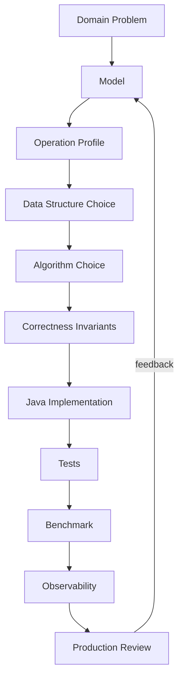
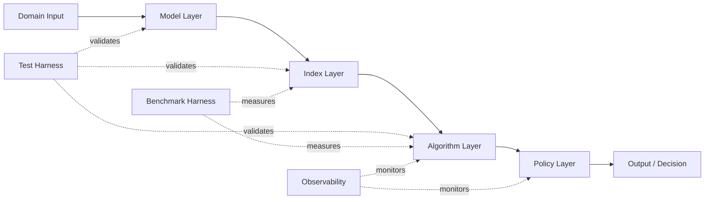
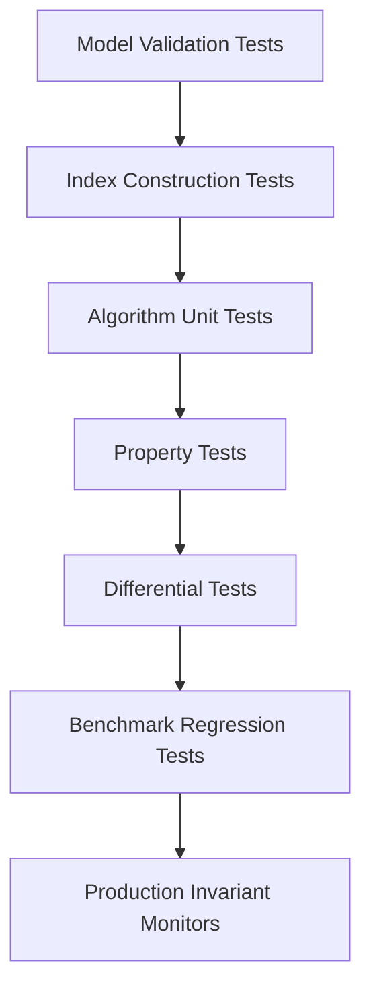
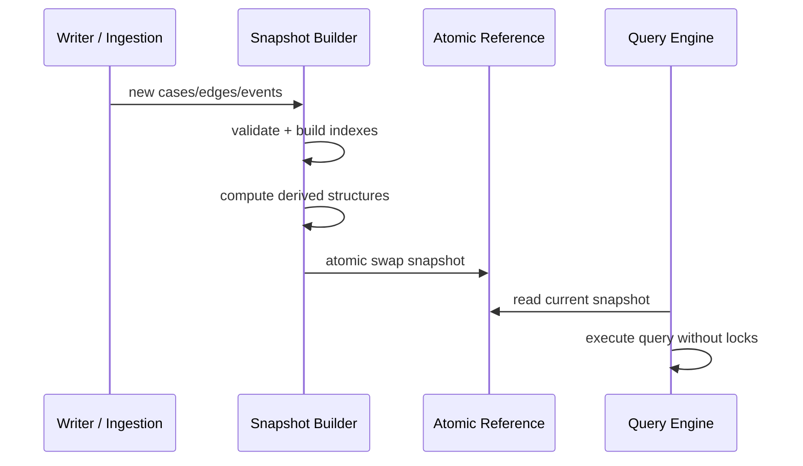
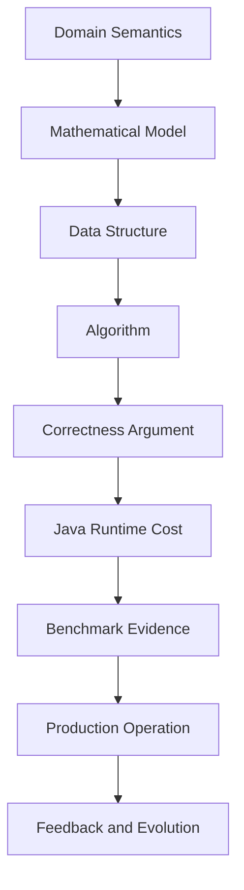

------
title: Learn Java Data Structures and Algorithms - Part 035
description: Capstone desain sistem algoritmik production-grade di Java: modelling, invariants, complexity budget, correctness, benchmarking, observability, failure modes, dan engineering review checklist.
series: learn-java-dsa
seriesTitle: Learn Java Data Structures and Algorithms
order: 35
partTitle: Capstone: Designing a Production-Grade Algorithmic System
tags:
- java
- data-structures
- algorithms
- dsa
- system-design
- performance
- correctness
- series
date: 2026-06-27
------

# Capstone: Designing a Production-Grade Algorithmic System

Di part terakhir ini kita tidak menambah struktur data baru. Kita menggabungkan seluruh seri menjadi satu kemampuan: **mendesain sistem algoritmik yang benar, cepat, terukur, dapat diobservasi, dan defensible secara engineering**.

Banyak engineer bisa menghafal Dijkstra, segment tree, Trie, DP, atau `ConcurrentHashMap`. Lebih sedikit yang bisa menjawab pertanyaan berikut secara matang:

> “Untuk domain problem ini, representasi apa yang benar, invariant apa yang harus dijaga, algoritma apa yang cukup, bagaimana membuktikan hasilnya, bagaimana mengukur batasnya, dan bagaimana sistem gagal di produksi?”

Itulah fokus capstone ini.

Kita akan membangun mental model dan template kerja untuk mendesain **algorithmic subsystem** di Java. Contohnya bisa berupa:

- rule-matching engine,
- dependency scheduler,
- escalation workflow resolver,
- route planner,
- fraud-link analysis,
- case-priority ranking,
- autocomplete/search index,
- quota allocator,
- graph-based impact analysis,
- SLA breach predictor,
- matching/assignment engine,
- concurrent in-memory index.

Materi ini sengaja ditulis seperti internal engineering handbook: bukan hanya “cara solve problem”, tetapi bagaimana membuat keputusan yang bisa dipertanggungjawabkan.

---

## 1. Skill Target

Setelah menyelesaikan part ini, Anda harus mampu:

1. Mengubah domain problem menjadi model algoritmik eksplisit.
2. Memilih struktur data berdasarkan operation profile, bukan kebiasaan.
3. Menentukan invariant correctness yang bisa dites.
4. Menyusun complexity budget berdasarkan ukuran data nyata.
5. Membuat implementasi Java yang memisahkan model, index, algorithm, dan policy.
6. Membuat benchmark yang menjawab pertanyaan engineering, bukan sekadar angka ops/sec.
7. Mendesain fallback, limit, timeout, dan observability untuk production failure mode.
8. Melakukan review desain algoritmik seperti senior/principal engineer.

---

## 2. Kaufman Lens: Skill Synthesis, Not More Theory

Menurut pendekatan Kaufman, setelah subskill dipelajari, tahap penting berikutnya adalah **practice with feedback**. Untuk DSA advanced, feedback terbaik bukan hanya “accepted” di online judge, melainkan:

- apakah model domain Anda benar,
- apakah invariant-nya eksplisit,
- apakah complexity-nya cocok dengan workload,
- apakah implementasi Java tidak menciptakan hidden cost,
- apakah failure mode-nya diketahui,
- apakah sistem bisa di-debug ketika salah.

Capstone ini memakai practice loop berikut:



Prinsipnya sederhana:

> Jangan mulai dari algoritma. Mulai dari model dan operasi.

---

## 3. The Algorithmic Subsystem Mental Model

Sebuah algorithmic subsystem biasanya terdiri dari lima lapisan:



### 3.1 Model Layer

Mengubah domain menjadi struktur eksplisit:

- entity,
- ID,
- relation,
- weight/cost,
- timestamp,
- state,
- constraint,
- operation.

Contoh:

```java
public record CaseId(long value) {}

public record Dependency(
        CaseId from,
        CaseId to,
        DependencyType type,
        int riskWeight
) {}

enum DependencyType {
    BLOCKS,
    RELATES_TO,
    ESCALATES_TO,
    DUPLICATES
}
```

Model layer tidak boleh diam-diam menyembunyikan keputusan algoritmik. Misalnya, `List<Dependency>` masih netral. Tetapi `Map<CaseId, List<Dependency>>` sudah mulai menjadi index.

### 3.2 Index Layer

Index layer menjawab pertanyaan cepat:

- “given X, cari tetangganya”,
- “given prefix, cari kandidat”,
- “given time range, hitung event”,
- “given priority, ambil item tertinggi”,
- “given key, cek membership”,
- “given interval, cari overlap”.

Index layer adalah tempat struktur data hidup.

### 3.3 Algorithm Layer

Algorithm layer melakukan komputasi:

- traversal,
- shortest path,
- topological ordering,
- matching,
- DP,
- range query,
- pruning search,
- approximation.

Algorithm layer harus bisa dites dengan input kecil dan oracle sederhana.

### 3.4 Policy Layer

Policy layer mengubah hasil algoritma menjadi keputusan bisnis:

- threshold,
- priority rule,
- tie-breaker,
- risk category,
- escalation action,
- fallback behavior.

Policy tidak boleh tercampur sembarangan ke algoritma. Jika tercampur, correctness menjadi sulit dibuktikan.

### 3.5 Observability Layer

Observability menjawab:

- input seperti apa yang memicu slow path,
- berapa ukuran graph sebenarnya,
- berapa kedalaman search,
- berapa collision atau duplicate,
- berapa jumlah fallback,
- apakah invariant pernah dilanggar.

---

## 4. Capstone Scenario: Regulatory Case Impact Analyzer

Agar konkret, kita gunakan satu scenario:

> Kita perlu membangun engine Java untuk menganalisis dampak lintas kasus dalam sistem regulatory enforcement. Setiap case dapat bergantung pada case lain, memiliki risk score, status lifecycle, escalation deadline, dan rule matching. Engine harus menentukan urutan pemrosesan, mendeteksi dependency cycle, menghitung impact score, serta memberi daftar case prioritas.

Ini cukup kaya untuk memakai banyak konsep DSA:

- graph representation,
- topological sort,
- SCC,
- priority queue,
- shortest path/risk propagation,
- hash index,
- ordered index,
- range query,
- string/rule matching,
- concurrency,
- benchmarking,
- invariant testing.

---

## 5. Step 1 — Define the Domain Model

Kita mulai dari domain, bukan algoritma.

```java
import java.time.Instant;
import java.util.Objects;

public record CaseNode(
        long id,
        CaseStatus status,
        int baseRisk,
        Instant createdAt,
        Instant escalationDeadline,
        String jurisdiction,
        String category
) {
    public CaseNode {
        if (id <= 0) throw new IllegalArgumentException("id must be positive");
        if (baseRisk < 0) throw new IllegalArgumentException("baseRisk must be non-negative");
        Objects.requireNonNull(status);
        Objects.requireNonNull(createdAt);
        Objects.requireNonNull(escalationDeadline);
        Objects.requireNonNull(jurisdiction);
        Objects.requireNonNull(category);
    }
}

enum CaseStatus {
    OPEN,
    UNDER_REVIEW,
    ESCALATED,
    ENFORCEMENT_ACTION,
    CLOSED
}

public record CaseEdge(
        long from,
        long to,
        EdgeType type,
        int weight
) {
    public CaseEdge {
        if (from <= 0 || to <= 0) throw new IllegalArgumentException("case ids must be positive");
        if (weight < 0) throw new IllegalArgumentException("weight must be non-negative");
        Objects.requireNonNull(type);
    }
}

enum EdgeType {
    BLOCKS,
    DEPENDS_ON,
    RELATES_TO,
    ESCALATES_TO
}
```

### 5.1 Model Invariants

At minimum:

1. Every case ID is unique.
2. Every edge endpoint references an existing case.
3. Edge direction has a documented meaning.
4. Edge weight has a documented unit.
5. Status transition validity is not inferred from graph edges unless explicitly modelled.
6. Time fields are normalized to a consistent time representation.

A common production bug is direction ambiguity.

If `A -> B` means “A depends on B”, topological processing order differs from `A -> B` meaning “A must be processed before B”. Write this down.

For this capstone:

> `from -> to` means `from` has an outbound relationship to `to`. For `DEPENDS_ON`, `from` depends on `to`, so `to` should be processed before `from`.

This means algorithm-specific graph views may reverse edges.

---

## 6. Step 2 — Define the Operation Profile

Before choosing structures, define operations.

| Operation | Expected Volume | Latency Target | Candidate Structure |
|---|---:|---:|---|
| Lookup case by ID | high | O(1) average | `HashMap<Long, CaseNode>` or primitive map |
| Find outgoing edges | high | O(out-degree) | adjacency list |
| Find incoming edges | medium/high | O(in-degree) | reverse adjacency list |
| Detect cycles | batch | O(V + E) | DFS / Kahn / SCC |
| Compute processing order | batch | O(V + E) | topological sort |
| Pick highest priority case | high | O(log n) update/poll | heap / indexed priority queue |
| Range query by deadline | medium | O(log n + k) | `TreeMap`, segment tree, Fenwick depending on query |
| Prefix/rule matching | medium | O(pattern/text) | Trie / Aho-Corasick |
| Concurrent updates | high | bounded contention | `ConcurrentHashMap`, queues, copy-on-write snapshot |

This prevents cargo-cult design.

For example, `TreeMap` is not “better HashMap”; it buys ordering at `O(log n)` cost. `PriorityQueue` is not an index; it can poll min/max but cannot efficiently update arbitrary priorities without additional machinery.

---

## 7. Step 3 — Build Indexes Explicitly

A good graph engine rarely uses only one index.

```java
import java.util.*;

public final class CaseGraph {
    private final Map<Long, CaseNode> casesById;
    private final Map<Long, List<CaseEdge>> outgoing;
    private final Map<Long, List<CaseEdge>> incoming;

    private CaseGraph(
            Map<Long, CaseNode> casesById,
            Map<Long, List<CaseEdge>> outgoing,
            Map<Long, List<CaseEdge>> incoming
    ) {
        this.casesById = casesById;
        this.outgoing = outgoing;
        this.incoming = incoming;
    }

    public static CaseGraph build(List<CaseNode> cases, List<CaseEdge> edges) {
        Map<Long, CaseNode> byId = new HashMap<>(capacityFor(cases.size()));

        for (CaseNode node : cases) {
            CaseNode previous = byId.put(node.id(), node);
            if (previous != null) {
                throw new IllegalArgumentException("duplicate case id: " + node.id());
            }
        }

        Map<Long, List<CaseEdge>> out = new HashMap<>();
        Map<Long, List<CaseEdge>> in = new HashMap<>();

        for (CaseNode node : cases) {
            out.put(node.id(), new ArrayList<>());
            in.put(node.id(), new ArrayList<>());
        }

        for (CaseEdge edge : edges) {
            if (!byId.containsKey(edge.from())) {
                throw new IllegalArgumentException("missing from case: " + edge.from());
            }
            if (!byId.containsKey(edge.to())) {
                throw new IllegalArgumentException("missing to case: " + edge.to());
            }
            out.get(edge.from()).add(edge);
            in.get(edge.to()).add(edge);
        }

        return new CaseGraph(
                Collections.unmodifiableMap(byId),
                freeze(out),
                freeze(in)
        );
    }

    public CaseNode get(long id) {
        CaseNode node = casesById.get(id);
        if (node == null) throw new NoSuchElementException("case not found: " + id);
        return node;
    }

    public Collection<CaseNode> nodes() {
        return casesById.values();
    }

    public List<CaseEdge> outgoing(long id) {
        return outgoing.getOrDefault(id, List.of());
    }

    public List<CaseEdge> incoming(long id) {
        return incoming.getOrDefault(id, List.of());
    }

    public int nodeCount() {
        return casesById.size();
    }

    public int edgeCount() {
        int count = 0;
        for (List<CaseEdge> edges : outgoing.values()) count += edges.size();
        return count;
    }

    private static int capacityFor(int expectedSize) {
        if (expectedSize < 3) return expectedSize + 1;
        if (expectedSize < (1 << 30)) return (int) (expectedSize / 0.75f + 1.0f);
        return Integer.MAX_VALUE;
    }

    private static Map<Long, List<CaseEdge>> freeze(Map<Long, List<CaseEdge>> map) {
        Map<Long, List<CaseEdge>> frozen = new HashMap<>(capacityFor(map.size()));
        for (Map.Entry<Long, List<CaseEdge>> entry : map.entrySet()) {
            frozen.put(entry.getKey(), List.copyOf(entry.getValue()));
        }
        return Collections.unmodifiableMap(frozen);
    }
}
```

### 7.1 Why Build Both Outgoing and Incoming?

Because different algorithms need different traversal directions.

- Impact propagation may use outgoing edges.
- “Who depends on this case?” needs incoming edges.
- Topological scheduling may need reverse interpretation for `DEPENDS_ON` edges.
- SCC uses directed adjacency.
- Audit/debug views often need both.

Trying to derive incoming edges by scanning all outgoing edges creates hidden `O(E)` cost per query.

---

## 8. Step 4 — Choose the Right Graph View

Domain graph and algorithm graph are not always identical.

For dependency processing:

- domain edge: `A DEPENDS_ON B`, represented as `A -> B`,
- scheduling edge: `B must come before A`, represented as `B -> A`.

Create an explicit view.

```java
public enum GraphView {
    DOMAIN_DIRECTION,
    PROCESSING_DIRECTION
}

public final class GraphViews {
    private GraphViews() {}

    public static List<CaseEdge> processingOutgoing(CaseGraph graph, long caseId) {
        List<CaseEdge> result = new ArrayList<>();

        // Edges that already mean from-before-to in domain direction.
        for (CaseEdge edge : graph.outgoing(caseId)) {
            if (edge.type() == EdgeType.BLOCKS || edge.type() == EdgeType.ESCALATES_TO) {
                result.add(edge);
            }
        }

        // Reverse DEPENDS_ON: if X depends on caseId, then caseId must be processed before X.
        for (CaseEdge edge : graph.incoming(caseId)) {
            if (edge.type() == EdgeType.DEPENDS_ON) {
                result.add(new CaseEdge(edge.to(), edge.from(), edge.type(), edge.weight()));
            }
        }

        return result;
    }
}
```

This looks verbose, but it prevents one of the most expensive classes of production bugs: silently reversed graph semantics.

---

## 9. Step 5 — Detect Cycles Before Scheduling

If processing requires a DAG, cycle detection is not optional.

Use Kahn’s algorithm if you only need to know whether a valid order exists. Use SCC if you need to report cycle groups.

```java
public final class CaseScheduler {
    public List<Long> processingOrder(CaseGraph graph) {
        Map<Long, Integer> indegree = new HashMap<>();
        for (CaseNode node : graph.nodes()) {
            indegree.put(node.id(), 0);
        }

        for (CaseNode node : graph.nodes()) {
            for (CaseEdge edge : GraphViews.processingOutgoing(graph, node.id())) {
                indegree.merge(edge.to(), 1, Integer::sum);
            }
        }

        ArrayDeque<Long> ready = new ArrayDeque<>();
        for (Map.Entry<Long, Integer> entry : indegree.entrySet()) {
            if (entry.getValue() == 0) ready.addLast(entry.getKey());
        }

        List<Long> order = new ArrayList<>(graph.nodeCount());
        while (!ready.isEmpty()) {
            long current = ready.removeFirst();
            order.add(current);

            for (CaseEdge edge : GraphViews.processingOutgoing(graph, current)) {
                int nextDegree = indegree.merge(edge.to(), -1, Integer::sum);
                if (nextDegree == 0) ready.addLast(edge.to());
            }
        }

        if (order.size() != graph.nodeCount()) {
            throw new IllegalStateException("processing graph contains a cycle");
        }

        return order;
    }
}
```

### 9.1 Deterministic Scheduling

The implementation above may produce non-deterministic order because `HashMap` iteration order is not a business contract.

For reproducible output, use explicit ordering:

```java
PriorityQueue<Long> ready = new PriorityQueue<>();
```

or:

```java
ArrayDeque<Long> ready = new ArrayDeque<>(initialNodesSortedByDeadline);
```

Tie-breaking is not a detail. It affects auditability.

---

## 10. Step 6 — Report Cycles with SCC

A production system should not only say “cycle exists”. It should say which cases are involved.

```java
public final class StrongComponents {
    private int index;
    private final Map<Long, Integer> indexOf = new HashMap<>();
    private final Map<Long, Integer> lowLink = new HashMap<>();
    private final ArrayDeque<Long> stack = new ArrayDeque<>();
    private final Set<Long> onStack = new HashSet<>();
    private final List<List<Long>> components = new ArrayList<>();

    public List<List<Long>> find(CaseGraph graph) {
        index = 0;
        indexOf.clear();
        lowLink.clear();
        stack.clear();
        onStack.clear();
        components.clear();

        for (CaseNode node : graph.nodes()) {
            if (!indexOf.containsKey(node.id())) {
                dfs(graph, node.id());
            }
        }
        return List.copyOf(components);
    }

    private void dfs(CaseGraph graph, long v) {
        indexOf.put(v, index);
        lowLink.put(v, index);
        index++;
        stack.push(v);
        onStack.add(v);

        for (CaseEdge edge : graph.outgoing(v)) {
            long w = edge.to();
            if (!indexOf.containsKey(w)) {
                dfs(graph, w);
                lowLink.put(v, Math.min(lowLink.get(v), lowLink.get(w)));
            } else if (onStack.contains(w)) {
                lowLink.put(v, Math.min(lowLink.get(v), indexOf.get(w)));
            }
        }

        if (Objects.equals(lowLink.get(v), indexOf.get(v))) {
            List<Long> component = new ArrayList<>();
            long w;
            do {
                w = stack.pop();
                onStack.remove(w);
                component.add(w);
            } while (w != v);
            components.add(component);
        }
    }
}
```

### 10.1 SCC Interpretation

An SCC of size > 1 means mutual reachability. In dependency systems, that usually means:

- circular dependency,
- lifecycle deadlock,
- modelling error,
- rule feedback loop,
- missing hierarchy boundary.

Do not automatically “break” cycles without policy. Cycle-breaking is a business decision.

---

## 11. Step 7 — Compute Impact Score

Suppose impact score combines:

- base risk,
- number of downstream affected cases,
- edge weights,
- deadline urgency,
- status multiplier.

Avoid mixing everything into one giant method. Separate components.

```java
public record ImpactScore(long caseId, double score, int affectedCount) {}

public interface DeadlineUrgency {
    double urgency(CaseNode node);
}

public final class LinearDeadlineUrgency implements DeadlineUrgency {
    private final java.time.Clock clock;

    public LinearDeadlineUrgency(java.time.Clock clock) {
        this.clock = Objects.requireNonNull(clock);
    }

    @Override
    public double urgency(CaseNode node) {
        long seconds = java.time.Duration.between(
                java.time.Instant.now(clock),
                node.escalationDeadline()
        ).toSeconds();

        if (seconds <= 0) return 2.0;
        if (seconds <= 86_400) return 1.5;
        if (seconds <= 7 * 86_400L) return 1.2;
        return 1.0;
    }
}
```

Now downstream reachability.

```java
public final class ImpactAnalyzer {
    private final DeadlineUrgency urgency;

    public ImpactAnalyzer(DeadlineUrgency urgency) {
        this.urgency = Objects.requireNonNull(urgency);
    }

    public ImpactScore score(CaseGraph graph, long root) {
        CaseNode rootNode = graph.get(root);
        Set<Long> visited = new HashSet<>();
        ArrayDeque<Long> queue = new ArrayDeque<>();
        queue.add(root);
        visited.add(root);

        int weightedEdgeSum = 0;

        while (!queue.isEmpty()) {
            long current = queue.removeFirst();
            for (CaseEdge edge : graph.outgoing(current)) {
                weightedEdgeSum += edge.weight();
                if (visited.add(edge.to())) {
                    queue.addLast(edge.to());
                }
            }
        }

        int affected = Math.max(0, visited.size() - 1);
        double statusMultiplier = statusMultiplier(rootNode.status());
        double score = rootNode.baseRisk()
                * statusMultiplier
                * urgency.urgency(rootNode)
                + affected * 3.0
                + weightedEdgeSum * 0.2;

        return new ImpactScore(root, score, affected);
    }

    private static double statusMultiplier(CaseStatus status) {
        return switch (status) {
            case OPEN -> 1.0;
            case UNDER_REVIEW -> 1.1;
            case ESCALATED -> 1.5;
            case ENFORCEMENT_ACTION -> 2.0;
            case CLOSED -> 0.2;
        };
    }
}
```

### 11.1 Correctness Invariants for Impact

Define what must hold:

1. A case does not affect itself unless self-loop semantics are explicitly allowed.
2. Each reachable case is counted once.
3. Edge weight is accumulated according to documented policy.
4. Closed cases either remain in graph with low multiplier or are filtered before graph construction.
5. Cycles must not cause infinite traversal.

Notice: `visited` is not just an optimization. It is part of correctness.

---

## 12. Step 8 — Prioritize Cases

A priority queue gives efficient top candidate selection.

```java
public final class CasePrioritizer {
    private final ImpactAnalyzer analyzer;

    public CasePrioritizer(ImpactAnalyzer analyzer) {
        this.analyzer = Objects.requireNonNull(analyzer);
    }

    public List<ImpactScore> topK(CaseGraph graph, int k) {
        if (k <= 0) return List.of();

        PriorityQueue<ImpactScore> heap = new PriorityQueue<>(
                Comparator.comparingDouble(ImpactScore::score)
        );

        for (CaseNode node : graph.nodes()) {
            ImpactScore score = analyzer.score(graph, node.id());
            if (heap.size() < k) {
                heap.add(score);
            } else if (score.score() > heap.peek().score()) {
                heap.poll();
                heap.add(score);
            }
        }

        ArrayList<ImpactScore> result = new ArrayList<>(heap);
        result.sort(Comparator.comparingDouble(ImpactScore::score).reversed());
        return result;
    }
}
```

### 12.1 Complexity

If scoring one case is `O(V + E)`, scoring all cases naively is `O(V * (V + E))`.

That may be fine for 500 cases. It is probably not fine for 5 million cases.

Optimization options:

- cache reachability for DAG,
- condense SCC first,
- process in topological order,
- approximate influence with limited-depth BFS,
- precompute component-level aggregates,
- use batch processing snapshots,
- accept bounded approximation with explicit error semantics.

This is why complexity budget matters.

---

## 13. Step 9 — Complexity Budget

A complexity budget turns Big-O into engineering constraints.

Example:

| Dimension | Budget |
|---|---:|
| Cases per tenant | 100k typical, 2M max |
| Edges per tenant | 300k typical, 10M max |
| Query P95 | < 200 ms |
| Batch recomputation | < 10 min |
| Memory per tenant snapshot | < 2 GB |
| Update rate | 100/s typical, 5k/s burst |
| Staleness tolerance | 30 seconds |

From this, derive constraints:

- `O(V + E)` batch algorithms are acceptable.
- `O(V * E)` is not acceptable.
- Recursive DFS may overflow stack for large graphs.
- Object-heavy edge representation may exceed memory budget.
- Exact all-pairs reachability is likely impossible.
- Snapshot + async recomputation may be better than synchronous mutation.

### 13.1 Data-Size Regime Table

| Size | Strategy Bias |
|---:|---|
| `V <= 1_000`, `E <= 10_000` | Clarity first; object model acceptable. |
| `V <= 100_000`, `E <= 1_000_000` | Primitive arrays, iterative algorithms, careful indexes. |
| `V >= 1_000_000`, `E >= 10_000_000` | Compressed representation, batching, streaming, off-heap or specialized storage considered. |
| high update + high query | Incremental indexes or snapshot architecture. |
| high query + low update | Precompute/caching aggressively. |
| low query + high update | Avoid expensive indexes; compute on demand. |

---

## 14. Step 10 — Move from Object Graph to Compact Graph

The earlier `CaseGraph` is clear but object-heavy. For large graph processing, use compressed arrays.

A common layout is CSR-like adjacency:

```text
node i neighbors live in:
edgeTo[offset[i] ... offset[i + 1])
```

```java
public final class CompactDirectedGraph {
    private final long[] nodeIds;
    private final Map<Long, Integer> indexById;
    private final int[] offsets;
    private final int[] to;
    private final int[] weight;

    public CompactDirectedGraph(List<CaseNode> nodes, List<CaseEdge> edges) {
        this.nodeIds = new long[nodes.size()];
        this.indexById = new HashMap<>((int) (nodes.size() / 0.75f) + 1);

        for (int i = 0; i < nodes.size(); i++) {
            long id = nodes.get(i).id();
            nodeIds[i] = id;
            Integer previous = indexById.put(id, i);
            if (previous != null) throw new IllegalArgumentException("duplicate id: " + id);
        }

        int n = nodes.size();
        int[] degree = new int[n];
        for (CaseEdge edge : edges) {
            Integer from = indexById.get(edge.from());
            Integer dest = indexById.get(edge.to());
            if (from == null || dest == null) throw new IllegalArgumentException("edge endpoint missing");
            degree[from]++;
        }

        offsets = new int[n + 1];
        for (int i = 0; i < n; i++) {
            offsets[i + 1] = offsets[i] + degree[i];
        }

        to = new int[edges.size()];
        weight = new int[edges.size()];

        int[] cursor = offsets.clone();
        for (CaseEdge edge : edges) {
            int from = indexById.get(edge.from());
            int dest = indexById.get(edge.to());
            int pos = cursor[from]++;
            to[pos] = dest;
            weight[pos] = edge.weight();
        }
    }

    public int nodeCount() {
        return nodeIds.length;
    }

    public long nodeId(int index) {
        return nodeIds[index];
    }

    public int indexOf(long id) {
        Integer idx = indexById.get(id);
        if (idx == null) throw new NoSuchElementException("unknown id: " + id);
        return idx;
    }

    public int edgeStart(int nodeIndex) {
        return offsets[nodeIndex];
    }

    public int edgeEnd(int nodeIndex) {
        return offsets[nodeIndex + 1];
    }

    public int edgeTo(int edgeIndex) {
        return to[edgeIndex];
    }

    public int edgeWeight(int edgeIndex) {
        return weight[edgeIndex];
    }
}
```

### 14.1 Why This Is Faster

Object adjacency:

```text
HashMap -> ArrayList -> CaseEdge object -> boxed references / fields
```

Compact adjacency:

```text
int[] offsets + int[] to + int[] weight
```

Benefits:

- fewer allocations,
- better locality,
- fewer pointer dereferences,
- lower GC pressure,
- predictable memory footprint,
- easier batch traversal.

Cost:

- less flexible mutation,
- harder debugging,
- requires ID mapping,
- more careful construction logic.

This is a classic production trade-off: **clarity at boundaries, compactness in hot paths**.

---

## 15. Step 11 — Iterative Traversal for Large Graphs

Avoid recursive DFS on large/untrusted graphs.

```java
public final class CompactTraversals {
    public static int reachableCount(CompactDirectedGraph graph, int start) {
        boolean[] visited = new boolean[graph.nodeCount()];
        int[] stack = new int[graph.nodeCount()];
        int top = 0;
        int count = 0;

        stack[top++] = start;
        visited[start] = true;

        while (top > 0) {
            int current = stack[--top];
            count++;

            for (int e = graph.edgeStart(current); e < graph.edgeEnd(current); e++) {
                int next = graph.edgeTo(e);
                if (!visited[next]) {
                    visited[next] = true;
                    stack[top++] = next;
                }
            }
        }

        return count;
    }
}
```

### 15.1 Traversal Invariant

At all times:

- every node in stack is already marked visited,
- no unvisited node is pushed,
- every reachable node will eventually be discovered if graph representation is complete,
- each node is processed at most once.

---

## 16. Step 12 — Test the Model Before the Algorithm

A serious DSA implementation needs layered tests.



### 16.1 Model Tests

```java
import org.junit.jupiter.api.Test;
import java.time.Instant;
import java.util.List;

import static org.junit.jupiter.api.Assertions.*;

class CaseGraphTest {
    @Test
    void rejectsDuplicateCaseIds() {
        CaseNode a = node(1);
        CaseNode duplicate = node(1);

        IllegalArgumentException ex = assertThrows(
                IllegalArgumentException.class,
                () -> CaseGraph.build(List.of(a, duplicate), List.of())
        );

        assertTrue(ex.getMessage().contains("duplicate"));
    }

    @Test
    void rejectsMissingEdgeEndpoint() {
        CaseNode a = node(1);
        CaseEdge edge = new CaseEdge(1, 99, EdgeType.RELATES_TO, 1);

        assertThrows(
                IllegalArgumentException.class,
                () -> CaseGraph.build(List.of(a), List.of(edge))
        );
    }

    private static CaseNode node(long id) {
        return new CaseNode(
                id,
                CaseStatus.OPEN,
                10,
                Instant.parse("2026-01-01T00:00:00Z"),
                Instant.parse("2026-02-01T00:00:00Z"),
                "ID",
                "MARKET_ABUSE"
        );
    }
}
```

### 16.2 Algorithm Tests with Small Graphs

Small graphs are where correctness is easiest to see.

```java
@Test
void processingOrderPlacesDependencyBeforeDependent() {
    CaseNode a = node(1);
    CaseNode b = node(2);

    // A depends on B, so B should be processed before A.
    CaseEdge dependency = new CaseEdge(1, 2, EdgeType.DEPENDS_ON, 1);
    CaseGraph graph = CaseGraph.build(List.of(a, b), List.of(dependency));

    List<Long> order = new CaseScheduler().processingOrder(graph);

    assertTrue(order.indexOf(2L) < order.indexOf(1L));
}
```

### 16.3 Property-Style Tests

Even without a property-testing framework, you can write randomized invariant tests.

```java
@Test
void topologicalOrderRespectsAllProcessingEdges() {
    CaseGraph graph = randomDag(100, 300, 42L);
    List<Long> order = new CaseScheduler().processingOrder(graph);

    Map<Long, Integer> position = new HashMap<>();
    for (int i = 0; i < order.size(); i++) {
        position.put(order.get(i), i);
    }

    for (CaseNode node : graph.nodes()) {
        for (CaseEdge edge : GraphViews.processingOutgoing(graph, node.id())) {
            assertTrue(
                    position.get(edge.from()) < position.get(edge.to()),
                    "edge order violated: " + edge
            );
        }
    }
}
```

The point is not randomness for its own sake. The point is to test invariants across many shapes.

---

## 17. Step 13 — Differential Testing

Differential testing compares a complex optimized implementation against a simple trusted implementation.

Example:

- object graph BFS vs compact graph BFS,
- naive range query vs segment tree,
- brute-force matcher vs KMP/Aho-Corasick,
- full sort top-k vs heap top-k,
- Floyd-Warshall on tiny graph vs Dijkstra per source.

```java
@Test
void compactReachabilityMatchesObjectGraphReachability() {
    CaseGraph objectGraph = randomGraph(200, 800, 123L);
    CompactDirectedGraph compact = toCompact(objectGraph);

    for (CaseNode node : objectGraph.nodes()) {
        int objectCount = objectReachableCount(objectGraph, node.id());
        int compactCount = CompactTraversals.reachableCount(
                compact,
                compact.indexOf(node.id())
        );
        assertEquals(objectCount, compactCount, "start=" + node.id());
    }
}
```

Optimized structures are allowed to be ugly internally. They are not allowed to silently change semantics.

---

## 18. Step 14 — Benchmark What Matters

A good benchmark starts with a question.

Bad:

> “How fast is graph traversal?”

Better:

> “For tenant snapshots with 100k nodes and 1M edges, is compact graph traversal at least 3x faster and 5x less allocating than object graph traversal?”

### 18.1 Benchmark Dimensions

Measure across:

- node count,
- edge count,
- degree distribution,
- connectedness,
- hot/cold cache,
- update frequency,
- query frequency,
- memory allocation,
- tail latency.

### 18.2 JMH Sketch

```java
import org.openjdk.jmh.annotations.*;

import java.util.concurrent.TimeUnit;

@BenchmarkMode(Mode.AverageTime)
@OutputTimeUnit(TimeUnit.MILLISECONDS)
@Warmup(iterations = 5)
@Measurement(iterations = 10)
@Fork(2)
@State(Scope.Benchmark)
public class GraphTraversalBenchmark {
    @Param({"1000", "100000"})
    int nodes;

    @Param({"4", "12"})
    int avgDegree;

    CaseGraph objectGraph;
    CompactDirectedGraph compactGraph;
    int compactStart;
    long objectStart;

    @Setup(Level.Trial)
    public void setup() {
        objectGraph = GraphFixtures.randomObjectGraph(nodes, nodes * avgDegree, 42L);
        compactGraph = GraphFixtures.toCompact(objectGraph);
        objectStart = objectGraph.nodes().iterator().next().id();
        compactStart = compactGraph.indexOf(objectStart);
    }

    @Benchmark
    public int objectGraphReachability() {
        return GraphFixtures.objectReachableCount(objectGraph, objectStart);
    }

    @Benchmark
    public int compactGraphReachability() {
        return CompactTraversals.reachableCount(compactGraph, compactStart);
    }
}
```

### 18.3 Benchmark Anti-Patterns

Avoid:

- benchmarking only tiny data,
- using unrealistic uniform graphs if production graph is skewed,
- ignoring allocation rate,
- comparing debug code to optimized code,
- not validating that benchmark results are used,
- measuring end-to-end latency without component attribution,
- changing multiple variables at once.

---

## 19. Step 15 — Observability for Algorithmic Systems

Observability should expose algorithm-specific signals.

### 19.1 Metrics

Examples:

| Metric | Meaning |
|---|---|
| `case_graph_nodes` | Snapshot node count. |
| `case_graph_edges` | Snapshot edge count. |
| `case_graph_max_out_degree` | Skew/hub detection. |
| `case_graph_scc_count` | Number of SCCs. |
| `case_graph_largest_scc_size` | Cycle severity. |
| `case_graph_toposort_failed_total` | DAG assumption violations. |
| `impact_analysis_duration_ms` | Runtime latency. |
| `impact_analysis_visited_nodes` | Traversal size. |
| `impact_analysis_cutoff_total` | Number of bounded/fallback traversals. |
| `priority_rebuild_duration_ms` | Batch recompute cost. |
| `index_snapshot_age_seconds` | Staleness. |

### 19.2 Logs

Log domain context, not just stack traces.

Bad:

```text
IllegalStateException: cycle detected
```

Better:

```text
cycle detected in processing graph tenant=abc largestSccSize=17 sampleCaseIds=[101,205,901]
```

### 19.3 Debug Dumps

For complex graph algorithms, provide bounded debug dumps:

- sample nodes,
- sample edges,
- SCC members up to limit,
- top-k priority reasons,
- rule match explanations,
- traversal cutoff reason.

Never dump full million-edge graphs to logs.

---

## 20. Step 16 — Failure Mode Catalogue

Production DSA systems fail in recognizable ways.

### 20.1 Modelling Failures

| Failure | Symptom | Prevention |
|---|---|---|
| Reversed edge semantics | Correct-looking but wrong order | Explicit graph views and tests |
| Missing node reference | NPE or silent drop | Build-time validation |
| Unit ambiguity | Wrong ranking/weight | Typed fields and docs |
| Equality bug | Duplicate/missing map keys | Immutable IDs and key tests |
| Time-zone drift | Wrong deadline urgency | Use `Instant` internally |

### 20.2 Complexity Failures

| Failure | Symptom | Prevention |
|---|---|---|
| Hidden nested traversal | P95/P99 spike | Complexity review and benchmarks |
| Object allocation storm | GC pause | Compact representation |
| Priority update misuse | Stale heap entries | Lazy deletion/versioning or indexed heap |
| `O(E)` per query lookup | Throughput collapse | Precompute reverse indexes |
| Recursive DFS overflow | `StackOverflowError` | Iterative traversal |

### 20.3 Correctness Failures

| Failure | Symptom | Prevention |
|---|---|---|
| Missing visited set | Infinite cycle traversal | Traversal invariant tests |
| Comparator inconsistency | Lost/duplicated ordered entries | Comparator contract tests |
| Mutable key | Hash lookup fails after mutation | Immutable key type |
| Non-deterministic tie-breaker | Audit mismatch | Explicit deterministic comparator |
| Overflow | Negative distance/score | Use `long`, checked arithmetic, bounds |

### 20.4 Concurrency Failures

| Failure | Symptom | Prevention |
|---|---|---|
| Mutating shared graph snapshot | Random corruption | Immutable snapshots |
| Unsafe publication | Stale/partial state | Final fields / volatile snapshot ref |
| Contention hotspot | Low throughput | Sharding / LongAdder / batching |
| Non-atomic multi-index update | Index inconsistency | Build new snapshot then swap |
| ABA / stale queue entry | Wrong priority execution | Versioned entries |

---

## 21. Snapshot Architecture

For many algorithmic systems, immutable snapshots are simpler than live mutation.



Java sketch:

```java
import java.util.concurrent.atomic.AtomicReference;

public final class CaseGraphService {
    private final AtomicReference<CaseSnapshot> current = new AtomicReference<>();

    public void rebuild(List<CaseNode> nodes, List<CaseEdge> edges) {
        CaseGraph graph = CaseGraph.build(nodes, edges);
        CaseSnapshot snapshot = CaseSnapshot.from(graph);
        current.set(snapshot);
    }

    public List<ImpactScore> topCases(int k) {
        CaseSnapshot snapshot = requireSnapshot();
        return snapshot.prioritizer().topK(snapshot.graph(), k);
    }

    private CaseSnapshot requireSnapshot() {
        CaseSnapshot snapshot = current.get();
        if (snapshot == null) throw new IllegalStateException("snapshot not initialized");
        return snapshot;
    }
}

public record CaseSnapshot(
        CaseGraph graph,
        CasePrioritizer prioritizer,
        java.time.Instant builtAt
) {
    public static CaseSnapshot from(CaseGraph graph) {
        ImpactAnalyzer analyzer = new ImpactAnalyzer(
                new LinearDeadlineUrgency(java.time.Clock.systemUTC())
        );
        return new CaseSnapshot(
                graph,
                new CasePrioritizer(analyzer),
                java.time.Instant.now()
        );
    }
}
```

### 21.1 Snapshot Invariants

1. Snapshot is immutable after publication.
2. All indexes inside snapshot describe the same version of data.
3. A query uses one snapshot from start to finish.
4. Failed rebuild does not corrupt current snapshot.
5. Snapshot metadata includes build time and source version.

This design is often more reliable than trying to update five indexes in place concurrently.

---

## 22. Incremental vs Batch Design

Use incremental algorithms only when they are truly needed.

| Need | Prefer |
|---|---|
| Low update rate, high correctness need | Batch rebuild snapshot |
| High update rate, low query latency | Incremental indexes or delta overlay |
| Large graph, small deltas | Incremental with periodic compaction |
| Auditability important | Versioned snapshots |
| Complex derived structures | Batch recomputation unless latency forbids |

Incremental systems are harder because every update must preserve all invariants. Batch systems are easier because each snapshot can be validated as a whole.

---

## 23. Designing a Versioned Priority Queue

If priorities change over time, Java `PriorityQueue` cannot efficiently update arbitrary entries. Use lazy deletion with versions.

```java
public record PriorityEntry(long caseId, double score, long version) {}

public final class VersionedCaseQueue {
    private final PriorityQueue<PriorityEntry> heap = new PriorityQueue<>(
            Comparator.comparingDouble(PriorityEntry::score).reversed()
                    .thenComparingLong(PriorityEntry::caseId)
    );
    private final Map<Long, Long> latestVersion = new HashMap<>();

    public void offer(long caseId, double score) {
        long nextVersion = latestVersion.getOrDefault(caseId, 0L) + 1;
        latestVersion.put(caseId, nextVersion);
        heap.offer(new PriorityEntry(caseId, score, nextVersion));
    }

    public Optional<PriorityEntry> pollValid() {
        while (!heap.isEmpty()) {
            PriorityEntry entry = heap.poll();
            long current = latestVersion.getOrDefault(entry.caseId(), -1L);
            if (entry.version() == current) {
                latestVersion.remove(entry.caseId());
                return Optional.of(entry);
            }
        }
        return Optional.empty();
    }

    public int heapSizeIncludingStaleEntries() {
        return heap.size();
    }
}
```

### 23.1 Invariant

An entry is valid iff:

```text
entry.version == latestVersion[entry.caseId]
```

Stale entries remain in the heap temporarily, so monitor heap bloat.

---

## 24. Rule Matching Integration

Suppose cases include text categories, jurisdiction, and tags. You may need rule matching:

- exact lookup: `HashMap`,
- prefix lookup: Trie,
- multi-pattern text scan: Aho-Corasick,
- regex: `Pattern`,
- fuzzy matching: edit distance / approximate matching.

A production rule system should separate matching from action.

```java
public record RuleMatch(String ruleId, long caseId, String reason) {}

public interface CaseRule {
    Optional<RuleMatch> match(CaseNode node);
}

public final class JurisdictionRiskRule implements CaseRule {
    @Override
    public Optional<RuleMatch> match(CaseNode node) {
        if (node.jurisdiction().equals("ID") && node.baseRisk() >= 80) {
            return Optional.of(new RuleMatch(
                    "ID_HIGH_RISK",
                    node.id(),
                    "Indonesian jurisdiction with high base risk"
            ));
        }
        return Optional.empty();
    }
}
```

Rules produce evidence. Policy decides action.

---

## 25. Range Query Integration

Suppose we need deadline buckets:

- count cases due today,
- count cases due this week,
- find earliest overdue case,
- compute risk sum by deadline range.

If deadlines are timestamps and updates are moderate, use `TreeMap` bucketed by day.

```java
import java.time.LocalDate;
import java.time.ZoneOffset;
import java.util.NavigableMap;
import java.util.TreeMap;

public final class DeadlineIndex {
    private final NavigableMap<LocalDate, Integer> countByDay = new TreeMap<>();

    public void add(CaseNode node) {
        LocalDate day = node.escalationDeadline()
                .atZone(ZoneOffset.UTC)
                .toLocalDate();
        countByDay.merge(day, 1, Integer::sum);
    }

    public int countBetween(LocalDate fromInclusive, LocalDate toInclusive) {
        int total = 0;
        for (int count : countByDay.subMap(fromInclusive, true, toInclusive, true).values()) {
            total += count;
        }
        return total;
    }

    public Optional<LocalDate> earliestDeadline() {
        return countByDay.isEmpty()
                ? Optional.empty()
                : Optional.of(countByDay.firstKey());
    }
}
```

If you have dense integer time buckets and heavy range sums, use Fenwick/segment tree. If you have sparse dates and need floor/ceiling/range view, `TreeMap` is simpler.

---

## 26. Algorithm Selection Matrix

| Problem Shape | First Candidate | When to Upgrade |
|---|---|---|
| membership by key | `HashSet` / `HashMap` | custom primitive map for memory/hot path |
| ordered lookup | `TreeMap` / `TreeSet` | B-tree/storage index for persistence/scale |
| top-k static | sort or heap | quickselect for large one-shot selection |
| top-k streaming | bounded heap | sketches/approximation for huge streams |
| dependency ordering | topological sort | SCC + condensation DAG for cycles |
| reachability | BFS/DFS | bitset transitive closure only for small dense graphs |
| shortest path non-negative | Dijkstra | A* if heuristic available; contraction/indexing for massive routing |
| weighted all-pairs small | Floyd-Warshall | repeated Dijkstra or specialized indexes for larger graphs |
| prefix matching | Trie | compressed trie / FST for memory-heavy dictionaries |
| multi-pattern scan | Aho-Corasick | streaming scanner with chunk-boundary state |
| range sum static | prefix sum | Fenwick/segment tree for updates |
| range min static | sparse table | segment tree for updates |
| exact combinatorial search | backtracking | branch-and-bound / DP / approximation |
| high-concurrency counts | `LongAdder` | sharded aggregation / async batching |

---

## 27. Engineering Review Checklist

Use this checklist before shipping algorithmic code.

### 27.1 Problem Framing

- What is the exact input?
- What is the exact output?
- What are invalid inputs?
- What does edge direction mean?
- What does weight mean?
- What is the tie-breaker?
- What is allowed to be approximate?
- What must be exact?

### 27.2 Invariants

- What must always be true in the model?
- What must always be true in each index?
- What must always be true during algorithm execution?
- What invariant detects corruption early?
- Which invariants are tested?
- Which invariants are monitored in production?

### 27.3 Complexity

- What is the time complexity of each public operation?
- What is the memory complexity?
- What is the hidden constant factor?
- What data distribution was assumed?
- What is the worst-case input?
- What is the expected production size?
- What happens at 10x size?

### 27.4 Java Implementation

- Are keys immutable?
- Are comparators consistent with intended equality?
- Are primitive arrays preferable in hot paths?
- Are boxed collections causing memory pressure?
- Are recursive algorithms safe for input depth?
- Are snapshots safely published?
- Are concurrent structures used for the right reason?
- Are `PriorityQueue` stale entries handled?

### 27.5 Testing

- Are there tiny deterministic examples?
- Are there randomized invariant tests?
- Is there differential testing against a naive implementation?
- Are edge cases covered?
- Are overflow cases covered?
- Are duplicate/tie cases covered?
- Are cycle cases covered?
- Are empty and single-element cases covered?

### 27.6 Benchmarking

- What question does the benchmark answer?
- Does benchmark data resemble production?
- Are allocation rates measured?
- Are warmup and dead-code issues handled?
- Are P95/P99 latencies measured where relevant?
- Are results tracked over time?

### 27.7 Production Readiness

- Is there a timeout or cutoff for expensive queries?
- Is there a fallback mode?
- Is stale data acceptable and documented?
- Are metrics available?
- Are debug explanations bounded?
- Can we reproduce a bad decision?
- Can we audit why an item was ranked first?

---

## 28. A Defensible Design Document Template

Use this for real projects.

```mdx
# Algorithmic Design: <System Name>

## Problem
What decision/query/computation does this subsystem provide?

## Inputs
- Entity types
- Relations
- Weights/costs
- Time fields
- Update frequency

## Outputs
- Result shape
- Ordering/tie-breaker
- Exact vs approximate guarantees

## Domain Semantics
- Edge direction
- Weight meaning
- Status/lifecycle semantics
- Invalid states

## Operation Profile
| Operation | Frequency | Latency Target | Complexity Target |
|---|---:|---:|---|

## Data Structures
- Primary store
- Indexes
- Derived structures
- Snapshot/version strategy

## Algorithms
- Algorithm chosen
- Why it fits
- Alternatives rejected
- Correctness argument

## Invariants
- Model invariants
- Index invariants
- Algorithm invariants
- Production monitors

## Complexity Budget
- Time
- Space
- Expected size
- Worst-case behavior
- 10x growth behavior

## Failure Modes
- Modelling failures
- Complexity failures
- Concurrency failures
- Data-quality failures

## Testing Strategy
- Unit examples
- Edge cases
- Random/property tests
- Differential tests
- Regression tests

## Benchmark Plan
- Dataset shapes
- Metrics
- Baseline
- Acceptance threshold

## Observability
- Metrics
- Logs
- Debug dumps
- Alert conditions

## Rollout Plan
- Shadow mode
- Compare old/new result
- Gradual enablement
- Kill switch
```

This is how DSA becomes engineering, not puzzle-solving.

---

## 29. Mini Case Study: Why a Naive Solution Fails

Naive design:

```java
for (CaseNode node : cases) {
    for (CaseEdge edge : allEdges) {
        if (edge.from() == node.id()) {
            // process neighbor
        }
    }
}
```

For `V` cases and `E` edges, this is `O(V * E)` just to discover adjacency.

With 100k cases and 1M edges:

```text
100,000 * 1,000,000 = 100,000,000,000 comparisons
```

This is not a micro-optimization issue. It is a modelling/indexing issue.

Correct design:

```java
Map<Long, List<CaseEdge>> outgoing = buildOutgoingIndex(edges);
```

Then traversal cost becomes proportional to actual outgoing edges visited.

Lesson:

> Most production DSA failures are not caused by using the wrong exotic algorithm. They are caused by missing the obvious index.

---

## 30. Mini Case Study: Wrong Comparator, Wrong System

Suppose priority tie-breaker ignores case ID.

```java
Comparator<ImpactScore> bad = Comparator.comparingDouble(ImpactScore::score);
```

For `PriorityQueue`, this may be acceptable because equal priority entries can coexist. For `TreeSet`, it is dangerous:

```java
TreeSet<ImpactScore> set = new TreeSet<>(Comparator.comparingDouble(ImpactScore::score));
```

Two different cases with the same score may compare as equal, so one can disappear.

Better:

```java
Comparator<ImpactScore> safe = Comparator
        .comparingDouble(ImpactScore::score)
        .reversed()
        .thenComparingLong(ImpactScore::caseId);
```

Lesson:

> In ordered structures, comparator equality becomes structural equality for placement. Treat comparator design as correctness-critical.

---

## 31. Mini Case Study: PriorityQueue Update Trap

A common bug:

```java
// There is no efficient decreaseKey/increaseKey in java.util.PriorityQueue.
entry.score = newScore; // bad if mutable
```

Even worse, mutating an object already inside the heap breaks heap ordering.

Correct options:

1. Remove and reinsert, if removal cost is acceptable.
2. Use lazy deletion with versioned entries.
3. Use custom indexed heap.
4. Rebuild heap periodically.
5. Use a different structure if ordered update is the core operation.

Lesson:

> A priority queue is not an ordered map. Know the supported operation set.

---

## 32. Mini Case Study: Recursive DFS in Production

Recursive DFS is elegant:

```java
void dfs(int v) {
    visited[v] = true;
    for (int next : adj[v]) {
        if (!visited[next]) dfs(next);
    }
}
```

But for a long chain of 1M nodes, this can fail with `StackOverflowError`.

Production-safe traversal:

```java
ArrayDeque<Integer> stack = new ArrayDeque<>();
stack.push(start);
visited[start] = true;

while (!stack.isEmpty()) {
    int v = stack.pop();
    for (int next : adj[v]) {
        if (!visited[next]) {
            visited[next] = true;
            stack.push(next);
        }
    }
}
```

Lesson:

> Algorithmic complexity is not the only runtime constraint. The call stack is a resource too.

---

## 33. From Online Judge to Production

| Online Judge Mindset | Production Mindset |
|---|---|
| Input is valid | Validate aggressively |
| One run | Continuous operation |
| Time limit only | Latency, memory, GC, concurrency |
| Print answer | Explain decision |
| Hidden tests | Explicit invariants |
| Template code | Maintainable API |
| Accepted result | Observable behavior |
| Worst-case theoretical input | Real skewed workload + adversarial cases |

Online judge practice is useful for fluency. Production engineering requires additional layers.

---

## 34. Final Integration Exercise

Build a `CaseImpactEngine` with these requirements:

1. Load cases and edges.
2. Validate model invariants.
3. Build outgoing and incoming indexes.
4. Detect SCCs.
5. Reject or report processing cycles.
6. Compute deterministic processing order.
7. Compute top-k impact cases.
8. Maintain deadline index.
9. Expose debug explanation for one case.
10. Benchmark object graph vs compact graph traversal.
11. Add metrics for graph size, SCC count, traversal duration, and cutoff count.
12. Add differential tests between object and compact graph.

### 34.1 Acceptance Criteria

Your implementation is good enough when:

- it passes deterministic unit tests,
- randomized invariant tests do not find violations,
- compact and object implementations agree,
- graph direction semantics are documented,
- large graph traversal does not use recursion,
- benchmark shows expected scaling,
- stale priority entries are handled or impossible,
- cycle reports include actionable case IDs,
- API separates model/index/algorithm/policy,
- production metrics reveal slow-path causes.

---

## 35. Full System Sketch

```java
public final class CaseImpactEngine {
    private final CaseGraph graph;
    private final StrongComponents scc;
    private final CaseScheduler scheduler;
    private final CasePrioritizer prioritizer;
    private final DeadlineIndex deadlineIndex;

    private CaseImpactEngine(
            CaseGraph graph,
            StrongComponents scc,
            CaseScheduler scheduler,
            CasePrioritizer prioritizer,
            DeadlineIndex deadlineIndex
    ) {
        this.graph = graph;
        this.scc = scc;
        this.scheduler = scheduler;
        this.prioritizer = prioritizer;
        this.deadlineIndex = deadlineIndex;
    }

    public static CaseImpactEngine build(
            List<CaseNode> nodes,
            List<CaseEdge> edges,
            java.time.Clock clock
    ) {
        CaseGraph graph = CaseGraph.build(nodes, edges);

        DeadlineIndex deadlineIndex = new DeadlineIndex();
        for (CaseNode node : nodes) {
            deadlineIndex.add(node);
        }

        ImpactAnalyzer analyzer = new ImpactAnalyzer(new LinearDeadlineUrgency(clock));

        return new CaseImpactEngine(
                graph,
                new StrongComponents(),
                new CaseScheduler(),
                new CasePrioritizer(analyzer),
                deadlineIndex
        );
    }

    public List<List<Long>> stronglyConnectedComponents() {
        return scc.find(graph);
    }

    public List<Long> processingOrder() {
        return scheduler.processingOrder(graph);
    }

    public List<ImpactScore> topImpactCases(int k) {
        return prioritizer.topK(graph, k);
    }

    public Optional<java.time.LocalDate> earliestDeadline() {
        return deadlineIndex.earliestDeadline();
    }
}
```

This is not the most optimized possible engine. It is deliberately structured so each layer can be tested, replaced, and optimized.

---

## 36. Maturity Ladder

Use this ladder to assess your DSA maturity.

### Level 1 — Template User

- Knows common algorithms.
- Can solve standard problems.
- Often struggles when problem is reframed.

### Level 2 — Invariant Thinker

- Can explain why an algorithm works.
- Uses invariants and boundary conditions.
- Writes better tests.

### Level 3 — Cost Model Engineer

- Understands data-size regimes.
- Considers memory, allocation, GC, locality.
- Chooses structures by operation profile.

### Level 4 — System Designer

- Separates model, index, algorithm, and policy.
- Designs observability and failure handling.
- Can defend trade-offs.

### Level 5 — Production Algorithm Owner

- Knows how the system fails under real workload.
- Builds benchmark and regression harnesses.
- Can evolve the algorithm safely.
- Can explain decisions to engineering, product, risk, audit, and operations.

The goal of this series is to push you toward Level 4 and Level 5.

---

## 37. Final Checklist: Before You Claim “I Know DSA”

You should be able to answer these without hand-waving:

1. Why is this representation correct for the domain?
2. What operations dominate runtime?
3. What are the invariants?
4. What is the worst-case input?
5. What hidden Java cost exists?
6. What happens under skewed distribution?
7. What happens under concurrent access?
8. How do you test correctness beyond examples?
9. How do you compare optimized and naive implementations?
10. How do you measure performance without fooling yourself?
11. How do you explain a result to a human operator?
12. How does the system degrade safely?
13. What must be monitored after release?
14. What assumptions would break the design?
15. What would you change at 10x scale?

If you can answer these, you are no longer just “learning algorithms”. You are engineering algorithmic systems.

---

## 38. Deliberate Practice Plan

Use this final practice plan for 20 focused hours.

### Hours 1–3: Model and Index

- Pick a domain dataset.
- Define entities and relations.
- Build validation.
- Build adjacency indexes.
- Write model invariant tests.

### Hours 4–6: Core Algorithms

- Implement topological sort.
- Implement SCC.
- Implement reachability/impact traversal.
- Write small deterministic graph tests.

### Hours 7–9: Priority and Range

- Add priority scoring.
- Add top-k.
- Add deadline range index.
- Test tie-breaking and duplicate scores.

### Hours 10–12: Compact Representation

- Build compact graph.
- Implement iterative traversal.
- Differential test against object graph.

### Hours 13–15: Benchmark

- Create realistic fixtures.
- Benchmark object vs compact traversal.
- Measure allocation and latency.
- Document result thresholds.

### Hours 16–18: Failure Modes

- Add cycle reports.
- Add cutoff/timeout policy.
- Add overflow tests.
- Add stale priority entry tests.

### Hours 19–20: Production Review

- Write design document.
- Add metrics list.
- Add debug explanation format.
- Run engineering review checklist.

This practice loop is the actual completion of the series.

---

## 39. What to Revisit After This Series

After completing the Java DSA series, the most valuable follow-up topics are:

1. **Advanced Java Performance Engineering**
   - JIT,
   - GC tuning,
   - JFR analysis,
   - allocation profiling,
   - memory layout,
   - mechanical sympathy.

2. **Distributed Algorithms and Consistency**
   - consensus,
   - replication,
   - idempotency,
   - CRDTs,
   - distributed scheduling,
   - failure detectors.

3. **Search and Information Retrieval**
   - inverted index,
   - ranking,
   - vector search,
   - approximate nearest neighbor,
   - query planning.

4. **Workflow and State Machine Engineering**
   - lifecycle modelling,
   - transition guards,
   - escalation logic,
   - auditability,
   - temporal rules.

5. **Formal Methods for Engineers**
   - state invariants,
   - model checking,
   - property-based testing,
   - TLA+ style reasoning.

These topics compound strongly with DSA.

---

## 40. Closing Mental Model

The strongest DSA engineers are not the ones who memorize the most algorithms. They are the ones who can move between levels:



Every level can invalidate the level below it.

- A perfect algorithm on the wrong model is wrong.
- A correct model with the wrong data structure is slow.
- A fast implementation without invariant tests is fragile.
- A benchmark without production realism is misleading.
- A system without observability is unowned.

The final standard is not: “Can I implement this algorithm?”

The final standard is:

> “Can I design, justify, test, measure, operate, and evolve this algorithmic system under real constraints?”

That is the mindset this series is designed to build.

---

## Series Completion

This is **Part 035 of 35**.

The `learn-java-dsa` series is complete.

