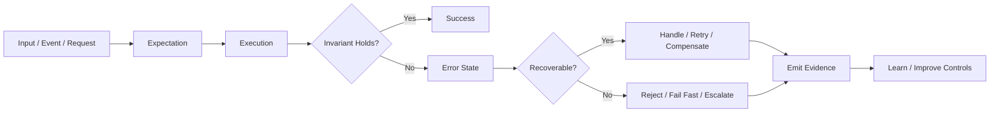
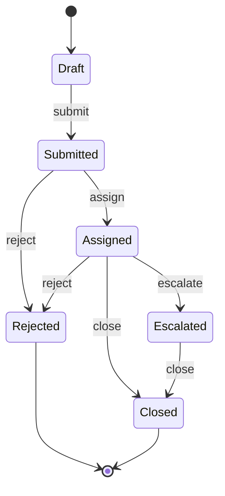
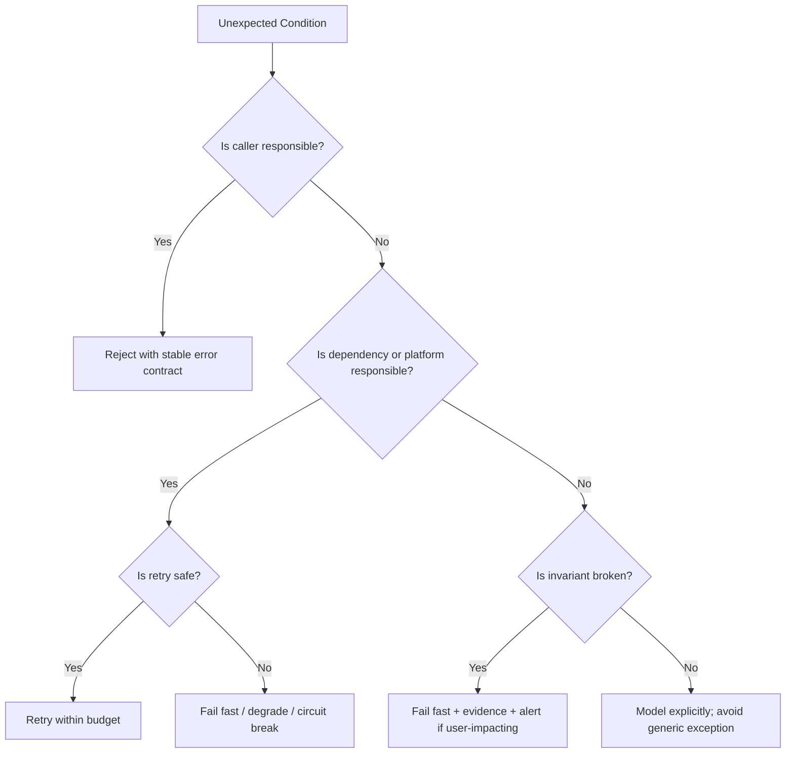
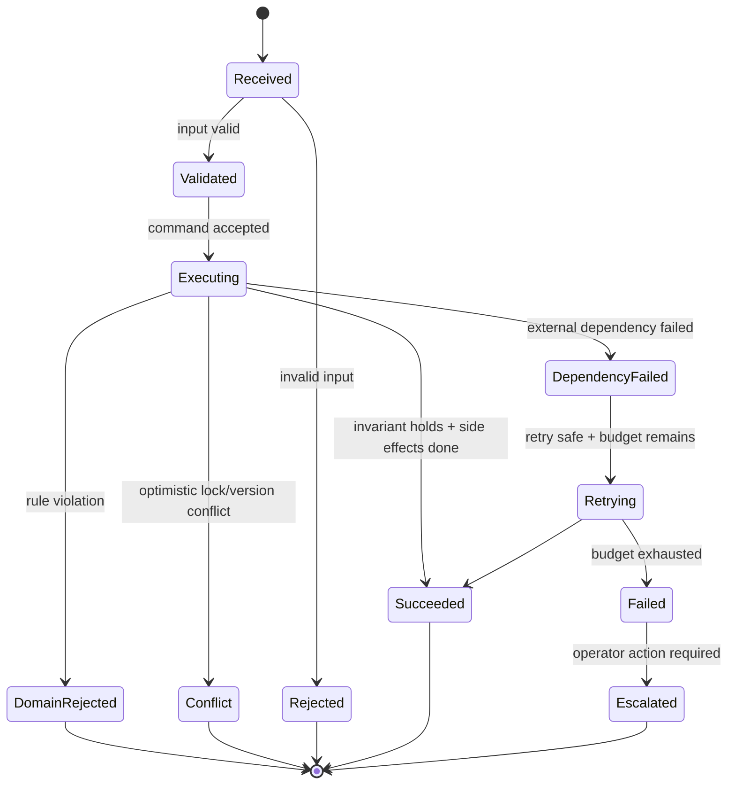

------
title: Learn Java Error, Reliability & Observability Engineering - Part 001
description: Kaufman-style skill map untuk menguasai Java error handling, reliability control, graceful shutdown, dan observability sebagai kemampuan produksi tingkat senior/staff.
series: learn-java-error-reliability-observability
seriesTitle: Learn Java Error, Reliability & Observability Engineering
order: 1
partTitle: Kaufman Skill Map
tags:
  - java
  - error-handling
  - reliability
  - observability
  - kaufman
  - production-engineering
date: 2026-06-28
---

# Part 001 — Kaufman Skill Map

> Target part ini bukan membuat kita “tahu banyak istilah”, tetapi membangun peta skill yang bisa dipakai untuk belajar cepat, menguji pemahaman, dan menilai kualitas keputusan engineering saat sistem Java gagal di produksi.

Seri ini membahas **Java Error, Reliability & Observability Engineering** sebagai satu kemampuan terpadu. Di level junior, error handling sering dianggap sekadar `try/catch`. Di level produksi, error handling adalah desain kontrol: bagaimana sistem mendeteksi penyimpangan, membatasi dampak, memulihkan layanan, memberi bukti operasional, dan mencegah kegagalan yang sama berulang.

Kita memakai kerangka dari *The First 20 Hours* oleh Josh Kaufman sebagai cara belajar:

1. **Deconstruct the skill** — pecah skill besar menjadi sub-skill kecil yang bisa dilatih.
2. **Learn enough to self-correct** — pelajari cukup teori agar bisa melihat kesalahan sendiri.
3. **Remove practice barriers** — siapkan lingkungan latihan sehingga praktik tidak tertunda.
4. **Practice deliberately for at least 20 hours** — latihan sengaja dengan feedback cepat.

Di seri ini, “20 hours” bukan berarti menjadi ahli penuh hanya dalam 20 jam. Artinya: dalam 20 jam pertama, kita membangun fondasi yang cukup kuat agar latihan lanjutan menjadi tajam, bukan acak.

---

## 1. Mengapa Skill Ini Layak Dipelajari Secara Terpisah

Banyak engineer pernah belajar exception, logging, metric, tracing, dan shutdown sebagai topik terpisah. Masalahnya, di produksi topik tersebut tidak pernah muncul terpisah.

Saat service Java gagal, pertanyaan yang muncul biasanya seperti ini:

- Apakah ini bug, dependency failure, overload, bad input, race condition, timeout, atau deployment issue?
- Apakah error ini aman untuk di-retry?
- Apakah exception ini seharusnya visible ke client atau hanya internal?
- Apakah kegagalan ini harus menyebabkan rollback, compensation, reject, quarantine, atau escalation?
- Apakah log cukup untuk audit dan debugging?
- Apakah metric bisa membedakan symptom dengan cause?
- Apakah trace menunjukkan path aktual atau kehilangan context di async boundary?
- Apakah shutdown sedang membunuh in-flight work?
- Apakah sistem gagal secara lokal atau sedang memicu cascading failure?

Skill yang ingin kita bangun adalah kemampuan menjawab pertanyaan tersebut secara cepat, konsisten, dan defensible.

---

## 2. Definisi Target Skill

Kita definisikan target skill sebagai berikut:

> Seorang engineer mampu mendesain, mengimplementasikan, mengobservasi, dan mengevaluasi failure behavior pada aplikasi Java sehingga error menjadi informasi yang dapat dikendalikan, bukan kejutan yang hanya terlihat setelah insiden.

Skill ini memiliki empat hasil nyata:

| Hasil | Makna Praktis |
|---|---|
| **Correct failure semantics** | Error dibedakan berdasarkan sebab, dampak, recoverability, dan audience. |
| **Controlled blast radius** | Kegagalan tidak menyebar tanpa batas ke thread pool, queue, database, user, atau service lain. |
| **Useful operational evidence** | Log, metric, trace, dan error response cukup untuk reconstruct apa yang terjadi. |
| **Fast recovery loop** | Sistem punya timeout, retry, idempotency, shutdown, alert, dan runbook yang masuk akal. |

Skill ini bukan sekadar coding. Ini adalah kombinasi dari language semantics, API design, distributed systems, operational thinking, dan incident learning.

---

## 3. Apa yang Tidak Akan Diulang dari Seri Sebelumnya

Agar belajar efisien, seri ini tidak akan mengulang detail yang sudah dipelajari di seri lain.

| Area Sebelumnya | Tidak Diulang | Hanya Akan Dipakai Untuk |
|---|---|---|
| Modern Java 8–25 | Syntax dasar, OOP, records, streams, generics | Exception semantics, sealed error hierarchy, resource lifecycle |
| Java Concurrency & Correctness | Locking, executor, virtual thread detail | Cancellation, interruption, shutdown, async context loss |
| Java Patterns | Pattern catalog umum | Failure pattern dan anti-pattern spesifik produksi |
| SQL/JDBC/Persistence/MyBatis | JDBC detail, ORM mapping | Transaction failure boundary dan data consistency evidence |
| Messaging/Event Streaming | Broker concepts, consumer groups | Retry, poison message, idempotency, dead-letter semantics |
| Security/Cryptography | Auth, crypto, hardening umum | Error disclosure, audit evidence, secure logging |
| REST/Jakarta/Jersey | REST resource design | Error contract, problem details, boundary translation |

Prinsipnya: kita tidak mengulang mekanisme umum. Kita fokus pada **failure behavior** dari mekanisme tersebut.

---

## 4. Skill Decomposition

Kaufman menyarankan memecah skill besar menjadi sub-skill kecil. Untuk seri ini, skill besar dipecah menjadi sepuluh lapisan.

```mermaid
flowchart TD
    A[Java Error, Reliability & Observability Engineering]
    A --> B[Failure Mental Model]
    A --> C[Java Throwable Semantics]
    A --> D[Exception Design]
    A --> E[Boundary Translation]
    A --> F[Reliability Controls]
    A --> G[Lifecycle & Shutdown]
    A --> H[Logging]
    A --> I[Metrics]
    A --> J[Tracing]
    A --> K[Incident Feedback]

    B --> B1[Fault/Error/Failure]
    B --> B2[Invariant Break]
    B --> B3[Blast Radius]

    C --> C1[Checked vs Unchecked]
    C --> C2[Stack Unwinding]
    C --> C3[Suppressed Exceptions]

    D --> D1[Domain Errors]
    D --> D2[Infrastructure Errors]
    D --> D3[Programmer Errors]

    F --> F1[Timeout]
    F --> F2[Retry]
    F --> F3[Circuit Breaker]
    F --> F4[Fallback]

    H --> H1[Structured Logs]
    I --> I1[SLI/SLO Metrics]
    J --> J1[Trace/Span Context]
```



Setiap lapisan punya output yang bisa diuji. Ini penting: skill yang tidak bisa diuji biasanya hanya menjadi opini.

---

## 5. Sepuluh Sub-Skill Utama

### 5.1 Failure Mental Model

Ini fondasi. Kita harus bisa membedakan:

- **Fault**: penyebab laten atau cacat, misalnya bug, config salah, dependency lambat.
- **Error**: state internal menyimpang, misalnya data tidak valid, timeout terjadi, invariant rusak.
- **Failure**: service tidak memenuhi kontrak yang terlihat oleh consumer.

Contoh:

```txt
Fault   : database connection pool terlalu kecil
Error   : request thread menunggu connection sampai timeout
Failure : API mengembalikan 503 atau latency melewati SLO
```

Tanpa mental model ini, engineer sering bereaksi terhadap symptom, bukan cause.

### 5.2 Java Throwable Semantics

Kita perlu memahami `Throwable`, `Exception`, `RuntimeException`, `Error`, checked exception, unchecked exception, stack unwinding, suppressed exception, dan uncaught exception handler.

Yang penting bukan hafalan hierarchy, tetapi konsekuensi desain:

- Apakah caller dipaksa menangani error?
- Apakah exception menjadi bagian kontrak API?
- Apakah catch block menangkap terlalu luas?
- Apakah cause asli hilang saat exception diterjemahkan?
- Apakah cleanup failure menutupi primary failure?

### 5.3 Exception Design

Exception yang baik bukan hanya nama class. Exception harus membawa makna:

- kategori error,
- recoverability,
- stable error code,
- user-safe message,
- technical message,
- correlation id,
- entity reference,
- retry hint,
- severity,
- audit relevance.

Exception yang buruk biasanya hanya membawa string seperti:

```java
throw new RuntimeException("failed");
```

Exception seperti itu tidak cukup untuk debugging, observability, atau audit.

### 5.4 Boundary Error Translation

Service Java modern punya banyak boundary:

- HTTP boundary,
- database boundary,
- messaging boundary,
- scheduler/job boundary,
- external service boundary,
- command-line boundary,
- UI/API contract boundary.

Setiap boundary perlu menerjemahkan error dari internal model ke bentuk yang sesuai bagi consumer.

Contoh prinsip:

```txt
Internal exception       -> CaseStateTransitionRejectedException
HTTP response            -> 409 Conflict
Client error code        -> CASE_STATE_TRANSITION_REJECTED
Log event                -> case.transition.rejected
Metric label             -> reason="invalid_state_transition"
Trace span status        -> ERROR only if operation failed relative to expected contract
Audit record             -> rejected transition with actor, state, rule, timestamp
```

Boundary translation yang buruk menyebabkan internal detail bocor ke client atau sebaliknya: error penting disembunyikan terlalu jauh.

### 5.5 Reliability Controls

Reliability control adalah mekanisme untuk mencegah error lokal menjadi outage.

Yang akan dipelajari:

- timeout,
- retry,
- backoff,
- jitter,
- idempotency,
- circuit breaker,
- bulkhead,
- rate limit,
- fallback,
- load shedding,
- degraded mode.

Prinsip penting: reliability pattern bukan dekorasi. Pattern yang salah konteks bisa memperburuk kegagalan.

Contoh:

```txt
Retry tanpa timeout       -> thread pool habis
Retry tanpa idempotency   -> efek samping ganda
Fallback tanpa evidence   -> silent data corruption
Circuit breaker agresif   -> false outage
Metric cardinality tinggi -> observability system ikut rusak
```

### 5.6 Cancellation, Interruption, and Cleanup

Java service yang baik harus tahu cara berhenti.

Skill ini mencakup:

- kapan `InterruptedException` harus di-restore,
- kapan task boleh dibatalkan,
- bagaimana cleanup dijamin,
- bagaimana in-flight request diselesaikan,
- bagaimana resource ditutup tanpa kehilangan primary exception.

Kesalahan umum:

```java
catch (InterruptedException e) {
    // ignored
}
```

Ini bukan sekadar code smell. Ini bisa membuat shutdown gagal, executor tidak drain, dan deployment menggantung.

### 5.7 Graceful Shutdown

Graceful shutdown adalah transisi state, bukan hanya “stop process”.

Model dasarnya:

```txt
accepting traffic
  -> stop accepting new traffic
  -> drain in-flight work
  -> stop background consumers
  -> flush telemetry/logs
  -> close resources
  -> exit within deadline
```

Di Kubernetes/Spring Boot, shutdown yang salah bisa menyebabkan request diputus, message diproses setengah, atau lock tidak dilepas.

### 5.8 Logging

Logging bukan `System.out.println` versi enterprise. Log adalah event evidence.

Log yang baik menjawab:

- apa yang terjadi,
- siapa/apa yang terlibat,
- kapan,
- di mana boundary-nya,
- correlation id / trace id apa,
- apakah aksi berhasil, ditolak, di-retry, atau gagal,
- apakah aman untuk dibaca operator,
- apakah cukup untuk audit.

Log yang buruk adalah noise. Terlalu sedikit log membuat debugging buta. Terlalu banyak log membuat incident response lambat dan mahal.

### 5.9 Metrics

Metrics menjawab pertanyaan agregat:

- Berapa banyak request gagal?
- Berapa latency p95/p99?
- Berapa banyak retry?
- Apakah circuit breaker terbuka?
- Apakah queue backlog naik?
- Apakah error budget terbakar?

Metrics bukan tempat menyimpan detail per-request. Detail per-request adalah tugas log dan trace.

### 5.10 Tracing and Telemetry

Tracing membantu melihat causal path lintas service, thread, dependency, queue, dan async boundary.

Konsep inti:

- trace,
- span,
- parent-child relationship,
- span attribute,
- span event,
- status,
- baggage,
- sampling,
- context propagation.

Trace yang baik tidak hanya menunjukkan “service A memanggil service B”. Trace yang baik membantu menjawab: di titik mana causal chain rusak?

---

## 6. Skill Matrix

Gunakan matrix berikut sebagai peta belajar seluruh seri.

| Sub-Skill | Output Engineer yang Diharapkan | Kesalahan Umum | Cara Melatih |
|---|---|---|---|
| Failure taxonomy | Bisa membedakan bad input, bug, overload, dependency, policy rejection | Semua disebut “error” | Klasifikasikan 30 kasus failure nyata |
| Exception semantics | Bisa menjelaskan efek throw/catch/finally/TWR | Catch terlalu luas, cause hilang | Baca stack trace dan suppressed exception |
| Error contract | Error response stabil dan aman | Message internal bocor | Desain error catalog |
| Boundary translation | Internal exception tidak bocor ke external contract | Mapping HTTP asal-asalan | Tulis adapter per boundary |
| Retry/timeout | Retry aman dan bounded | Retry storm | Simulasikan dependency lambat |
| Idempotency | Duplicate request tidak merusak state | Double charge/double command | Buat idempotency key lab |
| Circuit breaker | Dependency failure terisolasi | Breaker jadi outage generator | Uji open/half-open/closed state |
| Graceful shutdown | In-flight work selesai atau dibatalkan aman | SIGTERM langsung kill work | Simulasi shutdown saat traffic jalan |
| Structured logging | Log queryable dan audit-friendly | Log string bebas | Terapkan key-value log schema |
| Metrics | SLI/SLO terbaca | Label cardinality meledak | Desain RED/USE dashboard |
| Tracing | Causal chain terlihat | Context hilang di async | Trace request lintas boundary |
| Incident learning | Error menghasilkan improvement | Postmortem menyalahkan orang | Buat action item berbasis system fix |

---

## 7. Mental Model Utama Seri Ini

Seri ini memakai satu mental model pusat:

> Error adalah sinyal bahwa sistem tidak lagi berada pada state yang diharapkan. Engineering yang baik bukan menghapus semua error, tetapi membuat error bisa diklasifikasi, dibatasi, dipulihkan, dan dipelajari.



Ada empat pertanyaan yang selalu dipakai:

1. **Invariant apa yang dilanggar?**
2. **Siapa audience dari error ini?**
3. **Apa recovery action yang aman?**
4. **Evidence apa yang harus ditinggalkan?**

Jika sebuah design error handling tidak bisa menjawab empat pertanyaan ini, desainnya belum matang.

---

## 8. Top 1% Bar: Apa yang Membedakan Engineer Kuat

Engineer biasa biasanya bertanya:

```txt
Bagaimana cara menangkap exception ini?
```

Engineer kuat bertanya:

```txt
Exception ini merepresentasikan kontrak yang gagal, invariant yang rusak, dependency yang tidak sehat, atau bug yang harus dibunuh cepat?
```

Perbedaannya terlihat pada cara berpikir.

| Level | Cara Melihat Error | Dampak |
|---|---|---|
| Beginner | Error adalah pesan merah di log | Fix lokal, sering reaktif |
| Intermediate | Error adalah exception yang perlu ditangkap | Mulai ada handler, tapi sering generic |
| Senior | Error adalah contract violation atau failure mode | Desain boundary dan recovery lebih jelas |
| Staff+ | Error adalah sinyal sistemik dan evidence operasional | Mengurangi blast radius, memperbaiki feedback loop |

Target seri ini adalah membawa cara berpikir ke level senior/staff: bukan hanya memperbaiki error, tetapi memperbaiki sistem yang menghasilkan, menyebarkan, menyembunyikan, atau salah menginterpretasikan error.

---

## 9. The 20-Hour Practice Plan

Berikut rencana latihan awal 20 jam. Ini bukan seluruh seri, tetapi fondasi deliberate practice.

### Jam 1–2: Failure Vocabulary

Tujuan:

- membedakan fault, error, failure, incident, defect, symptom, cause,
- membuat taxonomy error untuk service yang pernah kita bangun.

Latihan:

```txt
Ambil 10 production issue masa lalu.
Untuk tiap issue, tulis:
- fault
- error state
- externally visible failure
- detection signal
- containment control
- missing evidence
```

Output:

```txt
failure-taxonomy.md
```

### Jam 3–4: Java Throwable Deep Read

Tujuan:

- memahami checked vs unchecked,
- memahami stack unwinding,
- memahami catch ordering,
- memahami `Error` sebagai kategori yang berbeda dari `Exception`.

Latihan:

- tulis 10 snippet kecil `throw/catch/finally`,
- prediksi output,
- jalankan,
- catat perbedaan antara prediksi dan hasil.

Output:

```txt
throwable-semantics-notes.md
```

### Jam 5–6: Exception Hierarchy Refactoring

Tujuan:

- membuat error hierarchy untuk domain nyata,
- membedakan domain rejection, infrastructure failure, programmer bug.

Latihan:

- pilih satu use case domain,
- desain sealed exception hierarchy,
- tambahkan stable error code dan recoverability metadata.

Output:

```txt
error-hierarchy-v1.java
```

### Jam 7–8: Error Contract Design

Tujuan:

- menerjemahkan internal error ke response aman,
- membedakan internal detail dan client-facing detail.

Latihan:

- buat catalog 20 error code,
- mapping ke HTTP status atau boundary response lain,
- tulis contoh JSON error response.

Output:

```txt
error-contract-catalog.md
```

### Jam 9–10: Timeout and Retry Lab

Tujuan:

- memahami timeout budget,
- menghindari retry storm,
- menguji idempotency.

Latihan:

- buat fake dependency yang lambat/flaky,
- tambahkan timeout,
- tambahkan retry dengan backoff dan jitter,
- ukur efeknya terhadap latency dan error rate.

Output:

```txt
retry-timeout-lab.md
```

### Jam 11–12: Circuit Breaker and Fallback Lab

Tujuan:

- memahami breaker state,
- membedakan fallback yang aman dan berbahaya.

Latihan:

- buat dependency yang gagal 50%,
- aktifkan circuit breaker,
- desain fallback hanya untuk read path,
- catat kapan fallback tidak boleh dipakai.

Output:

```txt
breaker-fallback-decision-table.md
```

### Jam 13–14: Graceful Shutdown Simulation

Tujuan:

- memahami shutdown sebagai state transition,
- memastikan in-flight work tidak hilang diam-diam.

Latihan:

- jalankan service dengan request lambat,
- kirim SIGTERM,
- amati behavior,
- tambahkan shutdown timeout,
- pastikan log/metric flush.

Output:

```txt
graceful-shutdown-runbook.md
```

### Jam 15–16: Structured Logging Lab

Tujuan:

- membuat log queryable,
- menggunakan correlation id,
- menghindari sensitive data leakage.

Latihan:

- ubah log string menjadi structured event,
- tambahkan `trace_id`, `correlation_id`, `tenant_id`, `operation`, `outcome`, `reason`.

Output:

```txt
logging-schema.md
```

### Jam 17–18: Metrics and Alert Lab

Tujuan:

- membedakan counter, gauge, timer, histogram,
- membuat SLI sederhana,
- menghindari cardinality explosion.

Latihan:

- instrument request count, error count, latency,
- buat dashboard RED,
- desain alert berbasis symptom.

Output:

```txt
service-sli-dashboard.md
```

### Jam 19–20: Trace Reconstruction Lab

Tujuan:

- memahami trace/span,
- menghubungkan log dengan trace,
- menemukan context propagation gap.

Latihan:

- instrument request path,
- tambahkan async call,
- cek apakah trace context hilang,
- tambahkan manual propagation jika perlu.

Output:

```txt
trace-context-gap-analysis.md
```

---

## 10. Practice Environment yang Direkomendasikan

Untuk latihan seri ini, gunakan satu service kecil, bukan banyak aplikasi terpisah. Tujuannya agar semua failure mode bisa diuji dalam satu tempat.

### 10.1 Service Domain Sederhana

Gunakan domain: **case enforcement workflow**.

Entitas sederhana:

```txt
Case
- id
- state
- assignedOfficer
- riskLevel
- version
- createdAt
- updatedAt
```

Command:

```txt
SubmitCase
AssignCase
EscalateCase
CloseCase
RejectCase
```

State sederhana:



Kenapa domain ini cocok?

- Ada business rule yang bisa gagal.
- Ada state transition yang bisa ditolak.
- Ada audit requirement.
- Ada external notification yang bisa gagal.
- Ada concurrency/version conflict.
- Ada retry/idempotency concern.
- Ada observability value nyata.

### 10.2 Failure Mode yang Akan Disimulasikan

| Failure Mode | Contoh |
|---|---|
| Invalid command | Assign case tanpa officer |
| Invalid state transition | Close case dari Draft |
| Version conflict | Dua officer update case yang sama |
| Dependency timeout | Notification service lambat |
| Database failure | Connection pool habis |
| Message duplicate | Event diproses dua kali |
| Partial success | Case berubah, notification gagal |
| Shutdown during work | SIGTERM saat escalation berjalan |
| Context loss | Trace id hilang di async handler |
| Log leakage | Sensitive field tercetak di log |

---

## 11. Baseline Skeleton untuk Latihan

Di part ini kita belum membangun aplikasi penuh. Namun skeleton berikut menunjukkan arah desain.

```java
public enum ErrorCategory {
    DOMAIN_REJECTION,
    VALIDATION_ERROR,
    AUTHORIZATION_FAILURE,
    CONFLICT,
    DEPENDENCY_FAILURE,
    TIMEOUT,
    RATE_LIMITED,
    PROGRAMMER_ERROR,
    SYSTEM_FAILURE
}
```

```java
public enum Recoverability {
    CALLER_CAN_FIX,
    RETRY_SAME_REQUEST,
    RETRY_AFTER_CHANGE,
    OPERATOR_ACTION_REQUIRED,
    NOT_RECOVERABLE
}
```

```java
public record ErrorDescriptor(
        String code,
        ErrorCategory category,
        Recoverability recoverability,
        String safeMessage,
        boolean auditRelevant
) {
}
```

```java
public abstract class ApplicationException extends RuntimeException {

    private final ErrorDescriptor descriptor;

    protected ApplicationException(ErrorDescriptor descriptor, String technicalMessage) {
        super(technicalMessage);
        this.descriptor = descriptor;
    }

    protected ApplicationException(
            ErrorDescriptor descriptor,
            String technicalMessage,
            Throwable cause
    ) {
        super(technicalMessage, cause);
        this.descriptor = descriptor;
    }

    public ErrorDescriptor descriptor() {
        return descriptor;
    }
}
```

Contoh domain rejection:

```java
public final class CaseStateTransitionRejectedException extends ApplicationException {

    public CaseStateTransitionRejectedException(String caseId, String fromState, String command) {
        super(
                new ErrorDescriptor(
                        "CASE_STATE_TRANSITION_REJECTED",
                        ErrorCategory.DOMAIN_REJECTION,
                        Recoverability.CALLER_CAN_FIX,
                        "The requested case transition is not allowed.",
                        true
                ),
                "Case %s cannot execute command %s from state %s".formatted(caseId, command, fromState)
        );
    }
}
```

Ini belum final design. Kita akan memperbaikinya di part-part berikutnya. Untuk sekarang, perhatikan satu hal: exception membawa **descriptor**, bukan hanya message.

---

## 12. Decision Framework: Throw, Return, Reject, Retry, Escalate

Banyak diskusi error handling menjadi tidak produktif karena pertanyaannya salah. Pertanyaan yang lebih baik:

> Saat kondisi ini terjadi, siapa yang bisa melakukan action berikutnya secara aman?

| Kondisi | Action Bias | Bentuk Umum |
|---|---|---|
| Caller memberi input salah | Reject | Validation error / 400 |
| Caller meminta state transition ilegal | Reject with reason | Domain exception / 409 |
| Caller unauthorized | Reject securely | 401/403 tanpa bocor detail |
| Dependency lambat sementara | Retry bounded | Timeout + retry + backoff |
| Dependency down | Fail fast / breaker | 503 / degraded mode |
| Duplicate command | Return previous result | Idempotency record |
| Internal invariant rusak | Fail fast | Runtime exception + high severity log |
| JVM resource limitation | Usually do not recover locally | Let platform restart or isolate |
| Background job item gagal | Quarantine / DLQ | Error record + retry policy |
| Audit write gagal | Usually fail business transaction | Depends on compliance requirement |

Framework sederhana:



---

## 13. Invariant-Driven Thinking

Error handling yang kuat dimulai dari invariant. Invariant adalah kondisi yang harus selalu benar agar sistem tetap valid.

Contoh invariant pada case workflow:

```txt
A case cannot be closed before it is assigned.
A case escalation must reference an active case.
A rejected case cannot be escalated.
A state transition must be auditable.
A command must not be applied twice unless idempotent.
```

Setiap invariant perlu dijawab:

| Pertanyaan | Contoh Jawaban |
|---|---|
| Di mana invariant dicek? | Domain service, transaction boundary |
| Apa yang terjadi jika gagal? | Domain rejection, not system failure |
| Siapa audience-nya? | API client, audit reviewer, operator |
| Apa evidence-nya? | Log event, audit record, metric counter |
| Apakah retry aman? | Tidak, kecuali command berubah |

Kesalahan umum adalah memperlakukan invariant failure sebagai `500 Internal Server Error`. Padahal banyak invariant failure adalah hasil valid dari domain rule, bukan crash.

---

## 14. Error Handling sebagai State Machine

Karena banyak sistem bisnis adalah lifecycle, error handling sebaiknya juga dipikirkan sebagai state machine.



Model ini mencegah kita berpikir bahwa semua path selain success adalah path yang sama.

---

## 15. Evidence-Driven Engineering

Di produksi, error yang tidak meninggalkan evidence adalah hutang operasional.

Evidence minimal untuk error penting:

| Evidence | Fungsi |
|---|---|
| Stable error code | Mengelompokkan failure tanpa parsing message |
| Correlation ID | Menghubungkan request antar log/service |
| Trace ID | Menghubungkan log dengan distributed trace |
| Operation name | Menjawab aksi apa yang gagal |
| Entity reference | Menjawab objek apa yang terdampak |
| Outcome | success/rejected/failed/retried/degraded |
| Reason | alasan machine-readable |
| Cause chain | root exception tidak hilang |
| Timing | latency, timeout budget, retry count |
| Actor/context | user/system/tenant bila aman dan relevan |

Log yang hanya berisi `Failed to process request` tidak memenuhi standar ini.

---

## 16. Self-Correction: Cara Tahu Bahwa Desain Kita Buruk

Kaufman menekankan belajar cukup untuk bisa mengoreksi diri. Berikut indikator desain error/reliability/observability yang buruk.

### 16.1 Exception Smells

| Smell | Risiko |
|---|---|
| `catch (Exception e)` lalu return success | Silent failure |
| `throw new RuntimeException(e)` tanpa message/context | Context hilang |
| `throw new RuntimeException("failed")` | Tidak diagnosable |
| Catch lalu log lalu throw tanpa alasan | Duplicate noisy logs |
| Mengubah checked exception menjadi unchecked di semua tempat | Contract hilang |
| Menangkap `Throwable` sembarangan | Menelan `Error` yang seharusnya fatal |
| Mengabaikan `InterruptedException` | Shutdown/cancellation rusak |
| Tidak menyimpan cause | Root cause hilang |

### 16.2 Reliability Smells

| Smell | Risiko |
|---|---|
| Timeout tidak eksplisit | Thread/request menggantung |
| Retry tanpa backoff | Dependency makin overload |
| Retry command non-idempotent | Efek samping ganda |
| Fallback tanpa semantic guarantee | Data salah tapi terlihat sukses |
| Circuit breaker tanpa metric | Tidak tahu kapan/kenapa open |
| Queue tanpa poison handling | Consumer stuck |
| Shutdown tanpa drain | Data/work hilang |

### 16.3 Observability Smells

| Smell | Risiko |
|---|---|
| Log tanpa correlation id | Sulit rekonstruksi request |
| Error metric label pakai exception message | Cardinality explosion |
| Trace tidak melewati async boundary | Causal chain putus |
| Alert pada cause internal, bukan symptom user | Alert noise |
| Dashboard hanya CPU/memory | Tidak terlihat user impact |
| Audit log bercampur debug log | Compliance risk |

---

## 17. Minimum Production Standard

Sebelum service Java dianggap production-ready dari sisi seri ini, minimal harus punya:

1. Error taxonomy yang disepakati.
2. Stable error code untuk error client-facing dan domain-significant.
3. Boundary translation yang konsisten.
4. Timeout eksplisit untuk external call.
5. Retry policy yang bounded dan idempotency-aware.
6. Graceful shutdown behavior yang diuji.
7. Structured logging untuk operation penting.
8. Metrics untuk request rate, error rate, latency, saturation.
9. Trace correlation untuk request lintas boundary.
10. Runbook untuk failure mode utama.

Jika salah satu tidak ada, sistem mungkin masih jalan, tetapi belum mudah dioperasikan.

---

## 18. Mini Assessment Awal

Gunakan pertanyaan ini untuk mengukur posisi awal.

### Java Semantics

- Apa perbedaan `Exception`, `RuntimeException`, dan `Error`?
- Apa yang terjadi pada call stack saat exception dilempar?
- Kapan `finally` bisa menutupi exception asli?
- Apa itu suppressed exception?
- Mengapa `InterruptedException` tidak boleh diabaikan?

### Design

- Kapan error menjadi bagian kontrak API?
- Kapan lebih baik return `Result` daripada throw exception?
- Apa bedanya domain rejection dan system failure?
- Bagaimana memilih HTTP status untuk domain conflict?
- Bagaimana memastikan error code stabil?

### Reliability

- Kapan retry aman?
- Apa hubungan timeout dan retry budget?
- Apa yang terjadi jika retry dilakukan tanpa jitter?
- Kapan fallback justru berbahaya?
- Apa yang harus terjadi saat service menerima SIGTERM?

### Observability

- Apa bedanya log, metric, dan trace?
- Data apa yang seharusnya ada di log error?
- Apa itu metric cardinality?
- Kapan span harus diberi status error?
- Bagaimana menghubungkan log event dengan trace?

Jika banyak jawaban masih kabur, bagus. Itulah fungsi seri ini.

---

## 19. Latihan Part 001

### Latihan 1 — Buat Failure Inventory

Pilih satu service yang pernah kamu bangun. Buat tabel:

| Failure Case | User Impact | Cause Guess | Current Evidence | Missing Evidence | Recovery |
|---|---|---|---|---|---|
| ... | ... | ... | ... | ... | ... |

Minimal 15 baris.

### Latihan 2 — Buat Error Vocabulary

Buat glossary internal berisi:

```txt
fault
error
failure
incident
defect
symptom
root cause
contributing factor
blast radius
recovery
mitigation
workaround
```

Tulis definisi dengan contoh dari sistemmu sendiri.

### Latihan 3 — Pilih Satu Practice Service

Pilih satu service latihan untuk seluruh seri. Tidak harus production service asli, tetapi harus punya:

- state transition,
- validation,
- persistence,
- external dependency,
- async/background work,
- logging,
- metrics,
- tracing,
- shutdown behavior.

### Latihan 4 — Tulis Personal Learning Contract

Isi template:

```txt
Dalam seri ini saya ingin bisa:
1. Mendesain error model untuk ________.
2. Membedakan failure domain pada ________.
3. Membuat observability evidence untuk ________.
4. Menguji graceful shutdown pada ________.
5. Menulis runbook untuk ________.
```

---

## 20. Checklist Part 001

Sebelum lanjut ke Part 002, pastikan kamu bisa:

- [ ] Menjelaskan mengapa error handling bukan hanya `try/catch`.
- [ ] Membedakan error semantics, reliability control, dan observability evidence.
- [ ] Menyebutkan sepuluh sub-skill utama seri ini.
- [ ] Menjelaskan mengapa retry bisa memperburuk outage.
- [ ] Menjelaskan mengapa log tanpa correlation id tidak cukup.
- [ ] Menjelaskan mengapa graceful shutdown adalah state transition.
- [ ] Membuat failure inventory awal untuk satu service.
- [ ] Menentukan practice service yang akan dipakai sepanjang seri.

---

## 21. Reference Notes

Referensi utama yang relevan untuk fondasi seri:

- Oracle, *The Java Language Specification, Java SE 25 Edition*, khususnya Chapter 11 tentang exceptions dan bagian try-with-resources.
- Oracle, *Java SE Specifications*, untuk daftar spesifikasi resmi Java SE 8 sampai Java SE 25.
- OpenTelemetry documentation, khususnya konsep signals: traces, metrics, logs, dan baggage.
- Google SRE Book, khususnya bab cascading failures, overload, mitigation, dan incident management.
- Spring Boot Reference Documentation, khususnya graceful shutdown dan lifecycle timeout.

---

## 22. Ringkasan

Part ini membangun peta skill. Kesimpulan pentingnya:

1. Error handling di sistem Java produksi adalah desain kontrol, bukan sekadar syntax.
2. Skill ini harus dipelajari sebagai gabungan exception semantics, reliability pattern, lifecycle, dan observability.
3. Kaufman framework membantu kita memecah skill besar menjadi latihan kecil yang bisa diuji.
4. Target kita adalah membuat error bisa diklasifikasi, dibatasi, dipulihkan, dan dipelajari.
5. Part berikutnya akan membangun mental model “failure-first”: bagaimana melihat error sebagai perubahan state, invariant break, dan loss of control.
