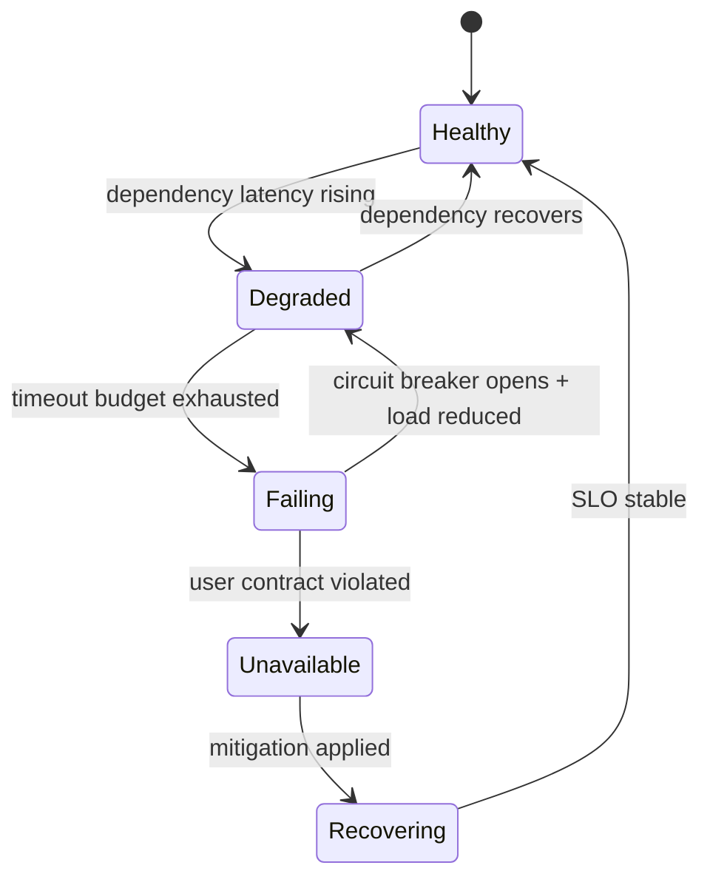
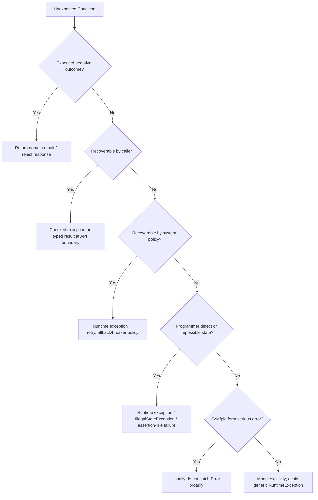
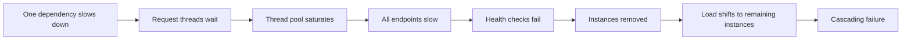

------
title: Learn Java Error, Reliability & Observability Engineering - Part 002
description: Mental model failure-first untuk memahami fault, error, failure, invariant break, blast radius, recovery, dan evidence pada sistem Java produksi.
series: learn-java-error-reliability-observability
seriesTitle: Learn Java Error, Reliability & Observability Engineering
order: 2
partTitle: Failure-First Mental Model
tags:
  - java
  - failure-modeling
  - reliability
  - observability
  - error-handling
date: 2026-06-28
---

# Part 002 — Failure-First Mental Model

> Sistem produksi tidak gagal karena “ada exception”. Exception hanya salah satu cara sistem memberi tahu bahwa ada state, asumsi, resource, kontrak, atau invariant yang tidak lagi benar.

Part ini membangun mental model paling penting dalam seri ini: **failure-first thinking**. Artinya, sebelum menulis handler, retry, log, metric, atau trace, kita harus bisa menjelaskan bentuk kegagalannya.

Kita akan mulai dari pertanyaan yang lebih dasar:

```txt
Apa sebenarnya yang sedang gagal?
```

Jika pertanyaan ini tidak dijawab dengan tepat, solusi teknis cenderung salah sasaran. Retry dipakai untuk bug. Fallback dipakai untuk data yang tidak boleh ditebak. `500` dikirim untuk domain rejection. Error log memenuhi storage tapi tidak membantu investigasi. Alert berbunyi keras tapi tidak menunjukkan user impact.

---

## 1. Failure-First Thinking

Failure-first thinking adalah kebiasaan melihat sistem dari sisi kondisi yang tidak ideal:

- input salah,
- state tidak sesuai,
- dependency lambat,
- network putus,
- database menolak transaksi,
- message dikirim dua kali,
- lock tidak dilepas,
- request dibatalkan,
- deployment menghentikan proses,
- telemetry hilang,
- operator tidak punya cukup bukti.

Tujuannya bukan menjadi pesimis. Tujuannya adalah membuat desain lebih jujur.

Engineer yang kuat tidak hanya mendesain happy path:

```txt
request -> validate -> process -> save -> respond
```

Ia juga mendesain failure path:

```txt
request -> invalid input -> reject safely -> emit evidence
request -> valid input -> dependency timeout -> retry? -> fail/degrade -> emit evidence
request -> valid input -> domain rule violation -> reject with reason -> audit
request -> valid input -> process started -> SIGTERM -> drain or cancel safely
```

---

## 2. Fault, Error, Failure

Tiga istilah ini sering dicampur, padahal sangat membantu untuk diagnosis.

| Istilah | Definisi Praktis | Contoh |
|---|---|---|
| **Fault** | Penyebab laten/cacat yang bisa menghasilkan error | Config salah, bug, pool kecil, dependency unstable |
| **Error** | State internal yang menyimpang dari state benar | Timeout terjadi, invariant rusak, queue backlog tinggi |
| **Failure** | Perilaku eksternal tidak memenuhi kontrak | API 500, latency SLO dilanggar, command hilang |

Contoh konkret:

```txt
Fault   : retry policy tidak punya backoff
Error   : dependency menerima traffic retry berlipat saat mulai lambat
Failure : mayoritas request user timeout dan service dianggap unavailable
```

Pemisahan ini penting karena remediation berbeda.

| Jika Fokus Pada | Respon Biasanya |
|---|---|
| Fault | Fix bug/config/design |
| Error | Contain, isolate, recover |
| Failure | Mitigate user impact, communicate, alert |

Kesalahan umum: melihat failure eksternal lalu langsung menambal handler tanpa menghapus fault atau mengontrol error state.

---

## 3. Failure sebagai State Transition

Failure bukan “kejadian acak”. Dalam sistem yang baik, failure dipahami sebagai transisi state.



Dengan model ini, kita bisa bertanya:

- Apa trigger transisi dari `Healthy` ke `Degraded`?
- Signal apa yang membuktikan state berubah?
- Control apa yang mencegah `Degraded` menjadi `Failing`?
- Kapan kita menyatakan service sudah `Recovering`?
- Evidence apa yang dibutuhkan untuk postmortem?

Tanpa state model, sistem hanya terlihat “kadang error”.

---

## 4. Invariant: Pusat dari Error Design

Invariant adalah kondisi yang harus benar agar sistem tetap valid. Error sering kali adalah bukti bahwa invariant tidak terpenuhi.

Contoh invariant umum:

```txt
Request must have valid authentication context.
Command must target an existing aggregate.
State transition must be legal from current state.
Database transaction must commit atomically.
Message handler must be idempotent.
External call must complete within timeout budget.
Audit-relevant action must leave audit evidence.
```

Setiap invariant punya failure response yang berbeda.

| Invariant | Jika Gagal | Response yang Masuk Akal |
|---|---|---|
| Input valid | Caller salah | 400 / validation error |
| State transition legal | Domain rejection | 409 / domain error |
| Auth context valid | Security rejection | 401/403 |
| Version cocok | Concurrent update | 409 / retry after reload |
| Dependency within budget | Infrastructure failure | timeout / retry / 503 |
| Audit evidence written | Compliance risk | fail transaction atau escalate |
| Internal assumption true | Programmer bug | fail fast + alert if impact |

Jadi, sebelum membuat exception class, tulis invariant-nya dulu.

---

## 5. Expected, Exceptional, and Unacceptable

Tidak semua “error” sama. Kita perlu membedakan tiga kategori.

### 5.1 Expected Negative Outcome

Ini bukan kegagalan sistem. Ini hasil negatif yang valid.

Contoh:

```txt
User salah password.
Case tidak boleh ditutup dari Draft.
Payment ditolak provider.
Search tidak menemukan data.
```

Biasanya tidak perlu error log level `ERROR`. Bisa jadi `INFO`, metric outcome, atau audit event tergantung domain.

### 5.2 Exceptional but Recoverable

Ini kondisi tidak normal, tetapi sistem punya strategi aman.

Contoh:

```txt
Dependency timeout sementara.
Optimistic lock conflict.
Message duplicate.
Rate limit dari upstream.
Temporary network issue.
```

Biasanya perlu bounded retry, backoff, idempotency, fallback tertentu, atau response yang meminta caller mencoba lagi.

### 5.3 Unacceptable / Defect / Fatal-ish

Ini kondisi yang menunjukkan bug, corruption, atau platform tidak sehat.

Contoh:

```txt
Impossible enum branch reached.
Null pada field yang dijamin non-null oleh invariant.
OutOfMemoryError.
StackOverflowError.
Audit write silently skipped.
Database transaction commits partial business state unexpectedly.
```

Biasanya harus fail fast, emit high-quality evidence, dan mendorong perbaikan sistem.

---

## 6. Java Mapping: Dari Failure Model ke Throwable

Java memberi kita mekanisme `Throwable`, tetapi Java tidak otomatis memberi taxonomy bisnis. Kita yang harus memetakannya.



Prinsip penting:

- `Throwable` adalah mekanisme bahasa/runtime.
- Failure taxonomy adalah keputusan desain aplikasi.
- Exception class tanpa taxonomy hanya memindahkan kebingungan dari log ke source code.

---

## 7. Cause, Trigger, Symptom, and Impact

Dalam incident, empat hal ini sering tertukar.

| Istilah | Makna | Contoh |
|---|---|---|
| Cause | Mengapa sistem rentan gagal | Connection pool terlalu kecil |
| Trigger | Peristiwa yang memulai failure | Traffic naik 3x setelah campaign |
| Symptom | Hal yang terlihat di signal | p99 latency naik, timeout meningkat |
| Impact | Dampak ke user/business | User tidak bisa submit case |

Satu cause bisa punya banyak symptom. Satu symptom bisa punya banyak possible cause.

Contoh:

```txt
Symptom: API /cases/{id}/submit p99 naik ke 8 detik.
Possible causes:
- database lock contention,
- downstream notification timeout,
- GC pause,
- thread pool exhaustion,
- retry storm,
- network latency,
- slow query plan regression.
```

Karena itu observability harus membantu membedakan cause, bukan hanya mengumumkan symptom.

---

## 8. Blast Radius

Blast radius adalah luas dampak failure.

Failure kecil bisa menjadi besar jika tidak ada isolasi.



Cara mengurangi blast radius:

| Control | Fungsi |
|---|---|
| Timeout | Membatasi waktu tunggu |
| Bulkhead | Memisahkan resource antar dependency/path |
| Circuit breaker | Stop sementara panggilan ke dependency yang buruk |
| Rate limit | Membatasi input pressure |
| Load shedding | Menolak sebagian kerja agar core tetap hidup |
| Queue limit | Mencegah backlog tak terbatas |
| Idempotency | Membuat retry/duplicate aman |
| Graceful degradation | Menurunkan fitur tanpa mematikan service |

Reliability engineering adalah seni memilih control yang sesuai dengan failure mode.

---

## 9. Containment Before Recovery

Salah satu kesalahan paling umum adalah langsung mencoba recovery sebelum containment.

Contoh buruk:

```txt
Dependency lambat -> retry lebih banyak -> dependency makin lambat -> semua thread habis
```

Urutan yang lebih sehat:

```txt
Detect abnormal latency
-> stop waiting too long with timeout
-> limit concurrency to dependency
-> retry only if safe and within budget
-> open circuit if failure persists
-> degrade or fail fast
-> emit evidence
```

Prinsip:

> Recovery tanpa containment bisa memperbesar failure.

---

## 10. Error Audience

Setiap error punya audience. Satu error yang sama mungkin harus muncul dalam beberapa bentuk.

| Audience | Butuh Apa | Tidak Butuh Apa |
|---|---|---|
| End user | Pesan aman dan actionable | Stack trace, SQL, host internal |
| API client | Stable code, status, retry hint | Internal class name |
| Operator | Context, correlation, severity, runbook | Sensitive personal data |
| Developer | Cause chain, stack, inputs aman | Noise tanpa context |
| Auditor | Actor, action, rule, decision, timestamp | Debug noise |
| Product/business | Impact, count, trend | Stack trace detail |

Contoh mapping:

```txt
Domain condition  : Case cannot be closed from Draft
End user message  : This case must be assigned before it can be closed.
API error code    : CASE_CLOSE_REQUIRES_ASSIGNED_STATE
HTTP status       : 409 Conflict
Log event         : case.close.rejected
Metric            : case_command_rejected_total{command="close", reason="invalid_state"}
Audit event       : actor attempted invalid close transition
Trace span event  : domain.transition.rejected
```

Satu error. Enam representasi. Inilah error management yang matang.

---

## 11. Failure Domain

Failure domain adalah area tempat failure berasal atau berdampak.

| Domain | Contoh | Bias Response |
|---|---|---|
| Input | missing field, invalid format | reject 400 |
| Domain | rule violation, illegal transition | reject 409/422 depending contract |
| Authorization | forbidden action | reject 403 |
| Consistency | version conflict, duplicate command | conflict/idempotent response |
| Dependency | timeout, 5xx, rate limited | retry/breaker/fail fast |
| Resource | pool exhaustion, disk full | shed load, scale, alert |
| Runtime | OOM, StackOverflow | isolate/restart, do not pretend safe |
| Code defect | impossible branch, null invariant | fail fast, fix bug |
| Telemetry | missing trace/log drop | degrade diagnosability, fix instrumentation |
| Operation | bad config, bad deploy | rollback, config validation |

Mental model ini membantu menghindari generic handling.

---

## 12. Failure Severity

Severity bukan hanya “exception class apa”. Severity ditentukan oleh dampak dan recoverability.

| Severity | Definisi | Contoh | Response |
|---|---|---|---|
| S0 | Data integrity/safety/compliance risk | Audit evidence hilang | Stop/rollback/escalate |
| S1 | Core user journey unavailable | Submit case gagal massal | Incident response |
| S2 | Degraded but usable | Notification delay | Monitor/mitigate |
| S3 | Localized user error | Invalid request | Normal rejection |
| S4 | Developer/debug issue | Optional enrichment failed | Debug/info |

Jangan menentukan severity hanya dari log level. Log level adalah salah satu output dari severity decision, bukan sumber kebenaran.

---

## 13. Recoverability

Pertanyaan recoverability:

```txt
Siapa yang bisa memperbaiki kondisi ini, dengan aksi apa, dan apakah aksi itu aman diulang?
```

| Recoverability | Siapa Bertindak | Contoh | Bentuk Response |
|---|---|---|---|
| Caller can fix | API client/user | missing field | validation error |
| Caller can retry same request | client/system | transient timeout, idempotent read | retry hint |
| Caller must change request | client/user | invalid state transition | domain rejection |
| System can retry | service policy | flaky dependency | bounded retry |
| Operator required | human/platform | config broken | alert/runbook |
| Not recoverable locally | process/platform | OOM | crash/restart/isolate |

Exception design harus membawa atau setidaknya mengarah ke informasi recoverability.

---

## 14. Failure Timing

Timing menentukan strategi.

| Timing | Contoh | Risiko | Control |
|---|---|---|---|
| Before processing | invalid request | wasted work rendah | reject fast |
| During transaction | DB conflict | partial change | rollback |
| After commit | notification fails | side effect inconsistency | outbox/compensation |
| During async processing | consumer fails | message stuck/duplicate | retry/DLQ/idempotency |
| During shutdown | work interrupted | lost work | drain/cancel policy |
| During recovery | retry storm | cascading failure | backoff/breaker |

Error handling yang baik sensitif terhadap timing. Error yang terjadi sebelum commit berbeda dari error setelah commit.

---

## 15. Failure Evidence Package

Untuk setiap error penting, pikirkan evidence package.

```java
public record FailureEvidence(
        String errorCode,
        String operation,
        String outcome,
        String reason,
        String correlationId,
        String traceId,
        String entityType,
        String entityId,
        String actorType,
        String recoverability,
        int retryAttempt
) {
}
```

Ini bukan berarti semua field harus ada di semua tempat. Ini mental model untuk memastikan kita tidak kehilangan bukti penting.

Contoh structured log event:

```java
log.warn(
        "case transition rejected",
        kv("event", "case.transition.rejected"),
        kv("error_code", "CASE_STATE_TRANSITION_REJECTED"),
        kv("case_id", caseId),
        kv("from_state", fromState),
        kv("command", command),
        kv("correlation_id", correlationId),
        kv("outcome", "rejected"),
        kv("reason", "invalid_state_transition")
);
```

Catatan: `kv(...)` adalah gaya key-value logging. API spesifiknya akan dibahas di part logging.

---

## 16. Failure Path Design

Setiap use case penting harus punya failure path design.

Contoh use case: `CloseCase`.

### Happy Path

```txt
receive command
-> validate input
-> load case
-> check authorization
-> check state transition
-> update state
-> write audit event
-> commit transaction
-> publish case closed event
-> respond success
```

### Failure Paths

| Step | Failure | Response |
|---|---|---|
| validate input | missing close reason | reject 400 |
| load case | case not found | 404 or domain-specific not found |
| auth | actor not allowed | 403 |
| state check | case still Draft | 409 domain rejection |
| update state | version conflict | 409 conflict |
| audit event | audit write fails | rollback/escalate depending policy |
| commit | DB unavailable | 503/system failure |
| publish event | broker unavailable after commit | outbox retry |
| response | client disconnected | complete transaction, record outcome |

Failure path design membuat kita tidak panik saat implementasi.

---

## 17. Java Example: Modeling Failure Without Over-Catching

Contoh buruk:

```java
public CloseCaseResponse closeCase(CloseCaseCommand command) {
    try {
        Case c = repository.findById(command.caseId()).get();
        c.close(command.reason());
        repository.save(c);
        audit.write("case closed");
        return CloseCaseResponse.success(c.id());
    } catch (Exception e) {
        log.error("Failed to close case", e);
        return CloseCaseResponse.failed("FAILED");
    }
}
```

Masalah:

- `Optional.get()` bisa melempar `NoSuchElementException` tanpa domain meaning.
- Semua error dicampur.
- Audit failure diperlakukan sama dengan invalid input.
- Response tidak actionable.
- Error code tidak stabil.
- Recoverability tidak jelas.
- Cause mungkin tidak terlihat di boundary.

Contoh lebih baik:

```java
public CloseCaseResult closeCase(CloseCaseCommand command) {
    validate(command);

    Case c = repository.findById(command.caseId())
            .orElseThrow(() -> new CaseNotFoundException(command.caseId()));

    c.close(command.reason()); // may throw domain rejection

    try {
        repository.save(c);
        audit.writeCaseClosed(c.id(), command.actorId(), command.reason());
        return CloseCaseResult.success(c.id());
    } catch (OptimisticLockingFailureException e) {
        throw new CaseVersionConflictException(c.id(), e);
    } catch (DataAccessException e) {
        throw new CasePersistenceException(c.id(), e);
    }
}
```

Ini belum sempurna, tetapi lebih baik karena:

- not found punya exception sendiri,
- domain rule ada di domain method,
- consistency conflict dipisahkan,
- persistence failure diterjemahkan,
- cause tetap disimpan,
- boundary layer bisa mapping error dengan benar.

---

## 18. The Failure Classification Card

Untuk setiap failure mode penting, buat classification card.

```txt
Name:
  Case close rejected from Draft

Invariant:
  A case must be assigned before it can be closed.

Failure domain:
  Domain rule

Expected or exceptional:
  Expected negative outcome

Recoverability:
  Caller must change request or transition case first

Boundary response:
  409 Conflict

Error code:
  CASE_CLOSE_REQUIRES_ASSIGNED_STATE

Log level:
  INFO or WARN depending abuse/security/business context

Metric:
  case_command_rejected_total{command="close", reason="invalid_state"}

Audit:
  Yes, actor attempted close transition

Retry:
  No, same request will fail again

Alert:
  No, unless rate suddenly spikes
```

Classification card memaksa kita berpikir lengkap sebelum menulis handler.

---

## 19. When Not to Throw

Tidak semua kondisi negatif harus menjadi exception.

Jangan throw jika:

- kondisi negatif adalah bagian normal dari control flow yang sering terjadi,
- caller memang perlu memilih cabang berdasarkan hasil,
- tidak ada stack unwinding yang dibutuhkan,
- tidak ada invariant yang rusak,
- hasil negatif bisa dimodelkan jelas sebagai value.

Contoh:

```java
public sealed interface AuthorizationDecision
        permits AuthorizationDecision.Allowed, AuthorizationDecision.Denied {

    record Allowed() implements AuthorizationDecision {}

    record Denied(String reasonCode, String safeMessage) implements AuthorizationDecision {}
}
```

Namun jangan ekstrem. Jika semua error diubah menjadi result object, caller bisa mengabaikan hasil seperti return code lama. Gunakan typed result jika benar-benar membuat control flow lebih eksplisit.

---

## 20. When to Fail Fast

Fail fast cocok ketika melanjutkan eksekusi lebih berbahaya daripada berhenti.

Contoh:

```java
public Money allocate(Money total, int parts) {
    if (parts <= 0) {
        throw new IllegalArgumentException("parts must be positive");
    }
    // ...
}
```

Fail fast penting untuk:

- invalid programmer input,
- impossible state,
- broken invariant,
- unsafe continuation,
- configuration invalid at startup,
- data corruption suspicion.

Fail fast bukan berarti user experience buruk. Fail fast berarti sistem berhenti pada boundary yang benar sebelum corruption menyebar.

---

## 21. Failure and Observability Signals

Observability bukan tujuan akhir. Observability adalah cara merekonstruksi state saat kita tidak berada di dalam proses.

| Signal | Menjawab | Contoh |
|---|---|---|
| Log | Apa yang terjadi pada event spesifik? | case transition rejected |
| Metric | Seberapa sering/berapa besar? | rejection count, p95 latency |
| Trace | Di mana waktu dan causal path hilang? | DB span 2s, notification span timeout |
| Audit | Keputusan bisnis/regulasi apa yang terjadi? | actor rejected transition |
| Dump/profile | Apa kondisi runtime? | thread pool stuck, heap pressure |

Jangan memaksa satu signal melakukan semua tugas.

---

## 22. Failure-First Design Review

Saat review desain atau PR, gunakan pertanyaan berikut.

### 22.1 Pertanyaan Domain

- Invariant apa yang dijaga?
- Apa failure path untuk setiap invariant?
- Apakah domain rejection dibedakan dari system failure?
- Apakah error code stabil?
- Apakah user-safe message berbeda dari technical detail?

### 22.2 Pertanyaan Reliability

- Apakah external call punya timeout?
- Apakah retry aman dan bounded?
- Apakah operation idempotent?
- Apakah ada containment sebelum recovery?
- Apakah failure bisa menyebar ke thread pool/queue lain?

### 22.3 Pertanyaan Observability

- Apakah log punya operation, outcome, reason, correlation id?
- Apakah metric bisa membedakan error category?
- Apakah cardinality aman?
- Apakah trace context melewati async boundary?
- Apakah alert berdasarkan user impact?

### 22.4 Pertanyaan Operasional

- Apa yang terjadi saat SIGTERM?
- Apa yang terjadi saat dependency down?
- Apa yang terjadi saat database slow?
- Apa yang terjadi saat telemetry backend down?
- Apa runbook untuk operator?

---

## 23. Mini Lab: Classify 12 Failure Scenarios

Klasifikasikan scenario berikut dengan kolom:

```txt
fault/error/failure, domain, expected?, recoverability, response, evidence
```

Scenarios:

1. User mencoba close case dari Draft.
2. Request tidak punya required field `caseId`.
3. Database connection pool habis.
4. Notification service timeout.
5. Consumer menerima message yang sama dua kali.
6. `InterruptedException` ditangkap lalu diabaikan.
7. API mengembalikan 500 karena `Optional.get()` pada empty optional.
8. Audit log gagal ditulis setelah state case berubah.
9. Trace id hilang setelah `CompletableFuture.supplyAsync`.
10. Circuit breaker open selama 5 menit karena dependency benar-benar down.
11. Metric label memakai raw exception message.
12. Kubernetes mengirim SIGTERM saat request panjang masih berjalan.

Contoh jawaban untuk nomor 1:

```txt
Scenario:
  User mencoba close case dari Draft.

Fault:
  Tidak ada fault jika rule memang valid; ini expected negative outcome.

Error:
  Command violates domain invariant.

Failure:
  Bukan system failure; request rejected sesuai kontrak.

Domain:
  Domain rule.

Recoverability:
  Caller must transition case to Assigned first.

Response:
  409 Conflict, CASE_CLOSE_REQUIRES_ASSIGNED_STATE.

Evidence:
  structured log event, domain rejection metric, audit event if required.
```

---

## 24. Anti-Pattern: Exception-First Thinking

Exception-first thinking dimulai dari pertanyaan:

```txt
Exception apa yang harus saya catch?
```

Failure-first thinking dimulai dari:

```txt
Failure mode apa yang sedang saya desain?
```

Perbandingan:

| Exception-First | Failure-First |
|---|---|
| Catch dulu, pikir nanti | Model invariant dan failure path dulu |
| Semua error masuk `RuntimeException` | Error punya category dan audience |
| Log stack trace di semua layer | Log di boundary yang punya context |
| Retry saat exception terjadi | Retry hanya jika safe dan bounded |
| Fallback untuk “biar sukses” | Fallback hanya jika semantic-nya benar |
| Alert setiap exception | Alert berdasarkan user impact/SLO |

---

## 25. Anti-Pattern: Success Bias

Success bias terjadi ketika desain hanya mengoptimalkan path sukses.

Gejala:

- sequence diagram hanya punya satu panah lurus,
- tidak ada timeout di diagram,
- tidak ada rollback/compensation path,
- tidak ada duplicate message handling,
- tidak ada shutdown behavior,
- tidak ada observability field,
- tidak ada runbook.

Cara memperbaiki:

1. Ambil setiap step happy path.
2. Tanya: “Bagaimana step ini gagal?”
3. Tanya: “Apakah failure ini expected, recoverable, atau unacceptable?”
4. Tanya: “Siapa yang harus tahu?”
5. Tanya: “Evidence apa yang membuktikan ini terjadi?”
6. Tanya: “Control apa yang membatasi dampak?”

---

## 26. Error Budget Thinking

Error budget adalah cara menghubungkan reliability dengan keputusan engineering. Secara sederhana:

```txt
Jika target availability adalah 99.9%, maka ada 0.1% ruang kegagalan yang masih bisa diterima dalam periode tertentu.
```

Yang penting bukan angka matematisnya di part ini, tetapi mental model:

- semua sistem bisa gagal,
- tidak semua error punya dampak yang sama,
- reliability harus diukur dari user-visible behavior,
- alert harus berhubungan dengan budget atau symptom penting,
- engineering speed dan operational risk harus diseimbangkan.

Dalam konteks Java error design, error budget membantu menentukan:

- error mana yang harus alert,
- error mana cukup metric,
- fallback mana yang acceptable,
- kapan deployment harus dihentikan,
- kapan reliability work lebih penting daripada feature work.

---

## 27. Failure Model Template

Gunakan template berikut untuk desain fitur baru.

```txt
Feature / Operation:
  ______________________________

Happy-path contract:
  ______________________________

Critical invariants:
  1. ____________________________
  2. ____________________________
  3. ____________________________

Failure modes:
  1. ____________________________
  2. ____________________________
  3. ____________________________

For each failure mode:
  - failure domain:
  - expected / exceptional / unacceptable:
  - recoverability:
  - retry safety:
  - boundary response:
  - log event:
  - metric:
  - trace/span attribute:
  - audit requirement:
  - alert requirement:
  - runbook action:

Shutdown behavior:
  ______________________________

Telemetry loss behavior:
  ______________________________
```

Ini akan menjadi template review sepanjang seri.

---

## 28. Checklist Part 002

Sebelum lanjut ke Part 003, pastikan kamu bisa:

- [ ] Membedakan fault, error, dan failure.
- [ ] Menjelaskan failure sebagai state transition.
- [ ] Menentukan invariant dari satu use case.
- [ ] Membedakan expected negative outcome, recoverable exceptional condition, dan unacceptable defect.
- [ ] Menentukan error audience.
- [ ] Menentukan failure domain.
- [ ] Menjelaskan blast radius.
- [ ] Menjelaskan mengapa containment harus mendahului recovery.
- [ ] Membuat failure classification card.
- [ ] Menjelaskan kapan tidak perlu throw exception.

---

## 29. Latihan Part 002

### Latihan 1 — Failure Card untuk 5 Use Case

Pilih 5 operation dari service kamu. Untuk masing-masing, buat failure classification card.

Minimal operation:

```txt
create
update
transition state
call external dependency
consume async message
```

### Latihan 2 — Rewrite Error Handling

Ambil satu method yang saat ini punya:

```java
catch (Exception e) {
    log.error("failed", e);
    throw new RuntimeException(e);
}
```

Refactor menjadi:

- validation/domain rejection,
- dependency failure translation,
- cause preservation,
- structured evidence,
- boundary response mapping.

### Latihan 3 — Blast Radius Walkthrough

Pilih satu dependency. Jawab:

```txt
Jika dependency ini lambat 10x:
- thread pool mana yang terdampak?
- queue mana yang menumpuk?
- endpoint mana yang ikut gagal?
- metric mana yang berubah duluan?
- kapan alert berbunyi?
- control apa yang membatasi dampak?
```

### Latihan 4 — Observability Gap Review

Ambil satu production error log lama. Tanyakan:

- Apakah ada correlation id?
- Apakah ada stable error code?
- Apakah ada operation name?
- Apakah entity id aman tersedia?
- Apakah cause chain terlihat?
- Apakah metric bisa menghitung error ini?
- Apakah trace bisa menunjukkan dependency yang lambat?

---

## 30. Ringkasan

Part ini membangun mental model failure-first.

Kesimpulan utama:

1. Exception bukan failure itu sendiri; exception adalah salah satu representasi error state.
2. Fault, error, dan failure harus dibedakan agar diagnosis dan recovery tepat.
3. Invariant adalah pusat dari error design.
4. Expected negative outcome tidak boleh disamakan dengan system failure.
5. Recovery tanpa containment bisa memperbesar outage.
6. Setiap error punya audience dan evidence package yang berbeda.
7. Failure-first thinking membuat exception handling, reliability pattern, dan observability menjadi satu desain yang koheren.

Part berikutnya akan masuk ke **Error Taxonomy**: bagaimana membangun taxonomy error yang cukup tajam untuk service Java enterprise, termasuk programmer error, domain error, infrastructure error, dependency error, policy error, dan partial failure.
