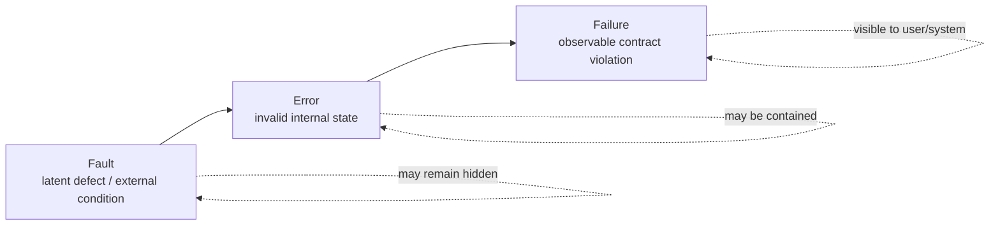
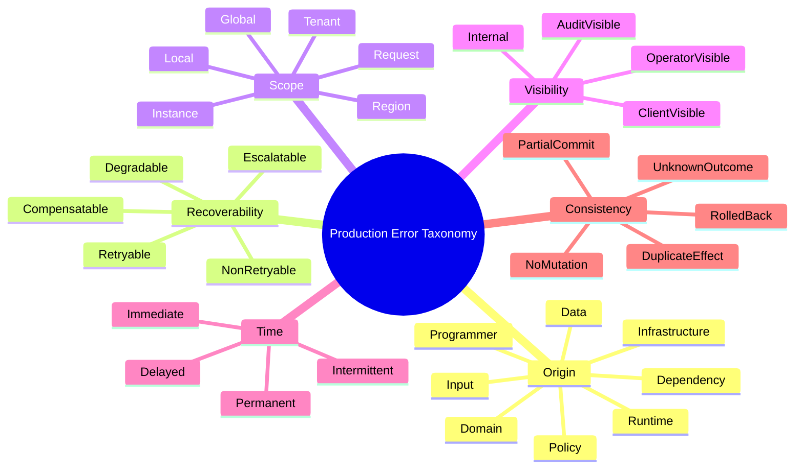
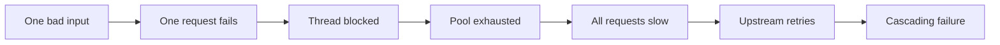
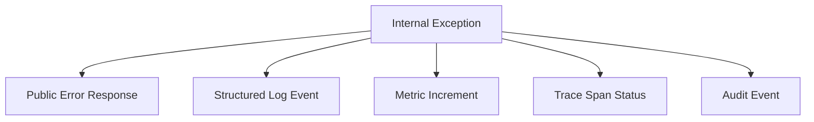
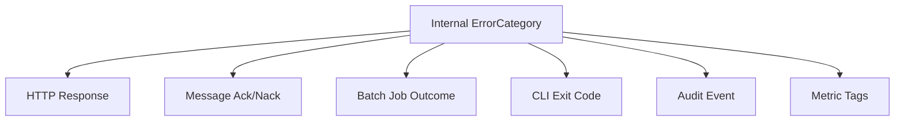
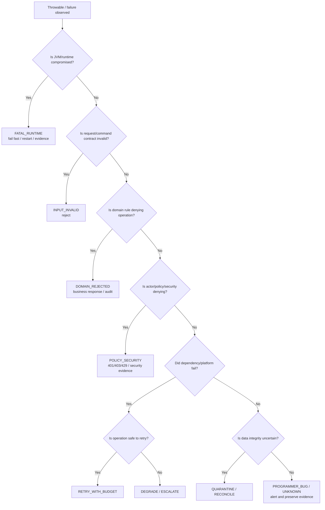

------
title: Learn Java Error, Reliability & Observability Engineering - Part 003
description: Taxonomy error produksi untuk aplikasi Java: membedakan bug, domain failure, dependency failure, overload, timeout, data inconsistency, dan policy failure secara operasional.
series: learn-java-error-reliability-observability
seriesTitle: Learn Java Error, Reliability & Observability Engineering
order: 3
partTitle: Error Taxonomy
tags:
  - java
  - error-handling
  - reliability
  - failure-taxonomy
  - observability
  - production-engineering
date: 2026-06-28
---

# Part 003 — Error Taxonomy

> Target part ini: kita tidak lagi menyebut semua kegagalan sebagai “error”. Kita akan membangun taxonomy yang cukup presisi untuk menentukan aksi: reject, retry, rollback, compensate, quarantine, degrade, alert, escalate, atau ignore.

Di produksi, kata “error” terlalu miskin. Ia bisa berarti bug, input invalid, database down, timeout, overload, data corrupt, race condition, permission denied, kontrak API berubah, atau proses shutdown sedang berjalan. Jika semua kasus itu diperlakukan sama, sistem akan punya tiga penyakit klasik:

1. **wrong recovery** — melakukan retry pada error yang tidak aman untuk di-retry;
2. **wrong visibility** — menyembunyikan error yang seharusnya terlihat, atau membocorkan detail internal ke client;
3. **wrong ownership** — melempar masalah ke tim/layer yang salah.

Taxonomy error adalah fondasi untuk seluruh seri ini. Exception hierarchy, error code, logging, metrics, tracing, alerting, dan graceful shutdown akan buruk jika taxonomy dasarnya kabur.

---

## 1. Kaufman Deconstruction: Skill yang Ingin Dilatih

Dalam kerangka *The First 20 Hours*, kita memecah kemampuan “menangani error” menjadi kemampuan yang bisa dilatih:

| Sub-skill | Pertanyaan Latihan | Output yang Diinginkan |
|---|---|---|
| **Classify** | Error ini berasal dari mana? | Source of failure jelas. |
| **Assess impact** | Siapa/apa yang terdampak? | Blast radius diketahui. |
| **Assess recoverability** | Apakah sistem bisa pulih otomatis? | Retry/degrade/escalate tidak asal. |
| **Choose boundary behavior** | Apa yang boleh keluar dari layer ini? | Error contract stabil. |
| **Emit evidence** | Bukti apa yang perlu direkam? | Log/metric/trace berguna. |
| **Assign ownership** | Tim/layer mana yang harus memperbaiki? | Incident tidak ping-pong. |

Kita akan memakai satu aturan dasar:

> Error category yang baik harus membantu keputusan operasional. Jika kategori tidak mengubah aksi, mungkin kategori itu hanya kosmetik.

Contoh kategori yang buruk:

```text
SystemError
ApplicationError
GeneralException
TechnicalException
BusinessException
```

Kategori tersebut terdengar formal, tetapi sering tidak membantu menjawab:

- boleh retry atau tidak?
- client salah atau server salah?
- data aman atau perlu quarantine?
- perlu alert sekarang atau cukup dicatat?
- harus rollback, compensate, atau continue?

---

## 2. Fault, Error, Failure: Tiga Level yang Berbeda

Sebelum taxonomy, bedakan tiga konsep berikut.

| Konsep | Makna | Contoh |
|---|---|---|
| **Fault** | Cacat laten atau kondisi penyebab. | Bug mapping enum, index DB hilang, credential salah, CPU limit terlalu kecil. |
| **Error** | State internal sudah menyimpang dari yang benar. | Object invalid masuk service, connection pool exhausted, deadline habis. |
| **Failure** | Perilaku eksternal tidak memenuhi kontrak. | Client menerima 500, job tidak diproses, event terkirim dua kali. |

Diagramnya:



Contoh dalam Java service:

```text
Fault:
  Developer lupa handle status CLOSED dalam state machine enforcement case.

Error:
  Service menghasilkan transition decision null.

Failure:
  API /cases/{id}/actions mengembalikan 500 saat officer membuka case CLOSED.
```

Engineer top-tier tidak berhenti di failure. Ia bertanya balik:

```text
Failure apa yang terlihat?
Error internal apa yang mendahului?
Fault apa yang memungkinkan error itu terjadi?
Kontrol apa yang seharusnya memutus rantai tersebut?
```

---

## 3. Taxonomy Besar: 10 Dimensi Error Produksi

Tidak ada satu taxonomy tunggal yang cukup untuk semua keputusan. Error produksi perlu dilihat dari beberapa dimensi.



Kita akan uraikan setiap dimensi.

---

## 4. Dimensi 1 — Origin: Dari Mana Error Berasal?

Origin membantu menentukan ownership dan boundary translation.

### 4.1 Programmer Error

**Definisi:** error karena kode melanggar asumsi internalnya sendiri.

Contoh:

- `NullPointerException` karena invariant object tidak dijaga;
- `IllegalStateException` karena state machine masuk state mustahil;
- `IndexOutOfBoundsException` karena bug akses collection;
- `ClassCastException` karena asumsi type salah;
- `AssertionError` atau failed precondition internal;
- branch `default` yang seharusnya unreachable ternyata tercapai.

Contoh kode:

```java
Action nextAction(CaseStatus status) {
    return switch (status) {
        case OPEN -> Action.REVIEW;
        case UNDER_INVESTIGATION -> Action.REQUEST_EVIDENCE;
        case CLOSED -> throw new IllegalStateException(
            "Closed case must not request next officer action"
        );
    };
}
```

Karakteristik:

| Aspek | Nilai Umum |
|---|---|
| Retry? | Tidak berguna, kecuali fault intermittent dari state external. |
| Client fault? | Tidak selalu. Biasanya server defect. |
| Alert? | Ya, jika mencapai boundary produksi. |
| Response | 500 atau internal failure contract. |
| Evidence | Stack trace, correlation ID, input shape, state snapshot aman. |

Anti-pattern:

```java
try {
    return nextAction(status);
} catch (Exception e) {
    return Action.REVIEW; // hides a broken invariant
}
```

Ini bukan graceful degradation. Ini mengubah bug menjadi keputusan bisnis palsu.

---

### 4.2 Domain Error

**Definisi:** permintaan valid secara teknis, tetapi melanggar aturan domain.

Contoh regulatory/case-management:

- case sudah `CLOSED`, tidak boleh ditambah evidence baru;
- officer tidak boleh approve case yang ia buat sendiri;
- penalty tidak boleh diterbitkan sebelum notice period selesai;
- appeal window sudah lewat;
- escalation membutuhkan minimal dua failed reminders.

Domain error bukan “exceptional” dalam arti operasional. Ia adalah outcome bisnis yang harus bisa dijelaskan.

```java
public final class CaseAlreadyClosedException extends RuntimeException {
    private final String caseId;
    private final CaseStatus status;

    public CaseAlreadyClosedException(String caseId, CaseStatus status) {
        super("Case %s is already %s".formatted(caseId, status));
        this.caseId = caseId;
        this.status = status;
    }

    public String caseId() {
        return caseId;
    }

    public CaseStatus status() {
        return status;
    }
}
```

Karakteristik:

| Aspek | Nilai Umum |
|---|---|
| Retry? | Tidak, kecuali state domain berubah. |
| Client fault? | Sering ya, tetapi bukan selalu “bad request”. |
| Alert? | Biasanya tidak, kecuali rate melonjak. |
| Response | 400/403/409/422 tergantung kontrak. |
| Evidence | Rule ID, case ID, actor ID, decision reason. |

Mental model:

> Domain error adalah bagian dari bahasa domain. Ia harus dapat dibaca oleh manusia bisnis, diuji oleh QA, dipakai oleh audit, dan dipetakan ke response contract.

---

### 4.3 Input/Contract Error

**Definisi:** request/event/file/command tidak memenuhi kontrak teknis.

Contoh:

- field wajib kosong;
- enum tidak dikenal;
- timestamp format salah;
- payload melebihi batas ukuran;
- schema version tidak didukung;
- message event hilang `correlationId`;
- parameter query bertentangan.

Input error berbeda dari domain error.

| Input Error | Domain Error |
|---|---|
| Payload/command tidak valid secara kontrak. | Payload valid, tetapi aksi tidak diperbolehkan oleh aturan bisnis. |
| Biasanya terjadi sebelum domain service. | Biasanya terjadi di domain/application service. |
| Error detail bisa menunjuk field/path. | Error detail menunjuk rule/process/state. |

Contoh shape validasi:

```java
public record ValidationIssue(
    String field,
    String code,
    String message
) {}

public final class RequestValidationException extends RuntimeException {
    private final List<ValidationIssue> issues;

    public RequestValidationException(List<ValidationIssue> issues) {
        super("Request validation failed with %d issue(s)".formatted(issues.size()));
        this.issues = List.copyOf(issues);
    }

    public List<ValidationIssue> issues() {
        return issues;
    }
}
```

Karakteristik:

| Aspek | Nilai Umum |
|---|---|
| Retry? | Tidak dengan payload yang sama. |
| Client fault? | Ya, jika client mengirim request. |
| Alert? | Tidak per request; alert jika spike/anomaly. |
| Response | 400 atau 422 sesuai kontrak. |
| Evidence | Field path, error code, schema version. |

---

### 4.4 Dependency Error

**Definisi:** service bergantung pada komponen lain dan komponen tersebut gagal, lambat, berubah kontrak, atau memberi hasil tidak valid.

Contoh:

- payment service timeout;
- identity service mengembalikan 503;
- database deadlock;
- Kafka broker unavailable;
- S3-compatible storage slow;
- external API mengubah enum tanpa pemberitahuan;
- downstream mengembalikan 200 dengan body invalid.

Dependency error perlu dibaca dari dua sisi:

```text
Dari sisi kita:
  dependency failed.

Dari sisi user kita:
  service kita tetap bertanggung jawab terhadap contract kita sendiri.
```

Karakteristik:

| Aspek | Nilai Umum |
|---|---|
| Retry? | Mungkin, jika operasi idempotent dan timeout budget masih cukup. |
| Client fault? | Tidak. |
| Alert? | Ya jika memengaruhi SLO atau dependency critical. |
| Response | 502/503/504 atau degraded response. |
| Evidence | Dependency name, operation, status, latency, attempt count, timeout budget. |

Contoh wrapper:

```java
public final class DependencyFailureException extends RuntimeException {
    private final String dependency;
    private final String operation;
    private final boolean retryable;

    public DependencyFailureException(
        String dependency,
        String operation,
        boolean retryable,
        Throwable cause
    ) {
        super("Dependency failure: %s.%s retryable=%s"
            .formatted(dependency, operation, retryable), cause);
        this.dependency = dependency;
        this.operation = operation;
        this.retryable = retryable;
    }

    public boolean retryable() {
        return retryable;
    }
}
```

Anti-pattern:

```java
catch (Exception e) {
    throw new RuntimeException("Failed");
}
```

Informasi dependency, operation, status, dan retryability hilang. Observability menjadi miskin.

---

### 4.5 Infrastructure/Platform Error

**Definisi:** runtime environment atau platform execution tidak mampu menyediakan resource/condition yang dibutuhkan.

Contoh:

- container mendapat SIGTERM;
- disk penuh;
- DNS resolution gagal;
- node kehilangan network;
- CPU throttling ekstrem;
- file descriptor habis;
- certificate expired;
- config/secrets tidak tersedia;
- clock skew;
- pod evicted.

Karakteristik:

| Aspek | Nilai Umum |
|---|---|
| Retry? | Kadang, tetapi retry lokal bisa memperburuk overload. |
| Client fault? | Tidak. |
| Alert? | Ya, biasanya platform/SRE/app owner. |
| Response | 503/504, fail startup, readiness false, graceful drain. |
| Evidence | Host/pod, resource usage, config version, env, lifecycle event. |

Infrastructure error sering tampak sebagai dependency error. Misalnya database timeout bisa berasal dari DB lambat, network drop, connection pool penuh, DNS issue, atau CPU throttling aplikasi sendiri. Karena itu taxonomy harus dikombinasikan dengan telemetry.

---

### 4.6 Runtime/JVM Error

**Definisi:** JVM atau runtime Java mengalami kondisi serius.

Contoh:

- `OutOfMemoryError`;
- `StackOverflowError`;
- `NoClassDefFoundError`;
- `ExceptionInInitializerError`;
- classpath/module mismatch;
- native memory exhaustion;
- fatal JVM crash;
- GC overhead ekstrem.

Di Java, banyak kondisi ini muncul sebagai subclass `Error`, bukan `Exception`. Secara umum aplikasi normal tidak boleh menganggap `Error` sebagai kondisi bisnis yang recoverable.

Karakteristik:

| Aspek | Nilai Umum |
|---|---|
| Retry? | Tidak di request-level. Restart/rollout mungkin. |
| Client fault? | Tidak. |
| Alert? | Ya, high severity. |
| Response | Fail fast, crash, restart, reject traffic. |
| Evidence | Heap dump, thread dump, GC log, classpath, startup log. |

Prinsip:

> Jangan membangun flow bisnis yang bergantung pada menangkap `Error`. Tangani di boundary paling luar hanya untuk evidence dan shutdown bila masih mungkin.

---

### 4.7 Policy/Security Error

**Definisi:** aksi ditolak karena policy, izin, risk control, atau security constraint.

Contoh:

- user tidak punya permission;
- token expired;
- request melanggar rate limit;
- tenant mismatch;
- akses data lintas wilayah dilarang;
- action butuh approval tambahan;
- data classification melarang export.

Policy error sering mirip domain error, tetapi bedanya:

| Policy Error | Domain Error |
|---|---|
| Berbasis actor, permission, risk, compliance, security, tenancy. | Berbasis state dan rule proses bisnis. |
| Sering harus menghindari detail leakage. | Sering harus memberi reason yang audit-friendly. |
| Bisa menjadi security signal. | Biasanya business-process signal. |

Karakteristik:

| Aspek | Nilai Umum |
|---|---|
| Retry? | Tidak kecuali credential/permission berubah. |
| Client fault? | Ya/tidak tergantung konteks. |
| Alert? | Tidak selalu; alert jika anomaly/attack pattern. |
| Response | 401/403/429, atau opaque denial. |
| Evidence | Actor, tenant, policy ID, decision, risk score; jangan log secret. |

---

### 4.8 Data Integrity Error

**Definisi:** data melanggar invariant, constraint, consistency expectation, atau tidak bisa dipercaya.

Contoh:

- duplicate natural key;
- foreign key missing;
- state machine transition tidak konsisten;
- event order terbalik;
- read model stale di luar toleransi;
- checksum mismatch;
- record punya status `APPROVED` tetapi approval timestamp null;
- optimistic lock conflict;
- partial migration.

Data integrity error perlu diperlakukan lebih hati-hati daripada error biasa. Salah recovery bisa membuat data makin rusak.

Karakteristik:

| Aspek | Nilai Umum |
|---|---|
| Retry? | Tergantung: optimistic conflict mungkin retry; corrupt data tidak. |
| Client fault? | Kadang. |
| Alert? | Ya jika invariant internal/data critical rusak. |
| Response | 409, 500, quarantine, manual review. |
| Evidence | Entity ID, invariant ID, version, transaction ID, source event. |

Prinsip:

> Untuk data integrity error, default yang aman adalah stop, isolate, preserve evidence. Jangan “fix silently” kecuali mekanisme repair sudah dirancang dan diaudit.

---

## 5. Dimensi 2 — Recoverability: Apa Aksi yang Benar?

Origin menjelaskan sumber. Recoverability menjelaskan tindakan.

| Category | Makna | Aksi Umum |
|---|---|---|
| **Retryable** | Kemungkinan berhasil jika dicoba lagi. | Retry dengan budget, jitter, idempotency. |
| **Non-retryable** | Payload/state sama akan gagal lagi. | Reject, return error, fix input/state. |
| **Compensatable** | Efek sudah terjadi sebagian, perlu aksi balik. | Compensation, saga rollback, manual review. |
| **Degradable** | Fitur bisa turun kualitas tanpa gagal total. | Fallback, stale read, partial response. |
| **Escalatable** | Butuh manusia atau sistem lain. | Alert, ticket, runbook. |
| **Quarantinable** | Item buruk bisa diisolasi agar pipeline lanjut. | Dead-letter, quarantine table, hold queue. |
| **Fatal** | Proses tidak aman untuk lanjut. | Crash/restart, readiness false, fail startup. |

### 5.1 Retryability Bukan Properti Exception Saja

Retryability bergantung pada operasi.

Contoh:

```text
Timeout saat GET /profile:
  Mungkin retryable.

Timeout setelah POST /payments tanpa idempotency key:
  Outcome unknown. Retry bisa membuat double charge.

Deadlock pada transaction idempotent:
  Mungkin retryable.

Validation error missing field:
  Non-retryable dengan payload yang sama.
```

Karena itu jangan membuat class seperti ini tanpa konteks:

```java
class RetryableException extends RuntimeException {}
```

Lebih baik metadata retryability melekat pada failure decision:

```java
public record FailureDecision(
    FailureKind kind,
    boolean retryable,
    boolean idempotencyRequired,
    boolean alertable,
    String publicCode
) {}
```

---

## 6. Dimensi 3 — Scope dan Blast Radius

Error yang sama bisa berbeda severity tergantung scope.

| Scope | Contoh | Implikasi |
|---|---|---|
| **Local** | Satu method gagal parse value. | Bisa ditangani lokal. |
| **Request** | Satu HTTP request gagal. | Return error response. |
| **Workflow item** | Satu case/event/job gagal. | Quarantine atau manual review. |
| **Tenant** | Semua request tenant A gagal. | Tenant-specific incident. |
| **Instance** | Satu pod/service instance gagal. | Remove dari load balancer. |
| **Dependency** | Semua call ke payment service gagal. | Circuit breaker/degradation. |
| **Region** | Region tertentu bermasalah. | Failover/traffic shift. |
| **Global** | Semua sistem terdampak. | Major incident. |

Diagram propagasi:



Tujuan reliability control adalah memotong propagasi sedini mungkin.

---

## 7. Dimensi 4 — Visibility dan Audience

Tidak semua informasi error cocok untuk semua audience.

| Audience | Butuh Apa | Tidak Boleh Mendapat Apa |
|---|---|---|
| **End user** | Pesan aman, actionability, reference ID. | Stack trace, SQL, secret, internal topology. |
| **Client system** | Stable code, retry hint, field issue. | Detail internal non-kontraktual. |
| **Operator** | Severity, dependency, latency, affected scope. | PII/secret tidak perlu. |
| **Developer** | Stack trace, cause chain, input shape aman. | Data sensitif mentah. |
| **Auditor** | Rule ID, actor, decision, timestamp, evidence. | Noise teknis yang tidak relevan. |
| **Security team** | Actor, tenant, policy, anomaly pattern. | Token/password/API key. |

Satu failure biasanya perlu multi-representation:



Kesalahan umum: memakai message exception sebagai response publik.

```java
catch (Exception e) {
    return Response.serverError()
        .entity(Map.of("error", e.getMessage()))
        .build();
}
```

Masalah:

- message bisa mengandung detail internal;
- message tidak stabil sebagai contract;
- message sulit dipakai mesin;
- localization/audit menjadi kacau;
- perubahan wording bisa memecahkan client test.

---

## 8. Dimensi 5 — Temporal Behavior

Error juga harus dilihat dari pola waktunya.

| Temporal Type | Makna | Contoh | Respons |
|---|---|---|---|
| **Immediate** | Gagal langsung. | Validation error. | Reject cepat. |
| **Delayed** | Efek gagal muncul belakangan. | Async job gagal setelah API 202. | Tracking, callback, audit. |
| **Intermittent** | Kadang gagal kadang berhasil. | Network flake, race, timeout. | Retry terbatas, telemetry. |
| **Persistent** | Selalu gagal sampai ada fix. | Bad config, schema mismatch. | Stop retry storm, alert. |
| **Progressive** | Memburuk perlahan. | Memory leak, queue backlog. | Early warning metric. |
| **Burst** | Spike mendadak. | Traffic surge, dependency outage. | Load shedding, autoscale, circuit. |

Java service sering salah memperlakukan persistent error sebagai intermittent error. Contoh: config credential salah tetapi kode retry terus setiap request. Hasilnya log spam, dependency pressure, dan alert fatigue.

---

## 9. Dimensi 6 — Consistency Outcome

Untuk operasi mutasi, pertanyaan penting bukan hanya “gagal atau berhasil”, tetapi “efeknya sudah terjadi atau belum?”.

| Outcome | Makna | Contoh |
|---|---|---|
| **No mutation** | Belum ada perubahan. | Validation gagal sebelum transaction. |
| **Rolled back** | Perubahan dibatalkan. | Exception dalam transaction DB rollback. |
| **Committed** | Perubahan berhasil commit. | DB update sukses, response hilang. |
| **Partial commit** | Sebagian efek terjadi. | DB commit berhasil, event publish gagal. |
| **Duplicate effect** | Efek terjadi lebih dari sekali. | Retry create payment tanpa idempotency. |
| **Unknown outcome** | Sistem tidak tahu efek terjadi atau tidak. | Timeout setelah request downstream dikirim. |

Unknown outcome adalah salah satu kategori paling berbahaya.

```text
Client timeout != operation did not happen.
Database timeout != transaction did not commit.
HTTP timeout after sending body != downstream did not process.
```

Mental model:

> Setelah mutasi melewati boundary eksternal, kegagalan komunikasi sering membuat outcome tidak pasti. Recovery harus berbasis idempotency, reconciliation, atau query-by-key, bukan asumsi.

---

## 10. Dimensi 7 — Determinism

| Type | Makna | Debugging Style |
|---|---|---|
| **Deterministic** | Input/state sama selalu gagal. | Reproduce locally, unit/integration test. |
| **Nondeterministic** | Bergantung timing, interleaving, load. | Stress test, tracing, thread dump, metrics. |
| **Environment-dependent** | Hanya gagal di env tertentu. | Config diff, dependency version, resource limits. |
| **Data-dependent** | Hanya gagal untuk subset data. | Data profiling, invariant query, quarantine. |

Contoh:

```text
NullPointerException untuk semua request create-case:
  deterministic programmer error.

Timeout hanya saat traffic puncak:
  load-dependent reliability error.

Error hanya tenant tertentu:
  data/tenant/config-dependent.
```

Taxonomy yang baik mempercepat pemilihan alat debugging.

---

## 11. Dimensi 8 — Ownership

Ownership bukan untuk menyalahkan orang. Ownership untuk mempercepat perbaikan.

| Owner | Error yang Biasanya Dimiliki |
|---|---|
| **Client/app integrator** | payload invalid, unsupported schema, auth token salah. |
| **Domain/application team** | rule bug, exception hierarchy salah, transaction boundary salah. |
| **Platform/SRE** | node, DNS, resource limit, deployment, readiness, autoscaling. |
| **Dependency owner** | downstream outage, contract break, latency regression. |
| **Data/platform team** | data corruption, migration failure, replication lag. |
| **Security/compliance** | policy violation, suspicious access, secret leakage. |

Error event harus mengandung cukup metadata untuk ownership:

```text
service.name
service.version
environment
operation
error.kind
error.code
dependency.name
tenant.id
correlation.id
trace.id
```

---

## 12. Error Classification Matrix

Satu taxonomy praktis untuk service Java produksi:

| Category | Retry | Alert | Public Code | Typical HTTP | Notes |
|---|---:|---:|---|---:|---|
| `INPUT_INVALID` | No | No | `REQ_INVALID` | 400/422 | Field/schema/path issue. |
| `DOMAIN_REJECTED` | No | No/Rate | `RULE_VIOLATION` | 409/422 | Rule/state violation. |
| `AUTHENTICATION_FAILED` | No | Anomaly | `AUTH_FAILED` | 401 | Avoid detail leakage. |
| `AUTHORIZATION_DENIED` | No | Anomaly | `ACCESS_DENIED` | 403 | Include policy ID internally. |
| `RATE_LIMITED` | Later | Rate | `RATE_LIMITED` | 429 | Retry-after if safe. |
| `CONFLICT` | Maybe | No/Rate | `CONFLICT` | 409 | Optimistic conflict may retry. |
| `DEPENDENCY_TIMEOUT` | Maybe | Yes if SLO | `DEPENDENCY_TIMEOUT` | 504 | Requires timeout budget. |
| `DEPENDENCY_UNAVAILABLE` | Maybe | Yes | `DEPENDENCY_UNAVAILABLE` | 503 | Circuit/degrade. |
| `DATA_INTEGRITY_BROKEN` | No | Yes | `INTERNAL_DATA_ERROR` | 500 | Preserve evidence. |
| `PROGRAMMER_BUG` | No | Yes | `INTERNAL_ERROR` | 500 | Fix code. |
| `PLATFORM_UNHEALTHY` | No local | Yes | `SERVICE_UNAVAILABLE` | 503 | Readiness/shutdown. |
| `UNKNOWN_OUTCOME` | No blind | Yes | `UNKNOWN_OUTCOME` | 202/500/504 | Reconcile/idempotency. |
| `FATAL_RUNTIME` | No | Yes | `SERVICE_FAILURE` | 500/503 | Crash/restart likely. |

Catatan: HTTP status hanya contoh boundary. Untuk message processing, category yang sama bisa dipetakan ke `ack`, `nack`, `retry`, `dead-letter`, atau `quarantine`.

---

## 13. Java Representation: Category, Decision, Evidence

Kita tidak perlu langsung membuat framework kompleks. Minimal, pisahkan tiga hal:

1. **category** — error ini jenis apa;
2. **decision** — sistem harus melakukan apa;
3. **evidence** — informasi apa yang harus direkam.

```java
public enum ErrorCategory {
    INPUT_INVALID,
    DOMAIN_REJECTED,
    AUTHENTICATION_FAILED,
    AUTHORIZATION_DENIED,
    RATE_LIMITED,
    CONFLICT,
    DEPENDENCY_TIMEOUT,
    DEPENDENCY_UNAVAILABLE,
    DATA_INTEGRITY_BROKEN,
    PROGRAMMER_BUG,
    PLATFORM_UNHEALTHY,
    UNKNOWN_OUTCOME,
    FATAL_RUNTIME
}
```

```java
public enum RecoveryAction {
    REJECT,
    RETRY_WITH_BUDGET,
    DEGRADE,
    COMPENSATE,
    QUARANTINE,
    ESCALATE,
    FAIL_FAST,
    RECONCILE
}
```

```java
public record ErrorDecision(
    ErrorCategory category,
    RecoveryAction action,
    String publicCode,
    boolean clientVisible,
    boolean alertable,
    boolean auditRelevant
) {}
```

Classifier sederhana:

```java
public final class ErrorClassifier {

    public ErrorDecision classify(Throwable error) {
        if (error instanceof RequestValidationException) {
            return new ErrorDecision(
                ErrorCategory.INPUT_INVALID,
                RecoveryAction.REJECT,
                "REQ_INVALID",
                true,
                false,
                false
            );
        }

        if (error instanceof CaseAlreadyClosedException) {
            return new ErrorDecision(
                ErrorCategory.DOMAIN_REJECTED,
                RecoveryAction.REJECT,
                "CASE_ALREADY_CLOSED",
                true,
                false,
                true
            );
        }

        if (error instanceof DependencyFailureException dependencyFailure) {
            return new ErrorDecision(
                dependencyFailure.retryable()
                    ? ErrorCategory.DEPENDENCY_TIMEOUT
                    : ErrorCategory.DEPENDENCY_UNAVAILABLE,
                dependencyFailure.retryable()
                    ? RecoveryAction.RETRY_WITH_BUDGET
                    : RecoveryAction.DEGRADE,
                "DEPENDENCY_FAILURE",
                false,
                true,
                false
            );
        }

        if (error instanceof Error) {
            return new ErrorDecision(
                ErrorCategory.FATAL_RUNTIME,
                RecoveryAction.FAIL_FAST,
                "SERVICE_FAILURE",
                false,
                true,
                false
            );
        }

        return new ErrorDecision(
            ErrorCategory.PROGRAMMER_BUG,
            RecoveryAction.ESCALATE,
            "INTERNAL_ERROR",
            false,
            true,
            false
        );
    }
}
```

Ini bukan desain final. Part berikutnya akan membahas `Throwable` dan hierarchy resmi Java. Untuk saat ini, fokusnya adalah memisahkan **classification** dari **transport mapping**.

---

## 14. Boundary Mapping: Satu Category, Banyak Boundary

Jangan mengikat taxonomy internal ke HTTP saja.



Contoh mapping:

| Category | HTTP | Message Consumer | Batch Job | Audit |
|---|---|---|---|---|
| `INPUT_INVALID` | 400/422 | dead-letter if producer bug | reject row | maybe |
| `DOMAIN_REJECTED` | 409/422 | ack + business rejection event | mark rejected | yes |
| `DEPENDENCY_TIMEOUT` | 504 | retry with backoff | retry item | no |
| `DATA_INTEGRITY_BROKEN` | 500 | quarantine | halt batch | yes |
| `UNKNOWN_OUTCOME` | 202/504 | reconcile before retry | manual review | yes |
| `FATAL_RUNTIME` | 503/crash | stop consumer | fail job | no |

Principle:

> Internal category should be stable. Boundary mapping can differ by protocol and product contract.

---

## 15. Observability Implication per Category

Setiap category membutuhkan telemetry berbeda.

| Category | Log | Metric | Trace | Alert |
|---|---|---|---|---|
| Input invalid | sample/rate-limited | count by endpoint/code | span status usually not error for expected rejection | anomaly only |
| Domain rejected | audit-friendly event | count by rule | span attribute rule ID | anomaly only |
| Dependency timeout | structured error with dependency/attempt | latency/error rate by dependency | downstream span error | yes if SLO impacted |
| Data integrity broken | high-fidelity event | count by invariant | trace full path | immediate |
| Programmer bug | stack trace | count by exception/category | span error | yes |
| Unknown outcome | high-fidelity + reconciliation key | count unknown outcomes | mark uncertainty | yes |
| Fatal runtime | process-level evidence | JVM/process metric | maybe incomplete | critical |

Anti-pattern umum:

```text
metric tag: exception.message
```

Masalah: cardinality meledak karena message sering mengandung ID, timestamp, path, atau value input.

Lebih aman:

```text
error.category=DEPENDENCY_TIMEOUT
error.code=DEPENDENCY_FAILURE
dependency.name=identity-service
operation=validateToken
```

---

## 16. Decision Tree Praktis

Gunakan decision tree berikut saat melihat error.



---

## 17. Anti-Patterns Taxonomy

### 17.1 Treating All Exceptions as 500

```java
@ExceptionHandler(Exception.class)
ResponseEntity<ErrorResponse> handle(Exception e) {
    return ResponseEntity.status(500)
        .body(new ErrorResponse("INTERNAL_ERROR"));
}
```

Masalah:

- validation/domain/policy menjadi internal error;
- client tidak tahu cara memperbaiki request;
- metric error rate tercemar oleh expected rejection;
- alert bisa noisy;
- audit reason hilang.

### 17.2 Treating All RuntimeException as Programmer Bug

Banyak domain/library memakai unchecked exception untuk failure yang valid secara bisnis atau operasional. `RuntimeException` adalah mekanisme bahasa, bukan taxonomy produksi.

### 17.3 Treating Timeout as Safe Failure

Timeout sering berarti outcome tidak diketahui.

```text
Timeout after sending command != command failed.
```

### 17.4 Catch, Log, and Continue

```java
try {
    publishCaseApproved(event);
} catch (Exception e) {
    log.warn("Failed to publish", e);
}
```

Jika publish event adalah bagian dari contract consistency, continue silently menciptakan partial commit.

### 17.5 Public Error Code from Class Name

```text
com.company.case.CaseAlreadyClosedException
```

Class name adalah implementation detail. Public error code harus stabil walau class di-refactor.

---

## 18. Regulatory/Case Management Lens

Untuk sistem enforcement lifecycle, taxonomy error harus mendukung defensibility.

Pertanyaan penting:

- Apakah error memengaruhi hak subjek kasus?
- Apakah rejection perlu bisa diaudit?
- Apakah automated decision perlu reason code?
- Apakah partial failure bisa membuat enforcement action tidak sah?
- Apakah retry bisa menghasilkan notice ganda?
- Apakah fallback bisa mengubah outcome hukum/proses?
- Apakah log cukup untuk membuktikan siapa melakukan apa, kapan, berdasarkan rule apa?

Contoh:

```text
Failure:
  Generate enforcement notice gagal setelah case status berubah menjadi NOTICE_ISSUED.

Taxonomy:
  DATA_CONSISTENCY / PARTIAL_COMMIT / UNKNOWN_EXTERNAL_EFFECT

Wrong handling:
  Return 500 and let user click again.

Better handling:
  Store outbox command, expose pending generation state, reconcile document generation, prevent duplicate notice, audit transition and recovery.
```

Di sistem regulatori, “graceful” bukan berarti selalu menyembunyikan error dari user. Kadang graceful berarti menolak aksi dengan jelas agar keputusan tidak cacat.

---

## 19. Practice: 90-Minute Taxonomy Drill

Ambil satu service Java nyata atau imajiner. Misalnya `CaseActionService`.

### Step 1 — Daftar Failure Scenario

Buat minimal 20 scenario:

```text
1. User mengirim action tidak dikenal.
2. Case ID valid format, tetapi case tidak ditemukan.
3. Case CLOSED dicoba escalate.
4. Officer tidak punya permission.
5. Database timeout setelah query dikirim.
6. Database deadlock saat update status.
7. Event publish gagal setelah DB commit.
8. Downstream identity service 503.
9. Config rule missing.
10. JVM OutOfMemoryError.
...
```

### Step 2 — Isi Matrix

| Scenario | Origin | Retry? | Scope | Consistency | Public Code | Evidence |
|---|---|---:|---|---|---|---|
| Case CLOSED escalate | Domain | No | Request | No mutation | `CASE_CLOSED` | caseId, status, ruleId |
| DB deadlock | Dependency/Data | Maybe | Request | Rolled back | `CONFLICT_RETRYABLE` | txId, table, attempt |
| Event publish after commit fails | Dependency | Not blind | Workflow | Partial commit | `ACTION_PENDING` | outboxId, caseId |

### Step 3 — Tentukan Wrong Recovery

Untuk setiap scenario, tulis recovery yang salah.

Contoh:

```text
Scenario: identity service timeout.
Wrong recovery: retry 5x tanpa timeout budget di request thread.
Why wrong: memperbesar latency, memakan thread, memperburuk outage.
```

### Step 4 — Tentukan Telemetry Minimal

Untuk setiap scenario, tentukan:

- log event name;
- metric name/tag;
- trace attributes;
- alert rule jika perlu;
- audit event jika perlu.

---

## 20. Self-Correction Checklist

Gunakan checklist ini saat review code error handling.

```text
[ ] Apakah error category menjawab aksi, bukan hanya nama layer?
[ ] Apakah domain rejection dipisah dari programmer bug?
[ ] Apakah input contract error dipisah dari domain rule error?
[ ] Apakah dependency timeout diperlakukan sebagai possible unknown outcome?
[ ] Apakah retry hanya dilakukan jika operasi idempotent atau aman?
[ ] Apakah partial commit punya recovery/reconciliation path?
[ ] Apakah public error code stabil dan tidak bergantung pada class name?
[ ] Apakah error response tidak membocorkan stack trace/SQL/secret?
[ ] Apakah metric tag tidak memakai message/value dengan cardinality tinggi?
[ ] Apakah log cukup untuk ownership dan debugging?
[ ] Apakah data integrity error tidak di-fix silently?
[ ] Apakah fatal runtime error tidak diperlakukan sebagai business exception?
```

---

## 21. Mini Design Exercise

Desain taxonomy untuk operasi berikut:

```java
CaseDecision submitDecision(String caseId, String actorId, DecisionRequest request)
```

Minimal hasil:

1. 12 failure scenario;
2. category untuk masing-masing;
3. public error code;
4. retry decision;
5. audit relevance;
6. observability fields.

Contoh jawaban sebagian:

| Scenario | Category | Public Code | Retry | Audit |
|---|---|---|---:|---:|
| `request.decisionType` tidak dikenal | `INPUT_INVALID` | `INVALID_DECISION_TYPE` | No | No |
| Actor bukan assigned officer | `AUTHORIZATION_DENIED` | `ACCESS_DENIED` | No | Yes |
| Case sudah closed | `DOMAIN_REJECTED` | `CASE_CLOSED` | No | Yes |
| Optimistic lock conflict | `CONFLICT` | `CASE_VERSION_CONFLICT` | Maybe | No |
| Document service timeout after command | `UNKNOWN_OUTCOME` | `DOCUMENT_GENERATION_PENDING` | Reconcile | Yes |

---

## 22. Ringkasan

Taxonomy error bukan dokumentasi tambahan. Ia adalah decision system.

Kita harus membedakan:

- fault, error, dan failure;
- programmer error, domain error, input error, dependency error, platform error, runtime error, policy error, dan data integrity error;
- retryable, non-retryable, compensatable, degradable, quarantinable, fatal, dan unknown outcome;
- internal exception, public error response, log, metric, trace, audit event;
- local request failure dan cascading failure.

Prinsip paling penting:

> Jangan mendesain error berdasarkan class exception saja. Desain error berdasarkan aksi yang benar, evidence yang dibutuhkan, dan kontrak yang harus dijaga.

Di part berikutnya kita masuk ke model resmi Java: `Throwable`, `Exception`, `RuntimeException`, `Error`, checked exception, unchecked exception, cause chain, stack trace, suppressed exception, dan konsekuensinya untuk desain produksi.
