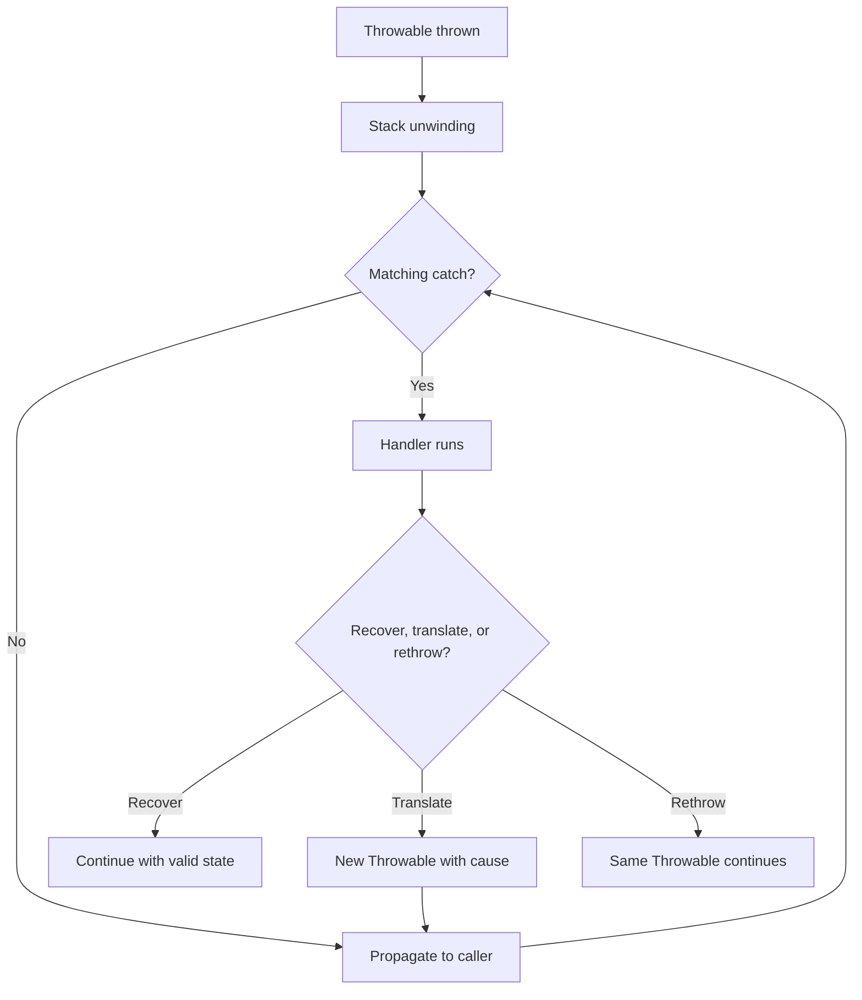
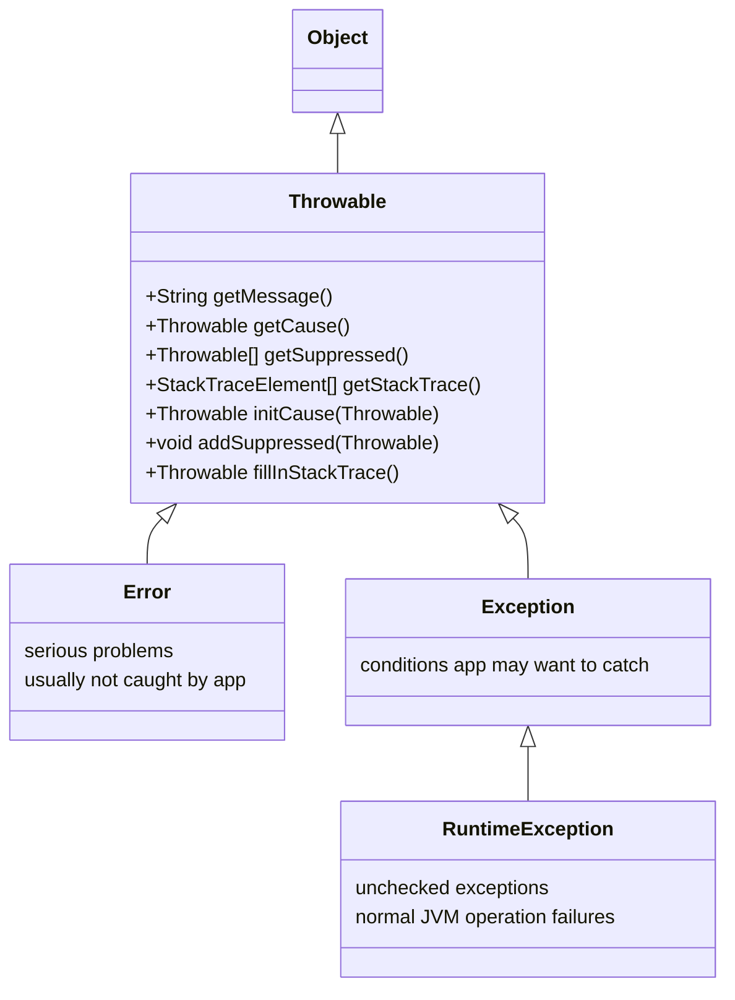
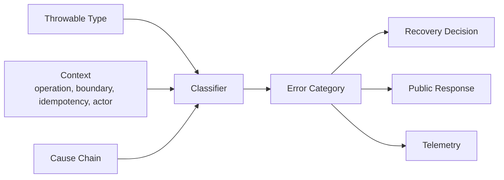
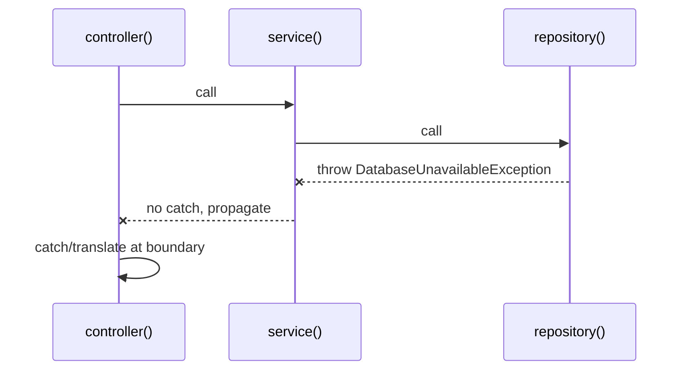
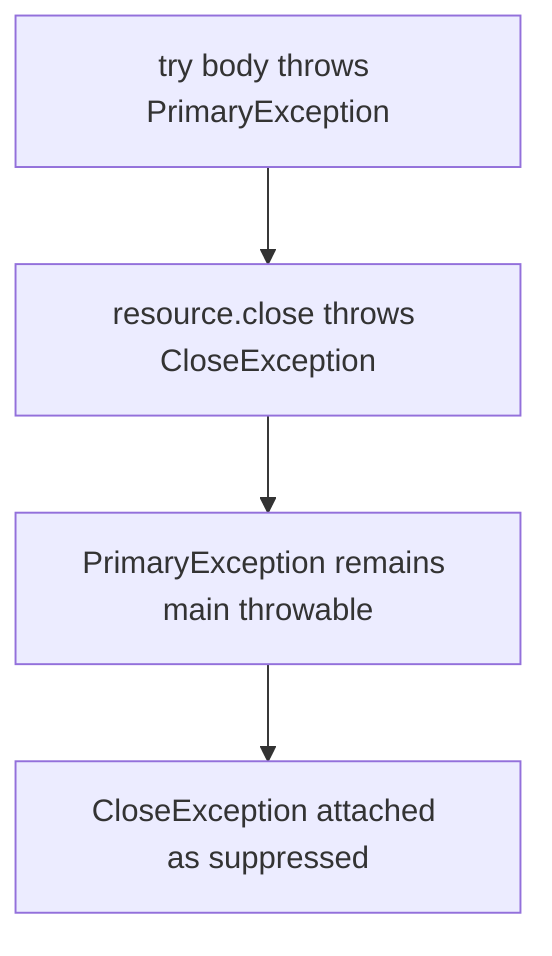
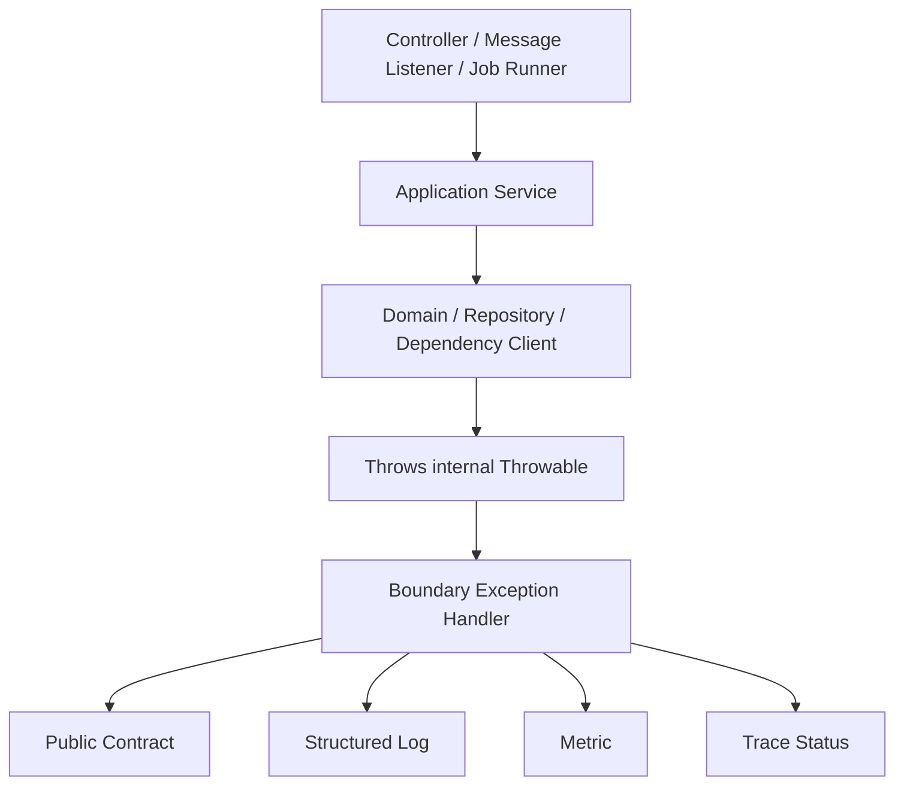

------
title: Learn Java Error, Reliability & Observability Engineering - Part 004
description: Deep dive model Throwable Java: Exception, RuntimeException, Error, checked/unchecked, cause chain, stack trace, suppressed exception, dan konsekuensi desain produksi.
series: learn-java-error-reliability-observability
seriesTitle: Learn Java Error, Reliability & Observability Engineering
order: 4
partTitle: Java Throwable Model
tags:
  - java
  - throwable
  - exception
  - runtimeexception
  - error
  - checked-exception
  - production-engineering
date: 2026-06-28
---

# Part 004 — Java Throwable Model

> Target part ini: memahami `Throwable` bukan sebagai class hierarchy hafalan, tetapi sebagai mekanisme bahasa dan runtime yang menentukan apa yang bisa dilempar, ditangkap, dideklarasikan, diobservasi, dan diterjemahkan menjadi failure behavior produksi.

Di Java, semua yang bisa dilempar dengan `throw` dan ditangkap dengan `catch` berada di bawah `java.lang.Throwable`. Ini bukan detail kecil. Keputusan apakah kita memakai checked exception, unchecked exception, `Error`, wrapping, cause chain, stack trace, atau suppressed exception akan memengaruhi API contract, debugging, log quality, retry policy, transaction rollback, dan observability.

Part ini membahas model resmi Java secara praktis untuk engineer produksi.

---

## 1. Kaufman Deconstruction: Apa yang Perlu Dikuasai?

Untuk menguasai `Throwable`, jangan mulai dari daftar subclass. Mulai dari pertanyaan yang akan muncul saat mendesain sistem:

| Sub-skill | Pertanyaan Utama |
|---|---|
| **Hierarchy reading** | Error ini checked, unchecked, atau fatal runtime condition? |
| **Compile-time contract** | Apakah caller dipaksa handle/declare? |
| **Runtime propagation** | Apa yang terjadi saat exception dilempar melewati stack frame? |
| **Cause preservation** | Apakah root cause masih bisa dilihat setelah wrapping? |
| **Stack trace quality** | Apakah stack trace membantu atau justru noise/cost? |
| **Suppressed exception handling** | Apakah resource cleanup failure menutupi failure utama? |
| **Boundary translation** | Di mana exception internal diterjemahkan menjadi error contract? |
| **Operational evidence** | Data apa yang perlu dibawa exception dan apa yang harus ada di log/trace? |

Kita akan membangun mental model ini:



---

## 2. The Throwable Family

Secara besar, hierarchy-nya seperti ini:



Empat tipe besar:

| Type | Checked? | Umum Dipakai Untuk |
|---|---:|---|
| `Throwable` | Tergantung subclass | Root semua throwable; jarang dipakai langsung. |
| `Exception` selain `RuntimeException` | Ya | Recoverable/declared API failure. |
| `RuntimeException` | Tidak | Programming error, invalid state, domain/application failure yang tidak ingin memaksa throws. |
| `Error` | Tidak | Serious runtime/JVM/linkage/resource problem. |

Java Language Specification membedakan checked exception, run-time exception, dan error. Checked exception harus diperlakukan oleh compiler melalui `throws` atau `catch`, sedangkan unchecked exception mencakup `RuntimeException` dan subclass-nya serta `Error` dan subclass-nya.

---

## 3. Throwable Bukan Sinonim Error Produksi

`Throwable` adalah mekanisme bahasa. Taxonomy produksi adalah keputusan engineering.

Contoh:

```java
throw new IllegalArgumentException("Invalid amount");
```

Ini unchecked exception. Tetapi secara produksi ia bisa berarti:

- input client invalid;
- programmer bug karena method internal dipanggil salah;
- validation layer kurang ketat;
- domain rule tidak tepat dimodelkan.

Karena itu jangan membuat mapping seperti:

```text
RuntimeException -> 500
Exception        -> 400
Error            -> crash
```

Mapping tersebut terlalu kasar.

Lebih benar:

```text
Throwable type -> gives language/runtime semantics
Error taxonomy -> gives production decision
Boundary mapper -> converts decision to protocol response
```

Diagram:



---

## 4. Checked Exceptions

Checked exception adalah exception yang harus dideklarasikan atau ditangkap jika bisa keluar dari method/constructor. Secara class hierarchy, `Exception` dan subclass-nya adalah checked kecuali subclass dari `RuntimeException`.

Contoh:

```java
public String readConfig(Path path) throws IOException {
    return Files.readString(path);
}
```

Caller harus memilih:

```java
try {
    String config = readConfig(path);
} catch (IOException e) {
    // handle, translate, or rethrow
}
```

atau:

```java
public AppConfig load() throws IOException {
    return parse(readConfig(path));
}
```

### 4.1 Kapan Checked Exception Cocok?

Checked exception cocok saat failure adalah bagian eksplisit dari API contract dan caller realistis bisa melakukan sesuatu.

| Cocok | Contoh |
|---|---|
| Caller bisa recover berbeda. | `IOException` saat membaca file alternatif. |
| API low-level ingin memaksa caller sadar failure. | Parser, file, network primitive. |
| Failure bukan programmer bug. | Format file eksternal rusak. |
| Boundary library publik. | SDK/client library yang dipakai banyak app. |

Contoh desain:

```java
public interface EvidenceStore {
    EvidenceDocument fetch(EvidenceId id) throws EvidenceNotFoundException, EvidenceStoreUnavailableException;
}
```

Ini masuk akal jika caller memang perlu membedakan “tidak ditemukan” dan “store unavailable”.

### 4.2 Kapan Checked Exception Menjadi Beban?

Checked exception buruk jika:

- semua caller hanya bisa wrap ke runtime;
- exception muncul di banyak layer dan mencemari signature;
- failure bukan recoverable di caller lokal;
- API internal berubah sering;
- digunakan untuk domain flow yang lebih cocok menjadi result object;
- exception detail bocor melewati boundary yang tidak semestinya.

Contoh smell:

```java
public CaseDecision submitDecision(DecisionRequest request)
    throws SQLException, IOException, TimeoutException, JsonProcessingException {
    // application service leaks infrastructure details
}
```

Application service ini membocorkan detail infrastruktur ke caller. Boundary seharusnya menerjemahkan.

Lebih baik:

```java
public CaseDecision submitDecision(DecisionRequest request) {
    try {
        return workflow.submit(request);
    } catch (SQLException e) {
        throw new CasePersistenceFailureException(request.caseId(), e);
    } catch (IOException e) {
        throw new EvidenceStorageFailureException(request.caseId(), e);
    }
}
```

---

## 5. Unchecked Exceptions

Unchecked exception tidak wajib dideklarasikan. Di Java, unchecked meliputi:

1. `RuntimeException` dan subclass-nya;
2. `Error` dan subclass-nya.

### 5.1 RuntimeException

`RuntimeException` adalah superclass untuk exception yang bisa dilempar selama operasi normal JVM. Subclass-nya tidak perlu dideklarasikan dalam `throws` walau bisa keluar dari method.

Contoh umum:

- `NullPointerException`;
- `IllegalArgumentException`;
- `IllegalStateException`;
- `UnsupportedOperationException`;
- `IndexOutOfBoundsException`;
- `ConcurrentModificationException`;
- custom domain/application exception.

### 5.2 Kapan RuntimeException Cocok?

| Cocok | Contoh |
|---|---|
| Programmer bug/invariant broken. | `IllegalStateException` untuk state mustahil. |
| Caller lokal tidak bisa recover. | Persistence failure di application service. |
| Domain rejection ditangani di boundary global. | `CaseAlreadyClosedException`. |
| API internal ingin signature bersih. | Service layer di aplikasi sendiri. |
| Framework akan translate. | Spring exception handler, transaction boundary. |

Contoh:

```java
public void approveCase(CaseId caseId, Actor actor) {
    CaseRecord record = repository.getRequired(caseId);

    if (record.status() == CaseStatus.CLOSED) {
        throw new CaseAlreadyClosedException(caseId.value(), record.status());
    }

    if (!record.canBeApprovedBy(actor)) {
        throw new CaseApprovalDeniedException(caseId.value(), actor.id());
    }

    repository.save(record.approve(actor));
}
```

Kode ini tidak memaksa semua caller menangkap domain exception, tetapi boundary API tetap harus menerjemahkannya menjadi contract yang benar.

### 5.3 Risiko RuntimeException

Unchecked exception bisa membuat failure contract tersembunyi.

Risiko:

- caller tidak tahu method bisa gagal dengan cara tertentu;
- dokumentasi lemah;
- test hanya happy path;
- global handler terlalu generik;
- domain rejection tercampur dengan programmer bug;
- transaction rollback terjadi tanpa keputusan eksplisit.

Mitigasi:

```java
/**
 * Approves a case.
 *
 * @throws CaseNotFoundException if the case id does not exist
 * @throws CaseAlreadyClosedException if the case is already closed
 * @throws CaseApprovalDeniedException if actor is not allowed to approve
 */
public void approveCase(CaseId caseId, Actor actor) { ... }
```

Unchecked tidak berarti undocumented.

---

## 6. Error: Serious Problems

`Error` adalah subclass `Throwable` untuk masalah serius yang aplikasi normal biasanya tidak mencoba tangkap.

Contoh:

- `OutOfMemoryError`;
- `StackOverflowError`;
- `NoClassDefFoundError`;
- `ExceptionInInitializerError`;
- `LinkageError`;
- `AssertionError`.

Prinsip:

> Jangan menangkap `Error` untuk melanjutkan flow bisnis.

Buruk:

```java
try {
    processCase(command);
} catch (Throwable t) {
    log.error("Failed, continuing", t);
}
```

Ini menangkap `Error` juga. Jika terjadi `OutOfMemoryError`, service mungkin berada dalam kondisi tidak aman. Melanjutkan proses bisa memperburuk data corruption.

Lebih aman:

```java
try {
    processCase(command);
} catch (Exception e) {
    log.error("Command failed", e);
    throw e;
}
```

Di boundary paling luar, kadang `Throwable` ditangkap oleh framework/runtime untuk log evidence sebelum thread mati. Tetapi application code normal harus sangat hati-hati.

---

## 7. Catching Throwable: Hampir Selalu Salah

`catch (Throwable)` menangkap semua hal:

- checked exception;
- runtime exception;
- `Error`;
- bahkan kondisi fatal tertentu yang tidak seharusnya dipulihkan.

Kapan mungkin dipakai?

| Lokasi | Boleh? | Tujuan |
|---|---:|---|
| Application service | Hampir tidak | Terlalu luas. |
| Controller advice/global handler | Jarang, hati-hati | Last-resort evidence; jangan lanjut sembarangan. |
| Thread boundary/executor wrapper | Kadang | Mencegah silent thread death, record evidence. |
| Test harness | Ya | Capture failure. |
| Framework/runtime | Ya | Container-level handling. |
| Shutdown hook | Kadang | Best-effort cleanup evidence. |

Contoh yang lebih defensif di thread boundary:

```java
public final class SafeRunnable implements Runnable {
    private final Runnable delegate;
    private final Logger log;

    public SafeRunnable(Runnable delegate, Logger log) {
        this.delegate = delegate;
        this.log = log;
    }

    @Override
    public void run() {
        try {
            delegate.run();
        } catch (Throwable t) {
            log.error("Uncaught task failure; task will terminate", t);
            throw t;
        }
    }
}
```

Perhatikan: ini mencatat lalu rethrow. Tidak menelan `Throwable`.

---

## 8. Stack Unwinding

Saat exception dilempar, Java menghentikan eksekusi normal dan mencari `catch` yang cocok di stack call saat ini. Jika tidak ada, exception naik ke caller. Proses ini disebut stack unwinding.

Contoh:

```java
public void controller() {
    service();
}

public void service() {
    repository();
}

public void repository() {
    throw new DatabaseUnavailableException("case-db");
}
```

Alur:



Jika `service()` punya catch:

```java
public void service() {
    try {
        repository();
    } catch (DatabaseUnavailableException e) {
        throw new CasePersistenceFailureException("Unable to load case", e);
    }
}
```

Maka cause chain menjadi penting.

---

## 9. Cause Chain: Jangan Hilangkan Root Cause

`Throwable` mendukung cause chain. Saat menerjemahkan exception, selalu pertahankan cause kecuali ada alasan kuat.

Buruk:

```java
catch (SQLException e) {
    throw new CasePersistenceFailureException("Cannot save case");
}
```

Root cause hilang: SQL state, vendor code, stack asal, dan query context tidak terlihat.

Baik:

```java
catch (SQLException e) {
    throw new CasePersistenceFailureException("Cannot save case", e);
}
```

Custom exception:

```java
public final class CasePersistenceFailureException extends RuntimeException {
    private final String caseId;

    public CasePersistenceFailureException(String caseId, Throwable cause) {
        super("Cannot persist case " + caseId, cause);
        this.caseId = caseId;
    }

    public String caseId() {
        return caseId;
    }
}
```

Cause chain seharusnya menjawab:

```text
High-level operation failed karena apa?
Low-level mechanism gagal di mana?
Apa exception asli dari library/platform?
```

---

## 10. Exception Message: Untuk Manusia, Bukan Contract

`getMessage()` berguna untuk debugging, tetapi buruk sebagai public contract.

Buruk:

```java
return Map.of("error", exception.getMessage());
```

Alasan:

- wording bisa berubah;
- message bisa mengandung ID internal;
- message bisa mengandung SQL/path/secret;
- client sulit mengandalkan message;
- localization sulit;
- observability cardinality bisa meledak.

Lebih baik:

```java
public record ApiError(
    String code,
    String message,
    String correlationId,
    List<ApiErrorDetail> details
) {}
```

Public message adalah controlled text. Exception message adalah diagnostic text.

---

## 11. Stack Trace: Evidence yang Mahal tapi Berharga

Setiap `Throwable` biasanya membawa stack trace. Stack trace membantu debugging, tetapi punya biaya:

- allocation;
- capturing stack frame;
- log volume;
- storage cost;
- noise jika error expected terlalu sering;
- potensi sensitive path/value dalam message/log context.

### 11.1 Jangan Pakai Exception untuk Normal Control Flow

Buruk:

```java
public Optional<CaseRecord> findCase(String id) {
    try {
        return Optional.of(repository.getById(id));
    } catch (CaseNotFoundException e) {
        return Optional.empty();
    }
}
```

Jika not found adalah outcome normal dan sering, pertimbangkan API eksplisit:

```java
public Optional<CaseRecord> findCase(CaseId id) {
    return repository.findById(id);
}
```

Exception cocok untuk path yang secara semantik gagal, bukan setiap branch normal.

### 11.2 Stack Trace Suppression

`Throwable` memiliki constructor protected yang bisa mengatur suppression dan writable stack trace. Ini kadang dipakai untuk exception performa tinggi, tetapi harus hati-hati.

Contoh konseptual:

```java
public class FastRejectedException extends RuntimeException {
    public FastRejectedException(String message) {
        super(message, null, false, false);
    }
}
```

Risiko:

- debugging sulit;
- root cause hilang;
- log tidak cukup;
- insiden menjadi opaque.

Gunakan hanya untuk expected high-volume rejection yang sudah punya telemetry kuat dan tidak membutuhkan stack trace per kejadian.

---

## 12. Suppressed Exceptions

Suppressed exception muncul terutama pada `try-with-resources`. Jika body `try` melempar exception dan `close()` juga melempar exception, exception dari `close()` tidak menggantikan exception utama. Ia disimpan sebagai suppressed exception.

Contoh:

```java
try (CaseExportWriter writer = openWriter()) {
    writer.write(caseData);       // throws primary exception
}                                 // close may throw suppressed exception
```

Inspection:

```java
catch (Exception e) {
    log.error("Export failed", e);

    for (Throwable suppressed : e.getSuppressed()) {
        log.warn("Suppressed during cleanup", suppressed);
    }
}
```

Mental model:



Mengapa penting?

- failure utama tetap terlihat;
- cleanup failure tidak hilang;
- resource leak atau close failure bisa didiagnosis;
- logging framework biasanya mencetak suppressed exception, tetapi custom serializer belum tentu.

---

## 13. Try-With-Resources dan AutoCloseable

`try-with-resources` menutup resource otomatis ketika keluar dari block. Resource harus implement `AutoCloseable`.

Contoh:

```java
try (InputStream input = Files.newInputStream(path)) {
    return parser.parse(input);
}
```

Untuk production code, ini bukan hanya style. Ini reliability control:

- mencegah file descriptor leak;
- mengurangi connection leak;
- memastikan cleanup pada exception path;
- membuat suppressed exception bisa dilihat.

Custom resource:

```java
public final class CaseProcessingLease implements AutoCloseable {
    private final LeaseClient client;
    private final String leaseId;
    private boolean released;

    public CaseProcessingLease(LeaseClient client, String leaseId) {
        this.client = client;
        this.leaseId = leaseId;
    }

    @Override
    public void close() {
        if (!released) {
            client.release(leaseId);
            released = true;
        }
    }
}
```

Usage:

```java
try (CaseProcessingLease lease = leaseClient.acquire(caseId)) {
    process(caseId);
}
```

Desain `close()` harus idempotent bila mungkin. Cleanup path sering dipanggil saat sistem sudah dalam kondisi gagal.

---

## 14. Multi-Catch dan Catch Ordering

Catch block dievaluasi dari atas ke bawah. Subclass harus ditangkap sebelum superclass.

Benar:

```java
try {
    process(request);
} catch (RequestValidationException e) {
    return badRequest(e);
} catch (DomainRejectionException e) {
    return conflict(e);
} catch (Exception e) {
    return internalError(e);
}
```

Salah:

```java
try {
    process(request);
} catch (Exception e) {
    return internalError(e);
} catch (RequestValidationException e) { // unreachable
    return badRequest(e);
}
```

Multi-catch:

```java
try {
    callDependency();
} catch (SocketTimeoutException | ConnectException e) {
    throw new DependencyUnavailableException("identity-service", e);
}
```

Gunakan multi-catch jika recovery sama. Jangan gabungkan exception yang butuh aksi berbeda hanya demi ringkas.

---

## 15. Rethrow vs Wrap vs Translate

Saat menangkap exception, ada tiga pilihan utama.

### 15.1 Rethrow

Gunakan jika handler hanya menambah evidence lokal atau cleanup, tetapi semantics tidak berubah.

```java
try {
    process(command);
} catch (DomainRejectionException e) {
    log.info("Domain rejection caseId={} code={}", command.caseId(), e.code());
    throw e;
}
```

### 15.2 Wrap

Gunakan jika ingin menambah konteks tanpa mengubah category besar.

```java
catch (IOException e) {
    throw new EvidenceReadException(evidenceId, e);
}
```

### 15.3 Translate

Gunakan saat melewati boundary layer.

```java
catch (SQLException e) {
    throw new CaseRepositoryException(caseId, e);
}
```

Atau di HTTP boundary:

```java
@ExceptionHandler(CaseAlreadyClosedException.class)
ResponseEntity<ApiError> handle(CaseAlreadyClosedException e) {
    return ResponseEntity.status(409)
        .body(new ApiError(
            "CASE_ALREADY_CLOSED",
            "The case is already closed.",
            correlationId(),
            List.of()
        ));
}
```

Rule:

> Catch hanya jika Anda akan recover, translate, add useful context, cleanup, atau record evidence. Jangan catch hanya karena takut exception naik.

---

## 16. Exception as Data Carrier: Useful, But Limited

Custom exception boleh membawa metadata.

```java
public final class DomainRejectionException extends RuntimeException {
    private final String code;
    private final String ruleId;
    private final Map<String, String> safeContext;

    public DomainRejectionException(
        String code,
        String ruleId,
        Map<String, String> safeContext
    ) {
        super("Domain rejection code=%s ruleId=%s".formatted(code, ruleId));
        this.code = code;
        this.ruleId = ruleId;
        this.safeContext = Map.copyOf(safeContext);
    }

    public String code() {
        return code;
    }

    public String ruleId() {
        return ruleId;
    }

    public Map<String, String> safeContext() {
        return safeContext;
    }
}
```

Tapi jangan memasukkan:

- raw password/token;
- full request payload sensitif;
- PII tidak perlu;
- entity graph besar;
- object mutable;
- object yang sulit diserialize/log.

Exception harus membawa **safe diagnostic metadata**, bukan menjadi dump seluruh dunia.

---

## 17. `throws` Clause sebagai API Signal

`throws` clause adalah bagian dari API. Ia memberi sinyal kepada caller.

```java
public interface CaseArchiveReader {
    CaseArchive read(CaseArchiveId id) throws CaseArchiveCorruptedException;
}
```

Pertanyaan desain:

- Apakah exception ini harus diketahui compile-time oleh caller?
- Apakah caller punya recovery berbeda?
- Apakah exception ini detail implementasi yang bisa berubah?
- Apakah exception ini melewati boundary module yang stabil?

Untuk public library, checked exception kadang sangat berguna. Untuk application internal service, unchecked dengan boundary handler sering lebih praktis.

---

## 18. Transaction Boundary Implication

Framework Java sering memakai exception type untuk menentukan rollback. Misalnya banyak transaction framework secara default rollback untuk unchecked exception dan `Error`, tetapi tidak selalu untuk checked exception kecuali dikonfigurasi.

Implikasi:

```java
@Transactional
public void approveCase(CaseId id) throws IOException {
    repository.markApproved(id);
    documentStore.writeApproval(id); // IOException
}
```

Jika checked exception tidak memicu rollback sesuai konfigurasi framework, update DB bisa terlanjur commit atau behavior tidak sesuai harapan.

Prinsip:

> Exception type bukan hanya compile-time signal. Di framework produksi, ia sering menjadi policy input untuk rollback, retry, circuit breaker, dan monitoring.

Karena itu setiap custom exception perlu jelas:

- apakah business rejection;
- apakah infrastructure failure;
- apakah harus rollback;
- apakah boleh retry;
- apakah harus alert.

---

## 19. Boundary Handler Pattern

Aplikasi produksi biasanya punya boundary handler yang menerjemahkan internal exception ke response.



Contoh konseptual:

```java
public final class ErrorBoundary {
    private final ErrorClassifier classifier;

    public ApiErrorResponse handle(Throwable throwable) {
        ErrorDecision decision = classifier.classify(throwable);

        log(decision, throwable);
        metric(decision);
        trace(decision, throwable);

        return toApiResponse(decision, throwable);
    }
}
```

Boundary handler bukan tempat menebak-nebak semua hal. Ia butuh taxonomy dan exception design yang konsisten.

---

## 20. Common Java Throwable Mistakes

### 20.1 `throws Exception`

```java
public void process() throws Exception
```

Masalah:

- caller tidak tahu failure apa yang mungkin;
- API tidak memberi recovery signal;
- test dan documentation melemah;
- semua hal diperlakukan sama.

### 20.2 `catch Exception` lalu `return null`

```java
try {
    return repository.find(id);
} catch (Exception e) {
    return null;
}
```

Masalah:

- failure berubah menjadi absence;
- root cause hilang;
- caller bisa NPE di tempat lain;
- incident sulit dilacak.

### 20.3 Wrap Tanpa Cause

```java
throw new RuntimeException("failed");
```

Masalah: root cause chain putus.

### 20.4 Catch Terlalu Rendah

Repository menangkap domain exception atau controller menangkap SQL exception. Boundary layer menjadi kacau.

### 20.5 Message sebagai Error Code

```java
if (e.getMessage().contains("duplicate")) { ... }
```

Message bukan API stabil. Gunakan type, code, SQL state, vendor code, atau domain code.

### 20.6 Logging Berkali-kali

```java
catch (Exception e) {
    log.error("Repository failed", e);
    throw e;
}
```

Jika setiap layer melakukan ini, satu failure menghasilkan banyak stack trace. Lebih baik log di boundary dengan context lengkap, kecuali layer bawah punya evidence unik.

---

## 21. Practical Exception Design Rules

Gunakan aturan berikut:

```text
1. Jangan throw Throwable langsung.
2. Jangan catch Throwable kecuali di boundary sangat luar dan rethrow/fail-fast jelas.
3. Gunakan checked exception jika caller realistis harus handle secara eksplisit.
4. Gunakan unchecked exception untuk invariant/domain/application failure yang ditangani boundary.
5. Jangan gunakan Error untuk application-level failure.
6. Selalu preserve cause saat wrapping.
7. Jangan gunakan exception message sebagai public contract.
8. Jangan gunakan exception untuk normal high-volume control flow.
9. Jangan log exception di setiap layer.
10. Tambahkan metadata aman pada custom exception jika membantu classification/evidence.
11. Pisahkan exception type dari public error code.
12. Pastikan transaction/retry framework policy sesuai dengan exception type.
```

---

## 22. Mini Reference Implementation

Berikut contoh kecil exception model untuk service case management.

```java
public abstract class CaseApplicationException extends RuntimeException {
    private final String code;
    private final boolean auditRelevant;

    protected CaseApplicationException(
        String code,
        String message,
        boolean auditRelevant
    ) {
        super(message);
        this.code = code;
        this.auditRelevant = auditRelevant;
    }

    protected CaseApplicationException(
        String code,
        String message,
        boolean auditRelevant,
        Throwable cause
    ) {
        super(message, cause);
        this.code = code;
        this.auditRelevant = auditRelevant;
    }

    public String code() {
        return code;
    }

    public boolean auditRelevant() {
        return auditRelevant;
    }
}
```

Domain rejection:

```java
public final class CaseAlreadyClosedException extends CaseApplicationException {
    private final String caseId;

    public CaseAlreadyClosedException(String caseId) {
        super(
            "CASE_ALREADY_CLOSED",
            "Case %s is already closed".formatted(caseId),
            true
        );
        this.caseId = caseId;
    }

    public String caseId() {
        return caseId;
    }
}
```

Infrastructure failure:

```java
public final class CaseRepositoryUnavailableException extends CaseApplicationException {
    public CaseRepositoryUnavailableException(String operation, Throwable cause) {
        super(
            "CASE_REPOSITORY_UNAVAILABLE",
            "Case repository unavailable during " + operation,
            false,
            cause
        );
    }
}
```

Boundary mapping:

```java
public ApiError map(Throwable error) {
    if (error instanceof CaseApplicationException e) {
        return new ApiError(
            e.code(),
            publicMessageFor(e.code()),
            currentCorrelationId(),
            List.of()
        );
    }

    return new ApiError(
        "INTERNAL_ERROR",
        "The service failed to process the request.",
        currentCorrelationId(),
        List.of()
    );
}
```

Catatan: Part 009 nanti akan membahas exception hierarchy design lebih dalam. Contoh ini hanya menghubungkan model `Throwable` dengan taxonomy.

---

## 23. Practice: Throwable Inspection Drill

Ambil stack trace nyata dari log aplikasi. Untuk setiap exception, jawab:

```text
1. Apakah ini checked, RuntimeException, atau Error?
2. Apakah root cause masih terlihat?
3. Apakah ada suppressed exception?
4. Di layer mana exception diterjemahkan?
5. Apakah message mengandung data sensitif?
6. Apakah exception type memberi taxonomy yang cukup?
7. Apakah exception ini seharusnya domain rejection, dependency failure, atau programmer bug?
8. Apakah transaction rollback behavior sesuai?
9. Apakah retry behavior aman?
10. Apakah log terjadi sekali dengan context cukup?
```

Contoh analisis:

```text
Top-level:
  CaseRepositoryUnavailableException

Cause:
  SQLTransientConnectionException: HikariPool timeout

Category:
  DEPENDENCY_UNAVAILABLE or PLATFORM_RESOURCE_EXHAUSTED

Recovery:
  retry only with budget; check pool saturation; possibly shed load

Telemetry needed:
  dependency=case-db
  pool.active
  pool.pending
  latency
  request.operation
  trace.id
```

---

## 24. Self-Correction Checklist

```text
[ ] Apakah saya memakai Throwable sebagai mechanism, bukan taxonomy final?
[ ] Apakah checked exception hanya dipakai jika caller bisa bertindak?
[ ] Apakah unchecked exception tetap terdokumentasi?
[ ] Apakah Error tidak ditangkap untuk business flow?
[ ] Apakah setiap wrapping preserve cause?
[ ] Apakah suppressed exception tidak hilang di custom logging/serialization?
[ ] Apakah message exception tidak dipakai sebagai public contract?
[ ] Apakah stack trace tidak dibuat untuk expected hot path?
[ ] Apakah transaction rollback policy sesuai exception type?
[ ] Apakah boundary handler melakukan classification, logging, metrics, dan response mapping secara konsisten?
```

---

## 25. Ringkasan

Model `Throwable` memberi mekanisme dasar Java:

- hanya `Throwable` dan subclass-nya yang bisa dilempar/ditangkap;
- `Exception` selain `RuntimeException` adalah checked;
- `RuntimeException` dan `Error` adalah unchecked;
- checked exception memberi compile-time pressure;
- unchecked exception memberi fleksibilitas tetapi bisa menyembunyikan contract;
- `Error` menandakan masalah serius yang aplikasi normal biasanya tidak pulihkan;
- cause chain penting untuk debugging;
- suppressed exception penting untuk resource cleanup;
- stack trace adalah evidence bernilai tetapi punya biaya;
- exception message bukan public API.

Prinsip desain utama:

> Jangan biarkan hierarchy Java menentukan seluruh behavior produksi. Gunakan hierarchy Java untuk propagation dan language contract, lalu gunakan taxonomy error untuk recovery, visibility, observability, dan boundary mapping.

Di part berikutnya kita akan masuk lebih detail ke semantics exception: stack unwinding, catch ordering, rethrow, `finally`, suppressed exceptions, dan edge case yang sering menyebabkan bug produksi.

---

## References

- Oracle, *The Java Language Specification, Java SE 25 Edition*, Chapter 11: Exceptions.
- Oracle, Java SE 25 API Documentation: `Throwable`, `Exception`, `RuntimeException`, `Error`, `AutoCloseable`.
