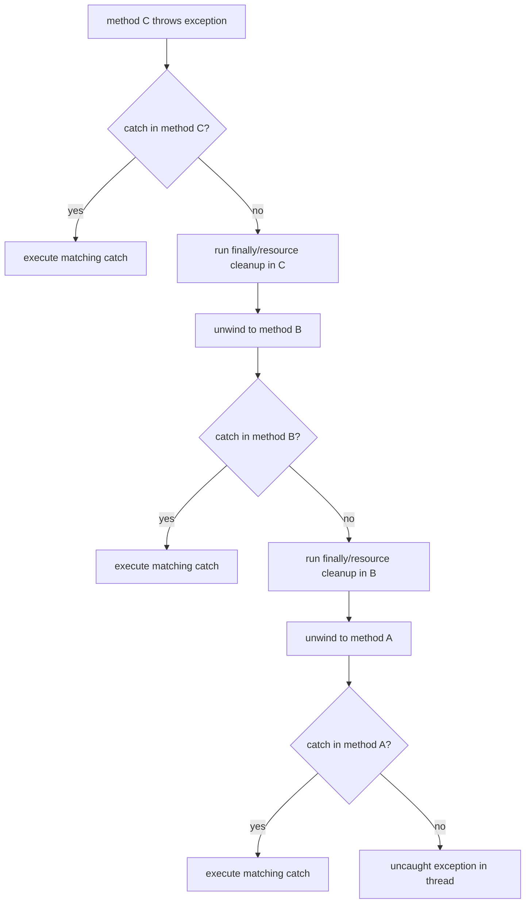
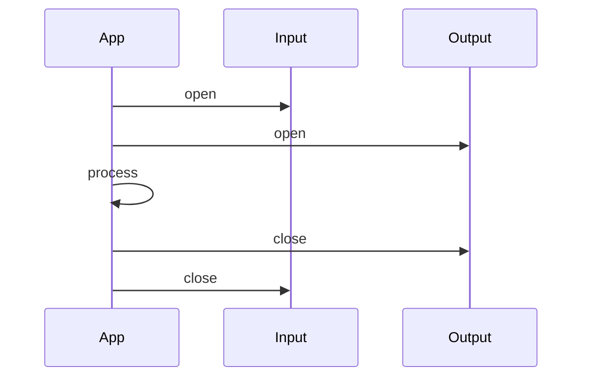

------
title: Learn Java Error, Reliability & Observability Engineering - Part 005
description: Deep dive semantics exception Java: throw, catch, stack unwinding, finally, try-with-resources, suppressed exception, cause chain, dan failure evidence.
series: learn-java-error-reliability-observability
seriesTitle: Learn Java Error, Reliability & Observability Engineering
order: 5
partTitle: Exception Semantics Deep Dive
tags:
  - java
  - exceptions
  - error-handling
  - reliability
  - observability
  - production-engineering
date: 2026-06-28
---

# Part 005 — Exception Semantics Deep Dive

> Exception handling yang matang tidak dimulai dari “pakai `try/catch` di mana?”, tetapi dari memahami **control flow, ownership, evidence, dan masking** saat eksekusi Java meninggalkan jalur normal.

Part ini memperdalam perilaku exception Java. Kita tidak akan mengulang definisi dasar `Throwable`, `Exception`, `RuntimeException`, dan `Error` dari part sebelumnya. Fokus part ini adalah **semantics**: apa yang benar-benar terjadi ketika exception dilempar, ditangkap, dibungkus, disembunyikan, ditimpa oleh `finally`, atau muncul bersamaan dengan kegagalan `close()`.

Di level produksi, detail ini menentukan apakah sistem:

- mempertahankan root cause,
- membocorkan detail internal,
- salah memberi sinyal ke caller,
- kehilangan audit evidence,
- retry dengan alasan yang keliru,
- atau gagal diam-diam karena exception tertelan.

---

## 1. Kaufman Framing

Dalam kerangka *The First 20 Hours*, skill ini kita pecah menjadi sub-skill kecil yang bisa dilatih.

| Kaufman Step | Penerapan Pada Exception Semantics |
|---|---|
| Deconstruct | Pecah exception handling menjadi throw, propagation, catch matching, finally, suppressed, cause, wrapping, dan boundary behavior. |
| Learn enough to self-correct | Kenali kapan root cause hilang, kapan `finally` menimpa exception, kapan catch terlalu luas, dan kapan rethrow mengubah contract. |
| Remove barriers | Siapkan mini-program Java kecil untuk menguji satu semantics per latihan. |
| Deliberate practice | Latih membaca stack trace, membuat failure chain, dan memverifikasi behavior dengan test. |

Target part ini: setelah selesai, kita mampu membaca dan mendesain failure path dengan pertanyaan berikut:

```txt
Jika baris ini gagal, exception mana yang keluar, siapa yang melihatnya,
apa yang hilang, apa yang tersimpan sebagai cause, dan evidence apa yang tersisa?
```

---

## 2. Mental Model: Exception Adalah Non-Local Control Transfer

Exception di Java bukan sekadar objek error. Exception adalah mekanisme **non-local control transfer**.

Artinya, ketika exception dilempar:

1. Eksekusi normal berhenti di titik `throw` atau titik runtime error terjadi.
2. JVM mencari handler yang cocok di call stack.
3. Frame method dilepas satu per satu.
4. `finally` atau resource cleanup dapat berjalan selama proses pelepasan frame.
5. Handler pertama yang cocok mengambil alih control flow.
6. Jika tidak ada handler, thread berakhir dengan uncaught exception.

Diagram sederhana:



Implikasi produksinya besar:

- Kode setelah titik gagal tidak berjalan kecuali ada handler yang mengembalikan flow.
- Cleanup dapat menghasilkan exception baru.
- Exception yang terlihat caller belum tentu root cause pertama.
- `finally` dapat membuat evidence asli hilang.
- Handler yang terlalu awal dapat mengubah semantik bisnis.

---

## 3. Tiga Jenis “Keluar Dari Method”

Untuk memahami exception, bandingkan tiga cara method berhenti:

| Cara Keluar | Contoh | Sifat |
|---|---|---|
| Normal completion | `return value;` | Caller menerima value. |
| Abrupt completion karena exception | `throw new X();` | Caller tidak menerima value, control berpindah ke handler. |
| Abrupt completion karena control statement | `break`, `continue`, `return` dari blok | Dapat berinteraksi dengan `finally`. |

Exception adalah salah satu bentuk **abrupt completion**. Ini penting karena `finally` juga berperilaku terhadap abrupt completion lain, termasuk `return`.

Contoh berbahaya:

```java
static int calculate() {
    try {
        throw new IllegalStateException("primary failure");
    } finally {
        return 42;
    }
}
```

Kode ini mengembalikan `42`; exception asli hilang.

Ini bukan sekadar style buruk. Di produksi, pola seperti ini membuat sistem terlihat sukses padahal invariant rusak.

Aturan praktis:

```txt
Jangan return dari finally.
Jangan throw dari finally kecuali sengaja ingin mengganti failure utama.
Jangan melakukan logic bisnis di finally.
```

---

## 4. Anatomy Exception Object

Exception object membawa beberapa jenis informasi:

| Informasi | Contoh | Fungsi |
|---|---|---|
| Type | `OrderNotFoundException` | Klasifikasi semantik. |
| Message | `Order 123 not found` | Ringkasan human-readable. |
| Cause | `SQLException` sebagai cause | Root cause chain. |
| Stack trace | lokasi konstruksi/throw path | Evidence teknis. |
| Suppressed exceptions | kegagalan saat cleanup | Evidence tambahan. |
| Custom fields | `orderId`, `errorCode`, `tenantId` | Evidence domain/operasional. |

Hal yang sering salah dipahami:

```txt
Stack trace bukan pengganti error model.
Message bukan contract.
Type tanpa metadata sering kurang cukup.
Cause chain lebih penting daripada message yang panjang.
```

Contoh exception yang lebih operasional:

```java
public final class CaseTransitionRejectedException extends RuntimeException {
    private final String errorCode;
    private final String caseId;
    private final String currentState;
    private final String attemptedTransition;

    public CaseTransitionRejectedException(
            String caseId,
            String currentState,
            String attemptedTransition
    ) {
        super("Case transition rejected: " + currentState + " -> " + attemptedTransition);
        this.errorCode = "CASE_TRANSITION_REJECTED";
        this.caseId = caseId;
        this.currentState = currentState;
        this.attemptedTransition = attemptedTransition;
    }

    public String errorCode() {
        return errorCode;
    }

    public String caseId() {
        return caseId;
    }

    public String currentState() {
        return currentState;
    }

    public String attemptedTransition() {
        return attemptedTransition;
    }
}
```

Di layer handler, metadata ini bisa dipakai untuk response, log, metric, dan trace attribute.

---

## 5. Throw Semantics

`throw` membutuhkan objek yang merupakan subtype dari `Throwable`.

```java
throw new IllegalArgumentException("amount must be positive");
```

Yang perlu diperhatikan:

1. `throw` menghentikan eksekusi normal.
2. Object exception membawa type dan state.
3. Stack trace umumnya diisi saat object `Throwable` dibuat, bukan sebagai pengganti desain error.
4. Checked exception harus sesuai aturan compile-time checking.
5. Exception dapat dilempar ulang.

Contoh:

```java
void submit(String caseId) {
    if (caseId == null || caseId.isBlank()) {
        throw new IllegalArgumentException("caseId must not be blank");
    }

    // business flow
}
```

Ini adalah precondition failure. Caller melanggar kontrak method.

Bandingkan dengan:

```java
void submit(String caseId) {
    CaseRecord record = repository.findById(caseId)
            .orElseThrow(() -> new CaseNotFoundException(caseId));

    if (!record.canBeSubmitted()) {
        throw new CaseTransitionRejectedException(
                caseId,
                record.status().name(),
                "SUBMIT"
        );
    }
}
```

Di sini ada dua error berbeda:

| Error | Makna |
|---|---|
| `CaseNotFoundException` | Entity target tidak ada. |
| `CaseTransitionRejectedException` | Entity ada, tetapi domain invariant menolak transisi. |

Keduanya tidak boleh disamakan hanya karena sama-sama berakhir sebagai `4xx` di API boundary.

---

## 6. Propagation dan Stack Unwinding

Exception propagation terjadi ketika method tidak menangani exception dan membiarkannya naik ke caller.

```java
void controller() {
    service.submit("CASE-1");
}

void submit(String caseId) {
    repository.save(caseId);
}

void save(String caseId) {
    throw new DatabaseUnavailableException("primary database unavailable");
}
```

Jika tidak ada catch di `save`, exception naik ke `submit`, lalu ke `controller`, lalu ke framework handler.

Mental model:

```txt
Exception bergerak naik ke caller.
State lokal method yang ditinggalkan tidak bisa dipakai lagi.
Cleanup harus eksplisit melalui finally atau try-with-resources.
```

Production implication:

- Jangan berharap kode setelah call gagal tetap berjalan.
- Jangan melakukan side effect sebelum operasi yang mungkin gagal tanpa memikirkan rollback/compensation.
- Jangan menangkap exception hanya untuk “melanjutkan” jika invariant belum dipulihkan.

Contoh buruk:

```java
void approve(String caseId) {
    auditLog.write("approval-started", caseId);

    try {
        repository.markApproved(caseId);
    } catch (Exception ex) {
        log.warn("Failed to approve, continuing", ex);
    }

    notification.sendApproved(caseId);
}
```

Kode ini bisa mengirim notifikasi approved walaupun database gagal.

Versi lebih aman:

```java
void approve(String caseId) {
    auditLog.write("approval-started", caseId);

    repository.markApproved(caseId);

    auditLog.write("approval-committed", caseId);
    notification.sendApproved(caseId);
}
```

Jika `markApproved` gagal, flow berhenti. Tidak ada notifikasi palsu.

---

## 7. Catch Matching

Catch block dipilih berdasarkan type compatibility.

```java
try {
    service.submit(caseId);
} catch (CaseTransitionRejectedException ex) {
    return problem(409, ex.errorCode(), ex.getMessage());
} catch (CaseNotFoundException ex) {
    return problem(404, ex.errorCode(), ex.getMessage());
} catch (RuntimeException ex) {
    return problem(500, "INTERNAL_ERROR", "Unexpected failure");
}
```

Handler yang lebih spesifik harus berada sebelum handler yang lebih umum.

Buruk:

```java
try {
    service.submit(caseId);
} catch (RuntimeException ex) {
    return problem(500, "INTERNAL_ERROR", "Unexpected failure");
} catch (CaseTransitionRejectedException ex) { // unreachable
    return problem(409, ex.errorCode(), ex.getMessage());
}
```

Kompiler akan menolak catch yang tidak reachable karena sudah tertangkap oleh superclass sebelumnya.

Aturan desain:

| Catch Type | Cocok Untuk | Risiko |
|---|---|---|
| Specific domain exception | Mapping domain response | Banyak handler jika taxonomy berantakan. |
| Infrastructure base exception | Dependency failure policy | Bisa menyembunyikan vendor detail jika terlalu umum. |
| `RuntimeException` | Boundary last-resort handler | Menangkap terlalu banyak jika dipakai di dalam domain flow. |
| `Throwable` | Hampir tidak pernah di aplikasi biasa | Menangkap `Error`, dapat merusak proses shutdown/failure. |
| `Exception` | Boundary tertentu, job runner, framework adapter | Sering terlalu luas untuk logic internal. |

---

## 8. Catch Block Bukan Tempat Untuk Menebak

Catch block harus menjawab satu dari beberapa tujuan:

| Tujuan | Contoh |
|---|---|
| Recover | Ganti ke dependency sekunder. |
| Translate | Ubah `SQLException` menjadi `CaseRepositoryException`. |
| Add context | Tambahkan `caseId`, `operation`, `tenantId`. |
| Decide outcome | Return `409`, reject message, schedule retry. |
| Cleanup | Rollback resource manual. |
| Record evidence | Log dengan context, increment metric, annotate span. |
| Stop safely | Abort flow dan propagate. |

Catch block yang hanya “supaya tidak error” hampir selalu salah.

Contoh buruk:

```java
try {
    paymentGateway.charge(command);
} catch (Exception ex) {
    log.error("Payment failed");
}
```

Masalah:

- cause hilang dari log,
- caller tidak tahu charge gagal,
- flow mungkin melanjutkan order sebagai paid,
- tidak ada classification,
- retry policy tidak jelas.

Versi lebih defensible:

```java
try {
    paymentGateway.charge(command);
} catch (PaymentTimeoutException ex) {
    throw new PaymentOutcomeUnknownException(command.paymentId(), ex);
} catch (PaymentRejectedException ex) {
    throw new PaymentDeclinedException(command.paymentId(), ex.reasonCode(), ex);
}
```

Di sini timeout dan rejection dibedakan. Timeout sering berarti outcome unknown; rejection berarti outcome known dan negatif.

---

## 9. Rethrow: Menjaga Identity Exception

Rethrow berarti menangkap lalu melempar exception yang sama.

```java
try {
    service.submit(command);
} catch (CaseTransitionRejectedException ex) {
    log.info("Case transition rejected: caseId={}", command.caseId(), ex);
    throw ex;
}
```

Rethrow menjaga type dan cause chain.

Gunakan rethrow ketika:

- kita hanya menambah evidence,
- policy tetap milik caller,
- exception sudah tepat secara semantik,
- tidak perlu mengubah abstraction boundary.

Hati-hati dengan pola ini:

```java
catch (CaseTransitionRejectedException ex) {
    throw new CaseTransitionRejectedException(...);
}
```

Jika exception baru tidak menyimpan `ex` sebagai cause, root cause hilang.

Lebih baik:

```java
catch (CaseTransitionRejectedException ex) {
    throw new CaseSubmissionException(command.caseId(), ex);
}
```

---

## 10. Wrap: Menambahkan Abstraction Context

Wrapping adalah membuat exception baru dengan exception lama sebagai cause.

```java
try {
    jdbcTemplate.update(sql, params);
} catch (SQLException ex) {
    throw new CaseRepositoryException("Failed to persist case " + caseId, ex);
}
```

Tujuan wrapping:

1. Menyembunyikan detail vendor dari layer atas.
2. Menambahkan context domain/application.
3. Mengubah contract abstraction.
4. Menjaga root cause melalui `cause`.

Pola constructor minimal:

```java
public class CaseRepositoryException extends RuntimeException {
    public CaseRepositoryException(String message, Throwable cause) {
        super(message, cause);
    }
}
```

Pola yang lebih operasional:

```java
public final class CaseRepositoryException extends RuntimeException {
    private final String caseId;
    private final String operation;

    public CaseRepositoryException(String caseId, String operation, Throwable cause) {
        super("Case repository operation failed: operation=" + operation + ", caseId=" + caseId, cause);
        this.caseId = caseId;
        this.operation = operation;
    }

    public String caseId() {
        return caseId;
    }

    public String operation() {
        return operation;
    }
}
```

Wrapping buruk:

```java
catch (SQLException ex) {
    throw new RuntimeException("Database error");
}
```

Root cause hilang.

Wrapping baik:

```java
catch (SQLException ex) {
    throw new CaseRepositoryException(caseId, "save", ex);
}
```

---

## 11. Translate: Mengubah Bahasa Layer

Translation mirip wrapping, tetapi lebih tegas: exception dari layer bawah diubah menjadi exception layer saat ini.

Contoh:

```txt
PostgreSQL unique violation
        ↓
DuplicateCaseExternalReferenceException
        ↓
HTTP 409 Problem Details
```

Tanpa translation, API bisa bocor:

```txt
org.postgresql.util.PSQLException: duplicate key value violates unique constraint ...
```

Ini buruk karena:

- membocorkan vendor detail,
- coupling client ke database,
- error contract tidak stabil,
- sulit dipakai sebagai domain evidence.

Translation yang baik:

```java
catch (DuplicateKeyException ex) {
    throw new DuplicateCaseExternalReferenceException(command.externalReference(), ex);
}
```

Lalu boundary API:

```java
@ExceptionHandler(DuplicateCaseExternalReferenceException.class)
ProblemDetail handle(DuplicateCaseExternalReferenceException ex) {
    ProblemDetail problem = ProblemDetail.forStatus(409);
    problem.setTitle("Duplicate case external reference");
    problem.setProperty("errorCode", "CASE_EXTERNAL_REFERENCE_DUPLICATE");
    problem.setProperty("externalReference", ex.externalReference());
    return problem;
}
```

---

## 12. Finally Semantics

`finally` berjalan setelah `try` dan `catch`, baik flow normal maupun abrupt.

Contoh normal:

```java
try {
    process();
} finally {
    cleanup();
}
```

Jika `process()` sukses, `cleanup()` tetap berjalan.

Jika `process()` throw, `cleanup()` tetap berjalan sebelum exception naik.

Masalah muncul ketika `cleanup()` juga throw.

```java
try {
    throw new IllegalStateException("primary");
} finally {
    throw new IllegalArgumentException("cleanup failed");
}
```

Exception yang terlihat caller adalah `IllegalArgumentException("cleanup failed")`. Exception `primary` dapat tertimpa.

Ini salah satu sumber root cause hilang paling klasik.

Aturan:

```txt
finally harus idempotent, minimal, dan defensif.
Jika cleanup bisa gagal, pertimbangkan try-with-resources agar suppressed exception tidak hilang.
```

---

## 13. Return Dalam Finally: Anti-Pattern Kritis

Contoh:

```java
static String readStatus() {
    try {
        throw new IllegalStateException("cannot read status");
    } finally {
        return "UNKNOWN";
    }
}
```

Caller menerima `UNKNOWN`. Error asli hilang.

Di sistem regulasi atau enforcement lifecycle, ini berbahaya. Status `UNKNOWN` mungkin dianggap state valid, padahal sebenarnya sistem gagal membaca state.

Versi lebih benar:

```java
static String readStatus() {
    try {
        return loadStatus();
    } catch (StatusReadException ex) {
        throw ex;
    } finally {
        releaseLocalBuffer();
    }
}
```

Jika ingin fallback, lakukan secara eksplisit di catch dengan policy yang jelas:

```java
static StatusSnapshot readStatus() {
    try {
        return statusClient.fetchSnapshot();
    } catch (StatusClientTimeoutException ex) {
        return StatusSnapshot.stale("status-service-timeout");
    }
}
```

Fallback bukan tugas `finally`.

---

## 14. Try-With-Resources Semantics

`try-with-resources` memastikan resource yang mengimplementasikan `AutoCloseable` ditutup saat keluar dari block.

```java
try (InputStream input = Files.newInputStream(path)) {
    return input.readAllBytes();
}
```

Resource ditutup baik block sukses maupun gagal.

Contoh beberapa resource:

```java
try (
    InputStream input = Files.newInputStream(source);
    OutputStream output = Files.newOutputStream(target)
) {
    input.transferTo(output);
}
```

Resource ditutup dalam urutan kebalikan dari deklarasi.

```txt
open input
open output
use resources
close output
close input
```

Diagram:



Implikasi:

- Resource yang bergantung pada resource sebelumnya aman ditutup lebih dulu.
- Exception dari `close()` dapat menjadi suppressed jika block utama sudah gagal.
- Jangan menutup manual resource yang dikelola try-with-resources kecuali benar-benar idempotent.

---

## 15. Suppressed Exceptions

Suppressed exception muncul ketika ada primary exception dan ada exception tambahan saat cleanup.

Contoh:

```java
final class BrokenResource implements AutoCloseable {
    @Override
    public void close() {
        throw new IllegalStateException("close failed");
    }
}

static void run() {
    try (BrokenResource ignored = new BrokenResource()) {
        throw new IllegalArgumentException("primary failure");
    }
}
```

Exception utama adalah `IllegalArgumentException("primary failure")`. Exception `close failed` menjadi suppressed.

Inspection:

```java
try {
    run();
} catch (Exception ex) {
    System.out.println("main: " + ex);

    for (Throwable suppressed : ex.getSuppressed()) {
        System.out.println("suppressed: " + suppressed);
    }
}
```

Mental model:

| Type | Makna |
|---|---|
| Cause | Penyebab yang mendasari exception saat ini. |
| Suppressed | Exception tambahan yang terjadi saat menangani/menutup resource setelah primary failure. |

Jangan mencampuradukkan keduanya.

```txt
Cause menjawab: exception ini berasal dari apa?
Suppressed menjawab: failure tambahan apa yang terjadi saat cleanup?
```

---

## 16. Cause Chain vs Suppressed Chain

Misalkan proses gagal seperti ini:

1. Query database gagal karena network.
2. Repository membungkus menjadi `CaseRepositoryException`.
3. Connection close juga gagal.

Struktur ideal:

```txt
CaseRepositoryException
  cause: SQLTransientConnectionException
  suppressed: ConnectionCloseException
```

Tapi tergantung posisi wrapping, bisa juga:

```txt
CaseRepositoryException
  cause: SQLTransientConnectionException
    suppressed: ConnectionCloseException
```

Yang penting adalah evidence tidak hilang.

Utility untuk logging diagnostik:

```java
static void printThrowableTree(Throwable throwable, String indent) {
    System.out.println(indent + throwable.getClass().getName() + ": " + throwable.getMessage());

    for (Throwable suppressed : throwable.getSuppressed()) {
        System.out.println(indent + "  suppressed:");
        printThrowableTree(suppressed, indent + "    ");
    }

    Throwable cause = throwable.getCause();
    if (cause != null) {
        System.out.println(indent + "  caused by:");
        printThrowableTree(cause, indent + "    ");
    }
}
```

Di produksi, logging framework biasanya sudah mencetak cause dan suppressed. Tetapi engineer tetap harus memahami struktur ini agar tidak melakukan wrapping yang menghancurkan chain.

---

## 17. Multi-Catch

Java mendukung multi-catch:

```java
try {
    parser.parse(payload);
} catch (JsonParseException | SchemaValidationException ex) {
    throw new InvalidPayloadException("Invalid case payload", ex);
}
```

Gunakan multi-catch ketika beberapa exception punya policy yang sama.

Jangan pakai multi-catch jika outcome berbeda.

Buruk:

```java
catch (JsonParseException | AuthorizationException ex) {
    return badRequest();
}
```

Parsing error dan authorization error berbeda secara security, audit, response, dan metric.

Lebih benar:

```java
catch (JsonParseException ex) {
    return badRequest("INVALID_JSON");
} catch (AuthorizationException ex) {
    return forbidden("FORBIDDEN_OPERATION");
}
```

Rule:

```txt
Multi-catch boleh jika handling policy sama, bukan hanya karena kode terlihat mirip.
```

---

## 18. Catch-Then-Throw Baru: Stack Trace Reset

Contoh:

```java
try {
    service.submit(command);
} catch (Exception ex) {
    throw new RuntimeException(ex.getMessage());
}
```

Masalah:

- Type asli hilang.
- Cause hilang.
- Stack trace baru menunjuk ke wrapping point.
- Message bisa kehilangan detail penting.

Lebih baik:

```java
catch (Exception ex) {
    throw new CaseSubmissionException(command.caseId(), ex);
}
```

Jika ingin mempertahankan exception yang sama:

```java
catch (CaseSubmissionException ex) {
    throw ex;
}
```

Jika ingin menambah context tanpa mengganti type, kadang log + rethrow cukup:

```java
catch (CaseSubmissionException ex) {
    log.warn(
            "Case submission failed: caseId={}, errorCode={}",
            command.caseId(),
            ex.errorCode(),
            ex
    );
    throw ex;
}
```

---

## 19. Exception Message Bukan API Contract

Message sering berubah karena:

- refactor,
- localization,
- tambahan context,
- perbedaan vendor,
- perubahan library,
- keamanan.

Jangan desain client atau test produksi berdasarkan message.

Buruk:

```java
assertThat(ex.getMessage()).contains("duplicate key");
```

Lebih baik:

```java
assertThat(ex).isInstanceOf(DuplicateCaseExternalReferenceException.class);
assertThat(((DuplicateCaseExternalReferenceException) ex).errorCode())
        .isEqualTo("CASE_EXTERNAL_REFERENCE_DUPLICATE");
```

Untuk public boundary, gunakan error code stabil:

```json
{
  "type": "https://errors.example.com/case-external-reference-duplicate",
  "title": "Duplicate case external reference",
  "status": 409,
  "errorCode": "CASE_EXTERNAL_REFERENCE_DUPLICATE",
  "correlationId": "01J..."
}
```

---

## 20. Exception dan Logging: Jangan Double Log Tanpa Alasan

Pola buruk:

```java
try {
    service.process(command);
} catch (Exception ex) {
    log.error("Processing failed", ex);
    throw ex;
}
```

Jika setiap layer melakukan ini, satu failure menghasilkan banyak log error.

Dampaknya:

- noise tinggi,
- alert salah,
- storage mahal,
- investigator bingung mana boundary utama,
- root cause tertutup log spam.

Rule:

```txt
Log exception di boundary yang memiliki context operasional dan ownership.
Di layer tengah, tambah context melalui wrapping atau metadata, bukan selalu log error.
```

Contoh strategi:

| Layer | Logging Policy |
|---|---|
| Domain model | Biasanya tidak log. Throw domain exception atau return explicit error. |
| Application service | Log hanya untuk keputusan penting atau event bisnis. |
| Infrastructure adapter | Wrap dengan context; log debug/trace bila perlu. |
| API/job/message boundary | Log final failure dengan correlation ID dan outcome. |
| Global handler | Satu tempat untuk unexpected failure. |

---

## 21. Exception Dalam Constructor

Constructor bisa throw exception. Jika constructor gagal, object tidak selesai dibuat.

```java
public CaseId(String value) {
    if (value == null || value.isBlank()) {
        throw new IllegalArgumentException("case id must not be blank");
    }
    this.value = value;
}
```

Ini valid untuk invariant object.

Namun hati-hati jika constructor membuka resource:

```java
public RiskClient() {
    this.connection = openConnection();
    this.cache = loadCache(); // jika gagal, connection harus ditutup
}
```

Lebih aman gunakan factory dengan cleanup:

```java
public static RiskClient open(ClientConfig config) {
    Connection connection = null;
    try {
        connection = openConnection(config);
        Cache cache = loadCache(config);
        return new RiskClient(connection, cache);
    } catch (RuntimeException ex) {
        if (connection != null) {
            try {
                connection.close();
            } catch (Exception closeEx) {
                ex.addSuppressed(closeEx);
            }
        }
        throw ex;
    }
}
```

Atau desain agar resource lifecycle dikelola komponen framework/container.

---

## 22. Exception Dalam Static Initialization

Static initialization failure dapat membuat class gagal dipakai.

```java
final class RiskRules {
    static final Rules RULES = loadRules();

    private static Rules loadRules() {
        throw new IllegalStateException("rules file missing");
    }
}
```

Jika static initializer gagal, class initialization gagal. Di aplikasi produksi, ini biasanya fatal untuk startup.

Guideline:

| Situation | Recommendation |
|---|---|
| Required config missing | Fail fast at startup with clear error. |
| Optional resource unavailable | Jangan load di static initializer; gunakan lazy provider dengan fallback policy. |
| External dependency | Hindari static connection/client initialization. |
| Large mutable state | Hindari static global state. |

Static initializer bukan tempat yang baik untuk network call, database call, atau remote config tanpa policy startup yang jelas.

---

## 23. Exception Dalam Lambda dan Stream

Lambda yang dipakai oleh functional interface standar seperti `Function`, `Consumer`, atau `Predicate` tidak bisa langsung melempar checked exception kecuali interface-nya mendeklarasikan `throws`.

Contoh masalah:

```java
files.stream()
        .map(path -> Files.readString(path)) // IOException checked
        .toList();
```

Biasanya ini tidak compile karena `Function.apply` tidak mendeklarasikan `IOException`.

Pilihan desain:

### Option A — Jangan pakai stream untuk flow yang perlu checked exception jelas

```java
List<String> contents = new ArrayList<>();
for (Path path : files) {
    contents.add(Files.readString(path));
}
```

Ini sederhana dan jujur.

### Option B — Wrap dengan exception domain/infrastructure

```java
List<String> contents = files.stream()
        .map(path -> {
            try {
                return Files.readString(path);
            } catch (IOException ex) {
                throw new FileReadRuntimeException(path, ex);
            }
        })
        .toList();
```

### Option C — Return explicit result

```java
List<FileReadResult> results = files.stream()
        .map(FileReader::readSafely)
        .toList();
```

Rule:

```txt
Jangan mengorbankan clarity failure hanya demi stream chain yang terlihat elegan.
```

---

## 24. Exception Dalam CompletableFuture

Pada `CompletableFuture`, exception tidak selalu langsung dilempar di thread caller. Exception disimpan sebagai exceptional completion.

```java
CompletableFuture<String> future = CompletableFuture.supplyAsync(() -> {
    throw new IllegalStateException("boom");
});

future.join(); // throws CompletionException
```

Biasanya `join()` membungkus failure dalam `CompletionException`. `get()` dapat membungkus dalam `ExecutionException`.

Strategi:

```java
try {
    return future.join();
} catch (CompletionException ex) {
    Throwable cause = ex.getCause();
    throw translateAsyncFailure(cause);
}
```

Jangan kehilangan cause:

```java
catch (CompletionException ex) {
    throw new AsyncCaseProcessingException(caseId, ex.getCause());
}
```

Async boundary sering membuat context hilang:

- thread name berubah,
- MDC hilang,
- trace context tidak otomatis ada jika instrumentation tidak benar,
- exception muncul jauh dari titik request.

Karena itu exception semantics dan context propagation harus dipikir bersama.

---

## 25. Exception Dalam Scheduled Job

Scheduled job sering gagal diam-diam jika framework menangkap exception atau hanya mencatat log.

Pola job runner yang lebih baik:

```java
public final class CaseEscalationJob implements Runnable {
    private final CaseEscalationService service;
    private final JobFailureReporter failureReporter;

    @Override
    public void run() {
        String runId = UUID.randomUUID().toString();

        try {
            service.escalateOverdueCases(runId);
        } catch (Exception ex) {
            failureReporter.report("case-escalation", runId, ex);
            throw ex;
        }
    }
}
```

Job failure harus menjawab:

- apakah job run gagal total atau sebagian,
- berapa item yang sukses/gagal,
- apakah aman retry,
- apakah ada item yang harus quarantine,
- apakah operator harus diberi alert.

Exception tanpa execution summary tidak cukup.

---

## 26. Exception Dalam Message Consumer

Consumer harus membedakan failure berdasarkan outcome:

| Failure | Outcome |
|---|---|
| Invalid message schema | Reject / dead-letter. |
| Business rule rejection | Acknowledge + record rejection, atau dead-letter tergantung contract. |
| Transient dependency failure | Retry with backoff. |
| Unknown processing failure | Retry limited, then quarantine. |
| Poison message | Stop retry storm, isolate. |

Pseudocode:

```java
try {
    handler.handle(message);
    ack(message);
} catch (InvalidMessageException ex) {
    deadLetter(message, ex);
    ack(message);
} catch (TransientDependencyException ex) {
    nackForRetry(message, ex);
} catch (Exception ex) {
    quarantine(message, ex);
    ack(message);
}
```

Jangan jadikan semua exception sebagai retry. Itu menyebabkan retry storm dan memperbesar blast radius.

---

## 27. Exception Dalam Transaction Boundary

Exception sering menjadi sinyal rollback, terutama di framework transaction.

Namun strategi rollback tidak boleh hanya bergantung pada checked/unchecked secara buta. Yang penting adalah business outcome.

Contoh:

```java
@Transactional
public void approveCase(ApproveCaseCommand command) {
    CaseRecord record = repository.lockById(command.caseId());
    record.approve(command.approverId());
    repository.save(record);
    outbox.add(CaseApprovedEvent.from(record));
}
```

Jika `repository.save` gagal, transaction harus rollback. Jika `outbox.add` gagal, transaction juga harus rollback agar state dan event tidak inconsistent.

Exception strategy harus memastikan:

- invariant tidak setengah commit,
- event tidak terbit tanpa state,
- state tidak berubah tanpa event jika outbox wajib,
- domain rejection tidak diklasifikasikan sebagai system failure.

---

## 28. Boundary Handler: Tempat Exception Menjadi Outcome

Exception internal harus berubah menjadi outcome di boundary.

Boundary bisa berupa:

- HTTP controller,
- message consumer,
- scheduled job,
- CLI command,
- batch step,
- workflow worker,
- gRPC endpoint,
- async callback.

Boundary handler bertanggung jawab:

1. Classify exception.
2. Decide outcome.
3. Emit evidence.
4. Preserve security boundary.
5. Avoid duplicate handling.

Contoh HTTP boundary:

```java
@ExceptionHandler(CaseTransitionRejectedException.class)
ResponseEntity<ProblemDetail> handle(CaseTransitionRejectedException ex) {
    ProblemDetail problem = ProblemDetail.forStatus(409);
    problem.setTitle("Case transition rejected");
    problem.setProperty("errorCode", ex.errorCode());
    problem.setProperty("caseId", ex.caseId());
    problem.setProperty("currentState", ex.currentState());
    problem.setProperty("attemptedTransition", ex.attemptedTransition());
    return ResponseEntity.status(409).body(problem);
}
```

Contoh job boundary:

```java
try {
    job.run();
    jobRunRepository.markSuccess(runId);
} catch (Exception ex) {
    jobRunRepository.markFailed(runId, summarize(ex));
    throw ex;
}
```

Boundary handler bukan hanya “catch all”. Ia adalah titik transformasi dari exception menjadi operational outcome.

---

## 29. Exception Preservation Checklist

Saat menangkap exception, jawab checklist ini:

| Pertanyaan | Jika Tidak Terjawab, Risiko |
|---|---|
| Apakah type exception masih bermakna? | Caller salah mengambil keputusan. |
| Apakah root cause tersimpan? | Investigasi lambat. |
| Apakah context bisnis ditambahkan? | Evidence tidak cukup. |
| Apakah stack trace tetap berguna? | Debugging sulit. |
| Apakah suppressed exception dipertahankan? | Cleanup failure hilang. |
| Apakah handler ini owner policy yang tepat? | Layer salah mengambil keputusan. |
| Apakah log terjadi satu kali di boundary benar? | Log spam atau missing evidence. |
| Apakah response tidak membocorkan detail internal? | Risiko keamanan/compliance. |

---

## 30. Decision Table: Catch, Wrap, Translate, or Let Propagate

| Situation | Action | Reason |
|---|---|---|
| Exception sudah punya semantic tepat dan caller harus decide | Let propagate | Jangan ubah meaning. |
| Perlu menambah context teknis/domain | Wrap with cause | Preserve root cause. |
| Exception layer bawah bocor ke layer atas | Translate | Jaga abstraction boundary. |
| Bisa recover lokal dengan aman | Catch and recover | Flow dapat kembali valid. |
| Tidak bisa recover lokal | Do not catch, or catch + rethrow | Jangan pura-pura sukses. |
| Cleanup manual wajib | finally/try-with-resources | Resource lifecycle. |
| Boundary final | Catch, classify, emit outcome | Ubah exception menjadi response/job result/message result. |

---

## 31. Anti-Patterns

### 31.1 Swallowing Exception

```java
try {
    service.process();
} catch (Exception ignored) {
}
```

Hampir selalu salah.

Jika memang intentionally ignored:

```java
try {
    metrics.flushBestEffort();
} catch (MetricsFlushException ex) {
    log.debug("Best-effort metrics flush failed during shutdown", ex);
}
```

Bahkan best-effort pun perlu alasan.

### 31.2 Catching `Throwable`

```java
catch (Throwable t) {
    log.error("Everything failed", t);
}
```

Risiko:

- menangkap `OutOfMemoryError`,
- menangkap `StackOverflowError`,
- mengganggu failure fatal,
- membuat proses tidak sehat tetap berjalan.

Gunakan hanya di boundary sangat khusus, misalnya top-level runner yang akan mencatat lalu terminate.

### 31.3 Throwing Generic RuntimeException

```java
throw new RuntimeException("failed");
```

Kurang informasi. Gunakan exception type yang bermakna.

### 31.4 Logging Without Exception

```java
log.error("Failed to process case " + caseId);
```

Stack trace hilang. Gunakan parameter exception.

```java
log.error("Failed to process case: caseId={}", caseId, ex);
```

### 31.5 Exception-Driven Normal Flow

```java
try {
    repository.findById(id).get();
} catch (NoSuchElementException ex) {
    return null;
}
```

Jika absence adalah outcome normal, gunakan `Optional`, result type, atau domain-specific response.

---

## 32. Production-Grade Exception Handler Skeleton

```java
public final class FailureBoundary {
    private final Logger log = LoggerFactory.getLogger(FailureBoundary.class);
    private final MeterRegistry meterRegistry;

    public FailureBoundary(MeterRegistry meterRegistry) {
        this.meterRegistry = meterRegistry;
    }

    public <T> T execute(String operation, Supplier<T> supplier) {
        try {
            return supplier.get();
        } catch (DomainRejectionException ex) {
            meterRegistry.counter(
                    "operation.rejected",
                    "operation", operation,
                    "error.code", ex.errorCode()
            ).increment();

            log.info(
                    "Operation rejected: operation={}, errorCode={}",
                    operation,
                    ex.errorCode(),
                    ex
            );

            throw ex;
        } catch (DependencyException ex) {
            meterRegistry.counter(
                    "operation.dependency.failure",
                    "operation", operation,
                    "dependency", ex.dependencyName()
            ).increment();

            log.warn(
                    "Operation failed due to dependency: operation={}, dependency={}",
                    operation,
                    ex.dependencyName(),
                    ex
            );

            throw ex;
        } catch (RuntimeException ex) {
            meterRegistry.counter(
                    "operation.unexpected.failure",
                    "operation", operation
            ).increment();

            log.error("Unexpected operation failure: operation={}", operation, ex);
            throw ex;
        }
    }
}
```

Catatan:

- Ini skeleton, bukan template universal.
- Boundary harus menghindari high-cardinality tags.
- Jangan memasukkan `caseId` sebagai metric tag.
- `caseId` cocok untuk log/trace, bukan metric label ber-cardinality tinggi.

---

## 33. Mini Lab: Membuktikan Semantics

Buat file kecil:

```java
public class ExceptionSemanticsLab {
    public static void main(String[] args) {
        try {
            run();
        } catch (Exception ex) {
            ex.printStackTrace();
        }
    }

    static void run() {
        try (BrokenResource ignored = new BrokenResource()) {
            throw new IllegalStateException("primary failure");
        }
    }

    static final class BrokenResource implements AutoCloseable {
        @Override
        public void close() {
            throw new IllegalArgumentException("close failure");
        }
    }
}
```

Ekspektasi:

- Main exception: `IllegalStateException: primary failure`.
- Suppressed: `IllegalArgumentException: close failure`.

Modifikasi lab:

1. Tambahkan `finally` yang throw exception baru.
2. Tambahkan `return` di `finally`.
3. Ubah `try-with-resources` menjadi manual `finally`.
4. Bandingkan stack trace dan suppressed exception.

Tujuan lab bukan hafalan. Tujuannya membangun intuisi: failure utama bisa hilang jika cleanup salah.

---

## 34. Review Questions

Jawab tanpa melihat materi:

1. Apa beda `cause` dan `suppressed`?
2. Kenapa `return` dalam `finally` berbahaya?
3. Kapan catch block sebaiknya hanya rethrow?
4. Kapan exception harus di-wrap?
5. Kenapa catch `Exception` di layer tengah sering buruk?
6. Kenapa message tidak boleh menjadi API contract?
7. Bagaimana `CompletableFuture` mengubah cara exception terlihat caller?
8. Kenapa boundary handler adalah tempat exception menjadi outcome?
9. Apa risiko double logging exception di banyak layer?
10. Apa yang harus dipertahankan saat translating exception?

---

## 35. Self-Correction Checklist

Gunakan checklist ini saat code review:

```txt
[ ] Exception yang dilempar punya type yang bermakna.
[ ] Exception tidak ditelan diam-diam.
[ ] Wrapping selalu menyimpan cause.
[ ] Boundary translation tidak membocorkan detail internal.
[ ] finally tidak return.
[ ] finally tidak menimpa root cause tanpa alasan eksplisit.
[ ] try-with-resources dipakai untuk AutoCloseable.
[ ] suppressed exception tidak dihancurkan oleh wrapping buruk.
[ ] Catch block memiliki tujuan jelas: recover, translate, add context, cleanup, record, atau decide outcome.
[ ] Logging exception tidak diduplikasi di setiap layer.
[ ] Error response memakai code stabil, bukan message internal.
[ ] Async exception unwrap mempertahankan cause asli.
```

---

## 36. Summary

Exception semantics adalah dasar dari reliability engineering di Java. Jika semantics salah, layer observability hanya akan merekam bukti yang salah atau tidak lengkap.

Prinsip utama:

1. Exception adalah non-local control transfer.
2. Catch block harus punya tujuan eksplisit.
3. `finally` dapat menyelamatkan resource atau menghancurkan root cause.
4. Try-with-resources menjaga primary failure dan menyimpan cleanup failure sebagai suppressed.
5. Cause chain harus dipertahankan saat wrapping/translation.
6. Boundary handler mengubah exception menjadi outcome operasional.
7. Logging, metrics, dan tracing harus mengikuti classification, bukan menggantikan classification.

Part berikutnya membahas strategi besar yang sering diperdebatkan: **checked vs unchecked exception**. Kita tidak akan membahasnya sebagai preferensi style, tetapi sebagai keputusan API contract, caller obligation, dan boundary ownership.

---

## References

- Java Language Specification, Java SE 25, Chapter 11 — Exceptions: https://docs.oracle.com/javase/specs/jls/se25/html/jls-11.html
- Java Language Specification, Java SE 25, Chapter 14 — Blocks and Statements, try/catch/finally and try-with-resources: https://docs.oracle.com/javase/specs/jls/se25/html/jls-14.html
- Java SE 25 API, `Throwable`: https://docs.oracle.com/en/java/javase/25/docs/api/java.base/java/lang/Throwable.html
- Java SE 25 API, `AutoCloseable`: https://docs.oracle.com/en/java/javase/25/docs/api/java.base/java/lang/AutoCloseable.html
