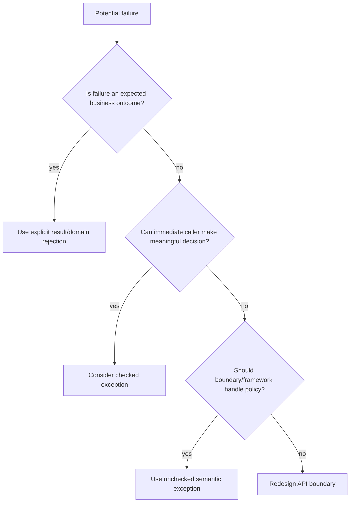
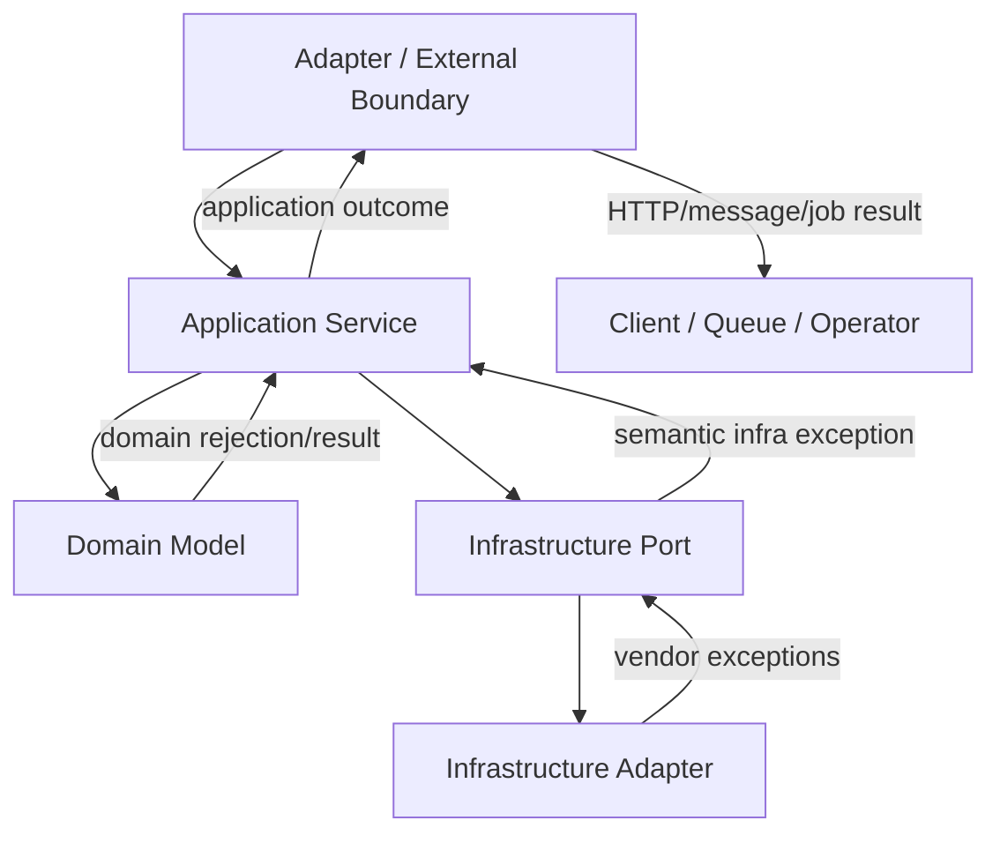

------
title: Learn Java Error, Reliability & Observability Engineering - Part 006
description: Strategi checked vs unchecked exception untuk desain API Java, caller obligation, recoverability, boundary translation, domain error, dan production reliability.
series: learn-java-error-reliability-observability
seriesTitle: Learn Java Error, Reliability & Observability Engineering
order: 6
partTitle: Checked vs Unchecked Strategy
tags:
  - java
  - exceptions
  - checked-exceptions
  - unchecked-exceptions
  - api-design
  - reliability
  - production-engineering
date: 2026-06-28
---

# Part 006 — Checked vs Unchecked Strategy

> Pertanyaan yang tepat bukan “checked exception bagus atau buruk?”, tetapi “apakah caller pada boundary ini wajib, mampu, dan layak dipaksa mengambil keputusan terhadap failure ini?”

Checked vs unchecked exception adalah salah satu topik Java yang paling sering diperdebatkan. Banyak pembahasan berhenti di preferensi:

```txt
Checked exception terlalu verbose.
Unchecked exception terlalu bebas.
Checked exception membuat API jujur.
Unchecked exception lebih praktis.
```

Di level produksi, perdebatan seperti itu kurang berguna. Yang kita butuhkan adalah **strategi**.

Part ini membangun cara berpikir untuk menentukan kapan menggunakan checked exception, unchecked exception, explicit result, domain rejection, atau boundary translation. Fokusnya bukan style, melainkan:

- API contract,
- caller obligation,
- recoverability,
- abstraction boundary,
- reliability outcome,
- observability,
- dan maintainability jangka panjang.

---

## 1. Kaufman Framing

Dalam kerangka *The First 20 Hours*, kita pecah skill ini menjadi beberapa micro-skill.

| Kaufman Step | Penerapan Pada Checked vs Unchecked |
|---|---|
| Deconstruct | Pisahkan language rule, API contract, recoverability, layer boundary, dan operational outcome. |
| Learn enough to self-correct | Kenali kapan checked exception memaksa caller palsu, kapan unchecked exception menyembunyikan contract, dan kapan explicit result lebih baik. |
| Remove barriers | Gunakan decision matrix dan layer policy agar tidak berdebat dari preferensi pribadi. |
| Deliberate practice | Refactor API kecil dari checked-only, unchecked-only, dan result-based; bandingkan caller burden dan evidence. |

Target part ini: kita mampu merancang exception strategy yang konsisten untuk service Java besar, bukan sekadar memilih `throws` atau tidak.

---

## 2. Official Language Distinction

Di Java, unchecked exception mencakup `RuntimeException` dan subclass-nya, serta `Error` dan subclass-nya. Checked exception adalah exception yang harus dipenuhi oleh aturan compile-time checking: ditangkap atau dideklarasikan dengan `throws`.

Secara praktis:

```java
void checked() throws IOException {
    throw new IOException("disk unavailable");
}

void unchecked() {
    throw new IllegalStateException("invalid state");
}
```

Caller `checked()` harus menangani atau mendeklarasikan `IOException`.

```java
void caller() throws IOException {
    checked();
}
```

Atau:

```java
void caller() {
    try {
        checked();
    } catch (IOException ex) {
        throw new DocumentReadException("Failed to read document", ex);
    }
}
```

Caller `unchecked()` tidak dipaksa compiler.

```java
void caller() {
    unchecked();
}
```

Namun ini tidak berarti unchecked exception tidak penting. Ia tetap bisa menghentikan flow, rollback transaction, gagal request, gagal job, dan memicu alert.

---

## 3. Checkedness Bukan Recoverability Saja

Sering ada aturan sederhana:

```txt
Recoverable => checked
Unrecoverable => unchecked
```

Aturan ini berguna sebagai awal, tetapi tidak cukup.

Kenapa?

Karena recoverability bergantung pada **caller** dan **boundary**.

Contoh `IOException`:

| Caller | Apakah Bisa Recover? |
|---|---|
| Low-level file copy utility | Bisa retry, pilih path lain, report partial copy. |
| HTTP request handler upload dokumen | Bisa return 507/500 atau schedule retry tergantung storage. |
| Domain service approval case | Biasanya tidak bisa recover lokal; harus propagate sebagai infrastructure failure. |
| Startup config loader | Bisa fail fast. |

Exception yang sama bisa recoverable di satu layer dan unrecoverable di layer lain.

Jadi pertanyaan yang lebih baik:

```txt
Apakah caller langsung pada API ini adalah aktor yang tepat untuk membuat keputusan atas failure ini?
```

---

## 4. Caller Obligation Model

Checked exception adalah cara bahasa memaksa caller mengakui failure tertentu.

Modelnya:

```txt
Method berkata:
"Saya mungkin gagal dengan cara ini, dan kamu sebagai caller tidak boleh mengabaikannya tanpa keputusan eksplisit."
```

Unchecked exception berkata:

```txt
Method bisa gagal, tetapi compiler tidak memaksa caller lokal mengambil keputusan.
Policy mungkin ada di boundary lebih atas.
```

Explicit result berkata:

```txt
Failure adalah outcome normal dari operasi dan harus diproses sebagai data.
```

Diagram:



---

## 5. Decision Criteria

Gunakan lima pertanyaan ini sebelum memilih checked/unchecked.

### 5.1 Apakah Failure Ini Bagian Dari Domain Outcome?

Jika failure adalah outcome bisnis yang sering dan valid, exception mungkin bukan bentuk terbaik.

Contoh:

- case transition rejected,
- validation errors,
- insufficient balance,
- duplicate external reference,
- policy denies operation,
- document missing required field.

Untuk satu error sederhana, domain exception bisa masuk akal. Untuk banyak error validasi, explicit result lebih baik.

```java
public sealed interface ValidationResult permits ValidationResult.Valid, ValidationResult.Invalid {
    record Valid() implements ValidationResult {}
    record Invalid(List<Violation> violations) implements ValidationResult {}
}
```

Validasi multi-error tidak cocok dilempar satu per satu sebagai exception.

### 5.2 Apakah Caller Bisa Bertindak Lokal?

Jika caller bisa melakukan action berbeda berdasarkan exception, checked exception bisa berguna.

```java
interface DocumentStore {
    Document read(DocumentId id) throws DocumentNotFoundException, DocumentStoreUnavailableException;
}
```

Namun jika semua caller hanya melakukan ini:

```java
try {
    store.read(id);
} catch (DocumentStoreUnavailableException ex) {
    throw new RuntimeException(ex);
}
```

Maka checked exception hanya menghasilkan boilerplate palsu.

### 5.3 Apakah Exception Ini Stabil Sebagai API Contract?

Checked exception menjadi bagian dari method contract. Jika sering berubah, caller akan ikut rusak.

Buruk:

```java
interface CaseRepository {
    CaseRecord save(CaseRecord record)
            throws SQLException, IOException, TimeoutException, JsonProcessingException;
}
```

API ini membocorkan implementation detail.

Lebih baik:

```java
interface CaseRepository {
    CaseRecord save(CaseRecord record) throws CaseRepositoryException;
}
```

Atau unchecked:

```java
interface CaseRepository {
    CaseRecord save(CaseRecord record);
}
```

Dengan `CaseRepositoryException` sebagai unchecked infrastructure exception.

### 5.4 Apakah Boundary Lebih Tepat Menentukan Outcome?

Di aplikasi web/service modern, banyak failure lebih baik diputuskan di boundary global:

- HTTP exception handler,
- message consumer error policy,
- job runner,
- workflow worker,
- transaction interceptor.

Jika setiap method internal dipaksa catch checked exception, policy tersebar dan tidak konsisten.

### 5.5 Apakah Checked Exception Mengganggu Composition?

Checked exception sering sulit dikombinasikan dengan:

- lambda,
- stream,
- functional interface standar,
- async pipeline,
- reactive chain,
- callback framework.

Jika API akan sering dipakai dalam composition seperti itu, unchecked atau explicit result sering lebih praktis.

---

## 6. Strategy Matrix

| Failure Type | Typical Representation | Reason |
|---|---|---|
| Programmer error / precondition violation | Unchecked (`IllegalArgumentException`, `IllegalStateException`) | Caller melanggar kontrak; local recovery jarang benar. |
| Domain rejection single reason | Domain exception atau explicit result | Tergantung apakah rejection exceptional dalam use case. |
| Domain validation multi-error | Explicit validation result | Caller perlu semua violation. |
| Low-level I/O operation | Checked can be appropriate | Caller utility sering bisa decide. |
| Repository dependency failure | Unchecked semantic infrastructure exception | Policy biasanya di service/boundary. |
| Public library API with meaningful caller action | Checked can be appropriate | Memaksa consumer handle known failure. |
| Internal application service failure | Usually unchecked semantic exception | Avoid boilerplate; handle at boundary. |
| Irrecoverable JVM/system error | Do not catch normally | Process/thread may be unhealthy. |
| Outcome unknown external side effect | Semantic exception, often unchecked | Boundary must decide reconciliation/retry. |
| Batch item partial failure | Explicit item result | Need aggregate success/failure summary. |

---

## 7. Layer-Based Policy

Strategi yang matang biasanya berbasis layer, bukan berbasis selera global.



### 7.1 Domain Layer

Domain layer sebaiknya tidak mengenal vendor exception.

Contoh baik:

```java
public final class CaseRecord {
    public void approve(UserId approverId, Instant now) {
        if (status != CaseStatus.UNDER_REVIEW) {
            throw new CaseTransitionRejectedException(id, status, CaseStatus.APPROVED);
        }

        this.status = CaseStatus.APPROVED;
        this.approvedBy = approverId;
        this.approvedAt = now;
    }
}
```

Atau explicit result jika caller perlu branching halus:

```java
public TransitionResult approve(UserId approverId, Instant now) {
    if (status != CaseStatus.UNDER_REVIEW) {
        return TransitionResult.rejected(
                "CASE_TRANSITION_REJECTED",
                "Only UNDER_REVIEW cases can be approved"
        );
    }

    this.status = CaseStatus.APPROVED;
    this.approvedBy = approverId;
    this.approvedAt = now;
    return TransitionResult.accepted();
}
```

Domain layer jarang perlu checked exception kecuali domain API memang memodelkan kewajiban caller yang kuat.

### 7.2 Application Service Layer

Application service mengorkestrasi domain, repository, policy, outbox, dan external dependency.

Biasanya gunakan semantic unchecked exception untuk failure yang tidak bisa dipulihkan lokal.

```java
public void approveCase(ApproveCaseCommand command) {
    CaseRecord record = repository.lockById(command.caseId())
            .orElseThrow(() -> new CaseNotFoundException(command.caseId()));

    record.approve(command.approverId(), clock.instant());

    repository.save(record);
    outbox.publish(CaseApprovedEvent.from(record));
}
```

Jika repository gagal, `CaseRepositoryException` bisa naik ke boundary. Application service tidak harus catch jika tidak bisa menambah keputusan.

### 7.3 Infrastructure Adapter

Adapter menerjemahkan vendor failure.

```java
public Optional<CaseRecord> findById(CaseId id) {
    try {
        return jdbc.findById(id.value());
    } catch (SQLTimeoutException ex) {
        throw new CaseRepositoryTimeoutException(id, ex);
    } catch (SQLException ex) {
        throw new CaseRepositoryException(id, "findById", ex);
    }
}
```

Policy:

```txt
Vendor exception berhenti di adapter.
Layer atas menerima exception semantik milik aplikasi.
```

### 7.4 Boundary Layer

Boundary mengubah exception menjadi outcome.

```java
@ExceptionHandler(CaseNotFoundException.class)
ResponseEntity<ProblemDetail> handle(CaseNotFoundException ex) {
    ProblemDetail problem = ProblemDetail.forStatus(404);
    problem.setTitle("Case not found");
    problem.setProperty("errorCode", "CASE_NOT_FOUND");
    problem.setProperty("caseId", ex.caseId());
    return ResponseEntity.status(404).body(problem);
}
```

Boundary boleh catch broad exception sebagai last resort karena ia owner final outcome.

---

## 8. Checked Exception: Kapan Layak Dipakai

Checked exception layak ketika empat syarat ini terpenuhi:

```txt
[1] Failure adalah bagian stabil dari API contract.
[2] Caller langsung punya action yang bermakna.
[3] Memaksa caller eksplisit akan meningkatkan correctness.
[4] Boilerplate yang muncul lebih kecil daripada risiko diabaikan.
```

Contoh low-level file importer:

```java
public interface CaseImportFileReader {
    CaseImportFile read(Path path) throws CaseImportFileNotFoundException, CaseImportFileFormatException;
}
```

Caller importer mungkin bisa:

- minta upload ulang,
- pindahkan file ke rejected folder,
- catat format error,
- lanjut ke file berikutnya.

Contoh batch:

```java
for (Path path : importFiles) {
    try {
        CaseImportFile file = reader.read(path);
        processor.process(file);
        summary.markSuccess(path);
    } catch (CaseImportFileFormatException ex) {
        summary.markRejected(path, ex.violations());
    } catch (CaseImportFileNotFoundException ex) {
        summary.markMissing(path);
    }
}
```

Di sini checked exception dapat membantu karena caller memang punya policy berbeda.

---

## 9. Checked Exception: Kapan Menjadi Beban Palsu

Checked exception buruk jika caller tidak bisa bertindak selain wrap.

Contoh:

```java
public interface CaseRepository {
    CaseRecord save(CaseRecord record) throws SQLException;
}
```

Application service menjadi penuh noise:

```java
try {
    repository.save(record);
} catch (SQLException ex) {
    throw new CaseApprovalException(command.caseId(), ex);
}
```

Jika semua service melakukan hal yang sama, lebih baik adapter menerjemahkan sekali:

```java
public interface CaseRepository {
    CaseRecord save(CaseRecord record);
}
```

Implementation:

```java
@Override
public CaseRecord save(CaseRecord record) {
    try {
        jdbc.update(...);
        return record;
    } catch (SQLException ex) {
        throw new CaseRepositoryException(record.id(), "save", ex);
    }
}
```

Caller application service lebih bersih dan boundary tetap bisa menangani `CaseRepositoryException`.

---

## 10. Unchecked Exception: Kapan Tepat

Unchecked exception tepat ketika:

- caller lokal tidak bisa recover,
- exception mewakili bug/precondition violation,
- policy ada di boundary,
- failure harus menggagalkan transaction/request/job,
- exception digunakan sebagai semantic signal internal,
- checked exception akan membocorkan implementation detail.

Contoh:

```java
public final class CaseRepositoryException extends RuntimeException {
    private final String operation;
    private final String caseId;

    public CaseRepositoryException(String operation, String caseId, Throwable cause) {
        super("Case repository operation failed: operation=" + operation + ", caseId=" + caseId, cause);
        this.operation = operation;
        this.caseId = caseId;
    }
}
```

Unchecked tidak berarti generic.

Buruk:

```java
throw new RuntimeException(ex);
```

Baik:

```java
throw new CaseRepositoryTimeoutException(caseId, "save", ex);
```

Unchecked harus tetap punya semantic, metadata, dan cause.

---

## 11. Unchecked Exception: Risiko

Unchecked exception bisa berbahaya jika:

- API contract tidak terdokumentasi,
- boundary tidak punya handler,
- domain rejection tercampur dengan system failure,
- retry policy tidak bisa membedakan error,
- test tidak mencakup failure path,
- caller menganggap method selalu sukses.

Mitigasi:

| Risiko | Mitigasi |
|---|---|
| Hidden contract | Dokumentasikan exception semantik di JavaDoc/API docs. |
| Generic failure | Gunakan hierarchy khusus. |
| Boundary missing | Global handler dan job/message failure policy. |
| Observability poor | Log/metric/trace berdasarkan error code/type. |
| Retry salah | Classify transient vs permanent. |
| Domain/system mixed | Pisahkan `DomainException` dan `InfrastructureException`. |

---

## 12. Explicit Result: Alternatif Yang Sering Lebih Baik

Tidak semua failure harus exception.

Gunakan explicit result ketika failure adalah outcome normal dan caller perlu memprosesnya sebagai data.

Contoh validasi:

```java
public record ValidationViolation(
        String field,
        String code,
        String message
) {}

public sealed interface CommandValidationResult
        permits CommandValidationResult.Valid, CommandValidationResult.Invalid {

    record Valid(ApproveCaseCommand command) implements CommandValidationResult {}

    record Invalid(List<ValidationViolation> violations) implements CommandValidationResult {}
}
```

Usage:

```java
CommandValidationResult result = validator.validate(input);

switch (result) {
    case CommandValidationResult.Valid valid -> service.approve(valid.command());
    case CommandValidationResult.Invalid invalid -> reject(invalid.violations());
}
```

Keuntungan:

- multi-error natural,
- tidak perlu exception untuk normal rejection,
- response bisa lengkap,
- test lebih jelas,
- tidak mahal secara stack trace.

Gunakan exception jika flow memang harus berhenti karena invariant tidak bisa dilanjutkan.

---

## 13. Domain Rejection: Exception atau Result?

Tidak ada jawaban tunggal. Gunakan decision table.

| Situation | Prefer |
|---|---|
| Validasi input banyak field | Explicit result |
| Rule check yang sering gagal sebagai bagian normal UX | Explicit result |
| Invariant domain dilanggar di method yang seharusnya dipanggil hanya saat valid | Exception |
| Command handler ingin stop cepat saat rule menolak | Domain exception bisa diterima |
| Workflow perlu mencatat semua alasan rejection | Explicit result |
| Internal state machine menemukan impossible transition | Exception |

Contoh enforcement lifecycle:

```java
public TransitionDecision evaluateTransition(CaseRecord record, CaseStatus target) {
    List<Violation> violations = new ArrayList<>();

    if (!record.hasAssignedOfficer()) {
        violations.add(new Violation("OFFICER_REQUIRED"));
    }

    if (!record.hasRiskAssessment()) {
        violations.add(new Violation("RISK_ASSESSMENT_REQUIRED"));
    }

    if (!violations.isEmpty()) {
        return TransitionDecision.rejected(violations);
    }

    return TransitionDecision.accepted();
}
```

Ini lebih baik daripada melempar exception pertama dan kehilangan violation berikutnya.

Namun untuk invariant object:

```java
public void markApproved() {
    if (status != CaseStatus.UNDER_REVIEW) {
        throw new InvalidCaseStateException(id, status, "markApproved");
    }

    status = CaseStatus.APPROVED;
}
```

Di sini exception masuk akal karena method dipanggil pada state yang tidak valid.

---

## 14. API Contract Design

Exception adalah bagian dari API contract meskipun unchecked.

Untuk API internal besar, dokumentasikan failure mode:

```java
/**
 * Approves a case.
 *
 * Failure semantics:
 * - throws CaseNotFoundException when the target case does not exist.
 * - throws CaseTransitionRejectedException when the current state cannot transition to APPROVED.
 * - throws CaseRepositoryException when persistence fails; caller should not retry blindly.
 * - emits CaseApprovedEvent only after state is persisted.
 */
public void approveCase(ApproveCaseCommand command) {
    ...
}
```

Untuk checked exception, compiler membantu sebagian. Untuk unchecked, dokumentasi dan tests menjadi lebih penting.

Contract yang baik menjelaskan:

| Contract Element | Example |
|---|---|
| Failure type | `CaseTransitionRejectedException` |
| Stability | error code stable |
| Caller action | return 409, do not retry |
| Side effect guarantee | no event emitted if save fails |
| Observability | log at boundary with correlation ID |

---

## 15. Exception Hierarchy Strategy

Pisahkan minimal tiga keluarga:

```java
public abstract class ApplicationException extends RuntimeException {
    protected ApplicationException(String message, Throwable cause) {
        super(message, cause);
    }
}

public abstract class DomainException extends ApplicationException {
    protected DomainException(String message) {
        super(message, null);
    }
}

public abstract class InfrastructureException extends ApplicationException {
    protected InfrastructureException(String message, Throwable cause) {
        super(message, cause);
    }
}
```

Contoh:

```java
public final class CaseTransitionRejectedException extends DomainException {
    ...
}

public final class CaseRepositoryException extends InfrastructureException {
    ...
}

public final class CaseRepositoryTimeoutException extends InfrastructureException {
    ...
}
```

Boundary bisa classify:

```java
if (ex instanceof DomainException) {
    // usually 4xx / business rejection / known outcome
}

if (ex instanceof InfrastructureException) {
    // usually 5xx / retry maybe / dependency incident
}
```

Hindari satu base exception yang menampung semuanya tanpa taxonomy.

---

## 16. Checked Exception Dengan Sealed Hierarchy

Untuk API tertentu, checked exception dengan sealed hierarchy bisa memberi contract kuat.

```java
public sealed class CaseImportException extends Exception
        permits CaseImportFileNotFoundException,
                CaseImportFormatException,
                CaseImportAccessDeniedException {

    protected CaseImportException(String message, Throwable cause) {
        super(message, cause);
    }
}
```

API:

```java
public interface CaseImportReader {
    CaseImportFile read(Path path) throws CaseImportException;
}
```

Caller:

```java
try {
    CaseImportFile file = reader.read(path);
    processor.process(file);
} catch (CaseImportFormatException ex) {
    rejectedFiles.add(path, ex.violations());
} catch (CaseImportFileNotFoundException ex) {
    missingFiles.add(path);
} catch (CaseImportAccessDeniedException ex) {
    securityIncidents.add(path);
}
```

Ini cocok jika importer adalah library/utility yang caller-nya memang perlu membedakan outcome.

---

## 17. Boundary Translation Policy

Salah satu strategi paling penting:

```txt
Translate checked/vendor exceptions sedekat mungkin dengan source,
lalu expose semantic exception ke layer atas.
```

Contoh adapter:

```java
public final class JdbcCaseRepository implements CaseRepository {
    @Override
    public CaseRecord save(CaseRecord record) {
        try {
            jdbc.update(...);
            return record;
        } catch (SQLTimeoutException ex) {
            throw new CaseRepositoryTimeoutException(record.id().value(), "save", ex);
        } catch (SQLIntegrityConstraintViolationException ex) {
            throw new CaseRepositoryConstraintException(record.id().value(), "save", ex);
        } catch (SQLException ex) {
            throw new CaseRepositoryException(record.id().value(), "save", ex);
        }
    }
}
```

Boundary handler:

```java
@ExceptionHandler(CaseRepositoryTimeoutException.class)
ResponseEntity<ProblemDetail> handle(CaseRepositoryTimeoutException ex) {
    ProblemDetail problem = ProblemDetail.forStatus(503);
    problem.setTitle("Persistence dependency timeout");
    problem.setProperty("errorCode", "CASE_REPOSITORY_TIMEOUT");
    return ResponseEntity.status(503).body(problem);
}
```

Keuntungan:

- layer atas tidak mengenal `SQLException`,
- retry/alert bisa berdasarkan exception semantic,
- observability lebih konsisten,
- vendor migration lebih mudah.

---

## 18. Retry Strategy Bergantung Pada Classification, Bukan Checkedness

Jangan retry hanya karena exception checked atau unchecked.

Retry harus berdasarkan:

- transient vs permanent,
- idempotency,
- timeout budget,
- side effect status,
- dependency contract,
- error code,
- load condition.

Contoh:

| Exception | Retry? | Reason |
|---|---|---|
| `CaseTransitionRejectedException` | No | Permanent domain rejection. |
| `CaseRepositoryTimeoutException` | Maybe | Transient, jika operation idempotent atau transaction safe. |
| `DuplicateCaseExternalReferenceException` | No | Permanent conflict. |
| `PaymentOutcomeUnknownException` | Do not blindly retry | Bisa double charge; perlu reconciliation/idempotency key. |
| `RiskServiceUnavailableException` | Maybe with fallback | Tergantung policy degradation. |

Classification type lebih penting daripada checkedness.

---

## 19. Transaction Strategy

Banyak framework Java enterprise memiliki default rollback behavior yang membedakan checked dan unchecked exception. Namun desain kita tidak boleh hanya bergantung pada default tersebut tanpa sadar.

Pertanyaan utama:

```txt
Exception ini harus menyebabkan rollback atau commit dengan rejection record?
```

Contoh:

```java
@Transactional
public void submitCase(SubmitCaseCommand command) {
    ValidationDecision decision = validator.evaluate(command);

    if (decision.rejected()) {
        rejectionRepository.save(decision.toRecord());
        return;
    }

    CaseRecord record = CaseRecord.from(command);
    repository.save(record);
    outbox.publish(CaseSubmittedEvent.from(record));
}
```

Di sini rejection bukan exception. Kita ingin commit rejection record.

Bandingkan:

```java
@Transactional
public void approveCase(ApproveCaseCommand command) {
    CaseRecord record = repository.lockById(command.caseId())
            .orElseThrow(() -> new CaseNotFoundException(command.caseId()));

    record.approve(command.approverId(), clock.instant());
    repository.save(record);
    outbox.publish(CaseApprovedEvent.from(record));
}
```

Jika exception muncul setelah state berubah sebelum commit, rollback diperlukan.

Rule:

```txt
Rollback policy harus mengikuti consistency outcome, bukan hanya checked/unchecked default.
```

---

## 20. Checked Exception Di Stream dan Functional API

Functional interface standar tidak mendeklarasikan checked exception.

Ini sering membuat checked exception tidak cocok untuk API yang akan digunakan dalam stream.

Buruk:

```java
List<CaseFile> files = paths.stream()
        .map(path -> importer.read(path))
        .toList();
```

Jika `read` throws checked exception, ini tidak compile tanpa wrapper.

Pilihan:

### Use loop

```java
List<CaseFile> files = new ArrayList<>();
for (Path path : paths) {
    files.add(importer.read(path));
}
```

### Return result

```java
List<CaseImportResult> results = paths.stream()
        .map(importer::readSafely)
        .toList();
```

### Wrap intentionally

```java
List<CaseFile> files = paths.stream()
        .map(path -> {
            try {
                return importer.read(path);
            } catch (CaseImportException ex) {
                throw new CaseImportRuntimeException(path, ex);
            }
        })
        .toList();
```

Jangan membuat generic `sneakyThrow` utility sebagai default. Ia menghindari compiler tanpa memperbaiki model failure.

---

## 21. Checked Exception dan Async API

Async API jarang cocok dengan checked exception karena failure sering muncul setelah method return.

Contoh:

```java
CompletableFuture<CaseRisk> assessRisk(CaseId caseId);
```

Exception terjadi sebagai exceptional completion, bukan `throws` langsung.

Caller:

```java
assessRisk(caseId)
        .exceptionally(ex -> {
            Throwable cause = unwrapCompletionException(ex);
            throw translateRiskFailure(caseId, cause);
        });
```

Untuk async, contract perlu didokumentasikan sebagai exceptional completion:

```java
/**
 * Returns a future completed with risk assessment.
 * The future may complete exceptionally with:
 * - RiskServiceUnavailableException
 * - RiskAssessmentRejectedException
 * - RiskAssessmentTimeoutException
 */
CompletableFuture<CaseRisk> assessRisk(CaseId caseId);
```

Unchecked semantic exception biasanya lebih natural untuk async boundary.

---

## 22. Public Library vs Internal Application

Strategi berbeda untuk library dan aplikasi.

### Public Library

Checked exception bisa membantu karena library tidak tahu caller policy.

```java
public interface CsvReader<T> {
    List<T> read(Path path) throws CsvReadException;
}
```

Caller library mungkin CLI, server, test tool, migration job, atau desktop app. Memaksa caller acknowledge failure bisa tepat.

### Internal Application

Unchecked semantic exception sering lebih baik karena policy terpusat di boundary.

```java
public interface CaseRepository {
    CaseRecord save(CaseRecord record);
}
```

Failure ditangani di HTTP/job/message boundary.

Rule:

```txt
Semakin public dan reusable API, semakin kuat alasan untuk checked exception jika caller action meaningful.
Semakin internal dan boundary-driven aplikasi, semakin kuat alasan untuk unchecked semantic exception atau explicit result.
```

---

## 23. Error Code Strategy Dengan Checked/Unchecked

Baik checked maupun unchecked exception dapat membawa error code.

```java
public interface CodedFailure {
    String errorCode();
}
```

```java
public final class CaseNotFoundException extends RuntimeException implements CodedFailure {
    private final String caseId;

    public CaseNotFoundException(String caseId) {
        super("Case not found: " + caseId);
        this.caseId = caseId;
    }

    @Override
    public String errorCode() {
        return "CASE_NOT_FOUND";
    }

    public String caseId() {
        return caseId;
    }
}
```

Boundary:

```java
String errorCode = ex instanceof CodedFailure coded
        ? coded.errorCode()
        : "INTERNAL_ERROR";
```

Error code adalah stable external/operational classification. Checkedness adalah compile-time handling rule. Jangan campur keduanya.

---

## 24. Observability Implication

Exception strategy harus memudahkan observability.

| Design | Observability Result |
|---|---|
| Generic `RuntimeException` | Metric/log sulit diklasifikasi. |
| Vendor exception bocor | Dashboard coupling ke vendor. |
| Stable semantic exception | Alert dan dashboard lebih jelas. |
| Error code di exception | Mapping log/trace/response konsisten. |
| Explicit validation result | Bisa emit violation summary tanpa stack trace noise. |
| Checked exception dipaksa catch di banyak layer | Risiko double logging tinggi. |

Prinsip:

```txt
Exception type dan error code harus bisa menjawab:
Apa jenis failure ini, siapa owner-nya, apakah retry aman, dan apa user impact-nya?
```

---

## 25. Example: End-to-End Strategy

Use case: approve enforcement case.

Failure possibilities:

| Failure | Representation | Boundary Outcome |
|---|---|---|
| Request JSON invalid | Explicit validation / framework exception | HTTP 400 |
| User unauthorized | Security exception | HTTP 403 |
| Case not found | `CaseNotFoundException` unchecked domain/application | HTTP 404 |
| Case wrong state | `CaseTransitionRejectedException` unchecked domain | HTTP 409 |
| DB timeout | `CaseRepositoryTimeoutException` unchecked infra | HTTP 503, maybe retryable=false to client |
| Duplicate approval event | Idempotency result | HTTP 200/409 depending contract |
| Unexpected bug | `RuntimeException` | HTTP 500 |

Service:

```java
public ApprovalResult approve(ApproveCaseCommand command) {
    CaseRecord record = repository.lockById(command.caseId())
            .orElseThrow(() -> new CaseNotFoundException(command.caseId()));

    record.approve(command.approverId(), clock.instant());

    repository.save(record);
    outbox.publish(CaseApprovedEvent.from(record));

    return ApprovalResult.accepted(record.id(), record.status());
}
```

Repository adapter:

```java
try {
    jdbc.update(...);
} catch (SQLTimeoutException ex) {
    throw new CaseRepositoryTimeoutException(command.caseId(), "approve", ex);
} catch (SQLException ex) {
    throw new CaseRepositoryException(command.caseId(), "approve", ex);
}
```

Boundary:

```java
@ExceptionHandler(CaseTransitionRejectedException.class)
ResponseEntity<ProblemDetail> rejected(CaseTransitionRejectedException ex) {
    return problem(409, ex.errorCode(), ex.getMessage());
}

@ExceptionHandler(CaseRepositoryTimeoutException.class)
ResponseEntity<ProblemDetail> dependencyTimeout(CaseRepositoryTimeoutException ex) {
    return problem(503, ex.errorCode(), "Temporary persistence dependency failure");
}
```

Tidak ada checked exception di application service karena caller lokal tidak punya recovery bermakna. Boundary yang menentukan outcome.

---

## 26. Example: Batch Import Strategy

Use case: import banyak file case.

Di sini explicit result dan checked exception bisa lebih cocok.

Reader:

```java
public interface CaseImportReader {
    CaseImportFile read(Path path) throws CaseImportException;
}
```

Processor:

```java
public ImportSummary importAll(List<Path> paths) {
    ImportSummary summary = new ImportSummary();

    for (Path path : paths) {
        try {
            CaseImportFile file = reader.read(path);
            CaseImportValidationResult validation = validator.validate(file);

            if (validation.invalid()) {
                summary.rejected(path, validation.violations());
                continue;
            }

            service.submit(file.toCommand());
            summary.succeeded(path);
        } catch (CaseImportFileNotFoundException ex) {
            summary.missing(path);
        } catch (CaseImportFormatException ex) {
            summary.rejected(path, ex.violations());
        } catch (CaseRepositoryException ex) {
            summary.failed(path, "dependency failure");
            throw ex;
        }
    }

    return summary;
}
```

Di batch, caller memang punya per-item handling. Checked exception bisa memperjelas import contract.

---

## 27. Example: External Payment Outcome Unknown

External side effect membutuhkan model lebih hati-hati.

```java
try {
    paymentGateway.charge(command);
} catch (PaymentTimeoutException ex) {
    throw new PaymentOutcomeUnknownException(command.paymentId(), ex);
} catch (PaymentDeclinedException ex) {
    return PaymentResult.declined(ex.reasonCode());
}
```

Kenapa timeout bukan sekadar retry?

Karena charge mungkin sudah sukses di gateway tetapi response timeout. Jika retry tanpa idempotency key, user bisa double charged.

Representation:

| Condition | Representation |
|---|---|
| Payment declined | Explicit result, outcome known. |
| Gateway timeout after request sent | Exception `PaymentOutcomeUnknownException`. |
| Gateway unavailable before request sent | Retryable dependency exception. |

Checkedness tidak menyelesaikan problem ini. Semantic classification yang menyelesaikan.

---

## 28. “Throws Exception” Smell

Buruk:

```java
void process() throws Exception;
```

Masalah:

- caller tidak tahu failure type,
- catch menjadi broad,
- API contract lemah,
- documentation miskin,
- testing sulit,
- translation boundary kabur.

Lebih baik:

```java
void process() throws CaseImportException;
```

Atau unchecked semantic exception:

```java
void process(); // may throw CaseProcessingException documented
```

Untuk `main` atau test setup, `throws Exception` kadang acceptable. Untuk API produksi, hindari.

---

## 29. “Catch and Wrap Everything” Smell

Buruk:

```java
try {
    doWork();
} catch (Exception ex) {
    throw new ApplicationException("failed", ex);
}
```

Ini menghapus perbedaan domain, dependency, validation, security, dan bug.

Lebih baik:

```java
try {
    doWork();
} catch (DomainException | InfrastructureException ex) {
    throw ex;
} catch (JsonProcessingException ex) {
    throw new InvalidPayloadException(ex);
} catch (RuntimeException ex) {
    throw new UnexpectedCaseProcessingException(caseId, ex);
}
```

Tetap hati-hati: jangan wrap hanya agar semua terlihat seragam. Seragam yang kehilangan meaning bukan improvement.

---

## 30. “Declare Every Possible Checked Exception” Smell

Buruk:

```java
void submit(Command command)
        throws SQLException,
               IOException,
               TimeoutException,
               JsonProcessingException,
               URISyntaxException;
```

Ini membocorkan detail implementation.

Lebih baik expose semantic contract:

```java
void submit(Command command) throws CaseSubmissionException;
```

Atau unchecked:

```java
void submit(Command command);
```

Dengan documented `CaseSubmissionException` dan subtype yang relevan.

Rule:

```txt
API boundary harus bicara bahasa domain/application, bukan daftar kebocoran teknologi.
```

---

## 31. Migration Strategy: Dari Chaos Ke Policy

Jika codebase sudah punya campuran checked/unchecked tidak konsisten, jangan refactor sekaligus. Gunakan langkah bertahap.

### Step 1 — Inventory

Cari:

```txt
throws Exception
catch Exception
catch Throwable
new RuntimeException(ex)
printStackTrace
ignored catch
```

### Step 2 — Group Failure

Kelompokkan:

- domain rejection,
- validation,
- dependency failure,
- external side effect unknown,
- programmer error,
- framework boundary,
- job/message failure.

### Step 3 — Define Base Hierarchy

Minimal:

```txt
DomainException
InfrastructureException
ApplicationBoundaryException
```

### Step 4 — Translate At Adapters

Jangan biarkan `SQLException`, `JMSException`, `JsonProcessingException`, atau vendor-specific exception bocor tanpa alasan.

### Step 5 — Centralize Boundary Handling

HTTP/message/job boundary harus punya mapping konsisten.

### Step 6 — Add Tests For Failure Contract

Test bukan hanya happy path.

```java
assertThatThrownBy(() -> service.approve(command))
        .isInstanceOf(CaseTransitionRejectedException.class)
        .extracting("errorCode")
        .isEqualTo("CASE_TRANSITION_REJECTED");
```

---

## 32. Decision Worksheet

Gunakan worksheet ini untuk setiap API penting.

```txt
API:
Operation:
Caller(s):
Boundary type: HTTP / job / message / library / internal

Failure:
- Name:
- Cause:
- User impact:
- Is it expected domain outcome?
- Can immediate caller recover?
- Should caller be forced by compiler?
- Is failure contract stable?
- Is composition/lambda/async important?
- Should transaction rollback?
- Is retry safe?
- What error code?
- What log level at boundary?
- What metric classification?
- What trace attributes?

Representation:
[ ] Checked exception
[ ] Unchecked semantic exception
[ ] Explicit result
[ ] Framework exception mapping
[ ] Fatal error / do not catch
```

---

## 33. Practical Recommendations

Untuk aplikasi Java enterprise modern, baseline yang sering efektif:

1. Gunakan unchecked semantic exception untuk application/domain/infrastructure failure internal.
2. Gunakan explicit result untuk validation dan expected multi-reason domain decision.
3. Gunakan checked exception untuk library/utility API ketika caller langsung punya action bermakna.
4. Translate vendor checked exception di adapter.
5. Jangan expose `SQLException`, `IOException`, atau vendor exception dari service/domain API tanpa alasan kuat.
6. Jangan gunakan generic `RuntimeException` sebagai strategi.
7. Dokumentasikan unchecked exception yang menjadi contract penting.
8. Mapping final dilakukan di boundary.
9. Retry berdasarkan semantic classification, bukan checkedness.
10. Rollback berdasarkan consistency outcome, bukan asumsi default.

---

## 34. Review Questions

Jawab tanpa melihat materi:

1. Apa beda caller obligation dan recoverability?
2. Kenapa checked exception bisa menjadi boilerplate palsu?
3. Kapan checked exception justru meningkatkan correctness?
4. Kenapa unchecked exception tetap harus punya semantic type?
5. Kapan explicit result lebih baik daripada exception?
6. Kenapa vendor exception harus diterjemahkan di adapter?
7. Apa risiko `throws Exception`?
8. Kenapa retry tidak boleh didasarkan pada checked/unchecked?
9. Apa beda payment declined dan payment outcome unknown?
10. Bagaimana exception strategy memengaruhi observability?

---

## 35. Self-Correction Checklist

Gunakan saat desain API dan code review:

```txt
[ ] Checked exception hanya dipakai jika caller langsung punya action bermakna.
[ ] Unchecked exception tetap semantic, bukan generic RuntimeException.
[ ] Domain validation multi-error tidak dipaksakan menjadi exception satu per satu.
[ ] Vendor exception tidak bocor melewati adapter tanpa alasan.
[ ] API tidak mendeklarasikan throws Exception.
[ ] Cause chain dipertahankan saat wrap/translate.
[ ] Error code stabil tersedia untuk boundary penting.
[ ] Boundary handler mengubah exception menjadi outcome konsisten.
[ ] Retry policy berdasarkan transient/permanent/idempotency/outcome unknown.
[ ] Transaction rollback/commit mengikuti consistency requirement.
[ ] Async API mendokumentasikan exceptional completion.
[ ] Exception contract diuji, bukan hanya happy path.
```

---

## 36. Summary

Checked vs unchecked bukan perang agama. Ini adalah keputusan contract.

Prinsip utama:

1. Checked exception memaksa caller mengambil keputusan; gunakan jika caller memang aktor yang tepat.
2. Unchecked exception cocok untuk semantic failure internal yang policy-nya ada di boundary.
3. Explicit result lebih baik untuk outcome normal, validasi multi-error, dan aggregate processing.
4. Vendor exception harus diterjemahkan menjadi bahasa aplikasi.
5. Retry, rollback, alert, dan response harus mengikuti semantic classification, bukan checkedness.
6. Exception strategy yang baik membuat observability lebih mudah karena type, code, dan outcome konsisten.

Part berikutnya akan membahas **Domain Error Design**: bagaimana memodelkan business failure, validation failure, rule violation, state transition rejection, audit evidence, dan regulatory defensibility tanpa mencampur domain rejection dengan system failure.

---

## References

- Java Language Specification, Java SE 25, Chapter 11 — Exceptions: https://docs.oracle.com/javase/specs/jls/se25/html/jls-11.html
- Java Language Specification, Java SE 25, Section 11.2 — Compile-Time Checking of Exceptions: https://docs.oracle.com/javase/specs/jls/se25/html/jls-11.html#jls-11.2
- Java SE 25 API, `Exception`: https://docs.oracle.com/en/java/javase/25/docs/api/java.base/java/lang/Exception.html
- Java SE 25 API, `RuntimeException`: https://docs.oracle.com/en/java/javase/25/docs/api/java.base/java/lang/RuntimeException.html
- Java SE 25 API, `Error`: https://docs.oracle.com/en/java/javase/25/docs/api/java.base/java/lang/Error.html
