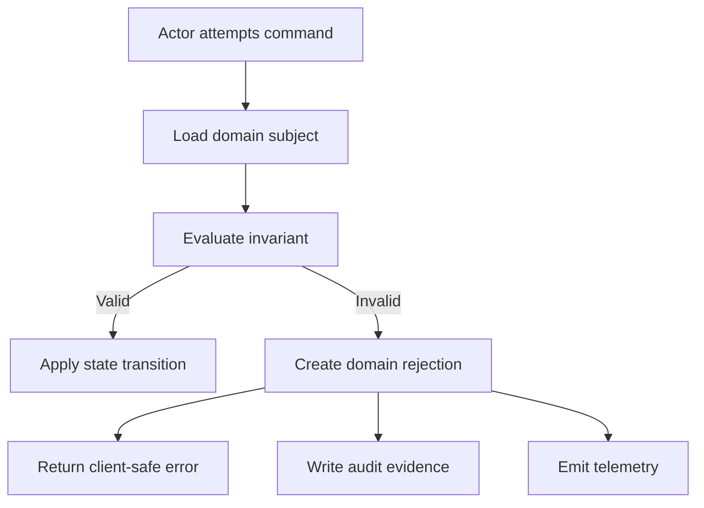
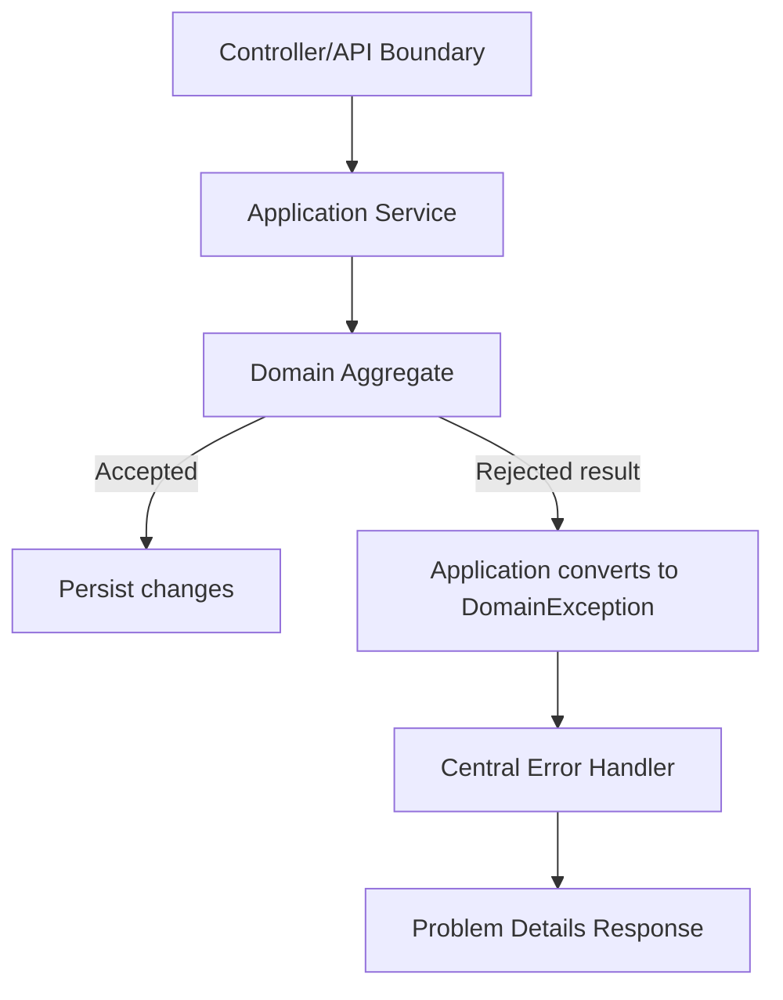
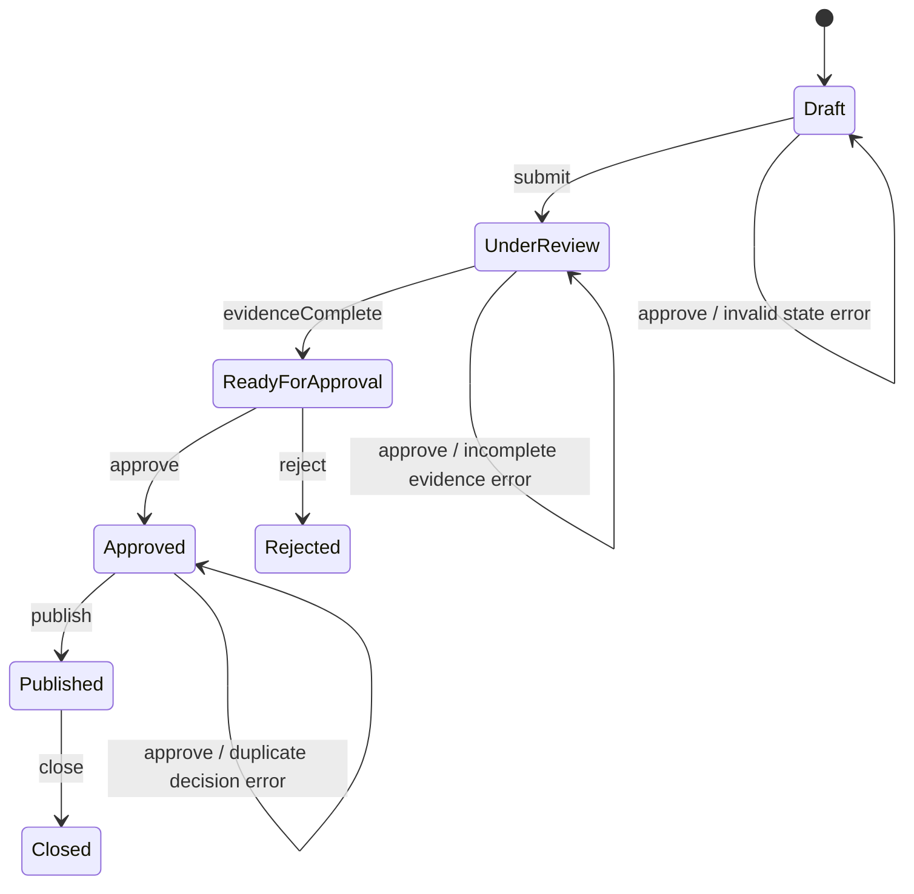
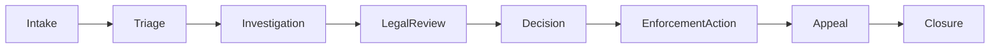

# Part 007 — Domain Error Design

Domain error design adalah kemampuan membedakan **kegagalan bisnis yang valid** dari **bug teknis** dan **kegagalan infrastruktur**, lalu mengekspresikannya sebagai kontrak yang stabil, dapat diuji, dapat diaudit, dan dapat diobservasi.

Di sistem enterprise dan regulatory platform, error bukan hanya “pesan gagal”. Error adalah bagian dari **decision record**: mengapa sebuah aksi ditolak, siapa aktornya, state apa yang dilanggar, bukti apa yang tersedia, dan apa konsekuensi berikutnya.

Part ini fokus pada desain domain error di dalam aplikasi Java. Part berikutnya akan memetakan domain error ini menjadi **error code** dan **Problem Details** untuk boundary HTTP/API.

---

## 1. Target Skill Berdasarkan Kaufman

Mengikuti kerangka Josh Kaufman, kita tidak mulai dari daftar pattern. Kita mulai dari performa yang ingin dicapai.

Setelah part ini, target kemampuan Anda:

1. Bisa membedakan domain error, validation error, conflict, policy denial, programmer bug, dan infrastructure failure.
2. Bisa mendesain error domain yang stabil meskipun implementasi internal berubah.
3. Bisa menentukan kapan error harus dilempar sebagai exception, kapan dikembalikan sebagai result, dan kapan dicatat sebagai audit event.
4. Bisa membuat Java model untuk error yang membawa konteks cukup tanpa membocorkan data sensitif.
5. Bisa menghubungkan domain error dengan state machine, audit trail, observability, dan user journey.
6. Bisa membangun error design yang defensible untuk sistem enforcement, case management, compliance, finance, insurance, healthcare, atau regulated workflow lain.

Prinsip Kaufman yang dipakai:

| Kaufman Principle | Implementasi di Part Ini |
|---|---|
| Deconstruct the skill | Pecah domain error menjadi invariant, decision, actor, subject, operation, state, evidence, remediation |
| Learn enough to self-correct | Gunakan checklist: recoverability, auditability, user actionability, state impact |
| Remove barriers | Sediakan template Java model dan decision table |
| Deliberate practice | Latihan desain error untuk workflow case lifecycle |

---

## 2. Masalah Yang Sering Terjadi

Banyak sistem Java enterprise gagal bukan karena tidak punya exception handling, tetapi karena **semua kegagalan disamakan**.

Contoh buruk:

```java
throw new RuntimeException("Failed to approve case");
```

Masalahnya:

1. Tidak jelas apakah approval gagal karena bug, state tidak valid, actor tidak berwenang, evidence belum lengkap, dependency down, atau rule policy berubah.
2. Client tidak tahu apakah harus retry, memperbaiki input, menunggu approval lain, atau escalate ke support.
3. Log tidak cukup untuk investigasi.
4. Metrics tidak bisa membedakan kegagalan sistem dari penolakan bisnis normal.
5. Audit trail tidak bisa menjelaskan mengapa keputusan dibuat.

Versi yang lebih domain-aware:

```java
throw new CaseTransitionRejectedException(
    DomainError.of(
        ErrorCode.CASE_CANNOT_BE_APPROVED_FROM_CURRENT_STATE,
        "Case cannot be approved while evidence review is still pending",
        DomainContext.builder()
            .actorId(actor.id())
            .caseId(command.caseId())
            .currentState(caseFile.state().name())
            .attemptedAction("APPROVE_CASE")
            .requiredState("READY_FOR_APPROVAL")
            .build()
    )
);
```

Ini bukan sekadar “pesan lebih panjang”. Ini mengubah error menjadi **structured business fact**.

---

## 3. Definisi Domain Error

Domain error adalah kegagalan yang terjadi karena **aksi yang diminta tidak valid menurut aturan bisnis, state domain, policy, atau invariant sistem**, meskipun aplikasi berjalan dengan benar.

Domain error bukan:

- `NullPointerException` karena bug.
- `SQLException` karena koneksi database putus.
- `TimeoutException` karena dependency lambat.
- `OutOfMemoryError` karena JVM kehabisan memori.
- `ClassCastException` karena kesalahan programmer.

Domain error adalah situasi seperti:

- Case tidak bisa ditutup karena masih ada open allegation.
- Payment tidak bisa disettle karena sudah reversed.
- Sanction tidak bisa dipublish karena approval chain belum lengkap.
- User tidak bisa mengubah enforcement decision karena case sudah locked.
- Permit tidak bisa diterbitkan karena mandatory inspection belum selesai.
- Claim tidak bisa diproses karena beneficiary tidak memenuhi rule eligibility.

Kata kuncinya: **sistem bekerja benar, dan justru karena itu sistem menolak aksi**.

---

## 4. Mental Model: Error Sebagai Decision

Di sistem produksi, terutama sistem regulatory, error domain adalah decision:



Error bukan hanya hasil negatif. Error adalah cabang eksplisit dari decision model.

Pertanyaan desain yang harus dijawab:

1. Command apa yang dicoba?
2. Actor siapa yang mencoba?
3. Subject apa yang terdampak?
4. State saat ini apa?
5. Invariant apa yang dilanggar?
6. Apakah error ini expected atau unexpected?
7. Apakah user bisa memperbaiki sendiri?
8. Apakah retry akan membantu?
9. Apakah harus menjadi audit event?
10. Apakah harus memicu alert?

Jika pertanyaan ini tidak bisa dijawab dari error model, berarti desain error belum cukup matang.

---

## 5. Domain Error vs Technical Error

Perbedaan paling penting:

| Jenis Error | Penyebab | Contoh | Retry? | Alert? | Audit? |
|---|---|---|---|---|---|
| Domain rejection | Rule bisnis menolak aksi | Case belum eligible approve | Tidak | Biasanya tidak | Ya, jika decision significant |
| Validation error | Input tidak memenuhi contract | Tanggal kosong, format salah | Tidak sebelum diperbaiki | Tidak | Kadang |
| Conflict error | State berubah atau tidak cocok | Case sudah closed oleh user lain | Tidak langsung | Tidak | Ya |
| Policy denial | Actor tidak punya hak atau policy melarang | Supervisor only action | Tidak | Security signal tergantung konteks | Ya |
| Infrastructure error | Dependency/platform gagal | DB timeout | Bisa, dengan budget | Ya jika simptom sistemik | Tidak sebagai decision domain |
| Programmer bug | Kode salah | NPE, illegal branch | Tidak | Ya | Tidak sebagai decision domain |

Kesalahan umum adalah memasukkan semua error ke exception hierarchy yang sama. Akibatnya sistem tidak tahu apakah error harus:

- ditampilkan ke user,
- di-log sebagai warning,
- dihitung sebagai business rejection,
- dihitung sebagai service failure,
- di-retry,
- di-alert,
- atau di-audit.

---

## 6. Tujuh Kategori Domain Error

### 6.1 Validation Failure

Input tidak memenuhi syarat bentuk atau field-level rule.

Contoh:

- `caseId` kosong.
- `decisionDate` di masa depan.
- `amount` negatif.
- `violationType` tidak dikenal.

Karakteristik:

- Biasanya terjadi sebelum command menyentuh aggregate utama.
- User atau caller bisa memperbaiki.
- Tidak boleh menjadi alert produksi.
- Biasanya HTTP 400 pada boundary API.
- Bisa diakumulasi menjadi daftar field error.

Contoh model:

```java
public record FieldViolation(
    String field,
    String rule,
    String message
) {}

public final class ValidationRejectedException extends DomainException {
    private final List<FieldViolation> violations;

    public ValidationRejectedException(DomainError error, List<FieldViolation> violations) {
        super(error);
        this.violations = List.copyOf(violations);
    }

    public List<FieldViolation> violations() {
        return violations;
    }
}
```

### 6.2 State Conflict

Command valid secara bentuk, tetapi subject berada di state yang tidak menerima aksi itu.

Contoh:

- Approve case ketika state masih `DRAFT`.
- Reopen case yang sudah archived permanen.
- Assign investigator ketika case sudah transferred ke unit lain.

Karakteristik:

- Sangat relevan untuk state machine.
- Biasanya bukan bug jika state berubah akibat aktivitas user lain.
- Harus menyertakan `currentState`, `attemptedAction`, dan `allowedStates`.
- Sangat penting untuk audit dan user journey.

Contoh:

```java
public final class InvalidCaseStateException extends DomainException {
    public InvalidCaseStateException(CaseId caseId, CaseState current, CaseAction action) {
        super(DomainError.builder()
            .code(ErrorCode.CASE_INVALID_STATE_FOR_ACTION)
            .message("Case is not in a state that allows the requested action")
            .attribute("caseId", caseId.value())
            .attribute("currentState", current.name())
            .attribute("attemptedAction", action.name())
            .build());
    }
}
```

### 6.3 Business Rule Violation

Command melanggar invariant bisnis, bukan sekadar state transition.

Contoh:

- Sanction amount melebihi legal maximum.
- Case cannot be closed because unresolved allegations exist.
- Enforcement notice cannot be sent before mandatory cooling-off period.

Karakteristik:

- Membutuhkan domain language yang jelas.
- Biasanya menjadi bagian dari decision record.
- Dapat berubah jika regulasi berubah.
- Perlu versioning rule jika sistem berada di domain regulated.

### 6.4 Policy Denial

Aksi ditolak karena policy access, authorization, segregation of duties, jurisdiction, ownership, atau delegation.

Contoh:

- User tidak boleh approve case yang ia investigasi sendiri.
- Officer luar jurisdiction tidak boleh assign case.
- Maker tidak boleh menjadi checker.

Karakteristik:

- Mirip security, tetapi sering memiliki semantic domain.
- Perlu hati-hati agar tidak membocorkan informasi sensitif.
- Sering membutuhkan audit.
- Tidak semua policy denial adalah security incident.

### 6.5 Duplicate or Idempotency Conflict

Aksi sudah pernah diterima, sedang diproses, atau menghasilkan efek yang sama.

Contoh:

- Command submit dengan idempotency key yang sama.
- Evidence upload sudah ada checksum yang sama.
- Case transfer request sudah pending.

Karakteristik:

- Sangat penting untuk API, messaging, dan distributed workflow.
- Tidak selalu error bagi user; bisa menjadi successful replay.
- Perlu membedakan duplicate harmless vs duplicate conflicting.

### 6.6 Temporal Rule Failure

Aksi tidak valid karena waktu.

Contoh:

- Appeal window sudah lewat.
- Notice cannot be issued before statutory waiting period.
- SLA escalation belum eligible.
- Decision cannot be backdated beyond allowed period.

Karakteristik:

- Perlu menyertakan clock source.
- Perlu mempertimbangkan timezone dan business calendar.
- Dalam sistem regulated, alasan temporal sering harus defensible.

### 6.7 Incomplete Evidence Failure

Aksi gagal karena evidence atau prerequisite belum lengkap.

Contoh:

- Case tidak bisa escalate karena mandatory attachment belum diverifikasi.
- Enforcement action tidak bisa publish karena legal review belum selesai.
- Investigation tidak bisa close karena interview record belum final.

Karakteristik:

- Sangat actionable untuk user.
- Sebaiknya response menyertakan daftar prerequisite yang kurang, selama aman.
- Harus menjadi bagian dari user journey, bukan hanya generic error.

---

## 7. Domain Error Anatomy

Domain error yang baik minimal memiliki komponen berikut:

| Komponen | Tujuan |
|---|---|
| `code` | Identifier stabil untuk mesin, support, dashboard, dan dokumentasi |
| `category` | Validation, conflict, policy, rule, temporal, duplicate, etc |
| `message` | Ringkasan aman untuk developer/internal consumer |
| `userMessage` | Pesan yang bisa ditampilkan ke user jika dibutuhkan |
| `actor` | Siapa yang mencoba aksi, jika relevan dan aman |
| `subject` | Entity yang terdampak, misalnya case, payment, sanction |
| `operation` | Command/action yang dicoba |
| `currentState` | State saat gagal |
| `expectedState` | State/prerequisite yang diperlukan |
| `invariant` | Rule yang dilanggar |
| `retryable` | Apakah retry teknis masuk akal |
| `remediation` | Apa langkah perbaikan |
| `auditLevel` | Apakah perlu audit event |
| `severity` | Business severity, bukan log severity mentah |
| `attributes` | Metadata tambahan dengan redaction policy |

Contoh Java record:

```java
public record DomainError(
    ErrorCode code,
    ErrorCategory category,
    String message,
    String userMessage,
    Retryability retryability,
    AuditLevel auditLevel,
    Severity severity,
    Map<String, String> attributes
) {
    public DomainError {
        Objects.requireNonNull(code, "code");
        Objects.requireNonNull(category, "category");
        Objects.requireNonNull(message, "message");
        Objects.requireNonNull(retryability, "retryability");
        Objects.requireNonNull(auditLevel, "auditLevel");
        Objects.requireNonNull(severity, "severity");
        attributes = Map.copyOf(attributes == null ? Map.of() : attributes);
    }

    public static Builder builder() {
        return new Builder();
    }

    public static final class Builder {
        private ErrorCode code;
        private ErrorCategory category;
        private String message;
        private String userMessage;
        private Retryability retryability = Retryability.NOT_RETRYABLE;
        private AuditLevel auditLevel = AuditLevel.NONE;
        private Severity severity = Severity.INFO;
        private final Map<String, String> attributes = new LinkedHashMap<>();

        public Builder code(ErrorCode code) {
            this.code = code;
            return this;
        }

        public Builder category(ErrorCategory category) {
            this.category = category;
            return this;
        }

        public Builder message(String message) {
            this.message = message;
            return this;
        }

        public Builder userMessage(String userMessage) {
            this.userMessage = userMessage;
            return this;
        }

        public Builder retryability(Retryability retryability) {
            this.retryability = retryability;
            return this;
        }

        public Builder auditLevel(AuditLevel auditLevel) {
            this.auditLevel = auditLevel;
            return this;
        }

        public Builder severity(Severity severity) {
            this.severity = severity;
            return this;
        }

        public Builder attribute(String key, String value) {
            if (value != null) {
                this.attributes.put(key, value);
            }
            return this;
        }

        public DomainError build() {
            return new DomainError(
                code,
                category,
                message,
                userMessage,
                retryability,
                auditLevel,
                severity,
                attributes
            );
        }
    }
}
```

Enums pendukung:

```java
public enum ErrorCategory {
    VALIDATION,
    STATE_CONFLICT,
    BUSINESS_RULE,
    POLICY_DENIAL,
    DUPLICATE,
    TEMPORAL_RULE,
    INCOMPLETE_EVIDENCE
}

public enum Retryability {
    NOT_RETRYABLE,
    RETRY_AFTER_USER_ACTION,
    RETRY_AFTER_STATE_CHANGE,
    RETRY_AFTER_TIME,
    TECHNICALLY_RETRYABLE
}

public enum AuditLevel {
    NONE,
    BUSINESS_EVENT,
    DECISION_RECORD,
    SECURITY_RELEVANT
}

public enum Severity {
    INFO,
    NOTICE,
    WARNING,
    CRITICAL
}
```

Poin penting: severity domain tidak sama dengan log level. Domain rejection bisa `Severity.NOTICE`, tetapi log level tetap `INFO` jika itu expected outcome.

---

## 8. Exception Wrapper Untuk Domain Error

Kita bisa menggunakan base exception untuk domain error:

```java
public abstract class DomainException extends RuntimeException {
    private final DomainError error;

    protected DomainException(DomainError error) {
        super(error.message());
        this.error = Objects.requireNonNull(error, "error");
    }

    protected DomainException(DomainError error, Throwable cause) {
        super(error.message(), cause);
        this.error = Objects.requireNonNull(error, "error");
    }

    public DomainError error() {
        return error;
    }
}
```

Lalu buat exception spesifik jika ia memberi semantic tambahan:

```java
public final class CaseTransitionRejectedException extends DomainException {
    public CaseTransitionRejectedException(DomainError error) {
        super(error);
    }
}

public final class PolicyDeniedException extends DomainException {
    public PolicyDeniedException(DomainError error) {
        super(error);
    }
}
```

Jangan membuat puluhan class exception jika class tersebut tidak menambah semantic. Banyak organisasi membuat hierarchy terlalu dalam:

```text
BusinessException
  CaseBusinessException
    CaseStateException
      CaseInvalidStateException
        CaseCannotApproveDraftCaseException
```

Ini terlihat rapi, tetapi sering tidak memberikan value. Yang lebih penting adalah **error code dan metadata**.

Rule praktis:

- Pakai class exception untuk kategori penanganan berbeda.
- Pakai error code untuk variasi detail spesifik.
- Pakai metadata untuk konteks runtime.

---

## 9. Sealed Interface Untuk Domain Failure

Untuk domain logic murni, terutama di core domain package, Anda tidak selalu perlu exception. Anda bisa memakai explicit failure type.

```java
public sealed interface DomainFailure
    permits ValidationFailure,
            StateConflictFailure,
            BusinessRuleFailure,
            PolicyDeniedFailure {

    DomainError error();
}

public record StateConflictFailure(DomainError error) implements DomainFailure {}
public record BusinessRuleFailure(DomainError error) implements DomainFailure {}
public record PolicyDeniedFailure(DomainError error) implements DomainFailure {}
public record ValidationFailure(DomainError error, List<FieldViolation> violations) implements DomainFailure {}
```

Command result:

```java
public sealed interface CommandResult<T>
    permits CommandResult.Accepted,
            CommandResult.Rejected {

    record Accepted<T>(T value) implements CommandResult<T> {}
    record Rejected<T>(DomainFailure failure) implements CommandResult<T> {}
}
```

Penggunaan:

```java
public CommandResult<CaseFile> approve(ApproveCase command, Officer actor) {
    if (state != CaseState.READY_FOR_APPROVAL) {
        return new CommandResult.Rejected<>(new StateConflictFailure(
            DomainError.builder()
                .code(ErrorCode.CASE_INVALID_STATE_FOR_ACTION)
                .category(ErrorCategory.STATE_CONFLICT)
                .message("Case cannot be approved from current state")
                .attribute("caseId", id.value())
                .attribute("currentState", state.name())
                .attribute("attemptedAction", "APPROVE")
                .build()
        ));
    }

    return new CommandResult.Accepted<>(markApproved(actor));
}
```

Keuntungan explicit failure:

- Domain layer tidak bergantung pada exception untuk control flow.
- Caller dipaksa menangani hasil rejected.
- Cocok untuk validation dan rule evaluation.
- Cocok untuk workflow yang memang memiliki banyak expected rejection.

Kekurangan:

- Bisa verbose.
- Boundary integration perlu mapping tambahan.
- Jika digunakan sembarangan, bisa membuat kode penuh plumbing.

---

## 10. Throw vs Return: Decision Matrix

Gunakan matrix berikut:

| Kondisi | Preferensi |
|---|---|
| Error expected sebagai bagian normal dari decision | Return explicit result |
| Error jarang tetapi domain-significant | Throw domain exception boleh |
| API internal command service ingin rollback transaction | Throw domain exception sering lebih praktis |
| Batch processing perlu lanjut ke item berikutnya | Return per-item result |
| Validation banyak field | Return accumulated validation result |
| Boundary HTTP ingin central handler | Throw domain exception dari service, map di handler |
| Core domain ingin bebas framework | Return sealed failure/result |

Contoh desain hybrid:



Pattern ini sering efektif:

1. Domain aggregate return explicit failure.
2. Application service menentukan efek transaksi dan audit.
3. Boundary handler mengubah error menjadi response.

---

## 11. Domain Error Sebagai State Machine Guard

Di sistem case management, state machine bukan hanya daftar state. Ia juga memiliki guard condition.



Setiap transition failure harus punya error semantic.

Contoh guard:

```java
public Optional<DomainFailure> canApprove(CaseFile caseFile, Officer actor) {
    if (caseFile.state() != CaseState.READY_FOR_APPROVAL) {
        return Optional.of(stateConflict(caseFile, "APPROVE"));
    }

    if (!caseFile.evidence().isComplete()) {
        return Optional.of(incompleteEvidence(caseFile));
    }

    if (caseFile.investigatorId().equals(actor.id())) {
        return Optional.of(segregationOfDutiesViolation(caseFile, actor));
    }

    return Optional.empty();
}
```

Desain yang baik membuat rejected transition eksplisit. Desain yang buruk membiarkan rejected transition muncul sebagai generic exception.

---

## 12. Domain Error dan Auditability

Tidak semua error perlu audit. Tetapi beberapa domain error adalah decision record.

Audit-worthy error:

- Policy denial.
- Regulatory decision rejection.
- Enforcement action blocked.
- Maker-checker violation.
- Manual override rejected.
- State transition rejected untuk entity penting.
- Eligibility decision.
- Any error used as justification for user-visible decision.

Bukan audit-worthy secara default:

- Field validation typo.
- Missing optional query parameter.
- User salah format tanggal.
- Duplicate harmless retry.

Audit event contoh:

```java
public record AuditEvent(
    String eventType,
    String actorId,
    String subjectType,
    String subjectId,
    String action,
    String outcome,
    String reasonCode,
    Instant occurredAt,
    Map<String, String> evidence
) {}
```

Mapping:

```java
public Optional<AuditEvent> toAuditEvent(DomainException exception, RequestContext ctx) {
    DomainError error = exception.error();

    if (error.auditLevel() == AuditLevel.NONE) {
        return Optional.empty();
    }

    return Optional.of(new AuditEvent(
        "DOMAIN_ACTION_REJECTED",
        ctx.actorId(),
        error.attributes().getOrDefault("subjectType", "unknown"),
        error.attributes().getOrDefault("subjectId", "unknown"),
        error.attributes().getOrDefault("action", "unknown"),
        "REJECTED",
        error.code().value(),
        ctx.now(),
        redact(error.attributes())
    ));
}
```

Prinsip:

- Audit event harus mencatat outcome, bukan stack trace.
- Stack trace berguna untuk bug, bukan untuk business decision normal.
- Audit metadata harus cukup untuk menjelaskan alasan decision.
- Jangan menaruh PII/raw document content di error attributes.

---

## 13. Domain Error dan Observability

Domain error harus masuk observability, tetapi tidak semua harus menjadi error log.

### 13.1 Logging

Domain rejection expected biasanya log level `INFO` atau `DEBUG`, bukan `ERROR`.

```java
log.info(
    "Domain command rejected code={} category={} subjectType={} subjectId={} action={} actorId={}",
    error.code().value(),
    error.category(),
    error.attributes().get("subjectType"),
    error.attributes().get("subjectId"),
    error.attributes().get("action"),
    ctx.actorId()
);
```

Log `ERROR` untuk domain rejection hanya jika rejection menunjukkan kondisi tidak normal, misalnya:

- impossible state,
- data corruption,
- unexpected rule registry miss,
- missing mandatory reference data,
- policy engine misconfiguration.

### 13.2 Metrics

Domain error bisa dihitung sebagai business metric:

```text
case_command_rejections_total{code="CASE_INVALID_STATE_FOR_ACTION",action="APPROVE"}
```

Tetapi hati-hati cardinality. Jangan jadikan `caseId`, `userId`, atau free-text message sebagai label metric.

Label aman:

- error code,
- category,
- action,
- subject type,
- channel,
- tenant tier jika cardinality bounded.

Label berbahaya:

- subject id,
- actor id,
- email,
- IP address,
- raw validation field path yang unbounded,
- arbitrary message.

### 13.3 Tracing

Span dapat diberi attribute domain error:

```java
span.setAttribute("domain.error_code", error.code().value());
span.setAttribute("domain.error_category", error.category().name());
span.setAttribute("domain.action", error.attributes().getOrDefault("action", "unknown"));
span.setStatus(StatusCode.OK, "Domain command rejected");
```

Perhatikan `StatusCode.OK`. Domain rejection expected tidak selalu berarti span error secara technical. Jika semua domain rejection ditandai sebagai trace error, dashboard akan terlihat rusak padahal sistem bekerja benar.

---

## 14. Redaction dan Data Safety

Domain error sering mengandung konteks sensitif. Jangan membuat error model menjadi tempat bocor data.

Aturan praktis:

| Data | Boleh di Error Attributes? | Catatan |
|---|---:|---|
| Internal stable ID | Ya, jika bukan rahasia | Lebih aman daripada nama orang |
| User display name | Hindari | Bisa PII |
| Email | Hindari | PII dan cardinality tinggi |
| Document content | Tidak | Simpan referensi, bukan isi |
| Legal finding summary | Hati-hati | Tergantung confidentiality |
| Rule ID | Ya | Bagus untuk audit |
| State name | Ya | Biasanya aman |
| Action name | Ya | Biasanya aman |
| Raw exception message dependency | Tidak | Bisa bocor credential/detail internal |

Contoh redaction:

```java
private static Map<String, String> redact(Map<String, String> attributes) {
    Set<String> blocked = Set.of("email", "name", "phone", "documentText", "accessToken");

    return attributes.entrySet().stream()
        .filter(entry -> !blocked.contains(entry.getKey()))
        .collect(Collectors.toUnmodifiableMap(Map.Entry::getKey, Map.Entry::getValue));
}
```

Lebih baik lagi: gunakan allowlist, bukan blocklist.

---

## 15. Error Design Untuk Regulatory Case Lifecycle

Contoh lifecycle:



Command: `ApproveEnforcementDecision`

Kemungkinan domain error:

| Error Code | Category | Reason | Remediation |
|---|---|---|---|
| `CASE_NOT_READY_FOR_DECISION` | State conflict | Case belum di stage Decision | Complete prior stage |
| `LEGAL_REVIEW_PENDING` | Incomplete evidence | Legal review belum final | Complete legal review |
| `MAKER_CHECKER_VIOLATION` | Policy denial | Approver adalah investigator yang sama | Assign independent approver |
| `SANCTION_EXCEEDS_LIMIT` | Business rule | Amount melebihi statutory maximum | Adjust sanction or attach override authority |
| `APPEAL_WINDOW_ACTIVE` | Temporal rule | Enforcement belum bisa closed | Wait until appeal window ends |
| `DECISION_ALREADY_APPROVED` | Duplicate | Command replay | Return existing decision state |

Contoh implementation:

```java
public final class ApproveEnforcementDecisionPolicy {

    public Optional<DomainFailure> evaluate(CaseFile caseFile, Officer officer, Clock clock) {
        if (caseFile.stage() != CaseStage.DECISION) {
            return Optional.of(failure(
                ErrorCode.CASE_NOT_READY_FOR_DECISION,
                ErrorCategory.STATE_CONFLICT,
                "Case is not ready for enforcement decision approval",
                caseFile,
                officer,
                Map.of("currentStage", caseFile.stage().name())
            ));
        }

        if (!caseFile.legalReview().isFinal()) {
            return Optional.of(failure(
                ErrorCode.LEGAL_REVIEW_PENDING,
                ErrorCategory.INCOMPLETE_EVIDENCE,
                "Legal review must be final before approval",
                caseFile,
                officer,
                Map.of("legalReviewStatus", caseFile.legalReview().status().name())
            ));
        }

        if (caseFile.investigatorId().equals(officer.id())) {
            return Optional.of(failure(
                ErrorCode.MAKER_CHECKER_VIOLATION,
                ErrorCategory.POLICY_DENIAL,
                "Officer who investigated the case cannot approve the decision",
                caseFile,
                officer,
                Map.of("policy", "SEGREGATION_OF_DUTIES")
            ));
        }

        return Optional.empty();
    }

    private DomainFailure failure(
        ErrorCode code,
        ErrorCategory category,
        String message,
        CaseFile caseFile,
        Officer officer,
        Map<String, String> extra
    ) {
        Map<String, String> attributes = new LinkedHashMap<>();
        attributes.put("subjectType", "CASE");
        attributes.put("subjectId", caseFile.id().value());
        attributes.put("actorId", officer.id().value());
        attributes.put("action", "APPROVE_ENFORCEMENT_DECISION");
        attributes.putAll(extra);

        return new BusinessRuleFailure(DomainError.builder()
            .code(code)
            .category(category)
            .message(message)
            .retryability(Retryability.RETRY_AFTER_USER_ACTION)
            .auditLevel(AuditLevel.DECISION_RECORD)
            .severity(Severity.NOTICE)
            .attributes(attributes)
            .build());
    }
}
```

Catatan: method di atas mengandung `actorId` di attributes. Di sistem nyata, pastikan value tersebut aman untuk log dan tidak melanggar privacy policy. Untuk audit internal, ID sering valid; untuk response client, harus direduksi.

---

## 16. Domain Error Registry

Domain error harus dikelola seperti API contract. Jangan biarkan kode error tersebar sembarangan.

```java
public enum ErrorCode {
    CASE_INVALID_STATE_FOR_ACTION("CASE-STATE-001"),
    CASE_NOT_READY_FOR_DECISION("CASE-DECISION-001"),
    LEGAL_REVIEW_PENDING("CASE-DECISION-002"),
    MAKER_CHECKER_VIOLATION("CASE-POLICY-001"),
    SANCTION_EXCEEDS_LIMIT("CASE-RULE-001"),
    DECISION_ALREADY_APPROVED("CASE-DUPLICATE-001");

    private final String value;

    ErrorCode(String value) {
        this.value = value;
    }

    public String value() {
        return value;
    }
}
```

Untuk sistem besar, enum bisa kurang fleksibel. Alternatif:

```java
public record ErrorCode(String value) {
    public ErrorCode {
        if (value == null || !value.matches("[A-Z]+-[A-Z]+-[0-9]{3,5}")) {
            throw new IllegalArgumentException("Invalid error code format: " + value);
        }
    }
}
```

Kemudian registry eksternal:

```yaml
CASE-DECISION-001:
  category: STATE_CONFLICT
  title: Case is not ready for decision approval
  retryability: RETRY_AFTER_STATE_CHANGE
  auditLevel: DECISION_RECORD
  owner: case-lifecycle-team
  public: true

CASE-POLICY-001:
  category: POLICY_DENIAL
  title: Maker-checker policy prevents approval
  retryability: RETRY_AFTER_USER_ACTION
  auditLevel: SECURITY_RELEVANT
  owner: authorization-policy-team
  public: false
```

Registry membantu:

- dokumentasi konsisten,
- contract testing,
- support playbook,
- dashboard grouping,
- backward compatibility,
- audit evidence.

---

## 17. Anti-Patterns

### 17.1 Generic BusinessException

```java
throw new BusinessException("Cannot approve");
```

Masalah:

- tidak machine-readable,
- tidak stabil,
- tidak bisa dimetric-kan,
- tidak bisa diaudit dengan baik,
- tidak actionable.

### 17.2 Menjadikan Semua Validation Sebagai Exception

Untuk form besar, validation sebagai exception pertama yang ditemukan membuat user harus memperbaiki field satu per satu. Lebih baik accumulate field violations.

### 17.3 Menjadikan Domain Rejection Sebagai Error Log

Jika user sering mencoba aksi tidak valid karena UI flow, log `ERROR` akan penuh noise. Ini menyembunyikan error teknis yang sebenarnya.

### 17.4 Membocorkan Internal Rule

Pesan seperti ini berbahaya:

```json
{
  "error": "SpEL rule enforcementDecision.approver.id != principal.id failed at PolicyEngineImpl.java:182"
}
```

Lebih baik:

```json
{
  "code": "CASE-POLICY-001",
  "message": "The decision requires approval by an independent officer."
}
```

### 17.5 Error Code Berdasarkan HTTP Status

Kode seperti `BAD_REQUEST_001` buruk karena status HTTP bukan domain. Jika boundary berubah ke messaging/GraphQL/batch, kode kehilangan makna.

Lebih baik:

```text
CASE-DECISION-001
CASE-POLICY-001
CASE-EVIDENCE-002
```

---

## 18. Testing Domain Error

Test error sama pentingnya dengan test success path.

Contoh:

```java
@Test
void shouldRejectApprovalWhenLegalReviewIsPending() {
    CaseFile caseFile = CaseFixtures.caseInDecisionStage()
        .withLegalReviewStatus(LegalReviewStatus.PENDING);
    Officer approver = OfficerFixtures.supervisor();

    Optional<DomainFailure> failure = policy.evaluate(caseFile, approver, Clock.systemUTC());

    assertThat(failure).isPresent();
    assertThat(failure.get().error().code()).isEqualTo(ErrorCode.LEGAL_REVIEW_PENDING);
    assertThat(failure.get().error().category()).isEqualTo(ErrorCategory.INCOMPLETE_EVIDENCE);
    assertThat(failure.get().error().auditLevel()).isEqualTo(AuditLevel.DECISION_RECORD);
}
```

Test yang perlu ada:

1. Setiap state transition invalid menghasilkan code yang tepat.
2. Setiap policy denial membawa category yang tepat.
3. Error attributes tidak mengandung field sensitif.
4. Retryability sesuai dengan penyebab.
5. AuditLevel sesuai dengan significance.
6. Error code tidak berubah tanpa review.
7. Error tidak mengandalkan message text untuk assertion.

---

## 19. Review Checklist

Gunakan checklist ini saat code review:

### Domain Semantics

- [ ] Apakah error merepresentasikan domain decision, bukan bug teknis?
- [ ] Apakah code stabil dan machine-readable?
- [ ] Apakah category benar?
- [ ] Apakah current state/action/prerequisite tercatat?
- [ ] Apakah remediation jelas?

### Operational Behavior

- [ ] Apakah retryability eksplisit?
- [ ] Apakah error expected tidak di-log sebagai `ERROR`?
- [ ] Apakah metrics label bounded?
- [ ] Apakah trace status tidak menandai domain rejection normal sebagai technical failure?

### Audit & Compliance

- [ ] Apakah decision-significant rejection menjadi audit event?
- [ ] Apakah audit evidence cukup menjelaskan reason?
- [ ] Apakah PII/raw sensitive data tidak bocor?
- [ ] Apakah rule/version/policy ID tercatat jika regulasi membutuhkan?

### API Boundary

- [ ] Apakah domain error bisa dipetakan ke response client?
- [ ] Apakah client tidak perlu parse message text?
- [ ] Apakah internal exception class tidak bocor?
- [ ] Apakah error code terdokumentasi?

---

## 20. Deliberate Practice

### Practice 1 — Classify Errors

Ambil 20 error dari service Anda. Klasifikasikan:

- validation,
- state conflict,
- business rule,
- policy denial,
- duplicate,
- temporal,
- incomplete evidence,
- infrastructure,
- programmer bug.

Jika lebih dari 30% masuk kategori “unknown” atau “generic”, error model Anda belum cukup baik.

### Practice 2 — Design Error Registry

Buat registry untuk satu aggregate utama. Minimal 15 error code.

Setiap code harus punya:

- code,
- title,
- category,
- retryability,
- auditLevel,
- owner,
- public/private visibility,
- remediation.

### Practice 3 — Refactor Generic Exception

Cari pola:

```java
throw new RuntimeException("...");
throw new BusinessException("...");
```

Refactor menjadi:

- `DomainError`,
- `ErrorCode`,
- category,
- attributes,
- handler mapping.

### Practice 4 — Audit Simulation

Untuk satu rejected command, jawab:

1. Siapa mencoba aksi?
2. Entity apa yang terdampak?
3. State saat itu apa?
4. Rule apa yang dilanggar?
5. Evidence apa yang tersedia?
6. Apa remediation?
7. Apakah support dapat menjelaskan ini 6 bulan kemudian?

Jika jawaban tidak tersedia, auditability belum cukup.

---

## 21. Key Takeaways

1. Domain error adalah **valid negative outcome**, bukan selalu technical failure.
2. Error domain harus merepresentasikan decision: actor, subject, action, state, invariant, outcome.
3. Error code dan metadata lebih stabil daripada class exception dan message text.
4. Tidak semua domain rejection harus `ERROR` di log atau `StatusCode.ERROR` di trace.
5. Regulatory-grade systems membutuhkan error yang defensible, auditable, dan explainable.
6. Throw vs return bukan debat style; itu keputusan berdasarkan expectedness, transaction, API boundary, dan workflow.
7. Error design yang baik membantu user journey, support, observability, metrics, alerting, dan compliance sekaligus.

---

## 22. Referensi

- Java Language Specification, Java SE 25 Edition — Chapter 11: Exceptions: https://docs.oracle.com/javase/specs/jls/se25/html/jls-11.html
- Java SE 25 API — `Throwable`: https://docs.oracle.com/en/java/javase/25/docs/api/java.base/java/lang/Throwable.html
- OpenTelemetry Documentation — Concepts and Signals: https://opentelemetry.io/docs/concepts/signals/
- RFC 9457 — Problem Details for HTTP APIs: https://www.rfc-editor.org/rfc/rfc9457.html
