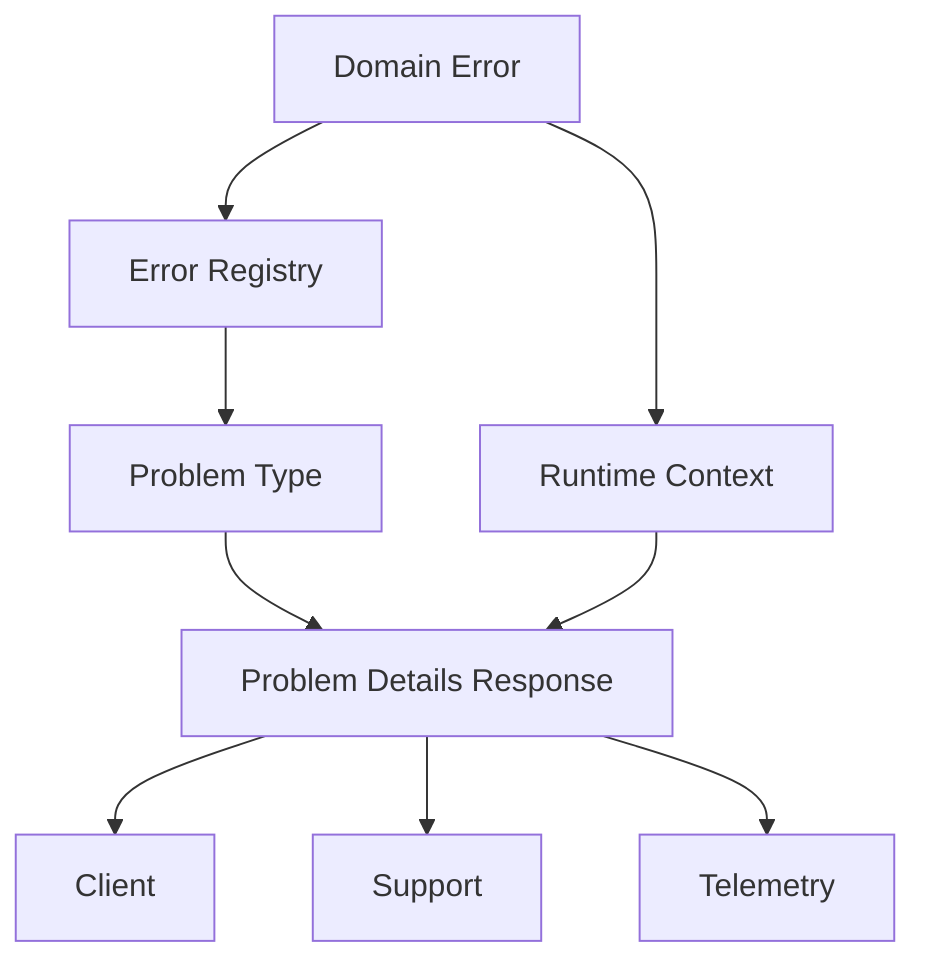
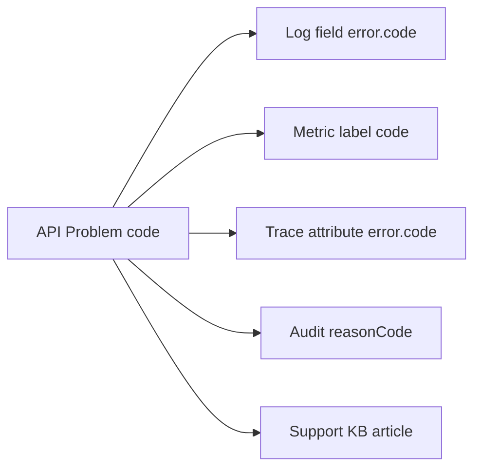

# Part 008 — Error Codes & Problem Details

Part sebelumnya membahas domain error sebagai decision. Part ini membahas bagaimana error tersebut diekspos ke boundary API secara stabil, aman, dan machine-readable.

Di sistem produksi, error response bukan hanya untuk manusia. Error response dibaca oleh:

- frontend,
- mobile app,
- partner API,
- automation client,
- workflow engine,
- batch retry process,
- support tooling,
- observability pipeline,
- audit/reporting system.

Karena itu, error response harus menjadi **contract**, bukan sekadar string.

RFC 9457, “Problem Details for HTTP APIs”, mendefinisikan format umum untuk membawa detail error machine-readable pada HTTP API dan menggantikan RFC 7807. Format ini cocok menjadi envelope standar, tetapi Anda tetap perlu mendesain **domain error code** dengan benar.

---

## 1. Target Skill Berdasarkan Kaufman

Target setelah part ini:

1. Bisa mendesain error code yang stabil, domain-oriented, dan tidak bocor detail internal.
2. Bisa memetakan domain error ke Problem Details response.
3. Bisa membedakan `type`, `title`, `status`, `detail`, `instance`, dan extension fields.
4. Bisa membuat central error handler Java/Spring-style yang konsisten.
5. Bisa mendesain error registry untuk dokumentasi, support, metrics, dan backward compatibility.
6. Bisa menentukan mana error yang public, internal, retryable, audit-worthy, atau security-sensitive.

Kaufman breakdown:

| Skill Unit | Latihan |
|---|---|
| Stable code design | Buat namespace dan registry error |
| Problem Details mapping | Map domain exception ke RFC 9457 shape |
| Contract safety | Hilangkan stack trace/internal class dari response |
| Backward compatibility | Simulasikan perubahan error tanpa breaking client |
| Observability integration | Hubungkan code ke log, metric, trace, audit |

---

## 2. Mengapa Error Code Penting

Tanpa error code, client biasanya melakukan hal buruk:

```typescript
if (error.message.includes("already approved")) {
  showAlreadyApprovedMessage();
}
```

Ini rapuh karena message bisa berubah untuk grammar, bahasa, localization, atau security review.

Dengan error code:

```typescript
if (problem.code === "CASE-DECISION-003") {
  showAlreadyApprovedMessage();
}
```

Error code memberi stabilitas untuk:

- conditional UI,
- retry decision,
- support search,
- dashboard grouping,
- audit lookup,
- documentation,
- partner integration,
- contract tests.

Namun error code yang buruk bisa lebih berbahaya daripada tidak ada code.

Contoh buruk:

```text
ERR_001
BAD_REQUEST_42
JAVA_NULL_POINTER
SQL_TIMEOUT
BusinessException.APPROVAL_FAILED
```

Masalah:

- tidak domain-specific,
- tidak stabil,
- terlalu terkait implementasi,
- tidak memberi remediation,
- sulit dicari lintas tim.

Contoh lebih baik:

```text
CASE-DECISION-001
CASE-POLICY-001
PAYMENT-IDEMPOTENCY-002
EVIDENCE-VALIDATION-004
ACCOUNT-ELIGIBILITY-003
```

---

## 3. Problem Details: Mental Model

Problem Details adalah envelope standar untuk error HTTP.

Bentuk umum:

```json
{
  "type": "https://api.example.com/problems/case-decision-not-ready",
  "title": "Case is not ready for decision approval",
  "status": 409,
  "detail": "The case must complete legal review before an enforcement decision can be approved.",
  "instance": "/cases/CASE-123/decision/approval-attempts/REQ-789",
  "code": "CASE-DECISION-001",
  "category": "STATE_CONFLICT",
  "retryable": false,
  "remediation": "Complete legal review before approving the decision.",
  "correlationId": "8f25d4f1c9b64d10"
}
```

RFC 9457 mendefinisikan beberapa member standar:

| Field | Makna |
|---|---|
| `type` | URI yang mengidentifikasi problem type |
| `title` | Ringkasan pendek problem type |
| `status` | HTTP status code yang dihasilkan origin server |
| `detail` | Penjelasan spesifik untuk occurrence ini |
| `instance` | URI reference untuk occurrence spesifik |

Member tambahan seperti `code`, `category`, `retryable`, dan `correlationId` adalah extension members.

Mental model:



Domain error adalah sumber semantic. Problem Details adalah transport shape.

---

## 4. Jangan Samakan Error Code Dengan HTTP Status

HTTP status menjelaskan outcome pada protokol HTTP. Error code menjelaskan domain/problem.

Contoh:

| Domain Error | HTTP Status | Error Code |
|---|---:|---|
| Field validation failed | 400 | `EVIDENCE-VALIDATION-001` |
| User lacks permission | 403 | `CASE-POLICY-001` |
| Case state conflict | 409 | `CASE-STATE-001` |
| Resource not found | 404 | `CASE-LOOKUP-001` |
| Idempotency conflict | 409 | `PAYMENT-IDEMPOTENCY-002` |
| Rate limit exceeded | 429 | `PLATFORM-RATE-001` |
| Dependency timeout | 503 | `DEPENDENCY-TIMEOUT-001` |

Satu HTTP status bisa berisi banyak error code. Satu error code biasanya punya default HTTP status, tetapi mapping bisa berbeda tergantung boundary.

Contoh:

- Di HTTP, `CASE-STATE-001` menjadi 409.
- Di batch report, ia menjadi rejected row.
- Di messaging, ia menjadi negative acknowledgement atau dead-letter reason.
- Di UI, ia menjadi disabled action explanation.

Karena itu, jangan desain code seperti `HTTP_409_001`.

---

## 5. Error Code Design Rules

### 5.1 Stable

Error code tidak boleh berubah hanya karena message berubah.

Buruk:

```text
CASE_CANNOT_BE_APPROVED_BECAUSE_LEGAL_REVIEW_IS_PENDING
```

Terlalu panjang dan rawan berubah.

Lebih baik:

```text
CASE-DECISION-001
```

Title/remediation bisa berubah, tetapi code tetap.

### 5.2 Domain-Oriented

Code harus berbasis domain atau platform capability, bukan class Java.

Buruk:

```text
IllegalStateException-001
DataIntegrityViolationException-002
```

Lebih baik:

```text
CASE-STATE-001
ACCOUNT-UNIQUENESS-001
```

### 5.3 Namespaced

Gunakan namespace untuk menghindari tabrakan.

Pattern:

```text
<DOMAIN>-<AREA>-<NUMBER>
```

Contoh:

```text
CASE-STATE-001
CASE-DECISION-001
CASE-POLICY-001
EVIDENCE-VALIDATION-003
PLATFORM-RATE-001
AUTHZ-POLICY-002
```

### 5.4 Bounded

Jangan membuat code per entity instance.

Buruk:

```text
CASE-12345-NOT-READY
```

Baik:

```text
CASE-DECISION-001
```

Entity id masuk metadata internal atau `instance`, bukan code.

### 5.5 Documented

Setiap public code harus punya registry.

Minimal registry fields:

```yaml
CASE-DECISION-001:
  title: Case is not ready for decision approval
  category: STATE_CONFLICT
  defaultStatus: 409
  retryable: false
  visibility: public
  owner: case-lifecycle-team
  since: 2026-06-28
  remediation: Complete legal review before approving the decision.
```

### 5.6 Not Secret

Public error code tidak boleh membocorkan rule sensitif.

Buruk:

```text
FRAUD_SCORE_ABOVE_0_83
INTERNAL_WATCHLIST_MATCH
```

Lebih aman:

```text
ACCOUNT-ELIGIBILITY-003
```

Detail internal bisa masuk audit private, bukan client response.

---

## 6. Error Registry

Error registry adalah single source of truth untuk error contract.

Contoh YAML:

```yaml
errors:
  CASE-DECISION-001:
    type: https://api.example.com/problems/case-decision-not-ready
    title: Case is not ready for decision approval
    category: STATE_CONFLICT
    defaultStatus: 409
    retryable: false
    visibility: public
    owner: case-lifecycle-team
    auditLevel: DECISION_RECORD
    remediation: Complete legal review before approving the decision.

  CASE-POLICY-001:
    type: https://api.example.com/problems/case-policy-denied
    title: Case action is not allowed by policy
    category: POLICY_DENIAL
    defaultStatus: 403
    retryable: false
    visibility: public-safe
    owner: authorization-policy-team
    auditLevel: SECURITY_RELEVANT
    remediation: Ask an authorized independent officer to perform this action.

  PLATFORM-RATE-001:
    type: https://api.example.com/problems/rate-limit-exceeded
    title: Rate limit exceeded
    category: PLATFORM_LIMIT
    defaultStatus: 429
    retryable: true
    visibility: public
    owner: platform-team
    auditLevel: NONE
    remediation: Retry after the indicated interval.
```

Registry bisa digunakan untuk:

- generate documentation,
- validate exception mapping,
- generate frontend constants,
- validate contract tests,
- drive support playbook,
- map metrics labels,
- enforce ownership.

---

## 7. Java Model Untuk Error Code

Untuk aplikasi kecil, enum cukup:

```java
public enum ErrorCode {
    CASE_DECISION_NOT_READY("CASE-DECISION-001"),
    CASE_POLICY_DENIED("CASE-POLICY-001"),
    EVIDENCE_VALIDATION_FAILED("EVIDENCE-VALIDATION-001");

    private final String value;

    ErrorCode(String value) {
        this.value = value;
    }

    public String value() {
        return value;
    }
}
```

Untuk platform besar, gunakan value object agar registry bisa eksternal:

```java
public record ErrorCode(String value) {
    private static final Pattern PATTERN = Pattern.compile("[A-Z][A-Z0-9]+-[A-Z][A-Z0-9]+-[0-9]{3,5}");

    public ErrorCode {
        Objects.requireNonNull(value, "value");
        if (!PATTERN.matcher(value).matches()) {
            throw new IllegalArgumentException("Invalid error code: " + value);
        }
    }
}
```

Problem type metadata:

```java
public record ProblemTypeDescriptor(
    ErrorCode code,
    URI type,
    String title,
    int defaultStatus,
    String category,
    boolean retryable,
    Visibility visibility,
    String remediation
) {}

public enum Visibility {
    PUBLIC,
    PUBLIC_SAFE,
    INTERNAL_ONLY
}
```

Registry interface:

```java
public interface ErrorRegistry {
    ProblemTypeDescriptor descriptorFor(ErrorCode code);
}
```

In-memory implementation:

```java
public final class InMemoryErrorRegistry implements ErrorRegistry {
    private final Map<ErrorCode, ProblemTypeDescriptor> descriptors;

    public InMemoryErrorRegistry(Collection<ProblemTypeDescriptor> descriptors) {
        this.descriptors = descriptors.stream()
            .collect(Collectors.toUnmodifiableMap(ProblemTypeDescriptor::code, Function.identity()));
    }

    @Override
    public ProblemTypeDescriptor descriptorFor(ErrorCode code) {
        ProblemTypeDescriptor descriptor = descriptors.get(code);
        if (descriptor == null) {
            throw new IllegalArgumentException("Unknown error code: " + code.value());
        }
        return descriptor;
    }
}
```

---

## 8. Problem Details Model di Java

Anda bisa memakai framework-provided type jika tersedia, atau membuat DTO sendiri.

Framework-agnostic DTO:

```java
public record ApiProblem(
    URI type,
    String title,
    int status,
    String detail,
    String instance,
    String code,
    String category,
    boolean retryable,
    String remediation,
    String correlationId,
    Map<String, Object> errors
) {}
```

Catatan:

- `errors` bisa berisi field violations.
- Jangan masukkan stack trace.
- Jangan masukkan exception class internal.
- Jangan masukkan SQL, hostname internal, token, atau dependency raw response.

Contoh validation response:

```json
{
  "type": "https://api.example.com/problems/validation-failed",
  "title": "Validation failed",
  "status": 400,
  "detail": "The request contains fields that do not satisfy validation rules.",
  "instance": "/cases/validation-attempts/REQ-123",
  "code": "EVIDENCE-VALIDATION-001",
  "category": "VALIDATION",
  "retryable": false,
  "correlationId": "REQ-123",
  "errors": {
    "violations": [
      {
        "field": "decisionDate",
        "rule": "PAST_OR_PRESENT",
        "message": "Decision date cannot be in the future."
      },
      {
        "field": "attachments[0].type",
        "rule": "SUPPORTED_DOCUMENT_TYPE",
        "message": "Attachment type is not supported."
      }
    ]
  }
}
```

---

## 9. Mapping DomainError Ke Problem Details

Domain model dari part sebelumnya:

```java
public record DomainError(
    ErrorCode code,
    ErrorCategory category,
    String message,
    String userMessage,
    Retryability retryability,
    AuditLevel auditLevel,
    Severity severity,
    Map<String, String> attributes
) {}
```

Mapper:

```java
public final class ProblemMapper {
    private final ErrorRegistry registry;

    public ProblemMapper(ErrorRegistry registry) {
        this.registry = Objects.requireNonNull(registry, "registry");
    }

    public ApiProblem toProblem(DomainException exception, RequestContext context) {
        DomainError error = exception.error();
        ProblemTypeDescriptor descriptor = registry.descriptorFor(error.code());

        return new ApiProblem(
            descriptor.type(),
            descriptor.title(),
            descriptor.defaultStatus(),
            safeDetail(error, descriptor),
            context.instanceUri(),
            error.code().value(),
            descriptor.category(),
            descriptor.retryable(),
            descriptor.remediation(),
            context.correlationId(),
            extensionErrors(exception)
        );
    }

    private String safeDetail(DomainError error, ProblemTypeDescriptor descriptor) {
        if (descriptor.visibility() == Visibility.INTERNAL_ONLY) {
            return "The request could not be completed.";
        }

        if (error.userMessage() != null && !error.userMessage().isBlank()) {
            return error.userMessage();
        }

        return descriptor.title();
    }

    private Map<String, Object> extensionErrors(DomainException exception) {
        if (exception instanceof ValidationRejectedException validation) {
            return Map.of("violations", validation.violations());
        }
        return Map.of();
    }
}
```

Request context:

```java
public record RequestContext(
    String correlationId,
    String actorId,
    String path,
    Instant now
) {
    public String instanceUri() {
        return path + "/problems/" + correlationId;
    }
}
```

---

## 10. Central Error Handler Pattern

Jangan mapping error response di setiap controller. Buat central handler.

Spring-style example:

```java
@RestControllerAdvice
public final class ApiExceptionHandler {
    private final ProblemMapper problemMapper;
    private final AuditPublisher auditPublisher;
    private final MeterRegistry meterRegistry;

    public ApiExceptionHandler(
        ProblemMapper problemMapper,
        AuditPublisher auditPublisher,
        MeterRegistry meterRegistry
    ) {
        this.problemMapper = problemMapper;
        this.auditPublisher = auditPublisher;
        this.meterRegistry = meterRegistry;
    }

    @ExceptionHandler(DomainException.class)
    public ResponseEntity<ApiProblem> handleDomainException(
        DomainException exception,
        HttpServletRequest request
    ) {
        RequestContext context = RequestContextFactory.from(request);
        ApiProblem problem = problemMapper.toProblem(exception, context);

        publishAuditIfNeeded(exception, context);
        countProblem(problem);
        logDomainRejection(exception, context);

        return ResponseEntity
            .status(problem.status())
            .contentType(MediaType.APPLICATION_PROBLEM_JSON)
            .body(problem);
    }

    private void publishAuditIfNeeded(DomainException exception, RequestContext context) {
        if (exception.error().auditLevel() != AuditLevel.NONE) {
            auditPublisher.publish(AuditEventFactory.from(exception, context));
        }
    }

    private void countProblem(ApiProblem problem) {
        meterRegistry.counter(
            "api_problems_total",
            "code", problem.code(),
            "category", problem.category(),
            "status", Integer.toString(problem.status())
        ).increment();
    }

    private void logDomainRejection(DomainException exception, RequestContext context) {
        DomainError error = exception.error();
        LoggerFactory.getLogger(ApiExceptionHandler.class).info(
            "Domain request rejected code={} category={} correlationId={} path={}",
            error.code().value(),
            error.category(),
            context.correlationId(),
            context.path()
        );
    }
}
```

Untuk technical unexpected exception:

```java
@ExceptionHandler(Exception.class)
public ResponseEntity<ApiProblem> handleUnexpected(
    Exception exception,
    HttpServletRequest request
) {
    RequestContext context = RequestContextFactory.from(request);

    log.error("Unhandled exception correlationId={} path={}", context.correlationId(), context.path(), exception);

    ApiProblem problem = new ApiProblem(
        URI.create("https://api.example.com/problems/internal-server-error"),
        "Internal server error",
        500,
        "The request could not be completed.",
        context.instanceUri(),
        "PLATFORM-UNEXPECTED-001",
        "UNEXPECTED_FAILURE",
        false,
        "Contact support with the correlation ID if the problem persists.",
        context.correlationId(),
        Map.of()
    );

    return ResponseEntity
        .status(500)
        .contentType(MediaType.APPLICATION_PROBLEM_JSON)
        .body(problem);
}
```

Perbedaan penting:

- Domain exception: client-safe detail bisa spesifik.
- Unexpected exception: response harus generik, log internal menyimpan detail.

---

## 11. Field Validation Design

Validation error perlu struktur khusus karena sering berisi banyak violation.

Model:

```java
public record ViolationProblem(
    String field,
    String code,
    String message,
    Object rejectedValue
) {}
```

Hati-hati dengan `rejectedValue`. Untuk PII atau secret, jangan tampilkan.

Lebih aman:

```java
public record ViolationProblem(
    String field,
    String code,
    String message
) {}
```

Response:

```json
{
  "type": "https://api.example.com/problems/validation-failed",
  "title": "Validation failed",
  "status": 400,
  "detail": "The request contains invalid fields.",
  "code": "COMMON-VALIDATION-001",
  "category": "VALIDATION",
  "correlationId": "REQ-7788",
  "errors": {
    "violations": [
      {
        "field": "amount",
        "code": "POSITIVE_AMOUNT_REQUIRED",
        "message": "Amount must be greater than zero."
      }
    ]
  }
}
```

Field violation code berbeda dari top-level error code. Top-level code menyatakan problem type; violation code menyatakan field rule.

---

## 12. Mapping HTTP Status

Gunakan HTTP status sebagai signal protocol, bukan sumber utama semantic.

| Status | Gunakan Untuk | Jangan Gunakan Untuk |
|---:|---|---|
| 400 | Request malformed atau validation gagal | Business conflict stateful |
| 401 | Authentication required/invalid | User tidak punya domain permission setelah authenticated |
| 403 | Authenticated tetapi action forbidden | Resource tidak ada |
| 404 | Resource tidak ditemukan atau disembunyikan | Validation field |
| 409 | State conflict, duplicate conflict, version conflict | Semua business error |
| 422 | Semantic validation jika organisasi memilih menggunakannya | Replacement universal untuk domain error |
| 429 | Rate limit | Dependency slow |
| 500 | Unexpected server bug | Expected domain rejection |
| 503 | Temporary service unavailable/dependency issue | Validation/domain rule |

Catatan: beberapa organisasi menggunakan 422 untuk semantic validation. Itu bisa valid secara API style, tetapi harus konsisten dan terdokumentasi.

---

## 13. Security and Information Disclosure

Error response sering menjadi sumber data leakage.

Jangan pernah mengirim:

```json
{
  "detail": "org.postgresql.util.PSQLException: relation internal_case_shadow_table does not exist"
}
```

Jangan mengirim:

```json
{
  "detail": "User alice@example.com is on sanctions watchlist rule WATCHLIST_TABLE_V2"
}
```

Gunakan:

```json
{
  "type": "https://api.example.com/problems/request-not-eligible",
  "title": "Request is not eligible",
  "status": 403,
  "detail": "The requested action is not available for this account.",
  "code": "ACCOUNT-ELIGIBILITY-003",
  "correlationId": "REQ-91A7"
}
```

Security rule:

| Situation | Response Strategy |
|---|---|
| Resource exists but user cannot know | Return 404 or generic 403 based on policy |
| Policy denial normal | Return safe 403 with generic detail |
| Fraud/risk decision | Use generic eligibility error |
| Internal failure | Return generic 500 |
| Validation failure | Return field errors only for submitted fields |
| Auth failure | Do not reveal whether username/email exists |

---

## 14. Versioning Error Contracts

Error code adalah contract. Jangan ubah sembarangan.

Allowed without breaking:

- memperbaiki grammar `title`,
- memperjelas `remediation`,
- menambah optional extension field,
- menambah new error code,
- menambah docs.

Potentially breaking:

- mengganti code value,
- mengganti meaning code,
- menghapus field yang digunakan client,
- mengganti HTTP status tanpa notice,
- mengubah `retryable` semantics,
- mengganti `type` URI meaning.

Jika semantic berubah, buat code baru:

```text
CASE-DECISION-001  old: legal review pending
CASE-DECISION-004  new: legal review pending or expired
```

Jangan reuse code lama untuk semantic baru.

---

## 15. Client Handling Contract

Dokumentasikan bagaimana client harus membaca error.

Urutan umum:

1. Gunakan HTTP status untuk coarse behavior.
2. Gunakan `code` untuk precise behavior.
3. Gunakan `retryable` dan `Retry-After` jika ada.
4. Gunakan `errors.violations` untuk field-level UI.
5. Tampilkan `detail` hanya jika error visibility public-safe.
6. Simpan `correlationId` untuk support.
7. Jangan parse `title` atau `detail` untuk logic.

Contoh client pseudo-code:

```typescript
switch (problem.code) {
  case "CASE-DECISION-001":
    showLegalReviewRequired(problem.detail);
    break;
  case "CASE-POLICY-001":
    showPolicyDenied(problem.detail);
    break;
  case "COMMON-VALIDATION-001":
    showFieldViolations(problem.errors.violations);
    break;
  default:
    showGenericError(problem.correlationId);
}
```

---

## 16. Retry Semantics

`retryable` perlu hati-hati. Jangan hanya boolean jika sistem kompleks.

Lebih expressive:

```java
public enum RetryAdvice {
    DO_NOT_RETRY,
    RETRY_AFTER_CORRECTION,
    RETRY_AFTER_STATE_CHANGE,
    RETRY_AFTER_TIME,
    RETRY_WITH_SAME_IDEMPOTENCY_KEY,
    RETRY_WITH_BACKOFF
}
```

Response extension:

```json
{
  "code": "PLATFORM-RATE-001",
  "retryAdvice": "RETRY_AFTER_TIME",
  "retryAfterSeconds": 60
}
```

Gunakan HTTP header `Retry-After` untuk 429/503 jika applicable.

Mapping:

| Problem | Retry Advice |
|---|---|
| Validation failed | `RETRY_AFTER_CORRECTION` |
| State conflict | `RETRY_AFTER_STATE_CHANGE` |
| Rate limit | `RETRY_AFTER_TIME` |
| Dependency timeout | `RETRY_WITH_BACKOFF` |
| Duplicate accepted | `DO_NOT_RETRY`, fetch existing result |
| Idempotency processing | `RETRY_WITH_SAME_IDEMPOTENCY_KEY` |

---

## 17. Observability Integration

Error code harus menjadi penghubung antara response, log, metrics, trace, audit.



### 17.1 Logs

```java
log.info(
    "api_problem code={} status={} category={} correlationId={} path={}",
    problem.code(),
    problem.status(),
    problem.category(),
    problem.correlationId(),
    request.getRequestURI()
);
```

### 17.2 Metrics

```java
Counter.builder("api_problems_total")
    .tag("code", problem.code())
    .tag("status", Integer.toString(problem.status()))
    .tag("category", problem.category())
    .register(meterRegistry)
    .increment();
```

Jangan tag:

- detail,
- instance,
- correlationId,
- userId,
- caseId,
- request path dengan id mentah.

### 17.3 Traces

```java
Span current = Span.current();
current.setAttribute("error.code", problem.code());
current.setAttribute("http.response.status_code", problem.status());
current.setAttribute("problem.type", problem.type().toString());

if (problem.status() >= 500) {
    current.setStatus(StatusCode.ERROR, problem.title());
}
```

Untuk 4xx domain rejection, jangan otomatis set span `ERROR` kecuali organisasi Anda sengaja menganggapnya error operational.

---

## 18. Multi-Tenant and Localization Concerns

### 18.1 Multi-Tenant

Error code jangan mengandung tenant:

Buruk:

```text
TENANT_A_CASE_POLICY_001
```

Baik:

```text
CASE-POLICY-001
```

Tenant-specific policy bisa masuk registry variant internal, tetapi public code harus tetap stabil kecuali semantic memang berbeda.

### 18.2 Localization

Jangan localize `code`. Localize `detail` atau UI message di client.

Server response:

```json
{
  "code": "CASE-DECISION-001",
  "title": "Case is not ready for decision approval"
}
```

Client localization:

```json
{
  "CASE-DECISION-001": "Kasus belum siap untuk persetujuan keputusan."
}
```

Untuk API partner, English canonical biasanya lebih stabil. Untuk user-facing app, frontend bisa menerjemahkan berdasarkan code.

---

## 19. Contract Testing

Pastikan error contract tidak berubah tanpa sengaja.

Test registry completeness:

```java
@Test
void allDomainErrorCodesMustExistInRegistry() {
    for (ErrorCode code : ErrorCode.values()) {
        assertThat(registry.descriptorFor(code)).isNotNull();
    }
}
```

Test mapping:

```java
@Test
void mapsCaseDecisionNotReadyToConflictProblem() {
    DomainException exception = new CaseTransitionRejectedException(
        DomainError.builder()
            .code(ErrorCode.CASE_DECISION_NOT_READY)
            .category(ErrorCategory.STATE_CONFLICT)
            .message("Case is not ready")
            .build()
    );

    ApiProblem problem = mapper.toProblem(exception, requestContext());

    assertThat(problem.status()).isEqualTo(409);
    assertThat(problem.code()).isEqualTo("CASE-DECISION-001");
    assertThat(problem.type()).isEqualTo(URI.create("https://api.example.com/problems/case-decision-not-ready"));
}
```

Test no internal leakage:

```java
@Test
void unexpectedExceptionMustNotLeakInternalDetails() {
    Exception exception = new SQLException("relation secret_table does not exist");

    ApiProblem problem = unexpectedMapper.toProblem(exception, requestContext());

    assertThat(problem.detail()).doesNotContain("secret_table");
    assertThat(problem.detail()).doesNotContain("SQLException");
}
```

---

## 20. Error Documentation Template

Setiap public error sebaiknya punya dokumen seperti ini:

```md
# CASE-DECISION-001 — Case is not ready for decision approval

## Summary
The case cannot be approved because required decision prerequisites are incomplete.

## Default HTTP Status
409 Conflict

## Category
STATE_CONFLICT

## Retry Advice
Retry after the prerequisite state changes.

## Common Causes
- Legal review is pending.
- Evidence review is incomplete.
- Case is not in DECISION stage.

## Client Behavior
- Do not retry immediately.
- Refresh case status.
- Show prerequisite checklist if available.

## Support Playbook
- Check case stage.
- Check legal review status.
- Check evidence completion status.
- Use correlationId to find logs/traces.

## Audit
Decision-record worthy if user attempted formal approval.
```

Dokumentasi seperti ini mengurangi ketergantungan pada engineer saat incident/support.

---

## 21. Anti-Patterns

### 21.1 Returning Stack Trace To Client

Tidak pernah aman untuk produksi.

### 21.2 Message-Driven Client Logic

Client tidak boleh parse `detail` atau `title`.

### 21.3 One Error Code For Everything

`VALIDATION_FAILED` boleh sebagai top-level common code, tetapi field violations tetap perlu code granular.

### 21.4 Too Many Micro-Codes

Jangan membuat error code terlalu spesifik untuk setiap kombinasi. Jika client behavior sama, mungkin cukup satu code dengan metadata berbeda.

### 21.5 Inconsistent Envelope

Jangan punya format berbeda per controller:

```json
{"error": "..."}
{"message": "..."}
{"errors": [...]}
{"problem": {...}}
```

Pilih satu envelope standar.

### 21.6 Mixing Internal and Public Codes

Internal diagnostic code boleh ada, tetapi jangan membingungkan client.

Jika perlu:

```json
{
  "code": "CASE-POLICY-001",
  "correlationId": "REQ-123"
}
```

Internal log:

```text
internalRuleId=MAKER_CHECKER_V3
```

---

## 22. End-to-End Example

Domain exception:

```java
throw new CaseTransitionRejectedException(
    DomainError.builder()
        .code(new ErrorCode("CASE-DECISION-001"))
        .category(ErrorCategory.STATE_CONFLICT)
        .message("Case cannot be approved because legal review is pending")
        .userMessage("Complete legal review before approving this case.")
        .retryability(Retryability.RETRY_AFTER_STATE_CHANGE)
        .auditLevel(AuditLevel.DECISION_RECORD)
        .severity(Severity.NOTICE)
        .attribute("subjectType", "CASE")
        .attribute("subjectId", caseId.value())
        .attribute("action", "APPROVE_DECISION")
        .attribute("currentStage", "LEGAL_REVIEW")
        .build()
);
```

Registry:

```yaml
CASE-DECISION-001:
  type: https://api.example.com/problems/case-decision-not-ready
  title: Case is not ready for decision approval
  category: STATE_CONFLICT
  defaultStatus: 409
  retryable: false
  visibility: public
  remediation: Complete legal review before approving this case.
```

Response:

```json
{
  "type": "https://api.example.com/problems/case-decision-not-ready",
  "title": "Case is not ready for decision approval",
  "status": 409,
  "detail": "Complete legal review before approving this case.",
  "instance": "/cases/CASE-100/problems/REQ-20260628-01",
  "code": "CASE-DECISION-001",
  "category": "STATE_CONFLICT",
  "retryable": false,
  "remediation": "Complete legal review before approving this case.",
  "correlationId": "REQ-20260628-01"
}
```

Log:

```text
api_problem code=CASE-DECISION-001 status=409 category=STATE_CONFLICT correlationId=REQ-20260628-01 path=/cases/CASE-100/approve
```

Metric:

```text
api_problems_total{code="CASE-DECISION-001",status="409",category="STATE_CONFLICT"} 1
```

Audit:

```json
{
  "eventType": "DOMAIN_ACTION_REJECTED",
  "actorId": "OFFICER-9",
  "subjectType": "CASE",
  "subjectId": "CASE-100",
  "action": "APPROVE_DECISION",
  "outcome": "REJECTED",
  "reasonCode": "CASE-DECISION-001"
}
```

Satu error code menghubungkan response, log, metric, trace, audit, dan support.

---

## 23. Review Checklist

### Error Code

- [ ] Stabil dan tidak bergantung message.
- [ ] Domain-oriented, bukan Java/framework-oriented.
- [ ] Namespaced.
- [ ] Tidak mengandung entity ID.
- [ ] Terdokumentasi di registry.
- [ ] Punya owner.

### Problem Details

- [ ] Menggunakan envelope konsisten.
- [ ] Memiliki `type`, `title`, `status`, `detail`, `instance` jika applicable.
- [ ] Memiliki extension `code`.
- [ ] Tidak mengirim stack trace.
- [ ] Tidak membocorkan internal exception/dependency.
- [ ] `correlationId` tersedia.

### Client Contract

- [ ] Client bisa handle berdasarkan code.
- [ ] Client tidak perlu parse message.
- [ ] Retry advice jelas.
- [ ] Validation violations structured.
- [ ] Backward compatibility dipikirkan.

### Observability

- [ ] Error code muncul di log.
- [ ] Error code menjadi metric label bounded.
- [ ] Trace attribute memakai code/type.
- [ ] 4xx expected tidak otomatis dianggap system failure.
- [ ] Audit reasonCode memakai code yang sama.

---

## 24. Deliberate Practice

### Practice 1 — Convert Ad-Hoc Errors

Ambil 10 API error response lama. Ubah menjadi Problem Details.

Untuk setiap error, tentukan:

- `type`,
- `title`,
- `status`,
- `detail`,
- `code`,
- `category`,
- `retryable`,
- `correlationId`.

### Practice 2 — Build Registry

Buat registry 20 error untuk satu service. Pastikan tidak ada code seperti:

- `ERR001`,
- `BAD_REQUEST_001`,
- `RuntimeException_001`,
- `SQL_ERROR_001`.

### Practice 3 — Contract Test

Buat test yang gagal jika:

- error code tidak ada di registry,
- status mapping berubah,
- response membocorkan internal exception,
- field `code` hilang,
- validation violations berubah format.

### Practice 4 — Support Simulation

Pilih satu `correlationId` dari response. Simulasikan support flow:

1. Cari log berdasarkan correlationId.
2. Temukan error code.
3. Cari registry documentation.
4. Temukan remediation.
5. Jelaskan ke user tanpa melihat stack trace.

Jika support tidak bisa menjelaskan error tanpa engineer, kontrak error belum matang.

---

## 25. Key Takeaways

1. Error response adalah contract, bukan string.
2. RFC 9457 Problem Details memberi envelope standar, tetapi domain error code tetap harus didesain sendiri.
3. HTTP status bukan error code; status adalah protocol signal, code adalah semantic identifier.
4. Error code harus stabil, namespaced, documented, safe, dan domain-oriented.
5. Jangan expose stack trace, exception class, SQL, hostname, token, rule internal, atau sensitive data.
6. Satu error code idealnya menghubungkan API response, logs, metrics, traces, audit, docs, dan support playbook.
7. Backward compatibility error contract sama pentingnya dengan backward compatibility success response.

---

## 26. Referensi

- RFC 9457 — Problem Details for HTTP APIs: https://www.rfc-editor.org/rfc/rfc9457.html
- IETF Datatracker — RFC 9457: https://datatracker.ietf.org/doc/html/rfc9457
- RFC 9110 — HTTP Semantics: https://www.rfc-editor.org/rfc/rfc9110.html
- Java Language Specification, Java SE 25 Edition — Chapter 11: Exceptions: https://docs.oracle.com/javase/specs/jls/se25/html/jls-11.html
- OpenTelemetry Documentation — Concepts and Signals: https://opentelemetry.io/docs/concepts/signals/
