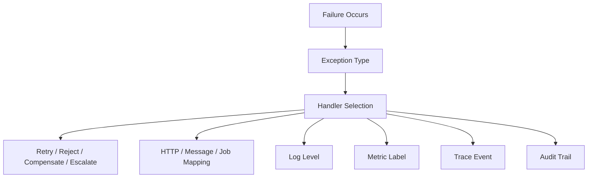
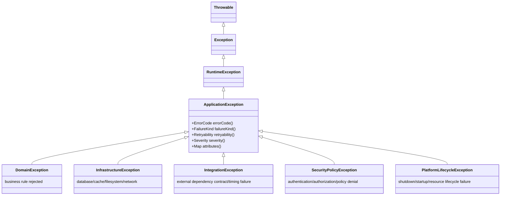

# Part 009 — Exception Hierarchy Design

Part sebelumnya membahas error code dan Problem Details sebagai kontrak eksternal. Part ini membahas representasi internalnya: **exception hierarchy**.

Banyak engineer tahu cara membuat custom exception:

```java
public class CaseNotFoundException extends RuntimeException {
    public CaseNotFoundException(String message) {
        super(message);
    }
}
```

Namun sistem production-grade membutuhkan lebih dari itu. Hierarchy exception harus membantu sistem menjawab pertanyaan operasional:

- Apakah failure ini domain rejection atau defect?
- Apakah aman untuk retry?
- Apakah perlu audit trail?
- Apakah boleh diekspos ke client?
- Apakah error ini harus menaikkan severity alert?
- Boundary mana yang boleh menangkapnya?
- Metadata apa yang harus dibawa agar log, metric, trace, dan support ticket bisa mengarah ke root cause?

Exception hierarchy yang buruk menyebabkan hal-hal seperti:

- semua error menjadi `RuntimeException`,
- handler melakukan `catch (Exception e)`,
- client menerima message internal,
- observability kehilangan klasifikasi,
- retry policy salah,
- audit tidak bisa membedakan rejection valid dengan system failure,
- perubahan domain mematahkan kontrak API.

Target part ini: membuat exception hierarchy yang **kecil, stabil, ekspresif, dan boundary-aware**.

---

## 1. Target Skill Berdasarkan Kaufman

Menurut pendekatan Josh Kaufman, kita tidak mulai dari daftar class. Kita mulai dari skill yang ingin bisa dilakukan.

Setelah part ini, Anda harus bisa:

1. Mendesain hierarchy exception untuk service Java yang besar tanpa class explosion.
2. Membedakan hierarchy untuk domain, application, infrastructure, integration, security, dan platform failure.
3. Menentukan kapan exception perlu membawa metadata, error code, retryability, severity, dan audit classification.
4. Menggunakan sealed hierarchy secara selektif untuk failure yang closed-set.
5. Menjaga agar exception tidak menjadi domain model palsu.
6. Mendesain boundary translation: internal exception masuk, public Problem Details keluar.
7. Menulis central handler yang tidak bergantung pada fragile string matching.
8. Menghindari anti-pattern: exception per skenario kecil, inheritance terlalu dalam, `BaseException` terlalu gemuk, dan catch-all policy.

Kaufman decomposition:

| Sub-skill | Tujuan Latihan |
|---|---|
| Failure grouping | Mengelompokkan exception berdasarkan keputusan sistem |
| Metadata design | Membawa context yang cukup tanpa membocorkan data |
| Boundary translation | Mengubah internal exception menjadi public contract |
| Recoverability modelling | Menandai retryable, non-retryable, conflict, rejected |
| Observability mapping | Membuat log/metric/trace konsisten |
| Hierarchy refactoring | Mengurangi class explosion dan catch ambiguity |

---

## 2. Mental Model: Exception Hierarchy adalah Routing Table untuk Failure

Exception hierarchy bukan sekadar pewarisan class. Dalam sistem besar, hierarchy adalah **routing table**:



Jika hierarchy tidak jelas, routing menjadi kacau. Contoh:

```java
throw new RuntimeException("Case already approved");
```

Secara domain, ini mungkin bukan system failure. Ini adalah **valid rejection** karena state transition tidak valid. Tetapi jika dilempar sebagai `RuntimeException` generik:

- API handler mungkin mengembalikan HTTP 500,
- alert production menyala,
- retry mechanism mencoba ulang,
- support melihatnya sebagai incident,
- audit trail kehilangan business reason,
- metrics mencatatnya sebagai server error.

Class exception harus membantu sistem mengambil keputusan yang benar.

---

## 3. Prinsip Utama Exception Hierarchy

Gunakan prinsip berikut sebelum membuat class baru.

### 3.1 Exception Type Harus Mewakili Keputusan Handling

Buat type baru hanya jika ada perbedaan handling yang nyata.

Buruk:

```java
class FirstNameTooShortException extends RuntimeException {}
class LastNameTooShortException extends RuntimeException {}
class AddressTooShortException extends RuntimeException {}
```

Lebih baik:

```java
public final class ValidationFailureException extends DomainException {
    private final List<FieldViolation> violations;

    public ValidationFailureException(List<FieldViolation> violations) {
        super(ErrorCode.VALIDATION_FAILED, "Validation failed");
        this.violations = List.copyOf(violations);
    }

    public List<FieldViolation> violations() {
        return violations;
    }
}
```

Kenapa? Karena semua field validation biasanya memiliki handling yang sama:

- HTTP 400,
- no retry,
- warning/info log,
- no incident alert,
- client bisa render field-specific message.

### 3.2 Message untuk Manusia, Code untuk Mesin

Jangan membuat handler bergantung pada message:

```java
if (e.getMessage().contains("already approved")) {
    // fragile
}
```

Gunakan code:

```java
if (e.errorCode() == ErrorCode.CASE_ALREADY_APPROVED) {
    // stable
}
```

Message boleh berubah. Error code adalah kontrak.

### 3.3 Cause Chain Harus Dipertahankan

Ketika wrap exception, jangan hilangkan cause:

```java
throw new ExternalServiceUnavailableException(
    ErrorCode.PAYMENT_GATEWAY_UNAVAILABLE,
    "Payment gateway unavailable",
    e
);
```

Hilangnya cause chain membuat debugging mahal. Java `Throwable` mendukung cause chain, stack trace, dan suppressed exceptions. Manfaatkan fitur itu sebagai evidence chain.

### 3.4 Jangan Semua Hal Menjadi Exception

Exception cocok untuk non-local control transfer dan failure yang mengganggu alur normal. Untuk outcome domain yang sering dan expected, result type kadang lebih baik. Ini akan dibahas di Part 010.

---

## 4. Layered Exception Taxonomy

Hierarchy yang sehat biasanya mengikuti layer keputusan, bukan struktur package teknis.



Model ini bukan template wajib. Ini adalah starting point untuk berpikir.

---

## 5. Base Exception: Berguna, tetapi Berbahaya Jika Terlalu Gemuk

Base exception membantu konsistensi. Tetapi base exception yang terlalu besar akan menjadi dumping ground.

Contoh base exception yang cukup:

```java
public abstract class ApplicationException extends RuntimeException {
    private final ErrorCode errorCode;
    private final FailureKind failureKind;
    private final Retryability retryability;
    private final Severity severity;
    private final Map<String, String> attributes;

    protected ApplicationException(
            ErrorCode errorCode,
            String message,
            FailureKind failureKind,
            Retryability retryability,
            Severity severity,
            Map<String, String> attributes,
            Throwable cause
    ) {
        super(message, cause);
        this.errorCode = Objects.requireNonNull(errorCode, "errorCode");
        this.failureKind = Objects.requireNonNull(failureKind, "failureKind");
        this.retryability = Objects.requireNonNull(retryability, "retryability");
        this.severity = Objects.requireNonNull(severity, "severity");
        this.attributes = Map.copyOf(attributes == null ? Map.of() : attributes);
    }

    public ErrorCode errorCode() {
        return errorCode;
    }

    public FailureKind failureKind() {
        return failureKind;
    }

    public Retryability retryability() {
        return retryability;
    }

    public Severity severity() {
        return severity;
    }

    public Map<String, String> attributes() {
        return attributes;
    }
}
```

Supporting enums:

```java
public enum FailureKind {
    DOMAIN_REJECTION,
    VALIDATION_REJECTION,
    CONFLICT,
    NOT_FOUND,
    AUTHENTICATION,
    AUTHORIZATION,
    DEPENDENCY,
    INFRASTRUCTURE,
    PLATFORM,
    PROGRAMMER_ERROR,
    UNKNOWN
}

public enum Retryability {
    NEVER,
    SAFE_AFTER_CHANGE,
    SAFE_AFTER_DELAY,
    SAFE_IF_IDEMPOTENT,
    UNKNOWN
}

public enum Severity {
    INFO,
    WARN,
    ERROR,
    CRITICAL
}
```

Perhatikan: metadata yang dimasukkan adalah metadata yang membantu policy, observability, dan mapping. Jangan masukkan semua hal.

Buruk:

```java
private final User user;
private final CaseEntity caseEntity;
private final HttpServletRequest request;
private final DataSource dataSource;
```

Exception bukan container graph object. Exception harus aman untuk logging, serialisasi terbatas, dan propagation antar boundary internal.

---

## 6. ErrorCode sebagai Stable Contract Internal

Error code sebaiknya bukan string random di setiap class.

```java
public enum ErrorCode {
    CASE_NOT_FOUND("CASE-QUERY-001"),
    CASE_ALREADY_CLOSED("CASE-STATE-001"),
    CASE_TRANSITION_NOT_ALLOWED("CASE-STATE-002"),
    VALIDATION_FAILED("COMMON-VALIDATION-001"),
    DEPENDENCY_TIMEOUT("COMMON-DEPENDENCY-001"),
    DATABASE_UNAVAILABLE("COMMON-INFRA-001");

    private final String value;

    ErrorCode(String value) {
        this.value = value;
    }

    public String value() {
        return value;
    }
}
```

Dalam platform besar, error registry bisa dibuat sebagai YAML/JSON dan di-generate menjadi enum. Tetapi untuk banyak service, enum sudah cukup.

Rule penting:

1. Error code tidak berubah setelah dirilis.
2. Error code tidak mengandung detail deployment.
3. Error code tidak mengandung data user.
4. Error code tidak mengandung class name internal.
5. Error code harus unik.
6. Error code harus bisa dipetakan ke public documentation.

---

## 7. Domain Exception Hierarchy

Domain exception merepresentasikan domain decision yang sah, bukan system failure.

```java
public abstract class DomainException extends ApplicationException {
    protected DomainException(
            ErrorCode errorCode,
            String message,
            FailureKind failureKind,
            Map<String, String> attributes
    ) {
        super(
            errorCode,
            message,
            failureKind,
            Retryability.NEVER,
            Severity.INFO,
            attributes,
            null
        );
    }
}
```

Contoh case management:

```java
public final class CaseTransitionNotAllowedException extends DomainException {
    public CaseTransitionNotAllowedException(
            String caseId,
            String currentState,
            String attemptedTransition
    ) {
        super(
            ErrorCode.CASE_TRANSITION_NOT_ALLOWED,
            "Case transition is not allowed",
            FailureKind.CONFLICT,
            Map.of(
                "caseId", caseId,
                "currentState", currentState,
                "attemptedTransition", attemptedTransition
            )
        );
    }
}
```

Kenapa ini lebih baik daripada `IllegalStateException`?

Karena `IllegalStateException` tidak menjelaskan apakah:

- state object rusak,
- caller salah menggunakan API,
- business transition ditolak,
- data corrupt,
- rule berubah,
- retry boleh dilakukan setelah state berubah.

Untuk domain state-machine, failure transition adalah domain signal yang perlu audit.

---

## 8. Validation Exception

Validation error biasanya perlu membawa banyak violation.

```java
public record FieldViolation(
    String field,
    String code,
    String message
) {}
```

```java
public final class ValidationFailureException extends DomainException {
    private final List<FieldViolation> violations;

    public ValidationFailureException(List<FieldViolation> violations) {
        super(
            ErrorCode.VALIDATION_FAILED,
            "Validation failed",
            FailureKind.VALIDATION_REJECTION,
            Map.of("violationCount", String.valueOf(violations.size()))
        );
        this.violations = List.copyOf(violations);
    }

    public List<FieldViolation> violations() {
        return violations;
    }
}
```

Prinsip:

- validation message untuk user boleh localized di presentation layer,
- internal error code tetap stable,
- field path jangan bocorkan struktur internal berbahaya,
- jangan log raw value yang mengandung PII/secrets,
- jangan jadikan setiap field violation sebagai exception terpisah.

---

## 9. Not Found: Domain atau Query Outcome?

`NotFoundException` sering dipakai sembarangan.

Ada beberapa makna berbeda:

| Situasi | Desain yang Lebih Baik |
|---|---|
| Query optional | Return `Optional<T>` atau empty page |
| Command but aggregate tidak ada | Domain/Application exception |
| Dependency mengembalikan 404 | Integration exception |
| Internal config missing | Platform/infrastructure exception |
| Unauthorized resource disamarkan sebagai 404 | Security boundary decision |

Contoh command boundary:

```java
public final class CaseNotFoundException extends DomainException {
    public CaseNotFoundException(String caseId) {
        super(
            ErrorCode.CASE_NOT_FOUND,
            "Case was not found",
            FailureKind.NOT_FOUND,
            Map.of("caseId", caseId)
        );
    }
}
```

Namun untuk query:

```java
public Optional<CaseView> findCase(String caseId) {
    return repository.findById(caseId).map(mapper::toView);
}
```

Jangan paksa exception untuk hasil query yang expected.

---

## 10. Infrastructure Exception

Infrastructure exception merepresentasikan failure pada resource yang Anda kontrol secara operasional: database, cache, filesystem, local queue, JVM resource, thread pool, atau internal network.

```java
public abstract class InfrastructureException extends ApplicationException {
    protected InfrastructureException(
            ErrorCode errorCode,
            String message,
            Retryability retryability,
            Severity severity,
            Map<String, String> attributes,
            Throwable cause
    ) {
        super(
            errorCode,
            message,
            FailureKind.INFRASTRUCTURE,
            retryability,
            severity,
            attributes,
            cause
        );
    }
}
```

Contoh:

```java
public final class CaseRepositoryUnavailableException extends InfrastructureException {
    public CaseRepositoryUnavailableException(Throwable cause) {
        super(
            ErrorCode.DATABASE_UNAVAILABLE,
            "Case repository is unavailable",
            Retryability.SAFE_AFTER_DELAY,
            Severity.ERROR,
            Map.of("component", "case-repository"),
            cause
        );
    }
}
```

Jangan bocorkan SQL, host internal, username database, atau connection string ke public response. Tetapi boleh masukkan component name yang aman ke log internal.

---

## 11. Integration Exception

Integration exception terjadi ketika service lain, partner API, message broker, payment gateway, identity provider, atau external policy engine gagal memenuhi kontrak.

Bedakan beberapa jenis:

| Failure | Makna | Retry? |
|---|---|---|
| Timeout | Tidak tahu outcome | Mungkin, jika idempotent |
| 5xx | Dependency gagal | Mungkin delayed retry |
| 4xx contract | Request kita salah atau rule berubah | Biasanya tidak |
| Invalid response | Contract mismatch | Tidak sampai diperbaiki |
| Rate limited | Kita terlalu cepat | Retry after delay |
| Circuit open | Kita sengaja menahan request | Later |

Contoh:

```java
public abstract class IntegrationException extends ApplicationException {
    protected IntegrationException(
            ErrorCode errorCode,
            String message,
            FailureKind failureKind,
            Retryability retryability,
            Severity severity,
            Map<String, String> attributes,
            Throwable cause
    ) {
        super(errorCode, message, failureKind, retryability, severity, attributes, cause);
    }
}
```

```java
public final class PolicyEngineTimeoutException extends IntegrationException {
    public PolicyEngineTimeoutException(String policyName, Throwable cause) {
        super(
            ErrorCode.DEPENDENCY_TIMEOUT,
            "Policy engine timed out",
            FailureKind.DEPENDENCY,
            Retryability.SAFE_IF_IDEMPOTENT,
            Severity.ERROR,
            Map.of(
                "dependency", "policy-engine",
                "policyName", policyName
            ),
            cause
        );
    }
}
```

Timeout adalah special case: outcome bisa unknown. Jangan otomatis mengasumsikan operasi tidak terjadi.

---

## 12. Security Policy Exception

Security failure harus dirancang hati-hati agar tidak bocor informasi.

```java
public abstract class SecurityPolicyException extends ApplicationException {
    protected SecurityPolicyException(
            ErrorCode errorCode,
            String message,
            FailureKind failureKind,
            Severity severity,
            Map<String, String> attributes,
            Throwable cause
    ) {
        super(
            errorCode,
            message,
            failureKind,
            Retryability.NEVER,
            severity,
            attributes,
            cause
        );
    }
}
```

Contoh:

```java
public final class CaseAccessDeniedException extends SecurityPolicyException {
    public CaseAccessDeniedException(String caseId, String actorId) {
        super(
            ErrorCode.CASE_ACCESS_DENIED,
            "Access denied",
            FailureKind.AUTHORIZATION,
            Severity.WARN,
            Map.of(
                "caseId", caseId,
                "actorId", actorId
            ),
            null
        );
    }
}
```

Public response mungkin hanya:

```json
{
  "type": "https://errors.example.com/access-denied",
  "title": "Access denied",
  "status": 403,
  "code": "SEC-AUTHZ-001"
}
```

Internal log boleh punya `caseId` dan `actorId` jika sesuai policy data handling. Jangan return detail seperti “user lacks ROLE_SUPERVISOR for unit X” jika itu membantu attacker.

---

## 13. Programmer Error vs Domain Rejection

Java sudah menyediakan exception untuk programmer error:

- `IllegalArgumentException`,
- `IllegalStateException`,
- `NullPointerException`,
- `UnsupportedOperationException`,
- `IndexOutOfBoundsException`.

Gunakan itu untuk bug atau misuse internal, bukan untuk domain rejection.

```java
public Case approve(CaseId caseId, Actor actor) {
    Objects.requireNonNull(caseId, "caseId");
    Objects.requireNonNull(actor, "actor");

    // domain decision below, not programmer error
}
```

Jika `caseId == null`, itu programmer error. Jika case sudah closed, itu domain rejection.

```java
if (caseRecord.isClosed()) {
    throw new CaseTransitionNotAllowedException(
        caseRecord.id().value(),
        caseRecord.status().name(),
        "APPROVE"
    );
}
```

Jangan gunakan `IllegalStateException("case closed")` untuk business state conflict jika conflict perlu dilihat client atau audit system.

---

## 14. Sealed Exception Hierarchy

Sealed classes/interfaces bisa membatasi siapa yang boleh extend/implement suatu hierarchy. Ini berguna ketika failure set memang closed-set dan Anda ingin compiler membantu menjaga coverage.

Contoh domain failure value yang sealed:

```java
public sealed interface CaseFailure
        permits CaseFailure.NotFound,
                CaseFailure.TransitionNotAllowed,
                CaseFailure.ValidationFailed {

    ErrorCode errorCode();

    record NotFound(String caseId) implements CaseFailure {
        @Override
        public ErrorCode errorCode() {
            return ErrorCode.CASE_NOT_FOUND;
        }
    }

    record TransitionNotAllowed(
        String caseId,
        String currentState,
        String attemptedTransition
    ) implements CaseFailure {
        @Override
        public ErrorCode errorCode() {
            return ErrorCode.CASE_TRANSITION_NOT_ALLOWED;
        }
    }

    record ValidationFailed(List<FieldViolation> violations) implements CaseFailure {
        @Override
        public ErrorCode errorCode() {
            return ErrorCode.VALIDATION_FAILED;
        }
    }
}
```

Sealed exception class:

```java
public abstract sealed class CaseException extends DomainException
        permits CaseNotFoundException,
                CaseTransitionNotAllowedException,
                CaseValidationException {

    protected CaseException(
            ErrorCode errorCode,
            String message,
            FailureKind failureKind,
            Map<String, String> attributes
    ) {
        super(errorCode, message, failureKind, attributes);
    }
}
```

Gunakan sealed jika:

- hierarchy ada dalam satu module/bounded context,
- daftar subtype memang dikontrol,
- Anda ingin exhaustiveness di mapper,
- Anda tidak membuat public extension API untuk pihak lain.

Jangan gunakan sealed jika:

- library ingin di-extend oleh user,
- plugin architecture membutuhkan subtype eksternal,
- daftar error memang open-ended,
- sealed hanya dipakai agar terlihat modern.

---

## 15. Mapping Hierarchy ke Problem Details

Central mapper harus melihat type dan metadata, bukan message string.

```java
public final class ProblemDetails {
    private final String type;
    private final String title;
    private final int status;
    private final String detail;
    private final String instance;
    private final String code;
    private final Map<String, Object> extensions;

    // constructor/getters omitted
}
```

Mapper:

```java
public final class ProblemMapper {

    public ProblemDetails toProblem(ApplicationException e, String instance) {
        return switch (e.failureKind()) {
            case VALIDATION_REJECTION -> problem(e, 400, "Validation failed", instance);
            case NOT_FOUND -> problem(e, 404, "Resource not found", instance);
            case CONFLICT -> problem(e, 409, "Conflict", instance);
            case AUTHENTICATION -> problem(e, 401, "Authentication required", instance);
            case AUTHORIZATION -> problem(e, 403, "Access denied", instance);
            case DEPENDENCY, INFRASTRUCTURE, PLATFORM, UNKNOWN ->
                problem(e, 503, "Service unavailable", instance);
            case PROGRAMMER_ERROR ->
                problem(e, 500, "Internal server error", instance);
            case DOMAIN_REJECTION ->
                problem(e, 422, "Request cannot be processed", instance);
        };
    }

    private ProblemDetails problem(
            ApplicationException e,
            int status,
            String title,
            String instance
    ) {
        return new ProblemDetails(
            "https://errors.example.com/" + e.errorCode().value(),
            title,
            status,
            safeDetail(e),
            instance,
            e.errorCode().value(),
            safeExtensions(e)
        );
    }

    private String safeDetail(ApplicationException e) {
        return switch (e.severity()) {
            case INFO, WARN -> e.getMessage();
            case ERROR, CRITICAL -> "The request could not be completed.";
        };
    }

    private Map<String, Object> safeExtensions(ApplicationException e) {
        // do not blindly expose internal attributes
        return Map.of(
            "retryable", e.retryability() != Retryability.NEVER,
            "failureKind", e.failureKind().name()
        );
    }
}
```

Notice: internal attributes tidak otomatis masuk response. Itu pilihan sadar.

---

## 16. Handler Policy: Where to Catch?

Catch terlalu dalam akan merusak flow. Catch terlalu luar akan kehilangan context.

Rule praktis:

| Lokasi | Boleh Catch? | Tujuan |
|---|---:|---|
| Domain method | Jarang | Biasanya throw domain failure atau return result |
| Application service | Kadang | Translate dependency failure, add use-case context |
| Repository/client adapter | Ya | Wrap technical exception ke infrastructure/integration exception |
| REST/message/job boundary | Ya | Convert to response/ack/retry/dead-letter |
| Generic utility | Hindari | Tidak punya context handling |

Contoh adapter boundary:

```java
public final class JdbcCaseRepository implements CaseRepository {
    @Override
    public CaseRecord getRequired(CaseId caseId) {
        try {
            return queryCase(caseId)
                .orElseThrow(() -> new CaseNotFoundException(caseId.value()));
        } catch (SQLException e) {
            throw new CaseRepositoryUnavailableException(e);
        }
    }
}
```

Application service boleh menambah context:

```java
public void approveCase(String caseId, Actor actor) {
    try {
        CaseRecord record = repository.getRequired(new CaseId(caseId));
        decisionService.approve(record, actor);
    } catch (InfrastructureException e) {
        throw new CaseApprovalUnavailableException(caseId, e);
    }
}
```

Tetapi jangan wrap membabi buta:

```java
catch (Exception e) {
    throw new RuntimeException("failed", e);
}
```

Itu menghancurkan classification.

---

## 17. Exception Attributes: Apa yang Layak Dibawa?

Atribut exception harus membantu debugging dan observability tanpa membuat security risk.

Atribut yang biasanya aman:

- `caseId`, jika bukan secret dan memang perlu audit,
- `tenantId`, jika sesuai policy,
- `component`,
- `dependency`,
- `operation`,
- `workflowState`,
- `transition`,
- `errorCode`,
- `retryability`,
- `correlationId` jika belum disediakan context propagation.

Atribut yang harus dihindari:

- password,
- token,
- authorization header,
- full request payload,
- bank account/full identity data,
- raw SQL dengan parameter sensitif,
- stack trace sebagai field response,
- object entity lengkap.

Gunakan whitelist, bukan blacklist.

```java
public interface SafeAttributeProvider {
    Map<String, String> safeAttributes();
}
```

```java
public final class AttributeSanitizer {
    private static final Set<String> ALLOWED = Set.of(
        "caseId", "tenantId", "component", "dependency", "operation",
        "currentState", "attemptedTransition", "violationCount"
    );

    public Map<String, String> sanitize(Map<String, String> attributes) {
        return attributes.entrySet().stream()
            .filter(entry -> ALLOWED.contains(entry.getKey()))
            .collect(Collectors.toUnmodifiableMap(Map.Entry::getKey, Map.Entry::getValue));
    }
}
```

---

## 18. Logging Policy dari Exception Hierarchy

Hierarchy harus mempermudah log level.

```java
public final class ExceptionLogger {
    private static final Logger log = LoggerFactory.getLogger(ExceptionLogger.class);

    public void log(ApplicationException e) {
        Map<String, String> attributes = e.attributes();

        switch (e.severity()) {
            case INFO -> log.info(
                "application_failure code={} kind={} retryability={} attributes={}",
                e.errorCode().value(), e.failureKind(), e.retryability(), attributes
            );
            case WARN -> log.warn(
                "application_failure code={} kind={} retryability={} attributes={}",
                e.errorCode().value(), e.failureKind(), e.retryability(), attributes
            );
            case ERROR, CRITICAL -> log.error(
                "application_failure code={} kind={} retryability={} attributes={}",
                e.errorCode().value(), e.failureKind(), e.retryability(), attributes, e
            );
        }
    }
}
```

Guideline:

- Domain rejection expected tidak perlu stack trace penuh pada level error.
- Infrastructure failure butuh stack trace dan cause.
- Security denial mungkin warn tanpa detail sensitif.
- Programmer error harus error dan biasanya alert-worthy.

Jangan log exception di setiap layer. Log di boundary atau saat informasi signifikan ditambahkan.

---

## 19. Metrics Policy dari Exception Hierarchy

Exception type bisa menjadi label metrics, tetapi hati-hati cardinality.

Buruk:

```text
errors_total{message="Case 123 already approved by user 456"}
```

Baik:

```text
application_failures_total{
  code="CASE-STATE-002",
  kind="CONFLICT",
  component="case-service"
}
```

Label yang aman:

- `error_code`,
- `failure_kind`,
- `component`,
- `dependency`,
- `operation`,
- `retryability`.

Label yang berbahaya:

- `caseId`,
- `userId`,
- `requestId`,
- raw message,
- exception message,
- stack trace,
- dynamic SQL.

Exception hierarchy yang baik membantu metric tetap low-cardinality.

---

## 20. Trace Policy dari Exception Hierarchy

Saat exception terjadi, trace span seharusnya menyimpan event yang cukup.

Pseudo-code:

```java
public void recordException(Span span, ApplicationException e) {
    span.recordException(e);
    span.setAttribute("error.code", e.errorCode().value());
    span.setAttribute("error.kind", e.failureKind().name());
    span.setAttribute("error.retryability", e.retryability().name());
    span.setAttribute("error.severity", e.severity().name());
}
```

Perhatikan perbedaan:

- log menjawab “apa yang terjadi dan evidence detail”,
- metric menjawab “berapa sering dan seberapa buruk”,
- trace menjawab “di mana dalam causal path”.

Exception hierarchy menjadi common vocabulary antar tiga sinyal.

---

## 21. Class Explosion Problem

Class explosion terjadi ketika setiap variasi business rule menjadi class sendiri.

```text
CaseAlreadyApprovedException
CaseAlreadyRejectedException
CaseAlreadyClosedException
CaseAlreadyEscalatedException
CaseAlreadyAssignedException
CaseAlreadyArchivedException
```

Kadang ini benar. Tetapi sering lebih baik:

```java
public final class CaseStateConflictException extends DomainException {
    public CaseStateConflictException(
            String caseId,
            String currentState,
            String attemptedAction,
            ErrorCode errorCode
    ) {
        super(
            errorCode,
            "Case state conflict",
            FailureKind.CONFLICT,
            Map.of(
                "caseId", caseId,
                "currentState", currentState,
                "attemptedAction", attemptedAction
            )
        );
    }
}
```

Gunakan class khusus jika:

- ada handling berbeda,
- metadata berbeda signifikan,
- code readability meningkat,
- error sering muncul di API/contract,
- audit membutuhkan reason yang eksplisit.

Gunakan class generik plus error code jika:

- handling sama,
- hanya reason berbeda,
- jumlah rule besar dan berubah sering,
- class baru hanya jadi noise.

---

## 22. Inheritance Depth Problem

Inheritance terlalu dalam membuat handler ambigu.

Buruk:

```text
Throwable
 └── RuntimeException
     └── BaseAppException
         └── BusinessException
             └── CaseException
                 └── CaseStateException
                     └── CaseApprovalException
                         └── CaseAlreadyApprovedException
```

Masalah:

- developer bingung catch di level mana,
- subtype membawa metadata yang sama,
- handler terlalu bergantung pada urutan catch,
- refactor menjadi sulit.

Lebih baik:

```text
ApplicationException
 ├── DomainException
 │   ├── ValidationFailureException
 │   ├── ResourceNotFoundException
 │   └── StateConflictException
 ├── InfrastructureException
 ├── IntegrationException
 └── SecurityPolicyException
```

Gunakan metadata untuk variasi yang tidak membutuhkan subtype.

---

## 23. Checked or Unchecked untuk Custom Hierarchy?

Dalam aplikasi enterprise modern, banyak tim memilih unchecked untuk domain/application exceptions karena:

- boundary handler menangani mapping,
- checked exception mudah bocor ke semua signature,
- banyak framework async/reactive sulit dengan checked exception,
- compile-time catch tidak otomatis berarti recovery benar.

Namun checked exception masih masuk akal untuk public library atau API yang benar-benar mewajibkan caller menangani kondisi recoverable.

Rule praktis:

| Context | Pilihan Umum |
|---|---|
| Internal service domain rejection | Unchecked + error code/result |
| Public library recoverable condition | Checked bisa masuk akal |
| Infrastructure adapter | Wrap ke unchecked application exception di boundary |
| Reflection/framework callback | Unchecked lebih praktis |
| Batch parser library | Checked atau result tergantung contract |

Yang penting bukan checked vs unchecked secara ideologis. Yang penting adalah caller contract dan boundary policy.

---

## 24. Exception Serialization dan API Leakage

Jangan pernah serialize exception langsung ke client.

Buruk:

```java
return ResponseEntity.status(500).body(exception);
```

Risiko:

- stack trace bocor,
- class name internal bocor,
- dependency version bocor,
- PII di message bocor,
- response shape tidak stabil,
- client coupling ke Java class.

Selalu map ke DTO response:

```java
public record ErrorResponse(
    String type,
    String title,
    int status,
    String code,
    String detail,
    String instance,
    Map<String, Object> extensions
) {}
```

Exception internal adalah implementation detail. Problem Details adalah public contract.

---

## 25. Testing Exception Hierarchy

Test hierarchy bukan hanya test throw.

### 25.1 Test Metadata

```java
@Test
void transitionConflictCarriesStableMetadata() {
    var ex = new CaseTransitionNotAllowedException("CASE-1", "CLOSED", "APPROVE");

    assertEquals(ErrorCode.CASE_TRANSITION_NOT_ALLOWED, ex.errorCode());
    assertEquals(FailureKind.CONFLICT, ex.failureKind());
    assertEquals(Retryability.NEVER, ex.retryability());
    assertEquals("CASE-1", ex.attributes().get("caseId"));
}
```

### 25.2 Test Cause Preservation

```java
@Test
void repositoryUnavailablePreservesCause() {
    SQLException cause = new SQLException("connection refused");

    var ex = new CaseRepositoryUnavailableException(cause);

    assertSame(cause, ex.getCause());
}
```

### 25.3 Test Problem Mapping

```java
@Test
void conflictMapsTo409() {
    var ex = new CaseTransitionNotAllowedException("CASE-1", "CLOSED", "APPROVE");

    var problem = mapper.toProblem(ex, "/cases/CASE-1/approval");

    assertEquals(409, problem.status());
    assertEquals("CASE-STATE-002", problem.code());
}
```

### 25.4 Test No Sensitive Attributes Exposed

```java
@Test
void internalAttributesAreNotAutomaticallyExposed() {
    var ex = new SomeInfrastructureException(
        Map.of("token", "secret", "component", "database"),
        new RuntimeException("boom")
    );

    var problem = mapper.toProblem(ex, "/cases");

    assertFalse(problem.extensions().containsKey("token"));
}
```

---

## 26. Refactoring Existing Messy Exceptions

Jika codebase sudah punya banyak exception, jangan rewrite total. Lakukan bertahap.

### Step 1 — Inventory

Buat daftar:

```text
Exception class | Layer | Code? | HTTP mapping | Retry? | Logged? | Public message? | Cause preserved?
```

### Step 2 — Group by Handling

Kelompokkan berdasarkan handling, bukan nama.

```text
400 validation
404 not found
409 conflict
422 domain rejection
429 rate limit
503 dependency/infrastructure
500 defect/unknown
```

### Step 3 — Introduce Base Metadata

Tambahkan interface dulu jika inheritance tidak bisa langsung diubah:

```java
public interface CodedFailure {
    ErrorCode errorCode();
    FailureKind failureKind();
    Retryability retryability();
}
```

### Step 4 — Update Central Handler

Central handler bisa mengenali `CodedFailure`.

```java
if (ex instanceof CodedFailure coded) {
    return problemMapper.toProblem(coded, requestPath);
}
```

### Step 5 — Deprecate Old Exceptions

```java
@Deprecated(forRemoval = false)
public class OldCaseClosedException extends RuntimeException {
    // keep compatibility temporarily
}
```

### Step 6 — Remove Message Matching

Ganti semua logic yang membaca `getMessage()`.

---

## 27. Production Checklist

Gunakan checklist ini saat review exception hierarchy:

- [ ] Setiap exception penting punya stable error code.
- [ ] Cause chain tidak hilang saat wrapping.
- [ ] Handler tidak bergantung pada message string.
- [ ] Domain rejection tidak diperlakukan sebagai 500.
- [ ] Infrastructure/dependency failure tidak diperlakukan sebagai validation error.
- [ ] Retryability eksplisit untuk failure yang mungkin di-retry.
- [ ] Metadata aman untuk log dan tidak otomatis diekspos ke client.
- [ ] Metrics menggunakan low-cardinality labels.
- [ ] Logs hanya mencetak stack trace saat berguna.
- [ ] Problem Details mapping dites.
- [ ] Security exception tidak membocorkan policy internal.
- [ ] Hierarchy tidak terlalu dalam.
- [ ] Class exception baru dibuat karena handling berbeda, bukan karena nama rule baru.

---

## 28. Common Anti-Patterns

### 28.1 Catch and Throw New Without Cause

```java
catch (SQLException e) {
    throw new RuntimeException("database failed");
}
```

Perbaikan:

```java
catch (SQLException e) {
    throw new CaseRepositoryUnavailableException(e);
}
```

### 28.2 BaseException dengan Semua Hal

```java
class BaseException extends RuntimeException {
    User user;
    HttpServletRequest request;
    EntityManager entityManager;
    Object payload;
}
```

Ini coupling, security risk, dan memory risk.

### 28.3 Exception Type Tidak Mempengaruhi Handling

Jika 30 exception semua dipetakan ke response dan policy yang sama, mungkin Anda butuh satu exception dengan error code berbeda.

### 28.4 Swallowing Domain Failure

```java
try {
    approve(caseId);
} catch (CaseTransitionNotAllowedException ignored) {
    // continue
}
```

Jika rejection adalah outcome penting, jadikan outcome eksplisit.

### 28.5 Throwing `Error`

Jangan membuat custom application failure extend `Error`. Di Java, `Error` digunakan untuk problem serius yang reasonable application biasanya tidak mencoba catch.

---

## 29. Mini Capstone: Desain Hierarchy untuk Case Enforcement Service

Requirement:

- Case bisa dibuat, assigned, escalated, approved, rejected, closed.
- Approval gagal jika case sudah closed.
- Assignment gagal jika actor tidak punya authorization.
- External policy engine bisa timeout.
- Database bisa unavailable.
- Validation bisa menghasilkan multiple field violation.
- API harus return Problem Details.
- Metrics harus membedakan domain rejection vs system failure.

Minimal hierarchy:

```text
ApplicationException
├── DomainException
│   ├── ValidationFailureException
│   ├── CaseNotFoundException
│   └── CaseStateConflictException
├── SecurityPolicyException
│   └── CaseAccessDeniedException
├── IntegrationException
│   └── PolicyEngineTimeoutException
└── InfrastructureException
    └── CaseRepositoryUnavailableException
```

Mapping:

| Exception | Failure Kind | HTTP | Retry | Severity | Metric Class |
|---|---|---:|---|---|---|
| `ValidationFailureException` | validation | 400 | no | info | client_error |
| `CaseNotFoundException` | not_found | 404 | no | info | client_error |
| `CaseStateConflictException` | conflict | 409 | no | info | domain_rejection |
| `CaseAccessDeniedException` | authorization | 403 | no | warn | security_denial |
| `PolicyEngineTimeoutException` | dependency | 503 | idempotent | error | dependency_error |
| `CaseRepositoryUnavailableException` | infrastructure | 503 | delayed | error | infrastructure_error |

---

## 30. Deliberate Practice

### Exercise 1 — Exception Inventory

Ambil satu service Java yang pernah Anda buat. Buat tabel:

```text
Class | Layer | Error Code | Retryability | Public Status | Log Level | Cause Preserved
```

Temukan minimal 5 exception yang sebenarnya punya handling sama.

### Exercise 2 — Refactor One Boundary

Pilih repository atau external client. Refactor agar:

- technical exception tidak bocor,
- cause preserved,
- error code stable,
- retryability eksplisit,
- metric label low-cardinality.

### Exercise 3 — Problem Mapping Test

Buat unit test untuk semua mapping exception utama ke Problem Details.

### Exercise 4 — Security Redaction

Tambahkan test yang membuktikan token, password, raw payload, atau stack trace tidak pernah masuk public response.

### Exercise 5 — Failure Drill

Simulasikan:

- domain conflict,
- validation failure,
- database down,
- dependency timeout,
- access denied.

Pastikan setiap failure menghasilkan:

- response yang benar,
- log yang cukup,
- metric yang benar,
- trace event yang berguna,
- tidak ada alert palsu untuk expected domain rejection.

---

## 31. Key Takeaways

1. Exception hierarchy adalah routing table untuk failure handling.
2. Class exception baru hanya layak jika ada handling, metadata, atau readability benefit yang nyata.
3. Error code adalah kontrak mesin; message adalah bantuan manusia.
4. Cause chain wajib dijaga.
5. Metadata exception harus aman, minimal, dan operasional.
6. Domain rejection bukan system failure.
7. Infrastructure dan dependency failure harus membawa retryability dan severity.
8. Public response harus melalui mapper, bukan serialize exception langsung.
9. Sealed hierarchy berguna untuk closed-set failure, tetapi tidak wajib.
10. Hierarchy yang baik membuat logs, metrics, traces, alerts, dan audit berbicara bahasa yang sama.

---

## 32. References

- Java SE 25 API — `Throwable`: https://docs.oracle.com/en/java/javase/25/docs/api/java.base/java/lang/Throwable.html
- Java SE 25 API — `Exception`: https://docs.oracle.com/en/java/javase/25/docs/api/java.base/java/lang/Exception.html
- Java SE 25 API — `RuntimeException`: https://docs.oracle.com/en/java/javase/25/docs/api/java.base/java/lang/RuntimeException.html
- Java SE 25 API — `Error`: https://docs.oracle.com/en/java/javase/25/docs/api/java.base/java/lang/Error.html
- Java Language Specification Java SE 25 — Chapter 11 Exceptions: https://docs.oracle.com/javase/specs/jls/se25/html/jls-11.html
- Oracle Java Language Guide — Sealed Classes and Interfaces: https://docs.oracle.com/en/java/javase/17/language/sealed-classes-and-interfaces.html
